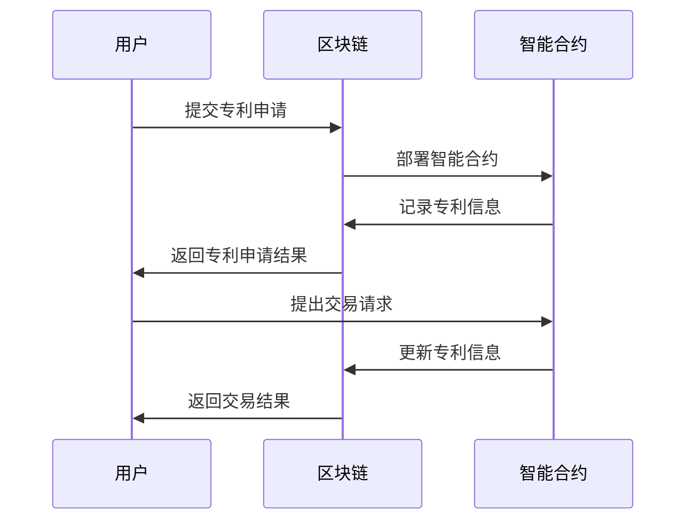
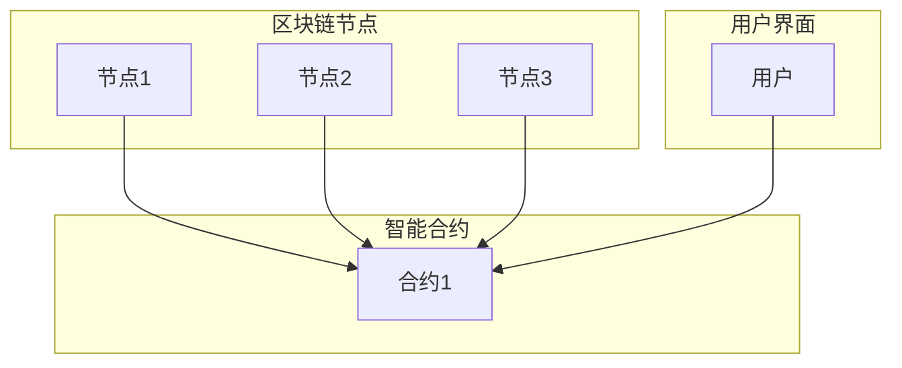

                 

### 第一部分：背景介绍

#### 1.1 问题背景

知识产权（Intellectual Property，简称IP）是知识经济时代的重要资产。随着科技和文化的迅猛发展，知识产权的保护和管理变得愈加复杂和关键。特别是在专利领域，传统的保护和管理方式已经难以满足快速变化的市场需求。

区块链技术的兴起为知识产权保护带来了一场革命。区块链的分布式账本、不可篡改性和透明性等特点，使得它成为简化专利申请和管理的重要工具。通过区块链技术，专利申请和管理流程将变得更加高效、透明和可信。

#### 1.2 问题描述

区块链在知识产权保护中的创新，主要体现在以下几个方面：

1. **简化专利申请流程**：利用区块链技术，专利申请的各个环节可以自动化处理，减少人为干预，提高效率。
2. **确保专利信息不可篡改**：区块链的分布式账本确保了专利信息的真实性和不可篡改性，有效防止专利抄袭和欺诈行为。
3. **提高专利管理透明度**：区块链技术的透明性使得专利管理的全过程可以公开查询，提高了管理透明度和公信力。
4. **降低专利交易成本**：区块链技术可以降低专利交易过程中的中介成本，提高交易效率。

#### 1.3 问题解决

本书将从以下几个方面解决上述问题：

1. **区块链基础**：介绍区块链的基本原理和核心技术，为后续讨论区块链在知识产权保护中的应用打下基础。
2. **专利申请流程简化**：详细分析区块链技术在专利申请过程中的应用，包括智能合约的使用、去中心化审核等。
3. **专利信息不可篡改**：探讨区块链如何确保专利信息的真实性和不可篡改性，包括数据加密、分布式存储等技术。
4. **专利管理透明度提升**：分析区块链如何提高专利管理的透明度，包括智能合约的执行记录、审计追踪等。
5. **专利交易成本降低**：讨论区块链技术在专利交易中的应用，包括去中心化交易平台、智能合约等。

#### 1.4 边界与外延

本书主要关注区块链在专利申请和管理中的应用，但区块链技术还可以应用于其他知识产权领域，如版权保护、商标管理等。此外，区块链技术的应用也不仅限于知识产权保护，还可以应用于金融、供应链管理等众多领域。

#### 1.5 概念结构与核心要素组成

1. **区块链**：分布式账本技术，通过密码学保证数据安全，实现去中心化管理和存储。
2. **智能合约**：自动执行合同条款的计算机程序，提高交易效率。
3. **专利**：受法律保护的发明创造，涉及技术、设计、创意等。
4. **知识产权保护**：通过法律、技术等手段，确保知识产权所有人的权益。

### 第二部分：核心概念与联系

#### 2.1 区块链技术原理

**2.1.1 工作原理**

区块链的工作原理包括数据的分布式存储、不可篡改性、共识机制等。具体来说：

- **分布式存储**：数据分布在多个节点上，每个节点都有完整的账本记录。
- **不可篡改性**：通过密码学技术确保数据一旦记录，就无法被篡改。
- **共识机制**：节点之间通过共识算法达成一致，确保账本记录的准确性和一致性。

**2.1.2 核心特点**

- **去中心化**：无需依赖中心化机构，提高系统的去中心化和容错性。
- **透明性**：所有数据公开透明，可以实时查看和验证。
- **安全性**：通过密码学技术保证数据的安全性和隐私性。

**2.1.3 与知识产权保护的关系**

区块链技术通过以下方式与知识产权保护相结合：

1. **分布式存储**：确保专利信息的安全性和隐私性，防止数据泄露。
2. **不可篡改性**：确保专利信息的真实性和完整性，防止数据篡改。
3. **透明性**：提高专利管理的透明度，让所有参与者都能看到专利信息。
4. **共识机制**：确保专利信息的准确性和一致性，防止欺诈行为。

#### 2.2 智能合约原理

**2.2.1 定义**

智能合约是一种自动执行合同条款的计算机程序，它基于区块链技术实现。

**2.2.2 工作原理**

- **编写**：开发者编写智能合约代码，并将其部署到区块链上。
- **执行**：当满足智能合约中的条件时，自动执行合同条款。

**2.2.3 核心特点**

- **自动执行**：无需人工干预，提高执行效率。
- **不可篡改**：一旦部署，无法被修改或篡改。
- **透明性**：智能合约的执行过程公开透明。

**2.2.4 与知识产权保护的关系**

智能合约在知识产权保护中的应用主要体现在以下几个方面：

1. **专利申请**：通过智能合约自动化处理专利申请流程，提高效率。
2. **专利交易**：通过智能合约自动化处理专利交易，降低交易成本。
3. **版权保护**：通过智能合约确保版权信息的真实性和不可篡改性。

#### 2.3 专利信息保护

**2.3.1 挑战**

- **数据篡改风险**：传统专利信息管理中，数据篡改是一个常见问题。
- **信息泄露风险**：专利信息作为商业秘密，存在泄露风险。
- **交易成本高**：传统专利交易需要依赖中介机构，成本较高。

**2.3.2 区块链解决方案**

- **数据不可篡改**：通过区块链技术，确保专利信息一旦记录，就无法被篡改。
- **信息加密**：对专利信息进行加密，提高数据安全性。
- **去中心化交易**：通过去中心化交易平台，降低专利交易成本。

### 第三部分：算法原理讲解

#### 3.1 智能合约设计

**3.1.1 Mermaid 流程图**



**3.1.2 Python 源代码**

```python
import json
from web3 import Web3

# 连接到区块链节点
w3 = Web3(Web3.HTTPProvider('https://mainnet.infura.io/v3/your_project_id'))

# 部署智能合约
contract_json = json.load(open('path_to_smart_contract.json'))
smart_contract = w3.eth.contract(JSON.parse(contract_json))
contract = smart_contract.deploy()

# 记录专利信息
def record_patent_info(paten_id, patent_info):
    contract.functions.recordPatentInfo(paten_id, patent_info).transact({'from': w3.eth.account})
    
# 更新专利信息
def update_patent_info(paten_id, new_patent_info):
    contract.functions.updatePatentInfo(paten_id, new_patent_info).transact({'from': w3.eth.account})

# 提出交易请求
def request_transaction(paten_id, transaction_info):
    contract.functions.requestTransaction(paten_id, transaction_info).transact({'from': w3.eth.account})
```

**3.1.3 算法原理**

- **分布式存储**：通过区块链技术，专利信息被分布式存储在多个节点上，确保数据的安全性和隐私性。
- **不可篡改**：专利信息一旦被记录在区块链上，就无法被篡改，确保了数据的真实性和完整性。
- **透明性**：所有专利信息都是公开透明的，任何用户都可以查询和验证。

### 第四部分：系统分析与架构设计

#### 4.1 问题场景介绍

在知识产权保护领域，存在以下问题：

1. **专利申请流程复杂**：传统专利申请流程涉及多个环节，耗费时间长，效率低下。
2. **专利信息易篡改**：专利信息在传输和存储过程中容易遭受篡改，影响数据的真实性和完整性。
3. **专利交易成本高**：传统专利交易需要依赖中介机构，交易成本高，效率低。

#### 4.2 项目介绍

本项目旨在通过区块链技术简化专利申请和管理流程，提高专利信息的真实性和完整性，降低专利交易成本。项目主要包括以下功能：

1. **专利申请**：用户可以通过区块链平台提交专利申请，智能合约自动化处理专利申请流程。
2. **专利查询**：用户可以查询已申请和已批准的专利信息，确保数据的透明性和可追溯性。
3. **专利交易**：用户可以通过区块链平台进行专利交易，智能合约自动化处理交易流程。

#### 4.3 系统功能设计（领域模型Mermaid类图）

```mermaid
classDiagram
    User <|-- Patent
    Application <|-- Patent
    SmartContract <|-- Application
    Blockchain <|-- Application
    
    User {name, email, address}
    Patent {patent_id, title, description, status}
    Application {application_id, patent_id, status, submitter, reviewer}
    SmartContract {contract_id, contract_address, contract_code}
    Blockchain {blockchain_id, nodes, chain_code}
```

#### 4.4 系统架构设计（Mermaid架构图）



#### 4.5 系统接口设计

- **专利申请接口**：用户可以通过该接口提交专利申请，接口参数包括专利信息、申请人信息等。
- **专利查询接口**：用户可以通过该接口查询专利信息，接口参数包括专利ID等。
- **专利交易接口**：用户可以通过该接口进行专利交易，接口参数包括专利ID、交易信息等。

#### 4.6 系统交互（Mermaid序列图）


### 第五部分：项目实战

#### 5.1 环境安装

1. 安装Node.js：从官方网站下载并安装Node.js。
2. 安装Truffle：在命令行中运行 `npm install -g truffle` 安装Truffle。
3. 安装Ganache：从官方网站下载并安装Ganache，作为本地区块链节点。

#### 5.2 系统核心实现

1. **智能合约**：编写智能合约代码，包括专利申请、专利查询和专利交易等逻辑。
2. **前端**：使用React或其他前端框架搭建用户界面，包括专利申请表单、专利查询结果和交易确认等。
3. **后端**：使用Web3.js与区块链节点通信，处理用户请求和智能合约交互。

#### 5.3 代码应用解读与分析

1. **智能合约代码解读**：
   - **专利申请**：用户提交专利申请，智能合约将专利信息存储在区块链上。
   - **专利查询**：用户查询专利信息，智能合约从区块链上检索专利信息并返回。
   - **专利交易**：用户提出交易请求，智能合约更新专利信息并返回交易结果。

2. **前端代码解读**：
   - **专利申请**：用户填写专利申请表单，提交后通过后端与智能合约交互，完成专利申请。
   - **专利查询**：用户输入专利ID，查询专利信息并显示在页面上。
   - **专利交易**：用户选择专利并提交交易请求，通过后端与智能合约交互，完成交易。

3. **后端代码解读**：
   - **请求处理**：接收用户请求，与区块链节点通信，调用智能合约函数，返回结果。
   - **数据存储**：将用户请求和智能合约返回结果存储在数据库中，便于后续查询和统计。

#### 5.4 实际案例分析

1. **专利申请**：用户提交专利申请后，智能合约将专利信息存储在区块链上，确保数据的真实性和不可篡改性。用户可以通过前端查询专利申请状态。
2. **专利查询**：用户输入专利ID，智能合约从区块链上检索专利信息并返回，确保查询结果的准确性和完整性。
3. **专利交易**：用户选择专利并提交交易请求，智能合约更新专利信息并返回交易结果，确保交易过程的透明性和可信性。

#### 5.5 项目小结

本项目通过区块链技术简化了专利申请和管理流程，提高了专利信息的真实性和完整性，降低了专利交易成本。用户可以方便地提交专利申请、查询专利信息和进行专利交易，大大提高了知识产权保护效率。未来，随着区块链技术的不断发展和完善，知识产权保护将变得更加高效、透明和可信。

### 第六部分：最佳实践 tips

1. **使用分层架构**：将系统分为前端、后端和区块链层，提高系统的可维护性和扩展性。
2. **安全第一**：在设计和实现区块链应用时，要充分考虑安全性问题，包括数据加密、访问控制等。
3. **性能优化**：针对区块链网络延迟和交易费用，进行性能优化，提高系统响应速度。
4. **用户体验**：关注用户体验，简化操作流程，提高系统易用性。

### 第七部分：小结

区块链技术在知识产权保护中的应用，为专利申请和管理带来了新的解决方案。通过简化流程、提高透明度和降低交易成本，区块链技术有效提升了知识产权保护的效率。未来，随着区块链技术的不断发展和完善，知识产权保护将变得更加高效、透明和可信。然而，区块链技术仍面临一些挑战，如安全性、性能优化等，需要继续研究和解决。

### 第八部分：注意事项

1. **数据隐私**：在区块链上存储专利信息时，要确保数据隐私，避免泄露敏感信息。
2. **法律合规**：在应用区块链技术时，要确保符合相关法律法规，遵守知识产权保护的规定。
3. **系统维护**：定期对区块链节点进行维护和升级，确保系统稳定运行。

### 第九部分：拓展阅读

1. **《区块链技术指南》**：了解区块链的基本原理和应用。
2. **《智能合约开发实战》**：学习智能合约的编写和实现。
3. **《知识产权法律教程》**：了解知识产权保护的相关法律法规。作者：AI天才研究院/AI Genius Institute & 禅与计算机程序设计艺术 /Zen And The Art of Computer Programming

