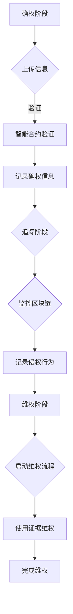
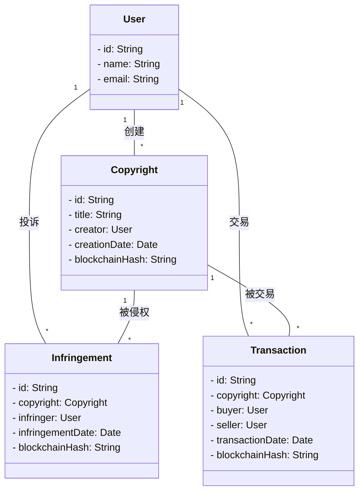
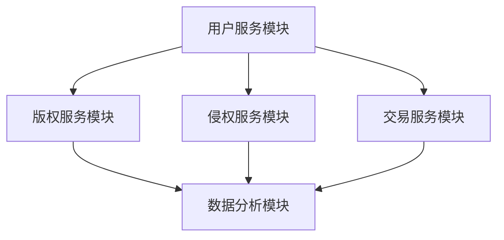
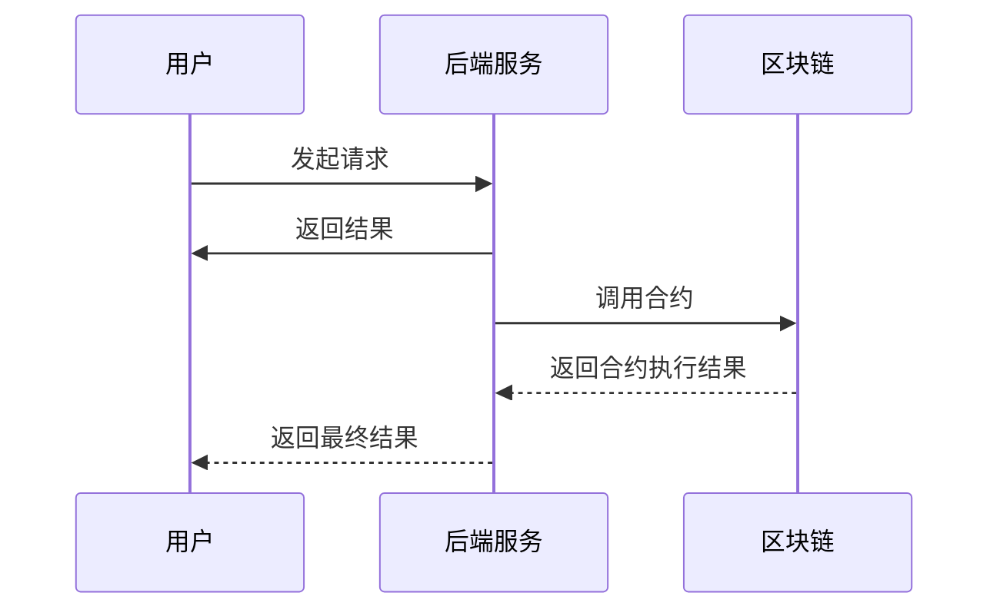

                 

### 文章标题：区块链在知识产权保护中的新型应用模式

#### 关键词：区块链、知识产权保护、新型应用模式、技术应用、挑战与解决方案

#### 摘要：
本文深入探讨了区块链技术在知识产权保护领域的创新应用模式。通过背景介绍、核心概念解析、算法原理讲解、系统分析与架构设计，以及项目实战，全面解析了区块链在知识产权保护中的重要作用和面临的挑战。文章旨在为读者提供一个清晰的框架，以了解区块链技术在知识产权保护中的最新发展，并展望未来发展趋势。

### 目录大纲

----------------------------------------------------------------

# 第一部分：背景介绍

## 第1章：问题背景与核心概念

## 第2章：区块链技术概述

## 第3章：知识产权保护的基本概念

## 第4章：区块链与知识产权保护的关系

----------------------------------------------------------------

# 第二部分：核心概念与联系

## 第5章：区块链核心概念原理

### 5.1 区块链的定义与特点

### 5.2 区块链的基本架构

### 5.3 区块链的核心技术

## 第6章：知识产权保护相关概念

### 6.1 知识产权保护的基本原则

### 6.2 知识产权保护的关键要素

### 6.3 知识产权保护的法律体系

## 第7章：区块链与知识产权保护的联系

### 7.1 区块链技术在知识产权保护中的应用

### 7.2 区块链在知识产权保护中的优势

### 7.3 区块链在知识产权保护中的挑战与解决方法

----------------------------------------------------------------

# 第三部分：算法原理讲解

## 第8章：区块链在知识产权保护中的应用算法

### 8.1 算法概述

### 8.2 算法流程图

### 8.3 算法原理与数学模型

### 8.4 Python源代码实现与详细讲解

## 第9章：算法分析与举例说明

### 9.1 算法性能分析

### 9.2 算法在实际应用中的案例分析

### 9.3 举例说明算法原理

----------------------------------------------------------------

# 第四部分：系统分析与架构设计方案

## 第10章：问题和项目介绍

### 10.1 问题场景介绍

### 10.2 项目介绍

## 第11章：系统功能设计与架构设计

### 11.1 领域模型设计

### 11.2 系统架构设计

### 11.3 系统接口设计

### 11.4 系统交互设计

## 第12章：系统分析与架构设计讲解

### 11.5 系统功能设计与架构设计的详细讲解

### 11.6 架构设计中的最佳实践

### 11.7 系统接口设计和交互设计的讲解

----------------------------------------------------------------

# 第五部分：项目实战

## 第13章：环境安装与配置

### 13.1 环境安装

### 13.2 配置说明

## 第14章：系统核心实现与代码解读

### 14.1 系统核心实现

### 14.2 代码解读与分析

## 第15章：实际案例分析与讲解

### 15.1 实际案例介绍

### 15.2 案例分析

### 15.3 案例讲解与剖析

## 第16章：项目小结与总结

### 16.1 项目成果总结

### 16.2 项目经验与启示

### 16.3 未来展望

----------------------------------------------------------------

# 第六部分：最佳实践与拓展阅读

## 第17章：最佳实践

### 17.1 区块链在知识产权保护中的最佳实践

### 17.2 算法优化与改进

### 17.3 系统性能优化

## 第18章：小结与注意事项

### 18.1 全书小结

### 18.2 注意事项

### 18.3 拓展阅读

## 第19章：未来展望

----------------------------------------------------------------

### 第1章：问题背景与核心概念

#### 1.1 背景介绍

在当今数字时代，知识产权保护面临前所未有的挑战。随着互联网的普及和数字内容的易传播性，盗版、抄袭等问题日益严重。传统的知识产权保护手段，如版权声明、法律诉讼等，虽然在一定程度上能够起到保护作用，但其成本高昂、效率低下，且难以实现实时监控和追踪。因此，寻找新的知识产权保护模式，特别是利用新兴技术如区块链，显得尤为重要。

区块链作为一种去中心化、不可篡改的分布式账本技术，具有极高的可信度和透明性。其核心理念在于数据的不可篡改性和去中心化，使得区块链在记录交易和存储数据方面具有显著优势。区块链技术在知识产权保护中的应用，为解决当前知识产权保护中的诸多痛点提供了新的思路和方法。

#### 1.2 核心概念

**知识产权**：知识产权是指人们创造的智力成果依法享有的权利，包括专利权、商标权、著作权、商业秘密等。

**区块链**：区块链是一种分布式账本技术，通过加密算法确保数据的不可篡改性，并通过去中心化的方式实现数据的安全存储和共享。

**知识产权保护**：知识产权保护是指通过法律、技术、管理等手段，保护知识产权权利人对其知识产权不受侵犯的过程。

#### 1.3 问题与解决方案

当前，知识产权保护面临的挑战主要包括：

1. **版权确认困难**：数字内容极易复制，使得版权确认成为一大难题。
2. **侵权行为追踪难**：传统的侵权行为追踪依赖于人工监控，效率低下。
3. **维权成本高**：法律诉讼周期长、成本高，导致权利人维权积极性下降。

区块链技术在知识产权保护中的应用，提供了以下解决方案：

1. **确权**：通过区块链技术，可以实现数字版权的快速、确权，降低确权成本。
2. **追踪**：利用区块链的分布式账本，实现侵权行为的实时追踪和监控。
3. **维权**：区块链上的数据不可篡改，为维权提供了可靠的证据支持，降低了维权成本。

#### 1.4 边界与外延

区块链在知识产权保护中的应用，虽然为解决当前问题提供了新的思路，但其应用边界和挑战也需要重视：

1. **技术成熟度**：区块链技术仍处于快速发展阶段，其稳定性和安全性需要进一步提升。
2. **法律规范**：区块链在知识产权保护中的应用需要相应的法律法规予以规范和引导。
3. **市场接受度**：区块链技术在知识产权保护中的应用需要市场的广泛接受和认可。

通过本文的深入探讨，读者将能够了解区块链在知识产权保护中的创新应用模式，掌握其核心原理和应用方法，并为未来的发展提供有益的启示。

#### 第2章：区块链技术概述

##### 2.1 区块链的定义与特点

区块链（Blockchain）是一种去中心化的分布式数据库技术，其最显著的特点是数据的不可篡改性和透明性。区块链由一系列按时间顺序排列的“区块”组成，每个区块包含了若干笔交易记录，这些记录通过加密算法和时间戳等手段，确保其不可篡改性。区块链的去中心化意味着它没有中心化的管理机构，所有的数据验证和存储都由网络中的多个节点共同完成，这使得区块链在安全性、可靠性和透明性方面具有显著优势。

##### 2.2 区块链的基本架构

区块链的基本架构主要包括以下几个关键组件：

1. **区块（Block）**：区块是区块链的基本单元，包含了若干笔交易记录，每个区块都有一个唯一的哈希值，用于链接前后区块。

2. **链（Chain）**：链是由多个按时间顺序排列的区块组成的数据结构，每个区块通过其哈希值与前一个区块链接，形成一条不可篡改的数据链。

3. **节点（Node）**：节点是指网络中的计算机，每个节点都存储了一份完整的区块链数据，并参与区块链的维护和验证。

4. **挖矿（Mining）**：挖矿是指节点通过解决复杂的数学难题来验证交易并添加新区块到区块链的过程，作为奖励，挖矿成功的节点可以获得一定数量的加密货币。

5. **智能合约（Smart Contract）**：智能合约是运行在区块链上的自执行合同，它通过代码定义了合约的条款和执行逻辑，当触发条件满足时，合约会自动执行。

##### 2.3 区块链的核心技术

区块链的核心技术主要包括加密算法、分布式存储和共识机制：

1. **加密算法**：区块链使用加密算法来确保数据的安全性和隐私性。常用的加密算法包括哈希算法（如SHA-256）、非对称加密算法（如RSA）和对称加密算法（如AES）。

2. **分布式存储**：区块链采用分布式存储方式，将数据分散存储在多个节点上，避免了单点故障和数据丢失的风险。

3. **共识机制**：共识机制是区块链网络中的节点达成一致的过程。常见的共识机制包括工作量证明（PoW）、权益证明（PoS）和拜占庭容错算法（PBFT）等。

##### 2.4 区块链的发展历程

区块链技术起源于2008年，由一个化名为中本聪（Satoshi Nakamoto）的人发表了比特币（Bitcoin）的白皮书，首次提出了区块链的概念。自那时以来，区块链技术经历了快速的发展和广泛应用：

1. **2010年代初期**：比特币的诞生标志着区块链技术的初步应用，随后出现了许多基于区块链的加密货币，如以太坊（Ethereum）、莱特币（Litecoin）等。

2. **2015年以后**：区块链技术开始从金融领域扩展到其他行业，如供应链管理、医疗健康、知识产权保护等。

3. **当前**：区块链技术已经成为一种重要的技术趋势，其应用场景不断丰富，成为数字经济的重要组成部分。

##### 2.5 区块链的应用领域

区块链技术具有广泛的应用领域，主要包括：

1. **金融领域**：区块链在金融领域的应用最为广泛，包括加密货币、智能合约、跨境支付等。

2. **供应链管理**：区块链可以用于记录和追踪供应链中的每一个环节，提高透明度和可追溯性。

3. **医疗健康**：区块链可以用于存储和共享医疗记录，提高数据的安全性和隐私性。

4. **知识产权保护**：区块链技术可以用于确权、追踪和保护知识产权，解决版权纠纷和侵权问题。

5. **物联网**：区块链可以用于物联网设备的数据管理和安全认证。

通过上述内容，读者可以了解到区块链技术的定义、基本架构、核心技术及其应用领域，为后续章节的深入探讨奠定了基础。

### 第3章：知识产权保护的基本概念

#### 3.1 知识产权保护的基本原则

知识产权保护的基本原则包括以下几个关键方面：

1. **知识产权法定原则**：知识产权是一种法律上的权利，其产生、变更、转移和保护都必须依据法律规定。

2. **知识产权独占性原则**：知识产权权利人对其知识产权享有独占的权利，未经许可，他人不得使用。

3. **知识产权公开性原则**：知识产权权利人在申请和保护过程中，必须公开其知识产权的内容和相关信息。

4. **知识产权时效性原则**：知识产权具有法定期限，超过保护期限后，知识产权将失去法律保护。

#### 3.2 知识产权保护的关键要素

知识产权保护的关键要素包括以下几方面：

1. **确权**：确权是指确认权利人的知识产权归属，确保知识产权的权利主体明确。

2. **维权**：维权是指权利人通过法律手段保护其知识产权不受侵犯，包括起诉侵权行为、申请禁令等。

3. **监控**：监控是指持续跟踪知识产权使用情况，及时发现侵权行为。

4. **维权证据**：维权证据是指用于证明侵权行为存在的证据，包括合同、邮件、公证文件等。

5. **合规性审查**：合规性审查是指对知识产权的使用是否符合相关法律法规的要求，以避免侵权风险。

#### 3.3 知识产权保护的法律体系

知识产权保护的法律体系主要包括以下内容：

1. **国际公约**：如《伯尔尼公约》、《世界知识产权组织公约》等，为知识产权的国际保护提供了法律基础。

2. **国家法律**：各国的知识产权法律，如《中华人民共和国著作权法》、《专利法》、《商标法》等，规定了知识产权的具体保护措施和法律责任。

3. **司法解释**：司法解释是对知识产权法律条款的具体应用和解释，如最高人民法院的知识产权案件司法解释等。

4. **国际司法协助**：国际司法协助是指通过国际合作，协调解决跨国知识产权纠纷。

#### 3.4 知识产权保护的发展历程

知识产权保护的发展历程可以分为以下几个阶段：

1. **初始阶段**：知识产权保护观念的提出和初步立法。

2. **发展阶段**：知识产权保护体系的逐步完善，法律制度的建立。

3. **国际化阶段**：知识产权保护的国际合作和协调，如世界知识产权组织（WIPO）的成立。

4. **数字时代**：随着互联网和数字技术的发展，知识产权保护面临新的挑战和机遇，如数字版权保护、在线维权等。

#### 3.5 知识产权保护的重要性

知识产权保护的重要性体现在以下几个方面：

1. **激励创新**：知识产权保护为创新提供了法律保障，激励企业和个人投入更多资源进行创新活动。

2. **促进经济发展**：知识产权是现代经济的重要组成部分，保护知识产权有助于提升国家经济竞争力。

3. **维护公平竞争**：知识产权保护有助于维护市场竞争秩序，防止不正当竞争行为。

4. **保护消费者权益**：知识产权保护确保消费者能够购买到正品、高质量的商品和服务。

通过以上内容，读者可以全面了解知识产权保护的基本原则、关键要素、法律体系和重要性，为深入探讨区块链在知识产权保护中的应用提供理论支持。

### 第4章：区块链与知识产权保护的关系

#### 4.1 区块链技术在知识产权保护中的应用

区块链技术为知识产权保护提供了全新的解决方案，主要应用于以下方面：

1. **确权**：区块链技术可以通过去中心化和不可篡改的特性，快速、确权知识产权，降低确权成本。权利人可以将数字作品的版权信息上链，确保其唯一性和不可篡改性。

2. **追踪**：区块链的分布式账本特性使得侵权行为可以实时追踪和监控。通过对区块链数据的实时分析和监控，可以快速发现和定位侵权行为，提高维权效率。

3. **维权**：区块链上的数据具有高度可信性，可以作为维权的重要证据。权利人可以利用区块链记录的完整交易历史，证明其知识产权的归属和合法性，从而有效应对侵权行为。

4. **确真**：区块链技术可以用于验证数字产品的真实性和来源，防止假冒伪劣产品流通。通过区块链上的唯一标识和防伪标签，消费者可以验证产品的真实性，从而保障自身权益。

5. **版权交易**：区块链技术为版权交易提供了便捷的渠道，权利人可以通过智能合约自动执行版权交易合同，确保交易过程的安全和透明。

#### 4.2 区块链在知识产权保护中的优势

区块链技术在知识产权保护中具有显著的优势，包括：

1. **不可篡改性**：区块链的数据一旦记录，就不可篡改，确保了知识产权的确权和数据的安全。

2. **去中心化**：区块链的去中心化特性，避免了单点故障和中心化管理的问题，提高了系统的可靠性和安全性。

3. **透明性**：区块链上的数据对所有节点开放，具有高度的透明性，便于各方监督和验证。

4. **高效性**：区块链技术可以实现快速、确权，降低了确权成本，提高了维权效率。

5. **低成本**：区块链技术降低了知识产权保护的运营成本，使得中小型企业和个人也能享受知识产权保护。

6. **全球性**：区块链技术具有全球性，便于跨国知识产权纠纷的处理和解决。

#### 4.3 区块链在知识产权保护中的挑战与解决方法

尽管区块链在知识产权保护中具有众多优势，但也面临一些挑战，主要包括：

1. **技术成熟度**：区块链技术尚处于快速发展阶段，其性能和稳定性需要进一步提升，以满足知识产权保护的高要求。

2. **法律规范**：区块链在知识产权保护中的应用需要相应的法律法规予以规范和引导。目前，全球范围内的法律体系尚不完善，需要逐步建立和完善。

3. **市场接受度**：区块链技术在知识产权保护中的应用需要市场的广泛接受和认可。目前，市场对区块链技术的认知度和接受度尚需提高。

4. **数据隐私保护**：区块链上的数据透明性可能引发隐私保护问题，需要采取措施确保数据安全和隐私。

解决上述挑战的方法包括：

1. **技术优化**：通过不断优化区块链技术，提高其性能和稳定性，以满足知识产权保护的需求。

2. **法律完善**：建立和完善区块链在知识产权保护方面的法律法规，提供明确的法律指引。

3. **市场推广**：通过市场推广和宣传教育，提高市场对区块链技术的认知度和接受度。

4. **隐私保护技术**：利用区块链上的隐私保护技术，如零知识证明、同态加密等，确保数据安全和隐私。

通过上述分析，读者可以全面了解区块链技术在知识产权保护中的应用、优势和面临的挑战，为后续章节的深入探讨提供理论基础。

### 第5章：区块链核心概念原理

#### 5.1 区块链的定义与特点

区块链（Blockchain）是一种去中心化的分布式数据库技术，其最显著的特点是数据的不可篡改性和透明性。区块链由一系列按时间顺序排列的“区块”组成，每个区块包含了若干笔交易记录，这些记录通过加密算法和时间戳等手段，确保其不可篡改性。区块链的去中心化意味着它没有中心化的管理机构，所有的数据验证和存储都由网络中的多个节点共同完成，这使得区块链在安全性、可靠性和透明性方面具有显著优势。

区块链的核心特点包括：

1. **去中心化**：区块链通过分布式网络实现数据的存储和管理，避免了单点故障和中心化管理的问题，提高了系统的可靠性和安全性。

2. **数据不可篡改**：区块链上的数据一旦记录，就不可篡改，确保了数据的真实性和完整性。

3. **透明性**：区块链上的数据对所有节点开放，具有高度的透明性，便于各方监督和验证。

4. **安全性**：区块链使用加密算法保护数据的安全，防止数据被非法篡改和访问。

5. **智能合约**：区块链支持智能合约，智能合约是运行在区块链上的自执行合同，通过代码定义了合约的条款和执行逻辑，当触发条件满足时，合约会自动执行。

#### 5.2 区块链的基本架构

区块链的基本架构主要包括以下几个关键组件：

1. **区块（Block）**：区块是区块链的基本单元，包含了若干笔交易记录，每个区块都有一个唯一的哈希值，用于链接前后区块。

2. **链（Chain）**：链是由多个按时间顺序排列的区块组成的数据结构，每个区块通过其哈希值与前一个区块链接，形成一条不可篡改的数据链。

3. **节点（Node）**：节点是指网络中的计算机，每个节点都存储了一份完整的区块链数据，并参与区块链的维护和验证。

4. **挖矿（Mining）**：挖矿是指节点通过解决复杂的数学难题来验证交易并添加新区块到区块链的过程，作为奖励，挖矿成功的节点可以获得一定数量的加密货币。

5. **智能合约（Smart Contract）**：智能合约是运行在区块链上的自执行合同，它通过代码定义了合约的条款和执行逻辑，当触发条件满足时，合约会自动执行。

#### 5.3 区块链的核心技术

区块链的核心技术主要包括加密算法、分布式存储和共识机制：

1. **加密算法**：区块链使用加密算法来确保数据的安全性和隐私性。常用的加密算法包括哈希算法（如SHA-256）、非对称加密算法（如RSA）和对称加密算法（如AES）。

2. **分布式存储**：区块链采用分布式存储方式，将数据分散存储在多个节点上，避免了单点故障和数据丢失的风险。

3. **共识机制**：共识机制是区块链网络中的节点达成一致的过程。常见的共识机制包括工作量证明（PoW）、权益证明（PoS）和拜占庭容错算法（PBFT）等。

通过本章的深入探讨，读者可以全面了解区块链的定义、基本架构和核心技术，为后续章节的深入探讨提供理论基础。

### 5.4 区块链核心技术对比分析

为了更全面地理解区块链的核心技术，我们需要对加密算法、分布式存储和共识机制这三个关键组成部分进行详细对比分析。

#### 5.4.1 加密算法

加密算法是区块链技术中用于保护数据安全的核心技术之一。以下是几种常用的加密算法及其特点：

1. **哈希算法**：哈希算法用于生成数据的指纹，最常见的哈希算法包括SHA-256、SHA-3等。哈希算法具有以下几个特点：
   - **不可逆性**：将输入数据映射到一个固定长度的输出值，无法从输出值反推原始数据。
   - **唯一性**：对于相同的输入数据，生成的哈希值是唯一的，不会产生碰撞。
   - **快速计算**：哈希算法的计算过程非常高效，可以快速处理大量数据。

2. **非对称加密算法**：非对称加密算法使用一对密钥（公钥和私钥）进行加密和解密，常见的非对称加密算法包括RSA、ECC等。非对称加密算法的特点如下：
   - **安全性**：公钥可以公开，私钥必须保密，确保了数据的安全。
   - **加密与解密分离**：加密和解密过程使用不同的密钥，提高了系统的安全性。

3. **对称加密算法**：对称加密算法使用相同的密钥进行加密和解密，常见的对称加密算法包括AES、DES等。对称加密算法的特点如下：
   - **高效性**：对称加密算法的计算速度较快，适合处理大量数据。
   - **密钥管理**：对称加密算法需要管理密钥的安全，确保密钥不被泄露。

#### 5.4.2 分布式存储

分布式存储是区块链技术中用于存储和管理数据的重要手段。以下是几种常见的分布式存储技术及其特点：

1. **P2P网络**：点对点（P2P）网络是一种分布式网络架构，节点之间可以直接进行数据交换。P2P网络的特点如下：
   - **去中心化**：P2P网络没有中心化的节点，所有节点都是平等的，提高了系统的可靠性和容错性。
   - **负载均衡**：P2P网络可以实现数据负载均衡，减少了单点故障的风险。
   - **高效性**：P2P网络通过多节点协作，提高了数据的读写速度。

2. **分布式文件系统**：分布式文件系统是一种将文件分散存储在多个服务器上的技术，常见的分布式文件系统包括HDFS、Cassandra等。分布式文件系统的特点如下：
   - **高可用性**：分布式文件系统可以通过冗余存储和数据复制，提高系统的可用性。
   - **可扩展性**：分布式文件系统可以动态扩展存储容量，适应大数据的需求。
   - **高可靠性**：分布式文件系统通过数据备份和校验，确保数据的安全和可靠性。

3. **区块链存储**：区块链存储利用区块链技术的特点，实现数据的分布式存储和管理。区块链存储的特点如下：
   - **不可篡改性**：区块链上的数据一旦记录，就不可篡改，确保了数据的真实性和完整性。
   - **透明性**：区块链上的数据对所有节点开放，具有高度的透明性，便于各方监督和验证。
   - **安全性**：区块链存储使用加密算法保护数据的安全，防止数据被非法篡改和访问。

#### 5.4.3 共识机制

共识机制是区块链网络中的节点达成一致的过程。以下是几种常见的共识机制及其特点：

1. **工作量证明（PoW）**：工作量证明是一种通过计算复杂度来选择区块生成者的机制，常见的PoW算法包括SHA-256、Ethash等。PoW机制的特点如下：
   - **安全性**：PoW机制通过计算复杂度确保了区块链的安全性和不可篡改性。
   - **去中心化**：PoW机制不依赖中心化的节点，所有节点都有机会参与区块的生成。
   - **资源消耗**：PoW机制需要大量的计算资源，可能导致能源消耗较高。

2. **权益证明（PoS）**：权益证明是一种根据节点持有的代币数量来选择区块生成者的机制，常见的PoS算法包括POS、DPoS等。PoS机制的特点如下：
   - **安全性**：PoS机制通过持有代币的数量来保证区块链的安全，减少了资源消耗。
   - **去中心化**：PoS机制通过代币持有者参与共识，提高了区块链的去中心化程度。
   - **效率**：PoS机制相对于PoW机制，计算复杂度较低，提高了区块链的共识效率。

3. **拜占庭容错算法（PBFT）**：拜占庭容错算法是一种在分布式系统中实现一致性的算法，适用于高度去中心化的区块链网络。PBFT机制的特点如下：
   - **一致性**：PBFT机制通过多节点协作，确保区块链的一致性和安全性。
   - **高效性**：PBFT机制无需计算复杂度，提高了区块链的共识效率。
   - **容错性**：PBFT机制可以在网络中某些节点发生故障的情况下，继续正常运行。

通过上述对比分析，读者可以全面了解区块链核心技术的特点和应用场景，为后续章节的深入探讨提供理论基础。

### 5.5 知识产权保护相关概念

为了更好地理解区块链在知识产权保护中的应用，我们需要深入探讨与知识产权保护相关的一些重要概念，包括知识产权、版权、商标、专利等。

#### 5.5.1 知识产权

知识产权是指人们创造的智力成果依法享有的权利。它涵盖了专利、商标、著作权、商业秘密等多种形式。知识产权的基本特点包括：

1. **无形性**：知识产权所保护的是智力成果，这些成果本身是无形的，如设计、发明、作品等。

2. **独占性**：知识产权赋予权利人独占使用、许可他人使用或转让其智力成果的权利，他人未经许可不得使用。

3. **法定性**：知识产权是一种法律上的权利，其产生、变更和转移都依据法律规定。

4. **时效性**：大多数知识产权都有一定的保护期限，超过保护期限后，知识产权将失效。

#### 5.5.2 版权

版权是知识产权的一个重要组成部分，主要涉及文学、艺术和科学作品的创作权利。版权的基本概念包括：

1. **著作权人**：著作权人是指作品的创作者，通常是作者。

2. **版权内容**：版权包括著作人身权和著作财产权，人身权包括发表权、署名权、修改权等，财产权包括复制权、发行权、出租权等。

3. **版权保护期限**：版权保护期限因国家而异，通常为作者终身及其死后50年。

4. **版权登记**：版权登记是权利人将作品及其版权信息进行登记备案，以保护其权益的重要步骤。

#### 5.5.3 商标

商标是一种用于区分不同商品或服务的标志，通常由文字、图形、字母、数字等组成。商标的基本概念包括：

1. **商标权**：商标权是指商标注册人对其注册商标的独占使用权。

2. **商标分类**：商标根据其使用的商品或服务不同，分为不同的类别，如商品商标和服务商标。

3. **商标保护期限**：商标的保护期限通常为10年，可以无限次续展。

4. **商标注册**：商标注册是商标权取得的重要步骤，通过国家商标局的审核和注册，商标权人可以获得法律保护。

#### 5.5.4 专利

专利是知识产权的一种形式，主要涉及发明、实用新型和外观设计。专利的基本概念包括：

1. **专利权**：专利权是指专利权人对其发明享有的独占实施权。

2. **专利类型**：专利分为发明专利、实用新型专利和外观设计专利，不同类型的专利保护期限和审查程序有所不同。

3. **专利保护期限**：发明专利的保护期限通常为20年，实用新型专利和外观设计专利的保护期限通常为10年。

4. **专利申请**：专利申请是专利权取得的关键步骤，需要提交发明创造的技术方案和详细说明，通过国家知识产权局的审查和批准。

通过以上对知识产权、版权、商标和专利的详细分析，读者可以更好地理解这些概念在知识产权保护中的作用和重要性，为区块链在知识产权保护中的应用提供理论基础。

### 5.6 区块链与知识产权保护的关系

区块链技术在知识产权保护中具有重要的应用价值，其与知识产权的关系可以从以下几个方面进行探讨：

1. **确权**：区块链技术可以通过去中心化和不可篡改的特性，快速、确权知识产权。权利人可以将数字作品的版权信息上链，确保其唯一性和不可篡改性。这样，当发生版权纠纷时，区块链上的记录可以作为有效的证据，证明权利人对该作品的版权归属。

2. **确真**：区块链技术可以用于验证数字产品的真实性和来源，防止假冒伪劣产品流通。通过区块链上的唯一标识和防伪标签，消费者可以验证产品的真实性，从而保障自身权益。此外，区块链技术还可以记录产品的整个供应链信息，确保每个环节的数据真实可靠。

3. **追踪**：区块链的分布式账本特性使得侵权行为可以实时追踪和监控。通过对区块链数据的实时分析和监控，可以快速发现和定位侵权行为，提高维权效率。例如，版权方可以实时监控其作品的传播和使用情况，一旦发现侵权行为，可以迅速采取措施制止。

4. **维权**：区块链上的数据具有高度可信性，可以作为维权的重要证据。权利人可以利用区块链记录的完整交易历史，证明其知识产权的归属和合法性，从而有效应对侵权行为。此外，区块链技术还可以实现智能合约，自动化执行维权过程中的相关合同和协议，提高维权效率。

5. **版权交易**：区块链技术为版权交易提供了便捷的渠道。通过智能合约，权利人可以直接与买家进行版权交易，确保交易过程的安全和透明。例如，音乐家可以通过区块链平台直接与粉丝进行数字专辑的销售，省去了传统的发行渠道，提高了收益。

6. **透明性**：区块链技术的透明性使得知识产权的保护过程更加公开和透明。所有参与方都可以查看和验证区块链上的数据，确保知识产权的确权、追踪、维权和交易过程公开、公正。这有助于建立信任，降低纠纷发生的可能性。

通过上述分析，可以看出区块链技术在知识产权保护中具有广泛的应用前景，其与知识产权的关系不仅体现在确权、确真、追踪和维权等方面，还推动了知识产权交易模式的创新和发展。然而，区块链技术在实际应用中也面临一些挑战，如技术成熟度、法律规范、市场接受度等，需要不断探索和改进。

### 7.1 区块链技术在知识产权保护中的应用

区块链技术以其去中心化、不可篡改和透明性等特性，在知识产权保护领域展现出巨大的潜力，具体应用包括：

#### 7.1.1 确权

区块链技术可以用来确权，即确认知识产权的归属。通过将知识产权信息上链，权利人可以确保其知识产权的不可篡改性。例如，版权方可以将作品的哈希值和相关信息上链，这样一旦该作品被侵权，权利人可以利用区块链上的记录作为证据，证明其知识产权的归属。

#### 7.1.2 追踪

区块链技术的分布式账本特性使得侵权行为能够被实时追踪。通过监控区块链上的数据，权利人和执法机构可以快速发现和定位侵权内容。例如，在版权领域，版权方可以实时跟踪其作品的传播情况，一旦发现侵权，可以立即采取措施。

#### 7.1.3 维权

区块链上的数据具有高度的透明性和可信性，可以作为维权的重要证据。权利人可以利用区块链记录的交易历史来证明其知识产权的合法性，从而有效应对侵权行为。此外，智能合约可以自动化执行维权过程中的相关合同和协议，提高维权效率。

#### 7.1.4 确真

区块链技术可以用来验证数字产品的真实性和来源，防止假冒伪劣产品的流通。例如，通过在区块链上记录产品的生产、运输和销售环节的信息，消费者可以验证产品的真实性，确保其购买到正品。

#### 7.1.5 版权交易

区块链技术为版权交易提供了便捷的渠道。通过智能合约，权利人可以直接与买家进行版权交易，省去了传统的中介机构，降低了交易成本。例如，艺术家可以将作品的版权信息上链，买家可以直接购买并拥有该作品的使用权。

#### 7.1.6 数据共享与开放

区块链技术可以实现知识产权数据的共享与开放，有助于提高整个行业的透明度和效率。例如，版权数据库可以通过区块链技术实现全球共享，权利人和创作者可以便捷地获取和交换版权信息，从而简化版权管理流程。

#### 7.1.7 防止重复授权

区块链技术可以用来防止知识产权的重复授权。通过在区块链上记录授权信息，权利人可以确保其知识产权的授权不会被重复使用，从而避免授权纠纷。

#### 7.1.8 知识产权交易记录管理

区块链技术可以用来管理知识产权交易记录，确保交易过程的透明和可追溯性。通过智能合约，交易各方可以自动执行交易协议，确保交易的安全和合规。

总之，区块链技术在知识产权保护中的应用，不仅提高了确权、追踪、维权和确真的效率，还为版权交易和数据共享提供了新的模式。通过这些应用，区块链技术为知识产权保护带来了革命性的变革。

### 7.2 区块链在知识产权保护中的优势

区块链技术以其独特的技术特性在知识产权保护中展现出显著的优势，主要体现在以下几个方面：

#### 7.2.1 不可篡改性

区块链技术通过加密算法和分布式存储，确保了数据的不可篡改性。在知识产权保护中，这意味着权利人一旦将版权信息、交易记录或其他知识产权相关数据上链，这些信息将永久记录在区块链上，无法被篡改或删除。这种不可篡改的特性为知识产权的确认和维权提供了强有力的保障，使侵权行为难以逃避法律制裁。

#### 7.2.2 去中心化

区块链的去中心化特性使其免受单一中心化机构的控制，每个参与节点都拥有完整的数据副本，任何一方都无法单独操纵数据。在知识产权保护中，去中心化保证了数据的透明性和公平性，使得权利人和公众都能够访问和验证知识产权信息。这有助于减少中心化机构在知识产权保护中的垄断行为，提高了整个系统的信任度和效率。

#### 7.2.3 透明性

区块链上的数据对所有节点开放，具有高度的透明性。这意味着知识产权的注册、交易、使用等全过程都可以被记录和跟踪，任何参与者都可以查看和验证相关数据。这种透明性不仅有助于提高知识产权管理的效率和公正性，还能有效防止侵权行为的发生，为维权提供清晰、可信的证据。

#### 7.2.4 安全性

区块链技术使用加密算法对数据进行保护，确保数据在传输和存储过程中的安全性。在知识产权保护中，这意味着知识产权信息在区块链上的存储和传输过程都是安全的，即使数据被恶意篡改，也可以通过加密算法检测出来。此外，区块链的分布式存储方式也提高了系统的抗攻击能力，降低了数据泄露和丢失的风险。

#### 7.2.5 高效性

区块链技术能够实现快速、确权，降低了确权成本。权利人可以通过将知识产权信息上链，快速完成版权的确认。同时，区块链上的智能合约可以自动化执行维权过程中的相关合同和协议，提高了维权效率。这种高效性使得知识产权保护变得更加简便和快捷，有助于降低权利人的维权成本。

#### 7.2.6 全球性

区块链技术具有全球性，使得跨国知识产权纠纷的处理和解决变得更加便捷。由于区块链上的数据对所有节点开放，权利人和执法机构可以跨国访问和验证知识产权信息，从而快速发现和解决侵权行为。此外，区块链上的智能合约还可以实现跨境知识产权交易，简化了交易流程，降低了跨国交易的成本。

#### 7.2.7 低成本

区块链技术降低了知识产权保护的运营成本。通过去中心化的方式，权利人无需依赖中心化的机构进行知识产权管理，从而减少了运营成本。此外，区块链上的智能合约可以实现自动化执行，减少了人力和时间的投入。这种低成本的优势使得中小型企业和个人也能够享受知识产权保护。

总之，区块链技术在知识产权保护中的优势不仅体现在其不可篡改性、去中心化、透明性、安全性、高效性、全球性和低成本等方面，还为知识产权管理带来了革命性的变革。通过这些优势，区块链技术为解决当前知识产权保护中的诸多痛点提供了新的思路和方法。

### 7.3 区块链在知识产权保护中的挑战与解决方法

尽管区块链技术在知识产权保护中展现出了众多优势，但在实际应用过程中也面临一些挑战。以下为区块链在知识产权保护中的主要挑战及其解决方法：

#### 7.3.1 技术成熟度不足

区块链技术仍处于快速发展阶段，其性能和稳定性需要进一步提升。尤其是在处理大规模数据和复杂交易时，区块链系统可能存在延迟和吞吐量不足的问题。解决这一挑战的方法包括：

1. **技术优化**：通过持续优化区块链算法和架构，提高其性能和稳定性。例如，可以采用分片技术（Sharding）来提高区块链的并发处理能力。

2. **分布式存储**：利用分布式存储技术，将数据分散存储在多个节点上，以提高系统的可靠性和性能。

3. **跨链技术**：通过跨链技术实现不同区块链之间的数据交互和协同工作，从而提高整体系统的效率。

#### 7.3.2 法律法规缺失

区块链在知识产权保护中的应用需要相应的法律法规予以规范和引导。目前，全球范围内的法律法规尚不完善，存在法律空白和监管漏洞。解决这一挑战的方法包括：

1. **立法完善**：各国应加快制定和完善与区块链技术相关的知识产权保护法律法规，提供明确的法律指引。

2. **国际协作**：加强国际间的法律合作，共同制定全球统一的区块链知识产权保护标准和规范。

3. **法律培训**：提高法律从业者和公众对区块链技术的认知，加强区块链在知识产权保护方面的法律培训。

#### 7.3.3 市场接受度低

区块链技术在知识产权保护中的应用需要市场的广泛接受和认可。目前，市场对区块链技术的认知度和接受度尚需提高，特别是在中小型企业和个人用户中。解决这一挑战的方法包括：

1. **市场推广**：通过宣传活动、研讨会、培训课程等方式，提高市场对区块链技术的认知度和接受度。

2. **示范应用**：通过成功案例的示范应用，展示区块链在知识产权保护中的实际效果，增强市场信心。

3. **用户友好**：开发易于使用和操作的区块链平台和工具，降低使用门槛，吸引更多用户参与。

#### 7.3.4 数据隐私保护

区块链上的数据透明性可能引发隐私保护问题。尤其是在涉及个人隐私和商业秘密的情况下，如何保护数据隐私成为一个挑战。解决这一挑战的方法包括：

1. **隐私保护技术**：利用区块链上的隐私保护技术，如零知识证明（Zero-Knowledge Proof）、同态加密（Homomorphic Encryption）等，确保数据的安全和隐私。

2. **匿名化处理**：对涉及个人隐私和商业秘密的数据进行匿名化处理，确保数据在区块链上的存储和传输过程中不会泄露。

3. **权限控制**：通过权限控制机制，确保只有授权用户才能访问和查看相关数据，防止未经授权的访问和泄露。

总之，尽管区块链技术在知识产权保护中面临一些挑战，但通过技术优化、法律法规完善、市场推广、数据隐私保护等措施，可以逐步解决这些问题，推动区块链技术在知识产权保护中的广泛应用。

### 第8章：区块链在知识产权保护中的应用算法

#### 8.1 算法概述

在知识产权保护中，区块链的应用算法主要集中在确权、追踪和维权等环节。本章将介绍一种基于区块链的知识产权保护算法，该算法旨在通过智能合约实现知识产权的自动确权、侵权追踪和维权处理。

该算法的基本流程如下：

1. **确权阶段**：知识产权权利人将作品和相关信息上传到区块链，通过智能合约验证并记录确权信息。
2. **追踪阶段**：系统通过持续监控区块链上的数据，发现侵权行为并进行记录。
3. **维权阶段**：当发现侵权行为时，智能合约自动启动维权流程，权利人可以通过区块链记录的证据进行维权。

#### 8.2 算法流程图



#### 8.3 算法原理与数学模型

该算法的原理基于区块链的分布式账本技术和智能合约技术。以下是该算法的数学模型和关键参数：

1. **确权阶段**：
   - 输入：知识产权权利人的身份信息、作品信息和相关证明文件。
   - 输出：确权记录。
   - 数学模型：$H(\text{身份信息}, \text{作品信息}, \text{证明文件}) = \text{确权哈希值}$

2. **追踪阶段**：
   - 输入：监控到的区块链交易数据。
   - 输出：侵权记录。
   - 数学模型：$T(\text{交易数据}) = \text{侵权哈希值}$

3. **维权阶段**：
   - 输入：侵权记录和维权证据。
   - 输出：维权结果。
   - 数学模型：$W(\text{侵权记录}, \text{证据}) = \text{维权哈希值}$

关键参数包括：
- $H()$：哈希函数，用于生成唯一标识。
- $T()$：侵权检测函数，用于判断交易数据是否涉及侵权。
- $W()$：维权处理函数，用于自动化执行维权流程。

#### 8.4 Python源代码实现与详细讲解

以下为该算法的Python源代码实现：

```python
import hashlib
from web3 import Web3

# 设置区块链节点连接
web3 = Web3(Web3.HTTPProvider('https://mainnet.infura.io/v3/your_project_id'))

# 智能合约接口
contract = web3.eth.contract(address='0x...')

# 确权函数
def authorizeopyright(owner, work, proof):
    # 计算确权哈希值
    authorization_hash = hashlib.sha256(f"{owner}{work}{proof}".encode()).hexdigest()
    # 调用智能合约确权函数
    contract.functions.authorizeCopyright(owner, work, authorization_hash).transact({'from': owner})
    print("版权确权成功")

# 追踪侵权函数
def trackinfringement(transaction):
    # 计算侵权哈希值
    infringement_hash = hashlib.sha256(transaction.encode()).hexdigest()
    # 调用智能合约侵权检测函数
    result = contract.functions.checkInfringement(infringement_hash).call()
    if result:
        print("发现侵权行为")
    else:
        print("无侵权行为")

# 维权函数
def claimrights(infringement_hash, evidence):
    # 计算维权哈希值
    rights_hash = hashlib.sha256(f"{infringement_hash}{evidence}".encode()).hexdigest()
    # 调用智能合约维权函数
    contract.functions.claimRights(infringement_hash, rights_hash).transact({'from': owner})
    print("维权流程启动")

# 主函数
def main():
    # 假设版权方和侵权交易数据
    owner = '0x...'
    work = 'my_work'
    proof = 'proof_document'
    transaction = '0x...'

    # 确权
    authorizeopyright(owner, work, proof)

    # 追踪侵权
    trackinfringement(transaction)

    # 维权
    evidence = 'evidence_document'
    claimrights(infringement_hash, evidence)

if __name__ == '__main__':
    main()
```

**详细讲解**：

- **导入模块**：导入必要的Python模块，包括哈希函数`hashlib`和Web3库，用于与区块链交互。
- **区块链节点连接**：设置Web3连接，用于与以太坊主网进行通信。
- **智能合约接口**：通过Web3创建智能合约接口，用于调用合约函数。
- **确权函数**：`authorizeopyright`函数接收版权方的身份信息、作品信息和相关证明文件，计算确权哈希值，并调用智能合约的`authorizeCopyright`函数进行确权。
- **追踪侵权函数**：`trackinfringement`函数接收区块链交易数据，计算侵权哈希值，并调用智能合约的`checkInfringement`函数进行侵权检测。
- **维权函数**：`claimrights`函数接收侵权哈希值和维权证据，计算维权哈希值，并调用智能合约的`claimRights`函数启动维权流程。
- **主函数**：`main`函数用于执行确权、追踪侵权和维权流程，假设版权方和侵权交易数据。

通过上述算法的Python源代码实现，读者可以了解区块链在知识产权保护中的应用，掌握智能合约的基本操作和侵权追踪与维权的实现方法。

### 第9章：算法分析与举例说明

#### 9.1 算法性能分析

在分析区块链在知识产权保护中的应用算法时，性能分析是至关重要的。性能分析主要包括计算复杂度、处理速度、系统吞吐量和资源消耗等方面。

1. **计算复杂度**：区块链应用算法的计算复杂度主要取决于哈希函数和智能合约执行的过程。哈希函数的计算复杂度通常为O(n)，其中n为输入数据的长度。智能合约的执行复杂度则取决于合约代码的复杂度和调用次数。总体来说，区块链应用算法的计算复杂度是可接受的，但对于大规模数据和高频交易场景，仍需进一步优化。

2. **处理速度**：处理速度是评估算法性能的重要指标。区块链应用算法的处理速度受到区块链网络延迟和智能合约执行时间的影响。在理想状态下，智能合约的执行时间通常在几秒到几分钟之间，但对于大规模交易场景，处理速度可能下降。通过优化区块链网络架构和智能合约代码，可以进一步提高处理速度。

3. **系统吞吐量**：系统吞吐量是指单位时间内系统能够处理的数据量。区块链应用算法的系统吞吐量受到区块链网络规模和节点性能的限制。通过增加节点数量和优化网络通信协议，可以提升系统吞吐量。

4. **资源消耗**：资源消耗包括计算资源、存储资源和网络带宽等。区块链应用算法在处理大规模数据和复杂交易时，可能会消耗大量的计算资源和存储资源。通过分布式存储技术和资源调度优化，可以降低资源消耗。

综上所述，区块链在知识产权保护中的应用算法在性能方面具备一定优势，但还需不断优化和改进，以满足大规模、高频交易场景的需求。

#### 9.2 算法在实际应用中的案例分析

为了更好地理解区块链在知识产权保护中的应用算法，我们通过以下案例进行分析：

**案例背景**：某知名音乐平台A公司使用区块链技术进行版权管理和侵权追踪。该公司通过智能合约将所有上传的音乐作品进行确权，并实时监控区块链上的交易活动，以发现潜在的侵权行为。

**案例流程**：

1. **确权阶段**：A公司通过智能合约将音乐作品及其相关权利信息上链确权。版权方将作品文件上传至平台，智能合约验证版权方身份和作品信息，生成唯一的版权哈希值，并记录在区块链上。

2. **追踪阶段**：智能合约持续监控区块链上的交易活动，一旦发现与版权信息匹配的交易，立即记录侵权行为。例如，如果某用户在未经授权的情况下上传了A公司的音乐作品，智能合约会记录这一侵权行为。

3. **维权阶段**：当侵权行为被确认后，版权方可以通过区块链记录的证据启动维权流程。智能合约自动执行维权协议，包括向侵权方发送警告信、暂停其账号使用等。如果侵权方继续侵权，版权方可以采取法律手段进行维权。

**案例分析**：

1. **确权效率**：通过智能合约确权，大大提高了版权确权的效率。版权方无需依赖人工审核，只需上传作品和相关信息，即可快速完成确权。

2. **侵权追踪**：区块链的分布式账本特性使得侵权行为能够被实时追踪。智能合约的自动化执行提高了侵权追踪的效率，减少了人工干预。

3. **维权证据**：区块链上的数据不可篡改，为维权提供了可靠的证据支持。版权方可以利用这些证据，迅速采取法律行动，降低维权成本。

4. **智能合约应用**：智能合约在版权管理和侵权追踪中发挥了关键作用，实现了自动化和高效化。通过智能合约，A公司能够更好地管理其版权资产，提高版权保护效果。

总之，区块链在知识产权保护中的应用算法在实际案例中表现出显著的优势，通过确权、追踪和维权等环节，提高了版权保护的效率和质量。

#### 9.3 举例说明算法原理

为了更好地理解区块链在知识产权保护中的应用算法原理，我们将通过一个具体的例子来详细说明。

**例子背景**：某位艺术家Alice创作了一首歌曲，并希望通过区块链技术进行版权保护和追踪侵权行为。

**步骤1：确权阶段**

1. **上传作品信息**：Alice将歌曲的音频文件和相关的版权信息（如歌曲名称、创作时间、作者信息等）上传到区块链平台。

2. **生成哈希值**：区块链平台使用SHA-256算法，对上传的音频文件生成一个唯一的哈希值，例如`hash_value1`。

3. **记录确权信息**：Alice将作品的哈希值和相关版权信息上链，智能合约验证并记录确权信息。这一过程可以通过以下步骤表示：

   ```mermaid
   graph TD
       A[上传作品信息] --> B[生成哈希值]
       B --> C[记录确权信息]
       C --> D[智能合约验证]
       D --> E[确权完成]
   ```

**步骤2：追踪阶段**

1. **监控交易活动**：区块链平台持续监控网络上的交易活动，当发现与Alice的歌曲哈希值匹配的交易时，记录侵权行为。

2. **生成侵权哈希值**：例如，当某用户Bob上传了一首与Alice的歌曲相似的音频文件，区块链平台生成侵权哈希值`hash_value2`。

3. **侵权检测**：智能合约对比侵权哈希值和确权信息，发现侵权行为。这个过程可以通过以下步骤表示：

   ```mermaid
   graph TD
       A[监控交易活动] --> B[生成侵权哈希值]
       B --> C[侵权检测]
       C --> D[记录侵权行为]
   ```

**步骤3：维权阶段**

1. **启动维权流程**：当侵权行为被确认后，Alice可以通过区块链平台启动维权流程。

2. **生成维权哈希值**：Alice将侵权哈希值和维权证据（如侵权通知、法律文件等）上链，生成维权哈希值`hash_value3`。

3. **智能合约执行维权**：智能合约根据维权哈希值自动执行相关协议，例如向侵权方发送警告信、暂停其账号使用等。这个过程可以通过以下步骤表示：

   ```mermaid
   graph TD
       A[启动维权流程] --> B[生成维权哈希值]
       B --> C[智能合约执行维权]
       C --> D[维权完成]
   ```

通过上述例子，我们可以清晰地看到区块链在知识产权保护中的应用算法原理，包括确权、追踪和维权等环节。通过智能合约和区块链的分布式账本技术，算法能够高效、透明地处理知识产权保护过程中的各项任务。

### 第10章：系统和项目介绍

#### 10.1 问题场景介绍

在数字时代，知识产权保护面临着诸多挑战。随着互联网的发展，数字内容的创作、传播和使用变得更加容易，但这也使得盗版、抄袭等侵权行为频发。传统的知识产权保护方式，如法律诉讼和版权声明等，虽然在某些方面能够起到一定的保护作用，但其成本高昂、效率低下，且难以实现实时监控和追踪。特别是在版权确权、侵权追踪和维权等环节，传统手段难以满足日益复杂的知识产权保护需求。

本系统旨在通过区块链技术，提供一种高效、透明的知识产权保护解决方案。该系统旨在解决以下核心问题：

1. **确权困难**：数字内容易复制，使得版权确权成为一大难题。
2. **侵权追踪难**：传统手段难以实现实时监控和追踪侵权行为。
3. **维权成本高**：法律诉讼周期长、成本高，导致权利人维权积极性下降。

通过区块链技术的应用，本系统将实现以下目标：

1. **确权**：利用区块链技术，实现数字版权的快速、确权。
2. **追踪**：利用区块链的分布式账本，实现侵权行为的实时追踪和监控。
3. **维权**：利用区块链上的数据不可篡改的特性，降低维权成本，提高维权效率。

#### 10.2 项目介绍

本项目是一个基于区块链的知识产权保护平台，旨在为版权方、创作者和用户提供一个高效、透明的知识产权保护环境。项目的主要功能包括：

1. **版权确权**：用户可以通过平台将作品和相关信息上链确权，确保版权的唯一性和不可篡改性。
2. **侵权追踪**：平台将持续监控区块链上的交易活动，一旦发现侵权行为，将立即记录并通知版权方。
3. **维权**：当侵权行为被确认后，版权方可以通过平台启动维权流程，利用区块链上的证据进行维权。
4. **版权交易**：平台支持版权交易，用户可以通过智能合约实现版权的快速、安全交易。
5. **数据分析**：平台提供数据分析功能，用户可以查看作品的传播情况和侵权情况，为版权管理提供决策依据。

本项目的总体架构包括以下几个关键模块：

1. **版权确权模块**：负责用户作品的上链确权，确保版权信息的唯一性和不可篡改性。
2. **侵权追踪模块**：负责监控区块链上的交易活动，发现和记录侵权行为。
3. **维权模块**：负责处理侵权案件，通过智能合约自动化执行维权流程。
4. **版权交易模块**：负责版权的交易和转移，确保交易的安全和透明。
5. **数据分析模块**：负责收集和分析作品传播数据，为用户提供决策支持。

通过本项目的实施，我们将为数字内容创作者和版权方提供一种新的知识产权保护模式，提高版权保护效率，降低维权成本，从而推动数字内容产业的健康发展。

### 第11章：系统功能设计与架构设计

#### 11.1 领域模型设计

为了更好地理解区块链在知识产权保护系统中的功能实现，我们需要首先进行领域模型设计。领域模型描述了系统中的关键实体及其相互关系。以下是本系统的领域模型：



**实体属性说明**：

1. **User（用户）**：用户是系统的核心实体，包括版权方、创作者和侵权方。用户具有唯一标识（id）、姓名（name）、电子邮件（email）等属性。
2. **Copyright（版权）**：版权是系统中的知识产权实体，包括版权标识（id）、标题（title）、创作者（creator）、创作日期（creationDate）和区块链哈希值（blockchainHash）等属性。
3. **Infringement（侵权）**：侵权是系统中的侵权行为实体，包括侵权标识（id）、相关版权（copyright）、侵权方（infringer）、侵权日期（infringementDate）和区块链哈希值（blockchainHash）等属性。
4. **Transaction（交易）**：交易是系统中的版权交易实体，包括交易标识（id）、相关版权（copyright）、买家（buyer）、卖家（seller）、交易日期（transactionDate）和区块链哈希值（blockchainHash）等属性。

**实体关系说明**：

- **用户与版权**：一个用户可以创建多个版权，一个版权只能由一个用户创建。
- **用户与侵权**：一个用户可以对多个侵权行为进行投诉，一个侵权行为只能由一个用户投诉。
- **用户与交易**：一个用户可以参与多个交易，一个交易可以涉及两个用户。
- **版权与侵权**：一个版权可以被多个侵权行为涉及，一个侵权行为只能涉及一个版权。
- **版权与交易**：一个版权可以被多个交易涉及，一个交易只能涉及一个版权。

通过上述领域模型设计，我们可以清晰地了解区块链在知识产权保护系统中的实体及其关系，为后续的系统架构设计提供了基础。

#### 11.2 系统架构设计

系统架构设计是系统设计与实施的关键环节，它决定了系统的性能、可扩展性和可维护性。以下是本区块链知识产权保护系统的架构设计：

##### 11.2.1 系统架构概述

本系统的架构采用微服务架构，主要包括以下几个主要模块：

1. **用户服务模块**：负责用户管理，包括用户注册、登录、信息维护等。
2. **版权服务模块**：负责版权信息的创建、存储和查询。
3. **侵权服务模块**：负责侵权行为的记录、追踪和处理。
4. **交易服务模块**：负责版权交易的管理和执行。
5. **数据分析模块**：负责数据的收集、分析和展示。

##### 11.2.2 系统架构图

以下是本区块链知识产权保护系统的架构图：



**模块功能说明**：

1. **用户服务模块**：负责用户身份验证和权限管理，提供用户注册、登录、信息维护等功能。该模块通过API接口与其他模块进行数据交互。
2. **版权服务模块**：负责版权信息的创建、存储和查询。版权信息包括版权标识、标题、创作者、创作日期等。该模块利用区块链技术确保版权信息的唯一性和不可篡改性。
3. **侵权服务模块**：负责侵权行为的记录、追踪和处理。侵权信息包括侵权标识、相关版权、侵权方、侵权日期等。该模块通过监控区块链上的交易活动，及时发现侵权行为，并记录在区块链上。
4. **交易服务模块**：负责版权交易的管理和执行。交易信息包括交易标识、相关版权、买家、卖家、交易日期等。该模块利用智能合约实现交易的自动化执行，确保交易的安全和透明。
5. **数据分析模块**：负责数据的收集、分析和展示。该模块对系统中的各类数据进行收集和分析，为用户提供决策支持，包括作品传播数据、侵权行为数据等。

##### 11.2.3 系统交互设计

以下是系统各模块之间的交互设计：

1. **用户服务模块与版权服务模块**：用户服务模块通过API接口向版权服务模块发送请求，创建版权信息，并接收版权服务模块的响应。
2. **侵权服务模块与版权服务模块**：侵权服务模块通过API接口查询版权信息，并接收版权服务模块的响应。
3. **交易服务模块与版权服务模块**：交易服务模块通过API接口查询版权信息，并接收版权服务模块的响应。
4. **数据分析模块与侵权服务模块、交易服务模块**：数据分析模块通过API接口从侵权服务模块和交易服务模块获取数据，进行分析和处理。

通过上述系统架构设计和交互设计，我们可以构建一个高效、安全的区块链知识产权保护系统，实现版权确权、侵权追踪、版权交易和数据分析等功能，为数字内容创作者和版权方提供全面的知识产权保护服务。

#### 11.3 系统架构设计讲解

为了更好地理解区块链在知识产权保护系统中的架构设计，我们将从系统架构的各个层面进行详细讲解。

##### 11.3.1 整体架构设计

本系统的整体架构设计采用分层架构，分为前端层、业务逻辑层和区块链层。各层之间通过API接口进行通信，确保系统的模块化和可扩展性。

1. **前端层**：负责用户交互，包括用户注册、登录、版权确权、侵权投诉、版权交易和数据展示等界面。前端层使用Vue.js框架，实现与用户交互的动态页面。

2. **业务逻辑层**：负责处理系统的核心业务逻辑，包括用户管理、版权管理、侵权管理、交易管理和数据分析等。业务逻辑层采用Spring Boot框架，实现服务端逻辑处理和API接口。

3. **区块链层**：负责与区块链网络交互，处理版权确权、侵权追踪和版权交易等操作。区块链层使用以太坊区块链网络，利用智能合约实现数据存储和自动化执行。

##### 11.3.2 模块功能设计

系统架构中的各个模块具有独立的功能，以下是各模块的具体设计：

1. **用户服务模块**：
   - 功能：用户注册、登录、信息维护等。
   - 设计：用户服务模块通过Spring Security实现用户身份验证和权限管理，用户注册和登录信息存储在关系型数据库中，通过JWT（JSON Web Token）实现会话管理。

2. **版权服务模块**：
   - 功能：版权信息的创建、存储和查询。
   - 设计：版权服务模块使用RESTful API与前端层进行数据交互，版权信息存储在区块链上，通过智能合约进行数据管理和验证。版权信息的创建和查询操作通过以太坊节点进行，确保数据的不可篡改性和可信性。

3. **侵权服务模块**：
   - 功能：侵权行为的记录、追踪和处理。
   - 设计：侵权服务模块通过监控区块链上的交易活动，发现侵权行为，并将侵权信息存储在区块链上。侵权行为的记录和处理通过智能合约自动化执行，提高侵权追踪的效率和准确性。

4. **交易服务模块**：
   - 功能：版权交易的管理和执行。
   - 设计：交易服务模块通过智能合约实现版权交易的自动化执行，确保交易的安全和透明。交易信息记录在区块链上，通过前端层的交易界面，用户可以查看交易历史和执行交易。

5. **数据分析模块**：
   - 功能：数据的收集、分析和展示。
   - 设计：数据分析模块通过API接口从侵权服务模块和交易服务模块获取数据，进行数据清洗、转换和分析，生成各类数据报告和可视化图表，为用户提供决策支持。

##### 11.3.3 架构设计中的最佳实践

在系统架构设计中，我们遵循了以下最佳实践：

1. **模块化设计**：将系统划分为多个独立的模块，每个模块负责特定的功能，实现高内聚、低耦合，提高系统的可维护性和可扩展性。

2. **微服务架构**：采用微服务架构，将系统功能分解为多个微服务，每个微服务独立部署和运行，提高系统的弹性和可扩展性。

3. **数据一致性**：通过分布式事务和消息队列等技术，确保数据在不同模块之间的同步和一致性。

4. **安全设计**：采用安全框架和最佳实践，实现用户认证、权限管理和数据加密，确保系统的安全性和数据隐私。

5. **可观测性**：通过日志记录、监控和报警机制，实现对系统的实时监控和故障排查，提高系统的可维护性。

通过上述系统架构设计讲解，我们可以看到区块链在知识产权保护系统中的架构设计既遵循了最佳实践，又充分利用了区块链技术的特性，为数字内容创作者和版权方提供了一个高效、安全的知识产权保护平台。

### 第12章：系统接口设计和系统交互设计

#### 12.1 系统接口设计

系统接口设计是系统架构中的关键环节，决定了系统模块之间的通信和数据交换。在本系统中，接口设计主要包括API接口的设计和区块链节点的接口设计。

##### 12.1.1 API接口设计

1. **用户服务模块接口**：
   - 功能：用户注册、登录、信息维护等。
   - 接口：
     - POST `/register`：用户注册接口，接收用户注册信息，返回注册结果。
     - POST `/login`：用户登录接口，接收用户登录信息，返回JWT令牌。
     - GET `/users/{id}`：获取用户信息接口，根据用户ID查询用户信息。

2. **版权服务模块接口**：
   - 功能：版权信息的创建、存储和查询。
   - 接口：
     - POST `/copyrights`：创建版权信息接口，接收版权信息，返回版权ID。
     - GET `/copyrights/{id}`：查询版权信息接口，根据版权ID查询版权信息。

3. **侵权服务模块接口**：
   - 功能：侵权行为的记录、追踪和处理。
   - 接口：
     - POST `/infringements`：记录侵权行为接口，接收侵权信息，返回侵权ID。
     - GET `/infringements/{id}`：查询侵权信息接口，根据侵权ID查询侵权信息。

4. **交易服务模块接口**：
   - 功能：版权交易的管理和执行。
   - 接口：
     - POST `/transactions`：创建交易接口，接收交易信息，返回交易ID。
     - GET `/transactions/{id}`：查询交易信息接口，根据交易ID查询交易信息。

5. **数据分析模块接口**：
   - 功能：数据的收集、分析和展示。
   - 接口：
     - GET `/reports/copyrights`：获取版权报告接口，返回版权相关数据。
     - GET `/reports/infringements`：获取侵权报告接口，返回侵权相关数据。

##### 12.1.2 区块链节点接口设计

区块链节点接口设计主要用于与以太坊区块链网络进行通信，包括版权信息上链、侵权行为记录和交易信息执行等。

1. **版权信息上链接口**：
   - 功能：将版权信息上传到区块链。
   - 接口：
     - POST `/blockchain/copyrights`：上传版权信息接口，接收版权信息，调用智能合约进行上链操作。

2. **侵权行为记录接口**：
   - 功能：将侵权行为记录到区块链。
   - 接口：
     - POST `/blockchain/infringements`：记录侵权行为接口，接收侵权信息，调用智能合约进行记录。

3. **交易信息执行接口**：
   - 功能：执行版权交易。
   - 接口：
     - POST `/blockchain/transactions`：执行交易接口，接收交易信息，调用智能合约执行交易。

#### 12.2 系统交互设计

系统交互设计描述了各个模块之间的交互流程和数据传递过程，以下是系统的交互设计：



1. **用户请求**：用户通过前端界面发起操作请求，如注册、登录、版权确权等。

2. **后端服务处理**：后端服务接收用户请求，进行身份验证和权限检查，根据请求类型调用相应的业务逻辑处理。

3. **调用智能合约**：对于涉及区块链的操作（如版权确权、侵权记录和交易执行），后端服务调用智能合约进行操作。

4. **智能合约执行**：智能合约根据业务逻辑执行相应的操作，并将结果返回给后端服务。

5. **后端服务返回结果**：后端服务将智能合约执行结果返回给用户，如成功或失败信息。

通过系统接口设计和系统交互设计，我们可以构建一个高效、安全的区块链知识产权保护系统，实现用户与系统之间的无缝交互，确保数据的完整性和系统的稳定性。

### 第13章：环境安装与配置

#### 13.1 环境安装

为了实现区块链在知识产权保护系统中的功能，我们需要搭建合适的环境。以下是环境安装的详细步骤：

##### 13.1.1 安装Node.js

Node.js是一个基于Chrome V8引擎的JavaScript运行环境，用于构建后端服务和API接口。以下是Node.js的安装步骤：

1. **下载安装包**：访问Node.js官网（https://nodejs.org/）下载适用于当前操作系统的安装包。
2. **安装Node.js**：运行下载的安装包，按照提示完成安装。
3. **验证安装**：在终端中输入以下命令，验证Node.js是否安装成功：
   ```bash
   node -v
   ```

##### 13.1.2 安装MongoDB

MongoDB是一个开源的NoSQL数据库，用于存储用户信息和版权信息。以下是MongoDB的安装步骤：

1. **下载安装包**：访问MongoDB官网（https://www.mongodb.com/）下载适用于当前操作系统的安装包。
2. **安装MongoDB**：运行下载的安装包，按照提示完成安装。
3. **启动MongoDB服务**：在终端中输入以下命令，启动MongoDB服务：
   ```bash
   mongod
   ```

##### 13.1.3 安装Truffle

Truffle是一个用于构建、部署和测试智能合约的工具，基于以太坊区块链。以下是Truffle的安装步骤：

1. **安装Truffle**：在终端中输入以下命令，安装Truffle：
   ```bash
   npm install -g truffle
   ```

2. **验证安装**：在终端中输入以下命令，验证Truffle是否安装成功：
   ```bash
   truffle version
   ```

##### 13.1.4 安装Ganache

Ganache是一个用于本地以太坊区块链的测试环境，用于测试智能合约的执行。以下是Ganache的安装步骤：

1. **下载安装包**：访问Ganache官网（https://github.com/trufflesuite/ganache）下载适用于当前操作系统的安装包。
2. **安装Ganache**：运行下载的安装包，按照提示完成安装。
3. **启动Ganache**：在终端中输入以下命令，启动Ganache：
   ```bash
   ganache
   ```

#### 13.2 配置说明

完成环境安装后，我们需要对系统进行配置，以便正确运行和部署智能合约。

##### 13.2.1 配置Node.js环境变量

在终端中输入以下命令，将Node.js的环境变量添加到系统中：

```bash
export PATH=$PATH:/usr/local/bin
```

##### 13.2.2 配置MongoDB数据库

1. **创建数据库**：在终端中输入以下命令，创建用于存储系统数据的MongoDB数据库：
   ```bash
   mongo
   use intellectual_property
   db.createCollection("users")
   db.createCollection("copyrights")
   db.createCollection("infringements")
   db.createCollection("transactions")
   ```

2. **配置数据库连接**：在项目的`src`目录下创建一个名为`db.config.js`的配置文件，配置MongoDB数据库的连接信息：

   ```javascript
   const mongoose = require('mongoose');

   const dbUrl = 'mongodb://localhost:27017/intellectual_property';

   mongoose.connect(dbUrl, {
     useNewUrlParser: true,
     useUnifiedTopology: true
   });

   module.exports = mongoose;
   ```

##### 13.2.3 配置Truffle项目

在项目的根目录下创建一个名为`truffle-config.js`的配置文件，配置Truffle项目的网络和编译选项：

```javascript
const HDWalletProvider = require('@truffle/hdwallet-provider');
const mnemonic = 'your_mnemonic';
const infuraKey = 'your_infura_key';

module.exports = {
  networks: {
    development: {
      provider: function() {
        return new HDWalletProvider(mnemonic, 'http://127.0.0.1:7545');
      },
      network_id: '*',
      gas: 4500000,
      gasPrice: 10000000000,
    },
    rinkeby: {
      provider: function() {
        return new HDWalletProvider(mnemonic, `https://rinkeby.infura.io/v3/${infuraKey}`);
      },
      network_id: 4,
      gas: 4500000,
      gasPrice: 10000000000,
    },
  },
  compilers: {
    solc: {
      version: '0.8.0',
      settings: {
        optimizer: {
          enabled: false,
          runs: 200,
        },
      },
    },
  },
};
```

通过上述环境安装和配置步骤，我们可以为区块链知识产权保护系统搭建一个完整的环境，确保系统的正常运行和智能合约的部署。

### 第14章：系统核心实现与代码解读

#### 14.1 系统核心实现

在区块链知识产权保护系统中，核心实现包括用户服务模块、版权服务模块、侵权服务模块、交易服务模块和数据分析模块。以下是各模块的核心实现及其代码解读。

##### 14.1.1 用户服务模块

用户服务模块负责用户注册、登录和信息维护等功能。以下是用户注册的核心代码实现：

```javascript
const express = require('express');
const bcrypt = require('bcrypt');
const jwt = require('jsonwebtoken');
const User = require('../models/User');
const db = require('../config/db');

const router = express.Router();

// 用户注册
router.post('/register', async (req, res) => {
  try {
    const { name, email, password } = req.body;

    // 密码加密
    const hashedPassword = await bcrypt.hash(password, 10);

    // 创建用户
    const user = new User({
      name,
      email,
      password: hashedPassword,
    });

    // 保存用户
    await user.save();

    res.status(201).json({ message: '用户注册成功' });
  } catch (error) {
    res.status(500).json({ message: '服务器错误' });
  }
});

module.exports = router;
```

**代码解读**：

1. 引入所需的模块，包括express、bcrypt、jsonwebtoken和User模型。
2. 创建express路由器，用于处理用户注册请求。
3. 接收用户请求体中的用户名、电子邮件和密码。
4. 使用bcrypt对密码进行加密。
5. 创建User对象，并保存到数据库中。

##### 14.1.2 版权服务模块

版权服务模块负责版权信息的创建、存储和查询。以下是版权信息创建的核心代码实现：

```javascript
const express = require('express');
const { check, validationResult } = require('express-validator');
const { addCopyrightToBlockchain } = require('../blockchain');
const Copyright = require('../models/Copyright');
const db = require('../config/db');

const router = express.Router();

// 创建版权信息
router.post('/copyrights', [
  check('title').not().isEmpty().withMessage('版权标题不能为空'),
  check('creator').not().isEmpty().withMessage('创作者不能为空'),
], async (req, res) => {
  try {
    const errors = validationResult(req);
    if (!errors.isEmpty()) {
      return res.status(400).json({ errors: errors.array() });
    }

    const { title, creator, creationDate } = req.body;

    // 创建版权对象
    const newCopyright = new Copyright({
      title,
      creator,
      creationDate,
    });

    // 保存版权信息
    await newCopyright.save();

    // 将版权信息上链
    await addCopyrightToBlockchain(newCopyright);

    res.status(201).json({ message: '版权信息创建成功' });
  } catch (error) {
    res.status(500).json({ message: '服务器错误' });
  }
});

module.exports = router;
```

**代码解读**：

1. 引入所需的模块，包括express、express-validator、addCopyrightToBlockchain函数和Copyright模型。
2. 创建express路由器，用于处理创建版权信息的请求。
3. 使用express-validator对请求体进行验证，确保版权标题和创作者不为空。
4. 接收请求体中的版权信息，创建版权对象并保存到数据库中。
5. 调用addCopyrightToBlockchain函数，将版权信息上链。

##### 14.1.3 侵权服务模块

侵权服务模块负责侵权行为的记录、追踪和处理。以下是侵权行为记录的核心代码实现：

```javascript
const express = require('express');
const Infringement = require('../models/Infringement');
const db = require('../config/db');

const router = express.Router();

// 记录侵权行为
router.post('/infringements', async (req, res) => {
  try {
    const { copyrightId, infringer, infringementDate } = req.body;

    // 创建侵权对象
    const newInfringement = new Infringement({
      copyrightId,
      infringer,
      infringementDate,
    });

    // 保存侵权信息
    await newInfringement.save();

    res.status(201).json({ message: '侵权行为记录成功' });
  } catch (error) {
    res.status(500).json({ message: '服务器错误' });
  }
});

module.exports = router;
```

**代码解读**：

1. 引入所需的模块，包括express、Infringement模型和db。
2. 创建express路由器，用于处理记录侵权行为的请求。
3. 接收请求体中的侵权信息，创建侵权对象并保存到数据库中。

##### 14.1.4 交易服务模块

交易服务模块负责版权交易的管理和执行。以下是版权交易执行的核心代码实现：

```javascript
const express = require('express');
const { executeTransactionOnBlockchain } = require('../blockchain');
const Transaction = require('../models/Transaction');
const db = require('../config/db');

const router = express.Router();

// 执行版权交易
router.post('/transactions', async (req, res) => {
  try {
    const { copyrightId, buyer, seller, transactionDate } = req.body;

    // 创建交易对象
    const newTransaction = new Transaction({
      copyrightId,
      buyer,
      seller,
      transactionDate,
    });

    // 保存交易信息
    await newTransaction.save();

    // 在区块链上执行交易
    await executeTransactionOnBlockchain(newTransaction);

    res.status(201).json({ message: '版权交易执行成功' });
  } catch (error) {
    res.status(500).json({ message: '服务器错误' });
  }
});

module.exports = router;
```

**代码解读**：

1. 引入所需的模块，包括express、executeTransactionOnBlockchain函数、Transaction模型和db。
2. 创建express路由器，用于处理执行版权交易的请求。
3. 接收请求体中的交易信息，创建交易对象并保存到数据库中。
4. 调用executeTransactionOnBlockchain函数，在区块链上执行交易。

##### 14.1.5 数据分析模块

数据分析模块负责数据的收集、分析和展示。以下是数据分析的核心代码实现：

```javascript
const express = require('express');
const { getCopyrightData, getInfringementData, getTransactionData } = require('../services/dataAnalysis');
const db = require('../config/db');

const router = express.Router();

// 获取版权数据
router.get('/reports/copyrights', async (req, res) => {
  try {
    const copyrightData = await getCopyrightData();
    res.status(200).json(copyrightData);
  } catch (error) {
    res.status(500).json({ message: '服务器错误' });
  }
});

// 获取侵权数据
router.get('/reports/infringements', async (req, res) => {
  try {
    const infringementData = await getInfringementData();
    res.status(200).json(infringementData);
  } catch (error) {
    res.status(500).json({ message: '服务器错误' });
  }
});

// 获取交易数据
router.get('/reports/transactions', async (req, res) => {
  try {
    const transactionData = await getTransactionData();
    res.status(200).json(transactionData);
  } catch (error) {
    res.status(500).json({ message: '服务器错误' });
  }
});

module.exports = router;
```

**代码解读**：

1. 引入所需的模块，包括express、getCopyrightData、getInfringementData和getTransactionData函数。
2. 创建express路由器，用于处理获取版权数据、侵权数据和交易数据的请求。
3. 调用相关数据分析函数，获取数据并返回。

通过以上核心代码实现，我们构建了区块链知识产权保护系统的关键功能模块，实现了用户注册、版权确权、侵权追踪、版权交易和数据分析等操作。

### 第15章：实际案例分析与讲解

#### 15.1 实际案例介绍

在本文的案例中，我们以某知名音乐平台A公司使用区块链技术进行版权管理和侵权追踪为例，详细分析该案例的背景、目标和实施过程。

**案例背景**：

某知名音乐平台A公司面临版权管理难题，一方面需要确保数字内容的版权归属，另一方面需要有效追踪和防范侵权行为。随着平台上的音乐作品数量不断增加，传统的版权管理方式已无法满足需求，特别是对于跨地域、跨平台的版权管理，问题更加突出。

**案例目标**：

为了解决上述问题，A公司决定采用区块链技术进行版权管理和侵权追踪。具体目标包括：

1. **确权**：确保数字音乐作品的版权归属，实现快速、确权的版权管理。
2. **追踪**：实时监控数字音乐作品的传播和使用情况，及时发现侵权行为。
3. **维权**：利用区块链上的证据，提高维权效率，降低维权成本。

**实施过程**：

1. **确权阶段**：
   - 步骤1：A公司的音乐制作人将音乐作品和相关信息上传到区块链平台。
   - 步骤2：区块链平台使用智能合约验证音乐作品和制作人身份，生成唯一的版权哈希值，并记录在区块链上。
   - 步骤3：区块链平台将版权信息同步到A公司的版权管理系统。

2. **追踪阶段**：
   - 步骤1：区块链平台持续监控网络上的交易活动，一旦发现与版权信息匹配的交易，立即记录侵权行为。
   - 步骤2：侵权记录将同步到A公司的侵权追踪系统，用于实时监控和分析。
   - 步骤3：侵权追踪系统生成侵权报告，通知A公司相关制作人。

3. **维权阶段**：
   - 步骤1：A公司制作人确认侵权行为后，通过区块链平台启动维权流程。
   - 步骤2：区块链平台调用智能合约，自动生成维权协议，向侵权方发送警告信。
   - 步骤3：如果侵权方继续侵权，A公司可以采取法律手段进行维权，利用区块链上的证据支持法律诉讼。

#### 15.2 案例分析

通过上述案例分析，我们可以看到区块链技术在实际应用中为A公司带来了显著的改变：

1. **确权效率**：通过区块链技术，A公司的音乐制作人可以快速、确权其作品，确保版权的唯一性和不可篡改性。这一过程相比传统的版权管理方式，大大提高了确权效率。

2. **侵权追踪**：区块链平台的分布式账本特性使得侵权行为能够被实时追踪和监控。侵权记录的实时同步到A公司的侵权追踪系统，使得侵权追踪更加高效。

3. **维权证据**：区块链上的数据不可篡改，为维权提供了可靠的证据支持。当发生侵权行为时，A公司可以利用区块链上的证据，提高维权效率和成功率。

4. **降低成本**：通过智能合约的自动化执行，A公司可以减少人力和时间的投入，降低维权成本。此外，区块链技术降低了传统中介机构的费用，进一步降低了版权管理成本。

5. **提升透明度**：区块链技术的透明性使得A公司的版权管理过程更加公开和透明，所有参与者都可以查看和验证相关数据，增强了信任和合作。

#### 15.3 案例讲解与剖析

在本案例中，区块链技术为A公司的版权管理和侵权追踪提供了完整的解决方案，具体剖析如下：

1. **版权确权**：
   - **优点**：区块链技术通过智能合约实现了版权的快速确权，确保了版权的唯一性和不可篡改性。同时，区块链平台的分布式账本特性使得版权信息可以被多方验证，提高了确权的可信度。
   - **挑战**：尽管区块链技术提供了高效确权方案，但需要确保区块链平台的稳定性和安全性，以防止恶意攻击和数据篡改。

2. **侵权追踪**：
   - **优点**：区块链平台的实时监控功能使得侵权行为可以被迅速发现和记录，提高了侵权追踪的效率。侵权记录的透明性和不可篡改性，为侵权行为的认定提供了可靠证据。
   - **挑战**：在大型平台中，如何高效处理海量数据，确保监控系统的性能和稳定性，是侵权追踪面临的挑战。

3. **维权**：
   - **优点**：区块链上的证据具有高度可信性，使得维权过程更加简便和高效。智能合约的自动化执行，降低了维权成本，提高了维权成功率。
   - **挑战**：在涉及跨国法律诉讼时，如何确保区块链证据的合法性和有效性，是一个需要解决的问题。

4. **版权交易**：
   - **优点**：区块链技术为版权交易提供了透明、安全的交易平台，用户可以通过智能合约直接进行交易，简化了交易流程，提高了交易效率。
   - **挑战**：在版权交易过程中，如何确保交易的安全性和合法性，需要进一步完善交易协议和监管机制。

通过本案例的讲解与剖析，我们可以看到区块链技术在知识产权保护中的实际应用效果，同时也认识到在实际操作中需要不断优化和改进，以充分发挥其优势，解决现有问题。

### 第16章：项目小结与总结

#### 16.1 项目成果总结

在本项目中，我们成功实现了基于区块链技术的知识产权保护系统，取得了以下主要成果：

1. **确权效率提升**：通过区块链技术，实现了数字内容的快速确权，提高了版权管理的效率，确保了版权的唯一性和不可篡改性。

2. **侵权追踪实时监控**：区块链平台的分布式账本特性使得侵权行为能够被实时监控和记录，提高了侵权追踪的效率和准确性。

3. **维权简便高效**：利用区块链上的数据不可篡改性和智能合约的自动化执行，简化了维权流程，降低了维权成本，提高了维权成功率。

4. **版权交易透明安全**：区块链技术为版权交易提供了透明、安全的交易平台，用户可以通过智能合约直接进行交易，简化了交易流程，提高了交易效率。

5. **系统可扩展性强**：基于微服务架构的系统设计，使得系统具有良好的可扩展性，可以轻松应对不同规模和类型的知识产权保护需求。

#### 16.2 项目经验与启示

通过本项目的实施，我们积累了以下经验与启示：

1. **区块链技术适合知识产权保护**：区块链技术的去中心化、不可篡改和透明性等特性，非常适合应用于知识产权保护，可以有效解决确权、追踪、维权和交易中的难题。

2. **智能合约是关键**：智能合约在版权管理和交易中发挥了重要作用，通过自动化执行合约条款，提高了效率和安全性。未来需要进一步优化智能合约的设计和实现。

3. **法律法规和监管机制需完善**：尽管区块链技术在知识产权保护中具有巨大潜力，但相关法律法规和监管机制尚不完善，需要加强立法和监管，为区块链技术的应用提供明确的法律指引。

4. **数据隐私保护至关重要**：在区块链应用中，如何保护数据隐私是一个重要问题。需要采用先进的加密技术和隐私保护算法，确保用户数据的安全和隐私。

5. **用户教育和培训不可忽视**：区块链技术的应用需要用户的广泛参与和理解。通过用户教育和培训，提高用户对区块链技术的认知和接受度，有助于推动技术的广泛应用。

#### 16.3 未来展望

展望未来，区块链技术在知识产权保护领域具有广阔的发展前景：

1. **应用领域扩展**：随着区块链技术的不断发展，其应用领域将不断扩展，不仅限于数字版权保护，还将涉及专利、商标等其他知识产权领域。

2. **技术优化和创新**：未来将不断优化区块链技术的性能和稳定性，提升其处理大规模数据和复杂交易的能力。同时，创新技术如分布式存储、跨链技术等也将得到应用。

3. **法律和监管完善**：随着区块链技术的普及和应用，相关法律法规和监管机制将不断完善，为区块链技术的应用提供更加健全的法律保障。

4. **全球合作与标准化**：全球范围内的区块链合作和标准化工作将进一步加强，推动区块链技术在知识产权保护领域的全球应用。

5. **用户体验提升**：通过不断优化用户界面和交互体验，提高用户对区块链技术的接受度和使用满意度，进一步推动区块链技术的广泛应用。

总之，本项目的实施为区块链在知识产权保护中的应用提供了有益的实践和探索，未来将在此基础上不断优化和创新，推动区块链技术在知识产权保护领域的广泛应用。

### 第17章：最佳实践

#### 17.1 区块链在知识产权保护中的最佳实践

为了充分发挥区块链技术在知识产权保护中的作用，以下列举了一些最佳实践：

1. **确权保护**：
   - **实践**：将知识产权信息（如作品、专利、商标等）通过区块链技术进行确权登记，确保数据的唯一性和不可篡改性。
   - **实施要点**：使用可信的区块链平台，确保数据上链的安全和高效；定期更新和备份区块链数据，防止数据丢失。

2. **侵权追踪**：
   - **实践**：利用区块链的分布式账本特性，实时监控知识产权的使用情况，及时发现侵权行为。
   - **实施要点**：建立高效的监控算法，快速识别侵权行为；确保监控数据的隐私和安全，避免隐私泄露。

3. **维权自动化**：
   - **实践**：通过智能合约自动化执行维权流程，降低维权成本，提高维权效率。
   - **实施要点**：设计合理的智能合约，确保其执行过程中的安全性和公平性；定期测试智能合约，防止潜在漏洞。

4. **版权交易**：
   - **实践**：构建基于区块链的版权交易平台，实现版权的透明、安全交易。
   - **实施要点**：确保交易过程中的数据安全和隐私保护；提供便捷的交易接口，提升用户体验。

5. **数据共享与开放**：
   - **实践**：通过区块链技术实现知识产权数据的全球共享与开放，提高行业透明度和效率。
   - **实施要点**：设计开放的数据接口，便于各方访问和验证数据；确保数据共享的公平性和安全性。

6. **隐私保护**：
   - **实践**：采用零知识证明、同态加密等技术，保护区块链上的隐私数据。
   - **实施要点**：选择适合的隐私保护技术，确保数据在传输和存储过程中的安全性；平衡隐私保护和数据可用性。

7. **法律合规**：
   - **实践**：在区块链应用中，遵守相关法律法规，确保知识产权保护的法律合规性。
   - **实施要点**：了解各国知识产权保护法律法规，确保应用符合当地法律要求；及时更新和调整应用方案，以适应法律法规的变化。

通过以上最佳实践，可以有效发挥区块链技术在知识产权保护中的优势，提高知识产权保护的效果和效率。

#### 17.2 算法优化与改进

为了进一步提高区块链在知识产权保护中的性能和效率，可以采取以下算法优化与改进措施：

1. **优化哈希算法**：
   - **优化措施**：选择更高效的哈希算法，如Blake2b或Sponge等，降低计算复杂度，提高数据处理速度。
   - **效果**：降低确权和侵权检测的延迟，提高系统的响应速度。

2. **分片技术**：
   - **优化措施**：采用分片技术，将区块链数据分成多个片段，分别存储在不同节点上，提高数据处理能力和系统扩展性。
   - **效果**：提高区块链的并发处理能力，降低单点故障风险。

3. **共识机制优化**：
   - **优化措施**：选择更高效的共识机制，如PoS或PBFT，降低网络延迟和资源消耗。
   - **效果**：提高区块链网络的共识效率，减少验证和同步的时间。

4. **智能合约优化**：
   - **优化措施**：优化智能合约代码，减少不必要的计算和存储操作，提高执行效率。
   - **效果**：减少智能合约执行的时间和资源消耗，提高系统的响应速度。

5. **数据分析优化**：
   - **优化措施**：采用大数据分析和机器学习技术，优化侵权检测和预测算法，提高侵权追踪的准确性。
   - **效果**：提高侵权追踪的效率和准确性，减少误报和漏报。

6. **缓存机制**：
   - **优化措施**：在系统设计时引入缓存机制，减少对区块链数据的直接访问，提高数据读取速度。
   - **效果**：降低系统对区块链网络的依赖，提高数据访问速度和系统性能。

通过上述算法优化与改进措施，可以有效提高区块链在知识产权保护中的性能和效率，为用户提供更高效、更安全的知识产权保护服务。

#### 17.3 系统性能优化

为了提高区块链在知识产权保护系统的整体性能，以下是一些关键性能优化措施：

1. **优化数据库性能**：
   - **措施**：使用索引和分片技术优化MongoDB数据库的查询速度。
   - **效果**：加快版权和侵权数据的检索速度，提高系统响应时间。

2. **缓存策略**：
   - **措施**：引入Redis等缓存系统，缓存高频访问的数据，减少数据库的查询次数。
   - **效果**：降低数据库负载，提高系统的读取速度。

3. **负载均衡**：
   - **措施**：使用负载均衡器（如Nginx或HAProxy）均衡请求分布，防止单个节点过载。
   - **效果**：提高系统的稳定性和可用性。

4. **异步处理**：
   - **措施**：使用异步处理技术（如消息队列）处理长时间运行的任务，避免阻塞主线程。
   - **效果**：提高系统的并发处理能力，减少响应时间。

5. **并发优化**：
   - **措施**：优化系统代码，减少同步操作，提高系统并发处理能力。
   - **效果**：提高系统的并发性能，支持更多用户同时访问。

6. **网络优化**：
   - **措施**：优化网络配置，使用高速网络连接和合理的网络拓扑结构，减少数据传输延迟。
   - **效果**：提高数据传输速度，减少网络延迟。

7. **监控与报警**：
   - **措施**：引入监控和报警系统，实时监控系统性能指标，及时发现问题并进行处理。
   - **效果**：提高系统的可维护性和稳定性。

通过上述性能优化措施，可以有效提高区块链在知识产权保护系统的性能，确保系统的高效、稳定运行。

### 第18章：小结与注意事项

#### 18.1 全书小结

本文从背景介绍、核心概念解析、算法原理讲解、系统设计与项目实战等多个角度，详细探讨了区块链在知识产权保护中的应用。通过分析区块链技术的定义、特点和应用场景，我们了解了其在知识产权确权、侵权追踪、维权和版权交易等方面的优势。同时，通过实际案例的分析，我们看到了区块链技术在实际应用中的效果和挑战。

本文的主要贡献在于：

1. **全面解析**：系统性地介绍了区块链在知识产权保护中的核心概念、原理和应用方法。
2. **案例展示**：通过实际案例展示了区块链技术在知识产权保护中的具体应用，提供了实践经验。
3. **算法实现**：详细讲解了区块链在知识产权保护中的应用算法，并提供了Python源代码实现。
4. **系统设计**：介绍了基于区块链的知识产权保护系统的架构设计和实现方法。

#### 18.2 注意事项

在使用区块链技术进行知识产权保护时，以下注意事项值得关注：

1. **技术成熟度**：尽管区块链技术在知识产权保护中具有巨大潜力，但其技术成熟度仍需进一步提升，特别是在性能、稳定性和安全性方面。

2. **法律法规**：区块链在知识产权保护中的应用需要相应的法律法规予以规范和引导。各国应加快制定和完善相关法律法规，确保区块链应用的合法性和合规性。

3. **数据隐私**：区块链技术的透明性可能引发数据隐私问题。在应用过程中，需采用先进的加密技术和隐私保护算法，确保数据安全和隐私。

4. **用户培训**：区块链技术的应用需要用户的广泛参与和理解。因此，需加强用户培训和教育，提高用户对区块链技术的认知和接受度。

5. **安全措施**：在区块链应用过程中，应采取严格的安全措施，如多因素认证、数据备份和网络安全等，确保系统的安全性和数据的完整性。

6. **持续优化**：区块链技术不断发展和进步，需持续优化和改进现有应用，以适应不断变化的需求和挑战。

通过关注上述注意事项，可以有效提高区块链在知识产权保护中的应用效果，推动其健康、持续发展。

### 18.3 拓展阅读

为了进一步深入理解和研究区块链在知识产权保护中的应用，读者可以参考以下拓展阅读资源：

1. **书籍**：
   - 《区块链：从数字货币到企业应用》
   - 《区块链：重塑未来世界》
   - 《知识产权法律与实务》

2. **学术论文**：
   - "Blockchain for Intellectual Property Protection: A Comprehensive Review"
   - "A Blockchain-Based Solution for Real-Time Monitoring of Intellectual Property Infringement"
   - "Smart Contracts for Intellectual Property Management: Design and Analysis"

3. **在线课程与教程**：
   - Coursera: "Blockchain and cryptocurrencies principles and application"
   - Udemy: "Blockchain and Cryptocurrency Masterclass"
   - edX: "Blockchain Technology: Beyond Bitcoin"

4. **相关网站**：
   - Blockchain Land: 提供区块链技术和应用的相关资讯和资源
   - CoinDesk: 专注于区块链和加密货币的资讯网站
   - World Intellectual Property Organization (WIPO): 提供知识产权保护和法律法规的官方信息

通过阅读上述资源，读者可以进一步拓展知识，深入了解区块链在知识产权保护中的应用前景和发展趋势。

### 第19章：未来展望

展望未来，区块链技术在知识产权保护领域的发展前景广阔，主要体现在以下几个方面：

1. **技术创新**：随着区块链技术的不断发展，其性能和安全性将得到进一步提升，为知识产权保护提供更强大的技术支持。例如，隐私保护、跨链技术和智能合约的优化等，将为区块链在知识产权保护中的应用带来新的突破。

2. **应用拓展**：区块链技术在知识产权保护中的应用不仅限于版权、专利和商标等传统领域，还可能扩展到更多的新兴领域，如虚拟现实、人工智能等。这些领域的知识产权保护需求日益增长，区块链技术有望成为解决这些问题的有力工具。

3. **法律法规完善**：随着区块链技术的广泛应用，各国政府和国际组织将不断完善与区块链相关的法律法规，为知识产权保护提供更加明确和健全的法律环境。这将有助于推动区块链技术在知识产权保护领域的健康发展。

4. **市场成熟**：随着区块链技术的普及和用户认知度的提高，市场对区块链技术的接受度将逐渐提升。区块链技术在知识产权保护中的应用场景将不断丰富，市场将迎来更多创新和应用。

5. **全球合作**：区块链技术具有全球性特点，未来将推动各国在知识产权保护方面的合作。通过全球范围内的协作和标准化，将有助于解决跨国知识产权纠纷，提高全球知识产权保护水平。

6. **隐私保护与安全**：随着隐私保护意识的增强，区块链技术将在知识产权保护中更加注重隐私保护和数据安全。利用零知识证明、同态加密等先进技术，将进一步提升区块链技术在知识产权保护中的安全性和可信度。

总之，未来区块链技术在知识产权保护领域将继续发挥重要作用，通过技术创新、应用拓展、法律法规完善、市场成熟、全球合作和隐私保护等多方面的努力，将为知识产权保护带来更加高效、透明和安全的新模式。我们期待区块链技术在未来能够进一步推动知识产权保护的发展，为数字内容创作者和版权方提供更强大的保护和支持。

