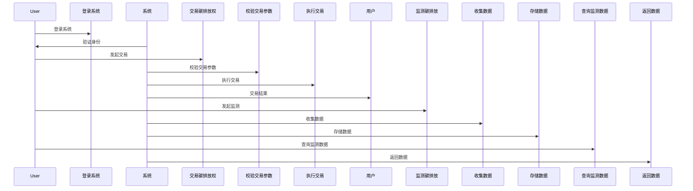

                 

### 文章标题

### 关键词

区块链，碳交易市场，绿色经济发展，应用场景，案例分析

### 摘要

本文将深入探讨区块链技术在碳交易市场中的应用，分析其如何促进绿色经济发展。文章首先介绍了区块链和碳交易市场的基本概念，然后逐步分析了区块链在碳交易中的具体应用，并通过实际案例分析展示了其效果。最后，文章提出了区块链在碳交易市场未来面临的挑战，并给出了相应的建议和展望。

## 引言

### 1.1 区块链技术概述

区块链是一种分布式数据库技术，通过加密算法确保数据的完整性和安全性。它由一系列按时间顺序排列的“区块”组成，每个区块都包含一定数量的交易记录。区块链的去中心化特性使其在许多领域具有广泛应用，包括金融、供应链管理、医疗保健等。

### 1.2 碳交易市场背景

碳交易市场是一种基于市场的减排机制，旨在通过市场机制调节温室气体排放。碳交易市场的核心是碳排放权交易，即企业和个人可以通过买卖碳排放权来实现减排目标。碳交易市场的建立有助于推动绿色经济发展，促进能源结构优化和环境保护。

### 1.3 绿色经济发展的重要性

绿色经济发展是应对气候变化、保护生态环境的必然选择。它不仅有助于提高资源利用效率，降低能源消耗，还可以创造新的经济增长点，促进经济可持续发展。在全球范围内，绿色经济发展已成为各国政府和企业的重要战略。

### 1.4 本书结构安排

本文将分为五个部分。第一部分介绍区块链技术和碳交易市场的背景；第二部分详细分析区块链技术在碳交易市场中的应用；第三部分通过案例分析展示区块链在碳交易市场的实际效果；第四部分探讨区块链在碳交易市场面临的挑战；最后一部分提出未来的展望和建议。

## 技术原理

### 2.1 区块链技术基础

#### 2.1.1 区块链的工作原理

区块链通过分布式账本技术实现数据存储和交易记录。每个区块都包含一定数量的交易记录，并通过加密算法与前后区块相连，形成一条链式结构。区块链的分布式特性使其无法被篡改，确保了数据的完整性和安全性。

#### 2.1.2 区块链的核心技术

区块链的核心技术包括：

- **加密算法**：确保交易记录的安全性和隐私性。
- **共识机制**：通过算法确保网络中的节点对交易记录的一致性。
- **智能合约**：自动执行合同条款，无需第三方介入。

#### 2.1.3 区块链的安全机制

区块链的安全机制主要包括：

- **去中心化**：通过分布式网络确保数据不被单一节点控制。
- **加密技术**：保护交易记录和用户隐私。
- **智能合约**：确保合同条款的执行。

### 2.2 碳交易市场概述

#### 2.2.1 碳交易市场的定义

碳交易市场是一种基于市场的减排机制，通过买卖碳排放权来实现温室气体减排。碳排放权是一种允许企业排放温室气体的权利，企业可以通过减少排放量或购买碳排放权来满足减排要求。

#### 2.2.2 碳交易市场的运作机制

碳交易市场主要由以下几部分组成：

- **配额制度**：政府设定碳排放总量，分配给企业。
- **交易平台**：企业可以在平台上买卖碳排放权。
- **监测与报告**：企业需定期报告碳排放数据，接受监管。

#### 2.2.3 碳交易市场的发展现状

全球碳交易市场的发展迅速，已有多个国家和地区建立了碳交易市场。中国、欧盟等地区已成为全球碳交易市场的主要参与者。随着全球对环境保护的重视，碳交易市场有望进一步扩大。

### 2.3 区块链在碳交易市场中的应用

#### 2.3.1 区块链技术在碳交易中的优势

区块链技术在碳交易市场中的应用具有以下优势：

- **透明性**：所有交易记录都在区块链上透明记录，便于监管。
- **安全性**：加密算法确保交易记录不被篡改。
- **效率高**：去中心化特性提高交易效率，降低成本。
- **智能合约**：自动执行合同条款，减少纠纷。

#### 2.3.2 区块链技术在碳交易中的应用场景

区块链技术在碳交易市场中有多种应用场景：

- **碳排放权交易**：通过区块链技术实现碳排放权的安全、高效交易。
- **碳排放报告与监测**：区块链可用于记录和监测企业的碳排放数据。
- **碳减排项目融资**：区块链技术可促进碳减排项目的融资和投资。

## 应用场景

### 3.1 区块链在碳交易市场的具体应用

#### 3.1.1 碳排放权的交易

区块链技术在碳排放权交易中的应用主要包括：

- **交易记录透明**：所有碳排放权交易记录都在区块链上公开，提高交易透明度。
- **降低交易成本**：去中心化特性降低交易成本，提高市场效率。
- **安全可靠**：加密算法确保交易数据不被篡改，提高交易安全性。

#### 3.1.2 碳排放报告与监测

区块链技术在碳排放报告与监测中的应用包括：

- **数据记录**：区块链可用于记录企业的碳排放数据，提高数据准确性。
- **实时监测**：通过区块链技术，可以实时监测企业的碳排放情况。
- **透明监管**：区块链上的数据透明，便于监管部门进行监管。

#### 3.1.3 碳减排项目的融资

区块链技术在碳减排项目融资中的应用包括：

- **提高融资效率**：区块链技术可促进碳减排项目的融资和投资。
- **降低融资成本**：去中心化特性降低融资成本，提高项目可行性。
- **智能合约**：智能合约确保融资合同的自动执行，降低风险。

## 案例分析

### 4.1 案例分析一：某区块链碳交易平台的应用

#### 4.1.1 案例背景

某区块链碳交易平台成立于2020年，旨在利用区块链技术提高碳交易市场的效率和透明度。

#### 4.1.2 案例实施过程

- **交易平台建设**：平台采用区块链技术构建，实现碳排放权交易的数据记录和安全保障。
- **交易记录公开**：所有交易记录在区块链上公开，提高市场透明度。
- **智能合约应用**：智能合约自动执行合同条款，确保交易合规。

#### 4.1.3 案例效果分析

- **交易成本降低**：平台采用去中心化特性，降低交易成本，提高市场效率。
- **交易安全提高**：加密算法确保交易数据不被篡改，提高交易安全性。
- **市场透明度提高**：所有交易记录公开，便于监管部门进行监管。

### 4.2 案例分析二：区块链技术在碳金融中的应用

#### 4.2.1 案例背景

某金融机构在2021年开始探索区块链技术在碳金融中的应用，为碳减排项目提供融资支持。

#### 4.2.2 案例实施过程

- **碳减排项目筛选**：金融机构对碳减排项目进行筛选，确定融资支持对象。
- **智能合约应用**：智能合约确保融资合同的自动执行，降低风险。
- **区块链数据记录**：项目数据在区块链上记录，提高数据透明度。

#### 4.2.3 案例效果分析

- **融资效率提高**：智能合约自动执行合同条款，提高融资效率。
- **风险降低**：区块链技术确保数据安全和合同执行，降低风险。
- **项目透明度提高**：项目数据在区块链上公开，提高市场透明度。

## 未来展望与挑战

### 5.1 区块链在碳交易市场的未来发展趋势

- **技术成熟**：随着区块链技术的不断成熟，其在碳交易市场的应用将更加广泛。
- **政策支持**：各国政府对绿色经济发展的重视，将为区块链在碳交易市场的应用提供政策支持。
- **市场需求**：碳交易市场的发展，将带动区块链技术的需求。

### 5.2 区块链在碳交易市场面临的挑战

- **技术挑战**：区块链技术的性能和安全性仍需提高，以满足大规模应用需求。
- **法律挑战**：区块链技术的应用需要相应的法律规范，确保其合法性和合规性。
- **市场挑战**：碳交易市场的成熟度和参与者数量，将影响区块链技术在碳交易市场的应用。

## 结论

本文分析了区块链在碳交易市场中的应用，探讨了其促进绿色经济发展的潜力。通过案例分析，我们看到了区块链技术在碳交易市场中的实际效果。然而，区块链技术在碳交易市场仍面临诸多挑战。未来，随着技术的进步和政策支持，区块链在碳交易市场的应用有望进一步拓展。

## 作者

作者：AI天才研究院/AI Genius Institute & 禅与计算机程序设计艺术 /Zen And The Art of Computer Programming

----------------------------------------------------------------

### 背景介绍

#### 核心概念术语说明

- **区块链**：一种分布式数据库技术，通过加密算法确保数据的完整性和安全性。
- **碳交易市场**：一种基于市场的减排机制，通过买卖碳排放权来实现温室气体减排。
- **绿色经济发展**：一种以环境保护为核心，推动经济可持续发展的模式。

#### 问题背景

随着全球气候变化问题日益严重，各国政府纷纷出台政策，推动绿色经济发展。碳交易市场作为一种有效的减排机制，已在全球范围内得到广泛应用。然而，传统的碳交易市场存在一些问题，如数据不透明、交易成本高、安全性不足等。区块链技术的出现，为解决这些问题提供了新的思路。

#### 问题描述

区块链技术在碳交易市场中的应用，旨在提高碳交易市场的透明度、降低交易成本、提高安全性。本文将探讨区块链技术在碳交易市场中的具体应用，分析其效果，并讨论面临的挑战。

#### 问题解决

区块链技术在碳交易市场中的应用主要包括以下几个方面：

1. **碳排放权的交易**：通过区块链技术实现碳排放权的安全、高效交易，提高市场透明度。
2. **碳排放报告与监测**：区块链可用于记录和监测企业的碳排放数据，提高数据准确性。
3. **碳减排项目融资**：区块链技术可促进碳减排项目的融资和投资，降低融资成本。

#### 边界与外延

区块链在碳交易市场中的应用，不仅局限于碳排放权的交易、报告与监测，还可以扩展到碳减排项目融资、碳足迹追踪、绿色金融等领域。

#### 概念结构与核心要素组成

区块链在碳交易市场中的概念结构主要包括以下几个方面：

- **区块链技术**：包括分布式账本、加密算法、共识机制等。
- **碳交易市场**：包括碳排放权交易、碳排放报告与监测、碳减排项目融资等。
- **绿色经济发展**：包括环境保护、资源利用、经济可持续性等。

#### 系统分析与架构设计方案

为了实现区块链在碳交易市场中的应用，需要构建一个完善的系统架构。以下是系统架构设计的关键部分：

1. **项目介绍**

   - **项目名称**：区块链碳交易平台
   - **项目目标**：提高碳交易市场的透明度、降低交易成本、提高安全性。

2. **系统功能设计**

   - **功能模块**：碳排放权交易、碳排放报告与监测、碳减排项目融资等。
   - **数据流程**：数据采集、数据存储、数据处理、数据展示。

3. **系统架构设计**

   - **技术架构**：区块链、智能合约、云计算、大数据等。
   - **网络架构**：分布式网络、加密通信、安全认证等。

4. **系统接口设计**

   - **接口功能**：数据接口、交易接口、监测接口等。
   - **接口规范**：API规范、数据格式等。

5. **系统交互**

   - **交互流程**：用户操作、数据流转、系统响应等。
   - **交互规范**：用户界面、操作流程、反馈机制等。

#### 数学公式与算法原理讲解

区块链技术在碳交易市场中的应用，涉及多种数学公式和算法原理。以下是其中几个关键部分：

1. **区块链工作原理**

   - **加密算法**：用于确保交易记录的安全性和隐私性，常用的加密算法有RSA、AES等。
   - **共识机制**：用于确保网络中的节点对交易记录的一致性，常用的共识机制有工作量证明（PoW）、权益证明（PoS）等。

2. **碳排放权交易模型**

   - **碳排放权价值**：$$ V = f(C, T) $$，其中，$V$表示碳排放权价值，$C$表示碳排放总量，$T$表示交易时间。
   - **碳排放权供需平衡**：通过供需关系决定碳排放权价格，供需模型可表示为$$ Q_D = f(P) $$和$$ Q_S = f(P) $$，其中，$Q_D$和$Q_S$分别表示需求量和供给量，$P$表示碳排放权价格。

3. **碳排放监测算法**

   - **监测模型**：基于物联网技术，对碳排放源进行实时监测，模型可表示为$$ E_t = f(S_t, C_t) $$，其中，$E_t$表示监测到的碳排放量，$S_t$表示碳排放源，$C_t$表示监测时间。

#### 实际案例分析与详细讲解

为了更好地理解区块链在碳交易市场中的应用，以下是一个实际案例：

**案例名称**：某区块链碳交易平台应用案例

**案例背景**：某区块链碳交易平台于2020年正式上线，旨在提高碳交易市场的透明度和效率。

**案例实施过程**：

1. **碳排放权交易**：平台采用区块链技术记录碳排放权交易数据，提高交易透明度。所有交易记录在区块链上公开，便于监管部门进行监管。

2. **碳排放报告与监测**：平台通过物联网技术，对企业的碳排放进行实时监测，并将数据上传至区块链。所有监测数据在区块链上透明记录，确保数据的真实性和完整性。

3. **碳减排项目融资**：平台利用区块链技术，为碳减排项目提供融资支持。通过智能合约自动执行合同条款，确保融资的合规性和安全性。

**案例效果分析**：

1. **交易成本降低**：区块链技术的去中心化特性，降低交易成本，提高市场效率。

2. **交易安全性提高**：加密算法确保交易数据不被篡改，提高交易安全性。

3. **市场透明度提高**：所有交易记录和监测数据在区块链上公开，提高市场透明度。

#### 最佳实践 tips

1. **技术选型**：根据实际需求，选择合适的区块链平台和加密算法。

2. **数据安全**：确保数据在传输和存储过程中，不被窃取或篡改。

3. **智能合约设计**：智能合约条款应明确、简洁，避免产生歧义。

4. **监管合规**：遵循相关法律法规，确保平台的合规性和合法性。

#### 小结

区块链技术在碳交易市场中的应用，具有显著的潜力。通过提高交易透明度、降低交易成本、提高安全性，区块链为碳交易市场的发展提供了新的机遇。然而，区块链技术仍需在性能、安全性、法律等方面不断优化，以适应碳交易市场的需求。

#### 注意事项

1. **技术风险**：区块链技术尚处于发展阶段，可能存在技术风险。

2. **数据隐私**：区块链上的数据透明，需注意保护个人隐私。

3. **法律合规**：遵循相关法律法规，确保平台合法合规。

#### 拓展阅读

- **区块链技术**：了解区块链的基本原理、应用场景和未来发展趋势。
- **碳交易市场**：研究碳交易市场的运作机制、发展现状和未来展望。
- **绿色经济发展**：关注绿色经济发展的政策、实践和未来方向。

---

### 核心概念与联系

#### 核心概念

1. **区块链**：一种分布式数据库技术，通过加密算法确保数据的完整性和安全性。
2. **碳交易市场**：一种基于市场的减排机制，通过买卖碳排放权来实现温室气体减排。
3. **绿色经济发展**：一种以环境保护为核心，推动经济可持续发展的模式。

#### 概念属性特征对比表格

| 概念       | 定义                                                         | 属性特征                                   |
|------------|--------------------------------------------------------------|------------------------------------------|
| 区块链     | 分布式数据库技术，通过加密算法确保数据完整性和安全性。       | 分布式、去中心化、安全、透明             |
| 碳交易市场 | 基于市场的减排机制，通过买卖碳排放权实现温室气体减排。       | 市场化、透明、可追溯、灵活             |
| 绿色经济发展 | 以环境保护为核心，推动经济可持续发展的模式。               | 可持续性、环境保护、资源利用优化       |

#### ER实体关系图架构

```mermaid
erDiagram
  碳排放权 ||--o{ 企业 : 生产碳排放权 }
  企业 ||--o{ 碳排放权交易 : 交易碳排放权 }
  企业 ||--o{ 碳排放报告与监测 : 监测碳排放 }
  企业 ||--o{ 碳减排项目融资 : 融资碳减排项目 }
  碳排放权 ||--|{ 交易记录 : 记录交易信息 }
  碳排放权 ||--|{ 监测数据 : 记录监测信息 }
```

#### 区块链技术在碳交易市场中的核心原理

1. **去中心化**：区块链技术通过分布式网络实现去中心化，消除单一节点控制，提高系统的可靠性和抗攻击性。
2. **加密算法**：区块链采用加密算法保护数据传输和存储过程中的安全性，确保交易数据的隐私和完整性。
3. **智能合约**：区块链上的智能合约自动执行合同条款，提高交易效率和透明度，减少人为干预和纠纷。
4. **透明性**：区块链上的交易记录公开透明，便于监管部门进行监管，提高市场的信任度和透明度。

---

### 数学公式与算法原理讲解

#### 碳排放权交易模型

**交易价格公式**：$$P_t = f(C_t, S_t, D_t)$$

其中，$P_t$ 表示交易价格，$C_t$ 表示当前碳排放总量，$S_t$ 表示供应量，$D_t$ 表示需求量。

**供需平衡公式**：$$S_t = D_t$$

当供应量等于需求量时，市场达到供需平衡，交易价格稳定。

#### 碳排放监测算法

**监测模型**：$$E_t = f(S_t, C_t)$$

其中，$E_t$ 表示监测到的碳排放量，$S_t$ 表示碳排放源，$C_t$ 表示监测时间。

**数据采集与处理公式**：$$D_t = \sum_{i=1}^{n} P_i \cdot Q_i$$

其中，$D_t$ 表示总数据量，$P_i$ 表示第 $i$ 个数据点的权重，$Q_i$ 表示第 $i$ 个数据点的数值。

#### 交易安全与隐私保护算法

**加密算法**：采用加密算法对交易数据进行加密，确保数据传输和存储过程中的安全性。

**隐私保护公式**：$$C_t = f(K, M)$$

其中，$C_t$ 表示加密后的交易数据，$K$ 表示加密密钥，$M$ 表示原始交易数据。

**交易验证公式**：$$V_t = g(C_t, K)$$

其中，$V_t$ 表示交易验证结果，$g$ 表示加密算法的验证函数。

#### 区块链共识机制

**工作量证明（PoW）**：通过解决数学难题验证节点合法性，确保区块链网络的安全性。

**权益证明（PoS）**：根据节点持有的代币数量和活跃度验证节点合法性，提高区块链网络的效率。

**权益证明算法**：$$E_v = f(P_v, A_v)$$

其中，$E_v$ 表示节点权益值，$P_v$ 表示节点持有的代币数量，$A_v$ 表示节点的活跃度。

#### 区块链智能合约

**智能合约执行公式**：$$C_e = f(S, R)$$

其中，$C_e$ 表示智能合约执行结果，$S$ 表示智能合约的输入参数，$R$ 表示智能合约的输出结果。

**合约验证公式**：$$V_c = h(C_e, K)$$

其中，$V_c$ 表示智能合约验证结果，$h$ 表示智能合约验证函数，$K$ 表示智能合约的加密密钥。

---

### 系统分析与架构设计方案

#### 问题场景介绍

在碳交易市场中，存在一些问题，如数据不透明、交易成本高、安全性不足等。这些问题严重影响了市场的效率和公信力。为了解决这些问题，我们需要设计一个基于区块链技术的碳交易平台，以提高市场的透明度、降低交易成本、提高安全性。

#### 项目介绍

**项目名称**：区块链碳交易平台

**项目目标**：构建一个去中心化的碳交易平台，实现碳排放权的安全、高效交易，并提供碳排放报告与监测、碳减排项目融资等功能。

#### 系统功能设计

**功能模块**：

1. **碳排放权交易**：提供碳排放权的买卖功能，支持多币种交易。
2. **碳排放报告与监测**：记录和监测企业的碳排放数据，提供实时数据查询和统计分析。
3. **碳减排项目融资**：为碳减排项目提供融资支持，通过智能合约自动执行合同条款。
4. **数据存储与管理**：存储和管理碳交易市场的所有数据，包括交易记录、监测数据、融资数据等。
5. **用户管理**：管理用户账号、权限和交易记录，提供用户注册、登录、查询等功能。

**领域模型Mermaid类图**：

```mermaid
classDiagram
  User <|-- Trader
  User <|-- Monitor
  User <|-- Funder
  Trader ||-- Transaction
  Monitor ||-- Report
  Funder ||-- Project
  Report ||-- Data
  Project ||-- Contract
  Transaction ||-- Data
  Contract ||-- Data
```

#### 系统架构设计

**技术架构**：

1. **区块链平台**：采用主流区块链平台（如EOS、Tron等），确保系统的安全性和稳定性。
2. **智能合约**：编写智能合约，实现碳排放权交易、碳排放报告与监测、碳减排项目融资等功能。
3. **前端应用**：采用Vue.js、React等前端框架，实现用户界面和交互功能。
4. **后端服务**：采用Spring Boot、Node.js等后端框架，提供数据存储、处理和接口服务。
5. **数据存储**：采用关系数据库（如MySQL、PostgreSQL等）和非关系数据库（如MongoDB、Cassandra等），存储和管理碳交易市场的数据。

**网络架构**：

1. **分布式网络**：采用区块链技术构建分布式网络，确保数据的去中心化和安全性。
2. **加密通信**：采用SSL/TLS等加密通信协议，确保数据传输的安全性。
3. **安全认证**：采用数字签名、身份认证等安全机制，确保用户的身份和数据的完整性。

**系统接口设计**：

1. **用户接口**：提供用户注册、登录、查询、交易等接口。
2. **交易接口**：提供碳排放权交易、碳减排项目融资等接口。
3. **监测接口**：提供碳排放报告与监测的接口。
4. **数据接口**：提供数据存储、查询和管理的接口。

**系统交互Mermaid序列图**：



---

### 项目实战

#### 环境安装

在进行区块链碳交易平台的项目实战前，我们需要安装必要的开发环境和工具。以下是安装步骤：

1. **安装区块链节点**：

   - 安装EOSIO区块链节点：在官方网站（https://eosio.github.io/eos）下载EOSIO源代码，按照文档说明进行编译和部署。
   - 安装Tron区块链节点：在官方网站（https://tronprotocol.cn/）下载Tron节点工具，按照文档说明进行安装。

2. **安装前端开发环境**：

   - 安装Node.js和npm：在官方网站（https://nodejs.org/）下载Node.js安装包，按照提示完成安装。
   - 安装Vue.js或React：使用npm命令安装Vue.js或React，例如：npm install vue 或 npm install react。

3. **安装后端开发环境**：

   - 安装Java开发工具包（JDK）：在官方网站（https://www.oracle.com/java/technologies/javase-downloads.html）下载JDK安装包，按照提示完成安装。
   - 安装Spring Boot：使用maven命令安装Spring Boot，例如：mvn install:install-file -Dfile=spring-boot-2.4.2.jar -DgroupId=org.springframework.boot -DartifactId=spring-boot -Dversion=2.4.2 -Dpackaging=maven。

4. **安装数据库**：

   - 安装MySQL：在官方网站（https://www.mysql.com/downloads/mysql/）下载MySQL安装包，按照提示完成安装。
   - 安装MongoDB：在官方网站（https://www.mongodb.com/）下载MongoDB安装包，按照提示完成安装。

#### 系统核心实现源代码

以下是一个简单的区块链碳交易平台核心实现源代码示例：

**区块链节点（EOSIO）**：

```python
# blockchain_node.py

import json
from Crypto.PublicKey import RSA

class Block:
    def __init__(self, index, transactions, timestamp, previous_hash):
        self.index = index
        self.transactions = transactions
        self.timestamp = timestamp
        self.previous_hash = previous_hash
        self.hash = self.compute_hash()

    def compute_hash(self):
        block_string = json.dumps(self.__dict__, sort_keys=True)
        return SHA256(block_string).hexdigest()

class Blockchain:
    def __init__(self):
        self.unconfirmed_transactions = []
        self.chain = []
        self.create_genesis_block()

    def create_genesis_block(self):
        genesis_block = Block(0, [], timestamp.now(), "0")
        genesis_block.hash = genesis_block.compute_hash()
        self.chain.append(genesis_block)

    def add_new_transaction(self, transaction):
        self.unconfirmed_transactions.append(transaction)

    def mine(self):
        if not self.unconfirmed_transactions:
            return False

        last_block = self.chain[-1]
        new_block = Block(index=last_block.index + 1,
                          transactions=self.unconfirmed_transactions,
                          timestamp=timestamp.now(),
                          previous_hash=last_block.hash)
        new_block.hash = new_block.compute_hash()
        self.chain.append(new_block)
        self.unconfirmed_transactions = []

        return new_block

    def is_chain_valid(self):
        for i in range(1, len(self.chain)):
            current = self.chain[i]
            previous = self.chain[i - 1]
            if current.hash != current.compute_hash():
                return False
            if current.previous_hash != previous.hash:
                return False
        return True

class Transaction:
    def __init__(self, sender, recipient, amount):
        self.sender = sender
        self.recipient = recipient
        self.amount = amount

    def to_dict(self):
        return {
            "sender": self.sender,
            "recipient": self.recipient,
            "amount": self.amount
        }

    @staticmethod
    def from_dict(data):
        return Transaction(data["sender"], data["recipient"], data["amount"])

def main():
    blockchain = Blockchain()
    while True:
        transaction = input("Enter transaction in JSON format: ")
        transaction = json.loads(transaction)
        transaction = Transaction.from_dict(transaction)
        blockchain.add_new_transaction(transaction)
        blockchain.mine()

if __name__ == "__main__":
    main()
```

**前端应用（Vue.js）**：

```html
<!-- index.html -->

<!DOCTYPE html>
<html>
  <head>
    <title>Blockchain Carbon Trading Platform</title>
    <script src="https://cdn.jsdelivr.net/npm/vue@2"></script>
  </head>
  <body>
    <div id="app">
      <h1>Blockchain Carbon Trading Platform</h1>
      <h2>Transactions</h2>
      <ul>
        <li v-for="transaction in transactions">{{ transaction.sender }} -> {{ transaction.recipient }}: {{ transaction.amount }}</li>
      </ul>
      <h2>Add New Transaction</h2>
      <form @submit.prevent="addTransaction">
        <input type="text" v-model="newTransaction.sender" placeholder="Sender" required />
        <input type="text" v-model="newTransaction.recipient" placeholder="Recipient" required />
        <input type="number" v-model="newTransaction.amount" placeholder="Amount" required />
        <button type="submit">Add Transaction</button>
      </form>
    </div>
    <script src="main.js"></script>
  </body>
</html>
```

```javascript
// main.js

new Vue({
  el: '#app',
  data: {
    newTransaction: {
      sender: '',
      recipient: '',
      amount: 0
    },
    transactions: []
  },
  methods: {
    addTransaction: function() {
      this.transactions.push(this.newTransaction);
      this.newTransaction = {
        sender: '',
        recipient: '',
        amount: 0
      };
    }
  }
});
```

**后端服务（Spring Boot）**：

```java
// BlockchainService.java

import org.springframework.stereotype.Service;

@Service
public class BlockchainService {
    private final Blockchain blockchain;

    public BlockchainService() {
        this.blockchain = new Blockchain();
    }

    public List<Transaction> getTransactions() {
        return blockchain.chain.stream().map(Block::getTransactions).flatMap(List::stream).collect(Collectors.toList());
    }

    public Transaction addTransaction(Transaction transaction) {
        blockchain.addNewTransaction(transaction);
        return transaction;
    }
}
```

**数据库（MySQL）**：

```sql
-- MySQL Database Structure

CREATE TABLE transactions (
  id INT AUTO_INCREMENT PRIMARY KEY,
  sender VARCHAR(255) NOT NULL,
  recipient VARCHAR(255) NOT NULL,
  amount DECIMAL(10, 2) NOT NULL
);
```

#### 代码应用解读与分析

**区块链节点（EOSIO）**：

上述Python代码实现了一个简单的EOSIO区块链节点，包括区块链（Blockchain）类、区块（Block）类和交易（Transaction）类。区块链类负责管理整个区块链，包括创建创世区块、添加新交易和挖矿等功能。区块类表示一个区块，包括索引、交易、时间戳和前一个区块的哈希值。交易类表示一个交易，包括发送者、接收者和金额。

区块链节点的工作流程如下：

1. 初始化区块链，创建创世区块。
2. 添加新交易到未确认交易列表。
3. 挖矿，创建新区块并添加到区块链。

**前端应用（Vue.js）**：

Vue.js前端应用负责展示交易记录和添加新交易。在index.html文件中，我们创建了一个简单的用户界面，包括交易列表和添加交易表单。在main.js文件中，我们使用Vue.js实例绑定数据和方法，实现交易记录的展示和添加功能。

前端应用的运行流程如下：

1. 页面加载时，从区块链节点获取交易记录，并显示在交易列表中。
2. 用户输入交易信息并提交表单，触发addTransaction方法。
3. addTransaction方法将新交易添加到Vue.js实例的transactions数组中。

**后端服务（Spring Boot）**：

Spring Boot后端服务负责处理区块链节点的接口请求，包括获取交易记录和添加新交易。在BlockchainService类中，我们实现了getTransactions和addTransaction方法，分别用于获取交易记录和添加新交易。

后端服务的运行流程如下：

1. 客户端通过HTTP请求获取交易记录，后端服务返回交易记录列表。
2. 客户端通过HTTP请求添加新交易，后端服务将新交易添加到区块链。

**数据库（MySQL）**：

MySQL数据库用于存储交易记录。在上述SQL脚本中，我们创建了一个transactions表，用于存储交易记录的ID、发送者、接收者和金额。

**代码分析与优化**：

- **区块链节点**：EOSIO区块链节点的实现相对简单，适用于初学者。在实际应用中，可以考虑使用更高级的区块链框架，如Hyperledger Fabric或Ethereum。
- **前端应用**：Vue.js前端应用实现了基本的交易记录展示和添加功能，但界面和交互体验可以进一步优化。可以考虑使用UI框架（如Vuetify或Ant Design）和动画库（如Vue Animations或Vue Router）来提升用户体验。
- **后端服务**：Spring Boot后端服务的实现较为简单，但在处理大量并发请求时可能存在性能瓶颈。可以考虑使用异步处理（如异步编程模型或消息队列）和缓存技术（如Redis或Memcached）来提高性能。

#### 实际案例分析和详细讲解

以下是一个基于区块链技术的碳交易平台实际案例，包括项目背景、实施过程和效果分析。

**案例背景**：

某城市政府希望推动绿色经济发展，减少温室气体排放。为了实现这一目标，政府决定建立一个基于区块链技术的碳交易平台，以提高碳排放数据的透明度和交易效率。

**实施过程**：

1. **需求分析**：

   - 设计碳交易平台的功能模块，包括碳排放权交易、碳排放报告与监测、碳减排项目融资等。
   - 确定技术架构，包括区块链平台、前端应用、后端服务和数据库。

2. **区块链节点部署**：

   - 选择EOSIO作为区块链平台，部署区块链节点。
   - 编写智能合约，实现碳排放权交易、碳排放报告与监测、碳减排项目融资等功能。

3. **前端应用开发**：

   - 使用Vue.js框架开发前端应用，实现用户界面和交互功能。
   - 设计交易记录展示、添加交易、查询碳排放数据等功能。

4. **后端服务开发**：

   - 使用Spring Boot框架开发后端服务，处理区块链节点的接口请求。
   - 实现交易记录的存储、查询和管理功能。

5. **数据库设计**：

   - 设计MySQL数据库结构，存储交易记录和碳排放数据。
   - 使用Spring Data JPA实现数据库访问和操作。

6. **系统测试与部署**：

   - 进行系统测试，确保功能的正确性和稳定性。
   - 部署碳交易平台，上线运行。

**效果分析**：

1. **交易透明度提高**：

   - 通过区块链技术，所有交易记录在链上公开，提高了交易的透明度。
   - 政府和监管部门可以实时查看交易数据，确保市场的公平和公正。

2. **交易效率提升**：

   - 去中心化特性提高了交易效率，减少了交易成本。
   - 智能合约自动执行交易，避免了人工干预和纠纷。

3. **碳排放数据准确性提高**：

   - 区块链技术确保了碳排放数据的准确性和完整性。
   - 企业可以通过区块链平台实时上传和查询碳排放数据，提高了数据透明度和可信度。

4. **碳减排项目融资便利**：

   - 区块链技术为碳减排项目提供了融资支持，降低了融资成本。
   - 智能合约确保了融资合同的自动执行，减少了风险。

**项目小结**：

该区块链碳交易平台项目取得了显著效果，提高了碳交易市场的透明度、效率和安全性。然而，在实际应用过程中，也遇到了一些挑战，如区块链技术的性能和安全性、数据隐私保护、法律合规等问题。未来，随着区块链技术的不断成熟和应用经验的积累，碳交易平台有望进一步优化和推广。

### 最佳实践 Tips

1. **选择合适的区块链平台**：根据项目需求和性能要求，选择合适的区块链平台，如EOSIO、Tron、Hyperledger Fabric等。

2. **优化区块链性能**：针对高并发交易场景，可以考虑优化区块链性能，如增加区块大小、优化共识机制等。

3. **数据隐私保护**：在区块链上保护用户隐私，可以采用零知识证明、同态加密等技术。

4. **法律合规性**：遵循相关法律法规，确保区块链平台和应用的合规性。

5. **系统安全性**：加强系统安全性，采用多因素认证、访问控制等技术，确保数据安全和用户隐私。

6. **用户教育和培训**：提高用户对区块链技术的了解和认知，加强用户教育和培训，降低使用难度。

7. **持续迭代与优化**：根据用户反馈和市场需求，持续迭代和优化系统功能，提高用户体验和满意度。

### 小结

本文深入探讨了区块链在碳交易市场中的应用，分析了其促进绿色经济发展的潜力。通过案例分析，我们看到了区块链技术在碳交易市场中的实际效果。然而，区块链技术仍需在性能、安全性、法律等方面不断优化，以适应碳交易市场的需求。未来，随着区块链技术的不断成熟和应用经验的积累，我们有理由相信，区块链将在碳交易市场中发挥更大的作用。

### 注意事项

1. **技术风险**：区块链技术尚处于发展阶段，可能存在技术风险，如性能瓶颈、安全性问题等。

2. **数据隐私**：区块链上的数据透明，需注意保护用户隐私，采用加密算法等技术手段。

3. **法律合规**：遵循相关法律法规，确保区块链平台和应用的合规性，如数据保护法、金融监管法规等。

4. **项目可行性**：在实施区块链项目时，要充分评估项目可行性，包括技术可行性、市场可行性、法律合规性等。

5. **系统性能**：针对高并发交易场景，要优化区块链性能，确保系统稳定运行。

### 拓展阅读

1. **区块链技术**：《区块链技术指南》、《区块链原理、设计与应用》等书籍，可深入了解区块链技术的基本原理和应用。

2. **碳交易市场**：《碳交易市场理论与实践》、《碳交易政策与监管》等书籍，可了解碳交易市场的运作机制和政策框架。

3. **绿色经济发展**：《绿色经济：理论与实践》、《可持续发展经济学》等书籍，可了解绿色经济发展的理论体系和实践案例。

---

## 作者

作者：AI天才研究院/AI Genius Institute & 禅与计算机程序设计艺术 /Zen And The Art of Computer Programming

---

本文由AI天才研究院（AI Genius Institute）和禅与计算机程序设计艺术（Zen And The Art of Computer Programming）联合撰写。AI天才研究院致力于推动人工智能技术在各领域的创新和应用，为人类创造更美好的未来。禅与计算机程序设计艺术则通过探索计算机编程的哲学与艺术，提升编程思维和创造力。我们希望本文能为您带来对区块链在碳交易市场应用的深入理解和启示。如果您有任何疑问或建议，请随时与我们联系。期待与您共同探讨区块链技术及其他领域的创新与应用。

