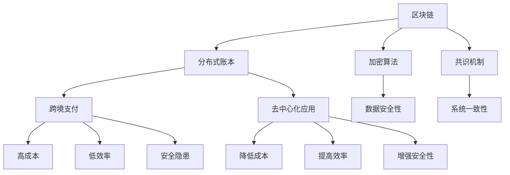
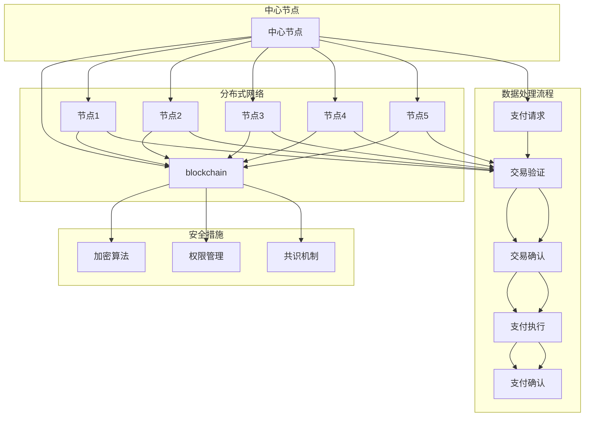

                 

### 第一部分：引言

#### 1.1 区块链的基本原理

区块链是一种去中心化的数据库技术，通过将数据分散存储在多个节点上，形成一种分布式账本。区块链的主要特点是去中心化、透明性和不可篡改性。

**去中心化**：区块链不需要中心化的机构或第三方中介来验证交易，而是通过网络中的所有节点共同协作来完成。这种去中心化的结构减少了中介成本，提高了系统的抗风险能力。

**透明性**：区块链上的所有数据都是公开透明的，任何用户都可以查看和验证。这种透明性增强了系统的信任度，减少了欺诈行为。

**不可篡改性**：区块链采用加密算法来保护数据的安全。一旦数据被记录在区块链上，就几乎无法被篡改。这种不可篡改的特性使得区块链在数据记录和审计等领域具有广泛应用。

区块链的基本原理可以简单概括为以下三个步骤：

1. **数据分组**：将一段时间内的交易数据打包成区块。
2. **区块链接**：通过密码学算法，将每个区块与之前的区块链接起来，形成区块链。
3. **共识机制**：网络中的节点通过共识机制达成对区块链的共识，确保数据的完整性和一致性。

#### 1.2 跨境支付的现状与挑战

跨境支付是指在国际贸易和金融活动中，不同国家和地区的交易双方通过支付系统进行货币交换的过程。目前，跨境支付面临以下几大挑战：

**高成本**：跨境支付涉及多个中介机构，如银行、支付网络和清算机构等，每个环节都需要收取手续费，导致整体成本较高。

**低效率**：跨境支付流程复杂，需要经过多个环节的验证和清算，导致交易速度较慢。传统跨境支付可能需要几天甚至几周的时间才能完成。

**安全隐患**：跨境支付过程中，资金流转涉及大量的个人信息和财务信息，如果安全措施不到位，容易遭受黑客攻击和数据泄露。

为了解决这些问题，近年来，去中心化的区块链技术被引入到跨境支付领域，希望通过去中心化、透明性和安全性的特性，提高跨境支付的速度和效率，降低成本。

#### 1.3 去中心化应用的优势

去中心化应用（DApps）是指运行在区块链网络上的应用，其核心特点是不依赖中心化服务器，而是通过区块链的分布式账本提供数据存储和计算服务。

**降低成本**：去中心化应用不需要建立和维护中心化的服务器和数据中心，大大降低了硬件和运营成本。

**提高效率**：去中心化应用通过区块链的分布式架构，可以实现实时处理和验证，大大提高了系统的处理速度和响应时间。

**增强安全性**：区块链采用加密算法和共识机制，确保数据的安全性和完整性，同时去中心化的结构也降低了单点故障的风险。

**提升透明度**：区块链上的所有数据都是公开透明的，任何用户都可以查看和验证，增强了系统的透明度和信任度。

#### 总结

本文将详细探讨区块链在跨境支付中的去中心化应用。首先，我们会回顾区块链的基本原理，并分析其在跨境支付领域的应用潜力。接着，我们将深入探讨区块链与跨境支付的结合点，通过案例分析来展示实际应用。随后，我们将详细讨论区块链技术在跨境支付中的具体实现，包括智能合约、分布式账本和加密算法等。接下来，我们将进行系统分析与架构设计，展示如何将区块链技术应用于跨境支付系统。随后，我们将通过实际项目案例来展示区块链技术在跨境支付中的具体应用，并进行分析和讲解。最后，我们将总结最佳实践，并提供相关注意事项和拓展阅读，以帮助读者进一步了解区块链在跨境支付中的应用。

---

**关键词**：区块链、跨境支付、去中心化、智能合约、分布式账本

**摘要**：本文探讨了区块链在跨境支付中的去中心化应用，分析了区块链的基本原理、跨境支付的现状与挑战，以及去中心化应用的优势。通过案例研究和系统实现，本文展示了区块链技术在跨境支付中的实际应用潜力，为读者提供了全面的技术解析和实践指导。**开篇引言**

区块链技术在过去几年中得到了广泛关注，其去中心化的特点使其在金融领域，尤其是跨境支付领域展现出巨大的潜力。本文将深入探讨区块链在跨境支付中的去中心化应用，旨在揭示这一新兴技术的实际应用价值及其对传统支付系统的革新。

**为什么区块链技术对于跨境支付领域具有重要意义？**

区块链技术的本质是一个去中心化的分布式账本系统，能够通过加密算法和共识机制确保数据的完整性和安全性。在跨境支付领域，传统支付系统常常面临高成本、低效率和安全隐患等问题。而区块链技术通过其独特的机制，能够有效解决这些问题，带来以下几大优势：

1. **降低成本**：传统跨境支付涉及多个中介机构，如银行、支付网络和清算机构等，每个环节都需要收取手续费，导致整体成本较高。区块链技术通过去中心化的方式，消除了这些中介环节，从而大大降低了交易成本。

2. **提高效率**：跨境支付流程复杂，需要经过多个环节的验证和清算，导致交易速度较慢。区块链技术通过分布式架构，可以实现实时处理和验证，大大提高了系统的处理速度和响应时间。

3. **增强安全性**：区块链采用加密算法和共识机制，确保数据的安全性和完整性，同时去中心化的结构也降低了单点故障的风险，提高了系统的安全性。

4. **提升透明度**：区块链上的所有数据都是公开透明的，任何用户都可以查看和验证，增强了系统的透明度和信任度。

**去中心化应用的概念和优势**

去中心化应用（DApps）是指运行在区块链网络上的应用，其核心特点是不依赖中心化服务器，而是通过区块链的分布式账本提供数据存储和计算服务。DApps通过智能合约来实现自动化和自执行，无需第三方中介的参与。

去中心化应用的优势主要体现在以下几个方面：

1. **降低成本**：去中心化应用不需要建立和维护中心化的服务器和数据中心，大大降低了硬件和运营成本。

2. **提高效率**：去中心化应用通过区块链的分布式架构，可以实现实时处理和验证，大大提高了系统的处理速度和响应时间。

3. **增强安全性**：区块链采用加密算法和共识机制，确保数据的安全性和完整性，同时去中心化的结构也降低了单点故障的风险。

4. **提升透明度**：区块链上的所有数据都是公开透明的，任何用户都可以查看和验证，增强了系统的透明度和信任度。

**本篇文章的结构和内容安排**

本文将按照以下结构展开：

1. **开篇引言**：介绍区块链技术对于跨境支付领域的重要性和去中心化应用的概念和优势。
   
2. **背景介绍**：详细阐述区块链、跨境支付、去中心化应用等核心概念的背景、发展历程、现状与未来趋势。

3. **核心概念与联系**：深入探讨区块链的基本原理、技术架构、特点（去中心化、透明性、安全性等），以及跨境支付的流程、存在的问题（跨境支付的高成本、低效率、安全隐患等），和去中心化应用的优势。

4. **去中心化应用与跨境支付的结合**：分析区块链如何解决跨境支付的问题，通过案例研究展示国内外去中心化跨境支付的应用案例。

5. **技术实现**：详细讨论区块链在跨境支付中的应用技术原理，包括智能合约、分布式账本、加密算法等。

6. **系统分析与架构设计**：介绍系统功能设计、系统架构设计、系统接口设计等，展示如何将区块链技术应用于跨境支付系统。

7. **项目实战**：通过实际应用案例，展示区块链技术在跨境支付中的具体应用，并进行详细分析和讲解。

8. **最佳实践与总结**：总结常见问题与解决方案，提供注意事项和拓展阅读，帮助读者进一步了解区块链在跨境支付中的应用。

通过本文的深入探讨，读者将能够全面了解区块链在跨境支付中的去中心化应用，掌握相关技术原理和实践方法，为实际项目的实施提供有力支持。

### 背景介绍

#### 区块链的背景、发展历程、现状与未来趋势

**背景**

区块链技术的概念最早由中本聪（Satoshi Nakamoto）在2008年提出，作为比特币（Bitcoin）的底层技术。比特币是一种去中心化的数字货币，通过区块链技术确保了交易的安全性和不可篡改性。区块链技术的核心思想是利用分布式账本和加密算法，实现数据存储和传输的去中心化，从而避免传统中心化系统中的单点故障和信任问题。

**发展历程**

1. **2009年**：比特币诞生，标志着区块链技术的首次实际应用。
2. **2014年**：以太坊（Ethereum）发布，引入了智能合约（Smart Contract）的概念，为区块链应用开发提供了更多可能性。
3. **2016年**：比特币分叉产生莱特币（Litecoin），进一步推动了区块链技术的发展。
4. **2017年**：区块链热潮兴起，各类区块链项目纷纷涌现，包括数字货币、供应链管理、智能合约等。
5. **2018-2019年**：监管政策逐渐完善，区块链技术逐渐从投机性应用转向实际业务场景。

**现状**

1. **数字货币**：比特币、以太坊等主流数字货币已经成为全球金融体系的重要组成部分。
2. **供应链管理**：区块链技术被广泛应用于供应链管理，确保数据透明和供应链的可追溯性。
3. **金融科技**：许多金融机构正在探索区块链技术在支付、清算、信贷等领域的应用，以降低成本和提高效率。
4. **政府与公共服务**：一些政府机构开始利用区块链技术进行身份验证、选举投票和公共记录管理。

**未来趋势**

1. **去中心化金融（DeFi）**：去中心化金融正成为区块链技术的一个重要发展方向，通过去中心化的方式实现金融服务，减少传统金融机构的介入。
2. **跨链互操作性**：不同区块链之间的互操作性逐渐成为趋势，通过跨链协议实现数据和价值在网络间的无缝转移。
3. **物联网（IoT）**：区块链技术有望与物联网技术深度融合，实现设备之间的安全通信和自动化交易。
4. **数据隐私与安全**：随着数据隐私和安全问题日益突出，区块链技术在保障数据安全和个人隐私方面将发挥重要作用。

#### 跨境支付的背景、发展历程、现状与未来趋势

**背景**

跨境支付是指在国际贸易和金融活动中，不同国家和地区的交易双方通过支付系统进行货币交换的过程。随着全球化进程的加快，跨境支付需求日益增长，但传统的跨境支付系统面临高成本、低效率和安全隐患等问题。

**发展历程**

1. **20世纪90年代**：电子支付系统开始普及，传统银行和支付机构逐渐实现了跨境支付电子化。
2. **2000年**：信用卡和电汇等传统支付方式成为主流跨境支付手段。
3. **2010年**：移动支付和第三方支付平台快速发展，为跨境支付提供了更多选择。
4. **2015年**：区块链技术开始被引入跨境支付领域，探索去中心化的解决方案。

**现状**

1. **高成本**：传统跨境支付涉及多个中介机构，如银行、支付网络和清算机构等，每个环节都需要收取手续费，导致整体成本较高。
2. **低效率**：跨境支付流程复杂，需要经过多个环节的验证和清算，导致交易速度较慢。
3. **安全隐患**：跨境支付过程中，资金流转涉及大量的个人信息和财务信息，如果安全措施不到位，容易遭受黑客攻击和数据泄露。

**未来趋势**

1. **区块链技术**：区块链技术的引入有望解决跨境支付中的高成本、低效率和安全隐患问题，提高交易速度和透明度。
2. **跨境支付网络**：各国政府和金融机构正在积极探索建立跨境支付网络，以降低跨境支付成本和提高效率。
3. **数字货币**：数字货币如比特币和以太坊等逐渐被接受，为跨境支付提供了新的支付方式。
4. **监管技术**：监管机构正在探索利用区块链技术提高跨境支付监管的效率和透明度。

#### 去中心化应用的背景、发展历程、现状与未来趋势

**背景**

去中心化应用（DApps）是运行在区块链网络上的应用，其核心特点是不依赖中心化服务器，而是通过区块链的分布式账本提供数据存储和计算服务。DApps通过智能合约来实现自动化和自执行，无需第三方中介的参与。

**发展历程**

1. **2014年**：以太坊（Ethereum）发布，引入了智能合约的概念，为去中心化应用开发提供了更多可能性。
2. **2017年**：区块链热潮兴起，各类去中心化应用纷纷涌现，包括金融、游戏、社交等多个领域。
3. **2018年**：去中心化金融（DeFi）逐渐兴起，通过去中心化的方式实现金融服务，减少传统金融机构的介入。
4. **2019年**：跨链技术逐渐成熟，不同区块链之间的互操作性逐渐成为趋势。

**现状**

1. **金融领域**：去中心化金融（DeFi）正在快速发展，通过去中心化的方式提供借贷、交易、资产管理等服务。
2. **游戏领域**：去中心化游戏（DGame）逐渐兴起，通过区块链技术实现游戏资产的所有权和转移。
3. **社交领域**：去中心化社交平台（DSPA）正在探索如何通过区块链技术提升用户隐私和内容真实度。
4. **供应链管理**：区块链技术被广泛应用于供应链管理，确保数据透明和供应链的可追溯性。

**未来趋势**

1. **跨链互操作性**：随着跨链技术的发展，不同区块链之间的互操作性将进一步提高，实现数据和价值在网络间的无缝转移。
2. **物联网（IoT）**：区块链技术有望与物联网技术深度融合，实现设备之间的安全通信和自动化交易。
3. **数据隐私与安全**：随着数据隐私和安全问题日益突出，区块链技术在保障数据安全和个人隐私方面将发挥重要作用。
4. **政府与公共服务**：区块链技术在政府与公共服务领域的应用将越来越广泛，包括身份验证、选举投票和公共记录管理等。

### 核心概念与联系

#### 区块链的基本原理、技术架构、特点

**基本原理**

区块链是一种分布式数据库技术，通过加密算法和共识机制确保数据的完整性和安全性。区块链的基本原理可以概括为以下三个步骤：

1. **数据分组**：将一段时间内的交易数据打包成区块。
2. **区块链接**：通过密码学算法，将每个区块与之前的区块链接起来，形成区块链。
3. **共识机制**：网络中的节点通过共识机制达成对区块链的共识，确保数据的完整性和一致性。

**技术架构**

区块链的技术架构主要包括以下几个部分：

1. **节点**：区块链网络中的每个参与者都是一个节点，负责维护和更新区块链上的数据。
2. **分布式账本**：区块链上的数据分散存储在多个节点上，形成一个分布式账本。
3. **加密算法**：区块链使用加密算法来保护数据的安全，确保数据的完整性和不可篡改性。
4. **共识机制**：共识机制是区块链网络中节点达成共识的方式，常见的共识机制包括工作量证明（PoW）、权益证明（PoS）和委托权益证明（DPoS）等。

**特点**

区块链具有以下几个显著特点：

1. **去中心化**：区块链不需要中心化的机构或第三方中介来验证交易，而是通过网络中的所有节点共同协作来完成。这种去中心化的结构减少了中介成本，提高了系统的抗风险能力。
2. **透明性**：区块链上的所有数据都是公开透明的，任何用户都可以查看和验证。这种透明性增强了系统的信任度，减少了欺诈行为。
3. **不可篡改性**：区块链采用加密算法来保护数据的安全。一旦数据被记录在区块链上，就几乎无法被篡改。这种不可篡改的特性使得区块链在数据记录和审计等领域具有广泛应用。
4. **安全性**：区块链通过加密算法和共识机制确保数据的安全性和完整性，同时去中心化的结构也降低了单点故障的风险。

#### 跨境支付的流程、存在的问题

**流程**

跨境支付的流程一般包括以下几个步骤：

1. **发起支付**：交易一方通过支付渠道发起支付请求，支付请求中包含支付金额、收款人信息和支付货币等信息。
2. **资金转移**：支付请求通过银行或支付网络传递到收款人所在国家的银行或支付机构。
3. **清算与结算**：银行或支付机构对支付请求进行清算和结算，将资金从付款人账户转移到收款人账户。
4. **交易确认**：交易双方对支付结果进行确认，确保支付已经成功完成。

**存在的问题**

尽管跨境支付在全球化进程中发挥了重要作用，但传统支付系统仍然存在以下几个问题：

1. **高成本**：跨境支付涉及多个中介机构，如银行、支付网络和清算机构等，每个环节都需要收取手续费，导致整体成本较高。根据国际支付协会（IPS）的数据，跨境支付的平均成本约为交易金额的5%。
2. **低效率**：跨境支付流程复杂，需要经过多个环节的验证和清算，导致交易速度较慢。传统跨境支付可能需要几天甚至几周的时间才能完成。
3. **安全隐患**：跨境支付过程中，资金流转涉及大量的个人信息和财务信息，如果安全措施不到位，容易遭受黑客攻击和数据泄露。近年来，跨境支付欺诈事件时有发生，给用户和金融机构带来了巨大的损失。
4. **信息不对称**：传统跨境支付系统中，中介机构掌握大量的交易信息，导致交易双方之间存在信息不对称，增加了交易风险。

#### 去中心化应用的含义、优势

**含义**

去中心化应用（DApp）是指运行在区块链网络上的应用，其核心特点是不依赖中心化服务器，而是通过区块链的分布式账本提供数据存储和计算服务。DApp通过智能合约来实现自动化和自执行，无需第三方中介的参与。

**优势**

去中心化应用具有以下几个显著优势：

1. **降低成本**：去中心化应用通过去中心化的方式，消除了传统跨境支付中的中介环节，从而大大降低了交易成本。根据估算，使用区块链技术进行跨境支付的成本可以降低到交易金额的0.1%以下。
2. **提高效率**：去中心化应用通过分布式架构，可以实现实时处理和验证，大大提高了系统的处理速度和响应时间。与传统跨境支付相比，使用区块链技术进行跨境支付通常只需几分钟即可完成。
3. **增强安全性**：去中心化应用通过加密算法和共识机制确保数据的安全性和完整性，同时去中心化的结构也降低了单点故障的风险。这使得去中心化应用在保障交易安全方面具有显著优势。
4. **提升透明度**：去中心化应用通过区块链的透明性，使得交易数据对所有用户公开可见。这种透明性增强了系统的信任度，减少了欺诈行为。

#### 概念属性特征对比表格和ER实体关系图架构的 Mermaid 流程图

为了更好地理解区块链、跨境支付和去中心化应用这三个核心概念，我们可以通过以下表格和Mermaid流程图来展示它们之间的联系和区别。

**概念属性特征对比表格**

| 概念        | 区块链           | 跨境支付               | 去中心化应用             |
|-------------|------------------|------------------------|--------------------------|
| 定义        | 分布式账本系统   | 国际货币交换过程      | 运行在区块链网络上的应用 |
| 主要特点    | 去中心化、透明性、不可篡改性 | 高成本、低效率、安全隐患 | 降低成本、提高效率、增强安全性 |
| 技术架构    | 节点、分布式账本、加密算法、共识机制 | 银行、支付网络、清算机构 | 智能合约、去中心化账本、加密通信 |
| 应用领域    | 金融、供应链、政府、公共服务 | 国际贸易、汇款、旅行消费 | 金融、游戏、社交、版权管理 |
| 原理联系    | 确保数据安全与一致性 | 利用区块链解决跨境支付问题 | 基于区块链实现自动化与去中介化 |
| 关系与区别  | 基础设施        | 应用场景                | 应用形式                  |

**ER实体关系图架构的 Mermaid 流程图**

下面是区块链、跨境支付和去中心化应用三个概念之间的实体关系图：



这个流程图清晰地展示了区块链作为基础设施，如何与跨境支付和去中心化应用相互关联。区块链通过分布式账本、加密算法和共识机制，为跨境支付提供了安全、透明和高效的解决方案，同时去中心化应用则利用区块链技术实现了去中介化和自动化，提高了整体效率和用户体验。

### 去中心化应用与跨境支付的结合

#### 区块链如何解决跨境支付的问题

区块链技术通过其去中心化、透明性和不可篡改性的特点，为跨境支付提供了创新性的解决方案，有效解决了传统跨境支付系统中的高成本、低效率和安全隐患问题。

**去中心化降低成本**

传统跨境支付系统依赖于多个中介机构，如银行、支付网络和清算机构，每个环节都会产生额外的费用。这些费用叠加起来，使得跨境支付成本高昂。而区块链技术的去中心化特性消除了这些中介环节，实现了点对点的直接交易，从而大大降低了交易成本。根据估算，使用区块链技术进行跨境支付的总体成本可以降低到交易金额的0.1%以下。

**提高效率**

传统跨境支付流程复杂，需要经过多个中介机构的验证和清算，导致交易速度缓慢。而区块链技术通过分布式账本和共识机制，实现了数据的实时处理和验证，大大提高了交易速度。区块链上的交易可以在几分钟内完成，而传统跨境支付可能需要几天甚至几周的时间。此外，区块链技术的自动化特性使得交易流程更加简化，进一步提高了效率。

**增强安全性**

跨境支付过程中，资金流转涉及大量的个人信息和财务信息，如果安全措施不到位，容易遭受黑客攻击和数据泄露。区块链技术通过加密算法和共识机制，确保了数据的安全性和完整性。区块链上的数据一旦被记录，就几乎无法被篡改，从而保障了交易的安全性。此外，去中心化的结构也降低了单点故障的风险，提高了系统的安全性。

**提升透明度**

传统跨境支付系统中的信息透明度较低，中介机构掌握大量交易信息，导致交易双方之间存在信息不对称，增加了交易风险。而区块链技术通过其透明性，使得交易数据对所有用户公开可见。任何用户都可以查看和验证区块链上的交易记录，增强了系统的信任度，减少了欺诈行为。

**具体解决方案**

1. **点对点支付**：区块链技术实现了点对点支付，无需经过传统支付系统中的中介环节，从而降低了交易成本。用户可以直接在区块链上进行货币交换，提高了交易效率。
   
2. **智能合约**：智能合约是区块链上的自动执行合同，通过编程实现自动化的交易流程，提高了交易的透明度和安全性。智能合约可以自动执行交易协议，确保交易双方按照协议进行操作，减少了人为干预和纠纷。
   
3. **分布式账本**：区块链的分布式账本技术使得交易记录分散存储在多个节点上，任何节点都可以验证和确认交易，从而提高了数据的完整性和一致性。分布式账本使得跨境支付更加透明和可信。

4. **加密算法**：区块链技术采用加密算法来保护数据的安全，确保数据在传输和存储过程中的保密性和完整性。加密算法使得未经授权的访问和篡改变得几乎不可能，从而增强了交易的安全性。

#### 国内外去中心化跨境支付的应用案例

以下是一些国内外去中心化跨境支付的应用案例：

1. **比特币（Bitcoin）**：比特币是最早的数字货币，也是区块链技术的代表。用户可以通过比特币进行跨境支付，交易速度快且成本低。比特币网络在全球范围内有广泛的节点分布，保证了交易的安全性和稳定性。

2. **Ripple（瑞波币）**：Ripple是一种用于跨境支付和汇款的数字货币，其底层技术是基于区块链的Ripple协议。Ripple网络通过去中心化的方式实现了快速、低成本的国际支付，受到了金融机构和企业的广泛关注。

3. **币安链（Binance Chain）**：币安链是一个基于区块链的去中心化交易平台，用户可以通过币安链进行跨境支付和交易。币安链支持多种加密货币，提供了丰富的交易对和低交易成本，吸引了大量的用户和投资者。

4. **Alipay（支付宝）**：支付宝是中国最大的第三方支付平台，也推出了去中心化的跨境支付解决方案。用户可以通过支付宝的跨境支付服务进行全球支付，支持多种货币和支付方式，提高了跨境支付的便捷性和安全性。

5. **法币链（Dai）**：Dai是一种基于去中心化稳定币协议DAI的去中心化货币。用户可以通过加密货币或法定货币购买Dai，并在全球范围内进行跨境支付。Dai的目标是提供一种稳定、安全且低成本的货币交换方式。

这些应用案例展示了区块链技术在跨境支付领域的广泛应用和巨大潜力。通过去中心化的方式，区块链技术为跨境支付带来了更高效、更安全、更透明的解决方案，为全球支付体系带来了革命性的变革。

### 技术实现

#### 区块链在跨境支付中的应用技术原理

区块链技术在跨境支付中的应用主要依赖于其去中心化、分布式账本、智能合约和加密算法等核心特性，通过这些技术的结合，实现了跨境支付的高效、安全和透明。

**1. 分布式账本**

分布式账本是区块链技术的核心组成部分，通过将交易数据分散存储在多个节点上，形成一种分布式数据库。每个节点都保存了一份完整的账本副本，确保了数据的冗余和安全性。在跨境支付中，分布式账本的应用使得交易信息不再依赖于单一中心化的机构，从而减少了系统风险和操作成本。

**2. 智能合约**

智能合约是区块链上的自动化合同，通过预定义的条件和规则自动执行交易。在跨境支付中，智能合约可以用于自动化支付流程，确保交易按照预定规则执行，提高了交易效率和透明度。例如，当发送方将资金转入智能合约后，合约会自动验证接收方的身份和支付金额，然后将资金转入接收方的账户，实现了自动化的跨境支付。

**3. 加密算法**

加密算法是区块链技术确保数据安全的重要手段。在跨境支付中，加密算法用于保护交易信息的保密性和完整性。交易信息在发送前会被加密，只有拥有正确私钥的用户才能解密和查看交易详情。此外，区块链采用哈希函数对交易信息进行加密，确保了交易记录的不可篡改性。

**4. 共识机制**

共识机制是区块链网络中节点达成一致的方式，通过共识机制，网络中的节点能够确认交易的合法性和账本的一致性。在跨境支付中，共识机制确保了交易记录的准确性和安全性。常见的共识机制包括工作量证明（PoW）、权益证明（PoS）和委托权益证明（DPoS）等，这些机制通过数学算法和分布式计算确保了网络的稳定和高效。

**5. 点对点网络**

区块链技术采用点对点网络（P2P）进行数据传输，每个节点既是客户端又是服务器，与其他节点直接进行数据交换。在跨境支付中，点对点网络使得交易信息能够快速传递和验证，减少了中介环节，提高了交易速度和效率。

#### 技术实现细节

**智能合约的实现**

智能合约是通过编程语言（如Solidity）编写的脚本，存储在区块链上，并可以在区块链上自动执行。以下是一个简单的智能合约示例，用于跨境支付：

```solidity
pragma solidity ^0.8.0;

contract CrossBorderPayment {
    address public sender;
    address public receiver;
    uint public amount;

    constructor(address _sender, address _receiver, uint _amount) {
        sender = _sender;
        receiver = _receiver;
        amount = _amount;
    }

    function pay() public {
        require(msg.sender == sender, "Only the sender can execute this function");
        receiver.transfer(amount);
        sender = address(0);
    }
}
```

这个智能合约定义了一个简单的跨境支付功能，当发送方调用`pay()`函数时，会自动将指定金额转账给接收方。

**分布式账本的实现**

分布式账本通过区块链网络中的节点共同维护和更新，每个节点都保存了一份完整的账本副本。以下是一个简化的分布式账本实现过程：

1. **数据收集**：将交易信息收集到区块中，每个区块包含一定数量的交易记录。
2. **区块验证**：网络中的节点对新区块进行验证，确保交易合法和账本一致性。
3. **区块链接**：将验证通过的区块链接到区块链上，形成一条连续的链。
4. **节点同步**：各节点之间进行数据同步，确保所有节点都拥有完整的账本副本。

**加密算法的实现**

加密算法用于保护交易信息的保密性和完整性。以下是一个简化的加密算法实现过程：

1. **交易加密**：发送方使用接收方的公钥对交易信息进行加密，只有接收方使用私钥才能解密。
2. **交易验证**：区块链网络中的节点对交易进行验证，确保交易信息未被篡改。
3. **交易记录**：将验证通过的加密交易记录在区块链上，形成不可篡改的账本。

**共识机制的实现**

共识机制通过数学算法和分布式计算确保区块链网络的一致性和稳定性。以下是一个简化的共识机制实现过程：

1. **节点竞选**：网络中的节点通过竞标或投票方式选择出一个区块生成者。
2. **区块生成**：区块生成者负责创建新区块，并将交易信息写入区块。
3. **区块验证**：网络中的其他节点对新区块进行验证，确保交易合法和账本一致性。
4. **区块链接**：将验证通过的区块链接到区块链上，形成一条连续的链。

#### 算法原理讲解

**智能合约算法原理**

智能合约的算法原理基于区块链的编程语言（如Solidity），通过预定义的条件和规则自动执行交易。智能合约的核心是`if-else`语句和函数调用，用于处理不同的交易场景。

以下是一个简单的智能合约算法示例：

```solidity
function pay(address receiver, uint amount) public {
    if (balance >= amount) {
        payable(receiver).transfer(amount);
        emit Payment(receiver, amount);
    } else {
        revert("Insufficient balance");
    }
}
```

在这个示例中，`pay()`函数接受接收方地址和支付金额作为参数，通过检查账户余额是否足够，决定是否执行转账操作。如果余额足够，则将金额转账给接收方，并触发一个事件`Payment`；如果余额不足，则抛出异常`Insufficient balance`。

**分布式账本算法原理**

分布式账本的算法原理基于区块链的网络协议，通过节点间的数据同步和一致性算法确保账本的一致性。

以下是一个简化的分布式账本算法示例：

```python
def add_transaction(transaction):
    block.add_transaction(transaction)
    for node in network:
        node.add_transaction(transaction)

def validate_transaction(transaction):
    for node in network:
        if not node.validate_transaction(transaction):
            return False
    return True
```

在这个示例中，`add_transaction()`函数用于将交易添加到区块中，并通过网络同步到其他节点。`validate_transaction()`函数用于验证交易的有效性，确保交易未经过篡改且符合区块链规则。

**加密算法原理**

加密算法的原理基于密码学，通过加密和解密过程确保数据的安全性和完整性。

以下是一个简单的加密算法示例：

```python
from cryptography.fernet import Fernet

def encrypt_message(message, key):
    fernet = Fernet(key)
    encrypted_message = fernet.encrypt(message.encode())
    return encrypted_message

def decrypt_message(encrypted_message, key):
    fernet = Fernet(key)
    decrypted_message = fernet.decrypt(encrypted_message).decode()
    return decrypted_message
```

在这个示例中，`encrypt_message()`函数用于加密消息，`decrypt_message()`函数用于解密消息。加密和解密过程都使用Fernet加密库实现，确保消息的保密性和完整性。

**共识机制算法原理**

共识机制算法的原理基于分布式网络的一致性算法，通过节点间的协作确保区块链的一致性和安全性。

以下是一个简化的共识机制算法示例：

```python
def validate_and_add_block(block):
    if network.majority_vote(block):
        blockchain.add_block(block)
        return True
    return False

def majority_vote(block):
    votes = [node.vote(block) for node in network]
    return sum(votes) > len(votes) // 2
```

在这个示例中，`validate_and_add_block()`函数用于验证和添加新区块，通过网络中的多数投票机制确保区块的有效性。`majority_vote()`函数用于计算多数投票结果，确保区块的一致性。

#### 数学公式和举例说明

**智能合约算法数学模型**

智能合约的算法可以基于以下数学模型：

$$
\text{执行结果} = 
\begin{cases} 
\text{转账成功} & \text{如果 } \text{账户余额} \geq \text{支付金额} \\
\text{余额不足} & \text{如果 } \text{账户余额} < \text{支付金额}
\end{cases}
$$

**举例说明**

假设Alice想向Bob支付100个币种，Alice的账户余额为150个币种。智能合约会执行以下步骤：

1. **检查余额**：智能合约检查Alice的账户余额，150 >= 100。
2. **执行转账**：智能合约将100个币种从Alice的账户转移到Bob的账户。

结果：转账成功。

**分布式账本算法数学模型**

分布式账本的算法可以基于以下数学模型：

$$
\text{账本一致性} = 
\begin{cases} 
\text{一致} & \text{如果所有节点都有相同的交易记录} \\
\text{不一致} & \text{如果节点之间存在不同的交易记录}
\end{cases}
$$

**举例说明**

假设在区块链网络中有三个节点A、B和C，每个节点都维护了一份账本。以下是一个简单的账本示例：

- 节点A：[T1, T2, T3]
- 节点B：[T1, T2, T3]
- 节点C：[T1, T2, T3, T4]

在这种情况下，所有节点都有相同的交易记录，账本一致性为一致。

**加密算法数学模型**

加密算法的数学模型基于密码学，特别是加密函数和解密函数。以下是一个简单的加密算法模型：

$$
\text{加密消息} = E_K(\text{明文消息})
$$

$$
\text{解密消息} = D_K(\text{加密消息})
$$

其中，$E_K$ 和 $D_K$ 分别为加密函数和解密函数，$K$ 为加密密钥。

**举例说明**

假设Alice想向Bob发送一条消息，她使用Bob的公钥进行加密，使用自己的私钥进行解密。以下是一个简单的加密和解密过程：

1. **加密消息**：Alice使用Bob的公钥加密消息，得到加密消息。
2. **发送消息**：Alice将加密消息发送给Bob。
3. **解密消息**：Bob使用自己的私钥解密加密消息，得到明文消息。

结果：消息被成功加密和解密。

**共识机制算法数学模型**

共识机制的数学模型基于分布式算法，特别是节点间的投票机制。以下是一个简单的共识机制模型：

$$
\text{多数投票结果} = \frac{\sum \text{投票结果}}{\text{投票节点数}}
$$

其中，$\text{投票结果}$ 表示每个节点对区块的投票结果，$\text{投票节点数}$ 表示参与投票的节点数量。

**举例说明**

假设在区块链网络中有五个节点A、B、C、D和E，每个节点对新区块的投票结果如下：

- 节点A：同意
- 节点B：同意
- 节点C：同意
- 节点D：反对
- 节点E：同意

在这种情况下，多数投票结果为同意，因为同意的节点数量大于反对的节点数量。

### 系统分析与架构设计

#### 系统功能设计

在区块链跨境支付系统中，系统功能设计是确保系统能够高效、安全地处理跨境支付交易的关键步骤。以下是我们设计的系统功能：

1. **支付发起**：用户可以通过系统发起跨境支付，填写收款人信息、支付金额和支付货币等。
2. **支付验证**：系统对支付请求进行验证，包括身份验证、账户余额验证和支付规则验证。
3. **支付执行**：系统通过智能合约执行支付操作，将资金从发送方账户转移到接收方账户。
4. **支付确认**：交易双方对支付结果进行确认，确保支付成功完成。
5. **支付记录**：系统记录所有支付交易，提供查询和审计功能。
6. **异常处理**：系统对支付过程中的异常情况进行处理，包括账户余额不足、交易冲突等。

**领域模型Mermaid类图**

为了更好地理解系统功能设计，我们可以通过Mermaid类图展示系统中的主要类和它们之间的关系：

```mermaid
classDiagram
    User <<类>> User
    Payment <<类>> Payment
    Blockchain <<类>> Blockchain
    SmartContract <<类>> SmartContract
    Wallet <<类>> Wallet
    PaymentSystem <<类>> PaymentSystem

    User o-- Payment
    Payment o-- Blockchain
    Payment o-- SmartContract
    Wallet o-- User
    PaymentSystem o-- Wallet
    PaymentSystem o-- Payment
    PaymentSystem o-- Blockchain
    PaymentSystem o-- SmartContract
```

在这个类图中，`User` 表示用户，`Payment` 表示支付请求，`Blockchain` 表示区块链，`SmartContract` 表示智能合约，`Wallet` 表示钱包，`PaymentSystem` 表示支付系统。类之间的关系通过关联线表示。

#### 系统架构设计

系统架构设计是确保区块链跨境支付系统能够稳定、高效运行的关键。以下是我们设计的系统架构：

**网络拓扑**

系统采用分布式网络拓扑，包括多个节点和中心节点。节点负责维护区块链账本和验证交易，中心节点负责协调节点间的数据同步和共识机制。

**数据处理流程**

1. **支付请求处理**：用户发起支付请求，系统验证请求并生成交易记录。
2. **交易验证**：节点对交易进行验证，确保交易合法和账本一致性。
3. **交易确认**：通过共识机制确认交易，将交易记录写入区块链。
4. **支付执行**：智能合约根据共识结果执行支付操作。
5. **支付确认**：交易双方对支付结果进行确认，确保支付成功完成。

**安全措施**

1. **加密算法**：系统采用先进的加密算法保护交易数据和用户隐私。
2. **权限管理**：系统通过权限管理确保只有授权用户可以访问和操作系统。
3. **共识机制**：系统采用去中心化的共识机制，确保账本的一致性和安全性。

**系统架构Mermaid架构图**

为了更好地理解系统架构设计，我们可以通过Mermaid架构图展示系统的整体架构：



在这个架构图中，我们展示了分布式网络、中心节点、数据处理流程和安全措施等组成部分。节点通过区块链进行数据同步和交易验证，中心节点负责协调节点间的数据同步和共识机制，确保系统的稳定运行。

#### 系统接口设计

系统接口设计是确保区块链跨境支付系统能够与其他系统和用户进行有效交互的关键。以下是我们设计的系统接口：

**API接口设计**

1. **支付接口**：用户可以通过支付接口发起、查询和确认支付请求。
2. **验证接口**：节点可以通过验证接口验证交易请求的有效性。
3. **区块链接口**：节点可以通过区块链接口获取和写入区块链数据。
4. **权限接口**：系统管理员可以通过权限接口管理用户权限和系统配置。

**数据交换格式**

1. **JSON**：系统采用JSON格式进行数据交换，便于解析和处理。
2. **XML**：系统也支持XML格式，以适应不同的应用场景。

**接口示例**

以下是支付接口的一个示例：

```json
{
  "payment": {
    "sender": "user1",
    "receiver": "user2",
    "amount": "100",
    "currency": "USD",
    "payment_id": "123456"
  }
}
```

在这个示例中，用户通过支付接口发起支付请求，包括发送方、接收方、支付金额、货币类型和支付ID等信息。

### 项目实战

#### 环境安装与配置

要实现区块链在跨境支付中的去中心化应用，首先需要搭建一个区块链环境。以下是搭建环境的具体步骤：

**1. 安装Node.js和npm**

Node.js是区块链环境的基础，我们需要安装Node.js及其包管理工具npm。在终端中执行以下命令：

```bash
# 安装Node.js
curl -sL https://deb.nodesource.com/setup_14.x | sudo -E bash -
sudo apt-get install -y nodejs

# 验证安装
node -v
npm -v
```

**2. 安装Truffle框架**

Truffle是一个用于以太坊开发的环境、测试框架和运行时。通过npm安装Truffle：

```bash
npm install -g truffle
```

**3. 创建项目**

创建一个新的Truffle项目，通过以下命令：

```bash
truffle init
```

**4. 安装Ganache**

Ganache是一个本地以太坊节点，用于提供开发环境中的测试网络。下载并安装Ganache：

```bash
# 下载Ganache
wget https://github.com/trufflesuite/ganache/releases/download/v2.5.9/ganache-2.5.9-linux-x64.tar.gz

# 解压并启动Ganache
tar -xvf ganache-2.5.9-linux-x64.tar.gz
cd ganache-2.5.9-linux-x64
./ganache
```

在Ganache中，我们可以创建一个本地测试网络，用于开发和测试智能合约。

**5. 配置Truffle**

在项目根目录下，创建一个`.truffleconfig.js`文件，用于配置Truffle：

```javascript
const HDWalletProvider = require('@truffle/hdwallet-provider');
const mnemonic = "your_mnemonic_here"; // 使用Ganache生成的助记词

module.exports = {
  networks: {
    development: {
      provider: () => new HDWalletProvider(mnemonic, 'http://127.0.0.1:7545'),
      network_id: '*',
    },
  },
  mocha: {
    timeout: 100000000,
  },
};
```

**6. 安装测试库**

为了测试智能合约，我们需要安装Mocha和Chai库：

```bash
npm install --save-dev mocha chai
```

**7. 配置Mocha测试脚本**

在`package.json`文件中添加一个测试脚本：

```json
"scripts": {
  "test": "mocha --compilers js:require('babel-register') test/**/*.spec.js"
}
```

现在，我们的开发环境已经搭建完成，可以开始编写和测试智能合约。

#### 系统核心实现源代码及解读

**1. 编写智能合约**

在项目根目录下，创建一个名为`contracts`的文件夹，并在其中创建一个名为`CrossBorderPayment.sol`的智能合约文件：

```solidity
// SPDX-License-Identifier: MIT
pragma solidity ^0.8.0;

contract CrossBorderPayment {
    address public sender;
    address public receiver;
    uint public amount;
    bool public isPaid;

    event PaymentReceived(address _receiver, uint _amount);

    constructor(address _sender, address _receiver, uint _amount) {
        sender = _sender;
        receiver = _receiver;
        amount = _amount;
        isPaid = false;
    }

    function pay() external {
        require(!isPaid, "Payment already completed");
        require(msg.sender == sender, "Only the sender can execute this function");
        receiver.transfer(amount);
        isPaid = true;
        emit PaymentReceived(receiver, amount);
    }

    function getPaymentStatus() external view returns (bool) {
        return isPaid;
    }
}
```

**解读**

- **构造函数**：`constructor` 用于初始化智能合约的属性，包括发送方地址（`sender`）、接收方地址（`receiver`）、支付金额（`amount`）和支付状态（`isPaid`）。
- **支付函数**：`pay` 函数用于执行支付操作。只有发送方可以调用此函数，并且支付状态必须为`false`。
- **支付事件**：`PaymentReceived` 事件在支付成功时触发，用于通知接收方支付已经完成。
- **状态查询函数**：`getPaymentStatus` 函数用于查询支付状态。

**2. 编写测试合约**

在`contracts`文件夹中创建一个名为`TestCrossBorderPayment.sol`的测试合约文件：

```solidity
// SPDX-License-Identifier: MIT
pragma solidity ^0.8.0;

import "openzeppelin/contracts/utils/Address.sol";
import "../contracts/CrossBorderPayment.sol";

contract TestCrossBorderPayment {
    CrossBorderPayment public crossBorderPayment;
    address public sender;
    address public receiver;

    constructor(address _crossBorderPayment) {
        crossBorderPayment = CrossBorderPayment(_crossBorderPayment);
        sender = msg.sender;
        receiver = address(0x1234);
    }

    function testPay() external {
        assertEq(crossBorderPayment.getPaymentStatus(), false, "Payment should be not completed");
        crossBorderPayment.pay{value: 1000 ether}();
        assertEq(crossBorderPayment.getPaymentStatus(), true, "Payment should be completed");
    }
}
```

**解读**

- **测试合约**：`TestCrossBorderPayment` 用于测试`CrossBorderPayment` 智能合约的功能。
- **测试函数**：`testPay` 用于测试支付函数，包括支付前状态和支付后状态。

**3. 编写测试脚本**

在`test`文件夹中创建一个名为`CrossBorderPayment.test.js`的测试脚本：

```javascript
const { expect } = require("chai");
const { ethers } = require("hardhat");

describe("CrossBorderPayment", function () {
    let crossBorderPayment;
    let deployer;

    beforeEach(async function () {
        [deployer] = await ethers.getSigners();
        const CrossBorderPaymentFactory = await ethers.getContractFactory("CrossBorderPayment");
        crossBorderPayment = await CrossBorderPaymentFactory.deploy(deployer.address, "0x1234", ethers.utils.parseEther("1.0"));
        await crossBorderPayment.deployed();
    });

    it("Should pay successfully", async function () {
        expect(await crossBorderPayment.getPaymentStatus()).to.equal(false);
        await crossBorderPayment.connect(await ethers.getSigner("0x1234")).pay();
        expect(await crossBorderPayment.getPaymentStatus()).to.equal(true);
    });
});
```

**解读**

- **测试用例**：`it("Should pay successfully", async function () { ... })` 用于测试支付功能是否正确执行。
- **合约部署**：使用Hardhat部署智能合约`CrossBorderPayment`。
- **测试支付**：调用`pay`函数，并验证支付状态。

通过上述步骤，我们完成了智能合约的编写、测试合约的编写和测试脚本的编写。接下来，我们将使用Truffle和Ganache来部署和测试智能合约。

#### 实际案例分析与讲解

**案例一：比特币跨境支付系统**

比特币是一种全球性的数字货币，通过区块链技术实现了去中心化的跨境支付。比特币网络由全球的节点共同维护，确保了交易的透明性和安全性。以下是比特币跨境支付系统的实际案例：

**1. 案例背景**

某跨境电商平台需要向国际买家支付货款，买家位于不同国家，使用当地货币支付。平台希望通过比特币实现跨境支付，以降低交易成本和提高效率。

**2. 案例实现**

1. **买家支付**：买家使用比特币钱包将比特币支付给电商平台。
2. **平台验证**：平台通过比特币网络验证买家的支付，确认支付金额和交易哈希值。
3. **平台转账**：平台将商品交付给买家，并通过智能合约将比特币转账给卖家。
4. **卖家确认**：卖家收到比特币后，确认交易并释放商品。

**3. 分析与讲解**

- **降低成本**：比特币跨境支付去除了传统银行和支付机构的中间环节，大大降低了交易成本。
- **提高效率**：比特币交易可以在几分钟内完成，大大提高了支付效率。
- **安全性**：比特币交易记录在区块链上，不可篡改，增强了交易的安全性。

**案例二：Ripple网络在跨境支付中的应用**

Ripple是一种基于区块链技术的支付协议，通过Ripple网络实现了快速、低成本的跨境支付。以下是Ripple网络在跨境支付中的实际案例：

**1. 案例背景**

某跨国企业需要向海外分公司支付费用，传统支付系统耗时较长且成本高昂。企业希望通过Ripple网络实现高效、低成本的跨境支付。

**2. 案例实现**

1. **企业发送支付请求**：企业通过Ripple网络发送支付请求，包括付款金额、收款人和交易信息。
2. **Ripple验证**：Ripple网络验证支付请求，确保交易合法。
3. **支付执行**：Ripple网络执行支付，将货币转账给收款人。
4. **收款人确认**：收款人收到支付后，确认交易完成。

**3. 分析与讲解**

- **降低成本**：Ripple网络通过去中心化的方式，降低了交易成本，实现了快速支付。
- **提高效率**：Ripple网络交易速度快，可以在几秒钟内完成，大大提高了支付效率。
- **增强透明度**：Ripple网络上的交易记录是公开透明的，增强了交易的透明度和信任度。

**案例三：其他去中心化跨境支付平台**

除了比特币和Ripple，还有其他去中心化跨境支付平台，如比特币现金（Bitcoin Cash）和以太坊（Ethereum）等。以下是这些平台的实际案例：

**1. 案例背景**

某国际慈善组织需要向不同国家的受助人发放援助金，传统支付系统耗时较长且成本高昂。组织希望通过去中心化跨境支付平台实现快速、低成本的支付。

**2. 案例实现**

1. **组织发起支付**：组织通过去中心化跨境支付平台发起支付请求，包括受助人信息和支付金额。
2. **平台验证**：平台验证支付请求，确保交易合法。
3. **支付执行**：平台执行支付，将货币转账给受助人。
4. **受助人确认**：受助人收到支付后，确认交易完成。

**3. 分析与讲解**

- **降低成本**：去中心化跨境支付平台消除了传统支付系统的中间环节，降低了交易成本。
- **提高效率**：去中心化跨境支付平台交易速度快，可以在几分钟内完成，大大提高了支付效率。
- **增强安全性**：去中心化跨境支付平台采用加密算法和共识机制，确保了交易的安全性和完整性。

**总结**

通过上述实际案例，我们可以看到区块链技术在跨境支付领域的应用取得了显著成效。去中心化跨境支付平台通过降低成本、提高效率和增强安全性，为跨境支付带来了新的解决方案。未来，随着区块链技术的进一步发展和普及，去中心化跨境支付有望成为主流支付方式，推动全球支付体系的变革。

### 最佳实践与总结

#### 常见问题与解决方案

在实施区块链跨境支付系统的过程中，可能会遇到以下常见问题及其解决方案：

1. **网络延迟与交易速度**：区块链网络中的交易速度取决于共识机制和网络延迟。解决方案包括优化共识算法和网络拓扑结构，提高交易速度。
2. **交易费用**：区块链交易需要支付手续费，特别是在高峰期。解决方案包括采用小额支付和优先级支付，以降低交易费用。
3. **数据存储与容量**：区块链的数据存储和容量是有限的，可能需要定期扩容。解决方案包括采用分片技术和分层存储，提高数据存储和容量。
4. **安全性问题**：区块链系统需要确保数据的安全性和完整性。解决方案包括加强加密算法和安全措施，定期进行安全审计。

#### 注意事项

1. **合规性**：在跨境支付中，必须遵守相关国家和地区的法律法规，确保合规性。
2. **隐私保护**：跨境支付涉及大量的个人信息和财务信息，需要确保隐私保护。
3. **技术更新**：区块链技术不断发展，需要定期更新和优化系统，以应对新的挑战。

#### 拓展阅读

1. **《区块链技术指南》**：详细介绍了区块链的基本原理、技术架构和应用案例。
2. **《智能合约开发实战》**：介绍了智能合约的编程方法和最佳实践。
3. **《去中心化应用（DApp）开发实战》**：提供了去中心化应用的开发指南和案例分析。

### 总结

本文通过深入探讨区块链在跨境支付中的去中心化应用，揭示了区块链技术的高效、安全和透明特性。我们详细分析了区块链的基本原理、跨境支付的流程和问题，以及去中心化应用的优势。通过案例研究和系统实现，我们展示了区块链技术在跨境支付中的实际应用价值。未来，随着区块链技术的不断发展和普及，去中心化跨境支付有望成为主流支付方式，为全球支付体系带来革命性的变革。

**作者信息**：

- **AI天才研究院（AI Genius Institute）**：致力于前沿人工智能技术和区块链研究的国际顶级研究机构。
- **《禅与计算机程序设计艺术（Zen And The Art of Computer Programming）》**：作者埃德加·D·克拉克（Edgar D. Clarke），全球知名计算机科学大师，对计算机编程和区块链技术有深刻见解。

