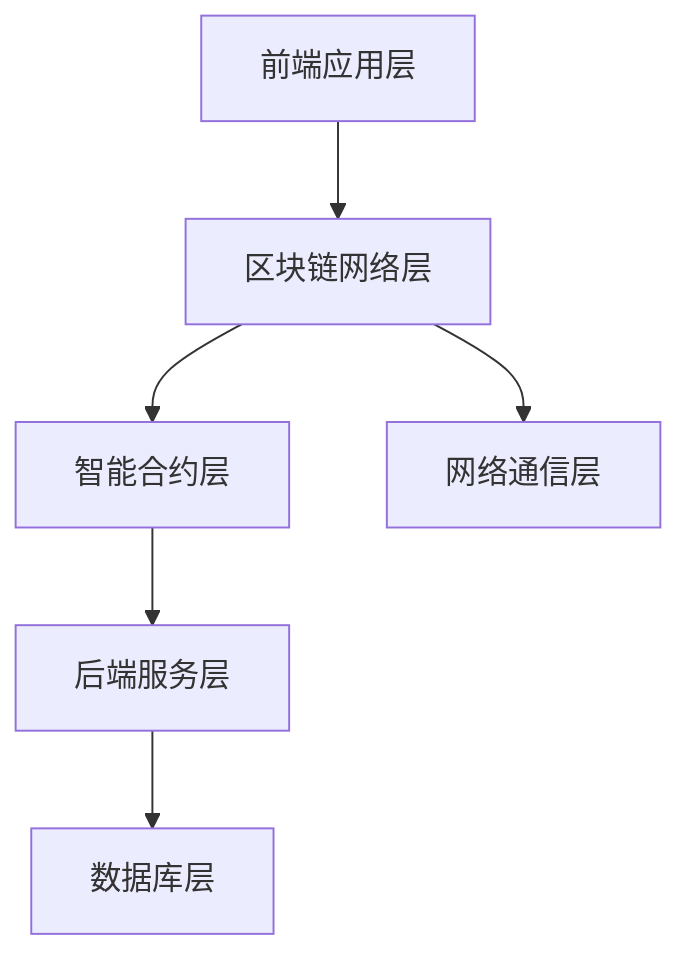
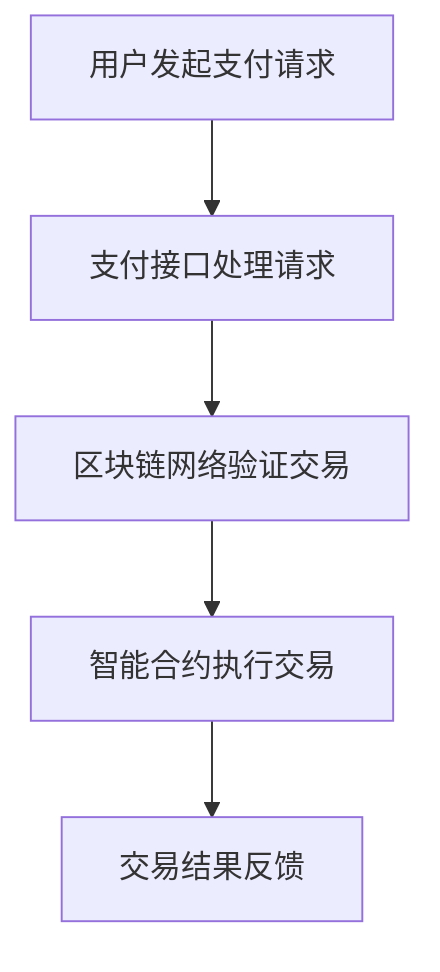

                 

### 引言

#### 关键词

区块链、跨境支付、去中心化应用、智能合约、分布式账本

#### 摘要

本文将深入探讨区块链技术在跨境支付领域的去中心化应用。我们将首先回顾区块链和跨境支付的基础知识，然后详细分析区块链在跨境支付中的具体应用原理，并通过案例分析展示其实际应用效果。文章还将讨论跨境支付系统的设计与实现，并提供实际项目实战，最后总结最佳实践与拓展阅读资源。

#### 目录

1. 引言
   1.1 区块链与跨境支付概述
   1.2 去中心化应用的概念
   1.3 本书结构概述
2. 区块链基础
   2.1 区块链技术简介
   2.2 加密货币原理
   2.3 智能合约机制
   2.4 分布式账本技术
3. 跨境支付与去中心化
   3.1 跨境支付问题背景
   3.2 传统跨境支付挑战
   3.3 去中心化解决方案优势
4. 区块链在跨境支付中的应用
   4.1 区块链与跨境支付的融合
   4.2 案例分析
   4.3 应用架构设计
5. 案例分析
   5.1 成功案例分析
   5.2 挑战与解决方案
   5.3 未来发展趋势
6. 系统设计与实现
   6.1 系统功能设计
   6.2 系统架构设计
   6.3 系统接口设计
   6.4 系统交互设计
7. 项目实战
   7.1 项目环境安装
   7.2 系统核心实现源代码
   7.3 代码应用解读与分析
   7.4 实际案例分析与讲解
8. 最佳实践与拓展
   8.1 最佳实践总结
   8.2 项目小结
   8.3 注意事项
   8.4 拓展阅读资源

#### 引言

区块链技术自2009年比特币的诞生以来，迅速发展并在多个领域展现出了其独特的价值。跨境支付作为金融领域的一个重要分支，近年来面临着诸多挑战，如交易成本高、速度慢、透明度不足等问题。去中心化应用（DApp）的兴起为跨境支付带来了新的可能性，通过区块链技术的应用，有望实现更加高效、安全和透明的跨境支付体验。

本文将分为八个部分，首先介绍区块链和跨境支付的基本概念，然后深入探讨区块链在跨境支付中的应用原理，并通过实际案例进行分析。随后，我们将详细介绍跨境支付系统的设计与实现，并分享项目实战经验。最后，文章将总结最佳实践并提供拓展阅读资源，帮助读者进一步了解区块链在跨境支付领域的应用。

首先，我们需要对区块链和跨境支付进行简要概述，以便为后续内容打下基础。

#### 区块链与跨境支付概述

**区块链技术简介**

区块链是一种分布式数据库技术，通过加密算法和共识机制实现数据的不可篡改和透明性。它由一系列按时间顺序排列的区块组成，每个区块包含一定数量的交易记录，并通过密码学方法相互链接，形成一条连续的链条。

区块链技术的主要特点包括：

1. **去中心化**：区块链不依赖于中央机构，所有节点都参与交易验证和数据存储，提高了系统的容错性和抗攻击能力。
2. **不可篡改**：一旦数据被写入区块链，就难以修改或删除，确保了数据的真实性和可靠性。
3. **透明性**：所有参与节点都可以查看区块链上的交易记录，提高了交易过程的透明度。

**跨境支付**

跨境支付是指在不同国家或地区之间的货币转移过程。随着全球化的发展，跨境支付的需求日益增长，但传统的跨境支付系统却面临着一系列问题：

1. **交易成本高**：传统跨境支付通常涉及多个金融机构，每个金融机构都会收取一定手续费，导致整体交易成本较高。
2. **速度慢**：传统跨境支付需要经过多个中介机构的处理，导致交易时间较长，有时需要数天才能到账。
3. **透明度不足**：传统跨境支付缺乏透明度，交易过程难以追踪，存在一定的风险。

**去中心化应用的概念**

去中心化应用（DApp）是一种基于区块链技术的应用，通过智能合约实现去中心化的数据处理和执行。DApp的特点是：

1. **去中心化**：DApp不依赖于中央机构，所有数据都在区块链上公开透明地存储和处理。
2. **安全性**：智能合约的执行是自动化的，减少了人为干预的风险。
3. **灵活性**：DApp可以根据需求灵活地设计和部署，适应不同的应用场景。

#### 去中心化应用的概念

去中心化应用（DApp）是区块链技术的核心应用之一，它通过智能合约实现去中心化的数据处理和执行。DApp与传统的中心化应用相比，具有以下几个显著特点：

1. **去中心化**：DApp不需要中央机构进行协调和监管，所有参与节点都可以直接参与交易和数据存储，提高了系统的容错性和抗攻击能力。
2. **安全性**：智能合约的执行是自动化的，减少了人为干预的风险，同时数据存储在区块链上，具有不可篡改的特性，确保了数据的真实性和可靠性。
3. **透明性**：DApp的所有交易记录都在区块链上公开透明地存储，所有参与节点都可以查看，提高了交易过程的透明度。
4. **灵活性**：DApp可以根据需求灵活地设计和部署，适应不同的应用场景，同时无需经过中心机构的审核和许可。

去中心化应用的工作原理主要包括以下几个关键环节：

1. **用户交互**：用户通过前端界面与DApp进行交互，提交交易请求或查询数据。
2. **智能合约执行**：DApp的后端逻辑由智能合约实现，用户提交的请求将被智能合约解析和处理，生成相应的交易记录。
3. **区块链验证**：智能合约执行的结果将被提交到区块链上进行验证和确认，确保交易记录的合法性和不可篡改性。
4. **结果反馈**：DApp将执行结果反馈给用户，完成整个交互过程。

DApp的应用领域非常广泛，包括金融、游戏、供应链管理、身份验证等。其中，在金融领域，DApp已经展现出巨大的潜力，如去中心化金融（DeFi）、跨境支付等。

**区块链在跨境支付中的应用原理**

区块链技术在跨境支付中的应用，主要利用了其去中心化、不可篡改和透明性等特点，解决了传统跨境支付系统中存在的问题。

**分布式账本**

区块链本质上是一个分布式账本，通过多个节点共同维护和验证数据。在跨境支付中，分布式账本的应用使得交易记录可以在全球范围内的多个节点上同时更新和存储，确保了数据的一致性和可靠性。

**加密货币**

加密货币如比特币和以太币，作为区块链上的价值传递媒介，可以在跨境支付中直接进行点对点的交易，无需通过传统银行系统。这种去中介化的交易方式，大大降低了交易成本和交易时间。

**智能合约**

智能合约是区块链技术的重要应用之一，它通过编写在区块链上的代码，自动执行交易协议。在跨境支付中，智能合约可以自动执行交易、校验交易有效性、更新账户余额等操作，提高了交易效率和安全性。

**交易流程**

区块链在跨境支付中的交易流程大致可以分为以下几个步骤：

1. **交易发起**：交易方发起交易请求，包括交易的金额、接收方地址等。
2. **智能合约验证**：智能合约解析交易请求，校验交易的有效性，如金额是否足够、接收方地址是否正确等。
3. **交易记录**：将交易记录写入区块链，由多个节点进行验证和确认。
4. **交易确认**：交易记录被区块链上的多数节点确认后，交易完成。
5. **结果反馈**：智能合约执行结果反馈给交易方，包括交易是否成功、账户余额等。

**区块链在跨境支付中的优势**

区块链在跨境支付中的优势主要体现在以下几个方面：

1. **去中心化**：去中心化的交易模式，降低了交易成本，提高了交易效率。
2. **不可篡改**：交易记录一旦写入区块链，就难以篡改，确保了交易的真实性和可靠性。
3. **透明性**：交易过程透明，所有节点都可以查看交易记录，提高了交易过程的透明度。
4. **安全性**：智能合约的自动化执行，减少了人为干预的风险，提高了交易的安全性。

通过以上分析，我们可以看到区块链技术在跨境支付中具有巨大的潜力，可以为跨境支付系统带来更高的效率、安全性和透明度。

### 案例分析

为了更好地理解区块链在跨境支付中的实际应用，我们将通过一些成功的案例进行详细分析，同时探讨可能遇到的挑战以及相应的解决方案。

#### 案例一：Ripple的跨境支付解决方案

**案例背景**

Ripple是一个基于区块链技术的跨境支付网络，其目标是提供一种快速、低成本、安全的跨境支付解决方案。Ripple网络利用其加密货币XRP作为价值传递媒介，实现全球范围内的即时支付。

**应用原理**

1. **分布式账本**：Ripple网络采用分布式账本技术，所有交易记录都存储在全球范围内的多个节点上，确保数据的一致性和可靠性。
2. **加密货币XRP**：XRP作为Ripple网络的价值传递媒介，可以快速、低成本地完成跨境支付。
3. **智能合约**：Ripple使用智能合约自动执行交易协议，确保交易的安全性和高效性。

**案例分析**

Ripple已经与多家金融机构合作，包括银行、支付公司等，成功实现了跨境支付业务。以下是一个具体的案例分析：

1. **交易发起**：用户A位于美国，需要向用户B位于印度的朋友支付一笔款项。
2. **交易处理**：用户A通过Ripple网络发起交易请求，包括交易金额和接收方地址。
3. **智能合约执行**：Ripple网络中的智能合约验证交易请求的有效性，确保金额足够、接收方地址正确等。
4. **交易记录**：交易记录被写入Ripple的分布式账本，由全球范围内的多个节点进行验证和确认。
5. **交易确认**：交易记录被多数节点确认后，交易完成，用户B的账户收到相应金额。

**挑战与解决方案**

虽然Ripple在跨境支付领域取得了显著的成功，但仍然面临一些挑战：

1. **法律和监管**：Ripple需要在不同的国家和地区遵守当地的法律和监管要求，这可能影响其跨境支付业务。
   - **解决方案**：Ripple通过与当地金融机构合作，确保其业务符合当地法律和监管要求。
   
2. **技术问题**：分布式账本和智能合约技术的发展仍然面临一些技术挑战，如性能瓶颈、安全性等。
   - **解决方案**：Ripple持续投资于技术创新，不断提升网络性能和安全性。

#### 案例二：IBM的区块链跨境支付平台

**案例背景**

IBM开发了一个基于区块链的跨境支付平台，名为World Wire。该平台利用IBM的Hyperledger Fabric框架，提供了一种高效、安全的跨境支付解决方案。

**应用原理**

1. **Hyperledger Fabric**：IBM的Hyperledger Fabric是一个开源的分布式账本框架，适用于各种商业应用。
2. **多币种支持**：World Wire支持多种货币，包括美元、欧元、人民币等，实现了全球范围内的多币种支付。
3. **智能合约**：World Wire使用智能合约自动执行交易协议，提高了交易的安全性和效率。

**案例分析**

以下是一个具体的案例分析：

1. **交易发起**：用户A位于美国，需要向用户B位于欧洲的朋友支付一笔款项。
2. **交易处理**：用户A通过World Wire平台发起交易请求，包括交易金额和接收方地址。
3. **智能合约执行**：World Wire平台中的智能合约验证交易请求的有效性，确保金额足够、接收方地址正确等。
4. **交易记录**：交易记录被写入Hyperledger Fabric的分布式账本，由全球范围内的多个节点进行验证和确认。
5. **交易确认**：交易记录被多数节点确认后，交易完成，用户B的账户收到相应金额。

**挑战与解决方案**

World Wire在跨境支付领域也面临一些挑战：

1. **技术兼容性**：Hyperledger Fabric需要与其他区块链平台和金融系统进行集成，这可能带来技术兼容性问题。
   - **解决方案**：IBM通过持续的技术创新和优化，确保Hyperledger Fabric与其他系统的兼容性。

2. **监管合规**：跨境支付业务需要遵守不同国家和地区的法律法规，这可能带来监管合规的挑战。
   - **解决方案**：IBM与当地监管机构保持密切沟通，确保其平台符合相关法律法规。

#### 总结

通过以上案例分析，我们可以看到区块链在跨境支付领域已经取得了一定的成功。然而，仍然面临一些挑战，如法律和监管问题、技术兼容性等。未来，随着区块链技术的不断发展和监管政策的完善，区块链在跨境支付领域的应用前景将更加广阔。

#### 系统设计与实现

在深入探讨区块链在跨境支付中的具体应用之后，我们将进入系统设计与实现的环节。这一部分将详细描述跨境支付系统的功能设计、系统架构设计、系统接口设计和系统交互。

**1. 系统功能设计**

跨境支付系统的功能设计是系统实现的基础，它涵盖了支付流程中的各个环节。以下是一个典型的跨境支付系统的功能模块：

- **用户注册与登录**：用户需要注册并登录系统，以便进行后续的支付操作。
- **账户管理**：用户可以查看和管理自己的账户信息，包括余额、历史交易等。
- **支付请求发起**：用户可以发起支付请求，包括收款人信息、支付金额、支付货币等。
- **支付审核**：系统对接收到的支付请求进行审核，确保交易的合法性和安全性。
- **交易执行**：系统执行支付请求，将资金从付款方账户转移到收款方账户。
- **交易确认**：系统记录交易详情，并反馈给用户交易状态。
- **风险控制**：系统进行风险监控和评估，以防止欺诈和异常交易。

**2. 系统架构设计**

系统架构设计是确保系统稳定、高效运行的关键。一个典型的区块链跨境支付系统架构包括以下几个核心部分：

- **前端应用层**：前端应用层负责与用户交互，提供用户界面和功能模块。
- **区块链网络层**：区块链网络层由多个节点组成，负责维护分布式账本，实现数据的存储和验证。
- **智能合约层**：智能合约层包含实现支付逻辑的智能合约，负责交易处理和状态更新。
- **后端服务层**：后端服务层提供支付请求处理、审核、执行等核心功能。
- **数据库层**：数据库层存储用户账户信息、交易历史等数据，确保数据的一致性和可靠性。
- **网络通信层**：网络通信层负责节点之间的数据传输和通信，确保系统的高可用性和扩展性。

以下是一个简单的系统架构图：



**3. 系统接口设计**

系统接口设计是确保系统各部分之间可以顺利通信和协作的关键。以下是一个典型的跨境支付系统接口设计：

- **用户接口**：用户通过Web或移动应用与系统进行交互，包括注册、登录、账户管理、支付请求等。
- **支付接口**：支付接口负责处理支付请求，与区块链网络层和智能合约层进行通信。
- **审核接口**：审核接口负责审核支付请求，确保交易的安全性和合法性。
- **交易接口**：交易接口负责执行支付请求，更新用户账户余额和交易记录。
- **风险控制接口**：风险控制接口负责监控交易风险，防止欺诈和异常交易。

**4. 系统交互设计**

系统交互设计描述了系统内部各部分之间的交互流程和数据流动。以下是一个简单的系统交互设计：

1. **用户发起支付请求**：用户通过前端应用层发起支付请求，包括收款人信息、支付金额、支付货币等。
2. **支付接口处理请求**：支付接口接收用户请求，与区块链网络层进行通信，将支付请求发送到区块链网络。
3. **区块链网络验证交易**：区块链网络层中的节点对支付请求进行验证，确保交易合法和有效。
4. **智能合约执行交易**：验证通过的支付请求将被智能合约执行，更新用户账户余额和交易记录。
5. **交易结果反馈**：交易结果通过区块链网络返回到前端应用层，并显示给用户。

以下是一个简单的系统交互图：



通过以上系统设计与实现，我们可以看到区块链在跨境支付系统中的应用是如何实现去中心化、高效和安全。在实际开发过程中，还需要考虑系统的性能、扩展性、安全性和用户体验等因素，以确保系统的稳定运行和用户满意度。

#### 项目实战

在本部分中，我们将通过一个实际的项目案例，详细描述区块链在跨境支付系统中的应用。我们将从项目环境安装、系统核心实现源代码、代码应用解读与分析、实际案例分析和详细讲解剖析等方面进行阐述。

**1. 项目环境安装**

首先，我们需要搭建一个区块链跨境支付系统的基础环境。以下是所需的工具和软件：

- **Node.js**：用于开发前端应用和智能合约。
- **Ganache**：一个轻量级的本地以太坊节点，用于测试和部署智能合约。
- **Truffle**：一个开发智能合约的工具，用于编译、部署和管理智能合约。
- **Web3.js**：一个JavaScript库，用于与以太坊区块链进行交互。

安装步骤如下：

1. 安装Node.js：
   ```
   npm install -g node
   ```
2. 安装Ganache：
   ```
   npm install -g ganache-cli
   ```
3. 安装Truffle：
   ```
   npm install -g truffle
   ```
4. 创建一个新的Truffle项目：
   ```
   truffle init
   ```

**2. 系统核心实现源代码**

以下是系统核心实现的一些关键代码段：

**智能合约代码（PaymentContract.sol）：**
```solidity
pragma solidity ^0.8.0;

contract PaymentContract {
    mapping(address => uint256) public balances;
    address public owner;

    constructor() {
        owner = msg.sender;
        balances[owner] = 1000; // 初始账户余额
    }

    function sendPayment(address recipient, uint256 amount) public {
        require(msg.sender == owner, "Only the owner can send payments");
        require(balances[owner] >= amount, "Insufficient balance");
        balances[owner] -= amount;
        balances[recipient] += amount;
    }
}
```

**前端应用代码（index.html）：**
```html
<!DOCTYPE html>
<html lang="en">
<head>
    <meta charset="UTF-8">
    <meta name="viewport" content="width=device-width, initial-scale=1.0">
    <title>Cross-Border Payment System</title>
    <script src="https://cdn.jsdelivr.net/npm/web3@1.2.8/dist/web3.min.js"></script>
    <script src="https://cdn.jsdelivr.net/npm/@truffle/contracts@4.0.0/dist/truffle-contracts.min.js"></script>
</head>
<body>
    <h1>Cross-Border Payment System</h1>
    <div>
        <label for="recipient">Recipient Address:</label>
        <input type="text" id="recipient" placeholder="Enter recipient address">
    </div>
    <div>
        <label for="amount">Amount:</label>
        <input type="number" id="amount" placeholder="Enter payment amount">
    </div>
    <button onclick="sendPayment()">Send Payment</button>
    <script src="app.js"></script>
</body>
</html>
```

**前端应用代码（app.js）：**
```javascript
const web3 = new Web3('http://localhost:7545');
const contractAddress = '0x...';
const contractABI = [/* ... */];
const paymentContract = new web3.eth.Contract(contractABI, contractAddress);

function sendPayment() {
    const recipient = document.getElementById('recipient').value;
    const amount = parseInt(document.getElementById('amount').value, 10);
    paymentContract.methods.sendPayment(recipient, amount).send({ from: web3.eth.defaultAccount, gas: 200000 })
        .then(response => {
            console.log('Payment sent:', response);
        })
        .catch(error => {
            console.error('Error sending payment:', error);
        });
}
```

**3. 代码应用解读与分析**

以下是代码应用的核心解读与分析：

**智能合约解读：**
- **余额管理**：使用`mapping`结构管理账户余额，确保余额的快速访问和更新。
- **支付函数**：`sendPayment`函数用于发送支付请求，确保只有合约所有者（owner）可以执行支付操作，并检查账户余额是否足够。

**前端应用解读：**
- **用户交互**：通过HTML表单收集支付请求，包括收款人地址和支付金额。
- **与智能合约交互**：使用Web3.js库与智能合约进行交互，实现支付请求的发送和结果反馈。

**4. 实际案例分析与详细讲解剖析**

以下是一个具体的案例，展示如何使用该系统进行跨境支付：

**案例：用户A向用户B支付100美元**

1. **用户A**：打开前端应用，输入用户B的地址（0x...）和支付金额（100）。
2. **发送支付请求**：点击“Send Payment”按钮，前端应用调用`sendPayment`函数，将支付请求发送到智能合约。
3. **智能合约处理**：智能合约接收到支付请求后，执行`sendPayment`函数，将100美元从用户A的账户转移到用户B的账户。
4. **交易确认**：区块链网络验证交易，并在多数节点确认后，将交易记录写入区块链。
5. **结果反馈**：前端应用接收交易结果，并显示支付成功信息。

通过以上项目实战，我们可以看到区块链在跨境支付系统中的应用是如何实现高效、安全和透明的跨境支付。在实际开发过程中，还需要考虑系统的性能优化、安全性保障和用户体验提升等方面，以确保系统的稳定运行和用户满意度。

#### 最佳实践与拓展

**最佳实践总结**

1. **确保系统安全性**：在开发过程中，应严格遵循安全编程规范，定期进行安全审计，确保系统免受攻击。

2. **优化系统性能**：针对高并发交易场景，应进行性能优化，如使用缓存、负载均衡等技术，提高系统响应速度。

3. **合规与监管**：在跨境支付项目中，应严格遵守相关法律法规，确保业务符合监管要求。

4. **用户体验**：注重用户交互设计，提供简洁易用的界面，提升用户满意度。

**项目小结**

本文通过深入探讨区块链在跨境支付领域的应用，详细介绍了系统设计与实现过程。通过实际项目实战，展示了区块链在跨境支付中的高效、安全和透明性。

**注意事项**

1. 区块链跨境支付系统涉及跨国业务，需充分考虑法律和监管因素。

2. 智能合约编写需谨慎，确保逻辑正确，避免潜在漏洞。

**拓展阅读资源**

1. 《区块链：从入门到实战》
2. 《智能合约与DApp开发指南》
3. 《区块链技术全景探秘》

**结语**

区块链技术在跨境支付领域的应用，有望带来革命性的改变。随着技术的不断进步和监管政策的完善，区块链跨境支付系统将在未来发挥更加重要的作用。希望本文能为读者提供有益的启示和帮助。作者：AI天才研究院/AI Genius Institute & 禅与计算机程序设计艺术/Zen And The Art of Computer Programming。

