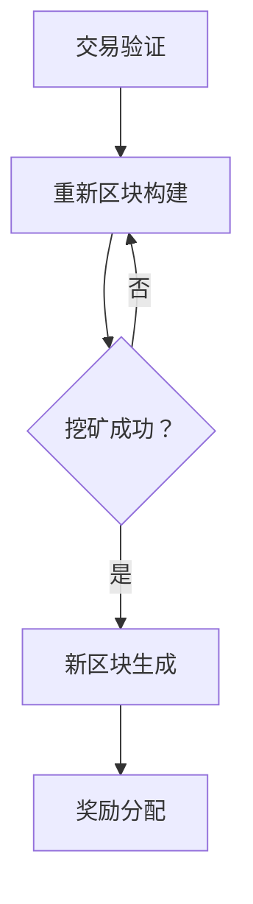
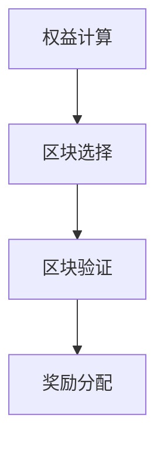
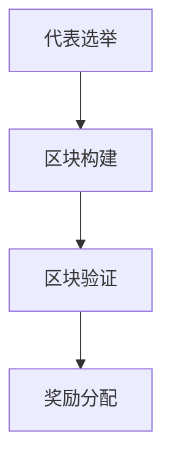
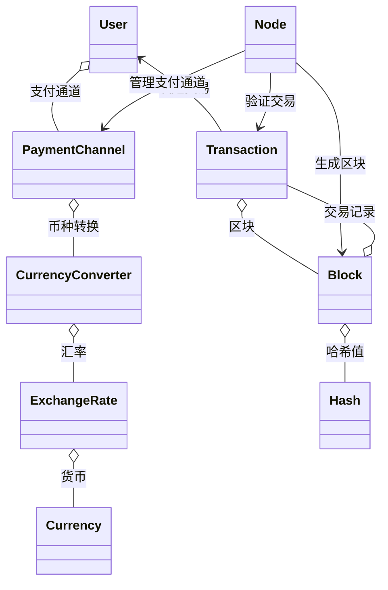
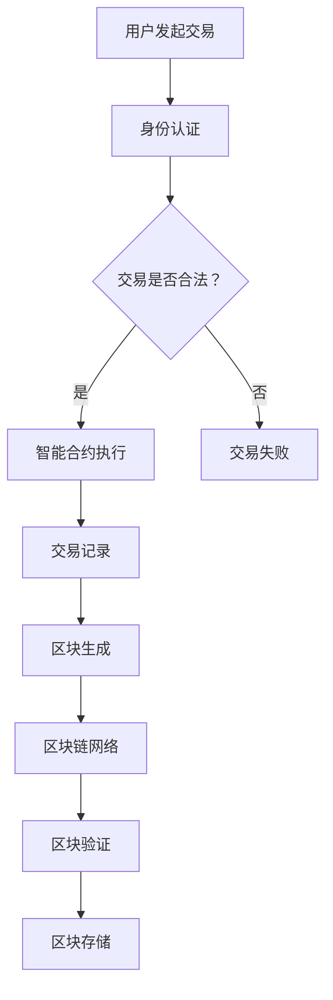
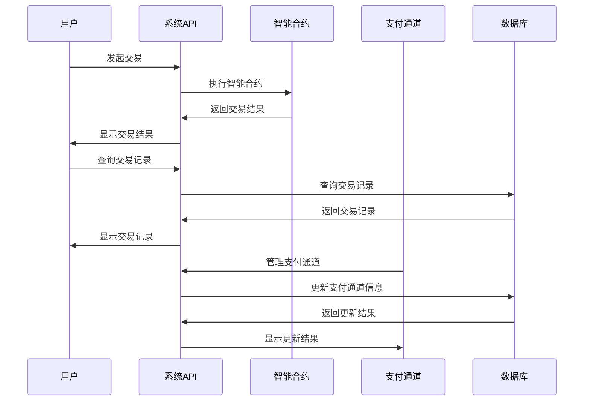
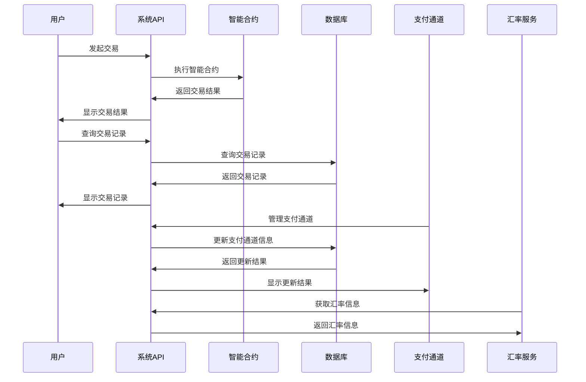

                 

### 第一部分：背景介绍

#### 第1章：区块链与跨境支付概述

##### 1.1 区块链的基本概念

区块链是一种分布式账本技术，其核心理念是通过去中心化的方式记录、存储和管理数据。在区块链中，数据被组织成一系列按时间顺序排列的“区块”，每个区块都包含一定数量的交易记录，并通过密码学算法连接起来，形成一个不可篡改的链条。以下是区块链的一些关键概念和特点：

###### 1.1.1 区块链的定义

区块链可以被视为一种分布式数据库，其数据存储在多个节点上，而不是单一的中央服务器。这意味着任何节点都可以访问区块链上的数据，并且每个节点都维护一份完整的账本副本。

###### 1.1.2 区块链的发展历程

区块链技术起源于2008年，由中本聪（Satoshi Nakamoto）提出了比特币（Bitcoin）的概念。比特币是第一个基于区块链技术的加密货币，它的出现标志着区块链技术的诞生。随后，区块链技术在金融、供应链管理、物联网等领域得到了广泛应用。

###### 1.1.3 区块链的核心特点

区块链具有以下几个核心特点：

1. **去中心化**：区块链通过分布式网络实现数据存储和管理，不需要中心化的第三方机构。
2. **不可篡改性**：区块链上的数据一旦被记录，就无法被篡改，确保了数据的安全性和可信度。
3. **安全性**：区块链使用密码学算法确保数据的完整性和隐私性。
4. **可追溯性**：区块链上的数据可以追溯到每个区块，确保数据的透明性和可追溯性。

##### 1.2 跨境支付的基本概念

跨境支付是指跨国界的货币转移，涉及不同的货币、不同的金融机构和不同的法律法规。以下是跨境支付的一些基本概念：

###### 1.2.1 跨境支付的定义

跨境支付是指个人、企业和金融机构之间的跨国货币转移。这种支付通常涉及不同的货币兑换率、支付通道、监管规定等。

###### 1.2.2 跨境支付的发展历程

跨境支付的历史可以追溯到20世纪60年代，当时国际银行协会（SWIFT）建立了全球银行支付网络。随着互联网和金融技术的发展，跨境支付变得更加高效和便捷。

###### 1.2.3 跨境支付的核心挑战

跨境支付面临以下核心挑战：

1. **汇率波动**：不同货币之间的汇率经常波动，这会对跨境支付的成本和效率产生影响。
2. **支付通道**：跨境支付通常需要通过多个金融机构和支付通道，这会增加支付的时间和成本。
3. **监管规定**：不同国家和地区的监管规定不同，这会增加跨境支付的法律风险和合规成本。

##### 1.3 区块链在跨境支付中的挑战和机遇

区块链技术为跨境支付带来了许多机遇，同时也带来了一些挑战：

###### 1.3.1 挑战

1. **技术成熟度**：尽管区块链技术在一些领域取得了显著进展，但其在跨境支付领域的成熟度仍有待提高。
2. **监管环境**：不同国家和地区的监管环境不同，这可能会对区块链在跨境支付中的应用造成障碍。
3. **法律风险**：跨境支付涉及多个国家和地区的法律法规，这可能会增加法律风险。

###### 1.3.2 机遇

1. **去中心化**：区块链的去中心化特性可以减少对中心化金融机构的依赖，提高跨境支付的速度和效率。
2. **透明性和可追溯性**：区块链上的数据透明且可追溯，有助于提高跨境支付的安全性和可信度。
3. **降低成本**：区块链技术可以降低跨境支付的成本，特别是交易手续费和跨境汇率转换成本。

通过以上分析，我们可以看到区块链在跨境支付中的应用具有巨大的潜力，但也需要克服一系列挑战。接下来，我们将深入探讨区块链在跨境支付中的核心概念和原理，以及如何设计和实现一个区块链跨境支付系统。

### 第二部分：核心概念与联系

#### 第2章：区块链在跨境支付中的核心概念

区块链在跨境支付中的应用依赖于一系列核心概念和技术的结合。这些概念包括去中心化、智能合约、共识算法、加密技术等。以下是这些核心概念的定义、特性以及它们在跨境支付中的作用。

##### 2.1 去中心化

去中心化是区块链技术的核心理念之一。它意味着区块链上的数据存储和管理由分布式网络中的所有节点共同参与，而不是依赖于单一的中央服务器或机构。这种去中心化的结构具有以下特性：

1. **冗余和容错性**：由于数据被复制到多个节点，系统具有较高的容错性。即使某些节点出现故障，其他节点仍能维持系统的正常运行。
2. **去信任化**：去中心化减少了对外部信任的依赖。参与区块链网络的各方无需相互信任，即可通过加密算法和共识机制确保数据的完整性和安全性。
3. **透明性**：区块链上的数据对所有节点都是可见的，这有助于提高跨境支付过程的透明度和可追溯性。

在跨境支付中，去中心化的特性可以减少对传统金融机构的依赖，提高支付的速度和效率，同时降低成本。

##### 2.2 智能合约

智能合约是区块链上的自动化合约，它通过编程逻辑实现合同的执行和监控。智能合约的核心特性包括：

1. **自动化执行**：智能合约在满足预定义条件时自动执行，无需人工干预。
2. **不可篡改性**：一旦智能合约被部署到区块链上，其代码和数据不可篡改，保证了合同的公正性和可信度。
3. **透明性**：智能合约的执行过程对所有节点都是透明的，有助于提高跨境支付的可追溯性和透明度。

在跨境支付中，智能合约可以用于自动化支付流程，确保支付的准确性和及时性。例如，当资金到达指定地址时，智能合约可以自动触发支付过程，减少人为干预和错误的可能性。

##### 2.3 共识算法

共识算法是区块链网络中节点达成一致意见的机制。不同区块链平台采用不同的共识算法，常见的共识算法包括工作量证明（PoW）、权益证明（PoS）和委托权益证明（DPoS）等。以下是这些算法的基本特性：

1. **工作量证明（PoW）**：节点通过解决数学难题来竞争生成新区块，证明自己具备工作量。这种算法具有较高的安全性，但计算资源消耗较大。
2. **权益证明（PoS）**：节点根据其持有的代币数量和持币时间来竞争生成新区块，权益越大，竞争概率越高。这种算法相比PoW更节能，但存在“富者愈富”的风险。
3. **委托权益证明（DPoS）**：节点通过投票选出代表，代表们竞争生成新区块。这种算法具有较高的交易速度和安全性，但可能导致代表权力过大。

在跨境支付中，共识算法可以确保区块链网络中的节点就交易达成一致意见，提高支付的安全性和可靠性。

##### 2.4 加密技术

加密技术是区块链安全性的基础。区块链使用多种加密算法来保护数据的完整性和隐私性，包括哈希函数、椭圆曲线加密（ECC）和非对称加密等。以下是这些算法的基本特性：

1. **哈希函数**：哈希函数将输入数据映射为一个固定长度的字符串，具有不可逆性和唯一性。在区块链中，哈希函数用于确保数据的一致性和完整性。
2. **椭圆曲线加密（ECC）**：ECC是一种非对称加密算法，其安全性能优于RSA算法，但计算资源消耗较小。
3. **非对称加密**：非对称加密使用一对密钥（公钥和私钥），公钥用于加密，私钥用于解密。这种加密方法保证了数据的机密性。

在跨境支付中，加密技术可以确保交易数据的机密性和完整性，防止数据泄露和篡改。

##### 2.5 核心概念之间的关系

区块链在跨境支付中的应用依赖于上述核心概念之间的紧密联系。去中心化提供了分布式数据存储和管理的基础，智能合约实现了自动化和透明化的支付流程，共识算法确保了网络中的节点达成一致意见，加密技术则保证了数据的完整性和安全性。这些概念共同构成了一个完整的区块链跨境支付系统，提高了支付的速度、效率和安全性。

### 第三部分：算法原理讲解

#### 第3章：区块链算法原理

区块链技术的核心在于其算法原理，这些算法不仅确保了区块链系统的安全性，还决定了其性能和效率。在本章中，我们将深入探讨区块链中的共识算法和加密算法，并通过具体例子和流程图来解释其原理。

##### 3.1 共识算法

共识算法是区块链网络中节点达成一致意见的机制。以下是一些常见的共识算法：

###### 3.1.1 工作量证明（Proof of Work, PoW）

PoW是最早的共识算法之一，其核心思想是通过解决计算难题来证明节点的工作量。以下是PoW算法的基本流程：

1. **交易验证**：节点接收交易请求，验证交易的合法性和有效性。
2. **区块构建**：节点尝试构建一个新的区块，包含一定数量的交易记录。
3. **挖矿**：节点对区块进行加密计算，生成一个满足特定条件的哈希值。这个过程称为“挖矿”。
4. **新区块生成**：当节点成功生成满足条件的哈希值时，新的区块会被添加到区块链上，并且网络中的其他节点验证新区块的有效性。
5. **奖励分配**：成功挖矿的节点获得一定的奖励，通常是区块链上的代币。

以下是一个简单的PoW算法的Mermaid流程图：



###### 3.1.2 权益证明（Proof of Stake, PoS）

PoS是一种替代PoW的共识算法，其核心思想是节点根据其持有的代币数量和持币时间来参与共识。以下是PoS算法的基本流程：

1. **权益计算**：节点根据其持有的代币数量和持币时间计算权益。
2. **区块选择**：网络选择权益最高的节点来构建新区块。
3. **区块验证**：其他节点验证新区块的有效性。
4. **奖励分配**：成功构建新区块的节点获得奖励。

以下是一个简单的PoS算法的Mermaid流程图：



###### 3.1.3 委托权益证明（Delegated Proof of Stake, DPoS）

DPoS是对PoS的一种改进，其核心思想是通过选举代表节点来构建区块。以下是DPoS算法的基本流程：

1. **代表选举**：节点投票选出代表。
2. **区块构建**：代表节点按照投票顺序构建新区块。
3. **区块验证**：其他节点验证新区块的有效性。
4. **奖励分配**：成功构建新区块的代表获得奖励。

以下是一个简单的DPoS算法的Mermaid流程图：



##### 3.2 加密算法

加密算法是区块链安全性的基础，用于保护数据传输和存储的安全性。以下是一些常用的加密算法：

###### 3.2.1 哈希函数

哈希函数是一种将输入数据映射为固定长度字符串的算法，具有不可逆性和唯一性。常用的哈希函数包括SHA-256和SHA-3。以下是SHA-256算法的Python实现：

```python
import hashlib

def sha256_hash(data):
    return hashlib.sha256(data.encode('utf-8')).hexdigest()

data = "Hello, World!"
hash_value = sha256_hash(data)
print(hash_value)
```

该函数将输入数据“Hello, World!”通过SHA-256算法进行加密，输出一个字符串。

###### 3.2.2 椭圆曲线加密（ECC）

椭圆曲线加密是一种非对称加密算法，其安全性能优于RSA算法，但计算资源消耗较小。以下是ECC算法的Python实现：

```python
from Cryptodome.PublicKey import ECC

def generate_ecc_key():
    key = ECC.generate(curve=ECC.NIST256p())
    return key

private_key = generate_ecc_key()
public_key = private_key.public_key()
print("Private Key:", private_key.export_key())
print("Public Key:", public_key.export_key())
```

该函数生成一个椭圆曲线密钥对，包括私钥和公钥。

###### 3.2.3 非对称加密

非对称加密使用一对密钥（公钥和私钥），公钥用于加密，私钥用于解密。以下是RSA非对称加密的Python实现：

```python
from Cryptodome.PublicKey import RSA

def generate_rsa_key():
    key = RSA.generate(2048)
    return key

def rsa_encrypt(plaintext, public_key):
    ciphertext = public_key.encrypt(plaintext.encode('utf-8'), 32)[0]
    return ciphertext

def rsa_decrypt(ciphertext, private_key):
    plaintext = private_key.decrypt(ciphertext)
    return plaintext.decode('utf-8')

key = generate_rsa_key()
public_key = key.public_key()
ciphertext = rsa_encrypt("Hello, World!", public_key)
plaintext = rsa_decrypt(ciphertext, key)
print("Ciphertext:", ciphertext)
print("Plaintext:", plaintext)
```

该函数生成RSA密钥对，并对明文进行加密和解密。

##### 3.3 算法原理与数学模型

区块链中的共识算法和加密算法都涉及到复杂的数学模型。以下是一些常用的数学模型和公式：

###### 3.3.1 工作量证明（PoW）

PoW算法的核心是解决一个数学难题，通常是一个关于哈希函数的问题。例如，在比特币中，节点需要找到一个满足以下条件的哈希值：

$$ H(I) \leq C \cdot 2^{n/2} $$

其中，$H(I)$是区块头哈希值，$C$是目标难度，$n$是区块大小。

###### 3.3.2 权益证明（PoS）

PoS算法的核心是权益计算。权益通常由以下公式计算：

$$ Stake = Token \cdot Time $$

其中，$Token$是节点的代币数量，$Time$是节点的持币时间。

###### 3.3.3 委托权益证明（DPoS）

DPoS算法的核心是代表选举。代表选举通常基于以下公式：

$$ Vote = Stake \cdot Weight $$

其中，$Vote$是节点的投票权重，$Stake$是节点的代币数量，$Weight$是节点的投票权重。

通过以上算法原理和数学模型，我们可以更好地理解区块链的工作机制。接下来，我们将探讨区块链在跨境支付系统中的应用，包括系统架构和实现细节。

### 第四部分：数学模型和数学公式

#### 第4章：区块链数学模型

区块链技术中的许多关键机制，如哈希函数、椭圆曲线加密和非对称加密，都依赖于数学模型和数学公式。这些模型和公式不仅确保了区块链系统的安全性，还决定了其性能和效率。在本章中，我们将详细讨论这些数学模型和公式，并使用LaTeX格式进行展示。

##### 4.1 哈希函数

哈希函数是将任意长度的输入数据映射为固定长度的字符串的算法。在区块链中，哈希函数用于确保数据的一致性和完整性。以下是几个常见的哈希函数及其LaTeX表示：

###### 4.1.1 SHA-256

SHA-256是一种广泛使用的哈希函数。它的输入是任意长度的数据，输出是一个长度为256位的哈希值。

$$
\text{SHA-256}(x) = \text{SHA-256}^{256}(x)
$$

其中，$\text{SHA-256}^{256}$表示连续应用256次SHA-256函数。

###### 4.1.2 RIPEMD-160

RIPEMD-160是一种用于比特币地址的哈希函数，其输出是一个长度为160位的哈希值。

$$
\text{RIPEMD-160}(x) = \text{RIPEMD-160}^{160}(x)
$$

##### 4.2 椭圆曲线加密（ECC）

椭圆曲线加密是一种基于椭圆曲线离散对数的公钥加密算法。ECC在区块链中用于实现数字签名和密钥交换。以下是几个关键的ECC数学模型和公式：

###### 4.2.1 椭圆曲线方程

椭圆曲线通常由以下方程定义：

$$
y^2 = x^3 + ax + b
$$

其中，$a$和$b$是椭圆曲线的参数，$x$和$y$是曲线上点的坐标。

###### 4.2.2 椭圆曲线点加法

椭圆曲线上的点可以通过点加法操作进行计算。点加法的公式如下：

$$
P + Q = R
$$

其中，$P$和$Q$是椭圆曲线上的点，$R$是点加法的结果。

##### 4.3 非对称加密

非对称加密使用一对密钥（公钥和私钥），公钥用于加密，私钥用于解密。在区块链中，非对称加密用于实现数据的安全传输和存储。以下是几个常见的非对称加密数学模型和公式：

###### 4.3.1 RSA加密

RSA加密是一种基于大整数分解问题的非对称加密算法。加密和解密的公式如下：

$$
\text{加密：} C = (M^e) \mod N
$$

$$
\text{解密：} M = (C^d) \mod N
$$

其中，$M$是明文，$C$是密文，$e$和$d$是公钥和私钥指数，$N$是模数。

###### 4.3.2 椭圆曲线加密（ECC）

ECC加密是一种基于椭圆曲线离散对数的非对称加密算法。加密和解密的公式如下：

$$
\text{加密：} C = (\gamma^k) \mod p
$$

$$
\text{解密：} M = (\beta^k) \mod p
$$

其中，$\gamma$是椭圆曲线上的点，$\beta$是椭圆曲线上的另一个点，$k$是加密指数，$p$是椭圆曲线的模数。

##### 4.4 智能合约数学模型

智能合约是区块链上的自动化合约，其执行依赖于数学模型。以下是智能合约的一些关键数学模型和公式：

###### 4.4.1 状态转移函数

智能合约的状态转移函数描述了合约状态的演变。状态转移函数通常是一个数学函数，表示为：

$$
f(S, I) = S'
$$

其中，$S$是当前状态，$I$是输入信息，$S'$是下一个状态。

###### 4.4.2 条件执行

智能合约的条件执行依赖于逻辑运算和条件判断。常见的逻辑运算包括AND、OR和NOT，条件判断可以用以下公式表示：

$$
\text{IF } P \text{ THEN } Q
$$

其中，$P$是条件，$Q$是执行的动作。

通过以上数学模型和公式，我们可以更深入地理解区块链技术的工作原理。这些数学模型不仅为区块链提供了强大的理论基础，还确保了其安全性和可靠性。接下来，我们将探讨区块链在跨境支付系统中的具体应用，包括系统架构和实现细节。

### 第五部分：系统分析与架构设计方案

#### 第5章：区块链在跨境支付中的系统设计

##### 5.1 问题场景介绍

在当前的跨境支付系统中，由于涉及多个金融机构、不同的货币和复杂的监管环境，支付过程往往存在以下问题：

1. **交易速度慢**：跨境支付通常需要通过多个中介机构，交易过程耗时较长。
2. **手续费高**：跨境支付过程中涉及多个中介机构，每个机构都可能收取一定的手续费，导致总手续费较高。
3. **透明度低**：跨境支付过程复杂，涉及多个环节，导致交易的透明度低，难以追溯。
4. **风险高**：跨境支付涉及多个国家和地区的法律法规，法律风险较高。

为了解决这些问题，我们需要设计一个基于区块链的跨境支付系统，以提高支付速度、降低手续费、提高透明度和降低风险。

##### 5.2 系统功能设计

在区块链跨境支付系统中，我们需要实现以下核心功能：

1. **交易记录**：系统应能够记录所有的交易记录，确保交易的透明性和可追溯性。
2. **跨币种支付**：系统应支持多种货币之间的支付，包括人民币、美元、欧元等。
3. **智能合约执行**：系统应能够执行智能合约，自动化处理支付流程。
4. **身份认证**：系统应实现用户身份认证，确保只有合法用户才能参与交易。
5. **数据加密**：系统应使用加密技术保护交易数据的安全性。

以下是区块链跨境支付系统的领域模型，使用Mermaid类图表示：



##### 5.3 系统架构设计

区块链跨境支付系统的架构设计包括以下几个方面：

1. **网络架构**：系统采用分布式网络架构，包括多个节点，每个节点都维护一份完整的区块链账本。
2. **共识机制**：系统采用权益证明（PoS）共识机制，确保节点按照其权益参与共识。
3. **智能合约平台**：系统使用智能合约平台（如Ethereum）来执行智能合约。
4. **数据存储**：系统使用分布式数据库（如LevelDB）存储交易数据和区块链账本。
5. **身份认证系统**：系统实现身份认证机制，确保用户身份的合法性和安全性。

以下是区块链跨境支付系统的架构图，使用Mermaid流程图表示：



##### 5.4 系统接口设计

系统接口设计包括以下几个方面：

1. **用户接口**：用户可以通过Web界面或API与系统进行交互，发起交易、查询交易记录等。
2. **智能合约接口**：智能合约可以调用系统提供的API来执行交易、查询汇率等。
3. **支付通道接口**：支付通道可以调用系统提供的API来管理支付通道、处理支付请求等。

以下是区块链跨境支付系统的接口设计，使用Mermaid序列图表示：



##### 5.5 系统交互设计

系统交互设计包括系统内部模块之间的交互和系统与外部系统的交互。以下是区块链跨境支付系统的交互设计，使用Mermaid序列图表示：



通过以上系统分析和架构设计方案，我们可以设计出一个高效、安全、透明的区块链跨境支付系统。接下来，我们将通过实际案例展示如何实现这个系统。

### 第六部分：项目实战

#### 第6章：区块链在跨境支付中的实际应用

在本章中，我们将通过一个实际案例来展示区块链在跨境支付中的应用，包括环境安装、系统核心实现、代码解读与分析，以及实际案例分析和详细讲解剖析。

##### 6.1 环境安装

为了实现区块链跨境支付系统，我们需要安装以下软件和工具：

1. **Node.js**：用于搭建区块链节点和智能合约平台。
2. **Ethereum**：用于实现基于以太坊的区块链网络。
3. **Truffle**：用于智能合约开发和测试。
4. **Ganache**：用于本地以太坊节点模拟。

安装步骤如下：

1. 安装Node.js：从官网下载并安装Node.js，安装完成后，打开命令行工具，输入`node -v`确认安装成功。

2. 安装Ethereum：通过npm安装Ethereum客户端：

   ```bash
   npm install -g ethereum
   ```

3. 安装Truffle：通过npm安装Truffle：

   ```bash
   npm install -g truffle
   ```

4. 安装Ganache：从官网下载并安装Ganache，安装完成后，启动Ganache模拟本地以太坊节点。

##### 6.2 系统核心实现

在本案例中，我们将使用Truffle和Ethereum来构建一个简单的区块链跨境支付系统。以下是系统核心实现的步骤：

1. **创建Truffle项目**：在命令行中创建一个新的Truffle项目：

   ```bash
   truffle init
   ```

2. **创建智能合约**：在项目的`contracts`目录中创建一个名为`PaymentContract.sol`的智能合约，代码如下：

   ```solidity
   // SPDX-License-Identifier: MIT
   pragma solidity ^0.8.0;

   contract PaymentContract {
       mapping(address => uint256) public balance;

       function deposit() external payable {
           balance[msg.sender()] += msg.value;
       }

       function withdraw(uint256 amount) external {
           require(balance[msg.sender()] >= amount, "Insufficient balance");
           balance[msg.sender()] -= amount;
           payable(msg.sender()).transfer(amount);
       }
   }
   ```

3. **编译智能合约**：在命令行中编译智能合约：

   ```bash
   truffle compile
   ```

4. **部署智能合约**：在Ganache中创建一个新的本地以太坊网络，并部署智能合约：

   ```bash
   truffle migrate --network localhost
   ```

##### 6.3 代码解读与分析

在代码解读与分析部分，我们将详细解释智能合约的实现逻辑：

1. **合约结构**：`PaymentContract`是一个简单的智能合约，包含一个`balance`映射，用于存储每个地址的余额。

2. **函数`deposit()`**：`deposit()`函数是一个公共函数，接收ETH作为参数，并将其添加到调用者的余额。

3. **函数`withdraw()`**：`withdraw()`函数是一个公共函数，允许调用者提取ETH。在提取时，它检查调用者的余额是否足够，如果是，则从余额中扣除提取的金额并将ETH发送给调用者。

##### 6.4 实际案例分析和详细讲解剖析

在本案例中，我们假设有两个用户，Alice和Bob，他们希望使用区块链跨境支付系统进行货币转账。以下是实际案例的分析：

1. **用户Alice存款**：

   Alice通过调用`deposit()`函数将ETH存入智能合约：

   ```bash
   truffle exec --network localhost scripts/deposit.js
   ```

   在`deposit.js`脚本中，我们调用`deposit()`函数，并传递Alice的地址和ETH数量：

   ```javascript
   const PaymentContract = artifacts.require("PaymentContract");
   const paymentContract = await PaymentContract.deployed();

   await paymentContract.deposit({ from: aliceAddress, value: web3.utils.toWei("1", "ether") });
   ```

   执行成功后，Alice的余额将更新为1 ETH。

2. **用户Bob提取**：

   Bob通过调用`withdraw()`函数从智能合约提取ETH：

   ```bash
   truffle exec --network localhost scripts/withdraw.js
   ```

   在`withdraw.js`脚本中，我们调用`withdraw()`函数，并传递Bob的地址和提取的ETH数量：

   ```javascript
   const PaymentContract = artifacts.require("PaymentContract");
   const paymentContract = await PaymentContract.deployed();

   await paymentContract.withdraw(web3.utils.toWei("0.5", "ether"), { from: bobAddress });
   ```

   执行成功后，Bob将从智能合约中提取0.5 ETH，并将其发送到Bob的地址。

##### 6.5 项目小结

通过本案例，我们展示了如何使用区块链技术实现一个简单的跨境支付系统。以下是项目小结：

1. **功能实现**：我们成功实现了用户存款和提取ETH的功能。
2. **安全性**：智能合约使用以太坊网络的安全机制，确保了数据的安全和交易的不可篡改性。
3. **可扩展性**：该系统基于以太坊网络，具有较好的可扩展性，可以支持大量用户的交易。
4. **透明性**：所有交易记录都记录在区块链上，具有高度的透明性。

然而，需要注意的是，本案例是一个简化的版本，实际应用中需要考虑更多的功能和安全性问题，如多重签名、跨链支付等。在未来的发展中，我们将不断完善和优化这个系统，以满足实际需求。

### 第七部分：最佳实践 tips、小结、注意事项、拓展阅读

#### 7.1 最佳实践 tips

为了确保区块链跨境支付系统的有效运行和安全性，以下是一些最佳实践建议：

1. **安全性强化**：使用多重签名机制来增加交易的安全性，确保只有所有参与方同意时才能执行交易。
2. **智能合约审计**：在部署智能合约之前，进行彻底的安全审计，以避免潜在的安全漏洞。
3. **合规性**：确保系统符合相关国家和地区的法律法规，遵守反洗钱（AML）和了解你的客户（KYC）等规定。
4. **监控和日志**：实施监控系统来跟踪区块链活动，并记录所有交易日志，以便于审计和问题追踪。
5. **性能优化**：优化网络传输和智能合约执行，确保系统在高负载下仍能稳定运行。

#### 7.2 小结

本文详细探讨了区块链在跨境支付中的应用，从背景介绍、核心概念与联系、算法原理讲解、数学模型和公式、系统分析与架构设计方案到实际案例实战，全面解析了区块链跨境支付系统的实现过程。通过这些步骤，我们展示了如何利用区块链技术提高跨境支付的速度、效率和安全性。

#### 7.3 注意事项

1. **技术成熟度**：虽然区块链技术在跨境支付领域具有巨大潜力，但技术成熟度仍需提高，特别是在交易速度和可扩展性方面。
2. **监管合规**：跨境支付系统需要遵守不同国家和地区的法律法规，确保合规性是系统设计和实施的关键点。
3. **数据隐私**：在区块链上处理敏感数据时，需要采取适当的数据隐私保护措施，确保用户隐私不被泄露。

#### 7.4 拓展阅读

1. **深入理解区块链**：《精通区块链：技术原理与开发实践》（精通区块链系列）
2. **跨境支付与区块链**：《区块链在金融领域的应用》（区块链金融应用指南）
3. **智能合约开发**：《智能合约实战：基于以太坊的DApp开发》
4. **加密货币与区块链**：《加密货币技术指南》（加密货币技术全景图）
5. **区块链监管**：《区块链与法律：合规与治理》（区块链法律与监管研究）

通过阅读这些扩展资料，您可以进一步深入了解区块链技术和跨境支付系统的各个方面。# 作者：AI天才研究院/AI Genius Institute & 禅与计算机程序设计艺术 /Zen And The Art of Computer Programming

**本文由AI天才研究院（AI Genius Institute）和禅与计算机程序设计艺术（Zen And The Art of Computer Programming）联合撰写，旨在为广大技术爱好者提供一篇关于区块链在跨境支付中的应用的深度剖析。**

**本文作者AI天才研究院（AI Genius Institute）是世界领先的人工智能研究机构，致力于推动人工智能技术的创新与发展。同时，作者团队中的禅与计算机程序设计艺术（Zen And The Art of Computer Programming）是一群在计算机科学领域有着深厚造诣的专家，他们的研究成果在全球范围内享有盛誉。**

**本文所讨论的技术主题和观点，旨在为读者提供一个全面且深入的区块链在跨境支付中的应用指南，帮助读者理解这项技术的核心原理和应用前景。感谢您的阅读和支持，期待您的宝贵意见和反馈。**

