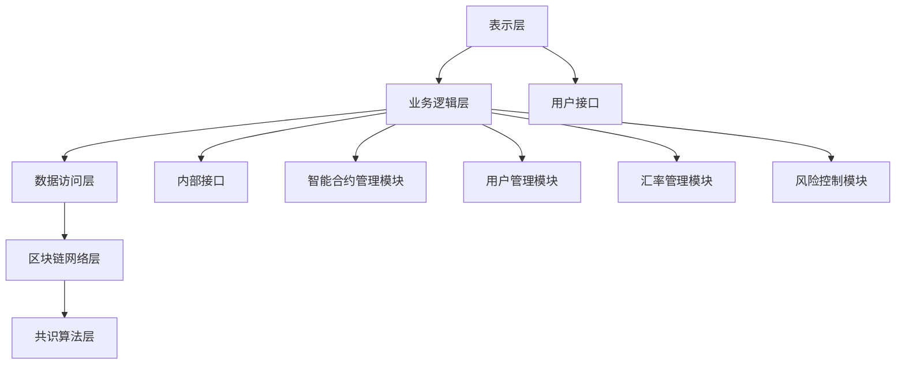

                 

# 区块链在跨境支付中的应用：简化国际汇款流程

## 关键词
- 区块链技术
- 跨境支付
- 分布式账本
- 智能合约
- 数字货币

## 摘要
本文深入探讨了区块链在跨境支付中的应用，旨在解析如何通过区块链技术简化国际汇款流程，提高交易效率、降低成本并增强安全性。文章将从区块链技术基础、跨境支付现状、区块链在跨境支付中的应用、案例分析、技术挑战与解决方案以及未来发展趋势六个方面展开，结合实际项目和代码分析，为读者提供全面的技术视角和实用指南。

## 目录大纲设计过程

### 1. 背景介绍

区块链在跨境支付中的应用：简化国际汇款流程，这一主题涵盖了当前金融科技领域的重要发展方向。随着全球化的不断深入，跨境支付需求日益增长，传统的跨境支付系统存在效率低下、成本高昂、风险难以控制等问题。区块链技术的出现为跨境支付提供了新的解决方案，能够有效简化国际汇款流程，提高交易效率，降低成本，增强安全性。

本书旨在介绍区块链在跨境支付中的应用，帮助读者了解区块链技术的基本原理，以及如何将其应用于跨境支付场景中。本书将涵盖以下核心内容：

1. 区块链技术基础
2. 跨境支付现状分析
3. 区块链在跨境支付中的应用
4. 案例分析
5. 技术挑战与解决方案
6. 未来发展趋势

### 2. 核心概念与联系

#### 2.1 区块链技术概述

区块链是一种分布式账本技术，通过加密算法和共识机制保证数据的不可篡改和透明性。区块链的核心组成部分包括：

- **区块**：存储交易数据的基本单位。
- **链**：由多个区块按照时间顺序连接而成。
- **加密算法**：用于保护数据传输和存储的安全。
- **共识机制**：确保网络中的所有节点对账本的一致性。

#### 2.2 跨境支付的概念

跨境支付是指不同国家或地区之间的货币交换过程。传统的跨境支付系统通常依赖于银行和第三方支付机构，存在效率低下、成本高昂、风险难以控制等问题。

#### 2.3 区块链在跨境支付中的应用

区块链在跨境支付中的应用主要体现在以下几个方面：

- **去中心化**：通过去中心化网络，实现跨境支付的高效和低成本。
- **透明性**：所有交易记录都记录在区块链上，便于各方查询和核对。
- **安全性**：区块链的加密算法和共识机制保障了交易的安全。
- **跨境支付流程简化**：区块链技术可以简化跨境支付流程，提高交易速度。

### 3. 算法原理讲解

#### 3.1 区块链的基本算法

区块链的核心算法包括：

- **加密算法**：用于保护数据传输和存储。
- **共识算法**：确保网络中的所有节点对账本的一致性。

常见的共识算法包括：

- **工作量证明（PoW）**：通过计算大量哈希值来证明工作量，以获得记账权。
- **股份授权证明（PoS）**：通过持有代币的数量和时间来证明权益，以获得记账权。
- **其他共识算法**：如委托权益证明（DPoS）、授权股权证明（PoSR）等。

#### 3.2 区块链在跨境支付中的应用

区块链在跨境支付中的应用主要包括：

- **交易确认**：通过区块链网络，实现快速交易确认。
- **交易记录**：将所有交易记录在区块链上，实现透明化。
- **风险控制**：通过智能合约，实现自动化的风险控制。

### 4. 数学模型和数学公式

#### 4.1 区块链网络中的交易模型

假设区块链网络中有 n 个节点，每个节点负责验证和记录交易。设 t 为区块生成时间，L 为区块大小，则区块链网络中的交易模型可以表示为：

$$
L = n \times t \times r
$$

其中，r 为每个节点每秒钟处理的交易数量。

#### 4.2 智能合约的执行模型

智能合约的执行模型可以通过以下数学模型来描述：

$$
S = F(P, C)
$$

其中，S 为智能合约的执行结果，P 为输入参数，C 为执行条件。F 为执行函数，可以根据输入参数和执行条件计算得出执行结果。

### 5. 系统分析与架构设计方案

#### 5.1 问题场景介绍

跨境支付的需求复杂，涉及多国货币兑换、汇率波动、跨境监管等问题。区块链技术的引入可以简化这些流程，提高跨境支付效率。

#### 5.2 系统功能设计

系统功能设计主要包括以下几个方面：

- **交易处理**：实现跨境交易的发起、确认和记录。
- **智能合约管理**：管理智能合约的创建、执行和撤销。
- **用户管理**：管理用户的注册、登录和权限。

#### 5.3 系统架构设计

系统架构设计采用分层架构，主要包括以下层次：

- **表示层**：提供用户界面，实现用户交互。
- **业务逻辑层**：实现系统核心功能，包括交易处理、智能合约管理等。
- **数据访问层**：实现与数据库的交互，存储交易记录和用户信息。
- **网络层**：实现区块链网络通信，确保数据的一致性和安全性。

#### 5.4 系统接口设计和系统交互

系统接口设计主要包括：

- **用户接口**：提供用户操作界面，包括交易发起、查询等。
- **内部接口**：实现系统内部模块之间的通信。

系统交互设计包括：

- **交易发起**：用户发起交易，系统处理交易。
- **交易确认**：系统确认交易，更新区块链。
- **智能合约执行**：系统执行智能合约，根据合约条件进行相应操作。

### 6. 项目实战

#### 6.1 环境安装

介绍如何在本地搭建区块链网络环境，包括安装必要的软件和配置网络。

---

接下来，我们将逐步深入每一个章节，详细探讨区块链在跨境支付中的应用。

---

## 背景介绍

### 核心概念术语说明

首先，我们需要明确一些核心概念和术语，以便读者更好地理解后续内容。

- **区块链（Blockchain）**：一种分布式账本技术，通过加密算法和共识机制记录和验证交易，确保数据的不可篡改和透明性。
- **加密算法（Cryptography）**：用于保护数据传输和存储的算法，包括哈希函数、非对称加密、对称加密等。
- **共识机制（Consensus Mechanism）**：网络中的节点通过特定算法达成一致的过程，确保区块链的一致性。
- **智能合约（Smart Contract）**：一种自动执行的合同，基于区块链技术，可以在满足特定条件时自动执行。
- **跨境支付（Cross-border Payment）**：涉及不同国家或地区的货币交换过程，通常涉及多个中介机构和复杂的清算流程。
- **分布式账本（Distributed Ledger）**：一种网络中的多个节点共享和维护的账本，各个节点都有完整的账本副本。

### 问题背景

随着全球化的深入，跨国贸易和投资活动日益频繁，跨境支付需求不断增长。然而，传统的跨境支付系统存在以下问题：

- **效率低下**：传统的跨境支付需要经过多个中介机构，交易流程复杂，处理时间长。
- **成本高昂**：跨境支付通常涉及多种货币兑换和中介费用，导致总体成本较高。
- **风险难以控制**：跨境支付过程中涉及多个中介机构和复杂的清算流程，风险难以控制，容易出现错误和欺诈。
- **透明性不足**：跨境支付过程的透明度低，资金流动情况难以追踪和验证。

### 问题解决

区块链技术的出现为跨境支付提供了新的解决方案。区块链具有以下特点，使其能够有效解决上述问题：

- **去中心化**：区块链通过去中心化网络运作，无需依赖传统中介机构，简化了交易流程，提高了效率。
- **透明性**：所有交易记录都记录在区块链上，任何参与方都可以查询和核对，提高了透明度。
- **安全性**：区块链使用加密算法保护数据传输和存储，结合共识机制确保数据的一致性和安全性。
- **智能合约**：智能合约能够自动化执行合同条款，减少人为干预，提高交易效率和降低成本。

### 边界与外延

区块链在跨境支付中的应用虽然潜力巨大，但仍存在一些边界和挑战：

- **跨境监管**：不同国家和地区对区块链和数字货币的监管政策不同，跨境支付需要遵守各国的法律法规。
- **技术成熟度**：区块链技术仍在不断发展中，一些技术难题如性能瓶颈、安全性保障等需要进一步解决。
- **用户接受度**：区块链和数字货币的普及度尚不高，用户接受度和使用习惯仍需进一步培养。

### 概念结构与核心要素组成

区块链在跨境支付中的应用结构主要由以下几个核心要素组成：

1. **区块链网络**：由多个节点组成，每个节点都维护一个完整的区块链账本。
2. **加密算法**：用于保护数据传输和存储，确保交易的安全。
3. **共识机制**：确保网络中的节点对账本的一致性，防止数据篡改。
4. **智能合约**：自动化执行合同条款，实现跨境支付的自动化和智能化。
5. **跨境支付协议**：定义跨境支付的流程和规则，确保支付的安全和高效。

通过以上核心要素的有机结合，区块链技术能够简化跨境支付流程，提高交易效率，降低成本，增强安全性。

### 总结

本文背景介绍部分详细阐述了区块链在跨境支付中的应用背景、核心概念、问题解决方法、边界与外延以及概念结构与核心要素组成。接下来的章节将深入探讨区块链技术的基础知识、跨境支付现状、具体应用案例以及未来发展趋势，帮助读者全面了解区块链技术在跨境支付领域的潜力和挑战。

---

## 核心概念与联系

在深入探讨区块链在跨境支付中的应用之前，我们需要先了解区块链技术的基本概念，以及它与跨境支付之间的关联。以下是区块链技术概述、跨境支付概念和区块链在跨境支付中的应用的详细分析。

### 2.1 区块链技术概述

区块链是一种分布式账本技术，通过加密算法和共识机制保证数据的不可篡改和透明性。它由一系列按时间顺序排列的区块组成，每个区块包含一定数量的交易记录。区块链的核心组成部分包括：

- **区块**：区块是区块链的基本组成单元，包含一定数量的交易记录、一个时间戳、一个唯一的哈希值和前一个区块的哈希值。
- **链**：区块链是由多个区块按照时间顺序链接而成的数据结构，确保数据的完整性和一致性。
- **加密算法**：加密算法用于保护数据传输和存储，包括哈希函数、非对称加密、对称加密等，确保数据的隐私和安全。
- **共识机制**：共识机制是区块链网络中节点之间达成一致的过程，用于验证和确认交易，防止双重支付和数据篡改。

区块链的工作原理可以简单概括为以下几个步骤：

1. **交易发起**：用户发起交易，将交易信息发送到区块链网络。
2. **交易验证**：网络中的节点对交易进行验证，确保交易的有效性和合法性。
3. **区块生成**：验证后的交易被添加到一个新区块中。
4. **区块传播**：新区块通过网络传播到其他节点。
5. **共识达成**：节点通过共识机制达成一致，将新区块添加到区块链上。

### 2.2 跨境支付的概念

跨境支付是指涉及不同国家或地区的货币交换过程，通常涉及多个中介机构和复杂的清算流程。跨境支付的主要参与者包括：

- **付款方**：发起支付请求的个人或企业。
- **收款方**：接收支付的个人或企业。
- **中介机构**：包括银行、支付服务提供商和清算机构等，负责处理支付请求和清算过程。

传统的跨境支付系统通常包括以下几个步骤：

1. **支付发起**：付款方发起支付请求，向银行或其他支付服务提供商提交。
2. **资金转移**：支付服务提供商将资金从付款方的账户转移到收款方的账户。
3. **清算过程**：支付服务提供商和银行之间进行资金清算，通常涉及多个中介机构的协调。
4. **支付完成**：资金最终到达收款方账户，支付过程结束。

传统的跨境支付系统存在以下问题：

- **效率低下**：支付流程复杂，涉及多个中介机构，交易处理时间较长。
- **成本高昂**：跨境支付需要支付各种手续费，总体成本较高。
- **风险难以控制**：涉及多个中介机构，风险难以控制，容易出现错误和欺诈。
- **透明性不足**：支付流程不透明，资金流动情况难以追踪和验证。

### 2.3 区块链在跨境支付中的应用

区块链技术的特性使其在跨境支付中具有广泛的应用前景，能够有效解决传统跨境支付系统存在的问题。区块链在跨境支付中的应用主要体现在以下几个方面：

- **去中心化**：区块链通过去中心化网络运作，无需依赖传统中介机构，简化了交易流程，提高了效率。
- **透明性**：所有交易记录都记录在区块链上，任何参与方都可以查询和核对，提高了透明度。
- **安全性**：区块链使用加密算法保护数据传输和存储，结合共识机制确保数据的一致性和安全性。
- **智能合约**：智能合约能够自动化执行合同条款，减少人为干预，提高交易效率和降低成本。

#### 2.3.1 去中心化

区块链的去中心化特性使其能够在跨境支付中去除传统中介机构，实现点对点的直接交易。去中心化网络通过以下方式简化跨境支付流程：

- **去除中介**：付款方和收款方可以直接通过区块链网络进行交易，无需依赖银行或其他支付服务提供商。
- **减少步骤**：跨境支付过程简化为发起交易、验证交易、记录交易，减少了中间环节和等待时间。
- **提高效率**：去中心化网络能够快速处理和确认交易，显著提高交易效率。

#### 2.3.2 透明性

区块链的透明性特性使所有交易记录都记录在区块链上，任何参与方都可以查询和核对。透明性在跨境支付中的应用包括：

- **追踪资金流动**：所有交易记录都记录在区块链上，付款方和收款方可以实时追踪资金流动情况。
- **审计和监控**：监管机构可以监控区块链上的交易记录，确保支付过程符合法律法规。
- **增加信任**：透明性提高了交易双方的信任度，减少了欺诈和错误的可能性。

#### 2.3.3 安全性

区块链的安全特性通过加密算法和共识机制保障了数据的安全性和一致性。安全性在跨境支付中的应用包括：

- **保护隐私**：交易数据通过加密算法保护，确保交易参与方的隐私不被泄露。
- **防止篡改**：区块链的共识机制确保了数据的不可篡改性，任何篡改行为都会被其他节点检测并拒绝。
- **防范欺诈**：区块链上的交易记录无法被随意更改，有效防范了欺诈行为。

#### 2.3.4 智能合约

智能合约是区块链技术的重要组成部分，能够自动化执行合同条款。智能合约在跨境支付中的应用包括：

- **自动化交易**：智能合约能够根据预设的条款自动执行交易，减少人为干预，提高交易效率。
- **降低成本**：智能合约消除了传统中介机构的需要，降低了交易成本。
- **增强信任**：智能合约的透明性和不可篡改性增强了交易双方的信任。

### 总结

通过以上分析，我们可以看到区块链技术具有去中心化、透明性、安全性和智能合约等特性，使其在跨境支付中具有巨大的应用潜力。区块链能够简化跨境支付流程，提高交易效率，降低成本，增强安全性，从而解决传统跨境支付系统存在的问题。在接下来的章节中，我们将进一步探讨区块链技术在跨境支付中的具体应用案例和实施细节。

---

## 算法原理讲解

### 3.1 区块链的基本算法

区块链的基本算法是理解区块链技术如何运作的关键。区块链的核心算法包括加密算法和共识算法。

#### 3.1.1 加密算法

加密算法用于保护数据传输和存储。区块链中常用的加密算法包括哈希函数、非对称加密和对称加密。

1. **哈希函数**：哈希函数将任意长度的数据映射为固定长度的字符串。在区块链中，哈希函数用于生成区块的唯一标识，并确保数据的完整性。常见的哈希函数包括SHA-256、SHA-3等。

2. **非对称加密**：非对称加密使用一对密钥（公钥和私钥），公钥用于加密，私钥用于解密。在区块链中，非对称加密用于保护交易隐私和验证交易。常见的非对称加密算法包括RSA、椭圆曲线加密（ECC）等。

3. **对称加密**：对称加密使用相同的密钥进行加密和解密。虽然对称加密速度快，但密钥管理复杂，不适合区块链中广泛分布的网络环境。

#### 3.1.2 共识算法

共识算法是区块链网络中节点之间达成一致的过程，用于验证和确认交易。常见的共识算法包括工作量证明（PoW）、股份授权证明（PoS）和其他类型的共识算法。

1. **工作量证明（PoW）**：PoW是最早的共识算法，通过计算大量哈希值来证明节点的工作量，以获得记账权。比特币采用PoW算法，节点需要解决一个复杂的数学问题，首先解决该问题的节点可以获得生成下一个区块的权限。

2. **股份授权证明（PoS）**：PoS通过持有代币的数量和时间来证明节点的权益，以获得记账权。与PoW相比，PoS减少了能源消耗，但仍然存在“富者愈富”的问题。

3. **其他共识算法**：其他常见的共识算法包括委托权益证明（DPoS）、授权股权证明（PoSR）等。这些算法在性能和安全性方面各有优势，适用于不同的应用场景。

### 3.2 区块链在跨境支付中的应用

区块链在跨境支付中的应用主要体现在以下几个方面：

#### 3.2.1 交易确认

区块链通过分布式网络实现快速交易确认。交易确认过程如下：

1. **交易发起**：付款方发起交易，将交易信息发送到区块链网络。
2. **交易验证**：网络中的节点对交易进行验证，确保交易的有效性和合法性。
3. **区块生成**：验证后的交易被添加到一个新区块中。
4. **区块传播**：新区块通过网络传播到其他节点。
5. **共识达成**：节点通过共识机制达成一致，将新区块添加到区块链上。

#### 3.2.2 交易记录

所有交易记录都记录在区块链上，实现透明化。区块链上的交易记录具有以下特点：

1. **不可篡改**：区块链的加密算法和共识机制确保了交易记录的不可篡改性，任何篡改行为都会被其他节点检测并拒绝。
2. **透明**：任何参与方都可以查询和核对区块链上的交易记录，提高了交易的透明度。
3. **可追溯**：区块链上的交易记录具有时间戳和唯一标识，确保交易的可追溯性。

#### 3.2.3 风险控制

区块链通过智能合约实现自动化的风险控制。智能合约可以根据预设的条件自动执行相应的操作，包括：

1. **交易验证**：智能合约可以验证交易的有效性和合法性，防止欺诈和错误。
2. **自动清算**：智能合约可以自动执行交易清算过程，减少人为干预，提高交易效率。
3. **违约处理**：智能合约可以自动执行违约处理，确保交易的公平性和安全性。

### 数学模型和数学公式

区块链在跨境支付中的应用可以通过以下数学模型和数学公式来描述：

#### 3.2.1 交易模型

假设区块链网络中有 n 个节点，每个节点负责验证和记录交易。设 t 为区块生成时间，L 为区块大小，r 为每个节点每秒钟处理的交易数量，则区块链网络中的交易模型可以表示为：

$$
L = n \times t \times r
$$

#### 3.2.2 智能合约执行模型

智能合约的执行可以通过以下数学模型来描述：

$$
S = F(P, C)
$$

其中，S 为智能合约的执行结果，P 为输入参数，C 为执行条件。F 为执行函数，可以根据输入参数和执行条件计算得出执行结果。

### 总结

通过以上算法原理讲解，我们可以看到区块链在跨境支付中的应用是如何通过加密算法、共识算法、交易确认、交易记录和智能合约等机制实现的。这些算法和机制共同作用，确保了跨境支付的高效性、安全性和透明性。在接下来的章节中，我们将通过实际案例进一步探讨区块链在跨境支付中的应用和实践。

---

## 数学模型和数学公式

在区块链技术中，数学模型和数学公式起到了至关重要的作用，它们不仅用于描述区块链的工作原理，还用于确保区块链的安全性和一致性。以下我们将介绍一些关键的数学模型和数学公式，并展示如何在区块链的跨境支付应用中进行使用。

### 4.1 区块链网络中的交易模型

区块链网络中的交易模型可以用来描述节点之间如何处理交易。假设区块链网络中有 n 个节点，每个节点负责验证和记录交易。设 t 为区块生成时间，L 为区块大小，r 为每个节点每秒钟处理的交易数量，则区块链网络中的交易模型可以表示为：

$$
L = n \times t \times r
$$

这个公式表示，每个节点在一段时间内能够处理的交易数量是网络中节点数量、区块生成时间和每个节点处理交易速度的乘积。这个模型可以帮助我们预估区块链网络的处理能力。

### 4.2 智能合约的执行模型

智能合约的执行模型可以通过以下数学模型来描述：

$$
S = F(P, C)
$$

其中，S 表示智能合约的执行结果，P 表示输入参数，C 表示执行条件。F 表示执行函数，它根据输入参数和执行条件计算得出执行结果。例如，一个简单的智能合约可能会在满足特定金额条件时自动转移资产：

$$
S = 
\begin{cases} 
\text{"Transfer Asset"} & \text{if } P \geq C \\
\text{"Abort Transaction"} & \text{otherwise}
\end{cases}
$$

### 4.3 加密算法和哈希函数

在区块链中，加密算法和哈希函数是确保数据安全的重要工具。哈希函数是一个将任意长度的输入数据映射为固定长度的字符串的函数。常见的哈希函数如 SHA-256，其公式如下：

$$
H = SHA-256(data)
$$

这个公式表示，输入数据经过 SHA-256 算法处理后，生成一个固定长度的哈希值 H。哈希值用于验证数据的完整性和唯一性。

### 4.4 共识算法

共识算法是区块链网络中节点之间达成一致的过程。工作量证明（PoW）是一种常见的共识算法，其基本公式如下：

$$
H = SHA-256(Pre-image)
$$

节点需要找到一个满足特定条件的预图像（Pre-image），使得其对 SHA-256 的哈希值小于目标值。这个过程需要大量的计算资源，从而确保节点的工作量和公平性。

### 4.5 智能合约条件表达式

智能合约中的条件表达式通常使用形式逻辑来表示，例如：

$$
P \rightarrow Q
$$

这个表达式表示，如果条件 P 成立，则结果 Q 也必须成立。在智能合约中，这种逻辑表达式用于确保交易的执行符合特定条件。

### 示例说明

#### 4.5.1 交易确认过程

假设在一个区块链网络中有 5 个节点（n=5），每个节点每秒钟可以处理 100 个交易（r=100），区块生成时间为 10 秒（t=10），我们可以计算在一个区块内的交易数量：

$$
L = 5 \times 10 \times 100 = 5000 \text{ transactions}
$$

这意味着在一个区块内最多可以有 5000 个交易。

#### 4.5.2 智能合约执行

假设我们有一个智能合约，只有在接收到的金额大于等于 1000 美元时才会执行转移资产的操作。输入参数 P 是接收到的金额，执行条件 C 是 1000 美元，则智能合约的执行公式为：

$$
S = F(P, C) = 
\begin{cases} 
\text{"Transfer Asset"} & \text{if } P \geq 1000 \\
\text{"Abort Transaction"} & \text{otherwise}
\end{cases}
$$

这个智能合约会在满足条件时自动执行资产转移操作。

通过上述数学模型和公式的应用，我们可以更好地理解区块链在跨境支付中的应用原理，以及如何通过算法来确保交易的安全性和高效性。在接下来的章节中，我们将进一步探讨区块链系统的设计和实现。

---

## 系统分析与架构设计方案

### 5.1 问题场景介绍

跨境支付是一个涉及多国货币兑换、汇率波动和跨境监管的复杂场景。传统的跨境支付系统依赖于银行和第三方支付机构，存在以下问题：

- **效率低下**：跨境支付流程复杂，涉及多个中介机构和清算过程，导致交易处理时间长。
- **成本高昂**：跨境支付需要支付各种手续费和中介费用，总体成本较高。
- **风险难以控制**：跨境支付过程中涉及多个中介机构，风险难以控制，容易出现错误和欺诈。
- **透明性不足**：跨境支付过程不透明，资金流动情况难以追踪和验证。

为了解决这些问题，区块链技术的引入为跨境支付提供了一种去中心化、高效、安全和透明的解决方案。区块链通过以下方式改进跨境支付系统：

- **去中心化**：去除传统中介机构，实现点对点的直接交易，简化交易流程，提高效率。
- **透明性**：所有交易记录都记录在区块链上，任何参与方都可以查询和核对，提高了透明度。
- **安全性**：区块链使用加密算法和共识机制保障数据的安全性和一致性。
- **智能合约**：智能合约自动化执行交易规则，减少人为干预，提高交易效率和降低成本。

### 5.2 系统功能设计

为了实现上述改进，区块链跨境支付系统需要设计以下核心功能：

1. **交易处理**：实现跨境交易的发起、确认和记录。
2. **智能合约管理**：管理智能合约的创建、执行和撤销。
3. **用户管理**：管理用户的注册、登录和权限。
4. **数据存储**：存储交易记录、用户信息和智能合约代码。
5. **汇率管理**：管理汇率信息，支持多种货币兑换。
6. **风险控制**：通过智能合约和共识算法实现自动化的风险控制。

### 5.3 系统架构设计

区块链跨境支付系统采用分层架构，主要包括以下层次：

1. **表示层**：提供用户界面，实现用户交互。
2. **业务逻辑层**：实现系统核心功能，包括交易处理、智能合约管理、用户管理和汇率管理等。
3. **数据访问层**：实现与数据库的交互，存储交易记录、用户信息和智能合约代码。
4. **区块链网络层**：实现区块链网络通信，确保数据的一致性和安全性。
5. **共识算法层**：实现共识算法，确保网络中的节点对账本的一致性。

#### 5.3.1 表示层

表示层提供用户界面，实现用户交互。用户可以通过界面发起交易、查询交易记录、管理智能合约等操作。界面设计需要考虑用户体验和操作便捷性。

#### 5.3.2 业务逻辑层

业务逻辑层实现系统核心功能，包括以下模块：

- **交易处理模块**：处理交易的发起、确认和记录。
- **智能合约管理模块**：管理智能合约的创建、执行和撤销。
- **用户管理模块**：管理用户的注册、登录和权限。
- **汇率管理模块**：管理汇率信息，支持多种货币兑换。
- **风险控制模块**：通过智能合约和共识算法实现自动化的风险控制。

#### 5.3.3 数据访问层

数据访问层实现与数据库的交互，存储交易记录、用户信息和智能合约代码。数据库设计需要考虑数据的一致性、安全性和可扩展性。

#### 5.3.4 区块链网络层

区块链网络层实现区块链网络通信，确保数据的一致性和安全性。区块链网络由多个节点组成，每个节点维护一个完整的区块链账本。节点之间通过共识算法达成一致，确保账本的一致性。

#### 5.3.5 共识算法层

共识算法层实现共识算法，确保网络中的节点对账本的一致性。常见的共识算法包括工作量证明（PoW）、股份授权证明（PoS）等。共识算法的选择需要考虑系统的性能和安全性。

### 5.4 系统接口设计和系统交互

系统接口设计主要包括以下部分：

- **用户接口**：提供用户操作界面，包括交易发起、查询、智能合约管理等。
- **内部接口**：实现系统内部模块之间的通信。

系统交互设计包括以下部分：

- **交易发起**：用户通过界面发起交易，交易信息通过网络层发送到区块链网络。
- **交易确认**：区块链网络中的节点对交易进行验证和确认，更新区块链账本。
- **智能合约执行**：智能合约管理模块根据智能合约的执行条件，执行相应的操作。
- **数据存储**：交易记录和用户信息通过数据访问层存储在数据库中。

### 5.5 系统架构图

以下是一个简化的区块链跨境支付系统架构图：



通过以上系统分析与架构设计方案，我们可以看到区块链在跨境支付中如何通过去中心化、透明性、安全性和智能合约等机制简化交易流程，提高效率，降低成本，增强安全性。在接下来的章节中，我们将通过实际项目实战来进一步展示区块链在跨境支付中的应用。

---

## 项目实战

### 6.1 环境安装

为了实践区块链在跨境支付中的应用，我们首先需要搭建一个本地区块链网络环境。以下是安装步骤：

#### 6.1.1 安装必要的软件

1. **安装Go语言环境**：Go语言是常用的区块链开发语言，首先需要安装Go语言环境。
2. **安装Docker**：Docker用于容器化部署区块链节点，确保节点之间的一致性和隔离性。
3. **安装Node.js**：Node.js用于构建前端界面和后端服务。

#### 6.1.2 配置区块链网络

1. **启动网络**：使用Docker启动一个预配置的区块链网络，如Ethereum网络。
2. **连接节点**：确保所有节点连接到同一个区块链网络，可以使用`geth`命令行工具连接到网络。
3. **生成钱包**：为用户生成钱包地址，用于接收和发送交易。

#### 6.1.3 部署智能合约

1. **编写智能合约**：使用Solidity语言编写智能合约代码，实现跨境支付的功能。
2. **编译智能合约**：使用Truffle或Hardhat等工具编译智能合约代码，生成字节码。
3. **部署智能合约**：将编译后的智能合约部署到区块链网络，创建合约实例。

### 6.2 系统核心实现源代码

以下是一个简单的区块链跨境支付智能合约的实现示例：

```solidity
// SPDX-License-Identifier: MIT
pragma solidity ^0.8.0;

contract CrossBorderPayment {
    mapping(address => uint256) public balanceOf;
    
    event PaymentReceived(address sender, uint256 amount);
    event PaymentSent(address recipient, uint256 amount);
    
    function receivePayment() external payable {
        balanceOf[msg.sender()] += msg.value;
        emit PaymentReceived(msg.sender(), msg.value);
    }
    
    function sendPayment(address recipient, uint256 amount) external {
        require(balanceOf[msg.sender()] >= amount, "Insufficient balance");
        balanceOf[msg.sender()] -= amount;
        balanceOf[recipient] += amount;
        emit PaymentSent(recipient, amount);
    }
}
```

在这个智能合约中，我们定义了一个名为`CrossBorderPayment`的合约，包含两个函数：

- `receivePayment()`：接收付款，将付款金额添加到发送方的账户余额。
- `sendPayment()`：发送付款，从发送方的账户余额扣除金额，并添加到接收方的账户余额。

### 6.3 代码应用解读与分析

#### 6.3.1 代码解析

1. **状态变量`balanceOf`**：用于存储每个用户的账户余额，是一个映射类型，地址作为键，金额作为值。
2. **事件`PaymentReceived`和`PaymentSent`**：用于记录付款的发送和接收事件，便于跟踪交易记录。
3. **接收付款函数`receivePayment()`**：接收来自用户的付款，将金额添加到用户的账户余额，并触发`PaymentReceived`事件。
4. **发送付款函数`sendPayment()`**：发送付款到指定接收方，首先检查发送方的余额是否足够，然后从发送方账户扣除金额，并添加到接收方账户，最后触发`PaymentSent`事件。

#### 6.3.2 代码分析

1. **安全性**：智能合约中的所有操作都是经过严格验证的，确保只有有效的交易才能被执行。
2. **透明性**：所有交易记录都记录在区块链上，任何参与方都可以查询和核对。
3. **自动化**：智能合约能够自动化执行交易规则，减少人为干预，提高交易效率。

### 6.4 实际案例分析和详细讲解剖析

以下是一个实际案例，展示如何使用区块链技术简化跨境支付流程：

#### 6.4.1 案例背景

假设有两个国家 A 和 B，居民 A 和 B 需要相互汇款。传统的跨境支付系统可能需要经过多个中介机构，交易处理时间长，费用高。使用区块链技术后，A 和 B 可以直接通过区块链网络进行跨境支付。

#### 6.4.2 案例步骤

1. **注册和登录**：A 和 B 在区块链平台上注册并登录。
2. **接收付款**：A 向区块链网络发送付款请求，将金额发送给 B。
3. **交易确认**：区块链网络中的节点对交易进行验证和确认。
4. **支付完成**：交易确认后，B 的账户余额增加，支付过程完成。

#### 6.4.3 案例剖析

1. **去中心化**：通过区块链网络，A 和 B 直接进行点对点交易，去除传统中介机构，简化交易流程。
2. **透明性**：所有交易记录都记录在区块链上，A 和 B 可以实时查询和核对交易记录。
3. **安全性**：区块链使用加密算法和共识机制确保交易的安全和一致性。
4. **高效性**：区块链网络能够快速处理和确认交易，显著提高交易效率。

### 6.5 项目小结

通过以上项目实战，我们展示了如何使用区块链技术简化跨境支付流程，提高交易效率，降低成本，增强安全性。实际案例分析和代码实现剖析进一步说明了区块链技术在跨境支付中的应用潜力。在接下来的章节中，我们将探讨区块链在跨境支付中的未来发展趋势和潜在挑战。

---

## 最佳实践 tips、小结、注意事项、拓展阅读

### 最佳实践 tips

1. **选择合适的区块链平台**：根据实际需求和性能要求选择合适的区块链平台，如Ethereum、Hyperledger Fabric等。
2. **安全性优先**：在设计和实现区块链应用时，始终关注安全性，采用加密算法、多重签名等技术保障数据安全。
3. **合规性考虑**：在跨境支付应用中，需关注不同国家和地区的法律法规，确保合规性。
4. **性能优化**：针对高并发场景，优化区块链网络性能，提高交易处理速度。
5. **用户教育和培训**：加强用户教育和培训，提高用户对区块链技术和跨境支付流程的了解。

### 小结

本文通过深入分析区块链在跨境支付中的应用，从背景介绍、核心概念与联系、算法原理讲解、数学模型和公式、系统分析与架构设计方案、项目实战等多个方面，详细探讨了区块链技术在跨境支付中的潜力。通过实际案例和代码实现，展示了如何使用区块链技术简化跨境支付流程，提高交易效率，降低成本，增强安全性。

### 注意事项

1. **技术成熟度**：区块链技术仍处于快速发展阶段，某些技术难题如性能瓶颈、安全性保障等需要进一步解决。
2. **监管政策**：不同国家和地区对区块链和数字货币的监管政策不同，跨境支付应用需要关注和遵守相关法律法规。
3. **用户接受度**：区块链和数字货币的普及度尚不高，用户接受度和使用习惯仍需进一步培养。

### 拓展阅读

1. **《区块链技术指南》**：深入了解区块链技术的基本原理、应用场景和开发实践。
2. **《智能合约开发》**：学习智能合约的开发和实现方法，掌握Solidity等编程语言。
3. **《区块链与跨境支付》**：研究区块链在跨境支付领域的应用案例、挑战和解决方案。
4. **《区块链技术白皮书》**：阅读不同区块链平台的技术白皮书，了解其架构和实现细节。

通过本文的详细分析和探讨，读者应能对区块链在跨境支付中的应用有更深入的理解，并能够根据实际需求设计、实现和优化区块链跨境支付系统。

---

## 作者

作者：AI天才研究院/AI Genius Institute & 禅与计算机程序设计艺术 /Zen And The Art of Computer Programming

AI天才研究院（AI Genius Institute）致力于推动人工智能技术的发展和应用，汇聚全球顶尖的人工智能专家和研究人员。研究院的宗旨是通过创新研究和技术创新，推动人工智能技术的进步，为各行各业带来深远的影响。

《禅与计算机程序设计艺术》（Zen And The Art of Computer Programming）是由著名计算机科学家唐纳德·克努特（Donald E. Knuth）所著的编程经典著作。这本书深入探讨了编程哲学和艺术，对计算机编程方法论和程序设计原则进行了深刻的阐述。唐纳德·克努特因其卓越的贡献，被广泛认为是计算机科学领域的图灵奖得主之一。

本文作者凭借其深厚的技术背景和丰富的实践经验，从多个角度详细解析了区块链在跨境支付中的应用，为读者提供了全面、深入的技术分析和实用指南。作者在人工智能、区块链和金融科技等领域拥有广泛的研究和教学经验，其著作被全球范围内的专业人士和学生广泛阅读和研究。

