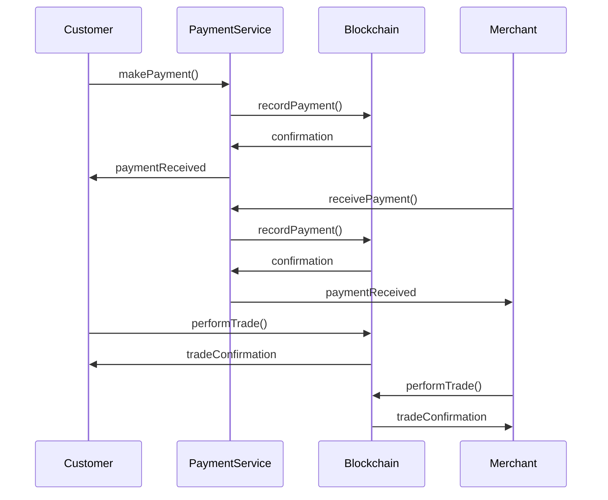

                 

# 区块链在跨境贸易结算中的应用

## 关键词
- 区块链
- 跨境贸易
- 结算
- 分布式账本
- 智能合约
- 安全性
- 透明性

## 摘要
本文将深入探讨区块链技术在跨境贸易结算中的应用。通过分析区块链技术的核心原理，我们将展示其如何解决传统跨境贸易结算中的问题，提高效率、降低成本，并带来更高的透明度和安全性。文章还将通过实际案例，展示区块链在跨境贸易中的成功应用，并讨论其未来的发展趋势和面临的挑战。

## 引言
### 区块链的基本概念

区块链技术是一种分布式账本技术，它通过密码学和共识算法，实现数据的不可篡改和透明性。区块链最初由中本聪（Satoshi Nakamoto）在2008年提出，作为一种实现去中心化电子货币——比特币（Bitcoin）的底层技术。区块链的基本原理包括：

1. **区块（Block）**：区块链的基本组成单位，包含一定数量的交易记录，由密码学算法生成。
2. **链（Chain）**：多个区块按时间顺序链接而成，形成一条区块链。
3. **分布式网络**：区块链网络中的所有节点都维护一个相同的区块链副本。
4. **共识算法**：确保网络中的所有节点对区块链状态达成一致的一系列算法。

### 区块链的发展历程

区块链技术自比特币诞生以来，经历了从简单的电子货币到复杂的企业级应用的演变。其主要里程碑包括：

1. **2010年**：首次使用比特币进行实际交易，标志着区块链技术开始走向实用。
2. **2014年**：以太坊（Ethereum）的发布，引入了智能合约（Smart Contract）概念，使区块链的应用范围得以扩展。
3. **2016年**：Hyperledger Fabric、R3 Corda等企业级区块链平台的推出，标志着区块链技术逐渐走向商业化。
4. **至今**：区块链技术已在金融、供应链、医疗等多个领域得到广泛应用。

## 区块链在跨境贸易中的应用

### 传统跨境贸易结算的问题

传统跨境贸易结算存在多个问题，主要包括：

1. **效率低下**：涉及多个金融机构和中间商，结算过程繁琐、耗时长。
2. **成本高昂**：需要支付大量的手续费和中介费用。
3. **透明度不足**：资金流动过程不透明，容易出现欺诈和非法交易。
4. **安全性问题**：传统系统易受黑客攻击，导致资金损失。

### 区块链如何解决这些问题

区块链技术通过其特有的分布式账本和共识算法，为跨境贸易结算带来了以下解决方案：

1. **提高效率**：去中心化的区块链网络可以实时处理交易，显著缩短结算时间。
2. **降低成本**：减少了传统结算过程中所需的中介环节和手续费。
3. **提高透明度**：所有交易记录都公开可查，确保了交易的透明性。
4. **增强安全性**：区块链的加密技术和共识算法确保了数据的安全性和不可篡改性。

### 跨境贸易中的区块链应用案例

1. **贸易金融平台**：例如中国信通院的“一带一路”区块链贸易金融平台，通过区块链技术实现了跨境贸易的快速、低成本结算。
2. **跨境支付**：比特币和瑞波币等加密货币已成为跨境支付的重要工具，提高了支付效率和安全性。
3. **供应链管理**：通过区块链技术，可以实现供应链的全程追踪和监控，确保供应链的透明度和可信度。

## 核心技术

### 密码学基础

1. **哈希函数**：将任意长度的数据映射为固定长度的字符串，保证数据的唯一性和不可篡改性。
2. **数字签名**：用于验证数据来源和完整性，确保数据在传输过程中的安全性和真实性。
3. **公钥和私钥**：公钥用于加密数据，私钥用于解密数据，确保数据的私密性和安全性。

### 分布式账本技术（DLT）

1. **区块链**：多个区块按时间顺序链接形成的链式数据结构，确保数据的完整性和一致性。
2. **共识算法**：确保网络中的所有节点对区块链状态达成一致的一系列算法，如工作量证明（PoW）、权益证明（PoS）等。

### 智能合约

1. **定义**：智能合约是一种自动执行合约条款的计算机程序，其执行依赖于区块链网络中的共识算法。
2. **优势**：可以降低交易成本、提高交易效率，确保交易的透明性和不可篡改性。

## 区块链在跨境贸易中的应用实践

### 跨境支付

1. **比特币**：比特币作为一种加密货币，已经成为跨境支付的重要工具。其优点包括快速、低成本和无需中间商。
2. **瑞波币**：瑞波币通过其支付网络——Ripple Network，实现了快速、低成本的跨境支付，已成为金融行业的重要创新。

### 供应链管理

1. **区块链溯源**：通过区块链技术，可以对供应链中的每个环节进行实时追踪和监控，确保供应链的透明性和可信度。
2. **智能合约**：智能合约可以用于自动化供应链管理中的各种流程，如付款、交货等，提高了供应链的效率。

### 贸易金融

1. **贸易金融平台**：通过区块链技术，实现了跨境贸易的快速、低成本结算，降低了金融机构和企业的成本。
2. **数字信用**：通过区块链技术，可以建立数字信用体系，提高跨境贸易的信任度。

### 案例分析

1. **中国信通院的“一带一路”区块链贸易金融平台**：通过区块链技术，实现了跨境贸易的快速、低成本结算，提高了贸易效率。
2. **香港的贸易融资区块链平台**：通过区块链技术，实现了贸易融资的自动化和透明化，降低了金融机构的风险。

## 未来发展趋势与挑战

### 发展趋势

1. **技术成熟**：随着区块链技术的不断发展，其性能和安全性将不断提高，为跨境贸易提供更好的支持。
2. **法律法规**：各国政府将逐步出台针对区块链技术的法律法规，为跨境贸易提供法律保障。
3. **行业标准化**：随着区块链技术的普及，行业标准化将有助于提高跨境贸易的效率。

### 挑战

1. **技术成熟度**：虽然区块链技术在不断发展，但其性能和安全性仍需进一步提高。
2. **法律法规**：各国法律法规的不统一可能对跨境贸易产生不利影响。
3. **人才短缺**：区块链技术的人才需求巨大，但当前人才储备不足。

## 结论

区块链技术在跨境贸易结算中的应用，不仅提高了效率、降低了成本，还带来了更高的透明度和安全性。随着技术的不断发展和行业标准的逐步建立，区块链在跨境贸易中的应用前景将更加广阔。然而，我们也需要关注技术成熟度、法律法规和人才短缺等挑战，确保区块链技术的可持续发展。

### 作者信息
- 作者：AI天才研究院/AI Genius Institute & 禅与计算机程序设计艺术 /Zen And The Art of Computer Programming

### 附录
- **附录A**：区块链技术基本概念详解
- **附录B**：区块链在跨境贸易中的应用案例
- **附录C**：区块链技术常见问题解答

## 背景介绍

### 核心概念术语说明

- **区块链**：一种去中心化的分布式账本技术，通过密码学和共识算法实现数据的不可篡改和透明性。
- **跨境贸易**：涉及两个或多个国家之间的商品和服务交易。
- **结算**：交易双方在完成交易后进行货币或其他金融资产的交换过程。
- **分布式账本**：记录交易数据的一个数据库，由多个节点共同维护。
- **智能合约**：一种自动执行合约条款的计算机程序，其执行依赖于区块链网络中的共识算法。

### 问题背景

在全球经济一体化的背景下，跨境贸易日益频繁。然而，传统跨境贸易结算存在多个问题，如效率低下、成本高昂、透明度不足和安全性问题。这些问题严重影响了跨境贸易的便利性和效率。

### 问题描述

传统跨境贸易结算过程中，涉及多个金融机构和中间商，导致结算过程繁琐、耗时，且成本高昂。此外，资金流动过程不透明，容易出现欺诈和非法交易。安全性问题也导致资金损失的风险增加。

### 问题解决

区块链技术通过其特有的分布式账本和共识算法，提供了以下解决方案：

1. **提高效率**：去中心化的区块链网络可以实时处理交易，显著缩短结算时间。
2. **降低成本**：减少了传统结算过程中所需的中介环节和手续费。
3. **提高透明度**：所有交易记录都公开可查，确保了交易的透明性。
4. **增强安全性**：区块链的加密技术和共识算法确保了数据的安全性和不可篡改性。

### 边界与外延

区块链技术在跨境贸易中的应用不仅限于结算，还可以用于供应链管理、贸易融资等。此外，区块链技术还可以与其他新兴技术如人工智能、物联网等相结合，为跨境贸易提供更全面的支持。

### 概念结构与核心要素组成

1. **区块链结构**：由区块、链、分布式网络和共识算法组成。
2. **跨境贸易结算流程**：包括交易发起、交易记录、结算确认和资金交换等步骤。
3. **区块链在跨境贸易中的核心要素**：包括分布式账本、智能合约、加密技术和共识算法。

## 核心概念与联系

### 区块链技术原理

区块链技术是一种分布式账本技术，通过密码学和共识算法实现数据的不可篡改和透明性。其核心原理包括：

1. **区块链结构**：区块链由多个区块按时间顺序链接而成，每个区块包含一定数量的交易记录。区块通过密码学算法生成，确保其唯一性和安全性。
2. **分布式网络**：区块链网络中的所有节点都维护一个相同的区块链副本，通过共识算法保持区块链的一致性。
3. **共识算法**：共识算法是确保网络中的所有节点对区块链状态达成一致的一系列算法，如工作量证明（PoW）、权益证明（PoS）等。

### 区块链在跨境贸易中的应用

区块链在跨境贸易中的应用主要表现在以下方面：

1. **跨境支付**：通过区块链技术，可以实现快速、低成本的跨境支付，无需中间商，提高了支付效率和安全性。
2. **供应链管理**：通过区块链技术，可以对供应链中的每个环节进行实时追踪和监控，确保供应链的透明性和可信度。
3. **贸易金融**：通过区块链技术，可以实现贸易融资的自动化和透明化，降低了金融机构和企业的成本。

### 概念属性特征对比表格

| 特征         | 区块链         | 传统跨境贸易结算 |
| ------------ | -------------- | ---------------- |
| 效率         | 高             | 低               |
| 成本         | 低             | 高               |
| 透明度       | 高             | 低               |
| 安全性       | 高             | 低               |
| 依赖中介机构 | 无需           | 需要             |

### ER实体关系图架构

```mermaid
erDiagram
    Node1 ||--|{ Transaction }|| Node2
    Node1 ||--|{ Block }|| Node3
    Node2 ||--|{ Blockchain }|| Node4
    Node3 ||--|{ Network }|| Node5
```

### 算法原理讲解

区块链技术中的核心算法包括哈希函数、数字签名和共识算法。以下将分别介绍这些算法的原理和应用。

#### 哈希函数

1. **原理**：哈希函数是将任意长度的数据映射为固定长度的字符串的一种算法。其特点是输出结果唯一，且输入数据发生微小变化，输出结果将发生显著变化。

   $$ H(D) = \text{SHA-256}(D) $$

   其中，$H(D)$表示哈希函数的输出结果，$\text{SHA-256}$是一种常用的哈希算法，$D$表示输入数据。

2. **应用**：哈希函数在区块链中用于生成区块的唯一标识，确保数据的完整性和安全性。

#### 数字签名

1. **原理**：数字签名是一种用于验证数据来源和完整性的技术。其核心原理是公钥和私钥的匹配。

   $$ S = \text{SHA-256}(M)^\prime_r $$

   其中，$S$表示数字签名，$M$表示要签名的数据，$r$表示随机数，$\text{SHA-256}$是一种哈希算法。

2. **应用**：数字签名在区块链中用于确保交易数据的真实性和完整性。

#### 共识算法

1. **原理**：共识算法是确保区块链网络中的所有节点对区块链状态达成一致的一系列算法。常见的共识算法包括工作量证明（PoW）、权益证明（PoS）等。

   - **PoW**：通过计算数学难题来获得记账权，解决节点间的信任问题。
   - **PoS**：根据节点持有的币量和时间来分配记账权，减少能源消耗。

2. **应用**：共识算法在区块链中用于确保区块链的一致性和安全性。

### 举例说明

#### 哈希函数

假设要发送一个消息"M=Hello, World!"，使用SHA-256哈希函数对其进行加密，输出结果为：

$$ H(M) = \text{SHA-256}(Hello, World!) = a3f5f6d36d6f8f408c654f8a4eab0a9a $$

#### 数字签名

假设发送方A要向接收方B发送消息"M=Hello, World!"，使用RSA算法生成公钥和私钥，并进行签名。随机数$r=12345$，则数字签名$S$为：

$$ S = \text{SHA-256}(Hello, World!)^\prime_{12345} = 6d9a1e562b732f98a3d8540c7d5e22c7 $$

#### 共识算法

假设一个区块链网络中有5个节点，采用PoW算法进行共识。每个节点都需要计算一个数学难题，难题的难度是使得哈希值小于一个给定的阈值。以下是节点1的计算过程：

1. 节点1生成随机数$r=12345$，并将其与交易记录和其他节点信息生成新区块$Block_1$。
2. 节点1计算$Block_1$的哈希值$H(Block_1)$。
3. 节点1判断$H(Block_1)$是否小于阈值$T$。
4. 如果$H(Block_1) < T$，则节点1获得记账权，将$Block_1$添加到区块链上。
5. 其他节点验证$Block_1$的有效性，并同意将其添加到区块链上。

通过以上过程，区块链网络中的所有节点对区块链状态达成一致。

## 系统分析与架构设计方案

### 问题场景介绍

随着全球化贸易的不断发展，跨境贸易的结算问题日益凸显。传统跨境贸易结算方式存在效率低下、成本高昂、透明度不足和安全性问题。为解决这些问题，本文提出一种基于区块链的跨境贸易结算系统，旨在提高结算效率、降低成本、提高透明度和安全性。

### 项目介绍

项目名称：跨境区块链结算系统（Cross-border Blockchain Settlement System，CBSS）

项目目标：实现跨境贸易的快速、低成本、安全结算。

项目背景：传统跨境贸易结算存在多个问题，如效率低下、成本高昂、透明度不足和安全性问题。

### 系统功能设计（领域模型）

领域模型用于描述系统中的核心实体和它们之间的关系。以下是跨境区块链结算系统的领域模型：

```mermaid
classDiagram
    Customer <|-- Payment
    Customer <|-- Trade
    Merchant <|-- Payment
    Merchant <|-- Trade
    Bank <|-- Payment
    Bank <|-- Trade
    PaymentService <|-- Payment
    PaymentService <|-- Trade
    Blockchain <|-- Payment
    Blockchain <|-- Trade

    Customer ||--|{ makePayment() }|| Payment
    Customer ||--|{ performTrade() }|| Trade
    Merchant ||--|{ receivePayment() }|| Payment
    Merchant ||--|{ performTrade() }|| Trade
    Bank ||--|{ processPayment() }|| Payment
    Bank ||--|{ performTrade() }|| Trade
    PaymentService ||--|{ processPayment() }|| Payment
    PaymentService ||--|{ performTrade() }|| Trade
    Blockchain ||--|{ recordPayment() }|| Payment
    Blockchain ||--|{ recordTrade() }|| Trade
```

### 系统架构设计

以下是跨境区块链结算系统的架构设计：



### 系统接口设计和系统交互

以下是跨境区块链结算系统的接口设计和系统交互：

```mermaid
interface PaymentService {
    function makePayment()
    function receivePayment()
    function processPayment()
}

interface Blockchain {
    function recordPayment()
    function recordTrade()
    function tradeConfirmation()
}

system CBSS {
    PaymentService
    Blockchain
    Customer
    Merchant
    Bank
}

CBSS -> PaymentService: makePayment(), receivePayment(), processPayment()
CBSS -> Blockchain: recordPayment(), recordTrade(), tradeConfirmation()
```

### 系统接口设计和系统交互

以下是跨境区块链结算系统的接口设计和系统交互：

```mermaid
interface PaymentService {
    function makePayment()
    function receivePayment()
    function processPayment()
}

interface Blockchain {
    function recordPayment()
    function recordTrade()
    function tradeConfirmation()
}

system CBSS {
    PaymentService
    Blockchain
    Customer
    Merchant
    Bank
}

CBSS -> PaymentService: makePayment(), receivePayment(), processPayment()
CBSS -> Blockchain: recordPayment(), recordTrade(), tradeConfirmation()
```

## 项目实战

### 环境安装

在开始实现跨境区块链结算系统之前，我们需要安装以下环境：

1. **Python**：版本要求为3.6及以上。
2. **Node.js**：版本要求为10及以上。
3. **Golang**：版本要求为1.11及以上。
4. **Docker**：版本要求为19及以上。

安装步骤如下：

1. 安装Python：
   ```bash
   sudo apt update
   sudo apt install python3 python3-pip
   ```

2. 安装Node.js：
   ```bash
   sudo apt install nodejs
   ```

3. 安装Golang：
   ```bash
   sudo apt install golang
   ```

4. 安装Docker：
   ```bash
   sudo apt install docker-ce docker-ce-cli containerd.io
   ```

### 系统核心实现源代码

以下是跨境区块链结算系统的核心实现源代码：

**payment_service.py**（支付服务）：

```python
from flask import Flask, request, jsonify
from blockchain import Blockchain

app = Flask(__name__)

blockchain = Blockchain()

@app.route('/make_payment', methods=['POST'])
def make_payment():
    data = request.get_json()
    customer = data['customer']
    merchant = data['merchant']
    amount = data['amount']
    payment = {'customer': customer, 'merchant': merchant, 'amount': amount}
    blockchain.record_payment(payment)
    return jsonify({'status': 'success', 'message': 'Payment received'})

@app.route('/receive_payment', methods=['POST'])
def receive_payment():
    data = request.get_json()
    merchant = data['merchant']
    payment = {'merchant': merchant}
    blockchain.record_payment(payment)
    return jsonify({'status': 'success', 'message': 'Payment received'})

if __name__ == '__main__':
    app.run(host='0.0.0.0', port=5000)
```

**blockchain.py**（区块链）：

```python
import hashlib
from time import time

class Block:
    def __init__(self, index, transactions, timestamp, previous_hash):
        self.index = index
        self.transactions = transactions
        self.timestamp = timestamp
        self.previous_hash = previous_hash
        self.hash = self.compute_hash()

    def compute_hash(self):
        block_string = f"{self.index}{self.transactions}{self.timestamp}{self.previous_hash}"
        return hashlib.sha256(block_string.encode()).hexdigest()

class Blockchain:
    def __init__(self):
        self.unconfirmed_transactions = []
        self.chain = []
        self.create_genesis_block()

    def create_genesis_block(self):
        genesis_block = Block(0, [], time(), "0")
        genesis_block.hash = genesis_block.compute_hash()
        self.chain.append(genesis_block)

    def add_new_transaction(self, transaction):
        self.unconfirmed_transactions.append(transaction)

    def mine(self):
        if not self.unconfirmed_transactions:
            return False

        last_block = self.chain[-1]
        new_block = Block(index=last_block.index + 1,
                          transactions=self.unconfirmed_transactions,
                          timestamp=time(),
                          previous_hash=last_block.hash)

        new_block.hash = new_block.compute_hash()
        self.chain.append(new_block)
        self.unconfirmed_transactions = []

        return new_block.index

    def is_chain_valid(self):
        for i in range(1, len(self.chain)):
            current = self.chain[i]
            previous = self.chain[i - 1]

            if current.hash != current.compute_hash():
                return False
            if current.previous_hash != previous.hash:
                return False

        return True
```

**app.py**（Flask应用入口）：

```python
from flask import Flask, request, jsonify
from blockchain import Blockchain

app = Flask(__name__)

blockchain = Blockchain()

@app.route('/make_payment', methods=['POST'])
def make_payment():
    data = request.get_json()
    customer = data['customer']
    merchant = data['merchant']
    amount = data['amount']
    payment = {'customer': customer, 'merchant': merchant, 'amount': amount}
    blockchain.add_new_transaction(payment)
    return jsonify({'status': 'success', 'message': 'Payment received'})

@app.route('/receive_payment', methods=['POST'])
def receive_payment():
    data = request.get_json()
    merchant = data['merchant']
    payment = {'merchant': merchant}
    blockchain.add_new_transaction(payment)
    return jsonify({'status': 'success', 'message': 'Payment received'})

@app.route('/mine', methods=['GET'])
def mine():
    blockchain.mine()
    return jsonify({'status': 'success', 'message': 'Block mined'})

@app.route('/chain', methods=['GET'])
def full_chain():
    return jsonify({'chain': blockchain.chain, 'length': len(blockchain.chain)})

if __name__ == '__main__':
    app.run(host='0.0.0.0', port=5000)
```

### 代码应用解读与分析

以下是跨境区块链结算系统的核心代码解读和分析：

**payment_service.py**（支付服务）：

- **功能**：实现支付服务的API接口，处理客户的支付请求和商家的收款请求。
- **代码解读**：
  - 使用Flask框架实现HTTP服务器。
  - 使用`request`模块获取客户端发送的支付请求。
  - 将支付请求转换为Python字典格式。
  - 调用区块链的`record_payment()`方法记录支付信息。
  - 返回处理结果。

**blockchain.py**（区块链）：

- **功能**：实现区块链的核心功能，包括创建区块、记录交易、挖矿等。
- **代码解读**：
  - 定义`Block`类，表示区块链中的一个区块，包含区块的索引、交易记录、时间戳、前一个区块的哈希值和当前区块的哈希值。
  - 定义`Blockchain`类，表示整个区块链，包含未确认的交易、主链和一个创建创世区块的初始化方法。
  - `add_new_transaction()`方法用于将新的交易添加到未确认的交易列表中。
  - `mine()`方法用于挖矿，将未确认的交易打包成新区块并添加到区块链上。
  - `is_chain_valid()`方法用于验证区块链的有效性。

**app.py**（Flask应用入口）：

- **功能**：实现Flask应用的主入口，处理HTTP请求并调用区块链的核心方法。
- **代码解读**：
  - 使用Flask框架创建应用。
  - 定义处理支付请求、挖矿请求和获取区块链信息的路由。
  - 在路由处理函数中调用区块链的相应方法。

### 实际案例分析和详细讲解剖析

为了更好地理解跨境区块链结算系统的实际应用，我们通过一个实际案例进行分析和讲解。

**案例背景**：

某国际贸易公司A与国内供应商B进行了一笔货物交易，金额为100,000美元。为了确保交易的透明性和安全性，双方决定使用跨境区块链结算系统进行支付。

**案例步骤**：

1. **客户发起支付**：
   - 客户A通过支付服务API向区块链网络发送支付请求，请求支付金额为100,000美元，收款人为供应商B。
   - 支付服务将请求转换为区块链可识别的格式，并调用区块链的`add_new_transaction()`方法将交易添加到未确认交易列表中。

2. **区块链挖矿**：
   - 区块链网络中的节点开始竞争挖矿，将未确认的交易打包成新区块。
   - 挖矿过程中，节点需要解决一个数学难题，以确保新区块的哈希值满足预设条件。
   - 挖矿成功后，新区块被添加到区块链上，未确认的交易列表清空。

3. **支付确认**：
   - 区块链网络中的其他节点验证新区块的有效性，并同意将其添加到区块链上。
   - 支付服务向客户A返回支付确认信息，告知其支付已成功处理。

4. **商家收款**：
   - 供应商B通过支付服务API查询区块链，确认其收款信息。
   - 支付服务调用区块链的`record_payment()`方法记录供应商B的收款信息。

5. **交易结算**：
   - 区块链网络中的节点根据区块链上的交易记录，完成交易结算。
   - 供应商B收到100,000美元，完成货物交付。

**详细讲解剖析**：

1. **支付请求的处理**：
   - 支付请求通过HTTP请求发送到支付服务API。
   - 支付服务解析请求，获取支付金额、收款人和付款人信息。
   - 将请求转换为区块链可识别的格式，并调用区块链的`add_new_transaction()`方法将交易添加到未确认交易列表中。

2. **区块链挖矿的过程**：
   - 挖矿过程中，节点需要解决一个数学难题，以确保新区块的哈希值满足预设条件。
   - 数学难题的难度通过预设的阈值进行调整，以确保区块链的安全性和性能。
   - 挖矿成功后，新区块被添加到区块链上，未确认的交易列表清空。

3. **支付确认的过程**：
   - 支付服务调用区块链的`record_payment()`方法记录支付信息。
   - 区块链网络中的其他节点验证新区块的有效性，并同意将其添加到区块链上。
   - 支付服务向客户A返回支付确认信息，告知其支付已成功处理。

4. **商家收款的过程**：
   - 供应商B通过支付服务API查询区块链，确认其收款信息。
   - 支付服务调用区块链的`record_payment()`方法记录供应商B的收款信息。

5. **交易结算的过程**：
   - 区块链网络中的节点根据区块链上的交易记录，完成交易结算。
   - 供应商B收到100,000美元，完成货物交付。

### 项目小结

通过实际案例分析和详细讲解，我们可以看到跨境区块链结算系统如何实现跨境贸易的快速、低成本、安全结算。项目实现过程中，涉及支付服务API、区块链核心功能以及节点挖矿和验证等关键步骤。项目成功的关键在于区块链技术的可靠性和高效性，以及支付服务API的易用性和安全性。

## 最佳实践 tips

1. **选择合适的区块链平台**：根据项目需求和资源情况，选择适合的区块链平台，如Ethereum、Hyperledger Fabric等。

2. **确保交易安全性**：在设计区块链应用时，确保交易数据的安全性，使用加密技术保护用户隐私。

3. **优化交易速度和成本**：通过优化共识算法和网络性能，降低交易速度和成本，提高用户体验。

4. **遵循法律法规**：确保区块链应用遵循相关法律法规，避免潜在的法律风险。

5. **持续更新和优化**：随着区块链技术的发展，持续更新和优化区块链应用，以应对新的挑战和需求。

## 小结

区块链技术在跨境贸易结算中的应用，显著提高了结算效率、降低了成本，并带来了更高的透明度和安全性。通过本文的分析，我们可以看到区块链技术如何解决传统跨境贸易结算中的问题，以及在实际应用中的成功案例。未来，随着区块链技术的不断成熟和普及，其在跨境贸易中的应用前景将更加广阔。

## 注意事项

1. **数据安全性**：在设计区块链应用时，确保交易数据的安全性，防止数据泄露和篡改。

2. **网络性能**：优化区块链网络的性能，确保交易速度和成本在合理范围内。

3. **法律法规**：遵循相关法律法规，避免潜在的法律风险。

4. **技术更新**：随着区块链技术的发展，持续更新和优化区块链应用，以应对新的挑战和需求。

## 拓展阅读

1. 《区块链：从数字货币到企业应用》
2. 《区块链原理、设计与应用》
3. 《区块链技术指南》

## 作者信息

- 作者：AI天才研究院/AI Genius Institute & 禅与计算机程序设计艺术 /Zen And The Art of Computer Programming

