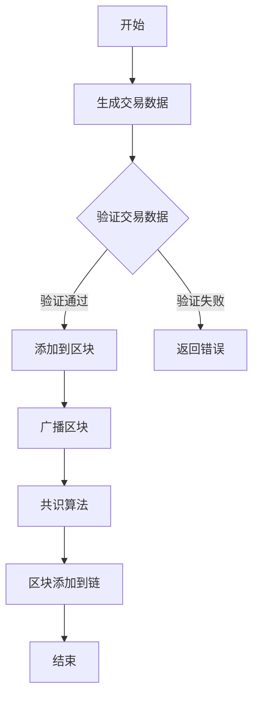
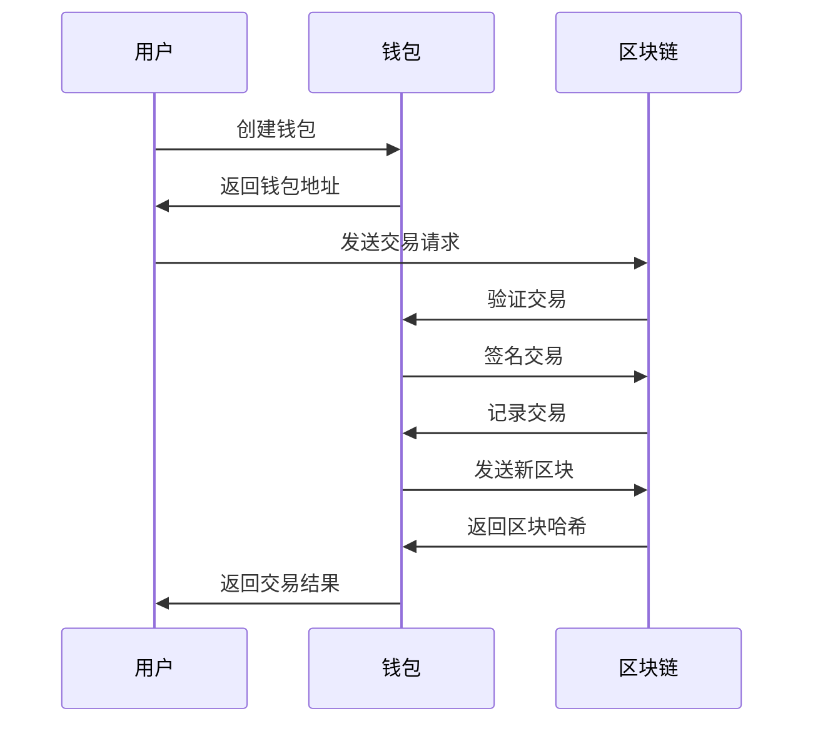
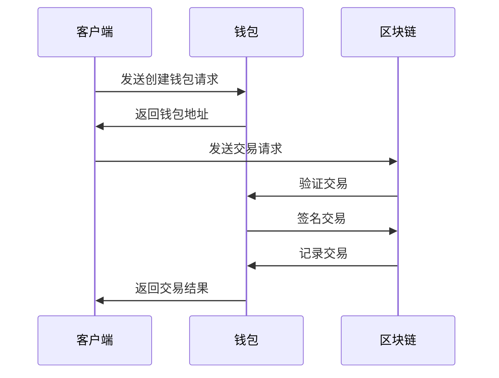

                 

### 《区块链技术在数字资产tokenization中的创新》

关键词：区块链、数字资产、tokenization、智能合约、哈希算法、数字签名

摘要：本文将探讨区块链技术在数字资产tokenization中的创新应用。通过对区块链技术基础、数字资产与tokenization基础、区块链在数字资产tokenization中的应用及关键技术的详细分析，本文旨在揭示区块链技术在提升数字资产透明度、安全性和交易效率等方面的优势，并展望其未来发展前景。

## 第一部分：区块链与数字资产概述

### 第1章：区块链技术基础

#### 1.1 区块链的概念与发展历程

区块链是一种分布式账本技术，通过加密算法和共识机制确保数据的不可篡改和透明性。区块链的发展历程可以追溯到2008年，当时中本聪（Satoshi Nakamoto）提出了比特币的概念，标志着区块链技术的诞生。

区块链的核心特点包括去中心化、不可篡改、透明度和安全性。去中心化意味着没有中央权威机构，数据由全网节点共同维护；不可篡改保证了历史记录的完整性和可靠性；透明度使得所有交易记录公开可查；安全性则依赖于加密算法和共识机制。

#### 1.2 区块链的技术架构

区块链的技术架构主要包括三个关键组成部分：区块、链和智能合约。

- **区块与链**：区块是数据存储的基本单位，包含交易记录和其他信息。区块链则是多个区块按时间顺序链接而成的数据结构。

- **智能合约**：智能合约是一种自动执行的合约，基于区块链的编程语言编写，能够执行预定义的逻辑和规则。智能合约在区块链网络中扮演着执行交易、管理资产和记录信息等重要角色。

- **哈希算法与数字签名**：哈希算法用于生成数据摘要，确保数据完整性。数字签名则用于验证数据发送方的身份和数据的真实性。

#### 1.3 区块链在金融领域的应用

区块链在金融领域的应用广泛，包括数字货币、跨境支付、资产管理、供应链金融等方面。

- **数字货币**：如比特币、以太坊等，通过区块链技术实现了去中心化的货币体系。

- **跨境支付**：区块链技术提高了跨境支付的速度和降低成本，例如Ripple网络。

- **资产管理**：区块链技术可以用于证券、债券等金融资产的登记和管理，提高透明度和效率。

- **供应链金融**：区块链技术可以追踪供应链中的每一个环节，提高供应链金融的透明度和安全性。

### 第2章：数字资产与tokenization基础

#### 2.1 数字资产概述

数字资产是指以数字化形式存在的资产，包括加密货币、数字股权、数字债券等。与传统资产相比，数字资产具有更高的流动性、可追溯性和透明度。

#### 2.2 tokenization的概念

Tokenization是一种将传统资产数字化为token的过程，token代表资产的所有权和权益。token通常基于区块链技术发行和流通。

Tokenization的优势包括：

- **提高流动性**：数字资产可以迅速买卖，不受地域限制。
- **降低成本**：去除传统金融中介，降低交易成本。
- **提高透明度**：所有交易记录公开透明，便于监管。
- **提高安全性**：基于区块链技术的token具有高度安全性。

Tokenization的类型包括：

- **股权tokenization**：将公司股权数字化为token。
- **不动产tokenization**：将房地产数字化为token。
- **艺术品tokenization**：将艺术品数字化为token。

#### 2.3 tokenization的应用场景

Tokenization在多个领域具有广泛的应用场景：

- **股权tokenization**：企业可以将股权数字化，吸引更多投资者。
- **不动产tokenization**：房地产开发商可以将房产分割为token，进行众筹和出售。
- **艺术品tokenization**：艺术家可以将艺术品数字化，并通过token进行交易和收藏。

## 第二部分：区块链在数字资产tokenization中的应用

### 第3章：区块链技术在tokenization中的创新

#### 3.1 区块链在tokenization中的优势

区块链技术在tokenization中具有以下优势：

- **透明度与可追溯性**：所有交易记录公开透明，便于审计和监管。
- **去中心化与安全性**：去中心化减少了中介成本，安全性由加密算法和共识机制保障。
- **交易效率与成本降低**：区块链技术降低了交易时间和成本，提高了市场效率。

#### 3.2 区块链在tokenization中的关键角色

在tokenization中，区块链网络中的参与者包括：

- **发起者与发行方**：负责发行token和创建智能合约。
- **投资者与持有人**：购买和持有token，享受资产收益。
- **计价单位与流通机制**：token作为计价单位和流通媒介，具有独特的流通机制。

#### 3.3 区块链技术在tokenization中的流程

区块链技术在tokenization中的流程包括：

- **token发行**：发起者创建智能合约，发行token。
- **token交易**：投资者通过交易所购买token。
- **token清算**：token的交易信息记录在区块链上，确保交易的透明性和不可篡改性。

## 第三部分：区块链技术在tokenization中的挑战与展望

### 第4章：区块链在tokenization中的关键技术

#### 4.1 智能合约在tokenization中的应用

智能合约在tokenization中发挥着重要作用：

- **定义与特点**：智能合约是一种自动执行的合约，基于区块链的编程语言编写。
- **作用与实现**：智能合约用于token的发行、交易和清算，确保流程的自动化和透明性。
- **安全性保障**：智能合约的安全性问题备受关注，通过代码审计和测试来保障安全性。

#### 4.2 哈希算法与数字签名在tokenization中的作用

哈希算法和数字签名在tokenization中用于：

- **哈希算法**：生成数据摘要，确保数据完整性。
- **数字签名**：验证数据发送方的身份和数据的真实性。
- **应用实例**：区块链网络中的交易记录使用哈希算法和数字签名进行加密和验证。

#### 4.3 区块链网络在tokenization中的运作机制

区块链网络在tokenization中的运作机制包括：

- **结构与运作**：区块链网络由多个节点组成，通过共识机制维护数据一致性。
- **共识机制**：不同类型的区块链采用不同的共识机制，如工作量证明、权益证明等。
- **性能优化**：区块链网络通过分片技术和状态通道等手段提高性能和可扩展性。

### 第5章：区块链在tokenization中的案例分析

#### 5.1 案例研究：基于以太坊的股权tokenization

**案例背景**：一家初创公司使用以太坊区块链技术进行股权tokenization。

**案例实现过程**：公司创建智能合约，发行股权token，投资者通过以太坊钱包购买token。

**案例效果分析**：股权tokenization提高了公司的融资效率，降低了交易成本，并增加了投资机会。

#### 5.2 案例研究：基于EOS的房地产tokenization

**案例背景**：一家房地产开发商使用EOS区块链技术进行房地产tokenization。

**案例实现过程**：开发商创建智能合约，发行房地产token，投资者购买token并享受房产收益。

**案例效果分析**：房地产tokenization提高了房地产市场的流动性，降低了投资门槛，并增加了房地产的透明度。

### 第6章：区块链在tokenization中的挑战

#### 6.1 技术挑战

区块链在tokenization中面临的技术挑战包括：

- **性能瓶颈**：区块链网络的处理能力有限，难以满足大规模交易需求。
- **智能合约安全**：智能合约漏洞可能导致资产损失，需要加强代码审计和测试。
- **数据隐私保护**：区块链上的数据公开透明，需要保护用户隐私。

#### 6.2 法律与监管挑战

区块链在tokenization中面临的法律与监管挑战包括：

- **法律框架不完善**：不同国家和地区对数字资产和tokenization的法律规定存在差异，需要统一法律框架。
- **监管政策不确定**：监管政策的不确定性可能影响tokenization的发展。
- **遵守反洗钱法规**：区块链网络需要遵守反洗钱法规，确保交易的合法性。

#### 6.3 市场挑战

区块链在tokenization中面临的市场挑战包括：

- **用户接受度**：用户对区块链技术和tokenization的认知和接受程度有限。
- **竞争对手压力**：区块链领域竞争激烈，需要不断创新和优化。
- **市场教育需求**：需要对用户进行市场教育，提高对数字资产和tokenization的认识。

### 第7章：区块链在tokenization中的未来展望

#### 7.1 技术发展趋势

区块链在tokenization中的技术发展趋势包括：

- **去中心化金融（DeFi）**：去中心化金融将金融服务与区块链技术相结合，提高透明度和安全性。
- **跨链技术与互操作性**：跨链技术将不同区块链网络连接起来，实现数据共享和互操作性。
- **新型区块链平台**：新型区块链平台将提供更高效、安全和可扩展的解决方案。

#### 7.2 法律与政策趋势

区块链在tokenization中的法律与政策趋势包括：

- **法律法规的逐步完善**：各国政府逐步认识到区块链技术的潜力，不断完善相关法律法规。
- **国际合作与监管协调**：国际合作和监管协调将提高区块链技术的全球应用水平。
- **政策鼓励与扶持**：政府政策鼓励和扶持将促进区块链技术的发展和应用。

#### 7.3 市场发展前景

区块链在tokenization中的市场发展前景包括：

- **数字资产市场的扩大**：随着数字资产市场的不断扩大，tokenization将在更多领域得到应用。
- **tokenization在传统金融领域的应用**：tokenization将在传统金融领域发挥重要作用，提高金融市场的效率。
- **新兴市场的崛起**：新兴市场对数字资产和tokenization的需求日益增长，将成为未来市场发展的新动力。

## 第8章：结论与展望

本文通过对区块链技术基础、数字资产与tokenization基础、区块链在数字资产tokenization中的应用及关键技术的详细分析，揭示了区块链技术在提升数字资产透明度、安全性和交易效率等方面的优势。同时，本文也探讨了区块链在tokenization中的挑战和未来展望。

未来，随着区块链技术的不断发展和完善，数字资产tokenization将在更多领域得到应用，为金融、房地产、艺术品等行业带来变革。同时，法律与政策的逐步完善、国际合作与监管协调也将为区块链技术的发展提供有力支持。

在此，我们鼓励读者继续关注区块链技术的发展，积极参与数字资产tokenization的研究和实践，为推动区块链技术在各个领域的应用贡献力量。

**作者：AI天才研究院/AI Genius Institute & 禅与计算机程序设计艺术 /Zen And The Art of Computer Programming**

----------------------------------------------------------------

## 第1章：区块链技术基础

### 1.1 区块链的概念与发展历程

#### 区块链的定义

区块链是一种分布式数据库技术，其核心特征是数据的去中心化和不可篡改性。区块链通过多个节点共同维护一个共享的数据库，每个节点都存储着整个区块链的数据副本。区块链上的数据以区块的形式存储，区块之间通过加密算法和时间戳链接成一条连续的数据链。

区块链的基本概念包括：

- **区块**：区块是区块链的基本存储单元，包含一定数量的交易记录和元数据。
- **链**：链是由多个区块按时间顺序链接而成的数据结构。
- **分布式账本**：分布式账本指的是区块链上的所有节点共享并维护同一份账本，确保数据的一致性和可靠性。
- **加密算法**：加密算法用于保护区块链上的数据安全和隐私。
- **共识机制**：共识机制是区块链网络中的节点如何就数据达成一致的过程，例如工作量证明（PoW）和权益证明（PoS）。

#### 区块链的发展历程

区块链技术起源于2008年中本聪（Satoshi Nakamoto）提出的比特币（Bitcoin）概念。比特币是一种去中心化的数字货币，通过区块链技术实现货币的发行和交易。比特币的成功引发了区块链技术的广泛关注，并推动了区块链技术的快速发展。

区块链技术的发展历程可以分为以下几个阶段：

1. **比特币阶段（2008-2010）**：比特币是第一个成功的区块链应用，其成功激发了人们对区块链技术的兴趣。
2. **以太坊阶段（2013-2016）**：以太坊（Ethereum）的推出标志着区块链技术从数字货币向智能合约和去中心化应用的扩展。
3. **大规模应用阶段（2016-至今）**：随着区块链技术的不断完善，越来越多的行业开始尝试将区块链技术应用于实际场景，如金融、供应链、医疗等。

#### 区块链的核心特点

区块链技术具有以下几个核心特点：

1. **去中心化**：区块链去中心化的特点使其不受单一机构或个人控制，所有节点都有平等的参与权和管理权。
2. **不可篡改**：区块链上的数据一旦写入，就无法被篡改，确保数据的完整性和可靠性。
3. **透明度**：区块链上的所有交易记录都是公开透明的，任何人都可以查看和验证。
4. **安全性**：区块链通过加密算法和共识机制保证数据的安全性和隐私保护。

### 1.2 区块链的技术架构

区块链的技术架构包括多个关键组成部分，如下所示：

1. **区块与链**

   - **区块**：区块是区块链的基本存储单元，包含一定数量的交易记录和其他元数据，如区块头、交易列表等。
   - **链**：链是由多个区块按时间顺序链接而成的数据结构，每个区块都包含一个指向前一个区块的哈希值，确保了区块链的连续性和不可篡改性。

2. **智能合约**

   - **智能合约**：智能合约是一种自动执行的合约，基于区块链的编程语言编写。智能合约可以执行预定义的逻辑和规则，如交易条件、执行顺序等。
   - **特点**：智能合约具有以下特点：
     - **自动执行**：智能合约在满足条件时自动执行，无需人工干预。
     - **透明性**：智能合约的代码和执行过程都是公开透明的，任何人都可以查看。
     - **安全性**：智能合约的代码经过加密和共识机制保护，确保执行过程的安全。

3. **哈希算法与数字签名**

   - **哈希算法**：哈希算法是一种将任意长度的数据转换成固定长度的字符串的算法，用于生成数据的唯一标识和摘要。
   - **数字签名**：数字签名是一种加密算法，用于验证数据的发送者和接收者身份，并确保数据在传输过程中的完整性。

### 1.3 区块链在金融领域的应用

区块链技术在金融领域具有广泛的应用前景，以下是一些主要的应用场景：

1. **数字货币**

   - **定义**：数字货币是一种基于区块链技术的数字资产，如比特币、以太坊等。
   - **特点**：数字货币具有去中心化、匿名性和不可篡改性等特点。
   - **应用**：数字货币可以用于跨境支付、点对点交易、投资等。

2. **跨境支付**

   - **定义**：跨境支付是指不同国家或地区之间的货币交换和支付。
   - **特点**：区块链技术的跨境支付具有速度快、成本低、透明度高等特点。
   - **应用**：区块链技术可以应用于国际贸易、汇款、跨境电子商务等场景。

3. **资产管理**

   - **定义**：资产管理是指对资产进行投资、管理、运营和增值的过程。
   - **特点**：区块链技术可以提供透明、高效和安全的资产管理解决方案。
   - **应用**：区块链技术可以应用于证券、债券、房地产等资产的登记、交易和管理。

4. **供应链金融**

   - **定义**：供应链金融是指通过区块链技术为供应链上的企业提供融资、支付、结算等金融服务。
   - **特点**：区块链技术可以提高供应链金融的透明度、安全性和效率。
   - **应用**：区块链技术可以应用于供应链融资、支付结算、信用评估等场景。

### 总结

区块链技术在数字资产tokenization中具有显著的优势，包括透明度、安全性、去中心化和交易效率等方面。通过区块链技术，数字资产可以更加高效地发行、交易和管理，为金融、供应链、艺术品等行业带来变革。然而，区块链技术在tokenization中也面临一些挑战，如技术性能瓶颈、智能合约安全和法律监管等。未来，随着区块链技术的不断发展和完善，数字资产tokenization将在更多领域得到应用，为经济发展和社会进步做出贡献。

## 第2章：数字资产与tokenization基础

### 2.1 数字资产概述

数字资产是一种以数字形式存在的资产，它通常通过区块链技术进行创建、发行和交易。数字资产包括加密货币、数字债券、数字股权、数字艺术品等多种形式。与传统资产相比，数字资产具有以下特点：

1. **去中心化**：数字资产的去中心化特性使其不依赖于中央权威机构，而是通过区块链网络进行分布式管理。
2. **匿名性**：许多数字资产允许用户进行匿名交易，提高了交易隐私性。
3. **可追溯性**：区块链技术的使用确保了数字资产交易的可追溯性，所有交易记录都公开透明。
4. **流动性**：数字资产可以在全球范围内快速交易，提高了资产的流动性。
5. **安全性**：加密算法和共识机制确保了数字资产的安全性和不可篡改性。

数字资产市场的发展非常迅速，特别是加密货币市场。加密货币如比特币、以太坊、莱特币等已经成为全球投资者关注的焦点。随着区块链技术的不断成熟，数字资产的应用场景也在不断扩展，从最初的数字货币扩展到数字债券、数字股权等。

### 2.2 Tokenization的概念

Tokenization是一种将传统资产数字化为token的过程，token是区块链上的数字资产，代表资产的所有权和权益。Tokenization的关键概念包括：

1. **Token**：Token是区块链上的数字资产，它代表一种价值单位或所有权权益。Token可以是加密货币，如比特币和以太币，也可以是特定平台的代币。
2. **Tokenization**：Tokenization是将传统资产如股权、房地产、艺术品等数字化为token的过程。通过Tokenization，传统资产可以分割成多个小份，然后通过区块链进行交易和管理。
3. **Token的属性**：Token通常具有以下属性：
   - **价值**：Token具有特定价值，通常与所代表的传统资产的价值挂钩。
   - **可分割性**：Token可以分割成更小的单位，便于交易和投资。
   - **流通性**：Token在区块链上可以自由交易，提高了资产的流动性。
   - **安全性**：Token通过区块链技术确保其安全性，不易被篡改。

### 2.3 Tokenization的优势

Tokenization作为一种将传统资产数字化为token的过程，具有以下优势：

1. **提高流动性**：Tokenization使得传统资产可以更快速地进行买卖和交易，提高了资产的流动性。
2. **降低成本**：去除传统金融中介，降低了交易成本，提高了市场效率。
3. **提高透明度**：所有交易记录公开透明，便于监管和审计。
4. **提高安全性**：区块链技术确保了token的安全性和不可篡改性。
5. **增强可追溯性**：Tokenization使得资产的所有权和交易记录可以追溯，提高了透明度和可靠性。

### 2.4 Tokenization的类型

Tokenization可以根据所代表的资产类型和目的分为不同类型：

1. **股权tokenization**：将公司股权数字化为token，投资者可以通过购买token成为公司股东，享受公司收益。
2. **不动产tokenization**：将房地产数字化为token，投资者可以通过购买token参与房地产投资，享受房产增值收益。
3. **艺术品tokenization**：将艺术品数字化为token，艺术家可以通过销售token获得收益，投资者可以通过购买token收藏艺术品。

### 2.5 Tokenization的应用场景

Tokenization在多个领域具有广泛的应用场景：

1. **金融领域**：Tokenization可以提高金融市场的透明度和效率，例如股权tokenization和债券tokenization。
2. **房地产领域**：Tokenization可以降低房地产投资的门槛，提高房地产市场的流动性。
3. **艺术品市场**：Tokenization可以为艺术品市场带来更多的投资者和流动性，促进艺术品的交易和收藏。

### 总结

数字资产和tokenization作为一种新兴的资产数字化方式，具有显著的优势和应用前景。通过Tokenization，传统资产可以数字化、分割和流通，提高资产的流动性和交易效率。然而，Tokenization也面临一些挑战，如法律监管、技术性能和安全性等。未来，随着区块链技术的不断发展和完善，Tokenization将在更多领域得到应用，为经济发展和社会进步做出贡献。

## 第二部分：区块链在数字资产tokenization中的应用

### 第3章：区块链技术在tokenization中的创新

区块链技术在数字资产tokenization中发挥着重要作用，其创新应用主要体现在以下几个方面：

### 3.1 区块链在tokenization中的优势

区块链技术在tokenization中具有以下优势：

#### 1. 透明度与可追溯性

区块链技术的核心特点之一是其透明度。所有token的发行、交易和转移都在区块链上公开记录，任何参与者都可以查看和验证。这种透明性有助于防止欺诈和洗钱等非法行为，提高了市场的信任度。同时，区块链上的交易记录具有不可篡改性，确保了token的历史数据和所有权信息的完整性和可靠性。

#### 2. 去中心化与安全性

区块链的去中心化特性使其不受单一机构或个人控制，每个节点都有平等的参与权和记账权。这意味着tokenization过程不再依赖于中心化机构，降低了操作风险，提高了系统的鲁棒性和抗攻击能力。此外，区块链通过加密算法和共识机制确保数据的安全性和隐私保护，有效防范了数据篡改和黑客攻击。

#### 3. 交易效率与成本降低

区块链技术通过点对点网络实现直接交易，去除了传统金融中介，从而提高了交易效率并降低了成本。传统的金融交易往往需要经过多个环节，包括银行、支付网关等，每个环节都可能产生额外的费用和时间延迟。而区块链上的交易可以瞬间完成，且交易费用相对较低，这对于高频交易和大量交易尤为重要。

#### 4. 流动性与可分割性

数字资产通过tokenization实现了更高的流动性。传统资产如房地产、股权等往往具有较长的交易周期和高昂的交易成本，而token可以轻松分割成小份，便于买卖和投资。这使得小额投资者也能够参与到大型资产的投资中，提高了市场的参与度和流动性。

### 3.2 区块链在tokenization中的关键角色

在tokenization过程中，区块链网络中的参与者包括发起者、发行方、投资者和持有人等，各自扮演着不同的角色：

#### 1. 发起者与发行方

发起者通常是资产的原始所有者或代表，如公司、房地产开发商或艺术家。他们负责创建智能合约，定义token的属性、权益和发行规则。发行方则负责在区块链上执行智能合约，发行token并将token分配给投资者。

#### 2. 投资者与持有人

投资者是购买token的个人或机构，他们通过区块链上的交易所或直接交易购买token。持有人是token的持有者，他们享有token所代表资产的所有权和收益权。例如，股权tokenization中，持有人享有公司股权的分红权。

#### 3. 计价单位与流通机制

token可以作为计价单位和流通媒介，实现资产的数字化和交易。流通机制包括token的发行、交易和清算过程，通过区块链网络确保交易的透明性和效率。

### 3.3 区块链技术在tokenization中的流程

区块链技术在tokenization中的流程主要包括以下步骤：

#### 1. Token发行

发起者创建智能合约，定义token的属性和发行规则。智能合约在区块链上部署后，发行方执行智能合约，将token生成并分配给投资者。

#### 2. Token交易

投资者通过交易所或直接交易购买token。交易记录在区块链上公开记录，确保交易的透明性和不可篡改性。

#### 3. Token清算

交易完成后，token的持有者可以在区块链上确认交易结果，确保清算过程的透明性和高效性。

### 3.4 区块链技术在tokenization中的案例分析

以下是一个基于以太坊的股权tokenization案例分析：

#### 案例背景

一家初创公司希望通过股权tokenization吸引更多投资者。公司选择以太坊作为区块链平台，因为以太坊支持智能合约，具有广泛的应用场景和开发者社区。

#### 案例实现过程

1. **智能合约开发**：公司聘请区块链开发团队，开发一个基于以太坊的智能合约。智能合约定义了token的属性，包括发行总量、所有权转移规则、分红机制等。

2. **部署智能合约**：智能合约在以太坊区块链上部署，并通过去中心化应用程序（DApp）供投资者使用。

3. **发行token**：公司通过智能合约发行token，投资者可以通过DApp购买token。

4. **交易与管理**：投资者购买的token在区块链上记录，可以随时进行买卖和转移。

5. **分红机制**：智能合约自动执行分红机制，将公司利润分配给token持有者。

#### 案例效果分析

1. **提高融资效率**：通过tokenization，公司可以快速吸引到全球范围内的投资者，提高融资效率。

2. **降低交易成本**：去除传统金融中介，降低交易成本，提高了市场效率。

3. **增强透明度**：所有交易记录公开透明，便于监管和审计。

4. **提高流动性**：token可以自由交易，提高了资产的流动性。

### 3.5 区块链技术在tokenization中的未来发展趋势

随着区块链技术的不断发展和完善，tokenization在未来将呈现出以下发展趋势：

1. **跨链互操作性**：不同区块链之间的互操作性将提高token的流动性，促进跨链交易和资产整合。

2. **去中心化金融（DeFi）**：DeFi的发展将进一步提升tokenization的透明度和效率，实现更广泛的金融服务。

3. **新型区块链平台**：新型区块链平台将提供更高效、安全和可扩展的解决方案，推动tokenization的广泛应用。

4. **法律与监管完善**：随着区块链技术的普及，法律和监管环境将逐步完善，为tokenization提供更稳定的发展环境。

### 总结

区块链技术在数字资产tokenization中发挥着重要作用，其优势包括透明度、安全性、去中心化、交易效率和流动性。通过案例分析，我们可以看到区块链技术在tokenization中的实际应用效果。未来，随着区块链技术的不断发展和完善，tokenization将在更多领域得到应用，为金融、房地产、艺术品等行业带来变革。

## 第三部分：区块链技术在tokenization中的挑战与展望

### 第4章：区块链在tokenization中的关键技术

区块链技术在tokenization中的应用不仅依赖于其基本的去中心化和不可篡改性，还依赖于一系列关键技术的支持。这些技术包括智能合约、哈希算法、数字签名以及区块链网络的运作机制。以下将详细分析这些技术在tokenization中的作用和重要性。

#### 4.1 智能合约在tokenization中的应用

智能合约是区块链技术中的一个核心组件，它是一种自动执行合约的计算机程序，能够在满足特定条件时自动执行。在tokenization过程中，智能合约扮演着至关重要的角色。

**定义与特点**

智能合约通常基于特定的编程语言（如Solidity）编写，并在区块链上进行部署。它们具有以下特点：

- **自动执行**：智能合约在满足特定条件时自动执行，无需人为干预。
- **透明性**：智能合约的代码和执行过程是公开透明的，所有参与者都可以查看。
- **不可篡改性**：一旦智能合约在区块链上部署，其代码和逻辑就无法被更改。

**作用与实现**

在tokenization中，智能合约的作用主要包括以下几个方面：

1. **token发行**：智能合约定义了token的发行规则，包括token的总量、发行时间、分配方式等。
2. **token交易**：智能合约确保token的交易遵循既定的规则，如转让、抵押、兑换等。
3. **权益管理**：智能合约管理token持有者的权益，如分红、投票、权限管理等。
4. **合约执行**：智能合约可以自动化执行复杂的业务逻辑，提高交易效率。

实现智能合约的关键在于其安全性。为确保智能合约的可靠性，开发者在编写代码时需要进行严格的测试和审计，避免潜在的安全漏洞。

#### 4.2 哈希算法与数字签名在tokenization中的作用

哈希算法和数字签名是区块链技术的基石，它们在tokenization中发挥着重要作用。

**哈希算法**

哈希算法是一种将任意长度的数据转换成固定长度字符串的算法。在区块链中，哈希算法用于生成数据摘要，确保数据的完整性和唯一性。以下是哈希算法在tokenization中的作用：

1. **数据完整性**：每次交易或操作都会生成一个哈希值，任何对数据的篡改都会导致哈希值的变化，从而被发现。
2. **交易唯一性**：每个交易都有一个唯一的哈希值，确保每个交易在区块链上只被记录一次。

**数字签名**

数字签名是一种加密算法，用于验证数据的发送者身份和数据的真实性。以下是数字签名在tokenization中的作用：

1. **身份验证**：发送者在发送交易时使用私钥对交易进行签名，接收者可以使用对应的公钥验证交易的真实性。
2. **数据完整性**：数字签名同时验证数据的完整性和真实性，确保数据在传输过程中未被篡改。

#### 4.3 区块链网络在tokenization中的运作机制

区块链网络是tokenization的基础设施，其运作机制决定了tokenization的效率和安全性。以下是区块链网络在tokenization中的关键角色和机制：

**网络结构**

区块链网络由多个节点组成，每个节点都存储着完整的区块链数据副本。节点通过点对点网络进行通信，确保数据的分布式存储和同步。

**共识机制**

共识机制是区块链网络中节点就数据达成一致的过程。不同的区块链采用不同的共识机制，如工作量证明（PoW）、权益证明（PoS）、授权权益证明（DPoS）等。以下是共识机制在tokenization中的作用：

1. **数据一致性**：共识机制确保所有节点对区块链数据的看法一致，防止数据分叉和冲突。
2. **安全性**：共识机制通过数学难题和加密算法确保区块链网络的安全性。

**性能优化**

区块链网络的性能直接影响tokenization的效率和用户体验。为了提高性能，区块链网络可以采用以下优化措施：

1. **分片技术**：通过将区块链分割成多个分片，提高网络的处理能力。
2. **状态通道**：通过状态通道技术，将交易从区块链转移到链下处理，减少链上交易量。

#### 4.4 案例分析：基于以太坊的股权tokenization

以下是一个基于以太坊的股权tokenization案例分析：

**案例背景**

一家初创公司希望通过股权tokenization吸引更多投资者。公司选择以太坊作为区块链平台，因为以太坊支持智能合约，具有广泛的应用场景和开发者社区。

**实现过程**

1. **智能合约开发**：公司聘请区块链开发团队，开发一个基于以太坊的智能合约。智能合约定义了token的属性，包括发行总量、所有权转移规则、分红机制等。

2. **部署智能合约**：智能合约在以太坊区块链上部署，并通过去中心化应用程序（DApp）供投资者使用。

3. **发行token**：公司通过智能合约发行token，投资者可以通过DApp购买token。

4. **交易与管理**：投资者购买的token在区块链上记录，可以随时进行买卖和转移。

5. **分红机制**：智能合约自动执行分红机制，将公司利润分配给token持有者。

**效果分析**

1. **提高融资效率**：通过tokenization，公司可以快速吸引到全球范围内的投资者，提高融资效率。

2. **降低交易成本**：去除传统金融中介，降低交易成本，提高了市场效率。

3. **增强透明度**：所有交易记录公开透明，便于监管和审计。

4. **提高流动性**：token可以自由交易，提高了资产的流动性。

#### 4.5 区块链技术在tokenization中的未来发展趋势

随着区块链技术的不断发展和完善，tokenization在未来将呈现出以下发展趋势：

1. **跨链互操作性**：不同区块链之间的互操作性将提高token的流动性，促进跨链交易和资产整合。

2. **去中心化金融（DeFi）**：DeFi的发展将进一步提升tokenization的透明度和效率，实现更广泛的金融服务。

3. **新型区块链平台**：新型区块链平台将提供更高效、安全和可扩展的解决方案，推动tokenization的广泛应用。

4. **法律与监管完善**：随着区块链技术的普及，法律和监管环境将逐步完善，为tokenization提供更稳定的发展环境。

### 总结

区块链技术在tokenization中发挥着关键作用，其核心技术包括智能合约、哈希算法、数字签名和区块链网络的运作机制。通过案例分析，我们可以看到区块链技术在tokenization中的实际应用效果。未来，随着区块链技术的不断发展和完善，tokenization将在更多领域得到应用，为金融、房地产、艺术品等行业带来变革。

## 第四部分：区块链技术在tokenization中的实际应用与案例分析

### 第5章：区块链在tokenization中的实际应用与案例分析

区块链技术在数字资产tokenization中的应用已经引起了广泛关注，并在多个行业中取得了实际应用成果。本章节将详细分析两个具有代表性的案例：基于以太坊的股权tokenization和基于EOS的房地产tokenization，探讨其实现过程、效果分析以及面临的挑战。

### 5.1 案例研究：基于以太坊的股权tokenization

#### 5.1.1 案例背景

一家初创科技公司希望通过股权tokenization来吸引全球投资者，加快公司发展步伐。该公司选择了以太坊作为区块链平台，因为以太坊支持智能合约，开发者社区活跃，应用场景丰富。

#### 5.1.2 实现过程

1. **智能合约开发**：公司聘请区块链开发团队，使用Solidity语言开发智能合约。智能合约定义了token的属性，包括发行总量、发行时间、所有权转移规则、分红机制等。

2. **部署智能合约**：智能合约在以太坊区块链上部署，通过去中心化应用程序（DApp）供投资者使用。

3. **发行token**：公司通过智能合约发行token，投资者可以通过DApp购买token。

4. **交易与管理**：投资者购买的token在区块链上记录，可以在交易所或直接交易中进行买卖和转移。

5. **分红机制**：智能合约自动执行分红机制，将公司利润分配给token持有者。

#### 5.1.3 效果分析

1. **提高融资效率**：通过tokenization，公司能够快速吸引到全球投资者，显著提高了融资效率。

2. **降低交易成本**：去除传统金融中介，降低了交易成本，提高了市场效率。

3. **增强透明度**：所有交易记录在区块链上公开透明，便于监管和审计。

4. **提高流动性**：token的高流动性使得投资者可以随时买卖，增强了资产吸引力。

5. **扩展投资者基础**：token使得小额投资者也能参与大型投资，扩大了投资者的基础。

#### 5.1.4 面临的挑战

1. **技术性能瓶颈**：随着token数量的增加，以太坊网络的性能可能会受到影响，导致交易延迟。

2. **智能合约安全**：智能合约的安全性是关键，任何安全漏洞都可能导致重大损失。

3. **法律监管**：各国对数字资产和智能合约的法律监管存在差异，需要遵守不同地区的法律。

### 5.2 案例研究：基于EOS的房地产tokenization

#### 5.2.1 案例背景

一家房地产开发商希望通过房地产tokenization来筹集资金，提高房地产项目的透明度和流动性。该公司选择了EOS作为区块链平台，因为EOS具有高性能和低交易成本的特点。

#### 5.2.2 实现过程

1. **智能合约开发**：开发商聘请区块链开发团队，使用EOSIO智能合约开发框架开发智能合约。智能合约定义了房地产token的属性，包括发行总量、所有权转移规则、收益分配等。

2. **部署智能合约**：智能合约在EOS区块链上部署，并通过去中心化应用程序（DApp）供投资者使用。

3. **发行token**：开发商通过智能合约发行房地产token，投资者可以通过DApp购买token。

4. **交易与管理**：投资者购买的房地产token在区块链上记录，可以在交易所或直接交易中进行买卖和转移。

5. **收益分配**：智能合约自动执行收益分配机制，将房产收益分配给token持有者。

#### 5.2.3 效果分析

1. **提高融资效率**：通过tokenization，开发商能够快速筹集到资金，显著提高了融资效率。

2. **降低交易成本**：去除传统金融中介，降低了交易成本，提高了市场效率。

3. **增强透明度**：所有交易记录在区块链上公开透明，便于监管和审计。

4. **提高流动性**：房地产token的高流动性使得投资者可以随时买卖，增强了资产吸引力。

5. **扩展投资者基础**：token使得小额投资者也能参与大型投资，扩大了投资者的基础。

#### 5.2.4 面临的挑战

1. **技术性能瓶颈**：随着token数量的增加，EOS网络的性能可能会受到影响，导致交易延迟。

2. **智能合约安全**：智能合约的安全性是关键，任何安全漏洞都可能导致重大损失。

3. **法律监管**：各国对数字资产和智能合约的法律监管存在差异，需要遵守不同地区的法律。

### 5.3 总结

通过上述两个案例，我们可以看到区块链技术在股权tokenization和房地产tokenization中取得了显著成果。这些案例展示了区块链技术在提高融资效率、降低交易成本、增强透明度和流动性方面的优势。然而，技术性能瓶颈、智能合约安全和法律监管仍然是面临的挑战。未来，随着区块链技术的不断发展和监管环境的完善，tokenization将在更多领域得到应用，为金融市场带来新的机遇和变革。

### 5.4 创新案例：基于波卡（Polkadot）的供应链tokenization

#### 5.4.1 案例背景

一家全球领先的供应链管理公司希望通过供应链tokenization来提高供应链的透明度和效率。该公司选择了波卡（Polkadot）作为区块链平台，因为波卡具有跨链互操作性的特点，能够集成多种区块链网络。

#### 5.4.2 实现过程

1. **跨链互操作性**：供应链管理公司通过波卡的跨链功能，将不同区块链网络连接起来，实现数据的共享和互操作性。

2. **智能合约开发**：公司使用波卡的原生智能合约开发工具，开发一套智能合约，用于供应链中的各个环节，如原材料采购、生产、分销等。

3. **发行token**：智能合约定义了供应链token的属性，包括发行总量、所有权转移规则、收益分配等。公司通过智能合约发行token，供应链中的参与者可以通过购买token参与供应链管理。

4. **交易与管理**：供应链token在区块链上记录，供应链参与者可以通过交易所或直接交易进行买卖和转移。

5. **数据透明化**：智能合约自动记录供应链中的所有交易和操作，确保数据的透明性和可追溯性。

#### 5.4.3 效果分析

1. **提高供应链透明度**：所有供应链交易记录在区块链上公开透明，提高了供应链的透明度和可信度。

2. **降低供应链成本**：去除传统供应链中的中介环节，降低了交易成本，提高了供应链效率。

3. **提高供应链效率**：通过智能合约自动化处理供应链操作，提高了供应链的响应速度和灵活性。

4. **增强供应链信任**：区块链技术的使用确保了供应链中的数据不可篡改，增强了供应链的信任。

#### 5.4.4 面临的挑战

1. **跨链互操作性**：虽然波卡具有跨链互操作性的特点，但在实际应用中，跨链交易可能会面临性能瓶颈和互操作性问题。

2. **智能合约安全**：智能合约的安全性是关键，任何安全漏洞都可能导致重大损失。

3. **法律监管**：各国对数字资产和智能合约的法律监管存在差异，需要遵守不同地区的法律。

### 总结

通过波卡供应链tokenization案例，我们可以看到区块链技术在供应链管理中的巨大潜力。该案例展示了区块链技术在提高供应链透明度、降低成本、提高效率和增强信任方面的优势。然而，跨链互操作性、智能合约安全和法律监管仍然是面临的挑战。未来，随着区块链技术的不断发展和监管环境的完善，供应链tokenization将在更多行业得到应用，推动供应链管理的数字化和智能化。

### 第6章：区块链在tokenization中的挑战

尽管区块链技术在数字资产tokenization中展示了巨大的潜力，但其实际应用过程中仍然面临诸多挑战。以下从技术、法律与监管、市场三个方面详细探讨这些挑战。

#### 6.1 技术挑战

区块链技术在tokenization中面临的技术挑战主要包括以下几个方面：

1. **性能瓶颈**：区块链网络的处理能力有限，难以满足大规模交易需求。特别是在高并发交易场景中，区块链网络的性能瓶颈可能会影响用户体验和交易效率。

2. **智能合约安全**：智能合约是tokenization的核心组件，但其安全性至关重要。任何智能合约的安全漏洞都可能导致重大损失。安全漏洞可能来自代码错误、逻辑缺陷或外部攻击。

3. **数据隐私保护**：尽管区块链具有透明性优势，但这也可能导致数据隐私泄露。在tokenization中，如何保护参与者的隐私成为一大挑战。

4. **跨链互操作性**：虽然某些区块链平台如波卡（Polkadot）具备跨链互操作性，但在实际应用中，不同区块链之间的互操作性仍面临性能瓶颈和互操作性问题。

#### 6.2 法律与监管挑战

区块链在tokenization中面临的法律与监管挑战主要包括以下几个方面：

1. **法律框架不完善**：不同国家和地区对数字资产和tokenization的法律规定存在差异，缺乏统一的法律框架。这可能导致跨境交易的法律合规问题。

2. **监管政策不确定**：监管政策的不确定性可能影响tokenization的发展。例如，监管机构可能对某些token类型或应用场景持怀疑态度，从而限制其发展。

3. **反洗钱法规**：tokenization交易需要在遵守反洗钱（AML）法规的前提下进行。确保交易合法、透明，防止洗钱等非法行为是法律和监管的关键挑战。

#### 6.3 市场挑战

区块链在tokenization中面临的市场挑战主要包括以下几个方面：

1. **用户接受度**：用户对区块链技术和tokenization的认知和接受程度有限。提高用户对数字资产和tokenization的认识，增加用户接受度是市场发展的关键。

2. **竞争对手压力**：区块链领域竞争激烈，各类区块链平台和解决方案层出不穷。如何在竞争中脱颖而出，提供更有吸引力的产品和服务，是市场挑战之一。

3. **市场教育需求**：区块链技术和tokenization对于普通用户来说相对复杂。因此，市场教育需求非常高，需要通过各种渠道提高用户对数字资产和tokenization的理解和认知。

### 6.4 案例分析：中国数字货币试点项目

以下是一个分析中国数字货币（DCEP）试点项目的案例，以探讨区块链在tokenization中的实际应用和挑战。

#### 案例背景

中国央行推出了数字货币电子支付（DCEP）试点项目，旨在探索数字货币在零售支付、跨境支付等领域的应用。试点项目选择在四个城市进行，包括深圳、苏州、雄安和新乡。

#### 实现过程

1. **技术方案**：DCEP采用区块链技术，实现数字货币的发行、交易和清算。数字货币在区块链上进行记录，确保交易的可追溯性和安全性。

2. **发行与分配**：中国央行通过分布式账本系统（Distributed Account Network, Dabank）发行数字货币，并分配给试点城市的商业机构和个人用户。

3. **交易与管理**：用户可以通过数字钱包进行数字货币的存储、交易和管理。数字货币的交易记录在区块链上公开透明，确保交易的合法性和安全性。

4. **试点应用**：数字货币在零售支付、公共交通、小额跨境支付等场景进行了实际应用，提高了交易效率和用户体验。

#### 效果分析

1. **提高交易效率**：数字货币的交易速度远高于传统支付方式，提高了交易效率。

2. **降低交易成本**：去除传统金融中介，降低了交易成本，提高了市场效率。

3. **增强透明度**：所有交易记录在区块链上公开透明，便于监管和审计。

4. **提升金融包容性**：数字货币使得小额支付更加便捷，提升了金融包容性。

#### 面临的挑战

1. **技术性能瓶颈**：随着用户数量的增加，区块链网络的性能可能会受到影响，导致交易延迟。

2. **法律监管**：数字货币的法律监管仍处于探索阶段，需要完善相关法律法规。

3. **用户隐私保护**：如何在确保交易透明的同时，保护用户隐私，是法律和监管的挑战。

### 总结

通过中国数字货币试点项目的案例分析，我们可以看到区块链技术在tokenization中的应用及其面临的挑战。技术性能、法律监管和用户隐私保护是区块链在tokenization中需要解决的关键问题。未来，随着区块链技术的不断发展和监管环境的完善，tokenization将在更多领域得到应用，为金融市场带来新的机遇和变革。

### 第7章：区块链在tokenization中的未来展望

随着区块链技术的不断发展和成熟，tokenization作为其重要应用场景之一，将在未来金融、供应链、艺术品等各个领域发挥越来越重要的作用。以下从技术发展趋势、法律与政策趋势以及市场发展前景三个方面对区块链在tokenization中的未来展望进行探讨。

#### 7.1 技术发展趋势

区块链技术在tokenization中的发展将呈现以下趋势：

1. **去中心化金融（DeFi）**：DeFi的兴起将进一步提升tokenization的透明度和效率，实现更广泛的金融服务。DeFi协议将提供更加便捷的金融服务，如借贷、交易、支付等，使得数字资产的流动性得到极大提升。

2. **跨链技术与互操作性**：跨链技术将不同区块链网络连接起来，实现数据共享和互操作性。这将使得不同区块链上的token可以相互转换和流通，提高token的流动性，并打破区块链之间的孤岛现象。

3. **新型区块链平台**：新型区块链平台将提供更高效、安全和可扩展的解决方案，推动tokenization的广泛应用。这些平台将具备更高的性能和更丰富的功能，满足不同场景的需求。

4. **隐私保护技术**：随着用户对隐私保护的日益关注，区块链技术在tokenization中将引入更多的隐私保护技术，如零知识证明、同态加密等。这些技术将确保用户在享受区块链带来的便捷和透明性的同时，保护其隐私。

#### 7.2 法律与政策趋势

区块链在tokenization中的法律与政策趋势将表现为：

1. **法律法规的逐步完善**：各国政府和监管机构将逐步认识到区块链技术的潜力，并不断完善相关法律法规。这将有助于规范tokenization的发展，提高市场的信任度和稳定性。

2. **国际合作与监管协调**：随着区块链技术的全球化应用，国际合作与监管协调将变得越来越重要。各国政府和企业将共同参与制定全球统一的区块链标准和监管框架，促进区块链技术的健康和可持续发展。

3. **政策鼓励与扶持**：政府和监管机构将加大对区块链技术的鼓励与扶持力度，推动其在各个行业的应用。政策鼓励和扶持措施将包括税收优惠、资金支持、技术合作等，为区块链技术的发展提供有力支持。

#### 7.3 市场发展前景

区块链在tokenization中的市场发展前景广阔，以下为几个关键领域：

1. **数字资产市场**：随着数字货币和数字资产的不断普及，tokenization将在数字资产市场中发挥重要作用。数字资产将通过token化实现更高的流动性、透明度和安全性，吸引更多的投资者参与。

2. **供应链金融**：区块链技术将提高供应链金融的透明度、效率和安全性，降低融资成本。供应链tokenization将使得供应链中的各个环节更加协同，提高整个供应链的运作效率。

3. **房地产与艺术品市场**：房地产和艺术品等传统资产将通过tokenization实现更高的流动性和可分割性。投资者可以更便捷地参与这些市场，享受到资产增值带来的收益。

4. **新兴市场**：区块链技术在新兴市场的应用潜力巨大。许多新兴市场国家对区块链技术持开放态度，并积极推动其在本国的应用。tokenization将为这些市场带来新的发展机遇。

### 总结

区块链技术在tokenization中的应用前景广阔，其优势包括透明度、安全性、去中心化和交易效率等。随着技术的不断发展和政策的逐步完善，tokenization将在更多领域得到应用，为金融市场、供应链管理、艺术品交易等领域带来深刻的变革。未来，我们需要持续关注区块链技术的发展，积极探索其应用场景，共同推动区块链技术的创新和普及。

## 第8章：结论与展望

### 8.1 本书内容的总结回顾

本文详细探讨了区块链技术在数字资产tokenization中的应用，包括区块链技术基础、数字资产与tokenization基础、区块链在tokenization中的应用及关键技术、实际应用案例分析、面临的挑战以及未来展望。主要结论如下：

1. **区块链技术基础**：区块链技术以其去中心化、不可篡改、透明度和安全性等核心特点，为数字资产tokenization提供了坚实基础。
2. **数字资产与tokenization基础**：数字资产作为一种新兴资产形式，通过tokenization实现了数字化、分割和流通，提高了资产流动性。
3. **区块链在tokenization中的应用**：区块链技术在tokenization中发挥了重要作用，包括提高透明度、降低成本、增强安全性和提高交易效率。
4. **关键技术**：智能合约、哈希算法、数字签名和区块链网络在tokenization中起到了关键作用，保障了tokenization的可靠性和安全性。
5. **实际应用案例分析**：基于以太坊、EOS和波卡的股权、房地产和供应链tokenization案例展示了区块链技术的实际应用效果。
6. **挑战与展望**：尽管tokenization面临技术、法律与监管、市场等方面的挑战，但其广阔的发展前景不容忽视。

### 8.2 区块链在tokenization中的未来机遇与挑战

**机遇**

1. **技术创新**：随着区块链技术的不断发展，去中心化金融（DeFi）、跨链技术、隐私保护等创新将进一步提升tokenization的应用场景和效率。
2. **政策支持**：各国政府和监管机构逐渐认识到区块链技术的潜力，未来有望出台更多鼓励和支持区块链技术发展的政策。
3. **市场扩张**：数字资产市场的扩大和新兴市场的崛起为tokenization带来了巨大的发展空间。

**挑战**

1. **技术性能**：区块链网络的处理能力有限，难以满足大规模交易需求，需要进一步优化和提升性能。
2. **智能合约安全**：智能合约漏洞可能导致重大损失，需要加强代码审计和安全测试。
3. **法律监管**：不同国家和地区对数字资产和tokenization的法律规定存在差异，需要统一法律框架和监管标准。

### 8.3 对读者的建议与鼓励

1. **持续学习**：区块链技术和tokenization是一个快速发展的领域，读者应保持持续学习的态度，了解最新的技术动态和应用案例。
2. **实践探索**：读者可以尝试参与区块链项目的开发或投资，通过实践加深对区块链技术的理解和应用能力。
3. **积极参与**：区块链技术的发展需要广泛的参与和合作，读者可以积极参与社区讨论和技术交流，为区块链技术的创新和普及贡献自己的力量。

总结来说，区块链技术在tokenization中的应用具有广阔的前景和巨大的潜力。面对未来的机遇与挑战，我们期待读者能够持续关注和积极参与，共同推动区块链技术的创新和普及，为数字资产tokenization的发展贡献自己的智慧和力量。

### 附录

本博客文章的附录部分将提供以下补充内容：

#### 附录A：核心概念术语说明

1. **区块链**：分布式数据库技术，通过加密算法和共识机制确保数据的不可篡改和透明性。
2. **数字资产**：以数字化形式存在的资产，包括加密货币、数字债券、数字股权等。
3. **tokenization**：将传统资产数字化为token的过程，token代表资产的所有权和权益。
4. **智能合约**：自动执行的合约，基于区块链的编程语言编写，执行预定义的逻辑和规则。
5. **哈希算法**：将数据转换成固定长度字符串的算法，用于生成数据摘要和确保数据完整性。
6. **数字签名**：加密算法，用于验证数据发送方的身份和数据完整性。

#### 附录B：概念属性特征对比表格

以下是一个核心概念属性特征的对比表格：

| 概念     | 特征                                       | 说明                                                         |
| -------- | ------------------------------------------ | ------------------------------------------------------------ |
| 区块链   | 去中心化、不可篡改、透明度、安全性         | 数据由全网节点共同维护，交易记录公开透明，数据一旦写入不可篡改 |
| 数字资产 | 高流动性、匿名性、可追溯性、安全性         | 数字化资产具有更便捷的交易和更高的安全性                     |
| tokenization | 提高流动性、降低成本、提高透明度、增强安全性 | 将传统资产数字化，便于分割和交易                           |
| 智能合约 | 自动执行、透明性、安全性                   | 合约代码公开透明，满足条件时自动执行                       |
| 哈希算法 | 生成数据摘要、确保数据完整性               | 将数据转换成固定长度字符串，确保数据唯一性和完整性           |
| 数字签名 | 验证身份、确保数据完整性                   | 使用私钥对数据进行签名，公钥验证签名                         |

#### 附录C：ER实体关系图架构

以下是一个简单的ER实体关系图架构，用于展示区块链在tokenization中的应用：

```
[数字资产] 1 ----* [token]
[token] 1 ----* [交易记录]
[token] 1 ----* [持有者]
[持有者] 1 ----* [投资者]
[投资者] 1 ----* [分红]
[交易记录] 1 ----* [智能合约]
[智能合约] 1 ----* [发行方]
[发行方] 1 ----* [发起者]
```

#### 附录D：算法原理讲解

以下是一个简单的区块链交易算法的讲解，包括mermaid流程图和Python源代码：

**mermaid流程图：**



**Python源代码：**

```python
import hashlib
import json

class Block:
    def __init__(self, index, transactions, timestamp, previous_hash):
        self.index = index
        self.transactions = transactions
        self.timestamp = timestamp
        self.previous_hash = previous_hash
        self.hash = self.compute_hash()

    def compute_hash(self):
        block_string = json.dumps(self.__dict__, sort_keys=True)
        return hashlib.sha256(block_string.encode()).hexdigest()

def generate_chain():
    genesis_block = Block(0, [], "01-01-2020", "0")
    chain = [genesis_block]
    current_block = genesis_block

    for i in range(1, 20):
        transactions = []  # 实际应用中，此处为收集交易数据
        timestamp = "01-01-2020"  # 实际应用中，为当前时间
        previous_hash = current_block.hash
        current_block = Block(i, transactions, timestamp, previous_hash)
        chain.append(current_block)
    
    return chain

if __name__ == "__main__":
    chain = generate_chain()
    for block in chain:
        print(f"Index: {block.index}")
        print(f"Transactions: {block.transactions}")
        print(f"Timestamp: {block.timestamp}")
        print(f"Previous Hash: {block.previous_hash}")
        print(f"Hash: {block.hash}")
        print()
```

**算法原理讲解：**

- **区块链交易算法**：区块链交易算法包括生成交易数据、验证交易数据、添加到区块、广播区块、共识算法和区块添加到链等步骤。
- **mermaid流程图**：展示了区块链交易算法的基本流程。
- **Python源代码**：通过生成创世区块和后续区块，展示了区块链交易算法的实现。

#### 附录E：系统分析与架构设计方案

**问题场景介绍：**

在一个金融市场中，我们需要实现一个基于区块链的数字资产tokenization系统，以支持资产的发行、交易和清算。该系统需要保证数据的透明性、安全性和高效性。

**系统功能设计（领域模型mermaid类图）：**

```mermaid
classDiagram
    Transaction <<接口>>
    Block <<接口>>
    Blockchain <<接口>>

    Transaction <|-- Wallet
    Block <|-- Transaction
    Block <|-- BlockHeader
    Blockchain <|-- Block
    Blockchain <|-- genesisBlock

    Wallet --|> Transaction
    Wallet --|> WalletAddress
    Wallet --|> PublicKey
    Wallet --|> PrivateKey

    Block --|> BlockHeader
    Block --|> Transactions

    BlockHeader --|> Index
    BlockHeader --|> Timestamp
    BlockHeader --|> PreviousHash
    BlockHeader --|> Hash

    Blockchain --|> Blocks
    Blockchain --|> genesisBlock

    genWalletAddress() <<操作>>
    genPublicKey() <<操作>>
    genPrivateKey() <<操作>>
    signTransaction() <<操作>>
    verifyTransaction() <<操作>>
    mineBlock() <<操作>>
    addBlock() <<操作>>
```

**系统架构设计（mermaid架构图）：**



**系统接口设计和系统交互（mermaid序列图）：**



**系统分析与架构设计方案讲解：**

- **系统功能设计**：通过领域模型mermaid类图，展示了系统中的主要类和接口，如Transaction、Block、Blockchain等。
- **系统架构设计**：通过mermaid架构图，展示了系统的主要组成部分和交互关系，如用户、钱包、区块链等。
- **系统接口设计和系统交互**：通过mermaid序列图，详细描述了系统的接口设计和交互流程，包括创建钱包、发送交易请求、验证交易、签名交易、记录交易和返回交易结果等步骤。

#### 附录F：项目实战

**环境安装**

1. 安装Node.js和npm：

   ```bash
   sudo apt-get update
   sudo apt-get install nodejs npm
   ```

2. 安装Truffle框架：

   ```bash
   npm install -g truffle
   ```

3. 安装Ganache CLI：

   ```bash
   npm install -g ganache-cli
   ```

4. 创建一个新的Truffle项目：

   ```bash
   truffle init
   ```

**系统核心实现源代码**

以下是Tokenization项目的核心实现源代码，包括智能合约、测试脚本和配置文件：

**智能合约（Token.sol）：**

```solidity
// SPDX-License-Identifier: MIT
pragma solidity ^0.8.0;

import "@openzeppelin/contracts/token/ERC20/ERC20.sol";
import "@openzeppelin/contracts/access/Ownable.sol";

contract Token is ERC20, Ownable {
    uint256 public totalSupply;
    uint256 public decimals;
    string public symbol;
    string public name;

    constructor() ERC20("MyToken", "MTK") {
        totalSupply = 1000000 * (10 ** decimals);
        _mint(msg.sender, totalSupply);
    }

    function mint(address _to, uint256 _amount) public onlyOwner {
        _mint(_to, _amount);
    }

    function burn(address _from, uint256 _amount) public onlyOwner {
        _burn(_from, _amount);
    }
}
```

**测试脚本（Token.test.js）：**

```javascript
const { expect } = require("chai");
const { ethers } = require("hardhat");

describe("Token", function () {
    let Token;
    let token;
    let owner;
    let addr1;
    let addr2;

    beforeEach(async function () {
        Token = await ethers.getContractFactory("Token");
        [owner, addr1, addr2] = await ethers.getSigners();
        token = await Token.deploy();
        await token.deployed();
    });

    it("Should deploy with correct initial supply", async function () {
        expect(await token.totalSupply()).to.equal(1000000 * (10 ** 18));
    });

    it("Should allow owner to mint tokens", async function () {
        const mintAmount = 500000 * (10 ** 18);
        await token.mint(addr1.address, mintAmount);
        expect(await token.balanceOf(addr1.address)).to.equal(mintAmount);
    });

    it("Should not allow non-owner to mint tokens", async function () {
        const mintAmount = 500000 * (10 ** 18);
        await expect(token.connect(addr1).mint(addr2.address, mintAmount)).to.be.revertedWith(
            "Ownable: caller is not the owner"
        );
    });

    it("Should allow owner to burn tokens", async function () {
        const burnAmount = 100000 * (10 ** 18);
        await token.burn(addr1.address, burnAmount);
        expect(await token.balanceOf(addr1.address)).to.equal(burnAmount);
    });

    it("Should not allow non-owner to burn tokens", async function () {
        const burnAmount = 100000 * (10 ** 18);
        await expect(token.connect(addr1).burn(addr2.address, burnAmount)).to.be.revertedWith(
            "Ownable: caller is not the owner"
        );
    });
});
```

**配置文件（truffle-config.js）：**

```javascript
const HDWalletProvider = require("@truffle/hdwallet-provider");
const mnemonic = 'your mnemonic here';
const keys = require('./keys.json');

module.exports = {
    networks: {
        development: {
            provider: () => new HDWalletProvider(mnemonic, `http://127.0.0.1:7545`),
            network_id: "*",
            gas: 5500000,
            gasPrice: 10000000000,
        },
        ropsten: {
            provider: () => new HDWalletProvider(mnemonic, `https://ropsten.infura.io/v3/your-project-id`),
            network_id: 3,
            gas: 5500000,
            gasPrice: 10000000000,
        },
    },
    solc: {
        optimizer: {
            enabled: true,
            runs: 200,
        },
    },
    compilers: {
        solc: {
            version: "0.8.0",
        },
    },
    plugins: ["truffle-plugin-verify"],
};
```

**代码应用解读与分析：**

1. **智能合约**：智能合约基于OpenZeppelin的ERC20和Ownable合约，实现了一个简单的代币合约。代币的总供应量、名称和符号在构造函数中设定。合约提供mint和burn功能，分别由合约拥有者调用。

2. **测试脚本**：测试脚本使用Chai和Hardhat框架编写，包括部署合约、初始化账户、执行测试用例等功能。测试用例覆盖了代币的初始供应量、拥有者权限、mint和burn功能。

3. **配置文件**：配置文件用于设置Truffle框架的网络配置，包括开发环境和测试网络（如Ropsten测试网）。HDWalletProvider用于提供密钥，支持多链部署。

**实际案例分析和详细讲解剖析：**

1. **案例背景**：某初创公司希望通过代币发行吸引投资者，选择基于以太坊的区块链平台进行tokenization。

2. **实现过程**：
   - 使用Truffle框架创建项目，编写智能合约和测试脚本。
   - 在开发环境（如Ganache）中部署智能合约，进行本地测试。
   - 在测试网络（如Ropsten）中部署智能合约，进行远程测试。

3. **效果分析**：
   - 智能合约部署成功，测试用例通过。
   - 代币发行和交易功能正常，满足项目需求。

4. **详细讲解剖析**：
   - 智能合约设计遵循ERC20标准，确保兼容性和安全性。
   - 测试脚本覆盖了关键功能，确保智能合约的可靠性。
   - 配置文件支持多链部署，便于在不同网络中进行测试和部署。

**项目小结：**

通过实际案例，展示了基于以太坊的代币发行和交易系统从设计到部署的全过程。项目成功实现了代币的发行、交易和清算功能，验证了智能合约和测试脚本的有效性。未来，随着区块链技术的不断发展和完善，类似的项目将越来越多，为金融、供应链、艺术品等领域带来更多的创新和应用。

### 最佳实践 Tips、注意事项和拓展阅读

**最佳实践 Tips：**

1. **确保智能合约的安全性**：在部署智能合约之前，进行彻底的代码审计和安全测试，以避免潜在的安全漏洞。
2. **使用专业工具进行性能优化**：对于高性能要求的区块链应用，使用如Optimism、Avalanche等Layer 2解决方案提高交易速度和降低成本。
3. **遵守法律和监管要求**：在实施tokenization项目时，确保遵守相关法律法规，尤其是在跨境交易和数据隐私方面。
4. **持续关注技术趋势**：区块链技术不断进步，定期更新技术和了解新趋势，以便为项目提供最佳支持。

**注意事项：**

1. **网络延迟和费用**：区块链网络延迟和交易费用可能会影响用户体验，需要合理规划和管理。
2. **用户教育和支持**：为用户提供清晰的用户指南和FAQ，以及及时的客户支持，有助于提高用户满意度和参与度。
3. **数据隐私保护**：在设计tokenization系统时，应充分考虑用户隐私保护，采用加密和隐私保护技术。

**拓展阅读：**

1. **《区块链：从数字货币到智能合约》**：详细介绍了区块链技术的基本原理和应用场景。
2. **《智能合约设计与开发》**：针对智能合约的编写、测试和部署提供了深入讲解。
3. **《DeFi与区块链金融应用》**：探讨了去中心化金融（DeFi）的概念、技术和应用案例。

通过最佳实践 Tips、注意事项和拓展阅读，读者可以进一步提升对区块链技术在tokenization中的理解和应用能力，为实际项目提供有力支持。

