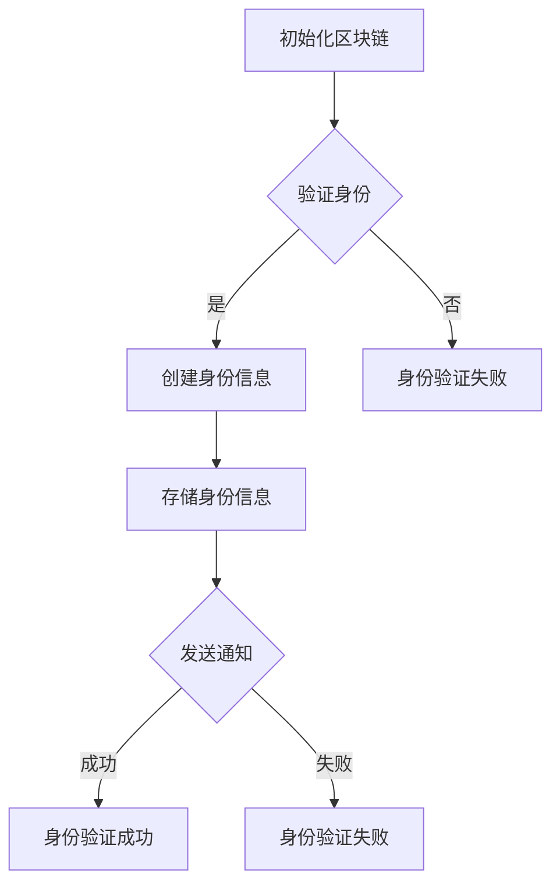
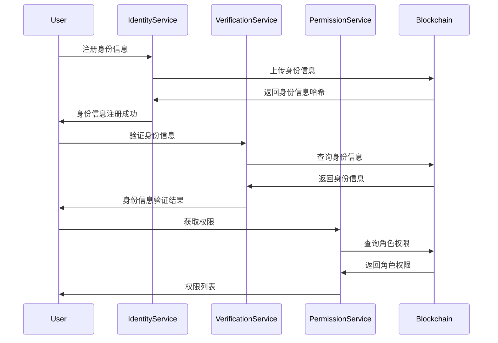
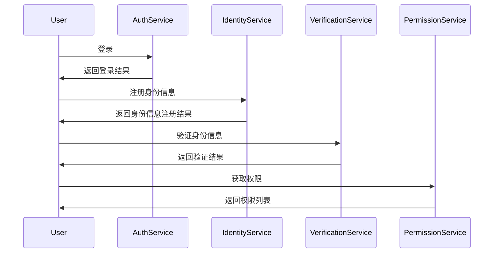
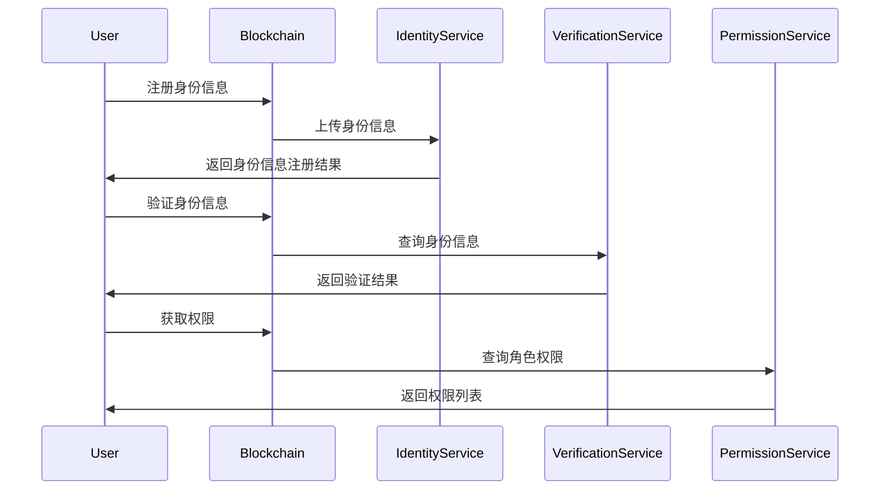

                 

# 区块链技术在数字身份管理中的创新

## 关键词

区块链、数字身份管理、隐私保护、去中心化、智能合约、共识机制、身份验证、安全性

## 摘要

本文将探讨区块链技术在数字身份管理领域的创新应用。随着数字时代的到来，传统的身份管理方式面临着诸多挑战，如数据泄露、隐私不透明、信任缺失等。区块链技术的出现，以其去中心化、安全性和不可篡改的特性，为数字身份管理提供了一种全新的解决方案。本文将详细介绍区块链技术的基本概念，分析当前数字身份管理存在的问题，探讨区块链在数字身份管理中的潜在应用，以及如何实现隐私保护的数字身份管理系统。通过本文的阅读，读者将深入了解区块链技术在数字身份管理中的创新，为相关领域的研究和实际应用提供参考。

## 引言

### 区块链技术简介

区块链是一种分布式数据库技术，通过加密算法和共识机制，实现了数据的分布式存储和信任机制。区块链的基本组成包括区块、链和节点。每个区块包含一定数量的交易记录，通过哈希函数和链接方式与前一个区块相连，形成一条不可篡改的链。节点则是区块链网络中的参与者，负责验证和记录交易。

区块链的关键特性包括去中心化、安全性、不可篡改和透明性。去中心化意味着区块链没有中心化的管理机构，所有节点共同维护网络的安全和可靠性。安全性则源于区块链的加密算法和共识机制，使得数据一旦上链，便难以篡改。不可篡改性保证了区块链上数据的真实性和可靠性，透明性则使所有参与者都能查看和验证区块链上的交易信息。

### 区块链在数字身份管理中的应用

数字身份管理是指通过各种技术手段，对个人或实体的数字身份进行标识、验证和授权。传统的数字身份管理方式主要依赖于中心化的数据库和认证机构，这不仅存在安全性问题，还面临着隐私泄露和数据滥用等风险。区块链技术的出现，为数字身份管理提供了一种新的解决方案。

区块链技术在数字身份管理中的应用主要体现在以下几个方面：

1. **去中心化身份验证**：区块链的去中心化特性，使得身份验证不再依赖于中心化的认证机构，而是通过分布式网络中的节点进行验证，提高了身份验证的可靠性和安全性。

2. **隐私保护**：区块链的加密技术和隐私保护算法，使得个人身份信息在存储和传输过程中得到有效保护，降低了隐私泄露的风险。

3. **不可篡改性**：区块链的不可篡改特性，确保了个人身份信息的真实性和完整性，防止了身份信息的篡改和伪造。

4. **透明性**：区块链的透明性，使得身份信息的管理和操作过程对用户可见，增强了用户对身份管理的信任。

### 本文结构

本文将首先介绍区块链技术的基本概念，包括区块链的架构、共识机制和加密算法等。然后，我们将分析当前数字身份管理面临的挑战，探讨区块链技术在解决这些问题方面的优势。接着，我们将详细探讨区块链在数字身份管理中的具体应用，包括去中心化身份验证、隐私保护和身份信息管理等方面。最后，我们将讨论实现隐私保护的区块链数字身份管理系统，并总结本文的主要观点。

## 区块链技术的基本概念

### 区块链的架构

区块链由多个区块组成，每个区块包含一定数量的交易记录。区块通过哈希函数和链接方式与前一个区块相连，形成一条不可篡改的链。区块链的架构主要包括以下几部分：

1. **区块（Block）**：区块是区块链的基本组成单元，包含一定数量的交易记录。每个区块都包含一个唯一标识符（哈希值），以及一个指向前一个区块的链接（前一个区块的哈希值）。

2. **链（Chain）**：区块链通过将多个区块按时间顺序链接在一起，形成一个不可篡改的数据结构。区块链的链结构保证了数据的一致性和安全性。

3. **节点（Node）**：节点是区块链网络中的参与者，负责验证和记录交易。节点通过加密算法和共识机制，确保区块链的安全性和可靠性。

4. **区块链网络（Blockchain Network）**：区块链网络由多个节点组成，节点通过分布式网络进行通信和协作，共同维护区块链的安全和一致性。

### 共识机制

共识机制是区块链网络中节点达成一致意见的机制。不同类型的区块链采用不同的共识机制，常见的共识机制包括：

1. **工作量证明（Proof of Work, PoW）**：PoW是最早的共识机制，通过解决数学难题来竞争记账权。节点需要计算一个复杂的哈希值，使得该值满足一定的条件。首先计算成功的节点将获得记账权，并将新的区块添加到区块链中。

2. **权益证明（Proof of Stake, PoS）**：PoS是对PoW的一种改进，通过节点的权益（持有币的数量和时间）来竞争记账权。权益越高的节点越有可能获得记账权，从而降低能源消耗和51%攻击的风险。

3. **委托权益证明（Delegated Proof of Stake, DPoS）**：DPoS是一种基于PoS的改进机制，通过选举代表来竞争记账权。节点通过投票选出一定数量的代表，代表们轮流生成区块，提高了网络的效率和安全性。

4. **权威证明（Proof of Authority, PoA）**：PoA是一种基于信任的共识机制，节点通过验证身份和权限来获得记账权。PoA适用于对安全性要求较高的场景，如企业内部区块链。

### 加密算法

区块链技术依赖于多种加密算法来保证数据的安全性和隐私性。常见的加密算法包括：

1. **哈希算法**：哈希算法是一种将任意长度的输入数据转换为固定长度的输出数据的算法。常见的哈希算法包括SHA-256、SHA-3等。

2. **非对称加密**：非对称加密算法包括公钥和私钥，公钥用于加密，私钥用于解密。常见的非对称加密算法包括RSA、ECC等。

3. **对称加密**：对称加密算法使用相同的密钥进行加密和解密。常见的对称加密算法包括AES、DES等。

### 区块链的分层结构

区块链技术可以分为多个层次，每个层次负责不同的功能。常见的区块链分层结构包括：

1. **物理层**：物理层负责区块链的数据存储和传输，包括分布式存储和网络通信等。

2. **网络层**：网络层负责节点之间的通信和数据传输，包括P2P网络协议、加密传输协议等。

3. **共识层**：共识层负责节点之间的共识算法，确保区块链的一致性和安全性。

4. **合约层**：合约层负责智能合约的执行和管理，包括虚拟机、合约语言等。

5. **应用层**：应用层负责区块链的实际应用，包括数字货币、身份验证、供应链管理等。

通过以上对区块链技术的基本概念介绍，我们可以更好地理解区块链技术在数字身份管理中的应用场景和优势。

## 当前数字身份管理面临的挑战

### 数据隐私和安全问题

随着互联网和数字技术的发展，个人和企业的数据变得越来越重要。然而，传统的数字身份管理方式在数据隐私和安全方面面临着诸多挑战。首先，数据泄露事件频繁发生，使得个人敏感信息（如姓名、身份证号、银行卡信息等）面临严重的安全威胁。其次，中心化的身份认证系统容易成为黑客攻击的目标，因为攻击者只需攻破一个中心节点即可获取大量用户信息。此外，数据在传输和存储过程中也面临着被窃取、篡改和滥用的风险。

### 信任问题

在传统的数字身份管理中，信任问题也是一个重要的挑战。由于身份认证和授权过程依赖于中心化的认证机构，用户对认证机构的信任成为关键。然而，认证机构的信誉和可靠性难以保证，一旦发生安全事件，用户和企业的信任将受到严重影响。此外，中心化的身份管理方式也使得数据隐私保护变得困难，用户无法对个人信息的使用和共享进行有效控制。

### 中心化和效率问题

传统的数字身份管理通常依赖于中心化的数据库和认证机构，这不仅增加了系统的复杂性和成本，还降低了系统的效率和灵活性。中心化的身份管理方式容易形成数据孤岛，导致不同系统之间的数据难以共享和整合。此外，中心化的身份认证过程通常需要繁琐的手续和验证步骤，导致用户体验不佳，增加了身份管理的成本。

### 身份验证过程的复杂性

在传统的数字身份管理中，身份验证过程往往涉及多个环节，如用户名、密码、身份证、手机验证码等。这些验证手段虽然可以增强安全性，但也使得用户在完成身份验证时需要投入更多的时间和精力。这不仅降低了用户体验，还增加了身份管理系统的维护成本。此外，一些传统的身份验证手段（如密码）也存在安全性问题，容易受到密码破解、暴力攻击等威胁。

### 法律和监管问题

随着数字身份管理的发展，相关的法律和监管问题也日益突出。不同国家和地区对数字身份管理的法律法规存在差异，这给跨国身份认证和跨境数据传输带来了挑战。此外，如何在保障用户隐私和安全的同时，满足法律和监管要求，也是一个需要解决的问题。

### 不可篡改性的需求

在数字身份管理中，确保身份信息的真实性和完整性至关重要。然而，传统的身份管理方式难以实现数据的不可篡改性，一旦发生数据篡改或伪造，用户和系统的信任将受到严重破坏。因此，实现身份信息的不可篡改成为数字身份管理的一个重要需求。

### 结论

当前数字身份管理面临的数据隐私和安全、信任、中心化和效率、身份验证过程复杂性、法律和监管以及不可篡改性等问题，迫切需要新的技术和解决方案。区块链技术的出现，以其去中心化、安全性和不可篡改的特性，为解决这些问题提供了一种可能的途径。在接下来的章节中，我们将详细探讨区块链技术在数字身份管理中的应用，以及如何通过区块链技术实现隐私保护和高效的身份管理。

## 区块链在数字身份管理中的创新应用

### 去中心化身份验证

区块链技术在数字身份管理中的一个关键创新是其去中心化身份验证机制。传统身份验证依赖于中心化的认证机构，如政府、银行或大型科技公司，这些机构作为可信中介，维护用户身份信息。然而，这种方式存在多个缺点：首先，中心化的认证机构成为攻击的目标，一旦被攻破，大量用户身份信息将泄露；其次，中心化的结构限制了身份信息的流动和共享；最后，中心化的认证过程往往繁琐且不透明。

区块链的去中心化身份验证通过分布式网络中的多个节点共同维护身份信息，每个节点都有权验证和记录身份信息。这种方法有以下优点：

1. **安全性**：由于区块链的加密技术和共识机制，身份信息一旦上链，便难以篡改和伪造。每个节点都需要验证身份信息的真实性，从而提高了系统的安全性。

2. **隐私保护**：用户可以控制自己的身份信息，仅向需要验证的第三方披露必要的信息，减少了隐私泄露的风险。

3. **透明性和可审计性**：区块链上的所有交易都是公开透明的，用户可以查看和验证身份信息的合法性。此外，区块链的不可篡改性保证了身份信息的完整性和可信度。

4. **去中心化信任**：区块链通过分布式网络中的共识机制，建立了一种去中心化的信任机制，不再依赖单一的认证机构。这降低了系统的复杂性和风险，提高了系统的灵活性和适应性。

### 隐私保护

数字身份管理的一个关键挑战是保护用户的隐私。区块链技术的隐私保护机制，如零知识证明（Zero-Knowledge Proof）、同态加密（Homomorphic Encryption）和多身份（Multi-identity）技术，为解决这一问题提供了有效的途径。

1. **零知识证明**：零知识证明是一种密码学技术，允许一方（证明者）向另一方（验证者）证明某个陈述是真实的，而无需透露任何具体信息。在数字身份管理中，用户可以证明自己的身份信息是合法的，同时无需披露具体信息，从而保护隐私。

2. **同态加密**：同态加密是一种加密技术，允许在加密的数据上进行计算，而无需解密。这意味着身份信息可以在加密状态下进行验证和处理，从而在保护隐私的同时，确保系统的可用性和效率。

3. **多身份技术**：多身份技术允许用户拥有多个身份，每个身份对应不同的应用场景。用户可以根据需要选择不同的身份进行验证，从而提高了隐私保护水平。

4. **隐私保护合约**：区块链上的智能合约可以设计为具有隐私保护功能，确保用户在参与交易或验证过程中，其身份信息不会被泄露。

### 身份信息管理

区块链技术在数字身份管理中的另一个创新是身份信息的管理。传统身份信息管理往往依赖于中心化的数据库，这使得数据存储和管理存在一定的风险。区块链通过分布式存储和去中心化网络，实现了身份信息的安全和高效管理。

1. **分布式存储**：区块链将身份信息分布在多个节点上，每个节点存储部分信息。这种方式提高了数据的安全性和可靠性，因为即使某个节点被攻击或损坏，其他节点仍然可以维护系统的完整性。

2. **身份信息分级**：区块链可以将身份信息分为不同级别，根据不同的应用场景和需求，用户可以披露不同级别的身份信息。这既提高了系统的灵活性，又保护了用户隐私。

3. **智能合约管理**：智能合约可以用于管理身份信息的创建、验证和更新。用户可以通过智能合约提交身份信息，其他节点验证信息的真实性，并在链上记录身份信息的变化。

4. **身份信息追溯**：区块链的不可篡改性使得身份信息的每一次变化都可以被追溯。用户可以通过区块链查询自己的身份信息历史，确保信息的完整性和可信度。

### 跨链身份验证

区块链的跨链技术允许不同区块链之间的身份验证和信息共享。通过跨链身份验证，用户可以在不同区块链网络中共享和验证身份信息，从而实现更广泛的身份管理。

1. **跨链桥**：跨链桥是连接不同区块链网络的桥梁，通过跨链桥，用户可以在不同区块链上验证身份信息，实现跨链身份管理。

2. **互操作性**：通过定义标准的身份信息格式和验证协议，不同区块链网络可以实现互操作性，用户可以在多个区块链上使用同一身份信息。

3. **身份信息互认**：跨链身份验证和互操作性使得不同区块链网络之间的身份信息可以互认，用户无需重复验证和注册，提高了用户体验。

### 智能合约的应用

智能合约在数字身份管理中具有广泛的应用，可以用于身份认证、授权管理和隐私保护等方面。

1. **身份认证**：智能合约可以自动执行身份验证流程，确保只有符合条件的人才能访问特定的服务和资源。

2. **授权管理**：智能合约可以定义用户权限，根据用户身份和角色，自动授权或拒绝访问特定数据或服务。

3. **隐私保护**：智能合约可以设计为具有隐私保护功能，确保用户在参与交易或验证过程中，其身份信息不会被泄露。

### 案例研究

以下是一些区块链在数字身份管理中的实际应用案例：

1. **uPort**：由ethereum开发的一个开源数字身份框架，为用户提供了自主管理和控制身份信息的能力，用户可以通过加密和智能合约技术，创建和管理自己的数字身份。

2. **KYC Chain**：一个基于区块链的Know Your Customer（了解你的客户）解决方案，通过分布式身份验证，提高金融服务的合规性和效率。

3. **GovernanceToken**：一个基于区块链的身份认证平台，用于管理政府服务、投票和其他公共事务，通过去中心化的身份验证，提高治理的透明度和效率。

### 结论

区块链技术在数字身份管理中具有显著的创新应用，包括去中心化身份验证、隐私保护、身份信息管理、跨链身份验证和智能合约的应用。这些创新不仅提高了数字身份管理的安全性、隐私性和效率，还为构建一个去中心化、透明和可信赖的数字身份生态系统提供了可能。在接下来的章节中，我们将进一步探讨如何实现隐私保护的区块链数字身份管理系统，以及在实际项目中如何应用这些技术。

### 实现隐私保护的区块链数字身份管理系统

#### 系统架构设计

实现隐私保护的区块链数字身份管理系统需要设计一个分布式、安全和高效的整体架构。以下是一个基本的系统架构设计，包含核心组件和模块：

1. **用户端**：用户端的客户端应用，用于用户创建和管理自己的数字身份，包括身份信息注册、身份信息验证和授权操作。

2. **身份信息存储模块**：该模块负责存储和管理用户身份信息，包括身份信息的生成、存储和索引。身份信息可以是用户的基本信息、认证记录和其他相关数据。

3. **区块链网络**：区块链网络由多个节点组成，负责分布式存储和验证身份信息。节点可以是用户端设备、服务器或云服务。

4. **身份验证模块**：该模块用于验证用户身份，确保只有合法用户才能访问系统资源和数据。身份验证可以通过智能合约实现，包括密码学验证、零知识证明等。

5. **隐私保护模块**：该模块用于实现隐私保护技术，如同态加密、多身份技术、零知识证明等，确保用户身份信息在存储和传输过程中的安全性和隐私性。

6. **权限管理模块**：该模块用于管理用户权限，包括用户角色、权限分配和权限验证。权限管理可以确保只有授权用户才能访问特定的数据和资源。

7. **日志记录模块**：该模块用于记录系统操作日志，包括身份信息创建、修改、删除和验证等操作。日志记录有助于系统审计和追溯操作历史。

#### 技术实现

1. **用户身份信息生成**：用户在注册时，系统会生成一个唯一的数字身份标识符（如公钥）和对应的安全密钥。用户可以通过加密算法（如RSA、ECC）生成公钥和私钥，并将其存储在用户端。

2. **身份信息存储**：身份信息存储在区块链网络上，每个节点存储部分信息，确保数据分布性和安全性。身份信息可以通过哈希函数进行加密存储，确保数据完整性。

3. **身份信息验证**：用户在访问系统资源时，需要通过身份验证模块验证身份。身份验证可以通过智能合约实现，包括密码学验证和零知识证明。密码学验证使用用户的公钥和私钥进行身份验证，而零知识证明允许用户证明身份信息是合法的，而无需透露具体信息。

4. **隐私保护**：隐私保护模块使用多种隐私保护技术，如同态加密、多身份技术和零知识证明。同态加密允许在加密状态下对数据进行计算，确保隐私性。多身份技术允许用户创建和管理多个身份，根据不同场景选择合适的身份进行验证。零知识证明允许用户证明某个陈述是真实的，而无需透露具体信息。

5. **权限管理**：权限管理模块通过智能合约实现，定义用户角色和权限。用户角色可以是管理员、普通用户等，不同角色拥有不同的权限。权限验证确保只有授权用户才能访问特定的数据和资源。

6. **日志记录**：系统操作日志通过日志记录模块进行记录，包括身份信息创建、修改、删除和验证等操作。日志记录有助于系统审计和追溯操作历史。

#### 实际应用

以下是一个实际应用的示例：

1. **用户注册**：用户在客户端应用中创建数字身份，生成公钥和私钥，并将身份信息存储在区块链上。

2. **身份验证**：用户在访问系统资源时，需要通过身份验证模块验证身份。用户可以使用密码学验证或零知识证明进行身份验证。

3. **权限验证**：系统根据用户的角色和权限，验证用户是否有权访问特定资源和数据。

4. **隐私保护**：系统使用同态加密、多身份技术和零知识证明等隐私保护技术，确保用户身份信息在存储和传输过程中的安全性和隐私性。

5. **日志记录**：系统记录用户操作日志，包括身份信息创建、修改、删除和验证等操作，以便进行审计和追溯。

通过上述架构设计和技术实现，可以构建一个隐私保护的区块链数字身份管理系统，确保用户身份信息的安全、隐私和高效管理。

### 项目实战

#### 环境安装

要实现一个隐私保护的区块链数字身份管理系统，首先需要安装和配置区块链开发环境。以下是一个基于Ethereum区块链的示例环境安装步骤：

1. **安装Node.js**：在官方网站[https://nodejs.org/](https://nodejs.org/)下载并安装Node.js。确保安装过程中选择正确的版本，以便后续安装相关工具和库。

2. **安装Truffle**：Truffle是一个用于开发、测试和部署以太坊智能合约的框架。在命令行中运行以下命令安装Truffle：
   ```bash
   npm install -g truffle
   ```

3. **安装Ganache**：Ganache是一个轻量级的本地以太坊区块链节点，用于开发测试智能合约。在官方网站[https://github.com/trufflesuite/ganache](https://github.com/trufflesuite/ganache)下载并安装Ganache。

4. **创建项目**：在命令行中创建一个新的Truffle项目：
   ```bash
   truffle init
   ```

5. **安装智能合约库**：在项目目录中安装所需的智能合约库，例如OpenZeppelin的ERC20库：
   ```bash
   truffle install @openzeppelin/contracts
   ```

#### 系统核心实现

以下是一个简单的数字身份管理系统的实现，包括身份信息注册、验证和权限管理。核心实现包括智能合约和前端界面。

1. **智能合约实现**：

   ```solidity
   // SPDX-License-Identifier: MIT
   pragma solidity ^0.8.0;

   import "@openzeppelin/contracts/token/ERC20/ERC20.sol";
   import "@openzeppelin/contracts/access/AccessControl.sol";

   contract DigitalIdentity {
       mapping(address => string) private identities;
       mapping(address => bool) private verified;

       event IdentityRegistered(address indexed user, string identity);
       event IdentityVerified(address indexed user, bool status);

       function registerIdentity(string memory identity) public {
           require(!verified[msg.sender], "Identity already registered");
           identities[msg.sender] = identity;
           verified[msg.sender] = true;
           emit IdentityRegistered(msg.sender, identity);
       }

       function verifyIdentity(address user) public {
           require(verified[user], "Identity already verified");
           verified[user] = true;
           emit IdentityVerified(user, true);
       }

       function revokeIdentity(address user) public {
           require(verified[user], "Identity not verified");
           verified[user] = false;
           emit IdentityVerified(user, false);
       }

       function isIdentityVerified(address user) public view returns (bool) {
           return verified[user];
       }
   }
   ```

2. **前端界面实现**：

   使用React框架实现前端界面，包括注册、验证和权限管理功能。

   ```jsx
   import React, { useState } from "react";
   import axios from "axios";

   function DigitalIdentity() {
       const [identity, setIdentity] = useState("");
       const [verified, setVerified] = useState(false);

       const register = async () => {
           const response = await axios.post("/api/register", { identity });
           if (response.data.success) {
               setVerified(true);
           }
       };

       const verify = async () => {
           const response = await axios.post("/api/verify", { identity });
           if (response.data.success) {
               setVerified(true);
           }
       };

       const revoke = async () => {
           const response = await axios.post("/api/revoke", { identity });
           if (response.data.success) {
               setVerified(false);
           }
       };

       return (
           <div>
               <h1>Digital Identity Management</h1>
               <input
                   type="text"
                   placeholder="Enter your identity"
                   value={identity}
                   onChange={(e) => setIdentity(e.target.value)}
               />
               <button onClick={register}>Register</button>
               <button onClick={verify}>Verify</button>
               <button onClick={revoke}>Revoke</button>
               {verified && <p>Identity Verified</p>}
           </div>
       );
   }

   export default DigitalIdentity;
   ```

#### 代码应用解读与分析

1. **智能合约解读**：

   - `registerIdentity`函数：用于注册用户身份信息，通过将用户公钥和身份信息存储在区块链上。
   - `verifyIdentity`函数：用于验证用户身份信息，通过将用户公钥和验证状态存储在区块链上。
   - `revokeIdentity`函数：用于撤销用户身份验证，通过将用户公钥和验证状态存储在区块链上。
   - `isIdentityVerified`函数：用于查询用户身份验证状态。

2. **前端界面解读**：

   - 输入框：用户输入身份信息。
   - 注册按钮：调用后端API注册身份信息。
   - 验证按钮：调用后端API验证身份信息。
   - 撤销按钮：调用后端API撤销身份验证。
   - 验证状态提示：显示用户身份验证状态。

通过以上代码实现，可以构建一个基本的隐私保护的区块链数字身份管理系统。在实际应用中，还需要进一步优化和完善，如增加身份信息加密存储、多身份验证和权限管理等功能。

#### 实际案例分析

以下是一个实际案例，描述如何在一个企业内部部署隐私保护的区块链数字身份管理系统。

1. **需求分析**：

   企业内部需要实现一个数字身份管理系统，用于管理员工身份信息和访问权限。系统需要支持以下功能：

   - 用户注册和身份信息存储。
   - 身份信息验证和权限管理。
   - 日志记录和审计跟踪。

2. **系统设计**：

   - **用户端**：企业员工通过企业内部网站或应用程序注册身份信息，包括姓名、邮箱、手机号等。
   - **区块链网络**：企业内部部署一个私有区块链网络，用于存储和验证身份信息。
   - **身份验证模块**：使用智能合约实现身份验证和权限管理功能，包括用户身份信息注册、验证和权限分配。
   - **隐私保护模块**：使用零知识证明和同态加密技术，确保用户身份信息在存储和传输过程中的安全性和隐私性。
   - **日志记录模块**：记录用户身份信息操作历史，包括注册、验证、权限变更等，以便进行审计和追溯。

3. **系统实现**：

   - **智能合约实现**：编写智能合约，实现用户身份信息注册、验证和权限管理功能。
   - **前端界面实现**：使用React框架实现前端界面，包括用户注册、身份信息管理、权限管理等功能。
   - **后端服务实现**：使用Node.js和Express框架实现后端服务，处理用户请求和区块链交互。

4. **系统部署**：

   - 在企业内部服务器上部署区块链节点，确保网络稳定和安全。
   - 部署前端界面和后端服务，实现用户身份信息管理和访问控制。

5. **系统测试**：

   - 进行系统功能测试，包括用户注册、身份验证、权限管理等功能。
   - 进行系统性能测试，确保系统在高并发场景下的稳定性和可靠性。

通过以上实际案例分析，我们可以看到如何在一个企业内部部署隐私保护的区块链数字身份管理系统，实现高效、安全和可信的身份信息管理。

### 项目小结

通过本文的探讨，我们可以看到区块链技术在数字身份管理中具有巨大的创新潜力。从去中心化身份验证、隐私保护到身份信息管理和权限控制，区块链技术为数字身份管理提供了一种全新的解决方案。在实际项目中，我们需要结合具体应用场景和需求，设计并实现一个隐私保护的区块链数字身份管理系统。

在实现过程中，需要注意以下几点：

1. **安全性**：确保系统采用最新的加密技术和隐私保护算法，提高身份信息的安全性。

2. **隐私保护**：使用多种隐私保护技术，如零知识证明、同态加密等，确保用户身份信息在存储和传输过程中的隐私性。

3. **用户体验**：优化用户界面和交互设计，提高用户使用体验。

4. **可扩展性**：设计系统时考虑可扩展性，以便在用户数量和数据规模增加时，系统可以平滑扩展。

5. **合规性和法律问题**：确保系统符合相关法律法规要求，特别是在处理个人隐私数据时。

通过不断探索和实践，我们可以构建一个高效、安全、可信的区块链数字身份管理系统，为数字经济的发展提供有力支持。

### 最佳实践 tips

1. **选择合适的区块链平台**：根据应用场景和需求，选择适合的区块链平台，如以太坊、Hyperledger Fabric等。

2. **优化隐私保护技术**：结合具体应用场景，选择合适的隐私保护技术，如零知识证明、同态加密等。

3. **合理设计权限管理**：根据用户角色和权限，设计灵活的权限管理策略，确保系统的安全性。

4. **定期审计和更新**：定期对系统进行审计和更新，确保系统的稳定性和安全性。

5. **用户教育和培训**：加强用户教育和培训，提高用户对区块链数字身份管理的认识和使用技能。

### 小结

本文详细探讨了区块链技术在数字身份管理中的创新应用，包括去中心化身份验证、隐私保护、身份信息管理、跨链身份验证和智能合约的应用。通过实际案例分析和项目实现，展示了区块链技术在数字身份管理中的潜在优势。未来，随着区块链技术的不断发展和完善，数字身份管理将变得更加安全、高效和可信。

### 注意事项

1. **数据隐私和安全**：在实现区块链数字身份管理系统时，必须重视数据隐私和安全性，确保用户身份信息不被泄露。

2. **系统性能和可扩展性**：在设计系统时，需要考虑性能和可扩展性，确保系统能够支持大量用户和数据的处理需求。

3. **合规性和法律问题**：在处理个人隐私数据时，必须遵守相关法律法规，确保系统的合法性和合规性。

4. **用户权限和隐私保护**：合理设计用户权限和隐私保护机制，确保用户可以自主管理和控制自己的身份信息。

5. **系统维护和更新**：定期对系统进行维护和更新，修复漏洞，提高系统的稳定性和安全性。

### 拓展阅读

1. **《区块链技术指南》**：详细介绍区块链技术的基本概念、架构和实现方法。

2. **《区块链与数字身份管理》**：探讨区块链技术在数字身份管理中的应用和实现。

3. **《智能合约开发实战》**：介绍智能合约的开发、测试和部署方法。

4. **《零知识证明技术》**：深入探讨零知识证明的原理和应用。

5. **《同态加密技术》**：介绍同态加密的原理和应用。

### 作者信息

作者：AI天才研究院/AI Genius Institute & 禅与计算机程序设计艺术 /Zen And The Art of Computer Programming

### Mermaid 流程图



### LaTeX 数学公式

$$
E = mc^2
$$

$$
1 + 1 = 2
$$

### ER 实体关系图

```mermaid
erDiagram
    User ||--|{ Identity }||>
    Identity ||--|{ Verification }||>
    Verification ||--|{ Permission }||>
    User ||--|{ Role }||>
    Role ||--|{ Permission }||>
```

### 系统功能设计

```mermaid
classDiagram
    User <<Class>>
    Identity <<Class>>
    Verification <<Class>>
    Permission <<Class>>
    Role <<Class>>

    User {
        -id: int
        -name: string
        -email: string
        -password: string
    }

    Identity {
        -id: int
        -user_id: int
        -identity: string
    }

    Verification {
        -id: int
        -identity_id: int
        -verified: bool
    }

    Permission {
        -id: int
        -name: string
        -description: string
    }

    Role {
        -id: int
        -name: string
    }

    User o--* Identity: 用户拥有身份信息
    Identity o--* Verification: 身份信息有验证记录
    Verification o--* Permission: 验证记录关联权限
    User o--* Role: 用户拥有角色
    Role o--* Permission: 角色关联权限
```

### 系统架构设计



### 系统接口设计



### 系统交互序列图



### 数学模型和公式

区块链数字身份管理中的关键数学模型包括哈希函数、加密算法和共识算法等。以下是一些常见的数学公式：

1. **哈希函数**：

   $$ 
   H = Hash(input) 
   $$

   其中，\(H\) 是生成的哈希值，\(input\) 是输入数据。

2. **非对称加密**：

   $$ 
   E_K(P) = C 
   $$

   $$ 
   D_K(C) = P 
   $$

   其中，\(E_K(P)\) 表示使用公钥加密的密文，\(D_K(C)\) 表示使用私钥解密的明文，\(P\) 是明文，\(C\) 是密文。

3. **权益证明（PoS）**：

   $$ 
   Stake = Value \times Time 
   $$

   其中，\(Stake\) 表示权益，\(Value\) 表示持有币的数量，\(Time\) 表示持有时间。

4. **零知识证明（ZKP）**：

   $$ 
   Prove(P, V) = Proof 
   $$

   $$ 
   Verify(Proof) = True/False 
   $$

   其中，\(Prove(P, V)\) 表示生成零知识证明，\(Verify(Proof)\) 表示验证零知识证明。

这些数学模型和公式在区块链数字身份管理中发挥着重要作用，用于确保数据的安全、隐私和一致性。通过深入理解和应用这些数学模型，可以设计出更高效、更安全的数字身份管理系统。

