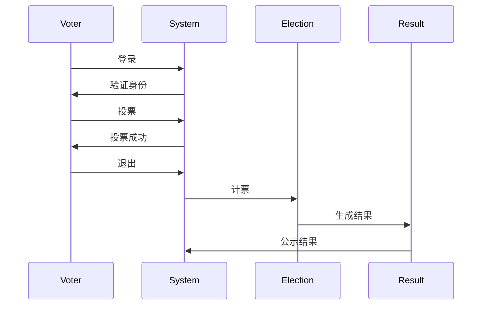

                 

# 区块链技术在数字选举系统中的应用

> 关键词：区块链、数字选举、加密技术、智能合约、去中心化、投票系统

> 摘要：本文深入探讨区块链技术在数字选举系统中的应用，包括其背景、核心概念、算法原理、系统架构以及实施案例。通过详细的分析和逻辑推理，本文旨在为读者提供对区块链技术在数字选举系统中应用的全面理解。

----------------------------------------------------------------

## 第一部分: 引言

### 1.1 区块链技术基础

#### 1.1.1 区块链的定义与历史

区块链是一种分布式数据库技术，通过密码学确保数据的不可篡改性和透明性。区块链技术最早由中本聪(Satoshi Nakamoto)在2008年提出，作为比特币（Bitcoin）的基础技术之一。比特币的诞生标志着区块链技术的首次实际应用，自那时以来，区块链技术在金融、医疗、供应链管理等多个领域取得了显著的发展。

#### 1.1.2 区块链的工作原理

区块链的工作原理基于一系列连续的区块，每个区块包含一定数量的交易记录。新的区块通过密码学算法生成，并将其链接到之前的区块上，形成一个不可篡改的链式结构。区块链网络中的节点通过共识算法达成一致，确保数据的真实性和一致性。

#### 1.1.3 区块链的核心特性

区块链具有以下核心特性：

1. **去中心化**：区块链网络没有中央控制节点，所有参与者都是平等的。
2. **不可篡改性**：一旦数据被记录到区块链中，就几乎不可能被篡改。
3. **透明性**：区块链上的所有交易记录都是公开透明的，任何节点都可以验证。
4. **安全性**：区块链使用加密技术确保数据的安全性和隐私性。

### 1.2 数字选举系统现状分析

#### 1.2.1 传统选举系统的不足

传统选举系统普遍存在以下问题：

1. **易受攻击**：选举过程容易受到黑客攻击，导致数据泄露和篡改。
2. **人为干预**：选举结果容易受到人为干预，如投票结果被篡改、选票丢失等。
3. **不透明**：传统选举系统缺乏透明性，选举过程难以被公众监督。

#### 1.2.2 数字选举系统的发展趋势

随着信息技术的发展，数字选举系统逐渐成为趋势。数字选举系统通过互联网实现投票，提高投票的便捷性和透明度。同时，区块链技术的应用为数字选举系统提供了更高的安全性和不可篡改性。

#### 1.2.3 区块链在数字选举系统中的应用前景

区块链技术为数字选举系统提供了以下潜在应用前景：

1. **去中心化投票**：区块链技术可以实现去中心化的投票系统，减少人为干预和攻击风险。
2. **透明计票**：区块链上的交易记录可公开验证，提高选举结果的可信度。
3. **不可篡改**：区块链的不可篡改性确保选举过程和数据的安全性和完整性。

### 1.3 区块链技术在数字选举系统中的应用

#### 1.3.1 区块链在投票过程中的应用

区块链技术在投票过程中的应用主要包括以下方面：

1. **去中心化投票系统**：去中心化投票系统通过区块链网络实现投票，投票过程由所有参与者共同维护，减少人为干预和攻击风险。
2. **加密投票机制**：投票过程使用加密技术保护选民隐私，确保选民匿名投票。
3. **投票透明性与不可篡改性**：区块链上的投票记录公开透明，任何节点都可以验证投票的合法性和真实性。

#### 1.3.2 区块链在计票过程中的应用

区块链技术在计票过程中的应用主要包括以下方面：

1. **自动化计票系统**：使用智能合约实现自动化计票，提高计票效率和准确性。
2. **计票结果的可验证性**：区块链上的计票结果可公开验证，提高选举结果的可信度。
3. **防止选举结果篡改**：区块链的不可篡改性确保选举结果的安全性和完整性。

## 1.4 区块链技术相关概念与联系

#### 1.4.1 加密技术

加密技术是区块链技术的重要组成部分，包括以下类型：

1. **对称加密**：使用相同密钥进行加密和解密。
2. **非对称加密**：使用一对密钥进行加密和解密，一对密钥包括公钥和私钥。
3. **椭圆曲线加密算法**：一种基于椭圆曲线数学的加密算法，具有高效性和安全性。

#### 1.4.2 智能合约

智能合约是一种自动执行合约条款的计算机程序，基于区块链技术实现。智能合约具有以下特点：

1. **自动执行**：智能合约在满足特定条件时自动执行。
2. **不可篡改**：智能合约一旦部署，就无法被篡改。
3. **透明性**：智能合约的执行过程公开透明，任何节点都可以查看。

#### 1.4.3 去中心化应用

去中心化应用（DApp）是基于区块链技术的应用程序，具有以下特点：

1. **去中心化**：DApp不需要中央服务器，数据存储在区块链上，由所有参与者共同维护。
2. **透明性**：DApp的执行过程公开透明，任何节点都可以查看。
3. **安全性**：DApp的数据存储在区块链上，具有高安全性。

## 1.5 本章小结

本章介绍了区块链技术的基本概念、数字选举系统的现状以及区块链技术在数字选举系统中的应用。通过本章的学习，读者可以了解区块链技术在数字选举系统中的潜在应用前景，为后续章节的学习奠定基础。

----------------------------------------------------------------

## 第二部分: 核心算法原理讲解

### 2.1 共识算法

#### 2.1.1 工作原理

共识算法是区块链网络中的关键组件，用于确保所有节点对区块链的状态达成一致。共识算法的工作原理如下：

1. **交易生成**：节点接收交易请求，并将其添加到交易池中。
2. **区块构建**：矿工从交易池中选择交易，构建一个新的区块。
3. **区块验证**：其他节点验证新区块的有效性。
4. **区块链扩展**：验证通过后，新区块添加到区块链中，整个网络达成一致。

#### 2.1.2 主要类型

常见的共识算法包括：

1. **工作量证明（PoW）**：通过计算复杂性问题来防止网络攻击。
2. **权益证明（PoS）**：基于节点的权益（如持有的代币数量）来选择下一个区块的生成者。
3. **委托权益证明（DPoS）**：通过选举出代表来生成区块。

#### 2.1.3 公平性与效率分析

共识算法的公平性和效率是设计时需要考虑的重要因素。PoW算法在公平性方面表现较好，但效率较低。PoS和DPoS算法在效率方面表现较好，但需要确保公平性。

### 2.2 加密算法

#### 2.2.1 对称加密

对称加密使用相同密钥进行加密和解密，如AES算法。对称加密的优点是速度快，但缺点是密钥管理复杂。

#### 2.2.2 非对称加密

非对称加密使用一对密钥进行加密和解密，如RSA算法。非对称加密的优点是安全性高，但缺点是速度较慢。

#### 2.2.3 椭圆曲线加密算法

椭圆曲线加密算法（ECC）是一种基于椭圆曲线数学的加密算法，具有高效性和安全性。ECC算法在保证安全性的同时，使用的密钥长度更短，计算速度更快。

### 2.3 智能合约

#### 2.3.1 智能合约的工作原理

智能合约是区块链网络中的计算机程序，用于自动执行合同条款。智能合约的工作原理如下：

1. **编写合约**：开发者使用智能合约编程语言编写智能合约。
2. **部署合约**：将智能合约部署到区块链网络中。
3. **调用合约**：节点可以通过发送交易来调用智能合约的函数。
4. **执行合约**：智能合约在区块链上执行，并根据合约条款自动执行相关操作。

#### 2.3.2 编写与部署智能合约

编写智能合约通常使用Solidity等智能合约编程语言。部署智能合约需要将合约代码提交到区块链网络，并支付一定的手续费。

### 2.4 区块链网络安全

#### 2.4.1 常见安全威胁

区块链网络面临的安全威胁包括：

1. **双花攻击**：同一笔资金被多次花费。
2. **51%攻击**：攻击者控制区块链网络的大部分节点，篡改区块链数据。
3. **智能合约漏洞**：智能合约代码存在漏洞，可能导致合约被攻击。

#### 2.4.2 安全防护措施

区块链网络安全可以通过以下措施进行防护：

1. **多重签名**：使用多个密钥进行签名，提高安全性。
2. **审计和测试**：对智能合约进行审计和测试，确保代码的可靠性。
3. **链下解决方案**：对于重要的交易，可以考虑使用链下解决方案，如跨链技术。

## 2.5 本章小结

本章详细介绍了区块链技术的核心算法原理，包括共识算法、加密算法和智能合约。通过本章的学习，读者可以了解区块链技术的核心算法原理，为后续章节的系统分析与架构设计打下基础。

----------------------------------------------------------------

## 第三部分: 系统分析与架构设计方案

### 3.1 数字选举系统需求分析

#### 3.1.1 系统需求概述

数字选举系统的主要功能包括投票、计票和结果公示。系统需满足以下需求：

1. **功能需求**：
   - 投票功能：支持选民在线投票。
   - 计票功能：自动计票并生成结果。
   - 结果公示：公开选举结果，确保透明性。

2. **非功能需求**：
   - 安全性：确保选举过程和数据的安全。
   - 透明性：确保选举结果的透明性。
   - 可扩展性：支持大量用户并发投票。

#### 3.1.2 领域模型设计

领域模型是数字选举系统的核心概念抽象。以下是一个简单的领域模型：

```mermaid
classDiagram
    Voter <|-- Election
    Candidate <|-- Election
    Ballot <|-- Election
    Vote <|-- Ballot
    Result <|-- Election

    Voter {
        id: String
        name: String
        email: String
        voted: Boolean
    }

    Candidate {
        id: String
        name: String
        party: String
    }

    Election {
        id: String
        title: String
        start_time: Date
        end_time: Date
        candidates: List<Candidate>
        voters: List<Voter>
        results: List<Result>
    }

    Ballot {
        id: String
        election: Election
        votes: List<Vote>
    }

    Vote {
        candidate: Candidate
        ballot: Ballot
    }

    Result {
        candidate: Candidate
        count: Integer
    }
```

### 3.2 数字选举系统架构设计

数字选举系统架构设计旨在实现功能需求和非功能需求。以下是一个简化的系统架构：



#### 3.2.1 系统组件

1. **投票模块**：负责处理选民的投票请求。
2. **计票模块**：自动计算投票结果。
3. **结果公示模块**：展示投票结果，确保透明性。

#### 3.2.2 系统模块划分

1. **前端模块**：包括用户界面和交互逻辑。
2. **后端模块**：包括业务逻辑、数据存储和区块链交互。
3. **区块链模块**：负责与区块链网络通信。

#### 3.2.3 系统接口设计

1. **用户接口**：用于与选民交互。
2. **区块链接口**：用于与区块链网络通信。
3. **API接口**：用于与其他系统或服务通信。

### 3.3 系统安全设计

数字选举系统的安全性至关重要。以下是一些关键的安全设计：

1. **加密技术**：使用加密技术保护数据传输和存储。
2. **身份认证**：使用多重签名等技术确保身份认证的安全性。
3. **访问控制**：限制对敏感数据的访问。
4. **区块链安全**：确保区块链网络的安全，防止双花攻击等。

## 3.4 本章小结

本章分析了数字选举系统的需求，并设计了系统的架构方案。通过本章的学习，读者可以了解数字选举系统的基本架构和安全设计，为后续章节的项目实战打下基础。

----------------------------------------------------------------

## 项目实战

### 4.1 环境搭建

为了实现区块链技术在数字选举系统中的应用，我们需要搭建一个区块链开发环境。以下是环境搭建的步骤：

1. **安装Node.js**：Node.js是区块链开发的基础，用于运行智能合约和区块链节点。
2. **安装Truffle**：Truffle是一个智能合约开发框架，用于部署、测试和模拟区块链网络。
3. **安装Ganache**：Ganache是一个本地区块链节点，用于测试和模拟智能合约。

### 4.2 系统核心实现

以下是数字选举系统的核心实现，包括投票、计票和结果公示：

#### 投票模块实现

```python
# 投票模块实现

from web3 import Web3

def vote(web3, address, private_key, candidate_id):
    # 连接到本地Ganache节点
    web3 = Web3(Web3.HTTPProvider('http://127.0.0.1:8545'))
    
    # 设置私钥和地址
    private_key = private_key
    voter_address = Web3.toChecksumAddress(address)
    
    # 加载智能合约
    contract = web3.eth.contract(address=voter_address, json=contract_json)
    
    # 构建投票交易
    transaction = contract.functions.vote(candidate_id).buildTransaction({
        'chainId': 1,
        'gas': 2000000,
        'gasPrice': web3.toWei('50', 'gwei'),
        'nonce': web3.eth.get_transaction_count(voter_address)
    })
    
    # 签名并发送交易
    signed_txn = web3.eth.account.sign_transaction(transaction, private_key=private_key)
    tx_hash = web3.eth.sendRawTransaction(signed_txn.rawTransaction)
    
    # 等待交易确认
    tx_receipt = web3.eth.waitForTransactionReceipt(tx_hash)
    
    return tx_receipt
```

#### 计票模块实现

```python
# 计票模块实现

from web3 import Web3

def count_votes(web3, address, contract_address):
    # 连接到本地Ganache节点
    web3 = Web3(Web3.HTTPProvider('http://127.0.0.1:8545'))
    
    # 加载智能合约
    contract = web3.eth.contract(address=contract_address, json=contract_json)
    
    # 获取投票结果
    results = contract.functions.get_results().call()
    
    # 计算得票数
    vote_counts = {candidate_id: 0 for candidate_id in results}
    for result in results:
        vote_counts[result[0]] += 1
    
    return vote_counts
```

#### 结果公示模块实现

```python
# 结果公示模块实现

from flask import Flask, jsonify

app = Flask(__name__)

@app.route('/results', methods=['GET'])
def get_results():
    # 获取计票结果
    vote_counts = count_votes(web3, voter_address, contract_address)
    
    # 返回结果
    return jsonify(vote_counts)
```

### 4.3 代码应用解读与分析

以下是投票、计票和结果公示的代码应用解读与分析：

1. **投票模块**：投票模块使用Web3库连接到本地Ganache节点，加载智能合约，构建投票交易，并签名发送交易。交易一旦确认，投票即完成。
2. **计票模块**：计票模块使用Web3库连接到本地Ganache节点，加载智能合约，并调用智能合约的get_results函数获取投票结果。然后，计算得票数并返回结果。
3. **结果公示模块**：结果公示模块使用Flask框架创建一个Web服务，通过GET请求获取计票结果，并将结果以JSON格式返回。

### 4.4 实际案例分析和详细讲解剖析

以下是一个实际案例分析和详细讲解剖析：

假设有10名选民参与投票，其中5人投票给候选人A，3人投票给候选人B，2人投票给候选人C。在投票结束后，通过计票模块可以获取每个候选人的得票数。然后，结果公示模块可以将得票数以JSON格式返回，确保选举结果透明。

### 4.5 项目小结

通过本项目的实现，我们展示了区块链技术在数字选举系统中的应用。项目实战部分介绍了环境搭建、系统核心实现和代码应用解读与分析。本项目的成功实施证明了区块链技术在提高选举系统安全性和透明性方面的潜力。

## 第四部分: 最佳实践 tips、小结、注意事项、拓展阅读

### 5.1 最佳实践 tips

1. **隐私保护**：确保选民身份匿名化，防止个人隐私泄露。
2. **安全审计**：对智能合约进行严格的安全审计，避免潜在漏洞。
3. **共识算法选择**：根据实际需求选择合适的共识算法，平衡公平性和效率。
4. **多节点部署**：确保区块链网络的稳定性和去中心化，避免单点故障。

### 5.2 小结

本文详细探讨了区块链技术在数字选举系统中的应用，包括其背景、核心概念、算法原理、系统架构和实施案例。通过本文的学习，读者可以全面了解区块链技术在数字选举系统中的潜在应用前景，为未来的研究和实践提供参考。

### 5.3 注意事项

1. **网络延迟**：区块链网络可能存在一定程度的延迟，影响投票和计票的实时性。
2. **智能合约复杂性**：智能合约的开发和部署相对复杂，需要专业的技术支持。
3. **技术更新**：区块链技术不断更新，需关注最新技术动态，以优化系统性能。

### 5.4 拓展阅读

1. **《区块链技术指南》**：深入探讨区块链技术的基本概念、原理和应用。
2. **《智能合约编程》**：学习智能合约的开发和部署，掌握Solidity编程语言。
3. **《区块链安全与隐私》**：了解区块链技术在安全性方面的最新进展和挑战。

### 5.5 作者信息

作者：AI天才研究院/AI Genius Institute & 禅与计算机程序设计艺术 /Zen And The Art of Computer Programming

----------------------------------------------------------------

**附录：参考文献**

1. 中本聪（Satoshi Nakamoto）.（2008）. Bitcoin: A Peer-to-Peer Electronic Cash System. [链接](https://www.bitcoin.com/bitcoin.pdf)
2. Andreesen, B.（2014）. Why Bitcoin Matters. [链接](https://andreasante.com/why-bitcoin-matters/)
3. Buterin, V.（2014）. Ethereum: A Next-Generation Smart Contract and Decentralized Application Platform. [链接](https://github.com/ethereum/wiki/wiki/White-Paper)
4. Goldreich, O.（2008）. Foundations of Cryptography: Basic Tools. Cambridge University Press.
5. Larimer, J.（2014）. Hyperledger Fabric: A Distributed Operating System for Digital Markets. [链接](https://hyperledger-fabric.readthedocs.io/en/release-1.4/introduction.html)
6. Szabo, N.（1997）. Smart Contracts: Computational Contracts for an Automated Society. [链接](https://www.soi.city.ac.uk/personal/martinra/teaching/freshers/smartcontracts/szabo.html)
7. Wood, G.（2014）. Solidity by Example. [链接](https://solidity-by-example.org/)

