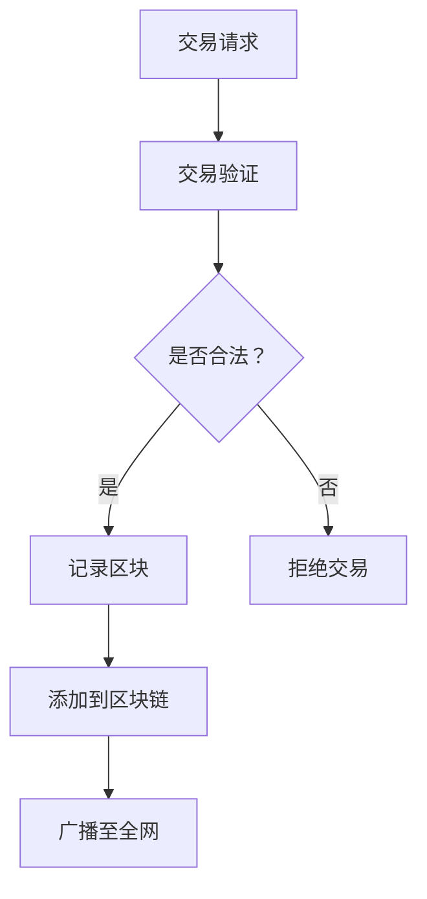
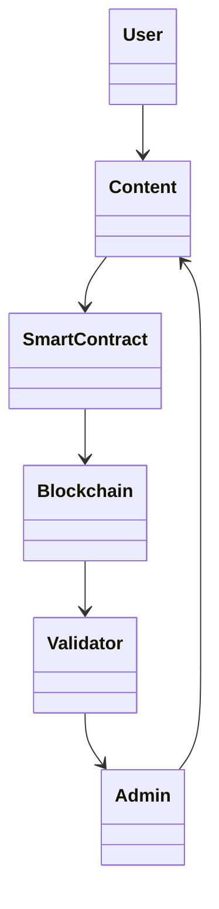
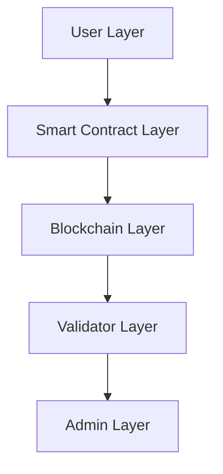
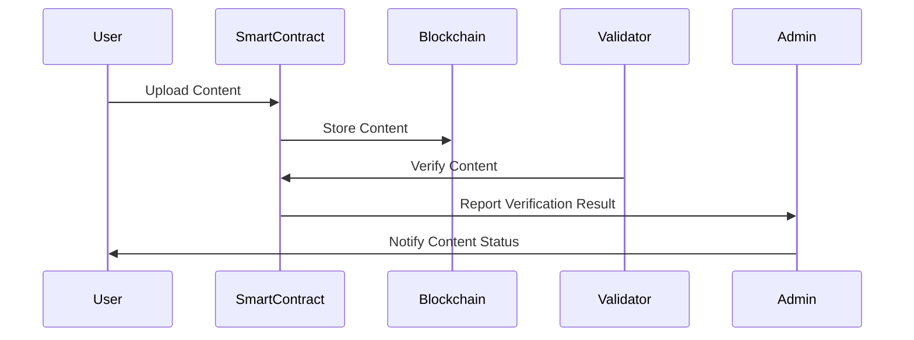

                 


# 区块链技术在虚假信息防控中的应用

## 关键词
- 区块链技术
- 虚假信息防控
- 分布式存储
- 智能合约
- 透明性

## 摘要
本文深入探讨了区块链技术在虚假信息防控中的应用。通过分析区块链技术的基本原理，我们探讨了如何利用区块链的分布式存储、透明性和智能合约特性来识别和防止虚假信息的传播。文章分为七个章节，从区块链技术基础开始，逐步深入到其在社交媒体、新闻媒体和未来发展趋势中的应用，最后通过案例研究来展示区块链技术在虚假信息防控中的实际应用效果。

## 引言

在当今数字化时代，虚假信息的传播速度和影响范围前所未有。从社交媒体上的假新闻到网络诈骗，虚假信息对社会造成了严重的危害。解决这个问题需要一种能够确保信息真实性和来源可靠性的技术手段。区块链技术作为一种分布式账本技术，因其不可篡改、透明性和安全性而备受关注。本文将探讨区块链技术在虚假信息防控中的应用，分析其如何通过分布式存储、透明性和智能合约等特性来对抗虚假信息。

## 区块链技术基础

### 区块链的定义和历史

区块链技术最早由中本聪（Satoshi Nakamoto）在2008年提出，作为一种去中心化的分布式账本技术，旨在通过加密和共识算法来确保数据的安全性和完整性。区块链的基本原理是，将数据分成多个区块，并通过加密技术将这些区块链接成一个链。每个区块都包含一定数量的交易记录，且每个区块都通过哈希函数与前一个区块相连，形成一个不可篡改的链条。

区块链的发展历程可以追溯到1991年的分布式数据库概念，但区块链技术的广泛应用始于比特币（Bitcoin）的诞生。比特币作为第一种基于区块链技术的数字货币，成功地将区块链应用于金融领域。自那以后，区块链技术逐渐扩展到其他领域，如供应链管理、物联网、智能合约等。

### 区块链的工作原理

区块链的工作原理可以分为以下几个步骤：

1. **交易生成**：用户通过区块链网络发起交易请求，这些交易请求可以是购买商品、转账资金等。
2. **交易验证**：交易请求在区块链网络中被多个节点（计算机）验证，以确保交易的有效性和合法性。
3. **区块创建**：验证后的交易被组合成一个区块，并添加到区块链中。每个区块都包含一定数量的交易记录。
4. **链式结构**：每个区块通过哈希函数与前一个区块相连，形成链式结构。这种结构使得区块链具有高度的可追溯性和不可篡改性。
5. **共识算法**：区块链网络通过共识算法来决定哪个区块将被添加到区块链中。常见的共识算法包括工作量证明（Proof of Work，PoW）和权益证明（Proof of Stake，PoS）。

### 区块链与加密货币的关系

区块链技术与加密货币密不可分。加密货币如比特币和以太坊是区块链技术的最早应用之一。比特币作为第一种加密货币，其价值存储和交易功能使其成为数字时代的货币。以太坊则进一步扩展了区块链的应用范围，引入了智能合约（Smart Contract）概念，使得区块链不仅限于货币交易，还可以用于去中心化的应用程序（DApps）开发。

加密货币的兴起，不仅改变了传统的金融体系，也为区块链技术的推广和应用提供了动力。通过加密货币，区块链技术得以在金融领域之外的其他领域得到验证和推广。然而，加密货币市场的高波动性和监管问题也使得区块链技术的应用面临挑战。

## 虚假信息的挑战

### 虚假信息的定义和危害

虚假信息是指那些不真实、不准确或误导性的信息。在数字化时代，虚假信息的传播速度和范围前所未有。从社交媒体上的假新闻、谣言到网络诈骗，虚假信息对社会造成了严重的危害。虚假信息的危害包括：

1. **误导公众**：虚假信息可能误导公众，影响人们的决策和判断，导致社会不稳定。
2. **损害个人和企业利益**：虚假信息可能损害个人和企业的声誉，导致经济损失。
3. **引发恐慌和不安**：虚假信息可能引发公众恐慌，影响社会秩序。
4. **加剧社会分裂**：虚假信息可能加剧社会分歧，破坏社会和谐。

### 数字时代虚假信息的传播机制

在数字时代，虚假信息的传播机制变得更加复杂和高效。以下是一些常见的虚假信息传播机制：

1. **社交媒体传播**：社交媒体平台成为虚假信息传播的主要渠道。虚假信息可以迅速被转发和分享，导致其影响范围迅速扩大。
2. **谣言传播**：谣言往往具有吸引力和感染力，容易在人群中传播。谣言的传播速度和影响范围往往超出预期。
3. **信息碎片化**：在信息碎片化的环境中，人们往往只能获取部分信息，这可能导致对事物的错误理解和判断。
4. **技术滥用**：人工智能和机器学习技术被用于生成和传播虚假信息，这使得虚假信息的制作和传播变得更加高效和难以检测。

### 虚假信息的来源和类型

虚假信息的来源多种多样，包括：

1. **恶意意图**：某些个体或组织出于恶意意图故意传播虚假信息。
2. **疏忽大意**：某些人在传播信息时疏忽大意，导致错误信息的传播。
3. **信息不对称**：信息不对称可能导致人们对事物的误解和错误判断。

常见的虚假信息类型包括：

1. **假新闻**：假新闻是指那些不真实、不准确或误导性的新闻报道。
2. **谣言**：谣言是指那些未经证实、但被广泛传播的信息。
3. **深网和暗网信息**：深网和暗网中的信息往往无法通过常规搜索引擎获取，这些信息可能包含虚假信息。
4. **网络诈骗**：网络诈骗是指通过网络平台进行的欺诈行为。

## 区块链技术在虚假信息防控中的应用

### 分布式存储

区块链技术的分布式存储特性使其成为防控虚假信息的有效工具。在区块链中，数据被分散存储在多个节点上，而不是集中存储在一个中心化的数据库中。这意味着即使某个节点被攻击或篡改，数据仍然可以保持完整性和真实性。分布式存储的优势包括：

1. **去中心化**：去中心化意味着不存在单一故障点，这使得系统更加健壮和可靠。
2. **透明性**：每个节点都可以验证和监控其他节点的数据，这增加了数据的透明度和可追溯性。
3. **不可篡改**：一旦数据被记录在区块链上，就难以被篡改，这确保了信息的真实性。

### 透明性

区块链的透明性是其另一大优势。在区块链上，所有交易记录都是公开透明的，任何人都可以通过区块链浏览器查看。这意味着虚假信息在区块链上难以隐藏。透明性的优势包括：

1. **可追溯性**：区块链上的所有交易都可以追溯到具体的时间和参与者，这使得信息的来源和传播路径变得透明。
2. **可验证性**：用户和第三方可以验证区块链上的数据，确保数据的真实性和准确性。
3. **透明监管**：政府和监管机构可以轻松监控区块链上的交易和活动，确保合规性和防止违法行为。

### 智能合约

智能合约是区块链技术的另一重要特性，它是一种自动执行合同条款的计算机程序。智能合约通过区块链上的分布式账本确保合同的执行和执行结果的真实性。智能合约在虚假信息防控中的应用包括：

1. **自动验证**：智能合约可以自动验证信息的真实性和合法性，确保只有真实的信息才能被记录和传播。
2. **透明执行**：智能合约的执行过程是透明和可追踪的，这增加了信息的透明度和可信度。
3. **预防欺诈**：智能合约可以通过编程规则预防欺诈行为，确保合同的执行结果符合预期。

### 区块链技术在社交媒体中的应用

区块链技术在社交媒体中的应用可以显著提高信息真实性和可信度。以下是一些具体应用：

1. **内容验证**：社交媒体平台可以使用区块链技术验证用户发布的内容，确保内容的真实性和准确性。
2. **透明审核**：区块链的透明性使得内容审核过程更加公开和可追踪，减少了人工审核的误差和偏见。
3. **去中心化内容存储**：社交媒体平台可以将用户生成的内容存储在区块链上，确保内容的永久性和不可篡改性。

### 区块链技术在新闻媒体中的应用

区块链技术在新闻媒体中的应用同样具有巨大潜力。以下是一些具体应用：

1. **来源验证**：新闻媒体可以使用区块链技术验证新闻来源，确保新闻的准确性和可靠性。
2. **透明编辑流程**：区块链可以记录新闻的编辑和发布过程，增加新闻过程的透明度和可追溯性。
3. **版权保护**：区块链可以用于版权保护，确保新闻内容的原创性和作者的权益。

## 案例研究

### 案例一：Corporation A的社交媒体虚假信息防控

Corporation A是一家大型社交媒体平台，其用户数量庞大。为了防止虚假信息的传播，Corporation A决定采用区块链技术进行内容验证和存储。

1. **内容验证**：Corporation A使用智能合约自动验证用户发布的内容。如果内容不真实，智能合约将拒绝记录。
2. **透明审核**：所有内容审核过程都被记录在区块链上，任何用户都可以查看。
3. **去中心化存储**：用户生成的内容被分散存储在多个区块链节点上，确保内容的安全性和完整性。

通过这些措施，Corporation A显著提高了信息的真实性和可信度，赢得了用户的信任。

### 案例二：News Corporation的新闻来源验证

News Corporation是一家全球领先的新闻媒体公司，其新闻来源遍布世界各地。为了确保新闻的准确性和可靠性，News Corporation决定使用区块链技术进行来源验证。

1. **来源验证**：News Corporation使用区块链记录每个新闻来源的详细信息，包括发布时间、地点和来源。
2. **透明编辑流程**：区块链记录了每个新闻的编辑和发布过程，确保新闻过程的透明度。
3. **版权保护**：区块链技术用于版权保护，确保新闻内容的原创性和作者的权益。

通过这些措施，News Corporation不仅提高了新闻的准确性和可靠性，还增强了作者和读者的信任。

## 结论

区块链技术在虚假信息防控中具有巨大潜力。通过分布式存储、透明性和智能合约等特性，区块链可以有效识别和防止虚假信息的传播。在社交媒体和新闻媒体领域，区块链技术的应用已经展示了其有效性。随着技术的不断进步和应用场景的拓展，区块链在虚假信息防控中的作用将越来越重要。未来，区块链技术与人工智能等技术的融合将进一步推动虚假信息防控的发展。

## 作者信息

作者：AI天才研究院/AI Genius Institute & 禅与计算机程序设计艺术 /Zen And The Art of Computer Programming

## 附录

### 背景介绍

区块链技术作为一种分布式账本技术，具有去中心化、不可篡改和透明性等特点。这些特性使其在信息验证和存储方面具有显著优势。虚假信息防控是当今社会面临的重要问题，区块链技术可以提供一种有效手段来识别和防止虚假信息的传播。

### 核心概念与联系

核心概念包括区块链技术、分布式存储、透明性、智能合约和虚假信息防控。

1. **区块链技术**：一种分布式账本技术，通过加密和共识算法确保数据的安全性和完整性。
2. **分布式存储**：数据被分散存储在多个节点上，确保数据的可用性和可靠性。
3. **透明性**：所有交易记录都是公开透明的，任何用户都可以查看。
4. **智能合约**：一种自动执行合同条款的计算机程序，确保合同的执行和执行结果的真实性。
5. **虚假信息防控**：通过技术手段识别和防止虚假信息的传播。

### 算法原理讲解

区块链技术中的共识算法是确保区块链网络可靠性的关键。以下是工作量证明（Proof of Work，PoW）算法的mermaid流程图：



以下是一个简单的Python代码示例，用于实现PoW算法：

```python
import hashlib
import time

def mine_block(last_hash, transactions):
    nonce = 0
    while True:
        coin_hash = hashlib.sha256(f"{last_hash}{nonce}{transactions}".encode()).hexdigest()
        if coin_hash.startswith('0' * 4):
            return coin_hash, nonce
        nonce += 1
        time.sleep(0.1)

last_hash = '0000000000000000000000000000000000000000000000000000000000000000'
transactions = '交易内容'
coin_hash, nonce = mine_block(last_hash, transactions)
print(f"矿工找到了一个有效的硬币哈希：{coin_hash}")
print(f"使用的随机数：{nonce}")
```

### 数学公式

区块链网络中的共识算法通常涉及复杂的数学公式。以下是一个简单的数学模型，用于描述PoW算法：

$$
H_{nonce} = SHA256(H_{last} + nonce + transactions)
$$

其中，$H_{nonce}$ 是生成的硬币哈希，$H_{last}$ 是上一个区块的哈希，$nonce$ 是随机数，$transactions$ 是交易内容。

### 系统分析与架构设计方案

#### 问题场景介绍

在一个社交媒体平台上，我们需要防止虚假信息的传播。为此，我们可以利用区块链技术进行内容验证和存储。

#### 项目介绍

项目名为“VeriSocial”，旨在利用区块链技术提高社交媒体平台的信息真实性。

#### 系统功能设计

系统功能包括：

1. **内容验证**：使用智能合约自动验证用户发布的内容。
2. **去中心化存储**：将用户生成的内容存储在区块链上。
3. **透明审核**：记录所有内容审核过程，确保透明度。

以下是系统功能的mermaid类图：



#### 系统架构设计

系统架构包括以下几个部分：

1. **用户层**：用户通过客户端上传和浏览内容。
2. **智能合约层**：智能合约负责内容验证和执行。
3. **区块链层**：区块链用于存储用户生成的内容。
4. **验证器层**：验证器用于确保内容的真实性和完整性。
5. **管理员层**：管理员负责内容审核和管理。

以下是系统架构的mermaid架构图：



#### 系统接口设计和系统交互

系统接口设计包括：

1. **用户接口**：用于上传和浏览内容。
2. **智能合约接口**：用于验证内容。
3. **区块链接口**：用于存储内容。
4. **验证器接口**：用于确保内容真实性。
5. **管理员接口**：用于内容审核和管理。

以下是系统接口设计和系统交互的mermaid序列图：



### 项目实战

#### 环境安装

1. **安装Node.js**：前往Node.js官网下载并安装Node.js。
2. **安装Truffle**：在终端中运行 `npm install -g truffle`。
3. **安装Ganache**：在终端中运行 `npm install -g ganache-cli`。

#### 系统核心实现源代码

以下是“VeriSocial”系统核心实现的部分源代码：

```solidity
// SPDX-License-Identifier: MIT
pragma solidity ^0.8.0;

contract VeriSocial {
    struct Content {
        string content;
        address user;
        bool verified;
    }

    mapping(uint => Content) public contents;
    uint public contentCount;

    event ContentUploaded(uint id, string content, address user);
    event ContentVerified(uint id, bool verified);

    function uploadContent(string memory content) public {
        require(bytes(content).length > 0, "Content cannot be empty");
        contents[contentCount] = Content(content, msg.sender, false);
        emit ContentUploaded(contentCount, content, msg.sender);
        contentCount++;
    }

    function verifyContent(uint id) public {
        require(msg.sender == admin, "Only admin can verify content");
        contents[id].verified = true;
        emit ContentVerified(id, true);
    }

    address public admin;

    constructor() {
        admin = msg.sender;
    }
}
```

#### 代码应用解读与分析

以上代码定义了一个名为“VeriSocial”的智能合约，用于验证和存储用户上传的内容。合约中定义了一个`Content`结构体，用于存储内容的详细信息。`contents`映射用于存储所有上传的内容，`contentCount`用于记录内容的数量。

合约中定义了两个事件：`ContentUploaded`和`ContentVerified`，用于记录内容的上传和验证状态。

`uploadContent`函数用于上传内容。用户可以通过调用此函数上传内容，并要求验证。

`verifyContent`函数用于验证内容。只有管理员可以调用此函数验证内容。

`admin`变量用于存储管理员地址，合约构造函数中设置为合约创建者。

#### 实际案例分析和详细讲解剖析

假设用户Alice上传了一条内容，管理员Bob需要验证这条内容。

1. **Alice上传内容**：

   ```solidity
   function uploadContent(string memory content) public {
       require(bytes(content).length > 0, "Content cannot be empty");
       contents[contentCount] = Content(content, msg.sender, false);
       emit ContentUploaded(contentCount, content, msg.sender);
       contentCount++;
   }
   ```

   Alice调用`uploadContent`函数上传一条内容，合约将这条内容存储在`contents`映射中，并触发`ContentUploaded`事件。

2. **Bob验证内容**：

   ```solidity
   function verifyContent(uint id) public {
       require(msg.sender == admin, "Only admin can verify content");
       contents[id].verified = true;
       emit ContentVerified(id, true);
   }
   ```

   管理员Bob调用`verifyContent`函数验证这条内容。只有管理员可以调用此函数，验证后，合约将这条内容的`verified`字段设置为`true`，并触发`ContentVerified`事件。

通过以上案例，我们可以看到如何利用区块链技术进行内容验证和存储。在实际应用中，我们可以进一步扩展此智能合约，添加更多的功能，如内容评分、评论等。

#### 项目小结

通过“VeriSocial”项目，我们展示了如何利用区块链技术进行内容验证和存储。项目实现了内容上传、验证和存储的功能，通过智能合约确保了内容的真实性和可信度。未来，我们可以进一步优化项目，增加更多功能，如内容评分、评论等，以提供更全面的信息验证和存储服务。

### 最佳实践 Tips

1. **确保区块链网络的安全**：区块链网络的安全是防止虚假信息传播的关键。确保区块链节点安全，防止节点被攻击或篡改。
2. **合理设计智能合约**：智能合约的设计和实现直接影响信息验证和存储的效率。确保智能合约代码简洁、高效，避免潜在的安全漏洞。
3. **定期审核内容**：尽管区块链技术可以提高信息的真实性，但定期审核内容仍然是必要的。定期审核可以及时发现和处理潜在的问题。
4. **透明监管**：政府和社会组织应加强对区块链技术的监管，确保其合法合规使用。

### 小结

区块链技术在虚假信息防控中具有巨大潜力。通过分布式存储、透明性和智能合约等特性，区块链可以有效识别和防止虚假信息的传播。在未来，随着技术的不断进步和应用场景的拓展，区块链在虚假信息防控中的作用将越来越重要。

### 注意事项

1. **区块链技术并非万能**：区块链技术虽然可以提高信息真实性，但并不能完全消除虚假信息。在实际应用中，仍需结合其他技术手段。
2. **智能合约的安全性问题**：智能合约的漏洞可能导致信息泄露或资金损失。在设计智能合约时，务必确保其安全性。

### 拓展阅读

1. **区块链技术的基本原理**：《区块链技术指南》
2. **智能合约开发入门**：《智能合约编程实战》
3. **虚假信息防控的策略与实践**：《虚假信息防控：策略与实践》

通过以上内容，我们深入探讨了区块链技术在虚假信息防控中的应用。希望本文能为您在理解这一技术领域提供帮助。如果您有任何问题或建议，欢迎在评论区留言。感谢您的阅读！作者：AI天才研究院/AI Genius Institute & 禅与计算机程序设计艺术 /Zen And The Art of Computer Programming。

