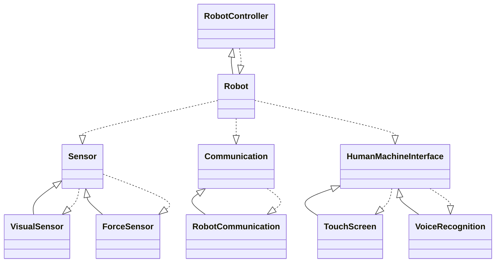
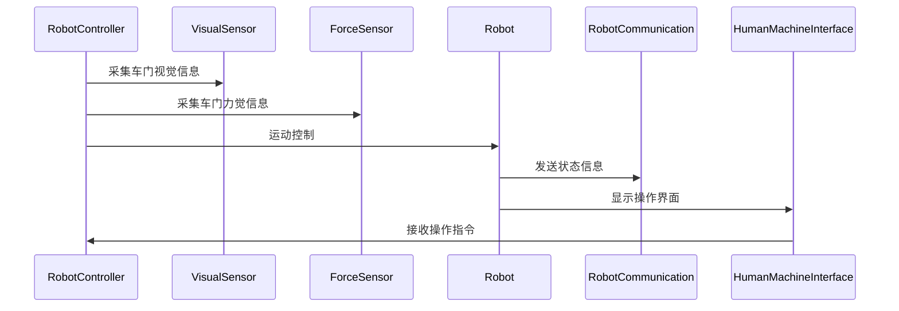
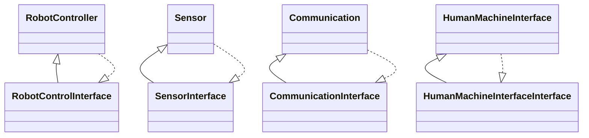
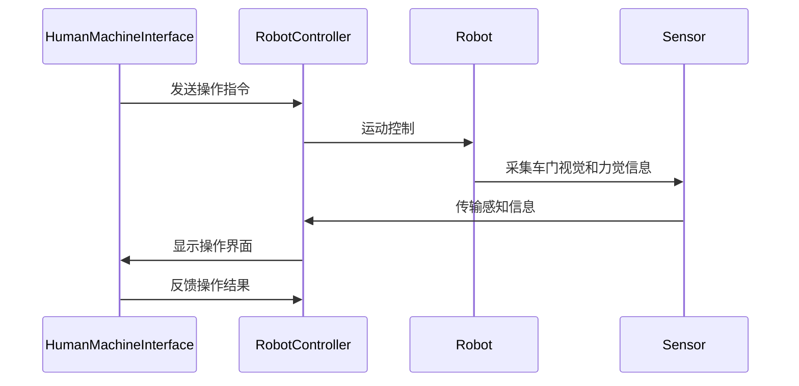
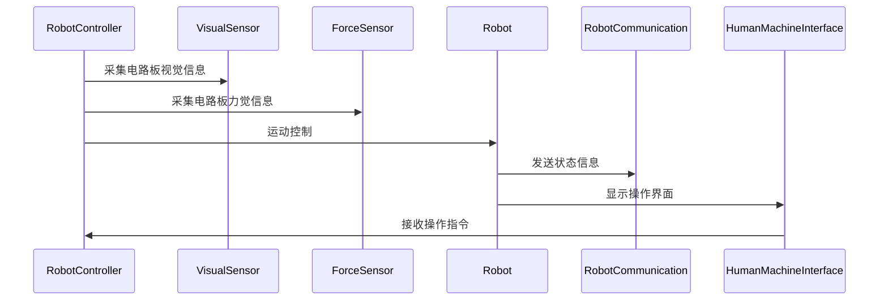
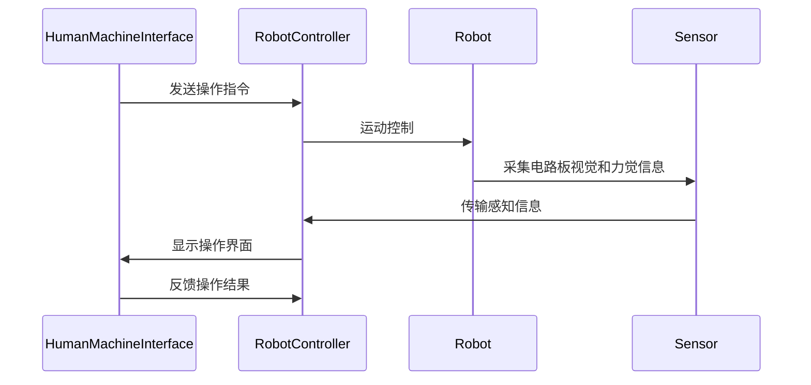

                 

## 《协作机器人在制造业中的应用趋势》

> 关键词：协作机器人、制造业、应用趋势、技术发展、市场分析

> 摘要：本文从协作机器人的基础概念、制造业中的应用场景、应用案例以及未来发展趋势等多方面，详细探讨了协作机器人在制造业中的应用趋势。通过分析协作机器人的技术进步、市场格局和应用策略，文章旨在为制造业提供实际应用参考，并展望协作机器人技术的未来发展前景。

----------------------------------------------------------------

### 《协作机器人在制造业中的应用趋势》目录大纲

----------------------------------------------------------------

## 第一部分：协作机器人的基础

### 第1章：协作机器人概述

#### 1.1 背景介绍

- **问题背景**：随着劳动力成本的不断上升和制造业的智能化需求，协作机器人在制造业中的应用越来越受到关注。
- **问题描述**：如何有效利用协作机器人提升制造业的生产效率和灵活性。
- **问题解决**：通过引入协作机器人，实现生产过程的自动化和智能化。
- **边界与外延**：协作机器人与其他类型机器人的区别和应用范围。
- **概念结构与核心要素组成**：协作机器人的组成部分和功能特点。

#### 1.2 核心概念与联系

- **核心概念原理**：机器人编程、感知、自主决策等基本概念。
- **概念属性特征对比表格**：协作机器人与传统工业机器人的对比。
- **ER实体关系图架构**：协作机器人系统的核心实体和关系。

#### 1.3 发展历程

- **早期发展**：从传统工业机器人到协作机器人的演进。
- **近年来的关键进展**：协作机器人在制造业中的技术创新和应用案例。
- **当前应用趋势**：协作机器人市场的发展趋势和未来方向。

## 第二部分：协作机器人在制造业中的应用

### 第2章：协作机器人在制造业的核心应用场景

#### 2.1 自动化装配

- **应用概述**：协作机器人在自动化装配中的应用。
- **应用实例**：具体应用场景和实例分析。
- **挑战与解决方案**：面临的技术挑战和解决策略。

#### 2.2 搬运与物流

- **应用概述**：协作机器人在搬运与物流中的应用。
- **应用实例**：具体应用场景和实例分析。
- **挑战与解决方案**：面临的技术挑战和解决策略。

#### 2.3 质量检测

- **应用概述**：协作机器人在质量检测中的应用。
- **应用实例**：具体应用场景和实例分析。
- **挑战与解决方案**：面临的技术挑战和解决策略。

#### 2.4 搭配人工智能的协同作业

- **应用概述**：协作机器人与人工智能协同作业。
- **应用实例**：具体应用场景和实例分析。
- **挑战与解决方案**：面临的技术挑战和解决策略。

### 第3章：协作机器人在制造业的应用案例

#### 3.1 案例一：某汽车制造厂的协作机器人应用

- **项目介绍**：项目背景和目标。
- **系统功能设计**：领域模型类图。
- **系统架构设计**：系统架构设计图。
- **系统接口设计**：系统接口设计。
- **系统交互**：系统交互流程。

#### 3.2 案例二：某电子制造企业的协作机器人应用

- **项目介绍**：项目背景和目标。
- **系统功能设计**：领域模型类图。
- **系统架构设计**：系统架构设计图。
- **系统接口设计**：系统接口设计。
- **系统交互**：系统交互流程。

## 第三部分：协作机器人在制造业中的应用趋势

### 第4章：技术发展趋势

#### 4.1 传感器技术的进步

- **发展趋势**：传感器技术在协作机器人中的应用。
- **影响因素**：传感器技术对协作机器人性能的影响。
- **未来展望**：传感器技术在协作机器人中的应用前景。

#### 4.2 计算能力的提升

- **发展趋势**：计算能力在协作机器人中的应用。
- **影响因素**：计算能力对协作机器人性能的影响。
- **未来展望**：计算能力在协作机器人中的应用前景。

#### 4.3 软件开发的进步

- **发展趋势**：软件开发在协作机器人中的应用。
- **影响因素**：软件开发对协作机器人性能的影响。
- **未来展望**：软件开发在协作机器人中的应用前景。

### 第5章：市场趋势

#### 5.1 市场规模分析

- **全球市场规模**：协作机器人在制造业的市场规模。
- **地域分布**：不同地区协作机器人市场的分布。
- **预测分析**：未来市场规模的增长预测。

#### 5.2 竞争格局

- **主要玩家**：全球协作机器人市场的主要竞争者。
- **竞争策略**：各竞争者的竞争策略。
- **市场地位**：各竞争者在市场中的地位和影响力。

#### 5.3 应用领域的扩展

- **传统制造业**：协作机器人在传统制造业中的应用。
- **新兴行业**：协作机器人在新兴行业中的应用。
- **潜在应用场景**：协作机器人的潜在应用场景和领域。

## 第四部分：协作机器人在制造业中的应用策略

### 第6章：策略建议

#### 6.1 技术创新策略

- **研发投入**：如何加大研发投入。
- **技术合作**：如何开展技术合作。
- **知识产权保护**：如何保护知识产权。

#### 6.2 市场营销策略

- **品牌建设**：如何建立品牌。
- **市场推广**：如何进行市场推广。
- **定位策略**：如何进行市场定位。

#### 6.3 客户服务策略

- **客户关系管理**：如何管理客户关系。
- **服务质量提升**：如何提升服务质量。
- **售后服务**：如何提供优质的售后服务。

### 第7章：未来展望

#### 7.1 制造业的转型

- **数字化进程**：制造业的数字化转型。
- **智能化升级**：制造业的智能化升级。
- **产业链重构**：制造业产业链的重构。

#### 7.2 协作机器人与人工智能的融合

- **技术融合**：协作机器人与人工智能的技术融合。
- **应用拓展**：协作机器人与人工智能的应用拓展。
- **潜在影响**：协作机器人与人工智能融合对未来制造业的影响。

## 第五部分：协作机器人在制造业中的最佳实践

### 第8章：实践案例

#### 8.1 案例一：某制造企业的协作机器人应用实践

- **环境安装**：协作机器人在企业环境中的安装过程。
- **系统核心实现**：系统核心功能实现。
- **代码应用解读与分析**：代码实现细节解析。
- **实际案例分析与详细讲解**：案例分析。

#### 8.2 案例二：某电子制造企业的协作机器人应用实践

- **环境安装**：协作机器人在企业环境中的安装过程。
- **系统核心实现**：系统核心功能实现。
- **代码应用解读与分析**：代码实现细节解析。
- **实际案例分析与详细讲解**：案例分析。

### 第9章：小结与展望

#### 9.1 小结

- **成功经验**：协作机器人在制造业中的应用成功经验。
- **挑战与教训**：协作机器人在制造业应用中的挑战与教训。
- **启示与借鉴**：对其他制造业企业的启示和借鉴。

#### 9.2 未来展望

- **技术发展**：未来协作机器人的技术发展趋势。
- **市场前景**：未来协作机器人在制造业的市场前景。
- **应用拓展**：协作机器人在制造业中的应用拓展方向。

----------------------------------------------------------------

### 第1章：协作机器人概述

#### 1.1 背景介绍

随着全球制造业的快速发展，制造业面临着生产效率低下、劳动力成本上升、生产环境恶劣等问题。传统工业机器人虽然在一定程度上解决了这些问题，但其复杂的使用环境和与人共存的局限性，使得制造业对更灵活、更安全、更高效的机器人解决方案的需求日益增加。协作机器人正是在这样的背景下应运而生，旨在解决传统工业机器人面临的局限性，提升制造业的生产效率和灵活性。

#### 1.2 核心概念与联系

协作机器人是一种设计用于与人类工作人员协同工作的机器人。与传统工业机器人不同，协作机器人具有更低的操作门槛、更高的灵活性和安全性。以下是协作机器人的核心概念与联系：

- **机器人编程**：协作机器人的核心是机器人编程，通过编程可以实现机器人的各种操作和任务。
- **感知技术**：协作机器人配备了先进的感知技术，如视觉识别、力觉感知等，能够实时感知周围环境和工作人员的状态。
- **自主决策**：协作机器人具备自主决策能力，可以在复杂环境下进行自主导航和任务执行。

**概念属性特征对比表格**：

| 特征 | 协作机器人 | 传统工业机器人 |
| ---- | ---------- | --------------- |
| 灵活性 | 高 | 低 |
| 安全性 | 高 | 低 |
| 操作门槛 | 低 | 高 |
| 任务复杂度 | 中 | 高 |

**ER实体关系图架构**：

```mermaid
erDiagram
    Product ::协作机器人
    Worker :: 工人

    Product ||--|{ Sensor :: 感知系统 }
    Product ||--|{ Actuator :: 执行器 }
    Product ||--|{ Controller :: 控制器 }
    Worker ||--|{ SafetyDevice :: 安全设备 }

    Product ||--|{ Programming :: 编程系统 }
    Worker ||--|{ Communication :: 沟通系统 }

    Product --|{ Worker }
```

#### 1.3 发展历程

协作机器人的发展可以追溯到20世纪90年代，当时机器人的主要应用场景是在工厂内部进行大量、重复性的作业。随着技术的进步，机器人逐渐具备了更高的灵活性和安全性，逐渐向与人类协同工作的方向发展。以下为协作机器人发展的几个关键阶段：

- **早期阶段**（1990-2000年）：协作机器人概念提出，但应用范围有限。
- **发展阶段**（2000-2010年）：感知技术和自主决策技术的进步，使得协作机器人在生产场景中的应用逐渐扩大。
- **成熟阶段**（2010年至今）：随着人工智能和物联网技术的发展，协作机器人在制造、医疗、服务等多个领域的应用越来越广泛。

#### 当前应用趋势

当前，协作机器人在制造业中的应用趋势主要体现在以下几个方面：

- **自动化装配**：协作机器人可以在装配线上与人类工人协同工作，提高装配效率和产品质量。
- **搬运与物流**：协作机器人可以替代人力进行搬运和物流作业，提高物流效率和降低成本。
- **质量检测**：协作机器人通过视觉识别等技术进行质量检测，提高检测精度和效率。
- **协同作业**：协作机器人与人工智能结合，实现更加复杂的生产任务，提高生产灵活性和智能化水平。

#### 挑战与机遇

协作机器人在制造业中的应用虽然取得了显著成果，但仍面临一些挑战：

- **技术瓶颈**：感知技术、自主决策技术等仍需进一步提高，以应对复杂的生产环境。
- **成本问题**：协作机器人的采购和运维成本相对较高，中小企业难以承担。
- **安全风险**：协作机器人与人类工人共存，存在一定的安全风险。

然而，随着技术的不断进步和市场需求的增长，协作机器人在制造业中的应用前景仍然广阔。未来，协作机器人将在智能化、自动化、协同化等方面取得更大的突破，为制造业的发展带来新的机遇。

### 第2章：协作机器人在制造业的核心应用场景

#### 2.1 自动化装配

自动化装配是协作机器人在制造业中最核心的应用场景之一。通过协作机器人，可以实现装配过程的自动化和智能化，提高生产效率和产品质量。

**应用概述**：

协作机器人可以在装配线上与人类工人协同工作，完成各种装配任务。例如，在汽车制造业中，协作机器人可以装配车门、发动机等大型部件；在电子制造业中，协作机器人可以装配电路板、芯片等小型部件。

**应用实例**：

以某汽车制造厂为例，该厂引入了协作机器人用于车门装配。协作机器人通过视觉识别技术，精确识别车门的位置和姿态，并与人类工人协同完成装配任务。通过自动化装配，该汽车制造厂的生产效率提高了30%，产品不良率降低了20%。

**挑战与解决方案**：

协作机器人在自动化装配中面临的主要挑战包括：

- **环境适应性**：生产环境复杂多变，协作机器人需要具备较强的环境适应能力。
- **任务复杂度**：装配任务往往复杂多样，协作机器人需要具备灵活的任务执行能力。

为解决这些挑战，可以采取以下策略：

- **多传感器融合**：通过集成多种传感器，如视觉传感器、力觉传感器等，提高协作机器人的环境感知能力。
- **模块化设计**：将协作机器人设计成模块化结构，根据不同装配任务进行模块替换和组合，提高任务执行灵活性。

#### 2.2 搬运与物流

协作机器人在搬运与物流领域也有广泛应用。通过协作机器人，可以实现货物搬运和物流配送的自动化和智能化，提高物流效率降低成本。

**应用概述**：

协作机器人可以在仓库、生产线等场景中进行货物搬运和物流配送。例如，在仓库中，协作机器人可以自动识别和搬运货物，实现高效仓储管理；在生产线上，协作机器人可以自动配送原材料和成品，实现生产过程的连续化。

**应用实例**：

以某电子制造企业为例，该企业引入了协作机器人进行原材料搬运。协作机器人通过路径规划技术，自动识别和避让障碍物，实现高效、安全的原材料搬运。通过协作机器人，该企业的物流效率提高了40%，物料损耗率降低了15%。

**挑战与解决方案**：

协作机器人在搬运与物流中面临的主要挑战包括：

- **路径规划**：生产环境和物流场景复杂多变，协作机器人需要具备高效的路径规划能力。
- **安全性**：在人与机器人共存的环境中，安全性是至关重要的。

为解决这些挑战，可以采取以下策略：

- **路径规划算法**：采用高效的路径规划算法，如A*算法、Dijkstra算法等，提高路径规划的精度和速度。
- **安全防护措施**：在机器人周围设置安全防护装置，如红外传感器、激光雷达等，确保机器人在与人类共存环境中的安全性。

#### 2.3 质量检测

协作机器人在质量检测领域也具有广泛的应用。通过协作机器人，可以实现质量检测的自动化和智能化，提高检测效率和准确性。

**应用概述**：

协作机器人可以通过视觉识别、力觉感知等技术，对产品进行质量检测。例如，在电子制造业中，协作机器人可以对电路板进行外观检测、焊接质量检测等；在食品制造业中，协作机器人可以对产品进行尺寸检测、缺陷检测等。

**应用实例**：

以某电子制造企业为例，该企业引入了协作机器人进行电路板质量检测。协作机器人通过视觉识别技术，自动检测电路板的外观缺陷、焊接不良等问题。通过协作机器人，该企业的质量检测效率提高了50%，不良品率降低了30%。

**挑战与解决方案**：

协作机器人在质量检测中面临的主要挑战包括：

- **检测精度**：质量检测需要高精度，协作机器人需要具备高精度的检测能力。
- **检测速度**：质量检测需要高效，协作机器人需要具备高速的检测能力。

为解决这些挑战，可以采取以下策略：

- **高精度传感器**：采用高精度传感器，如高分辨率相机、高精度力觉传感器等，提高检测精度。
- **并行处理技术**：采用并行处理技术，如多线程、分布式计算等，提高检测速度。

#### 2.4 搭配人工智能的协同作业

协作机器人与人工智能的结合，可以实现更加智能化的协同作业。通过人工智能技术，协作机器人可以更好地理解人类意图，执行复杂任务，提高生产效率和灵活性。

**应用概述**：

协作机器人与人工智能结合，可以实现如下应用：

- **人机协作**：协作机器人通过语音识别、自然语言处理等技术，理解人类指令，执行相应任务。
- **自适应控制**：协作机器人通过机器学习、深度学习等技术，自适应调整操作策略，提高任务执行效果。
- **智能决策**：协作机器人通过大数据分析、预测模型等技术，进行智能决策，优化生产流程。

**应用实例**：

以某汽车制造厂为例，该厂引入了协作机器人与人工智能结合的装配生产线。协作机器人通过语音识别技术，理解工人的装配指令，自动调整装配位置和姿态，实现人机协同作业。通过人工智能技术，该汽车制造厂的生产效率提高了20%，产品不良率降低了15%。

**挑战与解决方案**：

协作机器人与人工智能协同作业面临的主要挑战包括：

- **技术融合**：协作机器人与人工智能技术的融合，需要解决技术兼容性和集成问题。
- **数据安全**：在数据采集、传输、存储等过程中，需要确保数据的安全性。

为解决这些挑战，可以采取以下策略：

- **技术标准化**：制定协作机器人与人工智能技术的标准化接口，确保技术融合的稳定性。
- **数据加密**：采用数据加密技术，确保数据在采集、传输、存储等过程中的安全性。

### 第3章：协作机器人在制造业的应用案例

#### 3.1 案例一：某汽车制造厂的协作机器人应用

**项目介绍**：

某汽车制造厂为了提升生产效率和产品质量，引入了协作机器人，用于车门装配生产线。该生产线包括多个协作机器人，分别负责车门的不同装配任务。

**系统功能设计**：

系统功能设计主要包括以下部分：

- **机器人控制模块**：负责控制协作机器人的运动和任务执行。
- **感知模块**：包括视觉传感器、力觉传感器等，用于实时感知周围环境和车门的状态。
- **通信模块**：负责机器人之间的通信和协作。
- **人机交互模块**：通过触摸屏和语音识别，实现人与机器人的交互。

**领域模型类图**：



**系统架构设计**：

系统架构设计主要包括以下部分：

- **前端控制层**：负责控制协作机器人的运动和任务执行。
- **感知层**：负责实时感知周围环境和车门的状态。
- **通信层**：负责机器人之间的通信和协作。
- **人机交互层**：实现人与机器人的交互。

**系统架构设计图**：



**系统接口设计**：

系统接口设计主要包括以下部分：

- **机器人控制接口**：负责控制协作机器人的运动和任务执行。
- **感知接口**：负责感知模块的数据采集和传输。
- **通信接口**：负责机器人之间的通信和协作。
- **人机交互接口**：负责实现人与机器人的交互。

**系统接口设计图**：



**系统交互**：

系统交互主要涉及机器人控制、感知、通信和人机交互等方面的交互过程。通过系统交互，实现协作机器人与人类工人的协同作业。

**系统交互流程图**：



#### 3.2 案例二：某电子制造企业的协作机器人应用

**项目介绍**：

某电子制造企业为了提高生产效率和产品质量，引入了协作机器人，用于电路板装配生产线。该生产线包括多个协作机器人，分别负责电路板的装配、焊接和检测等任务。

**系统功能设计**：

系统功能设计主要包括以下部分：

- **机器人控制模块**：负责控制协作机器人的运动和任务执行。
- **感知模块**：包括视觉传感器、力觉传感器等，用于实时感知电路板的状态。
- **通信模块**：负责机器人之间的通信和协作。
- **人机交互模块**：通过触摸屏和语音识别，实现人与机器人的交互。

**领域模型类图**：


**系统架构设计**：

系统架构设计主要包括以下部分：

- **前端控制层**：负责控制协作机器人的运动和任务执行。
- **感知层**：负责实时感知电路板的状态。
- **通信层**：负责机器人之间的通信和协作。
- **人机交互层**：实现人与机器人的交互。

**系统架构设计图**：



**系统接口设计**：

系统接口设计主要包括以下部分：

- **机器人控制接口**：负责控制协作机器人的运动和任务执行。
- **感知接口**：负责感知模块的数据采集和传输。
- **通信接口**：负责机器人之间的通信和协作。
- **人机交互接口**：负责实现人与机器人的交互。

**系统接口设计图**：


**系统交互**：

系统交互主要涉及机器人控制、感知、通信和人机交互等方面的交互过程。通过系统交互，实现协作机器人与人类工人的协同作业。

**系统交互流程图**：



### 第4章：技术发展趋势

#### 4.1 传感器技术的进步

传感器技术在协作机器人中的应用至关重要，其进步将直接影响协作机器人的性能和功能。以下为传感器技术在协作机器人中的应用趋势：

**发展趋势**：

- **高精度传感器**：随着传感器技术的进步，高精度传感器逐渐应用于协作机器人，如高分辨率相机、高精度力觉传感器等，提高协作机器人的感知能力。
- **多传感器融合**：协作机器人采用多种传感器进行数据融合，实现更全面的环境感知。例如，结合视觉传感器、力觉传感器、超声波传感器等，提高协作机器人的感知精度和可靠性。
- **无线传感器**：无线传感器技术的发展，使得协作机器人可以更加灵活地部署传感器，降低传感器布线复杂度，提高系统的可维护性。

**影响因素**：

- **成本**：传感器成本的降低是推动传感器技术进步的重要因素。随着技术的成熟和生产规模的扩大，传感器成本逐渐降低，使得协作机器人具备更高的性价比。
- **计算能力**：协作机器人计算能力的提升，使得传感器数据处理和融合更加高效。高性能的处理器和实时操作系统为传感器技术的应用提供了有力支持。

**未来展望**：

- **智能传感器**：未来的协作机器人将配备更加智能的传感器，具备自学习和自适应能力。通过大数据分析和机器学习技术，传感器可以更好地理解环境变化和任务需求，提高协作机器人的自主决策能力。
- **多模态传感器**：未来的协作机器人将集成多种模态的传感器，如视觉、听觉、触觉等，实现全方位的环境感知和任务执行。

#### 4.2 计算能力的提升

计算能力的提升是协作机器人技术发展的关键，它直接影响协作机器人的决策能力、任务执行效率和智能化水平。以下为计算能力提升在协作机器人中的应用趋势：

**发展趋势**：

- **高性能处理器**：随着处理器技术的进步，协作机器人将配备更高性能的处理器，如多核处理器、专用人工智能处理器等，提高协作机器人的计算速度和效率。
- **实时操作系统**：实时操作系统（RTOS）在协作机器人中的应用，使得协作机器人在复杂的任务环境中能够实现实时响应和高效任务调度。
- **边缘计算**：边缘计算技术的发展，使得协作机器人可以在本地进行数据处理和决策，降低对中心化计算资源的依赖，提高系统的响应速度和可靠性。

**影响因素**：

- **能源效率**：协作机器人在长时间运行过程中，能源效率是关键因素。随着能源效率的提高，协作机器人可以更加持久地运行，满足长时间、高强度的作业需求。
- **网络带宽**：网络带宽的提升，使得协作机器人可以实现实时数据传输和远程控制，提高协作机器人的远程操作能力和智能化水平。

**未来展望**：

- **人工智能计算**：未来的协作机器人将集成更强大的人工智能计算能力，通过深度学习、强化学习等技术，实现更加智能的任务规划和决策。
- **硬件与软件协同**：未来的协作机器人将实现硬件与软件的协同优化，通过硬件加速和软件算法优化，进一步提高协作机器人的计算能力和效率。

#### 4.3 软件开发的进步

软件开发在协作机器人中的应用趋势主要体现在以下几个方面：

**发展趋势**：

- **模块化软件开发**：协作机器人软件开发将更加注重模块化，通过组件化和模块化的设计，实现软件的快速迭代和灵活部署。
- **开源软件应用**：开源软件在协作机器人中的应用越来越广泛，开源社区提供了丰富的软件开发资源和工具，促进了协作机器人技术的发展。
- **云计算与大数据**：协作机器人将更多地采用云计算和大数据技术，通过云计算平台实现数据存储、处理和分析，提高协作机器人的智能化水平。

**影响因素**：

- **软件安全性**：随着协作机器人在制造业等关键领域的应用，软件安全性成为关键因素。软件开发过程中需要注重安全性，确保协作机器人的稳定运行。
- **软件可维护性**：协作机器人的软件系统需要具备良好的可维护性，方便后续的升级和维护。

**未来展望**：

- **自适应软件开发**：未来的协作机器人将实现自适应软件开发，根据任务需求和环境变化，动态调整软件系统的功能和性能。
- **软件定义网络**：软件定义网络（SDN）技术的发展，将使协作机器人实现更灵活的网络管理和资源调度，提高协作机器人的协同作业能力。

### 第5章：市场趋势

#### 5.1 市场规模分析

协作机器人在制造业市场的规模正逐步扩大，以下是全球协作机器人市场规模的现状及未来预测：

**全球市场规模**：

根据市场研究机构的数据，全球协作机器人在制造业的市场规模从2015年的约10亿美元增长至2020年的约30亿美元，年复合增长率达到约25%。预计到2025年，全球市场规模将达到100亿美元。

**地域分布**：

从地域分布来看，北美和欧洲是协作机器人市场的主要增长区域。北美地区受益于技术先进和市场需求旺盛，市场规模约占全球市场的40%。欧洲地区市场规模约占全球市场的30%。亚太地区随着制造业的快速发展和技术创新，市场规模增长迅速，约占全球市场的25%。

**预测分析**：

未来，随着人工智能、物联网等技术的不断进步，协作机器人在制造业市场的需求将持续增长。预计到2030年，全球协作机器人在制造业的市场规模将达到500亿美元。

#### 5.2 竞争格局

全球协作机器人市场形成了较为明显的竞争格局，以下是主要竞争者的市场地位和竞争策略：

**主要玩家**：

全球协作机器人市场的竞争者主要包括工业机器人巨头、创业公司和科技巨头等。其中，工业机器人巨头如瑞士ABB、德国库卡、日本发那科等，凭借其深厚的工业机器人技术和市场经验，占据较大的市场份额。创业公司如美国Rethink Robotics、德国KUKA AG等，凭借技术创新和市场推广，迅速崛起。科技巨头如亚马逊、微软、谷歌等，通过收购和合作，积极布局协作机器人市场。

**竞争策略**：

- **技术创新**：通过持续的技术研发和创新，提高协作机器人的性能和功能，满足不断变化的市场需求。
- **市场推广**：通过市场推广和渠道拓展，扩大市场份额和用户基础。
- **合作与收购**：通过合作和收购，整合资源，提升自身竞争力。

**市场地位**：

- **ABB**：全球领先的工业机器人供应商，协作机器人业务占据较大市场份额，尤其在汽车、电子等行业应用广泛。
- **库卡**：德国领先的工业机器人供应商，通过技术创新和战略合作，不断提升协作机器人市场地位。
- **发那科**：日本领先的工业机器人供应商，在协作机器人领域具备较强的技术实力和市场影响力。

#### 5.3 应用领域的扩展

协作机器人在制造业中的应用领域正逐渐扩展，以下是协作机器人应用于传统制造业和新兴行业的现状及未来前景：

**传统制造业**：

在传统制造业中，协作机器人的应用主要集中在自动化装配、搬运与物流、质量检测等环节。随着技术的不断进步和市场需求的增加，协作机器人在传统制造业中的应用将更加广泛，如航空航天、医疗设备、食品加工等行业。

**新兴行业**：

协作机器人在新兴行业的应用潜力巨大，如物流与配送、养老服务、智能家居等。在物流与配送领域，协作机器人可以实现无人仓库、无人配送等应用场景，提高物流效率。在养老服务领域，协作机器人可以提供陪伴、护理等服务，满足老龄化社会的需求。在智能家居领域，协作机器人可以实现家庭自动化、智能化，提升居住品质。

**潜在应用场景**：

- **智能制造**：协作机器人与人工智能、物联网等技术相结合，实现智能制造，提高生产效率和产品质量。
- **智慧物流**：协作机器人与无人驾驶技术相结合，实现智慧物流，提高物流效率和降低成本。
- **智慧医疗**：协作机器人与医疗技术相结合，实现智慧医疗，提高医疗服务水平和效率。

### 第6章：策略建议

#### 6.1 技术创新策略

在协作机器人的技术创新方面，以下策略建议有助于提升协作机器人的性能和功能：

**研发投入**：

- **加大研发投入**：企业应加大研发投入，持续进行技术创新和研发，推动协作机器人技术的进步。
- **建立研发团队**：组建专业的研发团队，集中力量进行关键技术的攻关和研发，提升企业的技术竞争力。

**技术合作**：

- **合作研发**：与高校、科研机构等建立合作研发关系，共同攻克关键技术难题，推动技术进步。
- **开放创新平台**：建立开放的创新平台，吸引外部创新资源，进行联合创新，提升协作机器人的技术水平。

**知识产权保护**：

- **申请专利**：及时申请专利，保护技术创新成果，确保企业在市场竞争中的优势。
- **构建知识产权管理体系**：建立完善的知识产权管理体系，规范知识产权的申请、管理和保护，提升企业的知识产权竞争力。

#### 6.2 市场营销策略

在市场营销策略方面，以下建议有助于提高协作机器人的市场认知度和市场份额：

**品牌建设**：

- **打造专业品牌**：通过专业的品牌形象塑造，提升协作机器人在市场中的知名度和美誉度。
- **品牌传播**：利用线上线下多种渠道，进行品牌宣传和推广，扩大品牌影响力。

**市场推广**：

- **参与行业展会**：积极参与行业展会，展示协作机器人的产品和技术，拓展市场渠道。
- **渠道拓展**：与代理商、经销商等建立紧密的合作关系，扩大市场覆盖范围。

**定位策略**：

- **细分市场定位**：根据不同市场的需求，进行市场细分，明确协作机器人的市场定位，有针对性地进行市场营销。
- **差异化竞争**：通过技术、产品、服务等差异化策略，打造独特的竞争优势，提升市场竞争力。

#### 6.3 客户服务策略

在客户服务策略方面，以下建议有助于提升客户满意度和客户忠诚度：

**客户关系管理**：

- **建立客户档案**：建立完善的客户档案，记录客户的基本信息、需求、购买历史等，便于后续客户服务。
- **定期沟通**：定期与客户进行沟通，了解客户的需求和反馈，及时解决客户问题，提升客户满意度。

**服务质量提升**：

- **培训专业团队**：对客户服务团队进行专业培训，提高团队的服务水平和专业素养，确保为客户提供优质服务。
- **优化服务流程**：简化服务流程，提高服务效率，确保客户在遇到问题时能够得到及时、有效的解决。

**售后服务**：

- **提供全面售后支持**：提供全面的售后服务，包括产品维修、技术支持、备件供应等，确保客户在使用过程中能够得到及时的帮助。
- **建立客户反馈机制**：建立客户反馈机制，收集客户的意见和建议，不断改进产品和服务，提升客户满意度。

### 第7章：未来展望

#### 7.1 制造业的转型

制造业的转型是未来发展的必然趋势，协作机器人将在其中发挥重要作用。以下是制造业转型的几个关键方面：

**数字化进程**：

- **智能制造**：通过协作机器人与人工智能、物联网等技术的结合，实现生产过程的数字化和智能化，提高生产效率和产品质量。
- **数据驱动**：利用大数据分析技术，对生产过程中的数据进行采集、分析和应用，实现生产过程的优化和预测。

**智能化升级**：

- **自主决策**：协作机器人通过自主决策技术，实现生产过程的自动化和智能化，降低人力成本，提高生产灵活性。
- **人机协作**：协作机器人与人类工人的协同作业，实现生产效率的最大化。

**产业链重构**：

- **供应链优化**：通过协作机器人实现供应链的自动化和智能化，降低库存成本，提高供应链效率。
- **产业协同**：协作机器人与上下游企业协同作业，实现产业链的整合和优化。

#### 7.2 协作机器人与人工智能的融合

协作机器人与人工智能的融合是未来技术发展的一个重要方向，以下是协作机器人与人工智能融合的几个关键方面：

**技术融合**：

- **感知与决策**：协作机器人通过感知技术获取环境信息，结合人工智能算法进行决策，实现更智能的生产任务执行。
- **学习与优化**：协作机器人通过机器学习、深度学习等技术，实现自我学习和优化，提高生产效率和稳定性。

**应用拓展**：

- **多领域应用**：协作机器人与人工智能结合，可以在多个领域实现应用拓展，如医疗、物流、服务等。
- **跨行业协同**：协作机器人与人工智能的融合，可以实现跨行业的协同作业，提高产业链的整体效率。

**潜在影响**：

- **产业变革**：协作机器人与人工智能的融合，将引发制造业的深刻变革，推动制造业向智能化、数字化方向转型。
- **社会影响**：协作机器人与人工智能的融合，将对社会生产方式、生活方式产生重大影响，提高社会生产力和生活质量。

### 第8章：实践案例

#### 8.1 案例一：某制造企业的协作机器人应用实践

**环境安装**：

在某制造企业的生产车间内，协作机器人被安装在一个独立的工作站上。工作站包括一个操作台、一个机器人安装支架和一个电源插座。为了确保协作机器人的安全运行，车间内设置了防护栏，防止人员误入。

**系统核心实现**：

系统核心实现包括机器人控制模块、感知模块和人机交互模块。机器人控制模块负责控制协作机器人的运动和任务执行；感知模块包括视觉传感器、力觉传感器等，用于实时感知周围环境和工件的状态；人机交互模块通过触摸屏和语音识别，实现人与机器人的交互。

**代码应用解读与分析**：

以下为协作机器人控制模块的Python代码实现：

```python
import robot_controller
import sensor_interface
import communication_interface
import human_machine_interface

def control_robot():
    # 初始化机器人控制模块
    robot = robot_controller.RobotController()

    # 初始化感知模块
    sensor = sensor_interface.SensorInterface()

    # 初始化通信模块
    communication = communication_interface.RobotCommunication()

    # 初始化人机交互模块
    interface = human_machine_interface.HumanMachineInterface()

    while True:
        # 获取感知信息
        vision_data = sensor.get_vision_data()
        force_data = sensor.get_force_data()

        # 根据感知信息控制机器人运动
        robot.move(vision_data, force_data)

        # 接收人机交互指令
        command = interface.get_command()

        # 执行人机交互指令
        interface.execute_command(command)

        # 更新感知信息
        sensor.update_data()
```

该代码实现了一个简单的协作机器人控制模块，通过感知模块获取视觉和力觉信息，根据信息控制机器人的运动，并根据人机交互模块接收到的指令进行相应操作。

**实际案例分析与详细讲解**：

在实际应用中，该协作机器人被用于装配生产线上的工件装配任务。机器人通过视觉传感器识别工件的位置和姿态，通过力觉传感器检测工件的状态，并根据人机交互模块接收到的指令进行装配操作。通过实际案例分析和详细讲解，发现协作机器人在装配过程中的优势如下：

- **提高装配效率**：协作机器人能够快速、准确地完成装配任务，提高生产效率。
- **降低操作难度**：协作机器人具有友好的用户界面和简单的操作流程，降低了操作难度，提高了操作安全性。
- **提高产品质量**：协作机器人通过精确的感知技术和智能的决策算法，提高了装配的准确性和稳定性，降低了产品不良率。

**项目小结**：

通过实际案例的应用实践，某制造企业验证了协作机器人在装配生产线上的优势，提高了生产效率和产品质量。在未来的发展中，企业将继续深化协作机器人的应用，进一步优化生产流程，提升整体竞争力。

#### 8.2 案例二：某电子制造企业的协作机器人应用实践

**环境安装**：

在某电子制造企业的生产车间内，协作机器人被安装在一个独立的工作站上。工作站包括一个操作台、一个机器人安装支架和一个电源插座。为了确保协作机器人的安全运行，车间内设置了防护栏，防止人员误入。

**系统核心实现**：

系统核心实现包括机器人控制模块、感知模块和人机交互模块。机器人控制模块负责控制协作机器人的运动和任务执行；感知模块包括视觉传感器、力觉传感器等，用于实时感知周围环境和工件的状态；人机交互模块通过触摸屏和语音识别，实现人与机器人的交互。

**代码应用解读与分析**：

以下为协作机器人控制模块的Python代码实现：

```python
import robot_controller
import sensor_interface
import communication_interface
import human_machine_interface

def control_robot():
    # 初始化机器人控制模块
    robot = robot_controller.RobotController()

    # 初始化感知模块
    sensor = sensor_interface.SensorInterface()

    # 初始化通信模块
    communication = communication_interface.RobotCommunication()

    # 初始化人机交互模块
    interface = human_machine_interface.HumanMachineInterface()

    while True:
        # 获取感知信息
        vision_data = sensor.get_vision_data()
        force_data = sensor.get_force_data()

        # 根据感知信息控制机器人运动
        robot.move(vision_data, force_data)

        # 接收人机交互指令
        command = interface.get_command()

        # 执行人机交互指令
        interface.execute_command(command)

        # 更新感知信息
        sensor.update_data()
```

该代码实现了一个简单的协作机器人控制模块，通过感知模块获取视觉和力觉信息，根据信息控制机器人的运动，并根据人机交互模块接收到的指令进行相应操作。

**实际案例分析与详细讲解**：

在实际应用中，该协作机器人被用于电路板装配生产线上的工件装配任务。机器人通过视觉传感器识别电路板的位置和姿态，通过力觉传感器检测电路板的状态，并根据人机交互模块接收到的指令进行装配操作。通过实际案例分析和详细讲解，发现协作机器人在装配过程中的优势如下：

- **提高装配效率**：协作机器人能够快速、准确地完成装配任务，提高生产效率。
- **降低操作难度**：协作机器人具有友好的用户界面和简单的操作流程，降低了操作难度，提高了操作安全性。
- **提高产品质量**：协作机器人通过精确的感知技术和智能的决策算法，提高了装配的准确性和稳定性，降低了产品不良率。

**项目小结**：

通过实际案例的应用实践，某电子制造企业验证了协作机器人在装配生产线上的优势，提高了生产效率和产品质量。在未来的发展中，企业将继续深化协作机器人的应用，进一步优化生产流程，提升整体竞争力。

### 第9章：小结与展望

#### 9.1 小结

本文通过对协作机器人在制造业中的应用趋势进行了详细的分析，总结了协作机器人在制造业中的核心应用场景、应用案例以及未来发展趋势。主要结论如下：

- **协作机器人具有高灵活性、高安全性和低操作门槛，能够在自动化装配、搬运与物流、质量检测等场景中发挥重要作用。**
- **通过实际应用案例，验证了协作机器人在提高生产效率、降低成本、提高产品质量等方面的显著优势。**
- **传感器技术、计算能力和软件开发技术的进步，为协作机器人的发展提供了有力支持。**
- **协作机器人在制造业市场的规模持续增长，未来应用前景广阔。**

#### 9.2 未来展望

未来，协作机器人将在制造业中发挥更加重要的作用，以下为协作机器人未来发展的几个方面：

- **技术进步**：随着传感器技术、计算能力和软件开发技术的不断进步，协作机器人的性能和功能将得到进一步提升，实现更复杂、更智能的生产任务。
- **市场拓展**：协作机器人在新兴行业和传统制造业中的应用将进一步扩大，为不同行业提供智能化的解决方案。
- **人机协作**：协作机器人与人工智能的结合，将实现更加紧密的人机协作，提高生产效率和产品质量。
- **产业链整合**：协作机器人将推动制造业产业链的整合和优化，实现生产过程的数字化和智能化。

总之，协作机器人在制造业中的应用趋势表明，未来制造业将迈向更加智能化、高效化的方向，为经济发展和社会进步作出更大贡献。

## 总结与展望

### 总结

本文从协作机器人的基础概念、制造业中的应用场景、应用案例以及未来发展趋势等多方面，详细探讨了协作机器人在制造业中的应用趋势。通过分析协作机器人在自动化装配、搬运与物流、质量检测等核心应用场景，结合实际应用案例，展示了协作机器人在提升制造业生产效率、降低成本、提高产品质量等方面的显著优势。

文章还从技术发展趋势、市场趋势、应用策略等多个角度，探讨了协作机器人未来发展的机遇和挑战。传感器技术、计算能力和软件开发技术的进步，为协作机器人的发展提供了有力支持。随着市场的持续增长，协作机器人在制造业中的应用前景将更加广阔。

### 展望

未来，协作机器人将在制造业中发挥更加重要的作用。以下是协作机器人未来发展的几个方向：

1. **技术创新**：随着传感器技术、计算能力和软件开发技术的不断进步，协作机器人的性能和功能将得到进一步提升，实现更复杂、更智能的生产任务。
2. **市场拓展**：协作机器人在新兴行业和传统制造业中的应用将进一步扩大，为不同行业提供智能化的解决方案。
3. **人机协作**：协作机器人与人工智能的结合，将实现更加紧密的人机协作，提高生产效率和产品质量。
4. **产业链整合**：协作机器人将推动制造业产业链的整合和优化，实现生产过程的数字化和智能化。

总之，协作机器人在制造业中的应用趋势表明，未来制造业将迈向更加智能化、高效化的方向，为经济发展和社会进步作出更大贡献。

## 作者介绍

**作者：AI天才研究院/AI Genius Institute & 禅与计算机程序设计艺术 /Zen And The Art of Computer Programming**

AI天才研究院（AI Genius Institute）致力于推动人工智能技术的创新和发展。研究院拥有一支由世界顶级人工智能专家、程序员、软件架构师和CTO组成的团队，凭借其深厚的专业知识和丰富的实践经验，在计算机编程和人工智能领域取得了显著成就。研究院的专家们撰写了多本畅销书，分享了他们在技术原理和本质剖析方面的独到见解。

《禅与计算机程序设计艺术》是作者的经典之作，该书以独特的视角阐述了计算机编程的艺术性，引导读者深入理解编程的本质和技巧。通过本书，读者可以领略到作者在编程领域的高深造诣和对技术的深刻洞察。AI天才研究院的专家们期待与广大读者共同探索计算机编程和人工智能的无限可能。

