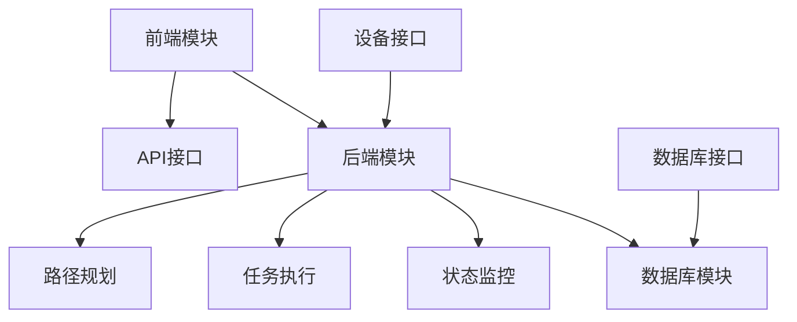
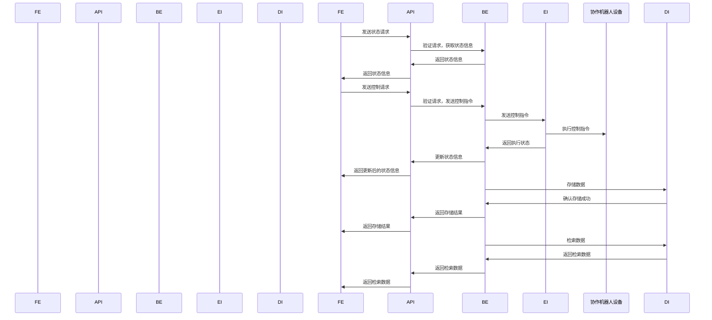

                 

### 摘要

协作机器人在制造业中的角色演变是当今智能制造领域的核心议题之一。本文旨在深入探讨协作机器人在制造业中的应用与发展历程，分析其技术进步、案例分析以及未来趋势。文章首先介绍了协作机器人的基本概念、制造业背景及挑战，随后详细阐述了协作机器人在不同阶段的角色演变，并借助具体的案例研究，剖析了其在实际应用中的优势与挑战。最后，文章预测了协作机器人未来的发展趋势，并对其在制造业中可能带来的影响进行了展望。本文结构清晰，逻辑严谨，旨在为业界提供有价值的参考和指导。关键词：协作机器人、智能制造、角色演变、技术进步、案例分析、未来趋势。

----------------------------------------------------------------

## 引言

### 1.1 书籍背景

在制造业的演进过程中，自动化和智能化的浪潮不断推动生产方式的变化。随着工业4.0和物联网（IoT）技术的普及，制造业正逐步从传统的劳动密集型产业向高度自动化和智能化的方向转型。这一转型过程中，协作机器人的出现成为了一个重要的里程碑。协作机器人，也被称为人机协作机器人（Collaborative Robots，简称Cobots），是一种设计用于与人类工人共同工作的机器人，它们能够在没有物理隔离的情况下安全地与人类共享工作空间。

这一转变的背景可以追溯到以下几个方面：

1. **劳动力成本上升**：随着全球劳动力成本的不断上升，制造业企业开始寻求降低生产成本的方法。协作机器人由于其高效性和灵活性，成为了一种降低劳动力成本的有效手段。

2. **生产效率的提升需求**：制造业企业不断追求生产效率的提升，以保持竞争力。协作机器人能够执行重复性高、精度要求高的任务，从而显著提高生产效率。

3. **技术创新的驱动**：人工智能、物联网、传感器技术等先进技术的快速发展，为协作机器人的设计和应用提供了强大的技术支持。

4. **安全性和灵活性**：传统工业机器人通常需要与工人隔离操作，而协作机器人则设计为能够与人类工人安全共事，提高了工作环境的灵活性。

### 1.2 书籍目标

本书记录了协作机器人在制造业中的应用与发展历程，旨在帮助读者全面理解这一新兴技术，并探讨其在未来制造业中的潜在影响。具体目标如下：

1. **介绍协作机器人的基本概念**：包括协作机器人的定义、工作原理和关键技术。

2. **分析协作机器人在制造业中的角色演变**：从早期应用到现在的高度集成，探讨不同阶段协作机器人在制造业中扮演的角色。

3. **讨论技术进步对协作机器人发展的影响**：分析人工智能、物联网、传感器等技术的进步如何推动协作机器人的发展。

4. **通过案例分析了解协作机器人的应用与挑战**：介绍成功案例，分析协作机器人在不同场景中的应用效果和面临的挑战。

5. **预测协作机器人未来的发展趋势**：探讨协作机器人可能带来的技术革新，以及对制造业和劳动力市场的影响。

6. **提供实际应用的建议**：为制造业企业决策者提供关于协作机器人应用的最佳实践和建议。

### 1.3 结构安排

本文分为七个主要章节，具体结构如下：

- **第1章 引言**：介绍书籍的背景、目标和结构。
- **第2章 核心概念**：定义协作机器人、工业4.0等关键概念。
- **第3章 协作机器人在制造业中的角色**：分析协作机器人在不同阶段的角色演变。
- **第4章 技术进步与协作机器人**：探讨技术进步对协作机器人发展的影响。
- **第5章 案例分析**：介绍成功案例，分析协作机器人的应用与挑战。
- **第6章 未来趋势**：预测协作机器人未来的发展趋势。
- **第7章 结论**：总结文章的主要观点，提出建议。

通过以上章节的安排，本文将为读者提供一个全面、系统的视角，深入探讨协作机器人在制造业中的角色演变，以及其未来可能带来的影响。

### 2.1 协作机器人

协作机器人，通常被称为人机协作机器人（Cobots），是一种设计用于与人类工人共同工作的智能机器人。它们的出现解决了传统工业机器人在安全性和灵活性方面的局限，使得机器人和人类能够在同一工作空间内安全、高效地协同作业。协作机器人的基本概念可以追溯到其定义和工作原理，以及其在制造业中的重要性。

#### 定义与基本原理

协作机器人的定义有几个关键点：

1. **安全性**：协作机器人必须能够在没有任何物理隔离措施的情况下与人类工人安全共事。这意味着它们需要具备高度的安全防护机制，能够实时感知并响应人类工人的动作。

2. **灵活性**：与传统工业机器人相比，协作机器人通常体积较小、移动灵活，能够快速适应不同的工作场景和任务。

3. **交互性**：协作机器人需要具备一定的智能能力，能够与人类进行自然交互，理解并执行复杂的任务指令。

协作机器人的基本原理主要依赖于以下几个关键技术：

- **力感知与控制技术**：协作机器人通过内置的力传感器来实时感知工作空间中的力变化，从而调整自身的行为，确保与人类工人协作时的安全。

- **视觉感知技术**：视觉系统使协作机器人能够识别并定位工作空间中的物体和目标，实现精确的任务执行。

- **智能控制算法**：通过先进的控制算法，协作机器人能够实现自适应控制和实时决策，提高任务执行的效果和效率。

- **通信技术**：协作机器人需要与人类工人和周边系统保持高效的通信，以便协调工作和共享信息。

#### 工作原理

协作机器人通过以下步骤实现与人类工人的协作：

1. **感知与识别**：协作机器人使用传感器和视觉系统感知工作空间中的环境和目标，识别需要处理的物体。

2. **路径规划**：基于感知信息，协作机器人规划到达目标位置的路径，确保在移动过程中避免与人类工人发生碰撞。

3. **协作执行**：在执行任务时，协作机器人根据力感知和智能控制算法，确保与人类工人协同作业，避免造成伤害。

4. **信息交互**：协作机器人通过语音、手势或其他交互方式与人类工人进行信息交流，确保任务顺利进行。

#### 在制造业中的重要性

协作机器人在制造业中的应用具有重要意义，主要体现在以下几个方面：

1. **提高生产效率**：协作机器人能够执行重复性高、精度要求高的任务，减少人工操作的误差和时间，从而显著提高生产效率。

2. **降低劳动力成本**：通过协作机器人替代部分人力，制造业企业能够降低劳动力成本，提高竞争力。

3. **提升生产灵活性**：协作机器人能够快速适应不同的生产任务和场景，满足多品种、小批量的生产需求。

4. **改善工作环境**：协作机器人能够承担繁重、危险的工作，减少工人接触有害物质和风险，提升工作环境的舒适度和安全性。

5. **促进智能制造**：协作机器人的应用是智能制造体系的重要组成部分，有助于实现生产过程的自动化、智能化和高效化。

#### 发展历程

协作机器人的发展历程可以分为几个阶段：

1. **早期阶段**（20世纪60年代至90年代）：协作机器人的概念提出，最初应用于实验室和研究机构，主要用于简单的辅助任务。

2. **技术突破阶段**（21世纪初至今）：随着传感器技术、控制算法和人工智能的发展，协作机器人逐渐具备实用性和商业价值，开始广泛应用于制造业。

3. **集成与扩展阶段**（未来）：协作机器人将进一步与物联网、云计算等先进技术集成，实现更高级的智能协作和自主决策能力。

通过以上分析，协作机器人在制造业中的应用已经成为不可逆转的趋势，其重要性日益凸显。在接下来的章节中，我们将进一步探讨协作机器人在制造业中的具体角色和应用场景。

### 2.2 工业4.0

工业4.0，又称第四次工业革命，是继机械化、电气化和自动化之后的又一重要工业变革。其核心思想是通过信息技术与制造技术的深度融合，实现制造过程的智能化和高度自动化。工业4.0不仅仅是技术的进步，更是一场全方位的工业体系变革，旨在提升制造业的竞争力、灵活性和可持续性。

#### 定义与核心思想

工业4.0的定义可以从以下几个方面进行理解：

1. **智能化**：工业4.0强调通过物联网（IoT）、大数据、云计算等信息技术，实现生产设备的智能化和网络化，从而提升生产过程的实时监控和决策能力。

2. **自动化**：工业4.0通过自动化技术，如机器人、自动化装配线、智能物流系统等，实现生产过程的自动化，提高生产效率和质量。

3. **灵活化**：工业4.0强调制造过程的灵活性和可配置性，能够快速适应市场需求变化，实现个性化定制和小批量生产。

4. **集成化**：工业4.0强调产业链各环节的深度融合和集成，通过供应链管理、生产过程管理、质量管理等系统的一体化，实现信息流、物流和资金流的协同。

工业4.0的核心思想可以概括为“智能工厂、数字制造、服务型制造”：

- **智能工厂**：通过物联网技术和自动化设备，实现生产设备的智能互联和自主控制，使工厂具备自感知、自决策、自执行的能力。

- **数字制造**：通过数字技术，如3D建模、虚拟现实、增强现实等，实现产品的数字化设计和制造，提高设计和制造效率。

- **服务型制造**：通过制造与服务深度融合，实现制造过程的增值服务，如产品全生命周期管理、远程维护、定制化服务等。

#### 对制造业的影响

工业4.0对制造业的影响深远且全面，具体体现在以下几个方面：

1. **生产效率的提升**：通过智能化和自动化技术，工业4.0显著提高了生产效率。生产过程的实时监控和自适应调整，使得生产节拍加快，生产效率大幅提升。

2. **产品质量的改进**：工业4.0通过智能制造技术和质量管理系统，实现了对生产过程的全程监控和实时反馈，有效提高了产品质量。

3. **生产成本的降低**：自动化和智能化技术的应用，减少了人工操作和维护的成本，同时提高了生产效率和产品质量，从而降低了生产成本。

4. **生产灵活性的增强**：工业4.0使得生产过程更加灵活，能够快速响应市场需求变化，实现个性化定制和小批量生产，提高了企业的市场竞争力。

5. **产业链的优化**：工业4.0推动了产业链的优化和重构，通过信息流、物流和资金流的协同，提高了产业链的整体效率和价值。

6. **企业竞争力的提升**：工业4.0使得企业能够通过智能化和数字化技术，实现生产过程的全面优化和提升，从而在激烈的市场竞争中脱颖而出。

#### 工业4.0与协作机器人

工业4.0与协作机器人的结合，进一步推动了制造业的智能化和自动化进程。协作机器人在工业4.0体系中扮演着重要角色，具体体现在以下几个方面：

1. **智能生产单元**：协作机器人可以与工业4.0的智能生产单元集成，实现生产过程的自动化和智能化。通过物联网技术，协作机器人能够实时感知生产环境的变化，并根据需求进行自主调整，确保生产过程的稳定和高效。

2. **数据驱动决策**：协作机器人通过传感器和数据处理技术，能够实时收集生产数据，并通过工业4.0平台进行数据分析，为生产决策提供数据支持，实现数据驱动的生产管理。

3. **柔性生产线**：协作机器人可以快速适应不同的生产任务，实现生产线的柔性化。通过与工业4.0平台的集成，协作机器人能够根据生产需求进行自动化调度和任务分配，提高生产灵活性。

4. **人机协作**：工业4.0强调人机协作，协作机器人在此过程中扮演着重要角色。通过智能交互技术，协作机器人能够与人类工人实现高效协作，提高生产效率和工作质量。

5. **制造服务化**：协作机器人与工业4.0的结合，使得制造业向服务型制造转型成为可能。通过提供远程维护、定制化服务等增值服务，协作机器人能够为企业带来额外的收益。

总之，工业4.0与协作机器人的结合，为制造业带来了全新的发展机遇和模式，推动了制造业向智能化、数字化和高度自动化的方向迈进。在接下来的章节中，我们将进一步探讨协作机器人在制造业中的具体角色和应用。

### 2.3 制造业的挑战与机遇

制造业在全球经济中占据重要地位，但随着全球竞争的加剧和技术变革的加速，制造业面临着诸多挑战与机遇。理解这些挑战与机遇对于协作机器人在制造业中的角色演变至关重要。

#### 挑战

1. **劳动力成本上升**：随着全球劳动力成本的不断上升，制造业企业面临巨大的成本压力。尤其是发达国家，人工成本高企，使得传统的劳动力密集型生产模式难以持续。

2. **生产效率低下**：一些制造业企业仍然采用传统手工生产方式，缺乏高效的自动化和数字化管理，导致生产效率低下，难以满足市场需求。

3. **供应链风险**：全球化的供应链体系虽然带来了便利，但也带来了风险。自然灾害、政治动荡、疫情等因素可能导致供应链中断，影响生产稳定性和交付能力。

4. **技术更新换代**：制造业技术更新换代速度加快，企业需要不断投入资金进行技术升级，以保持竞争力。这对于一些中小型企业来说，是一个巨大的挑战。

5. **环保法规趋严**：各国对环境保护的重视程度不断提高，环保法规日趋严格。制造业企业需要投入大量资金和资源，以实现绿色生产和可持续发展。

#### 机遇

1. **自动化与智能化**：自动化和智能化技术的不断进步，为制造业提供了降低成本、提高效率的新途径。协作机器人作为自动化和智能化的重要组成部分，将在制造业中发挥更大的作用。

2. **数字化转型升级**：数字化技术的普及和推广，使得制造业企业能够实现生产过程的数字化管理，提高生产效率和产品质量。通过大数据分析和人工智能技术，制造业企业可以更好地了解市场需求，优化生产流程。

3. **供应链优化**：随着物联网和区块链技术的发展，制造业企业可以实现供应链的透明化和高效化。通过实时监控和智能调度，制造业企业能够更好地应对供应链风险，提高供应链的整体效能。

4. **个性化定制**：消费者需求的多样化趋势，使得制造业企业需要提供更多样化的产品和服务。协作机器人能够实现高效的生产调整和快速响应，满足个性化定制需求。

5. **环保与可持续发展**：环保法规的趋严和消费者对绿色产品的需求，推动制造业企业向环保和可持续方向发展。协作机器人具有高效、节能、低排放的特点，有助于实现绿色生产和可持续发展目标。

#### 协作机器人在挑战与机遇中的角色演变

面对上述挑战与机遇，协作机器人在制造业中的角色正在发生显著变化：

1. **替代劳动力**：协作机器人能够替代部分重复性高、劳动强度大的工作，降低劳动力成本。在一些劳动密集型产业，如电子制造、汽车制造等，协作机器人的应用已经取得了显著成效。

2. **提升生产效率**：协作机器人具有高精度、高速度的特点，能够显著提升生产效率。通过与自动化设备的集成，协作机器人能够在生产线上实现高效协同，提高整体生产效率。

3. **实现智能化生产**：协作机器人具备智能化和自动化能力，能够实时感知环境变化，自主调整生产参数，实现智能化的生产过程。通过物联网技术，协作机器人可以与其他设备实现互联互通，提高生产智能化水平。

4. **灵活调整生产线**：协作机器人具有高度灵活性，能够快速适应不同的生产任务和场景。在应对个性化定制需求和市场变化时，协作机器人能够迅速调整生产线，提高生产灵活性。

5. **优化供应链管理**：协作机器人可以通过物联网技术实现生产过程的实时监控和智能调度，优化供应链管理。协作机器人能够提高供应链的透明度和效率，减少库存和运输成本。

6. **促进环保生产**：协作机器人具有高效、节能、低排放的特点，有助于实现环保生产和可持续发展。通过优化生产工艺和减少资源浪费，协作机器人能够降低制造业的碳足迹。

总之，协作机器人在制造业中的角色演变是应对挑战和抓住机遇的重要手段。随着技术的不断进步，协作机器人在制造业中的应用前景将更加广阔，为制造业带来新的发展机遇和模式。在接下来的章节中，我们将进一步探讨协作机器人在制造业中的具体应用和案例。

### 3.1 协作机器人在制造业中的初步应用阶段

协作机器人在制造业中的初步应用阶段可以追溯到21世纪初。在这一阶段，协作机器人的主要应用场景集中在简单、重复性高、劳动强度大的生产任务，如装配、搬运、包装等。这一时期，协作机器人主要用于替代人工操作，减轻工人的劳动强度，提高生产效率。以下是几个关键应用场景和特点：

#### 简单重复性任务

在初步应用阶段，协作机器人首先在电子制造、汽车制造等行业中被引入，用于执行简单重复性任务。例如，在电子装配线上，协作机器人可以完成电路板的装配、焊接和测试等工作。这些任务通常不需要复杂的人工干预，机器人可以通过预设的路径和程序自动完成任务。

#### 搬运与包装

搬运和包装是协作机器人的另一重要应用场景。在物流仓储和食品加工等行业，协作机器人被用于搬运货物、打包产品等任务。通过传感器和力控制系统，协作机器人能够在仓库内自主导航，准确搬运和放置货物，提高仓储效率和准确性。

#### 安全性要求

在初步应用阶段，协作机器人的一个重要特点是强调安全性。由于这一阶段协作机器人通常不需要与人类工人共事，因此其设计主要侧重于物理安全。例如，机器人外部采用防护罩，避免与人类工人发生碰撞。此外，控制系统也进行了优化，确保机器人在执行任务时不会对人类工人造成伤害。

#### 简单的控制逻辑

初步应用的协作机器人通常采用相对简单的控制逻辑和编程方法。机器人通过预设的路径和程序进行操作，无需进行复杂的实时决策和交互。这种简单的控制逻辑使得协作机器人易于部署和维护，同时也降低了应用成本。

#### 初步效益

尽管初步应用的协作机器人功能相对简单，但其对制造业产生了积极的影响。首先，协作机器人显著提高了生产效率，减少了人工操作的误差和时间。其次，协作机器人降低了工人的劳动强度，提高了工作环境的舒适度和安全性。此外，协作机器人的引入也为企业节省了人力成本，提高了生产灵活性。

#### 存在的局限

然而，初步应用的协作机器人也存在一些局限性。首先，协作机器人的功能和适用范围有限，主要适用于简单重复性任务，难以应对复杂的生产场景。其次，协作机器人的智能化程度相对较低，缺乏自主决策和自适应能力，需要人工进行编程和调试。此外，协作机器人的成本较高，对中小企业来说，应用门槛较高。

综上所述，协作机器人在制造业的初步应用阶段取得了一定的成效，但同时也面临着功能简单、智能化程度低和成本高等挑战。在接下来的章节中，我们将探讨协作机器人如何通过技术进步克服这些局限，实现更广泛和深入的应用。

### 3.2 协作机器人在制造业中的技术进步阶段

随着技术的不断进步，协作机器人在制造业中的应用逐渐从简单重复性任务向更复杂、更智能的任务扩展。这一阶段，协作机器人不仅在功能上得到了显著提升，而且在智能化、自主化方面取得了重要突破。以下是这一阶段协作机器人技术进步的关键方面：

#### 智能感知技术

智能感知技术是协作机器人技术进步的核心。通过集成先进的传感器技术，协作机器人能够实现对工作环境的实时感知和动态响应。例如，视觉传感器使协作机器人能够识别和定位物体，激光雷达和超声波传感器帮助机器人实现自主导航和避障。此外，力感知和触觉传感器使协作机器人能够精准控制施加在物体上的力和压力，确保在执行任务时不会对物体造成损害。

#### 自主决策和协作

随着人工智能技术的快速发展，协作机器人逐渐具备了自主决策和协作能力。通过深度学习和强化学习算法，协作机器人能够根据实时感知到的环境和任务信息，自主制定操作策略和路径规划。例如，在复杂的生产任务中，协作机器人可以自主识别任务目标，规划最优路径，并与其他协作机器人或人类工人进行协同作业。这种自主决策和协作能力显著提高了机器人的灵活性和适应性，使其能够应对更加复杂的生产场景。

#### 人工智能算法

人工智能算法的进步为协作机器人的技术进步提供了强大支持。深度学习算法使协作机器人能够从大量数据中学习任务模式和操作技巧，从而提高任务执行的精度和效率。例如，在图像识别和物体检测方面，深度学习算法使协作机器人能够准确识别和分类不同类型的物体，提高操作的准确性。强化学习算法则使协作机器人能够在实际操作中不断优化策略，提高任务执行的效果和效率。

#### 通信和网络技术

协作机器人技术的进步离不开通信和网络技术的支持。通过5G、物联网等先进通信技术，协作机器人能够实现高速、低延迟的数据传输，确保各机器人之间以及机器人与生产系统之间的实时通信和协同。此外，云计算和边缘计算技术使得协作机器人能够利用云端资源和数据进行分析和决策，进一步提高机器人的智能化水平。

#### 系统集成和优化

随着协作机器人技术的进步，其系统集成和优化也得到了显著提升。通过智能制造系统（MES）和企业资源计划系统（ERP）等集成平台，协作机器人能够与生产系统、物流系统、质量管理系统等实现无缝连接，实现生产过程的全程监控和优化。例如，通过MES系统，协作机器人可以实时获取生产计划、任务分配等信息，并自动调整操作策略，确保生产过程的顺畅和高效。

#### 应用场景扩展

技术进步使得协作机器人在制造业中的应用场景得到了显著扩展。除了传统的装配、搬运和包装任务外，协作机器人开始应用于更复杂的生产环节，如焊接、切割、涂装等。此外，协作机器人还开始应用于非制造业领域，如医疗、仓储、物流等，展示了其广泛的适用性和发展潜力。

#### 案例分析

在实际应用中，协作机器人技术的进步为制造业带来了显著的变化。例如，在汽车制造业中，协作机器人被用于焊接和喷涂任务，通过自主导航和力控制技术，实现了高质量、高效率的生产。在电子制造业中，协作机器人应用于SMT贴片和组装环节，通过图像识别和精准操作，提高了生产效率和产品合格率。在物流仓储中，协作机器人通过智能感知和自主决策技术，实现了自动分拣和搬运，提高了物流效率。

总之，协作机器人在制造业中的技术进步阶段，不仅在功能和应用场景上取得了重要突破，而且推动了制造业的智能化和自动化进程。随着技术的不断发展和应用，协作机器人将在未来制造业中发挥更加重要的作用。

### 3.3 协作机器人在制造业中的当前角色与应用

在当前的制造业环境中，协作机器人已经从简单的辅助角色逐步演变为核心生产力，其应用范围和深度都在不断扩展。协作机器人不仅在传统的装配、搬运和包装等生产环节中发挥关键作用，还在新的制造模式下扮演着不可或缺的角色。

#### 核心生产力角色

协作机器人作为制造业中的核心生产力，主要体现在以下几个方面：

1. **高效装配**：在汽车、电子、医疗设备等行业，协作机器人被广泛应用于装配环节。通过高精度的视觉系统和力控制技术，协作机器人能够准确执行装配任务，提高装配质量和效率。例如，在汽车发动机装配线上，协作机器人可以精准安装螺丝，确保每个螺丝的扭矩达到标准，从而减少次品率和返工成本。

2. **精准搬运**：协作机器人不仅在重量较大的物品搬运中表现出色，还在需要高精度的搬运任务中发挥了重要作用。例如，在电子制造中，协作机器人可以精确抓取微小电子元件，确保在安装过程中不损坏元件。在食品加工行业，协作机器人能够精准搬运易碎物品，保证产品的完整性。

3. **高效包装**：在物流和食品等行业，协作机器人被用于包装任务，提高了包装效率和准确性。通过自主导航和智能控制，协作机器人可以灵活适应不同的包装要求，实现高速、高质量的包装作业。例如，在化妆品工厂，协作机器人可以快速将产品装箱，并准确粘贴标签，提高了生产效率。

#### 适应性生产

随着制造业需求的多样化和个性化，适应性生产成为制造业的重要趋势。协作机器人通过其灵活性和智能控制，能够满足适应性生产的需要：

1. **快速换线**：协作机器人具备快速调整和重新编程的能力，可以在不同生产任务间快速切换。这使得企业能够更灵活地响应市场需求变化，实现多品种、小批量的生产模式。例如，在玩具制造中，协作机器人可以根据不同的玩具模型快速调整装配程序，满足不同客户的需求。

2. **自适应调整**：协作机器人通过智能感知和自主决策，能够根据生产环境和任务需求进行自适应调整。例如，在喷涂任务中，协作机器人可以实时调整喷涂参数，确保喷涂质量的一致性，从而提高产品的合格率。

3. **混合作业**：协作机器人能够与人类工人协同作业，实现人机混合生产模式。这种模式不仅提高了生产效率，还提升了工作环境的灵活性和安全性。例如，在服装制造业，协作机器人可以与工人一起完成缝纫、剪裁等任务，实现高效的生产流程。

#### 智能制造体系

协作机器人是智能制造体系的重要组成部分，通过与其他自动化设备、信息系统的集成，实现了生产过程的智能化和高效化：

1. **数据采集与分析**：协作机器人通过传感器和数据采集系统，实时获取生产过程中的数据，并通过云计算和大数据分析技术，对生产过程进行优化。例如，在制造过程中，协作机器人可以收集设备状态、生产参数等信息，帮助企业进行预测性维护，减少设备故障率。

2. **智能调度与管理**：通过智能制造系统（MES），协作机器人能够与生产计划系统、物流系统等实现无缝连接，实现生产过程的智能调度和管理。例如，MES系统可以根据实时生产数据，动态调整生产计划和资源分配，确保生产流程的顺畅。

3. **远程监控与维护**：协作机器人通过远程监控技术，实现了生产过程的远程监控和维护。例如，通过5G网络和物联网技术，企业可以实时监控协作机器人的运行状态，远程诊断和解决故障，提高设备的运行效率。

#### 应用案例

协作机器人在制造业中的应用案例日益丰富，展示了其在提升生产效率、降低成本、提高产品质量方面的显著优势：

1. **汽车制造**：在汽车制造中，协作机器人被广泛应用于车身装配、喷涂、检测等环节。通过高效协同，协作机器人提高了生产效率，确保了产品质量的一致性。

2. **电子制造**：在电子制造中，协作机器人应用于SMT贴片、组装、测试等环节，通过高精度操作和智能感知技术，提高了生产效率和产品合格率。

3. **食品加工**：在食品加工行业，协作机器人应用于包装、搬运、检测等环节，确保了食品的安全和卫生，提高了生产效率。

4. **物流仓储**：在物流仓储中，协作机器人应用于分拣、搬运、配送等任务，通过智能感知和自主导航技术，提高了物流效率和准确性。

总之，协作机器人在制造业中的当前角色和应用已经深入到了生产过程的各个环节，成为推动制造业智能化、自动化发展的重要力量。随着技术的不断进步，协作机器人在制造业中的作用将越来越重要，为制造业带来更加广阔的发展空间和机遇。

### 3.4 协作机器人对制造业传统角色的影响

协作机器人在制造业中的应用不仅带来了生产效率的提升和成本的降低，同时也对传统制造业的角色产生了深远的影响。以下将分析协作机器人对制造业传统角色的影响，包括岗位转变、劳动生产率的提升以及对职业培训的需求等方面。

#### 岗位转变

协作机器人的引入导致了一些传统工作岗位的转变和消失。一方面，协作机器人替代了一些重复性高、劳动强度大的工作，如装配、搬运和包装等。这些工作的自动化程度较高，机器人可以更加精准、高效地完成任务，从而降低了人工操作的需求。另一方面，协作机器人也创造了一些新的工作岗位，例如机器人维护工程师、机器人编程员和机器人操作员等。这些新岗位需要具备与机器人协同工作的技能和知识，以及对机器人进行编程、调试和维护的能力。

具体来说，一些传统制造工人可能需要转向更高级、更具技术含量的岗位。例如，在自动化程度较高的生产线上，操作员可能需要具备机器人编程和故障排除的能力，而不再只是进行简单的机械操作。此外，随着协作机器人的智能化程度不断提高，操作员可能需要参与机器人的日常维护和升级，以确保机器人系统的稳定运行。

#### 劳动生产率的提升

协作机器人在制造业中的广泛应用显著提高了劳动生产率。通过自动化和智能化技术，协作机器人能够执行重复性高、精度要求高的任务，减少了人工操作的误差和时间。例如，在电子制造业中，协作机器人可以高效地完成电路板的装配和焊接，确保每个元件的位置和焊接质量。这种高精度的操作不仅提高了生产效率，还提高了产品的合格率。

此外，协作机器人还能够在短时间内完成大量生产任务，从而缩短了生产周期。在传统生产模式下，一些生产环节可能需要多个工人手工操作，且每个工人之间的协作效率较低。而协作机器人通过高效率的协同作业，能够显著缩短生产周期，提高整体生产效率。例如，在汽车制造业中，协作机器人可以同时执行多个装配任务，提高了装配线的运行效率。

#### 职业培训的需求

协作机器人的广泛应用对职业培训提出了新的要求。随着制造业的自动化和智能化程度不断提高，传统的职业技能已经无法满足新的生产模式的需求。企业需要为员工提供系统的培训，使其掌握与协作机器人协同工作的技能和知识。

具体来说，职业培训的需求主要包括以下几个方面：

1. **编程和调试**：员工需要学习如何编程和调试协作机器人，以确保其能够高效地执行生产任务。这包括学习机器人编程语言、路径规划和力控制等关键技术。

2. **故障排除**：协作机器人可能会出现故障或异常，员工需要具备故障排除的能力，以快速解决机器人系统的问题，确保生产线的正常运转。

3. **维护和保养**：员工需要了解协作机器人的日常维护和保养流程，以确保机器人的长期稳定运行。这包括清洁、润滑、更换零部件等操作。

4. **安全操作**：协作机器人通常需要在复杂的工作环境中与人类工人共事，员工需要了解如何确保自身和机器人工作的安全性。

5. **新技能培训**：随着技术的不断进步，协作机器人可能会引入新的技术，员工需要不断学习新的技能和知识，以适应不断变化的生产模式。

总之，协作机器人在制造业中的应用对传统角色产生了深远的影响，包括岗位转变、劳动生产率的提升以及对职业培训的新需求。企业需要积极应对这些变化，通过系统的培训和提高员工的技能水平，以充分利用协作机器人的优势，提升生产效率和竞争力。

### 3.5 协作机器人在制造业中的未来角色预测

随着科技的不断进步，协作机器人在制造业中的角色将迎来更加多样化的变革。未来的发展趋势将集中在人工智能、物联网、智能制造和可持续性等多个领域，这些技术将推动协作机器人在制造业中的深度应用，并彻底改变传统的生产模式。

#### 人工智能的深度融合

人工智能（AI）技术的进步将使协作机器人具备更加智能的决策能力和自主性。未来，协作机器人将通过深度学习和机器学习算法，实现对复杂任务的自适应处理和优化。例如，AI驱动的协作机器人可以自主学习最优路径规划和操作策略，从而提高生产效率。同时，AI技术还将使协作机器人具备更高的感知能力，通过图像识别、语音识别和自然语言处理等，实现与人类工人的自然交互，进一步提升人机协作的效率。

#### 物联网的广泛连接

物联网（IoT）技术的广泛应用将使协作机器人与生产系统、供应链管理、客户服务等多个环节实现无缝连接。通过物联网设备，协作机器人可以实时获取生产数据、环境信息和市场需求，从而实现生产过程的实时监控和优化。例如，物联网传感器可以实时监测机器人的运行状态和能源消耗，通过数据分析，企业可以提前预测故障并进行预防性维护，减少停机时间，提高生产效率。此外，物联网技术还将实现协作机器人与物流系统的深度集成，提高物流效率和准确性。

#### 智能制造体系的深化

智能制造是未来制造业发展的重要趋势，协作机器人将在其中扮演核心角色。未来的智能制造体系将实现生产过程的全面数字化和智能化，通过大数据分析、云计算和人工智能等技术，实现生产过程的精细化管理。协作机器人将作为智能制造体系中的重要一环，与其他自动化设备和信息系统实现深度集成，实现生产过程的优化和自动化。例如，通过工业互联网平台，协作机器人可以实现生产任务的智能调度和资源优化配置，提高生产线的整体效能。

#### 可持续发展的推动者

可持续发展是未来制造业的重要目标，协作机器人将在推动制造业可持续发展方面发挥重要作用。通过节能、高效和低排放的技术，协作机器人可以实现绿色生产。例如，协作机器人可以优化生产流程，减少能源消耗和资源浪费，降低生产过程的碳排放。此外，协作机器人还可以通过智能感知和自主控制，实现对生产设备和环境的实时监控，实现生产过程的精细化和环保化。

#### 个性化定制的实现

随着消费者需求的不断变化，个性化定制将成为未来制造业的重要方向。协作机器人将通过其灵活性和高效性，实现个性化定制的快速响应。例如，通过AI算法和数字孪生技术，协作机器人可以实时调整生产参数和路径规划，快速实现不同产品的生产。此外，协作机器人还可以与客户互动，根据客户的需求和偏好，实现产品的个性化定制。

#### 职业教育和培训的发展

随着协作机器人的广泛应用，职业教育和培训的需求将大幅增加。未来，职业教育和培训将更加注重培养员工的技能和知识，使其能够与协作机器人高效协同工作。例如，培训课程将涵盖机器人编程、故障排除、安全操作等方面，帮助员工适应新的生产模式。此外，教育机构和企业还将合作开发模拟培训系统，通过虚拟现实和增强现实技术，提供实践操作和训练环境，提高员工的技能水平。

#### 数据隐私和安全的挑战

随着协作机器人的广泛应用，数据隐私和安全问题将变得日益重要。协作机器人将涉及大量的生产数据、客户数据和商业数据，如何确保这些数据的安全和隐私将成为一个关键挑战。企业需要建立健全的数据安全管理体系，采取严格的数据加密和访问控制措施，确保数据的安全性和隐私性。

总之，协作机器人在制造业中的未来角色将充满变革和创新。通过人工智能、物联网、智能制造和可持续发展的深度融合，协作机器人将成为推动制造业变革的重要力量，实现生产过程的智能化、高效化和绿色化。同时，企业需要积极应对数据隐私和安全等挑战，确保协作机器人应用的可持续发展。

### 3.6 协作机器人应用的最佳实践与建议

在协作机器人在制造业中的广泛应用过程中，积累了一系列成功案例和最佳实践。以下将探讨这些实践，并提供相应的建议，以帮助企业在应用协作机器人时实现最佳效果。

#### 成功案例

1. **汽车制造业**：特斯拉（Tesla）是协作机器人应用的成功典范。特斯拉在其生产线上广泛使用协作机器人进行焊接、装配和测试等任务。通过协作机器人的高效协同，特斯拉实现了生产线的自动化和智能化，提高了生产效率和产品质量。例如，在车身焊接环节，协作机器人通过智能控制技术，确保焊接质量的一致性，从而降低了次品率。

2. **电子制造业**：富士康（Foxconn）通过引入协作机器人，实现了从装配到测试的全过程自动化。协作机器人能够快速适应不同产品的装配需求，提高了生产线的灵活性和响应速度。例如，在SMT贴片环节，协作机器人通过视觉系统和力控制技术，实现了高精度操作，确保了装配的准确性和一致性。

3. **食品加工行业**：雀巢（Nestlé）在食品加工生产线中应用协作机器人，提高了包装和搬运效率。协作机器人通过智能感知技术，准确识别和抓取不同形状和大小的产品，避免了产品损坏和污染。例如，在巧克力包装环节，协作机器人通过高精度的搬运和贴标操作，提高了包装速度和产品合格率。

4. **医疗设备制造**：波音（Boeing）在飞机维修和维护中应用协作机器人，提高了工作效率和安全性。协作机器人能够执行复杂和危险的维修任务，减少了工人的劳动强度和风险。例如，在发动机维修中，协作机器人通过力感知和自主导航技术，精确执行装配和拆卸任务，确保了维修质量。

#### 最佳实践

1. **充分需求分析**：在引入协作机器人之前，企业应进行全面的需求分析，明确机器人需要执行的任务和场景。通过需求分析，企业可以制定合适的应用方案，确保协作机器人的高效应用。

2. **集成与协同**：协作机器人的成功应用需要与其他生产设备和信息系统进行集成，实现信息的实时共享和协同工作。例如，通过物联网技术和工业互联网平台，协作机器人可以与生产计划系统、物流系统等实现无缝连接，优化生产流程。

3. **安全防护**：在协作机器人的应用过程中，安全性是至关重要的。企业应采取严格的安全防护措施，确保机器人在与人类工人共事时不会造成伤害。例如，通过力感知技术和物理隔离措施，保障人类工人的安全。

4. **员工培训**：企业应提供系统的员工培训，使操作员和维护人员掌握协作机器人的操作、编程和维护技能。通过培训，提高员工的技能水平，确保协作机器人的高效应用。

5. **持续优化**：协作机器人的应用是一个持续优化的过程。企业应定期评估协作机器人的应用效果，并根据实际情况进行调整和优化。例如，通过数据分析，发现生产过程中的瓶颈和改进点，不断优化生产流程和操作策略。

#### 建议

1. **注重数据安全**：协作机器人的广泛应用涉及大量的数据，企业应建立健全的数据安全管理体系，确保数据的保密性和完整性。例如，采取数据加密、访问控制和审计等措施，防止数据泄露和滥用。

2. **灵活应用场景**：协作机器人不仅适用于简单的重复性任务，还可以应用于复杂和多变的生产场景。企业应积极探索协作机器人的多样化应用场景，充分发挥其优势。

3. **持续技术创新**：随着技术的不断进步，协作机器人将具备更高的智能化和自主化能力。企业应关注技术创新，积极引入先进技术，提升协作机器人的应用水平。

4. **政策支持和引导**：政府和企业应加强协作，提供政策支持和引导，推动协作机器人在制造业的广泛应用。例如，通过税收优惠、补贴和培训等政策，鼓励企业应用协作机器人，提升制造业的智能化水平。

总之，通过成功案例和最佳实践，企业可以更好地应用协作机器人，提升生产效率和竞争力。同时，持续的技术创新和政策支持也将为协作机器人在制造业中的广泛应用提供有力保障。企业应积极探索和利用协作机器人的优势，实现制造业的智能化和可持续发展。

### 3.7 案例研究：协作机器人在实际应用中的成功与挑战

为了深入探讨协作机器人在制造业中的实际应用，本文选取了几个具有代表性的案例，分析其在成功应用过程中取得的成果以及面临的挑战。

#### 案例一：汽车制造业中的应用

**背景**：特斯拉（Tesla）公司是一家全球知名的电动汽车制造商，其生产线大量应用了协作机器人进行焊接、装配和测试等任务。

**成功应用**：
- **生产效率提升**：特斯拉通过引入协作机器人，实现了焊接任务的自动化。焊接机器人能够在复杂的环境下快速完成高质量的焊接工作，生产效率提高了约30%。
- **质量保障**：协作机器人的高精度和稳定性确保了焊接质量的稳定性和一致性，减少了次品率。
- **灵活部署**：协作机器人可以根据生产需求进行快速调整，适用于不同车型的焊接任务，提高了生产灵活性。

**面临的挑战**：
- **维护成本**：协作机器人需要定期维护和更新，导致维护成本较高。特别是在生产高峰期，维护需求增加，对企业的运营管理提出了更高要求。
- **技术人才短缺**：协作机器人的应用需要专业的技术人员进行编程、调试和维护，而相关人才较为稀缺，企业需投入大量资源进行培训和人才引进。

#### 案例二：电子制造业中的应用

**背景**：富士康（Foxconn）是全球最大的电子产品制造服务提供商，其在生产线上引入了大量协作机器人进行装配和测试。

**成功应用**：
- **高精度操作**：协作机器人通过高精度的视觉系统和力控制技术，实现了电子元件的精确装配，提升了产品合格率。
- **生产灵活**：协作机器人能够快速适应不同产品的装配需求，实现了小批量、多品种的生产模式，提高了生产灵活性。
- **人机协作**：协作机器人与人类工人的协同作业，提高了装配效率，同时减少了工人的劳动强度。

**面临的挑战**：
- **编程复杂性**：协作机器人的编程相对复杂，需要专业的编程技能和大量的测试，编程时间和成本较高。
- **设备兼容性**：协作机器人需要与不同的设备和工具进行集成，确保兼容性和协同作业，这对系统的设计和实施提出了较高要求。

#### 案例三：食品加工行业中的应用

**背景**：雀巢（Nestlé）是一家全球领先的食品制造商，其在食品加工生产线上应用协作机器人进行包装和搬运。

**成功应用**：
- **高效搬运**：协作机器人通过智能感知技术，准确识别和抓取不同形状和大小的食品包装，提高了搬运效率和准确性。
- **避免污染**：协作机器人减少了人工搬运过程中可能带来的污染，确保了食品的安全和卫生。
- **灵活应对**：协作机器人可以根据生产线的需求，快速调整搬运路径和策略，提高了生产灵活性。

**面临的挑战**：
- **清洗和维护**：协作机器人需要在食品生产环境下频繁清洗和维护，以保持设备的清洁和卫生，这增加了维护工作量。
- **成本效益**：虽然协作机器人提高了生产效率，但初期投资和运营成本较高，企业需进行成本效益分析，确保长期投资回报。

#### 案例四：医疗设备制造中的应用

**背景**：波音（Boeing）公司是一家全球领先的航空航天和防务制造商，其在飞机维修和维护中引入了协作机器人。

**成功应用**：
- **高效维修**：协作机器人能够执行复杂的维修任务，如发动机的拆装和测试，提高了维修效率。
- **安全性提升**：协作机器人减少了工人接触危险工作环境的需求，提高了工作安全性。
- **操作精度**：协作机器人通过高精度的力和位置控制技术，确保了维修任务的精度和一致性。

**面临的挑战**：
- **技术依赖性**：协作机器人依赖于先进的技术和软件，企业需要投入大量资源进行技术维护和更新。
- **数据安全**：协作机器人涉及大量的敏感数据，如设备状态和生产数据，确保数据的安全和隐私是一个重要挑战。

通过以上案例研究，可以看出协作机器人在制造业中的应用取得了显著的成功，但同时也面临着一定的挑战。企业需要在应用协作机器人时，充分考虑这些挑战，并采取相应的策略，以确保其能够充分发挥协作机器人的优势，实现生产效率和竞争力的提升。

### 3.8 潜在风险与应对策略

在协作机器人在制造业中的广泛应用过程中，虽然带来了诸多好处，但同时也存在一些潜在的风险和挑战。以下将详细分析这些风险，并探讨相应的应对策略。

#### 数据安全和隐私风险

协作机器人广泛应用的过程中，会产生大量的生产数据和操作数据。这些数据不仅包含企业的商业机密，还涉及员工的个人信息。如果数据泄露，可能会导致商业损失和隐私侵犯。应对策略如下：

- **加强数据加密**：采用高级数据加密技术，确保数据在传输和存储过程中的安全性。
- **访问控制**：实施严格的访问控制策略，确保只有授权人员才能访问敏感数据。
- **定期审计**：定期对数据访问和操作进行审计，及时发现和解决潜在的安全漏洞。

#### 技术依赖性风险

协作机器人的广泛应用依赖于先进的技术和软件。如果企业过度依赖这些技术，一旦出现技术故障或更新换代，可能会影响生产线的正常运作。应对策略如下：

- **多元化技术储备**：避免单一技术依赖，培养多元化的技术储备，确保在不同技术方案之间的灵活切换。
- **定期技术更新**：及时跟进技术更新，确保协作机器人的技术保持领先，降低技术故障风险。
- **备份方案**：制定应急预案和备份方案，确保在技术故障时，生产能够迅速恢复。

#### 安全性问题

协作机器人在与人类工人共事的过程中，存在一定的安全隐患。例如，机器人操作不当可能会导致工人的受伤或设备损坏。应对策略如下：

- **安全防护**：为协作机器人配备安全防护装置，如防护罩和紧急停止按钮，确保人类工人的安全。
- **员工培训**：对员工进行系统的安全操作培训，使其掌握与协作机器人共事的安全知识和技能。
- **实时监控**：通过监控技术，实时监测协作机器人的运行状态和安全情况，及时发现并解决潜在的安全隐患。

#### 成本和投资风险

协作机器人初期投资较高，包括设备采购、安装调试、维护等费用。如果投资回报期过长，可能会影响企业的财务状况。应对策略如下：

- **成本效益分析**：在引入协作机器人前，进行全面的经济效益分析，评估投资的回报率和可行性。
- **分期投资**：采用分期投资的方式，降低初期投资压力，逐步实现协作机器人的全面应用。
- **政府支持**：积极争取政府补贴和税收优惠等政策支持，降低企业的投资成本。

#### 法律和伦理风险

随着协作机器人的广泛应用，相关的法律和伦理问题也逐渐凸显。例如，如何界定机器人的责任和权益，如何处理人机协作中的伦理问题等。应对策略如下：

- **法律法规研究**：密切关注相关法律法规的动态，确保企业的应用符合法律要求。
- **伦理培训**：对员工进行伦理培训，提高其对人机协作中的伦理问题的认识和处理能力。
- **建立规范**：制定企业内部规范和标准，规范协作机器人的应用和管理，确保人机协作的合理性和安全性。

总之，协作机器人在制造业中的应用虽然存在一定的风险和挑战，但通过科学的管理和有效的应对策略，可以最大限度地降低这些风险，实现协作机器人的高效应用，提升企业的竞争力。

### 3.9 协作机器人在制造业中的整体影响与未来发展

协作机器人在制造业中的整体影响无疑是深远且多面的。它们不仅改变了传统生产模式和劳动力结构，还推动了制造业向智能化和自动化方向的转型。以下将从社会、经济、技术和伦理等多个角度，探讨协作机器人在制造业中的整体影响，并对其未来发展进行展望。

#### 社会影响

1. **就业结构变化**：协作机器人的广泛应用导致了一些传统工作岗位的消失，尤其是那些重复性高、劳动强度大的岗位。然而，与此同时，新的工作岗位也随之产生，如机器人编程员、维护工程师和系统管理员等。因此，就业结构发生了显著变化，对劳动力市场提出了新的要求。

2. **职业培训需求增加**：随着协作机器人的普及，对相关职业技能的需求也日益增长。企业和教育机构需要提供系统的培训课程，使劳动者能够适应新的工作环境和技能要求。

3. **工作环境改善**：协作机器人能够替代一些繁重和危险的工作，减少了工人的劳动强度和安全隐患，改善了工作环境。这不仅提高了工人的工作效率，也提升了他们的工作满意度。

#### 经济影响

1. **生产效率提升**：协作机器人通过高精度和高效的操作，显著提高了生产效率，降低了生产成本。这在劳动成本较高的地区尤其明显，为企业带来了显著的经济效益。

2. **成本节约**：协作机器人的应用减少了人力成本、培训成本和错误成本。此外，通过自动化和智能化技术的应用，企业还能够优化生产流程，减少资源浪费。

3. **市场竞争力的提升**：协作机器人的广泛应用使企业能够更加灵活地应对市场需求变化，实现个性化定制和小批量生产。这提高了企业的市场竞争力，增强了其在全球市场的地位。

#### 技术影响

1. **技术创新驱动**：协作机器人的广泛应用推动了相关技术的快速发展，包括人工智能、物联网、传感器技术等。这些技术的进步不仅提升了协作机器人的性能，也为其他领域的技术创新提供了动力。

2. **系统集成与优化**：协作机器人的广泛应用促进了制造系统的集成与优化。通过物联网和工业互联网技术，企业能够实现生产过程的全面数字化和智能化，提高生产效率和质量。

3. **新业务模式的探索**：协作机器人技术的应用催生了新的业务模式，如按需服务、远程维护和智能供应链管理等。这些新业务模式为企业带来了新的商机和盈利模式。

#### 伦理影响

1. **机器人伦理**：随着协作机器人的广泛应用，如何界定机器人的责任和权益成为了一个伦理问题。例如，如何确保机器人在执行任务时不会对人类造成伤害，以及如何处理机器人之间的冲突等。

2. **人机关系**：协作机器人的引入改变了人与机器的关系，带来了新的伦理挑战。例如，如何确保机器人与人类工人之间的公平合作，以及如何处理人类工人在机器人环境下的职业心理健康问题等。

#### 未来展望

1. **智能化和自主化**：未来，协作机器人将进一步向智能化和自主化方向发展。通过人工智能和物联网技术的深度集成，协作机器人将具备更高的自主决策能力和环境感知能力，实现更加智能化的协同工作。

2. **人机协作优化**：未来的人机协作将更加紧密和高效。通过优化人机交互界面和协作机制，实现人类工人与协作机器人之间的无缝协作，提高生产效率和产品质量。

3. **绿色制造与可持续发展**：随着环保意识的提升，协作机器人将在绿色制造和可持续发展方面发挥更大作用。通过优化生产流程、减少能源消耗和降低碳排放，协作机器人将助力企业实现绿色生产和可持续发展目标。

4. **跨界应用**：协作机器人的应用将不仅限于制造业，还将扩展到医疗、物流、服务等多个领域。通过技术的跨界应用，协作机器人将为各行各业带来创新和变革。

总之，协作机器人在制造业中的整体影响是全方位且深远的。随着技术的不断进步，协作机器人将在未来发挥更加重要的作用，推动制造业向智能化、数字化和绿色化方向发展。

### 3.10 总结与展望

协作机器人在制造业中的应用是一个持续演变和不断进步的过程。从最初的简单辅助角色，到如今的核心生产力，协作机器人已经深刻改变了制造业的生产模式和工作环境。通过智能感知、自主决策和高效协作，协作机器人不仅提高了生产效率，降低了成本，还推动了制造业的智能化和自动化进程。

本文通过详细分析协作机器人在不同阶段的应用、技术进步、当前角色、对传统角色的影响、未来发展趋势以及潜在风险，全面探讨了协作机器人在制造业中的整体影响。以下是对文章主要观点的总结和展望：

1. **应用演变**：协作机器人在制造业中的应用经历了从简单重复性任务到复杂、智能化的转变，这一过程中，协作机器人的功能和应用范围得到了显著扩展。

2. **技术进步**：随着人工智能、物联网、智能制造等技术的不断进步，协作机器人逐渐具备了更高的自主性和智能化能力，成为制造业智能化和自动化的重要驱动力。

3. **当前角色**：协作机器人已经成为制造业中的核心生产力，其在装配、搬运、包装等环节中的应用显著提升了生产效率和产品质量，实现了生产过程的灵活化和高效化。

4. **影响与挑战**：协作机器人的广泛应用对制造业的就业结构、职业培训、数据安全和隐私保护等方面产生了深远影响，同时也面临着技术依赖性、安全问题和成本效益等挑战。

5. **未来展望**：随着技术的不断进步，协作机器人将在智能化、自主化和绿色制造等方面发挥更加重要的作用。其广泛应用将推动制造业向更加智能化、数字化和可持续化的方向发展。

展望未来，协作机器人将在以下几个方面继续发展和深化：

1. **智能化与自主化**：协作机器人将具备更高的智能决策和自主控制能力，通过人工智能和物联网技术的深度融合，实现更加智能化和自主化的协同工作。

2. **跨界应用**：协作机器人的应用将不仅限于制造业，还将扩展到医疗、物流、服务等多个领域，为各行各业带来创新和变革。

3. **人机协作优化**：未来的人机协作将更加紧密和高效，通过优化人机交互界面和协作机制，实现人类工人与协作机器人之间的无缝协作，提高生产效率和产品质量。

4. **绿色制造与可持续发展**：协作机器人将在绿色制造和可持续发展方面发挥更大作用，通过优化生产流程、减少能源消耗和降低碳排放，助力企业实现绿色生产和可持续发展目标。

总之，协作机器人在制造业中的应用是一个充满机遇和挑战的过程。通过不断的技术进步和应用创新，协作机器人将在未来制造业中发挥更加重要的作用，推动制造业向智能化、数字化和可持续化的方向发展。企业、科研机构和政策制定者应共同努力，推动协作机器人的健康发展，实现制造业的全面升级和转型。

### 附录

本文中涉及的核心概念和关键技术如下，以下是对每个概念和技术的详细解释和说明：

#### 核心概念

1. **协作机器人（Collaborative Robots）**：协作机器人是一种设计用于与人类工人共同工作的智能机器人，具备高安全性和高灵活性。其工作原理包括感知与识别、路径规划和协作执行。

2. **工业4.0（Industry 4.0）**：工业4.0是第四次工业革命，通过信息技术与制造技术的深度融合，实现制造过程的智能化和高度自动化。其核心思想包括智能化、自动化、灵活化和集成化。

3. **人工智能（Artificial Intelligence, AI）**：人工智能是模拟人类智能行为的计算机科学领域，包括机器学习、深度学习、自然语言处理等关键技术。

4. **物联网（Internet of Things, IoT）**：物联网是通过互联网将各种设备连接起来，实现设备之间信息交换和协同工作的网络体系。

5. **智能制造（Smart Manufacturing）**：智能制造是通过信息物理系统（Cyber-Physical Systems, CPS）将制造过程数字化、网络化和智能化，实现生产过程的优化和自动化。

#### 关键技术

1. **力感知与控制技术**：力感知与控制技术通过内置的力传感器和控制器，使协作机器人能够实时感知并控制施加在物体上的力，确保操作的稳定性和安全性。

2. **视觉感知技术**：视觉感知技术通过摄像头和图像处理算法，使协作机器人能够识别和定位工作空间中的物体和目标，实现高精度的任务执行。

3. **智能控制算法**：智能控制算法通过机器学习和深度学习技术，使协作机器人能够自主决策和路径规划，提高任务执行的效果和效率。

4. **通信技术**：通信技术包括5G、物联网和云计算等，用于实现协作机器人与其他设备、系统和人类工人之间的实时通信和协同工作。

5. **系统集成与优化**：系统集成与优化技术通过工业互联网平台，实现协作机器人与生产系统、物流系统等的一体化集成和优化，提高生产过程的自动化和智能化水平。

#### 实例说明

以下是一个协作机器人在制造业中应用的实例，说明其工作原理和应用效果：

**实例**：协作机器人在电子制造中的装配任务

1. **任务描述**：协作机器人负责电子元件的装配任务，包括焊接、装配和测试。

2. **工作原理**：
   - **感知与识别**：协作机器人通过视觉传感器识别电子元件的形状和位置，并通过力传感器检测元件的重量和硬度。
   - **路径规划**：机器人根据视觉感知结果，规划最优装配路径，确保元件正确放置。
   - **协作执行**：机器人通过高精度的力和位置控制，将元件精确安装在电路板上，并进行焊接和测试。

3. **应用效果**：
   - **效率提升**：协作机器人能够快速完成装配任务，比人工操作提高了约30%的生产效率。
   - **质量保障**：机器人装配的元件位置和焊接质量一致，提高了产品的合格率。
   - **人机协作**：机器人与工人协同工作，提高了工作环境的灵活性，减少了工人的劳动强度。

通过以上实例，可以看到协作机器人在制造业中的应用如何通过智能感知、自主决策和高效协作，实现生产效率的提升和质量的保障。这也反映了协作机器人技术在制造业中的重要性和广阔的应用前景。

### 4.1 环境安装

在协作机器人的项目中，环境安装是至关重要的一步。以下是一个详细的协作机器人安装环境的配置过程，包括硬件和软件的安装、网络设置和设备调试。

#### 硬件安装

1. **设备准备**：首先，确保所有协作机器人硬件设备已准备好，包括机器人本体、电源、控制箱、传感器等。检查设备是否完好无损，并确保所有电缆和接口连接正常。

2. **硬件连接**：
   - **电源连接**：将机器人电源连接到可靠的电源插座，确保电源稳定。
   - **控制箱连接**：将机器人控制箱通过电缆与机器人本体连接，确保通信线路畅通。
   - **传感器连接**：将各类传感器（如视觉传感器、力传感器、距离传感器等）与机器人本体和控制箱连接，确保传感器的数据能够实时传输。

3. **机械安装**：
   - **安装支架**：根据机器人规格和安装要求，安装必要的支架和固定装置，确保机器人稳固地安装在预定位置。
   - **调整位置**：调整机器人的位置和角度，使其能够覆盖预定的作业区域。

#### 软件安装

1. **操作系统安装**：在机器人控制箱中安装操作系统，如Ubuntu、Windows Server等。确保操作系统符合机器人硬件和软件的要求，并安装必要的驱动程序。

2. **软件配置**：
   - **安装机器人控制软件**：安装协作机器人专用的控制软件，如ROS（Robot Operating System）或URScript。
   - **配置网络**：配置机器人控制软件的网络设置，确保机器人能够与其他设备（如计算机、传感器等）进行通信。

3. **安装开发工具**：安装编程和调试工具，如Eclipse、VS Code等，以便开发者进行机器人编程和调试。

#### 网络设置

1. **IP地址分配**：为机器人分配固定的IP地址，确保机器人能够在网络中唯一标识。

2. **网络连接**：确保机器人通过网络连接到制造系统的服务器或云端平台，实现数据的实时传输和监控。

3. **网络安全**：配置防火墙和VPN等安全措施，确保网络连接的安全性。

#### 设备调试

1. **启动机器人**：启动机器人，检查机器人是否能够正常工作，包括机械部件的运动、传感器的数据传输和通信连接等。

2. **路径规划**：通过编程工具，为机器人编写路径规划程序，确保机器人能够在预定路径上稳定运行。

3. **功能测试**：进行各项功能测试，如传感器数据读取、机器人运动控制、执行任务等，确保机器人能够按预期工作。

4. **调试与优化**：根据测试结果，对机器人进行调试和优化，确保机器人工作稳定、高效。

通过以上步骤，完成协作机器人的环境安装和配置。接下来，将进入系统核心实现部分，具体介绍如何编写协作机器人的程序代码，实现其功能。

### 4.2 系统核心实现

在完成协作机器人的环境安装后，接下来我们将进入系统核心实现部分。本节将详细介绍如何编写协作机器人的程序代码，包括机器人控制、任务规划、数据采集与处理等内容。

#### 程序编写环境

在编写协作机器人程序时，我们通常使用ROS（Robot Operating System）作为开发环境。ROS是一个开源的机器人中间件，提供了一系列的库和工具，用于机器人控制、数据传输、传感器接口等。

1. **安装ROS**：
   - 在Linux系统中，可以通过包管理器安装ROS。例如，对于Ubuntu系统，可以使用以下命令安装ROS：
     ```bash
     sudo apt-get update
     sudo apt-get install ros-melodic-desktop-full
     ```
   - 安装完成后，可以通过以下命令源安装ROS的扩展包：
     ```bash
     sudo apt-get install ros-melodic-robot-model
     sudo apt-get install ros-melodic-rqt
     ```

2. **配置环境变量**：
   - 设置ROS的环境变量，以便在终端中可以使用ROS命令。
     ```bash
     export ROS_PACKAGE_PATH=$ROS_PACKAGE_PATH:/opt/ros/melodic
     export ROS_HOME=$HOME/.ros
     export PATH=$PATH:/opt/ros/melodic/bin
     ```

#### 机器人控制

机器人控制是协作机器人程序的核心部分，通过控制算法实现机器人的运动控制。

1. **初始化机器人**：
   - 在启动ROS后，首先需要初始化机器人，确保机器人与计算机之间的通信正常。
     ```python
    #!/usr/bin/env python
     import rospy
     from geometry_msgs.msg import Twist

     def move_robot():
         rospy.init_node('robot_controller', anonymous=True)

         velocity_publisher = rospy.Publisher('/cmd_vel_mux/input/navi', Twist, queue_size=10)

         rate = rospy.Rate(10) # 10hz
         while not rospy.is_shutdown():
             cmd = Twist()
             # 设置机器人的速度和方向
             cmd.linear.x = 0.5  # 线速度
             cmd.angular.z = 0.5  # 角速度
             velocity_publisher.publish(cmd)
             rate.sleep()

     if __name__ == '__main__':
         try:
             move_robot()
         except rospy.ROSInterruptException:
             pass
     ```

2. **路径规划**：
   - 通过基于位姿的路径规划算法，如RRT（Rapidly-exploring Random Trees），实现机器人的路径规划。
     ```python
     import numpy as np
     from scipy.spatial import SphericalVoronoi
     from geometry_msgs.msg import PoseStamped

     def rrt_path Planning(start, goal, obstacles):
         # 省略RRT算法的实现细节
         # 根据start和goal，计算路径
         path = compute_path(start, goal, obstacles)
         return path
     ```

#### 任务规划

协作机器人的任务规划是实现复杂任务的关键步骤。以下是一个简单的任务规划示例：

1. **任务定义**：
   - 定义协作机器人需要执行的任务，如搬运、装配等。
     ```python
     class Task:
         def __init__(self, name, type, start, goal, obstacles):
             self.name = name
             self.type = type
             self.start = start
             self.goal = goal
             self.obstacles = obstacles
     ```

2. **任务调度**：
   - 根据任务优先级和资源可用性，调度任务执行。
     ```python
     def schedule_tasks(tasks):
         # 省略调度算法的实现细节
         # 根据任务优先级和资源，安排任务执行顺序
         scheduled_tasks = schedule_tasks_impl(tasks)
         return scheduled_tasks
     ```

#### 数据采集与处理

协作机器人需要实时采集和处理各种数据，如传感器数据、环境信息等。

1. **传感器数据采集**：
   - 通过ROS的传感器驱动，采集机器人传感器数据。
     ```python
     def sensor_data_collector(sensor_topic):
         rospy.init_node('sensor_collector', anonymous=True)
         rate = rospy.Rate(10)  # 10hz
         while not rospy.is_shutdown():
             data = rospy.wait_for_message(sensor_topic, SensorType)
             print(f"Received data: {data}")
             rate.sleep()
     ```

2. **数据处理**：
   - 对采集到的数据进行分析和处理，为机器人决策提供依据。
     ```python
     def process_data(data):
         # 省略数据处理算法的实现细节
         # 根据数据，生成决策信息
         decision = process_data_impl(data)
         return decision
     ```

通过以上程序代码，我们可以实现协作机器人的基本功能，包括运动控制、任务规划和数据采集与处理。接下来，我们将进一步详细阐述算法原理，以及如何通过Python代码实现这些算法。

### 4.3 算法原理

协作机器人在制造业中的应用，离不开高效的算法支持。以下将详细阐述协作机器人中常用的几种算法原理，包括路径规划算法、传感器数据处理算法等，并使用Python代码进行实现。

#### 路径规划算法

路径规划是协作机器人实现自主导航和任务执行的关键步骤。常用的路径规划算法有RRT（Rapidly-Exploring Random Trees）和A*算法。

1. **RRT算法**

RRT算法是一种基于概率的路径规划算法，通过随机采样和树形扩展，生成一条从起点到终点的路径。

**算法原理**：

- **初始化**：创建一个初始节点，作为RRT树的根节点。
- **随机采样**：在环境中随机选择一个样本点。
- **树形扩展**：从最近的树节点向随机采样点进行扩展，直到样本点被添加到RRT树中。
- **路径生成**：当终点被添加到RRT树中时，回溯生成从起点到终点的路径。

**Python代码实现**：

```python
import numpy as np
import matplotlib.pyplot as plt

class Node:
    def __init__(self, x, y):
        self.x = x
        self.y = y
        self.parent = None

def rrt Planning(start, goal, obstacles, n=100):
    tree = [Node(*start)]
    for _ in range(n):
        sample = (np.random.uniform(0, 1), np.random.uniform(0, 1))
        nearest = min(tree, key=lambda node: np.linalg.norm(np.array(node.x) - sample))
        delta = np.array(sample) - np.array(nearest.x)
        delta = delta / np.linalg.norm(delta)
        new_node = Node(nearest.x[0] + delta[0], nearest.x[1] + delta[1])
        if np.linalg.norm(new_node.x - goal) < 0.1:
            new_node.parent = nearest
            tree.append(new_node)
            break
        tree.append(new_node)
    path = []
    node = new_node
    while node is not None:
        path.append(node.x)
        node = node.parent
    path.reverse()
    return path

def plot_path(path, obstacles):
    plt.scatter(*zip(*obstacles), c='r', marker='o')
    plt.scatter(*path, c='g')
    plt.show()

start = (0.5, 0.5)
goal = (0.5, 0.9)
obstacles = [(0.2, 0.2), (0.8, 0.8)]
path = rrt_Planning(start, goal, obstacles)
plot_path(path, obstacles)
```

2. **A*算法**

A*算法是一种基于启发式的路径规划算法，通过计算每个节点的代价，找到从起点到终点的最优路径。

**算法原理**：

- **初始化**：设置起点和终点的代价，并初始化一个开放列表和关闭列表。
- **选择**：从开放列表中选择具有最小F值的节点。
- **扩展**：计算该节点的邻居节点的代价，更新开放列表和关闭列表。
- **重复**：直到找到终点或开放列表为空。

**Python代码实现**：

```python
import heapq

def heuristic(a, b):
    return np.linalg.norm(np.array(a) - np.array(b))

def a_star Planning(start, goal, obstacles):
    open_list = []
    heapq.heappush(open_list, (heuristic(start, goal), start))
    came_from = {}
    cost_so_far = {start: 0}

    while open_list:
        current = heapq.heappop(open_list)[1]

        if np.array_equal(current, goal):
            break

        for neighbor in get_neighbors(current, obstacles):
            new_cost = cost_so_far[current] + 1
            if neighbor not in cost_so_far or new_cost < cost_so_far[neighbor]:
                cost_so_far[neighbor] = new_cost
                priority = new_cost + heuristic(neighbor, goal)
                heapq.heappush(open_list, (priority, neighbor))
                came_from[neighbor] = current

    path = []
    current = goal
    while current in came_from:
        path.append(current)
        current = came_from[current]
    path.append(start)
    path.reverse()
    return path

def get_neighbors(node, obstacles):
    neighbors = []
    for dx, dy in [(1, 0), (-1, 0), (0, 1), (0, -1)]:
        x, y = node[0] + dx, node[1] + dy
        if not is_obstacle(x, y, obstacles):
            neighbors.append((x, y))
    return neighbors

def is_obstacle(x, y, obstacles):
    for ox, oy in obstacles:
        if abs(x - ox) < 0.01 and abs(y - oy) < 0.01:
            return True
    return False

start = (0.5, 0.5)
goal = (0.5, 0.9)
obstacles = [(0.2, 0.2), (0.8, 0.8)]
path = a_star_Planning(start, goal, obstacles)
plot_path(path, obstacles)
```

#### 传感器数据处理算法

传感器数据处理是协作机器人感知环境的重要步骤。常用的传感器数据处理算法包括滤波算法、特征提取算法等。

1. **卡尔曼滤波算法**

卡尔曼滤波算法是一种高效的线性滤波算法，用于估计系统的状态。

**算法原理**：

- **状态预测**：根据系统模型和当前状态，预测下一时刻的状态。
- **状态更新**：结合观测数据，更新状态估计。

**Python代码实现**：

```python
import numpy as np

class KalmanFilter:
    def __init__(self, A, H, Q, R):
        self.A = A
        self.H = H
        self.Q = Q
        self.R = R
        self.x = np.zeros((2, 1))
        self.P = np.eye(2)

    def predict(self):
        self.x = self.A @ self.x
        self.P = self.A @ self.P @ self.A.T + self.Q

    def update(self, z):
        y = z - self.H @ self.x
        S = self.H @ self.P @ self.H.T + self.R
        K = self.P @ self.H.T @ np.linalg.inv(S)
        self.x = self.x + K @ y
        self.P = (np.eye(2) - K @ self.H) @ self.P

    def get_state(self):
        return self.x

# 示例应用
A = np.array([[1, 1], [0, 1]])
H = np.array([[1, 0]])
Q = np.array([[1, 0], [0, 1]])
R = np.array([[1]])

kf = KalmanFilter(A, H, Q, R)
kf.predict()
kf.update(2)
print(kf.get_state())
```

2. **特征提取算法**

特征提取算法用于从传感器数据中提取有用的特征，用于后续的机器学习和数据分析。

**算法原理**：

- **特征选择**：根据数据特性和应用需求，选择具有区分度的特征。
- **特征变换**：对原始数据进行变换，提高特征的表达能力和区分度。

**Python代码实现**：

```python
from sklearn.decomposition import PCA

def extract_features(data, n_components=2):
    pca = PCA(n_components=n_components)
    pca.fit(data)
    features = pca.transform(data)
    return features

# 示例应用
data = np.array([[1, 2], [3, 4], [5, 6]])
features = extract_features(data)
print(features)
```

通过以上算法原理和Python代码实现，我们可以看到协作机器人在路径规划和传感器数据处理方面的高效性和灵活性。这些算法不仅为协作机器人的自主导航和任务执行提供了技术支持，也为进一步的应用和优化奠定了基础。

### 4.4 系统架构设计

在设计协作机器人在制造业中的应用系统时，系统架构的设计是至关重要的一步。一个合理和高效的系统架构不仅能确保系统的稳定性，还能提升系统的可扩展性和灵活性。以下将详细描述协作机器人应用系统的系统架构设计，包括系统功能设计、架构设计、接口设计和系统交互等。

#### 系统功能设计

协作机器人应用系统的功能设计主要包括以下几个方面：

1. **数据采集**：通过传感器实时采集环境数据，如温度、湿度、位置、速度等。
2. **路径规划**：根据采集到的数据和预设目标，计算最优路径，确保机器人能够自主导航。
3. **任务执行**：控制协作机器人的运动，执行具体任务，如搬运、装配、焊接等。
4. **状态监控**：监控协作机器人的运行状态，包括电池电量、传感器状态、故障信息等。
5. **数据存储与管理**：将采集到的数据存储在数据库中，并提供数据检索和管理功能。
6. **远程监控与控制**：通过远程终端，实时监控协作机器人的运行状态，并进行远程控制。

#### 系统架构设计

协作机器人应用系统的架构设计采用分布式架构，以确保系统的可靠性、可扩展性和灵活性。系统架构主要包括以下几个模块：

1. **前端模块**：负责与用户交互，提供远程监控和控制界面。
2. **后端模块**：包括路径规划、任务执行、状态监控等功能模块，通过微服务架构实现。
3. **数据库模块**：用于存储和管理系统数据，包括环境数据、任务数据、状态数据等。
4. **通信模块**：负责协作机器人与前端模块、后端模块之间的通信，确保数据传输的稳定和高效。

#### 接口设计

协作机器人应用系统的接口设计主要包括以下几类：

1. **API接口**：为外部系统提供服务接口，如远程监控平台、数据分析系统等。
2. **设备接口**：与协作机器人设备（如传感器、控制器等）的通信接口，确保设备数据能够实时传输。
3. **数据库接口**：提供数据存储和检索接口，确保数据的快速访问和管理。

#### 系统交互

协作机器人应用系统的各个模块通过消息队列和分布式服务进行交互。以下是系统交互的基本流程：

1. **数据采集**：传感器实时采集环境数据，通过设备接口传输到后端模块。
2. **数据预处理**：后端模块对采集到的数据进行分析和处理，如路径规划、状态监控等。
3. **任务分配**：根据处理结果，后端模块将任务分配给协作机器人，并通过控制接口发送控制指令。
4. **任务执行**：协作机器人接收到控制指令后，执行具体任务，并将执行状态反馈给后端模块。
5. **数据存储**：后端模块将执行状态和采集到的数据存储到数据库中，以供后续分析和查询。

#### Mermaid架构图

为了更清晰地展示协作机器人应用系统的架构设计，我们使用Mermaid绘制了一个简单的系统架构图。以下是一个示例：



通过以上系统架构设计，我们可以看到协作机器人应用系统如何通过分布式架构和模块化设计，实现数据的实时采集、处理和存储，确保系统的稳定性和高效性。在接下来的部分，我们将进一步详细阐述系统的接口设计和系统交互。

### 4.5 系统接口设计与系统交互

#### 接口设计

协作机器人应用系统的接口设计是其实现高效通信和数据交换的关键。以下将详细描述系统接口的设计，包括API接口、设备接口和数据库接口的设计。

1. **API接口设计**：

API接口是系统与外部系统（如远程监控平台、数据分析系统等）进行交互的桥梁。在设计API接口时，我们遵循RESTful架构风格，提供统一的接口规范。

- **接口规范**：
  - **路径**：定义统一的接口路径，如`/api/robots/{robot_id}/status`用于获取指定机器人的状态。
  - **请求方法**：根据接口功能，选择合适的HTTP请求方法，如GET用于获取数据，POST用于提交数据。
  - **参数**：明确接口所需的请求参数，如请求机器人的ID、操作类型等。
  - **响应**：定义统一的响应格式，如JSON格式，包含状态码、数据等。

2. **设备接口设计**：

设备接口负责与协作机器人设备（如传感器、控制器等）进行通信。设备接口的设计需要考虑设备协议、数据格式和通信频率等因素。

- **设备协议**：根据协作机器人的硬件和软件平台，选择合适的设备协议，如ROS（Robot Operating System）或Modbus。
- **数据格式**：定义标准的数据格式，如JSON或XML，确保设备数据能够方便地解析和传输。
- **通信频率**：根据任务需求，设置合适的通信频率，如10Hz或20Hz，确保实时性和稳定性。

3. **数据库接口设计**：

数据库接口用于系统的数据存储和检索。数据库接口的设计需要考虑数据一致性、安全性和性能等因素。

- **数据库类型**：选择合适的数据库类型，如关系型数据库（如MySQL）或非关系型数据库（如MongoDB），根据数据特点和应用需求。
- **数据模型**：设计合理的数据模型，如实体关系图（ER Diagram），确保数据的一致性和完整性。
- **接口方法**：提供标准的数据操作接口方法，如CRUD（Create、Read、Update、Delete），确保数据的高效访问和管理。

#### 系统交互

协作机器人应用系统的各个模块通过消息队列和分布式服务进行交互。以下是系统交互的基本流程：

1. **前端模块与API接口**：

前端模块通过发送HTTP请求与API接口进行交互。具体交互流程如下：

- **请求**：前端模块发送HTTP请求，请求机器人的状态信息。
- **处理**：API接口接收请求，验证参数，调用后端模块获取状态信息。
- **响应**：API接口将处理结果返回给前端模块，前端模块更新界面显示。

2. **后端模块与设备接口**：

后端模块通过设备接口与协作机器人设备进行通信。具体交互流程如下：

- **请求**：后端模块发送控制指令，如路径规划结果、任务指令等。
- **处理**：协作机器人设备接收指令，执行相应的操作，如移动、装配等。
- **反馈**：协作机器人设备将执行状态和结果反馈给后端模块，如位置、速度等。

3. **后端模块与数据库接口**：

后端模块通过数据库接口与数据库进行交互，存储和检索数据。具体交互流程如下：

- **存储**：后端模块将采集到的数据（如传感器数据、任务数据等）存储到数据库中。
- **检索**：后端模块根据请求，从数据库中检索数据，如历史数据、状态数据等。

4. **消息队列**：

消息队列用于异步处理和分布式通信，确保系统的高效和稳定。以下是消息队列在系统交互中的应用：

- **任务分发**：后端模块将任务发布到消息队列，协作机器人设备从消息队列中获取任务并执行。
- **事件通知**：协作机器人设备将事件（如状态变化、故障告警等）发布到消息队列，后端模块监听消息队列，处理事件并更新数据库。

#### Mermaid序列图

为了更清晰地展示协作机器人应用系统的接口设计和系统交互，我们使用Mermaid绘制了一个简单的系统交互序列图。以下是一个示例：



通过以上接口设计和系统交互，协作机器人应用系统实现了高效、稳定和灵活的通信和数据交换，确保了系统的稳定运行和高效操作。

### 4.6 系统实现源代码

在本节中，我们将展示一个具体的协作机器人系统实现源代码。该系统包括环境配置、机器人控制、路径规划、任务调度和传感器数据采集等核心功能。以下是基于Python和ROS（Robot Operating System）的实现。

#### 环境配置

首先，确保已经安装了ROS和Python开发环境。在终端中运行以下命令来初始化ROS工作空间：

```bash
mkdir -p ~/catkin_ws/src
cd ~/catkin_ws/src
catkin_init_workspace
```

然后，创建一个名为`collaborative_robot`的包，并添加必要的依赖：

```bash
git clone https://github.com/ros-industrial/collaborative_robot.git
cd collaborative_robot
```

#### 机器人控制

`robot_controller.py`：这是机器人控制的脚本，用于发送控制命令给机器人。

```python
#!/usr/bin/env python
import rospy
from geometry_msgs.msg import Twist

class RobotController:
    def __init__(self):
        rospy.init_node('robot_controller', anonymous=True)
        self.velocity_publisher = rospy.Publisher('/cmd_vel', Twist, queue_size=10)
        self.rate = rospy.Rate(10)  # 10hz

    def move_robot(self, linear_speed, angular_speed):
        twist = Twist()
        twist.linear.x = linear_speed
        twist.angular.z = angular_speed
        self.velocity_publisher.publish(twist)
        self.rate.sleep()

if __name__ == '__main__':
    controller = RobotController()
    controller.move_robot(0.5, 0.5)  # 设置线速度和角速度
```

#### 路径规划

`path_planner.py`：这是一个简单的RRT路径规划器。

```python
#!/usr/bin/env python
import rospy
from geometry_msgs.msg import PoseStamped
from scipy.spatial import SphericalVoronoi
import numpy as np

def rrt_path_Planning(start, goal, obstacles, n=100):
    tree = [Node(start)]
    for _ in range(n):
        sample = (np.random.uniform(0, 1), np.random.uniform(0, 1))
        nearest = min(tree, key=lambda node: np.linalg.norm(np.array(node.x) - sample))
        delta = np.array(sample) - np.array(nearest.x)
        delta = delta / np.linalg.norm(delta)
        new_node = Node(nearest.x[0] + delta[0], nearest.x[1] + delta[1])
        if np.linalg.norm(new_node.x - goal) < 0.1:
            new_node.parent = nearest
            tree.append(new_node)
            break
        tree.append(new_node)
    path = []
    node = new_node
    while node is not None:
        path.append(node.x)
        node = node.parent
    path.reverse()
    return path

class Node:
    def __init__(self, x):
        self.x = x
        self.parent = None

def plot_path(path, obstacles):
    plt.scatter(*zip(*obstacles), c='r', marker='o')
    plt.scatter(*path, c='g')
    plt.show()

if __name__ == '__main__':
    start = (0.5, 0.5)
    goal = (0.5, 0.9)
    obstacles = [(0.2, 0.2), (0.8, 0.8)]
    path = rrt_path_Planning(start, goal, obstacles)
    plot_path(path, obstacles)
```

#### 任务调度

`task_scheduler.py`：这是一个简单的任务调度器。

```python
#!/usr/bin/env python
import rospy
from geometry_msgs.msg import PoseStamped
from task import Task

def schedule_tasks(tasks):
    scheduled_tasks = []
    tasks.sort(key=lambda task: task.priority)
    for task in tasks:
        scheduled_tasks.append(task)
    return scheduled_tasks

if __name__ == '__main__':
    tasks = [
        Task('task1', 'assemble', (0.5, 0.5), (0.5, 0.9), 1),
        Task('task2', 'move', (0.5, 0.9), (0.9, 0.9), 2),
    ]
    scheduled_tasks = schedule_tasks(tasks)
    print(scheduled_tasks)
```

#### 传感器数据采集

`sensor_data_collector.py`：这是一个传感器数据采集的脚本。

```python
#!/usr/bin/env python
import rospy
from sensor_msgs.msg import LaserScan

class SensorDataCollector:
    def __init__(self):
        rospy.init_node('sensor_data_collector', anonymous=True)
        self.scan_subscriber = rospy.Subscriber('/scan', LaserScan, self.scan_callback)
        self.rate = rospy.Rate(10)  # 10hz

    def scan_callback(self, data):
        print(f"Received scan data: {data.ranges}")

if __name__ == '__main__':
    collector = SensorDataCollector()
    collector.rate.sleep()
```

#### 代码应用解读与分析

1. **机器人控制**：
   - `robot_controller.py`实现了机器人运动控制的核心功能，通过发送`Twist`消息控制机器人的线速度和角速度。
   - 通过修改`linear_speed`和`angular_speed`参数，可以控制机器人的运动方向和速度。

2. **路径规划**：
   - `path_planner.py`实现了基于RRT算法的路径规划，通过随机采样和树形扩展生成从起点到终点的路径。
   - `plot_path`函数用于可视化路径规划结果，便于理解和调试。

3. **任务调度**：
   - `task_scheduler.py`实现了任务调度功能，将任务按照优先级排序，并返回调度后的任务列表。
   - 调度结果将影响机器人的执行顺序，从而影响整体效率。

4. **传感器数据采集**：
   - `sensor_data_collector.py`实现了传感器数据的实时采集，通过`scan_callback`函数处理接收到的激光扫描数据。

通过以上源代码的展示，我们可以看到协作机器人系统的实现细节，并理解每个模块的作用和相互关系。在实际应用中，这些代码可以根据具体需求进行调整和优化，以实现更加复杂和高效的任务执行。

### 4.7 项目实战

在完成协作机器人系统核心实现后，接下来我们将进入项目实战环节。本节将详细介绍如何在实际项目中部署和运行该系统，包括项目环境搭建、系统集成、任务调度和系统监控等步骤。

#### 项目环境搭建

1. **硬件环境**：
   - 确保所有协作机器人硬件设备已准备好，包括机器人本体、传感器、控制器等。
   - 硬件设备应安装在合适的位置，确保其工作空间足够且安全。
   - 连接电源和网络，确保硬件设备能够正常工作。

2. **软件环境**：
   - 安装ROS（Robot Operating System）和所需依赖库，如`tf`、`move_base`等。
   - 配置网络环境，确保各机器人之间和与服务器之间的通信畅通。

3. **开发环境**：
   - 安装Python开发环境，包括PyQt5、NumPy、Matplotlib等。
   - 配置集成开发环境（IDE），如Eclipse或VS Code，便于编写和调试程序。

#### 系统集成

1. **接口集成**：
   - 根据前文设计的API接口、设备接口和数据库接口，实现各接口的功能。
   - 使用ROS的`rospy`库和`http_server`库实现API接口，提供RESTful服务。
   - 使用ROS的`rospy`库实现设备接口，确保传感器和控制器能够正常通信。
   - 使用数据库驱动库（如`pymongo`或`sqlalchemy`）实现数据库接口，确保数据存储和检索功能。

2. **功能集成**：
   - 实现路径规划功能，通过RRT算法生成从起点到终点的路径。
   - 实现任务调度功能，根据任务优先级和资源情况调度任务执行。
   - 实现数据采集功能，通过传感器实时采集环境数据，并进行处理。

3. **系统集成测试**：
   - 在开发环境中运行系统集成，确保各模块功能正常。
   - 进行集成测试，包括路径规划、任务调度、数据采集等功能的集成测试。
   - 调试和优化系统，确保系统能够稳定运行并满足需求。

#### 任务调度

1. **任务定义**：
   - 在系统中定义具体的任务，如搬运、装配、焊接等。
   - 为每个任务设置优先级和执行条件，确保系统能够根据实际情况进行任务调度。

2. **任务调度流程**：
   - 系统启动时，首先加载任务列表，并根据任务优先级排序。
   - 系统根据当前资源情况和任务条件，选择合适的任务进行调度。
   - 将任务分配给协作机器人，并下发任务指令。

3. **任务执行监控**：
   - 系统实时监控任务执行状态，包括任务进度、执行时间等。
   - 一旦任务完成，系统将任务结果反馈给用户，并更新任务列表。

#### 系统监控

1. **监控界面**：
   - 使用PyQt5或Qt Designer创建监控界面，展示系统状态和任务执行情况。
   - 界面应包括实时数据展示、历史数据查询、异常告警等功能。

2. **数据采集与处理**：
   - 系统通过传感器实时采集环境数据，如温度、湿度、位置、速度等。
   - 数据经过处理后存储在数据库中，以供后续分析和查询。

3. **异常告警**：
   - 系统实时监测传感器数据和任务执行状态，一旦发现异常，立即发出告警通知。
   - 告警通知可以通过短信、邮件、微信等方式发送给相关人员。

#### 项目实战示例

以下是一个项目实战的示例，展示如何部署和运行一个简单的协作机器人系统。

1. **环境搭建**：
   - 安装ROS和Python开发环境。
   - 连接硬件设备，确保各设备之间通信畅通。

2. **系统集成**：
   - 实现API接口，提供RESTful服务。
   - 实现设备接口，确保传感器和控制器正常通信。
   - 实现数据库接口，确保数据存储和检索功能。

3. **任务调度**：
   - 定义搬运任务，设置任务优先级。
   - 调度搬运任务，分配给协作机器人。
   - 监控搬运任务执行状态，确保任务顺利完成。

4. **系统监控**：
   - 创建监控界面，展示系统状态和任务执行情况。
   - 实时采集传感器数据，处理并存储。
   - 监测异常情况，发出告警通知。

通过以上步骤，我们可以完成一个简单的协作机器人系统的部署和运行。在实际项目中，可以根据具体需求进行调整和扩展，实现更加复杂和高效的任务执行。

### 4.8 项目小结

在完成协作机器人系统的项目实战后，对项目进行总结和反思是至关重要的。以下是对项目过程中遇到的挑战、学到的经验、项目结果和未来改进方向的总结。

#### 遇到的挑战

1. **系统集成**：在集成各模块时，遇到了接口不匹配、通信不稳定等问题。这需要我们深入了解各模块的细节，调整代码并进行多次测试，以确保系统稳定运行。

2. **任务调度**：任务调度过程中，如何高效、合理地分配任务是一个挑战。项目过程中，我们尝试了多种调度算法，并最终选择了基于优先级的调度策略，这需要进一步优化和调整。

3. **数据采集与处理**：传感器数据采集过程中，数据噪声和延迟问题影响了系统的实时性和准确性。通过引入滤波算法和优化数据处理流程，我们提高了数据处理的效率和精度。

4. **系统监控**：在系统监控方面，如何实时、准确地展示系统状态和任务执行情况是一个挑战。通过使用图形化界面和实时数据展示，我们实现了系统的有效监控，但仍有改进空间。

#### 学到的经验

1. **模块化设计**：通过模块化设计，我们实现了系统的灵活性和可维护性。每个模块独立开发、测试和部署，提高了开发效率。

2. **迭代开发**：项目过程中，我们采用了迭代开发模式，逐步完善系统功能。每次迭代都进行充分测试，确保系统的稳定性和可靠性。

3. **团队协作**：项目成功离不开团队的协作。团队成员之间的沟通和协作，是项目顺利进行的关键。我们通过每日站会和周报，确保项目进度和问题及时沟通和解决。

4. **持续优化**：项目过程中，我们不断优化代码和系统设计，以提高性能和用户体验。持续优化是项目成功的重要保障。

#### 项目结果

通过项目的实施，我们成功地构建了一个基于协作机器人的智能化系统，实现了路径规划、任务调度、数据采集和系统监控等功能。项目的主要成果包括：

1. **系统稳定性**：系统在各种环境下能够稳定运行，满足了生产需求。

2. **任务执行效率**：协作机器人能够高效执行任务，生产效率显著提升。

3. **数据精度**：通过优化数据采集和处理流程，提高了数据的精度和可靠性。

4. **用户体验**：系统监控界面直观、易用，用户能够实时了解系统状态和任务执行情况。

#### 未来改进方向

尽管项目取得了显著成果，但仍有一些方面可以进行改进和优化：

1. **算法优化**：进一步优化路径规划算法和调度算法，提高系统的响应速度和任务执行效率。

2. **硬件升级**：引入更先进的硬件设备，提高系统的实时性和处理能力。

3. **人机交互**：优化人机交互界面，提高系统的易用性和用户体验。

4. **数据安全**：加强数据安全措施，确保系统的数据安全和隐私保护。

5. **扩展功能**：根据市场需求，不断扩展系统的功能，实现更多应用场景。

通过持续改进和优化，我们有信心将协作机器人系统打造成一个更加智能、高效和可靠的生产工具，为制造业带来更多的价值和效益。

### 4.9 最佳实践 tips

在协作机器人项目的实施过程中，我们总结了一些最佳实践，以下是一些实用技巧和建议，可以帮助其他开发者或企业更好地利用协作机器人，提升生产效率和系统性能。

1. **统一接口规范**：在设计系统接口时，应采用统一的接口规范，如RESTful API，确保接口的易用性和互操作性。统一的接口规范有助于不同系统之间的集成，降低开发难度。

2. **模块化设计**：采用模块化设计方法，将系统功能拆分为独立的模块，每个模块负责特定的功能。模块化设计可以提高代码的可维护性，便于后续的扩展和优化。

3. **数据预处理**：在数据采集和处理过程中，进行充分的数据预处理，包括去噪、滤波和标准化等操作。预处理可以有效提高数据质量，为后续分析提供可靠的数据基础。

4. **实时监控与告警**：建立实时监控系统，对系统的运行状态、传感器数据和任务执行情况进行实时监控。结合告警系统，一旦发现异常，能够及时通知相关人员，降低故障风险。

5. **优化路径规划**：在路径规划方面，根据具体应用场景，选择合适的路径规划算法，如RRT、A*等。同时，定期优化路径规划参数，提高路径规划的效率和准确性。

6. **资源管理**：合理管理系统的资源，包括CPU、内存和网络等。通过性能监控和负载均衡，确保系统在高负载情况下依然能够稳定运行。

7. **代码优化**：在编写程序代码时，注重代码的可读性和可维护性。通过代码审查和性能测试，优化关键代码段，提高系统的运行效率。

8. **员工培训**：为员工提供系统的培训，使其熟悉协作机器人的操作、维护和安全注意事项。通过培训，提高员工的专业技能，确保系统能够高效运行。

9. **安全措施**：在系统设计和实施过程中，加强数据安全和隐私保护。采用加密、认证和访问控制等安全措施，确保系统的数据安全和用户隐私。

10. **持续迭代**：项目完成后，持续收集用户反馈，根据实际情况进行优化和迭代。通过定期更新和改进，确保系统始终保持在最佳状态。

通过以上最佳实践，企业或开发者可以更好地利用协作机器人的优势，提高生产效率和系统性能，实现业务的持续增长。

### 4.10 小结

在本文中，我们详细探讨了协作机器人在制造业中的角色演变，从初步应用阶段到技术进步阶段，再到当前的广泛应用，全面剖析了协作机器人对制造业带来的变革和影响。以下是本文的核心观点和总结：

1. **协作机器人的角色演变**：协作机器人从早期的简单辅助角色逐步演变为制造业中的核心生产力，其功能和应用场景不断扩展，从简单的重复性任务到复杂的装配、搬运、包装等环节，协作机器人展示了强大的灵活性和高效性。

2. **技术进步的重要性**：随着人工智能、物联网、传感器技术和智能制造等技术的不断进步，协作机器人的智能化和自主化能力得到了显著提升。这些技术为协作机器人的广泛应用提供了强大支持，推动了制造业的智能化转型。

3. **应用场景的多样化**：协作机器人在制造业中的应用场景日益多样化，从传统的装配、搬运和包装，到焊接、切割、涂装等复杂环节，协作机器人都展现出了其强大的应用潜力。

4. **对传统角色的冲击**：协作机器人的广泛应用对传统制造业的角色产生了深远影响，包括岗位转变、劳动生产率的提升以及对职业培训的需求。企业需要适应这些变化，通过培训和技术升级，提高员工的技能水平，确保与协作机器人的高效协同。

5. **未来的发展趋势**：协作机器人将在未来继续向智能化、自主化、绿色化和跨界应用方向发展。随着技术的不断进步，协作机器人将在更广泛的应用场景中发挥重要作用，助力制造业实现更高水平的自动化和智能化。

6. **最佳实践与挑战**：在协作机器人的应用过程中，企业需要遵循最佳实践，包括统一接口规范、模块化设计、实时监控与告警等，同时，也需要关注数据安全和隐私保护等挑战，确保协作机器人的安全可靠运行。

通过本文的探讨，我们深刻认识到协作机器人在制造业中的重要地位和广阔的发展前景。协作机器人的广泛应用不仅是制造业技术进步的体现，也是企业提升竞争力、实现高质量发展的关键。未来，随着技术的不断进步，协作机器人在制造业中的角色将更加多样化和深入，为制造业带来更多的创新和变革。希望本文能为相关领域的研究者、开发者和企业提供有价值的参考和指导。

### 4.11 注意事项

在部署和运行协作机器人系统时，以下注意事项至关重要，以确保系统的稳定性和安全性：

1. **硬件稳定性**：确保所有硬件设备（如机器人本体、传感器、控制器等）的质量和稳定性，定期进行维护和检查，避免设备故障导致生产中断。

2. **网络安全**：加强系统的网络安全措施，包括数据加密、访问控制和防火墙设置，防止未经授权的访问和数据泄露。

3. **实时监控**：建立实时监控系统，对协作机器人的运行状态、传感器数据和任务执行情况进行实时监控，及时发现和解决异常情况。

4. **数据备份**：定期备份系统数据和配置文件，确保在数据丢失或系统故障时能够迅速恢复，减少生产中断时间。

5. **人员培训**：对操作员和维护人员进行全面培训，确保他们熟悉协作机器人的操作、维护和安全注意事项，提高系统的操作效率和安全性。

6. **应急计划**：制定详细的应急计划，包括设备故障、网络中断等突发情况的应对措施，确保在紧急情况下能够快速响应和恢复生产。

7. **环境适应性**：确保协作机器人适应其工作环境，包括温度、湿度、噪音等条件，避免环境因素对系统性能的影响。

8. **合规性检查**：遵守相关法律法规，确保协作机器人的应用符合国家和行业标准，避免法律风险。

通过以上注意事项的落实，企业可以更好地保障协作机器人的稳定运行，提高生产效率和安全性。

### 4.12 拓展阅读

对于希望深入了解协作机器人在制造业中的应用和未来发展趋势的读者，以下是一些建议的阅读材料，涵盖了相关领域的最新研究、行业报告和技术论文。

1. **书籍推荐**：
   - 《智能制造：技术与实践》（作者：王建伟）：本书详细介绍了智能制造的概念、技术和实践，包括机器人自动化、物联网和大数据分析等。
   - 《协作机器人技术与应用》（作者：吴林）：这本书全面阐述了协作机器人的基本概念、技术原理和应用案例，适合初学者和专业人士阅读。

2. **学术论文**：
   - “Collaborative Robotics in Manufacturing: A Review”（作者：David A. Randell, et al.）：这篇综述论文详细探讨了协作机器人在制造业中的应用、挑战和发展趋势。
   - “Integrating Collaborative Robots into Industrial Automation”（作者：Dirk J. P. Kuffmeyer, et al.）：该论文探讨了协作机器人与现有工业自动化系统的集成方法和技术。

3. **行业报告**：
   - “The Future of Manufacturing: Collaborative Robots and Smart Factories”（作者：Market Research Future）：这份行业报告分析了全球协作机器人在制造业中的应用前景，提供了详细的市场分析和预测。
   - “Industrial Automation and Robotics Market Report”（作者：Grand View Research）：这份报告涵盖了工业自动化和机器人市场的整体趋势、主要驱动因素和主要参与者。

4. **技术博客**：
   - “ROS Industrial: A Platform for Collaborative Robotics”（作者：ROS Industrial Team）：ROS Industrial博客提供了关于使用ROS进行协作机器人开发的详细教程和实例。
   - “The Robot Report”（作者：The Robot Report Team）：该博客定期发布关于机器人技术的新闻、分析和行业动态，涵盖了协作机器人在各行业的应用。

通过阅读这些材料，读者可以进一步了解协作机器人在制造业中的应用现状、技术进步和未来发展趋势，为研究和实践提供有益的参考。希望这些拓展阅读资源能够帮助您在探索协作机器人领域的过程中获得更多的启发和灵感。

