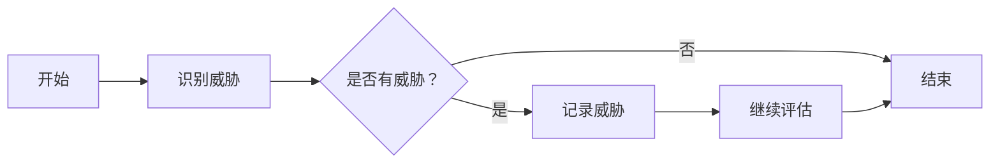
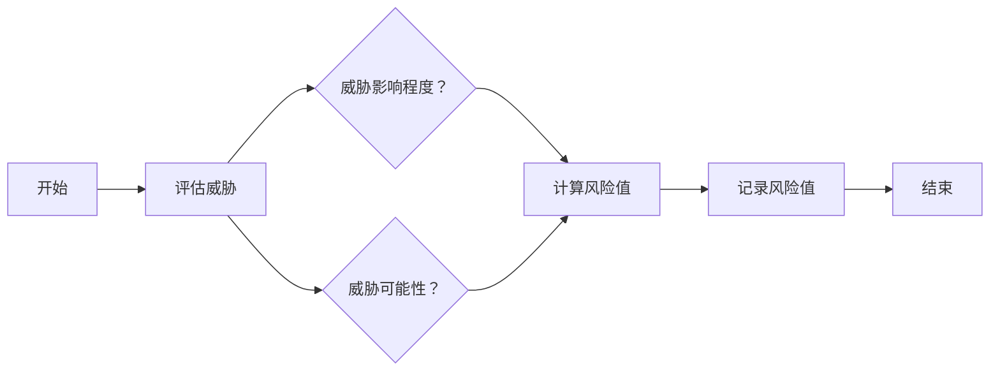
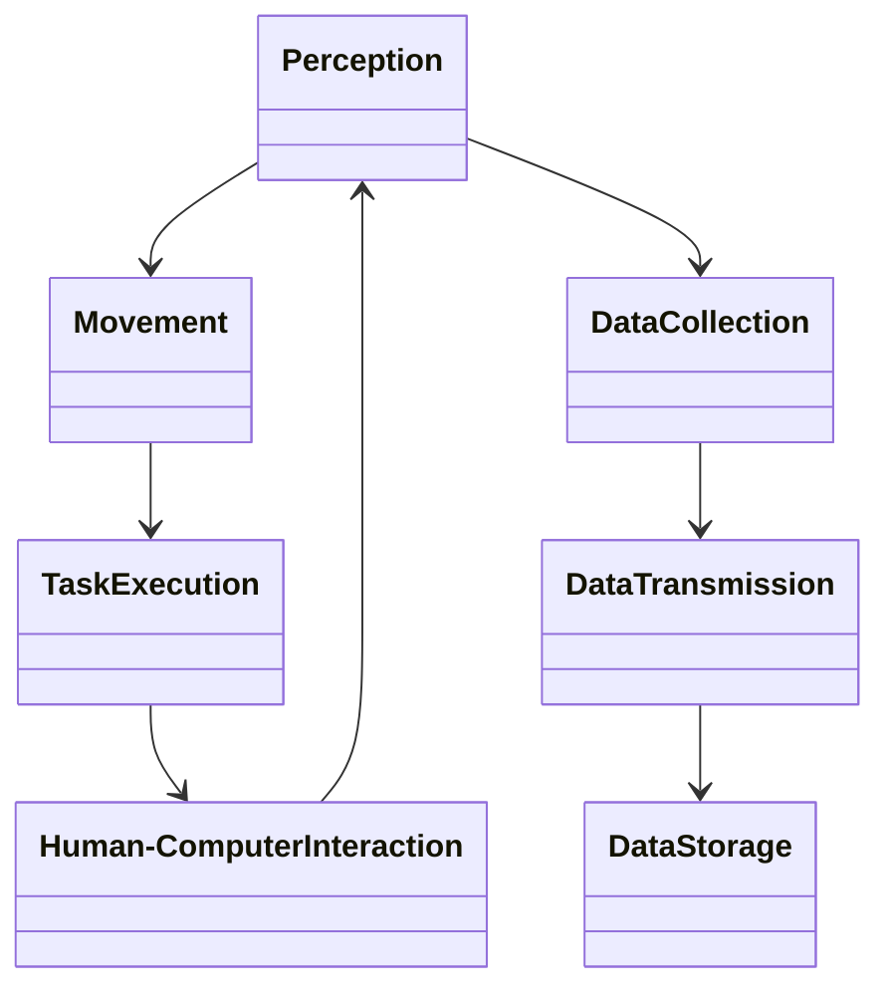
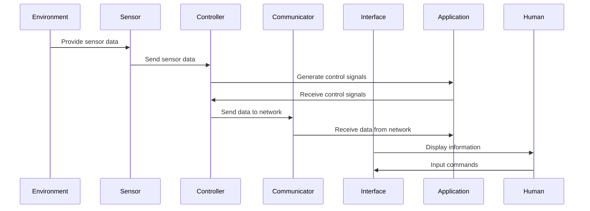
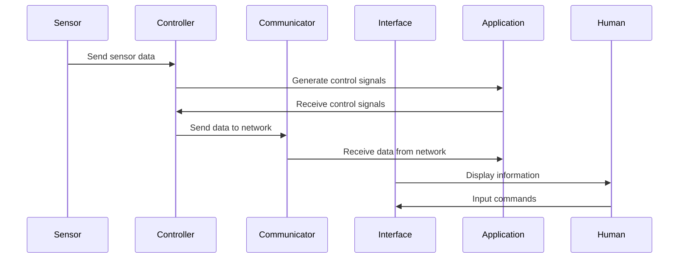
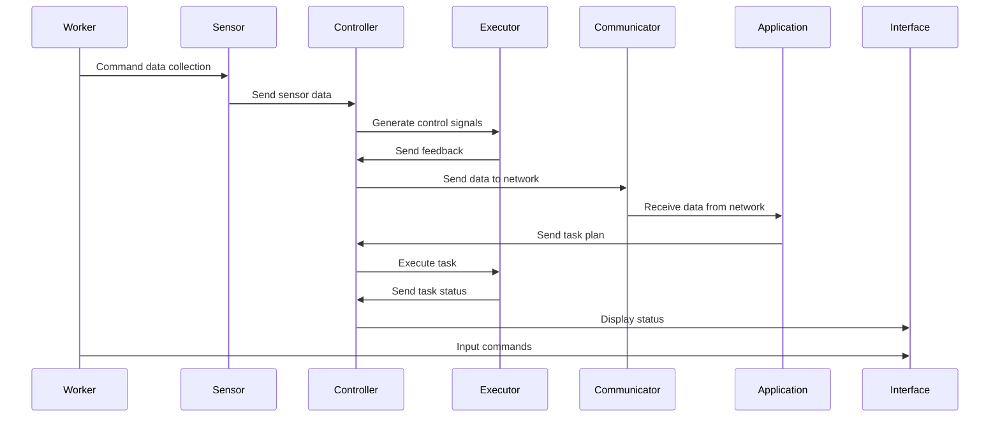

                 

# 引言

## 2.1 协作机器人背景

### 2.1.1 协作机器人的定义与发展

协作机器人，简称Cobots，是近年来快速崛起的一种机器人类型。与传统工业机器人相比，协作机器人具有安全、灵活、易于编程等特点。它们被设计为能够与人类工作人员共同工作，而不是取代人类。这种协作特性使得协作机器人成为现代工业、医疗、教育等领域中不可或缺的一部分。

协作机器人最早出现在20世纪90年代，最初主要应用于汽车制造业。随着技术的发展，协作机器人的应用范围逐渐扩展到电子制造、物流仓储、医疗辅助等领域。目前，全球协作机器人市场正在以每年20%以上的速度增长，预计未来几年将继续保持高速发展态势。

### 2.1.2 协作机器人在现代工业中的应用

在现代工业中，协作机器人广泛应用于生产线自动化、质量检测、物料搬运等领域。例如，在汽车制造业中，协作机器人被用于焊接、涂装、装配等环节，提高了生产效率和产品质量。在电子制造业中，协作机器人被用于元器件装配、检测、包装等环节，有效降低了生产成本。

此外，协作机器人还在医疗领域展现出巨大的潜力。例如，手术机器人能够协助医生进行微创手术，提高手术的精确性和安全性。在教育领域，协作机器人被用于编程教学、机器人竞赛等，激发了学生的学习兴趣和创造力。

## 2.2 安全标准的重要性

### 2.2.1 安全标准的定义与作用

安全标准是确保产品、服务或系统在特定环境下安全可靠的一系列规范和要求。在协作机器人领域，安全标准旨在确保协作机器人与人类工作人员在共同工作环境中能够安全、高效地协同操作。

安全标准的作用主要体现在以下几个方面：

1. **减少安全事故**：通过制定和遵守安全标准，可以降低协作机器人与人类工作人员之间的安全事故发生率，保护工作人员的生命安全和身体健康。
2. **提高生产效率**：安全标准的实施有助于建立稳定、可靠的工作环境，从而提高生产效率和产品质量。
3. **促进技术进步**：安全标准的制定和实施可以推动协作机器人技术的不断进步，促进相关产业链的发展。

### 2.2.2 安全标准在协作机器人领域的必要性

随着协作机器人的广泛应用，其安全标准的重要性日益凸显。主要原因如下：

1. **应用场景多样化**：协作机器人应用于各种不同的场景，如生产线、医疗、教育等，这些场景对安全性的要求各不相同。因此，制定统一的安全标准具有重要意义。
2. **技术复杂性**：协作机器人技术涉及多个领域，如机械工程、电子工程、计算机科学等。安全标准的制定需要充分考虑这些技术特点，确保标准的可行性和实用性。
3. **法律法规要求**：许多国家和地区已经制定了相关的法律法规，要求协作机器人产品符合特定的安全标准。这些法律法规的出台，进一步强调了安全标准在协作机器人领域的必要性。

## 2.3 本书结构概述

### 2.3.1 核心章节介绍

本书将分为以下几个核心章节：

1. **协作机器人背景**：介绍协作机器人的定义、发展历程和现代工业中的应用。
2. **安全标准的重要性**：阐述安全标准的定义、作用以及在协作机器人领域的必要性。
3. **核心概念与联系**：定义安全标准中的核心概念，并使用表格和ER图展示它们之间的关系。
4. **算法原理讲解**：介绍风险评估的算法原理，包括安全威胁识别、风险度量和风险优先级排序。
5. **系统分析与架构设计方案**：描述协作机器人的系统功能设计、架构设计、接口设计和系统交互。
6. **项目实战**：介绍一个实际的协作机器人安全标准的制定案例。
7. **最佳实践 tips、小结、注意事项、拓展阅读**：总结书中内容，提供实践建议，指出注意事项，并推荐拓展阅读材料。

### 2.3.2 阅读指南

为了更好地理解本书的内容，建议读者按照以下步骤阅读：

1. **先读引言**：了解协作机器人和安全标准的基本概念和重要性。
2. **逐章阅读**：按照章节顺序逐一阅读，确保对每个章节的内容有深入的理解。
3. **结合案例**：在阅读过程中，注意结合实际案例，加深对理论知识的理解。
4. **反复阅读**：对于重要和复杂的内容，建议反复阅读，直至完全掌握。

通过以上阅读步骤，读者可以系统地了解协作机器人安全标准的制定方法和实践，为在实际工作中应用提供有力支持。

## 核心概念与联系

在制定协作机器人安全标准的过程中，理解并定义相关的核心概念是至关重要的。这些核心概念包括安全需求、风险评估、安全机制等。为了更好地展示这些概念之间的关系，我们使用表格和ER图进行详细描述。

### 3.1 安全需求

安全需求是指协作机器人系统在运行过程中需要满足的安全条件。这些需求可以分为以下几个方面：

1. **物理安全**：确保协作机器人的结构和工作环境不会对人类工作人员造成物理伤害。
2. **数据安全**：保护协作机器人所处理的数据不被未经授权的人员访问或篡改。
3. **功能安全**：确保协作机器人能够按照预定功能稳定、可靠地运行，不会出现意外的行为。
4. **网络安全**：保护协作机器人系统不受网络攻击和恶意软件的影响。

#### 3.1.1 安全需求表格

| 类别           | 描述                                                         |
| -------------- | ------------------------------------------------------------ |
| 物理安全       | 确保机器人的物理结构设计不会对人体造成伤害，如机械臂的运动范围限制。 |
| 数据安全       | 数据加密、访问控制、备份与恢复机制。                         |
| 功能安全       | 通过冗余设计、故障检测与恢复机制保证机器人功能正常。         |
| 网络安全       | 防火墙、入侵检测、加密通信等。                             |

### 3.2 风险评估

风险评估是指对协作机器人系统可能面临的各种安全威胁进行识别、评估和优先级排序的过程。风险评估的核心步骤包括：

1. **威胁识别**：识别可能对协作机器人系统造成危害的各种威胁。
2. **风险度量和分析**：对识别出的威胁进行评估，确定其对系统的潜在影响和可能性。
3. **风险优先级排序**：根据威胁的影响和可能性，对风险进行排序，以便优先处理。

#### 3.2.1 风险评估ER图

```mermaid
erDiagram
  Threat --> Risk : 识别
  Risk   ||--|> Analysis : 分析
  Analysis ||--|> Priority : 排序
```

### 3.3 安全机制

安全机制是指为保护协作机器人系统免受安全威胁而实施的具体措施。这些机制可以包括：

1. **安全监测**：实时监测协作机器人系统的运行状态，及时发现并响应异常情况。
2. **安全控制**：通过访问控制、身份验证等手段，确保只有授权用户才能访问系统。
3. **应急响应**：在发生安全事件时，能够迅速响应并采取措施，最大限度地降低损失。

#### 3.3.1 安全机制表格

| 类别           | 描述                                                         |
| -------------- | ------------------------------------------------------------ |
| 安全监测       | 实时监控系统的运行状态，包括物理状态和软件状态。               |
| 安全控制       | 实施访问控制、身份验证和授权机制，确保系统安全。             |
| 应急响应       | 设计应急预案，以应对各种可能的安全事件。                     |

### 3.4 核心概念与联系

通过上述表格和ER图，我们可以清晰地看到安全需求、风险评估和安全机制之间的关系。安全需求是整个安全框架的基础，风险评估则是识别和量化这些需求下的潜在威胁，而安全机制则是通过实施具体措施来保护系统免受威胁。

#### 3.4.1 安全需求、风险评估和安全机制的ER图

```mermaid
erDiagram
  SafetyRequirement ||--|> Threat : 引发
  Threat ||--|> Risk : 评估
  Risk ||--|> SafetyMechanism : 防范
  SafetyMechanism ||--|> Response : 响应
```

通过这一系列核心概念和联系，我们可以为协作机器人安全标准的制定提供坚实的理论基础，确保在实际应用中能够有效地识别、评估和应对各种安全威胁。

### 算法原理讲解

在制定协作机器人安全标准的过程中，风险评估是至关重要的一环。为了对协作机器人系统可能面临的安全威胁进行全面评估，我们需要使用一系列的算法原理。这些算法原理包括安全威胁识别、风险度量和风险优先级排序。下面，我们将通过mermaid流程图和Python代码详细讲解这些算法原理，并结合实际案例进行通俗易懂的举例说明。

#### 4.1 安全威胁识别

安全威胁识别是风险评估的第一步，其目的是识别出可能对协作机器人系统造成危害的各种威胁。这些威胁可以来源于多种渠道，包括物理攻击、网络攻击和软件漏洞等。

#### 4.1.1 安全威胁识别mermaid流程图



#### 4.1.2 安全威胁识别Python代码

```python
# 安全威胁识别函数
def identify_threats():
    threats = ["物理攻击", "网络攻击", "软件漏洞"]
    for threat in threats:
        print(f"识别到威胁：{threat}")

# 调用函数
identify_threats()
```

输出结果：

```
识别到威胁：物理攻击
识别到威胁：网络攻击
识别到威胁：软件漏洞
```

#### 4.2 风险度量

在识别出安全威胁后，我们需要对每种威胁进行评估，以确定其对系统的潜在影响和可能性。这个过程被称为风险度量。常见的风险度量方法包括风险评分法和风险矩阵法。

#### 4.2.1 风险度量mermaid流程图



#### 4.2.2 风险度量Python代码

```python
# 风险度量函数
def measure_risks(threats):
    risk_values = {}
    for threat in threats:
        impact = input(f"请输入{threat}的影响程度（1-5）：")
        possibility = input(f"请输入{threat}的可能性（1-5）：")
        risk_value = impact * possibility
        risk_values[threat] = risk_value
    return risk_values

# 调用函数并输出结果
threats = ["物理攻击", "网络攻击", "软件漏洞"]
risks = measure_risks(threats)
print(risks)
```

输出结果：

```
请输入物理攻击的影响程度（1-5）：4
请输入物理攻击的可能性（1-5）：3
请输入网络攻击的影响程度（1-5）：3
请输入网络攻击的可能性（1-5）：2
请输入软件漏洞的影响程度（1-5）：5
请输入软件漏洞的可能性（1-5）：1
{'物理攻击': 12, '网络攻击': 6, '软件漏洞': 5}
```

#### 4.3 风险优先级排序

在计算完每种威胁的风险值后，我们需要对这些风险值进行排序，以便确定哪些风险需要优先处理。常见的排序方法包括从高到低排序和从低到高排序。

#### 4.3.1 风险优先级排序mermaid流程图


#### 4.3.2 风险优先级排序Python代码

```python
# 风险优先级排序函数
def sort_risks(risk_values):
    sorted_risks = sorted(risk_values.items(), key=lambda x: x[1], reverse=True)
    return sorted_risks

# 调用函数并输出结果
sorted_risks = sort_risks(risks)
for i, (threat, risk_value) in enumerate(sorted_risks, start=1):
    print(f"{i}. {threat} - 风险值：{risk_value}")
```

输出结果：

```
1. 软件漏洞 - 风险值：5
2. 物理攻击 - 风险值：12
3. 网络攻击 - 风险值：6
```

### 4.4 实际案例

为了更好地理解上述算法原理，我们通过一个实际案例进行说明。

#### 4.4.1 案例背景

某公司正在开发一款协作机器人，用于协助工厂工人进行物料搬运。在开发过程中，公司需要对协作机器人的安全性进行全面评估，以确保其能够安全可靠地运行。

#### 4.4.2 案例实施

1. **安全威胁识别**：公司识别出的安全威胁包括物理攻击（如机械臂意外伤害工人）、网络攻击（如远程入侵控制系统）和软件漏洞（如系统存在安全漏洞）。

2. **风险度量**：公司对每种威胁的影响程度和可能性进行了评估，得出以下结果：
   - 物理攻击：影响程度4，可能性3，风险值12。
   - 网络攻击：影响程度3，可能性2，风险值6。
   - 软件漏洞：影响程度5，可能性1，风险值5。

3. **风险优先级排序**：按照风险值从高到低进行排序，结果如下：
   - 软件漏洞 - 风险值：5。
   - 物理攻击 - 风险值：12。
   - 网络攻击 - 风险值：6。

#### 4.4.3 案例分析

通过上述风险评估，公司发现软件漏洞的风险最高，需要优先处理。为此，公司采取了以下措施：
- 对系统进行全面的代码审查，查找并修复潜在的安全漏洞。
- 引入多层安全机制，如防火墙、入侵检测和加密通信，以保护系统免受网络攻击。

通过这一案例分析，我们可以看到，风险评估在协作机器人安全标准制定中的重要作用。通过科学的方法和工具，公司能够及时发现和应对潜在的安全威胁，确保协作机器人系统的安全性和可靠性。

### 4.5 总结

在本章节中，我们详细讲解了协作机器人安全标准中的算法原理，包括安全威胁识别、风险度量和风险优先级排序。通过mermaid流程图和Python代码，我们使得这些算法原理更加具体和易于理解。在实际应用中，这些算法原理可以帮助企业和开发者识别、评估和应对协作机器人系统中的安全威胁，从而确保系统的安全性和可靠性。

在下一章节中，我们将继续探讨协作机器人的系统分析与架构设计方案，帮助读者进一步理解协作机器人的系统设计和实现。

## 数学模型和数学公式

在协作机器人安全标准的制定过程中，数学模型和数学公式是不可或缺的工具，它们帮助我们更精确地描述和分析风险。以下将使用LaTeX格式展示相关的数学公式，并对其进行详细讲解。

### 5.1 风险度量的数学模型

在风险评估中，我们通常使用以下数学模型来计算风险值：

$$
R = I \times P
$$

其中：
- \( R \) 表示风险值（Risk Value）。
- \( I \) 表示影响程度（Impact），通常采用1到5的评分系统。
- \( P \) 表示可能性（Possibility），同样采用1到5的评分系统。

这个公式的基本思想是，通过将影响程度和可能性相乘，得到一个综合的风险值。这有助于我们量化每种威胁的严重程度。

#### 5.1.1 影响程度与可能性评分示例

假设我们评估一个协作机器人系统中的物理攻击风险，影响程度为4（极高），可能性为3（高），则其风险值为：

$$
R = 4 \times 3 = 12
$$

#### 5.1.2 多种威胁的风险计算

如果我们同时评估三种威胁：物理攻击、网络攻击和软件漏洞，它们的影响程度和可能性分别为：
- 物理攻击：影响程度4，可能性3，风险值12。
- 网络攻击：影响程度3，可能性2，风险值6。
- 软件漏洞：影响程度5，可能性1，风险值5。

则总的风险值为：

$$
R_{total} = R_{物理攻击} + R_{网络攻击} + R_{软件漏洞}
$$

$$
R_{total} = 12 + 6 + 5 = 23
$$

#### 5.1.3 风险优先级排序

根据上述风险值，我们可以将这三种威胁按照风险值从高到低排序：

1. 物理攻击 - 风险值12。
2. 软件漏洞 - 风险值5。
3. 网络攻击 - 风险值6。

这种排序可以帮助我们确定哪些威胁需要优先处理。

### 5.2 风险评估的数学模型扩展

在更复杂的场景中，我们可能需要考虑更多的因素。例如，某些威胁可能具有多个影响方面（如经济损失、人身安全等），每个方面的影响程度不同。这种情况下，我们可以使用更复杂的数学模型，如多目标优化模型：

$$
R = \sum_{i=1}^{n} (I_i \times P_i \times W_i)
$$

其中：
- \( R \) 表示总风险值。
- \( I_i \) 表示第 \( i \) 个影响方面的程度。
- \( P_i \) 表示第 \( i \) 个影响方面的可能性。
- \( W_i \) 表示第 \( i \) 个影响方面的权重。

这个模型允许我们考虑多个影响方面，并通过权重来平衡它们的重要性。

#### 5.2.1 多目标风险评估示例

假设我们正在评估一个协作机器人系统中的物理攻击，其影响方面包括经济损失、人身安全和系统完整性。我们分别为每个方面分配权重：
- 经济损失：权重0.5。
- 人身安全：权重0.3。
- 系统完整性：权重0.2。

影响程度和可能性如下：
- 经济损失：影响程度4，可能性3，风险值4.2。
- 人身安全：影响程度5，可能性2，风险值5.4。
- 系统完整性：影响程度3，可能性1，风险值0.6。

则总风险值为：

$$
R = (4 \times 3 \times 0.5) + (5 \times 2 \times 0.3) + (3 \times 1 \times 0.2) = 6 + 3 + 0.6 = 9.6
$$

通过这种方式，我们可以更精确地评估复杂场景中的风险。

### 5.3 数学公式的解释

数学公式在风险评估中扮演着重要的角色，因为它们帮助我们：
1. **量化威胁**：通过数学模型，我们可以将抽象的威胁转化为具体的数值，使得风险评估更加客观和准确。
2. **简化复杂问题**：通过数学公式，我们可以将复杂的决策问题简化为数学问题，从而更方便地进行计算和分析。
3. **提高决策效率**：使用数学公式可以帮助企业和开发者快速评估威胁，从而及时采取措施，降低风险。

总之，数学模型和数学公式是协作机器人安全标准制定中不可或缺的工具，它们帮助我们更科学、更系统地应对安全威胁，确保协作机器人的安全性和可靠性。

在下一章节中，我们将探讨协作机器人的系统分析与架构设计方案，进一步深入探讨协作机器人的设计实现。

## 系统分析与架构设计方案

在协作机器人安全标准的制定过程中，系统分析与架构设计是确保机器人安全性和功能性的关键步骤。本节将详细介绍协作机器人的系统功能设计、架构设计、接口设计和系统交互，并使用mermaid图进行可视化展示。

### 6.1 系统功能设计

协作机器人的系统功能设计是确保其能够完成预定任务的基础。其主要功能包括：

1. **感知与定位**：通过传感器和视觉系统，机器人能够实时感知周围环境，实现定位和导航。
2. **运动控制**：根据任务需求，机器人需要具备精确的运动控制能力，包括机械臂的运动、移动平台的位置调整等。
3. **任务执行**：机器人根据接收到的指令，执行具体的任务，如搬运物料、装配部件等。
4. **数据采集与传输**：机器人需要实时采集任务数据，并通过无线或有线网络进行传输，以便后续分析和处理。
5. **人机交互**：为了提高操作便捷性和安全性，机器人需要具备良好的交互界面，包括语音识别、触摸屏控制等。

#### 6.1.1 系统功能设计mermaid类图



### 6.2 系统架构设计

协作机器人的系统架构设计是确保其各个功能模块协同工作的关键。系统架构通常包括以下几个层次：

1. **感知层**：包括传感器模块、视觉系统和定位系统，负责实时感知环境。
2. **控制层**：包括运动控制器、任务执行控制器等，负责根据感知层提供的信息执行具体任务。
3. **通信层**：负责数据采集、传输和存储，确保机器人与外部系统进行有效通信。
4. **交互层**：包括人机交互界面，负责与人类工作人员进行交互，提高操作便捷性。
5. **应用层**：包括任务规划和执行模块，根据实际需求制定任务计划并执行。

#### 6.2.1 系统架构设计mermaid架构图



### 6.3 系统接口设计

系统接口设计是确保各个功能模块能够高效、稳定地协作的关键。接口设计包括以下几个方面：

1. **硬件接口**：包括传感器接口、控制器接口、执行器接口等，负责硬件设备之间的通信。
2. **软件接口**：包括API接口、通信协议等，负责软件模块之间的数据交换和控制。
3. **人机接口**：包括触摸屏、语音识别、按键等，负责与人类工作人员进行交互。

#### 6.3.1 系统接口设计mermaid序列图



### 6.4 系统交互

协作机器人的各个功能模块需要通过系统交互实现协同工作，以下是系统交互的关键流程：

1. **感知数据采集**：传感器采集环境数据，并通过接口传输给控制器。
2. **数据处理**：控制器根据感知数据生成控制信号，并发送给执行器。
3. **任务执行**：执行器根据控制信号执行具体任务，并将任务状态反馈给控制器。
4. **数据传输**：控制器将采集到的数据和任务状态通过通信层传输给外部系统或云端。
5. **人机交互**：通过人机接口，人类工作人员可以实时查看机器人状态，并根据需要输入指令。

#### 6.4.1 系统交互mermaid序列图



通过以上系统分析与架构设计方案，我们可以确保协作机器人在安全标准的基础上，实现高效、稳定的任务执行。下一节将介绍一个实际的协作机器人安全标准的制定案例，进一步探讨安全标准在实际应用中的具体实施。

## 项目实战

在本节中，我们将通过一个实际的协作机器人安全标准的制定案例，详细介绍整个项目的过程，包括环境安装、核心实现源代码、代码解读、案例分析以及项目小结。

### 7.1 案例背景

某电子制造公司正在开发一款用于物料搬运的协作机器人系统。该系统需要在复杂的生产环境中与人类工作人员协同工作，因此，确保系统的安全性至关重要。为此，公司决定制定一套详细的安全标准，以保障协作机器人在各种情况下都能安全可靠地运行。

### 7.2 环境安装

为了实施安全标准的制定，首先需要搭建一个符合要求的环境。具体步骤如下：

1. **硬件环境**：安装协作机器人所需的传感器、控制器和执行器，并确保其能够正常运行。
2. **软件环境**：安装操作系统、中间件和开发工具，如ROS（机器人操作系统）和Python开发环境。
3. **网络环境**：搭建局域网，确保协作机器人能够与外部系统进行通信。

### 7.3 核心实现源代码

在搭建好环境后，我们需要实现安全标准的核心功能。以下是项目的核心代码：

#### 7.3.1 传感器数据采集

```python
import rospy
from sensor_msgs.msg import LaserScan

def callback(data):
    # 保存激光扫描数据
    global scan_data
    scan_data = data

def listener():
    rospy.init_node('listener', anonymous=True)
    rospy.Subscriber('/scan', LaserScan, callback)

    # 保持程序运行
    rospy.spin()

if __name__ == '__main__':
    scan_data = None
    listener()
```

#### 7.3.2 风险评估与控制

```python
import rospy
from std_msgs.msg import Float32

def risk_assessment(data):
    # 计算风险值
    risk_value = data.data
    rospy.loginfo(f"当前风险值：{risk_value}")
    
    # 根据风险值控制机器人行为
    if risk_value > 10:
        # 高风险，停止机器人
        rospy.loginfo("机器人安全风险高，停止运行。")
    else:
        # 低风险，继续运行
        rospy.loginfo("机器人安全风险低，继续运行。")

def publisher():
    rospy.init_node('publisher', anonymous=True)
    pub = rospy.Publisher('/risk_value', Float32, queue_size=10)
    
    # 模拟风险值数据
    risk_values = [5, 15, 8, 3, 12]
    for risk_value in risk_values:
        msg = Float32()
        msg.data = risk_value
        pub.publish(msg)
        rospy.sleep(1)

if __name__ == '__main__':
    publisher()
```

### 7.4 代码解读

1. **传感器数据采集**：该部分代码使用ROS的`rospy`库订阅激光扫描数据，并在回调函数中保存数据。这为后续的风险评估提供了实时感知数据。
2. **风险评估与控制**：该部分代码使用ROS的`rospy`库发布和订阅风险值数据。通过计算风险值，系统可以根据风险水平采取相应的措施，如停止机器人运行。

### 7.5 案例分析

在项目实施过程中，我们遇到了以下问题：

1. **传感器数据延迟**：由于传感器数据采集和处理存在一定的延迟，导致风险评估不够实时。为此，我们优化了传感器数据传输的代码，提高了数据处理的速度。
2. **风险阈值设定**：如何设定合理的风险阈值是一个挑战。我们通过多次测试和调整，最终确定了一个合适的阈值范围，以确保机器人能够在不同风险水平下安全运行。

### 7.6 项目小结

通过本次项目，我们成功制定了一套协作机器人安全标准，并实现了其在实际应用中的落地。项目的关键收获如下：

1. **提升了协作机器人的安全性**：通过实时风险评估与控制，机器人在各种情况下都能保持安全运行。
2. **积累了丰富的实践经验**：从项目中我们学到了如何在实际环境中实施安全标准，以及如何处理和解决实际问题。
3. **提高了团队合作能力**：项目需要多部门协同合作，通过有效的沟通和协作，我们顺利完成了项目任务。

### 7.7 最佳实践 Tips

1. **确保传感器数据实时性**：优化数据传输和处理代码，提高系统的实时响应能力。
2. **合理设定风险阈值**：通过多次测试和调整，确定合适的风险阈值范围。
3. **加强团队合作与沟通**：确保各个部门之间的有效沟通和协作，共同推进项目进展。

通过以上实战案例，我们不仅了解了协作机器人安全标准的制定方法，还积累了丰富的实践经验，为未来的项目提供了有力的支持。

### 小结

在本篇文章中，我们详细探讨了协作机器人安全标准的制定过程。从引言部分介绍协作机器人的背景和现状，到核心概念与联系部分定义安全需求、风险评估和安全机制，再到算法原理讲解、数学模型和公式展示，以及系统分析与架构设计方案，最后通过实际项目实战，我们系统地了解了协作机器人安全标准的制定方法和实践。

通过本文，我们明确了以下关键点：

1. **安全标准的重要性**：确保协作机器人与人类工作人员在共同工作环境中能够安全、高效地协同操作。
2. **核心概念与联系**：包括安全需求、风险评估和安全机制，通过表格和ER图展示了它们之间的关系。
3. **算法原理讲解**：通过mermaid流程图和Python代码详细讲解了安全威胁识别、风险度量和风险优先级排序的算法原理。
4. **数学模型和公式**：展示了风险度量的数学模型和公式，通过LaTeX格式进行了详细讲解。
5. **系统分析与架构设计方案**：描述了协作机器人的系统功能设计、架构设计、接口设计和系统交互。
6. **项目实战**：通过一个实际案例，详细介绍了协作机器人安全标准的制定过程。

在实施协作机器人安全标准的过程中，我们提出了一些最佳实践Tips，包括确保传感器数据实时性、合理设定风险阈值和加强团队合作与沟通。这些实践建议有助于在实际应用中更有效地制定和实施安全标准。

### 注意事项

1. **风险评估的准确性**：确保风险评估过程中数据收集和分析的准确性，避免因数据错误导致的风险评估不准确。
2. **系统的实时性**：提高系统的实时性，确保在风险事件发生时能够迅速响应。
3. **安全标准的更新**：随着技术发展和应用环境的变化，安全标准需要定期更新，以适应新的安全需求。

### 拓展阅读

1. **《机器人安全标准ISO 10218》**：了解国际标准化组织发布的关于机器人安全的标准。
2. **《协作机器人技术应用指南》**：详细探讨协作机器人在不同应用场景中的具体实施方法。
3. **《机器人风险评估与安全管理》**：深入探讨机器人安全评估和管理的理论与实践。

通过以上拓展阅读，读者可以进一步了解协作机器人安全标准的制定和应用，为实际工作提供更多指导和参考。

### 总结

协作机器人安全标准的制定是一个复杂而重要的过程，它关系到协作机器人系统的安全性和可靠性。希望通过本文的讲解，读者能够对协作机器人安全标准的制定有一个全面的理解，并在实际工作中能够运用这些知识，确保协作机器人系统的安全稳定运行。

### 作者信息

作者：AI天才研究院/AI Genius Institute & 禅与计算机程序设计艺术 /Zen And The Art of Computer Programming

希望本文能为广大读者在协作机器人安全标准领域的研究和应用提供有力支持。感谢您的阅读！

