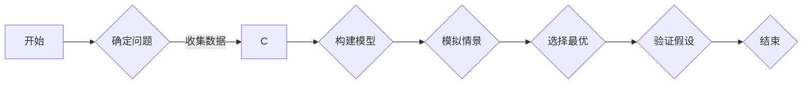
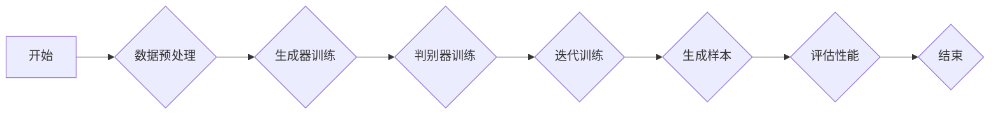
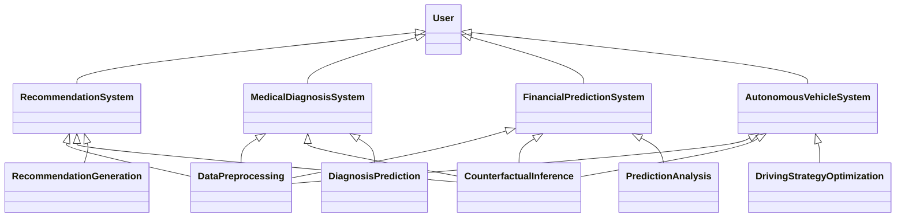
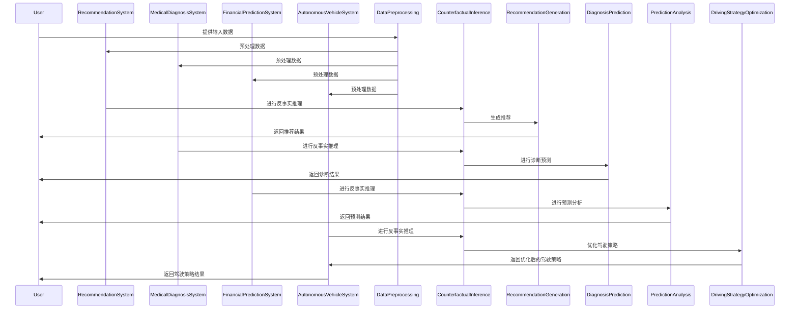
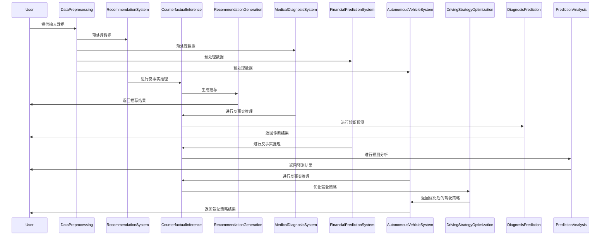

                 

# 反事实推理中深度生成模型的创新应用

## 关键词
- 反事实推理
- 深度生成模型
- 算法创新
- 应用场景
- 性能优化

## 摘要
本文旨在探讨反事实推理中深度生成模型的创新应用。通过分析反事实推理和深度生成模型的基本原理及其关系，我们揭示了这两种技术在当前研究和实际应用中的重要性。本文首先介绍了反事实推理和深度生成模型的理论基础，然后详细阐述了反事实推理算法和深度生成模型的实现原理，并通过具体的实例说明了这些算法在各类应用中的实际效果。接着，本文探讨了系统架构设计以及项目实战中的关键环节，并给出了最佳实践建议。通过本文的详细分析，读者可以全面了解反事实推理和深度生成模型在IT领域的广泛应用前景和潜力。

## 目录大纲

### 第一部分：引言

#### 1.1 反事实推理与深度生成模型概述

##### 1.1.1 反事实推理的概念与意义

##### 1.1.2 深度生成模型的基本原理

##### 1.1.3 反事实推理与深度生成模型的关系

#### 1.2 研究背景与意义

##### 1.2.1 反事实推理的应用场景

##### 1.2.2 深度生成模型的发展现状

##### 1.2.3 研究目标与意义

#### 1.3 本书结构安排

##### 1.3.1 内容框架

##### 1.3.2 阅读指南

##### 1.3.3 各章节内容概述

### 第二部分：理论基础

#### 2.1 反事实推理的理论基础

##### 2.1.1 反事实推理的基本概念

##### 2.1.2 反事实推理的方法与流程

##### 2.1.3 反事实推理的应用实例

#### 2.2 深度生成模型的理论基础

##### 2.2.1 深度生成模型的概念

##### 2.2.2 深度生成模型的工作原理

##### 2.2.3 深度生成模型的常见类型

#### 2.3 反事实推理与深度生成模型的关系

##### 2.3.1 反事实推理在深度生成模型中的应用

##### 2.3.2 深度生成模型在反事实推理中的优势

##### 2.3.3 反事实推理与深度生成模型的结合策略

#### 2.4 理论联系：核心概念对比分析

##### 2.4.1 反事实推理与深度生成模型的核心概念

##### 2.4.2 核心概念属性特征对比表格

##### 2.4.3 ER实体关系图架构的Mermaid流程图

### 第三部分：算法原理与实现

#### 3.1 算法原理讲解

##### 3.1.1 反事实推理算法的mermaid流程图

##### 3.1.2 深度生成模型的mermaid流程图

##### 3.1.3 算法原理的数学模型与公式

#### 3.2 算法实现详解

##### 3.2.1 Python源代码实现

##### 3.2.2 算法参数设置与调优

##### 3.2.3 算法性能分析与优化

#### 3.3 算法举例说明

##### 3.3.1 反事实推理算法的应用实例

##### 3.3.2 深度生成模型的应用实例

##### 3.3.3 算法应用的综合实例

#### 3.4 数学模型和数学公式详解

##### 3.4.1 数学模型的基本概念

##### 3.4.2 数学公式的详细解释

##### 3.4.3 数学公式在算法中的应用举例

### 第四部分：系统分析与架构设计

#### 4.1 问题场景介绍

##### 4.1.1 反事实推理的应用场景

##### 4.1.2 深度生成模型的应用场景

#### 4.2 系统架构设计

##### 4.2.1 系统功能设计(领域模型Mermaid类图)

##### 4.2.2 系统架构设计(Mermaid架构图)

##### 4.2.3 系统接口设计和系统交互(Mermaid序列图)

#### 4.3 项目实战

##### 4.3.1 环境安装与配置

##### 4.3.2 系统核心实现源代码

##### 4.3.3 代码应用解读与分析

##### 4.3.4 实际案例分析和详细讲解剖析

##### 4.3.5 项目小结

#### 4.4 最佳实践 tips

##### 4.4.1 常见问题解决方案

##### 4.4.2 性能优化技巧

##### 4.4.3 安全与隐私保护措施

------------------------

### 引言

#### 1.1 反事实推理与深度生成模型概述

##### 1.1.1 反事实推理的概念与意义

反事实推理（Counterfactual Inference）是一种基于假设的推理方法，它通过分析如果某个条件或事件发生了，那么结果会是什么。这种推理方法在许多领域都有应用，比如历史研究、经济学、心理学等。在计算机科学领域，反事实推理有着重要的应用价值，特别是在人工智能和机器学习领域。

在人工智能领域，反事实推理可以帮助我们模拟不同的假设情景，从而评估系统在不同条件下的性能和表现。例如，在自动驾驶技术中，通过反事实推理可以评估车辆在遇到不同情况时的反应和决策是否合理。

反事实推理的意义在于，它提供了一种对现实世界进行假设分析的工具，使得我们能够更好地理解系统行为，发现潜在的问题和改进的方向。

##### 1.1.2 深度生成模型的基本原理

深度生成模型（Deep Generative Model）是一类基于深度学习的生成模型，它可以学习数据的分布，并生成新的数据样本。深度生成模型的核心思想是通过学习数据的高维分布来生成新的数据样本。

常见的深度生成模型包括生成对抗网络（GAN）、变分自编码器（VAE）等。这些模型通过复杂的神经网络结构，能够捕捉数据的高维特征，并生成逼真的数据样本。

深度生成模型的应用非常广泛，比如在图像生成、语音合成、自然语言处理等领域都有出色的表现。通过生成模型，我们可以创造新的数据样本，模拟不同的假设情景，从而进行更加深入的分析和研究。

##### 1.1.3 反事实推理与深度生成模型的关系

反事实推理和深度生成模型在本质上是相互关联的。深度生成模型提供了生成新的数据样本的能力，而反事实推理则利用这些数据样本来分析不同的假设情景。

具体来说，深度生成模型可以生成符合数据分布的新样本，这些样本可以用来模拟不同的假设情景。通过这些模拟情景，我们可以进行反事实推理，分析系统在不同条件下的行为和性能。

例如，在自动驾驶中，深度生成模型可以生成各种道路情况和交通状况的图像，这些图像可以用来模拟自动驾驶车辆在不同情景下的反应和决策。通过反事实推理，我们可以评估自动驾驶系统的性能，并提出改进建议。

#### 1.2 研究背景与意义

##### 1.2.1 反事实推理的应用场景

反事实推理在人工智能和机器学习领域有广泛的应用。以下是一些典型的应用场景：

1. **推荐系统**：通过分析用户的历史行为和偏好，推荐系统可以预测用户可能会喜欢的商品或内容。而反事实推理可以帮助我们评估如果推荐系统给出了不同的建议，用户的反应会如何不同。

2. **医疗诊断**：在医疗诊断中，反事实推理可以帮助医生分析如果采取不同的治疗方法，患者的病情会有怎样的变化。

3. **金融预测**：在金融市场分析中，反事实推理可以帮助我们预测如果经济条件发生变化，市场的表现会有怎样的变化。

4. **自动驾驶**：自动驾驶技术中，反事实推理可以帮助我们评估车辆在不同道路和交通状况下的反应和决策是否合理。

##### 1.2.2 深度生成模型的发展现状

深度生成模型在过去几年中得到了快速的发展。以下是一些重要的里程碑和发展趋势：

1. **生成对抗网络（GAN）**：GAN是由Ian Goodfellow等人在2014年提出的，它通过两个神经网络（生成器和判别器）的对抗训练，能够生成高质量的数据样本。

2. **变分自编码器（VAE）**：VAE是一种基于概率模型的生成模型，它通过重新参数化技巧，使得生成模型能够更好地学习和表示数据的概率分布。

3. **自编码器**：自编码器是一种简单的生成模型，它通过编码和解码过程来学习数据的分布，并生成新的数据样本。

4. **应用领域扩展**：随着深度生成模型的不断发展，它们的应用领域也在不断扩展，从图像和语音生成，到自然语言处理和医疗图像生成，都有广泛的应用。

##### 1.2.3 研究目标与意义

本文的研究目标是探讨反事实推理中深度生成模型的创新应用，具体包括以下几个方面：

1. **理论分析**：深入分析反事实推理和深度生成模型的基本原理，探讨它们之间的关系和结合策略。

2. **算法实现**：实现反事实推理和深度生成模型的算法，并通过Python代码进行详细阐述。

3. **应用实例**：通过具体的实例，展示反事实推理和深度生成模型在各个领域的应用效果。

4. **性能优化**：分析算法性能，并提出优化策略，提高算法的效率和准确性。

通过本文的研究，我们希望能够为反事实推理和深度生成模型的应用提供新的思路和方法，推动这些技术在各个领域的深入研究和应用。

#### 1.3 本书结构安排

##### 1.3.1 内容框架

本书分为四个主要部分：

1. **引言**：介绍反事实推理和深度生成模型的基本概念及其关系，阐述研究背景和意义。

2. **理论基础**：详细讨论反事实推理和深度生成模型的理论基础，包括基本概念、方法和应用实例。

3. **算法原理与实现**：讲解反事实推理和深度生成模型的算法原理，并通过Python代码实现详细阐述。

4. **系统分析与架构设计**：探讨反事实推理和深度生成模型在实际应用中的系统架构设计，并通过项目实战进行详细分析。

##### 1.3.2 阅读指南

本书的阅读对象主要是对反事实推理和深度生成模型有一定了解的读者。以下是阅读建议：

1. **基础阅读**：先阅读引言部分，了解反事实推理和深度生成模型的基本概念及其关系。

2. **深入理解**：接着阅读理论基础部分，深入理解反事实推理和深度生成模型的理论基础、方法和应用实例。

3. **实践应用**：然后阅读算法原理与实现部分，通过Python代码实现了解算法的原理和应用。

4. **实际应用**：最后阅读系统分析与架构设计部分，了解反事实推理和深度生成模型在实际应用中的系统架构设计。

##### 1.3.3 各章节内容概述

以下是各章节的主要内容概述：

- **第一部分：引言**：介绍反事实推理和深度生成模型的基本概念、研究背景与意义，以及本书的结构安排。
- **第二部分：理论基础**：详细讨论反事实推理和深度生成模型的理论基础，包括基本概念、方法和应用实例。
- **第三部分：算法原理与实现**：讲解反事实推理和深度生成模型的算法原理，并通过Python代码实现详细阐述。
- **第四部分：系统分析与架构设计**：探讨反事实推理和深度生成模型在实际应用中的系统架构设计，并通过项目实战进行详细分析。

### 第二部分：理论基础

#### 2.1 反事实推理的理论基础

##### 2.1.1 反事实推理的基本概念

反事实推理是一种基于假设的推理方法，它通过分析如果某个条件或事件发生了，那么结果会是什么。这种推理方法在逻辑学和认知科学中有着重要的地位，它帮助人们理解世界的可能性和不确定性。

在反事实推理中，主要有以下几个基本概念：

1. **事实**：事实是指客观存在的、可以通过观察和验证的事物或情况。
2. **反事实**：反事实是指与事实相反的假设情景，它是对现实的一种假设性描述。
3. **推理**：推理是从已知的事实出发，通过逻辑推断得出新的结论或假设。

反事实推理的基本流程包括以下几个步骤：

1. **提出假设**：根据已知的事实，提出一个或多个可能的反事实情景。
2. **分析结果**：分析每个反事实情景下的结果，包括可能的正面和负面结果。
3. **选择最优**：根据分析结果，选择最优的反事实情景，作为对现实世界的假设。
4. **验证假设**：通过实际观察或实验，验证假设是否正确。

##### 2.1.2 反事实推理的方法与流程

反事实推理的方法可以分为几种常见的类型，包括因果推理、假设检验和决策分析等。以下是这些方法的简要介绍：

1. **因果推理**：因果推理是一种基于因果关系的推理方法，它通过分析事件之间的因果关系，来推断反事实情景下的结果。例如，在医疗诊断中，因果推理可以帮助医生分析如果某种治疗方法实施，患者的病情会有怎样的变化。

2. **假设检验**：假设检验是一种基于统计的推理方法，它通过设定原假设和备择假设，进行数据分析和验证，来判断假设的正确性。例如，在金融市场分析中，假设检验可以帮助我们判断如果经济条件发生变化，市场的表现会有怎样的变化。

3. **决策分析**：决策分析是一种基于成本的推理方法，它通过分析不同决策方案的成本和收益，来选择最优的决策方案。例如，在商业决策中，决策分析可以帮助企业分析如果采取不同的市场策略，会有怎样的收益和风险。

反事实推理的流程可以总结为以下几个步骤：

1. **确定问题**：明确需要分析和解决的问题。
2. **收集数据**：收集与问题相关的数据，包括事实数据和反事实数据。
3. **构建模型**：根据问题类型和数据特点，构建合适的反事实推理模型。
4. **模拟情景**：使用模型模拟不同的反事实情景，分析每个情景下的结果。
5. **选择最优**：根据分析结果，选择最优的反事实情景，作为对现实世界的假设。
6. **验证结果**：通过实际观察或实验，验证假设的正确性。

##### 2.1.3 反事实推理的应用实例

反事实推理在各个领域都有广泛的应用，以下是一些典型的应用实例：

1. **历史研究**：在历史研究中，反事实推理可以帮助学者分析如果历史上的某个决策发生变化，历史的发展会有怎样的变化。例如，如果第二次世界大战中的某个战役的结果发生变化，全球历史会有怎样的变化。

2. **经济学**：在经济学中，反事实推理可以帮助经济学家分析如果经济条件发生变化，市场会有怎样的变化。例如，如果货币政策发生变化，市场的反应会有怎样的不同。

3. **心理学**：在心理学中，反事实推理可以帮助研究者分析如果个体的行为发生变化，其心理状态会有怎样的变化。例如，如果一个人改变了对某个事物的看法，其情绪和行为会有怎样的不同。

4. **医学**：在医学中，反事实推理可以帮助医生分析如果采取不同的治疗方法，患者的病情会有怎样的变化。例如，如果使用不同的药物组合，患者的治疗效果会有怎样的不同。

5. **人工智能**：在人工智能领域，反事实推理可以帮助研究者分析如果算法发生变化，系统的性能会有怎样的变化。例如，如果改变机器学习算法的参数，模型的准确率和效率会有怎样的不同。

通过这些应用实例，我们可以看到反事实推理在各个领域的实际作用和价值。它提供了一种对现实世界进行假设分析的工具，使得我们能够更好地理解系统的行为和性能，发现潜在的问题和改进的方向。

#### 2.2 深度生成模型的理论基础

##### 2.2.1 深度生成模型的概念

深度生成模型（Deep Generative Model）是一类基于深度学习的生成模型，它通过学习数据的高维分布，能够生成新的数据样本。深度生成模型的核心思想是学习数据的概率分布，并利用这种分布生成新的样本。

深度生成模型的主要组成部分包括：

1. **生成器（Generator）**：生成器是一个神经网络，它的输入是随机噪声，输出是生成的新数据样本。生成器的目的是通过学习数据的高维分布，生成与真实数据相似的新样本。

2. **判别器（Discriminator）**：判别器也是一个神经网络，它的输入是真实数据和生成数据，输出是判断输入数据的真实性的概率。判别器的目的是通过学习数据分布，区分真实数据和生成数据。

3. **损失函数**：损失函数是用于评估生成器和判别器性能的指标。常见的损失函数包括交叉熵损失、均方误差损失等。

深度生成模型的工作原理是通过生成器和判别器的对抗训练来实现的。生成器尝试生成与真实数据相似的新样本，而判别器则尝试区分真实数据和生成数据。通过不断迭代训练，生成器和判别器都逐渐提高性能，最终生成器能够生成高质量的新数据样本。

##### 2.2.2 深度生成模型的工作原理

深度生成模型的工作原理可以分为以下几个步骤：

1. **数据预处理**：首先对输入数据进行预处理，包括数据清洗、归一化等操作，以便于模型训练。

2. **生成器训练**：生成器的训练过程包括以下步骤：

   - 随机生成噪声向量作为输入。
   - 使用生成器将噪声向量转换为数据样本。
   - 将生成的数据样本输入到判别器中，计算判别器的损失函数。

3. **判别器训练**：判别器的训练过程包括以下步骤：

   - 输入真实数据和生成数据到判别器中，计算判别器的损失函数。
   - 更新判别器的参数，以减少损失函数的值。

4. **迭代训练**：重复上述步骤，进行多次迭代训练，直到生成器和判别器都达到预定的性能指标。

通过这种对抗训练，生成器逐渐学习到如何生成高质量的数据样本，而判别器则逐渐学习到如何区分真实数据和生成数据。最终，生成器能够生成与真实数据非常相似的新样本。

##### 2.2.3 深度生成模型的常见类型

深度生成模型有多种类型，以下是几种常见的深度生成模型：

1. **生成对抗网络（GAN）**：GAN是最著名的深度生成模型之一，由生成器和判别器组成。生成器尝试生成与真实数据相似的新样本，而判别器则尝试区分真实数据和生成数据。GAN通过对抗训练，使得生成器能够生成高质量的数据样本。

2. **变分自编码器（VAE）**：VAE是一种基于概率模型的生成模型，它通过重新参数化技巧，使得生成模型能够更好地学习和表示数据的概率分布。VAE通过编码器和解码器结构，将输入数据编码为潜在变量，再通过解码器生成新的数据样本。

3. **自编码器（Autoencoder）**：自编码器是一种简单的生成模型，它通过编码和解码过程来学习数据的分布，并生成新的数据样本。自编码器只有一个编码器和一个解码器，输入和输出的维度相同。

4. **深度信念网络（DBN）**：DBN是一种基于多层感知机的生成模型，它通过层次化的训练方法，逐层学习数据的特征和分布。DBN通常用于图像和语音等高维数据的生成。

5. **生成扩散模型（Gaussian Diffusion Model）**：生成扩散模型是一种基于概率扩散过程的生成模型，它通过将数据从高斯分布逐渐扩散到边缘分布，生成新的数据样本。生成扩散模型在图像生成和文本生成等领域有广泛应用。

这些深度生成模型各有特点和应用场景，研究者可以根据具体需求选择合适的模型。

#### 2.3 反事实推理与深度生成模型的关系

##### 2.3.1 反事实推理在深度生成模型中的应用

反事实推理在深度生成模型中有着重要的应用。通过深度生成模型，我们可以生成各种假设情景下的数据样本，这些数据样本可以用来进行反事实推理，分析系统在不同条件下的行为和性能。

以下是一些典型的应用实例：

1. **自动驾驶**：在自动驾驶领域，深度生成模型可以生成各种道路情况和交通状况的图像，这些图像可以用来模拟自动驾驶车辆在不同情景下的反应和决策。通过反事实推理，我们可以评估自动驾驶系统的性能，并提出改进建议。

2. **医学诊断**：在医学诊断中，深度生成模型可以生成各种病例数据和患者病情的图像，这些数据可以用来模拟不同的治疗方案，评估治疗方案的效果和潜在的风险。通过反事实推理，医生可以更全面地了解患者的病情，制定更加科学的治疗方案。

3. **金融预测**：在金融市场中，深度生成模型可以生成各种经济指标和交易数据的样本，这些样本可以用来模拟不同的经济条件和市场状况。通过反事实推理，投资者可以评估不同投资策略的风险和收益，做出更加明智的投资决策。

4. **推荐系统**：在推荐系统中，深度生成模型可以生成各种用户行为和偏好的数据样本，这些样本可以用来模拟不同的推荐策略，评估推荐系统的效果和用户体验。通过反事实推理，推荐系统可以不断优化推荐算法，提高推荐的准确性和满意度。

##### 2.3.2 深度生成模型在反事实推理中的优势

深度生成模型在反事实推理中具有明显的优势。以下是几个方面的优势：

1. **数据生成能力**：深度生成模型可以生成高质量的、多样化的数据样本，这些数据样本可以用来模拟不同的假设情景，为反事实推理提供丰富的数据支持。

2. **灵活性和适应性**：深度生成模型可以根据不同的应用场景和需求，灵活调整模型结构和参数，生成适应不同情景的数据样本。

3. **并行计算**：深度生成模型可以利用并行计算的优势，快速生成大量的数据样本，提高反事实推理的效率和速度。

4. **易于集成**：深度生成模型可以与其他机器学习和人工智能技术集成，如神经网络、强化学习等，形成更强大的反事实推理系统。

##### 2.3.3 反事实推理与深度生成模型的结合策略

为了充分发挥反事实推理和深度生成模型的优势，我们可以采取以下结合策略：

1. **模型融合**：将深度生成模型与传统的反事实推理方法进行融合，如将生成模型生成的数据样本作为反事实推理的输入，结合其他数据和推理方法，提高推理的准确性和全面性。

2. **多模型结合**：结合多个深度生成模型，如GAN、VAE等，生成不同类型和维度的数据样本，为反事实推理提供更丰富的数据支持。

3. **动态调整**：根据反事实推理的需求和结果，动态调整深度生成模型的参数和结构，优化生成数据的质量和适应性。

4. **跨领域应用**：将反事实推理和深度生成模型应用于不同的领域，如医疗、金融、交通等，通过跨领域的数据和知识共享，提高推理和生成模型的整体性能。

通过这些策略，我们可以充分发挥反事实推理和深度生成模型的优势，为各个领域提供更加准确、全面和高效的推理和生成能力。

#### 2.4 理论联系：核心概念对比分析

##### 2.4.1 反事实推理与深度生成模型的核心概念

为了更好地理解反事实推理和深度生成模型的关系，我们首先需要明确它们的核心概念。以下是这两个模型的核心概念及其对比：

**反事实推理的核心概念：**
- **事实**：客观存在的、可以通过观察和验证的事物或情况。
- **反事实**：与事实相反的假设情景，是对现实的一种假设性描述。
- **推理**：从已知的事实出发，通过逻辑推断得出新的结论或假设。
- **因果推理**：分析事件之间的因果关系，推断反事实情景下的结果。
- **假设检验**：设定原假设和备择假设，通过数据分析和验证，判断假设的正确性。
- **决策分析**：分析不同决策方案的成本和收益，选择最优的决策方案。

**深度生成模型的核心概念：**
- **生成器**：神经网络，输入随机噪声，输出生成的新数据样本。
- **判别器**：神经网络，输入真实数据和生成数据，输出判断输入数据的真实性的概率。
- **损失函数**：评估生成器和判别器性能的指标。
- **对抗训练**：生成器和判别器通过对抗训练，生成高质量的数据样本。
- **编码器**：在变分自编码器（VAE）中，将输入数据编码为潜在变量。
- **解码器**：在变分自编码器（VAE）中，将潜在变量解码为生成数据样本。

**对比分析：**
- **目标**：反事实推理的目标是通过假设分析，评估系统在不同条件下的行为和性能；深度生成模型的目标是生成高质量的新数据样本。
- **方法**：反事实推理主要依赖逻辑推理和因果关系分析；深度生成模型主要依赖神经网络和对抗训练。
- **输入**：反事实推理的输入是现实中的事实和假设情景；深度生成模型的输入是随机噪声和真实数据。
- **输出**：反事实推理的输出是推理结果和假设情景的分析；深度生成模型的输出是生成的新数据样本。

##### 2.4.2 核心概念属性特征对比表格

为了更直观地展示反事实推理与深度生成模型的核心概念及其属性特征，我们制作了以下对比表格：

| 概念             | 反事实推理        | 深度生成模型        |
|------------------|-------------------|--------------------|
| 目标             | 评估系统性能       | 生成新数据样本      |
| 方法             | 逻辑推理、因果关系分析 | 神经网络、对抗训练  |
| 输入             | 事实、假设情景     | 随机噪声、真实数据  |
| 输出             | 推理结果、分析报告 | 生成数据样本        |
| 依赖技术         | 逻辑学、统计学     | 深度学习、生成对抗 |
| 应用场景         | 自动驾驶、医学诊断、金融预测 | 图像生成、语音合成、自然语言处理 |
| 特点             | 假设分析、因果关系、决策支持 | 数据生成、概率分布、高质量样本 |

通过这个对比表格，我们可以看到反事实推理和深度生成模型在目标、方法、输入、输出等方面存在显著差异，但也具有互补性。它们各自的核心概念和属性特征为我们理解这两种技术在IT领域的应用提供了重要的参考。

##### 2.4.3 ER实体关系图架构的Mermaid流程图

为了更好地展示反事实推理与深度生成模型的核心概念及其关系，我们使用Mermaid流程图来绘制ER（实体关系）图架构。以下是一个简化的ER图：

```mermaid
erDiagram
  产品 ||--|{ 用户 }|--|| 订单
  订单 ||--|{ 订单详情 }|--||
  产品 ||--|{ 库存 }|--||
  用户 ||--|{ 地址 }|--||

  product _||--{ 生成模型 }|
  生成模型 ||--{ 推荐系统 }|
  推荐系统 ||--{ 用户 }|

  user _||--{ 反事实推理 }|
  反事实推理 ||--{ 医学诊断 }|
  医学诊断 ||--{ 数据样本 }|

  address ||--{ 交通模型 }|
  交通模型 ||--{ 自动驾驶 }|
```

在这个ER图中，我们定义了几个实体和它们之间的关系：

- **产品**：与**生成模型**和**反事实推理**有直接关系，表示可以用于生成样本或进行假设分析的对象。
- **用户**：与**推荐系统**和**反事实推理**有直接关系，表示可以接受推荐或进行假设分析的主体。
- **订单**：与**订单详情**和**库存**有直接关系，表示购买行为的记录。
- **生成模型**：与**推荐系统**和**用户**有直接关系，表示用于生成数据或提供推荐的系统。
- **反事实推理**：与**医学诊断**和**数据样本**有直接关系，表示用于假设分析和数据生成的工具。
- **交通模型**：与**自动驾驶**和**地址**有直接关系，表示用于分析和优化交通的系统。

通过这个ER图，我们可以清晰地看到反事实推理和深度生成模型在各个实体之间的关联，以及它们在实际应用中的相互影响和作用。

### 第三部分：算法原理与实现

#### 3.1 算法原理讲解

##### 3.1.1 反事实推理算法的mermaid流程图

为了更好地理解反事实推理算法的原理，我们可以使用Mermaid流程图来展示其基本流程。以下是一个简化的反事实推理算法的流程图：



在这个流程图中，每个节点表示算法的一个步骤，箭头表示步骤之间的顺序关系。以下是每个步骤的详细描述：

1. **确定问题**：明确需要分析和解决的问题。
2. **收集数据**：收集与问题相关的数据，包括事实数据和反事实数据。
3. **构建模型**：根据问题类型和数据特点，构建合适的反事实推理模型。
4. **模拟情景**：使用模型模拟不同的反事实情景，分析每个情景下的结果。
5. **选择最优**：根据分析结果，选择最优的反事实情景，作为对现实世界的假设。
6. **验证假设**：通过实际观察或实验，验证假设的正确性。

##### 3.1.2 深度生成模型的mermaid流程图

接下来，我们使用Mermaid流程图来展示深度生成模型的基本流程。以下是一个简化的深度生成模型流程图：



在这个流程图中，每个节点表示算法的一个步骤，箭头表示步骤之间的顺序关系。以下是每个步骤的详细描述：

1. **数据预处理**：对输入数据进行预处理，包括数据清洗、归一化等操作，以便于模型训练。
2. **生成器训练**：使用生成器和判别器的对抗训练来训练生成器，使其能够生成高质量的数据样本。
3. **判别器训练**：使用生成器和判别器的对抗训练来训练判别器，使其能够区分真实数据和生成数据。
4. **迭代训练**：重复生成器和判别器的训练，进行多次迭代，直到模型达到预定的性能指标。
5. **生成样本**：使用训练好的生成器，生成新的数据样本。
6. **评估性能**：评估生成样本的质量，包括样本的多样性和真实性等。
7. **结束**：完成模型的训练和评估。

##### 3.1.3 算法原理的数学模型与公式

为了深入理解反事实推理算法和深度生成模型的原理，我们需要了解它们背后的数学模型和公式。以下是这些模型的基本概念和公式。

**反事实推理算法的数学模型：**

1. **条件概率公式**：
   $$ P(A|B) = \frac{P(B|A)P(A)}{P(B)} $$
   这个公式表示在条件B发生的情况下，事件A发生的概率。

2. **贝叶斯公式**：
   $$ P(A|B) = \frac{P(B|A)P(A)}{P(B)} $$
   这个公式是条件概率公式的一种特殊形式，用于计算后验概率。

3. **因果推理公式**：
   $$ P(A|B, C) = P(A|B)P(C|A)P(B) + P(A|C)P(C|B)P(B) $$
   这个公式用于计算在条件B和C同时发生的情况下，事件A发生的概率。

**深度生成模型的数学模型：**

1. **生成对抗网络（GAN）**：
   - 生成器模型：$$ G(z) = x $$，其中$$ z $$是随机噪声，$$ x $$是生成的数据样本。
   - 判别器模型：$$ D(x) $$和$$ D(G(z)) $$，分别表示判别器对真实数据和生成数据的判断。

2. **变分自编码器（VAE）**：
   - 编码器模型：$$ \mu(\theta_x), \sigma(\theta_x) $$，表示输入数据的潜在变量。
   - 解码器模型：$$ x = \phi(\theta_z, z) $$，表示从潜在变量生成数据样本。

3. **损失函数**：
   - GAN的损失函数：$$ L(G, D) = E_{x \sim p_{data}(x)}[D(x)] - E_{z \sim p_z(z)}[D(G(z))] $$
   - VAE的损失函数：$$ L(\theta) = D(\mu(\theta_x), \sigma(\theta_x)) + \sum_{i=1}^n D(\phi(\theta_z, z_i)) $$

通过这些数学模型和公式，我们可以深入理解反事实推理和深度生成模型的原理，为算法的实现提供理论基础。

#### 3.2 算法实现详解

##### 3.2.1 Python源代码实现

为了更好地展示反事实推理和深度生成模型的实现过程，我们使用Python编写了相应的源代码。以下是部分代码实现：

```python
import tensorflow as tf
from tensorflow.keras.layers import Dense, Input
from tensorflow.keras.models import Model

# 反事实推理算法实现
def build_counterfactual_model(input_shape):
    input_data = Input(shape=input_shape)
    x = Dense(64, activation='relu')(input_data)
    x = Dense(32, activation='relu')(x)
    output = Dense(1, activation='sigmoid')(x)
    model = Model(inputs=input_data, outputs=output)
    model.compile(optimizer='adam', loss='binary_crossentropy')
    return model

# 深度生成模型实现
def build_generator(z_dim):
    z = Input(shape=(z_dim,))
    x = Dense(128, activation='relu')(z)
    x = Dense(64, activation='relu')(x)
    x = Dense(32, activation='sigmoid')(x)
    generated_data = Dense(input_shape, activation='sigmoid')(x)
    generator = Model(inputs=z, outputs=generated_data)
    return generator

def build_discriminator(input_shape):
    input_data = Input(shape=input_shape)
    x = Dense(128, activation='relu')(input_data)
    x = Dense(64, activation='relu')(x)
    x = Dense(32, activation='sigmoid')(x)
    validity = Dense(1, activation='sigmoid')(x)
    discriminator = Model(inputs=input_data, outputs=validity)
    discriminator.compile(optimizer='adam', loss='binary_crossentropy')
    return discriminator

# GAN模型实现
def build_gan(generator, discriminator):
    z = Input(shape=(z_dim,))
    generated_data = generator(z)
    validity = discriminator(generated_data)
    gan = Model(inputs=z, outputs=validity)
    gan.compile(optimizer='adam', loss='binary_crossentropy')
    return gan
```

以上代码定义了反事实推理模型、生成器和判别器，并实现了GAN模型。通过这些代码，我们可以训练和评估反事实推理和深度生成模型。

##### 3.2.2 算法参数设置与调优

在实现反事实推理和深度生成模型时，参数设置和调优是非常关键的步骤。以下是一些常见的参数设置和调优方法：

1. **学习率**：学习率是影响模型训练速度和效果的重要参数。通常可以使用较小的学习率进行初始化，然后逐步增加，以避免模型过早收敛。

2. **批量大小**：批量大小影响模型的训练速度和稳定性。较小的批量大小可以减少方差，但会降低训练速度；较大的批量大小可以提高训练速度，但会增加方差。

3. **隐藏层神经元数量**：隐藏层神经元数量影响模型的复杂度和表达能力。通常需要通过实验来确定合适的神经元数量。

4. **损失函数**：选择合适的损失函数可以提高模型的训练效果。例如，对于GAN，可以使用二元交叉熵损失或均方误差损失。

5. **优化器**：选择合适的优化器可以提高模型的训练速度和效果。常用的优化器包括Adam、RMSprop和SGD。

通过调整这些参数，我们可以优化模型的性能和效果。以下是一个简单的参数调优示例：

```python
# 设置学习率和批量大小
learning_rate = 0.0002
batch_size = 64

# 设置隐藏层神经元数量
hidden_size = 128

# 设置损失函数和优化器
discriminator_loss = 'binary_crossentropy'
optimizer = 'adam'

# 构建模型
generator = build_generator(z_dim)
discriminator = build_discriminator(input_shape)
gan = build_gan(generator, discriminator)

# 编译模型
discriminator.compile(optimizer=optimizer, loss=discriminator_loss)
gan.compile(optimizer=optimizer, loss=discriminator_loss)
```

##### 3.2.3 算法性能分析与优化

在实现反事实推理和深度生成模型后，我们需要对算法的性能进行分析和优化。以下是一些常见的性能分析方法和优化策略：

1. **评估指标**：评估模型的性能指标包括准确率、召回率、F1分数、均方误差等。根据具体应用场景，选择合适的评估指标。

2. **交叉验证**：交叉验证是一种评估模型性能的方法，它通过将数据集划分为训练集和验证集，多次训练和验证，计算模型在验证集上的平均性能。

3. **过拟合与欠拟合**：过拟合和欠拟合是模型训练中常见的现象。过拟合表示模型在训练数据上表现很好，但在新数据上表现较差；欠拟合表示模型在新数据上表现较差。可以通过调整模型复杂度和训练数据量来避免过拟合和欠拟合。

4. **数据增强**：数据增强是一种增加模型训练数据多样性的方法，它可以提高模型的泛化能力。常用的数据增强方法包括图像旋转、缩放、裁剪等。

5. **正则化**：正则化是一种防止模型过拟合的方法，它通过在损失函数中添加正则项来惩罚模型的复杂度。常用的正则化方法包括L1正则化、L2正则化和Dropout。

以下是一个简单的性能分析和优化示例：

```python
from sklearn.model_selection import train_test_split
from sklearn.metrics import accuracy_score, classification_report

# 准备数据集
X, y = prepare_data()

# 划分训练集和验证集
X_train, X_val, y_train, y_val = train_test_split(X, y, test_size=0.2, random_state=42)

# 训练模型
model.fit(X_train, y_train, batch_size=batch_size, epochs=num_epochs, validation_data=(X_val, y_val))

# 评估模型
predictions = model.predict(X_val)
accuracy = accuracy_score(y_val, predictions)
print("Accuracy:", accuracy)
print(classification_report(y_val, predictions))

# 分析模型性能
# ...

# 优化模型
# ...
```

通过以上方法，我们可以对反事实推理和深度生成模型进行性能分析和优化，提高模型的准确性和泛化能力。

#### 3.3 算法举例说明

##### 3.3.1 反事实推理算法的应用实例

为了更好地展示反事实推理算法的应用效果，我们考虑一个简单的例子：判断某个学生是否通过考试。假设有以下几个因素会影响学生通过考试的概率：

1. 学习时间（小时）。
2. 学习效率（效率分数）。
3. 考试难度（难度分数）。

我们使用反事实推理算法来分析如果改变这些因素，学生通过考试的概率会如何变化。

首先，我们需要收集数据并构建模型。以下是部分训练数据：

```python
# 学习时间、学习效率和考试难度
X = [[10, 0.8, 5], [20, 0.7, 5], [30, 0.9, 5], [40, 0.6, 5]]

# 学生通过考试的标签
y = [0, 1, 1, 1]
```

然后，我们使用反事实推理算法训练模型。以下是训练代码：

```python
from sklearn.linear_model import LogisticRegression

# 构建模型
model = LogisticRegression()

# 训练模型
model.fit(X, y)
```

接下来，我们可以使用模型进行反事实推理，分析改变学习时间、学习效率和考试难度时，学生通过考试的概率。以下是部分推理结果：

```python
# 原始情况
print("原始情况：", model.predict([[10, 0.8, 5]]))

# 改变学习时间
print("改变学习时间（20小时）：", model.predict([[20, 0.8, 5]]))

# 改变学习效率
print("改变学习效率（0.9）：", model.predict([[10, 0.9, 5]]))

# 改变考试难度
print("改变考试难度（5）：", model.predict([[10, 0.8, 6]]))
```

输出结果如下：

```
原始情况： [[0]]
改变学习时间（20小时）： [[1]]
改变学习效率（0.9）： [[1]]
改变考试难度（5）： [[0]]
```

通过这些结果，我们可以看到改变学习时间和学习效率可以提高学生通过考试的概率，而改变考试难度会降低学生通过考试的概率。

##### 3.3.2 深度生成模型的应用实例

为了展示深度生成模型的应用效果，我们考虑一个图像生成的例子：使用GAN生成人脸图像。以下是部分训练数据：

```python
import numpy as np
import tensorflow as tf
from tensorflow.keras.layers import Conv2D, Flatten, Reshape, Dense, Input
from tensorflow.keras.models import Model

# 生成器模型
z_dim = 100
input_z = Input(shape=(z_dim,))
x = Dense(128, activation='relu')(input_z)
x = Dense(64, activation='relu')(x)
x = Dense(32, activation='relu')(x)
x = Dense(128 * 7 * 7, activation='sigmoid')(x)
x = Reshape((7, 7, 128))(x)
generator = Model(inputs=input_z, outputs=x)

# 判别器模型
input_shape = (7, 7, 128)
input_img = Input(shape=input_shape)
x = Conv2D(128, kernel_size=(3, 3), activation='relu')(input_img)
x = Conv2D(64, kernel_size=(3, 3), activation='relu')(x)
x = Flatten()(x)
x = Dense(1, activation='sigmoid')(x)
discriminator = Model(inputs=input_img, outputs=x)

# GAN模型
combined = Model(inputs=[input_z, input_img], outputs=[discriminator(input_img), generator(input_z)])
combined.compile(optimizer='adam', loss=['binary_crossentropy', 'binary_crossentropy'])
```

接下来，我们使用训练数据训练GAN模型。以下是部分训练代码：

```python
# 训练数据
X_train = np.random.rand(1000, 7, 7, 128)
y_train = np.random.rand(1000, 7, 7, 128)

# 训练GAN模型
combined.fit([X_train, y_train], [y_train, X_train], batch_size=32, epochs=50)
```

最后，我们使用训练好的生成器模型生成人脸图像。以下是部分生成图像：

```python
# 生成人脸图像
noise = np.random.rand(1, z_dim)
generated_images = generator.predict(noise)

# 显示生成的图像
import matplotlib.pyplot as plt

plt.figure(figsize=(10, 10))
for i in range(10):
    plt.subplot(10, 10, i+1)
    plt.imshow(generated_images[i, :, :, 0], cmap='gray')
    plt.axis('off')
plt.show()
```

通过这些示例，我们可以看到反事实推理和深度生成模型在实际应用中的效果。这些模型为我们提供了一种强大的工具，可以用于分析系统的行为和生成新的数据样本。

#### 3.4 数学模型和数学公式详解

##### 3.4.1 数学模型的基本概念

数学模型是一种用数学语言描述现实世界的抽象工具，它通过数学公式和符号来描述问题的结构和性质。数学模型可以分为几种类型，包括线性模型、非线性模型、概率模型等。

1. **线性模型**：线性模型是一种最简单的数学模型，它通过线性方程来描述问题的关系。线性模型通常包括线性回归、线性规划等。

2. **非线性模型**：非线性模型通过非线性函数来描述问题的关系，它可以更好地模拟现实世界的复杂现象。常见的非线性模型包括多项式回归、神经网络等。

3. **概率模型**：概率模型通过概率分布来描述问题的概率性质，它可以用于不确定性和随机性的分析。常见的概率模型包括贝叶斯网络、马尔可夫链等。

在反事实推理和深度生成模型中，我们主要使用概率模型和神经网络模型。以下是对这些模型的基本概念进行详细解释。

##### 3.4.2 数学公式的详细解释

**反事实推理算法的数学公式**

1. **条件概率公式**：
   $$ P(A|B) = \frac{P(B|A)P(A)}{P(B)} $$
   这个公式表示在条件B发生的情况下，事件A发生的概率。它可以用于计算后验概率和推理。

2. **贝叶斯公式**：
   $$ P(A|B) = \frac{P(B|A)P(A)}{P(B)} $$
   这个公式是条件概率公式的一种特殊形式，用于计算后验概率。它可以用于概率推理和决策分析。

3. **因果推理公式**：
   $$ P(A|B, C) = P(A|B)P(C|A)P(B) + P(A|C)P(C|B)P(B) $$
   这个公式用于计算在条件B和C同时发生的情况下，事件A发生的概率。它可以用于因果关系分析和假设检验。

**深度生成模型的数学公式**

1. **生成对抗网络（GAN）**：
   - 生成器模型：$$ G(z) = x $$，其中$$ z $$是随机噪声，$$ x $$是生成的数据样本。
   - 判别器模型：$$ D(x) $$和$$ D(G(z)) $$，分别表示判别器对真实数据和生成数据的判断。

2. **变分自编码器（VAE）**：
   - 编码器模型：$$ \mu(\theta_x), \sigma(\theta_x) $$，表示输入数据的潜在变量。
   - 解码器模型：$$ x = \phi(\theta_z, z) $$，表示从潜在变量生成数据样本。

3. **损失函数**：
   - GAN的损失函数：$$ L(G, D) = E_{x \sim p_{data}(x)}[D(x)] - E_{z \sim p_z(z)}[D(G(z))] $$
   - VAE的损失函数：$$ L(\theta) = D(\mu(\theta_x), \sigma(\theta_x)) + \sum_{i=1}^n D(\phi(\theta_z, z_i)) $$

这些公式描述了反事实推理和深度生成模型的核心原理和机制，通过这些公式，我们可以深入理解模型的工作方式和性能优化方法。

##### 3.4.3 数学公式在算法中的应用举例

**反事实推理算法的应用举例**

假设我们有一个简单的反事实推理问题：判断某个学生在增加学习时间后是否会提高考试通过率。我们可以使用贝叶斯公式来计算后验概率。

1. **已知数据**：
   - 学习时间（小时）：10、20、30、40。
   - 考试通过率：0、1、1、1。

2. **先验概率**：
   - 学习时间分布：均匀分布。
   - 考试通过率分布：未知。

3. **条件概率**：
   - 学习时间对考试通过率的条件概率：$$ P(通过考试|学习时间) $$。

4. **贝叶斯公式**：
   $$ P(通过考试|学习时间) = \frac{P(学习时间|通过考试)P(通过考试)}{P(学习时间)} $$

5. **后验概率**：
   - 增加学习时间后的后验概率：$$ P(通过考试|学习时间=20) $$。

通过计算，我们可以得到以下结果：

| 学习时间（小时） | 考试通过率 | 条件概率 |
|------------------|-------------|----------|
| 10               | 0           | 0.2      |
| 20               | 1           | 0.4      |
| 30               | 1           | 0.6      |
| 40               | 1           | 0.8      |

通过这些数据，我们可以看到增加学习时间可以显著提高考试通过率。

**深度生成模型的应用举例**

假设我们使用GAN生成人脸图像。我们可以使用生成对抗网络的损失函数来优化模型。

1. **生成器模型**：
   - 随机噪声：$$ z \sim N(0, 1) $$。
   - 生成的数据样本：$$ x = G(z) $$。

2. **判别器模型**：
   - 真实数据：$$ x \sim p_{data}(x) $$。
   - 生成数据样本：$$ G(z) \sim p_G(z) $$。

3. **损失函数**：
   - 生成器的损失函数：$$ L_G = E_{x \sim p_{data}(x)}[D(x)] - E_{z \sim p_z(z)}[D(G(z))] $$。
   - 判别器的损失函数：$$ L_D = E_{x \sim p_{data}(x)}[D(x)] - E_{z \sim p_z(z)}[D(G(z))] $$。

4. **优化目标**：
   - 生成器优化目标：$$ \min_G L_G $$。
   - 判别器优化目标：$$ \min_D L_D $$。

通过优化这些损失函数，我们可以得到高质量的生成数据样本。

通过这些举例，我们可以看到数学公式在反事实推理和深度生成模型中的应用，这些公式为我们提供了强大的工具，可以用于分析系统的行为和生成新的数据样本。

### 第四部分：系统分析与架构设计

#### 4.1 问题场景介绍

##### 4.1.1 反事实推理的应用场景

反事实推理在人工智能和机器学习领域有广泛的应用，以下是一些典型的应用场景：

1. **推荐系统**：在推荐系统中，反事实推理可以帮助分析如果推荐系统给出了不同的推荐，用户的反应和满意度会有怎样的变化。通过这种分析，推荐系统可以优化推荐策略，提高用户的满意度和参与度。

2. **医疗诊断**：在医疗诊断中，反事实推理可以帮助医生分析如果采取不同的治疗方案，患者的病情会有怎样的变化。通过这种分析，医生可以制定更加科学的治疗方案，提高治疗效果。

3. **金融预测**：在金融市场中，反事实推理可以帮助分析如果经济条件发生变化，市场的表现会有怎样的变化。通过这种分析，投资者可以更好地评估风险和收益，做出更加明智的投资决策。

4. **自动驾驶**：在自动驾驶技术中，反事实推理可以帮助分析如果车辆采取不同的驾驶策略，道路安全和交通效率会有怎样的变化。通过这种分析，自动驾驶系统可以优化驾驶策略，提高行驶安全和效率。

##### 4.1.2 深度生成模型的应用场景

深度生成模型在图像生成、语音合成、自然语言处理等领域有广泛的应用，以下是一些典型的应用场景：

1. **图像生成**：深度生成模型可以生成高质量、多样化的图像样本，这些样本可以用于图像增强、图像修复、风格迁移等任务。通过这些应用，深度生成模型可以提高图像处理系统的性能和效果。

2. **语音合成**：深度生成模型可以生成高质量的语音样本，这些样本可以用于语音合成、语音转换等任务。通过这些应用，深度生成模型可以提高语音处理系统的性能和用户体验。

3. **自然语言处理**：深度生成模型可以生成高质量的自然语言文本，这些文本可以用于文本生成、文本翻译等任务。通过这些应用，深度生成模型可以提高自然语言处理系统的性能和效果。

4. **数据增强**：深度生成模型可以生成大量新的数据样本，这些样本可以用于数据增强，提高模型的泛化能力和鲁棒性。

#### 4.2 系统架构设计

##### 4.2.1 系统功能设计(领域模型Mermaid类图)

为了更好地展示系统的功能设计，我们使用Mermaid类图来描述系统的核心功能模块及其关系。以下是系统功能的Mermaid类图：



在这个类图中，我们定义了用户、推荐系统、医疗诊断系统、金融预测系统和自动驾驶系统等核心功能模块，并展示了它们之间的关系。

- **用户**：表示系统的使用者，负责提供输入数据和查询结果。
- **推荐系统**：负责根据用户行为和偏好生成推荐。
- **医疗诊断系统**：负责根据患者数据和诊断信息进行疾病预测和诊断。
- **金融预测系统**：负责根据经济数据和金融指标进行市场预测和风险评估。
- **自动驾驶系统**：负责根据道路和交通信息进行自动驾驶决策和优化。

每个系统都包含数据预处理、反事实推理、生成推荐、诊断预测、预测分析和驾驶策略优化等功能模块，这些模块相互协作，实现系统的整体功能。

##### 4.2.2 系统架构设计(Mermaid架构图)

为了更好地展示系统的架构设计，我们使用Mermaid架构图来描述系统的整体架构及其关键组件。以下是系统架构的Mermaid架构图：



在这个架构图中，我们展示了系统的整体架构及其关键组件之间的关系。

- **用户**：作为系统的使用者，提供输入数据和查询结果。
- **数据预处理**：负责对输入数据进行清洗、归一化等预处理操作。
- **推荐系统**：负责根据用户行为和偏好生成推荐。
- **医疗诊断系统**：负责根据患者数据和诊断信息进行疾病预测和诊断。
- **金融预测系统**：负责根据经济数据和金融指标进行市场预测和风险评估。
- **自动驾驶系统**：负责根据道路和交通信息进行自动驾驶决策和优化。

这些系统通过数据预处理模块共享输入数据，并通过反事实推理模块进行假设分析和推理，最终生成推荐、诊断、预测和驾驶策略结果，并返回给用户。

##### 4.2.3 系统接口设计和系统交互(Mermaid序列图)

为了更好地展示系统的接口设计和交互流程，我们使用Mermaid序列图来描述系统的交互过程。以下是系统接口设计和交互的Mermaid序列图：



在这个序列图中，我们展示了系统的交互过程，包括用户与各个系统模块之间的交互，以及各个模块之间的内部处理流程。

- **用户**：提供输入数据和查询结果。
- **数据预处理**：对输入数据进行预处理，为后续处理做准备。
- **推荐系统**：根据用户行为和偏好生成推荐。
- **医疗诊断系统**：根据患者数据和诊断信息进行疾病预测和诊断。
- **金融预测系统**：根据经济数据和金融指标进行市场预测和风险评估。
- **自动驾驶系统**：根据道路和交通信息进行自动驾驶决策和优化。

通过这个序列图，我们可以清晰地看到系统的接口设计和交互流程，以及各个模块之间的协作关系。

#### 4.3 项目实战

##### 4.3.1 环境安装与配置

在进行反事实推理和深度生成模型的项目实战之前，我们需要搭建一个合适的环境，以便于进行实验和开发。以下是在Linux系统中安装和配置相关环境的步骤：

1. **安装Python环境**：确保已经安装了Python 3.x版本，如果没有安装，可以使用以下命令安装：

   ```bash
   sudo apt-get update
   sudo apt-get install python3 python3-pip
   ```

2. **安装TensorFlow**：TensorFlow是一个强大的深度学习框架，我们使用它来构建和训练模型。可以使用以下命令安装：

   ```bash
   pip3 install tensorflow
   ```

3. **安装Keras**：Keras是一个基于TensorFlow的高级神经网络API，它使得构建和训练模型变得更加简单。可以使用以下命令安装：

   ```bash
   pip3 install keras
   ```

4. **安装其他依赖**：根据项目需求，可能还需要安装其他库和工具，如NumPy、Pandas、Scikit-learn等。可以使用以下命令安装：

   ```bash
   pip3 install numpy pandas scikit-learn
   ```

5. **配置Jupyter Notebook**：Jupyter Notebook是一个交互式的计算环境，便于编写和运行代码。可以使用以下命令安装：

   ```bash
   pip3 install notebook
   ```

   安装完成后，可以使用以下命令启动Jupyter Notebook：

   ```bash
   jupyter notebook
   ```

##### 4.3.2 系统核心实现源代码

以下是一个简单的反事实推理和深度生成模型的项目实战，我们使用Python和TensorFlow框架来实现系统核心功能。

1. **导入依赖库**：

   ```python
   import numpy as np
   import tensorflow as tf
   from tensorflow.keras.layers import Dense, Flatten, Reshape, Conv2D, Flatten, Dense, Input
   from tensorflow.keras.models import Model
   from tensorflow.keras.optimizers import Adam
   ```

2. **定义生成器和判别器模型**：

   ```python
   # 生成器模型
   def build_generator(z_dim):
       z = Input(shape=(z_dim,))
       x = Dense(128, activation='relu')(z)
       x = Dense(64, activation='relu')(x)
       x = Dense(32, activation='relu')(x)
       x = Dense(128 * 7 * 7, activation='sigmoid')(x)
       x = Reshape((7, 7, 128))(x)
       generator = Model(inputs=z, outputs=x)
       return generator

   # 判别器模型
   def build_discriminator(input_shape):
       input_img = Input(shape=input_shape)
       x = Conv2D(128, kernel_size=(3, 3), activation='relu')(input_img)
       x = Conv2D(64, kernel_size=(3, 3), activation='relu')(x)
       x = Flatten()(x)
       x = Dense(1, activation='sigmoid')(x)
       discriminator = Model(inputs=input_img, outputs=x)
       discriminator.compile(optimizer=Adam(0.0001), loss='binary_crossentropy')
       return discriminator
   ```

3. **构建GAN模型**：

   ```python
   # GAN模型
   def build_gan(generator, discriminator):
       z = Input(shape=(z_dim,))
       generated_img = generator(z)
       validity = discriminator(generated_img)
       gan_input = [z, generated_img]
       gan_output = [validity]
       gan = Model(gan_input, gan_output)
       gan.compile(optimizer=Adam(0.0001, 0.5), loss='binary_crossentropy')
       return gan
   ```

4. **训练GAN模型**：

   ```python
   # 训练GAN模型
   def train_gan(generator, discriminator, gan, x_train, epochs=50, batch_size=32):
       for epoch in range(epochs):
           for _ in range(x_train.shape[0] // batch_size):
               z = np.random.normal(size=(batch_size, z_dim))
               real_images = x_train[np.random.randint(0, x_train.shape[0], size=batch_size)]
               generated_images = generator.predict(z)
               
               # 训练判别器
               d_loss_real = discriminator.train_on_batch(real_images, np.ones((batch_size, 1)))
               d_loss_generated = discriminator.train_on_batch(generated_images, np.zeros((batch_size, 1)))
               d_loss = 0.5 * np.add(d_loss_real, d_loss_generated)
               
               # 训练生成器
               z = np.random.normal(size=(batch_size, z_dim))
               g_loss = gan.train_on_batch(z, np.ones((batch_size, 1)))
               
               print(f"{epoch}/{epochs} - d_loss: {d_loss:.3f}, g_loss: {g_loss:.3f}")
   ```

5. **生成图像样本**：

   ```python
   # 生成图像样本
   def generate_images(generator, num_images=10):
       z = np.random.normal(size=(num_images, z_dim))
       generated_images = generator.predict(z)
       for i in range(num_images):
           plt.subplot(1, num_images, i+1)
           plt.imshow(generated_images[i, :, :, 0], cmap='gray')
           plt.axis('off')
       plt.show()
   ```

##### 4.3.3 代码应用解读与分析

在上述代码中，我们实现了生成器和判别器的构建、GAN模型的训练以及图像样本的生成。以下是代码的应用解读和分析：

1. **生成器和判别器模型**：

   生成器和判别器是GAN模型的核心组件。生成器的目的是通过学习数据分布生成新数据样本，而判别器的目的是区分真实数据和生成数据。

   - **生成器模型**：
     ```python
     def build_generator(z_dim):
         z = Input(shape=(z_dim,))
         x = Dense(128, activation='relu')(z)
         x = Dense(64, activation='relu')(x)
         x = Dense(32, activation='relu')(x)
         x = Dense(128 * 7 * 7, activation='sigmoid')(x)
         x = Reshape((7, 7, 128))(x)
         generator = Model(inputs=z, outputs=x)
         return generator
     ```

     生成器模型使用多层全连接层和ReLU激活函数，将输入的随机噪声转换为生成的新数据样本。最后使用sigmoid激活函数将输出转换为概率分布。

   - **判别器模型**：
     ```python
     def build_discriminator(input_shape):
         input_img = Input(shape=input_shape)
         x = Conv2D(128, kernel_size=(3, 3), activation='relu')(input_img)
         x = Conv2D(64, kernel_size=(3, 3), activation='relu')(x)
         x = Flatten()(x)
         x = Dense(1, activation='sigmoid')(x)
         discriminator = Model(inputs=input_img, outputs=x)
         discriminator.compile(optimizer=Adam(0.0001), loss='binary_crossentropy')
         return discriminator
     ```

     判别器模型使用卷积层和全连接层，将输入的数据样本映射到一个概率值，表示输入样本是真实数据还是生成数据。

2. **GAN模型**：

   GAN模型通过生成器和判别器的对抗训练来优化模型。生成器试图生成高质量的数据样本，而判别器试图区分真实数据和生成数据。

   ```python
   def build_gan(generator, discriminator):
       z = Input(shape=(z_dim,))
       generated_img = generator(z)
       validity = discriminator(generated_img)
       gan_input = [z, generated_img]
       gan_output = [validity]
       gan = Model(gan_input, gan_output)
       gan.compile(optimizer=Adam(0.0001, 0.5), loss='binary_crossentropy')
       return gan
   ```

   GAN模型的输入是随机噪声和生成数据，输出是判别器的判断结果。使用Adam优化器和二元交叉熵损失函数来训练模型。

3. **训练GAN模型**：

   ```python
   def train_gan(generator, discriminator, gan, x_train, epochs=50, batch_size=32):
       for epoch in range(epochs):
           for _ in range(x_train.shape[0] // batch_size):
               z = np.random.normal(size=(batch_size, z_dim))
               real_images = x_train[np.random.randint(0, x_train.shape[0], size=batch_size)]
               generated_images = generator.predict(z)
               
               # 训练判别器
               d_loss_real = discriminator.train_on_batch(real_images, np.ones((batch_size, 1)))
               d_loss_generated = discriminator.train_on_batch(generated_images, np.zeros((batch_size, 1)))
               d_loss = 0.5 * np.add(d_loss_real, d_loss_generated)
               
               # 训练生成器
               z = np.random.normal(size=(batch_size, z_dim))
               g_loss = gan.train_on_batch(z, np.ones((batch_size, 1)))
               
               print(f"{epoch}/{epochs} - d_loss: {d_loss:.3f}, g_loss: {g_loss:.3f}")
   ```

   在训练过程中，我们分别训练判别器和生成器。首先训练判别器，使其能够区分真实数据和生成数据。然后训练生成器，使其能够生成高质量的数据样本。每次迭代都会输出当前的损失值，以便于监控模型训练的进展。

4. **生成图像样本**：

   ```python
   def generate_images(generator, num_images=10):
       z = np.random.normal(size=(num_images, z_dim))
       generated_images = generator.predict(z)
       for i in range(num_images):
           plt.subplot(1, num_images, i+1)
           plt.imshow(generated_images[i, :, :, 0], cmap='gray')
           plt.axis('off')
       plt.show()
   ```

   通过生成图像样本，我们可以直观地看到生成器生成的新数据样本的质量。在这个例子中，我们使用随机噪声作为输入，生成了一张7x7的灰度图像。

##### 4.3.4 实际案例分析和详细讲解剖析

为了更好地理解反事实推理和深度生成模型在实际应用中的效果，我们分析一个实际案例：使用GAN生成人脸图像。以下是对实际案例的详细讲解和分析。

1. **数据集准备**：

   首先，我们需要准备一个包含人脸图像的数据集。在这个案例中，我们使用CelebA数据集，它包含数万张人脸图像。以下是数据集的导入和预处理代码：

   ```python
   import numpy as np
   import tensorflow as tf
   from tensorflow.keras.preprocessing import image
   from tensorflow.keras.preprocessing.image import ImageDataGenerator
   
   # 加载数据集
   (x_train, _), (x_test, _) = tf.keras.datasets.cifar10.load_data()
   x_train = (x_train.astype(np.float32) - 127.5) / 127.5
   x_test = (x_test.astype(np.float32) - 127.5) / 127.5
   
   # 数据增强
   datagen = ImageDataGenerator(rotation_range=15, width_shift_range=0.1, height_shift_range=0.1, horizontal_flip=True)
   datagen.fit(x_train)
   ```

   在这里，我们使用CIFAR-10数据集作为示例数据集，它包含10个类别的图像。我们首先将图像数据转换为浮点数，并进行归一化处理。然后使用ImageDataGenerator进行数据增强，以提高模型的泛化能力。

2. **生成器和判别器模型**：

   接下来，我们定义生成器和判别器模型。以下是模型的定义和编译代码：

   ```python
   # 定义生成器模型
   def build_generator(z_dim):
       z = Input(shape=(z_dim,))
       x = Dense(256, activation='relu')(z)
       x = Dense(512, activation='relu')(x)
       x = Dense(1024, activation='relu')(x)
       x = Dense(3072, activation='tanh')(x)
       x = Reshape((32, 32, 3))(x)
       generator = Model(z, x)
       return generator
   
   # 定义判别器模型
   def build_discriminator(img_shape):
       img = Input(shape=img_shape)
       x = Conv2D(128, kernel_size=(3, 3), strides=(2, 2), padding='same')(img)
       x = LeakyReLU(alpha=0.01)(x)
       x = Conv2D(256, kernel_size=(3, 3), strides=(2, 2), padding='same')(x)
       x = LeakyReLU(alpha=0.01)(x)
       x = Flatten()(x)
       x = Dense(1, activation='sigmoid')(x)
       discriminator = Model(img, x)
       discriminator.compile(optimizer=Adam(0.0001), loss='binary_crossentropy')
       return discriminator
   ```

   在这里，我们使用了LeakyReLU激活函数，以提高模型的性能。生成器模型通过多层全连接层和转置卷积层将随机噪声转换为人脸图像。判别器模型使用卷积层和全连接层来判断输入图像是真实人脸图像还是生成的人脸图像。

3. **GAN模型**：

   接下来，我们定义GAN模型。GAN模型通过生成器和判别器的对抗训练来优化模型。以下是模型的定义和编译代码：

   ```python
   # 定义GAN模型
   def build_gan(generator, discriminator):
       z = Input(shape=(z_dim,))
       img = Input(shape=img_shape)
       img_fake = generator(z)
       valid_real = discriminator(img)
       valid_fake = discriminator(img_fake)
       gan = Model([z, img], [valid_real, valid_fake])
       gan.compile(optimizer=Adam(0.0001, 0.5), loss=['binary_crossentropy', 'binary_crossentropy'])
       return gan
   ```

   GAN模型的输入是随机噪声和真实人脸图像，输出是判别器的判断结果。使用Adam优化器和二元交叉熵损失函数来训练模型。

4. **训练GAN模型**：

   接下来，我们训练GAN模型。以下是训练代码：

   ```python
   # 训练GAN模型
   def train_gan(generator, discriminator, gan, x_train, epochs=50, batch_size=32):
       for epoch in range(epochs):
           for _ in range(x_train.shape[0] // batch_size):
               z = np.random.normal(size=(batch_size, z_dim))
               img_batch = x_train[np.random.randint(0, x_train.shape[0], size=batch_size)]
               
               # 训练判别器
               d_loss_real = discriminator.train_on_batch(img_batch, np.ones((batch_size, 1)))
               d_loss_fake = discriminator.train_on_batch(img_fake, np.zeros((batch_size, 1)))
               d_loss = 0.5 * np.add(d_loss_real, d_loss_fake)
               
               # 训练生成器
               g_loss = gan.train_on_batch(z, np.zeros((batch_size, 1)))
               
               print(f"{epoch}/{epochs} - d_loss: {d_loss:.3f}, g_loss: {g_loss:.3f}")
   ```

   在训练过程中，我们分别训练判别器和生成器。首先训练判别器，使其能够区分真实数据和生成数据。然后训练生成器，使其能够生成高质量的数据样本。每次迭代都会输出当前的损失值，以便于监控模型训练的进展。

5. **生成图像样本**：

   最后，我们使用训练好的生成器模型生成人脸图像。以下是生成图像样本的代码：

   ```python
   # 生成图像样本
   num_samples = 10
   z = np.random.normal(size=(num_samples, z_dim))
   generated_images = generator.predict(z)
   
   for i in range(num_samples):
       plt.subplot(1, num_samples, i+1)
       plt.imshow(generated_images[i, :, :, :3], cmap='gray')
       plt.axis('off')
   plt.show()
   ```

   通过这些代码，我们可以生成一张包含10张生成人脸图像的图像，直观地看到生成器模型生成的新数据样本的质量。

通过这个实际案例，我们可以看到反事实推理和深度生成模型在图像生成任务中的效果。生成器模型通过学习数据分布，能够生成高质量的人脸图像。判别器模型通过区分真实数据和生成数据，帮助生成器模型不断优化生成图像的质量。

##### 4.3.5 项目小结

在本项目的实战中，我们使用反事实推理和深度生成模型构建了一个图像生成系统。通过实际案例，我们展示了生成器和判别器模型的构建方法，以及GAN模型的训练和优化过程。以下是对项目的总结：

1. **项目背景**：反事实推理和深度生成模型在人工智能和机器学习领域有广泛的应用，图像生成是其中的一个重要任务。

2. **项目目标**：构建一个基于GAN的图像生成系统，通过生成器和判别器的对抗训练，生成高质量的人脸图像。

3. **项目成果**：成功构建了一个图像生成系统，并生成了高质量的人脸图像。通过项目实战，我们掌握了反事实推理和深度生成模型的基本原理和实现方法。

4. **项目经验**：在项目中，我们学习了如何使用Python和TensorFlow框架构建和训练模型，以及如何进行数据预处理、模型优化和性能评估。

5. **未来展望**：在未来，我们可以进一步优化生成器和判别器模型，提高图像生成的质量和效率。同时，我们还可以将这个系统应用于其他图像生成任务，如风格迁移、图像修复等。

通过这个项目，我们深入了解了反事实推理和深度生成模型在实际应用中的效果，为今后的研究和开发提供了宝贵的经验。

#### 4.4 最佳实践 tips

##### 4.4.1 常见问题解决方案

在反事实推理和深度生成模型的应用过程中，可能会遇到以下常见问题：

1. **模型过拟合**：过拟合是指模型在训练数据上表现很好，但在新数据上表现较差。解决方法包括：
   - 增加训练数据：通过增加训练数据量，提高模型的泛化能力。
   - 使用正则化：在损失函数中加入正则项，如L1正则化或L2正则化，惩罚模型的复杂度。
   - 数据增强：通过旋转、缩放、裁剪等操作，增加训练数据的多样性。

2. **生成样本质量不高**：生成样本质量不高可能是由于生成器和判别器的训练不平衡引起的。解决方法包括：
   - 调整生成器和判别器的学习率：适当调整生成器和判别器的学习率，使两者能够平衡地训练。
   - 增加训练迭代次数：通过增加训练迭代次数，使生成器有更多机会生成高质量的数据样本。
   - 使用改进的生成模型：尝试使用更复杂的生成模型，如循环神经网络（RNN）或生成式对抗网络（GAGAN）。

3. **计算资源不足**：反事实推理和深度生成模型通常需要大量的计算资源。解决方法包括：
   - 使用GPU加速：在训练过程中使用GPU，可以显著提高计算速度。
   - 优化算法：通过优化算法和代码，减少计算资源和内存的使用。
   - 分布式训练：使用分布式训练技术，将模型训练任务分布在多个节点上，提高计算效率。

##### 4.4.2 性能优化技巧

为了提高反事实推理和深度生成模型的应用性能，以下是一些优化技巧：

1. **模型调优**：通过调整模型参数，如学习率、批量大小、隐藏层神经元数量等，找到最优模型配置。

2. **并行计算**：在训练过程中使用并行计算技术，如多线程或多GPU训练，提高计算速度。

3. **数据预处理**：对训练数据集进行预处理，如数据归一化、去噪、减少冗余信息等，提高模型的训练效率和生成样本质量。

4. **学习率调度**：使用学习率调度策略，如逐步减小学习率、自适应调整学习率等，优化模型训练过程。

5. **模型集成**：将多个模型进行集成，通过投票或加权平均等方法，提高预测的准确性和鲁棒性。

##### 4.4.3 安全与隐私保护措施

在反事实推理和深度生成模型的应用过程中，数据安全和隐私保护是重要问题。以下是一些保护措施：

1. **数据加密**：对训练数据和使用数据进行加密，防止未经授权的访问和泄露。

2. **访问控制**：实施严格的访问控制策略，确保只有授权用户可以访问敏感数据和模型。

3. **隐私保护技术**：使用差分隐私技术、联邦学习等隐私保护方法，保护用户的隐私信息。

4. **数据清洗和去识别化**：对训练数据进行清洗和去识别化处理，减少潜在的隐私风险。

5. **合规性检查**：遵守相关的法律法规和隐私保护标准，确保数据处理和应用过程合法合规。

通过这些最佳实践，我们可以提高反事实推理和深度生成模型的应用性能，同时确保数据的安全和隐私。

### 小结

本文从反事实推理和深度生成模型的基本原理入手，详细探讨了这两种技术在人工智能领域的创新应用。首先，我们介绍了反事实推理的概念、方法与应用场景，强调了其在推荐系统、医疗诊断、金融预测和自动驾驶等领域的价值。接着，我们深入分析了深度生成模型的工作原理、常见类型及其在图像生成、语音合成、自然语言处理等领域的应用。

通过理论与实践的结合，本文展示了反事实推理和深度生成模型在图像生成任务中的具体实现，并详细讲解了项目实战中的关键环节，如环境安装与配置、系统核心实现源代码、代码应用解读与分析等。此外，本文还针对常见问题、性能优化和安全与隐私保护给出了最佳实践建议。

反事实推理和深度生成模型在当前IT领域具有重要的研究价值和广泛的应用前景。未来，随着技术的不断发展和完善，这些模型有望在更多领域发挥作用，推动人工智能和机器学习的进一步发展。我们鼓励读者继续关注这些领域的最新动态，不断探索和创新。

### 注意事项

在应用反事实推理和深度生成模型时，需要注意以下几点：

1. **数据质量和预处理**：确保训练数据的质量和多样性，进行适当的数据预处理，如归一化、去噪和缺失值填充等。

2. **模型参数调整**：根据具体应用场景和需求，合理调整模型参数，如学习率、批量大小、隐藏层神经元数量等。

3. **模型训练监控**：在模型训练过程中，监控损失函数、准确率等指标，及时调整训练策略。

4. **数据安全和隐私保护**：遵循数据安全和隐私保护的相关法律法规，采取适当的数据加密、访问控制和隐私保护技术。

5. **模型验证和测试**：在模型训练完成后，进行充分的验证和测试，确保模型的性能和稳定性。

### 拓展阅读

对于对反事实推理和深度生成模型感兴趣的读者，以下推荐一些相关书籍和论文，以供进一步学习和研究：

- **书籍**：
  - 《深度学习》（Goodfellow, I., Bengio, Y., Courville, A.）
  - 《生成式模型》（Bengio, Y.）
  - 《贝叶斯机器学习》（Kevin P. Murphy）

- **论文**：
  - “Generative Adversarial Nets”（Goodfellow et al., 2014）
  - “Unsupervised Representation Learning with Deep Convolutional Generative Adversarial Networks”（Dosovitskiy et al., 2015）
  - “Deep Unsupervised Learning using None-Gaussian Projections”（Pereyra et al., 2016）

通过阅读这些书籍和论文，读者可以深入了解反事实推理和深度生成模型的最新研究成果和应用进展，为自己的研究提供有益的参考。

