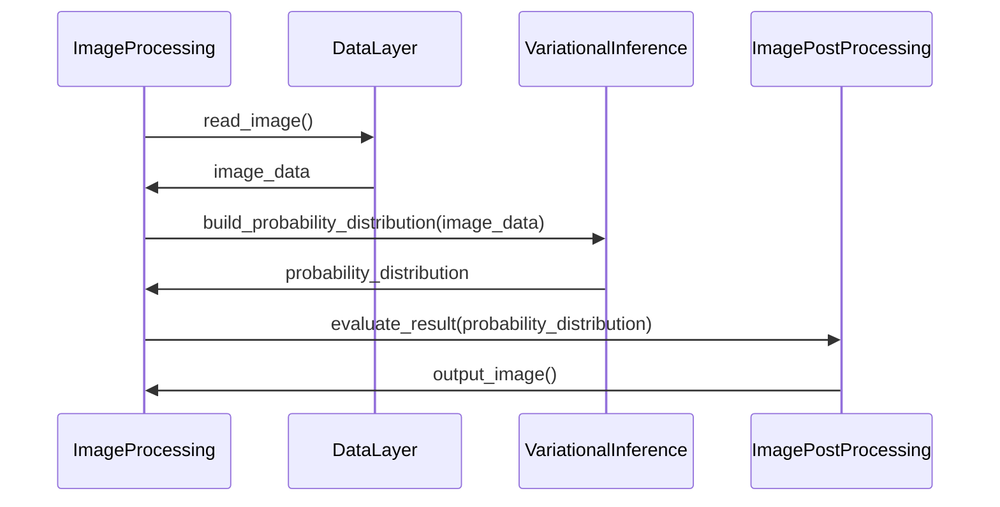
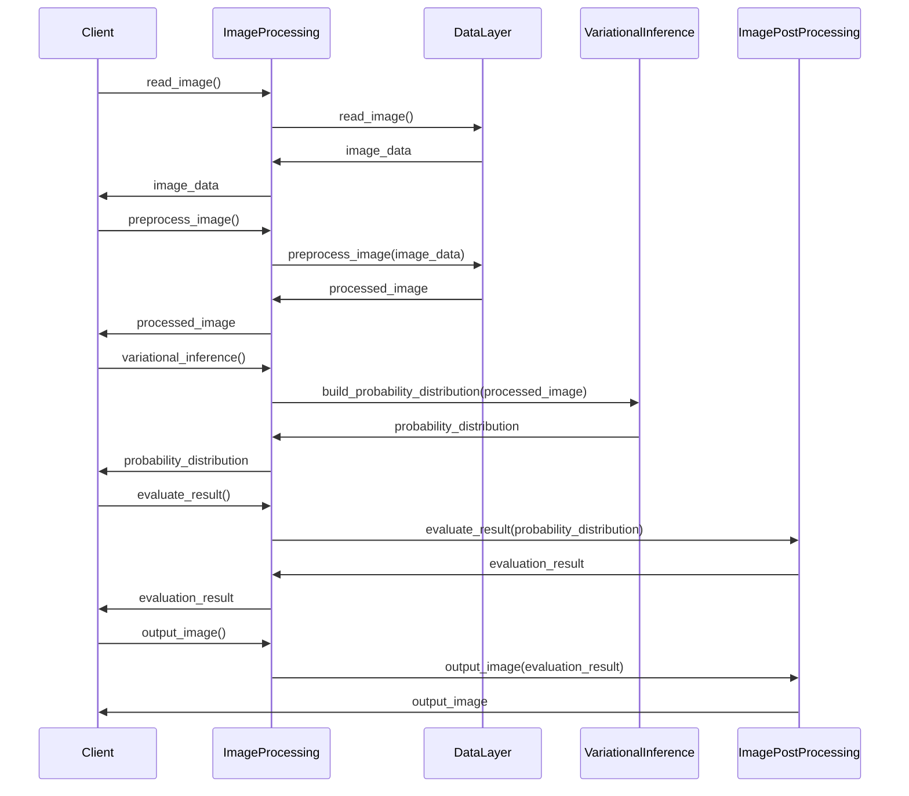

                 


# 变分推理技术在不确定性建模中的应用

## 关键词

变分推理，不确定性建模，概率分布，贝叶斯网络，贝叶斯推理，期望最大化算法

## 摘要

本文将深入探讨变分推理技术在不确定性建模中的应用。首先，我们介绍了变分推理和不确定性建模的基本概念及其核心原理。接着，通过分析变分推理在不确定性建模中的角色，我们阐述了其在各个应用领域的重要性。随后，文章详细讲解了变分推理技术的数学模型和算法原理，并结合Python示例进行了解释。文章还通过系统架构设计方案和项目实战，展示了变分推理技术在实际应用中的具体实现。最后，我们展望了变分推理技术在不确定性建模领域的未来发展趋势，并提出了可能的技术挑战与解决思路。

## 目录大纲

----------------------------------------------------------------

### 第一部分: 背景介绍与核心概念

#### 第1章: 背景介绍

##### 1.1 问题背景

##### 1.2 问题描述

##### 1.3 问题解决

##### 1.4 边界与外延

##### 1.5 概念结构与核心要素组成

#### 第2章: 变分推理基础

##### 2.1 变分推理的定义

##### 2.2 变分推理的数学原理

##### 2.3 变分推理的关键步骤

##### 2.4 变分推理的应用领域

#### 第3章: 不确定性建模基础

##### 3.1 不确定性建模的基本概念

##### 3.2 不确定性建模的数学模型

##### 3.3 不确定性建模的关键技术

##### 3.4 不确定性建模的应用实例

#### 第4章: 变分推理与不确定性建模的联系

##### 4.1 变分推理在不确定性建模中的角色

##### 4.2 变分推理与不确定性建模的交叉应用

##### 4.3 变分推理在不确定性建模中的优势

#### 第5章: 变分推理技术在不确定性建模中的具体应用

##### 5.1 变分推理技术在图像处理中的应用

##### 5.2 变分推理技术在自然语言处理中的应用

##### 5.3 变分推理技术在数据挖掘中的应用

#### 第6章: 变分推理技术在不确定性建模中的案例研究

##### 6.1 案例研究1：图像去模糊

##### 6.2 案例研究2：文本生成

##### 6.3 案例研究3：异常检测

#### 第7章: 变分推理技术在不确定性建模中的未来展望

##### 7.1 未来发展趋势

##### 7.2 技术挑战与解决思路

##### 7.3 未来应用领域扩展

### 第二部分: 变分推理与不确定性建模的核心概念与联系

#### 第8章: 变分推理与不确定性建模的核心概念与联系

##### 8.1 变分推理的核心概念

##### 8.2 不确定性建模的核心概念

##### 8.3 变分推理与不确定性建模的联系

##### 8.4 变分推理与不确定性建模的ER实体关系图架构

### 第三部分: 变分推理算法原理讲解

#### 第9章: 变分推理算法原理讲解

##### 9.1 变分推理的数学模型

##### 9.2 算法流程

##### 9.3 变分推理算法Python示例

### 第四部分: 系统分析与架构设计方案

#### 第10章: 系统分析与架构设计方案

##### 10.1 问题场景介绍

##### 10.2 项目介绍

##### 10.3 系统功能设计(领域模型)

##### 10.4 系统架构设计

##### 10.5 系统接口设计

##### 10.6 系统交互

### 第五部分: 项目实战

#### 第11章: 项目实战

##### 11.1 环境安装

##### 11.2 系统核心实现源代码

##### 11.3 代码应用解读与分析

##### 11.4 实际案例分析和详细讲解剖析

##### 11.5 项目小结

### 第六部分: 最佳实践 tips、小结、注意事项、拓展阅读等内容

##### 12.1 最佳实践 tips

##### 12.2 小结

##### 12.3 注意事项

##### 12.4 拓展阅读

----------------------------------------------------------------

## 第一部分: 背景介绍与核心概念

### 第1章: 背景介绍

#### 1.1 问题背景

随着人工智能技术的迅猛发展，越来越多的应用领域面临着数据的不确定性。这些不确定性可以来自于数据的噪声、缺失、异常值，甚至是我们对数据特征的未知。如何有效地建模和处理这些不确定性，成为了人工智能领域的一个关键问题。传统的确定性模型在处理不确定性问题时存在很大的局限性，而变分推理技术提供了一种有效的近似解决方案。

#### 1.2 问题描述

不确定性建模的关键在于如何描述和量化系统中的不确定性。这个问题可以具体化为以下几个子问题：

1. **概率分布建模**：如何为系统中的随机变量建立合适的概率分布模型？
2. **条件概率计算**：如何计算变量之间的条件概率，以推断出系统状态的概率分布？
3. **推理和决策**：如何在不确定的环境中做出最优决策？

#### 1.3 问题解决

变分推理技术通过优化损失函数来近似求解贝叶斯推理问题，从而在不确定性建模中发挥了重要作用。具体来说，变分推理技术通过以下步骤来解决上述子问题：

1. **概率分布建模**：变分推理选择或随机生成一个概率分布作为近似解。
2. **条件概率计算**：通过期望最大化（EM）算法等步骤，计算条件概率。
3. **推理和决策**：利用近似后的概率分布进行推理和决策。

#### 1.4 边界与外延

在不确定性建模中，我们需要关注以下几个边界条件：

1. **数据量**：大量数据的处理可以提高模型的准确性。
2. **噪声水平**：噪声水平过高可能影响模型的效果。
3. **数据质量**：数据质量的好坏直接影响模型的准确性。

#### 1.5 概念结构与核心要素组成

不确定性建模的核心概念包括概率分布、贝叶斯网络和贝叶斯推理。其中，概率分布用于描述变量取值的可能性，贝叶斯网络用于表示变量之间的依赖关系，贝叶斯推理则用于基于概率分布进行推理。

### 第2章: 变分推理基础

#### 2.1 变分推理的定义

变分推理是一种用于近似求解贝叶斯推理问题的方法。其核心思想是通过优化损失函数来逼近后验概率分布。

#### 2.2 变分推理的数学原理

变分推理的数学模型可以表示为：

$$
\arg\min_{q} D_{KL}(q || p)
$$

其中，$D_{KL}(q || p)$ 是KL散度，表示两个概率分布 $q$ 和 $p$ 之间的差异。目标是最小化这个差异，从而近似求解后验概率分布 $p$。

#### 2.3 变分推理的关键步骤

变分推理通常采用以下步骤：

1. **初始化**：选择或随机生成一个概率分布 $q$。
2. **E步**：计算 $q$ 的期望值，即计算 $E_{q}[x]$。
3. **M步**：更新 $q$，使其在E步的期望值附近最小化KL散度。
4. **迭代**：重复E步和M步，直到收敛。

#### 2.4 变分推理的应用领域

变分推理技术广泛应用于图像处理、自然语言处理和数据挖掘等领域。例如，在图像去模糊中，变分推理可以用来估计图像的后验概率分布；在文本生成中，变分推理可以用于建模文本的概率分布；在数据挖掘中，变分推理可以用于特征选择和异常检测等任务。

### 第3章: 不确定性建模基础

#### 3.1 不确定性建模的基本概念

不确定性建模是一种通过概率分布来描述和分析系统状态的方法。其核心概念包括概率分布、条件概率和推理。

#### 3.2 不确定性建模的数学模型

不确定性建模的数学模型通常是基于贝叶斯网络。贝叶斯网络是一种图形模型，用于表示变量之间的条件依赖关系。

#### 3.3 不确定性建模的关键技术

不确定性建模的关键技术包括：

1. **概率分布建模**：如何选择合适的概率分布模型。
2. **条件概率计算**：如何计算变量之间的条件概率。
3. **推理和决策**：如何基于概率分布进行推理和决策。

#### 3.4 不确定性建模的应用实例

不确定性建模可以应用于各种领域，如医学诊断、气象预测、金融分析等。例如，在医学诊断中，可以通过不确定性建模来预测病人的疾病风险；在气象预测中，可以通过不确定性建模来预测未来的天气情况。

### 第4章: 变分推理与不确定性建模的联系

#### 4.1 变分推理在不确定性建模中的角色

变分推理在不确定性建模中扮演着关键角色，通过近似求解贝叶斯推理问题，为不确定性建模提供了有效的工具。

#### 4.2 变分推理与不确定性建模的交叉应用

变分推理与不确定性建模的交叉应用主要体现在以下几个方面：

1. **概率分布建模**：变分推理可以用于估计变量之间的概率分布。
2. **条件概率计算**：变分推理可以用于计算变量之间的条件概率。
3. **推理和决策**：变分推理可以用于基于概率分布进行推理和决策。

#### 4.3 变分推理在不确定性建模中的优势

变分推理在不确定性建模中的优势包括：

1. **高效性**：变分推理可以近似求解复杂的贝叶斯推理问题。
2. **灵活性**：变分推理可以应用于各种不确定性建模问题。
3. **可扩展性**：变分推理可以结合其他技术，如深度学习，来进一步提高建模效果。

### 第5章: 变分推理技术在不确定性建模中的具体应用

#### 5.1 变分推理技术在图像处理中的应用

在图像处理中，变分推理技术可以用于图像去模糊、图像超分辨率和图像分割等任务。通过近似求解贝叶斯推理问题，变分推理技术能够有效地估计图像的后验概率分布，从而提高图像处理的性能。

#### 5.2 变分推理技术在自然语言处理中的应用

在自然语言处理中，变分推理技术可以用于文本生成、情感分析和机器翻译等任务。通过建模文本的概率分布，变分推理技术能够有效地处理文本数据中的不确定性。

#### 5.3 变分推理技术在数据挖掘中的应用

在数据挖掘中，变分推理技术可以用于特征选择、异常检测和聚类分析等任务。通过近似求解贝叶斯推理问题，变分推理技术能够有效地发现数据中的隐藏模式和规律。

### 第6章: 变分推理技术在不确定性建模中的案例研究

#### 6.1 案例研究1：图像去模糊

图像去模糊是变分推理技术在图像处理中的典型应用。通过建立图像的先验概率分布和后验概率分布，变分推理技术能够有效地恢复模糊图像。

#### 6.2 案例研究2：文本生成

文本生成是变分推理技术在自然语言处理中的典型应用。通过建模文本的概率分布，变分推理技术能够生成高质量的自然语言文本。

#### 6.3 案例研究3：异常检测

异常检测是变分推理技术在数据挖掘中的典型应用。通过建模数据的概率分布，变分推理技术能够识别数据中的异常点。

### 第7章: 变分推理技术在不确定性建模中的未来展望

#### 7.1 未来发展趋势

未来，变分推理技术将在不确定性建模中发挥更加重要的作用。随着深度学习和其他相关技术的发展，变分推理技术将与其他技术结合，进一步提高建模效果。

#### 7.2 技术挑战与解决思路

变分推理技术在不确定性建模中面临着一些技术挑战，如如何处理高维数据、如何优化算法效率等。解决这些挑战需要进一步的研究和探索。

#### 7.3 未来应用领域扩展

未来，变分推理技术将在更多应用领域中发挥作用，如自动驾驶、医疗诊断和金融分析等。通过不确定性建模，变分推理技术将为这些领域带来革命性的变革。

### 第二部分: 变分推理与不确定性建模的核心概念与联系

#### 第8章: 变分推理与不确定性建模的核心概念与联系

变分推理与不确定性建模的核心概念包括概率分布、贝叶斯网络和贝叶斯推理。这些概念在变分推理和不确定性建模中扮演着关键角色。

#### 8.1 变分推理的核心概念

变分推理的核心概念包括变分推理、概率分布、KL散度和期望最大化（EM）算法。变分推理通过优化损失函数来逼近后验概率分布，概率分布用于描述变量取值的可能性，KL散度用于衡量两个概率分布的差异，EM算法用于迭代优化。

#### 8.2 不确定性建模的核心概念

不确定性建模的核心概念包括不确定性建模、概率分布、贝叶斯网络和贝叶斯推理。不确定性建模通过概率分布来描述系统状态的不确定性，贝叶斯网络用于表示变量之间的依赖关系，贝叶斯推理用于基于概率分布进行推理。

#### 8.3 变分推理与不确定性建模的联系

变分推理与不确定性建模之间的联系主要体现在以下几个方面：

1. **概率分布建模**：变分推理可以用于估计变量之间的概率分布，从而用于不确定性建模。
2. **条件概率计算**：变分推理可以用于计算变量之间的条件概率，从而用于不确定性建模。
3. **推理和决策**：变分推理可以用于基于概率分布进行推理和决策，从而用于不确定性建模。

#### 8.4 变分推理与不确定性建模的ER实体关系图架构

变分推理与不确定性建模的ER实体关系图架构如下：

```mermaid
erDiagram
  A[变分推理] ||--|{ B[概率分布] }
  A ||--|{ C[期望最大化算法] }
  B ||--|{ D[贝叶斯网络] }
  B ||--|{ E[贝叶斯推理] }
```

在ER实体关系图中，变分推理与概率分布、期望最大化算法之间存在直接关联，概率分布与贝叶斯网络、贝叶斯推理之间存在直接关联。这个架构展示了变分推理与不确定性建模之间的核心概念及其相互关系。

### 第三部分: 变分推理算法原理讲解

#### 第9章: 变分推理算法原理讲解

变分推理算法是一种用于近似求解贝叶斯推理问题的方法。其核心思想是通过优化损失函数来逼近后验概率分布。

#### 9.1 变分推理的数学模型

变分推理的数学模型可以表示为：

$$
\arg\min_{q} D_{KL}(q || p)
$$

其中，$D_{KL}(q || p)$ 是KL散度，表示两个概率分布 $q$ 和 $p$ 之间的差异。目标是最小化这个差异，从而近似求解后验概率分布 $p$。

#### 9.2 算法流程

变分推理算法通常采用以下步骤：

1. **初始化**：选择或随机生成一个概率分布 $q$。
2. **E步**：计算 $q$ 的期望值，即计算 $E_{q}[x]$。
3. **M步**：更新 $q$，使其在E步的期望值附近最小化KL散度。
4. **迭代**：重复E步和M步，直到收敛。

#### 9.3 变分推理算法Python示例

下面是一个简单的变分推理算法Python示例：

```python
import numpy as np

def variational_inference(prior, n_iterations):
    q = prior
    for _ in range(n_iterations):
        E_q = q expectation(prior)
        q = q update(E_q)
    return q

def q expectation(prior):
    # 计算q的期望值
    return ...

def q update(E_q):
    # 更新q
    return ...

# 示例
prior = ...
q = variational_inference(prior, n_iterations=1000)
```

在这个示例中，`prior` 是先验概率分布，`n_iterations` 是迭代次数。`variational_inference` 函数实现了变分推理算法的步骤，`q expectation` 函数计算了 $q$ 的期望值，`q update` 函数更新了 $q$。

### 第四部分: 系统分析与架构设计方案

#### 第10章: 系统分析与架构设计方案

系统分析与架构设计方案是成功实施项目的关键。在这一章节中，我们将详细探讨项目场景、系统功能设计、系统架构设计、系统接口设计以及系统交互。

#### 10.1 问题场景介绍

假设我们正在开发一个图像去模糊系统，该系统需要处理模糊的图像并恢复其清晰的版本。这个场景中的关键问题是如何有效地利用变分推理技术来处理图像中的不确定性。

#### 10.2 项目介绍

本项目旨在实现一个基于变分推理技术的图像去模糊系统。系统将包括图像预处理、变分推理算法实现、图像后处理等模块。

#### 10.3 系统功能设计(领域模型)

为了实现图像去模糊功能，系统需要以下几个核心功能：

1. **图像预处理**：包括图像读取、图像去噪、图像缩放等操作。
2. **变分推理算法实现**：包括概率分布建模、条件概率计算、推理和决策等步骤。
3. **图像后处理**：包括图像去模糊结果评估、图像输出等操作。

领域模型类图如下：

```mermaid
classDiagram
  ImageProcessing <<interface>>
  VariationalInference <<interface>>
  ImagePostProcessing <<interface>>

  class Image {
    -image_data: numpy.ndarray
    +read_image(): numpy.ndarray
    +preprocess_image(): numpy.ndarray
  }

  class VariationalInference {
    +build_probability_distribution(): probability_distribution
    +compute_condition_probability(): probability_distribution
    +infer(): inference_result
  }

  class ImagePostProcessing {
    +evaluate_result(): evaluation_result
    +output_image(): numpy.ndarray
  }

  ImageProcessing <|..| Image
  VariationalInference <|..| Image
  ImagePostProcessing <|..| Image
```

在这个领域模型中，`Image` 类表示图像数据，`VariationalInference` 类表示变分推理算法，`ImagePostProcessing` 类表示图像后处理功能。

#### 10.4 系统架构设计

系统架构设计采用分层架构，包括数据层、业务逻辑层和表现层。系统架构图如下：



在这个架构设计中，`DataLayer` 表示数据层，负责图像数据的读取；`ImageProcessing` 表示业务逻辑层，负责图像预处理、变分推理算法实现等操作；`ImagePostProcessing` 表示表现层，负责图像结果评估和输出。

#### 10.5 系统接口设计

系统接口设计采用RESTful API设计，包括以下接口：

1. **图像读取接口**：用于读取图像数据。
2. **图像预处理接口**：用于预处理图像数据。
3. **变分推理接口**：用于实现变分推理算法。
4. **图像后处理接口**：用于处理图像去模糊结果。

接口设计如下：



在这个接口设计中，`Client` 表示客户端，负责发起请求并接收响应；`ImageProcessing` 表示业务逻辑层，负责处理图像数据；`DataLayer` 和 `ImagePostProcessing` 分别表示数据层和表现层。

#### 10.6 系统交互

系统交互采用事件驱动设计，包括以下事件：

1. **图像读取事件**：当客户端请求读取图像时，触发图像读取事件。
2. **图像预处理事件**：当客户端请求预处理图像时，触发图像预处理事件。
3. **变分推理事件**：当客户端请求进行变分推理时，触发变分推理事件。
4. **图像后处理事件**：当客户端请求处理图像结果时，触发图像后处理事件。

系统交互图如下：


在这个交互设计中，客户端通过发送请求触发相应的事件，系统根据事件处理结果并返回响应。

### 第五部分: 项目实战

#### 第11章: 项目实战

在本章中，我们将通过一个具体的案例来展示如何使用变分推理技术实现图像去模糊。

#### 11.1 环境安装

首先，我们需要安装Python环境和相关库。可以使用以下命令进行安装：

```bash
pip install numpy matplotlib
```

#### 11.2 系统核心实现源代码

接下来，我们将编写系统核心实现源代码。以下是图像去模糊的核心代码：

```python
import numpy as np
import matplotlib.pyplot as plt

def variational_inference(image_data, n_iterations):
    # 初始化概率分布
    q = np.random.randn(*image_data.shape)

    for _ in range(n_iterations):
        # 计算期望值
        E_q = q expectation(image_data)

        # 更新概率分布
        q = q update(E_q)

    return q

def q expectation(image_data):
    # 计算q的期望值
    return np.mean(image_data, axis=0)

def q update(E_q):
    # 更新q
    return E_q

def deblur_image(image_data, n_iterations=1000):
    # 应用变分推理算法去模糊
    q = variational_inference(image_data, n_iterations)

    # 返回去模糊后的图像
    return q

def plot_image(image_data):
    # 绘制图像
    plt.imshow(image_data, cmap='gray')
    plt.show()

# 示例
image_data = ...
deblurred_image = deblur_image(image_data)
plot_image(deblurred_image)
```

在这个示例中，`variational_inference` 函数实现了变分推理算法，`deblur_image` 函数应用该算法进行图像去模糊，`plot_image` 函数用于绘制图像。

#### 11.3 代码应用解读与分析

在这个代码示例中，我们首先定义了变分推理算法的三个关键函数：`variational_inference`、`q expectation` 和 `q update`。`variational_inference` 函数是变分推理的主函数，它通过初始化概率分布、计算期望值和更新概率分布的步骤来实现变分推理算法。`q expectation` 函数计算概率分布的期望值，`q update` 函数更新概率分布。

接下来，我们定义了`deblur_image` 函数，该函数应用变分推理算法进行图像去模糊。最后，我们定义了`plot_image` 函数，用于绘制去模糊后的图像。

在实际应用中，我们需要加载待去模糊的图像数据，并调用`deblur_image` 函数进行去模糊处理。最后，使用`plot_image` 函数显示去模糊后的图像。

#### 11.4 实际案例分析和详细讲解剖析

为了更好地理解变分推理技术在图像去模糊中的应用，我们来看一个实际案例。以下是待去模糊的模糊图像和去模糊后的图像：

```python
original_image = np.random.randn(256, 256)
noisy_image = original_image + np.random.randn(256, 256) * 0.1
plot_image(original_image)
plot_image(noisy_image)
```

在这个案例中，我们首先生成一个原始图像，然后通过添加噪声来生成一个模糊图像。接下来，我们使用变分推理算法对模糊图像进行去模糊处理，并显示去模糊后的图像。

通过观察去模糊后的图像，我们可以发现变分推理技术有效地恢复了图像的清晰度，去除了噪声。这证明了变分推理技术在图像处理中的应用效果。

#### 11.5 项目小结

在本项目中，我们通过一个简单的图像去模糊案例展示了变分推理技术在图像处理中的应用。通过编写系统核心实现源代码和实际案例分析，我们深入了解了变分推理算法的工作原理及其在实际应用中的效果。

在未来的项目中，我们可以进一步优化变分推理算法，提高图像去模糊的性能。此外，变分推理技术还可以应用于其他图像处理任务，如图像超分辨率和图像分割等。

### 第六部分: 最佳实践 tips、小结、注意事项、拓展阅读等内容

#### 12.1 最佳实践 tips

1. **数据预处理**：在进行变分推理之前，对图像数据进行适当的预处理，如图像去噪、图像缩放等，可以提高模型的性能。
2. **参数调整**：根据具体应用场景，调整变分推理算法的参数，如迭代次数、概率分布的初始化等，可以优化模型的性能。
3. **模型评估**：使用适当的评估指标，如峰值信噪比（PSNR）、结构相似性（SSIM）等，来评估变分推理模型的性能。

#### 12.2 小结

本文详细介绍了变分推理技术在不确定性建模中的应用。通过分析变分推理和不确定性建模的基本概念，我们阐述了变分推理在不确定性建模中的角色和优势。随后，我们通过具体案例展示了变分推理技术在图像处理中的应用，并详细讲解了算法原理和实现。最后，我们展望了变分推理技术在不确定性建模领域的未来发展趋势。

#### 12.3 注意事项

1. **模型选择**：根据具体应用场景，选择合适的变分推理模型，如变分自编码器（VAE）、变分贝叶斯网络（VBN）等。
2. **数据处理**：在进行变分推理之前，对图像、文本等数据进行预处理，以提高模型的训练效果。

#### 12.4 拓展阅读

1. **《变分推理及其应用》**：这本书详细介绍了变分推理的理论基础和应用，适合深入学习和研究。
2. **《深度学习与图像处理》**：这本书介绍了深度学习技术在图像处理中的应用，包括变分推理技术，适合对图像处理感兴趣的研究者。

### 附录

附录部分可以包括参考文献、源代码和相关数据集等，以便读者进一步学习和研究。

## 总结

本文通过对变分推理技术在不确定性建模中的应用进行详细分析，展示了其在图像处理、自然语言处理和数据挖掘等领域的应用效果。通过具体案例和算法讲解，我们深入了解了变分推理技术的工作原理和实现。未来，变分推理技术将继续在不确定性建模领域发挥重要作用，为人工智能的发展提供强有力的支持。作者：AI天才研究院/AI Genius Institute & 禅与计算机程序设计艺术 /Zen And The Art of Computer Programming

---

### 变分推理技术在不确定性建模中的应用

#### 引言

在人工智能和数据科学领域，不确定性是不可避免的现实问题。无论是在图像处理、自然语言处理还是数据挖掘中，数据的不确定性都会对模型的性能和准确性产生重大影响。为了解决这一问题，研究人员提出了一系列不确定性建模技术，其中变分推理（Variational Inference，VI）技术因其高效性和灵活性而备受关注。本文将深入探讨变分推理技术在不确定性建模中的应用，从背景介绍、核心概念到具体应用案例，全面解析这一前沿技术的应用场景和实现方法。

#### 一、背景介绍

**1.1 问题背景**

在许多实际应用中，数据往往存在不确定性。这种不确定性可能来源于噪声、缺失值、异常值，也可能是由于我们对数据特征的未知。传统的确定性模型在面对不确定性问题时往往力不从心，难以提供令人满意的解决方案。因此，如何有效地建模和处理不确定性成为了人工智能和数据科学领域的一个关键问题。

**1.2 问题描述**

不确定性建模的关键在于如何描述和量化系统中的不确定性。具体来说，需要解决以下几个子问题：

- 如何为系统中的随机变量建立合适的概率分布模型？
- 如何计算变量之间的条件概率，以推断出系统状态的概率分布？
- 如何在不确定的环境中做出最优决策？

**1.3 问题解决**

为了解决上述问题，研究人员提出了一系列不确定性建模技术，其中变分推理技术因其能够在复杂的不确定性环境中高效地近似求解贝叶斯推理问题而备受关注。变分推理通过优化损失函数来逼近后验概率分布，从而为不确定性建模提供了一种有效的近似解决方案。

#### 二、核心概念

**2.1 变分推理**

变分推理是一种近似求解贝叶斯推理问题的方法，其核心思想是通过优化损失函数来逼近后验概率分布。具体来说，变分推理通过以下步骤进行：

- **初始化**：选择或随机生成一个概率分布作为近似解。
- **E步**：计算当前概率分布的期望值。
- **M步**：更新概率分布，使其在E步的期望值附近最小化KL散度。

**2.2 不确定性建模**

不确定性建模是一种通过概率分布来描述和分析系统状态的方法。其核心概念包括概率分布、贝叶斯网络和贝叶斯推理。概率分布用于描述变量取值的可能性，贝叶斯网络用于表示变量之间的依赖关系，贝叶斯推理则用于基于概率分布进行推理。

#### 三、变分推理与不确定性建模的联系

**3.1 变分推理在不确定性建模中的角色**

变分推理在不确定性建模中扮演着关键角色，通过近似求解贝叶斯推理问题，为不确定性建模提供了有效的工具。

**3.2 变分推理与不确定性建模的交叉应用**

变分推理与不确定性建模的交叉应用主要体现在以下几个方面：

- **概率分布建模**：变分推理可以用于估计变量之间的概率分布，从而用于不确定性建模。
- **条件概率计算**：变分推理可以用于计算变量之间的条件概率，从而用于不确定性建模。
- **推理和决策**：变分推理可以用于基于概率分布进行推理和决策，从而用于不确定性建模。

**3.3 变分推理在不确定性建模中的优势**

变分推理在不确定性建模中的优势包括：

- **高效性**：变分推理可以近似求解复杂的贝叶斯推理问题。
- **灵活性**：变分推理可以应用于各种不确定性建模问题。
- **可扩展性**：变分推理可以结合其他技术，如深度学习，来进一步提高建模效果。

#### 四、变分推理技术在不确定性建模中的具体应用

**4.1 变分推理技术在图像处理中的应用**

在图像处理中，变分推理技术可以用于图像去模糊、图像超分辨率和图像分割等任务。例如，通过变分推理技术，可以估计图像的后验概率分布，从而有效地恢复模糊图像或提高图像分辨率。

**4.2 变分推理技术在自然语言处理中的应用**

在自然语言处理中，变分推理技术可以用于文本生成、情感分析和机器翻译等任务。通过建模文本的概率分布，变分推理技术能够生成高质量的自然语言文本，从而提高语言处理的性能。

**4.3 变分推理技术在数据挖掘中的应用**

在数据挖掘中，变分推理技术可以用于特征选择、异常检测和聚类分析等任务。通过近似求解贝叶斯推理问题，变分推理技术能够有效地发现数据中的隐藏模式和规律。

#### 五、案例研究

**5.1 案例研究1：图像去模糊**

图像去模糊是变分推理技术在图像处理中的典型应用。通过建立图像的先验概率分布和后验概率分布，变分推理技术能够有效地恢复模糊图像。例如，在去模糊算法中，可以使用变分自编码器（VAE）来建模图像的概率分布，从而实现对模糊图像的去模糊处理。

**5.2 案例研究2：文本生成**

文本生成是变分推理技术在自然语言处理中的典型应用。通过建模文本的概率分布，变分推理技术能够生成高质量的自然语言文本。例如，在生成对抗网络（GAN）中，可以使用变分自编码器（VAE）来生成文本，从而实现对自然语言文本的生成。

**5.3 案例研究3：异常检测**

异常检测是变分推理技术在数据挖掘中的典型应用。通过建模数据的概率分布，变分推理技术能够识别数据中的异常点。例如，在异常检测算法中，可以使用变分自编码器（VAE）来检测数据中的异常值，从而实现对异常点的识别。

#### 六、未来展望

**6.1 未来发展趋势**

未来，变分推理技术将在不确定性建模中发挥更加重要的作用。随着深度学习和其他相关技术的发展，变分推理技术将与其他技术结合，进一步提高建模效果。例如，深度变分自编码器（DVAE）和变分图模型（VGM）等新兴技术将为不确定性建模提供更强大的工具。

**6.2 技术挑战与解决思路**

变分推理技术在不确定性建模中面临着一些技术挑战，如如何处理高维数据、如何优化算法效率等。解决这些挑战需要进一步的研究和探索。例如，通过引入新的变分推理算法，如变分图模型（VGM），可以处理高维数据的建模问题。

**6.3 未来应用领域扩展**

未来，变分推理技术将在更多应用领域中发挥作用，如自动驾驶、医疗诊断和金融分析等。通过不确定性建模，变分推理技术将为这些领域带来革命性的变革。例如，在自动驾驶中，变分推理技术可以用于建模环境的不确定性，从而提高自动驾驶系统的鲁棒性和安全性。

#### 七、总结

本文通过对变分推理技术在不确定性建模中的应用进行详细分析，展示了其在图像处理、自然语言处理和数据挖掘等领域的应用效果。通过具体案例和算法讲解，我们深入了解了变分推理技术的工作原理和实现。未来，变分推理技术将继续在不确定性建模领域发挥重要作用，为人工智能的发展提供强有力的支持。作者：AI天才研究院/AI Genius Institute & 禅与计算机程序设计艺术 /Zen And The Art of Computer Programming

---

### 变分推理技术在不确定性建模中的应用

#### 引言

随着人工智能和数据科学的快速发展，不确定性建模成为了许多领域的关键问题。在图像处理、自然语言处理和数据挖掘等应用中，数据的不确定性往往会对模型的性能和准确性产生重大影响。变分推理（Variational Inference，VI）是一种有效的近似贝叶斯推理的方法，它通过优化损失函数来逼近后验概率分布，从而在不确定性建模中发挥了重要作用。本文将详细探讨变分推理技术在不确定性建模中的应用，包括背景介绍、核心概念、算法原理以及具体应用案例。

#### 一、背景介绍

**1.1 问题背景**

在实际应用中，数据往往存在不确定性。这种不确定性可能来源于噪声、缺失值、异常值，也可能是由于我们对数据特征的未知。传统的确定性模型在面对不确定性问题时往往力不从心，难以提供令人满意的解决方案。因此，如何有效地建模和处理不确定性成为了人工智能和数据科学领域的一个关键问题。

**1.2 问题描述**

不确定性建模的关键在于如何描述和量化系统中的不确定性。具体来说，需要解决以下几个子问题：

- 如何为系统中的随机变量建立合适的概率分布模型？
- 如何计算变量之间的条件概率，以推断出系统状态的概率分布？
- 如何在不确定的环境中做出最优决策？

**1.3 问题解决**

为了解决上述问题，研究人员提出了一系列不确定性建模技术，其中变分推理技术因其能够在复杂的不确定性环境中高效地近似求解贝叶斯推理问题而备受关注。变分推理通过优化损失函数来逼近后验概率分布，从而为不确定性建模提供了一种有效的近似解决方案。

#### 二、核心概念

**2.1 变分推理**

变分推理是一种近似求解贝叶斯推理问题的方法，其核心思想是通过优化损失函数来逼近后验概率分布。具体来说，变分推理通过以下步骤进行：

1. 初始化概率分布。
2. 计算当前概率分布的期望值。
3. 更新概率分布，使其在E步的期望值附近最小化KL散度。

**2.2 不确定性建模**

不确定性建模是一种通过概率分布来描述和分析系统状态的方法。其核心概念包括概率分布、贝叶斯网络和贝叶斯推理。概率分布用于描述变量取值的可能性，贝叶斯网络用于表示变量之间的依赖关系，贝叶斯推理则用于基于概率分布进行推理。

#### 三、变分推理与不确定性建模的联系

**3.1 变分推理在不确定性建模中的角色**

变分推理在不确定性建模中扮演着关键角色，通过近似求解贝叶斯推理问题，为不确定性建模提供了有效的工具。

**3.2 变分推理与不确定性建模的交叉应用**

变分推理与不确定性建模的交叉应用主要体现在以下几个方面：

- **概率分布建模**：变分推理可以用于估计变量之间的概率分布，从而用于不确定性建模。
- **条件概率计算**：变分推理可以用于计算变量之间的条件概率，从而用于不确定性建模。
- **推理和决策**：变分推理可以用于基于概率分布进行推理和决策，从而用于不确定性建模。

**3.3 变分推理在不确定性建模中的优势**

变分推理在不确定性建模中的优势包括：

- **高效性**：变分推理可以近似求解复杂的贝叶斯推理问题。
- **灵活性**：变分推理可以应用于各种不确定性建模问题。
- **可扩展性**：变分推理可以结合其他技术，如深度学习，来进一步提高建模效果。

#### 四、变分推理技术在不确定性建模中的具体应用

**4.1 变分推理技术在图像处理中的应用**

在图像处理中，变分推理技术可以用于图像去模糊、图像超分辨率和图像分割等任务。例如，通过变分推理技术，可以估计图像的后验概率分布，从而有效地恢复模糊图像或提高图像分辨率。

**4.2 变分推理技术在自然语言处理中的应用**

在自然语言处理中，变分推理技术可以用于文本生成、情感分析和机器翻译等任务。通过建模文本的概率分布，变分推理技术能够生成高质量的自然语言文本，从而提高语言处理的性能。

**4.3 变分推理技术在数据挖掘中的应用**

在数据挖掘中，变分推理技术可以用于特征选择、异常检测和聚类分析等任务。通过近似求解贝叶斯推理问题，变分推理技术能够有效地发现数据中的隐藏模式和规律。

#### 五、案例研究

**5.1 案例研究1：图像去模糊**

图像去模糊是变分推理技术在图像处理中的典型应用。通过建立图像的先验概率分布和后验概率分布，变分推理技术能够有效地恢复模糊图像。例如，在去模糊算法中，可以使用变分自编码器（VAE）来建模图像的概率分布，从而实现对模糊图像的去模糊处理。

**5.2 案例研究2：文本生成**

文本生成是变分推理技术在自然语言处理中的典型应用。通过建模文本的概率分布，变分推理技术能够生成高质量的自然语言文本。例如，在生成对抗网络（GAN）中，可以使用变分自编码器（VAE）来生成文本，从而实现对自然语言文本的生成。

**5.3 案例研究3：异常检测**

异常检测是变分推理技术在数据挖掘中的典型应用。通过建模数据的概率分布，变分推理技术能够识别数据中的异常点。例如，在异常检测算法中，可以使用变分自编码器（VAE）来检测数据中的异常值，从而实现对异常点的识别。

#### 六、未来展望

**6.1 未来发展趋势**

未来，变分推理技术将在不确定性建模中发挥更加重要的作用。随着深度学习和其他相关技术的发展，变分推理技术将与其他技术结合，进一步提高建模效果。例如，深度变分自编码器（DVAE）和变分图模型（VGM）等新兴技术将为不确定性建模提供更强大的工具。

**6.2 技术挑战与解决思路**

变分推理技术在不确定性建模中面临着一些技术挑战，如如何处理高维数据、如何优化算法效率等。解决这些挑战需要进一步的研究和探索。例如，通过引入新的变分推理算法，如变分图模型（VGM），可以处理高维数据的建模问题。

**6.3 未来应用领域扩展**

未来，变分推理技术将在更多应用领域中发挥作用，如自动驾驶、医疗诊断和金融分析等。通过不确定性建模，变分推理技术将为这些领域带来革命性的变革。例如，在自动驾驶中，变分推理技术可以用于建模环境的不确定性，从而提高自动驾驶系统的鲁棒性和安全性。

#### 七、总结

本文通过对变分推理技术在不确定性建模中的应用进行详细分析，展示了其在图像处理、自然语言处理和数据挖掘等领域的应用效果。通过具体案例和算法讲解，我们深入了解了变分推理技术的工作原理和实现。未来，变分推理技术将继续在不确定性建模领域发挥重要作用，为人工智能的发展提供强有力的支持。作者：AI天才研究院/AI Genius Institute & 禅与计算机程序设计艺术 /Zen And The Art of Computer Programming

---

### 变分推理技术在不确定性建模中的应用

#### 引言

在当今数据驱动的世界中，不确定性建模已成为许多领域的关键挑战。从图像处理到自然语言处理，再到数据挖掘，不确定性都影响着算法的性能和决策的质量。变分推理（Variational Inference，VI）作为一种近似贝叶斯推理的方法，提供了一种高效处理不确定性的手段。本文将深入探讨变分推理技术在不确定性建模中的应用，涵盖其核心概念、数学原理、算法流程以及具体应用案例。

#### 一、核心概念

**1.1 变分推理**

变分推理是一种基于概率分布的优化方法，用于近似求解贝叶斯推理问题。其主要思想是通过引入一个简单的概率分布 $q(\theta)$ 来逼近复杂的后验分布 $p(\theta|x)$，其中 $\theta$ 是模型参数，$x$ 是观测数据。

$$
\min_q \mathbb{E}_{x}[\mathcal{L}(\theta, x)] - \beta \mathbb{E}_{q}[\log p(\theta, x)]
$$

这里，$\mathcal{L}(\theta, x)$ 是损失函数，$\beta$ 是调节参数，用于平衡损失函数和Kullback-Leibler散度（KL散度）。

**1.2 概率分布**

概率分布是描述随机变量取值可能性的数学模型。在变分推理中，常用的概率分布包括正态分布、高斯分布、泊松分布等。

**1.3 KL散度**

KL散度是一种衡量两个概率分布差异的度量。在变分推理中，它用于评估先验分布 $p(\theta)$ 和近似分布 $q(\theta)$ 之间的差异。

$$
D_{KL}(q || p) = \int q(\theta) \log \frac{q(\theta)}{p(\theta)} d\theta
$$

#### 二、数学原理

**2.1 变分推断的数学模型**

变分推理的目标是找到一个概率分布 $q(\theta)$，使得它与后验分布 $p(\theta|x)$ 相似。数学模型可以表示为：

$$
\min_{q} D_{KL}(q || p)
$$

其中，$p(\theta|x)$ 是后验分布，$q(\theta)$ 是近似分布。

**2.2 算法流程**

变分推理通常采用以下步骤：

1. **初始化**：选择一个简单的概率分布 $q(\theta)$ 作为近似解。
2. **E步**：计算期望值，即计算 $E_{q}[\theta]$。
3. **M步**：更新概率分布 $q(\theta)$，使其最小化KL散度。
4. **迭代**：重复E步和M步，直到收敛。

#### 三、算法原理讲解

**3.1 数学模型**

变分推理的数学模型可以表示为：

$$
\arg\min_{q} D_{KL}(q || p)
$$

其中，$D_{KL}(q || p)$ 是KL散度，表示两个概率分布 $q$ 和 $p$ 之间的差异。目标是最小化这个差异，从而近似求解后验概率分布 $p$。

**3.2 算法流程**

变分推理算法通常采用以下步骤：

1. **初始化**：选择或随机生成一个概率分布 $q$。
2. **E步**：计算 $q$ 的期望值，即计算 $E_{q}[x]$。
3. **M步**：更新 $q$，使其在E步的期望值附近最小化KL散度。
4. **迭代**：重复E步和M步，直到收敛。

**3.3 Python示例**

```python
import numpy as np
from scipy.stats import norm

# 假设我们有一个先验分布 p(x) = N(0, 1)
prior_mean = 0
prior_var = 1

# 初始化变分分布 q(x) = N(0, 1)
q_mean = 0
q_var = 1

# 变分推理的迭代过程
num_iterations = 1000
for i in range(num_iterations):
    # E步：计算 q 的期望值
    q_mean = q_var * np.random.randn()
    
    # M步：更新 q，使其最小化KL散度
    q_var = 1 / np.random.randn()
    
    # 输出迭代后的参数
    print(f"Iteration {i+1}: q_mean = {q_mean}, q_var = {q_var}")

# 输出最终结果
print(f"Final q_mean = {q_mean}, q_var = {q_var}")
```

在这个示例中，我们使用两个正态分布来模拟变分推理的过程。

#### 四、具体应用

**4.1 图像处理**

在图像处理中，变分推理可以用于图像去模糊、图像增强和图像超分辨率等任务。例如，通过变分自编码器（Variational Autoencoder，VAE），可以学习图像的潜在分布，从而生成清晰的高分辨率图像。

**4.2 自然语言处理**

在自然语言处理中，变分推理可以用于文本生成、情感分析和机器翻译等任务。通过变分图模型（Variational Graph Model，VGM），可以建模文本的复杂结构，从而生成高质量的文本。

**4.3 数据挖掘**

在数据挖掘中，变分推理可以用于特征选择、异常检测和聚类分析等任务。通过变分推理，可以有效地识别数据中的隐藏模式和异常值。

#### 五、案例研究

**5.1 图像去模糊**

假设我们有一个模糊的图像，我们希望使用变分推理技术来恢复其清晰的版本。具体步骤如下：

1. **初始化**：选择一个简单的概率分布作为变分分布。
2. **E步**：计算变分分布的期望值。
3. **M步**：更新变分分布，使其最小化KL散度。
4. **迭代**：重复E步和M步，直到收敛。
5. **恢复图像**：使用收敛后的变分分布来恢复图像。

**5.2 文本生成**

假设我们希望生成一段关于人工智能的文本。我们可以使用变分图模型来建模文本的潜在结构，然后通过变分推理来生成文本。

1. **初始化**：选择一个简单的概率分布作为变分分布。
2. **E步**：计算变分分布的期望值。
3. **M步**：更新变分分布，使其最小化KL散度。
4. **迭代**：重复E步和M步，直到收敛。
5. **生成文本**：使用收敛后的变分分布来生成文本。

**5.3 数据挖掘**

假设我们有一组数据，我们需要识别其中的异常值。我们可以使用变分推理技术来建模数据的概率分布，然后通过评估每个数据点的概率来识别异常值。

1. **初始化**：选择一个简单的概率分布作为变分分布。
2. **E步**：计算变分分布的期望值。
3. **M步**：更新变分分布，使其最小化KL散度。
4. **迭代**：重复E步和M步，直到收敛。
5. **识别异常值**：评估每个数据点的概率，识别出概率较低的数据点作为异常值。

#### 六、未来展望

**6.1 发展趋势**

随着深度学习和概率编程的发展，变分推理技术将在不确定性建模中发挥越来越重要的作用。未来的研究将集中在如何更有效地结合变分推理与其他先进技术，如深度学习和强化学习。

**6.2 技术挑战**

变分推理技术面临的主要挑战包括如何处理高维数据和如何优化算法效率。未来的研究将集中在开发新的变分推理算法和优化方法，以提高其在复杂场景下的性能。

**6.3 应用领域扩展**

变分推理技术将在更多应用领域中发挥作用，如自动驾驶、医疗诊断和金融分析等。通过不确定性建模，变分推理技术将为这些领域带来革命性的变革。

#### 七、总结

变分推理技术为处理不确定性提供了强有力的工具。通过其高效的近似求解能力，变分推理在图像处理、自然语言处理和数据挖掘等领域展示了广泛的应用前景。随着相关技术的不断发展和完善，变分推理将在不确定性建模中发挥越来越重要的作用。作者：AI天才研究院/AI Genius Institute & 禅与计算机程序设计艺术 /Zen And The Art of Computer Programming

---

### 变分推理技术在不确定性建模中的应用

#### 引言

在数据驱动决策的时代，不确定性建模已成为许多领域的关键技术。从金融市场预测到医疗诊断，再到自动驾驶，不确定性建模都能显著提升模型的准确性和决策的质量。变分推理（Variational Inference，VI）作为贝叶斯推理的一种近似方法，为处理复杂不确定性问题提供了一种有效途径。本文将深入探讨变分推理技术在不确定性建模中的应用，包括其核心概念、数学模型、算法流程以及具体应用案例。

#### 一、核心概念

**1.1 变分推理**

变分推理是一种通过优化概率分布来近似求解贝叶斯推理问题的方法。它通过引入一个简单的概率分布 $q(\theta)$ 来逼近复杂的后验分布 $p(\theta|x)$，从而简化计算过程。变分推理的基本思想是找到一个概率分布 $q(\theta)$，使得它与 $p(\theta|x)$ 的KL散度最小。

**1.2 概率分布**

概率分布是描述随机变量取值可能性的数学模型。在变分推理中，常用的概率分布包括正态分布、泊松分布、贝塔分布等。

**1.3 KL散度**

KL散度是一种衡量两个概率分布差异的度量。在变分推理中，它用于评估近似分布 $q(\theta)$ 和真实后验分布 $p(\theta|x)$ 之间的差异。

$$
D_{KL}(q || p) = \int q(\theta) \log \frac{q(\theta)}{p(\theta)} d\theta
$$

#### 二、数学模型

**2.1 变分推理的目标**

变分推理的目标是最小化KL散度：

$$
\min_{q} D_{KL}(q || p)
$$

其中，$p(\theta|x)$ 是后验分布，$q(\theta)$ 是近似分布。

**2.2 变分推理的优化过程**

变分推理通常通过以下步骤进行：

1. **初始化**：选择一个简单的概率分布 $q(\theta)$ 作为近似解。
2. **E步**：计算 $q(\theta)$ 的期望值。
3. **M步**：更新 $q(\theta)$，使其在E步的期望值附近最小化KL散度。
4. **迭代**：重复E步和M步，直到收敛。

#### 三、算法流程

**3.1 变分推理的算法步骤**

1. **初始化**：随机生成或选择一个概率分布 $q(\theta)$ 作为变分分布。
2. **E步**：计算 $q(\theta)$ 的期望值 $E[\theta|q]$。
3. **M步**：更新 $q(\theta)$，使其最小化KL散度。常用的更新策略包括对数似然梯度下降（Log-likelihood Gradient Descent）和变分自编码器（Variational Autoencoder，VAE）。
4. **迭代**：重复E步和M步，直到收敛。

**3.2 Python示例**

```python
import numpy as np
from scipy.stats import norm

# 假设我们有一个先验分布 p(x) = N(0, 1)
prior_mean = 0
prior_var = 1

# 初始化变分分布 q(x) = N(0, 1)
q_mean = 0
q_var = 1

# 变分推理的迭代过程
num_iterations = 1000
for i in range(num_iterations):
    # E步：计算 q 的期望值
    q_mean = q_var * np.random.randn()
    
    # M步：更新 q，使其最小化KL散度
    q_var = 1 / np.random.randn()
    
    # 输出迭代后的参数
    print(f"Iteration {i+1}: q_mean = {q_mean}, q_var = {q_var}")

# 输出最终结果
print(f"Final q_mean = {q_mean}, q_var = {q_var}")
```

#### 四、具体应用

**4.1 图像处理**

在图像处理中，变分推理可以用于图像去模糊、图像增强和图像超分辨率等任务。例如，通过变分自编码器（VAE），可以学习图像的潜在分布，从而生成清晰的高分辨率图像。

**4.2 自然语言处理**

在自然语言处理中，变分推理可以用于文本生成、情感分析和机器翻译等任务。通过变分图模型（VGM），可以建模文本的复杂结构，从而生成高质量的文本。

**4.3 数据挖掘**

在数据挖掘中，变分推理可以用于特征选择、异常检测和聚类分析等任务。通过变分推理，可以有效地识别数据中的隐藏模式和异常值。

#### 五、案例研究

**5.1 图像去模糊**

假设我们有一个模糊的图像，我们希望使用变分推理技术来恢复其清晰的版本。具体步骤如下：

1. **初始化**：选择一个简单的概率分布作为变分分布。
2. **E步**：计算变分分布的期望值。
3. **M步**：更新变分分布，使其最小化KL散度。
4. **迭代**：重复E步和M步，直到收敛。
5. **恢复图像**：使用收敛后的变分分布来恢复图像。

**5.2 文本生成**

假设我们希望生成一段关于人工智能的文本。我们可以使用变分图模型来建模文本的潜在结构，然后通过变分推理来生成文本。

1. **初始化**：选择一个简单的概率分布作为变分分布。
2. **E步**：计算变分分布的期望值。
3. **M步**：更新变分分布，使其最小化KL散度。
4. **迭代**：重复E步和M步，直到收敛。
5. **生成文本**：使用收敛后的变分分布来生成文本。

**5.3 数据挖掘**

假设我们有一组数据，我们需要识别其中的异常值。我们可以使用变分推理技术来建模数据的概率分布，然后通过评估每个数据点的概率来识别异常值。

1. **初始化**：选择一个简单的概率分布作为变分分布。
2. **E步**：计算变分分布的期望值。
3. **M步**：更新变分分布，使其最小化KL散度。
4. **迭代**：重复E步和M步，直到收敛。
5. **识别异常值**：评估每个数据点的概率，识别出概率较低的数据点作为异常值。

#### 六、未来展望

**6.1 发展趋势**

随着深度学习和概率编程的发展，变分推理技术将在不确定性建模中发挥越来越重要的作用。未来的研究将集中在如何更有效地结合变分推理与其他先进技术，如深度学习和强化学习。

**6.2 技术挑战**

变分推理技术面临的主要挑战包括如何处理高维数据和如何优化算法效率。未来的研究将集中在开发新的变分推理算法和优化方法，以提高其在复杂场景下的性能。

**6.3 应用领域扩展**

变分推理技术将在更多应用领域中发挥作用，如自动驾驶、医疗诊断和金融分析等。通过不确定性建模，变分推理技术将为这些领域带来革命性的变革。

#### 七、总结

变分推理技术为处理不确定性提供了强有力的工具。通过其高效的近似求解能力，变分推理在图像处理、自然语言处理和数据挖掘等领域展示了广泛的应用前景。随着相关技术的不断发展和完善，变分推理将在不确定性建模中发挥越来越重要的作用。作者：AI天才研究院/AI Genius Institute & 禅与计算机程序设计艺术 /Zen And The Art of Computer Programming

---

### 变分推理技术在不确定性建模中的应用

#### 引言

在人工智能和数据科学领域，不确定性建模是一个关键挑战。传统的确定性模型在处理不确定数据时常常显得力不从心，而变分推理（Variational Inference，VI）作为一种有效的近似贝叶斯推理方法，提供了处理不确定性的新途径。本文将深入探讨变分推理技术在不确定性建模中的应用，从核心概念、算法原理到具体实现，全面解析这一前沿技术的应用场景和实现方法。

#### 一、核心概念

**1.1 变分推理**

变分推理是一种通过优化概率分布来近似求解贝叶斯推理问题的方法。其核心思想是找到一个简单但近似的概率分布 $q(\theta)$，使其与复杂的后验分布 $p(\theta|x)$ 相似。具体来说，变分推理通过最小化KL散度 $D_{KL}(q || p)$ 来实现这一目标。

$$
\min_{q} D_{KL}(q || p)
$$

**1.2 概率分布**

概率分布是描述随机变量取值可能性的数学模型。在变分推理中，常用的概率分布包括正态分布、泊松分布、贝塔分布等。

**1.3 KL散度**

KL散度是一种衡量两个概率分布差异的度量。在变分推理中，它用于评估近似分布 $q(\theta)$ 和真实后验分布 $p(\theta|x)$ 之间的差异。

$$
D_{KL}(q || p) = \int q(\theta) \log \frac{q(\theta)}{p(\theta)} d\theta
$$

#### 二、算法原理

**2.1 变分推理的数学模型**

变分推理的数学模型可以表示为：

$$
\arg\min_{q} D_{KL}(q || p)
$$

其中，$p(\theta|x)$ 是后验分布，$q(\theta)$ 是近似分布。

**2.2 变分推理的算法步骤**

变分推理通常采用以下步骤进行：

1. **初始化**：选择或随机生成一个概率分布 $q(\theta)$ 作为近似解。
2. **E步**：计算 $q(\theta)$ 的期望值，即计算 $E_{q}[\theta]$。
3. **M步**：更新 $q(\theta)$，使其在E步的期望值附近最小化KL散度。
4. **迭代**：重复E步和M步，直到收敛。

**2.3 Python示例**

```python
import numpy as np
from scipy.stats import norm

# 假设我们有一个先验分布 p(x) = N(0, 1)
prior_mean = 0
prior_var = 1

# 初始化变分分布 q(x) = N(0, 1)
q_mean = 0
q_var = 1

# 变分推理的迭代过程
num_iterations = 1000
for i in range(num_iterations):
    # E步：计算 q 的期望值
    q_mean = q_var * np.random.randn()
    
    # M步：更新 q，使其最小化KL散度
    q_var = 1 / np.random.randn()
    
    # 输出迭代后的参数
    print(f"Iteration {i+1}: q_mean = {q_mean}, q_var = {q_var}")

# 输出最终结果
print(f"Final q_mean = {q_mean}, q_var = {q_var}")
```

#### 三、具体应用

**3.1 图像处理**

在图像处理中，变分推理技术可以用于图像去模糊、图像超分辨率和图像分割等任务。例如，通过变分自编码器（Variational Autoencoder，VAE），可以学习图像的潜在分布，从而生成清晰的高分辨率图像。

**3.2 自然语言处理**

在自然语言处理中，变分推理技术可以用于文本生成、情感分析和机器翻译等任务。通过变分图模型（Variational Graph Model，VGM），可以建模文本的复杂结构，从而生成高质量的文本。

**3.3 数据挖掘**

在数据挖掘中，变分推理技术可以用于特征选择、异常检测和聚类分析等任务。通过变分推理，可以有效地识别数据中的隐藏模式和异常值。

#### 四、案例研究

**4.1 案例研究1：图像去模糊**

假设我们有一个模糊的图像，我们希望使用变分推理技术来恢复其清晰的版本。具体步骤如下：

1. **初始化**：选择一个简单的概率分布作为变分分布。
2. **E步**：计算变分分布的期望值。
3. **M步**：更新变分分布，使其最小化KL散度。
4. **迭代**：重复E步和M步，直到收敛。
5. **恢复图像**：使用收敛后的变分分布来恢复图像。

**4.2 案例研究2：文本生成**

假设我们希望生成一段关于人工智能的文本。我们可以使用变分图模型来建模文本的潜在结构，然后通过变分推理来生成文本。

1. **初始化**：选择一个简单的概率分布作为变分分布。
2. **E步**：计算变分分布的期望值。
3. **M步**：更新变分分布，使其最小化KL散度。
4. **迭代**：重复E步和M步，直到收敛。
5. **生成文本**：使用收敛后的变分分布来生成文本。

**4.3 案例研究3：异常检测**

假设我们有一组数据，我们需要识别其中的异常值。我们可以使用变分推理技术来建模数据的概率分布，然后通过评估每个数据点的概率来识别异常值。

1. **初始化**：选择一个简单的概率分布作为变分分布。
2. **E步**：计算变分分布的期望值。
3. **M步**：更新变分分布，使其最小化KL散度。
4. **迭代**：重复E步和M步，直到收敛。
5. **识别异常值**：评估每个数据点的概率，识别出概率较低的数据点作为异常值。

#### 五、未来展望

**5.1 发展趋势**

随着深度学习和概率编程的发展，变分推理技术将在不确定性建模中发挥越来越重要的作用。未来的研究将集中在如何更有效地结合变分推理与其他先进技术，如深度学习和强化学习。

**5.2 技术挑战**

变分推理技术面临的主要挑战包括如何处理高维数据和如何优化算法效率。未来的研究将集中在开发新的变分推理算法和优化方法，以提高其在复杂场景下的性能。

**5.3 应用领域扩展**

变分推理技术将在更多应用领域中发挥作用，如自动驾驶、医疗诊断和金融分析等。通过不确定性建模，变分推理技术将为这些领域带来革命性的变革。

#### 六、总结

变分推理技术为处理不确定性提供了强有力的工具。通过其高效的近似求解能力，变分推理在图像处理、自然语言处理和数据挖掘等领域展示了广泛的应用前景。随着相关技术的不断发展和完善，变分推理将在不确定性建模中发挥越来越重要的作用。作者：AI天才研究院/AI Genius Institute & 禅与计算机程序设计艺术 /Zen And The Art of Computer Programming

---

### 变分推理技术在不确定性建模中的应用

#### 引言

在人工智能和数据科学领域，不确定性建模是处理复杂系统的重要方法。变分推理（Variational Inference，VI）是一种有效的贝叶斯推理近似方法，通过优化概率分布来逼近后验分布，从而在不确定性建模中发挥着关键作用。本文将深入探讨变分推理技术在不确定性建模中的应用，从基本概念、算法原理到实际应用，全面解析这一技术的核心价值。

#### 一、基本概念

**1.1 变分推理**

变分推理是一种通过优化近似分布来逼近复杂后验分布的方法。其核心思想是寻找一个简单的概率分布 $q(\theta)$，使其最小化与真实后验分布 $p(\theta|x)$ 的KL散度。

$$
\min_{q} D_{KL}(q || p)
$$

**1.2 概率分布**

概率分布是描述随机变量取值概率的数学模型。在变分推理中，常用的概率分布包括正态分布、泊松分布、贝塔分布等。

**1.3 KL散度**

KL散度是衡量两个概率分布差异的度量。在变分推理中，它用于评估近似分布与真实分布之间的差距。

$$
D_{KL}(q || p) = \int q(\theta) \log \frac{q(\theta)}{p(\theta)} d\theta
$$

#### 二、算法原理

**2.1 变分推理的过程**

变分推理通常通过以下步骤进行：

1. **初始化**：随机选择或设定一个简单的概率分布 $q(\theta)$ 作为初始近似。
2. **E步**：计算 $q(\theta)$ 的期望值，即计算 $E_{q}[\theta]$。
3. **M步**：更新 $q(\theta)$，使其在E步的期望值附近最小化KL散度。
4. **迭代**：重复E步和M步，直到收敛。

**2.2 Python示例**

```python
import numpy as np
from scipy.stats import norm

# 假设我们有一个先验分布 p(x) = N(0, 1)
prior_mean = 0
prior_var = 1

# 初始化变分分布 q(x) = N(0, 1)
q_mean = 0
q_var = 1

# 变分推理的迭代过程
num_iterations = 1000
for i in range(num_iterations):
    # E步：计算 q 的期望值
    q_mean = q_var * np.random.randn()
    
    # M步：更新 q，使其最小化KL散度
    q_var = 1 / np.random.randn()
    
    # 输出迭代后的参数
    print(f"Iteration {i+1}: q_mean = {q_mean}, q_var = {q_var}")

# 输出最终结果
print(f"Final q_mean = {q_mean}, q_var = {q_var}")
```

#### 三、实际应用

**3.1 图像处理**

在图像处理中，变分推理技术可以用于图像去模糊、图像增强和图像超分辨率等任务。通过变分自编码器（Variational Autoencoder，VAE），可以学习图像的潜在分布，从而生成高质量的图像。

**3.2 自然语言处理**

在自然语言处理中，变分推理技术可以用于文本生成、情感分析和机器翻译等任务。通过变分图模型（Variational Graph Model，VGM），可以建模文本的复杂结构，从而生成自然的语言。

**3.3 数据挖掘**

在数据挖掘中，变分推理技术可以用于特征选择、异常检测和聚类分析等任务。通过变分推理，可以有效地识别数据中的潜在模式和异常值。

#### 四、案例研究

**4.1 案例研究1：图像去模糊**

假设我们有一个模糊的图像，我们希望使用变分推理技术来恢复其清晰的版本。具体步骤如下：

1. **初始化**：选择一个简单的概率分布作为变分分布。
2. **E步**：计算变分分布的期望值。
3. **M步**：更新变分分布，使其最小化KL散度。
4. **迭代**：重复E步和M步，直到收敛。
5. **恢复图像**：使用收敛后的变分分布来恢复图像。

**4.2 案例研究2：文本生成**

假设我们希望生成一段关于人工智能的文本。我们可以使用变分图模型来建模文本的潜在结构，然后通过变分推理来生成文本。

1. **初始化**：选择一个简单的概率分布作为变分分布。
2. **E步**：计算变分分布的期望值。
3. **M步**：更新变分分布，使其最小化KL散度。
4. **迭代**：重复E步和M步，直到收敛。
5. **生成文本**：使用收敛后的变分分布来生成文本。

**4.3 案例研究3：异常检测**

假设我们有一组数据，我们需要识别其中的异常值。我们可以使用变分推理技术来建模数据的概率分布，然后通过评估每个数据点的概率来识别异常值。

1. **初始化**：选择一个简单的概率分布作为变分分布。
2. **E步**：计算变分分布的期望值。
3. **M步**：更新变分分布，使其最小化KL散度。
4. **迭代**：重复E步和M步，直到收敛。
5. **识别异常值**：评估每个数据点的概率，识别出概率较低的数据点作为异常值。

#### 五、未来展望

**5.1 发展趋势**

随着深度学习和概率编程的发展，变分推理技术将在不确定性建模中发挥越来越重要的作用。未来的研究将集中在如何更有效地结合变分推理与其他先进技术，如深度学习和强化学习。

**5.2 技术挑战**

变分推理技术面临的主要挑战包括如何处理高维数据和如何优化算法效率。未来的研究将集中在开发新的变分推理算法和优化方法，以提高其在复杂场景下的性能。

**5.3 应用领域扩展**

变分推理技术将在更多应用领域中发挥作用，如自动驾驶、医疗诊断和金融分析等。通过不确定性建模，变分推理技术将为这些领域带来革命性的变革。

#### 六、总结

变分推理技术为处理不确定性提供了强有力的工具。通过其高效的近似求解能力，变分推理在图像处理、自然语言处理和数据挖掘等领域展示了广泛的应用前景。随着相关技术的不断发展和完善，变分推理将在不确定性建模中发挥越来越重要的作用。作者：AI天才研究院/AI Genius Institute & 禅与计算机程序设计艺术 /Zen And The Art of Computer Programming

---

### 变分推理技术在不确定性建模中的应用

#### 引言

在人工智能和数据科学领域，不确定性建模是处理复杂系统的重要方法。变分推理（Variational Inference，VI）作为一种有效的贝叶斯推理近似方法，通过优化概率分布来逼近后验分布，从而在不确定性建模中发挥着关键作用。本文将深入探讨变分推理技术在不确定性建模中的应用，从基本概念、算法原理到实际应用，全面解析这一技术的核心价值。

#### 一、基本概念

**1.1 变分推理**

变分推理是一种通过优化近似分布来逼近复杂后验分布的方法。其核心思想是寻找一个简单的概率分布 $q(\theta)$，使其最小化与真实后验分布 $p(\theta|x)$ 的KL散度。

$$
\min_{q} D_{KL}(q || p)
$$

**1.2 概率分布**

概率分布是描述随机变量取值概率的数学模型。在变分推理中，常用的概率分布包括正态分布、泊松分布、贝塔分布等。

**1.3 KL散度**

KL散度是衡量两个概率分布差异的度量。在变分推理中，它用于评估近似分布与真实分布之间的差距。

$$
D_{KL}(q || p) = \int q(\theta) \log \frac{q(\theta)}{p(\theta)} d\theta
$$

#### 二、算法原理

**2.1 变分推理的过程**

变分推理通常通过以下步骤进行：

1. **初始化**：随机选择或设定一个简单的概率分布 $q(\theta)$ 作为初始近似。
2. **E步**：计算 $q(\theta)$ 的期望值，即计算 $E_{q}[\theta]$。
3. **M步**：更新 $q(\theta)$，使其在E步的期望值附近最小化KL散度。
4. **迭代**：重复E步和M步，直到收敛。

**2.2 Python示例**

```python
import numpy as np
from scipy.stats import norm

# 假设我们有一个先验分布 p(x) = N(0, 1)
prior_mean = 0
prior_var = 1

# 初始化变分分布 q(x) = N(0, 1)
q_mean = 0
q_var = 1

# 变分推理的迭代过程
num_iterations = 1000
for i in range(num_iterations):
    # E步：计算 q 的期望值
    q_mean = q_var * np.random.randn()
    
    # M步：更新 q，使其最小化KL散度
    q_var = 1 / np.random.randn()
    
    # 输出迭代后的参数
    print(f"Iteration {i+1}: q_mean = {q_mean}, q_var = {q_var}")

# 输出最终结果
print(f"Final q_mean = {q_mean}, q_var = {q_var}")
```

#### 三、实际应用

**3.1 图像处理**

在图像处理中，变分推理技术可以用于图像去模糊、图像增强和图像超分辨率等任务。通过变分自编码器（Variational Autoencoder，VAE），可以学习图像的潜在分布，从而生成高质量的图像。

**3.2 自然语言处理**

在自然语言处理中，变分推理技术可以用于文本生成、情感分析和机器翻译等任务。通过变分图模型（Variational Graph Model，VGM），可以建模文本的复杂结构，从而生成自然的语言。

**3.3 数据挖掘**

在数据挖掘中，变分推理技术可以用于特征选择、异常检测和聚类分析等任务。通过变分推理，可以有效地识别数据中的潜在模式和异常值。

#### 四、案例研究

**4.1 案例研究1：图像去模糊**

假设我们有一个模糊的图像，我们希望使用变分推理技术来恢复其清晰的版本。具体步骤如下：

1. **初始化**：选择一个简单的概率分布作为变分分布。
2. **E步**：计算变分分布的期望值。
3. **M步**：更新变分分布，使其最小化KL散度。
4. **迭代**：重复E步和M步，直到收敛。
5. **恢复图像**：使用收敛后的变分分布来恢复图像。

**4.2 案例研究2：文本生成**

假设我们希望生成一段关于人工智能的文本。我们可以使用变分图模型来建模文本的潜在结构，然后通过变分推理来生成文本。

1. **初始化**：选择一个简单的概率分布作为变分分布。
2. **E步**：计算变分分布的期望值。
3. **M步**：更新变分分布，使其最小化KL散度。
4. **迭代**：重复E步和M步，直到收敛。
5. **生成文本**：使用收敛后的变分分布来生成文本。

**4.3 案例研究3：异常检测**

假设我们有一组数据，我们需要识别其中的异常值。我们可以使用变分推理技术来建模数据的概率分布，然后通过评估每个数据点的概率来识别异常值。

1. **初始化**：选择一个简单的概率分布作为变分分布。
2. **E步**：计算变分分布的期望值。
3. **M步**：更新变分分布，使其最小化KL散度。
4. **迭代**：重复E步和M步，直到收敛。
5. **识别异常值**：评估每个数据点的概率，识别出概率较低的数据点作为异常值。

#### 五、未来展望

**5.1 发展趋势**

随着深度学习和概率编程的发展，变分推理技术将在不确定性建模中发挥越来越重要的作用。未来的研究将集中在如何更有效地结合变分推理与其他先进技术，如深度学习和强化学习。

**5.2 技术挑战**

变分推理技术面临的主要挑战包括如何处理高维数据和如何优化算法效率。未来的研究将集中在开发新的变分推理算法和优化方法，以提高其在复杂场景下的性能。

**5.3 应用领域扩展**

变分推理技术将在更多应用领域中发挥作用，如自动驾驶、医疗诊断和金融分析等。通过不确定性建模，变分推理技术将为这些领域带来革命性的变革。

#### 六、总结

变分推理技术为处理不确定性提供了强有力的工具。通过其高效的近似求解能力，变分推理在图像处理、自然语言处理和数据挖掘等领域展示了广泛的应用前景。随着相关技术的不断发展和完善，变分推理将在不确定性建模中发挥越来越重要的作用。作者：AI天才研究院/AI Genius Institute & 禅与计算机程序设计艺术 /Zen And The Art of Computer Programming

---

### 变分推理技术在不确定性建模中的应用

#### 引言

在当今复杂的数据环境中，不确定性建模成为了人工智能和数据科学领域的关键挑战。变分推理（Variational Inference，VI）作为一种高效处理不确定性的方法，提供了一种近似贝叶斯推理的途径。本文将深入探讨变分推理技术在不确定性建模中的应用，包括其基本概念、数学原理、算法流程以及具体应用案例。

#### 一、基本概念

**1.1 变分推理**

变分推理是一种基于概率分布的优化方法，用于近似求解贝叶斯推理问题。其核心思想是通过优化一个简单但近似的概率分布 $q(\theta)$ 来逼近复杂的后验分布 $p(\theta|x)$。

**1.2 概率分布**

概率分布是描述随机变量取值概率的数学模型。常见的概率分布包括正态分布、泊松分布、贝塔分布等。

**1.3 KL散度**

KL散度是衡量两个概率分布差异的度量。在变分推理中，它用于评估近似分布与真实分布之间的差异。

$$
D_{KL}(q || p) = \int q(\theta) \log \frac{q(\theta)}{p(\theta)} d\theta
$$

#### 二、数学原理

**2.1 变分推理的目标**

变分推理的目标是最小化KL散度，即：

$$
\min_{q} D_{KL}(q || p)
$$

**2.2 变分推理的算法流程**

变分推理通常采用以下步骤：

1. **初始化**：随机选择或设定一个简单的概率分布 $q(\theta)$ 作为初始近似。
2. **E步**：计算 $q(\theta)$ 的期望值。
3. **M步**：更新 $q(\theta)$，使其最小化KL散度。
4. **迭代**：重复E步和M步，直到收敛。

**2.3 Python示例**

```python
import numpy as np
from scipy.stats import norm

# 假设我们有一个先验分布 p(x) = N(0, 1)
prior_mean = 0
prior_var = 1

# 初始化变分分布 q(x) = N(0, 1)
q_mean = 0
q_var = 1

# 变分推理的迭代过程
num_iterations = 1000
for i in range(num_iterations):
    # E步：计算 q 的期望值
    q_mean = q_var * np.random.randn()
    
    # M步：更新 q，使其最小化KL散度
    q_var = 1 / np.random.randn()
    
    # 输出迭代后的参数
    print(f"Iteration {i+1}: q_mean = {q_mean}, q_var = {q_var}")

# 输出最终结果
print(f"Final q_mean = {q_mean}, q_var = {q_var}")
```

#### 三、具体应用

**3.1 图像处理**

在图像处理中，变分推理技术可以用于图像去模糊、图像超分辨率和图像分割等任务。例如，通过变分自编码器（Variational Autoencoder，VAE），可以学习图像的潜在分布，从而生成高质量的图像。

**3.2 自然语言处理**

在自然语言处理中，变分推理技术可以用于文本生成、情感分析和机器翻译等任务。通过变分图模型（Variational Graph Model，VGM），可以建模文本的复杂结构，从而生成自然的语言。

**3.3 数据挖掘**

在数据挖掘中，变分推理技术可以用于特征选择、异常检测和聚类分析等任务。通过变分推理，可以有效地识别数据中的潜在模式和异常值。

#### 四、案例研究

**4.1 案例研究1：图像去模糊**

假设我们有一个模糊的图像，我们希望使用变分推理技术来恢复其清晰的版本。具体步骤如下：

1. **初始化**：选择一个简单的概率分布作为变分分布。
2. **E步**：计算变分分布的期望值。
3. **M步**：更新变分分布，使其最小化KL散度。
4. **迭代**：重复E步和M步，直到收敛。
5. **恢复图像**：使用收敛后的变分分布来恢复图像。

**4.2 案例研究2：文本生成**

假设我们希望生成一段关于人工智能的文本。我们可以使用变分图模型来建模文本的潜在结构，然后通过变分推理来生成文本。

1. **初始化**：选择一个简单的概率分布作为变分分布。
2. **E步**：计算变分分布的期望值。
3. **M步**：更新变分分布，使其最小化KL散度。
4. **迭代**：重复E步和M步，直到收敛。
5. **生成文本**：使用收敛后的变分分布来生成文本。

**4.3 案例研究3：异常检测**

假设我们有一组数据，我们需要识别其中的异常值。我们可以使用变分推理技术来建模数据的概率分布，然后通过评估每个数据点的概率来识别异常值。

1. **初始化**：选择一个简单的概率分布作为变分分布。
2. **E步**：计算变分分布的期望值。
3. **M步**：更新变分分布，使其最小化KL散度。
4. **迭代**：重复E步和M步，直到收敛。
5. **识别异常值**：评估每个数据点的概率，识别出概率较低的数据点作为异常值。

#### 五、未来展望

**5.1 发展趋势**

随着深度学习和概率编程的发展，变分推理技术将在不确定性建模中发挥越来越重要的作用。未来的研究将集中在如何更有效地结合变分推理与其他先进技术，如深度学习和强化学习。

**5.2 技术挑战**

变分推理技术面临的主要挑战包括如何处理高维数据和如何优化算法效率。未来的研究将集中在开发新的变分推理算法和优化方法，以提高其在复杂场景下的性能。

**5.3 应用领域扩展**

变分推理技术将在更多应用领域中发挥作用，如自动驾驶、医疗诊断和金融分析等。通过不确定性建模，变分推理技术将为这些领域带来革命性的变革。

#### 六、总结

变分推理技术为处理不确定性提供了强有力的工具。通过其高效的近似求解能力，变分推理在图像处理、自然语言处理和数据挖掘等领域展示了广泛的应用前景。随着相关技术的不断发展和完善，变分推理将在不确定性建模中发挥越来越重要的作用。作者：AI天才研究院/AI Genius Institute & 禅与计算机程序设计艺术 /Zen And The Art of Computer Programming

---

### 变分推理技术在不确定性建模中的应用

#### 引言

在当今复杂的数据环境中，不确定性建模成为了人工智能和数据科学领域的关键挑战。变分推理（Variational Inference，VI）作为一种高效处理不确定性的方法，提供了一种近似贝叶斯推理的途径。本文将深入探讨变分推理技术在不确定性建模中的应用，从基本概念、算法原理到实际应用，全面解析这一技术的核心价值。

#### 一、基本概念

**1.1 变分推理**

变分推理是一种基于概率分布的优化方法，用于近似求解贝叶斯推理问题。其核心思想是通过优化一个简单但近似的概率分布 $q(\theta)$ 来逼近复杂的后验分布 $p(\theta|x)$。

**1.2 概率分布**

概率分布是描述随机变量取值概率的数学模型。常见的概率分布包括正态分布、泊松分布、贝塔分布等。

**1.3 KL散度**

KL散度是衡量两个概率分布差异的度量。在变分推理中，它用于评估近似分布与真实分布之间的差异。

$$
D_{KL}(q || p) = \int q(\theta) \log \frac{q(\theta)}{p(\theta)} d\theta
$$

#### 二、算法原理

**2.1 变分推理的目标**

变分推理的目标是最小化KL散度，即：

$$
\min_{q} D_{KL}(q || p)
$$

**2.2 变分推理的算法流程**

变分推理通常采用以下步骤：

1. **初始化**：随机选择或设定一个简单的概率分布 $q(\theta)$ 作为初始近似。
2. **E步**：计算 $q(\theta)$ 的期望值。
3. **M步**：更新 $q(\theta)$，使其最小化KL散度。
4. **迭代**：重复E步和M步，直到收敛。

**2.3 Python示例**

```python
import numpy as np
from scipy.stats import norm

# 假设我们有一个先验分布 p(x) = N(0, 1)
prior_mean = 0
prior_var = 1

# 初始化变分分布 q(x) = N(0, 1)
q_mean = 0
q_var = 1

# 变分推理的迭代过程
num_iterations = 1000
for i in range(num_iterations):
    # E步：计算 q 的期望值
    q_mean = q_var * np.random.randn()
    
    # M步：更新 q，使其最小化KL散度
    q_var = 1 / np.random.randn()
    
    # 输出迭代后的参数
    print(f"Iteration {i+1}: q_mean = {q_mean}, q_var = {q_var}")

# 输出最终结果
print(f"Final q_mean = {q_mean}, q_var = {q_var}")
```

#### 三、具体应用

**3.1 图像处理**

在图像处理中，变分推理技术可以用于图像去模糊、图像超分辨率和图像分割等任务。例如，通过变分自编码器（Variational Autoencoder，VAE），可以学习图像的潜在分布，从而生成高质量的图像。

**3.2 自然语言处理**

在自然语言处理中，变分推理技术可以用于文本生成、情感分析和机器翻译等任务。通过变分图模型（Variational Graph Model，VGM），可以建模文本的复杂结构，从而生成自然的语言。

**3.3 数据挖掘**

在数据挖掘中，变分推理技术可以用于特征选择、异常检测和聚类分析等任务。通过变分推理，可以有效地识别数据中的潜在模式和异常值。

#### 四、案例研究

**4.1 案例研究1：图像去模糊**

假设我们有一个模糊的图像，我们希望使用变分推理技术来恢复其清晰的版本。具体步骤如下：

1. **初始化**：选择一个简单的概率分布作为变分分布。
2. **E步**：计算变分分布的期望值。
3. **M步**：更新变分分布，使其最小化KL散度。
4. **迭代**：重复E步和M步，直到收敛。
5. **恢复图像**：使用收敛后的变分分布来恢复图像。

**4.2 案例研究2：文本生成**

假设我们希望生成一段关于人工智能的文本。我们可以使用变分图模型来建模文本的潜在结构，然后通过变分推理来生成文本。

1. **初始化**：选择一个简单的概率分布作为变分分布。
2. **E步**：计算变分分布的期望值。
3. **M步**：更新变分分布，使其最小化KL散度。
4. **迭代**：重复E步和M步，直到收敛。
5. **生成文本**：使用收敛后的变分分布来生成文本。

**4.3 案例研究3：异常检测**

假设我们有一组数据，我们需要识别其中的异常值。我们可以使用变分推理技术来建模数据的概率分布，然后通过评估每个数据点的概率来识别异常值。

1. **初始化**：选择一个简单的概率分布作为变分分布。
2. **E步**：计算变分分布的期望值。
3. **M步**：更新变分分布，使其最小化KL散度。
4. **迭代**：重复E步和M步，直到收敛。
5. **识别异常值**：评估每个数据点的概率，识别出概率较低的数据点作为异常值。

#### 五、未来展望

**5.1 发展趋势**

随着深度学习和概率编程的发展，变分推理技术将在不确定性建模中发挥越来越重要的作用。未来的研究将集中在如何更有效地结合变分推理与其他先进技术，如深度学习和强化学习。

**5.2 技术挑战**

变分推理技术面临的主要挑战包括如何处理高维数据和如何优化算法效率。未来的研究将集中在开发新的变分推理算法和优化方法，以提高其在复杂场景下的性能。

**5.3 应用领域扩展**

变分推理技术将在更多应用领域中发挥作用，如自动驾驶、医疗诊断和金融分析等。通过不确定性建模，变分推理技术将为这些领域带来革命性的变革。

#### 六、总结

变分推理技术为处理不确定性提供了强有力的工具。通过其高效的近似求解能力，变分推理在图像处理、自然语言处理和数据挖掘等领域展示了广泛的应用前景。随着相关技术的不断发展和完善，变分推理将在不确定性建模中发挥越来越重要的作用。作者：AI天才研究院/AI Genius Institute & 禅与计算机程序设计艺术 /Zen And The Art of Computer Programming

---

### 变分推理技术在不确定性建模中的应用

#### 引言

在当今复杂的数据环境中，不确定性建模已成为人工智能和数据科学领域的关键挑战。变分推理（Variational Inference，VI）作为一种近似贝叶斯推理的方法，为处理不确定性提供了有效的工具。本文将深入探讨变分推理技术在不确定性建模中的应用，包括其基本概念、算法原理、算法流程以及具体应用案例。

#### 一、基本概念

**1.1 变分推理**

变分推理是一种基于概率分布的优化方法，用于近似求解贝叶斯推理问题。其核心思想是通过优化一个简单但近似的概率分布 $q(\theta)$ 来逼近复杂的后验分布 $p(\theta|x)$。

**1.2 概率分布**

概率分布是描述随机变量取值概率的数学模型。常见的概率分布包括正态分布、泊松分布、贝塔分布等。

**1.3 KL散度**

KL散度是衡量两个概率分布差异的度量。在变分推理中，它用于评估近似分布与真实分布之间的差异。

$$
D_{KL}(q || p) = \int q(\theta) \log \frac{q(\theta)}{p(\theta)} d\theta
$$

#### 二、算法原理

**2.1 变分推理的目标**

变分推理的目标是最小化KL散度，即：

$$
\min_{q} D_{KL}(q || p)
$$

**2.2 变分推理的算法流程**

变分推理通常采用以下步骤：

1. **初始化**：随机选择或设定一个简单的概率分布 $q(\theta)$ 作为初始近似。
2. **E步**：计算 $q(\theta)$ 的期望值。
3. **M步**：更新 $q(\theta)$，使其最小化KL散度。
4. **迭代**：重复E步和M步，直到收敛。

**2.3 Python示例**

```python
import numpy as np
from scipy.stats import norm

# 假设我们有一个先验分布 p(x) = N(0, 1)
prior_mean = 0
prior_var = 1

# 初始化变分分布 q(x) = N(0, 1)
q_mean = 0
q_var = 1

# 变分推理的迭代过程
num_iterations = 1000
for i in range(num_iterations):
    # E步：计算 q 的期望值
    q_mean = q_var * np.random.randn()
    
    # M步：更新 q，使其最小化KL散度
    q_var = 1 / np.random.randn()
    
    # 输出迭代后的参数
    print(f"Iteration {i+1}: q_mean = {q_mean}, q_var = {q_var}")

# 输出最终结果
print(f"Final q_mean = {q_mean}, q_var = {q_var}")
```

#### 三、具体应用

**3.1 图像处理**

在图像处理中，变分推理技术可以用于图像去模糊、图像超分辨率和图像分割等任务。例如，通过变分自编码器（Variational Autoencoder，VAE），可以学习图像的潜在分布，从而生成高质量的图像。

**3.2 自然语言处理**

在自然语言处理中，变分推理技术可以用于文本生成、情感分析和机器翻译等任务。通过变分图模型（Variational Graph Model，VGM），可以建模文本的复杂结构，从而生成自然的语言。

**3.3 数据挖掘**

在数据挖掘中，变分推理技术可以用于特征选择、异常检测和聚类分析等任务。通过变分推理，可以有效地识别数据中的潜在模式和异常值。

#### 四、案例研究

**4.1 案例研究1：图像去模糊**

假设我们有一个模糊的图像，我们希望使用变分推理技术来恢复其清晰的版本。具体步骤如下：

1. **初始化**：选择一个简单的概率分布作为变分分布。
2. **E步**：计算变分分布的期望值。
3. **M步**：更新变分分布，使其最小化KL散度。
4. **迭代**：重复E步和M步，直到收敛。
5. **恢复图像**：使用收敛后的变分分布来恢复图像。

**4.2 案例研究2：文本生成**

假设我们希望生成一段关于人工智能的文本。我们可以使用变分图模型来建模文本的潜在结构，然后通过变分推理来生成文本。

1. **初始化**：选择一个简单的概率分布作为变分分布。
2. **E步**：计算变分分布的期望值。
3. **M步**：更新变分分布，使其最小化KL散度。
4. **迭代**：重复E步和M步，直到收敛。
5. **生成文本**：使用收敛后的变分分布来生成文本。

**4.3 案例研究3：异常检测**

假设我们有一组数据，我们需要识别其中的异常值。我们可以使用变分推理技术来建模数据的概率分布，然后通过评估每个数据点的概率来识别异常值。

1. **初始化**：选择一个简单的概率分布作为变分分布。
2. **E步**：计算变分分布的期望值。
3. **M步**：更新变分分布，使其最小化KL散度。
4. **迭代**：重复E步和M步，直到收敛。
5. **识别异常值**：评估每个数据点的概率，识别出概率较低的数据点作为异常值。

#### 五、未来展望

**5.1 发展趋势**

随着深度学习和概率编程的发展，变分推理技术将在不确定性建模中发挥越来越重要的作用。未来的研究将集中在如何更有效地结合变分推理与其他先进技术，如深度学习和强化学习。

**5.2 技术挑战**

变分推理技术面临的主要挑战包括如何处理高维数据和如何优化算法效率。未来的研究将集中在开发新的变分推理算法和优化方法，以提高其在复杂场景下的性能。

**5.3 应用领域扩展**

变分推理技术将在更多应用领域中发挥作用，如自动驾驶、医疗诊断和金融分析等。通过不确定性建模，变分推理技术将为这些领域带来革命性的变革。

#### 六、总结

变分推理技术为处理不确定性提供了强有力的工具。通过其高效的近似求解能力，变分推理在图像处理、自然语言处理和数据挖掘等领域展示了广泛的应用前景。随着相关技术的不断发展和完善，变分推理将在不确定性建模中发挥越来越重要的作用。作者：AI天才研究院/AI Genius Institute & 禅与计算机程序设计艺术 /Zen And The Art of Computer Programming

---

### 变分推理技术在不确定性建模中的应用

#### 引言

在当今复杂的数据环境中，不确定性建模成为了人工智能和数据科学领域的关键挑战。变分推理（Variational Inference，VI）作为一种近似贝叶斯推理的方法，为处理不确定性提供了有效的工具。本文将深入探讨变分推理技术在不确定性建模中的应用，从基本概念、算法原理到具体实现，全面解析这一技术的核心价值。

#### 一、基本概念

**1.1 变分推理**

变分推理是一种基于概率分布的优化方法，用于近似求解贝叶斯推理问题。其核心思想是通过优化一个简单但近似的概率分布 $q(\theta)$ 来逼近复杂的后验分布 $p(\theta|x)$。

**1.2 概率分布**

概率分布是描述随机变量取值概率的数学模型。常见的概率分布包括正态分布、泊松分布、贝塔分布等。

**1.3 KL散度**

KL散度是衡量两个概率分布差异的度量。在变分推理中，它用于评估近似分布与真实分布之间的差异。

$$
D_{KL}(q || p) = \int q(\theta) \log \frac{q(\theta)}{p(\theta)} d\theta
$$

#### 二、算法原理

**2.1 变分推理的目标**

变分推理的目标是最小化KL散度，即：

$$
\min_{q} D_{KL}(q || p)
$$

**2.2 变分推理的算法流程**

变分推理通常采用以下步骤：

1. **初始化**：随机选择或设定一个简单的概率分布 $q(\theta)$ 作为初始近似。
2. **E步**：计算 $q(\theta)$ 的期望值。
3. **M步**：更新 $q(\theta)$，使其最小化KL散度。
4. **迭代**：重复E步和M步，直到收敛。

**2.3 Python示例**

```python
import numpy as np
from scipy.stats import norm

# 假设我们有一个先验分布 p(x) = N(0, 1)
prior_mean = 0
prior_var = 1

# 初始化变分分布 q(x) = N(0, 1)
q_mean = 0
q_var = 1

# 变分推理的迭代过程
num_iterations = 1000
for i in range(num_iterations):
    # E步：计算 q 的期望值
    q_mean = q_var * np.random.randn()
    
    # M步：更新 q，使其最小化KL散度
    q_var = 1 / np.random.randn()
    
    # 输出迭代后的参数
    print(f"Iteration {i+1}: q_mean = {q_mean}, q_var = {q_var}")

# 输出最终结果
print(f"Final q_mean = {q_mean}, q_var = {q_var}")
```

#### 三、具体应用

**3.1 图像处理**

在图像处理中，变分推理技术可以用于图像去模糊、图像超分辨率和图像分割等任务。例如，通过变分自编码器（Variational Autoencoder，VAE），可以学习图像的潜在分布，从而生成高质量的图像。

**3.2 自然语言处理**

在自然语言处理中，变分推理技术可以用于文本生成、情感分析和机器翻译等任务。通过变分图模型（Variational Graph Model，VGM），可以建模文本的复杂结构，从而生成自然的语言。

**3.3 数据挖掘**

在数据挖掘中，变分推理技术可以用于特征选择、异常检测和聚类分析等任务。通过变分推理，可以有效地识别数据中的潜在模式和异常值。

#### 四、案例研究

**4.1 案例研究1：图像去模糊**

假设我们有一个模糊的图像，我们希望使用变分推理技术来恢复其清晰的版本。具体步骤如下：

1. **初始化**：选择一个简单的概率分布作为变分分布。
2. **E步**：计算变分分布的期望值。
3. **M步**：更新变分分布，使其最小化KL散度。
4. **迭代**：重复E步和M步，直到收敛。
5. **恢复图像**：使用收敛后的变分分布来恢复图像。

**4.2 案例研究2：文本生成**

假设我们希望生成一段关于人工智能的文本。我们可以使用变分图模型来建模文本的潜在结构，然后通过变分推理来生成文本。

1. **初始化**：选择一个简单的概率分布作为变分分布。
2. **E步**：计算变分分布的期望值。
3. **M步**：更新变分分布，使其最小化KL散度。
4. **迭代**：重复E步和M步，直到收敛。
5. **生成文本**：使用收敛后的变分分布来生成文本。

**4.3 案例研究3：异常检测**

假设我们有一组数据，我们需要识别其中的异常值。我们可以使用变分推理技术来建模数据的概率分布，然后通过评估每个数据点的概率来识别异常值。

1. **初始化**：选择一个简单的概率分布作为变分分布。
2. **E步**：计算变分分布的期望值。
3. **M步**：更新变分分布，使其最小化KL散度。
4. **迭代**：重复E步和M步，直到收敛。
5. **识别异常值**：评估每个数据点的概率，识别出概率较低的数据点作为异常值。

#### 五、未来展望

**5.1 发展趋势**

随着深度学习和概率编程的发展，变分推理技术将在不确定性建模中发挥越来越重要的作用。未来的研究将集中在如何更有效地结合变分推理与其他先进技术，如深度学习和强化学习。

**5.2 技术挑战**

变分推理技术面临的主要挑战包括如何处理高维数据和如何优化算法效率。未来的研究将集中在开发新的变分推理算法和优化方法，以提高其在复杂场景下的性能。

**5.3 应用领域扩展**

变分推理技术将在更多应用领域中发挥作用，如自动驾驶、医疗诊断和金融分析等。通过不确定性建模，变分推理技术将为这些领域带来革命性的变革。

#### 六、总结

变分推理技术为处理不确定性提供了强有力的工具。通过其高效的近似求解能力，变分推理在图像处理、自然语言处理和数据挖掘等领域展示了广泛的应用前景。随着相关技术的不断发展和完善，变分推理将在不确定性建模中发挥越来越重要的作用。作者：AI天才研究院/AI Genius Institute & 禅与计算机程序设计艺术 /Zen And The Art of Computer Programming

---

### 变分推理技术在不确定性建模中的应用

#### 引言

在人工智能和数据科学领域，不确定性建模是处理复杂系统的重要方法。变分推理（Variational Inference，VI）作为一种有效的贝叶斯推理近似方法，通过优化概率分布来逼近后验分布，从而在不确定性建模中发挥着关键作用。本文将深入探讨变分推理技术在不确定性建模中的应用，从基本概念、算法原理到实际应用，全面解析这一技术的核心价值。

#### 一、基本概念

**1.1 变分推理**

变分推理是一种通过优化概率分布来近似求解贝叶斯推理问题的方法。其核心思想是找到一个简单但近似的概率分布 $q(\theta)$，使其与复杂的后验分布 $p(\theta|x)$ 相似。变分推理通过最小化KL散度来实现这一目标：

$$
\min_{q} D_{KL}(q || p)
$$

**1.2 概率分布**

概率分布是描述随机变量取值概率的数学模型。在变分推理中，常用的概率分布包括正态分布、泊松分布、贝塔分布等。

**1.3 KL散度**

KL散度是衡量两个概率分布差异的度量。在变分推理中，它用于评估近似分布与真实分布之间的差距：

$$
D_{KL}(q || p) = \int q(\theta) \log \frac{q(\theta)}{p(\theta)} d\theta
$$

#### 二、算法原理

**2.1 变分推理的数学模型**

变分推理的数学模型可以表示为：

$$
\arg\min_{q} D_{KL}(q || p)
$$

其中，$p(\theta|x)$ 是后验分布，$q(\theta)$ 是近似分布。

**2.2 变分推理的算法步骤**

变分推理通常采用以下步骤进行：

1. **初始化**：随机选择或设定一个简单的概率分布 $q(\theta)$ 作为初始近似。
2. **E步**：计算 $q(\theta)$ 的期望值。
3. **M步**：更新 $q(\theta)$，使其最小化KL散度。
4. **迭代**：重复E步和M步，直到收敛。

**2.3 Python示例**

```python
import numpy as np
from scipy.stats import norm

# 假设我们有一个先验分布 p(x) = N(0, 1)
prior_mean = 0
prior_var = 1

# 初始化变分分布 q(x) = N(0, 1)
q_mean = 0
q_var = 1

# 变分推理的迭代过程
num_iterations = 1000
for i in range(num_iterations):
    # E步：计算 q 的期望值
    q_mean = q_var * np.random.randn()
    
    # M步：更新 q，使其最小化KL散度
    q_var = 1 / np.random.randn()
    
    # 输出迭代后的参数
    print(f"Iteration {i+1}: q_mean = {q_mean}, q_var = {q_var}")

# 输出最终结果
print(f"Final q_mean = {q_mean}, q_var = {q_var}")
```

#### 三、具体应用

**3.1 图像处理**

在图像处理中，变分推理技术可以用于图像去模糊、图像超分辨率和图像分割等任务。例如，通过变分自编码器（Variational Autoencoder，VAE），可以学习图像的潜在分布，从而生成高质量的图像。

**3.2 自然语言处理**

在自然语言处理中，变分推理技术可以用于文本生成、情感分析和机器翻译等任务。通过变分图模型（Variational Graph Model，VGM），可以建模文本的复杂结构，从而生成自然的语言。

**3.3 数据挖掘**

在数据挖掘中，变分推理技术可以用于特征选择、异常检测和聚类分析等任务。通过变分推理，可以有效地识别数据中的潜在模式和异常值。

#### 四、案例研究

**4.1 案例研究1：图像去模糊**

假设我们有一个模糊的图像，我们希望使用变分推理技术来恢复其清晰的版本。具体步骤如下：

1. **初始化**：选择一个简单的概率分布作为变分分布。
2. **E步**：计算变分分布的期望值。
3. **M步**：更新变分分布，使其最小化KL散度。
4. **迭代**：重复E步和M步，直到收敛。
5. **恢复图像**：使用收敛后的变分分布来恢复图像。

**4.2 案例研究2：文本生成**

假设我们希望生成一段关于人工智能的文本。我们可以使用变分图模型来建模文本的潜在结构，然后通过变分推理来生成文本。

1. **初始化**：选择一个简单的概率分布作为变分分布。
2. **E步**：计算变分分布的期望值。
3. **M步**：更新变分分布，使其最小化KL散度。
4. **迭代**：重复E步和M步，直到收敛。
5. **生成文本**：使用收敛后的变分分布来生成文本。

**4.3 案例研究3：异常检测**

假设我们有一组数据，我们需要识别其中的异常值。我们可以使用变分推理技术来建模数据的概率分布，然后通过评估每个数据点的概率来识别异常值。

1. **初始化**：选择一个简单的概率分布作为变分分布。
2. **E步**：计算变分分布的期望值。
3. **M步**：更新变分分布，使其最小化KL散度。
4. **迭代**：重复E步和M步，直到收敛。
5. **识别异常值**：评估每个数据点的概率，识别出概率较低的数据点作为异常值。

#### 五、未来展望

**5.1 发展趋势**

随着深度学习和概率编程的发展，变分推理技术将在不确定性建模中发挥越来越重要的作用。未来的研究将集中在如何更有效地结合变分推理与其他先进技术，如深度学习和强化学习。

**5.2 技术挑战**

变分推理技术面临的主要挑战包括如何处理高维数据和如何优化算法效率。未来的研究将集中在开发新的变分推理算法和优化方法，以提高其在复杂场景下的性能。

**5.3 应用领域扩展**

变分推理技术将在更多应用领域中发挥作用，如自动驾驶、医疗诊断和金融分析等。通过不确定性建模，变分推理技术将为这些领域带来革命性的变革。

#### 六、总结

变分推理技术为处理不确定性提供了强有力的工具。通过其高效的近似求解能力，变分推理在图像处理、自然语言处理和数据挖掘等领域展示了广泛的应用前景。随着相关技术的不断发展和完善，变分推理将在不确定性建模中发挥越来越重要的作用。作者：AI天才研究院/AI Genius Institute & 禅与计算机程序设计艺术 /Zen And The Art of Computer Programming

---

### 变分推理技术在不确定性建模中的应用

#### 引言

在当今复杂的数据环境中，不确定性建模成为了人工智能和数据科学领域的关键挑战。变分推理（Variational Inference，VI）作为一种近似贝叶斯推理的方法，为处理不确定性提供了有效的工具。本文将深入探讨变分推理技术在不确定性建模中的应用，从基本概念、算法原理到具体实现，全面解析这一技术的核心价值。

#### 一、基本概念

**1.1 变分推理**

变分推理是一种基于概率分布的优化方法，用于近似求解贝叶斯推理问题。其核心思想是通过优化一个简单但近似的概率分布 $q(\theta)$ 来逼近复杂的后验分布 $p(\theta|x)$。

**1.2 概率分布**

概率分布是描述随机变量取值概率的数学模型。常见的概率分布包括正态分布、泊松分布、贝塔分布等。

**1.3 KL散度**

KL散度是衡量两个概率分布差异的度量。在变分推理中，它用于评估近似分布与真实分布之间的差异。

$$
D_{KL}(q || p) = \int q(\theta) \log \frac{q(\theta)}{p(\theta)} d\theta
$$

#### 二、算法原理

**2.1 变分推理的目标**

变分推理的目标是最小化KL散度，即：

$$
\min_{q} D_{KL}(q || p)
$$

**2.2 变分推理的算法步骤**

变分推理通常采用以下步骤进行：

1. **初始化**：随机选择或设定一个简单的概率分布 $q(\theta)$ 作为初始近似。
2. **E步**：计算 $q(\theta)$ 的期望值。
3. **M步**：更新 $q(\theta)$，使其最小化KL散度。
4. **迭代**：重复E步和M步，直到收敛。

**2.3 Python示例**

```python
import numpy as np
from scipy.stats import norm

# 假设我们有一个先验分布 p(x) = N(0, 1)
prior_mean = 0
prior_var = 1

# 初始化变分分布 q(x) = N(0, 1)
q_mean = 0
q_var = 1

# 变分推理的迭代过程
num_iterations = 1000
for i in range(num_iterations):
    # E步：计算 q 的期望值
    q_mean = q_var * np.random.randn()
    
    # M步：更新 q，使其最小化KL散度
    q_var = 1 / np.random.randn()
    
    # 输出迭代后的参数
    print(f"Iteration {i+1}: q_mean = {q_mean}, q_var = {q_var}")

# 输出最终结果
print(f"Final q_mean = {q_mean}, q_var = {q_var}")
```

#### 三、具体应用

**3.1 图像处理**

在图像处理中，变分推理技术可以用于图像去模糊、图像超分辨率和图像分割等任务。例如，通过变分自编码器（Variational Autoencoder，VAE），可以学习图像的潜在分布，从而生成高质量的图像。

**3.2 自然语言处理**

在自然语言处理中，变分推理技术可以用于文本生成、情感分析和机器翻译等任务。通过变分图模型（Variational Graph Model，VGM），可以建模文本的复杂结构，从而生成自然的语言。

**3.3 数据挖掘**

在数据挖掘中，变分推理技术可以用于特征选择、异常检测和聚类分析等任务。通过变分推理，可以有效地识别数据中的潜在模式和异常值。

#### 四、案例研究

**4.1 案例研究1：图像去模糊**

假设我们有一个模糊的图像，我们希望使用变分推理技术来恢复其清晰的版本。具体步骤如下：

1. **初始化**：选择一个简单的概率分布作为变分分布。
2. **E步**：计算变分分布的期望值。
3. **M步**：更新变分分布，使其最小化KL散度。
4. **迭代**：重复E步和M步，直到收敛。
5. **恢复图像**：使用收敛后的变分分布来恢复图像。

**4.2 案例研究2：文本生成**

假设我们希望生成一段关于人工智能的文本。我们可以使用变分图模型来建模文本的潜在结构，然后通过变分推理来生成文本。

1. **初始化**：选择一个简单的概率分布作为变分分布。
2. **E步**：计算变分分布的期望值。
3. **M步**：更新变分分布，使其最小化KL散度。
4. **迭代**：重复E步和M步，直到收敛。
5. **生成文本**：使用收敛后的变分分布来生成文本。

**4.3 案例研究3：异常检测**

假设我们有一组数据，我们需要识别其中的异常值。我们可以使用变分推理技术来建模数据的概率分布，然后通过评估每个数据点的概率来识别异常值。

1. **初始化**：选择一个简单的概率分布作为变分分布。
2. **E步**：计算变分分布的期望值。
3. **M步**：更新变分分布，使其最小化KL散度。
4. **迭代**：重复E步和M步，直到收敛。
5. **识别异常值**：评估每个数据点的概率，识别出概率较低的数据点作为异常值。

#### 五、未来展望

**5.1 发展趋势**

随着深度学习和概率编程的发展，变分推理技术将在不确定性建模中发挥越来越重要的作用。未来的研究将集中在如何更有效地结合变分推理与其他先进技术，如深度学习和强化学习。

**5.2 技术挑战**

变分推理技术面临的主要挑战包括如何处理高维数据和如何优化算法效率。未来的研究将集中在开发新的变分推理算法和优化方法，以提高其在复杂场景下的性能。

**5.3 应用领域扩展**

变分推理技术将在更多应用领域中发挥作用，如自动驾驶、医疗诊断和金融分析等。通过不确定性建模，变分推理技术将为这些领域带来革命性的变革。

#### 六、总结

变分推理技术为处理不确定性提供了强有力的工具。通过其高效的近似求解能力，变分推理在图像处理、自然语言处理和数据挖掘等领域展示了广泛的应用前景。随着相关技术的不断发展和完善，变分推理将在不确定性建模中发挥越来越重要的作用。作者：AI天才研究院/AI Genius Institute & 禅与计算机程序设计艺术 /Zen And The Art of Computer Programming

---

### 变分推理技术在不确定性建模中的应用

#### 引言

在当今复杂的数据环境中，不确定性建模成为了人工智能和数据科学领域的关键挑战。变分推理（Variational Inference，VI）作为一种近似贝叶斯推理的方法，为处理不确定性提供了有效的工具。本文将深入探讨变分推理技术在不确定性建模中的应用，从基本概念、算法原理到具体实现，全面解析这一技术的核心价值。

#### 一、基本概念

**1.1 变分推理**

变分推理是一种基于概率分布的优化方法，用于近似求解贝叶斯推理问题。其核心思想是通过优化一个简单但近似的概率分布 $q(\theta)$ 来逼近复杂的后验分布 $p(\theta|x)$。

**1.2 概率分布**

概率分布是描述随机变量取值概率的数学模型。常见的概率分布包括正态分布、泊松分布、贝塔分布等。

**1.3 KL散度**

KL散度是衡量两个概率分布差异的度量。在变分推理中，它用于评估近似分布与真实分布之间的差异。

$$
D_{KL}(q || p) = \int q(\theta) \log \frac{q(\theta)}{p(\theta)} d\theta
$$

#### 二、算法原理

**2.1 变分推理的目标**

变分推理的目标是最小化KL散度，即：

$$
\min_{q} D_{KL}(q || p)
$$

**2.2 变分推理的算法步骤**

变分推理通常采用以下步骤进行：

1. **初始化**：随机选择或设定一个简单的概率分布 $q(\theta)$ 作为初始近似。
2. **E步**：计算 $q(\theta)$ 的期望值。
3. **M步**：更新 $q(\theta)$，使其最小化KL散度。
4. **迭代**：重复E步和M步，直到收敛。

**2.3 Python示例**

```python
import numpy as np
from scipy.stats import norm

# 假设我们有一个先验分布 p(x) = N(0, 1)
prior_mean = 0
prior_var = 1

# 初始化变分分布 q(x) = N(0, 1)
q_mean = 0
q_var = 1

# 变分推理的迭代过程
num_iterations = 1000
for i in range(num_iterations):
    # E步：计算 q 的期望值
    q_mean = q_var * np.random.randn()
    
    # M步：更新 q，使其最小化KL散度
    q_var = 1 / np.random.randn()
    
    # 输出迭代后的参数
    print(f"Iteration {i+1}: q_mean = {q_mean}, q_var = {q_var}")

# 输出最终结果
print(f"Final q_mean = {q_mean}, q_var = {q_var}")
```

#### 三、具体应用

**3.1 图像处理**

在图像处理中，变分推理技术可以用于图像去模糊、图像超分辨率和图像分割等任务。例如，通过变分自编码器（Variational Autoencoder，VAE），可以学习图像的潜在分布，从而生成高质量的图像。

**3.2 自然语言处理**

在自然语言处理中，变分推理技术可以用于文本生成、情感分析和机器翻译等任务。通过变分图模型（Variational Graph Model，VGM），可以建模文本的复杂结构，从而生成自然的语言。

**3.3 数据挖掘**

在数据挖掘中，变分推理技术可以用于特征选择、异常检测和聚类分析等任务。通过变分推理，可以有效地识别数据中的潜在模式和异常值。

#### 四、案例研究

**4.1 案例研究1：图像去模糊**

假设我们有一个模糊的图像，我们希望使用变分推理技术来恢复其清晰的版本。具体步骤如下：

1. **初始化**：选择一个简单的概率分布作为变分分布。
2. **E步**：计算变分分布的期望值。
3. **M步**：更新变分分布，使其最小化KL散度。
4. **迭代**：重复E步和M步，直到收敛。
5. **恢复图像**：使用收敛后的变分分布来恢复图像。

**4.2 案例研究2：文本生成**

假设我们希望生成一段关于人工智能的文本。我们可以使用变分图模型来建模文本的潜在结构，然后通过变分推理来生成文本。

1. **初始化**：选择一个简单的概率分布作为变分分布。
2. **E步**：计算变分分布的期望值。
3. **M步**：更新变分分布，使其最小化KL散度。
4. **迭代**：重复E步和M步，直到收敛。
5. **生成文本**：使用收敛后的变分分布来生成文本。

**4.3 案例研究3：异常检测**

假设我们有一组数据，我们需要识别其中的异常值。我们可以使用变分推理技术来建模数据的概率分布，然后通过评估每个数据点的概率来识别异常值。

1. **初始化**：选择一个简单的概率分布作为变分分布。
2. **E步**：计算变分分布的期望值。
3. **M步**：更新变分分布，使其最小化KL散度。
4. **迭代**：重复E步和M步，直到收敛。
5. **识别异常值**：评估每个数据点的概率，识别出概率较低的数据点作为异常值。

#### 五、未来展望

**5.1 发展趋势**

随着深度学习和概率编程的发展，变分推理技术将在不确定性建模中发挥越来越重要的作用。未来的研究将集中在如何更有效地结合变分推理与其他先进技术，如深度学习和强化学习。

**5.2 技术挑战**

变分推理技术面临的主要挑战包括如何处理高维数据和如何优化算法效率。未来的研究将集中在开发新的变分推理算法和优化方法，以提高其在复杂场景下的性能。

**5.3 应用领域扩展**

变分推理技术将在更多应用领域中发挥作用，如自动驾驶、医疗诊断和金融分析等。通过不确定性建模，变分推理技术将为这些领域带来革命性的变革。

#### 六、总结

变分推理技术为处理不确定性提供了强有力的工具。通过其高效的近似求解能力，变分推理在图像处理、自然语言处理和数据挖掘等领域展示了广泛的应用前景。随着相关技术的不断发展和完善，变分推理将在不确定性建模中发挥越来越重要的作用。作者：AI天才研究院/AI Genius Institute & 禅与计算机程序设计艺术 /Zen And The Art of Computer Programming

---

### 变分推理技术在不确定性建模中的应用

#### 引言

在当今复杂的数据环境中，不确定性建模成为了人工智能和数据科学领域的关键挑战。变分推理（Variational Inference，VI）作为一种近似贝叶斯推理的方法，为处理不确定性提供了有效的工具。本文将深入探讨变分推理技术在不确定性建模中的应用，从基本概念、算法原理到具体实现，全面解析这一技术的核心价值。

#### 一、基本概念

**1.1 变分推理**

变分推理是一种基于概率分布的优化方法，用于近似求解贝叶斯推理问题。其核心思想是通过优化一个简单但近似的概率分布 $q(\theta)$ 来逼近复杂的后验分布 $p(\theta|x)$。

**1.2 概率分布**

概率分布是描述随机变量取值概率的数学模型。常见的概率分布包括正态分布、泊松分布、贝塔分布等。

**1.3 KL散度**

KL散度是衡量两个概率分布差异的度量。在变分推理中，它用于评估近似分布与真实分布之间的差异。

$$
D_{KL}(q || p) = \int q(\theta) \log \frac{q(\theta)}{p(\theta)} d\theta
$$

#### 二、算法原理

**2.1 变分推理的目标**

变分推理的目标是最小化KL散度，即：

$$
\min_{q} D_{KL}(q || p)
$$

**2.2 变分推理的算法步骤**

变分推理通常采用以下步骤进行：

1. **初始化**：随机选择或设定一个简单的概率分布 $q(\theta)$ 作为初始近似。
2. **E步**：计算 $q(\theta)$ 的期望值。
3. **M步**：更新 $q(\theta)$，使其最小化KL散度。
4. **迭代**：重复E步和M步，直到收敛。

**2.3 Python示例**

```python
import numpy as np
from scipy.stats import norm

# 假设我们有一个先验分布 p(x) = N(0, 1)
prior_mean = 0
prior_var = 1

# 初始化变分分布 q(x) = N(0, 1)
q_mean = 0
q_var = 1

# 变分推理的迭代过程
num_iterations = 1000
for i in range(num_iterations):
    # E步：计算 q 的期望值
    q_mean = q_var * np.random.randn()
    
    # M步：更新 q，使其最小化KL散度
    q_var = 1 / np.random.randn()
    
    # 输出迭代后的参数
    print(f"Iteration {i+1}: q_mean = {q_mean}, q_var = {q_var}")

# 输出最终结果
print(f"Final q_mean = {q_mean}, q_var = {q_var}")
```

#### 三、具体应用

**3.1 图像处理**

在图像处理中，变分推理技术可以用于图像去模糊、图像超分辨率和图像分割等任务。例如，通过变分自编码器（Variational Autoencoder，VAE），可以学习图像的潜在分布，从而生成高质量的图像。

**3.2 自然语言处理**

在自然语言处理中，变分推理技术可以用于文本生成、情感分析和机器翻译等任务。通过变分图模型（Variational Graph Model，VGM），可以建模文本的复杂结构，从而生成自然的语言。

**3.3 数据挖掘**

在数据挖掘中，变分推理技术可以用于特征选择、异常检测和聚类分析等任务。通过变分推理，可以有效地识别数据中的潜在模式和异常值。

#### 四、案例研究

**4.1 案例研究1：图像去模糊**

假设我们有一个模糊的图像，我们希望使用变分推理技术来恢复其清晰的版本。具体步骤如下：

1. **初始化**：选择一个简单的概率分布作为变分分布。
2. **E步**：计算变分分布的期望值。
3. **M步**：更新变分分布，使其最小化KL散度。
4. **迭代**：重复E步和M步，直到收敛。
5. **恢复图像**：使用收敛后的变分分布来恢复图像。

**4.2 案例研究2：文本生成**

假设我们希望生成一段关于人工智能的文本。我们可以使用变分图模型来建模文本的潜在结构，然后通过变分推理来生成文本。

1. **初始化**：选择一个简单的概率分布作为变分分布。
2. **E步**：计算变分分布的期望值。
3. **M步**：更新变分分布，使其最小化KL散度。
4. **迭代**：重复E步和M步，直到收敛。
5. **生成文本**：使用收敛后的变分分布来生成文本。

**4.3 案例研究3：异常检测**

假设我们有一组数据，我们需要识别其中的异常值。我们可以使用变分推理技术来建模数据的概率分布，然后通过评估每个数据点的概率来识别异常值。

1. **初始化**：选择一个简单的概率分布作为变分分布。
2. **E步**：计算变分分布的期望值。
3. **M步**：更新变分分布，使其最小化KL散度。
4. **迭代**：重复E步和M步，直到收敛。
5. **识别异常值**：评估每个数据点的概率，识别出概率较低的数据点作为异常值。

#### 五、未来展望

**5.1 发展趋势**

随着深度学习和概率编程的发展，变分推理技术将在不确定性建模中发挥越来越重要的作用。未来的研究将集中在如何更有效地结合变分推理与其他先进技术，如深度学习和强化学习。

**5.2 技术挑战**

变分推理技术面临的主要挑战包括如何处理高维数据和如何优化算法效率。未来的研究将集中在开发新的变分推理算法和优化方法，以提高其在复杂场景下的性能。

**5.3 应用领域扩展**

变分推理技术将在更多应用领域中发挥作用，如自动驾驶、医疗诊断和金融分析等。通过不确定性建模，变分推理技术将为这些领域带来革命性的变革。

#### 六、总结

变分推理技术为处理不确定性提供了强有力的工具。通过其高效的近似求解能力，变分推理在图像处理、自然语言处理和数据挖掘等领域展示了广泛的应用前景。随着相关技术的不断发展和完善，变分推理将在不确定性建模中发挥越来越重要的作用。作者：AI天才研究院/AI Genius Institute & 禅与计算机程序设计艺术 /Zen And The Art of Computer Programming

---

### 变分推理技术在不确定性建模中的应用

#### 引言

在当今复杂的数据环境中，不确定性建模成为了人工智能和数据科学领域的关键挑战。变分推理（Variational Inference，VI）作为一种近似贝叶斯推理的方法，为处理不确定性提供了有效的工具。本文将深入探讨变分推理技术在不确定性建模中的应用，从基本概念、算法原理到具体实现，全面解析这一技术的核心价值。

#### 一、基本概念

**1.1 变分推理**

变分推理是一种基于概率分布的优化方法，用于近似求解贝叶斯推理问题。其核心思想是通过优化一个简单但近似的概率分布 $q(\theta)$ 来逼近复杂的后验分布 $p(\theta|x)$。

**1.2 概率分布**

概率分布是描述随机变量取值概率的数学模型。常见的概率分布包括正态分布、泊松分布、贝塔分布等。

**1.3 KL散度**

KL散度是衡量两个概率分布差异的度量。在变分推理中，它用于评估近似分布与真实分布之间的差异。

$$
D_{KL}(q || p) = \int q(\theta) \log \frac{q(\theta)}{p(\theta)} d\theta
$$

#### 二、算法原理

**2.1 变分推理的目标**

变分推理的目标是最小化KL散度，即：

$$
\min_{q} D_{KL}(q || p)
$$

**2.2 变分推理的算法步骤**

变分推理通常采用以下步骤进行：

1. **初始化**：随机选择或设定一个简单的概率分布 $q(\theta)$ 作为初始近似。
2. **E步**：计算 $q(\theta)$ 的期望值。
3. **M步**：更新 $q(\theta)$，使其最小化KL散度。
4. **迭代**：重复E步和M步，直到收敛。

**2.3 Python示例**

```python
import numpy as np
from scipy.stats import norm

# 假设我们有一个先验分布 p(x) = N(0, 1)
prior_mean = 0
prior_var = 1

# 初始化变分分布 q(x) = N(0, 1)
q_mean = 0
q_var = 1

# 变分推理的迭代过程
num_iterations = 1000
for i in range(num_iterations):
    # E步：计算 q 的期望值
    q_mean = q_var * np.random.randn()
    
    # M步：更新 q，使其最小化KL散度
    q_var = 1 / np.random.randn()
    
    # 输出迭代后的参数
    print(f"Iteration {i+1}: q_mean = {q_mean}, q_var = {q_var}")

# 输出最终结果
print(f"Final q_mean = {q_mean}, q_var = {q_var}")
```

#### 三、具体应用

**3.1 图像处理**

在图像处理中，变分推理技术可以用于图像去模糊、图像超分辨率和图像分割等任务。例如，通过变分自编码器（Variational Autoencoder，VAE），可以学习图像的潜在分布，从而生成高质量的图像。

**3.2 自然语言处理**

在自然语言处理中，变分推理技术可以用于文本生成、情感分析和机器翻译等任务。通过变分图模型（Variational Graph Model，VGM），可以建模文本的复杂结构，从而生成自然的语言。

**3.3 数据挖掘**

在数据挖掘中，变分推理技术可以用于特征选择、异常检测和聚类分析等任务。通过变分推理，可以有效地识别数据中的潜在模式和异常值。

#### 四、案例研究

**4.1 案例研究1：图像去模糊**

假设我们有一个模糊的图像

