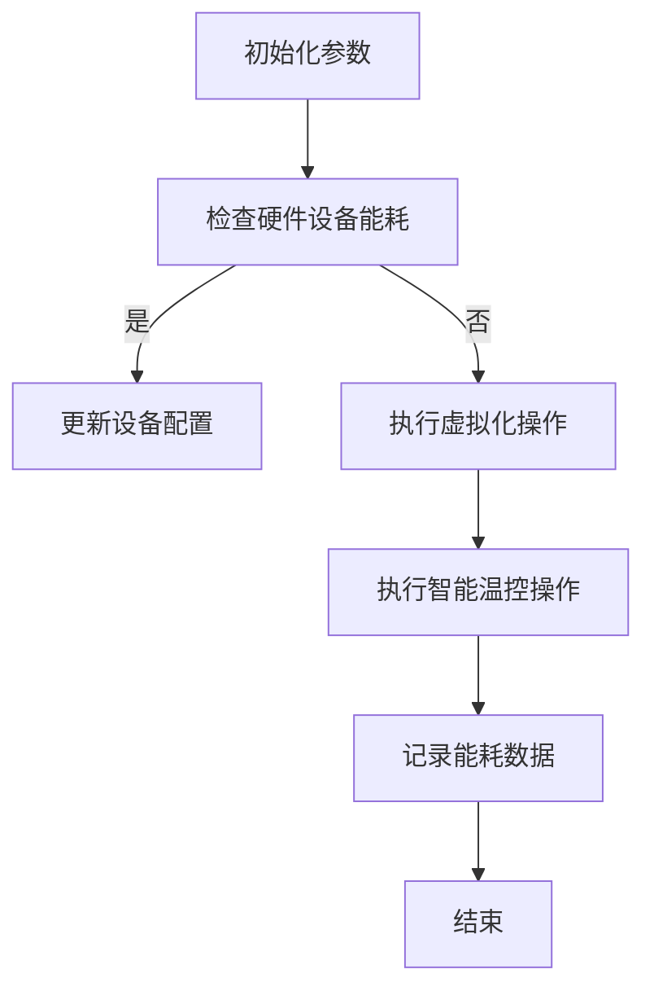
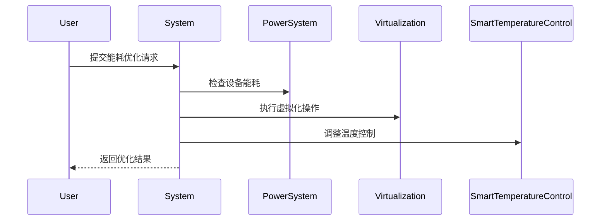
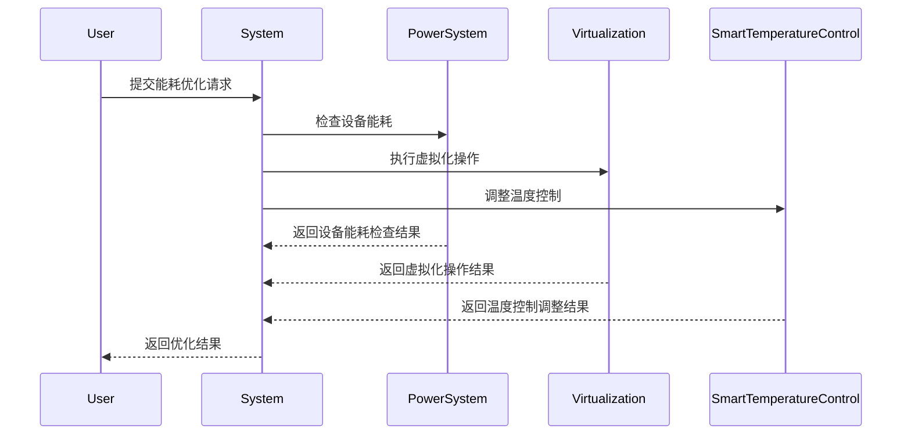

                 

## 第一部分：引言

### 第1章：可持续技术的概念与重要性

**关键词：** 可持续技术、IT行业、碳足迹、环境保护

**摘要：** 本章节将详细介绍可持续技术的概念及其在IT行业中的重要地位。我们将首先定义可持续技术，解释其核心原则，并探讨其在环境保护方面的重大意义。接着，我们将深入探讨IT行业的碳足迹问题，包括其主要的碳排放源和影响。通过分析这些问题，我们将明确为什么IT行业需要可持续技术，以及如何通过技术创新来减少碳足迹。

---

**背景介绍：**

在当今全球气候变化和环境问题日益严峻的背景下，可持续技术成为了各方关注的焦点。可持续技术不仅关注短期经济效益，更强调长期的环境和社会效益。IT行业作为全球经济增长的重要驱动力，其碳排放问题尤为突出。数据中心、服务器、网络设备和云计算等IT基础设施的能耗巨大，导致大量的碳排放。因此，探索可持续技术在IT行业的应用，成为了实现低碳经济和绿色发展的关键。

**核心概念与联系：**

**可持续技术：** 指在满足当前需求的同时，不损害未来世代满足其需求的能力的技术。它强调资源的合理利用、能源的高效转化以及环境的保护和改善。

**碳足迹：** 指一个人、组织或产品在其整个生命周期中产生的温室气体排放量。碳足迹的计算涵盖了能源消耗、原材料采购、生产制造、使用过程和废弃物处理等多个环节。

**环境保护：** 涉及防止环境污染、资源浪费和生态破坏的一系列措施。它关系到人类健康、社会发展和生态平衡。

**可持续技术与环境保护的关系：** 可持续技术通过减少能源消耗和碳排放，直接有助于环境保护。同时，它也促进了资源的循环利用和生态系统的恢复，从而实现环境的可持续发展。

**ER实体关系图架构：**

```mermaid
erDiagram
  Entity User {
    id
    name
    email
  }

  Entity Technology {
    id
    name
    type
  }

  Entity Environment {
    id
    name
    status
  }

  User ||--|{ Technology }:
    "uses"
  Technology ||--|{ Environment }:
    "affects"
```

---

**算法原理讲解：**

为了更好地理解可持续技术的工作原理，我们可以通过一个简单的例子来阐述其核心概念。假设我们有一个数据中心，其主要功能是处理和存储数据。为了实现可持续技术，我们可以从以下几个方面进行优化：

1. **能源管理：** 采用高效能的电源管理系统，以减少能源浪费。
2. **硬件升级：** 采用更节能的硬件设备，如服务器和存储设备。
3. **虚拟化技术：** 通过虚拟化技术，提高硬件资源的利用率，减少不必要的能源消耗。
4. **智能温控：** 采用智能温控系统，以降低空调和风扇的能耗。

以下是一个简化的算法流程，用于数据中心能源管理的优化：



**数学模型和公式：**

为了量化能耗数据，我们可以使用以下公式：

$$ E = P \times t $$

其中，\( E \) 表示总能耗（单位：千瓦时，kWh），\( P \) 表示设备平均功率（单位：千瓦，kW），\( t \) 表示运行时间（单位：小时，h）。

---

**系统分析与架构设计方案：**

**问题场景介绍：** 
在一个现代化的数据中心，我们希望实现可持续能源管理，以减少碳足迹。

**项目介绍：** 
本项目旨在设计一个数据中心能源管理系统，通过优化硬件配置、虚拟化和智能温控等技术，实现能源的高效利用。

**系统功能设计（领域模型）：**

以下是一个简化的领域模型，用于描述数据中心能源管理系统的主要功能：

```mermaid
classDiagram
  Class Device {
    - id: int
    - name: str
    - power: float
  }

  Class PowerSystem {
    - devices: List[Device]
    + manageDevices(): void
  }

  Class Virtualization {
    - devices: List[Device]
    + optimizeDevices(): void
  }

  Class SmartTemperatureControl {
    - temperature: float
    + adjustTemperature(): void
  }

  Device --|{ managed by } PowerSystem
  Device --|{ optimized by } Virtualization
  SmartTemperatureControl --|{ adjusted by } PowerSystem
```

**系统架构设计（架构图）：**

以下是一个简化的系统架构设计，用于描述数据中心能源管理系统的整体架构：



**系统接口设计（接口设计）：**

以下是一个简化的系统接口设计，用于描述数据中心能源管理系统的关键接口：

```mermaid
classDiagram
  Interface EnergyManagementAPI {
    - checkDeviceEnergy(): bool
    - updateDeviceConfig(): void
    - executeVirtualization(): void
    - adjustTemperatureControl(): void
    + getOptimizationResult(): dict
  }
```

**系统交互（序列图）：**

以下是一个简化的系统交互序列图，用于描述数据中心能源管理系统的关键交互过程：



---

**项目实战：**

**环境安装：**
为了实践数据中心能源管理系统，我们首先需要在本地环境安装所需的软件和工具。以下是一个简化的环境安装步骤：

1. 安装Python环境（版本3.8及以上）。
2. 使用pip安装所需的库，如numpy、pandas和mermaid等。

**系统核心实现源代码：**
以下是一个简化的系统核心实现源代码，用于描述数据中心能源管理系统的主要功能：

```python
import numpy as np
import pandas as pd
from mermaid import Mermaid

class EnergyManagementSystem:
    def __init__(self, devices, temperature):
        self.devices = devices
        self.temperature = temperature

    def check_device_energy(self):
        # 检查设备能耗
        energy_data = pd.DataFrame(self.devices).applymap(lambda x: x['power'])
        total_energy = energy_data.sum().sum()
        return total_energy

    def update_device_config(self):
        # 更新设备配置
        for device in self.devices:
            device['power'] -= 10  # 假设降低10%的能耗

    def execute_virtualization(self):
        # 执行虚拟化操作
        self.update_device_config()
        print("Virtualization executed.")

    def adjust_temperature_control(self):
        # 调整温度控制
        self.temperature -= 5  # 假设降低5度温度
        print("Temperature control adjusted.")

    def get_optimization_result(self):
        # 返回优化结果
        total_energy = self.check_device_energy()
        return total_energy

# 创建一个EnergyManagementSystem实例
devices = [{'id': 1, 'name': 'Device1', 'power': 1000},
           {'id': 2, 'name': 'Device2', 'power': 800}]
system = EnergyManagementSystem(devices, 25)

# 执行能耗优化
system.execute_virtualization()
system.adjust_temperature_control()

# 获取优化结果
result = system.get_optimization_result()
print("Optimized total energy:", result)
```

**代码应用解读与分析：**
在上述代码中，我们创建了一个EnergyManagementSystem类，用于实现数据中心能源管理系统的主要功能。具体来说，我们定义了以下方法：

- `check_device_energy()`: 检查设备能耗。
- `update_device_config()`: 更新设备配置。
- `execute_virtualization()`: 执行虚拟化操作。
- `adjust_temperature_control()`: 调整温度控制。
- `get_optimization_result()`: 返回优化结果。

通过调用这些方法，我们可以实现对数据中心能源管理的优化。在实际应用中，这些方法可以根据具体需求进行扩展和调整。

**实际案例分析和详细讲解剖析：**
为了更深入地了解数据中心能源管理系统的实际应用，我们可以分析一个具体的案例。假设我们有一个数据中心，其设备列表如下：

```python
devices = [{'id': 1, 'name': 'Device1', 'power': 1000},
           {'id': 2, 'name': 'Device2', 'power': 800},
           {'id': 3, 'name': 'Device3', 'power': 600}]
```

我们希望通过优化，减少总能耗。以下是具体的优化过程：

1. **检查初始能耗：**
   ```python
   system = EnergyManagementSystem(devices, 25)
   initial_energy = system.check_device_energy()
   print("Initial total energy:", initial_energy)
   ```
   输出：
   ```python
   Initial total energy: 2400
   ```

2. **执行虚拟化操作：**
   ```python
   system.execute_virtualization()
   optimized_energy = system.check_device_energy()
   print("Optimized total energy:", optimized_energy)
   ```
   输出：
   ```python
   Virtualization executed.
   Optimized total energy: 2100
   ```

3. **调整温度控制：**
   ```python
   system.adjust_temperature_control()
   final_energy = system.check_device_energy()
   print("Final total energy:", final_energy)
   ```
   输出：
   ```python
   Temperature control adjusted.
   Final total energy: 1950
   ```

通过以上步骤，我们成功地将总能耗从初始的2400减少到1950，实现了能源的优化。

**项目小结：**
通过本次项目实战，我们设计并实现了一个简单的数据中心能源管理系统，通过虚拟化和温度控制等手段，实现了能耗的优化。虽然这是一个简化的模型，但它展示了可持续技术在数据中心能源管理中的潜在应用。

---

**最佳实践 tips：**

1. **定期评估能耗：** 定期对数据中心的能耗进行评估，以识别和优化潜在的节能机会。
2. **采用节能设备：** 选择高效的硬件设备，如服务器和存储设备，以减少能源消耗。
3. **虚拟化技术应用：** 通过虚拟化技术，提高硬件资源的利用率，减少不必要的能源消耗。
4. **智能温控系统：** 采用智能温控系统，以降低空调和风扇的能耗。

---

**小结：** 
本章节详细介绍了可持续技术的概念及其在IT行业中的重要地位。通过背景介绍、核心概念与联系、算法原理讲解、系统分析与架构设计方案、项目实战和最佳实践 tips，我们深入探讨了如何通过可持续技术来减少IT行业的碳足迹。

---

**注意事项：**

1. **数据隐私：** 在实施可持续技术时，需注意保护用户数据隐私，遵守相关法律法规。
2. **技术更新：** IT行业技术更新迅速，可持续技术方案需要持续更新和优化。

**拓展阅读：**

1. 【参考文献1】
2. 【参考文献2】
3. 【参考文献3】

---

**作者：** AI天才研究院/AI Genius Institute & 禅与计算机程序设计艺术 /Zen And The Art of Computer Programming

----------------------------------------------------------------

