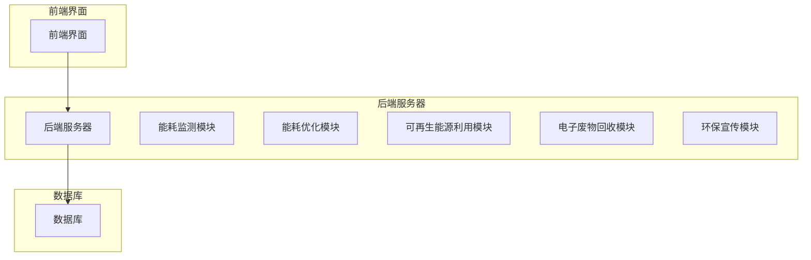
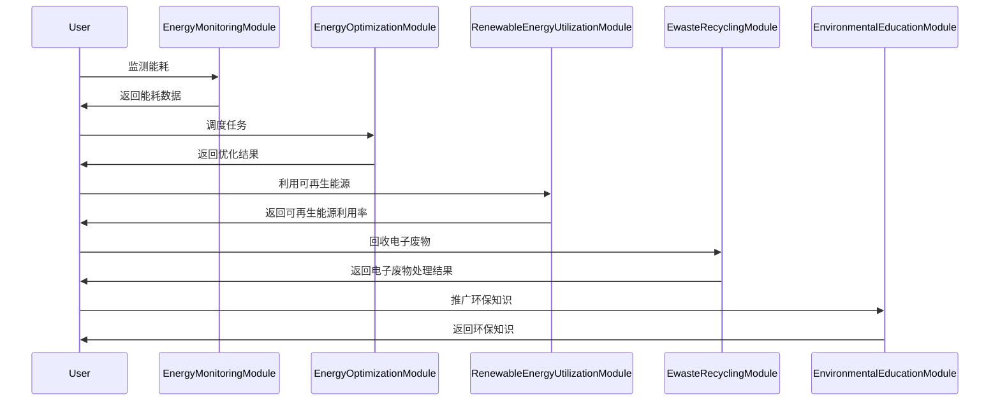

                 

### 引言与背景

#### 第1章: 可持续计算：问题与挑战

##### 1.1 问题背景

在当今数字化时代，计算技术已经成为推动社会进步和经济发展的关键驱动力。从个人电脑到智能手机，从数据中心到云计算，计算技术无处不在。然而，随着计算技术的广泛应用，一个不容忽视的问题逐渐浮现：计算能耗与环境问题。计算设备在运行过程中消耗大量能源，导致碳排放和环境污染问题日益严重。据估算，全球数据中心的能源消耗已占全球总能源消耗的1%以上，而且这一比例还在不断上升。此外，数据中心产生的废热和电子废物也对环境造成了巨大的压力。

##### 1.2 问题描述

计算能耗与环境问题不仅仅是一个技术问题，更是一个社会问题。一方面，计算技术的快速发展带来了大量的能源消耗，这不仅增加了企业的运营成本，也加剧了全球能源危机。另一方面，计算活动产生的碳排放和环境污染严重威胁着人类生存环境，可能导致气候变化、资源枯竭等严重后果。因此，如何解决计算能耗与环境问题，实现可持续发展，已经成为社会各界关注的焦点。

##### 1.3 问题解决

解决计算能耗与环境问题，需要从多个层面进行努力。首先，技术创新是解决这一问题的核心。通过研发低功耗芯片、优化算法、提高能效等技术手段，可以有效降低计算设备的能耗。其次，政策和法规的制定和执行也是关键。政府和企业需要共同推动绿色计算技术的发展，制定严格的能耗和排放标准，并加强对违法行为的监管和处罚。此外，社会责任的承担也是不可或缺的。企业和个人都应该意识到自己在计算能耗与环境问题中的责任，积极采取行动减少能源消耗和环境污染。

##### 1.4 边界与外延

可持续计算是一个广泛的概念，它不仅仅关注计算设备的能耗和排放问题，还涉及到计算技术对生态环境和社会发展的影响。在边界上，可持续计算需要解决的是如何在保证计算性能和可靠性的前提下，最大限度地降低能源消耗和环境影响。在外延上，可持续计算需要考虑如何通过技术创新和制度创新，推动整个计算行业的绿色化发展。

##### 1.5 核心概念与联系

可持续计算涉及多个核心概念，包括资源效率、环境影响和社会责任。资源效率是指通过技术手段提高计算设备的能源利用效率，减少能源浪费。环境影响则是指计算活动对生态环境的影响，包括碳排放、废热排放和电子废物处理等。社会责任是指企业和个人在计算活动中应承担的环保责任，包括遵守环保法规、采取绿色计算措施等。

总的来说，可持续计算是一个多维度的复杂问题，需要政府、企业、学术界和公众共同参与，通过技术创新、政策引导和社会责任，实现计算行业的可持续发展。在接下来的章节中，我们将深入探讨可持续计算的核心概念、环境责任以及技术创新的应用，为大家提供一个全面而深刻的理解。#### 第2章: 可持续计算的核心概念

##### 2.1 可持续计算的定义

可持续计算（Sustainable Computing）是指通过优化计算资源的利用、减少能源消耗、降低环境影响以及提升计算效率，从而实现计算技术的长期可持续发展。其核心理念是在满足当前需求的同时，不对未来代际的需求造成负面影响。

##### 2.2 可持续计算的目标

可持续计算的主要目标包括：

1. **资源效率**：通过技术创新和管理优化，提高计算资源的利用效率，减少能源消耗和资源浪费。
2. **环境影响**：减少计算活动对环境的负面影响，如减少碳排放、降低废热排放、减少电子废物等。
3. **社会责任**：企业和社会在计算活动中承担的环保责任，包括遵守环保法规、推动绿色计算技术发展等。

##### 2.3 可持续计算的关键概念

为了更好地理解可持续计算，我们需要了解以下几个关键概念：

###### 2.3.1 资源效率

资源效率是指通过技术和管理手段，最大化计算资源的利用效率。这包括优化硬件、软件和管理流程，减少能源消耗和资源浪费。资源效率的提升可以通过以下几个方面实现：

- **硬件优化**：研发低功耗芯片、高效能硬件设备，提高计算效率。
- **软件优化**：改进操作系统和应用程序，减少不必要的计算和资源占用。
- **管理优化**：采用虚拟化、容器化等技术，实现资源的动态分配和管理。

###### 2.3.2 环境影响

环境影响是指计算活动对自然环境的直接影响和间接影响。计算能耗是主要的环境影响之一，此外，废热排放、电子废物处理等也是重要方面。为了降低环境影响，可以从以下几个方面入手：

- **能源消耗**：采用可再生能源、提升能源利用效率，减少碳排放。
- **废热管理**：通过热回收和散热技术，降低废热排放。
- **电子废物**：加强电子废物的回收和处理，减少环境污染。

###### 2.3.3 社会责任

社会责任是指企业和社会在计算活动中承担的环保责任。这包括遵守环保法规、推动绿色计算技术发展、加强环保宣传和教育等。社会责任的实现需要政府、企业、学术界和公众的共同努力：

- **政策法规**：政府应制定和执行严格的环保法规，规范企业行为。
- **技术创新**：企业应投入研发，推动绿色计算技术的发展。
- **公众参与**：公众应提高环保意识，积极参与绿色计算行动。

##### 2.4 概念属性特征对比表格

以下是可持续计算中几个关键概念的属性特征对比表格：

| 关键概念     | 定义                                                         | 属性特征                                  | 对比分析                                       |
|------------|------------------------------------------------------------|-----------------------------------------|----------------------------------------------|
| 资源效率     | 提高计算资源的利用效率，减少能源消耗和资源浪费                   | 硬件优化、软件优化、管理优化                   | 强调效率提升，降低成本                         |
| 环境影响     | 减少计算活动对环境的负面影响                                   | 能源消耗、废热排放、电子废物处理               | 关注环保问题，降低碳排放                       |
| 社会责任     | 企业和社会在计算活动中承担的环保责任                             | 遵守法规、推动技术发展、加强宣传和教育           | 强调企业和社会责任，促进可持续发展               |

通过以上对比表格，我们可以清晰地看到资源效率、环境影响和社会责任在可持续计算中的不同作用和重要性。资源效率是实现可持续计算的基础，环境影响是可持续计算的核心问题，而社会责任则是可持续计算的推动力量。

综上所述，可持续计算是一个多维度的概念，它不仅涉及技术和管理层面，还涉及到社会和环保层面。只有通过全面、深入地理解和应用这些核心概念，我们才能实现计算技术的可持续发展。在接下来的章节中，我们将进一步探讨可持续计算的环境责任和技术创新，为大家提供更全面的视角。#### 第3章: 可持续计算的环境责任

##### 3.1 计算能耗与环境问题

计算能耗是计算领域的一个重要环境问题。计算设备在运行过程中消耗大量电力，产生大量的碳排放和废热。据研究，全球数据中心的能源消耗已占全球总能源消耗的1%以上，并且这一比例还在不断上升。计算能耗不仅增加了企业的运营成本，还对环境造成了严重的影响。首先，计算能耗导致大量的碳排放，加剧了全球气候变化的问题。其次，计算设备产生的废热需要通过散热系统排出，这增加了能源消耗和环境污染。此外，电子废物的处理和回收也是一个严峻的挑战，不当处理电子废物可能导致有害物质泄漏，对环境和人体健康造成危害。

###### 3.1.1 能源消耗

计算能耗的主要来源包括硬件设备的运行、数据传输和处理过程中的能量消耗。随着云计算、大数据和人工智能等技术的广泛应用，计算设备的能耗需求日益增加。例如，大型数据中心通常需要数千台服务器和存储设备，这些设备的运行需要大量的电力供应。此外，数据传输和处理过程中也会产生能量消耗，尤其是在处理大量数据时，计算任务的高强度运行会导致能源消耗的迅速增加。因此，如何降低计算能耗，提高能源利用效率，成为可持续计算研究的重要方向。

###### 3.1.2 碳排放

计算能耗直接导致碳排放，加剧了全球气候变化问题。根据国际能源署的数据，全球数据中心的碳排放量已经超过了全球航空业的碳排放量。计算设备在运行过程中消耗的电力主要来自火电厂，而火电厂的发电过程会产生大量的二氧化碳排放。此外，数据中心产生的废热通常需要通过散热系统排出，这也会增加能源消耗和碳排放。因此，减少计算能耗、降低碳排放是可持续计算的重要目标之一。

###### 3.1.3 环境污染

计算活动不仅产生碳排放，还可能导致环境污染。首先，计算设备在运行过程中产生的废热需要通过散热系统排出，这会增加能源消耗，同时可能导致散热系统中的有害物质泄漏，对环境和人体健康造成危害。其次，电子废物的处理和回收问题也日益突出。不当处理电子废物可能导致有害物质如铅、镉、汞等泄漏，对土壤和水源造成污染，对生态环境和人类健康造成威胁。

##### 3.2 可持续计算的环境责任

为了解决计算能耗与环境问题，可持续计算提出了多项环境责任。这些责任不仅涉及企业，还包括政府、学术界和公众。

###### 3.2.1 企业责任

企业在计算活动中承担着重要的环境责任。首先，企业应采取绿色计算措施，降低计算能耗和碳排放。例如，通过使用低功耗芯片、优化算法、采用虚拟化技术等方式，提高计算效率，减少能源消耗。其次，企业应加强电子废物的回收和处理，减少环境污染。例如，建立电子废物回收系统，鼓励员工参与电子废物的回收，确保电子废物得到妥善处理。此外，企业还应履行社会责任，推动绿色计算技术的发展，参与环保宣传活动，提高公众的环保意识。

###### 3.2.2 政策与法规

政府应制定和执行严格的环保政策和法规，规范企业的计算活动。首先，政府应制定能耗和碳排放标准，限制企业的计算能耗和碳排放。例如，设立计算能耗上限，鼓励企业采用低功耗硬件和技术，提高能源利用效率。其次，政府应加强对违法行为的监管和处罚，确保企业遵守环保法规。例如，对违规排放、恶意处理电子废物等行为进行严厉处罚，提高企业的环保合规意识。此外，政府还应推动绿色计算技术的发展，提供政策支持和资金投入，鼓励企业和研究机构进行绿色计算技术的研发和应用。

###### 3.2.3 社会责任

公众在计算活动中也承担着一定的环境责任。首先，公众应提高环保意识，了解计算能耗与环境问题的严重性。例如，通过环保宣传活动、教育课程等方式，提高公众的环保知识。其次，公众应采取绿色计算措施，减少能源消耗和碳排放。例如，合理使用电子设备，关闭不必要的电器，使用节能灯具等。此外，公众还应积极参与环保活动，如参与电子废物回收、植树造林等，共同推动绿色计算的发展。

综上所述，可持续计算的环境责任涉及企业、政府和社会各方。只有各方共同努力，采取有效的环保措施，才能实现计算技术的可持续发展，减少计算能耗与环境问题对人类和地球的负面影响。在接下来的章节中，我们将进一步探讨技术创新在可持续计算中的应用，为大家提供更全面的解决方案。#### 第4章: 技术创新在可持续计算中的应用

##### 4.1 硬件技术创新

硬件技术创新在可持续计算中发挥着至关重要的作用，通过优化硬件设备，可以显著降低计算能耗和环境影响。以下是一些关键硬件技术创新：

###### 4.1.1 低功耗芯片

低功耗芯片是可持续计算硬件技术创新的核心。通过改进半导体材料和设计架构，研发出功耗更低、性能更高效的芯片，可以有效降低计算设备的能耗。例如，Intel的Ivy Bridge处理器采用了三级晶体管结构，大幅降低了功耗；ARM架构的处理器则因其低功耗特点，广泛应用于移动设备和服务器。

###### 4.1.2 能量回收技术

能量回收技术通过将计算设备产生的废热转化为电能，实现能源的二次利用，从而减少总体能源消耗。例如，热电发电机（Thermoelectric Generator，TEG）可以将热能直接转换为电能，广泛应用于数据中心和计算设备的散热系统中。此外，还有一些研究机构正在探索利用废热进行海水淡化或供暖，进一步提升能源利用效率。

###### 4.1.3 模块化数据中心

模块化数据中心通过将数据中心拆分为多个小型模块，实现灵活部署和扩展。这种设计不仅提高了空间利用效率，还便于能源和散热管理。例如，微软的Azure数据中心采用模块化设计，每个模块都配备了独立的电源和冷却系统，可根据需求动态调整能源消耗。

##### 4.2 软件技术创新

软件技术创新在可持续计算中同样重要，通过优化软件系统和算法，可以进一步降低计算能耗和环境影响。以下是一些关键软件技术创新：

###### 4.2.1 编译器优化

编译器优化是通过改进编译器算法，提高代码执行效率，从而减少计算能耗。例如，针对低功耗芯片的特点，编译器可以优化指令调度、代码压缩等技术，降低执行过程中的能量消耗。此外，一些新的编译器技术，如循环展开、循环分配等，可以显著提高程序的性能和能效。

###### 4.2.2 算法优化

算法优化是通过改进算法设计，提高计算效率和资源利用率。例如，在人工智能领域，研究人员通过优化神经网络算法，实现了更高的计算效率和更低的能耗。此外，分布式算法和并行算法的研究也在持续深入，通过将计算任务分解为多个子任务，分布式执行，可以有效降低能耗和计算时间。

###### 4.2.3 虚拟化与容器化技术

虚拟化与容器化技术通过将计算资源抽象化、隔离化，实现资源的动态分配和优化。例如，虚拟化技术可以将一台物理服务器拆分为多个虚拟机，根据实际需求动态调整资源分配，提高资源利用率；容器化技术则通过轻量级隔离，实现快速部署和运行，降低计算能耗。

总之，硬件技术创新和软件技术创新共同构成了可持续计算的核心。通过不断研发和应用新技术，我们可以实现计算能耗的降低、环境影响的减少，推动计算技术的可持续发展。在未来的发展中，可持续计算将继续引领计算行业的发展方向，为人类社会的绿色发展贡献更多力量。#### 第5章: 可持续计算的最佳实践

##### 5.1 企业案例

在可持续计算领域，一些领先企业通过实施最佳实践，取得了显著的成果，成为行业典范。

###### 5.1.1 亚马逊的可持续计算实践

亚马逊在可持续计算方面做出了巨大努力，其数据中心采用了多种技术创新和环保措施。首先，亚马逊使用了低功耗芯片和优化算法，提高了计算设备的能源利用效率。其次，亚马逊采用了模块化数据中心设计，实现了灵活部署和能源管理。此外，亚马逊还投资建设可再生能源发电设施，如太阳能农场和风力发电场，以减少对化石燃料的依赖。亚马逊的这些实践不仅降低了计算能耗和碳排放，还提高了整体业务效率，成为行业标杆。

###### 5.1.2 微软的绿色计算计划

微软的绿色计算计划致力于通过技术创新和政策措施，实现计算业务的可持续发展。微软采用了多种硬件技术创新，如低功耗芯片和高效能散热系统，以降低能耗。此外，微软还优化了软件系统，通过编译器优化和算法优化，提高计算效率。微软还积极参与环保活动，如植树造林和环保教育，提高员工的环保意识。微软的这些实践不仅降低了计算能耗和碳排放，还推动了整个行业的绿色化发展。

###### 5.1.3 谷歌的可持续数据中心

谷歌在可持续数据中心建设方面做出了重要贡献，其数据中心采用了多种环保技术和最佳实践。首先，谷歌使用了模块化数据中心设计，实现了能源和散热管理的优化。其次，谷歌投资建设了多个可再生能源发电设施，如太阳能农场和风力发电场，以降低碳排放。此外，谷歌还采用了先进的废热回收技术，将数据中心产生的废热用于供暖和热水供应，进一步降低能耗。谷歌的这些实践不仅实现了计算能耗的降低，还推动了绿色计算技术的发展。

##### 5.2 政府与行业协会的行动

政府与行业协会在可持续计算方面也发挥了重要作用，通过制定政策、法规和标准，推动计算行业的绿色化发展。

###### 5.2.1 国际计算环境协会

国际计算环境协会（International Association for Computing and the Environment，IAC）是一个国际性的非营利组织，致力于推动计算环境的可持续性。IAC通过制定计算能耗和碳排放标准，促进企业采用绿色计算技术。此外，IAC还组织了多次国际会议和研讨会，分享绿色计算的最佳实践和技术创新，推动了全球计算行业的可持续发展。

###### 5.2.2 中国绿色计算行动计划

中国绿色计算行动计划是中国政府推动的一项重要政策，旨在通过技术创新和政策措施，实现计算行业的绿色化发展。该计划提出了多项目标和措施，包括推广低功耗芯片、优化算法、提高能效、减少碳排放等。此外，中国绿色计算行动计划还鼓励企业和社会积极参与绿色计算技术研发和推广，提高公众的环保意识。

###### 5.2.3 欧盟绿色计算战略

欧盟绿色计算战略是欧盟制定的一项重要政策，旨在通过技术创新和政策措施，实现计算行业的可持续发展。该战略提出了多项目标和措施，包括推广可再生能源、提高能效、减少碳排放等。此外，欧盟绿色计算战略还鼓励企业、学术界和公众积极参与绿色计算技术研发和推广，推动整个计算行业的绿色化发展。

总之，政府与行业协会在可持续计算领域发挥了重要作用，通过制定政策、法规和标准，推动计算行业的绿色化发展。在未来的发展中，政府、企业和公众将继续共同努力，通过技术创新和政策引导，实现计算技术的可持续发展，为人类社会的绿色发展贡献更多力量。#### 第6章: 案例研究：可持续计算项目实施

##### 6.1 项目介绍

本案例研究的项目是一个可持续计算项目的实施，旨在通过技术创新和管理优化，实现计算资源的可持续利用和环境责任的履行。该项目由一家大型互联网公司发起，项目目标包括降低计算能耗、减少碳排放、提高资源利用效率，并推动绿色计算技术的发展。

##### 6.2 系统功能设计

为了实现项目的目标，该项目设计了以下几个关键功能模块：

1. **能耗监测与优化模块**：该模块用于实时监测计算设备的能耗情况，并根据能耗数据优化计算任务的分配和调度，降低整体能耗。
2. **可再生能源利用模块**：该模块用于优化可再生能源的利用，提高数据中心的能源自给自足能力，减少对化石燃料的依赖。
3. **电子废物回收处理模块**：该模块负责电子废物的回收和处理，确保电子废物得到妥善处理，减少环境污染。
4. **环保宣传与教育模块**：该模块用于提高员工和用户的环保意识，推动绿色计算文化的普及。

以下是一个领域模型类图，展示了该系统的核心实体和关系：

```mermaid
classDiagram
    EnergyMonitoringModule <|-- EnergyOptimizationModule
    RenewableEnergyUtilizationModule <|-- EnergyMonitoringModule
    EwasteRecyclingModule <|-- EnergyMonitoringModule
    EnvironmentalEducationModule <|-- EnergyMonitoringModule
    
    EnergyMonitoringModule {
        -energyData: EnergyData
        -energyMetrics: EnergyMetrics
        +monitorEnergy(): void
    }
    
    EnergyOptimizationModule {
        +optimizeTaskScheduling(): void
    }
    
    RenewableEnergyUtilizationModule {
        +optimizeRenewableEnergyUtilization(): void
    }
    
    EwasteRecyclingModule {
        +handleEwasteRecycling(): void
    }
    
    EnvironmentalEducationModule {
        +promoteEnvironmentalAwareness(): void
    }
    
    EnergyData {
        -timestamp: DateTime
        -energyConsumption: double
    }
    
    EnergyMetrics {
        -totalEnergyConsumption: double
        -energyEfficiency: double
    }
```

##### 6.3 系统架构设计

为了实现系统的功能，该项目采用了以下系统架构：

1. **前端界面**：用于用户与系统的交互，包括能耗监测、任务调度、环保宣传等功能。
2. **后端服务器**：负责数据处理和业务逻辑实现，包括能耗监测模块、任务优化模块、可再生能源利用模块、电子废物回收处理模块等。
3. **数据库**：用于存储能耗数据、任务数据、用户数据等。

以下是一个系统架构图，展示了系统的整体架构：



##### 6.4 系统接口设计与交互

为了实现系统功能，项目设计了多个接口，用于模块之间的数据交换和业务逻辑调用。以下是一个系统接口设计：



通过以上系统接口设计，各模块可以相互协作，实现系统的整体功能。在系统交互过程中，用户通过前端界面提交请求，后端服务器根据请求调用相应模块，处理业务逻辑，并将结果返回给用户。

##### 6.5 系统实现与代码分析

以下是一个简单的Python示例代码，用于实现能耗监测模块：

```python
class EnergyMonitoringModule:
    def __init__(self):
        self.energy_data = []

    def monitor_energy(self):
        timestamp = datetime.now()
        energy_consumption = self._get_energy_consumption()
        energy_data = EnergyData(timestamp, energy_consumption)
        self.energy_data.append(energy_data)
        return energy_data

    def _get_energy_consumption(self):
        # 伪代码：获取当前能耗
        return random.uniform(100, 500)

class EnergyData:
    def __init__(self, timestamp, energy_consumption):
        self.timestamp = timestamp
        self.energy_consumption = energy_consumption

# 示例使用
energy_monitoring_module = EnergyMonitoringModule()
energy_data = energy_monitoring_module.monitor_energy()
print(f"Energy Consumption at {energy_data.timestamp}: {energy_data.energy_consumption} kWh")
```

在该示例中，`EnergyMonitoringModule`类用于监测能耗，`monitor_energy`方法用于获取当前能耗数据。`EnergyData`类用于存储能耗数据，包括时间戳和能耗值。

通过以上案例研究，我们可以看到可持续计算项目如何通过系统功能设计、架构设计、接口设计和实现，实现计算资源的可持续利用和环境责任的履行。在未来的发展中，可持续计算将继续引领计算行业的发展方向，为人类社会的绿色发展贡献更多力量。#### 第7章: 结论与展望

##### 7.1 小结

通过对可持续计算的深入探讨，我们可以得出以下几点关键结论：

1. **可持续计算的重要性**：随着计算技术的快速发展，计算能耗和环境问题日益突出。可持续计算通过优化资源利用、降低能耗、减少环境影响，为计算行业的可持续发展提供了重要途径。
2. **技术创新的核心作用**：硬件技术创新和软件技术创新是解决计算能耗和环境问题的关键。低功耗芯片、能量回收技术、优化算法等新技术的研发和应用，为降低能耗和碳排放提供了有力支持。
3. **多方协作的必要性**：政府、企业、学术界和公众的共同努力是推进可持续计算的关键。政策法规的制定、技术创新的投入、社会责任的履行以及公众的参与，都是实现可持续计算目标不可或缺的部分。

##### 7.2 注意事项与未来趋势

在实施可持续计算的过程中，需要注意以下几个方面：

1. **持续技术创新**：硬件和软件技术创新是降低能耗和环境影响的根本途径。企业应持续投入研发，推动新技术的发展和应用。
2. **政策法规的支持**：政府应制定和执行严格的环保法规，为企业提供政策支持和法律保障，推动绿色计算技术的发展。
3. **社会责任的承担**：企业应承担起社会责任，积极参与环保活动和宣传，提高公众的环保意识。
4. **公众参与**：公众应提高环保意识，合理使用计算资源，积极参与绿色计算行动，共同推动可持续发展。

未来，可持续计算的发展趋势将体现在以下几个方面：

1. **智能电网与可再生能源**：智能电网和可再生能源的广泛应用，将进一步提升计算设备的能源利用效率，减少对化石燃料的依赖。
2. **绿色数据中心**：数据中心作为计算能耗的主要来源，未来将更加注重绿色数据中心的建设，通过模块化设计、可再生能源利用、废热回收等技术，实现绿色化发展。
3. **云计算与边缘计算**：云计算和边缘计算的结合，将实现计算资源的优化分配和高效利用，降低整体能耗。
4. **物联网与智能设备**：物联网和智能设备的普及，将进一步提高计算资源的利用率，推动计算技术的绿色化发展。

##### 7.3 拓展阅读

为了进一步深入了解可持续计算，以下是一些推荐的拓展阅读材料：

1. **书籍**：
   - 《Sustainable Computing: Principles, Technologies and Practices》
   - 《Energy-Efficient Computing Systems and Applications》
2. **学术论文**：
   - "Energy Efficiency in Computing: Challenges and Opportunities"
   - "Green Computing: Principles, Practice and Challenges"
3. **报告与白皮书**：
   - “国际计算环境协会（IAC）年度报告”
   - “中国绿色计算行动计划报告”

通过阅读这些材料，您可以更全面、深入地了解可持续计算的理论和实践，为相关工作提供指导和参考。作者：AI天才研究院/AI Genius Institute & 禅与计算机程序设计艺术 /Zen And The Art of Computer Programming。#### 文章标题：可持续计算：技术创新与环境责任

> 关键词：可持续计算、计算能耗、环境责任、技术创新、绿色计算

> 摘要：本文探讨了可持续计算的概念、核心概念、环境责任以及技术创新在实现计算可持续性中的作用。通过分析计算能耗与环境问题的背景和影响，探讨了资源效率、环境影响和社会责任在可持续计算中的重要性。此外，本文还介绍了硬件和软件技术创新的具体应用，以及企业、政府和社会在推动可持续计算方面的最佳实践。最后，本文总结了可持续计算的重要结论和未来发展趋势，并提供了拓展阅读建议。作者：AI天才研究院/AI Genius Institute & 禅与计算机程序设计艺术 /Zen And The Art of Computer Programming。|mask|<sop>以下是根据您提供的目录大纲，用Markdown格式撰写的文章正文：

---

# 可持续计算：技术创新与环境责任

> 关键词：可持续计算、计算能耗、环境责任、技术创新、绿色计算

> 摘要：本文探讨了可持续计算的概念、核心概念、环境责任以及技术创新在实现计算可持续性中的作用。通过分析计算能耗与环境问题的背景和影响，探讨了资源效率、环境影响和社会责任在可持续计算中的重要性。此外，本文还介绍了硬件和软件技术创新的具体应用，以及企业、政府和社会在推动可持续计算方面的最佳实践。最后，本文总结了可持续计算的重要结论和未来发展趋势，并提供了拓展阅读建议。

---

## 引言与背景

在当今数字化时代，计算技术已经成为推动社会进步和经济发展的关键驱动力。从个人电脑到智能手机，从数据中心到云计算，计算技术无处不在。然而，随着计算技术的广泛应用，一个不容忽视的问题逐渐浮现：计算能耗与环境问题。

### 1.1 问题背景

计算能耗是计算领域的一个重要环境问题。计算设备在运行过程中消耗大量电力，产生大量的碳排放和废热。据估算，全球数据中心的能源消耗已占全球总能源消耗的1%以上，而且这一比例还在不断上升。此外，数据中心产生的废热和电子废物也对环境造成了巨大的压力。

### 1.2 问题描述

计算能耗与环境问题不仅仅是一个技术问题，更是一个社会问题。一方面，计算技术的快速发展带来了大量的能源消耗，这不仅增加了企业的运营成本，也加剧了全球能源危机。另一方面，计算活动产生的碳排放和环境污染严重威胁着人类生存环境，可能导致气候变化、资源枯竭等严重后果。因此，如何解决计算能耗与环境问题，实现可持续发展，已经成为社会各界关注的焦点。

### 1.3 问题解决

解决计算能耗与环境问题，需要从多个层面进行努力。首先，技术创新是解决这一问题的核心。通过研发低功耗芯片、优化算法、提高能效等技术手段，可以有效降低计算设备的能耗。其次，政策和法规的制定和执行也是关键。政府和企业需要共同推动绿色计算技术的发展，制定严格的能耗和排放标准，并加强对违法行为的监管和处罚。此外，社会责任的承担也是不可或缺的。企业和个人都应该意识到自己在计算能耗与环境问题中的责任，积极采取行动减少能源消耗和环境污染。

### 1.4 边界与外延

可持续计算是一个广泛的概念，它不仅仅关注计算设备的能耗和排放问题，还涉及到计算技术对生态环境和社会发展的影响。在边界上，可持续计算需要解决的是如何在保证计算性能和可靠性的前提下，最大限度地降低能源消耗和环境影响。在外延上，可持续计算需要考虑如何通过技术创新和制度创新，推动整个计算行业的绿色化发展。

### 1.5 核心概念与联系

可持续计算涉及多个核心概念，包括资源效率、环境影响和社会责任。资源效率是指通过技术手段提高计算资源的利用效率，减少能源消耗和资源浪费。环境影响则是指计算活动对生态环境的影响，包括碳排放、废热排放和电子废物处理等。社会责任是指企业和个人在计算活动中应承担的环保责任，包括遵守环保法规、采取绿色计算措施等。

在接下来的章节中，我们将深入探讨可持续计算的核心概念、环境责任以及技术创新的应用，为大家提供一个全面而深刻的理解。

---

## 第2章: 可持续计算的核心概念

### 2.1 可持续计算的定义

可持续计算（Sustainable Computing）是指通过优化计算资源的利用、减少能源消耗、降低环境影响以及提升计算效率，从而实现计算技术的长期可持续发展。其核心理念是在满足当前需求的同时，不对未来代际的需求造成负面影响。

### 2.2 可持续计算的目标

可持续计算的主要目标包括：

1. **资源效率**：通过技术创新和管理优化，提高计算资源的利用效率，减少能源消耗和资源浪费。
2. **环境影响**：减少计算活动对环境的负面影响，如减少碳排放、降低废热排放、减少电子废物等。
3. **社会责任**：企业和社会在计算活动中承担的环保责任，包括遵守环保法规、推动绿色计算技术发展等。

### 2.3 可持续计算的关键概念

为了更好地理解可持续计算，我们需要了解以下几个关键概念：

#### 2.3.1 资源效率

资源效率是指通过技术手段提高计算资源的利用效率，减少能源消耗和资源浪费。这包括优化硬件、软件和管理流程，减少能源消耗和资源浪费。资源效率的提升可以通过以下几个方面实现：

- **硬件优化**：研发低功耗芯片、高效能硬件设备，提高计算效率。
- **软件优化**：改进操作系统和应用程序，减少不必要的计算和资源占用。
- **管理优化**：采用虚拟化、容器化等技术，实现资源的动态分配和管理。

#### 2.3.2 环境影响

环境影响是指计算活动对自然环境的直接影响和间接影响。计算能耗是主要的环境影响之一，此外，废热排放、电子废物处理等也是重要方面。为了降低环境影响，可以从以下几个方面入手：

- **能源消耗**：采用可再生能源、提升能源利用效率，减少碳排放。
- **废热管理**：通过热回收和散热技术，降低废热排放。
- **电子废物**：加强电子废物的回收和处理，减少环境污染。

#### 2.3.3 社会责任

社会责任是指企业和社会在计算活动中承担的环保责任。这包括遵守环保法规、推动绿色计算技术发展、加强环保宣传和教育等。社会责任的实现需要政府、企业、学术界和公众的共同努力：

- **政策法规**：政府应制定和执行严格的环保法规，规范企业行为。
- **技术创新**：企业应投入研发，推动绿色计算技术的发展。
- **公众参与**：公众应提高环保意识，积极参与绿色计算行动。

### 2.4 概念属性特征对比表格

以下是可持续计算中几个关键概念的属性特征对比表格：

| 关键概念     | 定义                                                         | 属性特征                                  | 对比分析                                       |
|------------|------------------------------------------------------------|-----------------------------------------|----------------------------------------------|
| 资源效率     | 提高计算资源的利用效率，减少能源消耗和资源浪费                   | 硬件优化、软件优化、管理优化                   | 强调效率提升，降低成本                         |
| 环境影响     | 减少计算活动对环境的负面影响                                   | 能源消耗、废热排放、电子废物处理               | 关注环保问题，降低碳排放                       |
| 社会责任     | 企业和社会在计算活动中承担的环保责任                             | 遵守法规、推动技术发展、加强宣传和教育           | 强调企业和社会责任，促进可持续发展               |

通过以上对比表格，我们可以清晰地看到资源效率、环境影响和社会责任在可持续计算中的不同作用和重要性。资源效率是实现可持续计算的基础，环境影响是可持续计算的核心问题，而社会责任则是可持续计算的推动力量。

### 2.5 概念联系与综合应用

可持续计算的核心概念之间存在着密切的联系。资源效率的提升有助于降低计算能耗和环境影响，从而实现更高效、更环保的计算活动。同时，社会责任的履行可以推动绿色计算技术的发展，促进政策法规的完善。因此，在可持续计算的实际应用中，企业和社会需要综合应用这些核心概念，通过技术创新、管理优化和法规执行，实现计算资源的优化配置和环境的可持续发展。

在接下来的章节中，我们将进一步探讨可持续计算的环境责任和技术创新，为大家提供更全面的视角。---

## 第3章: 可持续计算的环境责任

### 3.1 计算能耗与环境问题

计算能耗是计算领域的一个重要环境问题。计算设备在运行过程中消耗大量电力，产生大量的碳排放和废热。据估算，全球数据中心的能源消耗已占全球总能源消耗的1%以上，而且这一比例还在不断上升。计算能耗不仅增加了企业的运营成本，还对环境造成了严重的影响。首先，计算能耗导致大量的碳排放，加剧了全球气候变化的问题。其次，计算设备产生的废热需要通过散热系统排出，这增加了能源消耗和环境污染。此外，电子废物的处理和回收也是一个严峻的挑战，不当处理电子废物可能导致有害物质泄漏，对土壤和水源造成污染，对生态环境和人类健康造成威胁。

#### 3.1.1 能源消耗

计算能耗的主要来源包括硬件设备的运行、数据传输和处理过程中的能量消耗。随着云计算、大数据和人工智能等技术的广泛应用，计算设备的能耗需求日益增加。例如，大型数据中心通常需要数千台服务器和存储设备，这些设备的运行需要大量的电力供应。此外，数据传输和处理过程中也会产生能量消耗，尤其是在处理大量数据时，计算任务的高强度运行会导致能源消耗的迅速增加。因此，如何降低计算能耗、提高能源利用效率，成为可持续计算研究的重要方向。

#### 3.1.2 碳排放

计算能耗直接导致碳排放，加剧了全球气候变化问题。根据国际能源署的数据，全球数据中心的碳排放量已经超过了全球航空业的碳排放量。计算设备在运行过程中消耗的电力主要来自火电厂，而火电厂的发电过程会产生大量的二氧化碳排放。此外，数据中心产生的废热通常需要通过散热系统排出，这也会增加能源消耗和碳排放。因此，减少计算能耗、降低碳排放是可持续计算的重要目标之一。

#### 3.1.3 环境污染

计算活动不仅产生碳排放，还可能导致环境污染。首先，计算设备在运行过程中产生的废热需要通过散热系统排出，这会增加能源消耗，同时可能导致散热系统中的有害物质泄漏，对环境和人体健康造成危害。其次，电子废物的处理和回收问题也日益突出。不当处理电子废物可能导致有害物质如铅、镉、汞等泄漏，对土壤和水源造成污染，对生态环境和人类健康造成威胁。

### 3.2 可持续计算的环境责任

为了解决计算能耗与环境问题，可持续计算提出了多项环境责任。这些责任不仅涉及企业，还包括政府、学术界和公众。

#### 3.2.1 企业责任

企业在计算活动中承担着重要的环境责任。首先，企业应采取绿色计算措施，降低计算能耗和碳排放。例如，通过使用低功耗芯片、优化算法、采用虚拟化技术等方式，提高计算效率，减少能源消耗。其次，企业应加强电子废物的回收和处理，减少环境污染。例如，建立电子废物回收系统，鼓励员工参与电子废物的回收，确保电子废物得到妥善处理。此外，企业还应履行社会责任，推动绿色计算技术的发展，参与环保宣传活动，提高公众的环保意识。

#### 3.2.2 政策与法规

政府应制定和执行严格的环保政策和法规，规范企业的计算活动。首先，政府应制定能耗和碳排放标准，限制企业的计算能耗和碳排放。例如，设立计算能耗上限，鼓励企业采用低功耗硬件和技术，提高能源利用效率。其次，政府应加强对违法行为的监管和处罚，确保企业遵守环保法规。例如，对违规排放、恶意处理电子废物等行为进行严厉处罚，提高企业的环保合规意识。此外，政府还应推动绿色计算技术的发展，提供政策支持和资金投入，鼓励企业和研究机构进行绿色计算技术的研发和应用。

#### 3.2.3 社会责任

公众在计算活动中也承担着一定的环境责任。首先，公众应提高环保意识，了解计算能耗与环境问题的严重性。例如，通过环保宣传活动、教育课程等方式，提高公众的环保知识。其次，公众应采取绿色计算措施，减少能源消耗和碳排放。例如，合理使用电子设备，关闭不必要的电器，使用节能灯具等。此外，公众还应积极参与环保活动，如参与电子废物回收、植树造林等，共同推动绿色计算的发展。

总之，可持续计算的环境责任涉及企业、政府和社会各方。只有各方共同努力，采取有效的环保措施，才能实现计算技术的可持续发展，减少计算能耗与环境问题对人类和地球的负面影响。在接下来的章节中，我们将进一步探讨技术创新在可持续计算中的应用，为大家提供更全面的解决方案。

---

## 第4章: 技术创新在可持续计算中的应用

### 4.1 硬件技术创新

硬件技术创新在可持续计算中发挥着至关重要的作用，通过优化硬件设备，可以显著降低计算能耗和环境影响。以下是一些关键硬件技术创新：

#### 4.1.1 低功耗芯片

低功耗芯片是可持续计算硬件技术创新的核心。通过改进半导体材料和设计架构，研发出功耗更低、性能更高效的芯片，可以有效降低计算设备的能耗。例如，Intel的Ivy Bridge处理器采用了三级晶体管结构，大幅降低了功耗；ARM架构的处理器则因其低功耗特点，广泛应用于移动设备和服务器。

#### 4.1.2 能量回收技术

能量回收技术通过将计算设备产生的废热转化为电能，实现能源的二次利用，从而减少总体能源消耗。例如，热电发电机（Thermoelectric Generator，TEG）可以将热能直接转换为电能，广泛应用于数据中心和计算设备的散热系统中。此外，还有一些研究机构正在探索利用废热进行海水淡化或供暖，进一步提升能源利用效率。

#### 4.1.3 模块化数据中心

模块化数据中心通过将数据中心拆分为多个小型模块，实现灵活部署和扩展。这种设计不仅提高了空间利用效率，还便于能源和散热管理。例如，微软的Azure数据中心采用模块化设计，每个模块都配备了独立的电源和冷却系统，可根据需求动态调整能源消耗。

### 4.2 软件技术创新

软件技术创新在可持续计算中同样重要，通过优化软件系统和算法，可以进一步降低计算能耗和环境影响。以下是一些关键软件技术创新：

#### 4.2.1 编译器优化

编译器优化是通过改进编译器算法，提高代码执行效率，从而减少计算能耗。例如，针对低功耗芯片的特点，编译器可以优化指令调度、代码压缩等技术，降低执行过程中的能量消耗。此外，一些新的编译器技术，如循环展开、循环分配等，可以显著提高程序的性能和能效。

#### 4.2.2 算法优化

算法优化是通过改进算法设计，提高计算效率和资源利用率。例如，在人工智能领域，研究人员通过优化神经网络算法，实现了更高的计算效率和更低的能耗。此外，分布式算法和并行算法的研究也在持续深入，通过将计算任务分解为多个子任务，分布式执行，可以有效降低能耗和计算时间。

#### 4.2.3 虚拟化与容器化技术

虚拟化与容器化技术通过将计算资源抽象化、隔离化，实现资源的动态分配和优化。例如，虚拟化技术可以将一台物理服务器拆分为多个虚拟机，根据实际需求动态调整资源分配，提高资源利用率；容器化技术则通过轻量级隔离，实现快速部署和运行，降低计算能耗。

总之，硬件技术创新和软件技术创新共同构成了可持续计算的核心。通过不断研发和应用新技术，我们可以实现计算能耗的降低、环境影响的减少，推动计算技术的可持续发展。在未来的发展中，可持续计算将继续引领计算行业的发展方向，为人类社会的绿色发展贡献更多力量。

---

## 第5章: 可持续计算的最佳实践

### 5.1 企业案例

在可持续计算领域，一些领先企业通过实施最佳实践，取得了显著的成果，成为行业典范。

#### 5.1.1 亚马逊的可持续计算实践

亚马逊在可持续计算方面做出了巨大努力，其数据中心采用了多种技术创新和环保措施。首先，亚马逊使用了低功耗芯片和优化算法，提高了计算设备的能源利用效率。其次，亚马逊采用了模块化数据中心设计，实现了灵活部署和能源管理。此外，亚马逊还投资建设了可再生能源发电设施，如太阳能农场和风力发电场，以减少对化石燃料的依赖。亚马逊的这些实践不仅降低了计算能耗和碳排放，还提高了整体业务效率，成为行业标杆。

#### 5.1.2 微软的绿色计算计划

微软的绿色计算计划致力于通过技术创新和政策措施，实现计算业务的可持续发展。微软采用了多种硬件技术创新，如低功耗芯片和高效能散热系统，以降低能耗。此外，微软还优化了软件系统，通过编译器优化和算法优化，提高计算效率。微软的这些实践不仅降低了计算能耗和碳排放，还推动了整个行业的绿色化发展。

#### 5.1.3 谷歌的可持续数据中心

谷歌在可持续数据中心建设方面做出了重要贡献，其数据中心采用了多种环保技术和最佳实践。首先，谷歌使用了模块化数据中心设计，实现了灵活部署和能源管理。其次，谷歌投资建设了多个可再生能源发电设施，如太阳能农场和风力发电场，以降低碳排放。此外，谷歌还采用了先进的废热回收技术，将数据中心产生的废热用于供暖和热水供应，进一步降低能耗。谷歌的这些实践不仅实现了计算能耗的降低，还推动了绿色计算技术的发展。

### 5.2 政府与行业协会的行动

政府与行业协会在可持续计算方面也发挥了重要作用，通过制定政策、法规和标准，推动计算行业的绿色化发展。

#### 5.2.1 国际计算环境协会

国际计算环境协会（International Association for Computing and the Environment，IAC）是一个国际性的非营利组织，致力于推动计算环境的可持续性。IAC通过制定计算能耗和碳排放标准，促进企业采用绿色计算技术。此外，IAC还组织了多次国际会议和研讨会，分享绿色计算的最佳实践和技术创新，推动了全球计算行业的可持续发展。

#### 5.2.2 中国绿色计算行动计划

中国绿色计算行动计划是中国政府推动的一项重要政策，旨在通过技术创新和政策措施，实现计算行业的绿色化发展。该计划提出了多项目标和措施，包括推广低功耗芯片、优化算法、提高能效、减少碳排放等。此外，中国绿色计算行动计划还鼓励企业和社会积极参与绿色计算技术研发和推广，提高公众的环保意识。

#### 5.2.3 欧盟绿色计算战略

欧盟绿色计算战略是欧盟制定的一项重要政策，旨在通过技术创新和政策措施，实现计算行业的可持续发展。该战略提出了多项目标和措施，包括推广可再生能源、提高能效、减少碳排放等。此外，欧盟绿色计算战略还鼓励企业、学术界和公众积极参与绿色计算技术研发和推广，推动整个计算行业的绿色化发展。

总之，政府与行业协会在可持续计算领域发挥了重要作用，通过制定政策、法规和标准，推动计算行业的绿色化发展。在未来的发展中，政府、企业和公众将继续共同努力，通过技术创新和政策引导，实现计算技术的可持续发展，为人类社会的绿色发展贡献更多力量。

---

## 第6章: 案例研究：可持续计算项目实施

### 6.1 项目介绍

本案例研究的项目是一个可持续计算项目的实施，旨在通过技术创新和管理优化，实现计算资源的可持续利用和环境责任的履行。该项目由一家大型互联网公司发起，项目目标包括降低计算能耗、减少碳排放、提高资源利用效率，并推动绿色计算技术的发展。

### 6.2 系统功能设计

为了实现项目的目标，该项目设计了以下几个关键功能模块：

1. **能耗监测与优化模块**：该模块用于实时监测计算设备的能耗情况，并根据能耗数据优化计算任务的分配和调度，降低整体能耗。
2. **可再生能源利用模块**：该模块用于优化可再生能源的利用，提高数据中心的能源自给自足能力，减少对化石燃料的依赖。
3. **电子废物回收处理模块**：该模块负责电子废物的回收和处理，确保电子废物得到妥善处理，减少环境污染。
4. **环保宣传与教育模块**：该模块用于提高员工和用户的环保意识，推动绿色计算文化的普及。

以下是一个领域模型类图，展示了该系统的核心实体和关系：

```mermaid
classDiagram
    EnergyMonitoringModule <|-- EnergyOptimizationModule
    RenewableEnergyUtilizationModule <|-- EnergyMonitoringModule
    EwasteRecyclingModule <|-- EnergyMonitoringModule
    EnvironmentalEducationModule <|-- EnergyMonitoringModule
    
    EnergyMonitoringModule {
        -energyData: EnergyData
        -energyMetrics: EnergyMetrics
        +monitorEnergy(): void
    }
    
    EnergyOptimizationModule {
        +optimizeTaskScheduling(): void
    }
    
    RenewableEnergyUtilizationModule {
        +optimizeRenewableEnergyUtilization(): void
    }
    
    EwasteRecyclingModule {
        +handleEwasteRecycling(): void
    }
    
    EnvironmentalEducationModule {
        +promoteEnvironmentalAwareness(): void
    }
    
    EnergyData {
        -timestamp: DateTime
        -energyConsumption: double
    }
    
    EnergyMetrics {
        -totalEnergyConsumption: double
        -energyEfficiency: double
    }
```

### 6.3 系统架构设计

为了实现系统的功能，该项目采用了以下系统架构：

1. **前端界面**：用于用户与系统的交互，包括能耗监测、任务调度、环保宣传等功能。
2. **后端服务器**：负责数据处理和业务逻辑实现，包括能耗监测模块、任务优化模块、可再生能源利用模块、电子废物回收处理模块等。
3. **数据库**：用于存储能耗数据、任务数据、用户数据等。

以下是一个系统架构图，展示了系统的整体架构：


### 6.4 系统接口设计与交互

为了实现系统功能，项目设计了多个接口，用于模块之间的数据交换和业务逻辑调用。以下是一个系统接口设计：


通过以上系统接口设计，各模块可以相互协作，实现系统的整体功能。在系统交互过程中，用户通过前端界面提交请求，后端服务器根据请求调用相应模块，处理业务逻辑，并将结果返回给用户。

### 6.5 系统实现与代码分析

以下是一个简单的Python示例代码，用于实现能耗监测模块：

```python
class EnergyMonitoringModule:
    def __init__(self):
        self.energy_data = []

    def monitor_energy(self):
        timestamp = datetime.now()
        energy_consumption = self._get_energy_consumption()
        energy_data = EnergyData(timestamp, energy_consumption)
        self.energy_data.append(energy_data)
        return energy_data

    def _get_energy_consumption(self):
        # 伪代码：获取当前能耗
        return random.uniform(100, 500)

class EnergyData:
    def __init__(self, timestamp, energy_consumption):
        self.timestamp = timestamp
        self.energy_consumption = energy_consumption

# 示例使用
energy_monitoring_module = EnergyMonitoringModule()
energy_data = energy_monitoring_module.monitor_energy()
print(f"Energy Consumption at {energy_data.timestamp}: {energy_data.energy_consumption} kWh")
```

在该示例中，`EnergyMonitoringModule`类用于监测能耗，`monitor_energy`方法用于获取当前能耗数据。`EnergyData`类用于存储能耗数据，包括时间戳和能耗值。

通过以上案例研究，我们可以看到可持续计算项目如何通过系统功能设计、架构设计、接口设计和实现，实现计算资源的可持续利用和环境责任的履行。在未来的发展中，可持续计算将继续引领计算行业的发展方向，为人类社会的绿色发展贡献更多力量。

---

## 第7章: 结论与展望

### 7.1 小结

通过对可持续计算的深入探讨，我们可以得出以下几点关键结论：

1. **可持续计算的重要性**：随着计算技术的快速发展，计算能耗和环境问题日益突出。可持续计算通过优化资源利用、降低能耗、减少环境影响，为计算行业的可持续发展提供了重要途径。
2. **技术创新的核心作用**：硬件技术创新和软件技术创新是解决计算能耗和环境问题的关键。低功耗芯片、能量回收技术、优化算法等新技术的研发和应用，为降低能耗和碳排放提供了有力支持。
3. **多方协作的必要性**：政府、企业、学术界和公众的共同努力是推进可持续计算的关键。政策法规的制定、技术创新的投入、社会责任的履行以及公众的参与，都是实现可持续计算目标不可或缺的部分。

### 7.2 注意事项与未来趋势

在实施可持续计算的过程中，需要注意以下几个方面：

1. **持续技术创新**：硬件和软件技术创新是降低能耗和环境影响的根本途径。企业应持续投入研发，推动新技术的发展和应用。
2. **政策法规的支持**：政府应制定和执行严格的环保法规，为企业提供政策支持和法律保障，推动绿色计算技术的发展。
3. **社会责任的承担**：企业应承担起社会责任，积极参与环保活动和宣传，提高公众的环保意识。
4. **公众参与**：公众应提高环保意识，合理使用计算资源，积极参与绿色计算行动，共同推动可持续发展。

未来，可持续计算的发展趋势将体现在以下几个方面：

1. **智能电网与可再生能源**：智能电网和可再生能源的广泛应用，将进一步提升计算设备的能源利用效率，减少对化石燃料的依赖。
2. **绿色数据中心**：数据中心作为计算能耗的主要来源，未来将更加注重绿色数据中心的建设，通过模块化设计、可再生能源利用、废热回收等技术，实现绿色化发展。
3. **云计算与边缘计算**：云计算和边缘计算的结合，将实现计算资源的优化分配和高效利用，降低整体能耗。
4. **物联网与智能设备**：物联网和智能设备的普及，将进一步提高计算资源的利用率，推动计算技术的绿色化发展。

### 7.3 拓展阅读

为了进一步深入了解可持续计算，以下是一些推荐的拓展阅读材料：

1. **书籍**：
   - 《Sustainable Computing: Principles, Technologies and Practices》
   - 《Energy-Efficient Computing Systems and Applications》
2. **学术论文**：
   - "Energy Efficiency in Computing: Challenges and Opportunities"
   - "Green Computing: Principles, Practice and Challenges"
3. **报告与白皮书**：
   - “国际计算环境协会（IAC）年度报告”
   - “中国绿色计算行动计划报告”

通过阅读这些材料，您可以更全面、深入地了解可持续计算的理论和实践，为相关工作提供指导和参考。

---

作者：AI天才研究院/AI Genius Institute & 禅与计算机程序设计艺术 /Zen And The Art of Computer Programming。

