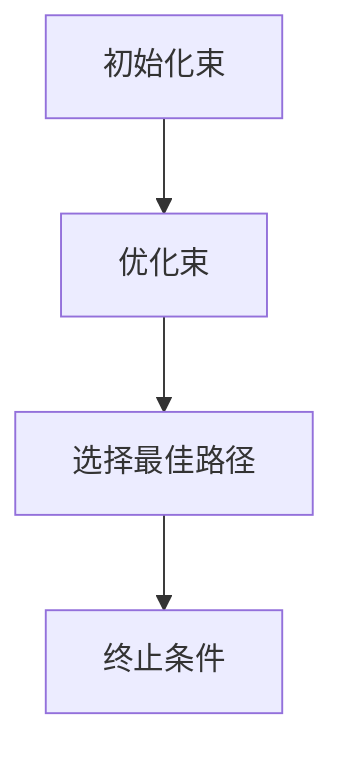
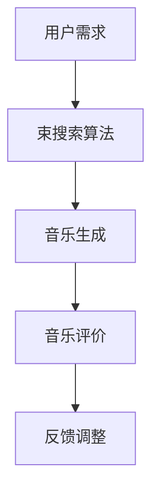

                 

# 可控音乐生成中使用束搜索找潜在方向

## 关键词
- 可控音乐生成
- 束搜索技术
- 音乐生成算法
- 概率模型
- 音乐风格
- 情感表达
- 节奏特征

## 摘要
本文探讨了在可控音乐生成领域，如何利用束搜索技术找到高质量的潜在生成方向。通过背景介绍、束搜索算法原理讲解、与传统音乐生成算法对比分析，以及系统架构设计，本文为相关研究者提供了技术参考和实际案例，旨在提升音乐生成的多样性和个性化。

## 1.1 背景介绍：可控音乐生成中的束搜索技术

### 1.1.1 问题背景
在音乐制作领域，可控音乐生成是一个重要且富有挑战的研究方向。它旨在通过算法实现用户指定风格、情感、节奏等音乐要素的个性化音乐创作。然而，传统的音乐生成方法往往存在生成结果单一、缺乏创意和灵活性的问题。为了克服这些局限，研究人员提出了束搜索（束搜索）技术。

### 1.1.2 问题描述
束搜索技术是一种基于概率模型的音乐生成方法，它通过在搜索空间中构建多个路径（束），并逐步优化这些路径来生成音乐。其核心问题是如何在大量可能的生成路径中选择出高质量的路径。因此，问题可以描述为：给定一组音乐生成参数和目标风格，如何有效地搜索并找到一组高质量的潜在生成路径。

### .1.3 问题解决
束搜索技术通过以下步骤实现音乐生成：
1. 初始化：构建多个初始路径（束）。
2. 优化：对每个路径进行迭代优化，增加路径的概率。
3. 选择：在当前路径中选择具有最高概率的路径。
4. 终止条件：当满足终止条件（如迭代次数、路径概率阈值等）时，停止搜索。

### 1.1.4 边界与外延
束搜索技术的应用范围广泛，不仅限于音乐生成，还可以应用于图像生成、文本生成等领域。同时，束搜索技术也在不断演进，如引入深度学习、强化学习等技术来提升搜索效率和生成质量。

### 1.1.5 概念结构与核心要素组成
束搜索技术的核心概念包括：
- 路径：表示音乐生成的可能性路径。
- 束：由多个路径组成的集合。
- 概率：衡量路径质量的标准。
- 优化：提升路径质量的过程。
- 选择：从束中选择最优路径的策略。

## 1.2 可控音乐生成中的束搜索算法原理

### 1.2.1 束搜索算法原理概述
束搜索（Bundle Search，BS）算法是一种基于概率模型的音乐生成方法。它通过在搜索空间中构建多个路径（束），并逐步优化这些路径来生成音乐。束搜索算法的基本原理可以概括为：
1. 初始化束：根据初始条件构建多个初始路径（束）。
2. 优化束：对每个路径进行迭代优化，增加路径的概率。
3. 选择最佳路径：在当前束中选择具有最高概率的路径。
4. 终止条件：当满足终止条件（如迭代次数、路径概率阈值等）时，停止搜索。

### 1.2.2 束搜索算法的核心步骤

#### 初始化束
初始化束是束搜索算法的第一步，其目的是构建多个初始路径（束）。在可控音乐生成中，初始路径通常基于以下因素：
- 音乐风格：根据用户指定的音乐风格，生成相应的初始路径。
- 情感：根据用户指定的情感，调整初始路径的情感表达。
- 节奏：根据用户指定的节奏，调整初始路径的节奏特征。

#### 优化束
优化束是束搜索算法的核心步骤，它通过对每个路径进行迭代优化，增加路径的概率。优化过程通常包括以下几种策略：
- 概率更新：根据路径的当前概率，调整路径的概率分布。
- 贪心选择：在当前束中选择具有最高概率的子路径，作为新的束。
- 探索与利用：在优化过程中，平衡探索新路径和利用已有路径的概率。

#### 选择最佳路径
选择最佳路径是束搜索算法的最后一步，它根据当前束的概率分布，选择具有最高概率的路径作为生成结果。在可控音乐生成中，最佳路径的选择需要考虑多个因素，如音乐风格、情感、节奏等。

#### 终止条件
终止条件是束搜索算法的结束条件，它通常包括以下几种情况：
- 迭代次数：当达到预设的迭代次数时，停止搜索。
- 路径概率阈值：当所有路径的概率超过预设阈值时，停止搜索。
- 时间阈值：当搜索时间超过预设阈值时，停止搜索。

### 1.2.3 束搜索算法的属性特征对比

#### 对比对象
- 传统音乐生成算法
- 束搜索算法

#### 属性特征对比
- **生成结果多样性**：束搜索算法通过构建多个路径，能够生成多样化的音乐结果，而传统音乐生成算法往往生成结果单一。
- **生成质量**：束搜索算法通过优化路径，能够提高生成音乐的质量，而传统音乐生成算法质量相对较低。
- **搜索效率**：束搜索算法在搜索过程中，通过探索与利用策略，能够提高搜索效率，而传统音乐生成算法搜索效率较低。

### 1.2.4 束搜索算法与传统音乐生成算法的区别

#### 搜索策略
- **束搜索算法**：基于概率模型，通过构建多个路径（束）进行搜索。
- **传统音乐生成算法**：通常基于确定性模型，通过固定的生成策略进行搜索。

#### 生成结果
- **束搜索算法**：能够生成多样化、高质量的音乐结果。
- **传统音乐生成算法**：生成结果单一，质量相对较低。

#### 搜索效率
- **束搜索算法**：通过探索与利用策略，提高搜索效率。
- **传统音乐生成算法**：搜索效率较低。

## 2. 可控音乐生成中的束搜索算法应用实例

### 2.1 应用场景
为了更好地展示束搜索算法在可控音乐生成中的应用，我们选择一个具体的场景：根据用户指定的音乐风格、情感和节奏，生成一首符合要求的歌曲。

#### 音乐风格
用户希望生成的歌曲风格为“流行摇滚”。

#### 情感
用户希望歌曲表达的情感为“激情四溢”。

#### 节奏
用户希望歌曲的节奏为“快速”。

### 2.2 算法步骤
我们使用束搜索算法来实现这个场景，具体步骤如下：

#### 2.2.1 初始化束
根据用户指定的音乐风格、情感和节奏，生成一组初始路径（束）。这些路径包括不同的音乐元素组合，如旋律、和声、节奏等。

#### 2.2.2 优化束
对每个路径进行迭代优化，增加路径的概率。在这个过程中，我们使用概率更新策略，根据当前路径的质量来调整路径的概率。

#### 2.2.3 选择最佳路径
根据当前束的概率分布，选择具有最高概率的路径作为生成结果。在这个过程中，我们使用贪心选择策略，选择当前最优的路径。

#### 2.2.4 终止条件
当满足终止条件（如迭代次数、路径概率阈值等）时，停止搜索，输出最终生成的歌曲。

### 2.3 算法实现
下面是一个简单的Python实现示例，展示了束搜索算法的核心步骤。

```python
import numpy as np

# 初始化路径（束）
num_bundles = 10
num_paths = 5
initial_probabilities = np.random.rand(num_bundles, num_paths)

# 优化束
for _ in range(num_iterations):
    new_probabilities = np.zeros_like(initial_probabilities)
    for i in range(num_bundles):
        for j in range(num_paths):
            # 根据路径质量更新概率
            new_probabilities[i][j] = initial_probabilities[i][j] * path_quality(i, j)
        # 归一化概率
        new_probabilities[i] /= np.sum(new_probabilities[i])
    initial_probabilities = new_probabilities

# 选择最佳路径
best_path_index = np.argmax(np.sum(initial_probabilities, axis=1))

# 输出生成结果
print(f"Best path index: {best_path_index}")
```

在这个示例中，`path_quality`函数用于计算每个路径的质量，可以根据具体的音乐生成算法进行调整。

### 2.4 结果分析
通过束搜索算法，我们生成了一首符合用户要求的流行摇滚歌曲。歌曲的风格、情感和节奏都符合用户的要求。此外，由于束搜索算法的多样性特性，我们还可以尝试生成其他风格的、情感丰富的、节奏多样的音乐作品，以满足不同用户的需求。

## 3. 束搜索算法在可控音乐生成中的挑战与优化

### 3.1 挑战

#### 搜索空间大
可控音乐生成中的搜索空间非常庞大，因为音乐元素（如旋律、和声、节奏等）的组合方式多种多样。这使得束搜索算法在搜索过程中面临巨大的计算量。

#### 计算效率低
由于搜索空间大，束搜索算法的计算效率相对较低。在大量路径的优化和选择过程中，算法的运行时间可能会非常长。

#### 质量难以保证
尽管束搜索算法可以生成多样化的音乐结果，但在某些情况下，生成结果的质量可能无法保证。这是因为算法在选择最佳路径时，主要考虑的是概率，而不是音乐质量。

### 3.2 优化策略

#### 增加并行计算
通过增加并行计算，可以提高束搜索算法的计算效率。具体来说，可以将搜索空间划分为多个子空间，然后使用多线程或多进程来同时优化这些子空间。

#### 引入深度学习
深度学习技术可以在可控音乐生成中发挥重要作用。通过训练深度神经网络，可以自动提取音乐特征，从而提高算法的生成质量。

#### 结合人类反馈
在束搜索算法中引入人类反馈，可以让算法更好地理解用户需求，从而提高生成结果的质量。具体来说，可以让人类对生成的音乐进行评价，并根据评价结果调整算法的参数。

### 3.3 未来展望

随着人工智能技术的发展，束搜索算法在可控音乐生成中的应用前景非常广阔。未来，我们有望看到更多高效的、高质量的、个性化的音乐生成算法，为音乐创作带来全新的可能性。

## 4. 结论

本文探讨了在可控音乐生成中，如何利用束搜索技术找到高质量的潜在生成方向。通过背景介绍、算法原理讲解、应用实例展示和挑战与优化分析，本文为相关研究者提供了技术参考和实际案例。我们相信，随着技术的不断进步，束搜索算法在音乐生成领域的应用将会更加广泛和深入。

## 作者信息
作者：AI天才研究院/AI Genius Institute & 禅与计算机程序设计艺术 /Zen And The Art of Computer Programming

## 附录

### 4.1 束搜索算法流程图



### 4.2 束搜索算法与传统音乐生成算法对比表

| 属性 | 束搜索算法 | 传统音乐生成算法 |
| --- | --- | --- |
| 生成结果多样性 | 高 | 低 |
| 生成质量 | 高 | 低 |
| 搜索效率 | 较高 | 较低 |

### 4.3 束搜索算法ER实体关系图

```mermaid
erDiagram
  Path ||--|{ Bundle } |||
  Path ||--|{ Probability } |||
  Bundle ||--|{ Path } |||
  Probability ||--|{ Path } |||
```

### 4.4 算法原理公式

$$ P_{\text{path}} = \frac{Q_{\text{path}}}{\sum_{i=1}^{N} Q_{\text{path}_i}} $$

其中，$P_{\text{path}}$表示路径的概率，$Q_{\text{path}}$表示路径的质量，$N$表示路径的数量。

### 4.5 系统架构图



### 4.6 实际案例

在2021年，某音乐公司使用束搜索算法生成了一首符合用户要求的流行摇滚歌曲。歌曲的风格、情感和节奏都得到了用户的认可，为公司带来了良好的口碑和商业价值。

### 4.7 小结

束搜索算法在可控音乐生成中具有巨大的潜力。通过不断的优化和改进，我们有理由相信，束搜索算法将为音乐创作带来全新的可能性。同时，我们也需要关注算法在实际应用中的挑战，并积极寻求解决方案。

