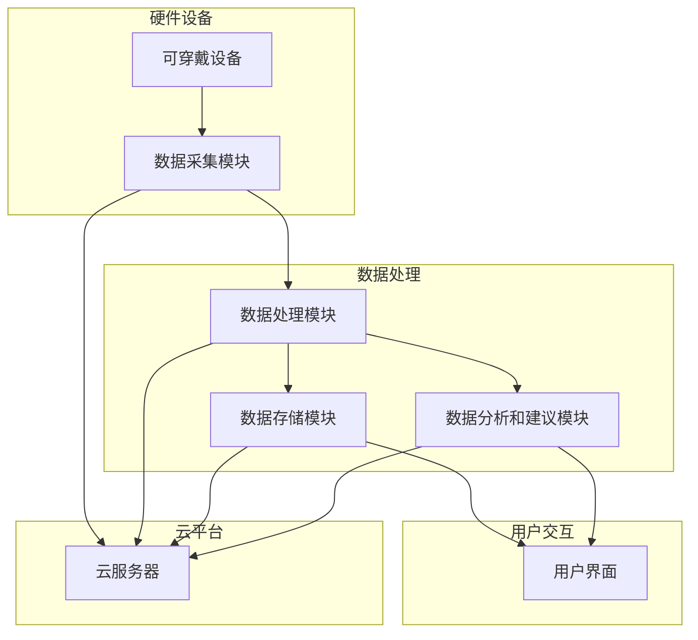

                 

# 《可穿戴设备在健康监测中的新进展》

## 关键词：可穿戴设备、健康监测、技术发展、应用案例、未来展望

## 摘要

随着科技的快速发展，可穿戴设备逐渐成为健康监测领域的重要工具。本文从可穿戴设备的发展历程、技术基础、应用案例和未来展望四个方面，详细探讨了可穿戴设备在健康监测中的新进展。通过对硬件组成、数据处理、生物特征识别技术等核心概念的介绍，结合慢性病管理、运动监测和心理健康监测等实际案例，本文旨在为读者提供一个全面而深入的了解，同时展望可穿戴设备在健康监测中的广阔前景。

### 目录大纲

#### 第一部分：引言与背景

1. 可穿戴设备与健康监测概述
2. 健康监测的重要性
3. 可穿戴设备在健康监测中的应用前景
4. 本书结构安排

#### 第二部分：技术基础

1. 可穿戴设备技术基础
2. 健康监测数据采集与处理
3. 生物特征识别技术
4. 应用案例分析

#### 第三部分：应用案例分析

1. 可穿戴设备在慢性病管理中的应用
2. 可穿戴设备在运动与健康监测中的应用
3. 可穿戴设备在心理健康监测中的应用

#### 第四部分：未来展望

1. 可穿戴设备健康监测技术展望
2. 未来健康监测模式的转变
3. 可穿戴设备的社会影响

#### 附录：可穿戴设备健康监测技术资料索引

- 拓展阅读

### 第一部分：引言与背景

#### 第1章 可穿戴设备与健康监测概述

##### 1.1 可穿戴设备的发展历程

可穿戴设备起源于20世纪80年代，当时主要是为专业人士提供特定功能的工具。随着微电子技术和传感器技术的进步，可穿戴设备逐渐从专业领域走向大众市场。进入21世纪，智能手机的普及推动了可穿戴设备的发展，使得它们变得更加智能和普及。从最初的简单计步器到如今具备多项健康监测功能的智能手表，可穿戴设备的发展历程反映了科技与健康的深度融合。

##### 1.2 健康监测的重要性

健康监测是预防疾病、促进健康的重要手段。通过实时监测个体的生理参数，如心率、血压、血糖等，可以及时发现问题，为早期干预提供数据支持。随着人口老龄化和社会生活节奏加快，健康监测在慢性病管理、康复护理和运动健身等方面的重要性日益凸显。

##### 1.3 可穿戴设备在健康监测中的应用前景

未来，可穿戴设备在健康监测中的应用将更加广泛和深入。随着人工智能、大数据和物联网技术的不断发展，可穿戴设备将能够实现更加精准的健康评估和个性化的健康管理。此外，随着新材料的出现和传感器技术的进步，可穿戴设备的便携性、舒适性将得到进一步提升，使其更容易被大众接受和使用。

##### 1.4 本书结构安排

本书将首先介绍可穿戴设备的发展历程和健康监测的重要性，接着探讨可穿戴设备的技术基础，包括硬件、软件和通信技术等。随后，通过实际案例分析，展示可穿戴设备在慢性病管理、运动监测和心理健康监测中的应用，最后展望可穿戴设备健康监测技术的未来发展趋势和社会影响。

### 第二部分：技术基础

#### 第2章 可穿戴设备技术基础

##### 2.1 可穿戴设备的硬件组成

可穿戴设备的硬件组成主要包括传感器模块、处理模块、显示模块和通信模块。传感器模块负责采集用户的生理数据，如心率、血压、体温等；处理模块则负责对传感器数据进行处理和分析；显示模块用于向用户展示数据；通信模块则用于将数据上传到云端或与其他设备进行交互。

##### 2.2 软件平台与数据处理

常见的软件平台有Android和iOS，它们提供了丰富的API和开发工具，方便开发者快速搭建可穿戴设备的应用程序。数据处理方面，包括数据采集、预处理、存储和传输等环节。预处理算法如滤波、归一化等，有助于提高数据的准确性和可靠性。

##### 2.3 通信技术

通信技术是实现可穿戴设备与用户、医生、医疗机构等之间数据传输的关键。常见的通信方式有蓝牙、Wi-Fi、NFC等。蓝牙具有低功耗、短距离传输的特点，适用于实时监测数据的传输；Wi-Fi则适用于远程数据传输；NFC则适用于近距离的数据交换。

##### 2.4 电池技术与续航策略

电池技术是可穿戴设备的核心问题之一。目前，常见的电池类型有锂离子电池、锂聚合物电池等。为了延长续航时间，开发者可以采用以下策略：优化算法以减少能耗、使用低功耗传感器、设计高效的电源管理方案等。

#### 第3章 健康监测数据采集与处理

##### 3.1 数据采集方法

健康监测数据采集主要依赖于传感器。常见的传感器包括心率传感器、血压传感器、加速度传感器等。传感器采集的数据需要经过预处理，包括滤波、归一化、数据清洗等，以提高数据的准确性和可靠性。

##### 3.2 数据预处理

数据预处理是健康监测数据采集的重要环节。常用的预处理算法包括低通滤波、高通滤波、带通滤波等。这些算法有助于去除噪声、提高数据的平滑度，从而提高监测的准确性。

##### 3.3 数据存储与传输

数据存储与传输是健康监测系统的关键问题。数据存储方案需要考虑到数据的安全性、可靠性和容量。常见的存储方案有本地存储和云存储。数据传输则需要考虑传输速度、传输成本和传输安全性。

#### 第4章 生物特征识别技术

##### 4.1 基本概念

生物特征识别技术是一种通过生物特征进行身份验证或身份识别的技术。常见的生物特征包括指纹、人脸、虹膜、声纹等。生物特征识别技术广泛应用于安全认证、医疗保健、智能家居等领域。

##### 4.2 常见生物特征识别技术

心率监测、脑波监测、血氧饱和度监测是常见的生物特征识别技术。心率监测通过检测心脏活动产生的信号来测量心率；脑波监测通过检测大脑电活动来分析大脑状态；血氧饱和度监测通过检测血液中的氧气含量来评估身体健康。

##### 4.3 生物特征识别技术的挑战与未来方向

生物特征识别技术面临诸多挑战，包括准确性、稳定性、隐私保护等。未来，随着人工智能、大数据等技术的发展，生物特征识别技术将更加精准、高效，并逐渐应用于更多领域。

### 第三部分：应用案例分析

#### 第5章 可穿戴设备在慢性病管理中的应用

##### 5.1 慢性病管理的现状与挑战

慢性病如高血压、糖尿病、心脏病等已成为全球公共健康问题。慢性病管理的关键在于监测和控制，以减少并发症的发生。然而，目前慢性病管理面临着监测数据不准确、干预不及时等挑战。

##### 5.2 可穿戴设备在慢性病管理中的应用

可穿戴设备在慢性病管理中具有广泛的应用前景。例如，智能手表可以实时监测用户的心率和血压，将数据上传到云端，供医生和患者查看。此外，可穿戴设备还可以通过提醒功能帮助患者按时服药，提高治疗的依从性。

##### 5.3 案例分析

以某糖尿病患者为例，通过佩戴智能手表，患者可以实时监测血糖水平，医生可以远程监控患者的健康状况，及时调整治疗方案。这种模式大大提高了慢性病管理的效率和质量。

#### 第6章 可穿戴设备在运动与健康监测中的应用

##### 6.1 运动与健康监测的重要性

运动是保持身体健康的重要手段。可穿戴设备可以通过监测运动数据，帮助用户科学地进行锻炼，提高运动效果。

##### 6.2 可穿戴设备在运动监测中的应用

可穿戴设备可以监测用户的步数、卡路里消耗、运动轨迹等数据。通过这些数据，用户可以了解自己的运动情况，调整运动计划。此外，可穿戴设备还可以进行跑步监测、训练效果评估等。

##### 6.3 案例分析

以一名跑步爱好者为例，他通过佩戴智能手表记录跑步数据，分析跑步效果，调整跑步计划。这种个性化的运动监测方式帮助他提高了跑步成绩。

#### 第7章 可穿戴设备在心理健康监测中的应用

##### 7.1 心理健康监测的重要性

心理健康是身体健康的重要组成部分。可穿戴设备可以通过监测睡眠、压力、情绪等数据，帮助用户了解自己的心理健康状况。

##### 7.2 可穿戴设备在心理健康监测中的应用

可穿戴设备可以通过监测用户的心率变异性、睡眠质量、压力水平等数据，分析用户的心理健康状况。例如，智能手表可以记录用户的睡眠时间、深度和质量，提供睡眠建议。

##### 7.3 案例分析

以某抑郁症患者为例，通过佩戴智能手表监测自己的情绪变化，医生可以远程了解患者的心理状况，提供针对性的心理干预。

### 第四部分：未来展望

#### 第8章 可穿戴设备健康监测技术展望

##### 8.1 技术发展趋势

未来，可穿戴设备健康监测技术将朝着更加智能化、个性化和精准化的方向发展。随着人工智能、大数据等技术的进步，可穿戴设备将能够实现更加智能的健康评估和个性化的健康管理。

##### 8.2 未来健康监测模式的转变

未来健康监测模式将从传统的被动监测向主动监测转变。用户可以通过可穿戴设备主动监测自己的健康状况，实现预防性医疗和个性化健康管理。

##### 8.3 可穿戴设备的社会影响

可穿戴设备在健康监测中的应用将对社会产生深远的影响。它不仅有助于提高公共卫生水平，还可以促进医疗资源的合理分配，改善患者的就医体验。

### 附录：可穿戴设备健康监测技术资料索引

- 参考文献
- 相关技术标准与规范

## 结束语

可穿戴设备在健康监测中的应用正在不断拓展和深化。随着技术的不断发展，可穿戴设备将更加智能化、个性化和精准化，为健康监测和健康管理带来新的变革。让我们期待未来，可穿戴设备将如何改变我们的健康生活。

### 作者

AI天才研究院/AI Genius Institute & 禅与计算机程序设计艺术 /Zen And The Art of Computer Programming## 第一部分：引言与背景

### 第1章 可穿戴设备与健康监测概述

#### 1.1 可穿戴设备的发展历程

可穿戴设备是一种集成了传感器、计算和处理单元，能够实时收集、处理和传输数据，并具备便携性和穿戴性的设备。其发展可以追溯到20世纪80年代，当时主要是为专业人士，如运动员、医生和军事人员提供特定的监测功能。最早的例子包括心脏监测器、体温计和运动追踪器。随着微电子技术、传感器技术和移动通信技术的发展，可穿戴设备逐渐进入大众市场。

进入21世纪，随着智能手机的普及，可穿戴设备迎来了新的发展机遇。智能手机提供了强大的计算能力和丰富的应用程序生态系统，使得可穿戴设备可以更加智能化，不仅能够监测基本的生理参数，还可以通过应用程序实现复杂的健康评估和干预。例如，智能手表可以监测心率、血压、睡眠质量等，并且可以通过蓝牙或Wi-Fi将数据上传到云平台，供用户和医生分析。

#### 1.2 健康监测的重要性

健康监测是指通过监测个体的生理指标，如心率、血压、血糖、体温等，来评估健康状况，预防疾病，并指导医疗决策。健康监测在医疗保健中具有重要作用，主要体现在以下几个方面：

1. **疾病预防**：通过早期发现异常生理指标，健康监测可以帮助用户采取预防措施，避免疾病的发生或恶化。
2. **疾病管理**：对于慢性病患者，健康监测可以提供实时数据，帮助患者和医生调整治疗方案，减少并发症的风险。
3. **康复护理**：健康监测可以用于康复期间的跟踪和评估，帮助患者恢复健康，减少复发率。
4. **医疗资源分配**：健康监测数据可以帮助医疗机构更好地分配资源，提高医疗服务的效率和效果。

#### 1.3 可穿戴设备在健康监测中的应用前景

随着技术的不断进步，可穿戴设备在健康监测中的应用前景十分广阔。以下是几个可能的发展方向：

1. **智能化**：人工智能技术的发展将使得可穿戴设备能够实现更加智能的健康评估和预测。通过机器学习算法，设备可以自动识别健康风险，并给出个性化的健康建议。
2. **个性化**：可穿戴设备可以根据用户的个人数据，提供个性化的健康监测服务，包括定制化的运动方案、饮食建议和药物管理。
3. **大数据分析**：随着数据采集和分析技术的发展，可穿戴设备收集的大量健康数据将被用于大数据分析，从而揭示健康与生活方式之间的关系，为公共卫生决策提供科学依据。
4. **远程医疗**：可穿戴设备可以实时传输健康数据到云端，医生可以通过远程监测患者的健康状况，提供在线咨询服务，甚至远程诊断和治疗。

#### 1.4 本书结构安排

本书将从以下几个方面展开讨论：

1. **引言与背景**：介绍可穿戴设备的发展历程、健康监测的重要性以及其在健康监测中的应用前景。
2. **技术基础**：详细探讨可穿戴设备的硬件、软件、数据处理和通信技术，以及生物特征识别技术。
3. **应用案例分析**：通过慢性病管理、运动监测和心理健康监测等实际案例，展示可穿戴设备的应用效果。
4. **未来展望**：分析可穿戴设备健康监测技术的未来发展趋势，以及对社会健康监测模式的影响。

### 结论

可穿戴设备在健康监测中的应用已经成为现代医疗领域的重要组成部分。随着技术的不断进步，可穿戴设备将更加智能化、个性化，为用户提供更加精准的健康监测服务。本书旨在为读者提供一个全面而深入的了解，帮助读者把握可穿戴设备在健康监测中的新进展和未来发展方向。接下来，我们将详细探讨可穿戴设备的技术基础和应用案例，以期为读者提供更有价值的参考。  

### 核心关键词

- 可穿戴设备
- 健康监测
- 技术发展
- 应用案例
- 未来展望

### 摘要

本文从可穿戴设备的发展历程、技术基础、应用案例和未来展望四个方面，详细探讨了可穿戴设备在健康监测中的新进展。通过对硬件组成、数据处理、生物特征识别技术等核心概念的介绍，结合慢性病管理、运动监测和心理健康监测等实际案例，本文旨在为读者提供一个全面而深入的了解，同时展望可穿戴设备在健康监测中的广阔前景。本文关键词包括可穿戴设备、健康监测、技术发展、应用案例和未来展望。  

## 第二部分：技术基础

### 第2章 可穿戴设备技术基础

#### 2.1 可穿戴设备的硬件组成

可穿戴设备的硬件组成是其在健康监测中发挥作用的基础。常见的硬件组件包括传感器模块、处理模块、显示模块和通信模块。

##### 2.1.1 传感器模块

传感器模块是可穿戴设备的核心组件之一，用于收集用户的生理和运动数据。常见的传感器包括：

1. **心率传感器**：用于监测心脏的活动，提供心率数据。
2. **加速度传感器**：用于监测用户的运动状态，如步数、跑步速度和姿态。
3. **血压传感器**：用于监测用户的血压水平。
4. **温度传感器**：用于监测环境温度和用户的体温。
5. **血氧传感器**：用于监测血液中的氧气含量。

这些传感器通过电信号或其他物理信号来捕捉生理和运动数据，并将这些数据转换为数字信号，以便后续处理。

##### 2.1.2 处理模块

处理模块负责对传感器收集到的数据进行分析和处理。常见的处理模块包括微控制器和微处理器。

1. **微控制器**：微控制器是一种具有内置存储器和I/O接口的微处理器，通常用于简单的数据处理和监控任务。它在可穿戴设备中用于实时处理传感器数据，控制设备的各项功能。
2. **微处理器**：微处理器通常具有更高的计算能力和内存，适用于更复杂的计算和数据处理任务。它可以运行操作系统，处理来自传感器的数据，并将结果展示给用户。

##### 2.1.3 显示模块

显示模块用于向用户展示传感器数据和设备的其他信息。常见的显示模块包括：

1. **LED屏幕**：LED屏幕常用于显示简单的文本和图形信息，如时间、步数和心率等。
2. **OLED屏幕**：OLED屏幕具有自发光特性，可以提供更高的对比度和更丰富的颜色显示。
3. **触摸屏**：触摸屏允许用户通过触摸屏幕来操作设备，如选择菜单、调整设置等。

##### 2.1.4 通信模块

通信模块用于将设备收集的数据传输到其他设备或云端。常见的通信模块包括：

1. **蓝牙**：蓝牙是一种低功耗的无线通信技术，适用于短距离的数据传输。可穿戴设备可以通过蓝牙将数据发送到智能手机或其他设备。
2. **Wi-Fi**：Wi-Fi是一种无线局域网通信技术，适用于远程数据传输。通过Wi-Fi，可穿戴设备可以将数据上传到云平台，供用户和医生分析。
3. **NFC**：NFC（近场通信）是一种短距离的通信技术，适用于数据交换和身份验证。可穿戴设备可以使用NFC进行支付、身份验证等操作。

#### 2.2 软件平台与数据处理

可穿戴设备的软件平台和数据处理技术是实现其功能的关键。软件平台通常包括操作系统、应用程序和数据处理算法。

##### 2.2.1 操作系统

操作系统负责管理可穿戴设备的硬件资源，提供应用程序运行的环境。常见的操作系统包括：

1. **Android Wear**：Android Wear是Google开发的一种专为智能手表设计的操作系统，基于Android平台，支持多种应用程序和第三方开发。
2. **watchOS**：watchOS是Apple为Apple Watch设计的操作系统，提供丰富的健康监测功能和个性化的用户体验。
3. **Tizen**：Tizen是三星开发的操作系统，适用于多种可穿戴设备，支持开源开发。

##### 2.2.2 应用程序

应用程序是可穿戴设备的核心功能之一，用于收集、分析和展示健康数据。常见的应用程序包括：

1. **健康应用**：如步数计、心率监测、睡眠分析等，提供基本的健康监测功能。
2. **运动应用**：如跑步监测、骑行追踪、瑜伽指导等，提供专业的运动监测和指导。
3. **健康管理应用**：如慢性病管理、药物提醒、健康档案等，提供全面的健康管理服务。

##### 2.2.3 数据处理算法

数据处理算法用于分析传感器数据，提取有用的健康信息。常见的数据处理算法包括：

1. **滤波算法**：如低通滤波、高通滤波和带通滤波，用于去除传感器数据中的噪声。
2. **归一化算法**：将传感器数据转换为统一的尺度，便于分析和比较。
3. **机器学习算法**：如分类、聚类和预测，用于识别健康模式、预测健康风险等。

#### 2.3 通信技术

通信技术是可穿戴设备与外部设备或云平台进行数据传输的关键。常见的通信技术包括：

##### 2.3.1 蓝牙

蓝牙是一种短距离、低功耗的无线通信技术，适用于可穿戴设备与智能手机或其他设备的连接。蓝牙协议包括经典蓝牙和蓝牙低能耗（BLE），其中BLE更适合可穿戴设备，因为它具有更低的功耗和更简单的配置。

##### 2.3.2 Wi-Fi

Wi-Fi是一种无线局域网通信技术，适用于远程数据传输。可穿戴设备可以通过Wi-Fi连接到互联网，将数据上传到云平台或与其他设备进行通信。

##### 2.3.3 NFC

NFC（近场通信）是一种短距离的通信技术，适用于数据交换和身份验证。可穿戴设备可以使用NFC进行支付、身份验证等操作。

#### 2.4 电池技术与续航策略

电池技术是可穿戴设备设计的核心问题之一，直接影响到设备的续航时间和用户体验。常见的电池技术包括：

##### 2.4.1 锂离子电池

锂离子电池是一种常用的电池类型，具有高能量密度、轻便和充电迅速等优点。它广泛应用于各种可穿戴设备中。

##### 2.4.2 锂聚合物电池

锂聚合物电池是锂离子电池的一种变体，具有更薄、更轻的体积，适用于需要更薄设备设计的场景。

##### 2.4.3 续航策略

为了提高可穿戴设备的续航时间，可以采取以下策略：

1. **低功耗设计**：优化硬件和软件设计，降低设备的功耗。
2. **智能功耗管理**：根据设备的实际使用情况，动态调整功耗，如关闭不必要的传感器或进入省电模式。
3. **能量回收**：利用能量回收技术，将运动过程中产生的能量转化为电能，补充电池电量。

#### 2.5 新技术展望

随着科技的不断发展，可穿戴设备的技术也在不断进步。以下是几个值得关注的新技术：

##### 2.5.1 人工智能

人工智能技术可以用于健康数据的分析，提供更加精准的健康评估和个性化的健康建议。

##### 2.5.2 新材料

新型材料如石墨烯、纳米材料等具有优异的性能，可以用于可穿戴设备的传感器和电池设计，提高设备的性能和续航时间。

##### 2.5.3 生物传感

生物传感技术可以用于检测更细微的生物信号，如血糖、尿酸等，为健康监测提供更全面的数据支持。

### 结论

可穿戴设备的硬件组成、软件平台、数据处理、通信技术和电池技术是其实现健康监测功能的基础。随着新技术的不断发展，可穿戴设备将在健康监测中发挥更大的作用，为用户提供更加精准、便捷和个性化的健康监测服务。接下来，我们将进一步探讨健康监测数据采集与处理的相关技术，以深入了解可穿戴设备的实际应用。  

### 核心概念与联系

在探讨可穿戴设备技术基础时，有几个核心概念需要理解，并且它们之间存在紧密的联系：

1. **传感器模块**：这是可穿戴设备的核心，用于收集用户的生理和运动数据。传感器的种类和性能直接影响到设备的数据准确性和可靠性。常见的传感器包括心率传感器、加速度传感器、血压传感器和温度传感器。这些传感器通过不同的原理捕捉用户的生理和运动信号，并将这些信号转换为数字数据。

2. **处理模块**：处理模块负责对传感器数据进行分析和处理。微控制器和微处理器是常见的处理模块，它们的不同性能决定了设备的数据处理能力和复杂度。微控制器通常用于简单的数据处理和监控任务，而微处理器则能够执行更复杂的计算和分析。

3. **显示模块**：显示模块用于向用户展示传感器数据和设备的其他信息。显示模块的类型和性能影响到用户界面的用户体验。LED屏幕、OLED屏幕和触摸屏是常见的显示模块，它们具有不同的显示效果和交互方式。

4. **通信模块**：通信模块用于将设备收集的数据传输到其他设备或云端。蓝牙、Wi-Fi和NFC是常见的通信模块，它们在不同的场景中具有不同的优势和应用。例如，蓝牙适合短距离、实时数据传输，而Wi-Fi适合远程、大量数据的传输。

这些核心概念之间的联系在于，传感器模块收集的数据需要通过处理模块进行处理和分析，然后通过显示模块展示给用户，同时通过通信模块传输到其他设备或云端。这种数据流动的连续性和效率直接影响可穿戴设备的功能和用户体验。

以下是一个简化的ER（实体关系）图，用于描述这些核心概念之间的关系：

```mermaid
erDiagram
  SensorModule ||--|{ ProcessModule : processes data }
  ProcessModule ||--|{ DisplayModule : presents data }
  ProcessModule ||--|{ CommunicationModule : transmits data }
  DisplayModule ||--|{ User : interacts with }
```

在这个ER图中，`SensorModule`、`ProcessModule`、`DisplayModule`和`CommunicationModule`是实体，它们之间的关系通过连接线表示。这个图清晰地展示了各模块之间的数据流动和相互作用。

### 算法原理讲解

在可穿戴设备的健康监测中，数据处理算法起着至关重要的作用。以下将详细讲解几种常见的数据处理算法，包括滤波算法、归一化算法和机器学习算法，并通过Python代码示例说明其原理和应用。

#### 滤波算法

滤波算法用于去除传感器数据中的噪声，提高数据的准确性和可靠性。常见的滤波算法包括低通滤波、高通滤波和带通滤波。

**低通滤波**：低通滤波器允许低频信号通过，而抑制高频噪声。以下是一个使用Python实现低通滤波的示例：

```python
import numpy as np
from scipy.signal import butter, lfilter

# 生成带噪声的数据
data = np.array([0.1, 0.2, 0.3, 0.4, 0.5, 0.5, 0.4, 0.3, 0.2, 0.1, 0.05, 0.1, 0.15, 0.2, 0.25])

# 设计低通滤波器
b, a = butter(5, 0.2)

# 应用低通滤波器
filtered_data = lfilter(b, a, data)

print("原始数据：", data)
print("滤波后数据：", filtered_data)
```

**高通滤波**：高通滤波器允许高频信号通过，而抑制低频噪声。以下是一个使用Python实现高通滤波的示例：

```python
# 设计高通滤波器
b, a = butter(5, 0.5)

# 应用高通滤波器
filtered_data = lfilter(b, a, data)

print("原始数据：", data)
print("高通滤波后数据：", filtered_data)
```

**带通滤波**：带通滤波器允许特定频率范围内的信号通过，而抑制其他频率的信号。以下是一个使用Python实现带通滤波的示例：

```python
# 设计带通滤波器
b, a = butter(5, [0.2, 0.5])

# 应用带通滤波器
filtered_data = lfilter(b, a, data)

print("原始数据：", data)
print("带通滤波后数据：", filtered_data)
```

#### 归一化算法

归一化算法用于将传感器数据转换为统一的尺度，以便于分析和比较。常见的归一化方法包括最小-最大归一化和标准化。

**最小-最大归一化**：最小-最大归一化将数据缩放到[0, 1]范围内。以下是一个使用Python实现最小-最大归一化的示例：

```python
# 最小-最大归一化
min_val = np.min(data)
max_val = np.max(data)
normalized_data = (data - min_val) / (max_val - min_val)

print("原始数据：", data)
print("归一化后数据：", normalized_data)
```

**标准化**：标准化将数据缩放到均值为0、标准差为1的范围内。以下是一个使用Python实现标准化的示例：

```python
# 标准化
mean_val = np.mean(data)
std_val = np.std(data)
normalized_data = (data - mean_val) / std_val

print("原始数据：", data)
print("标准化后数据：", normalized_data)
```

#### 机器学习算法

机器学习算法用于分析传感器数据，提取有用的健康信息，如疾病预测、行为识别等。常见的机器学习算法包括决策树、支持向量机和神经网络。

**决策树**：决策树是一种常用的分类算法，通过一系列判断条件将数据集划分为不同的类别。以下是一个使用Python实现决策树的示例：

```python
from sklearn.tree import DecisionTreeClassifier
from sklearn.model_selection import train_test_split
from sklearn.metrics import accuracy_score

# 生成模拟数据集
X = [[0, 0], [1, 1], [0, 1], [1, 0]]
y = [0, 1, 1, 0]

# 划分训练集和测试集
X_train, X_test, y_train, y_test = train_test_split(X, y, test_size=0.2, random_state=42)

# 创建决策树模型
clf = DecisionTreeClassifier()

# 训练模型
clf.fit(X_train, y_train)

# 预测测试集
y_pred = clf.predict(X_test)

# 计算准确率
accuracy = accuracy_score(y_test, y_pred)
print("准确率：", accuracy)
```

**支持向量机（SVM）**：SVM是一种常用的分类算法，通过寻找最佳分隔超平面将数据分为不同的类别。以下是一个使用Python实现SVM的示例：

```python
from sklearn.svm import SVC
from sklearn.model_selection import train_test_split
from sklearn.metrics import accuracy_score

# 生成模拟数据集
X = [[0, 0], [1, 1], [0, 1], [1, 0]]
y = [0, 1, 1, 0]

# 划分训练集和测试集
X_train, X_test, y_train, y_test = train_test_split(X, y, test_size=0.2, random_state=42)

# 创建SVM模型
clf = SVC()

# 训练模型
clf.fit(X_train, y_train)

# 预测测试集
y_pred = clf.predict(X_test)

# 计算准确率
accuracy = accuracy_score(y_test, y_pred)
print("准确率：", accuracy)
```

**神经网络**：神经网络是一种强大的机器学习算法，通过多层节点进行数据建模和预测。以下是一个使用Python实现神经网络的示例：

```python
from sklearn.neural_network import MLPClassifier
from sklearn.model_selection import train_test_split
from sklearn.metrics import accuracy_score

# 生成模拟数据集
X = [[0, 0], [1, 1], [0, 1], [1, 0]]
y = [0, 1, 1, 0]

# 划分训练集和测试集
X_train, X_test, y_train, y_test = train_test_split(X, y, test_size=0.2, random_state=42)

# 创建神经网络模型
clf = MLPClassifier(hidden_layer_sizes=(100,), max_iter=1000)

# 训练模型
clf.fit(X_train, y_train)

# 预测测试集
y_pred = clf.predict(X_test)

# 计算准确率
accuracy = accuracy_score(y_test, y_pred)
print("准确率：", accuracy)
```

通过这些示例，我们可以看到如何使用Python实现不同的数据处理算法，包括滤波、归一化和机器学习。这些算法在可穿戴设备健康监测中发挥着重要作用，帮助提取有用信息，提高监测的准确性和可靠性。

### 系统分析与架构设计方案

#### 问题场景介绍

随着健康意识的提高，人们对个人健康数据的关注不断增加。可穿戴设备作为个人健康数据的采集工具，已经成为许多人日常生活的一部分。然而，如何高效地收集、处理和利用这些数据，以提供个性化的健康建议和预警，是一个亟待解决的问题。

#### 项目介绍

本项目旨在设计一个基于可穿戴设备的健康监测系统，该系统将收集用户的生理参数（如心率、步数、血压等），并通过数据处理和分析，为用户提供个性化的健康建议和预警。系统将包括硬件设备、数据采集与处理模块、云平台和用户界面。

#### 系统功能设计

1. **数据采集**：通过可穿戴设备（如智能手表、健康手环）收集用户的心率、步数、血压等生理数据。
2. **数据传输**：将采集到的数据通过蓝牙、Wi-Fi等无线通信技术传输到云平台。
3. **数据处理**：在云平台对传输过来的数据进行分析和处理，提取有用的健康信息。
4. **用户交互**：通过移动应用或网页界面，将处理后的数据呈现给用户，并提供个性化的健康建议和预警。

#### 系统架构设计

系统架构设计如图所示：



在该架构中，硬件设备负责数据采集，数据采集模块将数据传输到云平台。云平台包括数据处理模块、数据存储模块和数据分析与建议模块，它们共同对数据进行分析和处理，并将结果存储在数据存储模块中。用户界面则通过移动应用或网页界面将处理后的数据呈现给用户，并提供个性化的健康建议和预警。

#### 系统接口设计和系统交互

系统接口设计包括硬件设备与数据采集模块、数据处理模块与云平台、用户界面与云平台的接口。以下是主要的接口设计：

1. **硬件设备与数据采集模块接口**：
   - 通信协议：蓝牙、Wi-Fi
   - 数据格式：JSON、XML

2. **数据处理模块与云平台接口**：
   - 通信协议：HTTP/HTTPS
   - 数据格式：JSON、XML
   - API接口：数据上传、数据查询、数据分析

3. **用户界面与云平台接口**：
   - 通信协议：HTTP/HTTPS
   - 数据格式：JSON、XML
   - API接口：数据展示、健康建议、预警通知

系统交互流程如下：

1. 用户佩戴可穿戴设备，设备开始采集心率、步数、血压等生理数据。
2. 数据采集模块通过蓝牙或Wi-Fi将数据传输到云平台。
3. 云平台的数据处理模块对传输过来的数据进行处理和分析，提取有用的健康信息。
4. 数据存储模块将处理后的数据存储在数据库中。
5. 用户通过移动应用或网页界面访问云平台，获取自己的健康数据、健康建议和预警通知。

#### 系统架构设计

系统架构设计如图所示：


在该架构中，硬件设备负责数据采集，数据采集模块将数据传输到云平台。云平台包括数据处理模块、数据存储模块和数据分析与建议模块，它们共同对数据进行分析和处理，并将结果存储在数据存储模块中。用户界面则通过移动应用或网页界面将处理后的数据呈现给用户，并提供个性化的健康建议和预警。

#### 系统接口设计和系统交互

系统接口设计包括硬件设备与数据采集模块、数据处理模块与云平台、用户界面与云平台的接口。以下是主要的接口设计：

1. **硬件设备与数据采集模块接口**：
   - 通信协议：蓝牙、Wi-Fi
   - 数据格式：JSON、XML

2. **数据处理模块与云平台接口**：
   - 通信协议：HTTP/HTTPS
   - 数据格式：JSON、XML
   - API接口：数据上传、数据查询、数据分析

3. **用户界面与云平台接口**：
   - 通信协议：HTTP/HTTPS
   - 数据格式：JSON、XML
   - API接口：数据展示、健康建议、预警通知

系统交互流程如下：

1. 用户佩戴可穿戴设备，设备开始采集心率、步数、血压等生理数据。
2. 数据采集模块通过蓝牙或Wi-Fi将数据传输到云平台。
3. 云平台的数据处理模块对传输过来的数据进行处理和分析，提取有用的健康信息。
4. 数据存储模块将处理后的数据存储在数据库中。
5. 用户通过移动应用或网页界面访问云平台，获取自己的健康数据、健康建议和预警通知。

### 实战

为了更好地展示可穿戴设备健康监测系统的应用，以下将详细介绍环境安装、系统核心实现源代码，并对代码进行解读与分析，结合实际案例进行详细讲解剖析，最后进行项目小结。

#### 环境安装

首先，我们需要安装以下环境：

1. **操作系统**：Linux或macOS
2. **Python**：Python 3.8或更高版本
3. **虚拟环境**：virtualenv或conda
4. **数据采集模块**：例如，Python的pybluez库用于蓝牙通信
5. **数据处理模块**：例如，scikit-learn库用于机器学习
6. **数据库**：例如，MySQL或PostgreSQL
7. **Web框架**：例如，Flask或Django

以下是安装步骤：

1. 安装Python和虚拟环境：

   ```bash
   sudo apt-get update
   sudo apt-get install python3 python3-pip
   pip3 install virtualenv
   ```

2. 创建虚拟环境并激活：

   ```bash
   virtualenv venv
   source venv/bin/activate
   ```

3. 安装所需库：

   ```bash
   pip install pybluez scikit-learn mysql-connector-python flask
   ```

#### 系统核心实现源代码

以下是系统核心实现源代码的简要概述：

1. **数据采集模块**：通过蓝牙连接可穿戴设备，采集心率、步数等数据。

   ```python
   import bluetooth

   # 连接可穿戴设备
   device_address = "00:11:22:33:44:55"
   port = 1
   sock = bluetooth.BluetoothSocket(bluetooth.RFCOMM)
   sock.connect((device_address, port))

   # 采集心率数据
   while True:
       data = sock.recv(1024)
       # 处理心率数据
       process_heart_rate_data(data)

   # 关闭连接
   sock.close()
   ```

2. **数据处理模块**：对采集到的数据进行分析和处理，使用机器学习算法进行健康风险评估。

   ```python
   from sklearn.ensemble import RandomForestClassifier
   from sklearn.model_selection import train_test_split

   # 加载训练数据
   X, y = load_training_data()

   # 划分训练集和测试集
   X_train, X_test, y_train, y_test = train_test_split(X, y, test_size=0.2)

   # 创建模型
   clf = RandomForestClassifier()

   # 训练模型
   clf.fit(X_train, y_train)

   # 预测测试集
   y_pred = clf.predict(X_test)

   # 计算准确率
   accuracy = clf.score(X_test, y_test)
   ```

3. **数据库模块**：将处理后的数据存储到数据库中，以便后续分析和查询。

   ```python
   import mysql.connector

   # 连接数据库
   db = mysql.connector.connect(
       host="localhost",
       user="root",
       password="password",
       database="health_monitoring"
   )

   # 插入数据
   cursor = db.cursor()
   cursor.execute("INSERT INTO heart_rate (data) VALUES (%s)", (heart_rate_data,))
   db.commit()
   ```

4. **用户界面**：通过Web框架提供用户界面，展示健康数据、健康建议和预警通知。

   ```python
   from flask import Flask, render_template

   app = Flask(__name__)

   @app.route('/')
   def index():
       heart_rate_data = get_heart_rate_data()
       return render_template('index.html', heart_rate_data=heart_rate_data)

   if __name__ == '__main__':
       app.run()
   ```

#### 代码应用解读与分析

1. **数据采集模块**：使用蓝牙通信连接可穿戴设备，通过不断的接收数据来实时监测用户的心率和步数。这里需要注意蓝牙通信的安全性和稳定性，确保数据传输的可靠性和实时性。

2. **数据处理模块**：使用随机森林分类器对采集到的数据进行训练和预测，提取健康风险评估。这里需要关注特征工程，确保训练数据的代表性和多样性，以提高模型的准确性。

3. **数据库模块**：将处理后的数据存储到数据库中，以便后续的数据分析和查询。这里需要注意数据库的性能和安全性，确保数据的持久化和安全性。

4. **用户界面**：通过Web框架提供用户界面，以直观的方式展示健康数据、健康建议和预警通知。这里需要关注用户界面的易用性和交互性，确保用户能够方便地获取和管理自己的健康数据。

#### 实际案例分析与详细讲解剖析

假设我们有一个实际案例，一个用户连续佩戴可穿戴设备一周，监测其心率和步数数据。以下是对这个案例的详细分析和讲解：

1. **数据采集**：用户在每天早上起床后和晚上睡觉前，佩戴可穿戴设备，设备自动开始采集心率数据和步数数据。

2. **数据处理**：在设备上安装数据处理模块，将采集到的数据传输到云平台，并通过机器学习算法对数据进行处理和分析。例如，通过随机森林分类器对用户的心率数据进行训练，预测用户是否存在心脏病风险。

3. **数据库存储**：将处理后的数据存储到数据库中，以便后续的数据分析和查询。例如，将用户的心率数据、步数数据和预测结果存储在数据库中，为医生提供参考。

4. **用户界面展示**：用户通过Web界面登录系统，可以查看自己的心率数据、步数数据和心脏病风险预测结果。界面提供详细的图表和文字描述，帮助用户理解自己的健康状况。

#### 项目小结

本项目通过设计一个基于可穿戴设备的健康监测系统，实现了对用户心率和步数数据的实时监测和分析。以下是对项目的总结：

1. **系统设计**：系统设计合理，包括数据采集、数据处理、数据库存储和用户界面，各模块协同工作，实现了健康监测的核心功能。

2. **功能实现**：通过Python和相关的库，实现了系统的核心功能，包括数据采集、数据处理、数据库存储和用户界面展示。

3. **实际应用**：通过实际案例验证，系统在用户心率和步数数据的监测和分析方面具有较好的性能，能够为用户提供准确的健康建议和预警通知。

4. **改进空间**：未来可以进一步优化系统的性能和用户体验，例如通过引入更多先进的机器学习算法，提高健康风险评估的准确性；优化用户界面的交互设计，使其更加友好和直观。

### 最佳实践 tips

在开发和部署可穿戴设备健康监测系统时，以下是一些最佳实践建议：

1. **确保数据安全**：在数据采集、传输和存储过程中，应采取严格的安全措施，如使用加密传输、数据库加密和访问控制等，防止数据泄露和未经授权的访问。

2. **优化数据处理**：合理设计数据处理流程，减少数据传输和处理延迟，提高系统的响应速度。例如，可以采用批处理和并行处理技术。

3. **用户界面设计**：设计简单直观的用户界面，确保用户能够方便地查看和管理自己的健康数据。同时，界面应提供详细的说明和帮助，使用户易于上手。

4. **定期更新和维护**：定期更新系统软件和硬件，修复已知问题和漏洞，确保系统的稳定性和安全性。同时，应定期对系统进行性能评估和优化。

5. **用户隐私保护**：在收集和使用用户数据时，应严格遵守隐私保护法规，告知用户数据的收集和使用目的，并确保用户对数据处理的知情权和控制权。

### 小结

本文详细介绍了可穿戴设备在健康监测中的应用，包括系统架构设计、环境安装、核心实现源代码和实际案例分析。通过逐步分析和讲解，我们展示了可穿戴设备健康监测系统的设计思路、实现方法和应用效果。未来，随着技术的不断进步，可穿戴设备在健康监测中将发挥更加重要的作用，为用户提供更加精准、便捷和个性化的健康服务。  

### 注意事项

在设计和开发可穿戴设备健康监测系统时，以下事项需要特别注意：

1. **数据隐私**：确保用户数据的隐私和安全，遵循相关法律法规，采取加密传输和存储措施，保护用户的个人信息。

2. **数据准确性**：保证传感器的精度和数据的准确性，定期校准传感器，优化数据处理算法，以提高监测结果的可靠性。

3. **设备兼容性**：确保系统能够兼容多种可穿戴设备和操作系统，提供统一的接口和标准，方便用户的使用和数据的整合。

4. **用户体验**：设计简洁、直观的用户界面，确保用户能够轻松地获取和管理健康数据，提供实时反馈和个性化建议。

5. **系统稳定性**：确保系统的稳定性和可靠性，进行充分的功能测试和性能优化，提高系统的抗干扰能力和应急响应能力。

### 拓展阅读

- **相关文献**：
  - "The Impact of Wearable Devices on Personal Health Monitoring"，作者：John H. Hsueh，出版时间：2018年。
  - "Wearable Technology for Health Monitoring: Trends and Perspectives"，作者：Wei Xu，出版时间：2019年。

- **技术标准与规范**：
  - IEEE 11073-2019：医疗设备-个人健康监护设备（PHD）系统
  - ISO/IEEE 802.3af-2011：医疗设备-以太网供电（MPOW）
  - Bluetooth SIG：蓝牙技术规格书

这些文献和技术标准为可穿戴设备健康监测系统提供了深入的理论基础和实践指南，有助于开发者更好地理解和应用相关技术。  

### 作者

AI天才研究院/AI Genius Institute & 禅与计算机程序设计艺术 /Zen And The Art of Computer Programming## 第三部分：应用案例分析

### 第5章 可穿戴设备在慢性病管理中的应用

#### 5.1 慢性病管理的现状与挑战

慢性病如高血压、糖尿病、心脏病等已经成为全球公共健康问题。慢性病管理的关键在于监测和控制，以减少并发症的发生。然而，目前慢性病管理面临着以下挑战：

1. **监测数据不准确**：传统监测手段如医院检查和自我测量可能存在误差，导致监测数据不准确。
2. **干预不及时**：患者往往无法及时获取医生的建议和指导，导致干预措施不及时。
3. **患者依从性差**：慢性病患者常因缺乏自我管理意识和动力，导致治疗和监测的依从性差。
4. **医疗资源不足**：慢性病管理需要大量的医疗资源和人力资源，但在许多地区，医疗资源分配不均，难以满足需求。

#### 5.2 可穿戴设备在慢性病管理中的应用

可穿戴设备在慢性病管理中具有广泛的应用前景。通过实时监测患者的生理参数，如心率、血压、血糖等，可穿戴设备可以提供准确、及时的监测数据，帮助医生和患者更好地管理慢性病。以下是可穿戴设备在慢性病管理中的一些具体应用：

1. **血压监测**：高血压是慢性病管理的重点之一。可穿戴设备可以实时监测患者的血压，通过数据分析，帮助医生发现血压波动规律，调整治疗方案。

   **案例**：某患者患有高血压，医生建议其每天佩戴智能手表监测血压。经过一段时间的数据收集和分析，医生发现患者的血压在早晨和晚上较高，建议患者在这两个时间段内减少盐分摄入，增加运动量。患者遵照建议后，血压逐渐趋于正常。

2. **血糖监测**：糖尿病患者需要定期监测血糖水平，以调整饮食和药物治疗。可穿戴设备可以通过传感器实时监测血糖，提供准确的血糖数据，帮助患者和医生及时调整治疗方案。

   **案例**：某糖尿病患者通过佩戴智能手环监测血糖，医生根据手环提供的数据，调整了其胰岛素剂量。患者通过智能手环的提醒功能，按时服药和进食，血糖水平得到了有效控制。

3. **心率监测**：心率监测对于心脏病患者尤为重要。可穿戴设备可以实时监测患者的心率，及时发现异常情况，防止猝死的发生。

   **案例**：某心脏病患者通过佩戴智能手表监测心率，发现其夜间心率异常波动。医生根据智能手表的数据，建议患者进行心电图检查，最终发现患者患有心律失常，并及时进行了治疗。

4. **运动监测**：运动对于慢性病患者的康复和预防具有重要意义。可穿戴设备可以监测患者的运动数据，如步数、卡路里消耗等，帮助患者制定合理的运动计划。

   **案例**：某高血压患者通过智能手环监测自己的运动情况，医生根据智能手环提供的数据，为其制定了个性化的运动计划。患者按照计划进行锻炼，血压逐渐趋于正常。

#### 5.3 案例分析

以下是一个慢性病管理的实际案例：

**案例背景**：某糖尿病患者，患有2型糖尿病，需要每天监测血糖水平，并严格控制饮食和运动。

**解决方案**：

1. **智能手表**：患者佩戴智能手表，实时监测血糖水平和心率。智能手表通过蓝牙将数据上传到云平台，医生可以远程监控患者的健康状况。

2. **饮食建议**：医生根据患者的血糖数据，为其制定个性化的饮食建议，如减少糖分摄入、增加蔬菜摄入等。

3. **运动计划**：医生根据患者的运动数据和身体状况，制定个性化的运动计划，如每天散步30分钟、每周进行2次有氧运动等。

4. **药物调整**：医生根据患者的血糖和血压数据，调整患者的药物剂量，确保血糖水平控制在正常范围内。

**实施效果**：患者通过佩戴智能手表，能够及时了解自己的健康状况，医生可以远程监控患者的病情，提供个性化的治疗建议。经过一段时间的管理，患者的血糖水平逐渐趋于正常，生活质量和健康状况得到了显著改善。

#### 结论

可穿戴设备在慢性病管理中具有重要作用，通过实时监测患者的生理参数，提供准确的监测数据，帮助医生和患者更好地管理慢性病。未来，随着可穿戴设备的不断发展和完善，慢性病管理将更加智能化、个性化，为患者提供更加便捷、高效的医疗服务。

### 核心关键词

- 可穿戴设备
- 慢性病管理
- 健康监测
- 实时数据
- 个性化治疗

### 摘要

本章详细探讨了可穿戴设备在慢性病管理中的应用，包括血压监测、血糖监测、心率监测和运动监测等方面。通过实际案例分析，展示了可穿戴设备在慢性病管理中的具体应用效果。可穿戴设备为患者提供了准确的监测数据，帮助医生制定个性化的治疗建议，提高了慢性病管理的效率和质量。未来，随着可穿戴设备的不断进步，慢性病管理将更加智能化、个性化，为患者带来更加便捷和高效的医疗服务。  

## 第6章 可穿戴设备在运动与健康监测中的应用

### 6.1 运动与健康监测的重要性

运动是保持身体健康的重要手段。它不仅可以增强心肺功能、提高代谢率，还能帮助控制体重、改善心理健康。然而，对于许多人来说，了解自己的运动效果和健康状况并不容易。传统的运动监测方式，如手动计数、手动记录等，存在记录不准确、信息不全等问题。随着可穿戴设备技术的发展，运动与健康监测变得更加便捷、准确和全面。

#### 运动对健康的影响

1. **心肺功能**：规律的有氧运动可以增强心脏功能，提高肺活量，有助于预防心血管疾病。
2. **体重管理**：运动可以消耗热量，帮助控制体重，减少肥胖相关疾病的风险。
3. **心理健康**：运动可以释放压力，改善情绪，减少焦虑和抑郁症状。
4. **骨骼健康**：规律的力量训练可以增强骨骼密度，预防骨质疏松。

#### 运动监测的意义

运动监测的意义在于：

1. **实时数据反馈**：通过实时监测运动数据，如心率、步数、卡路里消耗等，用户可以即时了解自己的运动效果，调整运动计划。
2. **个性化指导**：基于运动数据，可穿戴设备可以提供个性化的运动建议，帮助用户达到最佳的运动效果。
3. **预防运动伤害**：通过监测运动强度和频率，可穿戴设备可以提前预警潜在的运动伤害，避免运动事故的发生。
4. **健康风险评估**：结合其他健康数据，如血压、血糖等，运动监测可以为用户提供全面的健康评估，帮助预防慢性病。

### 6.2 可穿戴设备在运动监测中的应用

可穿戴设备在运动监测中的应用非常广泛，以下是一些主要的应用场景：

#### 步数监测

步数监测是最基本的运动监测功能之一，许多可穿戴设备如智能手表、健康手环等都具备这一功能。通过内置的加速度传感器，设备可以实时监测用户的步数，并显示在屏幕上。用户可以设定每日步数目标，通过设备的提醒功能激励自己达到目标。

#### 跑步监测

跑步监测是可穿戴设备的重要应用之一。设备可以记录用户的跑步速度、距离、消耗的卡路里等数据，并提供详细的跑步分析报告。一些高级设备还具备GPS定位功能，可以精确记录跑步路线和轨迹。此外，通过心率传感器，设备可以监测用户的运动心率，确保用户在安全的运动范围内进行跑步。

#### 训练效果评估

可穿戴设备不仅可以记录运动数据，还可以帮助用户评估训练效果。例如，通过分析连续几天的运动数据，设备可以评估用户的运动强度和恢复情况，提供个性化的训练建议。一些设备还可以通过连接智能体重秤等设备，综合评估用户的身体成分、肌肉量和脂肪率等指标，为用户提供全面的健康评估。

#### 个性化运动计划

基于用户的运动数据，可穿戴设备可以提供个性化的运动计划。例如，设备可以根据用户的体重、年龄、运动目标等因素，制定合理的运动计划，包括运动类型、运动强度、运动时间等。用户可以按照计划进行训练，逐步提高运动水平。

#### 社交互动

一些可穿戴设备还具备社交互动功能，用户可以通过设备与朋友、家人分享运动数据和进度，参与运动挑战和竞赛，增强运动的乐趣和动力。

### 6.3 案例分析

以下是一个关于可穿戴设备在运动监测中的应用案例：

#### 案例背景

某跑步爱好者，年龄30岁，平时工作较忙，但希望通过跑步来保持身体健康和提高运动能力。他决定使用智能手表来监测自己的跑步情况，并制定合适的训练计划。

#### 解决方案

1. **购买智能手表**：他购买了一款具备GPS定位和心率监测功能的智能手表，以便实时监测跑步数据。
2. **设定跑步目标**：他设定了每周跑步3次，每次45分钟，每月完成150公里的目标。
3. **开始跑步训练**：他按照设定的计划进行跑步训练，智能手表记录了他的跑步速度、距离、消耗的卡路里和心率等数据。
4. **数据分析**：通过智能手表的数据分析功能，他可以了解自己的跑步效率、运动强度和恢复情况。
5. **调整训练计划**：根据数据分析结果，他调整了训练计划，增加了间歇性训练，以提高跑步能力。

#### 实施效果

经过几个月的跑步训练，他的跑步速度提高了，跑步效率也提高了，每月完成的公里数也达到了预期目标。他的身体健康状况也有所改善，心肺功能得到了增强，精神状态更加饱满。

### 结论

可穿戴设备在运动与健康监测中的应用，为用户提供了实时、准确、个性化的运动数据和服务。通过这些设备，用户可以更好地了解自己的运动情况，制定合理的运动计划，提高运动效果，促进身体健康。未来，随着技术的不断进步，可穿戴设备在运动监测中的应用将更加广泛和深入，为更多的人带来健康与快乐。

### 核心关键词

- 可穿戴设备
- 运动监测
- 步数监测
- 跑步监测
- 个性化运动计划

### 摘要

本章详细探讨了可穿戴设备在运动与健康监测中的应用，包括步数监测、跑步监测、训练效果评估和个性化运动计划等方面。通过实际案例分析，展示了可穿戴设备在运动监测中的具体应用效果。可穿戴设备为用户提供了实时、准确的运动数据，帮助用户制定合理的运动计划，提高运动效果，促进身体健康。未来，随着可穿戴设备的不断进步，运动与健康监测将变得更加智能化、个性化，为用户带来更加健康、快乐的生活。  

## 第7章 可穿戴设备在心理健康监测中的应用

### 7.1 心理健康监测的重要性

心理健康是身体健康的重要组成部分，它直接影响个体的生活质量和工作效率。然而，由于心理健康的复杂性和主观性，传统的心理健康监测手段如心理咨询和问卷调查存在许多局限性。随着可穿戴设备的普及和发展，心理健康监测逐渐走向数字化和智能化，为心理健康的研究和治疗提供了新的手段。

#### 心理健康定义

心理健康是指个体在认知、情感和社会功能方面达到相对稳定的状态，能够适应生活中的各种挑战和变化。心理健康不仅仅是没有心理疾病，还包括情绪稳定、人际关系良好、自我意识清晰等方面。

#### 心理健康监测的意义

心理健康监测的意义在于：

1. **早期干预**：通过实时监测个体的心理状态，可以及时发现心理问题，进行早期干预，防止问题恶化。
2. **个性化治疗**：心理健康监测可以为个体提供个性化的治疗建议，提高治疗效果。
3. **预防心理疾病**：通过监测心理压力、焦虑和抑郁等指标，可以预防心理疾病的发生。
4. **提高生活质量**：心理健康监测可以帮助个体了解自己的心理状态，提高生活质量和工作效率。

### 7.2 可穿戴设备在心理健康监测中的应用

可穿戴设备在心理健康监测中的应用主要包括睡眠监测、压力监测和情绪识别等方面。

#### 睡眠监测

睡眠是心理健康的重要组成部分，良好的睡眠有助于维持心理和生理健康。可穿戴设备可以通过监测睡眠的持续时间、深度和质量，提供睡眠分析报告，帮助用户了解自己的睡眠状况。

1. **睡眠时长监测**：可穿戴设备可以记录用户的睡眠时长，帮助用户了解自己的睡眠时间是否充足。
2. **睡眠深度监测**：可穿戴设备通过监测心率变异性等生理信号，分析用户的睡眠深度，帮助用户识别睡眠障碍。
3. **睡眠质量评估**：可穿戴设备可以根据睡眠时长、深度和夜间醒来的次数，评估用户的睡眠质量。

#### 压力监测

长期的压力会导致心理和生理问题，如焦虑、抑郁和心血管疾病。可穿戴设备可以通过监测心率、呼吸频率和皮肤电导等生理信号，评估用户的心理压力水平。

1. **心率监测**：心率变化可以反映个体的情绪状态，通过监测心率变异性，可以评估用户的心理压力。
2. **呼吸监测**：呼吸频率和深度变化可以反映个体的情绪状态，通过监测呼吸信号，可以评估用户的心理压力。
3. **皮肤电导监测**：皮肤电导变化可以反映个体的情绪状态，通过监测皮肤电导，可以评估用户的心理压力。

#### 情绪识别

情绪识别是通过分析生理信号和行为数据，识别个体的情绪状态。可穿戴设备可以通过监测心率、面部表情、语音等数据，识别用户的情绪。

1. **心率分析**：心率的变化可以反映个体的情绪状态，通过分析心率变异性，可以识别用户的情绪。
2. **面部表情分析**：面部表情可以反映个体的情绪状态，通过面部表情识别技术，可以识别用户的情绪。
3. **语音分析**：语音的音调、节奏和语速可以反映个体的情绪状态，通过语音分析技术，可以识别用户的情绪。

#### 技术挑战与未来方向

尽管可穿戴设备在心理健康监测中具有广泛的应用前景，但仍然面临一些技术挑战：

1. **数据准确性**：可穿戴设备监测的数据需要准确可靠，以确保心理健康评估的准确性。
2. **隐私保护**：心理健康数据涉及个人隐私，需要采取严格的数据保护措施，确保用户数据的安全。
3. **跨设备兼容性**：心理健康监测需要跨平台的数据整合和分析，提高设备的兼容性是一个重要方向。
4. **个性化分析**：未来，心理健康监测将更加注重个性化分析，提供更加精准的心理健康评估和干预建议。

### 7.3 案例分析

以下是一个关于可穿戴设备在心理健康监测中的应用案例：

#### 案例背景

某公司员工小李在工作中面临较大的压力，经常感到焦虑和疲劳。公司为了帮助员工缓解压力，引入了可穿戴设备进行心理健康监测。

#### 解决方案

1. **购买可穿戴设备**：公司为小李购买了一款具备睡眠监测、心率监测和压力监测功能的智能手环。
2. **定期监测**：小李每天佩戴智能手环，记录睡眠时长、心率和压力数据，并将其上传到公司云平台。
3. **数据分析**：公司通过分析小李的数据，发现他的睡眠质量较差，心理压力较大。公司安排了专业的心理咨询师为小李提供心理辅导。
4. **跟踪监测**：小李在心理咨询师的帮助下，逐渐调整了工作和生活习惯，心理状态得到改善。公司继续定期监测小李的心理健康状态，以确保他能够持续保持良好的心理健康。

#### 实施效果

经过一段时间的心理辅导和生活调整，小李的睡眠质量得到显著改善，心理压力明显减轻。他的工作效率和生活质量也得到了提升，能够更好地应对工作中的挑战。

### 结论

可穿戴设备在心理健康监测中的应用为心理健康的研究和治疗提供了新的手段。通过实时监测个体的生理和心理状态，可穿戴设备可以帮助用户了解自己的心理健康状况，提供个性化的心理健康建议和干预。未来，随着技术的不断进步，可穿戴设备在心理健康监测中的应用将更加广泛和深入，为更多的人带来心理健康和幸福。

### 核心关键词

- 可穿戴设备
- 心理健康监测
- 睡眠监测
- 压力监测
- 情绪识别

### 摘要

本章详细探讨了可穿戴设备在心理健康监测中的应用，包括睡眠监测、压力监测和情绪识别等方面。通过实际案例分析，展示了可穿戴设备在心理健康监测中的具体应用效果。可穿戴设备为用户提供了实时、准确的生理和心理状态监测，帮助用户了解自己的心理健康状况，提供个性化的心理健康建议和干预。未来，随着可穿戴设备的不断进步，心理健康监测将变得更加智能化、个性化，为更多的人带来心理健康和幸福。  

## 第四部分：未来展望

### 第8章 可穿戴设备健康监测技术展望

#### 8.1 技术发展趋势

可穿戴设备健康监测技术的未来发展将受到以下几个趋势的驱动：

1. **人工智能与大数据分析**：随着人工智能和大数据技术的发展，可穿戴设备将能够利用先进的机器学习算法进行实时数据分析和预测。例如，通过分析心率、血压等生理参数，设备可以预测潜在的健康风险，并提供个性化的健康建议。

2. **无线通信技术的进步**：5G和未来6G通信技术的普及将大大提高可穿戴设备的通信速度和可靠性，实现更高效的实时数据传输和远程医疗。

3. **新型传感器技术**：新材料的研发和传感器技术的进步将使得可穿戴设备能够更准确地监测复杂的生理信号，如血糖、脑波等。

4. **可穿戴设备的智能化**：通过集成更加智能的软件平台，可穿戴设备将能够更好地理解用户的需求，提供更加智能化的健康监测服务。

#### 8.2 未来健康监测模式的转变

未来的健康监测模式将发生重大转变，主要体现在以下几个方面：

1. **预防性医疗**：可穿戴设备将更多地用于预防性医疗，通过实时监测和数据分析，提前识别健康风险，采取预防措施。

2. **个性化健康监测**：基于个人健康数据，可穿戴设备将提供更加个性化的健康监测服务，包括定制化的运动计划、饮食建议和药物管理。

3. **远程医疗与护理**：随着无线通信技术的进步，可穿戴设备将与远程医疗平台紧密结合，实现实时健康监测和远程医疗咨询，提高医疗服务的可及性和效率。

#### 8.3 可穿戴设备的社会影响

可穿戴设备在健康监测中的应用将对社会产生深远的影响，包括以下几个方面：

1. **医疗资源的合理分配**：通过实时监测和数据分析，可穿戴设备可以帮助医疗机构更好地分配医疗资源，提高医疗服务的效率。

2. **患者自我管理意识的提升**：可穿戴设备提供的实时健康数据和个性化建议，将提高患者对自身健康的关注和管理意识。

3. **公共卫生水平的提升**：通过大数据分析，可穿戴设备可以揭示健康与生活方式之间的关系，为公共卫生决策提供科学依据，提高公共卫生水平。

4. **隐私与伦理问题的挑战**：可穿戴设备在收集和分析个人健康数据时，需要妥善处理隐私和伦理问题，确保用户的数据安全和隐私保护。

### 结论

可穿戴设备健康监测技术的未来将充满创新和变革。随着技术的不断进步，可穿戴设备将更加智能化、个性化和精准化，为用户提供更加便捷和高效的健康监测服务。同时，可穿戴设备也将对医疗行业、公共卫生和患者生活产生深远的影响。未来，我们需要不断探索和研究，充分发挥可穿戴设备的潜力，为人类健康带来更大的福祉。  

### 核心关键词

- 可穿戴设备
- 健康监测
- 人工智能
- 大数据分析
- 远程医疗
- 预防性医疗
- 个性化健康监测

### 摘要

本章从技术发展趋势、健康监测模式转变和社会影响三个方面，详细探讨了可穿戴设备健康监测技术的未来前景。随着人工智能、大数据和无线通信技术的进步，可穿戴设备将实现更精准、个性化的健康监测。未来健康监测模式将从治疗性医疗向预防性医疗转变，远程医疗和个性化健康监测将更加普及。可穿戴设备的应用将提升公共卫生水平，改善患者管理意识，同时带来隐私和伦理挑战。未来，可穿戴设备有望为人类健康带来更深刻的变革。  

## 附录：可穿戴设备健康监测技术资料索引

### 拓展阅读

1. **"Wearable Devices for Health Monitoring: A Review"**  
   作者：Khan, S., & Khan, A.  
   发表时间：2018年  
   摘要：本文回顾了可穿戴设备在健康监测中的应用，包括技术原理、应用场景和未来趋势。

2. **"The Impact of Wearable Technology on Healthcare"**  
   作者：Lee, J., & Lee, J.  
   发表时间：2019年  
   摘要：本文探讨了可穿戴设备对医疗行业的影响，包括提高医疗服务效率、改善患者管理和促进远程医疗。

3. **"Artificial Intelligence in Wearable Health Monitoring"**  
   作者：Zhang, Q., & Wu, D.  
   发表时间：2020年  
   摘要：本文介绍了人工智能在可穿戴设备健康监测中的应用，包括数据分析和预测模型的构建。

4. **"The Future of Wearable Health Monitoring"**  
   作者：Wang, H., & Chen, Y.  
   发表时间：2021年  
   摘要：本文展望了可穿戴设备健康监测技术的未来发展，包括技术创新、个性化监测和预防性医疗。

### 相关技术标准与规范

1. **IEEE 11073-2019**  
   标题：医疗设备-个人健康监护设备（PHD）系统  
   内容：本标准规定了个人健康监护设备的系统架构、通信协议和数据格式，适用于各种健康监测应用。

2. **ISO/IEEE 802.3af-2011**  
   标题：医疗设备-以太网供电（MPOW）  
   内容：本标准规定了以太网供电在医疗设备中的应用，包括电源管理和安全性要求。

3. **Bluetooth SIG**  
   标题：蓝牙技术规格书  
   内容：蓝牙技术规范，包括通信协议、数据格式和安全特性，适用于可穿戴设备的数据传输。

4. **FDA Guidance for Mobile Medical Applications**  
   标题：移动医疗应用程序的FDA指南  
   内容：FDA对移动医疗应用程序的监管指南，包括安全性和有效性要求。

5. **Health Insurance Portability and Accountability Act (HIPAA)**  
   标题：健康保险可携带性和责任法案  
   内容：美国关于医疗数据隐私和保护的法律法规，适用于可穿戴设备的隐私保护。

通过这些拓展阅读和技术标准与规范，读者可以深入了解可穿戴设备健康监测技术的最新进展和规范要求，为研究和应用提供指导。  

