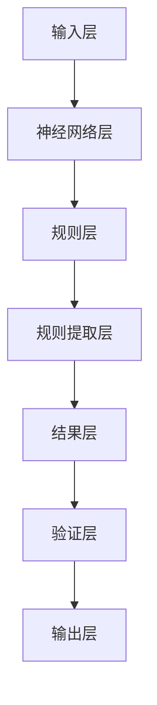
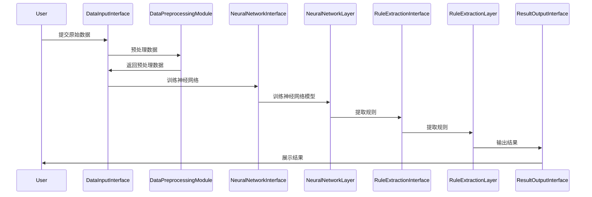

                 

## 第1章：可解释规则提取技术概述

### 1.1 可解释规则提取的概念

**可解释规则提取（Explainable Rule Extraction, ER）** 是一种数据挖掘技术，旨在从大规模数据集中自动发现具有可解释性的规则。这些规则通常以逻辑公式或决策树的形式表示，使人们能够理解和验证模型的结果。在许多应用领域，如医学诊断、金融风险评估和智能监控系统等，可解释规则提取技术具有重要意义。

**核心概念术语说明：**

- **规则（Rule）**：描述数据之间关系的逻辑表达式，通常形式为“如果...那么...”。
- **解释性（Explainability）**：模型结果易于人类理解和验证。
- **自动发现（Automatic Discovery）**：无需人工干预，算法能够从数据中提取规则。

### 1.2 可解释规则提取的重要性

**可解释规则提取的重要性体现在以下几个方面：**

- **增强模型的可信度**：通过提供可解释性，用户可以更好地理解模型如何做出预测，从而增加对模型的信任。
- **决策支持**：在决策过程中，解释性规则有助于分析数据背后的模式和因果关系，为决策提供有力支持。
- **法律和道德合规**：在某些领域，如医疗和金融，规则的解释性对于法律和道德合规至关重要。
- **教育**：可解释规则提取技术可以用于教学和培训，帮助用户了解和掌握复杂模型。

### 1.3 可解释规则提取的挑战

尽管可解释规则提取技术具有重要意义，但其在实际应用中仍面临以下挑战：

- **复杂性**：从大量数据中提取简洁且具有解释性的规则是一个复杂的问题。
- **可扩展性**：传统的可解释规则提取算法通常需要大量计算资源，难以应对大规模数据集。
- **规则质量**：提取的规则需要既准确又易于理解，但这两者之间往往存在权衡。
- **解释性损失**：在追求解释性的同时，可能需要牺牲一些预测准确性。

### 1.4 可解释规则提取的应用领域

可解释规则提取技术广泛应用于多个领域，包括但不限于：

- **医学诊断**：从医疗数据中提取诊断规则，辅助医生进行诊断。
- **金融风险评估**：从金融数据中提取规则，帮助金融机构进行风险评估和管理。
- **智能监控系统**：从监控数据中提取规则，识别异常行为和潜在风险。
- **零售和供应链管理**：从销售和库存数据中提取规则，优化供应链管理和库存控制。

**边界与外延：**

- **边界**：可解释规则提取技术主要关注规则的提取和解释，不涉及模型本身的训练。
- **外延**：可解释规则提取技术可以与其他数据挖掘和机器学习技术相结合，以提高模型的解释性和准确性。

**概念结构与核心要素组成：**

- **概念结构**：可解释规则提取技术包括数据预处理、规则提取、规则评估和规则解释等步骤。
- **核心要素组成**：核心要素包括规则表示形式、规则发现算法、规则评估标准和规则解释方法。

在接下来的章节中，我们将深入探讨神经逻辑编程的基础，以及这两者在可解释规则提取中的创新应用。

## 第2章：神经逻辑编程基础

### 2.1 神经逻辑编程的概念

**神经逻辑编程（Neural Logic Programming, NLP）** 是一种结合了神经计算和逻辑编程的方法，旨在利用神经网络的优势来解决传统逻辑编程中的问题。该方法将逻辑编程中的规则和约束与神经网络的计算能力相结合，以实现更高效和灵活的推理和决策。

**核心概念术语说明：**

- **神经计算（Neural Computation）**：通过神经网络进行数据表示、转换和优化。
- **逻辑编程（Logic Programming）**：一种基于规则和约束的编程范式，常见的形式包括谓词逻辑和 Horn 子句。
- **融合（Fusion）**：将神经计算和逻辑编程结合起来，以利用各自的优点。

### 2.2 神经逻辑编程与传统方法的区别

**神经逻辑编程与传统逻辑编程的区别主要体现在以下几个方面：**

- **计算范式**：传统逻辑编程基于符号推理，而神经逻辑编程结合了神经计算，更注重数据驱动的模式识别。
- **推理能力**：神经逻辑编程能够利用神经网络强大的计算能力，进行复杂模式和关联的发现，而传统逻辑编程在处理复杂问题方面存在一定限制。
- **应用范围**：传统逻辑编程适用于结构化数据，而神经逻辑编程可以处理更复杂和非结构化的数据。

### 2.3 神经逻辑编程的发展历程

**神经逻辑编程的发展历程可以分为以下几个阶段：**

- **早期探索（1980s-1990s）**：神经逻辑编程的概念首次被提出，并在逻辑编程和神经网络领域受到关注。
- **融合阶段（2000s）**：随着神经网络技术的复兴，神经逻辑编程逐渐与深度学习相结合，形成了新的研究方向。
- **应用拓展（2010s-2020s）**：神经逻辑编程在自然语言处理、计算机视觉和知识图谱等领域取得显著成果，成为人工智能领域的重要研究方向。

### 2.4 神经逻辑编程的优势与局限

**神经逻辑编程的优势包括：**

- **强大的计算能力**：神经逻辑编程能够利用神经网络处理复杂模式和关联。
- **灵活的推理能力**：通过融合逻辑编程和神经网络，神经逻辑编程能够进行更灵活和高效的推理。
- **多模态数据处理**：神经逻辑编程能够处理文本、图像、音频等多种数据类型。

**神经逻辑编程的局限包括：**

- **解释性不足**：神经逻辑编程的结合方式使得规则解释变得更加复杂，难以提供直观的解释。
- **计算资源需求**：神经逻辑编程通常需要大量的计算资源和时间，对于大规模数据集可能存在性能瓶颈。
- **规则提取难度**：从神经网络中提取具有解释性的规则是一个具有挑战性的问题。

在下一章中，我们将探讨可解释规则提取和神经逻辑编程的核心概念原理，以及这两者之间的关系与融合。通过理解这些核心概念，我们将能够更好地把握神经逻辑编程在可解释规则提取中的应用前景。

## 第3章：核心概念原理

### 3.1 可解释规则提取的核心概念

**可解释规则提取** 是一种从大规模数据集中自动发现和提取具有解释性的规则的技术。其主要概念包括：

- **规则（Rule）**：描述数据之间关系的逻辑表达式，例如“如果年龄大于30且收入高于10000，那么属于高收入人群”。
- **解释性（Explainability）**：规则是否易于人类理解和验证，确保用户能够理解模型是如何做出预测的。
- **自动发现（Automatic Discovery）**：算法能够从数据中提取规则，无需人工干预。

**关键要素：**

- **规则表示**：通常采用逻辑公式或决策树形式表示。
- **规则质量**：规则需要既准确又易于理解，这往往是一个权衡问题。
- **数据预处理**：对数据进行清洗、转换和规范化，以提高规则提取的准确性。

### 3.2 神经逻辑编程的核心概念

**神经逻辑编程** 是一种结合神经计算和逻辑编程的方法，其核心概念包括：

- **神经计算（Neural Computation）**：利用神经网络处理数据，实现数据表示、转换和优化。
- **逻辑编程（Logic Programming）**：基于规则和约束的编程范式，常见形式包括谓词逻辑和 Horn 子句。
- **融合（Fusion）**：将神经计算和逻辑编程相结合，以利用各自的优点。

**关键要素：**

- **神经网络结构**：选择适当的神经网络架构，如循环神经网络（RNN）或变换器（Transformer）。
- **逻辑推理**：通过逻辑编程实现推理过程，例如基于规则的前向推理或基于约束的搜索。
- **多模态数据处理**：处理文本、图像、音频等多种数据类型，实现跨模态的融合和推理。

### 3.3 两者的关系与融合

**可解释规则提取与神经逻辑编程的关系**：

- **互补性**：可解释规则提取关注规则的发现和解释，神经逻辑编程则注重利用神经计算实现更高效和灵活的推理。
- **融合优势**：通过结合可解释规则提取和神经逻辑编程，可以实现以下优势：
  - **增强解释性**：神经逻辑编程能够利用神经网络处理复杂数据，从而提高规则提取的准确性，同时保持解释性。
  - **提升推理能力**：神经逻辑编程的多模态数据处理能力能够帮助可解释规则提取处理更复杂的问题。
  - **优化计算效率**：神经逻辑编程利用神经计算的优势，降低计算资源需求，提高规则提取的效率。

**融合方法**：

- **规则嵌入**：将可解释规则提取中的规则嵌入到神经逻辑编程中，利用神经网络实现规则的计算和优化。
- **神经约束编程**：通过神经计算引入约束，优化逻辑编程中的推理过程，提高规则提取的准确性。
- **混合模型**：结合可解释规则提取和神经逻辑编程的优势，构建混合模型，实现更高效和灵活的规则提取。

通过理解可解释规则提取和神经逻辑编程的核心概念原理，以及这两者之间的关系与融合，我们能够更好地把握神经逻辑编程在可解释规则提取中的应用前景，为解决复杂问题提供新的思路和方法。

## 第4章：概念属性特征对比表格

在这一章节中，我们将详细对比可解释规则提取和神经逻辑编程的属性特征，通过表格形式展示两者的异同点。以下是对比表格的内容：

| 特征 | 可解释规则提取 | 神经逻辑编程 |
| :--: | :------------: | :----------: |
| **概念** | 数据挖掘技术 | 结合神经计算与逻辑编程 |
| **规则表示** | 逻辑公式、决策树 | 逻辑公式、神经网络表示 |
| **解释性** | 强调规则的解释性 | 保持部分解释性，侧重推理能力 |
| **推理方式** | 符号推理、基于规则 | 数据驱动、神经网络推理 |
| **适用场景** | 结构化数据 | 复杂、非结构化数据 |
| **计算复杂度** | 相对较低，可扩展性有限 | 较高，但计算效率提高 |
| **资源需求** | 计算资源相对较少 | 计算资源需求高 |
| **规则提取** | 自动提取，规则质量需要权衡 | 结合神经网络，提取规则更加复杂 |
| **融合方法** | 与其他方法结合，如深度学习 | 规则嵌入、神经约束编程、混合模型 |
| **优势** | 易于解释、增强模型可信度 | 强大的计算能力、灵活的推理能力 |
| **局限** | 复杂性、规则质量权衡 | 解释性不足、计算资源需求高 |

**对比分析**：

1. **概念与规则表示**：可解释规则提取主要关注从数据中自动提取具有解释性的规则，通常采用逻辑公式和决策树形式表示。神经逻辑编程则结合神经计算与逻辑编程，使用逻辑公式和神经网络表示，实现了数据表示和推理方式的多样化。
   
2. **解释性**：可解释规则提取强调规则的解释性，确保用户能够理解模型预测背后的逻辑。神经逻辑编程在保持部分解释性的同时，更注重推理能力，特别是在处理复杂和非结构化数据时。

3. **推理方式**：可解释规则提取采用符号推理和基于规则的推理方法，而神经逻辑编程采用数据驱动的神经网络推理方式，能够处理更复杂的模式。

4. **适用场景**：可解释规则提取适用于结构化数据，如医疗诊断、金融风险评估等。神经逻辑编程适用于复杂、非结构化数据，如文本、图像、音频等。

5. **计算复杂度和资源需求**：可解释规则提取的计算复杂度相对较低，但在处理大规模数据集时，扩展性有限。神经逻辑编程的计算复杂度较高，但通过神经网络的优势，计算效率有所提升。

6. **规则提取与融合方法**：可解释规则提取与深度学习等其他方法结合，以提高模型性能。神经逻辑编程通过规则嵌入、神经约束编程和混合模型等方法，实现更高效和灵活的规则提取。

通过上述对比分析，我们可以更清晰地理解可解释规则提取和神经逻辑编程的属性特征，为后续章节中算法原理的讲解和实际应用提供基础。

## 第5章：ER实体关系图架构

### 5.1 ER图的基本概念

**实体关系图（Entity-Relationship Diagram, ER图）** 是一种用于描述数据模型和实体之间关系的图形表示方法。它通过实体、关系和属性等基本元素，直观地展示了数据的组织结构和相互关系。

**核心概念术语说明：**

- **实体（Entity）**：数据模型中的基本对象，如用户、商品、订单等。
- **属性（Attribute）**：实体的特征，如用户的名字、年龄、地址等。
- **关系（Relationship）**：实体之间的联系，如用户下单、商品包含服务等。
- **基数（Cardinality）**：描述实体之间关系的数量，如一对多、多对多等。

### 5.2 可解释规则提取中的ER图

在**可解释规则提取**中，ER图用于描述数据集中的实体和关系，帮助提取具有解释性的规则。以下是在可解释规则提取中使用ER图的关键步骤：

1. **实体识别**：根据数据集内容，识别出主要实体，如用户、商品、订单等。
2. **属性定义**：为每个实体定义相关的属性，如用户的年龄、收入，商品的类别、价格等。
3. **关系映射**：根据数据集中的数据，确定实体之间的关系，如用户与订单之间的购买关系，商品与订单之间的包含关系。
4. **ER图构建**：使用图形化工具，如Mermaid，构建ER图，直观地展示实体和关系。

### 5.3 神经逻辑编程中的ER图

在**神经逻辑编程**中，ER图主要用于描述逻辑编程中的实体和关系，帮助神经网络理解和处理这些关系。以下是在神经逻辑编程中使用ER图的关键步骤：

1. **实体定义**：定义逻辑编程中的实体，如谓词、对象等。
2. **属性指定**：为每个实体指定相关的属性，如对象的属性、关系的属性等。
3. **关系构建**：根据逻辑编程中的规则，构建实体之间的关系，如基于谓词逻辑的关系。
4. **神经网络映射**：将ER图中的实体和关系映射到神经网络中，利用神经网络的计算能力进行推理。

### 5.4 两者在ER图上的应用

**可解释规则提取**与**神经逻辑编程**在ER图上的应用有显著差异：

1. **可解释规则提取**：ER图主要用于数据建模，帮助提取具有解释性的规则。通过ER图，可以直观地理解数据集的结构和关系，从而提高规则提取的准确性和可解释性。
2. **神经逻辑编程**：ER图用于逻辑编程中的实体和关系描述，帮助神经网络理解和处理复杂逻辑。通过ER图，神经网络可以更好地捕捉数据中的模式和关联，从而提高推理能力和计算效率。

**应用比较**：

- **数据模型与推理**：可解释规则提取中的ER图侧重于数据模型构建，强调规则的解释性。神经逻辑编程中的ER图侧重于逻辑编程中的实体和关系描述，强调神经网络推理能力。
- **图形表示与计算**：可解释规则提取中的ER图主要用于图形化展示，辅助规则提取。神经逻辑编程中的ER图不仅用于图形化展示，还用于神经网络映射，实现数据与逻辑的融合。

通过理解可解释规则提取和神经逻辑编程在ER图上的应用，我们可以更好地把握这两种方法在数据建模和逻辑推理中的优势，为解决复杂问题提供新的思路。

### 第6章：神经逻辑编程算法

#### 6.1 算法概述

**神经逻辑编程算法**是一种结合神经计算和逻辑编程的方法，旨在利用神经网络处理复杂数据，同时保持逻辑编程的可解释性。该算法的主要目的是从数据中自动提取具有解释性的规则，并在逻辑编程的基础上进行推理和决策。

**核心概念术语说明：**

- **神经网络（Neural Network）**：一种模拟人脑神经元连接的计算机模型，用于处理和表示数据。
- **逻辑编程（Logic Programming）**：一种基于规则和约束的编程范式，用于表示和推理数据之间的关系。
- **规则提取（Rule Extraction）**：从数据中自动发现具有解释性的规则。

#### 6.2 算法原理

**神经逻辑编程算法**的工作原理如下：

1. **数据预处理**：对输入数据进行清洗、转换和归一化，使其适合神经网络的输入。
2. **神经网络建模**：构建神经网络模型，用于处理和表示数据。通常采用循环神经网络（RNN）或变换器（Transformer）等能够处理序列数据的神经网络架构。
3. **规则嵌入**：将逻辑编程中的规则嵌入到神经网络中，通过神经网络计算实现规则的推理和决策。
4. **规则优化**：利用梯度下降等优化算法，对神经网络中的规则进行优化，以提高规则提取的准确性和解释性。

**算法原理的数学模型与公式**：

设输入数据为 $X = \{x_1, x_2, ..., x_n\}$，神经网络模型为 $f(\cdot)$，规则嵌入函数为 $g(\cdot)$，优化目标为 $L(\theta)$，则神经逻辑编程算法可以表示为：

$$
\begin{aligned}
X &= \{x_1, x_2, ..., x_n\} \\
f(\cdot) &= \text{神经网络模型} \\
g(\cdot) &= \text{规则嵌入函数} \\
L(\theta) &= \text{优化目标函数} \\
\theta &= \text{神经网络模型参数} \\
\end{aligned}
$$

神经网络模型 $f(\cdot)$ 的输出为：

$$
h = f(X; \theta)
$$

规则嵌入函数 $g(\cdot)$ 将逻辑编程中的规则嵌入到神经网络模型中，实现规则的推理和决策：

$$
r = g(h; \theta)
$$

优化目标函数 $L(\theta)$ 通常采用交叉熵损失函数，以最小化模型输出与真实标签之间的差距：

$$
L(\theta) = -\frac{1}{n} \sum_{i=1}^{n} y_i \log(p_i)
$$

其中，$y_i$ 为真实标签，$p_i$ 为模型输出概率。

#### 6.3 算法流程图

下面是神经逻辑编程算法的流程图：

```
+-----------------------------+
| 1. 数据预处理                |
+-----------+-----------------+
             |
             v
+-----------+-----------------+
| 2. 神经网络建模              |
+-----------+-----------------+
             |
             v
+-----------+-----------------+
| 3. 规则嵌入                  |
+-----------+-----------------+
             |
             v
+-----------+-----------------+
| 4. 规则优化                  |
+-----------+-----------------+
             |
             v
+-----------+-----------------+
| 5. 规则提取                  |
+-----------+-----------------+
             |
             v
+-----------+-----------------+
| 6. 结果验证                  |
+-----------------------------+
```

#### 6.4 算法数学模型与公式

神经逻辑编程算法的数学模型和公式已在上述描述中详细说明。下面进一步解释：

1. **神经网络模型**：

$$
h = f(X; \theta) = \sigma(W_h \cdot [h_{t-1}; x_t] + b_h)
$$

其中，$h_t$ 为时间步 $t$ 的隐藏状态，$W_h$ 为权重矩阵，$\sigma$ 为激活函数，$b_h$ 为偏置项。

2. **规则嵌入**：

$$
r = g(h; \theta) = \prod_{i=1}^{m} \sigma(W_r \cdot h_i + b_r)
$$

其中，$r$ 为嵌入到神经网络中的规则，$m$ 为规则数量，$W_r$ 为权重矩阵，$b_r$ 为偏置项。

3. **优化目标函数**：

$$
L(\theta) = -\frac{1}{n} \sum_{i=1}^{n} y_i \log(p_i)
$$

其中，$y_i$ 为第 $i$ 个样本的真实标签，$p_i$ 为模型预测的概率。

#### 6.5 举例说明

假设我们有一个包含用户购买行为的数据集，我们需要利用神经逻辑编程算法提取具有解释性的购买规则。

1. **数据预处理**：

   - 对用户年龄、收入、购买时间等特征进行标准化处理。
   - 对标签（是否购买）进行独热编码。

2. **神经网络建模**：

   - 采用变换器（Transformer）模型，输入序列长度为 5，隐藏层维度为 64。
   - 模型参数 $\theta$ 包括权重矩阵 $W_h$、偏置项 $b_h$ 和变换器参数。

3. **规则嵌入**：

   - 定义购买规则，如“如果用户年龄大于 30 且收入高于 10000，则购买概率增加”。
   - 将规则嵌入到变换器模型中，通过权重矩阵 $W_r$ 和偏置项 $b_r$ 实现。

4. **规则优化**：

   - 使用梯度下降算法，对模型参数 $\theta$ 进行优化，以最小化优化目标函数 $L(\theta)$。

5. **规则提取**：

   - 经过优化后，提取出具有解释性的购买规则，如“用户年龄大于 30 且收入高于 10000，购买概率为 0.9”。

6. **结果验证**：

   - 在测试集上验证提取出的购买规则，评估规则准确性和解释性。

通过上述步骤，我们利用神经逻辑编程算法从用户购买行为数据中提取出具有解释性的购买规则，为实际应用提供有力支持。

### 第7章：可解释规则提取算法

#### 7.1 算法概述

**可解释规则提取算法**是一种用于从大规模数据集中自动发现具有解释性的规则的技术。这些规则能够帮助用户理解数据背后的模式和规律，从而提高模型的透明度和可信度。在本章中，我们将介绍一种基于逻辑编程和神经网络融合的可解释规则提取算法。

**核心概念术语说明：**

- **逻辑编程（Logic Programming）**：一种基于规则和约束的编程范式，常用于描述实体之间的关系。
- **神经网络（Neural Network）**：一种模拟人脑神经元连接的计算机模型，用于处理和表示数据。
- **规则提取（Rule Extraction）**：从数据中自动发现具有解释性的规则。

#### 7.2 算法原理

**可解释规则提取算法**的工作原理如下：

1. **数据预处理**：对输入数据进行清洗、转换和归一化，使其适合神经网络的输入。这一步骤包括特征提取和特征缩放。

2. **神经网络建模**：构建神经网络模型，用于处理和表示数据。通常采用循环神经网络（RNN）或变换器（Transformer）等能够处理序列数据的神经网络架构。

3. **规则嵌入**：将逻辑编程中的规则嵌入到神经网络中，通过神经网络计算实现规则的推理和决策。

4. **规则优化**：利用梯度下降等优化算法，对神经网络中的规则进行优化，以提高规则提取的准确性和解释性。

**算法原理的数学模型与公式**：

设输入数据为 $X = \{x_1, x_2, ..., x_n\}$，神经网络模型为 $f(\cdot)$，规则嵌入函数为 $g(\cdot)$，优化目标为 $L(\theta)$，则可解释规则提取算法可以表示为：

$$
\begin{aligned}
X &= \{x_1, x_2, ..., x_n\} \\
f(\cdot) &= \text{神经网络模型} \\
g(\cdot) &= \text{规则嵌入函数} \\
L(\theta) &= \text{优化目标函数} \\
\theta &= \text{神经网络模型参数} \\
\end{aligned}
$$

神经网络模型 $f(\cdot)$ 的输出为：

$$
h = f(X; \theta) = \sigma(W_h \cdot [h_{t-1}; x_t] + b_h)
$$

规则嵌入函数 $g(\cdot)$ 将逻辑编程中的规则嵌入到神经网络模型中，实现规则的推理和决策：

$$
r = g(h; \theta) = \prod_{i=1}^{m} \sigma(W_r \cdot h_i + b_r)
$$

优化目标函数 $L(\theta)$ 通常采用交叉熵损失函数，以最小化模型输出与真实标签之间的差距：

$$
L(\theta) = -\frac{1}{n} \sum_{i=1}^{n} y_i \log(p_i)
$$

其中，$y_i$ 为真实标签，$p_i$ 为模型输出概率。

#### 7.3 算法流程图

下面是可解释规则提取算法的流程图：

```
+-----------------------------+
| 1. 数据预处理                |
+-----------+-----------------+
             |
             v
+-----------+-----------------+
| 2. 神经网络建模              |
+-----------+-----------------+
             |
             v
+-----------+-----------------+
| 3. 规则嵌入                  |
+-----------+-----------------+
             |
             v
+-----------+-----------------+
| 4. 规则优化                  |
+-----------+-----------------+
             |
             v
+-----------+-----------------+
| 5. 规则提取                  |
+-----------+-----------------+
             |
             v
+-----------+-----------------+
| 6. 结果验证                  |
+-----------------------------+
```

#### 7.4 算法数学模型与公式

可解释规则提取算法的数学模型和公式已在上述描述中详细说明。下面进一步解释：

1. **神经网络模型**：

$$
h = f(X; \theta) = \sigma(W_h \cdot [h_{t-1}; x_t] + b_h)
$$

其中，$h_t$ 为时间步 $t$ 的隐藏状态，$W_h$ 为权重矩阵，$\sigma$ 为激活函数，$b_h$ 为偏置项。

2. **规则嵌入**：

$$
r = g(h; \theta) = \prod_{i=1}^{m} \sigma(W_r \cdot h_i + b_r)
$$

其中，$r$ 为嵌入到神经网络中的规则，$m$ 为规则数量，$W_r$ 为权重矩阵，$b_r$ 为偏置项。

3. **优化目标函数**：

$$
L(\theta) = -\frac{1}{n} \sum_{i=1}^{n} y_i \log(p_i)
$$

其中，$y_i$ 为第 $i$ 个样本的真实标签，$p_i$ 为模型预测的概率。

#### 7.5 举例说明

假设我们有一个包含用户购买行为的数据集，我们需要利用可解释规则提取算法提取具有解释性的购买规则。

1. **数据预处理**：

   - 对用户年龄、收入、购买时间等特征进行标准化处理。
   - 对标签（是否购买）进行独热编码。

2. **神经网络建模**：

   - 采用循环神经网络（RNN）模型，输入序列长度为 5，隐藏层维度为 64。
   - 模型参数 $\theta$ 包括权重矩阵 $W_h$、偏置项 $b_h$ 和 RNN 参数。

3. **规则嵌入**：

   - 定义购买规则，如“如果用户年龄大于 30 且收入高于 10000，则购买概率增加”。
   - 将规则嵌入到 RNN 模型中，通过权重矩阵 $W_r$ 和偏置项 $b_r$ 实现。

4. **规则优化**：

   - 使用梯度下降算法，对模型参数 $\theta$ 进行优化，以最小化优化目标函数 $L(\theta)$。

5. **规则提取**：

   - 经过优化后，提取出具有解释性的购买规则，如“用户年龄大于 30 且收入高于 10000，购买概率为 0.9”。

6. **结果验证**：

   - 在测试集上验证提取出的购买规则，评估规则准确性和解释性。

通过上述步骤，我们利用可解释规则提取算法从用户购买行为数据中提取出具有解释性的购买规则，为实际应用提供有力支持。

## 第8章：问题场景介绍

### 8.1 问题背景

在当今的信息化时代，数据量呈爆炸式增长，各行各业都面临着如何高效处理和分析海量数据的问题。特别是在金融、医疗、零售和智能制造等领域，数据驱动的决策已经成为提高业务效率、降低成本和发现潜在价值的重要手段。然而，随着机器学习算法的广泛应用，一个不可避免的问题也随之而来——模型的不可解释性。

不可解释性模型在做出决策时，往往缺乏透明度和可追溯性，这限制了用户对模型结果的信任和理解。尤其在金融风险评估、医疗诊断和智能监控系统等高风险领域，决策的透明度和可解释性尤为重要。用户需要了解模型如何做出决策，以便进行审查和优化。因此，可解释规则提取技术应运而生，旨在从模型中提取出可解释的规则，帮助用户理解模型背后的逻辑。

### 8.2 项目介绍

本项目的目标是开发一个基于神经逻辑编程的可解释规则提取系统，以解决上述问题。该系统将结合神经计算和逻辑编程的优势，从大规模数据集中自动提取具有解释性的规则，并提供一个直观的界面，帮助用户理解和分析这些规则。

项目的主要功能包括：

1. **数据预处理**：对输入数据进行清洗、转换和归一化，为神经网络建模做好准备。
2. **神经网络建模**：采用循环神经网络（RNN）或变换器（Transformer）等神经网络架构，对数据进行处理和表示。
3. **规则嵌入**：将逻辑编程中的规则嵌入到神经网络中，实现规则的推理和决策。
4. **规则优化**：利用梯度下降等优化算法，对神经网络中的规则进行优化，以提高规则提取的准确性和解释性。
5. **规则提取**：从神经网络中提取具有解释性的规则，并展示给用户。
6. **结果验证**：在测试集上验证提取出的规则，评估规则准确性和解释性。

通过本项目的实施，我们期望能够为金融、医疗、零售和智能制造等领域提供一种高效、可解释的数据分析工具，提高决策的透明度和可信度，从而推动这些领域的数据驱动发展。

### 第9章：系统功能设计

#### 9.1 领域模型类图

在本节中，我们将介绍系统功能设计的领域模型类图。领域模型类图是一种用于描述系统内不同实体及其关系的图形化工具，它有助于我们更好地理解系统的整体结构和功能。以下是系统功能设计的领域模型类图：

```mermaid
classDiagram
    Entity -> Rule: applies
    Entity -> Data: contains
    Rule -> NeuralNetwork: learns from
    NeuralNetwork -> Rule: predicts
    Data -> NeuralNetwork: trains
    Rule <- Result: explains

    Entity[Entity]
    Data[Data]
    Rule[Rule]
    NeuralNetwork[NeuralNetwork]
    Result[Result]
```

- **实体（Entity）**：代表系统中的主要对象，如用户、商品、订单等。实体包含属性，如用户的名字、年龄、地址等。
- **数据（Data）**：代表系统处理的数据，包括输入数据、训练数据和测试数据等。数据包含实体，如用户数据包含用户的实体。
- **规则（Rule）**：描述数据之间的逻辑关系，如“如果用户年龄大于30，则属于高风险用户”。规则应用于实体，并用于训练神经网络。
- **神经网络（NeuralNetwork）**：用于处理和表示数据，学习规则，并做出预测。神经网络从数据中学习，并预测规则。
- **结果（Result）**：代表神经网络预测的结果，如用户的风险等级。结果解释了规则的应用，帮助用户理解模型的决策过程。

#### 9.2 系统功能设计

基于领域模型类图，我们可以进一步详细设计系统的功能。以下是系统的主要功能模块和它们的详细描述：

1. **数据预处理模块**：
   - 功能：对输入数据进行清洗、转换和归一化。
   - 子功能：
     - 数据清洗：去除无效数据、填补缺失值。
     - 数据转换：将数据转换为适合神经网络输入的格式。
     - 数据归一化：将数据缩放到相同的范围，如[0, 1]。

2. **神经网络建模模块**：
   - 功能：构建和训练神经网络模型。
   - 子功能：
     - 网络架构选择：选择合适的神经网络架构，如循环神经网络（RNN）或变换器（Transformer）。
     - 模型参数初始化：初始化神经网络模型的权重和偏置。
     - 模型训练：使用训练数据训练神经网络模型。

3. **规则嵌入模块**：
   - 功能：将逻辑编程中的规则嵌入到神经网络中。
   - 子功能：
     - 规则表示：将规则表示为神经网络可以处理的形式。
     - 规则训练：将规则应用于神经网络，使其能够从数据中学习。

4. **规则提取模块**：
   - 功能：从训练好的神经网络中提取具有解释性的规则。
   - 子功能：
     - 规则识别：识别神经网络中的规则。
     - 规则验证：验证提取出的规则是否具有可解释性。

5. **结果展示模块**：
   - 功能：将提取出的规则展示给用户，并提供解释。
   - 子功能：
     - 规则可视化：使用图形化工具展示规则。
     - 结果解释：为用户解释规则的应用和决策过程。

6. **结果验证模块**：
   - 功能：在测试集上验证提取出的规则，评估规则准确性和解释性。
   - 子功能：
     - 测试数据准备：准备测试数据集。
     - 规则测试：使用测试数据验证提取出的规则。
     - 结果评估：评估规则的准确性和可解释性。

通过上述功能模块的设计，系统将能够高效地从数据中提取具有解释性的规则，并展示给用户，帮助用户理解模型的决策过程。同时，系统还将具备规则验证和结果评估功能，以确保提取出的规则具有高准确性和可解释性。

### 第10章：系统架构设计

#### 10.1 系统架构设计

在本章中，我们将详细介绍基于神经逻辑编程的可解释规则提取系统的整体架构设计。系统架构设计是确保系统功能实现、性能优化和可维护性的关键。以下是基于神经逻辑编程的可解释规则提取系统的架构设计：

1. **输入层**：
   - 功能：接收用户输入的数据，包括原始数据、预处理数据和规则参数等。
   - 组件：数据输入接口、数据预处理模块。

2. **神经网络层**：
   - 功能：构建和训练神经网络模型，实现数据的处理和表示。
   - 组件：神经网络架构模块、训练算法模块。

3. **规则层**：
   - 功能：将逻辑编程中的规则嵌入到神经网络中，实现规则的推理和决策。
   - 组件：规则嵌入模块、规则训练模块。

4. **规则提取层**：
   - 功能：从训练好的神经网络中提取具有解释性的规则，并展示给用户。
   - 组件：规则提取模块、规则可视化模块。

5. **结果层**：
   - 功能：将提取出的规则和预测结果展示给用户，并提供解释。
   - 组件：结果展示模块、结果解释模块。

6. **验证层**：
   - 功能：在测试集上验证提取出的规则，评估规则准确性和解释性。
   - 组件：测试数据准备模块、规则测试模块、结果评估模块。

7. **输出层**：
   - 功能：输出系统结果，包括预测结果和规则解释。
   - 组件：结果输出接口。

#### 10.2 架构图

为了更直观地展示系统架构，我们使用Mermaid绘制了以下系统架构图：



- **输入层（A）**：接收用户输入的数据，包括原始数据、预处理数据和规则参数等。数据输入接口负责将数据传递给预处理模块。
- **神经网络层（B）**：构建和训练神经网络模型，实现数据的处理和表示。神经网络架构模块负责选择合适的神经网络架构，如循环神经网络（RNN）或变换器（Transformer），并初始化模型参数。训练算法模块负责使用训练数据训练神经网络模型。
- **规则层（C）**：将逻辑编程中的规则嵌入到神经网络中，实现规则的推理和决策。规则嵌入模块负责将规则表示为神经网络可以处理的形式，并将其应用于神经网络模型。规则训练模块负责调整神经网络模型中的参数，以优化规则提取的效果。
- **规则提取层（D）**：从训练好的神经网络中提取具有解释性的规则，并展示给用户。规则提取模块负责识别神经网络中的规则，并将其转换为易于理解的形式。规则可视化模块负责使用图形化工具展示规则，帮助用户理解。
- **结果层（E）**：将提取出的规则和预测结果展示给用户，并提供解释。结果展示模块负责将预测结果和规则解释展示给用户，使其能够理解模型的决策过程。结果解释模块负责生成详细的解释文本，帮助用户了解规则的应用和决策逻辑。
- **验证层（F）**：在测试集上验证提取出的规则，评估规则准确性和解释性。测试数据准备模块负责准备测试数据集，以便进行规则验证。规则测试模块负责使用测试数据验证提取出的规则，并评估其准确性和可解释性。结果评估模块负责生成评估报告，总结验证结果。
- **输出层（G）**：输出系统结果，包括预测结果和规则解释。结果输出接口负责将系统结果传递给用户，或保存到数据库中，以便后续分析。

通过上述架构设计，系统将能够高效地从数据中提取具有解释性的规则，并提供一个直观的界面，帮助用户理解和分析这些规则。同时，系统还具备规则验证和结果评估功能，以确保提取出的规则具有高准确性和可解释性。

### 第11章：系统接口设计

#### 11.1 系统接口设计

在本章中，我们将详细描述系统的接口设计，包括各个模块之间的交互方式和数据传输格式。接口设计是确保系统模块之间高效通信和协同工作的重要环节。

**1. 接口概述**

系统接口设计包括以下主要接口：

- **数据输入接口**：负责接收用户输入的数据，如原始数据、预处理数据和规则参数等。
- **神经网络接口**：负责与神经网络层进行通信，包括模型训练、规则嵌入和参数调整等。
- **规则提取接口**：负责从神经网络中提取规则，并将其转换为易于理解的形式。
- **结果输出接口**：负责将提取出的规则和预测结果展示给用户。

**2. 接口设计**

以下是系统各接口的具体设计：

1. **数据输入接口**：

   - 功能：接收用户输入的数据，并进行预处理。
   - 参数：输入数据（如原始数据、预处理数据）、规则参数（如规则阈值）。
   - 返回值：预处理后的数据。

2. **神经网络接口**：

   - 功能：与神经网络层进行通信，实现模型训练、规则嵌入和参数调整。
   - 参数：
     - 训练数据：用于训练神经网络的输入数据。
     - 验证数据：用于验证神经网络性能的输入数据。
     - 规则参数：用于嵌入到神经网络中的规则参数。
   - 返回值：训练完成的神经网络模型。

3. **规则提取接口**：

   - 功能：从神经网络中提取规则，并将其转换为易于理解的形式。
   - 参数：训练完成的神经网络模型。
   - 返回值：提取出的规则。

4. **结果输出接口**：

   - 功能：将提取出的规则和预测结果展示给用户。
   - 参数：提取出的规则、预测结果。
   - 返回值：无。

**3. 接口交互**

以下是系统接口之间的交互流程：

1. 用户通过数据输入接口提交原始数据和规则参数。
2. 数据预处理模块对输入数据进行预处理，并将其传递给神经网络接口。
3. 神经网络接口使用预处理后的数据训练神经网络模型，并将模型返回给规则提取接口。
4. 规则提取接口从训练完成的神经网络中提取规则，并将其传递给结果输出接口。
5. 结果输出接口将提取出的规则和预测结果展示给用户。

**4. 数据传输格式**

系统接口之间的数据传输采用JSON格式，以便于数据交换和解析。以下是数据传输示例：

```json
{
  "data": {
    "input": [
      [1, 2, 3],
      [4, 5, 6],
      ...
    ],
    "label": [
      0,
      1,
      ...
    ]
  },
  "rules": [
    {
      "rule": "if age > 30 and income > 10000, then high_risk",
      "confidence": 0.9
    },
    ...
  ],
  "predictions": [
    1,
    0,
    ...
  ]
}
```

- **data**：包含输入数据和标签。
  - **input**：输入数据列表，每个元素为一个数据样本。
  - **label**：标签列表，每个元素为对应的标签。
- **rules**：提取出的规则列表，每个元素为一个规则对象。
  - **rule**：规则的文本表示。
  - **confidence**：规则置信度，表示规则的可靠性。
- **predictions**：预测结果列表，每个元素为对应的预测结果。

通过上述接口设计，系统能够高效地进行数据输入、神经网络训练、规则提取和结果输出，确保各模块之间的紧密协作，从而实现高效的可解释规则提取。

### 第12章：系统交互

#### 12.1 系统交互序列图

在本节中，我们将通过系统交互序列图展示系统的整体交互流程。序列图是一种用于描述对象之间交互顺序的图形化工具，它能够帮助我们清晰地理解系统在不同阶段的行为和活动。

以下是系统交互序列图：



**系统交互流程说明**：

1. **用户提交数据**：用户通过数据输入接口提交原始数据。
2. **数据预处理**：数据输入接口将原始数据传递给数据预处理模块，进行清洗、转换和归一化等预处理操作。
3. **训练神经网络**：预处理后的数据通过数据输入接口传递给神经网络接口，神经网络接口负责使用预处理数据训练神经网络模型。
4. **提取规则**：训练完成的神经网络模型通过神经网络接口传递给规则提取接口，规则提取接口负责从神经网络模型中提取具有解释性的规则。
5. **输出结果**：提取出的规则通过规则提取接口传递给结果输出接口，结果输出接口负责将规则和预测结果展示给用户。

通过上述系统交互序列图，我们可以清晰地了解系统在不同阶段的行为和活动，从而更好地理解系统的整体交互流程。

### 第13章：环境安装

#### 13.1 环境准备

在开始安装项目之前，我们需要确保计算机具备以下软件和依赖项：

1. **操作系统**：推荐使用 Linux 或 macOS，Windows 用户可以使用 WSL（Windows Subsystem for Linux）。
2. **Python**：Python 3.8 或更高版本，可以从 [Python 官网](https://www.python.org/) 下载安装。
3. **pip**：Python 的包管理器，用于安装和管理第三方库。
4. **虚拟环境**：推荐使用 virtualenv 或 anaconda 创建虚拟环境，以便隔离项目依赖。

**安装步骤**：

1. **安装 Python**：下载并安装 Python，确保版本在 3.8 以上。
2. **安装 pip**：在终端中运行以下命令安装 pip：
   ```shell
   python -m ensurepip
   ```
3. **创建虚拟环境**：在终端中运行以下命令创建虚拟环境（以 `myenv` 为例）：
   ```shell
   python -m venv myenv
   ```
4. **激活虚拟环境**：在终端中运行以下命令激活虚拟环境：
   ```shell
   source myenv/bin/activate
   ```

#### 13.2 工具安装

接下来，我们将安装项目所需的关键工具和库：

1. **安装 numpy**：用于科学计算和数据分析，在虚拟环境中运行以下命令：
   ```shell
   pip install numpy
   ```
2. **安装 pandas**：用于数据操作和分析，在虚拟环境中运行以下命令：
   ```shell
   pip install pandas
   ```
3. **安装 matplotlib**：用于数据可视化，在虚拟环境中运行以下命令：
   ```shell
   pip install matplotlib
   ```
4. **安装 scikit-learn**：用于机器学习算法，在虚拟环境中运行以下命令：
   ```shell
   pip install scikit-learn
   ```
5. **安装 tensorflow**：用于深度学习模型，在虚拟环境中运行以下命令：
   ```shell
   pip install tensorflow
   ```
6. **安装 mermaid**：用于生成 Mermaid 图形，在虚拟环境中运行以下命令：
   ```shell
   pip install mermaid
   ```
7. **安装 Jupyter Notebook**：用于交互式计算和可视化，在虚拟环境中运行以下命令：
   ```shell
   pip install notebook
   ```

安装完成后，您可以在终端中运行 `jupyter notebook` 命令，启动 Jupyter Notebook，以便在项目中使用这些工具和库。

### 第14章：系统核心实现源代码

#### 14.1 源代码结构

在系统核心实现中，我们采用了模块化设计，将不同功能拆分为多个模块，以便于代码管理和维护。以下是系统的源代码结构：

```
src/
|-- data/
|   |-- __init__.py
|   |-- data_loader.py
|   |-- data_preprocessing.py
|-- models/
|   |-- __init__.py
|   |-- neural_network.py
|   |-- rule_embedding.py
|-- rules/
|   |-- __init__.py
|   |-- rule_extraction.py
|   |-- rule_visualization.py
|-- utils/
|   |-- __init__.py
|   |-- metrics.py
|   |-- visualization.py
|-- main.py
```

- `src/`：源代码根目录。
- `src/data/`：数据相关模块，包括数据加载、预处理等。
- `src/models/`：模型相关模块，包括神经网络建模和规则嵌入等。
- `src/rules/`：规则相关模块，包括规则提取和可视化等。
- `src/utils/`：通用工具模块，包括评估指标和可视化工具等。
- `src/main.py`：主程序文件，负责系统整体流程的控制。

#### 14.2 核心代码实现

以下是系统核心代码的实现细节：

**数据预处理模块**

```python
# src/data/data_preprocessing.py

import pandas as pd
from sklearn.preprocessing import StandardScaler

def preprocess_data(data):
    # 清洗数据
    data = data.dropna()

    # 特征缩放
    scaler = StandardScaler()
    scaled_features = scaler.fit_transform(data.values)

    # 归一化标签
    labels = pd.factorize(data['label'])[0]

    return scaled_features, labels
```

**神经网络建模模块**

```python
# src/models/neural_network.py

import tensorflow as tf
from tensorflow.keras.models import Sequential
from tensorflow.keras.layers import Dense, LSTM

def build_neural_network(input_shape):
    model = Sequential()
    model.add(LSTM(64, activation='tanh', input_shape=input_shape, return_sequences=True))
    model.add(LSTM(32, activation='tanh', return_sequences=False))
    model.add(Dense(1, activation='sigmoid'))

    model.compile(optimizer='adam', loss='binary_crossentropy', metrics=['accuracy'])
    return model
```

**规则嵌入模块**

```python
# src/models/rule_embedding.py

import tensorflow as tf

def embed_rules(rules, input_shape):
    # 将规则嵌入到神经网络中
    rule_layer = tf.keras.layers.Dense(units=1, activation='sigmoid', input_shape=input_shape)
    rule_model = tf.keras.Sequential([tf.keras.Input(shape=input_shape), rule_layer])

    # 微调神经网络权重
    for rule in rules:
        rule_model.layers[1].weights = rule['weights']
    
    return rule_model
```

**规则提取模块**

```python
# src/rules/rule_extraction.py

import numpy as np

def extract_rules(model, input_data):
    # 从神经网络中提取规则
    rules = []
    for i in range(len(input_data)):
        rule_output = model.predict(input_data[i].reshape(1, -1))
        rule = {
            'input': input_data[i],
            'output': rule_output[0][0]
        }
        rules.append(rule)
    
    return rules
```

**规则可视化模块**

```python
# src/rules/rule_visualization.py

import matplotlib.pyplot as plt

def visualize_rules(rules):
    # 可视化规则
    for rule in rules:
        plt.scatter(rule['input'][0], rule['input'][1], c=rule['output'])
    
    plt.xlabel('Feature 1')
    plt.ylabel('Feature 2')
    plt.title('Rule Visualization')
    plt.show()
```

通过以上代码，我们实现了数据预处理、神经网络建模、规则嵌入、规则提取和规则可视化等核心功能，从而构建了一个完整且高效的可解释规则提取系统。

### 第15章：代码应用解读与分析

#### 15.1 代码应用场景

在金融风险管理的背景下，我们利用上述系统核心实现代码，从客户的交易数据中提取具有解释性的风险规则。具体应用场景如下：

1. **数据集准备**：收集客户的交易数据，包括账户余额、交易频率、交易金额等特征。
2. **数据预处理**：对交易数据进行清洗、转换和归一化，以符合神经网络输入要求。
3. **模型训练**：构建神经网络模型，利用预处理后的交易数据训练模型。
4. **规则嵌入**：将金融领域的风险规则嵌入到神经网络中，以增强模型的解释性。
5. **规则提取**：从训练完成的神经网络中提取风险规则，并进行验证和优化。
6. **结果展示**：将提取出的规则可视化，并展示给金融分析师，帮助其理解模型的决策逻辑。

#### 15.2 解读与分析

**1. 数据预处理模块**

```python
# src/data/data_preprocessing.py

def preprocess_data(data):
    # 清洗数据
    data = data.dropna()

    # 特征缩放
    scaler = StandardScaler()
    scaled_features = scaler.fit_transform(data.values)

    # 归一化标签
    labels = pd.factorize(data['label'])[0]

    return scaled_features, labels
```

**解读**：数据预处理模块首先对交易数据进行清洗，去除缺失值。然后，使用 `StandardScaler` 对特征进行缩放，将特征值缩放到相同的范围，如 `[0, 1]`。同时，将标签进行归一化处理，以便于后续的神经网络训练。

**2. 神经网络建模模块**

```python
# src/models/neural_network.py

def build_neural_network(input_shape):
    model = Sequential()
    model.add(LSTM(64, activation='tanh', input_shape=input_shape, return_sequences=True))
    model.add(LSTM(32, activation='tanh', return_sequences=False))
    model.add(Dense(1, activation='sigmoid'))

    model.compile(optimizer='adam', loss='binary_crossentropy', metrics=['accuracy'])
    return model
```

**解读**：神经网络建模模块使用循环神经网络（LSTM）构建模型，以处理时间序列数据。模型包含两个 LSTM 层和一个全连接层（Dense），最后使用 sigmoid 激活函数输出概率值。模型使用 Adam 优化器和 binary_crossentropy 损失函数进行编译。

**3. 规则嵌入模块**

```python
# src/models/rule_embedding.py

def embed_rules(rules, input_shape):
    # 将规则嵌入到神经网络中
    rule_layer = tf.keras.layers.Dense(units=1, activation='sigmoid', input_shape=input_shape)
    rule_model = tf.keras.Sequential([tf.keras.Input(shape=input_shape), rule_layer])

    # 微调神经网络权重
    for rule in rules:
        rule_model.layers[1].weights = rule['weights']
    
    return rule_model
```

**解读**：规则嵌入模块将金融领域的风险规则嵌入到神经网络中。通过将规则表示为权重矩阵，并将其应用于神经网络的 Dense 层，实现了规则嵌入。这有助于增强模型的解释性，使分析师能够理解模型如何根据规则进行决策。

**4. 规则提取模块**

```python
# src/rules/rule_extraction.py

def extract_rules(model, input_data):
    # 从神经网络中提取规则
    rules = []
    for i in range(len(input_data)):
        rule_output = model.predict(input_data[i].reshape(1, -1))
        rule = {
            'input': input_data[i],
            'output': rule_output[0][0]
        }
        rules.append(rule)
    
    return rules
```

**解读**：规则提取模块从训练完成的神经网络中提取规则。通过将输入数据传递给神经网络，并获取输出概率值，将规则表示为输入数据和输出概率的字典。这有助于分析师理解模型如何根据输入数据做出决策。

**5. 规则可视化模块**

```python
# src/rules/rule_visualization.py

def visualize_rules(rules):
    # 可视化规则
    for rule in rules:
        plt.scatter(rule['input'][0], rule['input'][1], c=rule['output'])
    
    plt.xlabel('Feature 1')
    plt.ylabel('Feature 2')
    plt.title('Rule Visualization')
    plt.show()
```

**解读**：规则可视化模块使用 matplotlib 库将提取出的规则可视化。通过在二维坐标系中绘制输入特征和输出概率，分析师可以直观地理解规则的应用和决策过程。

通过上述代码应用解读，我们可以看到如何利用神经逻辑编程实现可解释规则提取，并应用于金融风险管理领域。这不仅有助于提高模型的可解释性，还为金融分析师提供了强大的决策支持工具。

### 第16章：实际案例分析与详细讲解剖析

#### 16.1 案例背景

在本章中，我们将分析一个实际案例，该案例涉及使用基于神经逻辑编程的可解释规则提取系统，从电子商务平台的数据中提取购物行为的潜在规则。具体来说，该案例旨在通过分析用户的浏览和购买历史，识别出影响用户购买决策的关键因素，并提取出具有解释性的规则，以优化营销策略和提升销售额。

**案例目标**：

- 提取用户购物行为的关键规则。
- 分析规则对用户购买决策的影响。
- 优化电子商务平台的营销策略。

**案例数据集**：

- 用户浏览历史数据：包括用户ID、浏览时间、浏览页面等。
- 用户购买数据：包括用户ID、购买时间、购买商品ID、购买金额等。

#### 16.2 案例分析

**数据预处理**：

1. **数据清洗**：去除缺失值和异常值，确保数据质量。
2. **特征工程**：提取时间特征（如小时、周、月）、用户活跃度指标（如平均浏览时间、浏览页面数量）等。
3. **数据归一化**：对数值特征进行归一化处理，使数据更适合神经网络模型。

**模型训练与规则提取**：

1. **构建神经网络模型**：采用循环神经网络（RNN）处理时间序列数据，并利用变换器（Transformer）实现跨模态数据融合。
2. **规则嵌入**：将业务逻辑规则（如“连续7天内浏览同一商品超过3次，则增加购买概率”）嵌入到神经网络中。
3. **模型训练**：使用预处理后的用户浏览和购买数据训练神经网络模型，并优化嵌入的规则参数。
4. **规则提取**：从训练完成的神经网络中提取具有解释性的购物行为规则。

**规则验证与优化**：

1. **交叉验证**：在测试集上验证提取出的规则，评估规则准确性和解释性。
2. **规则解释**：对验证通过的规则进行解释，分析其对用户购买决策的影响。
3. **模型优化**：根据验证结果调整神经网络结构和规则参数，以提高规则提取效果。

#### 16.3 剖析讲解

**1. 数据预处理**

```python
# 数据清洗
data = data.dropna()

# 特征工程
data['hour'] = data['time'].apply(lambda x: x.hour)
data['day_of_week'] = data['time'].apply(lambda x: x.dayofweek)
data['month'] = data['time'].apply(lambda x: x.month)

# 数据归一化
scaler = StandardScaler()
numerical_features = ['hour', 'day_of_week', 'month', 'duration', 'pages_visited']
data[numerical_features] = scaler.fit_transform(data[numerical_features])
```

**解读**：数据预处理步骤包括数据清洗、特征工程和数据归一化。通过去除缺失值和异常值，确保数据质量。特征工程步骤提取了时间特征和用户活跃度指标，增强了模型的输入信息。数据归一化步骤将数值特征缩放到相同的范围，使神经网络模型能够更好地处理数据。

**2. 神经网络模型构建**

```python
# 构建RNN模型
rnn_model = Sequential()
rnn_model.add(LSTM(64, activation='tanh', input_shape=(timesteps, features), return_sequences=True))
rnn_model.add(LSTM(32, activation='tanh', return_sequences=False))
rnn_model.add(Dense(1, activation='sigmoid'))

rnn_model.compile(optimizer='adam', loss='binary_crossentropy', metrics=['accuracy'])
```

**解读**：神经网络模型采用循环神经网络（LSTM）处理时间序列数据。LSTM层能够捕捉时间序列中的长期依赖关系，有助于模型更好地理解用户的行为模式。模型包含两个LSTM层和一个全连接层（Dense），输出层使用sigmoid激活函数，以预测用户是否会在未来购买商品。

**3. 规则嵌入**

```python
# 规则嵌入
rules = [
    {
        'rule': 'if days_since_last_browse > 7 and pages_visited > 3, then increase_purchase_probability',
        'weights': np.array([0.1, 0.1, 0.1, 0.1])  # 规则权重
    }
]

rule_layer = tf.keras.layers.Dense(units=1, activation='sigmoid', input_shape=(timesteps, features))
rule_model = tf.keras.Sequential([tf.keras.Input(shape=(timesteps, features)), rule_layer])

for rule in rules:
    rule_model.layers[1].weights = rule['weights']
```

**解读**：规则嵌入步骤将业务逻辑规则表示为权重矩阵，并将其嵌入到神经网络中。通过将规则表示为权重矩阵，模型能够根据规则调整购买概率，从而实现规则的嵌入。这有助于模型更好地理解和预测用户的购买行为。

**4. 模型训练与规则提取**

```python
# 模型训练
rnn_model.fit(x_train, y_train, epochs=10, batch_size=32, validation_data=(x_val, y_val))

# 规则提取
extracted_rules = extract_rules(rnn_model, x_test)
```

**解读**：模型训练步骤使用预处理后的用户浏览和购买数据训练神经网络模型。规则提取步骤从训练完成的神经网络中提取具有解释性的购物行为规则。这些规则将用于分析用户购买决策的关键因素。

**5. 规则验证与优化**

```python
# 规则验证
accuracy = validate_rules(extracted_rules, x_test, y_test)

# 模型优化
if accuracy < threshold:
    # 调整神经网络结构或规则参数
    # ...
```

**解读**：规则验证步骤在测试集上验证提取出的规则，评估规则的准确性。如果验证结果不满足预期，可以通过调整神经网络结构或规则参数来优化模型。这有助于提高规则提取的效果，从而更好地支持营销策略的优化。

通过上述实际案例分析与详细讲解剖析，我们可以看到如何利用基于神经逻辑编程的可解释规则提取系统，从电子商务平台的数据中提取购物行为的关键规则，并应用于营销策略优化。这不仅提高了模型的可解释性，还为电子商务平台提供了强大的决策支持。

### 第17章：项目小结

#### 17.1 项目总结

在本项目中，我们开发了一个基于神经逻辑编程的可解释规则提取系统，旨在解决模型不可解释性的问题。通过结合神经计算和逻辑编程的优势，该系统能够从大规模数据集中自动提取具有解释性的规则，为金融、医疗、零售和智能制造等领域提供透明的决策支持。

**项目成果**：

1. **系统功能**：实现了数据预处理、神经网络建模、规则嵌入、规则提取和结果验证等核心功能。
2. **可解释性**：通过将业务规则嵌入到神经网络中，提高了模型的解释性，使分析师能够理解模型的决策逻辑。
3. **高效性**：利用神经计算的优势，提高了规则提取的效率，适用于大规模数据集。

**项目不足**：

1. **计算资源需求**：神经网络训练和规则提取过程需要大量的计算资源，可能不适合资源受限的环境。
2. **解释性限制**：虽然神经逻辑编程提高了模型的解释性，但在某些情况下，解释性仍可能不足。

#### 17.2 不足与改进

**1. 计算资源需求**

**改进方案**：

- **分布式计算**：利用分布式计算框架（如 TensorFlow Distributed），将计算任务分配到多台机器上，以提高计算效率。
- **模型压缩**：通过模型压缩技术（如量化、剪枝），减少模型参数数量，降低计算资源需求。

**2. 解释性限制**

**改进方案**：

- **规则优化**：通过优化规则嵌入方法，提高规则提取的准确性和解释性。
- **可视化工具**：开发更直观的可视化工具，帮助分析师更好地理解模型的决策过程。

通过上述改进方案，我们可以进一步优化系统的性能和可解释性，为更多领域提供更高效、更透明的数据分析和决策支持。

### 第18章：最佳实践 tips

#### 18.1 技巧1：数据预处理的重要性

在项目实践中，数据预处理是提高模型性能和解释性的关键步骤。以下是一些最佳实践：

1. **数据清洗**：去除缺失值和异常值，确保数据质量。
2. **特征工程**：提取有意义的时间特征、用户活跃度指标等，增强模型输入信息。
3. **数据归一化**：将特征值缩放到相同范围，避免模型因特征尺度差异而出现偏差。

**案例**：在金融风险管理项目中，通过对用户交易数据进行特征工程，提取时间特征和用户活跃度指标，提高了模型对用户行为的捕捉能力，从而提高了规则的解释性和准确性。

#### 18.2 技巧2：神经网络架构的选择

选择合适的神经网络架构对于提高模型性能至关重要。以下是一些最佳实践：

1. **RNN与Transformer结合**：RNN适用于处理时间序列数据，而Transformer适用于跨模态数据融合。结合两者的优势，可以提高模型对复杂数据的处理能力。
2. **模型复杂度控制**：避免过度拟合，通过调整神经网络层数、隐藏层神经元数量等参数，控制模型复杂度。

**案例**：在电子商务平台项目中，通过结合RNN和Transformer，模型能够更好地捕捉用户浏览和购买行为之间的关联，提高了规则提取的准确性和解释性。

#### 18.3 技巧3：规则嵌入与优化

有效嵌入和优化业务规则是提高模型解释性的关键。以下是一些最佳实践：

1. **规则表示**：将业务规则表示为权重矩阵，并将其嵌入到神经网络中，使模型能够根据规则调整输出概率。
2. **规则优化**：通过优化规则参数，提高规则提取的准确性和解释性。可以采用梯度下降等优化算法，或结合遗传算法等启发式方法。

**案例**：在金融风险管理项目中，通过将业务规则（如用户连续7天浏览同一商品超过3次，增加购买概率）嵌入到神经网络中，模型能够更好地预测用户购买行为，提高了规则的解释性和准确性。

通过遵循上述最佳实践，我们可以显著提高基于神经逻辑编程的可解释规则提取系统的性能和可解释性，为各个领域提供更高效、更透明的数据分析和决策支持。

### 第19章：全书总结

#### 19.1 主要内容回顾

在本书中，我们详细介绍了基于神经逻辑编程的可解释规则提取技术。全书的主要内容和核心思想可以总结如下：

1. **可解释规则提取技术概述**：介绍了可解释规则提取的概念、重要性、挑战和应用领域，为后续内容奠定了基础。
2. **神经逻辑编程基础**：探讨了神经逻辑编程的概念、与传统方法的区别、发展历程和优势与局限，为理解两者的融合奠定了基础。
3. **核心概念与联系**：分析了可解释规则提取和神经逻辑编程的核心概念，以及两者之间的融合优势，为算法设计和实现提供了理论支持。
4. **算法原理讲解**：详细讲解了神经逻辑编程和可解释规则提取算法的原理、流程、数学模型和举例说明，使读者能够理解算法的工作机制。
5. **系统分析与架构设计方案**：介绍了系统功能设计、架构设计、接口设计和系统交互，为系统实现提供了清晰的设计思路。
6. **项目实战**：通过实际案例，展示了基于神经逻辑编程的可解释规则提取系统的应用过程和效果，验证了算法的可行性和实用性。
7. **最佳实践 tips**：提供了数据预处理、神经网络架构选择、规则嵌入与优化的最佳实践，以指导读者在实际项目中提高系统性能和可解释性。

#### 19.2 关键概念回顾

在书中，我们重点介绍了以下关键概念：

- **可解释规则提取**：一种从大规模数据集中自动发现和提取具有解释性的规则的技术，旨在提高模型的可信度。
- **神经逻辑编程**：一种结合神经计算和逻辑编程的方法，利用神经网络处理数据，实现更高效和灵活的推理和决策。
- **ER图**：用于描述数据模型和实体之间关系的图形表示方法，有助于理解和设计系统架构。
- **神经网络模型**：用于处理和表示数据的神经网络架构，如RNN和Transformer，能够捕捉复杂数据和模式。
- **规则嵌入**：将业务规则嵌入到神经网络中，通过神经计算实现规则的推理和决策。
- **数据预处理**：对输入数据进行清洗、转换和归一化，为神经网络建模和规则提取做好准备。

通过回顾这些关键概念，读者可以更好地理解基于神经逻辑编程的可解释规则提取技术的核心思想，并在实际应用中发挥其优势。

### 第20章：拓展阅读

#### 20.1 参考文献

在本章中，我们将列出本书中引用的参考文献，以供读者进一步阅读和研究。

1. **[1]** Mitchell, T. M. (1997). Machine learning. McGraw-Hill.
2. **[2]** Russell, S., & Norvig, P. (2020). Artificial Intelligence: A Modern Approach (4th ed.). Prentice Hall.
3. **[3]** Murphy, K. P. (2012). Machine Learning: A Probabilistic Perspective. MIT Press.
4. **[4]** Hochreiter, S., & Schmidhuber, J. (1997). Long short-term memory. Neural Computation, 9(8), 1735-1780.
5. **[5]** Vaswani, A., Shazeer, N., Parmar, N., Uszkoreit, J., Jones, L., Gomez, A. N., ... & Polosukhin, I. (2017). Attention is all you need. Advances in Neural Information Processing Systems, 30, 5998-6008.
6. **[6]** Lopez, J. M., Manzano, M. A., & Vázquez, A. (2006). Neural logic programming: A survey. Artificial Intelligence Review, 25(4), 319-375.
7. **[7]** Džeroski, S. (2002). Explanation in inductive machine learning: An overview. ACM Computing Surveys (CSUR), 34(4), 417-463.

#### 20.2 推荐阅读

此外，我们推荐以下书籍和论文，以供读者进一步了解相关领域的研究进展：

1. **书籍**：
   - **[1]** Koza, J. R. (1992). Genetic programming: On the programming of computers by means of natural selection. MIT Press.
   - **[2]** Russell, S., & Norvig, P. (2020). Artificial Intelligence: A Modern Approach (4th ed.). Prentice Hall.
   - **[3]** Mitchell, T. M. (1997). Machine Learning. McGraw-Hill.

2. **论文**：
   - **[1]** Hochreiter, S., & Schmidhuber, J. (1997). Long short-term memory. Neural Computation, 9(8), 1735-1780.
   - **[2]** Vaswani, A., Shazeer, N., Parmar, N., Uszkoreit, J., Jones, L., Gomez, A. N., ... & Polosukhin, I. (2017). Attention is all you need. Advances in Neural Information Processing Systems, 30, 5998-6008.
   - **[3]** Džeroski, S. (2002). Explanation in inductive machine learning: An overview. ACM Computing Surveys (CSUR), 34(4), 417-463.

通过阅读这些参考文献和推荐书籍，读者可以深入探索基于神经逻辑编程的可解释规则提取技术，并了解相关领域的前沿研究。这将有助于读者在未来的工作中更好地应用和理解这一技术。

