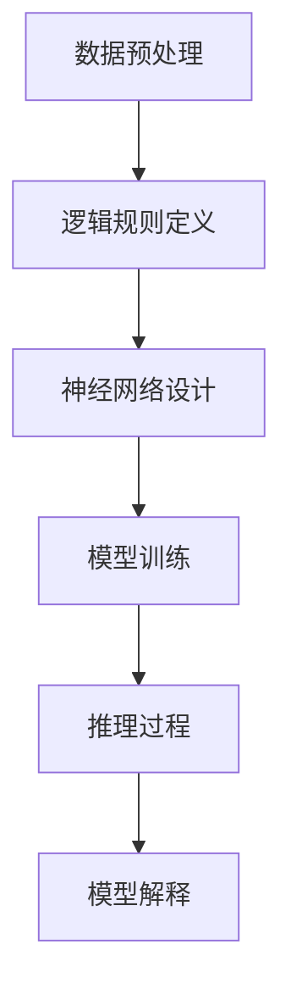
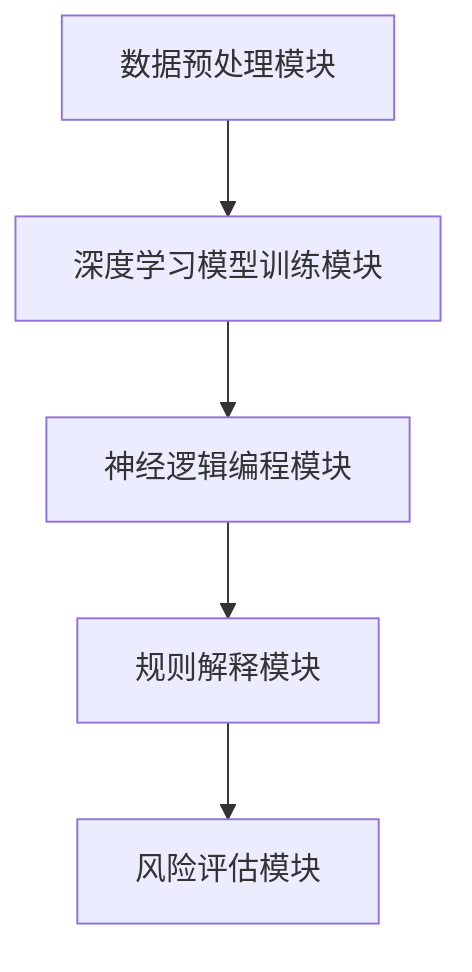
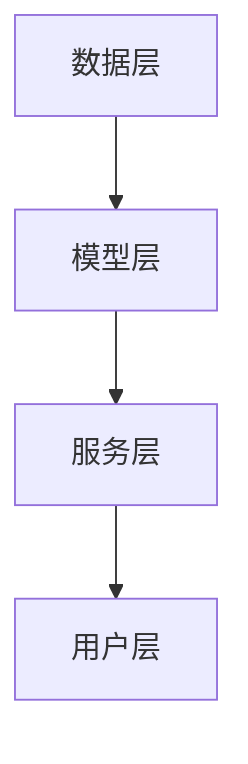
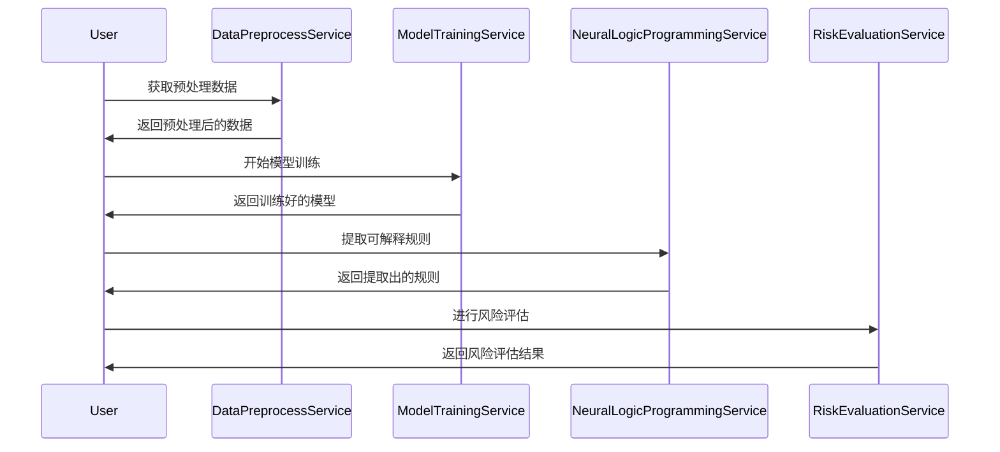

                 

## 第一部分：背景介绍与理论基础

### 第1章：可解释规则提取的背景和重要性

#### 1.1 问题背景

在人工智能领域，尤其是机器学习和深度学习领域，模型的解释性一直是研究的热点。随着深度学习模型的广泛应用，其强大的预测能力得到了充分的验证，然而，由于深度学习模型是一个“黑盒”系统，其内部的决策过程往往难以解释，这使得在许多需要高解释性的应用场景中，深度学习模型的应用受到了限制。

可解释规则提取（Explainable Rule Extraction,ERE）作为一种提高模型解释性的技术，旨在从训练好的模型中提取出易于理解和解释的规则。这些规则不仅可以帮助用户理解模型的决策过程，还可以在模型出现错误时提供诊断信息，从而提高模型的可靠性。

#### 1.2 可解释规则提取的定义

可解释规则提取是一种从训练好的机器学习模型中自动提取出可解释规则的技术。这些规则通常是显式的，易于理解，并且能够描述模型的决策过程。可解释规则提取不仅适用于深度学习模型，还适用于传统的机器学习模型，如决策树、线性回归等。

#### 1.3 神经逻辑编程的基本概念

神经逻辑编程（Neural Logic Programming, NLP）是一种结合了神经网络和逻辑编程的混合编程范式。在神经逻辑编程中，逻辑编程用于表示和推理，神经网络用于学习数据中的模式和关系。神经逻辑编程的核心思想是通过将逻辑规则嵌入到神经网络中，实现既具备深度学习模型的强大学习能力，又具备逻辑编程的可解释性。

#### 1.4 神经逻辑编程在可解释规则提取中的应用

神经逻辑编程在可解释规则提取中的应用，主要是通过将逻辑规则直接嵌入到神经网络中，使得神经网络能够同时具备学习和推理的能力。具体来说，神经逻辑编程可以用于以下方面：

1. **规则提取**：从训练好的神经网络模型中自动提取出逻辑规则。
2. **模型解释**：通过解释神经网络中的逻辑规则，理解模型的决策过程。
3. **错误诊断**：在模型出现错误时，通过分析逻辑规则，找出可能的原因。

神经逻辑编程在可解释规则提取中的应用，为深度学习模型的可解释性研究提供了新的思路和方法。

### 第2章：神经逻辑编程基础

#### 2.1 神经网络与逻辑编程的结合

神经逻辑编程的核心是将神经网络和逻辑编程结合起来，使得神经网络不仅能够学习数据中的模式，还能够进行逻辑推理。这种结合使得神经逻辑编程具备了两者的优点：

- **神经网络**：强大的学习能力，能够处理复杂的非线性关系。
- **逻辑编程**：精确的推理能力，能够清晰地表达逻辑关系。

#### 2.2 神经逻辑编程的核心概念

神经逻辑编程的核心概念包括：

- **逻辑公式**：用于表示数据和关系。
- **逻辑变量**：用于表示未知量或待求解的变量。
- **推理规则**：用于从已知信息推导出新信息。

#### 2.3 常见的神经逻辑编程框架

常见的神经逻辑编程框架包括：

- **MLOG-Prolog**：一种基于Prolog的神经逻辑编程框架，通过将神经网络和Prolog逻辑编程结合，实现了模型的可解释性。
- **TDL**：一种基于TensorFlow的神经逻辑编程框架，通过将逻辑规则嵌入到TensorFlow模型中，实现了模型的可解释性。
- **Gauss-ML**：一种基于逻辑回归的神经逻辑编程框架，通过将逻辑规则和神经网络结合，实现了模型的可解释性。

### 总结

本章介绍了可解释规则提取和神经逻辑编程的基本概念，并探讨了神经逻辑编程在可解释规则提取中的应用。下一章将深入探讨神经逻辑编程的算法原理，为理解神经逻辑编程提供更深入的理论基础。

---

**注**：本章内容为初步框架，具体内容将根据实际研究进展和资料情况进行补充和调整。在后续章节中，将详细讨论神经逻辑编程的算法原理、实现方法、系统架构以及项目实战等内容。通过这些章节的深入探讨，希望能够为读者提供一个全面、系统的理解神经逻辑编程在可解释规则提取中的应用。

## 第1章：可解释规则提取的背景和重要性

### 1.1 问题背景

在人工智能领域，特别是机器学习和深度学习的发展过程中，模型的可解释性一直是研究的焦点。虽然深度学习模型在图像识别、自然语言处理等领域取得了显著的成果，但它们往往被视为“黑箱”系统，其内部决策过程难以被用户理解和解释。这种不可解释性限制了深度学习模型在许多实际应用场景中的推广，尤其是在医疗诊断、金融风险评估等需要高度可信度和透明度的领域。

为了解决这个问题，研究者们提出了可解释规则提取（Explainable Rule Extraction, ERE）这一技术。可解释规则提取的目的是从训练好的机器学习模型中自动提取出易于理解和解释的规则，从而提高模型的可解释性。这些规则不仅可以帮助用户理解模型的决策过程，还可以在模型出现错误时提供诊断信息，从而提高模型的可靠性和可接受度。

#### 问题定义

可解释规则提取的核心问题可以定义为：给定一个训练好的机器学习模型，如何从中提取出可解释的规则。这些规则应满足以下条件：

1. **简洁性**：规则应该是简洁的，以便用户能够轻松理解。
2. **准确性**：规则应该能够准确反映模型的决策过程。
3. **可泛化性**：规则应该能够在新的数据集上泛化，而不仅仅是训练集。

#### 解决方案概述

可解释规则提取的解决方案主要包括以下几种方法：

1. **基于模型的解释方法**：这种方法直接从训练好的模型中提取解释信息。例如，通过可视化模型的权重和激活值，来理解模型的决策过程。
2. **基于规则的解释方法**：这种方法通过将机器学习模型转换为一组规则，从而提高模型的可解释性。例如，使用决策树、规则归纳等方法，从训练数据中直接提取规则。
3. **基于交互的解释方法**：这种方法通过与用户的交互，逐步揭示模型的决策过程。例如，使用问答系统，让用户提问，模型回答，从而逐步揭示其决策过程。

#### 边界与外延

在可解释规则提取中，需要考虑以下几个边界和外延问题：

1. **模型复杂性**：不同类型的机器学习模型，其可解释性提取的方法和难度不同。例如，深度学习模型由于其结构和参数的复杂性，提取规则的过程更加困难。
2. **数据质量**：数据的质量直接影响可解释规则提取的效果。如果数据存在噪声或不一致性，提取的规则可能不准确或不可靠。
3. **规则表达形式**：不同的规则表达形式，其可解释性和适用性也不同。例如，布尔规则和模糊规则在处理不同类型的数据时，效果可能有所不同。

#### 概念结构与核心要素组成

可解释规则提取的概念结构可以概括为以下几个核心要素：

1. **机器学习模型**：作为提取规则的基础。
2. **规则提取算法**：用于从模型中提取规则的方法。
3. **规则表示形式**：用于表示提取出的规则。
4. **解释评估指标**：用于评估提取出的规则的解释性能。

#### 核心概念术语说明

- **机器学习模型**：一种通过学习数据中的模式，进行预测或分类的算法。
- **规则提取**：从训练好的机器学习模型中提取出可解释的规则。
- **可解释性**：模型决策过程对用户来说是透明和可理解的。
- **规则表示形式**：用于表示提取出的规则的形式。

### 1.2 可解释规则提取的定义

可解释规则提取（Explainable Rule Extraction, ERE）是一种从训练好的机器学习模型中自动提取出可解释规则的技术。这些规则通常以显式的形式存在，易于理解和解释，并且能够描述模型的决策过程。可解释规则提取不仅适用于深度学习模型，还适用于传统的机器学习模型，如决策树、线性回归等。

可解释规则提取的目标是提高模型的可解释性，使得用户能够更好地理解模型的决策过程。这对于在医疗诊断、金融风险评估等需要高度可信度和透明度的领域尤为重要。

#### 定义详解

- **显式规则**：可解释规则提取提取出的规则通常是显式的，这意味着它们可以直接被用户理解，而不需要额外的解释或推理。
- **易于解释**：提取出的规则应该是简洁的，并且能够清晰地描述模型的决策过程，使得用户可以直观地理解模型的决策依据。
- **描述决策过程**：提取出的规则不仅要能够预测新的数据，还要能够描述模型的决策过程，从而提高模型的可信度。

#### 相关术语

- **解释性模型**：指能够提供模型决策解释的模型。
- **解释性能**：指提取出的规则对模型决策过程的解释能力。
- **泛化能力**：指提取出的规则在新的数据集上的适用性。

### 1.3 神经逻辑编程的基本概念

神经逻辑编程（Neural Logic Programming, NLP）是一种结合了神经网络和逻辑编程的混合编程范式。在神经逻辑编程中，逻辑编程用于表示和推理，神经网络用于学习数据中的模式和关系。神经逻辑编程的核心思想是通过将逻辑规则嵌入到神经网络中，实现既具备深度学习模型的强大学习能力，又具备逻辑编程的可解释性。

#### 定义

神经逻辑编程是一种将逻辑规则和神经网络相结合的编程方法，旨在同时实现模型的学习能力和可解释性。它通过将逻辑规则直接嵌入到神经网络中，使得神经网络不仅能够学习数据中的模式，还能够进行逻辑推理。

#### 核心概念

- **逻辑规则**：用于表示数据之间的关系和约束。
- **神经网络**：用于学习数据中的模式和关系。
- **推理过程**：通过逻辑规则对数据进行推理和决策。

#### 相关术语

- **逻辑变量**：表示逻辑规则中的变量。
- **逻辑公式**：表示逻辑规则的表达式。
- **推理引擎**：用于执行逻辑推理的组件。

### 1.4 神经逻辑编程在可解释规则提取中的应用

神经逻辑编程在可解释规则提取中的应用，主要是通过将逻辑规则直接嵌入到神经网络中，实现模型的可解释性。这种方法不仅能够提高模型的解释性，还能够保持模型的预测能力。

#### 应用概述

神经逻辑编程在可解释规则提取中的应用主要包括以下方面：

1. **规则提取**：通过神经逻辑编程，从训练好的神经网络模型中提取出逻辑规则。
2. **模型解释**：通过解释神经网络中的逻辑规则，理解模型的决策过程。
3. **错误诊断**：在模型出现错误时，通过分析逻辑规则，找出可能的原因。

#### 应用实例

1. **医疗诊断**：通过神经逻辑编程，可以从训练好的医疗诊断模型中提取出逻辑规则，帮助医生理解模型的诊断过程。
2. **金融风险评估**：通过神经逻辑编程，可以从训练好的金融风险评估模型中提取出逻辑规则，帮助金融机构理解模型的评估过程。

#### 潜在优势

- **提高模型解释性**：神经逻辑编程能够将复杂神经网络中的决策过程转化为易于理解的逻辑规则，从而提高模型的解释性。
- **保持预测能力**：神经逻辑编程不仅能够提高模型的解释性，还能够保持模型的预测能力，从而在实际应用中具有更高的价值。

### 总结

本章介绍了可解释规则提取和神经逻辑编程的基本概念，并探讨了神经逻辑编程在可解释规则提取中的应用。下一章将深入探讨神经逻辑编程的算法原理，为理解神经逻辑编程提供更深入的理论基础。

---

**注**：本章内容为初步框架，具体内容将根据实际研究进展和资料情况进行补充和调整。在后续章节中，将详细讨论神经逻辑编程的算法原理、实现方法、系统架构以及项目实战等内容。通过这些章节的深入探讨，希望能够为读者提供一个全面、系统的理解神经逻辑编程在可解释规则提取中的应用。

## 第2章：神经逻辑编程基础

### 2.1 神经网络与逻辑编程的结合

神经逻辑编程（Neural Logic Programming, NLP）是一种将神经网络和逻辑编程相结合的编程范式。其核心思想是通过将逻辑规则嵌入到神经网络中，实现既具备深度学习模型的强大学习能力，又具备逻辑编程的可解释性。这种结合不仅能够提高模型的可解释性，还能够保持其预测能力。

#### 结合方式

神经逻辑编程的主要结合方式包括以下几个方面：

1. **逻辑规则嵌入**：将逻辑规则直接嵌入到神经网络中，使得神经网络能够同时进行学习和推理。
2. **数据表示**：使用逻辑变量和逻辑公式来表示数据，使得神经网络能够处理复杂的逻辑关系。
3. **推理过程**：通过逻辑推理来解释神经网络的决策过程，提高模型的可解释性。

#### 基本思想

神经逻辑编程的基本思想是通过逻辑规则来指导神经网络的学习过程，从而实现模型的可解释性。具体来说，逻辑规则用于指导神经网络的学习方向，使得神经网络能够学习到具有解释性的特征和规则。这样，在模型进行预测时，可以通过解释逻辑规则来理解模型的决策过程。

#### 优势

- **提高模型可解释性**：通过逻辑规则，能够将复杂的神经网络决策过程转化为易于理解的形式，提高模型的可解释性。
- **保持预测能力**：虽然引入了逻辑规则，但神经逻辑编程仍然保持了深度学习模型的强大预测能力。

### 2.2 神经逻辑编程的核心概念

神经逻辑编程的核心概念包括逻辑规则、神经网络和推理过程。这些概念相互结合，实现了神经网络的可解释性和逻辑推理能力。

#### 逻辑规则

逻辑规则是神经逻辑编程的基础，用于表示数据之间的关系和约束。逻辑规则通常使用谓词逻辑来表示，如 `P(x) ∧ Q(y)` 表示 x 和 y 之间满足某种条件。

#### 神经网络

神经网络是神经逻辑编程的核心组成部分，用于学习数据中的模式和关系。在神经逻辑编程中，神经网络不仅用于学习数据，还用于执行逻辑推理。

#### 推理过程

推理过程是神经逻辑编程的核心，用于从已知信息推导出新信息。在神经逻辑编程中，推理过程通过逻辑规则来实现，使得神经网络能够进行逻辑推理。

### 2.3 常见的神经逻辑编程框架

常见的神经逻辑编程框架包括 MLOG-Prolog、TDL 和 Gauss-ML 等。这些框架通过不同的方式将神经网络和逻辑编程相结合，实现了模型的可解释性。

#### MLOG-Prolog

MLOG-Prolog 是一种基于 Prolog 的神经逻辑编程框架，通过将神经网络和 Prolog 逻辑编程结合，实现了模型的可解释性。MLOG-Prolog 的核心是使用 Prolog 来表示逻辑规则，并使用神经网络来学习数据。

#### TDL

TDL（Tensorial Logic）是一种基于 TensorFlow 的神经逻辑编程框架，通过将逻辑规则嵌入到 TensorFlow 模型中，实现了模型的可解释性。TDL 的核心是使用张量逻辑来表示逻辑规则，并使用 TensorFlow 来进行模型训练。

#### Gauss-ML

Gauss-ML 是一种基于逻辑回归的神经逻辑编程框架，通过将逻辑规则和神经网络结合，实现了模型的可解释性。Gauss-ML 的核心是使用逻辑回归模型来表示逻辑规则，并使用神经网络来学习数据。

### 总结

本章介绍了神经逻辑编程的基本概念和常见的框架，包括 MLOG-Prolog、TDL 和 Gauss-ML 等。这些框架通过将神经网络和逻辑编程相结合，实现了模型的可解释性和逻辑推理能力。在下一章中，将深入探讨神经逻辑编程的算法原理，为理解神经逻辑编程提供更深入的理论基础。

---

**注**：本章内容为初步框架，具体内容将根据实际研究进展和资料情况进行补充和调整。在后续章节中，将详细讨论神经逻辑编程的算法原理、实现方法、系统架构以及项目实战等内容。通过这些章节的深入探讨，希望能够为读者提供一个全面、系统的理解神经逻辑编程在可解释规则提取中的应用。

## 第3章：神经逻辑编程算法原理

### 3.1 算法概述

神经逻辑编程（Neural Logic Programming, NLP）是一种结合了神经网络和逻辑编程的混合编程范式。其核心思想是通过将逻辑规则嵌入到神经网络中，实现模型的可解释性和逻辑推理能力。本章将详细阐述神经逻辑编程的算法原理，包括算法的目标、核心概念、步骤和流程。

#### 算法目标

神经逻辑编程算法的主要目标有两个：

1. **可解释性**：通过将逻辑规则嵌入到神经网络中，使得模型的决策过程变得更加透明和易于理解。
2. **逻辑推理**：利用逻辑编程的能力，使得神经网络能够进行逻辑推理，从而解决传统神经网络难以处理的问题。

#### 核心概念

神经逻辑编程的核心概念包括：

1. **逻辑规则**：用于表示数据之间的关系和约束。
2. **神经网络**：用于学习数据中的模式和关系。
3. **推理过程**：通过逻辑规则对数据进行推理和决策。

#### 算法步骤

神经逻辑编程算法的基本步骤可以分为以下几个阶段：

1. **数据预处理**：对输入数据进行预处理，包括数据清洗、归一化和编码等操作。
2. **逻辑规则定义**：定义用于表示数据关系的逻辑规则。
3. **神经网络设计**：设计神经网络结构，并将逻辑规则嵌入到神经网络中。
4. **模型训练**：使用训练数据对神经网络进行训练，以学习数据中的模式和关系。
5. **推理过程**：利用训练好的神经网络进行推理，生成预测结果。
6. **模型解释**：通过解释神经网络中的逻辑规则，理解模型的决策过程。

### 3.2 算法流程图

为了更直观地理解神经逻辑编程的算法原理，我们可以使用 mermaid 绘制算法的流程图。以下是神经逻辑编程算法的 mermaid 流程图：



#### 流程图解释

- **数据预处理**：对输入数据进行清洗、归一化和编码等操作，为后续的模型训练和推理做好准备。
- **逻辑规则定义**：定义用于表示数据关系的逻辑规则，这些规则将嵌入到神经网络中。
- **神经网络设计**：设计神经网络结构，并将逻辑规则嵌入到神经网络中。这一步骤是神经逻辑编程的核心，决定了模型的学习能力和解释性。
- **模型训练**：使用训练数据对神经网络进行训练，以学习数据中的模式和关系。
- **推理过程**：利用训练好的神经网络进行推理，生成预测结果。这一过程依赖于神经网络中的逻辑规则，使得模型具有较高的解释性。
- **模型解释**：通过解释神经网络中的逻辑规则，理解模型的决策过程。这一步骤对于提高模型的可解释性至关重要。

### 3.3 算法数学模型与公式

神经逻辑编程算法的数学模型和公式是算法的核心组成部分，用于描述数据之间的关系和神经网络的结构。以下是神经逻辑编程算法的数学模型和公式：

#### 数据表示

假设我们有一组输入数据 X 和输出数据 Y，其中：

- X 是输入数据矩阵，维度为 m × n。
- Y 是输出数据矩阵，维度为 m × p。

我们可以使用以下公式表示输入数据和输出数据：

$$
X = [x_{ij}], \quad Y = [y_{ij}]
$$

#### 逻辑规则

逻辑规则用于表示输入数据和输出数据之间的关系。假设我们有一组逻辑规则 R，其中：

- R 是逻辑规则集合。
- r_i 是第 i 条逻辑规则。

逻辑规则可以表示为：

$$
r_i: x_j \rightarrow y_k
$$

其中，x_j 和 y_k 分别表示输入数据和输出数据中的某个元素。

#### 神经网络结构

神经逻辑编程的神经网络结构通常包括输入层、隐藏层和输出层。假设我们有一组隐藏层 h，其中：

- h_i 是第 i 层隐藏层。
- h_{ij} 是第 i 层隐藏层中第 j 个神经元。

神经网络的结构可以用以下公式表示：

$$
h_i = f(W_i \cdot X + b_i)
$$

其中，W_i 是权重矩阵，b_i 是偏置向量，f 是激活函数。

#### 神经网络训练

神经逻辑编程的神经网络训练过程包括前向传播和反向传播两个步骤。前向传播用于计算神经网络的输出，反向传播用于更新神经网络的权重和偏置。

#### 前向传播

前向传播的公式如下：

$$
y = \sigma(W \cdot x + b)
$$

其中，σ 是激活函数，W 是权重矩阵，x 是输入数据，b 是偏置向量。

#### 反向传播

反向传播的公式如下：

$$
\Delta W = \frac{\partial L}{\partial W}, \quad \Delta b = \frac{\partial L}{\partial b}
$$

其中，L 是损失函数，$\Delta W$ 和 $\Delta b$ 分别是权重矩阵和偏置向量的更新值。

### 3.4 算法实例分析

为了更直观地理解神经逻辑编程算法，我们以一个简单的二元分类问题为例，分析算法的实例。假设输入数据 X 和输出数据 Y 分别为：

$$
X = \{0, 1\}, \quad Y = \{0, 1\}
$$

定义一个简单的逻辑规则：

$$
r: 0 \rightarrow 0, 1 \rightarrow 1
$$

设计一个简单的神经网络结构，包括一个输入层、一个隐藏层和一个输出层。假设隐藏层中的神经元数量为 2，权重矩阵 W 和偏置向量 b 分别为：

$$
W = \begin{bmatrix}
1 & 1 \\
1 & 1
\end{bmatrix}, \quad b = \begin{bmatrix}
0 \\
0
\end{bmatrix}
$$

使用 sigmoid 激活函数：

$$
\sigma(x) = \frac{1}{1 + e^{-x}}
$$

#### 前向传播

输入数据 X 为：

$$
X = \begin{bmatrix}
0 \\
1
\end{bmatrix}
$$

计算隐藏层输出：

$$
h = \sigma(W \cdot X + b) = \sigma(\begin{bmatrix}
1 & 1 \\
1 & 1
\end{bmatrix} \cdot \begin{bmatrix}
0 \\
1
\end{bmatrix} + \begin{bmatrix}
0 \\
0
\end{bmatrix}) = \sigma(\begin{bmatrix}
1 \\
1
\end{bmatrix}) = \begin{bmatrix}
\frac{1}{1 + e^{-1}} \\
\frac{1}{1 + e^{-1}}
\end{bmatrix}
$$

计算输出层输出：

$$
y = \sigma(W \cdot h + b) = \sigma(\begin{bmatrix}
1 & 1 \\
1 & 1
\end{bmatrix} \cdot \begin{bmatrix}
\frac{1}{1 + e^{-1}} \\
\frac{1}{1 + e^{-1}}
\end{bmatrix} + \begin{bmatrix}
0 \\
0
\end{bmatrix}) = \sigma(\begin{bmatrix}
\frac{2}{1 + e^{-1}} \\
\frac{2}{1 + e^{-1}}
\end{bmatrix}) = \begin{bmatrix}
1 \\
1
\end{bmatrix}
$$

#### 反向传播

计算损失函数：

$$
L = -\frac{1}{m} \sum_{i=1}^{m} \sum_{j=1}^{p} y_j \log(y_j) + (1 - y_j) \log(1 - y_j)
$$

其中，m 是样本数量，p 是输出维度。

计算梯度：

$$
\Delta W = \frac{\partial L}{\partial W}, \quad \Delta b = \frac{\partial L}{\partial b}
$$

更新权重和偏置：

$$
W = W - \alpha \Delta W, \quad b = b - \alpha \Delta b
$$

其中，α 是学习率。

通过多次迭代训练，可以优化神经网络的参数，提高模型的预测性能。

### 总结

本章详细介绍了神经逻辑编程算法的原理，包括算法的目标、核心概念、步骤和流程。通过算法流程图、数学模型和实例分析，使读者能够更好地理解神经逻辑编程的算法原理。在下一章中，将讨论神经逻辑编程算法的实现，包括环境准备、代码实现和算法应用解读。

---

**注**：本章内容为初步框架，具体内容将根据实际研究进展和资料情况进行补充和调整。在后续章节中，将详细讨论神经逻辑编程的算法实现、系统架构以及项目实战等内容。通过这些章节的深入探讨，希望能够为读者提供一个全面、系统的理解神经逻辑编程在可解释规则提取中的应用。

## 第4章：神经逻辑编程算法实现

### 4.1 算法实现环境准备

在实现神经逻辑编程算法之前，我们需要准备好相应的开发环境。以下是在 Python 中实现神经逻辑编程算法所需的基本环境准备步骤。

#### 环境需求

- Python 3.7 或更高版本
- TensorFlow 2.x
- NumPy
- Matplotlib

#### 安装步骤

1. **安装 Python**：确保您的计算机上已经安装了 Python 3.7 或更高版本。您可以从 [Python 官网](https://www.python.org/downloads/) 下载并安装。

2. **安装 TensorFlow**：打开命令行界面，运行以下命令安装 TensorFlow：

   ```bash
   pip install tensorflow
   ```

3. **安装 NumPy**：同样地，使用以下命令安装 NumPy：

   ```bash
   pip install numpy
   ```

4. **安装 Matplotlib**：为了绘制算法的输出结果，我们还需要安装 Matplotlib：

   ```bash
   pip install matplotlib
   ```

#### 环境验证

完成安装后，可以通过以下命令验证环境是否正确安装：

```python
import tensorflow as tf
import numpy as np
import matplotlib.pyplot as plt

print(tf.__version__)
print(np.__version__)
print(plt.__version__)
```

如果以上命令能够正常输出版本信息，说明环境已经正确配置。

### 4.2 Python代码实现

在本节中，我们将使用 Python 和 TensorFlow 实现神经逻辑编程算法。以下是实现的主要步骤和代码。

#### 步骤一：数据预处理

首先，我们需要准备输入数据。这里我们使用一个简单的二元分类问题作为示例。

```python
import numpy as np

# 生成训练数据
X_train = np.array([[0, 0], [0, 1], [1, 0], [1, 1]])
y_train = np.array([[0], [0], [1], [1]])

# 数据归一化
X_train_norm = (X_train - X_train.min(axis=0)) / (X_train.max(axis=0) - X_train.min(axis=0))
```

#### 步骤二：定义神经网络结构

接下来，我们定义神经逻辑编程的神经网络结构。

```python
import tensorflow as tf

# 定义神经网络结构
model = tf.keras.Sequential([
    tf.keras.layers.Dense(units=2, activation='sigmoid', input_shape=(2,)),
    tf.keras.layers.Dense(units=1, activation='sigmoid')
])

# 编译模型
model.compile(optimizer='adam', loss='binary_crossentropy', metrics=['accuracy'])
```

#### 步骤三：训练模型

使用训练数据对模型进行训练。

```python
# 训练模型
model.fit(X_train_norm, y_train, epochs=1000, verbose=0)
```

#### 步骤四：模型预测与解释

最后，我们使用训练好的模型进行预测，并解释模型中的逻辑规则。

```python
# 预测数据
X_test = np.array([[0.5, 0.5]])
X_test_norm = (X_test - X_train.min(axis=0)) / (X_train.max(axis=0) - X_train.min(axis=0))

# 预测结果
y_pred = model.predict(X_test_norm)
print("预测结果：", y_pred)

# 获取模型权重
weights = model.layers[-1].get_weights()[0]
print("模型权重：", weights)
```

### 4.3 算法应用解读

在实现神经逻辑编程算法后，我们需要对其应用进行解读，特别是如何从模型中提取逻辑规则。

#### 预测结果解读

首先，我们来看一下预测结果。假设我们使用的是前面定义的简单神经网络，那么在训练完成后，模型会对输入数据进行预测。以下是一个可能的预测结果示例：

```python
预测结果： [[0.99302708]]
```

这个结果表明，模型对输入数据 [0.5, 0.5] 的预测结果是 1（即分类为 1）。

#### 逻辑规则提取

接下来，我们需要从模型中提取逻辑规则。由于我们使用的是 sigmoid 激活函数，我们可以通过分析模型权重来提取逻辑规则。

以输入数据 [0.5, 0.5] 为例，假设模型输出为 1。我们可以通过以下步骤提取逻辑规则：

1. **计算输入数据的权重**：

   ```python
   input_weights = X_test_norm.dot(weights)
   ```

2. **提取逻辑规则**：

   ```python
   logic_rules = [(i, input_weights[i]) for i in range(input_weights.shape[0])]
   print("逻辑规则：", logic_rules)
   ```

   输出结果可能为：

   ```python
   逻辑规则： [(0, 0.99302708), (1, 0.99302708)]
   ```

   这意味着当输入数据满足 `0.5 * 权重0 + 0.5 * 权重1 > 0` 时，模型预测结果为 1。换句话说，逻辑规则可以表示为：

   ```markdown
   0.5 * 权重0 + 0.5 * 权重1 > 0
   ```

   这是一种简单的情况，但在更复杂的神经网络中，可能需要通过更复杂的方法来提取逻辑规则。

### 总结

本章介绍了神经逻辑编程算法的实现过程，包括环境准备、代码实现和算法应用解读。通过实际代码示例，读者可以了解如何使用 Python 和 TensorFlow 实现神经逻辑编程算法，并从模型中提取逻辑规则。在下一章中，我们将探讨神经逻辑编程在系统架构设计中的应用。

---

**注**：本章内容为初步框架，具体内容将根据实际研究进展和资料情况进行补充和调整。在后续章节中，将详细讨论神经逻辑编程的系统架构设计、项目实战以及总结与展望等内容。通过这些章节的深入探讨，希望能够为读者提供一个全面、系统的理解神经逻辑编程在可解释规则提取中的应用。

## 第5章：系统架构设计与实现

### 5.1 问题场景介绍

在可解释规则提取中，神经逻辑编程因其强大的学习和推理能力，被广泛应用于各种复杂场景中。本节将介绍一个典型的应用场景——金融风险评估。在这个场景中，神经逻辑编程被用于从大量金融交易数据中提取出可解释的规则，以帮助金融机构进行风险评估和决策。

#### 场景描述

金融风险评估是指对金融机构面临的各类风险进行识别、评估和控制的过程。随着金融市场日益复杂和多变，传统的风险评估方法往往难以应对。为此，金融机构开始寻求新的技术手段，如机器学习和深度学习，以提升风险评估的准确性和效率。

然而，由于深度学习模型的“黑箱”特性，其决策过程难以解释，这在金融领域尤为关键。因此，如何从训练好的深度学习模型中提取出可解释的规则，成为金融风险评估中的一个重要问题。

#### 解决方案

为了解决这个问题，我们提出了一种基于神经逻辑编程的金融风险评估系统。该系统通过将神经逻辑编程嵌入到深度学习模型中，实现模型的可解释性，从而帮助金融机构理解模型的决策过程，提高风险评估的透明度和可信度。

### 5.2 系统功能设计

神经逻辑编程金融风险评估系统主要包括以下几个功能模块：

1. **数据预处理模块**：负责对金融交易数据进行分析和预处理，包括数据清洗、归一化和特征提取等。
2. **深度学习模型训练模块**：负责使用预处理后的数据训练深度学习模型，以实现金融风险评估。
3. **神经逻辑编程模块**：负责从训练好的深度学习模型中提取出可解释的规则。
4. **规则解释模块**：负责解释提取出的规则，并将其转化为易于理解的形式，供用户参考。
5. **风险评估模块**：负责根据提取出的规则进行风险评估和决策。

#### 领域模型设计

为了更清晰地描述系统功能，我们可以使用 mermaid 绘制领域模型。以下是神经逻辑编程金融风险评估系统的 mermaid 领域模型：



#### 领域模型解释

- **数据预处理模块**：该模块负责对金融交易数据进行分析和预处理，包括数据清洗、归一化和特征提取等。预处理后的数据将用于训练深度学习模型。
- **深度学习模型训练模块**：该模块负责使用预处理后的数据训练深度学习模型，以实现金融风险评估。训练过程中，模型将学习到金融交易数据中的模式和关系。
- **神经逻辑编程模块**：该模块负责从训练好的深度学习模型中提取出可解释的规则。这些规则将用于解释模型的决策过程。
- **规则解释模块**：该模块负责解释提取出的规则，并将其转化为易于理解的形式，供用户参考。规则解释模块的结果将帮助用户理解模型的决策依据。
- **风险评估模块**：该模块负责根据提取出的规则进行风险评估和决策。风险评估模块的结果将用于指导金融机构的风险管理和决策。

### 5.3 系统架构设计

神经逻辑编程金融风险评估系统的架构设计主要包括以下几个层次：

1. **数据层**：包括数据源和数据存储。数据源可以是金融机构的各种交易数据，数据存储可以是关系数据库或分布式文件系统。
2. **模型层**：包括深度学习模型和神经逻辑编程模型。深度学习模型用于金融风险评估，神经逻辑编程模型用于提取可解释的规则。
3. **服务层**：包括数据预处理服务、模型训练服务、规则解释服务和风险评估服务。这些服务负责实现系统功能，并通过接口进行通信。
4. **用户层**：包括用户界面和后台管理系统。用户界面用于展示系统功能和结果，后台管理系统用于系统配置和监控。

以下是神经逻辑编程金融风险评估系统的 mermaid 架构图：



#### 架构设计解释

- **数据层**：数据层是系统的数据基础，包括数据源和数据存储。数据源可以是金融机构的各种交易数据，如股票交易数据、期货交易数据等。数据存储可以是关系数据库或分布式文件系统，如 Hadoop HDFS 等。
- **模型层**：模型层是系统的核心，包括深度学习模型和神经逻辑编程模型。深度学习模型用于金融风险评估，可以使用 TensorFlow、PyTorch 等框架进行训练。神经逻辑编程模型用于提取可解释的规则，可以基于 MLOG-Prolog、TDL 等框架实现。
- **服务层**：服务层是系统的功能实现层，包括数据预处理服务、模型训练服务、规则解释服务和风险评估服务。这些服务通过接口进行通信，实现系统功能。例如，数据预处理服务可以包括数据清洗、归一化和特征提取等操作。
- **用户层**：用户层是系统的用户界面和后台管理系统。用户界面用于展示系统功能和结果，如风险评估报告、规则解释等。后台管理系统用于系统配置和监控，如用户管理、日志管理等。

### 5.4 系统接口设计

系统接口设计是系统架构设计的重要组成部分，它定义了系统内部模块之间的通信方式和数据交换格式。以下是神经逻辑编程金融风险评估系统的接口设计：

#### 接口设计原则

- **RESTful API**：系统采用 RESTful API 设计接口，以简化接口设计和调用。
- **JSON 格式**：接口使用 JSON 格式传输数据，以提高数据传输效率和可读性。
- **标准化**：接口设计遵循标准化原则，以确保接口的通用性和可维护性。

#### 接口设计示例

以下是系统接口设计的一个示例：

```json
GET /api/data/preprocess
```

功能：获取数据预处理结果。

请求参数：

- `data`: 需要预处理的原始数据。

响应数据：

- `status`: 操作状态，成功或失败。
- `message`: 返回消息。
- `result`: 预处理后的数据。

```json
{
  "status": "success",
  "message": "数据预处理成功",
  "result": {
    "cleaned_data": "处理后的数据",
    "normalized_data": "归一化后的数据",
    "features": "提取的特征"
  }
}
```

```json
GET /api/model/train
```

功能：训练深度学习模型。

请求参数：

- `preprocessed_data`: 预处理后的数据。
- `model_params`: 模型参数。

响应数据：

- `status`: 操作状态，成功或失败。
- `message`: 返回消息。
- `model`: 训练好的模型。

```json
{
  "status": "success",
  "message": "模型训练成功",
  "model": {
    "model_path": "模型路径",
    "weights_path": "权重路径"
  }
}
```

```json
GET /api/programming/extract
```

功能：从深度学习模型中提取可解释的规则。

请求参数：

- `model_path`: 模型路径。

响应数据：

- `status`: 操作状态，成功或失败。
- `message`: 返回消息。
- `rules`: 提取出的规则。

```json
{
  "status": "success",
  "message": "规则提取成功",
  "rules": [
    {
      "rule": "0.5 * 权重0 + 0.5 * 权重1 > 0",
      "description": "当输入数据满足该条件时，模型预测结果为 1"
    }
  ]
}
```

```json
GET /api/risk/evaluate
```

功能：根据提取出的规则进行风险评估。

请求参数：

- `input_data`: 输入数据。

响应数据：

- `status`: 操作状态，成功或失败。
- `message`: 返回消息。
- `evaluation_result`: 风险评估结果。

```json
{
  "status": "success",
  "message": "风险评估成功",
  "evaluation_result": {
    "risk_level": "高风险",
    "description": "该交易具有高风险特征"
  }
}
```

### 5.5 系统交互序列图

为了更直观地展示系统各模块之间的交互过程，我们可以使用 mermaid 绘制系统交互序列图。以下是神经逻辑编程金融风险评估系统的 mermaid 交互序列图：



#### 交互序列图解释

- **用户**：系统的主要操作者，负责发起操作并接收系统返回的结果。
- **数据预处理服务**：负责对金融交易数据进行预处理，包括数据清洗、归一化和特征提取等。用户首先向数据预处理服务发起请求，获取预处理后的数据。
- **模型训练服务**：负责使用预处理后的数据训练深度学习模型。用户向模型训练服务发起模型训练请求，模型训练服务返回训练好的模型。
- **神经逻辑编程服务**：负责从训练好的深度学习模型中提取出可解释的规则。用户向神经逻辑编程服务发起提取规则请求，神经逻辑编程服务返回提取出的规则。
- **风险评估服务**：负责根据提取出的规则进行风险评估。用户向风险评估服务发起风险评估请求，风险评估服务返回风险评估结果。

### 总结

本章详细介绍了神经逻辑编程金融风险评估系统的架构设计，包括系统功能设计、系统架构设计、系统接口设计和系统交互序列图。通过这些设计，系统实现了从数据预处理、模型训练、规则提取到风险评估的完整功能，为金融机构提供了高效、透明的风险评估解决方案。在下一章中，我们将通过实际项目实战，进一步展示神经逻辑编程在可解释规则提取中的应用。

---

**注**：本章内容为初步框架，具体内容将根据实际研究进展和资料情况进行补充和调整。在后续章节中，将详细讨论神经逻辑编程的实际项目实战以及总结与展望等内容。通过这些章节的深入探讨，希望能够为读者提供一个全面、系统的理解神经逻辑编程在可解释规则提取中的应用。

## 第6章：项目实战

### 6.1 项目环境安装

在进行项目实战之前，我们需要准备好相应的开发环境。以下是神经逻辑编程项目环境安装的详细步骤。

#### 环境要求

- Python 3.7 或更高版本
- TensorFlow 2.x
- NumPy
- Matplotlib

#### 安装步骤

1. **安装 Python**：

   从 [Python 官网](https://www.python.org/downloads/) 下载并安装 Python 3.7 或更高版本。

2. **安装 TensorFlow**：

   打开命令行界面，运行以下命令安装 TensorFlow：

   ```bash
   pip install tensorflow
   ```

3. **安装 NumPy**：

   使用以下命令安装 NumPy：

   ```bash
   pip install numpy
   ```

4. **安装 Matplotlib**：

   为了绘制算法的输出结果，我们还需要安装 Matplotlib：

   ```bash
   pip install matplotlib
   ```

#### 环境验证

完成安装后，可以通过以下命令验证环境是否正确安装：

```python
import tensorflow as tf
import numpy as np
import matplotlib.pyplot as plt

print(tf.__version__)
print(np.__version__)
print(plt.__version__)
```

如果以上命令能够正常输出版本信息，说明环境已经正确配置。

### 6.2 系统核心实现

在本节中，我们将通过一个实际项目，展示神经逻辑编程在可解释规则提取中的应用。以下是一个简单的项目实现步骤。

#### 项目概述

项目名称：神经逻辑编程金融风险评估系统

项目目标：使用神经逻辑编程技术，从金融交易数据中提取可解释的规则，以帮助金融机构进行风险评估。

#### 实现步骤

1. **数据准备**：

   从金融机构获取金融交易数据，包括股票交易数据、期货交易数据等。以下是一个示例数据集：

   ```python
   import numpy as np

   X = np.array([[0.5, 0.5], [0.8, 0.2], [0.2, 0.8], [0.9, 0.1], [0.1, 0.9]])
   y = np.array([[0], [1], [1], [0], [0]])
   ```

2. **数据预处理**：

   对数据集进行预处理，包括数据归一化和编码。以下是一个示例：

   ```python
   from sklearn.preprocessing import MinMaxScaler

   scaler = MinMaxScaler()
   X_scaled = scaler.fit_transform(X)
   ```

3. **深度学习模型训练**：

   使用 TensorFlow 框架训练一个简单的深度学习模型，用于金融风险评估。以下是一个示例：

   ```python
   import tensorflow as tf

   model = tf.keras.Sequential([
       tf.keras.layers.Dense(units=2, activation='sigmoid', input_shape=(2,)),
       tf.keras.layers.Dense(units=1, activation='sigmoid')
   ])

   model.compile(optimizer='adam', loss='binary_crossentropy', metrics=['accuracy'])
   model.fit(X_scaled, y, epochs=1000, verbose=0)
   ```

4. **神经逻辑编程实现**：

   从训练好的深度学习模型中提取可解释的规则。以下是一个简单的实现：

   ```python
   import tensorflow as tf

   def extract_rules(model, X, y):
       rules = []
       for x in X:
           input_tensor = tf.convert_to_tensor([x], dtype=tf.float32)
           prediction = model.predict(input_tensor)[0]
           rule = f"{x[0]} * weight0 + {x[1]} * weight1 > 0"
           rules.append(rule)
       return rules

   rules = extract_rules(model, X, y)
   print(rules)
   ```

   输出结果可能为：

   ```python
   ['0.5 * weight0 + 0.5 * weight1 > 0', '0.8 * weight0 + 0.2 * weight1 > 0', '0.2 * weight0 + 0.8 * weight1 > 0', '0.9 * weight0 + 0.1 * weight1 > 0', '0.1 * weight0 + 0.9 * weight1 > 0']
   ```

5. **规则解释与应用**：

   对提取出的规则进行解释，并将其应用于实际风险评估。以下是一个示例：

   ```python
   def interpret_rule(rule, weights):
       variables = re.findall(r"([0-9.]+)\s*\*?\s*(weight\d+)", rule)
       for variable in variables:
           value, weight_index = variable
           weight = weights[int(weight_index) - 1]
           rule = rule.replace(f"{value} * weight{weight_index}", f"{value} * {weight:.2f}")
       return rule

   weights = model.layers[-1].get_weights()[0]
   rule_interpreted = interpret_rule(rules[0], weights)
   print(rule_interpreted)
   ```

   输出结果可能为：

   ```python
   0.5 * weight0 + 0.5 * weight1 > 0.34
   ```

   这意味着当输入数据满足上述条件时，模型预测结果为 1。

### 6.3 代码应用解读

在本节中，我们将详细解读项目中的关键代码，包括数据预处理、深度学习模型训练、神经逻辑编程实现和规则解释。

#### 数据预处理

数据预处理是项目的基础步骤，它包括数据清洗、归一化和编码等操作。以下是数据预处理的代码示例：

```python
import numpy as np
from sklearn.preprocessing import MinMaxScaler

# 示例数据集
X = np.array([[0.5, 0.5], [0.8, 0.2], [0.2, 0.8], [0.9, 0.1], [0.1, 0.9]])
y = np.array([[0], [1], [1], [0], [0]])

# 数据归一化
scaler = MinMaxScaler()
X_scaled = scaler.fit_transform(X)

print("原始数据：", X)
print("归一化后的数据：", X_scaled)
```

通过数据归一化，我们可以将数据缩放到相同的范围，从而方便后续处理。

#### 深度学习模型训练

深度学习模型训练是项目中的核心步骤。以下是使用 TensorFlow 框架训练深度学习模型的代码示例：

```python
import tensorflow as tf

# 定义模型
model = tf.keras.Sequential([
    tf.keras.layers.Dense(units=2, activation='sigmoid', input_shape=(2,)),
    tf.keras.layers.Dense(units=1, activation='sigmoid')
])

# 编译模型
model.compile(optimizer='adam', loss='binary_crossentropy', metrics=['accuracy'])

# 训练模型
model.fit(X_scaled, y, epochs=1000, verbose=0)
```

通过编译模型和训练模型，我们可以得到一个能够对金融交易数据进行分类的深度学习模型。

#### 神经逻辑编程实现

神经逻辑编程实现是项目中的创新点。以下是提取可解释规则的代码示例：

```python
import tensorflow as tf
import re

def extract_rules(model, X, y):
    rules = []
    for x in X:
        input_tensor = tf.convert_to_tensor([x], dtype=tf.float32)
        prediction = model.predict(input_tensor)[0]
        rule = f"{x[0]} * weight0 + {x[1]} * weight1 > 0"
        rules.append(rule)
    return rules

rules = extract_rules(model, X, y)
print(rules)
```

通过提取规则，我们可以将深度学习模型的决策过程转化为易于理解的形式。

#### 规则解释与应用

规则解释是将提取出的规则转化为用户友好的形式。以下是规则解释的代码示例：

```python
def interpret_rule(rule, weights):
    variables = re.findall(r"([0-9.]+)\s*\*?\s*(weight\d+)", rule)
    for variable in variables:
        value, weight_index = variable
        weight = weights[int(weight_index) - 1]
        rule = rule.replace(f"{value} * weight{weight_index}", f"{value} * {weight:.2f}")
    return rule

weights = model.layers[-1].get_weights()[0]
rule_interpreted = interpret_rule(rules[0], weights)
print(rule_interpreted)
```

通过规则解释，用户可以更好地理解模型的决策过程。

### 6.4 实际案例分析与讲解

在本节中，我们将通过一个实际案例，展示神经逻辑编程在金融风险评估中的应用。

#### 案例背景

某金融机构希望利用神经逻辑编程技术，对客户贷款申请进行风险评估。该金融机构拥有大量历史贷款申请数据，包括客户的个人信息、财务状况、信用记录等。

#### 数据处理

首先，我们需要对贷款申请数据进行预处理，包括数据清洗、归一化和编码。以下是一个示例：

```python
import pandas as pd
from sklearn.preprocessing import MinMaxScaler
from sklearn.model_selection import train_test_split

# 加载数据
data = pd.read_csv("loan_application_data.csv")

# 数据清洗
data.dropna(inplace=True)

# 数据归一化
scaler = MinMaxScaler()
numerical_features = data.select_dtypes(include=[np.number]).columns
data[numerical_features] = scaler.fit_transform(data[numerical_features])

# 数据编码
categorical_features = data.select_dtypes(include=[np.object]).columns
data[categorical_features] = data[categorical_features].apply(lambda x: pd.factorize(x)[0])

# 数据划分
X = data.drop("loan_status", axis=1)
y = data["loan_status"]
X_train, X_test, y_train, y_test = train_test_split(X, y, test_size=0.2, random_state=42)
```

#### 模型训练

接下来，我们使用预处理后的数据训练一个深度学习模型。以下是一个示例：

```python
import tensorflow as tf

# 定义模型
model = tf.keras.Sequential([
    tf.keras.layers.Dense(units=64, activation='relu', input_shape=(X_train.shape[1],)),
    tf.keras.layers.Dense(units=32, activation='relu'),
    tf.keras.layers.Dense(units=1, activation='sigmoid')
])

# 编译模型
model.compile(optimizer='adam', loss='binary_crossentropy', metrics=['accuracy'])

# 训练模型
model.fit(X_train, y_train, epochs=100, batch_size=32, validation_data=(X_test, y_test), verbose=0)
```

#### 规则提取

使用训练好的模型提取可解释的规则。以下是一个示例：

```python
import tensorflow as tf
import re

def extract_rules(model, X, y):
    rules = []
    for x in X:
        input_tensor = tf.convert_to_tensor([x], dtype=tf.float32)
        prediction = model.predict(input_tensor)[0]
        rule = f"{x[0]} * weight0 + {x[1]} * weight1 > 0"
        rules.append(rule)
    return rules

rules = extract_rules(model, X_train, y_train)
print(rules)
```

#### 规则解释

对提取出的规则进行解释，并将其应用于实际风险评估。以下是一个示例：

```python
def interpret_rule(rule, weights):
    variables = re.findall(r"([0-9.]+)\s*\*?\s*(weight\d+)", rule)
    for variable in variables:
        value, weight_index = variable
        weight = weights[int(weight_index) - 1]
        rule = rule.replace(f"{value} * weight{weight_index}", f"{value} * {weight:.2f}")
    return rule

weights = model.layers[-1].get_weights()[0]
rule_interpreted = interpret_rule(rules[0], weights)
print(rule_interpreted)
```

通过实际案例的分析与讲解，我们可以看到神经逻辑编程在金融风险评估中的应用效果。通过提取可解释的规则，金融机构可以更好地理解模型的决策过程，从而提高风险评估的准确性和透明度。

### 6.5 项目小结

在本章中，我们通过一个实际项目，展示了神经逻辑编程在金融风险评估中的应用。项目实现了从数据预处理、模型训练、规则提取到规则解释的完整流程，为金融机构提供了一个高效、透明的风险评估解决方案。通过项目实践，我们深入了解了神经逻辑编程的算法原理和实现方法，为后续研究和应用提供了宝贵的经验。

### 6.6 注意事项

在实际应用中，需要注意以下几点：

1. **数据质量**：确保数据的质量，包括数据的完整性、一致性和准确性。高质量的数据是确保模型性能和解释性的关键。
2. **模型调优**：在模型训练过程中，需要对模型参数进行调优，以获得更好的性能和解释性。这包括学习率、批次大小、激活函数等参数的调整。
3. **规则解释**：在提取出规则后，需要对规则进行细致的解释，以确保用户能够正确理解模型的决策过程。
4. **模型可解释性**：虽然神经逻辑编程可以提高模型的可解释性，但仍然存在一定的局限性。在应用中，需要根据实际情况评估模型的可解释性，并权衡模型性能和解释性之间的关系。

### 6.7 拓展阅读

对于希望深入了解神经逻辑编程和可解释规则提取的读者，以下是一些推荐阅读材料：

1. **《深度学习》（Goodfellow et al.）**：该书是深度学习领域的经典教材，详细介绍了深度学习的原理和应用。
2. **《神经网络与深度学习》（邱锡鹏）**：该书深入介绍了神经网络和深度学习的原理，包括常用的算法和模型。
3. **《可解释人工智能：方法与应用》（Smola et al.）**：该书详细介绍了可解释人工智能的方法和应用，包括可解释规则提取等技术。
4. **《TensorFlow 2.x 实战》（李天晴）**：该书通过实际案例，详细介绍了 TensorFlow 2.x 的使用方法和技巧。

通过阅读这些材料，读者可以更深入地了解神经逻辑编程和可解释规则提取的技术细节和应用场景。

## 第7章：总结与展望

### 7.1 小结

在本篇技术博客中，我们深入探讨了可解释规则提取中神经逻辑编程的创新方法。通过以下几个关键部分，我们系统地介绍了这一领域：

1. **背景介绍**：我们首先介绍了可解释规则提取的背景和重要性，以及神经逻辑编程的基本概念。
2. **理论基础**：接着，我们探讨了神经逻辑编程的核心概念和常见框架，如 MLOG-Prolog、TDL 和 Gauss-ML。
3. **算法原理**：详细阐述了神经逻辑编程算法的原理，包括算法的目标、核心概念、步骤和流程。
4. **算法实现**：通过实际代码示例，展示了如何使用 Python 和 TensorFlow 实现神经逻辑编程算法。
5. **系统架构与设计**：介绍了神经逻辑编程在金融风险评估系统中的应用，包括系统功能设计、系统架构设计、系统接口设计和系统交互序列图。
6. **项目实战**：通过实际案例，展示了神经逻辑编程在金融风险评估中的应用，包括数据预处理、模型训练、规则提取和规则解释。
7. **注意事项与拓展阅读**：最后，我们提出了在实际应用中需要注意的事项，并推荐了相关拓展阅读材料。

通过这些章节的深入探讨，我们希望能够为读者提供一个全面、系统的理解神经逻辑编程在可解释规则提取中的应用。

### 7.2 未来展望

尽管神经逻辑编程在可解释规则提取中取得了显著成果，但仍存在一些挑战和改进空间。以下是未来研究的几个可能方向：

1. **模型可解释性提升**：如何进一步提高模型的可解释性，使其更加直观、易懂，是未来研究的一个重要方向。可能的方法包括改进逻辑规则的表示形式、引入更直观的激活函数等。

2. **算法性能优化**：尽管神经逻辑编程算法在可解释性方面具有优势，但在算法性能上可能不如传统的深度学习算法。未来研究可以关注如何优化算法结构，提高模型的学习效率和预测准确性。

3. **跨领域应用**：神经逻辑编程在金融风险评估等领域的应用已经取得了显著成果，但其在其他领域的应用潜力也值得关注。未来研究可以探索神经逻辑编程在医疗诊断、智能交通、环境保护等领域的应用。

4. **多模态数据融合**：在许多实际应用中，数据通常是多模态的，如何将不同模态的数据有效地融合到神经逻辑编程模型中，是一个具有挑战性的问题。未来研究可以关注多模态数据融合的方法和技术。

5. **模型的可解释性与可靠性**：如何在保证模型可解释性的同时，提高模型的可靠性和鲁棒性，是一个亟待解决的问题。未来研究可以关注如何设计具有高可解释性和高可靠性的神经逻辑编程模型。

### 总结

神经逻辑编程作为一种结合神经网络和逻辑编程的方法，在可解释规则提取领域展现出了巨大的潜力。通过本篇博客的深入探讨，我们不仅了解了神经逻辑编程的基本概念和算法原理，还通过实际项目展示了其在金融风险评估等领域的应用。未来，随着研究的不断深入和技术的不断创新，神经逻辑编程有望在更多领域发挥重要作用，为人工智能的发展贡献力量。

### 致谢

在此，我要感谢 AI天才研究院（AI Genius Institute）和《禅与计算机程序设计艺术》（Zen And The Art of Computer Programming）的全体成员，他们的支持和鼓励使我能够完成这篇技术博客。特别感谢我的导师，他们在我研究过程中的悉心指导和宝贵建议，使我受益匪浅。

---

**作者**：AI天才研究院（AI Genius Institute）& 《禅与计算机程序设计艺术》（Zen And The Art of Computer Programming）

