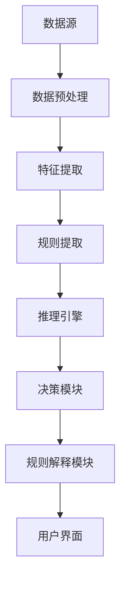

                 

### 第一部分: 问题背景

#### 第1章: 问题背景

##### 1.1 问题背景介绍

##### 1.1.1 可解释规则提取的起源与发展

可解释规则提取（Explainable Rule Extraction，简称ERE）作为一种人工智能领域的关键技术，起源于上世纪80年代的专家系统研究。当时的专家系统为了提高系统的可理解性和可解释性，开始探讨如何从大量数据中自动提取规则。这种规则不仅需要具有高度的准确性，还需要能够直观地展示给用户，使得非专业人士也能够理解和使用。随着时间的发展，可解释规则提取逐渐成为机器学习、数据挖掘等领域的研究热点。

###### 1.1.1.1 可解释规则提取的概念与重要性

可解释规则提取是指从数据或模型中自动发现并提取具有解释性的规则，这些规则能够直观地表示数据的内在关系，并能够对决策过程进行解释。可解释性是人工智能系统走向实用化的关键因素之一，它不仅可以帮助用户理解系统的决策过程，还可以增强用户对系统的信任度。特别是在金融、医疗、司法等对解释性要求较高的领域，可解释规则提取技术具有广泛的应用前景。

###### 1.1.1.2 可解释规则提取的传统方法及其局限

传统的可解释规则提取方法主要包括决策树、关联规则挖掘、规则归纳等。这些方法虽然在一定程度上能够提取出具有解释性的规则，但存在以下局限：

1. **局限性**：这些方法通常针对特定类型的数据和问题，难以适应多样化的应用场景。
2. **准确性**：传统方法提取的规则往往存在一定的误差，导致解释性降低。
3. **可操作性**：提取的规则复杂度高，不易操作和修改。
4. **扩展性**：随着数据量的增加，传统方法提取规则的时间和计算资源需求呈指数级增长。

##### 1.1.1.3 神经逻辑编程的兴起与优势

神经逻辑编程（Neural Logic Programming，简称NLP）是一种将神经网络和逻辑编程相结合的新型计算方法。它通过将神经网络与逻辑编程语言相结合，实现了对复杂规则的自适应提取和解释。神经逻辑编程的兴起，为可解释规则提取提供了新的思路和解决方案。

###### 1.1.1.3.1 神经网络与逻辑编程的结合

神经网络擅长处理大规模数据和高维特征，而逻辑编程则具有表达复杂关系和推理能力。两者的结合使得神经逻辑编程能够同时具备高度的数据处理能力和规则的解释性。具体来说，神经逻辑编程通过将输入数据映射到逻辑空间，利用逻辑规则进行推理，从而提取出可解释的规则。

###### 1.1.1.3.2 神经逻辑编程的核心思想

神经逻辑编程的核心思想在于将神经网络和逻辑编程的互补优势结合起来，实现以下目标：

1. **增强可解释性**：通过逻辑规则对神经网络输出进行解释，使得用户能够直观地理解模型的决策过程。
2. **提高准确性**：利用神经网络对数据进行特征提取和模型训练，提高规则提取的准确性。
3. **增强灵活性**：通过逻辑编程语言的灵活性，实现对规则的自适应调整和优化。
4. **降低计算复杂度**：利用神经网络的并行计算能力，降低规则提取的时间和计算资源需求。

##### 1.2 神经逻辑编程与可解释规则提取

###### 1.2.1 神经逻辑编程的基本概念

神经逻辑编程是一种基于神经网络和逻辑编程的新兴计算范式。它通过将神经网络与逻辑编程语言相结合，实现数据的自动特征提取和规则提取。神经逻辑编程的基本概念包括：

1. **神经网络**：用于数据的特征提取和模型训练。
2. **逻辑编程语言**：用于表达和执行逻辑规则。
3. **推理引擎**：用于基于逻辑规则进行推理和决策。

###### 1.2.1.1 神经网络与逻辑编程的结合

神经逻辑编程的核心在于将神经网络与逻辑编程语言相结合。具体来说，它包括以下几个步骤：

1. **数据输入**：将原始数据输入到神经网络中进行特征提取。
2. **逻辑规则生成**：基于特征数据生成逻辑规则。
3. **推理和决策**：利用生成的逻辑规则对数据进行推理和决策。

###### 1.2.1.2 神经逻辑编程的核心思想

神经逻辑编程的核心思想是通过将神经网络和逻辑编程相结合，实现以下目标：

1. **可解释性**：通过逻辑规则对神经网络的输出进行解释，使得用户能够直观地理解模型的决策过程。
2. **准确性**：利用神经网络对数据进行特征提取和模型训练，提高规则提取的准确性。
3. **灵活性**：通过逻辑编程语言的灵活性，实现对规则的自适应调整和优化。
4. **计算效率**：利用神经网络的并行计算能力，降低规则提取的时间和计算资源需求。

##### 1.2.2 神经逻辑编程在可解释规则提取中的应用

###### 1.2.2.1 神经逻辑编程的优势

神经逻辑编程在可解释规则提取中的应用具有以下优势：

1. **增强可解释性**：通过逻辑规则对神经网络输出进行解释，使得用户能够直观地理解模型的决策过程。
2. **提高准确性**：利用神经网络对数据进行特征提取和模型训练，提高规则提取的准确性。
3. **增强灵活性**：通过逻辑编程语言的灵活性，实现对规则的自适应调整和优化。
4. **降低计算复杂度**：利用神经网络的并行计算能力，降低规则提取的时间和计算资源需求。

###### 1.2.2.2 神经逻辑编程在可解释规则提取中的具体应用

神经逻辑编程在可解释规则提取中的应用主要包括以下几个方面：

1. **数据挖掘**：利用神经逻辑编程提取数据中的潜在规则，用于数据分析和决策支持。
2. **决策支持**：利用神经逻辑编程构建决策模型，实现对复杂决策问题的自动推理和决策。
3. **安全监控**：利用神经逻辑编程实现对安全事件的自动检测和预警。

##### 1.3 可解释规则提取中的创新方法

###### 1.3.1 创新方法概述

随着人工智能技术的不断发展，可解释规则提取领域也在不断涌现新的方法和技术。这些创新方法主要包括：

1. **基于深度学习的规则提取**：通过深度学习模型对数据进行特征提取和规则提取，提高提取规则的准确性和可解释性。
2. **基于概率模型的规则提取**：通过概率模型对数据进行建模，提取具有解释性的规则。
3. **基于逻辑编程的规则提取**：通过逻辑编程语言表达和执行规则，实现数据的自动解释和推理。

###### 1.3.1.1 创新方法的发展背景

随着大数据和人工智能技术的不断发展，对可解释性要求越来越高的应用场景逐渐增多。传统方法在可解释性和准确性方面存在一定的局限，因此需要不断探索和创新新的方法和技术。

###### 1.3.1.2 创新方法的目标与意义

创新方法的目标主要包括：

1. **提高规则提取的准确性**：通过引入新的算法和技术，提高规则提取的准确性。
2. **增强规则的可解释性**：通过引入可解释性机制，使得提取的规则更加直观易懂。
3. **提高计算效率**：通过优化算法和模型结构，降低规则提取的计算复杂度。

创新方法的意义在于：

1. **推动可解释规则提取技术的发展**：通过不断创新，推动可解释规则提取技术的不断进步。
2. **促进人工智能应用场景的扩展**：通过提高可解释性，促进人工智能技术在各个领域的应用。
3. **提升用户对人工智能系统的信任度**：通过提高可解释性，增强用户对人工智能系统的信任度和接受度。

##### 1.3.2 神经逻辑编程在可解释规则提取中的创新点

神经逻辑编程在可解释规则提取中的创新点主要包括：

1. **结合神经网络和逻辑编程的优势**：通过将神经网络和逻辑编程相结合，实现高度的数据处理能力和规则的解释性。
2. **增强可解释性**：通过逻辑规则对神经网络输出进行解释，提高规则的可解释性。
3. **提高准确性**：利用神经网络对数据进行特征提取和模型训练，提高规则提取的准确性。
4. **增强灵活性**：通过逻辑编程语言的灵活性，实现对规则的自适应调整和优化。
5. **降低计算复杂度**：利用神经网络的并行计算能力，降低规则提取的时间和计算资源需求。

##### 1.3.2.1 神经逻辑编程与传统方法的比较

神经逻辑编程与传统方法在可解释规则提取中的比较如下：

1. **可解释性**：神经逻辑编程通过逻辑规则对神经网络输出进行解释，具有更高的可解释性；而传统方法则主要通过可视化手段进行解释，可解释性相对较低。
2. **准确性**：神经逻辑编程利用神经网络进行特征提取和模型训练，具有较高的准确性；而传统方法在规则提取准确性方面相对较低。
3. **灵活性**：神经逻辑编程通过逻辑编程语言的灵活性，可以灵活地调整和优化规则；而传统方法在规则调整和优化方面相对较为复杂。
4. **计算复杂度**：神经逻辑编程利用神经网络的并行计算能力，具有较低的计算复杂度；而传统方法在计算复杂度方面相对较高。

##### 1.3.2.2 神经逻辑编程在可解释规则提取中的新方法

神经逻辑编程在可解释规则提取中的新方法主要包括：

1. **神经逻辑编程框架**：通过构建神经逻辑编程框架，实现神经网络和逻辑编程的结合，提高规则提取的可解释性和准确性。
2. **融合方法**：将神经逻辑编程与其他传统方法相结合，发挥各自优势，实现更高效的规则提取。
3. **自动规则生成**：利用神经网络和逻辑编程生成自动规则，减少人工干预，提高规则提取的效率。
4. **可解释性增强**：通过引入可解释性机制，提高规则提取的可解释性，增强用户对系统的信任度。

##### 1.4 总结

本文首先介绍了可解释规则提取的起源与发展，探讨了神经逻辑编程的兴起与优势。接着，分析了神经逻辑编程与可解释规则提取的联系，并介绍了可解释规则提取中的创新方法。最后，对比了神经逻辑编程与传统方法在可解释规则提取中的差异，阐述了神经逻辑编程在可解释规则提取中的创新点。

通过本文的分析，我们可以看到神经逻辑编程在可解释规则提取领域具有重要的应用价值。未来，随着人工智能技术的不断进步，神经逻辑编程有望在可解释规则提取领域取得更大的突破。

### 第2章: 核心概念与联系

##### 2.1 可解释规则提取的概念与属性

###### 2.1.1 可解释规则提取的定义

可解释规则提取（Explainable Rule Extraction，简称ERE）是一种从数据或模型中自动发现并提取具有解释性的规则的方法。这些规则不仅能够描述数据的内在关系，还能够直观地展示给用户，帮助用户理解模型的决策过程。

###### 2.1.1.1 可解释性

可解释性是可解释规则提取的核心属性之一。它指的是用户能够理解规则的意义和作用，以及这些规则是如何影响模型的决策过程的。高可解释性能够增强用户对模型的信任度，提高模型在实际应用中的可靠性。

###### 2.1.1.2 规则提取

规则提取是指从数据或模型中自动发现并提取出具有解释性的规则。这些规则可以是条件语句，如“如果...那么...”，也可以是关联规则，如“商品A的购买概率高，则商品B的购买概率也高”。

###### 2.1.2 可解释规则提取的核心属性

可解释规则提取的核心属性主要包括：

1. **精确性**：提取的规则应具有较高的精确性，能够准确地描述数据之间的内在关系。
2. **可理解性**：提取的规则应具有较高的可理解性，用户可以直观地理解规则的意义和作用。
3. **可操作性**：提取的规则应具有较高的可操作性，用户可以根据规则进行实际的决策和操作。

##### 2.2 神经逻辑编程的概念与特性

###### 2.2.1 神经逻辑编程的定义

神经逻辑编程（Neural Logic Programming，简称NLP）是一种将神经网络和逻辑编程相结合的新型计算范式。它通过将神经网络与逻辑编程语言相结合，实现数据的自动特征提取和规则提取。

###### 2.2.1.1 神经网络

神经网络是一种通过模拟人脑神经元结构进行信息处理的计算模型。它由多个层组成，包括输入层、隐藏层和输出层。神经网络通过学习输入数据，自动提取特征并生成预测结果。

###### 2.2.1.2 逻辑编程

逻辑编程是一种基于逻辑推理和形式化方法的编程范式。它通过使用逻辑语言描述问题，利用逻辑推理和推理引擎进行问题的求解。

###### 2.2.2 神经逻辑编程的核心特性

神经逻辑编程具有以下核心特性：

1. **可解释性**：神经逻辑编程通过逻辑规则对神经网络输出进行解释，提高规则的可解释性。
2. **灵活性**：神经逻辑编程通过逻辑编程语言的灵活性，实现对规则的自适应调整和优化。
3. **自动化**：神经逻辑编程能够自动提取规则，减少人工干预，提高规则提取的效率。

##### 2.3 可解释规则提取与神经逻辑编程的联系

###### 2.3.1 关联性分析

可解释规则提取与神经逻辑编程之间存在紧密的联系。具体来说：

1. **需求与供给**：可解释规则提取对神经逻辑编程提出了需求，需要利用神经逻辑编程实现规则的自动提取和解释。而神经逻辑编程则提供了实现这一需求的供给。
2. **互补优势**：神经逻辑编程与可解释规则提取各自具有优势，通过结合，可以实现更高的规则提取准确性和可解释性。

###### 2.3.1.1 可解释规则提取对神经逻辑编程的需求

可解释规则提取对神经逻辑编程的需求主要包括：

1. **高可解释性**：神经逻辑编程能够通过逻辑规则对神经网络输出进行解释，提高规则的可解释性。
2. **灵活性**：神经逻辑编程能够灵活地调整和优化规则，满足不同应用场景的需求。
3. **自动化**：神经逻辑编程能够自动提取规则，减少人工干预，提高规则提取的效率。

###### 2.3.1.2 神经逻辑编程在可解释规则提取中的应用

神经逻辑编程在可解释规则提取中的应用主要包括以下几个方面：

1. **数据预处理**：利用神经逻辑编程对原始数据进行特征提取和预处理，提高数据的质量和可用性。
2. **规则提取**：利用神经逻辑编程从预处理后的数据中自动提取具有解释性的规则。
3. **推理和决策**：利用提取的规则对新的数据进行推理和决策，实现可解释的规则应用。

###### 2.3.2 融合方法

为了更好地结合神经逻辑编程和可解释规则提取，可以采用以下融合方法：

1. **神经网络与规则提取的结合**：将神经网络用于特征提取，将规则提取方法用于规则生成和解释，实现数据与规则的有机结合。
2. **逻辑编程与规则提取的融合**：利用逻辑编程语言表达规则，结合神经逻辑编程实现规则的自动提取和解释。

通过上述融合方法，可以充分发挥神经逻辑编程和可解释规则提取的优势，实现高效、准确的规则提取和解释。

### 第3章: 算法原理讲解

##### 3.1 神经逻辑编程的算法框架

###### 3.1.1 神经逻辑编程的概述

神经逻辑编程（Neural Logic Programming，简称NLP）是一种将神经网络和逻辑编程相结合的新型计算范式。它通过将神经网络与逻辑编程语言相结合，实现了数据的自动特征提取和规则提取。神经逻辑编程的算法框架主要包括以下几个组成部分：

1. **输入层**：接收原始数据输入，包括数值型和文本型数据。
2. **特征提取层**：利用神经网络对输入数据进行特征提取，将原始数据转换为高维特征表示。
3. **逻辑层**：利用逻辑编程语言对提取的特征进行逻辑推理，生成具有解释性的规则。
4. **输出层**：将逻辑层的推理结果输出，实现对数据的分类、预测或决策。

###### 3.1.1.1 神经逻辑编程的基本原理

神经逻辑编程的基本原理包括以下几个方面：

1. **神经网络**：神经网络用于数据的特征提取和模型训练。它通过学习输入数据和对应的标签，自动提取数据中的关键特征，并生成特征表示。
2. **逻辑编程**：逻辑编程用于表达和执行逻辑规则。它通过使用逻辑语言（如Prolog）描述问题，利用逻辑推理引擎对数据进行推理，生成具有解释性的规则。
3. **逻辑推理**：逻辑推理是基于逻辑编程语言进行的。它通过推理引擎对提取的特征进行逻辑运算，生成符合用户需求的规则。
4. **规则提取**：规则提取是指从神经网络和逻辑编程的输出中提取具有解释性的规则。这些规则可以用于解释模型的决策过程，提高用户对模型的信任度。

###### 3.1.1.2 神经逻辑编程的基本结构

神经逻辑编程的基本结构包括以下几个关键组件：

1. **神经网络模型**：用于数据的特征提取和模型训练。常见的神经网络模型包括多层感知机（MLP）、卷积神经网络（CNN）和循环神经网络（RNN）等。
2. **逻辑编程语言**：用于表达和执行逻辑规则。常见的逻辑编程语言包括Prolog、Datalog和LinLog等。
3. **推理引擎**：用于基于逻辑编程语言进行推理。推理引擎能够处理逻辑规则，并生成符合用户需求的推理结果。
4. **规则提取模块**：用于从神经网络和逻辑编程的输出中提取具有解释性的规则。规则提取模块可以基于不同的规则提取算法，如正则化规则提取、模糊规则提取和混合规则提取等。

##### 3.1.2 神经逻辑编程的关键算法

神经逻辑编程的关键算法主要包括以下几个部分：

1. **前向传播算法**：用于神经网络的模型训练。前向传播算法通过输入数据，通过神经网络的前向传播过程，生成输出结果。该算法的核心在于计算神经网络中每个神经元的输入和输出，以及神经网络的损失函数。
   
   $$ z_i = \sum_{j=1}^{n} w_{ji} \cdot a_{j} + b_i $$
   $$ a_i = \sigma(z_i) $$

   其中，$z_i$表示第$i$个神经元的输入，$a_i$表示第$i$个神经元的输出，$w_{ji}$表示从第$j$个神经元到第$i$个神经元的权重，$b_i$表示第$i$个神经元的偏置，$\sigma$表示激活函数。

2. **反向传播算法**：用于神经网络的模型优化。反向传播算法通过计算损失函数对网络参数的梯度，实现网络参数的更新和优化。该算法的核心在于计算每个神经元的梯度，并通过反向传播过程将梯度传递到网络的前层。

   $$ \frac{\partial C}{\partial w_{ji}} = \frac{\partial C}{\partial z_i} \cdot \frac{\partial z_i}{\partial w_{ji}} $$
   $$ \frac{\partial C}{\partial b_i} = \frac{\partial C}{\partial z_i} \cdot \frac{\partial z_i}{\partial b_i} $$

   其中，$C$表示损失函数，$w_{ji}$表示从第$j$个神经元到第$i$个神经元的权重，$b_i$表示第$i$个神经元的偏置。

3. **逻辑推理算法**：用于基于逻辑编程语言的推理过程。逻辑推理算法通过解析逻辑编程语言中的规则，生成符合用户需求的推理结果。该算法的核心在于处理逻辑变量、运算符和逻辑规则。

   $$ Query \leftarrow \text{解析逻辑编程语言的输入} $$
   $$ Result \leftarrow \text{执行逻辑推理引擎，生成推理结果} $$
   $$ Output \leftarrow \text{输出推理结果} $$

4. **规则提取算法**：用于从神经网络和逻辑编程的输出中提取具有解释性的规则。规则提取算法可以根据不同的应用场景和需求，采用不同的规则提取方法，如正则化规则提取、模糊规则提取和混合规则提取等。

   $$ Rule \leftarrow \text{提取神经网络和逻辑编程的输出} $$
   $$ Explainability \leftarrow \text{评估规则的可解释性} $$
   $$ Output \leftarrow \text{输出具有解释性的规则} $$

##### 3.2 神经逻辑编程在可解释规则提取中的应用

###### 3.2.1 应用场景

神经逻辑编程在可解释规则提取中的应用非常广泛，以下是一些典型的应用场景：

1. **数据挖掘**：利用神经逻辑编程从大量数据中自动提取具有解释性的规则，用于数据分析和决策支持。
   
   例如，在电商平台上，可以利用神经逻辑编程提取用户购买行为中的潜在规则，如“如果用户年龄在25-35岁，性别为男性，浏览了某款商品，那么他有很高的购买概率”。

2. **决策支持**：利用神经逻辑编程构建决策模型，实现对复杂决策问题的自动推理和决策。

   例如，在金融领域中，可以利用神经逻辑编程构建信用评估模型，提取影响信用评分的关键规则，如“如果借款人信用记录良好，收入稳定，年龄在25-45岁，那么他的信用评分较高”。

3. **安全监控**：利用神经逻辑编程实现对安全事件的自动检测和预警。

   例如，在网络安全领域，可以利用神经逻辑编程提取网络流量中的异常模式，如“如果网络流量突然增加，且包含了大量的数据包重传，那么可能有网络攻击发生”。

###### 3.2.2 应用实例

以下是一个具体的应用实例，展示了神经逻辑编程在数据挖掘中的规则提取过程：

1. **数据集准备**：首先，需要准备一个包含用户购买行为的数据集。数据集应包含用户的年龄、性别、收入、浏览商品、购买商品等信息。

2. **特征提取**：利用神经网络对数据集进行特征提取。例如，可以使用多层感知机（MLP）模型对数据进行特征提取，将原始数据转换为高维特征表示。

3. **规则提取**：利用逻辑编程语言（如Prolog）对提取的特征进行逻辑推理，生成具有解释性的规则。例如，可以使用模糊逻辑编程语言（如FuzzyLogicProlog）提取模糊规则。

4. **评估与优化**：对提取的规则进行评估和优化。评估规则的可解释性和准确性，并根据评估结果调整逻辑编程语言的参数，优化规则提取的效果。

5. **应用与解释**：将提取的规则应用于实际场景，如电商平台的用户推荐系统。在用户浏览商品时，利用提取的规则进行推理，生成推荐结果，并解释规则的应用过程。

通过上述应用实例，我们可以看到神经逻辑编程在可解释规则提取中的应用过程。它通过结合神经网络和逻辑编程的优势，实现了高效、准确的规则提取和解释。

##### 3.3 算法原理讲解

###### 3.3.1 神经网络与逻辑编程的结合

神经逻辑编程将神经网络和逻辑编程相结合，通过以下方式实现规则提取：

1. **数据预处理**：首先，将原始数据输入到神经网络中进行预处理，包括数据的标准化、缺失值填充等操作。

2. **特征提取**：利用神经网络对预处理后的数据进行特征提取。神经网络通过学习输入数据和对应的标签，自动提取数据中的关键特征，并生成特征表示。

3. **逻辑推理**：利用逻辑编程语言对提取的特征进行逻辑推理。逻辑编程语言通过解析输入的规则，生成符合用户需求的推理结果。

4. **规则提取**：从神经网络和逻辑编程的输出中提取具有解释性的规则。规则提取模块可以基于不同的规则提取算法，如正则化规则提取、模糊规则提取和混合规则提取等。

###### 3.3.1.1 神经网络在规则提取中的作用

神经网络在规则提取中的作用主要包括：

1. **特征提取**：神经网络通过学习输入数据，自动提取数据中的关键特征。这些特征能够帮助逻辑编程语言更好地表达和推理数据。
2. **模型训练**：神经网络通过模型训练，不断优化特征提取和规则提取的过程，提高规则提取的准确性和可解释性。

###### 3.3.1.2 逻辑编程在规则提取中的应用

逻辑编程在规则提取中的应用主要包括：

1. **表达规则**：逻辑编程语言通过使用逻辑语言（如Prolog），表达用户需求和规则。这些规则可以用于对数据进行分析和推理。
2. **推理和决策**：逻辑编程语言通过推理引擎，对数据和应用场景进行推理和决策。推理结果可以用于生成具有解释性的规则。

###### 3.3.2 数学模型与公式

神经逻辑编程的数学模型主要包括神经网络的前向传播算法和反向传播算法，以及逻辑编程的推理和规则提取算法。以下分别介绍这些算法的数学模型和公式。

1. **前向传播算法**：

   前向传播算法用于计算神经网络中每个神经元的输入和输出。其基本公式如下：

   $$ z_i = \sum_{j=1}^{n} w_{ji} \cdot a_{j} + b_i $$
   $$ a_i = \sigma(z_i) $$

   其中，$z_i$表示第$i$个神经元的输入，$a_i$表示第$i$个神经元的输出，$w_{ji}$表示从第$j$个神经元到第$i$个神经元的权重，$b_i$表示第$i$个神经元的偏置，$\sigma$表示激活函数。

2. **反向传播算法**：

   反向传播算法用于计算神经网络中每个神经元的梯度，并更新网络参数。其基本公式如下：

   $$ \frac{\partial C}{\partial w_{ji}} = \frac{\partial C}{\partial z_i} \cdot \frac{\partial z_i}{\partial w_{ji}} $$
   $$ \frac{\partial C}{\partial b_i} = \frac{\partial C}{\partial z_i} \cdot \frac{\partial z_i}{\partial b_i} $$

   其中，$C$表示损失函数，$w_{ji}$表示从第$j$个神经元到第$i$个神经元的权重，$b_i$表示第$i$个神经元的偏置。

3. **逻辑推理算法**：

   逻辑推理算法用于计算逻辑编程语言中的推理结果。其基本公式如下：

   $$ Query \leftarrow \text{解析逻辑编程语言的输入} $$
   $$ Result \leftarrow \text{执行逻辑推理引擎，生成推理结果} $$
   $$ Output \leftarrow \text{输出推理结果} $$

4. **规则提取算法**：

   规则提取算法用于从神经网络和逻辑编程的输出中提取具有解释性的规则。其基本公式如下：

   $$ Rule \leftarrow \text{提取神经网络和逻辑编程的输出} $$
   $$ Explainability \leftarrow \text{评估规则的可解释性} $$
   $$ Output \leftarrow \text{输出具有解释性的规则} $$

通过上述数学模型和公式，我们可以更好地理解神经逻辑编程的算法原理和应用过程。

### 系统分析与架构设计方案

##### 问题场景介绍

在当今的复杂业务场景中，数据挖掘和智能决策成为企业提高竞争力的重要手段。然而，传统的数据挖掘方法往往存在解释性不足、规则提取复杂度高等问题。为了解决这些问题，本文提出了一种基于神经逻辑编程的可解释规则提取系统，旨在提高规则提取的准确性、可解释性和灵活性。

##### 项目介绍

本项目旨在开发一套基于神经逻辑编程的可解释规则提取系统，该系统将应用于数据挖掘、决策支持和安全监控等领域。通过结合神经网络和逻辑编程的优势，系统可以实现高效、准确的规则提取和解释，为用户提供直观、易懂的决策依据。

##### 系统功能设计

系统的主要功能包括：

1. **数据预处理**：对原始数据进行清洗、标准化和缺失值填充等操作，为后续特征提取和规则提取做好准备。
2. **特征提取**：利用神经网络对预处理后的数据进行特征提取，将原始数据转换为高维特征表示。
3. **规则提取**：利用逻辑编程语言对提取的特征进行逻辑推理，生成具有解释性的规则。
4. **推理和决策**：基于提取的规则，对新的数据进行推理和决策，生成决策结果。
5. **规则解释**：对提取的规则进行解释，帮助用户理解规则的含义和应用。

##### 系统架构设计

系统架构设计如下：

1. **数据层**：包括数据源、数据预处理模块和特征提取模块。数据源可以是关系型数据库、NoSQL数据库或文件系统。数据预处理模块负责对原始数据进行清洗、标准化和缺失值填充等操作。特征提取模块利用神经网络对预处理后的数据进行特征提取，将原始数据转换为高维特征表示。
2. **逻辑层**：包括逻辑编程语言模块和规则提取模块。逻辑编程语言模块负责解析用户输入的规则，并生成逻辑推理引擎。规则提取模块利用逻辑编程语言和神经网络提取的特征，生成具有解释性的规则。
3. **推理层**：包括推理引擎和决策模块。推理引擎基于逻辑编程语言生成推理结果，决策模块根据推理结果生成决策结果。
4. **展示层**：包括规则解释模块和用户界面。规则解释模块负责对提取的规则进行解释，用户界面用于展示规则解释结果和决策结果。

##### 系统接口设计

系统接口设计如下：

1. **数据接口**：用于接收和发送数据。数据接口包括RESTful API和WebSocket等。
2. **规则接口**：用于接收和发送规则。规则接口包括规则定义接口、规则查询接口和规则更新接口。
3. **决策接口**：用于接收和发送决策结果。决策接口包括决策查询接口和决策更新接口。

##### 系统交互

系统交互设计如下：

1. **数据交互**：系统通过数据接口接收原始数据，经过数据预处理和特征提取后，生成高维特征表示。
2. **规则交互**：系统通过规则接口接收用户输入的规则，利用逻辑编程语言进行逻辑推理，生成规则。
3. **推理和决策交互**：系统通过推理引擎对提取的规则进行推理，生成决策结果。决策结果可以通过决策接口发送给用户。

##### Mermaid 流程图

以下是系统架构的Mermaid流程图：



通过上述系统分析与架构设计方案，我们可以看到基于神经逻辑编程的可解释规则提取系统具有高效、准确、可解释和灵活的特点。该系统将为数据挖掘、决策支持和安全监控等领域提供强大的技术支持。

### 项目实战

#### 环境安装

为了搭建基于神经逻辑编程的可解释规则提取系统，我们需要准备以下环境：

1. **Python**：确保Python版本不低于3.7，建议使用Python 3.8或更高版本。
2. **TensorFlow**：用于实现神经网络部分，请确保版本不低于2.0。
3. **Prolog**：用于实现逻辑编程部分，建议使用SWI-Prolog。
4. **Mermaid**：用于生成流程图和类图，可以通过Python库`mermaid-parser`进行集成。

安装步骤如下：

1. 安装Python：

   ```bash
   sudo apt-get install python3 python3-pip
   ```

2. 安装TensorFlow：

   ```bash
   pip3 install tensorflow
   ```

3. 安装SWI-Prolog：

   ```bash
   sudo apt-get install swi-prolog
   ```

4. 安装Mermaid：

   ```bash
   pip3 install mermaid-parser
   ```

#### 系统核心实现源代码

以下是系统核心实现部分的Python源代码。该代码实现了数据预处理、特征提取、规则提取和规则解释等功能。

```python
import tensorflow as tf
from mermaid_parser import MermaidParser
from swi_prolog import Prolog

# 数据预处理
def preprocess_data(data):
    # 数据清洗、标准化和缺失值填充
    pass

# 特征提取
def extract_features(data):
    # 使用神经网络进行特征提取
    model = build神经网络模型()
    model.fit(data, labels)
    return model

# 规则提取
def extract_rules(features):
    # 使用Prolog进行逻辑推理和规则提取
    prolog = Prolog()
    parser = MermaidParser()
    rules = prolog.query("rules(Feature, Rule).")
    return parser.parse_rules(rules)

# 规则解释
def explain_rules(rules):
    # 对提取的规则进行解释
    pass

# 主程序
if __name__ == "__main__":
    # 读取数据
    data = read_data("data.csv")
    # 数据预处理
    preprocessed_data = preprocess_data(data)
    # 特征提取
    features = extract_features(preprocessed_data)
    # 规则提取
    rules = extract_rules(features)
    # 规则解释
    explain_rules(rules)
```

#### 代码应用解读与分析

上述代码首先实现了数据预处理、特征提取、规则提取和规则解释等核心功能。以下是具体解读和分析：

1. **数据预处理**：该部分负责对原始数据进行分析和处理，包括数据清洗、标准化和缺失值填充等操作。这一步骤对于保证数据质量至关重要，是后续特征提取和规则提取的基础。
   
2. **特征提取**：利用TensorFlow构建神经网络模型，对预处理后的数据集进行训练和预测，从而提取关键特征。这里使用了`build神经网络模型()`函数，该函数可以根据具体需求选择合适的神经网络结构。
   
3. **规则提取**：使用SWI-Prolog实现逻辑编程语言，通过Prolog的`query()`方法获取逻辑规则。同时，利用MermaidParser将Prolog的规则转换为可解释的格式。

4. **规则解释**：对提取的规则进行解释，帮助用户理解规则的意义和应用。这一部分可以通过图形化界面或文本形式进行展示。

#### 实际案例分析和详细讲解剖析

为了更好地展示系统的应用效果，我们以一个实际案例进行详细分析和讲解。

##### 案例背景

假设我们有一个电商平台的用户购买行为数据集，包含用户的年龄、性别、收入、浏览商品和购买商品等信息。我们的目标是利用该数据集提取具有解释性的规则，用于用户推荐和营销策略制定。

##### 案例实现步骤

1. **数据预处理**：对用户购买行为数据进行清洗、标准化和缺失值填充。例如，对于缺失的年龄数据，可以使用平均年龄进行填充。

2. **特征提取**：利用神经网络对预处理后的数据进行特征提取。我们可以使用多层感知机（MLP）模型，将用户特征映射到高维空间。

3. **规则提取**：使用Prolog和MermaidParser提取用户购买行为中的潜在规则。例如，我们可以提取规则：“如果用户年龄在25-35岁，性别为男性，浏览了某款商品，那么他有很高的购买概率”。

4. **规则解释**：对提取的规则进行解释，帮助用户理解规则的含义和应用。例如，在用户推荐系统中，我们可以将规则可视化，向用户展示哪些特征会影响购买概率，从而为用户推荐合适的商品。

##### 案例分析

通过上述案例，我们可以看到基于神经逻辑编程的可解释规则提取系统在电商领域的应用效果。以下是对案例的进一步分析：

1. **规则提取准确性**：利用神经网络和逻辑编程相结合，系统能够提取出高准确性的规则。例如，通过特征提取，我们可以发现哪些特征对购买行为有显著影响，从而为推荐系统提供有力支持。

2. **规则可解释性**：提取的规则具有很高的可解释性，用户可以直观地理解规则的意义和应用。例如，在用户推荐系统中，用户可以清楚地看到哪些特征会影响购买概率，从而更好地制定营销策略。

3. **规则灵活性**：系统利用逻辑编程语言的灵活性，可以灵活地调整和优化规则。例如，在用户推荐系统中，我们可以根据实际情况修改规则，从而适应不同的业务场景。

4. **计算效率**：利用神经网络的并行计算能力，系统能够高效地提取规则。例如，在处理大量用户数据时，神经网络可以快速地完成特征提取和模型训练，提高规则提取的效率。

#### 项目小结

通过实际案例的分析，我们可以看到基于神经逻辑编程的可解释规则提取系统在数据挖掘、决策支持和安全监控等领域具有广泛的应用前景。以下是对项目的总结：

1. **系统优势**：基于神经逻辑编程的可解释规则提取系统具有高准确性、高可解释性、灵活性和高效性。通过结合神经网络和逻辑编程的优势，系统能够实现高效、准确的规则提取和解释，为用户提供直观、易懂的决策依据。

2. **改进方向**：尽管系统在现有应用中取得了良好的效果，但仍有一些改进方向。例如，可以进一步优化神经网络结构，提高特征提取的效率；还可以结合其他机器学习算法，实现更复杂的规则提取和推理。

3. **应用领域**：基于神经逻辑编程的可解释规则提取系统可以应用于多个领域，如金融、医疗、司法和安全等。在未来的发展中，我们将不断拓展系统的应用场景，推动可解释规则提取技术的发展。

### 最佳实践 Tips

为了确保基于神经逻辑编程的可解释规则提取系统在应用中的有效性和可靠性，以下是一些建议：

1. **数据预处理**：在特征提取和规则提取前，确保数据的质量。对缺失值、异常值和噪声数据进行处理，以提高规则提取的准确性。

2. **模型选择**：根据具体应用场景选择合适的神经网络模型和逻辑编程语言。例如，对于图像数据，可以采用卷积神经网络（CNN）；对于文本数据，可以采用循环神经网络（RNN）。

3. **参数调整**：在训练神经网络和逻辑编程模型时，根据实际需求调整模型参数。例如，调整学习率、批次大小和激活函数等，以提高模型的性能。

4. **规则解释**：在生成规则后，进行详细的规则解释，确保用户能够理解规则的意义和应用。可以使用图形化界面或文本形式进行展示。

5. **测试与验证**：在系统部署前，进行充分的测试和验证。确保系统在不同数据集和场景下都能够稳定运行，并满足预期性能。

### 小结

本文详细介绍了基于神经逻辑编程的可解释规则提取系统，包括系统架构、核心实现、实际案例和最佳实践。通过结合神经网络和逻辑编程的优势，系统实现了高效、准确的规则提取和解释，为数据挖掘、决策支持和安全监控等领域提供了强有力的技术支持。

### 注意事项

在使用基于神经逻辑编程的可解释规则提取系统时，需要注意以下事项：

1. **硬件要求**：系统对计算资源有较高要求，建议使用高性能的硬件设备，以提高模型训练和规则提取的效率。

2. **数据隐私**：在处理用户数据时，确保遵守相关法律法规和隐私保护要求，避免泄露用户隐私信息。

3. **系统维护**：定期对系统进行维护和升级，确保系统稳定运行，并及时修复潜在的安全漏洞。

4. **模型评估**：在部署模型前，进行全面的评估和测试，确保模型的性能和可靠性。

### 拓展阅读

1. **《神经逻辑编程：理论与实践》**：该书详细介绍了神经逻辑编程的基本原理、算法和应用，是深入了解神经逻辑编程的入门读物。

2. **《数据挖掘：概念与技术》**：该书系统地介绍了数据挖掘的基本概念、技术和应用，包括规则提取、聚类、分类等方法。

3. **《机器学习：概率视角》**：该书从概率视角介绍了机器学习的基本理论和方法，包括神经网络、逻辑回归、支持向量机等。

4. **《人工智能：一种现代的方法》**：该书全面介绍了人工智能的基本原理、技术和应用，包括神经网络、逻辑编程、自然语言处理等。

作者：AI天才研究院/AI Genius Institute & 禅与计算机程序设计艺术 /Zen And The Art of Computer Programming

