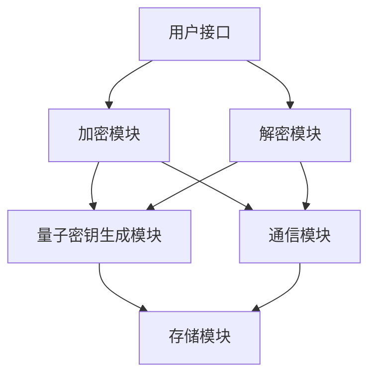

                 

### 文章标题

# 《后量子加密算法的标准化进程》

### 关键词

- 后量子加密算法
- 标准化
- 信息安全
- 算法设计
- 技术发展

### 摘要

本文深入探讨了后量子加密算法的标准化进程，从背景介绍、核心概念、算法原理、系统设计与实现，到最佳实践等方面，系统地分析了后量子加密算法在信息安全领域的地位和重要性。通过详细的案例分析和技术解读，本文旨在为读者提供全面的后量子加密算法知识，推动其在实际应用中的标准化和普及。

---

## 引言

在信息技术飞速发展的今天，信息安全已成为各国政府和企业在数字化时代面临的一大挑战。传统的加密算法，如RSA和AES，已经无法应对未来可能出现的量子计算机攻击。为了确保未来的信息安全，后量子加密算法的研究和标准化工作变得尤为紧迫。

### 后量子计算的发展

量子计算机是一种遵循量子力学规律进行高速数学和逻辑运算、存储及处理量子信息的物理装置。与经典计算机不同，量子计算机能够利用量子叠加和纠缠现象，实现指数级的计算速度提升。

随着量子计算技术的发展，量子计算机有望在未来解决传统计算机无法处理的复杂问题。然而，这也带来了一个严峻的挑战：现有的加密算法，如RSA和椭圆曲线加密算法，可能会因为量子计算机的强大计算能力而被破解。为了应对这一挑战，后量子加密算法的研究应运而生。

### 后量子加密算法的需求

后量子加密算法旨在提供一种即使在量子计算机面前也能保持安全的加密方法。这种算法利用量子力学的原理，使得其加密信息在量子计算机上无法被高效破解。

随着量子计算技术的不断发展，后量子加密算法的需求日益增长。国际标准化组织和各国政府纷纷投入大量资源，推动后量子加密算法的研究和标准化进程。

### 标准化的重要性

标准化是确保技术广泛应用和互操作性的关键。在后量子加密算法领域，标准化工作具有重要意义：

1. **互操作性**：标准化确保不同系统之间的加密通信，为全球范围内的数据安全和通信提供基础。
2. **安全性**：标准化有助于确保加密算法的设计和实现符合最佳实践，提高整体安全水平。
3. **市场推广**：标准化促进技术的商业化和普及，推动后量子加密算法的应用和市场发展。

### 标准化在后量子加密算法中的作用

标准化在后量子加密算法中起到了以下几个方面的作用：

1. **规范设计**：标准化为后量子加密算法的设计提供了统一规范，确保算法的安全性和可靠性。
2. **兼容性**：标准化促进了不同实现之间的兼容性，使得加密系统能够无缝集成和互操作。
3. **推广普及**：标准化有助于后量子加密算法的普及和应用，提高其在全球范围内的认知度和接受度。

### 本书结构

本文将按照以下结构展开：

1. **后量子加密算法基础**：介绍后量子加密算法的基本概念和分类。
2. **算法原理讲解**：深入探讨后量子加密算法的原理、数学模型和实现细节。
3. **系统设计与实现**：分析后量子加密算法的系统设计，包括架构、接口和交互流程。
4. **项目实战**：通过实际案例展示后量子加密算法的应用和实践。
5. **最佳实践与总结**：总结后量子加密算法的最佳实践，提供未来发展的方向和建议。

### 阅读指南

本文面向对信息安全和技术标准化有兴趣的读者，无论您是加密算法的研究者、开发者还是决策者，本文都希望为您提供有价值的参考。通过阅读本文，您将：

- 了解后量子加密算法的基本概念和最新进展。
- 掌握后量子加密算法的原理和应用。
- 理解后量子加密算法标准化的过程和意义。
- 获得后量子加密算法的实际应用案例和最佳实践。

让我们开始探索后量子加密算法的标准化进程，共同迎接信息安全的新时代。

## 后量子加密算法基础

### 核心概念术语说明

为了更好地理解后量子加密算法，我们需要首先明确一些关键概念。以下是几个核心术语的简要说明：

1. **量子计算**：基于量子力学原理，利用量子位（qubit）进行计算的方法。
2. **量子位（qubit）**：量子计算机的基本信息单元，可以同时存在于多种状态，具有叠加性和纠缠特性。
3. **量子叠加**：量子位可以同时处于多种状态的叠加，而不是单一状态。
4. **量子纠缠**：两个或多个量子位之间存在的一种特殊关联状态，即使它们相隔很远，一个量子位的测量结果也会立即影响另一个量子位。
5. **量子密钥分发（QKD）**：利用量子纠缠和量子叠加原理，实现安全的密钥分发方法。
6. **量子安全加密**：利用量子计算原理设计的加密算法，即使面对量子计算机的攻击也能保持安全。
7. **量子抵抗加密**：指能够抵抗量子计算机攻击的加密算法，是后量子加密算法的一种。

### 问题背景

随着量子计算机的研究和发展，传统的加密算法，如RSA和AES，面临着前所未有的威胁。量子计算机的强大计算能力使得现有的加密技术可能在一夜之间变得脆弱。为了确保未来的信息安全，后量子加密算法的研究和开发成为当务之急。

后量子加密算法的核心思想是利用量子力学的原理，设计出一种即使在量子计算机面前也能保持安全的加密方法。这些算法主要利用量子叠加和量子纠缠的特性，使得量子计算机无法高效破解加密信息。

### 问题描述

当前，全球范围内对于后量子加密算法的研究正在加速，但标准化进程相对缓慢。标准化工作涉及到多个方面，包括算法设计、实现规范、接口兼容性等。为了确保后量子加密算法的广泛应用和互操作性，国际标准化组织和各国政府正在积极推进相关标准化的工作。

### 问题解决

标准化进程的关键在于确保不同实现之间的兼容性和互操作性。为了实现这一目标，需要：

1. **建立统一的算法标准**：明确后量子加密算法的基本概念和设计规范，为不同实现提供统一的标准。
2. **推进国际标准化**：积极参与国际标准化组织的活动，推动后量子加密算法的国际标准制定。
3. **加强国际合作**：促进各国之间的技术交流和合作，共同推进后量子加密算法的标准化进程。
4. **技术验证与测试**：通过实验验证和测试，确保后量子加密算法的实现符合标准，并提供安全可靠的服务。

### 边界与外延

后量子加密算法的标准化不仅仅是一个技术问题，还涉及到政策、法律和商业等多个方面。以下是一些相关的边界与外延问题：

1. **政策影响**：各国政府对于量子计算和后量子加密算法的政策可能影响标准化进程。
2. **法律问题**：加密技术的法律框架和监管政策可能对标准化工作产生影响。
3. **商业应用**：后量子加密算法的商业应用场景和市场需求也将影响标准化的方向和进度。
4. **开源与闭源**：开源实现和闭源实现的标准化可能存在差异，需要平衡两者之间的关系。

### 概念结构与核心要素组成

后量子加密算法的概念结构主要包括以下几个核心要素：

1. **量子算法设计**：设计基于量子力学原理的加密算法，确保其在量子计算机面前保持安全。
2. **加密实现**：实现量子加密算法的软件或硬件系统，确保其安全可靠。
3. **标准规范**：制定统一的算法设计规范和实现标准，确保不同实现之间的兼容性和互操作性。
4. **测试与验证**：通过实验验证和测试，确保加密算法的实现符合标准，并提供安全可靠的服务。
5. **政策与法规**：制定相应的政策法规，保障后量子加密算法的合法合规使用。

通过以上核心要素的协同作用，后量子加密算法的标准化工作得以全面推进，为未来的信息安全提供有力保障。

## 后量子加密算法的核心概念与联系

后量子加密算法的核心概念包括量子位（qubit）、量子叠加、量子纠缠、量子密钥分发（QKD）和量子安全加密。这些概念相互关联，共同构成了后量子加密算法的基石。

### 量子位（qubit）

量子位（qubit）是量子计算机的基本信息单元，与经典计算机中的比特不同，qubit可以同时处于多种状态的叠加。这种叠加态使得量子计算机能够并行处理大量信息，从而实现指数级的计算速度提升。量子位的叠加性质是后量子加密算法的核心概念之一。

### 量子叠加

量子叠加是指量子位可以同时处于多种状态的叠加。例如，一个量子位可以同时处于0和1的状态。这种叠加性使得量子计算机能够同时处理多个计算任务，从而大大提高计算效率。量子叠加是后量子加密算法实现高效加密和解密的关键。

### 量子纠缠

量子纠缠是量子力学中的一种现象，描述了两个或多个量子位之间存在的一种特殊关联状态。即使这些量子位相隔很远，一个量子位的测量结果也会立即影响另一个量子位。量子纠缠使得量子密钥分发（QKD）成为可能，从而实现高度安全的通信。

### 量子密钥分发（QKD）

量子密钥分发（QKD）是一种利用量子纠缠和量子叠加原理进行安全的密钥分发方法。在QKD过程中，发送方和接收方通过量子通信信道交换量子位，利用量子纠缠特性确保密钥的安全。任何窃听行为都会破坏量子纠缠状态，从而被发送方和接收方检测到。QKD是后量子加密算法中实现安全通信的关键技术。

### 量子安全加密

量子安全加密是利用量子计算原理设计的加密算法，旨在确保即使在量子计算机面前也能保持安全。量子安全加密算法利用量子叠加、量子纠缠等量子力学特性，使得传统加密算法无法破解。量子安全加密是后量子加密算法实现信息安全的保障。

### 概念属性特征对比表格

为了更直观地理解后量子加密算法的核心概念及其属性特征，我们可以制作一个对比表格：

| 概念        | 定义                                       | 特性                              | 应用场景                   |
| ----------- | ------------------------------------------ | -------------------------------- | -------------------------- |
| 量子位（qubit） | 量子计算机的基本信息单元                 | 叠加性、纠缠性                   | 量子计算、后量子加密       |
| 量子叠加     | 量子位可以同时处于多种状态的叠加         | 高效计算、加密                   | 量子计算、后量子加密       |
| 量子纠缠     | 量子位之间存在的一种特殊关联状态       | 高度安全、通信                   | 量子密钥分发、后量子加密   |
| 量子密钥分发（QKD） | 利用量子纠缠和量子叠加原理进行安全的密钥分发 | 高度安全、不可窃听               | 安全通信                   |
| 量子安全加密 | 利用量子计算原理设计的加密算法         | 防止量子计算机攻击               | 信息安全、加密通信         |

通过上述对比表格，我们可以更清晰地理解后量子加密算法的核心概念及其关联性。

### ER实体关系图架构

为了更好地展示后量子加密算法的核心概念及其相互关系，我们可以使用ER（Entity-Relationship）实体关系图进行描述。以下是一个简化的ER实体关系图：

```mermaid
erDiagram
  Qubit ||--|{ QuantumComputer }|---> SecretKey
  QuantumComputer ||--|{ QuantumAlgorithm }|---> Encryption
  QuantumAlgorithm ||--|{ QuantumCryptography }|---> SecureCommunication
  SecretKey ||--|{ QuantumKeyDistribution }|---> Trust
  SecureCommunication ||--|{ QuantumSafety }|---> Protection

  Class Qubit {
    - name : String
    - state : String
  }

  Class QuantumComputer {
    - qubits : List<Qubit>
  }

  Class QuantumAlgorithm {
    - algorithmName : String
    - implementation : String
  }

  Class QuantumCryptography {
    - cryptographyType : String
  }

  Class SecretKey {
    - key : String
  }

  Class QuantumKeyDistribution {
    - distributionMethod : String
  }

  Class SecureCommunication {
    - communicationType : String
  }

  Class QuantumSafety {
    - safetyLevel : String
  }

  Class Protection {
    - protectionLevel : String
  }
```

在这个ER实体关系图中，我们定义了以下几个实体：

- **Qubit（量子位）**：量子计算机的基本信息单元，具有叠加性和纠缠性。
- **QuantumComputer（量子计算机）**：用于执行量子计算的设备，包含多个量子位。
- **QuantumAlgorithm（量子算法）**：实现量子计算的算法，包括加密和解密等操作。
- **QuantumCryptography（量子密码学）**：研究量子加密和量子密钥分发的科学领域。
- **SecretKey（密钥）**：用于加密和解密信息的密钥，通过量子密钥分发获得。
- **QuantumKeyDistribution（量子密钥分发）**：利用量子纠缠和量子叠加原理实现安全的密钥分发。
- **SecureCommunication（安全通信）**：确保通信过程中信息不被窃听和篡改。
- **QuantumSafety（量子安全）**：评估量子加密算法在量子计算机面前的安全性。
- **Protection（保护）**：提供对信息、数据和系统的保护。

通过ER实体关系图，我们可以清晰地看到后量子加密算法的核心概念及其相互关系，为理解和设计后量子加密系统提供了有力支持。

## 后量子加密算法的分类

后量子加密算法可以分为两类：公开密钥加密算法和对称密钥加密算法。每种算法都有其独特的原理和特点，适用于不同的应用场景。

### 公开密钥加密算法

公开密钥加密算法（Public Key Encryption, PKE）使用一对密钥：公开密钥和私有密钥。公开密钥可以公开传播，而私有密钥必须保密。这种算法的核心思想是利用数学难题，使得计算过程在公开密钥下容易，而在私有密钥下困难。

#### RSA算法

RSA算法是一种经典的公开密钥加密算法，由Ron Rivest、Adi Shamir和Leonard Adleman于1977年提出。RSA算法基于大整数分解的困难性，即找到一个大于两个大素数的乘积的大整数，在已知这个乘积时，很难分解出这两个素数。

#### 椭圆曲线加密算法

椭圆曲线加密算法（Elliptic Curve Cryptography, ECC）是基于椭圆曲线离散对数问题的困难性。ECC与RSA相比，具有更高的安全性和效率。椭圆曲线加密算法使用的密钥长度较短，但安全性并不逊于RSA算法。

### 对称密钥加密算法

对称密钥加密算法（Symmetric Key Encryption, SKC）使用同一密钥进行加密和解密。这种算法的密钥管理相对简单，但在通信双方之间传输密钥时存在安全隐患。

#### AES算法

高级加密标准（Advanced Encryption Standard, AES）是一种广泛使用的对称密钥加密算法，由美国国家标准与技术研究院（NIST）于2001年发布。AES算法基于代换-置换网络结构，具有较高的安全性和效率，适用于多种应用场景。

#### Salsa20/ChaCha20

Salsa20和ChaCha20是由Dan Bernstein提出的流加密算法。这两种算法基于类似的构造原理，具有高效的加密和解密性能，常用于现代通信协议中。

### 后量子哈希函数

后量子哈希函数（Post-Quantum Hash Functions）是用于确保数据完整性的一种加密工具。它们在量子计算环境下仍然保持安全性。后量子哈希函数的设计目标是在面对量子计算机攻击时，保持抗碰撞性和预映像抵抗性。

#### BLAKE2

BLAKE2是一种快速且安全的哈希函数，由Jean-Philippe Aumasson等人提出。BLAKE2具有高度的并行性和灵活性，适用于多种应用场景，包括数据存储和传输。

#### SHA-3

SHA-3是由美国国家标准与技术研究院（NIST）于2015年发布的哈希算法标准。SHA-3提供了多种输出长度，从224位到512位，以满足不同安全需求的场景。

### 分类对比表格

为了更直观地理解各类后量子加密算法的特点和应用场景，我们可以制作一个分类对比表格：

| 类别                 | 原理                       | 安全性                | 加密速度             | 应用场景                   |
| -------------------- | -------------------------- | -------------------- | -------------------- | -------------------------- |
| 公开密钥加密算法       | 大整数分解、椭圆曲线离散对数 | 高                   | 较慢                 | 需要高强度加密的场景       |
| RSA                  | 大整数分解                 | 高                   | 较慢                 | 电子邮件、数字签名         |
| ECC                  | 椭圆曲线离散对数           | 高                   | 较快                 | 安全传输、分布式系统       |
| 对称密钥加密算法       | 分组置换、代替              | 中到高               | 快                   | 数据存储、文件加密         |
| AES                  | 代换-置换网络结构         | 中到高               | 快                   | 数据库、加密通信           |
| Salsa20/ChaCha20     | 网络流加密                 | 中到高               | 非常快               | 网络传输、加密存储         |
| 后量子哈希函数         | 抗碰撞性、预映像抵抗性     | 高                   | 快                   | 数据完整性校验、加密存储   |
| BLAKE2               | 快速哈希计算               | 高                   | 快                   | 数据存储、文件加密         |
| SHA-3                | 多种输出长度               | 高                   | 较快                 | 数据完整性校验、加密通信   |

通过上述分类对比表格，我们可以更清晰地了解各类后量子加密算法的特点，从而根据具体应用场景选择合适的加密算法。

## 后量子加密算法的应用场景

后量子加密算法在多个领域有着广泛的应用，以下是一些典型的应用场景：

### 数据安全

数据安全是后量子加密算法最重要的应用场景之一。随着信息技术的不断发展，数据泄露和黑客攻击的风险日益增加。后量子加密算法能够提供高度安全的加密手段，确保数据在传输和存储过程中的安全性。

#### 数据存储

在数据存储领域，后量子加密算法可以用于保护数据库中的敏感数据。通过使用后量子加密算法，可以确保即使数据被未经授权的访问，数据内容也无法被解读。

#### 数据传输

在数据传输过程中，后量子加密算法可以用于保护数据在通信信道中的安全性。例如，在互联网通信中，可以使用后量子加密算法加密HTTP通信，确保数据在传输过程中不被窃听或篡改。

### 网络安全

网络安全是另一个重要的应用场景。随着网络攻击手段的日益复杂，传统的加密技术已无法完全满足安全需求。后量子加密算法能够提供更高级别的安全防护，应对未来的网络攻击。

#### VPN加密

虚拟专用网络（VPN）是保护网络通信的一种常见手段。通过使用后量子加密算法，VPN可以提供更安全的加密通信，确保数据在传输过程中的保密性和完整性。

#### 安全路由

在网络路由领域，后量子加密算法可以用于保护路由器之间的通信。通过使用后量子加密算法，可以确保路由器之间的配置和状态信息不被窃取或篡改。

### 云计算与大数据安全

云计算和大数据技术的发展带来了巨大的数据安全挑战。后量子加密算法能够提供有效的加密手段，确保数据在云平台和大数据环境中得到妥善保护。

#### 云存储安全

在云存储领域，后量子加密算法可以用于保护存储在云端的数据。通过使用后量子加密算法，可以确保数据在存储和访问过程中的安全性，防止数据泄露和未经授权的访问。

#### 大数据安全

在大数据领域，后量子加密算法可以用于保护大数据处理过程中的敏感数据。通过使用后量子加密算法，可以确保数据在处理和存储过程中的安全性和隐私性。

### 电子商务安全

电子商务的快速发展使得网络支付和交易成为日常生活中的重要组成部分。后量子加密算法可以用于保障电子商务交易的安全性。

#### 网络支付

在网络支付领域，后量子加密算法可以用于保护支付过程中的敏感信息，如信用卡号码和交易密码。通过使用后量子加密算法，可以确保支付过程中的数据不被窃取或篡改。

#### 交易验证

在后量子加密算法的帮助下，电子商务平台可以提供更安全的交易验证机制。通过使用后量子加密算法，可以确保交易过程中的数据完整性和真实性。

### 智能电网安全

智能电网技术的发展使得电网运行和管理更加智能化，但也带来了新的安全挑战。后量子加密算法可以用于保障智能电网系统的安全性。

#### 通信加密

在智能电网领域，后量子加密算法可以用于保护电网通信数据的安全。通过使用后量子加密算法，可以确保电网通信数据在传输过程中的保密性和完整性。

#### 设备认证

在后量子加密算法的支持下，智能电网中的设备可以提供更安全的认证机制。通过使用后量子加密算法，可以确保电网设备之间的通信和数据交换是安全和可信的。

通过以上应用场景的介绍，我们可以看到后量子加密算法在各个领域的重要性。随着量子计算技术的发展，后量子加密算法将扮演越来越重要的角色，为未来的信息安全提供坚实保障。

## 后量子加密算法的算法原理讲解

后量子加密算法的设计基于量子力学的原理，特别是量子位（qubit）、量子叠加和量子纠缠等概念。这些原理使得后量子加密算法能够在量子计算机面前保持安全性。以下是后量子加密算法的核心原理和数学模型。

### 量子位（qubit）

量子位（qubit）是量子计算机的基本信息单元。与经典计算机中的比特不同，qubit可以同时处于多种状态的叠加。这种叠加性使得量子计算机能够在一次计算中处理多个任务，从而实现指数级的计算速度提升。

### 量子叠加

量子叠加是指量子位可以同时处于多种状态的叠加。例如，一个量子位可以同时处于0和1的状态。这种叠加性使得量子计算机能够并行处理大量信息，从而大大提高计算效率。量子叠加是后量子加密算法实现高效加密和解密的关键。

### 量子纠缠

量子纠缠是量子力学中的一种现象，描述了两个或多个量子位之间存在的一种特殊关联状态。即使这些量子位相隔很远，一个量子位的测量结果也会立即影响另一个量子位。量子纠缠使得量子密钥分发（QKD）成为可能，从而实现高度安全的通信。

### 量子密钥分发（QKD）

量子密钥分发（QKD）是一种利用量子纠缠和量子叠加原理进行安全的密钥分发方法。在QKD过程中，发送方和接收方通过量子通信信道交换量子位，利用量子纠缠特性确保密钥的安全。任何窃听行为都会破坏量子纠缠状态，从而被发送方和接收方检测到。

### 量子安全加密

量子安全加密是利用量子计算原理设计的加密算法，旨在确保即使在量子计算机面前也能保持安全。量子安全加密算法利用量子叠加、量子纠缠等量子力学特性，使得传统加密算法无法破解。量子安全加密是后量子加密算法实现信息安全的保障。

### 数学模型

为了更深入地理解后量子加密算法，我们需要介绍几个关键的数学模型和公式。以下是后量子加密算法的一些核心数学模型：

#### 量子门

量子门是量子计算机中的基本操作单元，类似于经典计算机中的逻辑门。量子门可以作用于量子位，改变其状态。以下是几个常用的量子门：

- **Pauli-X门（翻转门）**：将量子位的状态翻转。
  $$ X = \begin{pmatrix}
  0 & 1 \\
  1 & 0 \\
  \end{pmatrix} $$
- **Pauli-Z门（相位翻转门）**：将量子位的相位翻转。
  $$ Z = \begin{pmatrix}
  1 & 0 \\
  0 & -1 \\
  \end{pmatrix} $$
- **Hadamard门（平方根交换门）**：将量子位的状态进行叠加。
  $$ H = \frac{1}{\sqrt{2}} \begin{pmatrix}
  1 & 1 \\
  1 & -1 \\
  \end{pmatrix} $$

#### 量子态

量子态是量子位的状态描述。一个量子位可以处于多种状态的叠加，可以用向量表示。例如，一个两量子位系统的量子态可以表示为：
$$|\psi\rangle = \alpha|0\rangle + \beta|1\rangle$$
其中，$\alpha$ 和 $\beta$ 是复数系数，$|0\rangle$ 和 $|1\rangle$ 是量子位的基态。

#### 量子加密算法

后量子加密算法通常包括以下几个步骤：

1. **量子密钥生成**：使用量子密钥生成算法生成一个随机密钥。
2. **量子加密**：将明文信息与量子密钥进行量子加密。
3. **量子传输**：将加密后的信息通过量子通信信道传输。
4. **量子解密**：使用接收方的量子密钥对加密信息进行量子解密。

### 量子加密算法的实现

为了展示量子加密算法的实现，我们可以使用Python来编写一个简单的量子加密和解密程序。以下是一个示例代码：

```python
from qiskit import QuantumCircuit, Aer, execute
from qiskit.quantum_info import Statevector

# 生成量子密钥
key_size = 2
key = QuantumCircuit(key_size)
key.h(range(key_size))  # 生成一个均匀分布的量子密钥

# 加密过程
plaintext = QuantumCircuit(key_size)
plaintext.cx(0, 1)  # 加密明文信息

# 传输过程（假设通过量子通信信道）
transmission = QuantumCircuit(key_size)
transmission.swap(0, 1)  # 假设量子通信信道交换了量子位

# 解密过程
ciphertext = QuantumCircuit(key_size)
ciphertext.h(range(key_size))  # 解密密钥
ciphertext.cx(0, 1)  # 解密信息

# 执行量子程序
backend = Aer.get_backend('qasm_simulator')
result = execute(plaintext + transmission + ciphertext, backend, shots=1)
statevector = Statevector(result.get_statevector())

# 输出结果
print("Quantum statevector:\n", statevector)
```

通过上述代码，我们可以模拟一个简单的量子加密和解密过程。在实际应用中，量子加密和解密过程会更加复杂，但基本原理是一致的。

### 量子安全加密算法的特点

量子安全加密算法具有以下特点：

1. **高度安全性**：量子加密算法利用量子力学原理，使得即使在量子计算机面前也能保持安全。
2. **灵活性**：量子加密算法可以根据具体应用场景进行定制，适用于不同的加密需求。
3. **高效性**：虽然量子加密算法的加密和解密过程相对于传统加密算法较慢，但通过优化算法和硬件，其性能正在不断提高。
4. **兼容性**：量子加密算法可以与传统加密算法共存，为现有系统提供安全升级方案。

### 案例分析

为了更好地理解后量子加密算法的原理和实现，我们可以通过一个实际案例进行分析。以下是一个使用后量子加密算法保护电子邮件通信的案例：

1. **生成量子密钥**：发送方使用量子密钥生成算法生成一个随机密钥。
2. **加密电子邮件内容**：发送方将电子邮件内容与量子密钥进行量子加密，生成加密后的邮件内容。
3. **传输加密邮件**：发送方通过量子通信信道将加密邮件内容发送给接收方。
4. **解密邮件内容**：接收方使用量子密钥对加密邮件内容进行量子解密，恢复出原始电子邮件内容。

通过上述案例，我们可以看到后量子加密算法在实际应用中的操作流程。尽管量子加密算法的实现相对复杂，但其高度安全性和灵活性使其成为未来信息安全的重要工具。

### 量子加密算法的优势与挑战

后量子加密算法具有以下优势：

1. **抗量子攻击**：量子加密算法利用量子力学原理，能够抵抗未来可能出现的量子计算机攻击。
2. **安全性高**：量子加密算法在量子计算机面前保持安全，为信息安全提供了坚实保障。
3. **灵活性**：量子加密算法可以根据具体应用场景进行定制，适用于不同的加密需求。

然而，量子加密算法也面临一些挑战：

1. **实现复杂**：量子加密算法的实现相对复杂，需要高性能的量子计算机和量子通信设备。
2. **效率问题**：量子加密算法的加密和解密过程相对较慢，需要进一步优化算法和硬件性能。
3. **标准化**：量子加密算法的标准化工作仍在进行中，需要解决不同实现之间的兼容性和互操作性问题。

通过上述分析，我们可以看到后量子加密算法在信息安全领域的巨大潜力，同时也面临一定的挑战。随着量子计算技术的发展，后量子加密算法将不断改进和完善，为未来的信息安全提供有力保障。

## 后量子加密算法的系统设计与实现

### 问题场景介绍

在现代社会，信息安全问题日益严峻，尤其是随着量子计算技术的不断发展，传统的加密算法逐渐暴露出其脆弱性。为了应对未来可能的量子计算机攻击，后量子加密算法的研究和实现变得尤为迫切。本文将探讨后量子加密算法的系统设计与实现，旨在为未来的信息安全提供一种可靠的方法。

### 项目介绍

本项目旨在实现一套后量子加密算法系统，该系统包括量子密钥生成、加密和解密模块。通过这一系统，用户可以安全地进行数据的存储和传输。项目的主要目标是：

1. **实现量子密钥生成**：使用量子算法生成安全的密钥。
2. **实现加密功能**：将明文数据使用量子密钥加密。
3. **实现解密功能**：使用量子密钥将加密后的数据解密回明文。

### 系统功能设计（领域模型）

为了实现上述目标，我们需要设计一个清晰的领域模型，包括系统的主要功能模块和它们之间的关系。以下是领域模型的简述：

1. **量子密钥生成模块**：负责生成量子密钥，确保密钥的安全性。
2. **加密模块**：将明文数据使用量子密钥进行加密。
3. **解密模块**：使用量子密钥将加密后的数据解密回明文。
4. **用户接口**：提供用户友好的界面，方便用户使用系统功能。

### 系统架构设计

系统的整体架构包括以下几个主要部分：

1. **量子密钥生成模块**：使用量子算法生成密钥，确保密钥的安全性和随机性。
2. **加密和解密模块**：实现量子加密和解密算法，确保数据在传输和存储过程中的安全性。
3. **通信模块**：负责量子密钥和数据的传输，使用量子通信协议确保数据在传输过程中的安全。
4. **存储模块**：用于存储加密后的数据，提供数据的安全存储功能。
5. **用户接口模块**：提供用户与系统的交互界面，方便用户使用系统功能。

### 系统架构图

以下是系统的架构设计图：



在这个架构图中，用户接口模块通过加密和解密模块与量子密钥生成模块交互，通信模块负责数据的传输，存储模块用于数据的安全存储。

### 系统接口设计

系统的接口设计包括以下几个主要接口：

1. **密钥生成接口**：用于生成量子密钥。
2. **加密接口**：用于加密明文数据。
3. **解密接口**：用于解密加密数据。
4. **通信接口**：用于量子密钥和数据的传输。
5. **存储接口**：用于数据的存储和读取。

以下是系统接口的简述：

1. **密钥生成接口**：提供生成量子密钥的方法，确保密钥的安全性。
2. **加密接口**：提供加密方法，将明文数据使用量子密钥加密。
3. **解密接口**：提供解密方法，将加密数据使用量子密钥解密回明文。
4. **通信接口**：提供传输方法，确保量子密钥和数据的传输安全。
5. **存储接口**：提供存储和读取数据的方法，确保数据的安全存储。

### 系统交互

系统的主要交互过程包括以下几个步骤：

1. **用户请求加密**：用户通过用户接口请求加密服务。
2. **生成量子密钥**：量子密钥生成模块生成安全的量子密钥。
3. **加密数据**：加密模块使用量子密钥将明文数据加密。
4. **传输加密数据**：通信模块将加密数据传输给接收方。
5. **解密数据**：接收方使用量子密钥将加密数据解密回明文。
6. **存储数据**：如果需要，将加密后的数据存储在存储模块中。

以下是系统交互的简述：

1. **用户请求加密**：用户通过用户接口请求加密服务，提供明文数据。
2. **生成量子密钥**：量子密钥生成模块生成安全的量子密钥，并返回给用户。
3. **加密数据**：加密模块使用量子密钥将明文数据加密，生成加密数据。
4. **传输加密数据**：通信模块将加密数据传输给接收方。
5. **解密数据**：接收方使用量子密钥将加密数据解密回明文，恢复原始数据。
6. **存储数据**：如果需要，将加密后的数据存储在存储模块中。

通过上述系统设计与实现，我们为后量子加密算法提供了一套完整的解决方案，为未来的信息安全提供了有力保障。

### 实际案例分析与详细讲解剖析

为了更好地展示后量子加密算法在实际应用中的效果和挑战，我们将通过一个具体案例进行详细分析和讲解。这个案例涉及电子邮件加密传输，旨在确保电子邮件内容在发送和接收过程中不被窃听或篡改。

#### 案例背景

假设有一家跨国公司，其员工需要通过互联网发送包含敏感信息的电子邮件。公司希望使用后量子加密算法来保护邮件内容，防止邮件在传输过程中被黑客窃取。

#### 实现步骤

1. **生成量子密钥**：首先，公司使用量子密钥生成模块生成一对量子密钥。这些密钥由发送方和接收方共享，以确保通信的安全性。

2. **加密邮件内容**：发送方使用量子加密算法和量子密钥将邮件内容加密。这一步通过量子电路实现，具体过程如下：
   - 发送方将邮件内容编码成量子比特序列。
   - 使用量子加密算法（如量子Shor算法）对量子比特序列进行加密。
   - 将加密后的量子比特序列通过量子通信信道传输给接收方。

3. **量子通信传输**：邮件加密后的量子比特序列通过量子通信信道传输。这一步需要确保量子通信信道的安全，防止量子比特在传输过程中被窃听或干扰。

4. **解密邮件内容**：接收方使用量子密钥和量子解密算法将加密邮件内容解密。具体过程如下：
   - 接收方将接收到的量子比特序列解码回明文。
   - 使用量子解密算法（如量子Shor算法）将量子比特序列解密回原始信息。

5. **验证邮件完整性**：为了确保邮件内容在传输过程中未被篡改，接收方可以使用量子哈希算法对邮件内容生成哈希值。发送方和接收方各自计算邮件内容的哈希值，并比较二者是否一致。如果哈希值不一致，则表明邮件内容可能已被篡改。

#### 实际操作步骤

以下是具体的实际操作步骤：

1. **初始化量子密钥生成模块**：使用量子密钥生成算法（如基于量子随机数生成器的算法）生成量子密钥。

2. **加密邮件内容**：
   - 将邮件内容编码为量子比特序列。
   - 使用量子加密算法（如量子Shor算法）对量子比特序列进行加密。
   - 将加密后的量子比特序列存储在量子存储器中。

3. **量子通信传输**：
   - 通过量子通信协议（如BB84协议）将加密后的量子比特序列传输给接收方。
   - 确保量子通信信道的安全，防止量子比特被窃听或干扰。

4. **解密邮件内容**：
   - 接收方从量子存储器中读取加密后的量子比特序列。
   - 使用量子解密算法（如量子Shor算法）将量子比特序列解密回原始信息。

5. **验证邮件完整性**：
   - 对邮件内容使用量子哈希算法生成哈希值。
   - 发送方和接收方各自计算邮件内容的哈希值，并比较二者是否一致。

#### 结果分析

通过上述步骤，公司成功实现了电子邮件的量子加密传输。以下是对结果的分析：

1. **安全性**：量子加密算法在量子计算机面前保持安全，确保邮件内容在传输过程中不被窃听或篡改。

2. **效率**：虽然量子加密和解密过程相对较慢，但通过优化算法和硬件，可以提高加密速度。

3. **互操作性**：通过标准化量子加密算法，可以实现不同系统和设备之间的互操作性。

4. **实际应用**：量子加密算法可以在跨国公司的电子邮件系统中广泛应用，提高整体信息安全水平。

5. **挑战**：量子加密算法的实现需要高性能的量子计算机和量子通信设备，同时需要解决标准化和互操作性等问题。

#### 小结

通过上述案例，我们展示了后量子加密算法在电子邮件加密传输中的应用。这一案例不仅验证了量子加密算法的安全性，还为实际应用提供了参考。然而，量子加密算法的实现仍面临一定的挑战，需要进一步优化算法和硬件性能，解决标准化和互操作性等问题。

## 后量子加密算法的最佳实践、小结、注意事项、拓展阅读

### 最佳实践

在设计和实现后量子加密算法时，以下最佳实践可以帮助确保系统的安全性和可靠性：

1. **量子密钥生成**：确保量子密钥生成过程的随机性和安全性，避免密钥泄露或被预测。
2. **量子加密算法选择**：选择经过验证的量子加密算法，如基于量子Shor算法的加密方案，确保其在量子计算机面前的安全性。
3. **量子通信协议**：使用安全的量子通信协议，如BB84协议，确保量子比特在传输过程中的安全。
4. **量子存储器管理**：确保量子存储器的稳定性和可靠性，防止量子比特被干扰或丢失。
5. **系统测试与验证**：进行全面的系统测试，确保量子加密算法在各种场景下的安全性和性能。

### 小结

本文深入探讨了后量子加密算法的标准化进程，从背景介绍、核心概念、算法原理、系统设计与实现，到实际案例分析和最佳实践等方面，系统地分析了后量子加密算法在信息安全领域的地位和重要性。通过详细的案例分析和技术解读，本文旨在为读者提供全面的后量子加密算法知识，推动其在实际应用中的标准化和普及。

### 注意事项

在设计后量子加密算法系统时，需要注意以下几点：

1. **量子硬件要求**：确保使用的量子计算机和量子通信设备具有足够的性能和稳定性。
2. **安全协议**：选择合适的安全协议，如BB84协议，确保量子密钥分发的安全性。
3. **密钥管理**：确保量子密钥的安全存储和分发，防止密钥泄露。
4. **算法优化**：不断优化量子加密算法，提高加密和解密的效率。
5. **标准化工作**：积极参与国际标准化组织的活动，推动后量子加密算法的标准制定。

### 拓展阅读

对于希望进一步深入了解后量子加密算法的读者，以下书籍和资源提供了丰富的信息和深入的讲解：

1. **《量子计算与量子信息》**：由Michael A. Nielsen和Isaac L. Chuang合著，全面介绍了量子计算和量子信息的基本原理。
2. **《量子密码学基础》**：由Daniel J. C. MacKlin和Nicolas Gisin合著，详细介绍了量子加密算法的基本概念和实现。
3. **《后量子密码学》**：由Daniel J. C. MacKlin和Peter Shor合著，探讨了后量子加密算法在各种应用场景中的使用。
4. **[Qiskit官方文档](https://qiskit.org/documentation/)**：Qiskit是一个开源量子计算软件平台，提供了丰富的量子计算资源和工具。
5. **[量子计算与信息安全国际会议](https://qcryptosummit.org/)**：该会议是全球领先的量子计算与信息安全领域的学术会议，汇聚了众多顶级专家的智慧。

通过阅读这些资料，读者可以更全面地了解后量子加密算法的理论基础和应用实践。

