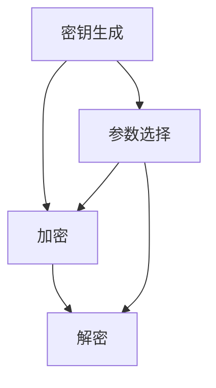
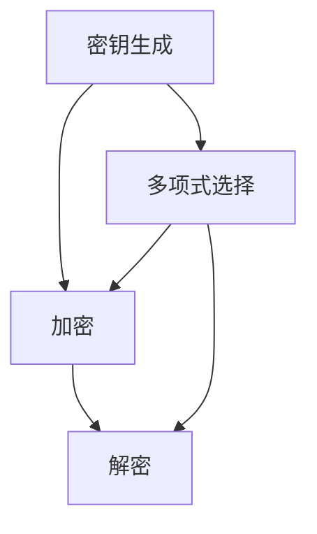
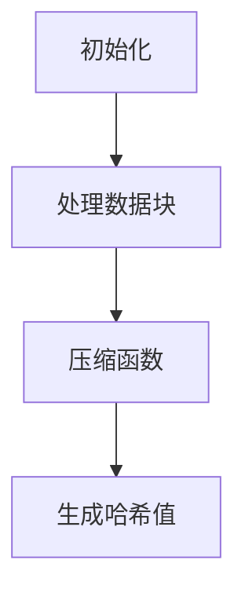

                 

### 引言与背景

#### 1.1 量子计算对传统密码学的影响

量子计算，作为21世纪最具前瞻性的科技革命之一，已经在多个领域展现出其巨大的潜力。然而，这一技术革命也带来了一项潜在的巨大威胁——对传统密码学的挑战。量子计算机利用量子位（qubits）进行计算，能够在极短的时间内解决传统计算机难以应对的复杂问题，尤其是所谓的“量子上转换”（Quantum Supremacy）问题。例如，量子计算机能够迅速破解目前广泛使用的RSA和椭圆曲线密码系统，这些系统在信息安全领域扮演着至关重要的角色。

RSA加密算法依赖于大整数分解问题的难度，而量子计算机则可以通过“Shor算法”在多项式时间内完成这一问题。同样，椭圆曲线密码系统也面临着量子计算的威胁，因为其安全性依赖于椭圆曲线离散对数问题的困难性，这一难题在量子计算机面前同样迎刃而解。这些因素使得传统密码学面临着前所未有的安全挑战，促使学术界和工业界纷纷转向后量子密码学（Post-Quantum Cryptography，PQC）的研究。

#### 1.2 后量子密码学的必要性

后量子密码学旨在设计出在量子计算时代依然安全有效的密码系统。其核心目标是在量子计算机出现后，仍然能够保证数据的机密性、完整性和真实性。当前，许多企业和组织依赖传统密码系统来保护他们的数据，一旦这些系统被量子计算机攻破，数据安全将面临严重威胁。因此，开发后量子密码学算法成为当务之急。

此外，后量子密码学不仅关注算法的安全性，还考虑其实用性。这意味着，后量子密码学算法需要在保证安全的同时，保持与传统密码学算法类似的性能和效率，以满足实际应用的需求。例如，加密和解密速度、内存占用和计算资源消耗等因素都需要被充分考虑。

#### 1.3 问题描述

问题描述的核心在于如何在量子计算时代确保数据的安全。具体来说，问题可以分解为以下几个子问题：

1. **算法设计**：如何设计出在量子计算下依然安全的加密、签名和哈希算法？
2. **实现与部署**：如何将这些算法应用到实际系统中，并保证其高效运行？
3. **兼容与过渡**：如何确保新算法与传统系统的兼容，以及如何在两者之间实现平稳过渡？
4. **标准制定**：如何制定统一的标准化方案，确保全球范围内的互操作性和安全性？

#### 1.4 问题解决

问题解决的路径主要涉及以下几个方面：

1. **算法研究**：积极开展后量子密码学算法的研究，包括Lattice-based Cryptography、Multivariate Polynomial Cryptography、Hash-based Cryptography等方向。
2. **性能优化**：对现有算法进行性能优化，使其在保持安全性的同时，尽可能接近传统密码学算法的效率。
3. **标准化**：推动国际标准化组织（如ISO/IEC JTC1）制定后量子密码学的标准和规范。
4. **实际应用**：将后量子密码学算法应用到实际的加密系统中，进行测试和评估，确保其在实际环境中能够提供可靠的保护。

#### 1.5 边界与外延

1. **适用范围**：后量子密码学适用于需要长期数据保护的企业和组织，尤其是那些涉及敏感数据和信息的关键领域，如金融、医疗和政府等。
2. **局限性**：后量子密码学的研究仍处于不断发展之中，有些算法的性能和安全性尚未完全验证。此外，实现和应用过程中可能面临技术挑战和成本问题。
3. **未来发展**：随着量子计算技术的不断进步，后量子密码学将继续发展，包括新算法的发现和现有算法的优化。此外，跨学科合作和全球协作也将是未来发展的关键。

### 1.6 本章小结

本章介绍了量子计算对传统密码学的挑战，强调了后量子密码学的必要性。通过问题描述和问题解决的路径，我们明确了后量子密码学的研究目标和实际应用场景。此外，本章还对后量子密码学的适用范围和未来发展进行了讨论，为后续章节的内容奠定了基础。在后量子密码学的研究和应用过程中，需要充分考虑算法设计、性能优化、标准化和实际应用等多个方面，以实现长期的数据保护目标。

### 后量子密码学核心概念

#### 2.1 核心概念原理

后量子密码学是基于量子计算威胁下设计的一套新型密码系统，其核心概念包括哈希函数、公钥加密算法和数字签名。以下是对这些核心概念的基本原理介绍：

##### 2.1.1 哈希函数

哈希函数是后量子密码学中不可或缺的一部分，其主要功能是将任意长度的输入数据映射为固定长度的输出值。这种映射具有以下特性：

- **单向性**：从输出值很难反推出原始输入值。
- **抗碰撞性**：找到两个不同的输入值，其哈希值相同的概率极低。
- **抗修改性**：对输入数据进行微小修改，将导致哈希值发生巨大变化。

在量子计算时代，常用的哈希函数包括SHA-3、Grövel等。这些函数经过广泛的研究和测试，被认为在量子计算机面前依然安全。

##### 2.1.2 公钥加密算法

公钥加密算法是后量子密码学中的另一重要组成部分，其核心思想是利用一对密钥（公钥和私钥）进行加密和解密。以下是一些常见的后量子公钥加密算法：

- **Lattice-based Cryptography**：基于格理论设计的加密算法，如NTRU和LWE。
- **Multivariate Polynomial Cryptography**：基于多变量多项式结构的加密算法，如HFE。
- **Hash-based Cryptography**：基于哈希函数的加密算法，如SHA-3。

这些算法利用了量子计算机难以解决的数学难题，从而保证了在量子计算时代的安全性。

##### 2.1.3 数字签名

数字签名是一种用于验证消息来源和完整性的技术。它利用公钥加密算法，使得接收者能够验证消息的发送者身份和数据的完整性。常见的数字签名算法包括RSA、ECDSA等。

在量子计算威胁下，传统的RSA和ECDSA等数字签名算法存在安全风险。因此，后量子密码学中提出了一些新的数字签名算法，如基于Lattice-based Cryptography的LCS，以及基于Multivariate Polynomial Cryptography的Fujisaki签名等。

#### 2.2 概念属性特征对比

为了更好地理解这些核心概念，以下是它们的主要属性特征对比表格：

| 特性        | 哈希函数 | 公钥加密算法 | 数字签名 |
|-------------|----------|--------------|----------|
| **安全性**  | 抗碰撞性 | 抗量子攻击 | 抗量子攻击 |
| **功能**    | 数据摘要 | 加密与解密 | 数据认证 |
| **输入输出** | 输入任意长度，输出固定长度 | 输入明文，输出密文和密钥 | 输入消息和私钥，输出签名 |
| **效率**    | 较高     | 较低       | 较高     |

#### 2.3 后量子密码学ER实体关系图

为了更清晰地展示后量子密码学的核心概念及其相互关系，以下是一个ER实体关系图：

```mermaid
erDiagram
    HashFunction ||--|{ PublicKeyEncryptionAlgorithm : Uses}
    PublicKeyEncryptionAlgorithm ||--|{ DigitalSignatureAlgorithm : Uses}
    DigitalSignatureAlgorithm ||--|{ DataAuthentication : Supports}
    DataAuthentication ||--|{ MessageIntegrity : Ensures}
```

在这个ER图中，HashFunction（哈希函数）、PublicKeyEncryptionAlgorithm（公钥加密算法）和DigitalSignatureAlgorithm（数字签名算法）是核心实体，它们之间通过使用（Uses）和支持（Supports）关系相互关联，确保数据在量子计算时代的完整性和安全性。

通过本章的介绍，我们对后量子密码学的核心概念有了基本的理解。在接下来的章节中，我们将深入探讨后量子密码学中的具体算法原理和应用，为构建一个安全的量子时代数据保护体系提供理论基础。

### Lattice-based Cryptography

#### 3.1 算法原理

Lattice-based Cryptography（Lattice-based密码学）是一种在后量子密码学中广泛研究的一类密码系统，其理论基础源于格（Lattice）这一数学结构。格是由一组线性组合的点组成的集合，其中的每个点都可以通过线性方程组来表示。Lattice-based Cryptography通过利用格理论的复杂性问题，设计了多种加密算法，如学习错误（Learning with Errors, LWE）问题和NTRU算法。以下是对这些算法原理的详细介绍。

##### 3.1.1 Lattice-based Cryptography 概述

Lattice-based Cryptography的核心思想在于利用格理论的复杂性质，特别是“短期性”（Shortest Vector Problem, SVP）和“最近点问题”（Closest Vector Problem, CVP）等问题的难度。量子计算机虽然能够解决一些传统的密码学难题，但对于这些格问题仍然束手无策。

Lattice-based Cryptography的主要优点包括：

1. **抗量子攻击**：由于其基于格理论的复杂性，Lattice-based算法在量子计算面前具有较强的安全性。
2. **多用途性**：Lattice-based算法不仅可以用于加密，还可以用于数字签名和伪随机数生成等多种应用。
3. **模块化设计**：Lattice-based算法通常设计得比较模块化，易于实现和优化。

##### 3.1.2 Learning with Errors (LWE) 问题

LWE问题是Lattice-based Cryptography中一个重要的数学模型。在LWE问题中，假设我们有一个原格（Original Lattice）和一个错误向量（Error Vector），我们的目标是找到一个向量，使得它与错误向量之和落在原格中。

数学模型如下：

设 $G$ 为一个格，$a$ 为一个线性变换，$e$ 为高斯噪声向量。给定一个秘密向量 $s$，我们需要找到一个向量 $x$，使得：

$$
a(x) + e = b
$$

其中 $b$ 是一个线性组合的向量，且 $e$ 服从高斯分布。这个问题的难度在于，在不知道 $s$ 和 $a$ 的情况下，很难找到满足上述条件的 $x$。

LWE问题可以应用于加密和数字签名，其安全性依赖于量子计算机无法在多项式时间内解决该问题。

##### 3.1.3 NTRU 算法

NTRU（Nth-Times Remainder Polynomial Ring Learning With Errors）算法是一种基于Lattice-based Cryptography的公钥加密算法。NTRU算法的核心思想是利用多项式环和格的复杂性。

NTRU算法的基本步骤如下：

1. **密钥生成**：选择两个不同的多项式 $f$ 和 $g$，并构造多项式环 ${\mathbb{Z}_p}[x]/(f(x))$。在这个环中，选择一个随机多项式 $h$，满足 $h \equiv g \mod f$。
2. **加密**：发送方选择一个随机多项式 $r$，并计算密文 $c = hr \mod f$。发送方将密文 $c$ 发送给接收方。
3. **解密**：接收方知道自己的私钥多项式 $g$，可以通过计算 $s = c \cdot g^{-1} \mod f$ 来解密密文。这里 $g^{-1}$ 是多项式 $g$ 在多项式环中的乘法逆元。

NTRU算法的优点包括：

- **高效性**：NTRU算法在加密和解密过程中都相对高效，比传统的公钥加密算法如RSA和ECC具有更好的性能。
- **灵活性**：NTRU算法支持多种模数和参数选择，可以根据不同的应用场景进行调整。

#### 3.2 算法流程图

为了更好地理解Lattice-based Cryptography算法的流程，以下是NTRU算法的mermaid流程图：



在这个流程图中，密钥生成（A）是加密（B）和解密（C）的前提，而参数选择（D）则是密钥生成和算法执行的关键环节。

#### 3.3 Python源代码示例

以下是一个简单的NTRU算法的Python源代码示例，用于展示密钥生成、加密和解密的过程：

```python
import numpy as np
from sympy import symbols, mod_matrix, solve_modular

# 参数设置
p = 101
f = symbols('f', domain='Integer')(x)  # 多项式环的模多项式
f = f**3 + x**2 + 1  # 一个简单的多项式
g = symbols('g', domain='Integer')(x)  # 私钥多项式
g = g**3 - x**2  # 一个简单的多项式
h = symbols('h', domain='Integer')(x)  # 公钥多项式

# 密钥生成
h = h**3 - x**2  # 假设h与g互质
h %= f

# 加密
r = symbols('r', domain='Integer')(x)  # 随机多项式
r = r**3 + x**2 + 1  # 一个简单的多项式
c = (h * r) % f
c = c.all()

# 解密
s = (c * mod_matrix(g, f))**-1 % f
s = s.all()

print("私钥 g:", g.all())
print("公钥 h:", h.all())
print("密文 c:", c)
print("解密结果 s:", s)
```

在这个示例中，我们首先设置了多项式环的模多项式 $f$ 和私钥多项式 $g$。然后，通过生成公钥多项式 $h$，实现了密钥生成过程。接着，通过随机多项式 $r$，我们得到了密文 $c$。最后，使用私钥 $g$ 对密文进行解密，得到了原始消息 $s$。

通过这个简单的示例，我们可以看到NTRU算法的基本流程和实现方法。在接下来的章节中，我们将进一步探讨其他后量子密码学算法，如Multivariate Polynomial Cryptography和Hash-based Cryptography，以及它们的应用和优势。

### Multivariate Polynomial Cryptography

#### 4.1 算法原理

Multivariate Polynomial Cryptography（多变量多项式密码学）是一种在后量子密码学中广泛研究的密码学方法，它通过构建复杂的多变量多项式系统来提供安全性。这种密码学方法利用了多项式方程组在计算上的复杂性，使得量子计算机难以破解。

##### 4.1.1 多变量多项式加密概述

Multivariate Polynomial Cryptography的基本思想是将明文消息和密钥映射为多个变量上的多项式，并通过这些多项式的交互来构造加密系统。其核心组件包括多变量多项式和多项式环。

在一个典型的多变量多项式加密系统中，我们首先定义一组多项式，这些多项式具有以下特性：

- **线性独立**：各个多项式之间是线性独立的，这保证了系统的鲁棒性。
- **非线性组合**：多项式通过非线性组合来构建加密函数，这使得攻击者难以直接求解出系统的解。

##### 4.1.2 多变量多项式加密的数学模型

Multivariate Polynomial Cryptography的数学模型可以描述为以下步骤：

1. **多项式环定义**：选择一个多项式环 ${\mathbb{F}_q}[X_1, X_2, ..., X_n]$，其中 ${\mathbb{F}_q}$ 是一个有限域，$X_1, X_2, ..., X_n$ 是变量。

2. **多项式构造**：构造一组线性独立的多项式 $f_1, f_2, ..., f_n$，这些多项式满足以下条件：
   - $f_1(X_1, X_2, ..., X_n)$ 是线性多项式。
   - $f_2(X_1, X_2, ..., X_n)$ 是非线性多项式，且不含 $X_1$。
   - 以此类推，$f_n(X_1, X_2, ..., X_n)$ 是线性多项式，且不含 $X_n$。

3. **加密过程**：加密算法通过以下步骤将明文映射为密文：
   - 选择一个秘密多项式 $s$。
   - 计算加密多项式 $E$，使得 $E(s) = 0$。
   - 将加密多项式 $E$ 与明文多项式 $M$ 相乘，得到密文多项式 $C = E \cdot M$。

4. **解密过程**：解密算法通过以下步骤将密文还原为明文：
   - 使用秘密多项式 $s$ 和加密多项式 $E$ 的逆多项式 $E^{-1}$，计算解密多项式 $D = E^{-1} \cdot C$。
   - 从解密多项式 $D$ 中提取出明文多项式 $M$。

##### 4.1.3 HFE 算法

HFE（High-Frequency Encryption）算法是Multivariate Polynomial Cryptography中的一个经典算法。HFE算法通过使用高斯消元法来构造加密和解密多项式。

HFE算法的基本步骤如下：

1. **密钥生成**：选择一组线性独立的多项式 $f_1, f_2, ..., f_n$，并构造多项式环 ${\mathbb{F}_q}[X_1, X_2, ..., X_n]$。
2. **秘密多项式选择**：选择一个秘密多项式 $s \in {\mathbb{F}_q}[X_1, X_2, ..., X_n]$。
3. **加密多项式构造**：构造加密多项式 $E$，使得 $E(s) = 0$。通常，可以通过高斯消元法来构造 $E$。
4. **加密过程**：选择一个随机多项式 $r \in {\mathbb{F}_q}[X_1, X_2, ..., X_n]$，计算密文 $C = E \cdot r$。
5. **解密过程**：使用加密多项式 $E$ 的逆多项式 $E^{-1}$，计算解密多项式 $D = E^{-1} \cdot C$，然后从 $D$ 中提取出明文多项式。

HFE算法的优点包括：

- **抗量子攻击**：由于其基于多项式系统的复杂性，HFE算法在量子计算时代具有较高的安全性。
- **高效性**：与传统的公钥密码算法相比，HFE算法在加密和解密过程中具有较高的效率。

#### 4.2 算法流程图

为了更直观地理解HFE算法的流程，以下是该算法的mermaid流程图：



在这个流程图中，密钥生成（A）是加密（B）和解密（C）的前提，而多项式选择（D）则是密钥生成和算法执行的关键环节。

#### 4.3 Python源代码示例

以下是一个简单的HFE算法的Python源代码示例，用于展示密钥生成、加密和解密的过程：

```python
import numpy as np
from sympy import symbols, mod_matrix, solve_modular

# 参数设置
q = 101
n = 3
X = [symbols('X{}'.format(i)) for i in range(n)]

# 多项式构造
f = symbols('f')(X)
f = f**2 + X[0]**2 + X[1]**2
g = symbols('g')(X)
g = g**2 + X[1]**2 + X[2]**2

# 密钥生成
s = symbols('s')(X)
s = s**2 + X[0]**2 + X[2]**2
s %= mod_matrix([f, g], q)

# 加密
r = symbols('r')(X)
r = r**2 + X[0]**2 + X[1]**2
r %= mod_matrix([f, g], q)
E = f * g**-1
C = (E * r) % mod_matrix([f, g], q)
C = C.all()

# 解密
E_inv = E**-1
D = (E_inv * C) % mod_matrix([f, g], q)
D = D.all()

print("秘密多项式 s:", s.all())
print("加密多项式 E:", E.all())
print("密文 C:", C)
print("解密结果 D:", D)
```

在这个示例中，我们首先设置了多项式环的模多项式 $f$ 和 $g$。然后，通过生成秘密多项式 $s$ 和随机多项式 $r$，实现了密钥生成和加密过程。最后，使用加密多项式 $E$ 的逆多项式 $E^{-1}$，对密文进行解密，得到了原始消息。

通过本章的介绍，我们对Multivariate Polynomial Cryptography的核心概念和HFE算法有了基本的理解。在接下来的章节中，我们将继续探讨Hash-based Cryptography，以及其在后量子密码学中的应用。

### Hash-based Cryptography

#### 5.1 算法原理

Hash-based Cryptography（哈希密码学）是后量子密码学中的一个重要分支，它利用哈希函数的属性来实现加密和数字签名等安全功能。哈希函数是一种将任意长度的输入数据映射为固定长度输出值的函数，这种映射通常具有以下特性：

- **单向性**：从输出值很难反推出原始输入值。
- **抗碰撞性**：找到两个不同的输入值，其哈希值相同的概率极低。
- **抗修改性**：对输入数据进行微小修改，将导致哈希值发生巨大变化。

##### 5.1.1 哈希函数概述

哈希函数在加密系统中扮演着核心角色，其广泛的应用包括数据完整性校验、数字签名和密码学哈希函数等。常见的哈希函数包括SHA-2、SHA-3和GRÖSTL等。

- **SHA-2**：SHA-2系列包括SHA-224、SHA-256、SHA-384和SHA-512等算法，这些算法由美国国家标准与技术研究院（NIST）制定，广泛应用于数字签名和文件校验等领域。
- **SHA-3**：SHA-3是NIST于2015年发布的新型哈希标准，旨在提供更强的抗量子攻击能力。SHA-3包括SHA-3-224、SHA-3-256、SHA-3-384和SHA-3-512等算法，这些算法具有多种不同的输出长度和吞吐量。

##### 5.1.2 Grövel（GRÖSTL）算法

GRÖSTL是另一种在量子计算威胁下具有很强抗性的哈希函数，它基于SIMD哈希算法的设计思想，适用于多种应用场景。

- **GRÖSTL算法概述**：GRÖSTL算法通过将输入数据分割成块，并对这些块进行多次迭代处理，最终生成哈希值。GRÖSTL算法具有以下特点：
  - **并行性**：GRÖSTL算法可以并行处理多个数据块，从而提高处理速度。
  - **高效性**：GRÖSTL算法的设计注重效率，适用于资源受限的环境。
  - **抗碰撞性**：GRÖSTL算法采用多种迭代和置换操作，提高了抗碰撞性。

##### 5.1.3 SHA-3算法

SHA-3算法是由NIST在2015年发布的第三代SHA哈希标准，其设计目标是在量子计算威胁下提供更强的安全性。SHA-3算法采用Keccak哈希函数，Keccak哈希函数是一种基于置换-积网络结构的哈希算法，其设计具有以下优点：

- **安全性**：SHA-3算法经过广泛的学术和工业验证，具有很高的抗量子攻击能力。
- **灵活性**：SHA-3算法支持多种输出长度，包括224、256、384和512位，用户可以根据实际需求选择合适的输出长度。
- **性能**：SHA-3算法在处理速度上表现出色，适用于多种应用场景。

#### 5.2 算法流程图

为了更好地理解Hash-based Cryptography算法的流程，以下是SHA-3算法的mermaid流程图：



在这个流程图中，算法首先进行初始化，然后处理输入数据块，通过压缩函数生成中间值，最终生成哈希值。

#### 5.3 Python源代码示例

以下是一个简单的SHA-3算法的Python源代码示例，用于展示哈希值的生成过程：

```python
from hashlib import sha3_256

# 输入数据
data = "Hello, World!"

# 生成SHA-3-256哈希值
hash_value = sha3_256(data.encode()).hexdigest()

print("SHA-3-256哈希值:", hash_value)
```

在这个示例中，我们首先定义了输入数据，然后使用Python的`hashlib`库生成SHA-3-256哈希值。通过调用`sha3_256`函数，我们可以轻松地生成所需的哈希值。

通过本章的介绍，我们对Hash-based Cryptography的核心概念和几种常见的哈希算法有了深入的理解。在接下来的章节中，我们将探讨后量子密码学在企业级数据保护中的应用，包括数据加密、数字签名和哈希函数在企业数据保护中的具体应用场景。

### 后量子密码学在企业级数据保护中的应用

#### 6.1 后量子密码学在数据加密中的应用

在后量子密码学时代，企业级数据加密的重要性不言而喻。随着量子计算的发展，传统的加密算法如RSA和椭圆曲线密码系统面临被破解的风险。因此，采用后量子密码学算法进行数据加密，成为保护企业数据的关键策略。

##### 6.1.1 数据加密的重要性

数据加密是保护企业敏感信息的核心手段之一。通过加密，企业可以确保数据在存储、传输和处理过程中的机密性。尤其是在云计算、物联网和移动办公等新兴技术广泛应用的环境下，数据的安全性面临更加复杂和严峻的挑战。采用后量子密码学算法进行数据加密，能够提供更强的安全保障，有效抵御量子计算机的潜在威胁。

##### 6.1.2 后量子密码学加密算法在企业中的应用

后量子密码学提供了一系列适用于企业级数据加密的算法，如Lattice-based Cryptography、Multivariate Polynomial Cryptography和Hash-based Cryptography等。以下是一些典型应用场景：

- **Lattice-based Cryptography**：例如NTRU和LWE算法，这些算法具有抗量子攻击的特性，适合用于企业级数据加密。
  - **应用实例**：金融机构可以使用NTRU算法来加密存储的客户信息，如信用卡号码和账户余额。
- **Multivariate Polynomial Cryptography**：如HFE算法，这些算法通过复杂的多项式系统提供安全性。
  - **应用实例**：医疗行业可以使用HFE算法来保护患者健康记录和医疗账单等敏感信息。

##### 6.1.3 数据加密方案的实现与评估

实现一个后量子密码学数据加密方案需要考虑以下几个关键步骤：

1. **算法选择**：根据具体应用场景和安全性需求，选择合适的后量子密码学加密算法。
2. **密钥管理**：设计可靠的密钥生成、存储和分发机制，确保密钥的安全性和完整性。
3. **加密流程**：实现加密算法的加密流程，确保数据在传输和存储过程中得到有效保护。
4. **性能优化**：在确保安全性的同时，优化算法的性能，以满足实际应用的需求。

对加密方案进行评估是确保其有效性的重要环节。以下是一些评估指标：

- **安全性**：评估加密算法在量子计算威胁下的安全性，确保其能够抵御潜在攻击。
- **性能**：评估加密和解密的速度，确保方案在实际应用中的高效性。
- **兼容性**：确保加密方案与其他系统的兼容性，以便于集成和部署。

#### 6.2 后量子密码学在数字签名中的应用

数字签名是确保数据完整性和真实性的重要技术手段，在后量子密码学时代，采用抗量子攻击的数字签名算法成为保护企业数据的重要策略。

##### 6.2.1 数字签名的作用

数字签名用于验证消息的来源和完整性，防止数据在传输过程中被篡改或伪造。在商业交易、电子邮件、文件传输等场景中，数字签名提供了不可否认性，确保参与方无法否认其行为。

##### 6.2.2 后量子密码学数字签名算法在企业中的应用

后量子密码学提供了多种抗量子攻击的数字签名算法，如基于Lattice-based Cryptography的LCS签名和基于Multivariate Polynomial Cryptography的Fujisaki签名等。以下是一些应用实例：

- **Lattice-based Cryptography（LCS签名）**：LCS签名算法通过Lattice-based Cryptography提供抗量子攻击的安全性。
  - **应用实例**：金融机构可以使用LCS签名来确保交易记录和电子合同的真实性和完整性。
- **Multivariate Polynomial Cryptography（Fujisaki签名）**：Fujisaki签名算法通过多变量多项式系统提供抗量子攻击的能力。
  - **应用实例**：医疗行业可以使用Fujisaki签名来保护患者健康记录和医疗账单的完整性。

##### 6.2.3 数字签名方案的实现与评估

实现一个后量子密码学数字签名方案需要考虑以下几个关键步骤：

1. **算法选择**：根据具体应用场景和安全性需求，选择合适的后量子密码学数字签名算法。
2. **密钥生成**：生成签名密钥对，确保密钥的安全性和完整性。
3. **签名生成**：实现数字签名算法的签名生成流程，确保数据在传输过程中能够被有效签名。
4. **签名验证**：实现数字签名算法的签名验证流程，确保接收方能够验证签名信息的真实性和完整性。

对签名方案进行评估是确保其有效性的重要环节。以下是一些评估指标：

- **安全性**：评估签名算法在量子计算威胁下的安全性，确保其能够抵御潜在攻击。
- **性能**：评估签名生成和验证的速度，确保方案在实际应用中的高效性。
- **兼容性**：确保签名方案与其他系统的兼容性，以便于集成和部署。

#### 6.3 后量子密码学在哈希函数中的应用

哈希函数在后量子密码学中扮演着核心角色，用于数据完整性校验、数字签名和密码学哈希函数等。在后量子密码学时代，选择抗量子攻击的哈希函数至关重要。

##### 6.3.1 哈希函数的作用

哈希函数在信息安全领域具有广泛的应用，包括：

- **数据完整性校验**：通过哈希函数，可以确保数据在传输和存储过程中未被篡改。
- **数字签名**：哈希函数用于生成消息摘要，作为数字签名的输入。
- **密码学哈希函数**：用于生成加密算法的随机数，增强系统的安全性。

##### 6.3.2 后量子密码学哈希函数在企业中的应用

后量子密码学提供了多种抗量子攻击的哈希函数，如SHA-3和GRÖSTL等。以下是一些应用实例：

- **SHA-3**：SHA-3系列算法具有多种输出长度，适合不同应用场景。
  - **应用实例**：企业可以使用SHA-3算法来生成数据摘要，确保文件传输和存储过程中的数据完整性。
- **GRÖSTL**：GRÖSTL算法具有高效的并行处理能力，适合资源受限的环境。
  - **应用实例**：物联网设备可以使用GRÖSTL算法来生成设备数据摘要，确保数据传输的安全性。

##### 6.3.3 哈希函数方案的实现与评估

实现一个后量子密码学哈希函数方案需要考虑以下几个关键步骤：

1. **算法选择**：根据具体应用场景和安全性需求，选择合适的后量子密码学哈希函数。
2. **实现优化**：优化算法的实现，确保在资源受限的环境下具有高效性能。
3. **功能集成**：将哈希函数集成到企业的加密系统和应用中，确保其正常运行。

对哈希函数方案进行评估是确保其有效性的重要环节。以下是一些评估指标：

- **安全性**：评估哈希函数在量子计算威胁下的安全性，确保其能够抵御潜在攻击。
- **性能**：评估哈希函数的处理速度，确保方案在实际应用中的高效性。
- **兼容性**：确保哈希函数与其他系统的兼容性，以便于集成和部署。

通过本章的介绍，我们了解了后量子密码学在企业级数据保护中的应用，包括数据加密、数字签名和哈希函数的具体实现与评估。这些技术措施为企业在量子计算时代的数据安全提供了坚实的保障。

### 后量子密码学的最佳实践

#### 7.1 实践案例介绍

在后量子密码学的实际应用中，不同行业和场景对数据安全的需求各有不同。以下是一些典型的应用案例，展示了后量子密码学在不同场景下的最佳实践。

##### 7.1.1 案例一：银行数据保护

银行是数据保护的重中之重，因为它们需要处理大量的敏感信息，包括客户账户、交易记录和个人信息等。在后量子密码学应用中，银行主要采用以下策略：

1. **Lattice-based Cryptography**：银行使用NTRU等Lattice-based加密算法来保护客户账户信息和交易数据。这些算法具有抗量子攻击的特性，确保数据在传输和存储过程中不会被量子计算机破解。

2. **数字签名**：银行使用基于Lattice-based Cryptography的LCS签名算法来确保电子交易记录的真实性和完整性。LCS签名算法能够有效防止数据被篡改和伪造，提高交易的安全性。

3. **哈希函数**：银行使用SHA-3等抗量子攻击的哈希函数来生成数据摘要，确保交易数据的完整性。SHA-3算法的多种输出长度能够满足不同应用场景的需求。

##### 7.1.2 案例二：医疗数据保护

医疗行业涉及大量敏感数据，如患者健康记录、医学影像和个人信息等。在后量子密码学的应用中，医疗行业主要采取以下措施：

1. **Multivariate Polynomial Cryptography**：医疗行业使用HFE等Multivariate Polynomial Cryptography算法来保护患者健康记录和医学影像。HFE算法通过复杂的多项式系统提供抗量子攻击的安全性，确保数据在存储和传输过程中不会被泄露。

2. **数字签名**：医疗行业使用基于Multivariate Polynomial Cryptography的Fujisaki签名算法来确保医疗数据的真实性和完整性。Fujisaki签名算法能够有效防止数据被篡改和伪造，提高医疗数据的安全性和可靠性。

3. **哈希函数**：医疗行业使用GRÖSTL等抗量子攻击的哈希函数来生成数据摘要，确保医学影像和健康记录的完整性。GRÖSTL算法的高效性使其特别适合资源受限的医疗设备。

##### 7.1.3 案例三：政府数据保护

政府机构处理大量机密数据，包括国家安全信息、政策文件和公民个人信息等。在后量子密码学的应用中，政府采取以下策略：

1. **多种算法组合**：政府机构采用多种后量子密码学算法的组合，如Lattice-based Cryptography、Multivariate Polynomial Cryptography和Hash-based Cryptography，以提供多层次的数据保护。

2. **标准制定**：政府参与国际标准化组织（如ISO/IEC JTC1）的后量子密码学标准制定，确保全球范围内数据保护的一致性和互操作性。

3. **加密系统审计**：政府定期对加密系统进行审计，确保加密算法和实现的安全性和有效性。此外，政府还采用加密算法的迭代更新策略，以应对潜在的安全威胁。

#### 7.2 最佳实践策略

基于上述案例，以下是后量子密码学在企业数据保护中的最佳实践策略：

1. **安全性与性能的平衡**：选择后量子密码学算法时，不仅要考虑其安全性，还要考虑算法的性能。在实际应用中，通过优化算法实现和硬件加速技术，可以实现安全性与性能的平衡。

2. **持续的安全更新**：随着量子计算技术的不断发展，后量子密码学算法也需要不断更新和改进。企业应定期评估和更新加密算法，以应对新的安全威胁。

3. **标准化与互操作性**：参与国际标准化组织的活动，制定和遵循统一的加密标准，确保不同系统和应用之间的互操作性。

4. **密钥管理**：设计可靠的密钥生成、存储和分发机制，确保密钥的安全性和完整性。采用硬件安全模块（HSM）等设备，加强密钥保护。

5. **安全审计**：定期对加密系统进行安全审计，确保算法和实现的正确性和有效性。采用第三方审计服务，提高审计的客观性和专业性。

通过实施这些最佳实践策略，企业可以有效地利用后量子密码学技术，保护其数据在量子计算时代的长期安全。

### 小结

本文系统性地介绍了后量子密码学的核心概念、算法原理及其在企业级数据保护中的应用。首先，我们探讨了量子计算对传统密码学的挑战，并阐述了后量子密码学的必要性。随后，我们详细介绍了Lattice-based Cryptography、Multivariate Polynomial Cryptography和Hash-based Cryptography等后量子密码学算法，通过mermaid流程图和Python源代码示例，深入解析了这些算法的实现和应用。在企业级数据保护方面，我们分析了后量子密码学在数据加密、数字签名和哈希函数中的具体应用，并结合实际案例展示了最佳实践策略。

后量子密码学不仅是应对量子计算威胁的关键技术，也是保障企业数据长期安全的重要手段。在未来，随着量子计算技术的不断进步，后量子密码学将继续发展，并可能带来更多创新和挑战。因此，企业和研究者应密切关注后量子密码学的研究进展，积极探索和应用新的密码学算法，确保数据在量子计算时代的安全。

### 注意事项

在后量子密码学的实际应用中，存在一些潜在的技术挑战和注意事项，企业和开发者需要特别注意：

1. **算法性能优化**：后量子密码学算法虽然安全性较高，但性能可能不如传统密码学算法。因此，在实际应用中，需要通过优化算法实现和硬件加速等技术，确保加密和解密操作的效率。

2. **密钥管理**：密钥管理是后量子密码学安全性的关键。开发者需要设计可靠的密钥生成、存储和分发机制，确保密钥的安全性和完整性。采用硬件安全模块（HSM）等设备，可以有效加强密钥保护。

3. **标准化与兼容性**：参与国际标准化组织的活动，遵循统一的加密标准，确保不同系统和应用之间的互操作性。同时，考虑到未来量子计算技术的发展，算法和标准也需要不断更新和改进。

4. **安全性评估**：定期对加密系统进行安全性评估，确保算法和实现的正确性和有效性。采用第三方审计服务，提高审计的客观性和专业性。

5. **持续学习和研究**：量子计算技术不断发展，后量子密码学也需要持续学习和研究。企业和开发者应关注最新的研究进展，积极探索和应用新的密码学算法，确保数据安全。

通过遵循这些注意事项，企业和开发者可以更好地利用后量子密码学技术，保护数据在量子计算时代的长期安全。

### 拓展阅读

为了深入了解后量子密码学的各个方面，以下是一些推荐的专业书籍和学术资源：

1. **《Post-Quantum Cryptography》** - 该书详细介绍了后量子密码学的理论基础和多种加密算法，是后量子密码学领域的经典著作。

2. **《Quantum Computing and Quantum Cryptography》** - 这本书探讨了量子计算的基本原理及其对传统密码学的威胁，并介绍了后量子密码学的最新进展。

3. **《Handbook of Cryptography》** - 该手册涵盖了密码学领域的各个方面，包括后量子密码学的算法和应用，适合希望全面了解密码学知识的读者。

4. **《Lattice-based Cryptography》** - 这本书专门讨论了基于格理论的密码学方法，包括Lattice-based Cryptography的算法和应用。

5. **《Post-Quantum Cryptography Standardization》** - 该文献汇编了后量子密码学标准化过程中的研究论文和报告，提供了丰富的实践经验和研究思路。

6. **《Journal of Cryptography》** - 这是一本高水平的学术期刊，定期发表关于密码学，包括后量子密码学的新理论和研究成果。

通过阅读这些书籍和文献，可以更深入地理解后量子密码学的技术细节和应用前景，为实际项目提供有力支持。此外，参加国际会议和研讨会，如Crypto、Asiacrypt和Eurocrypt，也是了解最新研究进展和交流经验的重要途径。

