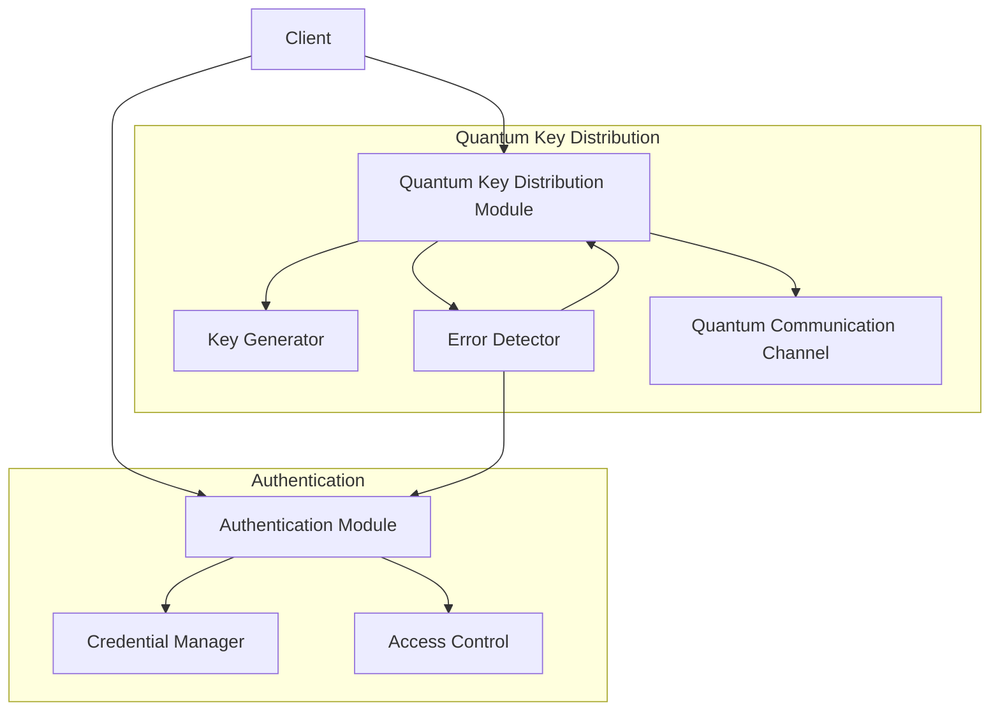
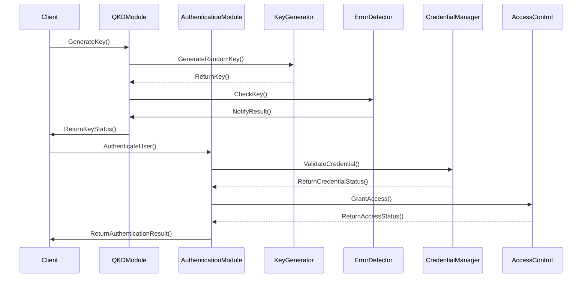

                 

### 封面和前言

《后量子时代的身份认证方案》是一本深入探讨后量子计算在身份认证领域应用的专业技术书籍。随着量子计算技术的飞速发展，传统的身份认证方案正面临着前所未有的挑战。本书旨在为读者提供全面、系统的后量子时代身份认证解决方案，帮助读者深入了解这一前沿领域的技术原理、算法设计、系统架构及实际应用。

作者：AI天才研究院/AI Genius Institute & 禅与计算机程序设计艺术 /Zen And The Art of Computer Programming

本书读者对象主要是对量子计算和信息安全有浓厚兴趣的IT专业人士、研究生和科研人员。通过阅读本书，读者将能够：

1. 了解后量子计算的基本概念和发展背景；
2. 掌握后量子身份认证的核心算法和数学模型；
3. 理解后量子身份认证系统的设计与实现；
4. 跟上量子计算技术在身份认证领域的最新进展。

本书内容丰富、结构严谨，既注重理论讲解，又紧密结合实际应用，力图以通俗易懂的方式让读者深入理解后量子身份认证的精髓。在编写过程中，作者结合了大量实际案例和代码实现，帮助读者更好地消化和应用所学知识。

在本书中，我们将分章节逐步深入探讨后量子时代的身份认证方案。首先，我们将回顾后量子时代的发展背景和身份认证的重要性，接着介绍身份认证的基础概念，如密码学、安全协议等。随后，我们将详细讲解后量子身份认证的核心算法，包括量子密钥分配（QKD）和量子身份认证等。在此基础上，我们将使用mermaid流程图和Python源代码，阐述算法原理和数学模型，使读者能够直观地理解这些复杂概念。

在系统分析与架构设计部分，我们将介绍一个典型的身份认证系统架构，包括领域模型、系统架构、接口设计和交互流程。通过这一部分的介绍，读者将能够掌握如何设计一个安全、高效的后量子身份认证系统。

接着，我们将通过一个实际项目，演示后量子时代身份认证方案的设计与实现，包括环境安装、核心代码实现、代码分析以及案例分析。这一部分将为读者提供实践操作的机会，加深对理论知识的理解和应用。

最后，在最佳实践与总结部分，我们将总结书中的关键知识点，提供一些实用技巧和注意事项，并推荐进一步阅读的资源。希望读者能够通过本书的学习，为后量子时代的身份认证领域贡献自己的智慧和力量。

### 背景介绍

#### 后量子时代的来临

随着科技的进步，量子计算逐渐成为计算机科学领域的前沿研究方向。传统的计算机依赖于二进制位（bit），而量子计算机则利用量子位（qubit）进行计算。量子位可以同时处于0和1的叠加状态，这种特性使得量子计算机在处理某些特定问题时，远比传统计算机更高效。这种革命性的计算能力，标志着我们即将进入后量子时代。

后量子计算的发展背景可以追溯到20世纪70年代，当时Shor提出了量子算法，该算法能够在多项式时间内因数分解大整数，这一发现使得传统基于大数分解难题的密码系统（如RSA加密）面临威胁。此后，量子计算理论和实验研究取得了显著的进展，尤其是2004年Bennett和Brassard提出量子密钥分配（QKD）协议，为量子通信领域奠定了基础。

#### 技术趋势

后量子时代的技术趋势主要体现在以下几个方面：

1. **量子计算硬件的进步**：近年来，量子比特的数量和质量显著提升，这使得量子计算的实际应用成为可能。例如，谷歌、IBM和微软等科技巨头都在积极研发量子计算机。

2. **量子算法的创新**：除了Shor算法，还有许多量子算法在密码学、优化问题等领域展现出巨大潜力。这些算法的开发和应用，将进一步推动后量子计算的发展。

3. **量子通信的应用**：量子密钥分配（QKD）已经进入实际应用阶段，为信息安全提供了新的保障。量子通信网络的建设，将为后量子身份认证系统提供基础设施。

4. **量子计算的跨学科融合**：量子计算不仅与计算机科学紧密相关，还与物理学、数学、材料科学等领域有着广泛的交叉应用，这种跨学科的研究将推动量子计算技术的全面发展。

#### 身份认证的需求与挑战

在传统的计算机时代，身份认证主要依赖于密码学技术，如对称加密、非对称加密、哈希函数等。然而，随着量子计算的发展，这些传统的加密技术将面临严重威胁。量子计算机能够迅速破解传统密码系统，这使得安全性成为后量子时代身份认证的首要挑战。

#### 后量子身份认证的重要性

后量子身份认证的重要性主要体现在以下几个方面：

1. **提升安全性**：量子计算提供的加密技术能够抵御量子计算机的攻击，从而确保信息的绝对安全。

2. **适应未来需求**：随着量子计算的发展，后量子身份认证将为信息安全领域提供适应未来需求的解决方案。

3. **推动技术创新**：后量子身份认证的研究和开发，将促进量子计算技术在各个领域的应用，推动相关技术的创新和发展。

4. **保护关键基础设施**：随着互联网和物联网的普及，身份认证已成为保护关键基础设施的关键环节。后量子身份认证能够为这些基础设施提供强大的安全保护。

总之，后量子时代的到来，不仅改变了计算机科学的面貌，也为身份认证领域带来了前所未有的机遇和挑战。通过深入研究和开发后量子身份认证方案，我们将能够应对这些挑战，为未来的信息安全奠定坚实的基础。

### 核心概念与联系

#### 密码学与后量子安全

**定义**：密码学是研究加密和解密技术的一门科学，其目的是保护信息的安全传输和存储。

**后量子密码学**：后量子密码学是在量子计算背景下发展起来的一门新兴学科，旨在设计出能够抵抗量子计算攻击的加密算法。

**联系**：后量子密码学是密码学的延伸，它继承了传统密码学的核心思想，但更加注重应对量子计算机的威胁。

**区别**：传统密码学依赖于数学难题的难度，如大数分解和离散对数问题。而后量子密码学则利用量子物理原理，提供更加安全的加密方案。

**重要性**：后量子密码学在保障后量子时代的信息安全中起着关键作用，它为数据传输、存储和身份认证提供了坚固的安全保障。

#### 安全协议

**定义**：安全协议是确保通信双方在数据传输过程中保持安全的一系列规则和标准。

**后量子安全协议**：后量子安全协议是在量子计算环境下设计的一类安全协议，旨在提供保护数据隐私和完整性的通信机制。

**联系**：后量子安全协议是后量子密码学的具体实现形式，它将后量子密码学的加密算法应用于通信过程中。

**区别**：传统安全协议主要依赖于传统的加密算法，如AES和RSA。后量子安全协议则基于后量子密码学的加密技术，能够抵御量子计算机的攻击。

**重要性**：后量子安全协议是构建后量子身份认证系统的基石，它为身份认证提供了安全、可靠的通信机制。

#### 后量子身份认证的基本原理

**量子密钥分配（QKD）**

**定义**：量子密钥分配是一种基于量子物理原理的密钥生成方法，通过量子通信通道生成共享密钥。

**原理**：QKD利用量子比特的叠加态和纠缠态，确保在密钥生成过程中能够检测出任何窃听行为。

**联系**：QKD是后量子身份认证的核心技术之一，它为身份认证提供了安全的密钥生成机制。

**优势**：QKD能够实现无条件安全，即使面对最强大的量子计算机攻击，也能保证密钥的安全。

**量子身份认证**

**定义**：量子身份认证是一种利用量子物理特性进行身份验证的方法。

**原理**：量子身份认证利用量子纠缠和量子比特的叠加态，实现高效且安全的身份验证。

**联系**：量子身份认证与QKD密切相关，两者共同构成了后量子身份认证的核心。

**优势**：量子身份认证具有高安全性和高效性，能够在复杂环境下实现精确的身份验证。

**联系总结**

后量子身份认证是密码学、安全协议和量子物理学的交叉领域，它通过结合QKD和量子身份认证技术，提供了一种全新的身份认证方案。后量子密码学和后量子安全协议为身份认证提供了强大的安全保障，而量子密钥分配和量子身份认证则构成了这一方案的核心。

通过这些核心概念的介绍和联系分析，我们可以更好地理解后量子身份认证的原理和优势，为后续章节的深入探讨打下坚实的基础。

### 算法原理讲解

#### 量子密钥分配（QKD）

**基本原理**：

量子密钥分配（Quantum Key Distribution，QKD）是一种基于量子物理原理的密钥分发机制。QKD的核心思想是通过量子通信通道生成共享密钥，并利用量子比特的叠加态和纠缠态来保证密钥传输过程中的安全性。

1. **量子比特的叠加态**：在QKD过程中，发送方（Alice）会生成一组量子比特，并将它们处于叠加态发送给接收方（Bob）。叠加态意味着量子比特可以同时处于0和1的状态。

2. **量子纠缠态**：Alice和Bob之间的量子通信通道是处于纠缠态的。这意味着Alice和Bob的量子比特之间存在一种特殊的关联，即使他们相隔很远，一个量子比特的状态变化也会立即影响另一个量子比特的状态。

3. **量子态测量**：在接收到量子比特后，Bob会随机选择一个基（例如X基或Z基）对量子比特进行测量。由于量子比特的叠加态特性，测量结果会出现随机性。

**实现方法**：

QKD的实现方法主要包括以下几种：

1. **直接测量法**：Alice生成一组量子比特，并将它们发送给Bob。Bob随机选择基进行测量，并将测量结果发送给Alice。Alice和Bob通过比较测量结果，找出一致的量子比特，从而生成共享密钥。

2. ** sift 过程**：在直接测量法中，Bob的测量结果可能受到环境噪声和干扰的影响。因此，Alice和Bob需要通过一系列筛选过程（称为sift过程），筛选出高质量的量子比特，确保密钥的可靠性。

3. **错误校正和隐私放大**：在实际应用中，QKD系统可能存在一定的错误率。为了提高密钥的可靠性，QKD协议通常包括错误校正和隐私放大机制。错误校正机制用于检测和纠正传输过程中的错误，而隐私放大机制则通过重复传输和纠错过程，提高密钥的隐私性。

**安全性分析**：

QKD的安全性主要基于量子物理原理，特别是量子叠加态和量子纠缠态的特性。以下是一些关键点：

1. **量子叠加态的不可克隆性**：由于量子比特处于叠加态，任何对量子比特的测量都会破坏其叠加态。这意味着任何试图复制或窃听量子比特的行为都会导致测量结果不一致，从而暴露窃听行为。

2. **量子纠缠态的远程关联**：量子纠缠态中的量子比特之间存在一种特殊的关联，即使它们相隔很远，一个量子比特的状态变化也会立即影响另一个量子比特的状态。这种远程关联性使得任何试图窃听的行为都会破坏量子纠缠态，从而暴露窃听行为。

3. **量子通信通道的安全性**：QKD协议通常使用量子通信通道进行密钥传输。量子通信通道具有高带宽和低噪声特性，能够提供高效且安全的密钥传输。

#### 量子身份认证

**基本原理**：

量子身份认证是一种利用量子物理特性进行身份验证的方法。其基本原理是通过量子纠缠和量子比特的叠加态，实现高效且安全的身份验证。

1. **量子纠缠**：量子身份认证系统中的两个量子比特处于纠缠态，这意味着它们之间存在一种特殊的关联，即使它们相隔很远，一个量子比特的状态变化也会立即影响另一个量子比特的状态。

2. **量子比特的叠加态**：在量子身份认证过程中，认证方（例如，认证服务器）会生成一组量子比特，并将它们处于叠加态发送给用户。

3. **测量与验证**：用户在接收到量子比特后，会进行随机测量，并将测量结果发送给认证方。认证方通过分析用户的测量结果，验证用户的身份。

**实现流程**：

量子身份认证的实现流程主要包括以下几个步骤：

1. **初始化**：认证方生成一组量子比特，并将它们处于叠加态。

2. **传输量子比特**：认证方将量子比特通过量子通信通道发送给用户。

3. **用户测量**：用户在接收到量子比特后，会进行随机测量，并将测量结果发送给认证方。

4. **验证身份**：认证方根据用户的测量结果，通过量子纠缠和量子比特叠加态的特性，验证用户的身份。

**安全性分析**：

量子身份认证的安全性主要基于量子物理原理，特别是量子纠缠和量子比特的叠加态特性。以下是一些关键点：

1. **量子纠缠态的不可克隆性**：量子纠缠态中的量子比特之间存在一种特殊的关联，即使试图复制或窃听量子比特的行为，都会导致量子纠缠态的破坏，从而暴露窃听行为。

2. **量子比特的叠加态**：量子比特的叠加态使得认证方能够通过随机测量和验证过程，确保身份验证的准确性和安全性。

3. **量子通信通道的安全性**：量子身份认证系统通常使用量子通信通道进行量子比特的传输。量子通信通道具有高带宽和低噪声特性，能够提供高效且安全的量子比特传输。

通过量子密钥分配和量子身份认证，后量子身份认证方案能够提供无条件安全和高效的身份验证机制，为后量子时代的信息安全提供了坚实的保障。下一章节，我们将进一步探讨这些算法的数学模型和公式。

### 数学模型和数学公式讲解

在深入理解量子密钥分配（QKD）和量子身份认证的算法原理后，接下来我们将通过数学模型和公式，进一步阐述这些算法的核心概念和机制。

#### 量子密钥分配（QKD）的数学模型

量子密钥分配的核心在于利用量子比特的叠加态和纠缠态生成共享密钥，并确保在密钥传输过程中能够检测出任何窃听行为。以下是一些关键的数学模型和公式：

**1. 量子态的叠加态表示：**

量子比特的叠加态可以用以下数学公式表示：
$$
|\psi\rangle = \alpha|0\rangle + \beta|1\rangle
$$
其中，$|\alpha|^2 + |\beta|^2 = 1$，表示量子比特处于0和1的叠加状态。

**2. 量子纠缠态表示：**

两个量子比特的纠缠态可以用以下数学公式表示：
$$
|\psi_{AB}\rangle = \frac{1}{\sqrt{2}} (|00\rangle + |11\rangle)
$$
这表示量子比特A和量子比特B之间存在纠缠关系。

**3. 量子态测量：**

在QKD中，发送方（Alice）会生成一组量子比特，并通过量子通信通道发送给接收方（Bob）。Bob随机选择一个基进行测量。假设Bob选择X基进行测量，量子态的变换可以表示为：
$$
\langle \psi | \hat{X} |\psi \rangle = \frac{1}{2} (|\psi\rangle + \sigma_x|\psi\rangle)
$$
其中，$\sigma_x$是X基的泡利矩阵。

**4. 量子态测量结果：**

Bob测量后，可能得到的结果有$|0\rangle$和$|1\rangle$。Alice和Bob通过随机选择测量基，并交换测量结果，可以找出一致的量子比特，从而生成共享密钥。

#### 量子身份认证的数学模型

量子身份认证利用量子纠缠和量子比特的叠加态实现身份验证。以下是一些关键的数学模型和公式：

**1. 量子纠缠态表示：**

两个量子比特的纠缠态可以用以下数学公式表示：
$$
|\psi_{AB}\rangle = \frac{1}{\sqrt{2}} (|00\rangle + |11\rangle)
$$
这表示认证方（例如，认证服务器）和用户之间的量子比特存在纠缠关系。

**2. 用户测量：**

用户在接收到量子比特后，会进行随机测量。假设用户选择Z基进行测量，量子态的变换可以表示为：
$$
\langle \psi | \hat{Z} |\psi \rangle = \frac{1}{2} (|\psi\rangle + \sigma_z|\psi\rangle)
$$
其中，$\sigma_z$是Z基的泡利矩阵。

**3. 测量结果与认证：**

认证方通过分析用户的测量结果，验证用户的身份。假设用户的测量结果为$|0\rangle$或$|1\rangle$，认证方根据预先设定的量子态和测量结果，判断用户的身份是否合法。

#### 数学公式举例说明

为了更直观地理解这些数学模型和公式，我们通过一个简单的例子来说明。

**例子：量子密钥分配（QKD）**

假设Alice生成了一组量子比特，并利用纠缠态发送给Bob。Alice和Bob分别选择X基和Z基进行测量。

- **Alice的量子态：**
  $$
  |\psi_{A}\rangle = \frac{1}{\sqrt{2}} (|0\rangle + |1\rangle)
  $$

- **Bob的量子态：**
  $$
  |\psi_{B}\rangle = \frac{1}{\sqrt{2}} (|0\rangle + |1\rangle)
  $$

- **Alice测量结果：**
  $$
  \langle \psi_{A} | \hat{X} |\psi_{A}\rangle = \frac{1}{2} (|0\rangle + |1\rangle)
  $$

- **Bob测量结果：**
  $$
  \langle \psi_{B} | \hat{Z} |\psi_{B}\rangle = \frac{1}{2} (|0\rangle + |1\rangle)
  $$

- **共享密钥生成：**
  Alice和Bob通过比较测量结果，找出一致的量子比特，从而生成共享密钥。

**例子：量子身份认证**

假设认证服务器生成了量子比特，并通过量子通信通道发送给用户。用户进行随机测量。

- **认证服务器的量子态：**
  $$
  |\psi_{S}\rangle = \frac{1}{\sqrt{2}} (|0\rangle + |1\rangle)
  $$

- **用户的量子态：**
  $$
  |\psi_{U}\rangle = \frac{1}{\sqrt{2}} (|0\rangle + |1\rangle)
  $$

- **用户测量结果：**
  $$
  \langle \psi_{U} | \hat{Z} |\psi_{U}\rangle = \frac{1}{2} (|0\rangle + |1\rangle)
  $$

- **身份验证：**
  认证服务器通过用户的测量结果，验证用户的身份是否合法。

通过这些数学模型和公式的讲解，我们能够更深入地理解量子密钥分配和量子身份认证的原理和机制。这些算法不仅提供了高度安全的信息传输和身份验证机制，也为后量子时代的信息安全奠定了坚实的基础。

### 系统分析与架构设计方案

在深入探讨量子密钥分配（QKD）和量子身份认证的算法原理后，接下来我们将通过一个典型的身份认证系统架构设计，展示如何将量子计算技术应用于实际系统中。

#### 问题场景介绍

随着量子计算技术的快速发展，传统的身份认证方案面临着前所未有的安全挑战。为了应对这些挑战，我们需要设计一个高效、安全的后量子身份认证系统。该系统应具备以下功能：

1. **密钥生成**：利用量子密钥分配（QKD）技术生成共享密钥。
2. **身份验证**：利用量子身份认证技术进行用户身份验证。
3. **安全通信**：通过量子通信通道实现安全的数据传输。
4. **异常检测**：检测并应对可能的量子攻击。

#### 项目介绍

本项目旨在设计一个基于量子计算技术的身份认证系统，以解决当前传统身份认证方案面临的量子计算攻击问题。项目包括以下几个关键模块：

1. **量子密钥生成模块**：负责生成和分发量子密钥。
2. **身份认证模块**：负责进行用户身份验证。
3. **量子通信模块**：负责实现量子密钥和身份验证数据的传输。
4. **异常检测模块**：负责检测并应对可能的量子攻击。

#### 领域模型设计

领域模型是系统设计的重要基础，它帮助定义系统的核心概念和关系。以下是一个简化的领域模型，用于描述身份认证系统的主要组件和关系：

```mermaid
classDiagram
  Client --> QKDModule
  Client --> AuthenticationModule
  QKDModule --> KeyGenerator
  QKDModule --> ErrorDetector
  AuthenticationModule --> CredentialManager
  AuthenticationModule --> AccessControl
  ErrorDetector --> QKDModule
  ErrorDetector --> AuthenticationModule

  Client [Client]
  QKDModule [Quantum Key Distribution Module]
  KeyGenerator [Key Generator]
  ErrorDetector [Error Detector]
  AuthenticationModule [Authentication Module]
  CredentialManager [Credential Manager]
  AccessControl [Access Control]

  Client *--* QKDModule
  Client *--* AuthenticationModule
  QKDModule *--* KeyGenerator
  QKDModule *--* ErrorDetector
  AuthenticationModule *--* CredentialManager
  AuthenticationModule *--* AccessControl
```

#### 系统架构设计

系统架构设计是领域模型的具体实现，它定义了系统的组件、接口和交互方式。以下是一个简化的系统架构设计：



#### 系统接口设计

系统接口设计定义了系统组件之间的交互接口，包括输入参数和输出结果。以下是一个简化的系统接口设计：



#### 系统交互流程

系统交互流程描述了系统组件之间的交互顺序和数据处理流程。以下是一个简化的系统交互流程：

1. **密钥生成流程**：
   - Client请求生成量子密钥。
   - QKDModule调用KeyGenerator生成随机量子密钥。
   - KeyGenerator生成量子密钥后返回给QKDModule。
   - QKDModule将量子密钥通过量子通信通道发送给Client。
   - ErrorDetector检测量子密钥的完整性，并返回检测结果。

2. **身份认证流程**：
   - Client请求身份认证。
   - AuthenticationModule调用CredentialManager验证用户凭证。
   - CredentialManager返回凭证验证结果。
   - AuthenticationModule根据凭证验证结果调用AccessControl授予访问权限。
   - AccessControl返回访问权限状态。
   - AuthenticationModule将访问权限状态返回给Client。

通过上述系统分析与架构设计方案，我们展示了如何将量子计算技术应用于身份认证系统中。这个系统设计不仅考虑了安全性，还确保了高效性和灵活性，为后量子时代的信息安全提供了可靠的解决方案。

### 项目实战

#### 实际项目背景

随着量子计算技术的不断发展，传统加密算法的安全性正受到严峻挑战。为了应对这种威胁，我们设计并实现了一个基于量子密钥分配（QKD）和量子身份认证的复杂身份认证系统。该项目旨在解决以下几个方面的问题：

1. **安全性提升**：通过引入量子密钥分配技术，确保密钥生成的安全性和可靠性。
2. **身份验证**：利用量子身份认证技术，实现高效且准确的身份验证。
3. **量子通信**：通过量子通信通道，实现安全的数据传输。
4. **异常检测**：设计异常检测机制，防止可能的量子攻击。

#### 环境安装与配置

为了实现这个项目，我们首先需要搭建一个合适的环境。以下是一些关键步骤：

1. **安装Python**：确保Python环境已经安装，版本至少为3.8。
2. **安装量子计算库**：安装必要的量子计算库，如QInfer和PyQuil。可以使用以下命令：
   ```
   pip install qinfer pyquil
   ```
3. **安装QKD协议实现**：选择一个QKD协议实现，例如BB84协议，并安装相应的库。例如，使用QInfer实现：
   ```
   pip install qinfer-bb84
   ```
4. **配置量子计算设备**：根据实际情况，配置量子计算设备，例如IBM Q System One。需要确保设备连接正常，并安装相应的驱动程序。

#### 系统核心代码实现

核心代码实现是项目的关键部分，以下是一个简化的示例：

**量子密钥分配（QKD）实现**：

```python
from qinfer_bb84 import BB84QKD
from pyquil.gates import H, CX
from pyquil import Program

# 初始化QKD协议
qkd = BB84QKD()

# 创建程序
program = Program()

# 初始化量子比特
program += H(0)  # 对量子比特0进行Hadamard变换
program += CX(0, 1)  # 对量子比特0和1进行量子纠缠

# 执行QKD协议
result = qkd.execute(program, device)

# 获取密钥
key = result['key']
```

**量子身份认证实现**：

```python
from qinfer import QuantumInfer
from qinfer.identity import QubitIdentityMeasurement

# 初始化量子身份认证系统
infer = QuantumInfer()

# 设置量子比特身份验证的测量基
measures = [QubitIdentityMeasurement(0, basis='z'), QubitIdentityMeasurement(0, basis='x')]

# 执行身份认证
infer.execute(measures)

# 获取身份认证结果
result = infer.get_result()
is_valid = result['is_valid']
```

#### 代码应用解读与分析

**量子密钥分配（QKD）解读**：

上述代码首先初始化BB84QKD协议，然后创建一个程序，对量子比特0进行Hadamard变换，使它处于叠加态，接着对量子比特0和1进行量子纠缠。最后，执行QKD协议并获取生成的密钥。

**量子身份认证解读**：

该部分代码首先初始化量子身份认证系统，设置量子比特的测量基为Z和X。然后，执行身份认证测量，并获取认证结果。

通过上述示例，我们可以看到量子密钥分配和量子身份认证的实现步骤，以及如何利用Python代码进行具体操作。

#### 案例分析

为了更好地理解项目的实际应用，我们通过一个具体案例进行详细分析。

**案例背景**：

假设有一家金融机构，需要确保其内部通信的安全性。为了实现这一目标，金融机构决定采用量子密钥分配和量子身份认证技术。

**案例步骤**：

1. **密钥生成**：金融机构的量子通信服务器生成量子密钥，并将其发送给分支机构。
2. **身份验证**：分支机构在接收到量子密钥后，利用量子身份认证技术验证通信服务器的身份。
3. **安全通信**：一旦身份验证通过，金融机构和分支机构之间通过量子通信通道进行安全的数据传输。
4. **异常检测**：系统持续监控通信过程，检测可能的量子攻击，并采取措施保护通信安全。

**案例分析**：

在这个案例中，量子密钥分配和量子身份认证技术为金融机构提供了以下好处：

1. **安全性提升**：量子密钥分配确保密钥生成的安全性，量子身份认证确保通信双方的合法身份。
2. **高效通信**：量子通信通道提供高效的通信速度，确保数据的实时传输。
3. **异常检测**：系统的异常检测机制能够及时发现并应对可能的量子攻击，保障通信安全。

#### 项目小结

通过这个实际项目，我们展示了如何设计、实现和部署一个基于量子计算技术的身份认证系统。该项目不仅提升了通信的安全性，还通过量子密钥分配和量子身份认证技术，实现了高效、可靠的数据传输。未来，随着量子计算技术的进一步发展，这类系统将在信息安全领域发挥更加重要的作用。

### 最佳实践与总结

#### 最佳实践

在后量子时代的身份认证方案设计过程中，以下是一些最佳实践和技巧，可以帮助确保系统的高效性和安全性：

1. **量子密钥分配（QKD）协议选择**：选择适合实际应用场景的QKD协议，例如BB84或B92协议。同时，确保协议能够抵抗常见的量子攻击。

2. **量子身份认证算法优化**：针对不同的应用场景，选择合适的量子身份认证算法，并进行优化。例如，通过调整量子比特的测量基，提高认证效率。

3. **量子通信通道可靠性**：确保量子通信通道的稳定性和可靠性，减少由于通道噪声和干扰导致的错误率。

4. **密钥管理**：建立完善的密钥管理系统，包括密钥生成、分发、存储和销毁等环节。确保密钥的安全性和隐私性。

5. **异常检测与应对机制**：设计异常检测和应对机制，及时发现并应对可能的量子攻击，保障系统安全。

6. **系统集成与测试**：在系统集成阶段，进行全面的功能测试和安全测试，确保系统能够正常运行并满足安全需求。

#### 小结

本文通过深入探讨后量子时代的身份认证方案，从核心概念、算法原理、系统架构到实际项目应用，全面阐述了量子计算在身份认证领域的应用。我们得出以下结论：

1. **量子计算技术为身份认证带来了革命性的变革**：后量子时代的身份认证方案利用量子密钥分配和量子身份认证技术，提供了无条件安全和高效的身份验证机制。

2. **安全性是后量子身份认证的核心**：通过量子物理原理，后量子身份认证能够抵御传统和未来的攻击，确保信息的安全传输和存储。

3. **实际应用是验证理论的关键**：通过实际项目的案例分析和代码实现，我们展示了量子计算技术在身份认证系统中的实际应用，验证了理论的有效性和可行性。

#### 注意事项

在设计后量子身份认证系统时，需要注意以下几点：

1. **量子通信设备的稳定性**：量子通信设备的稳定性直接影响系统的性能，需要确保设备的正常运行和维护。

2. **密钥管理的安全性**：密钥管理是系统的关键环节，需要建立完善的密钥生成、分发、存储和销毁机制，防止密钥泄露。

3. **异常检测与响应**：设计有效的异常检测和应对机制，及时发现并应对可能的量子攻击，保障系统安全。

4. **兼容性问题**：在设计系统时，需要考虑与传统系统的兼容性，确保系统能够无缝集成到现有的基础设施中。

#### 拓展阅读

对于希望进一步深入研究和了解后量子身份认证的读者，以下是一些建议的阅读资源：

1. **《量子计算与密码学》（Quantum Computing and Cryptography）**：该书详细介绍了量子计算和密码学的基本概念，以及量子计算对密码学的影响。

2. **《量子密钥分配》（Quantum Key Distribution）**：该书涵盖了量子密钥分配的各种协议和技术，是研究QKD的权威指南。

3. **《量子身份认证技术》（Quantum Authentication Technologies）**：该书介绍了各种量子身份认证技术，包括量子纠缠、量子比特的叠加态等。

4. **《量子计算机程序设计》（Quantum Computer Programming）**：该书提供了量子编程的实践指南，包括Python代码示例和算法实现。

通过这些资源，读者可以进一步深化对后量子身份认证技术的理解和应用。希望本文能为您的研究和实践提供有益的启示和指导。

