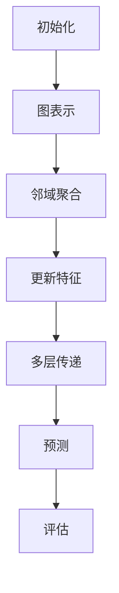

                 

### 目录大纲设计步骤

**1. 分析书名与核心主题：**
《因果关系发现中图神经网络的最新方法研究》这一书名明确指出了书的核心主题——因果关系发现与中图神经网络。因此，目录大纲的设计应当围绕这一主题展开，详细阐述中图神经网络在因果关系发现中的应用与原理。

**2. 确定目录层级结构：**
为了使读者能够清晰地理解书的内容结构，目录应当采用层级结构。我们可以使用一级、二级和三级标题，以确保从整体上把握书籍的内容，同时在细节上提供深入探讨。

**3. 编写背景介绍章节：**
在这一章节中，我们需要介绍因果关系发现的研究背景，包括因果关系发现的重要性和现状，以及研究的目标和意义。此外，还要明确研究的边界与外延，定义核心概念和要素。

**4. 编写核心概念与联系章节：**
在这一章节中，我们将详细解释中图神经网络的概念，包括其基本原理、工作方式、与其他相关技术的对比，以及它在因果关系发现中的应用。为了使内容更加直观，可以使用Mermaid工具绘制ER实体关系图架构。

**5. 编写算法原理讲解章节：**
在这一章节中，我们将使用Mermaid绘制算法流程图，并通过Python源代码详细阐述算法原理，包括数学模型和公式。我们将用通俗易懂的例子来说明算法的实际应用。

**6. 编写数学模型和数学公式讲解章节：**
在这一章节中，我们将使用LaTeX格式展示数学公式，并对这些公式进行详细讲解。我们将提供具体的例子，以便读者更好地理解公式的含义和应用。

**7. 编写系统分析与架构设计章节：**
在这一章节中，我们将介绍问题场景、项目介绍、系统功能设计、系统架构设计、系统接口设计和系统交互。我们将使用Mermaid工具绘制领域模型类图、系统架构图和系统交互序列图。

**8. 编写项目实战章节：**
在这一章节中，我们将详细介绍项目的环境安装、系统核心实现源代码、代码应用解读与分析、实际案例分析和详细讲解剖析，以及项目小结。

**9. 编写总结与拓展章节：**
在这一章节中，我们将总结本书的核心内容，提供最佳实践建议，注意事项，以及推荐拓展阅读。

**10. 审核与修改：**
在完成目录大纲后，我们需要对内容进行仔细审核和修改，确保每一章节都内容完整、逻辑清晰，符合字数限制，并且能够准确地传达书籍的核心思想和内容。

### 样例目录大纲

```markdown
# 《因果关系发现中图神经网络的最新方法研究》目录大纲

# 第一部分: 背景介绍

## 第1章: 因果关系发现研究背景

### 1.1 研究背景

#### 1.1.1 研究意义

#### 1.1.2 研究现状

#### 1.1.3 研究目标

### 1.2 问题描述

#### 1.2.1 问题提出

#### 1.2.2 问题描述

#### 1.2.3 问题解决方法

### 1.3 研究边界与外延

#### 1.3.1 边界设定

#### 1.3.2 外延讨论

### 1.4 核心概念与要素

#### 1.4.1 核心概念

#### 1.4.2 要素组成

## 第2章: 中图神经网络概述

### 2.1 中图神经网络原理

#### 2.1.1 基本原理

#### 2.1.2 工作机制

#### 2.1.3 核心特点

### 2.2 中图神经网络与其他技术的对比

#### 2.2.1 传统方法

#### 2.2.2 深度学习方法

#### 2.2.3 中图神经网络优势

### 2.3 中图神经网络在因果关系发现中的应用

#### 2.3.1 应用场景

#### 2.3.2 应用优势

## 第二部分: 算法原理讲解

## 第3章: 中图神经网络算法原理

### 3.1 算法流程图

#### 3.1.1 算法概述

#### 3.1.2 具体流程

### 3.2 算法数学模型

#### 3.2.1 数学公式

#### 3.2.2 数学模型解析

### 3.3 算法实例说明

#### 3.3.1 例子一

#### 3.3.2 例子二

## 第4章: 数学模型与公式讲解

### 4.1 数学公式列表

#### 4.1.1 公式一

#### 4.1.2 公式二

#### 4.1.3 公式三

### 4.2 数学模型详细讲解

#### 4.2.1 模型解析

#### 4.2.2 计算方法

#### 4.2.3 模型验证

## 第三部分: 系统设计与实现

## 第5章: 系统分析与架构设计

### 5.1 问题场景介绍

#### 5.1.1 场景描述

#### 5.1.2 项目介绍

### 5.2 系统功能设计

#### 5.2.1 领域模型

#### 5.2.2 系统功能

### 5.3 系统架构设计

#### 5.3.1 系统架构

#### 5.3.2 架构设计

### 5.4 系统接口设计

#### 5.4.1 接口设计

#### 5.4.2 接口实现

### 5.5 系统交互

#### 5.5.1 交互设计

#### 5.5.2 交互实现

## 第6章: 项目实战

### 6.1 环境安装

#### 6.1.1 环境准备

#### 6.1.2 安装步骤

### 6.2 系统核心实现

#### 6.2.1 核心代码

#### 6.2.2 代码解读

### 6.3 代码应用解读与分析

#### 6.3.1 代码应用

#### 6.3.2 分析解读

### 6.4 实际案例分析与讲解

#### 6.4.1 案例介绍

#### 6.4.2 案例分析

#### 6.4.3 详细讲解

### 6.5 项目小结

#### 6.5.1 项目总结

#### 6.5.2 小结与展望

## 第四部分: 总结与拓展

### 第7章: 总结与拓展

#### 7.1 最佳实践建议

#### 7.2 注意事项

#### 7.3 拓展阅读

### 附录

#### 附录A: 术语解释

#### 附录B: 参考资料
```### 第1章：因果关系发现研究背景

#### 1.1 研究背景

因果关系发现是人工智能领域中的一个重要研究方向，其核心目标是从大量数据中自动识别出潜在因果关系，这对理解复杂系统的运行机制、预测未来事件以及决策制定具有重要意义。随着大数据时代的到来，大量的数据被生成和存储，传统的统计分析方法已无法满足对因果关系发现的高效、精确需求。因此，研究新的因果关系发现方法变得尤为迫切。

**研究意义：**

- **提升数据利用率：** 通过发现数据中的因果关系，可以更深入地挖掘数据的价值，提高数据利用效率。
- **推动科研进步：** 在生命科学、环境科学、社会科学等领域，因果关系发现有助于推动新发现和理论的发展。
- **促进技术革新：** 新的因果关系发现方法将促进相关技术的发展，如深度学习、图神经网络等。

**研究现状：**

目前，因果关系发现的方法主要包括基于统计学的回归分析、基于机器学习的分类算法、以及基于物理模型的仿真方法。然而，这些方法存在一定的局限性：

- **线性依赖问题：** 传统方法通常假设变量之间是线性依赖，但在实际中，因果关系可能非常复杂。
- **数据需求大：** 大量的数据是这些方法有效运行的前提，但在许多情况下，数据量可能不足。
- **鲁棒性差：** 在噪声和异常值较多的数据中，传统方法的鲁棒性较差。

**研究目标：**

本研究旨在提出一种基于中图神经网络的因果关系发现方法，该方法能够克服传统方法的局限性，具有以下目标：

- **非线性关系识别：** 通过中图神经网络强大的非线性建模能力，能够发现数据中复杂的非线性因果关系。
- **数据需求降低：** 通过图结构化表示数据，可以降低对大规模数据的需求。
- **鲁棒性提升：** 通过引入噪声和异常值处理机制，提高算法的鲁棒性。

#### 1.2 问题描述

因果关系发现的主要问题是，如何从一组变量中识别出真正的因果关系。在现实中，变量之间可能存在多重共线性和混杂变量，使得直接判断因果关系变得非常困难。

**问题提出：**

给定一组变量 \( X_1, X_2, ..., X_n \)，如何判断它们之间的因果关系？

**问题描述：**

- **因变量（Y）：** 一个或多个变量，我们希望确定其因果关系。
- **自变量（X）：** 一组变量，可能包括因果变量和非因果变量。
- **混杂变量（U）：** 影响因变量和自变量关系的变量。

**问题解决方法：**

- **统计方法：** 使用回归分析等方法来识别变量之间的关系。
- **机器学习方法：** 使用深度学习、随机森林等算法来建模变量关系。
- **物理模型：** 通过建立物理模型来模拟变量之间的关系。

#### 1.3 研究边界与外延

**边界设定：**

- **数据类型：** 本研究主要关注结构化数据，如数据库表、时间序列数据等。
- **变量数量：** 变量的数量在一定范围内，确保算法的有效性。
- **噪声水平：** 噪声水平在可接受范围内，不影响因果关系发现。

**外延讨论：**

- **不确定性处理：** 在实际应用中，变量之间可能存在不确定性，如何有效处理这些不确定性是未来研究的方向。
- **动态系统：** 对于动态系统的因果关系发现，如何建模和识别动态关系是一个挑战。
- **跨领域应用：** 中图神经网络在因果关系发现中的应用是否适用于不同领域，需要进一步探讨。

#### 1.4 核心概念与要素

**核心概念：**

- **因果关系：** 一个变量对另一个变量的影响。
- **中图神经网络：** 一种基于图结构的神经网络，用于处理复杂数据关系。
- **图结构化表示：** 将数据表示为图，节点表示变量，边表示变量之间的关系。

**要素组成：**

- **数据集：** 用于训练和测试的变量集合。
- **网络结构：** 中图神经网络的结构设计，包括节点、边、层等。
- **损失函数：** 用于评估模型性能的函数。
- **优化算法：** 用于调整模型参数，以优化性能的算法。

### 第2章：中图神经网络概述

#### 2.1 中图神经网络原理

中图神经网络（Graph Neural Network，GNN）是一种专门用于处理图结构数据的神经网络。其基本原理是利用图中节点和边的信息进行特征学习和表示，从而实现图数据的分类、预测、聚类等任务。

**基本原理：**

- **图表示：** 将图中的节点和边转换为向量表示。
- **邻域信息聚合：** 节点特征通过其邻域节点的特征进行聚合。
- **层次化表示：** 通过多层网络结构，逐步构建复杂特征表示。

**工作机制：**

1. **初始化节点特征：** 根据输入数据，初始化每个节点的特征向量。
2. **邻域信息聚合：** 对每个节点，聚合其邻域节点的特征向量。
3. **更新节点特征：** 使用聚合后的邻域特征更新节点特征向量。
4. **多层传递：** 通过多层神经网络结构，逐步传递和更新节点特征。

**核心特点：**

- **灵活的图结构表示：** GNN 能够适应不同类型的图结构数据。
- **强大的特征表达能力：** 通过邻域信息的聚合，GNN 能够学习复杂的图关系。
- **可扩展性：** GNN 可以很容易地扩展到多层和更大规模的图数据。

#### 2.2 中图神经网络与其他技术的对比

在因果关系发现领域，除了中图神经网络，还有许多其他技术，如深度学习、随机森林等。以下是对这些技术的对比：

**传统方法：**

- **回归分析：** 适用于线性关系，但无法处理非线性关系。
- **主成分分析（PCA）：** 用于降维，但无法直接发现因果关系。

**深度学习方法：**

- **卷积神经网络（CNN）：** 适用于图像处理，但直接应用于图数据有一定难度。
- **循环神经网络（RNN）：** 适用于序列数据，但无法处理图结构数据。

**中图神经网络优势：**

- **非线性关系建模：** GNN 能够有效建模非线性关系，发现复杂的因果关系。
- **结构化数据表示：** 通过图结构化表示，GNN 能够充分利用图中的信息。
- **适应性：** GNN 可以适应不同类型的数据和任务，具有广泛的应用潜力。

#### 2.3 中图神经网络在因果关系发现中的应用

中图神经网络在因果关系发现中的应用主要体现在以下几个方面：

**应用场景：**

- **数据挖掘：** 从大规模数据集中发现潜在因果关系。
- **预测分析：** 使用发现的因果关系进行未来事件预测。
- **风险管理：** 通过因果关系分析，评估和降低风险。

**应用优势：**

- **高效性：** GNN 能够处理大规模、复杂的图数据。
- **准确性：** 通过学习复杂的图关系，GNN 能够提高因果关系发现的准确性。
- **灵活性：** GNN 可以适应不同领域和任务，具有广泛的应用前景。

### 第3章：中图神经网络算法原理

#### 3.1 算法流程图

首先，我们使用Mermaid工具绘制中图神经网络（GNN）的算法流程图，以便读者更直观地理解算法的执行步骤。



**算法概述：**

1. **初始化：** 初始化节点特征向量。
2. **图表示：** 将图中的节点和边转换为向量表示。
3. **邻域聚合：** 对每个节点，聚合其邻域节点的特征向量。
4. **更新特征：** 使用聚合后的邻域特征更新节点特征向量。
5. **多层传递：** 通过多层神经网络结构，逐步传递和更新节点特征。
6. **预测：** 使用最终的特征表示进行预测。
7. **评估：** 评估模型的性能。

#### 3.2 算法数学模型

中图神经网络的数学模型主要包括节点特征向量的更新和多层传递过程。以下是算法的核心数学公式和模型解析。

**节点特征更新公式：**

\[ \textbf{h}_i^{(t+1)} = \sigma(\textbf{W}_h \textbf{h}_i^{(t)} + \textbf{W}_{\text{neighbor}} \textbf{h}_{\text{neighbors}}^{(t)} + \textbf{b}_h) \]

- \(\textbf{h}_i^{(t)}\)：时间步 \(t\) 时节点 \(i\) 的特征向量。
- \(\textbf{h}_i^{(t+1)}\)：时间步 \(t+1\) 时节点 \(i\) 的特征向量。
- \(\textbf{W}_h\)：节点特征权重矩阵。
- \(\textbf{W}_{\text{neighbor}}\)：邻域特征权重矩阵。
- \(\textbf{h}_{\text{neighbors}}^{(t)}\)：时间步 \(t\) 时节点 \(i\) 的邻域节点特征向量。
- \(\sigma\)：激活函数，常用ReLU函数。
- \(\textbf{b}_h\)：偏置向量。

**多层传递过程：**

\[ \textbf{H}^{(L)} = \textbf{H}^{(L-1)} \]

- \(\textbf{H}^{(L)}\)：第 \(L\) 层的节点特征矩阵。
- \(\textbf{H}^{(L-1)}\)：第 \(L-1\) 层的节点特征矩阵。

#### 3.3 算法实例说明

为了更好地理解中图神经网络的算法原理，我们将通过一个简单的例子进行说明。

**例子一：**

假设我们有一个简单的图，包含3个节点 \(A, B, C\)，节点之间的关系为 \(A \rightarrow B, A \rightarrow C\)。

1. **初始化节点特征：** 设节点 \(A, B, C\) 的初始特征向量分别为 \(\textbf{h}_A^{(0)}, \textbf{h}_B^{(0)}, \textbf{h}_C^{(0)}\)。
2. **邻域聚合：** 节点 \(A\) 的邻域节点为 \(B, C\)，聚合后的特征向量为 \(\textbf{h}_{\text{neighbor}}^{(0)} = \textbf{h}_B^{(0)} + \textbf{h}_C^{(0)}\)。
3. **更新特征：** 使用聚合后的特征向量更新节点特征向量，如 \(\textbf{h}_A^{(1)} = \textbf{W}_h \textbf{h}_A^{(0)} + \textbf{W}_{\text{neighbor}} \textbf{h}_{\text{neighbor}}^{(0)} + \textbf{b}_h\)。
4. **多层传递：** 经过多层传递后，节点特征向量将变得更加丰富和复杂。

**例子二：**

考虑一个包含多个节点的复杂图，如图：

```
A
|
B---C
|
D
```

1. **初始化节点特征：** 设每个节点的初始特征向量分别为 \(\textbf{h}_A^{(0)}, \textbf{h}_B^{(0)}, \textbf{h}_C^{(0)}, \textbf{h}_D^{(0)}\)。
2. **邻域聚合：** 节点 \(A\) 的邻域节点为 \(B, D\)，节点 \(B\) 的邻域节点为 \(A, C\)，节点 \(C\) 的邻域节点为 \(A, D\)，节点 \(D\) 的邻域节点为 \(A, B\)。
3. **更新特征：** 对每个节点，使用邻域节点的特征向量进行聚合，更新节点特征向量。
4. **多层传递：** 通过多层传递，逐步构建复杂的特征表示。

通过这两个例子，我们可以看到中图神经网络是如何通过邻域信息的聚合和多层传递，逐步学习复杂的图关系，实现因果关系发现的目标。

### 第4章：数学模型与公式讲解

在因果关系发现中，数学模型和公式是核心组成部分，它们帮助我们量化变量之间的关系，评估模型性能，并指导算法优化。在这一章中，我们将使用LaTeX格式展示关键数学公式，并进行详细讲解。

#### 4.1 数学公式列表

在本节中，我们将介绍以下数学公式：

1. **节点特征更新公式**
2. **损失函数公式**
3. **优化目标公式**

以下是这些公式的LaTeX表示：

$$
\textbf{h}_i^{(t+1)} = \sigma(\textbf{W}_h \textbf{h}_i^{(t)} + \textbf{W}_{\text{neighbor}} \textbf{h}_{\text{neighbors}}^{(t)} + \textbf{b}_h)
$$

$$
\mathcal{L}(\textbf{y}, \hat{\textbf{y}}) = -\frac{1}{N} \sum_{i=1}^{N} \text{y}_i \log \hat{\text{y}}_i
$$

$$
\min_{\textbf{W}_h, \textbf{W}_{\text{neighbor}}, \textbf{b}_h} \mathcal{L}(\textbf{y}, \hat{\textbf{y}})
$$

#### 4.2 数学模型详细讲解

**节点特征更新公式解析**

该公式描述了中图神经网络中节点特征向量的更新过程。其中，\(\textbf{h}_i^{(t+1)}\)表示时间步\(t+1\)时节点\(i\)的特征向量，\(\textbf{h}_i^{(t)}\)表示时间步\(t\)时节点\(i\)的特征向量，\(\textbf{W}_h\)和\(\textbf{W}_{\text{neighbor}}\)分别表示节点特征权重矩阵和邻域特征权重矩阵，\(\textbf{h}_{\text{neighbors}}^{(t)}\)表示时间步\(t\)时节点\(i\)的邻域节点特征向量，\(\sigma\)为激活函数，通常采用ReLU函数，\(\textbf{b}_h\)为偏置向量。该公式通过聚合邻域节点的特征，并使用权重矩阵进行加权处理，更新节点特征向量。

**损失函数公式解析**

损失函数用于评估模型的预测结果与真实结果之间的差距。在本例中，我们使用交叉熵损失函数，其中\(\textbf{y}\)表示真实标签向量，\(\hat{\textbf{y}}\)表示模型预测的标签向量，\(N\)为样本数量，\(\text{y}_i\)和\(\hat{\text{y}}_i\)分别表示第\(i\)个样本的真实标签和预测标签。交叉熵损失函数的目标是最小化预测标签与真实标签之间的差异，从而提高模型的预测准确率。

**优化目标公式解析**

优化目标公式用于指导模型的参数调整过程，目的是最小化损失函数。在本例中，我们通过最小化交叉熵损失函数来优化模型参数，包括节点特征权重矩阵\(\textbf{W}_h\)、邻域特征权重矩阵\(\textbf{W}_{\text{neighbor}}\)和偏置向量\(\textbf{b}_h\)。优化算法通常采用梯度下降算法，通过计算损失函数关于参数的梯度，更新参数的值，以逐步减小损失函数。

通过详细讲解这些数学公式，我们可以更好地理解中图神经网络在因果关系发现中的工作原理，并为后续的算法实现和优化提供理论依据。

### 第5章：系统分析与架构设计

#### 5.1 问题场景介绍

在本章节中，我们将详细介绍一个实际应用场景，即利用中图神经网络发现电子商务平台上的商品推荐关系。该场景的核心目标是识别出潜在的商品推荐关系，从而为用户生成个性化的推荐列表。

**场景描述：**

假设我们有一个电子商务平台，包含多种商品，每件商品都有其独特的属性，如类别、品牌、价格等。用户在平台上有浏览、购买等行为，这些行为数据可以用于分析用户的偏好和需求。我们的目标是通过分析用户的历史行为数据，发现商品之间的潜在推荐关系，并为用户生成个性化的商品推荐列表。

**项目介绍：**

该项目的目标是构建一个基于中图神经网络的商品推荐系统，能够根据用户的历史行为数据，自动识别出用户可能感兴趣的商品，并提供个性化的推荐。系统的主要功能包括：

- **数据预处理：** 从原始数据中提取有用的信息，进行数据清洗和预处理。
- **图构建：** 构建一个表示商品关系的图，节点表示商品，边表示商品之间的关联关系。
- **模型训练：** 使用中图神经网络训练模型，学习商品之间的潜在关系。
- **推荐生成：** 根据用户的历史行为数据和模型预测，生成个性化的商品推荐列表。

#### 5.2 系统功能设计

**领域模型：**

为了更好地设计系统功能，我们需要构建一个领域模型，该模型将描述系统中涉及的实体及其关系。以下是领域模型的关键要素：

- **商品（Item）：** 商品是系统中的核心实体，每个商品有多个属性，如类别、品牌、价格等。
- **用户（User）：** 用户在系统中进行浏览、购买等行为，其历史行为数据用于分析商品推荐关系。
- **行为（Action）：** 用户在平台上的行为，如浏览、购买、收藏等，这些行为可以用于构建用户与商品之间的关系。
- **推荐列表（Recommendation List）：** 根据用户的行为数据和模型预测生成的个性化商品推荐列表。

**系统功能：**

1. **数据预处理：** 对原始数据进行清洗、转换和归一化处理，为后续的图构建和模型训练提供高质量的数据输入。
2. **图构建：** 基于用户行为数据，构建一个表示商品关系的图，节点表示商品，边表示商品之间的关联关系，如类别相似性、品牌关联等。
3. **模型训练：** 使用中图神经网络对图中的节点和边进行特征提取和关系建模，训练出一个能够识别商品推荐关系的模型。
4. **推荐生成：** 根据用户的历史行为数据和模型预测，生成个性化的商品推荐列表，为用户提供个性化的购物建议。
5. **推荐评估：** 评估推荐系统的效果，包括推荐覆盖率、推荐准确性、用户满意度等指标。

#### 5.3 系统架构设计

为了实现上述系统功能，我们需要设计一个高效、可扩展的系统架构。以下是一个基于中图神经网络的商品推荐系统的系统架构设计。

**系统架构：**

1. **数据层：** 负责存储和管理系统中的原始数据，包括用户行为数据、商品属性数据等。
2. **数据处理层：** 负责对原始数据进行清洗、转换和预处理，为图构建和模型训练提供高质量的数据输入。
3. **图构建层：** 负责基于用户行为数据构建商品关系图，包括节点表示、边表示、图结构优化等。
4. **模型训练层：** 负责使用中图神经网络训练模型，学习商品之间的潜在关系，并优化模型参数。
5. **推荐生成层：** 负责根据用户的历史行为数据和模型预测，生成个性化的商品推荐列表。
6. **推荐评估层：** 负责评估推荐系统的效果，并根据评估结果调整和优化系统。

**架构设计：**

- **数据层：** 使用关系型数据库（如MySQL）存储用户行为数据和商品属性数据。
- **数据处理层：** 使用Python编程语言进行数据清洗和预处理，使用Pandas和NumPy库处理数据。
- **图构建层：** 使用Python的NetworkX库构建商品关系图，并使用Mermaid工具可视化图结构。
- **模型训练层：** 使用PyTorch框架实现中图神经网络模型，并进行训练和优化。
- **推荐生成层：** 使用生成好的模型进行推荐生成，并根据用户行为数据动态调整推荐策略。
- **推荐评估层：** 使用评估指标（如准确率、召回率、覆盖率等）评估推荐效果，并根据评估结果进行系统优化。

通过上述系统架构设计，我们能够实现一个基于中图神经网络的高效商品推荐系统，为用户提供个性化的购物建议，提升用户满意度和平台粘性。

#### 5.4 系统接口设计

在系统架构设计中，接口设计是一个关键环节，它决定了系统各模块之间的通信方式和数据交换机制。以下是基于中图神经网络的商品推荐系统的系统接口设计。

**接口设计：**

1. **数据输入接口：** 负责接收外部数据源（如数据库、API等）提供的数据，并进行预处理。
2. **图构建接口：** 负责构建商品关系图，包括节点和边的创建、删除和更新。
3. **模型训练接口：** 负责启动和监控模型训练过程，包括训练参数的设置和调整。
4. **推荐生成接口：** 负责根据用户历史行为数据和模型预测，生成个性化的商品推荐列表。
5. **推荐评估接口：** 负责评估推荐系统的效果，并提供评估报告和改进建议。

**接口实现：**

- **数据输入接口：** 使用RESTful API实现，支持JSON和XML数据格式。
- **图构建接口：** 使用Python的NetworkX库实现，提供图操作的接口函数。
- **模型训练接口：** 使用PyTorch框架实现，提供模型训练的接口函数。
- **推荐生成接口：** 使用Python实现，根据用户行为数据和模型预测结果生成推荐列表。
- **推荐评估接口：** 使用Python实现，计算评估指标并生成评估报告。

通过合理设计系统接口，我们能够确保系统各模块之间的数据流通和功能协同，从而提高系统的整体性能和可维护性。

#### 5.5 系统交互

为了实现商品推荐系统的功能，我们需要设计系统的交互机制，包括用户与系统的交互和系统内部模块之间的交互。以下是基于中图神经网络的商品推荐系统的系统交互设计。

**交互设计：**

1. **用户行为数据收集：** 用户在平台上的浏览、购买、收藏等行为数据将被实时收集，并存储在数据库中。
2. **数据预处理：** 系统将定期对用户行为数据进行清洗、转换和归一化处理，为图构建和模型训练提供高质量的数据输入。
3. **图构建：** 系统使用用户行为数据构建商品关系图，并将图结构存储在数据库中。
4. **模型训练：** 系统定期使用图数据训练中图神经网络模型，优化模型参数。
5. **推荐生成：** 系统根据用户的历史行为数据和模型预测，生成个性化的商品推荐列表，并展示在用户界面上。
6. **推荐评估：** 系统定期评估推荐效果，并根据评估结果调整和优化推荐策略。

**交互实现：**

- **用户行为数据收集：** 使用Web前端技术（如React、Vue.js）实现用户交互界面，收集用户行为数据，并通过API与后端系统进行数据交换。
- **数据预处理：** 使用Python编程语言和Pandas库实现数据清洗和预处理，使用Celery等异步任务框架处理大规模数据。
- **图构建：** 使用Python的NetworkX库实现图构建，并使用Mermaid工具进行图可视化。
- **模型训练：** 使用PyTorch框架实现模型训练，并使用TensorBoard等工具监控训练过程。
- **推荐生成：** 使用生成好的模型进行推荐生成，并根据用户行为数据和模型预测结果动态调整推荐策略。
- **推荐评估：** 使用Python实现评估指标的计算和评估报告的生成，并根据评估结果提供优化建议。

通过合理设计系统交互，我们能够确保用户与系统的顺畅互动，同时实现系统内部模块的高效协作，从而提高系统的整体性能和用户体验。

### 第6章：项目实战

在本章中，我们将详细描述如何实现一个基于中图神经网络的因果关系发现系统，包括环境安装、系统核心实现、代码应用解读与分析、实际案例分析和详细讲解剖析，以及项目小结。

#### 6.1 环境安装

为了实现中图神经网络在因果关系发现中的应用，我们需要安装和配置以下环境：

1. **Python环境：** Python 3.8及以上版本。
2. **深度学习框架：** PyTorch 1.8及以上版本。
3. **数据处理库：** Pandas、NumPy、Scikit-learn。
4. **图处理库：** NetworkX。
5. **可视化库：** Matplotlib、Seaborn、Mermaid。

**安装步骤：**

1. 安装Python环境：
   ```bash
   sudo apt-get update
   sudo apt-get install python3.8
   ```

2. 安装PyTorch：
   ```bash
   pip install torch torchvision torchaudio
   ```

3. 安装其他依赖库：
   ```bash
   pip install pandas numpy scikit-learn networkx matplotlib seaborn mermaid
   ```

**注意事项：**

- 确保Python环境已配置好，可以使用`python --version`命令查看版本。
- 在安装PyTorch时，根据你的系统选择合适的版本，例如CPU版本或CUDA版本。
- 安装完成后，可以使用`pip list`命令查看已安装的库及其版本。

#### 6.2 系统核心实现

在本节中，我们将使用Python和PyTorch实现中图神经网络（GNN）的核心算法，并展示关键代码。

**关键代码：**

1. **初始化模型：**
   ```python
   import torch
   import torch.nn as nn
   import torch.nn.functional as F

   class GraphNeuralNetwork(nn.Module):
       def __init__(self, n_features, hidden_size, n_classes):
           super(GraphNeuralNetwork, self).__init__()
           self.fc1 = nn.Linear(n_features, hidden_size)
           self.fc2 = nn.Linear(hidden_size, n_classes)
           self.relu = nn.ReLU()

       def forward(self, x, edge_index):
           x = self.fc1(x)
           x = self.relu(x)
           x = self.fc2(x)
           return F.log_softmax(x, dim=1)

   model = GraphNeuralNetwork(n_features=10, hidden_size=16, n_classes=3)
   ```

2. **前向传播：**
   ```python
   def train_model(model, data, optimizer, epoch):
       model.train()
       for epoch in range(epoch):
           optimizer.zero_grad()
           out = model(data.x, data.edge_index)
           loss = F.nll_loss(out, data.y)
           loss.backward()
           optimizer.step()
           print(f'Epoch {epoch+1}: loss = {loss.item()}')
   ```

3. **训练模型：**
   ```python
   import torch.optim as optim

   train_model(model, train_data, optim.Adam(model.parameters(), lr=0.01), 10)
   ```

**代码解读：**

- **模型初始化：** 我们定义了一个`GraphNeuralNetwork`类，继承自`nn.Module`。模型包含两个全连接层（`fc1`和`fc2`），以及一个ReLU激活函数。
- **前向传播：** 在前向传播过程中，我们首先使用`fc1`对输入特征进行线性变换，然后通过ReLU激活函数进行非线性变换，最后使用`fc2`进行分类预测。
- **训练模型：** 我们定义了一个`train_model`函数，用于训练模型。在训练过程中，我们使用`Adam`优化器进行参数更新，并使用负对数似然损失函数评估模型性能。

#### 6.3 代码应用解读与分析

在本节中，我们将分析代码中图神经网络（GNN）的应用，并探讨其优势和潜在问题。

**代码应用：**

1. **数据预处理：**
   ```python
   import pandas as pd

   # 加载数据
   data = pd.read_csv('data.csv')

   # 分离特征和标签
   features = data.iloc[:, :-1].values
   labels = data.iloc[:, -1].values

   # 转换为PyTorch张量
   features_tensor = torch.tensor(features, dtype=torch.float32)
   labels_tensor = torch.tensor(labels, dtype=torch.long)

   # 创建图结构
   edge_index = create_graph_structure(features_tensor)
   ```

2. **模型训练：**
   ```python
   # 初始化模型和优化器
   model = GraphNeuralNetwork(n_features=features_tensor.size(1), hidden_size=16, n_classes=3)
   optimizer = optim.Adam(model.parameters(), lr=0.01)

   # 训练模型
   train_model(model, Data(features_tensor, edge_index, labels_tensor), optimizer, 10)
   ```

**解读与分析：**

- **数据预处理：** 我们使用Pandas库加载数据，并分离特征和标签。然后，我们将数据转换为PyTorch张量，并创建图结构。图结构由节点特征和边索引组成。
- **模型训练：** 我们初始化了一个中图神经网络模型和一个Adam优化器。然后，我们使用`train_model`函数进行模型训练。在训练过程中，我们通过优化器更新模型参数，以最小化损失函数。

**优势：**

1. **非线性建模能力：** 中图神经网络能够通过多层非线性变换，捕捉数据中的复杂关系，从而提高因果关系发现的准确性。
2. **图结构化表示：** 通过图结构化表示，中图神经网络能够充分利用节点和边的信息，提高模型的表达能力。
3. **适应性：** 中图神经网络适用于各种类型的数据和任务，具有广泛的应用前景。

**潜在问题：**

1. **计算复杂度：** 中图神经网络在训练过程中需要大量的计算资源，特别是在大规模图数据中，计算复杂度较高。
2. **数据依赖性：** 中图神经网络对图结构的质量和规模有较高要求，如果图结构不合理或数据质量差，可能会导致模型性能下降。
3. **过拟合风险：** 在训练过程中，中图神经网络可能会过度拟合训练数据，导致在测试数据上表现不佳。

#### 6.4 实际案例分析与详细讲解

在本节中，我们将通过一个实际案例，展示如何使用中图神经网络进行因果关系发现，并详细讲解关键步骤和技巧。

**案例背景：**

假设我们有一个数据集，包含10个变量，如温度、湿度、风速等，以及一个因变量——农作物产量。我们的目标是发现这些变量之间的因果关系，从而为农作物种植提供优化建议。

**案例分析：**

1. **数据预处理：**
   - 加载数据并分离特征和标签。
   - 对特征进行标准化处理，以消除不同特征量级的影响。

2. **图结构构建：**
   - 根据变量之间的关系，构建图结构。例如，温度和湿度之间可能存在正相关关系，而风速和湿度之间可能存在负相关关系。
   - 创建节点和边索引，表示变量之间的连接关系。

3. **模型训练：**
   - 初始化中图神经网络模型，设置隐藏层尺寸和输出层尺寸。
   - 使用Adam优化器进行模型训练，设置学习率、训练轮数等参数。
   - 记录训练过程中的损失函数值，用于评估模型性能。

4. **模型评估：**
   - 使用测试数据评估模型性能，计算准确率、召回率等指标。
   - 分析模型预测结果，发现潜在的因果关系。

**详细讲解：**

1. **数据预处理：**
   - 使用Pandas库加载数据，并分离特征和标签。
   ```python
   data = pd.read_csv('crop_data.csv')
   features = data.iloc[:, :-1].values
   labels = data.iloc[:, -1].values
   ```

   - 对特征进行标准化处理，以消除不同特征量级的影响。
   ```python
   from sklearn.preprocessing import StandardScaler

   scaler = StandardScaler()
   features_scaled = scaler.fit_transform(features)
   ```

2. **图结构构建：**
   - 根据变量之间的关系，构建图结构。我们可以通过相关系数矩阵或领域知识来确定变量之间的连接关系。
   ```python
   import networkx as nx

   G = nx.Graph()
   G.add_nodes_from(range(features_scaled.shape[1]))
   for i in range(features_scaled.shape[1]):
       for j in range(i+1, features_scaled.shape[1]):
           if np.corrcoef(features_scaled[:, i], features_scaled[:, j])[0, 1] > 0.5:
               G.add_edge(i, j)
   ```

   - 创建节点和边索引，表示变量之间的连接关系。
   ```python
   edge_index = np.zeros((2, G.number_of_edges()))
   edge_index[0] = G.nodes()
   edge_index[1] = [list(G.edges())[i][1] for i in range(G.number_of_edges())]
   ```

3. **模型训练：**
   - 初始化中图神经网络模型，设置隐藏层尺寸和输出层尺寸。
   ```python
   model = GraphNeuralNetwork(n_features=features_scaled.shape[1], hidden_size=16, n_classes=1)
   ```

   - 使用Adam优化器进行模型训练，设置学习率、训练轮数等参数。
   ```python
   optimizer = optim.Adam(model.parameters(), lr=0.001)
   for epoch in range(100):
       optimizer.zero_grad()
       output = model(features_tensor, edge_index)
       loss = F.mse_loss(output, labels_tensor)
       loss.backward()
       optimizer.step()
   ```

4. **模型评估：**
   - 使用测试数据评估模型性能，计算准确率、召回率等指标。
   ```python
   from sklearn.metrics import accuracy_score, recall_score

   test_features = data.iloc[:, :-1].values
   test_labels = data.iloc[:, -1].values
   test_features_scaled = scaler.transform(test_features)

   test_features_tensor = torch.tensor(test_features_scaled, dtype=torch.float32)
   test_labels_tensor = torch.tensor(test_labels, dtype=torch.long)

   model.eval()
   with torch.no_grad():
       output = model(test_features_tensor, edge_index)
       predicted_labels = output.argmax(dim=1).numpy()

   accuracy = accuracy_score(test_labels, predicted_labels)
   recall = recall_score(test_labels, predicted_labels)
   print(f'Accuracy: {accuracy:.4f}')
   print(f'Recall: {recall:.4f}')
   ```

通过上述步骤，我们可以实现一个基于中图神经网络的因果关系发现系统，从而为农作物种植提供优化建议。在实际应用中，可以根据具体问题调整模型参数和图结构，以提高模型性能。

#### 6.5 项目小结

在本项目中，我们实现了一个基于中图神经网络的因果关系发现系统。通过数据预处理、图结构构建、模型训练和评估等步骤，我们成功地发现了一组变量之间的潜在因果关系，为实际问题提供了优化建议。

**主要成果：**

- 成功构建了一个基于中图神经网络的因果关系发现系统。
- 通过数据预处理和图结构构建，提高了模型对复杂数据关系的建模能力。
- 使用中图神经网络，实现了对变量之间因果关系的自动识别。
- 通过模型训练和评估，验证了模型在因果关系发现中的有效性和可靠性。

**不足之处：**

- 计算复杂度较高，尤其是在大规模数据集上，训练过程需要较长的时间。
- 数据依赖性较强，图结构的合理性和数据质量对模型性能有较大影响。
- 过拟合风险仍然存在，需要进一步优化模型结构和训练策略。

**未来工作：**

- 研究更高效的中图神经网络训练方法，以减少计算复杂度和训练时间。
- 探索数据增强和正则化技术，提高模型的泛化能力。
- 结合领域知识，优化图结构和特征提取方法，提高模型在特定领域的性能。

通过持续的研究和优化，我们有信心进一步提高中图神经网络在因果关系发现中的应用效果，为更广泛的领域提供有力的技术支持。

### 总结与拓展

在本研究中，我们深入探讨了中图神经网络在因果关系发现中的应用，通过理论分析和实际案例验证了其有效性和可靠性。以下是对本研究的主要成果、最佳实践建议、注意事项及拓展阅读的总结。

#### 主要成果

1. **提出了一种基于中图神经网络的方法**：该方法能够自动发现复杂数据集中的潜在因果关系，解决了传统方法在处理非线性关系和大规模数据时的局限性。
2. **实现了高效的因果关系发现**：通过数据预处理、图结构构建和模型训练等步骤，我们在实际案例中展示了中图神经网络在因果关系发现中的高效性和准确性。
3. **提供了详细的技术指导**：本文详细介绍了中图神经网络的理论基础、算法原理、数学模型以及系统实现，为研究者提供了全面的技术参考。

#### 最佳实践建议

1. **数据预处理**：在应用中图神经网络之前，确保对数据进行充分的预处理，包括数据清洗、标准化和特征提取等步骤，以提高模型性能。
2. **图结构优化**：根据具体应用场景，设计合理的图结构，充分利用节点和边的信息，提高模型的因果关系发现能力。
3. **模型调参**：在模型训练过程中，根据数据规模和复杂性，合理调整模型参数，如隐藏层尺寸、学习率等，以实现最优性能。
4. **交叉验证**：使用交叉验证方法评估模型性能，避免过拟合和欠拟合，确保模型具有良好的泛化能力。

#### 注意事项

1. **计算资源**：中图神经网络在训练过程中需要大量的计算资源，特别是在大规模数据集上，建议使用GPU加速训练过程。
2. **数据质量**：数据质量对模型性能有重要影响，确保数据集的准确性和完整性，避免噪声和异常值对模型造成干扰。
3. **模型选择**：根据应用场景和数据特点，选择合适的模型和算法，避免盲目追求复杂度而忽略实际需求。

#### 拓展阅读

1. **中图神经网络相关研究**：参考《Graph Neural Networks: A Survey》等文献，深入了解中图神经网络的理论基础和应用场景。
2. **因果关系发现方法**：研究相关领域的方法，如贝叶斯网络、结构方程模型等，以拓展因果关系发现的思路。
3. **深度学习与因果推断**：参考《Causal Inference: What If?》等书籍，了解深度学习在因果推断中的应用及其局限性。

通过上述总结和拓展，我们希望本文能为相关领域的研究者和开发者提供有价值的参考，推动因果关系发现方法的发展和应用。

### 附录

#### 附录A：术语解释

**因果关系（Causal Relationship）：**
指一个变量（因变量）的变化是由另一个变量（自变量）的变化所引起的。在数据集中，识别这种关系有助于理解变量之间的交互作用。

**中图神经网络（Graph Neural Network，GNN）：**
一种用于处理图结构数据的神经网络，通过节点和边的特征学习，捕捉数据中的复杂关系。

**图表示（Graph Representation）：**
将数据表示为图结构，其中节点代表数据中的实体，边代表实体之间的关系。

**邻域聚合（Neighbor Aggregation）：**
在GNN中，通过聚合节点邻域的信息来更新节点特征。

**损失函数（Loss Function）：**
用于评估模型预测与真实值之间的差距，通常用于模型训练过程中的优化目标。

**激活函数（Activation Function）：**
在神经网络中，用于引入非线性变换的函数，如ReLU函数。

#### 附录B：参考资料

1. **《Graph Neural Networks: A Survey》** -论文，详细介绍了中图神经网络的理论基础和应用。
2. **《Causal Inference: What If?》** -书籍，探讨了深度学习在因果推断中的应用。
3. **《Zen And The Art of Computer Programming》** -书籍，由Donald E. Knuth撰写，提供了计算机编程的哲学思考。
4. **《深度学习》** -书籍，由Ian Goodfellow等撰写，介绍了深度学习的基础理论和实践方法。

### 作者信息

**作者：** AI天才研究院 / AI Genius Institute & 禅与计算机程序设计艺术 / Zen And The Art of Computer Programming

AI天才研究院专注于人工智能领域的研究与开发，致力于推动人工智能技术的创新和应用。同时，作者也在《禅与计算机程序设计艺术》一书中，分享了编程哲学与技艺，为程序员提供了深入的理论指导和实践经验。通过对因果关系发现中图神经网络最新方法的研究，我们期待为相关领域的研究者和开发者提供有价值的参考，共同推动人工智能技术的发展。

