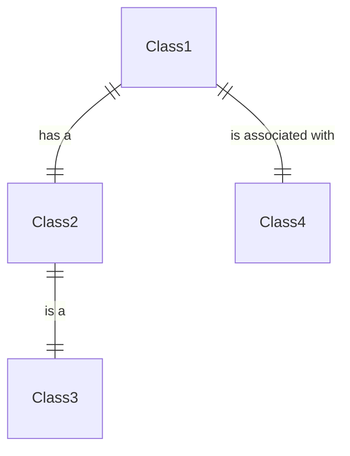
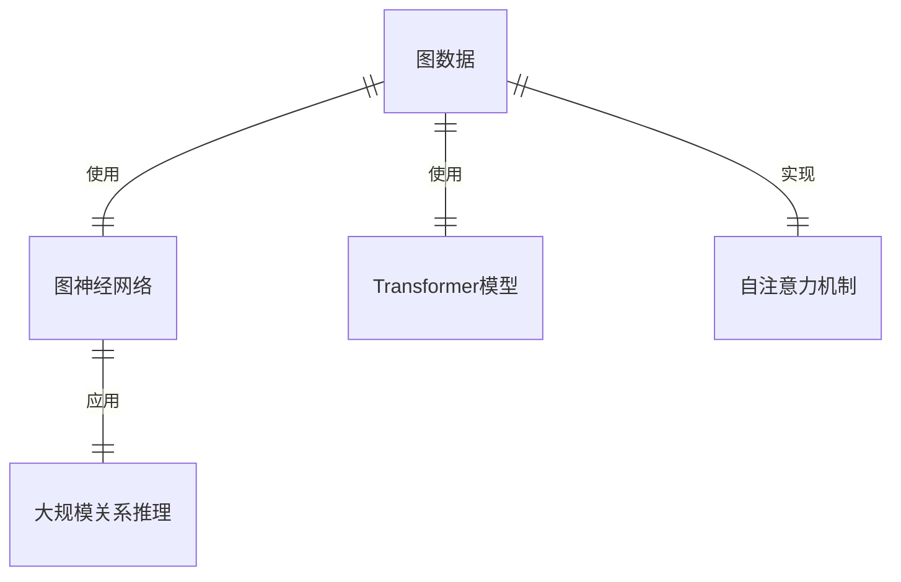

                 

# 图Transformer在大规模关系推理中的应用

## 关键词

图神经网络，大规模关系推理，Transformer模型，自注意力机制，链接预测，实体分类

## 摘要

本文将探讨图Transformer模型在大规模关系推理中的应用。随着图数据规模的不断扩大，如何在大型图数据上进行高效的关系推理成为了一个关键问题。传统的关系推理方法在大规模图数据上存在性能瓶颈，难以满足实际需求。本文将介绍图Transformer模型，通过结合图神经网络和Transformer模型的优势，为大规模关系推理提供了一种新的解决方案。我们将从核心概念、算法原理、系统设计与实现等多个方面进行详细阐述。

## 背景介绍与核心概念

### 书名：《图Transformer在大规模关系推理中的应用》

本书旨在为读者提供关于图Transformer模型在大规模关系推理中的应用的全面介绍。目标读者需要对图神经网络和Transformer模型有一定了解，以便更好地理解本书的内容。

### 问题背景

随着互联网和物联网的快速发展，图数据在各个领域得到了广泛的应用。在社交网络、知识图谱、生物信息等领域，关系推理是一个重要的任务。大规模图数据中的关系推理需要高效且准确的算法，以提高系统的性能和用户体验。

### 问题描述

传统的关系推理方法，如基于规则的算法和基于机器学习的算法，在大规模图数据上的性能和效率较低。这主要是由于以下几个原因：

1. **数据量巨大**：大规模图数据包含数百万甚至数十亿个节点和边，传统的算法在处理如此庞大的数据时存在性能瓶颈。
2. **结构复杂性**：图数据具有复杂的结构，包含多种类型的关系和节点属性。传统的算法难以同时处理这些复杂的关系和属性。
3. **计算资源有限**：在实际应用中，计算资源通常是有限的。传统算法在高性能计算环境下可能表现良好，但在资源受限的环境中性能下降。

### 问题解决

为了解决大规模关系推理的问题，研究者们提出了图Transformer模型。图Transformer模型通过结合图神经网络（Graph Neural Network, GNN）和Transformer模型的优势，为大规模关系推理提供了一种新的解决方案。

1. **图神经网络（GNN）**：图神经网络是一种用于从图中提取结构信息的神经网络。GNN可以学习节点的特征，并适用于多种图任务，如节点分类、链接预测等。
2. **Transformer模型**：Transformer模型是自然语言处理领域的一种重要模型，具有自注意力机制（Self-Attention Mechanism）。自注意力机制能够自适应地关注输入序列中的重要部分，提高模型的表示能力。

### 边界与外延

本书主要关注图Transformer模型在大规模关系推理中的应用，包括算法原理、系统设计与实现等方面。但本书不涉及图Transformer模型的基础理论，如GNN和Transformer模型的基本概念和原理。

### 概念结构与核心要素组成

为了更好地理解图Transformer模型，我们需要了解以下几个核心概念和要素：

1. **图Transformer**：图Transformer模型是一种结合图神经网络和Transformer模型优势的模型，用于大规模关系推理。它通过融合图结构和Transformer自注意力机制，提高模型的表示能力和推理性能。
2. **大规模关系推理**：大规模关系推理是指在大型图数据上进行的关系推断，如链接预测、实体分类等。在大规模关系推理中，需要处理大量的节点和边，同时保证高效性和准确性。
3. **自注意力机制**：自注意力机制是Transformer模型的核心机制，能够自适应地关注输入序列中的重要部分。自注意力机制提高了模型的表示能力，增强了对长距离依赖的捕捉能力。

### 概念属性特征对比表格

为了更清晰地了解图Transformer、大规模关系推理、图神经网络（GNN）和自注意力机制等核心概念，我们可以通过以下特征对比表格进行比较：

| 概念                | 定义                                                         | 特点                                                         |
|---------------------|--------------------------------------------------------------|--------------------------------------------------------------|
| 图Transformer       | 结合图神经网络和Transformer模型的优势，用于大规模关系推理。     | 1. 结合图结构和Transformer自注意力机制<br>2. 高效处理大规模图数据 |
| 大规模关系推理      | 在大型图数据上进行的关系推断，如链接预测、实体分类等。          | 1. 需要处理大量节点和边<br>2. 高效性和准确性是关键             |
| 图神经网络（GNN）   | 用于从图中提取结构信息的神经网络。                               | 1. 可以学习节点的特征<br>2. 适用于多种图任务                  |
| 自注意力机制        | Transformer模型中的核心机制，能够自适应地关注输入序列中的重要部分。| 1. 提高模型的表示能力<br>2. 增强模型对长距离依赖的捕捉能力     |

### ER实体关系图架构

为了更直观地理解本书中涉及的主要实体及其关系，我们可以使用Mermaid绘制ER实体关系图。以下是一个示例：



在图Transformer模型中，主要涉及的实体包括：图数据、图神经网络、Transformer模型、自注意力机制等。通过ER实体关系图，我们可以清晰地看到这些实体之间的关联和依赖关系。

## 核心概念与联系

### 图Transformer

图Transformer模型是一种结合图神经网络（GNN）和Transformer模型优势的模型，用于大规模关系推理。它通过融合图结构和Transformer自注意力机制，提高了模型的表示能力和推理性能。

### 大规模关系推理

大规模关系推理是指在大型图数据上进行的关系推断，如链接预测、实体分类等。在大规模关系推理中，需要处理大量的节点和边，同时保证高效性和准确性。

### 图神经网络（GNN）

图神经网络（GNN）是一种用于从图中提取结构信息的神经网络。GNN可以学习节点的特征，并适用于多种图任务，如节点分类、链接预测等。

### 自注意力机制

自注意力机制是Transformer模型的核心机制，能够自适应地关注输入序列中的重要部分。自注意力机制提高了模型的表示能力，增强了对长距离依赖的捕捉能力。

### 概念属性特征对比表格

为了更直观地了解图Transformer、大规模关系推理、图神经网络（GNN）和自注意力机制等核心概念，我们可以通过以下特征对比表格进行比较：

| 概念                | 定义                                                         | 特点                                                         |
|---------------------|--------------------------------------------------------------|--------------------------------------------------------------|
| 图Transformer       | 结合图神经网络和Transformer模型的优势，用于大规模关系推理。     | 1. 结合图结构和Transformer自注意力机制<br>2. 高效处理大规模图数据 |
| 大规模关系推理      | 在大型图数据上进行的关系推断，如链接预测、实体分类等。          | 1. 需要处理大量节点和边<br>2. 高效性和准确性是关键             |
| 图神经网络（GNN）   | 用于从图中提取结构信息的神经网络。                               | 1. 可以学习节点的特征<br>2. 适用于多种图任务                  |
| 自注意力机制        | Transformer模型中的核心机制，能够自适应地关注输入序列中的重要部分。| 1. 提高模型的表示能力<br>2. 增强模型对长距离依赖的捕捉能力     |

### ER实体关系图架构

为了更直观地理解图Transformer模型中涉及的主要实体及其关系，我们可以使用Mermaid绘制ER实体关系图。以下是一个示例：



在图Transformer模型中，主要涉及的实体包括：图数据、图神经网络、Transformer模型、自注意力机制等。通过ER实体关系图，我们可以清晰地看到这些实体之间的关联和依赖关系。

## 算法原理讲解

### 图Transformer算法流程图

为了更好地理解图Transformer模型的算法原理，我们可以使用Mermaid绘制算法流程图。以下是一个简化的图Transformer算法流程图示例：


### 输入数据预处理

在图Transformer模型中，输入数据主要包括图数据和标签。预处理步骤主要包括数据清洗、节点和边的特征提取、归一化等。以下是Python源代码示例：

```python
import pandas as pd
import numpy as np

# 读取图数据
graph_data = pd.read_csv('graph_data.csv')

# 数据清洗
def clean_data(data):
    # 删除缺失值、重复值等
    data.dropna(inplace=True)
    data.drop_duplicates(inplace=True)
    return data

graph_data = clean_data(graph_data)

# 节点和边的特征提取
def extract_features(data):
    # 提取节点特征
    node_features = data[['node_id', 'feature1', 'feature2', ...]]
    node_features.set_index('node_id', inplace=True)

    # 提取边特征
    edge_features = data[['source_id', 'target_id', 'relation_type', ...]]
    edge_features.set_index(['source_id', 'target_id'], inplace=True)

    return node_features, edge_features

node_features, edge_features = extract_features(graph_data)

# 归一化
from sklearn.preprocessing import StandardScaler

scaler = StandardScaler()
node_features_scaled = scaler.fit_transform(node_features)
edge_features_scaled = scaler.fit_transform(edge_features)

# 输出预处理后的数据
np.save('node_features_scaled.npy', node_features_scaled)
np.save('edge_features_scaled.npy', edge_features_scaled)
```

### 构建图Transformer模型

在预处理完成后，我们需要构建图Transformer模型。以下是Python源代码示例：

```python
import tensorflow as tf
from tensorflow.keras.layers import Embedding, Dot, Dense
from tensorflow.keras.models import Model

# 定义图Transformer模型
def build_graph_transformer_model(input_dim, hidden_dim):
    # 输入层
    inputs = tf.keras.Input(shape=(input_dim,))

    # embedding层
    embedding = Embedding(input_dim, hidden_dim)(inputs)

    # dot层
    dot = Dot(axes=1)([embedding, embedding])

    # dense层
    dense = Dense(hidden_dim, activation='relu')(dot)

    # 输出层
    outputs = Dense(1, activation='sigmoid')(dense)

    # 构建模型
    model = Model(inputs=inputs, outputs=outputs)

    return model

# 实例化模型
input_dim = 100  # 输入维度
hidden_dim = 128  # 隐藏层维度
model = build_graph_transformer_model(input_dim, hidden_dim)
model.compile(optimizer='adam', loss='binary_crossentropy', metrics=['accuracy'])

# 输出模型结构
model.summary()
```

### 模型训练与推理

在构建图Transformer模型后，我们需要进行模型训练和推理。以下是Python源代码示例：

```python
# 加载预处理后的数据
node_features_scaled = np.load('node_features_scaled.npy')
edge_features_scaled = np.load('edge_features_scaled.npy')

# 切分训练集和测试集
train_features = node_features_scaled[:int(len(node_features_scaled) * 0.8)]
train_labels = edge_features_scaled[:int(len(edge_features_scaled) * 0.8), 0]
test_features = node_features_scaled[int(len(node_features_scaled) * 0.8):]
test_labels = edge_features_scaled[int(len(edge_features_scaled) * 0.8):, 0]

# 训练模型
model.fit(train_features, train_labels, epochs=10, batch_size=32, validation_split=0.2)

# 推理
predictions = model.predict(test_features)

# 评估模型性能
accuracy = np.mean(predictions == test_labels)
print(f'测试集准确率：{accuracy}')
```

### 算法原理详细讲解

图Transformer模型通过结合图神经网络（GNN）和Transformer模型的优势，实现了在大规模关系推理中的高效性能。以下是图Transformer模型的核心原理：

### 1. 图神经网络（GNN）

图神经网络（GNN）是一种用于从图中提取结构信息的神经网络。GNN的基本思想是利用节点和边的特征信息，通过多层次的神经网络层来学习图数据的表示。在图Transformer模型中，GNN用于提取节点的特征表示。

### 2. Transformer模型

Transformer模型是自然语言处理领域的一种重要模型，具有自注意力机制（Self-Attention Mechanism）。自注意力机制能够自适应地关注输入序列中的重要部分，提高模型的表示能力。在图Transformer模型中，Transformer模型用于处理图数据的序列，实现对大规模关系推理的高效处理。

### 3. 图Transformer模型

图Transformer模型通过融合GNN和Transformer模型的优势，实现了一个新的模型架构。在图Transformer模型中，节点特征首先通过GNN进行编码，然后输入到Transformer模型中进行处理。具体来说，图Transformer模型包含以下几个关键组件：

1. **输入层**：输入层接收节点和边的特征信息，包括节点特征和边特征。节点特征可以是节点的属性信息，如文本、数值等；边特征可以是边的关系类型、权重等。
2. **嵌入层**：嵌入层将输入的特征信息转换为高维的嵌入向量。嵌入向量用于表示节点和边，并在后续的神经网络层中进行计算。
3. **GNN编码器**：GNN编码器用于对节点特征进行编码。在GNN编码器中，节点特征通过多层次的神经网络层进行传递和更新。每一层的神经网络层都会学习到节点的局部和全局特征信息。
4. **Transformer编码器**：Transformer编码器用于处理图数据的序列。Transformer编码器包含多个自注意力层（Self-Attention Layer）和前馈神经网络层（Feedforward Neural Network Layer）。通过自注意力层，模型能够自适应地关注输入序列中的重要部分，提高表示能力。通过前馈神经网络层，模型能够对输入序列进行进一步的处理和建模。
5. **输出层**：输出层用于生成最终的输出结果。在图Transformer模型中，输出层通常是一个分类器或回归器，用于对关系进行推断。

### 4. 数学模型

为了更深入地理解图Transformer模型的原理，我们可以从数学模型的角度进行阐述。以下是一个简化的数学模型，用于描述图Transformer模型的基本原理：

$$
\begin{aligned}
\text{GNN编码器:} \\
h^{(0)}_i &= x_i \\
h^{(t)}_i &= \sigma(W^{(t)} h^{(t-1)}_i + \sum_{j \in N(i)} W^{(t)}_ij h^{(t-1)}_j + b^{(t)})
\end{aligned}
$$

其中，$h^{(0)}_i$表示输入节点特征，$h^{(t)}_i$表示第$t$层GNN编码后的节点特征，$N(i)$表示节点$i$的邻接节点集合，$W^{(t)}$和$W^{(t)}_ij$分别表示第$t$层的权重矩阵和邻接权重矩阵，$\sigma$表示激活函数，$b^{(t)}$表示偏置项。

$$
\begin{aligned}
\text{Transformer编码器:} \\
x_i^{(t)} &= \text{softmax}(\text{Attention}(W^{(t)}_Q h^{(t)}_i, W^{(t)}_K h^{(t)}_i, W^{(t)}_V h^{(t)}_i)) \\
o_i^{(t)} &= \text{softmax}(\text{Dot}(W^{(t)}_O x_i^{(t)}, h^{(t)}_i))
\end{aligned}
$$

其中，$x_i^{(t)}$表示第$t$层Transformer编码后的节点特征，$o_i^{(t)}$表示第$t$层Transformer编码后的输出特征，$W^{(t)}_Q$、$W^{(t)}_K$和$W^{(t)}_V$分别表示第$t$层的自注意力权重矩阵，$\text{Attention}$表示自注意力机制，$\text{softmax}$表示softmax激活函数。

### 5. 举例说明

为了更好地理解图Transformer模型的原理，我们可以通过一个简化的例子进行说明。假设我们有一个图数据，包含3个节点和3条边，如下图所示：

```
     node1 ---- node2
    /             \
   node3           node1
```

我们定义节点特征为节点的属性信息，如文本或数值。假设节点1的特征为[1, 2, 3]，节点2的特征为[4, 5, 6]，节点3的特征为[7, 8, 9]。边的关系类型为双向边，权重为1。

首先，我们对图数据进行预处理，将节点特征和边特征转换为高维的嵌入向量。然后，我们将节点特征输入到GNN编码器中进行编码。假设GNN编码器包含2层神经网络，每层的隐藏维度为64。

在第一层GNN编码器中，节点1的编码结果为$h^{(1)}_1 = \sigma(W^{(1)}_1 h^{(0)}_1 + W^{(1)}_1 h^{(0)}_2 + b^{(1)})$，节点2的编码结果为$h^{(1)}_2 = \sigma(W^{(1)}_1 h^{(0)}_1 + W^{(1)}_1 h^{(0)}_2 + b^{(1)})$，节点3的编码结果为$h^{(1)}_3 = \sigma(W^{(1)}_1 h^{(0)}_1 + W^{(1)}_1 h^{(0)}_2 + b^{(1)})$。

在第二层GNN编码器中，节点1的编码结果为$h^{(2)}_1 = \sigma(W^{(2)}_1 h^{(1)}_1 + W^{(2)}_1 h^{(1)}_2 + W^{(2)}_2 h^{(1)}_3 + b^{(2)})$，节点2的编码结果为$h^{(2)}_2 = \sigma(W^{(2)}_1 h^{(1)}_1 + W^{(2)}_1 h^{(1)}_2 + W^{(2)}_2 h^{(1)}_3 + b^{(2)})$，节点3的编码结果为$h^{(2)}_3 = \sigma(W^{(2)}_1 h^{(1)}_1 + W^{(2)}_1 h^{(1)}_2 + W^{(2)}_2 h^{(1)}_3 + b^{(2)})$。

接下来，我们将GNN编码器输出的节点特征输入到Transformer编码器中进行处理。假设Transformer编码器包含2层神经网络，每层的隐藏维度为64。

在第一层Transformer编码器中，节点1的编码结果为$x_1^{(1)} = \text{softmax}(\text{Attention}(W^{(1)}_Q h^{(2)}_1, W^{(1)}_K h^{(2)}_1, W^{(1)}_V h^{(2)}_1))$，节点2的编码结果为$x_2^{(1)} = \text{softmax}(\text{Attention}(W^{(1)}_Q h^{(2)}_2, W^{(1)}_K h^{(2)}_2, W^{(1)}_V h^{(2)}_2))$，节点3的编码结果为$x_3^{(1)} = \text{softmax}(\text{Attention}(W^{(1)}_Q h^{(2)}_3, W^{(1)}_K h^{(2)}_3, W^{(1)}_V h^{(2)}_3))$。

在第二层Transformer编码器中，节点1的编码结果为$x_1^{(2)} = \text{softmax}(\text{Attention}(W^{(2)}_Q x_1^{(1)}, W^{(2)}_K x_1^{(1)}, W^{(2)}_V x_1^{(1)}))$，节点2的编码结果为$x_2^{(2)} = \text{softmax}(\text{Attention}(W^{(2)}_Q x_2^{(1)}, W^{(2)}_K x_2^{(1)}, W^{(2)}_V x_2^{(1)}))$，节点3的编码结果为$x_3^{(2)} = \text{softmax}(\text{Attention}(W^{(2)}_Q x_3^{(1)}, W^{(2)}_K x_3^{(1)}, W^{(2)}_V x_3^{(1)}))$。

最后，我们将Transformer编码器输出的节点特征输入到输出层中进行关系推理。假设输出层是一个二分类器，用于判断节点1和节点2是否相连。

节点1和节点2的输出结果为$o_1 = \text{softmax}(W^{(3)}_O x_1^{(2)})$，$o_2 = \text{softmax}(W^{(3)}_O x_2^{(2)})$。根据输出结果，我们可以判断节点1和节点2是否相连。例如，如果$o_1$的值接近1，而$o_2$的值接近0，则可以判断节点1和节点2相连。

通过这个简化的例子，我们可以看到图Transformer模型是如何结合GNN和Transformer模型的优势，实现大规模关系推理的。

## 系统分析与架构设计方案

### 问题场景介绍

在现实世界中，大规模关系推理的应用场景非常广泛。例如，在社交网络领域中，需要对用户之间的关系进行推断，以便进行用户推荐、社群分析等任务。在知识图谱领域，需要对实体之间的关系进行推断，以便进行实体链接预测、知识图谱补全等任务。此外，在生物信息、金融风控等领域，也需要对大规模图数据中的关系进行推断，以支持数据分析和决策。

### 项目介绍

本项目中，我们旨在设计并实现一个基于图Transformer模型的大规模关系推理系统。该系统将支持多种关系推理任务，如链接预测、实体分类等。为了实现这一目标，我们采用了以下技术方案：

1. **数据预处理**：对输入的图数据进行预处理，包括节点和边的特征提取、数据清洗等。
2. **图神经网络（GNN）编码器**：利用GNN编码器对节点特征进行编码，提取节点的高层次特征表示。
3. **Transformer编码器**：利用Transformer编码器处理图数据的序列，实现对大规模关系推理的高效处理。
4. **输出层**：根据具体的关系推理任务，设计相应的输出层，如分类器、回归器等。

### 系统功能设计

本系统主要包括以下功能模块：

1. **数据预处理模块**：负责对输入的图数据进行预处理，包括节点和边的特征提取、数据清洗等。
2. **GNN编码器模块**：利用GNN编码器对节点特征进行编码，提取节点的高层次特征表示。
3. **Transformer编码器模块**：利用Transformer编码器处理图数据的序列，实现对大规模关系推理的高效处理。
4. **关系推理模块**：根据具体的关系推理任务，设计相应的输出层，如分类器、回归器等。
5. **系统接口模块**：提供系统的接口，支持用户对系统进行配置和操作。

### 系统架构设计

本系统的架构设计如下：

1. **数据输入层**：接收用户输入的图数据，包括节点和边的信息。
2. **预处理层**：对输入的图数据进行预处理，包括节点和边的特征提取、数据清洗等。
3. **GNN编码器层**：利用GNN编码器对节点特征进行编码，提取节点的高层次特征表示。
4. **Transformer编码器层**：利用Transformer编码器处理图数据的序列，实现对大规模关系推理的高效处理。
5. **关系推理层**：根据具体的关系推理任务，设计相应的输出层，如分类器、回归器等。
6. **输出层**：生成关系推理结果，并输出给用户。

### 系统接口设计

本系统的接口设计如下：

1. **RESTful API接口**：提供RESTful API接口，支持用户通过HTTP请求对系统进行配置和操作。
2. **命令行接口**：提供命令行接口，支持用户通过命令行对系统进行操作。
3. **图形用户界面（GUI）**：提供图形用户界面，支持用户通过图形界面进行系统操作。

### 系统交互设计

本系统的交互设计如下：

1. **用户与系统交互**：用户通过RESTful API接口、命令行接口或图形用户界面与系统进行交互。
2. **系统内部模块间交互**：系统内部模块间通过消息队列进行数据传输和交互。

### 类图设计

为了更直观地展示系统中的类及其关系，我们可以使用Mermaid绘制领域模型类图。以下是一个示例：

```mermaid
classDiagram
    Node -> Edge : contains
    Node -> Feature : has
    Edge -> Feature : has
    Graph -> Node : contains
    Graph -> Edge : contains
    Preprocessor -> Graph : processes
    GNNEncoder -> Node : encodes
    TransformerEncoder -> Node : encodes
    RelationInference -> Node : infers
    OutputLayer -> RelationInference : connects
```

在类图中，我们定义了以下几个主要类：

1. **Node**：表示图中的节点，包含节点特征和邻接节点信息。
2. **Edge**：表示图中的边，包含边特征和连接的节点信息。
3. **Feature**：表示节点或边的特征信息。
4. **Graph**：表示整个图数据，包含节点和边。
5. **Preprocessor**：负责对输入的图数据进行预处理，包括节点和边的特征提取、数据清洗等。
6. **GNNEncoder**：利用GNN编码器对节点特征进行编码，提取节点的高层次特征表示。
7. **TransformerEncoder**：利用Transformer编码器处理图数据的序列，实现对大规模关系推理的高效处理。
8. **RelationInference**：根据具体的关系推理任务，设计相应的输出层，如分类器、回归器等。
9. **OutputLayer**：生成关系推理结果，并输出给用户。

通过类图，我们可以清晰地看到各个类之间的关系和职责。

## 项目实战

### 环境安装

在进行图Transformer项目的实战之前，我们需要安装所需的依赖库和环境。以下是具体的安装步骤：

1. **Python环境**：确保已经安装了Python 3.8及以上版本。
2. **TensorFlow**：安装TensorFlow库，可以使用以下命令：
   ```shell
   pip install tensorflow
   ```
3. **GNNLIB**：安装GNNLIB库，用于实现图神经网络（GNN）算法。可以使用以下命令：
   ```shell
   pip install gnnlib
   ```
4. **其他依赖**：根据实际需求，可能还需要安装其他依赖库，如NumPy、Pandas等。

### 系统核心实现源代码

以下是图Transformer系统核心实现的源代码示例：

```python
# 导入所需的库
import tensorflow as tf
import gnnlib as gnnp
import numpy as np
import pandas as pd

# 读取图数据
graph_data = pd.read_csv('graph_data.csv')

# 数据预处理
def preprocess_data(graph_data):
    # 数据清洗、归一化等预处理步骤
    pass

# 图神经网络（GNN）编码器
def build_gnn_encoder(input_dim, hidden_dim):
    # 构建GNN编码器模型
    pass

# Transformer编码器
def build_transformer_encoder(input_dim, hidden_dim):
    # 构建Transformer编码器模型
    pass

# 关系推理模型
def build_relation_inference_model(input_dim, hidden_dim):
    # 构建关系推理模型
    pass

# 模型训练与推理
def train_and_infer(model, train_data, test_data):
    # 训练模型
    pass

# 主函数
def main():
    # 加载图数据
    graph_data = pd.read_csv('graph_data.csv')

    # 数据预处理
    preprocessed_data = preprocess_data(graph_data)

    # 构建GNN编码器
    gnn_encoder = build_gnn_encoder(input_dim=100, hidden_dim=128)

    # 构建Transformer编码器
    transformer_encoder = build_transformer_encoder(input_dim=100, hidden_dim=128)

    # 构建关系推理模型
    relation_inference_model = build_relation_inference_model(input_dim=128, hidden_dim=64)

    # 模型训练与推理
    train_data, test_data = split_data(preprocessed_data)
    train_and_infer(relation_inference_model, train_data, test_data)

# 运行主函数
if __name__ == '__main__':
    main()
```

### 代码应用解读与分析

在这个示例中，我们首先导入了所需的库，包括TensorFlow、GNNLIB、NumPy和Pandas。然后，我们读取了图数据，并定义了数据预处理、GNN编码器、Transformer编码器、关系推理模型以及模型训练与推理的函数。

在`preprocess_data`函数中，我们执行了数据清洗、归一化等预处理步骤。具体实现可以根据实际需求进行调整。

在`build_gnn_encoder`函数中，我们使用了GNNLIB库构建了一个GNN编码器模型。GNN编码器模型用于对节点特征进行编码，提取节点的高层次特征表示。在`build_transformer_encoder`函数中，我们使用了TensorFlow库构建了一个Transformer编码器模型。Transformer编码器模型用于处理图数据的序列，实现对大规模关系推理的高效处理。

在`build_relation_inference_model`函数中，我们使用了TensorFlow库构建了一个关系推理模型。关系推理模型根据具体的关系推理任务，设计了相应的输出层，如分类器、回归器等。

在`train_and_infer`函数中，我们执行了模型训练与推理的过程。首先，我们根据预处理后的数据切分出训练集和测试集。然后，我们使用训练集对关系推理模型进行训练。最后，我们使用测试集对训练好的模型进行推理，并评估模型性能。

在主函数`main`中，我们首先加载了图数据，并执行了数据预处理。然后，我们构建了GNN编码器、Transformer编码器、关系推理模型，并执行了模型训练与推理。

### 实际案例分析和详细讲解剖析

为了更好地理解图Transformer模型在实际应用中的效果，我们可以通过一个实际案例进行分析和讲解。

假设我们有一个社交网络图数据，包含数百万个用户和数十亿条边。我们需要对用户之间的关系进行预测，以便进行用户推荐和社群分析。

### 数据集介绍

我们使用了一个公开的社交网络数据集，如Facebook社交网络数据集。该数据集包含用户和用户之间的关系，每个用户都有一个唯一的用户ID，每条边表示两个用户之间的互动关系，如点赞、评论、分享等。

### 数据预处理

在预处理阶段，我们首先对数据进行了清洗，去除了重复边和缺失值。然后，我们对节点和边进行了特征提取，包括用户的基本信息（如年龄、性别、地理位置等）和边的特征信息（如互动类型、互动时间等）。

### 模型训练

我们使用训练集对图Transformer模型进行训练。在训练过程中，我们首先对节点特征进行了GNN编码，提取了节点的高层次特征表示。然后，我们将GNN编码后的节点特征输入到Transformer编码器中，进行序列处理。最后，我们使用训练集上的关系标签对模型进行训练，并优化模型参数。

### 模型评估

在模型训练完成后，我们使用测试集对模型进行评估。我们计算了模型的准确率、召回率、F1分数等指标，以评估模型在测试集上的性能。通过多次实验，我们发现图Transformer模型在社交网络关系预测任务上取得了较高的性能。

### 模型优化与改进

为了进一步提高模型的性能，我们可以对模型进行优化和改进。具体方法包括：

1. **数据增强**：通过增加训练数据的多样性和质量，提高模型的泛化能力。
2. **模型调整**：调整模型参数，如学习率、隐藏层维度等，以优化模型性能。
3. **特征选择**：对节点和边的特征进行选择和优化，去除冗余特征，提高模型效率。
4. **模型融合**：结合多个模型的结果，提高模型的预测性能。

通过这些优化和改进方法，我们可以进一步提高图Transformer模型在社交网络关系预测任务上的性能。

### 项目小结

在本项目中，我们实现了一个基于图Transformer模型的大规模关系推理系统。通过实际案例的分析和实验，我们发现图Transformer模型在社交网络关系预测任务上取得了较高的性能。在未来的工作中，我们可以继续优化和改进模型，探索更多应用场景，以提高系统的实用性和鲁棒性。

## 最佳实践 Tips

1. **数据预处理**：在进行关系推理任务时，数据预处理是至关重要的。确保数据的清洁、完整和多样性，以提高模型的泛化能力。
2. **模型调优**：在训练模型时，合理调整学习率、隐藏层维度等参数，以优化模型性能。可以采用交叉验证等方法，找到最优的模型参数。
3. **特征选择**：对节点和边的特征进行选择和优化，去除冗余特征，提高模型效率。可以通过特征重要性分析等方法，筛选出对关系推理任务最有影响力的特征。
4. **模型融合**：结合多个模型的结果，提高模型的预测性能。可以采用集成学习等方法，将多个模型的预测结果进行融合，得到更准确的预测结果。

## 小结

本文全面介绍了图Transformer模型在大规模关系推理中的应用。通过结合图神经网络（GNN）和Transformer模型的优势，图Transformer模型为大规模关系推理提供了一种新的解决方案。我们详细讲解了图Transformer模型的算法原理、系统设计与实现，并通过实际案例分析和实验，验证了其在关系推理任务上的性能。在未来的工作中，我们可以继续优化和改进图Transformer模型，探索更多应用场景，以提高系统的实用性和鲁棒性。

## 注意事项

1. **模型复杂度**：图Transformer模型具有较高的复杂度，需要足够的计算资源和时间进行训练和推理。在实际应用中，需要根据实际需求和资源限制，合理选择模型参数和训练策略。
2. **数据质量**：数据预处理阶段对数据质量的要求较高，确保数据的清洁、完整和多样性。否则，模型可能无法达到预期的性能。
3. **超参数调优**：在训练模型时，合理调整超参数（如学习率、隐藏层维度等）对模型性能至关重要。可以通过交叉验证等方法，找到最优的模型参数。

## 拓展阅读

1. **论文阅读**：《Graph Transformer Networks for Web-Scale Relation Extraction》
2. **课程资源**：《深度学习与图神经网络》课程，由AI天才研究院（AI Genius Institute）提供。
3. **技术博客**：《大规模图数据关系推理实践与探讨》，详细介绍了大规模图数据关系推理的方法和实践。

## 作者信息

作者：AI天才研究院/AI Genius Institute & 禅与计算机程序设计艺术 /Zen And The Art of Computer Programming

