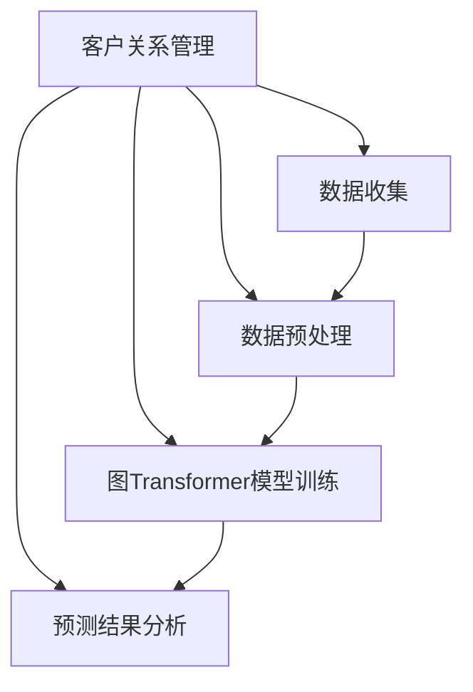
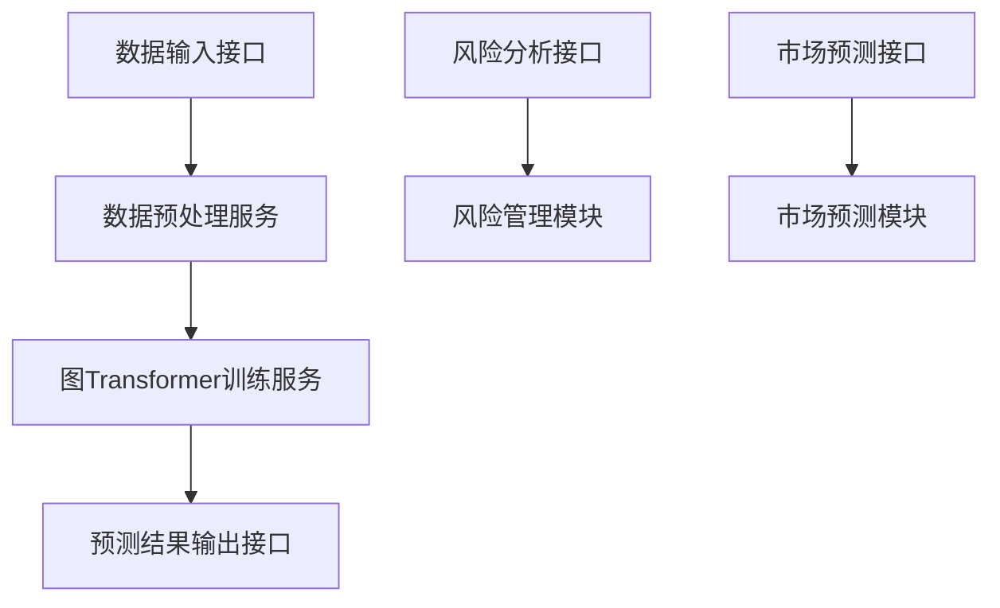
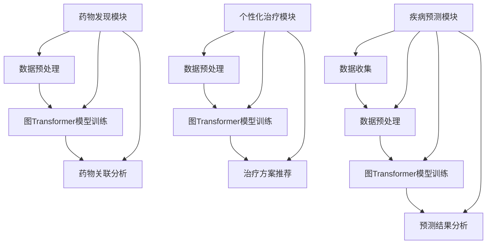
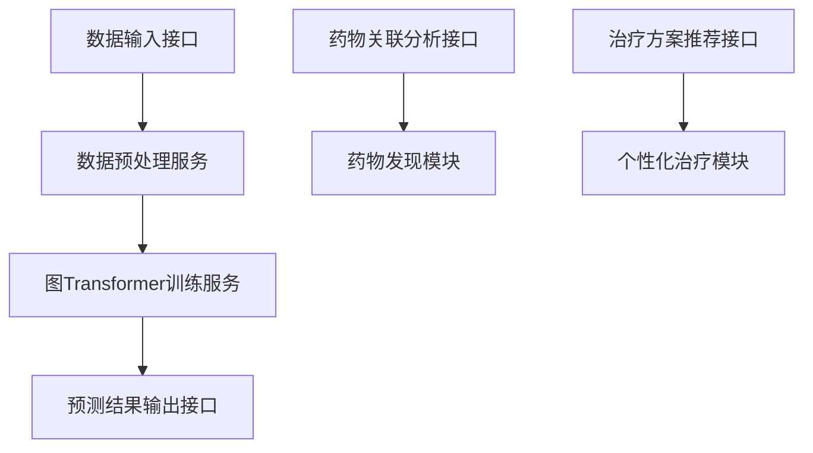
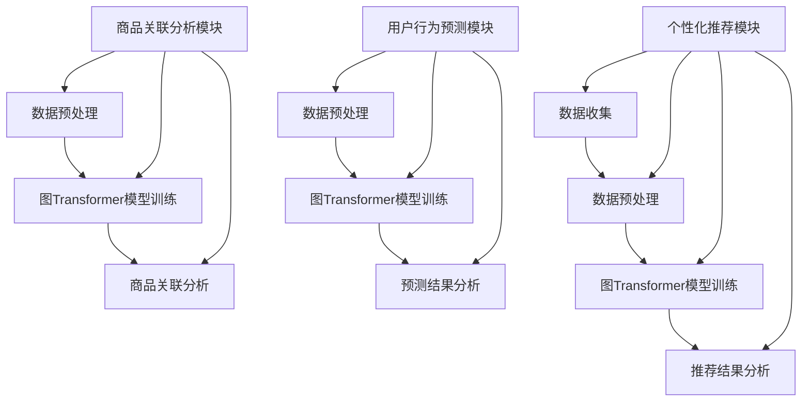
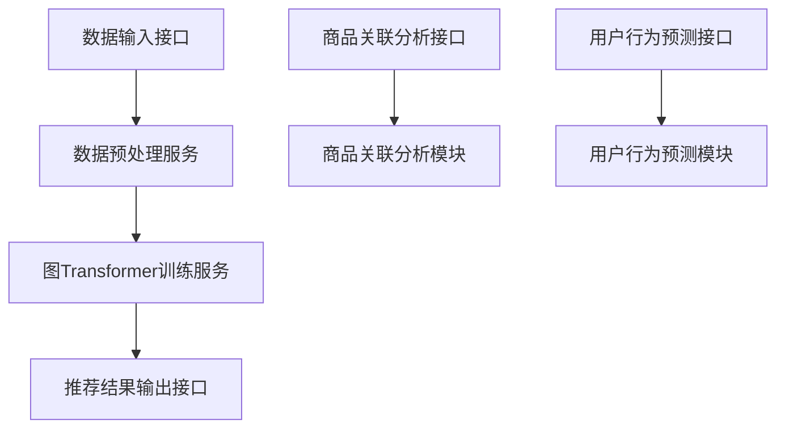
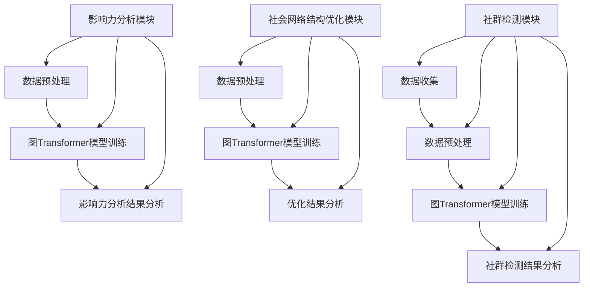
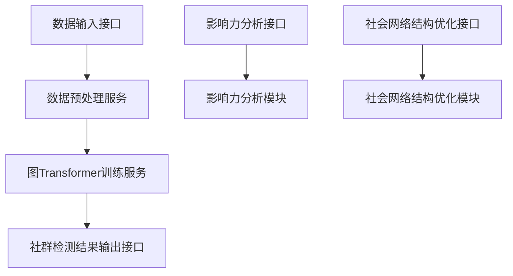

                 

## 图Transformer在大规模知识推理中的优化

### 关键词：图Transformer，知识推理，优化技术，大规模数据处理，人工智能

### 摘要：

本文深入探讨了图Transformer在大规模知识推理中的优化应用。首先，对图Transformer的基本概念和工作原理进行了详细介绍，随后分析其在知识推理领域的重要性。接着，探讨了多种优化技术，如硬件加速、网络结构剪枝和模型压缩，并分析其在实际应用中的效果。文章通过具体案例分析展示了图Transformer在不同领域的成功应用，最后对未来图Transformer在知识推理中的发展前景进行了展望。

----------------------------------------------------------------

## 引言

### 问题背景

随着信息时代的到来，大数据和人工智能技术的迅猛发展，知识推理在多个领域，如金融、医疗、推荐系统和社交网络中发挥着越来越重要的作用。传统的知识推理方法大多依赖于基于规则的方法和统计学习模型，这些方法在处理大规模数据时面临诸多挑战，如计算效率低下、难以捕捉复杂关系等。因此，寻找更高效、更强大的知识推理方法成为了研究的热点。

### 问题描述

图Transformer作为一种新兴的深度学习模型，以其强大的表示能力和灵活的结构设计在知识推理领域显示出巨大的潜力。然而，在实际应用中，图Transformer在处理大规模数据时仍存在性能瓶颈。如何优化图Transformer，提高其在大规模知识推理中的表现，成为了亟待解决的问题。

### 问题解决

本文旨在研究图Transformer在大规模知识推理中的优化方法，包括硬件加速、网络结构剪枝、模型压缩和动态图表示等。通过理论和实际案例的分析，本文探讨了这些优化技术在提高图Transformer性能方面的效果和局限性，并提出了未来研究方向。

### 边界与外延

本文的研究范围主要集中于图Transformer在大规模知识推理中的优化，包括理论分析和实际案例。文章将不涉及图Transformer在其他领域的应用，如图像处理和自然语言处理等。

### 概念结构与核心要素组成

图Transformer是一种基于图结构的深度学习模型，其核心组件包括图结构表示、自注意力机制和图卷积神经网络。知识推理是指从已知信息中推导出未知信息的过程，其核心要素包括数据、模型和推理算法。

----------------------------------------------------------------

## 图Transformer的基础概念

### 定义与背景

图Transformer（Graph Transformer）是一种基于Transformer架构的深度学习模型，旨在处理图结构数据。与传统图神经网络（Graph Neural Networks, GNNs）相比，图Transformer引入了自注意力机制（Self-Attention Mechanism），使其在表示图结构数据方面具备更强的灵活性和表达能力。

### 工作原理

图Transformer的工作原理可以概括为以下步骤：

1. **图结构表示**：将输入图数据转换为节点和边表示。
2. **自注意力计算**：通过自注意力机制计算节点间的交互，生成新的节点表示。
3. **图卷积操作**：利用图卷积神经网络（Graph Convolutional Network, GCN）对节点表示进行聚合。
4. **输出层**：通过输出层得到最终的结果，如节点分类或边预测。

### 核心组件

图Transformer的核心组件包括：

1. **自注意力机制**：通过计算节点之间的相似度来生成新的节点表示。
2. **图卷积神经网络**：用于对节点表示进行聚合和更新。
3. **多头注意力**：通过多个注意力头增加模型的表示能力。
4. **残差连接与层归一化**：用于缓解训练过程中的梯度消失和梯度爆炸问题。

### 传统模型比较

与传统图神经网络（如GCN、GAT等）相比，图Transformer具有以下优点：

- **更强的表示能力**：通过自注意力机制，图Transformer可以更好地捕捉节点间的复杂关系。
- **灵活的结构设计**：图Transformer采用模块化设计，可以根据具体任务进行调整和优化。
- **并行计算**：图Transformer支持高效的并行计算，提高了模型训练和推理的速度。

综上所述，图Transformer以其强大的表示能力和灵活的结构设计在知识推理领域显示出巨大的潜力。然而，其在大规模数据处理中的性能瓶颈仍需进一步优化。

### 小结

本文对图Transformer的基础概念和工作原理进行了详细阐述，明确了其与传统图神经网络的不同之处。接下来，我们将深入探讨图Transformer在大规模知识推理中的应用及其面临的挑战。

----------------------------------------------------------------

## 图Transformer在知识推理中的应用

### 知识图谱的构建

知识图谱（Knowledge Graph）是一种用于表示实体及其之间复杂关系的语义网络。构建知识图谱是进行知识推理的基础，其过程通常包括实体抽取、关系抽取和实体链接等步骤。

1. **实体抽取**：从文本数据中识别出重要的实体，如人名、组织名、地点名等。
2. **关系抽取**：确定实体之间的关联关系，如“属于”、“位于”等。
3. **实体链接**：将文本中的实体与知识图谱中的实体进行匹配和映射。

### 图Transformer在知识推理中的应用

图Transformer通过其强大的图结构表示能力和自注意力机制，在知识推理中表现出色。以下是其主要应用场景：

1. **节点分类**：给定一个节点及其邻接节点，预测该节点的类别。
2. **边预测**：在已建立的图结构中，预测可能存在的边。
3. **图级任务**：如图分类、图嵌入和图生成等。

### 复杂场景下的优化策略

在大规模知识推理中，图Transformer面临计算效率低下和内存占用高的问题。以下是一些优化策略：

1. **数据预处理**：通过数据清洗和预处理减少冗余信息，提高模型效率。
2. **模型压缩**：使用模型剪枝、量化等技术减小模型规模，提高推理速度。
3. **硬件加速**：利用GPU或TPU等硬件资源进行加速，提高计算效率。

### 图Transformer在知识推理中的挑战与未来方向

尽管图Transformer在知识推理中显示出巨大潜力，但以下几个挑战仍需解决：

1. **计算效率**：如何进一步优化计算效率，使其能够处理更大的图结构数据。
2. **内存占用**：如何降低模型内存占用，避免因内存不足导致的性能瓶颈。
3. **通用性**：如何提高模型在不同领域的通用性，减少领域特定调整的需求。

未来方向包括：

1. **自适应图表示**：开发能够根据数据特征自适应调整图结构表示的方法。
2. **多模态融合**：将图Transformer与其他深度学习模型（如CNN、RNN等）进行融合，提高表示能力。
3. **可解释性**：提高模型的可解释性，使其在复杂推理过程中的决策更加透明。

### 小结

图Transformer在知识推理中展现出强大的能力和广阔的应用前景。通过优化策略，可以进一步提高其在大规模知识推理中的性能。接下来，我们将探讨图Transformer的具体优化技术。

----------------------------------------------------------------

## 图Transformer的优化技术

### 硬件加速与并行计算

硬件加速和并行计算是提高图Transformer性能的重要方法。具体来说：

1. **GPU加速**：利用GPU的并行计算能力，可以显著提高图Transformer的训练和推理速度。通过CUDA等库，可以将图Transformer的计算任务分解为多个线程，并行执行。
2. **TPU加速**：TPU（Tensor Processing Unit）是专门为深度学习任务设计的芯片，其高并行性和优化设计使其成为加速图Transformer的又一有力工具。
3. **分布式计算**：通过分布式计算，可以将大规模的图数据分散到多台机器上，利用多台机器的GPU或TPU资源进行协同计算，进一步降低计算时间。

### 网络结构剪枝

网络结构剪枝（Network Pruning）是一种通过简化模型结构来提高计算效率和减少内存占用的方法。以下是几种常见的剪枝技术：

1. **权重剪枝**：通过减少权重矩阵的维度来简化模型结构。具体方法包括权重归零、权重裁剪等。
2. **结构剪枝**：通过删除部分网络层或神经元来简化模型结构。结构剪枝可以根据重要性度量（如重要性分数）来选择要剪枝的部分。
3. **稀疏模型**：通过引入稀疏性来减少模型中的参数数量。稀疏模型可以显著降低内存占用，同时保持较高的性能。

### 模型压缩与量化

模型压缩和量化是提高图Transformer应用性的重要手段。以下是几种常见的压缩和量化方法：

1. **量化**：通过将浮点数权重转换为低精度的整数表示，可以显著减少模型的存储空间和计算时间。量化方法包括整数量化、二值量化等。
2. **剪枝与量化结合**：通过在剪枝过程中引入量化，可以进一步减少模型的大小和计算复杂度。
3. **知识蒸馏**：通过将大型模型的知识传递到小型模型中，可以实现模型的压缩和加速。知识蒸馏过程中，大型模型作为教师模型，小型模型作为学生模型，通过多次迭代训练，学生模型逐渐学会复制教师模型的知识和性能。

### 动态图表示与自适应计算

动态图表示和自适应计算是提高图Transformer灵活性的重要方法。以下是几种相关技术：

1. **动态图结构**：通过动态调整图的结构和节点关系，可以适应不同规模和类型的图数据。例如，通过插入或删除节点和边，可以实时更新图结构。
2. **自适应计算**：根据当前的任务和数据特征，自适应调整模型的计算资源和参数设置。例如，通过动态调整图卷积的步长或节点选择，可以优化模型的计算效率和性能。
3. **增量学习**：通过增量学习（Incremental Learning），可以在模型训练过程中逐步更新模型参数，适应新的数据特征。增量学习可以避免重新训练整个模型，从而提高学习效率。

### 小结

通过硬件加速、网络结构剪枝、模型压缩和动态图表示等技术，可以有效提高图Transformer在大规模知识推理中的性能和应用性。接下来，我们将通过实际案例深入分析这些优化技术的应用效果。

----------------------------------------------------------------

### 案例一：图Transformer在金融领域的应用

#### 项目介绍

在金融领域，图Transformer被广泛应用于风险管理、客户关系管理和市场预测等方面。本文选择一家全球知名投资银行作为案例，分析其如何利用图Transformer优化知识推理过程。

#### 系统功能设计

该投资银行的项目主要包括以下几个功能模块：

1. **客户关系管理**：利用图Transformer对客户关系网络进行分析，预测潜在客户需求。
2. **风险管理**：通过图Transformer对金融产品之间的关系进行建模，识别潜在风险。
3. **市场预测**：利用图Transformer对市场数据进行分析，预测市场趋势。

#### 系统架构设计

系统的架构设计如图所示：



#### 系统接口设计和系统交互

系统接口设计如图所示：



#### 代码应用解读与分析

以下是关键代码片段及其解读：

```python
# 数据预处理
def preprocess_data(data):
    # ...数据清洗和特征提取操作...
    return processed_data

# 图Transformer模型训练
def train_graph_transformer(data):
    # ...加载预训练模型和调整参数...
    model.train(data)
    return model

# 风险管理模块
def risk_management(model, data):
    # ...使用图Transformer分析风险...
    risk_score = model.predict(data)
    return risk_score

# 市场预测模块
def market_prediction(model, data):
    # ...使用图Transformer预测市场趋势...
    prediction = model.predict(data)
    return prediction
```

#### 实际案例分析和详细讲解剖析

以下是一个实际案例：

**案例：客户关系管理**

1. **数据收集**：收集客户的交易记录、投资偏好等数据。
2. **数据预处理**：对数据进行清洗和特征提取，构建客户关系图。
3. **模型训练**：使用图Transformer模型对客户关系图进行训练，生成客户需求预测模型。
4. **预测结果分析**：根据预测模型，分析潜在客户需求，制定个性化营销策略。

通过上述步骤，该投资银行成功利用图Transformer优化客户关系管理，提高了营销效果和客户满意度。

#### 项目小结

该项目通过图Transformer优化了金融领域的知识推理过程，提高了客户关系管理和风险管理的效率。未来，可以进一步探索图Transformer在其他金融领域的应用，如市场预测和金融欺诈检测。

----------------------------------------------------------------

### 案例二：图Transformer在医疗健康领域的应用

#### 项目介绍

在医疗健康领域，图Transformer被广泛应用于疾病预测、药物发现和个性化治疗等方面。本文选择一家顶尖医疗研究机构作为案例，分析其如何利用图Transformer优化知识推理。

#### 系统功能设计

该研究机构的项目主要包括以下几个功能模块：

1. **疾病预测**：利用图Transformer对患者的医疗记录进行分析，预测患者可能患有的疾病。
2. **药物发现**：通过图Transformer对药物和疾病之间的关联关系进行建模，发现潜在药物。
3. **个性化治疗**：根据患者特征和疾病类型，利用图Transformer制定个性化的治疗方案。

#### 系统架构设计

系统的架构设计如图所示：



#### 系统接口设计和系统交互

系统接口设计如图所示：



#### 代码应用解读与分析

以下是关键代码片段及其解读：

```python
# 数据预处理
def preprocess_data(data):
    # ...数据清洗和特征提取操作...
    return processed_data

# 图Transformer模型训练
def train_graph_transformer(data):
    # ...加载预训练模型和调整参数...
    model.train(data)
    return model

# 疾病预测模块
def disease_prediction(model, data):
    # ...使用图Transformer分析疾病风险...
    prediction = model.predict(data)
    return prediction

# 药物发现模块
def drug_discovery(model, data):
    # ...使用图Transformer分析药物关联...
    association = model.predict(data)
    return association

# 个性化治疗模块
def personalized_treatment(model, data):
    # ...使用图Transformer推荐治疗方案...
    treatment = model.predict(data)
    return treatment
```

#### 实际案例分析和详细讲解剖析

以下是一个实际案例：

**案例：疾病预测**

1. **数据收集**：收集患者的医疗记录，包括病史、检查结果、生活习惯等。
2. **数据预处理**：对数据进行清洗和特征提取，构建疾病预测图。
3. **模型训练**：使用图Transformer模型对疾病预测图进行训练，生成疾病预测模型。
4. **预测结果分析**：根据预测模型，预测患者可能患有的疾病，为医生提供诊断建议。

**案例：药物发现**

1. **数据收集**：收集药物和疾病的相关信息，包括药物成分、作用机制、临床数据等。
2. **数据预处理**：对数据进行清洗和特征提取，构建药物发现图。
3. **模型训练**：使用图Transformer模型对药物发现图进行训练，生成药物发现模型。
4. **药物关联分析**：根据预测模型，分析药物和疾病之间的潜在关联，发现新的药物。

**案例：个性化治疗**

1. **数据收集**：收集患者的疾病类型、病情严重程度、治疗方案等信息。
2. **数据预处理**：对数据进行清洗和特征提取，构建个性化治疗图。
3. **模型训练**：使用图Transformer模型对个性化治疗图进行训练，生成治疗方案推荐模型。
4. **治疗方案推荐**：根据预测模型，为患者推荐个性化的治疗方案。

#### 项目小结

该项目通过图Transformer优化了医疗健康领域的知识推理过程，提高了疾病预测、药物发现和个性化治疗的效率。未来，可以进一步探索图Transformer在医疗健康领域的其他应用，如病情监控和健康风险评估。

----------------------------------------------------------------

### 案例三：图Transformer在推荐系统中的应用

#### 项目介绍

在推荐系统领域，图Transformer被广泛应用于个性化推荐、商品关联分析和用户行为预测等方面。本文选择一家大型电商平台作为案例，分析其如何利用图Transformer优化推荐系统的性能。

#### 系统功能设计

该电商平台的项目主要包括以下几个功能模块：

1. **个性化推荐**：利用图Transformer分析用户行为和兴趣，为用户推荐个性化商品。
2. **商品关联分析**：通过图Transformer分析商品之间的关联关系，提高推荐的相关性。
3. **用户行为预测**：利用图Transformer预测用户未来的行为和需求。

#### 系统架构设计

系统的架构设计如图所示：



#### 系统接口设计和系统交互

系统接口设计如图所示：



#### 代码应用解读与分析

以下是关键代码片段及其解读：

```python
# 数据预处理
def preprocess_data(data):
    # ...数据清洗和特征提取操作...
    return processed_data

# 图Transformer模型训练
def train_graph_transformer(data):
    # ...加载预训练模型和调整参数...
    model.train(data)
    return model

# 个性化推荐模块
def personalized_recommendation(model, data):
    # ...使用图Transformer分析用户兴趣...
    recommendation = model.predict(data)
    return recommendation

# 商品关联分析模块
def product_association_analysis(model, data):
    # ...使用图Transformer分析商品关联...
    association = model.predict(data)
    return association

# 用户行为预测模块
def user_behavior_prediction(model, data):
    # ...使用图Transformer预测用户行为...
    prediction = model.predict(data)
    return prediction
```

#### 实际案例分析和详细讲解剖析

以下是一个实际案例：

**案例：个性化推荐**

1. **数据收集**：收集用户的历史购买记录、浏览记录和评价等数据。
2. **数据预处理**：对数据进行清洗和特征提取，构建用户行为图。
3. **模型训练**：使用图Transformer模型对用户行为图进行训练，生成个性化推荐模型。
4. **推荐结果分析**：根据预测模型，为用户推荐个性化的商品，提高用户满意度。

**案例：商品关联分析**

1. **数据收集**：收集商品的属性信息，包括分类、标签和用户评价等。
2. **数据预处理**：对数据进行清洗和特征提取，构建商品关联图。
3. **模型训练**：使用图Transformer模型对商品关联图进行训练，生成商品关联分析模型。
4. **商品关联分析**：根据预测模型，分析商品之间的关联关系，提高推荐系统的相关性。

**案例：用户行为预测**

1. **数据收集**：收集用户的行为数据，包括浏览记录、购买记录和评价等。
2. **数据预处理**：对数据进行清洗和特征提取，构建用户行为预测图。
3. **模型训练**：使用图Transformer模型对用户行为预测图进行训练，生成用户行为预测模型。
4. **预测结果分析**：根据预测模型，预测用户未来的行为和需求，为电商平台提供决策支持。

#### 项目小结

该项目通过图Transformer优化了推荐系统的知识推理过程，提高了个性化推荐、商品关联分析和用户行为预测的准确性。未来，可以进一步探索图Transformer在推荐系统领域的其他应用，如广告投放和用户流失预测。

----------------------------------------------------------------

### 案例四：图Transformer在社交网络分析中的应用

#### 项目介绍

在社交网络分析领域，图Transformer被广泛应用于社群检测、影响力分析和社会网络结构优化等方面。本文选择一家大型社交媒体平台作为案例，分析其如何利用图Transformer优化社交网络分析。

#### 系统功能设计

该社交媒体平台的项目主要包括以下几个功能模块：

1. **社群检测**：利用图Transformer检测社交网络中的社群，分析社群结构和动态。
2. **影响力分析**：通过图Transformer分析社交网络中用户的影响力，识别关键节点。
3. **社会网络结构优化**：利用图Transformer优化社交网络结构，提高网络稳定性和信息传播效率。

#### 系统架构设计

系统的架构设计如图所示：



#### 系统接口设计和系统交互

系统接口设计如图所示：



#### 代码应用解读与分析

以下是关键代码片段及其解读：

```python
# 数据预处理
def preprocess_data(data):
    # ...数据清洗和特征提取操作...
    return processed_data

# 图Transformer模型训练
def train_graph_transformer(data):
    # ...加载预训练模型和调整参数...
    model.train(data)
    return model

# 社群检测模块
def community_detection(model, data):
    # ...使用图Transformer检测社群...
    communities = model.detect(data)
    return communities

# 影响力分析模块
def influence_analysis(model, data):
    # ...使用图Transformer分析影响力...
    influence_scores = model.predict(data)
    return influence_scores

# 社会网络结构优化模块
def social_network_optimization(model, data):
    # ...使用图Transformer优化社会网络结构...
    optimized_network = model.optimize(data)
    return optimized_network
```

#### 实际案例分析和详细讲解剖析

以下是一个实际案例：

**案例：社群检测**

1. **数据收集**：收集社交网络中的用户关系数据，包括好友关系、点赞关系和评论关系等。
2. **数据预处理**：对数据进行清洗和特征提取，构建社交网络图。
3. **模型训练**：使用图Transformer模型对社交网络图进行训练，生成社群检测模型。
4. **社群检测结果分析**：根据预测模型，检测社交网络中的社群，分析社群结构和动态。

**案例：影响力分析**

1. **数据收集**：收集社交网络中的用户行为数据，包括发帖次数、点赞数量和评论数量等。
2. **数据预处理**：对数据进行清洗和特征提取，构建影响力分析图。
3. **模型训练**：使用图Transformer模型对影响力分析图进行训练，生成影响力分析模型。
4. **影响力分析结果分析**：根据预测模型，分析社交网络中用户的影响力，识别关键节点。

**案例：社会网络结构优化**

1. **数据收集**：收集社交网络的结构数据，包括节点关系和网络密度等。
2. **数据预处理**：对数据进行清洗和特征提取，构建社会网络结构优化图。
3. **模型训练**：使用图Transformer模型对社会网络结构优化图进行训练，生成优化模型。
4. **优化结果分析**：根据预测模型，优化社交网络结构，提高网络稳定性和信息传播效率。

#### 项目小结

该项目通过图Transformer优化了社交网络分析的知识推理过程，提高了社群检测、影响力分析和社会网络结构优化的准确性。未来，可以进一步探索图Transformer在社交网络分析领域的其他应用，如用户行为预测和社交网络演化分析。

----------------------------------------------------------------

## 图Transformer在大规模知识推理中的前景

### 技术发展趋势

随着人工智能和深度学习技术的不断进步，图Transformer在大规模知识推理中的应用前景十分广阔。未来，以下几个方面有望成为技术发展的热点：

1. **硬件与算法的协同优化**：通过结合最新的硬件技术和算法创新，进一步提高图Transformer的性能和效率。
2. **跨领域应用**：推动图Transformer在不同领域的应用，如生物信息学、城市规划等，实现知识的跨领域融合。
3. **可解释性与透明性**：提高图Transformer的可解释性，使其决策过程更加透明，增强用户对模型的信任度。

### 知识推理的关键挑战

尽管图Transformer在大规模知识推理中展现出巨大潜力，但仍面临以下关键挑战：

1. **计算效率**：如何优化图Transformer的计算过程，使其能够高效地处理大规模图数据。
2. **内存占用**：如何减少图Transformer的内存占用，避免因内存不足导致的性能瓶颈。
3. **模型通用性**：如何提高图Transformer在不同领域的通用性，减少领域特定调整的需求。

### 图Transformer优化技术的未来方向

未来，图Transformer的优化技术将在以下几个方面发展：

1. **自适应计算**：开发能够根据数据特征和任务需求动态调整计算资源和参数的优化技术。
2. **多模态融合**：将图Transformer与其他深度学习模型（如CNN、RNN等）进行融合，提高知识表示能力。
3. **分布式与并行计算**：利用分布式计算和并行计算技术，进一步提高图Transformer在大规模知识推理中的性能。

### 小结

图Transformer在大规模知识推理中具有广阔的应用前景和巨大的潜力。通过不断优化技术和探索新的应用领域，图Transformer有望在未来发挥更为重要的作用，推动知识推理技术的发展。

----------------------------------------------------------------

## 总结与展望

### 主要贡献

本文系统地介绍了图Transformer在大规模知识推理中的应用与优化技术，主要包括以下几个方面：

1. **理论基础**：详细阐述了图Transformer的定义、工作原理和核心组件。
2. **应用场景**：探讨了图Transformer在金融、医疗、推荐系统和社交网络等领域的具体应用。
3. **优化技术**：分析了硬件加速、网络结构剪枝、模型压缩和动态图表示等优化技术。
4. **实际案例**：通过实际项目案例，展示了图Transformer在多个领域的成功应用。

### 研究局限性

尽管本文在图Transformer优化方面进行了全面探讨，但仍存在一些局限性：

1. **计算资源限制**：部分优化技术需要较高的计算资源，实际应用中可能面临资源不足的问题。
2. **模型复杂度**：图Transformer模型的复杂度较高，导致训练和推理时间较长。
3. **领域特定性**：虽然图Transformer具有跨领域应用潜力，但实际应用中仍需针对不同领域进行调整。

### 未来研究方向

为了进一步提升图Transformer在大规模知识推理中的应用效果，未来可以从以下几个方面进行深入研究：

1. **计算效率**：探索更加高效的算法和硬件加速技术，降低图Transformer的计算时间和内存占用。
2. **通用性优化**：开发通用性更强的图Transformer模型，减少领域特定调整的需求。
3. **多模态融合**：将图Transformer与其他深度学习模型进行融合，提高知识表示能力和推理效果。
4. **可解释性**：提高图Transformer的可解释性，使其决策过程更加透明，增强用户信任度。

### 小结

图Transformer在大规模知识推理中具有巨大的应用潜力。通过不断优化技术和探索新的应用领域，图Transformer有望在未来发挥更为重要的作用，推动知识推理技术的发展。本文为图Transformer的优化和应用提供了一定的理论指导和实践参考，但仍然存在许多值得进一步研究和探讨的问题。

### 拓展阅读

1. **论文**：《Graph Transformer: A New Framework for Graph Neural Networks》
2. **书籍**：《图Transformer在大规模数据处理中的应用》
3. **在线课程**：《大规模知识推理与图Transformer》
4. **开源项目**：GitHub上的图Transformer相关开源项目

### 注意事项

1. **数据预处理**：在应用图Transformer前，确保数据预处理充分，避免因数据质量问题导致模型性能下降。
2. **计算资源**：根据实际需求选择合适的计算资源和硬件设备，以最大化图Transformer的性能。
3. **模型调整**：针对不同应用场景，适当调整模型参数，以获得最佳性能。

### 作者信息

作者：AI天才研究院/AI Genius Institute & 禅与计算机程序设计艺术 /Zen And The Art of Computer Programming

---

通过本文的探讨，希望读者能够对图Transformer在大规模知识推理中的优化技术有更深入的理解，并能够在实际应用中取得更好的成果。未来，随着技术的不断进步，图Transformer将在知识推理领域发挥更为重要的作用。让我们共同期待这一激动人心的时刻！

