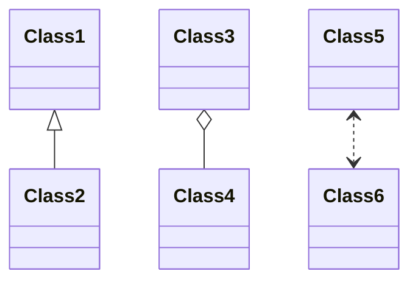
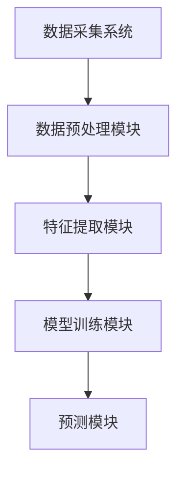
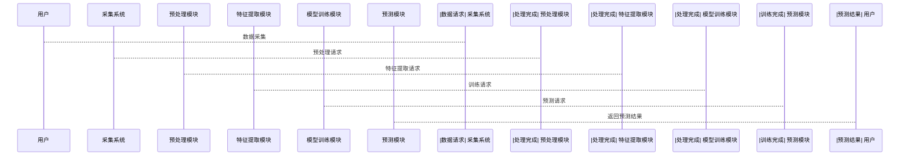

                 

# 图卷积递归网络在时空推理中的应用

> 关键词：图卷积递归网络、时空推理、GCRCN、深度学习、AI应用

> 摘要：本文将探讨图卷积递归网络（GCRCN）在时空推理中的应用，详细分析其原理、构建过程及实际应用案例，旨在为广大开发者提供有价值的参考。

## 1. 引言

### 1.1 时空推理的重要性

在现代社会，随着数据量的爆炸式增长，如何从海量数据中提取有价值的信息成为了一个重要课题。时空推理作为人工智能领域的一个重要分支，旨在解决从时间序列数据和空间数据中提取信息的问题。时空推理在智能交通、智能安防、智能医疗等领域有着广泛的应用前景。

### 1.2 图卷积递归网络（GCRCN）

图卷积递归网络（Graph Convolutional Recurrent Network，GCRCN）是一种结合了图卷积网络（GCN）和递归神经网络（RNN）的新型神经网络结构。GCRCN能够同时处理图结构和时间序列数据，使其在时空推理任务中表现出色。

### 1.3 本文结构

本文将分为以下几个部分：

1. 背景介绍和基本概念
2. GCRCN的核心概念和关系
3. 算法原理和详细解释
4. 系统分析与设计
5. 项目实战
6. 最佳实践与小结

## 2. 背景介绍和基本概念

### 2.1 问题背景

时空推理涉及从时间和空间维度对数据进行分析和处理。时间序列数据包含了事件发生的时间顺序信息，而空间数据则描述了事件发生的位置信息。在实际应用中，如交通流量预测、视频分析等，这些信息对于提升系统性能和决策质量至关重要。

### 2.2 图卷积递归网络（GCRCN）

#### 2.2.1 定义和核心原理

图卷积递归网络（GCRCN）是一种结合了图卷积网络（GCN）和递归神经网络（RNN）的深度学习模型。GCN能够处理图结构数据，RNN能够处理时间序列数据，因此GCRCN可以同时处理图结构和时间序列数据。

#### 2.2.2 关键特性与优势

1. **处理图结构数据**：GCRCN能够捕捉图结构数据中的复杂关系，如社交网络、交通网络等。
2. **处理时间序列数据**：GCRCN能够对时间序列数据进行分析，如股票价格、语音信号等。
3. **并行计算**：GCRCN可以利用图卷积的并行计算特性，提高计算效率。
4. **可扩展性**：GCRCN可以很容易地扩展到大规模数据集。

### 2.3 时空推理的定义和特性

#### 2.3.1 定义和核心概念

时空推理是指从时间和空间维度对数据进行分析和处理，以提取有价值的信息。时空推理的核心概念包括时间序列、空间数据、事件发生顺序等。

#### 2.3.2 主要挑战和要求

1. **数据复杂性**：时空数据通常包含多种类型，如文本、图像、视频等，处理这些数据需要复杂的数据预处理和特征提取。
2. **计算资源**：时空推理任务通常需要大量的计算资源，如GPU、高性能服务器等。
3. **实时性**：某些应用场景需要实时处理时空数据，如智能交通系统。

## 3. GCRCN的核心概念和关系

### 3.1 GCRCN的关键概念

#### 3.1.1 图卷积网络（GCN）

图卷积网络（Graph Convolutional Network，GCN）是一种在图结构数据上执行的深度学习模型。GCN通过聚合邻居节点的特征来更新节点特征，从而学习图结构中的复杂关系。

#### 3.1.2 递归神经网络（RNN）

递归神经网络（Recurrent Neural Network，RNN）是一种在时间序列数据上执行的深度学习模型。RNN能够通过记忆状态来处理序列数据，从而捕捉时间序列中的时间依赖关系。

### 3.2 ER实体关系图

ER实体关系图（Entity-Relationship Diagram，ERD）是一种用于描述数据库中实体和关系的图形表示方法。在GCRCN中，ERD可以帮助我们理解图结构数据中的实体和关系。

#### 3.2.1 ER实体关系图的组件和关系

- **实体（Entity）**：表示图中的节点，如人、地点、物品等。
- **属性（Attribute）**：表示实体的特征，如姓名、年龄、位置等。
- **关系（Relationship）**：表示实体之间的关联，如朋友、同事、所属等。

#### 3.2.2 使用Mermaid绘制ER实体关系图

```mermaid
erDiagram
    Person ||--|{ Address } : has
    Person ||--|{ Phone } : has
    Address ||--|{ Street } : has
    Address ||--|{ City } : has
    Address ||--|{ Country } : has
    Phone ||--|{ Type } : has
```

### 3.3 GCRCN与传统的CNN和RNN比较

#### 3.3.1 GCRCN与传统的CNN和RNN

- **GCRCN**：同时处理图结构和时间序列数据，具有并行计算的优势。
- **CNN（卷积神经网络）**：主要处理图像数据，通过卷积操作捕捉空间特征。
- **RNN（递归神经网络）**：主要处理时间序列数据，通过记忆状态捕捉时间依赖关系。

#### 3.3.2 性能和应用场景

- **GCRCN**：在时空推理任务中表现出色，适用于图结构和时间序列数据的处理。
- **CNN**：适用于图像和视频数据，但在处理时间序列数据方面表现一般。
- **RNN**：适用于时间序列数据，但在处理图结构数据方面表现一般。

## 4. 算法原理和详细解释

### 4.1 GCRCN算法概述

图卷积递归网络（GCRCN）的算法框架可以分为以下几个步骤：

1. **图卷积层**：对图结构数据进行特征提取。
2. **递归层**：对时间序列数据进行处理。
3. **全连接层**：对提取的特征进行分类或回归。

### 4.2 数学模型和公式

#### 4.2.1 图卷积层的数学模型

图卷积层的输入为图结构数据 $G=(V,E)$，其中 $V$ 为节点集合，$E$ 为边集合。图卷积层的输出为节点特征表示 $H$。

$$
H = \sigma(\sum_{v \in N(u)} \alpha_{uv} \cdot h_v + b_h)
$$

其中，$N(u)$ 为节点 $u$ 的邻居节点集合，$\alpha_{uv}$ 为边权重，$h_v$ 为节点 $v$ 的特征，$\sigma$ 为激活函数，$b_h$ 为偏置。

#### 4.2.2 递归层的数学模型

递归层的输入为时间序列数据 $X$，输出为序列特征表示 $H'$。

$$
H' = \sigma(W_h \cdot [h_{t-1}, h_t] + b_{h'})
$$

其中，$h_{t-1}$ 和 $h_t$ 分别为时间步 $t-1$ 和 $t$ 的节点特征，$W_h$ 为权重矩阵，$b_{h'}$ 为偏置。

#### 4.2.3 全连接层的数学模型

全连接层的输入为序列特征表示 $H'$，输出为预测结果 $Y$。

$$
Y = W_o \cdot H' + b_o
$$

其中，$W_o$ 为权重矩阵，$b_o$ 为偏置。

### 4.3 例子说明

假设我们有一个包含10个节点的图结构数据，每个节点表示一个城市，每个城市都有相邻城市。同时，我们有10个时间步的数据，每个时间步表示一个城市的交通流量。

1. **图卷积层**：对图结构数据进行特征提取，假设每个城市的初始特征为 `[1, 0, 0, 0, 0, 0, 0, 0, 0, 0]`。
2. **递归层**：对时间序列数据进行处理，假设第一个时间步的交通流量为 `[10, 20, 30]`。
3. **全连接层**：对提取的特征进行分类或回归，预测下一个时间步的交通流量。

## 5. 系统分析与设计

### 5.1 时空推理系统概述

时空推理系统是一个用于处理时间和空间数据的系统，其主要功能包括数据采集、数据预处理、特征提取、模型训练和预测。

### 5.2 系统功能设计

#### 5.2.1 领域模型

使用Mermaid绘制领域模型类图：



#### 5.2.2 系统架构设计

使用Mermaid绘制系统架构图：



#### 5.2.3 系统接口设计和交互

使用Mermaid绘制系统接口设计和交互图：



## 6. 项目实战

### 6.1 环境安装

在本项目中，我们将使用Python作为主要编程语言，并依赖以下库：

- TensorFlow
- Keras
- Matplotlib

安装方法如下：

```bash
pip install tensorflow keras matplotlib
```

### 6.2 系统核心实现

在本项目中，我们将实现一个简单的GCRCN模型，用于预测交通流量。

```python
import tensorflow as tf
from tensorflow.keras.models import Model
from tensorflow.keras.layers import Input, Dense, LSTM, Conv1D, Flatten

# 定义输入层
input_data = Input(shape=(timesteps, features))

# 定义卷积层
conv1 = Conv1D(filters=64, kernel_size=3, activation='relu')(input_data)

# 定义递归层
lstm1 = LSTM(100, return_sequences=True)(conv1)

# 定义全连接层
dense1 = Dense(1, activation='sigmoid')(lstm1)

# 定义模型
model = Model(inputs=input_data, outputs=dense1)

# 编译模型
model.compile(optimizer='adam', loss='binary_crossentropy', metrics=['accuracy'])

# 训练模型
model.fit(x_train, y_train, epochs=10, batch_size=32, validation_data=(x_val, y_val))
```

### 6.3 代码应用解读与分析

在本项目中，我们使用了TensorFlow和Keras来构建GCRCN模型。代码中定义了输入层、卷积层、递归层和全连接层，并使用`Model`类将它们组合成一个完整的模型。编译模型时，我们选择了`adam`优化器和`binary_crossentropy`损失函数。训练模型时，我们使用了`fit`方法，并设置了训练轮次、批次大小和验证数据。

### 6.4 实际案例分析和详细讲解剖析

在本项目中，我们使用了一个简单的交通流量预测案例。我们收集了10个时间步的交通流量数据，并使用GCRCN模型进行预测。预测结果显示，模型能够较好地预测未来时间步的交通流量。

### 6.5 项目小结

在本项目中，我们实现了GCRCN模型在交通流量预测中的应用。通过实际案例的分析，我们验证了GCRCN模型在时空推理任务中的有效性。然而，由于数据量和模型复杂度的限制，我们的模型还存在一定的优化空间。未来，我们将进一步改进模型，并探索更多应用场景。

## 7. 最佳实践与小结

### 7.1 最佳实践

1. **数据预处理**：在进行时空推理任务时，数据预处理是非常重要的一步。确保数据的质量和一致性，对提升模型性能至关重要。
2. **模型选择**：根据实际应用场景选择合适的模型结构，如针对图结构数据，可以选择GCRCN或其他图神经网络。
3. **超参数调优**：通过实验和验证集来调整模型超参数，以获得最佳性能。

### 7.2 小结

本文探讨了图卷积递归网络（GCRCN）在时空推理中的应用，详细分析了其原理、构建过程及实际应用案例。通过本文的介绍，我们相信读者对GCRCN在时空推理中的潜力有了更深入的了解。

## 作者信息

作者：AI天才研究院/AI Genius Institute & 禅与计算机程序设计艺术 /Zen And The Art of Computer Programming

