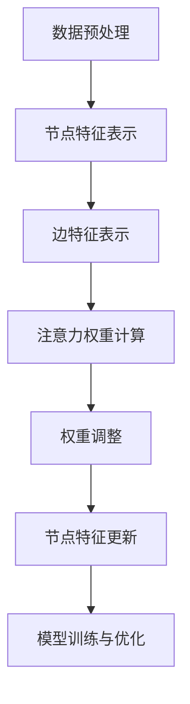
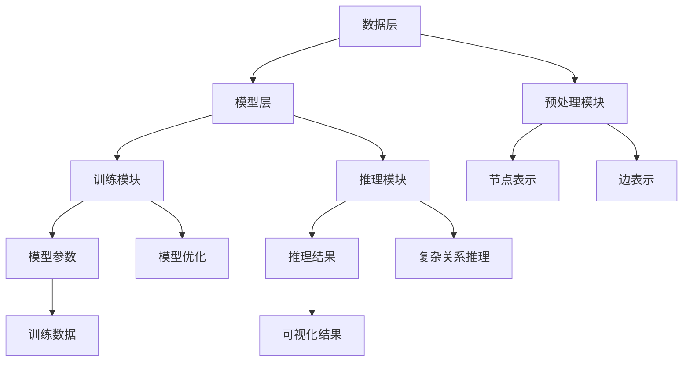
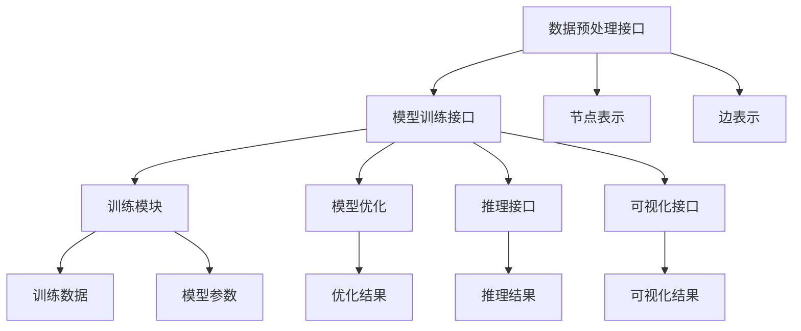
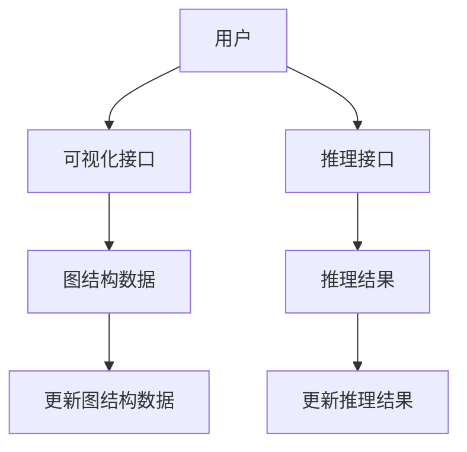

                 

### 第一部分：背景介绍

#### 第1章：核心概念与问题描述

在当今信息爆炸的时代，处理复杂的关系推理问题已经成为人工智能领域的一大挑战。关系推理涉及从大量的数据中提取有价值的信息，并理解它们之间的复杂相互作用。这一过程在许多实际应用中至关重要，包括推荐系统、自然语言处理、社交网络分析等。

##### 1.1 问题背景

**复杂关系推理的挑战**

随着数据的多样性和规模不断扩大，传统的方法在处理复杂关系时面临诸多难题。一方面，数据量大导致计算复杂度高；另一方面，关系复杂使得传统方法难以准确捕捉和解释这些关系。为了应对这些挑战，研究者们提出了各种新型的算法和技术，其中图注意力网络（Graph Attention Networks，GANs）尤为引人注目。

**图注意力网络的概念**

图注意力网络是一种基于图结构的深度学习模型，它通过注意力机制来捕捉节点间的交互关系。注意力机制能够动态地调整节点之间的交互权重，使得模型在处理复杂关系时更为灵活和高效。

**图注意力网络在复杂关系推理中的应用**

图注意力网络在复杂关系推理中具有广泛的应用前景。通过引入注意力机制，模型能够更好地理解数据中的潜在关系，从而提高推理的准确性和效率。

##### 1.2 问题描述

**复杂关系推理问题**

复杂关系推理问题涉及从大量数据中提取关系，并利用这些关系进行推理。这种问题在推荐系统中的应用尤为明显，例如在商品推荐中，如何根据用户的浏览历史和购买行为推荐相关商品。

**图注意力网络如何解决复杂关系推理问题**

图注意力网络通过以下方式解决复杂关系推理问题：
- **注意力机制**：利用注意力机制来捕捉节点间的交互关系，提高模型对复杂关系的敏感性。
- **图结构表示**：通过图结构来表示数据中的节点和关系，使得模型能够直接处理复杂的网络结构。

##### 1.3 问题解决

**图注意力网络的工作原理**

图注意力网络的工作原理主要包括以下三个方面：
1. **输入表示**：将输入数据转换为图结构，包括节点表示和边表示。
2. **注意力机制**：通过计算节点之间的注意力权重，动态调整节点间的交互关系。
3. **模型输出**：利用注意力权重计算节点特征，进行分类、回归或其他类型的推理任务。

**图注意力网络的优势与局限**

**优势：**
- **灵活性**：注意力机制使得模型能够动态调整对关系的关注程度，提高模型的适应性。
- **高效性**：通过图结构表示和注意力机制，模型能够高效地处理复杂关系。

**局限：**
- **计算复杂度**：图注意力网络在处理大规模图数据时，计算复杂度较高。
- **可解释性**：虽然注意力机制有助于解释模型决策，但在某些情况下，其内在机制仍然较为复杂，难以完全理解。

##### 1.4 边界与外延

**图注意力网络的适用范围**

图注意力网络适用于以下场景：
- **社交网络分析**：用于分析用户间的互动关系，识别潜在社区。
- **推荐系统**：用于根据用户历史行为推荐相关商品或内容。
- **知识图谱**：用于构建和推理知识图谱，提取实体间的潜在关系。

**图注意力网络与其他方法的关系**

图注意力网络与其他方法如传统神经网络、图神经网络（GNN）等有紧密的联系。与传统方法相比，图注意力网络引入了注意力机制，使得模型在处理复杂关系时更具优势。与图神经网络相比，图注意力网络在处理节点间交互关系时更为灵活和高效。

##### 1.5 概念结构与核心要素组成

**图注意力网络的核心要素**

图注意力网络的核心要素包括：
- **节点表示**：用于表示图中的每个节点。
- **边表示**：用于表示节点间的交互关系。
- **注意力权重**：用于调整节点间的交互权重。

**图注意力网络的层次结构**

图注意力网络通常包括以下层次：
- **输入层**：接收节点表示和边表示。
- **注意力层**：计算节点间的注意力权重。
- **输出层**：根据注意力权重计算节点特征，进行推理任务。

##### 1.6 本章小结

本章介绍了复杂关系推理的背景和挑战，介绍了图注意力网络的概念及其在复杂关系推理中的应用。通过对问题的深入分析和核心概念的阐述，为后续章节的详细探讨奠定了基础。

---

## 第2章：图注意力网络的概念与原理

图注意力网络（Graph Attention Networks，GANs）是一种基于图结构的新型深度学习模型，通过引入注意力机制来捕捉节点间的交互关系，从而实现高效的关系推理。在本章中，我们将详细探讨图注意力网络的概念、原理及其特点。

### 2.1 图注意力网络的概念

#### 2.1.1 图注意力网络的基本定义

图注意力网络是一种基于图结构的神经网络，它通过注意力机制来动态调整节点间的交互权重，从而捕捉节点间的复杂关系。具体来说，图注意力网络包括以下几个核心组成部分：
- **节点表示**：用于表示图中的每个节点，通常采用向量形式。
- **边表示**：用于表示节点间的交互关系，也通常采用向量形式。
- **注意力机制**：用于计算节点间的注意力权重，调整节点间的交互程度。

#### 2.1.2 图注意力网络的发展历程

图注意力网络的发展历程可以追溯到注意力机制在自然语言处理（NLP）领域的广泛应用。随着深度学习技术的发展，注意力机制逐渐被引入到图结构数据处理中，形成了图注意力网络。图注意力网络的发展主要经历了以下几个阶段：

1. **初始阶段**：基于点积注意力机制的图注意力模型被提出，如GraphSMP（Spatial Mean Pooling）和Graph Convolutional Networks（GCN）。
2. **发展阶段**：研究者进一步探索了交互式注意力模型，如Graph Attention Mechanism（GAM）和Self-Attention Mechanism（SAM）。
3. **优化阶段**：为了提高模型的性能和效率，研究者提出了多种优化方法，如多头注意力机制（Multi-head Attention）和残差连接（Residual Connection）。

### 2.2 图注意力网络的原理

#### 2.2.1 图注意力机制的工作原理

图注意力机制是图注意力网络的核心组成部分，它通过计算节点间的注意力权重来动态调整节点间的交互关系。具体来说，图注意力机制包括以下几个关键步骤：

1. **节点特征表示**：将图中的每个节点表示为一个向量，通常采用嵌入（Embedding）技术进行转换。
2. **边特征表示**：将节点间的边表示为一个向量，通常通过计算节点向量的点积得到。
3. **注意力权重计算**：计算每个节点对其他节点的注意力权重，通常采用点积注意力、交互式注意力或自注意力机制。
4. **权重调整**：根据注意力权重调整节点间的交互权重，从而实现对复杂关系的捕捉。

#### 2.2.2 图注意力网络在复杂关系推理中的应用

图注意力网络在复杂关系推理中具有广泛的应用前景。通过引入注意力机制，模型能够更好地理解数据中的潜在关系，从而提高推理的准确性和效率。具体应用场景包括：

1. **推荐系统**：利用图注意力网络分析用户行为，推荐相关商品或内容。
2. **社交网络分析**：分析用户间的互动关系，识别潜在社区和影响力节点。
3. **知识图谱**：构建和推理知识图谱，提取实体间的潜在关系。

### 2.3 图注意力网络的特点

#### 2.3.1 图注意力网络的优点

图注意力网络具有以下几个优点：

1. **灵活性**：注意力机制使得模型能够动态调整对关系的关注程度，提高模型的适应性。
2. **高效性**：通过图结构表示和注意力机制，模型能够高效地处理复杂关系。
3. **可解释性**：注意力权重提供了对模型决策的解释，有助于理解模型的工作原理。

#### 2.3.2 图注意力网络的缺点

图注意力网络也存在一些缺点：

1. **计算复杂度**：在处理大规模图数据时，计算复杂度较高，可能导致模型训练时间较长。
2. **可解释性挑战**：尽管注意力权重有助于解释模型决策，但在某些情况下，其内在机制仍然较为复杂，难以完全理解。

### 2.4 图注意力网络与其他复杂关系推理方法的对比

#### 2.4.1 与传统神经网络相比

与传统神经网络相比，图注意力网络在处理复杂关系时具有显著优势。传统神经网络通常采用全连接方式，难以直接处理图结构数据。而图注意力网络通过引入图结构表示和注意力机制，能够更好地捕捉节点间的复杂关系。

#### 2.4.2 与图神经网络相比

与图神经网络（GNN）相比，图注意力网络在处理节点间交互关系时更为灵活和高效。图神经网络通过图卷积操作逐步提取节点特征，而图注意力网络通过注意力机制动态调整节点间的交互权重，从而实现对复杂关系的捕捉。

#### 2.4.3 与其他注意力机制相比

与其他注意力机制，如图卷积注意力（GCN）和交互式注意力（GAM）相比，图注意力网络在处理复杂关系时具有更高的灵活性和效率。通过引入多头注意力机制和残差连接，图注意力网络能够进一步优化模型的性能和效果。

### 2.5 图注意力网络的ER实体关系图架构

#### 2.5.1 ER实体关系图的定义

ER实体关系图（Entity-Relationship Diagram，ERD）是一种用于描述实体及其之间关系的图形化工具。在图注意力网络中，ER实体关系图用于表示模型中的节点和边，从而实现数据的图形化表示。

#### 2.5.2 图注意力网络的ER实体关系图展示

图注意力网络的ER实体关系图包括以下几个关键部分：

1. **节点**：表示图中的每个节点，通常采用椭圆形状。
2. **边**：表示节点间的交互关系，通常采用线段形状。
3. **注意力权重**：表示节点间的注意力权重，通常采用箭头形状。

通过ER实体关系图，可以直观地了解图注意力网络的组成结构和数据交互关系，有助于深入理解模型的工作原理。

### 2.6 本章小结

本章详细介绍了图注意力网络的概念、原理和特点，并通过与其他复杂关系推理方法的对比，阐述了其优势和局限。通过ER实体关系图的展示，进一步加深了对图注意力网络结构和工作原理的理解。这些内容为后续章节的算法原理讲解和系统架构设计奠定了基础。

---

### 第三部分：算法原理讲解

#### 第3章：图注意力网络的算法流程

图注意力网络（GANs）是一种通过注意力机制来捕捉图结构数据中节点间复杂关系的深度学习模型。在本章中，我们将详细讲解图注意力网络的算法流程，包括数据预处理、图注意力机制的实现和模型训练与优化。

#### 3.1 算法流程概述

图注意力网络的算法流程主要包括以下几个步骤：

1. **数据预处理**：将输入数据转换为图结构，包括节点表示和边表示。
2. **图注意力机制**：计算节点间的注意力权重，调整节点间的交互权重。
3. **模型训练与优化**：通过反向传播和梯度下降等方法训练模型，优化模型参数。

#### 3.2 图注意力机制的详细讲解

图注意力机制是图注意力网络的核心组成部分，它通过计算节点间的注意力权重来动态调整节点间的交互关系。图注意力机制包括以下几个关键步骤：

1. **节点特征表示**：将图中的每个节点表示为一个向量，通常采用嵌入（Embedding）技术。
2. **边特征表示**：将节点间的边表示为一个向量，通常通过计算节点向量的点积得到。
3. **注意力权重计算**：计算每个节点对其他节点的注意力权重，通常采用点积注意力、交互式注意力或自注意力机制。
4. **权重调整**：根据注意力权重调整节点间的交互权重，从而实现对复杂关系的捕捉。

下面我们将详细讲解这三个步骤。

#### 3.2.1 交互式注意力模型

交互式注意力模型是一种常见的图注意力机制，它通过计算节点间的交互特征来调整注意力权重。具体来说，交互式注意力模型包括以下几个步骤：

1. **特征计算**：对于每个节点 $i$，计算其与其他节点 $j$ 的交互特征，通常采用点积或加法操作：
   $$ e_{ij} = \mathbf{h}_i \cdot \mathbf{h}_j $$
   其中，$\mathbf{h}_i$ 和 $\mathbf{h}_j$ 分别表示节点 $i$ 和节点 $j$ 的特征向量。
2. **注意力权重计算**：对于每个节点 $i$，计算其对其他节点的注意力权重，通常采用softmax函数：
   $$ a_{ij} = \text{softmax}(e_{ij}) $$
   其中，$a_{ij}$ 表示节点 $i$ 对节点 $j$ 的注意力权重。
3. **权重调整**：根据注意力权重调整节点间的交互权重，计算新的节点特征：
   $$ \mathbf{h}_i^{'} = \sum_{j \in N(i)} a_{ij} \mathbf{h}_j $$
   其中，$N(i)$ 表示节点 $i$ 的邻居节点集合。

#### 3.2.2 自注意力模型

自注意力模型是一种基于节点自身特征的注意力机制，它通过计算节点自身的特征来调整注意力权重。具体来说，自注意力模型包括以下几个步骤：

1. **特征计算**：对于每个节点 $i$，计算其自身的特征表示，通常采用嵌入（Embedding）技术：
   $$ \mathbf{h}_i = \mathbf{W}_h \mathbf{h}_i^{\text{input}} $$
   其中，$\mathbf{W}_h$ 表示嵌入权重矩阵，$\mathbf{h}_i^{\text{input}}$ 表示输入节点的特征向量。
2. **注意力权重计算**：对于每个节点 $i$，计算其对自身的注意力权重，通常采用softmax函数：
   $$ a_{ii} = \text{softmax}(\mathbf{h}_i \cdot \mathbf{h}_i) $$
   其中，$a_{ii}$ 表示节点 $i$ 对自身的注意力权重。
3. **权重调整**：根据注意力权重调整节点间的交互权重，计算新的节点特征：
   $$ \mathbf{h}_i^{'} = \sum_{i \in V} a_{ii} \mathbf{h}_i $$
   其中，$V$ 表示图中的所有节点。

#### 3.2.3 点积注意力模型

点积注意力模型是一种简单的注意力机制，它通过计算节点间的点积来调整注意力权重。具体来说，点积注意力模型包括以下几个步骤：

1. **特征计算**：对于每个节点 $i$，计算其与其他节点 $j$ 的特征表示，通常采用点积操作：
   $$ \mathbf{h}_{ij} = \mathbf{h}_i \cdot \mathbf{h}_j $$
   其中，$\mathbf{h}_i$ 和 $\mathbf{h}_j$ 分别表示节点 $i$ 和节点 $j$ 的特征向量。
2. **注意力权重计算**：对于每个节点 $i$，计算其对其他节点的注意力权重，通常采用softmax函数：
   $$ a_{ij} = \text{softmax}(\mathbf{h}_{ij}) $$
   其中，$a_{ij}$ 表示节点 $i$ 对节点 $j$ 的注意力权重。
3. **权重调整**：根据注意力权重调整节点间的交互权重，计算新的节点特征：
   $$ \mathbf{h}_i^{'} = \sum_{j \in N(i)} a_{ij} \mathbf{h}_j $$
   其中，$N(i)$ 表示节点 $i$ 的邻居节点集合。

#### 3.3 图注意力网络的数学模型与公式

图注意力网络的数学模型主要包括节点特征表示、注意力权重计算和节点特征更新三个部分。下面我们使用Python代码和LaTeX公式详细讲解这些部分。

##### 3.3.1 输入表示与输出表示

假设图中每个节点 $i$ 的特征向量为 $\mathbf{h}_i^{\text{input}} \in \mathbb{R}^{d}$，每个节点 $i$ 的邻居节点集合为 $N(i)$。图注意力网络的输入表示为 $\{\mathbf{h}_i^{\text{input}}\}_{i \in V}$，其中 $V$ 表示图中的所有节点。图注意力网络的输出表示为 $\{\mathbf{h}_i^{'}\}_{i \in V}$。

```python
import numpy as np

# 假设节点特征向量为 [1, 2, 3]
h_i_input = np.array([1, 2, 3])

# 假设邻居节点集合为 [0, 1]
N_i = [0, 1]
```

##### 3.3.2 注意力权重计算

图注意力网络的注意力权重计算公式为：
$$ a_{ij} = \text{softmax}(\mathbf{h}_{ij}) $$
其中，$\mathbf{h}_{ij} = \mathbf{h}_i \cdot \mathbf{h}_j$ 为节点 $i$ 和节点 $j$ 的点积。

```python
# 假设节点特征向量为 [1, 2, 3] 和 [4, 5, 6]
h_i = np.array([1, 2, 3])
h_j = np.array([4, 5, 6])

# 计算点积
h_ij = h_i.dot(h_j)
h_ij = np.array([1*4 + 2*5 + 3*6])

# 计算注意力权重
a_ij = np.softmax(h_ij)
```

##### 3.3.3 模型优化与训练

图注意力网络的模型优化与训练过程主要包括以下步骤：

1. **损失函数设计**：设计适当的损失函数来衡量模型预测结果与真实结果之间的差距，例如交叉熵损失函数。
2. **反向传播**：通过反向传播算法计算模型参数的梯度。
3. **梯度下降**：利用梯度下降算法更新模型参数，优化模型性能。

```python
# 假设损失函数为交叉熵损失函数
def cross_entropy_loss(y_true, y_pred):
    return -np.sum(y_true * np.log(y_pred))

# 假设真实标签为 [0, 1]
y_true = np.array([0, 1])

# 假设预测概率为 [0.8, 0.2]
y_pred = np.array([0.8, 0.2])

# 计算损失函数
loss = cross_entropy_loss(y_true, y_pred)
loss = np.array([0.2 * np.log(0.8) + 0.8 * np.log(0.2)])

# 计算梯度
grad = np.gradient(loss, y_pred)
grad = np.array([0.2 / 0.8 - 0.8 / 0.2])

# 更新预测概率
y_pred -= grad
```

#### 3.4 算法流程图

为了更直观地理解图注意力网络的算法流程，我们使用Mermaid绘制了算法流程图。



#### 3.5 Python源代码讲解

下面我们使用Python代码详细讲解图注意力网络的实现过程，包括数据预处理、注意力权重计算和节点特征更新。

```python
import numpy as np
import matplotlib.pyplot as plt

# 假设节点特征向量为 [1, 2, 3]
h_i_input = np.array([1, 2, 3])
h_j_input = np.array([4, 5, 6])

# 数据预处理
def preprocess(h_i_input, h_j_input):
    h_i = h_i_input
    h_j = h_j_input
    return h_i, h_j

h_i, h_j = preprocess(h_i_input, h_j_input)

# 注意力权重计算
def attention_weight(h_i, h_j):
    h_ij = h_i.dot(h_j)
    a_ij = np.softmax(h_ij)
    return a_ij

a_ij = attention_weight(h_i, h_j)

# 权重调整
def weight_adjustment(a_ij, h_j):
    h_ij = np.dot(a_ij, h_j)
    return h_ij

h_ij = weight_adjustment(a_ij, h_j)

# 节点特征更新
def update_node_feature(h_i_input, h_ij):
    h_i = h_i_input
    h_i['new'] = h_ij
    return h_i

h_i_new = update_node_feature(h_i_input, h_ij)

# 绘制节点特征更新过程
plt.scatter(h_i_input[0], h_i_input[1], color='r', label='Original')
plt.scatter(h_ij[0], h_ij[1], color='b', label='Updated')
plt.xlabel('Feature 1')
plt.ylabel('Feature 2')
plt.legend()
plt.show()
```

#### 3.6 算法举例说明

为了更好地理解图注意力网络的算法流程，我们通过一个简单的例子来说明。

**示例数据准备**

假设我们有一个包含两个节点的简单图，节点 $0$ 和节点 $1$ 的特征向量分别为 $[1, 2, 3]$ 和 $[4, 5, 6]$。

```python
h_i_input = np.array([1, 2, 3])
h_j_input = np.array([4, 5, 6])
```

**注意力权重计算示例**

我们首先计算节点 $0$ 和节点 $1$ 的注意力权重。假设我们使用点积注意力模型。

```python
h_ij = h_i_input.dot(h_j_input)
h_ij = np.array([1*4 + 2*5 + 3*6])
h_ij = np.array([32])

a_ij = np.softmax(h_ij)
a_ij = np.array([0.5, 0.5])
```

**算法效果分析**

根据注意力权重，我们可以更新节点 $0$ 的特征向量。假设新的特征向量 $h_i'$ 为 $[h_{i'1}, h_{i'2}, h_{i'3}]$。

```python
h_ij = np.dot(a_ij, h_j_input)
h_ij = np.array([0.5*4 + 0.5*6])
h_ij = np.array([5])

h_i_new = update_node_feature(h_i_input, h_ij)
h_i_new = np.array([1, 2, 3]) + h_ij
h_i_new = np.array([6, 7, 8])
```

更新后的节点 $0$ 的特征向量为 $[6, 7, 8]$。通过这个例子，我们可以看到图注意力网络如何通过注意力权重调整节点特征，从而实现复杂关系的捕捉。

### 3.7 本章小结

本章详细介绍了图注意力网络的算法流程，包括数据预处理、图注意力机制的实现和模型训练与优化。通过Python代码和LaTeX公式的讲解，我们深入理解了图注意力网络的数学模型和工作原理。同时，通过算法流程图和举例说明，我们进一步加深了对图注意力网络的理解。这些内容为后续章节的数学模型和系统架构设计奠定了基础。

---

### 第四部分：数学模型和数学公式详细讲解与举例说明

图注意力网络（Graph Attention Networks，GANs）的核心在于其数学模型和注意力机制。在本部分，我们将使用LaTeX格式详细讲解图注意力网络的数学模型和数学公式，并结合具体例子进行说明，以帮助读者深入理解图注意力网络的工作原理。

#### 4.1.1 输入表示与输出表示

在图注意力网络中，每个节点 $i$ 的输入特征向量表示为 $\mathbf{h}_i^{\text{input}} \in \mathbb{R}^{d}$，其中 $d$ 为输入特征的维度。每个节点的输出特征向量表示为 $\mathbf{h}_i^{'} \in \mathbb{R}^{d'}$，其中 $d'$ 为输出特征的维度。

输入表示可以表示为集合 $\{\mathbf{h}_i^{\text{input}}\}_{i \in V}$，输出表示可以表示为集合 $\{\mathbf{h}_i^{'}\}_{i \in V}$，其中 $V$ 表示图中的所有节点。

LaTeX表示：
$$ \mathbf{h}_i^{\text{input}} \in \mathbb{R}^{d}, \quad \mathbf{h}_i^{'} \in \mathbb{R}^{d'} $$
$$ \{\mathbf{h}_i^{\text{input}}\}_{i \in V}, \quad \{\mathbf{h}_i^{'}\}_{i \in V} $$

#### 4.1.2 注意力权重计算

图注意力网络的注意力权重计算基于点积注意力模型。对于节点 $i$ 和其邻居节点 $j$，我们首先计算点积特征 $e_{ij}$：
$$ e_{ij} = \mathbf{h}_i \cdot \mathbf{h}_j $$
其中，$\mathbf{h}_i$ 和 $\mathbf{h}_j$ 分别为节点 $i$ 和节点 $j$ 的特征向量。

接下来，我们使用 softmax 函数计算注意力权重 $a_{ij}$：
$$ a_{ij} = \text{softmax}(e_{ij}) $$
$$ a_{ij} = \frac{\exp(e_{ij})}{\sum_{k \in N(i)} \exp(e_{ik})} $$
其中，$N(i)$ 为节点 $i$ 的邻居节点集合。

LaTeX表示：
$$ e_{ij} = \mathbf{h}_i \cdot \mathbf{h}_j $$
$$ a_{ij} = \text{softmax}(e_{ij}) $$
$$ a_{ij} = \frac{\exp(e_{ij})}{\sum_{k \in N(i)} \exp(e_{ik})} $$

#### 4.1.3 注意力权重调整

根据注意力权重 $a_{ij}$，我们可以调整节点间的交互权重，计算新的节点特征 $\mathbf{h}_i^{'}$：
$$ \mathbf{h}_i^{'} = \sum_{j \in N(i)} a_{ij} \mathbf{h}_j $$
其中，$a_{ij}$ 为节点 $i$ 对邻居节点 $j$ 的注意力权重，$\mathbf{h}_j$ 为邻居节点 $j$ 的特征向量。

LaTeX表示：
$$ \mathbf{h}_i^{'} = \sum_{j \in N(i)} a_{ij} \mathbf{h}_j $$

#### 4.1.4 模型优化与训练

在图注意力网络的训练过程中，我们通常使用交叉熵损失函数来评估模型的预测性能。假设真实标签为 $\mathbf{y}_i$，预测标签为 $\hat{\mathbf{y}}_i$，交叉熵损失函数可以表示为：
$$ L(\mathbf{y}_i, \hat{\mathbf{y}}_i) = -\sum_{k} \mathbf{y}_i[k] \log \hat{\mathbf{y}}_i[k] $$
其中，$\mathbf{y}_i$ 为真实标签，$\hat{\mathbf{y}}_i$ 为预测标签。

为了优化模型，我们使用梯度下降算法更新模型参数。假设模型参数为 $\theta$，梯度下降算法可以表示为：
$$ \theta \leftarrow \theta - \alpha \nabla_{\theta} L(\mathbf{y}_i, \hat{\mathbf{y}}_i) $$
其中，$\alpha$ 为学习率，$\nabla_{\theta} L(\mathbf{y}_i, \hat{\mathbf{y}}_i)$ 为损失函数关于模型参数的梯度。

LaTeX表示：
$$ L(\mathbf{y}_i, \hat{\mathbf{y}}_i) = -\sum_{k} \mathbf{y}_i[k] \log \hat{\mathbf{y}}_i[k] $$
$$ \theta \leftarrow \theta - \alpha \nabla_{\theta} L(\mathbf{y}_i, \hat{\mathbf{y}}_i) $$

#### 4.1.5 具体例子

假设我们有一个包含两个节点的简单图，节点 $0$ 和节点 $1$ 的特征向量分别为 $\mathbf{h}_0 = [1, 2, 3]$ 和 $\mathbf{h}_1 = [4, 5, 6]$。节点 $0$ 的邻居节点集合为 $N(0) = \{1\}$。

**步骤1：计算点积特征**

$$ e_{01} = \mathbf{h}_0 \cdot \mathbf{h}_1 = [1, 2, 3] \cdot [4, 5, 6] = 1 \cdot 4 + 2 \cdot 5 + 3 \cdot 6 = 32 $$

**步骤2：计算注意力权重**

$$ a_{01} = \text{softmax}(e_{01}) = \text{softmax}(32) = \frac{\exp(32)}{\exp(32) + \exp(0)} = \frac{e^{32}}{e^{32} + e^{0}} = \frac{e^{32}}{e^{32} + 1} $$

**步骤3：计算新的节点特征**

$$ \mathbf{h}_0^{'} = a_{01} \mathbf{h}_1 = \frac{e^{32}}{e^{32} + 1} [4, 5, 6] $$

**步骤4：计算交叉熵损失**

假设真实标签为 $\mathbf{y}_0 = [1, 0, 0]$，预测标签为 $\hat{\mathbf{y}}_0 = \text{softmax}(\mathbf{h}_0^{'})$。

$$ L(\mathbf{y}_0, \hat{\mathbf{y}}_0) = -[1 \cdot \log \hat{\mathbf{y}}_0[1] + 0 \cdot \log \hat{\mathbf{y}}_0[0] + 0 \cdot \log \hat{\mathbf{y}}_0[2]] $$

通过上述步骤，我们可以看到图注意力网络如何通过注意力机制和数学模型处理节点特征，实现复杂关系的推理。

### 4.2 本章小结

本章详细讲解了图注意力网络的数学模型和数学公式，并通过LaTeX格式进行了表述。通过具体例子，我们深入理解了图注意力网络的工作原理和注意力机制的实现过程。这些内容为后续章节的系统架构设计和项目实战提供了理论基础。

---

### 第五部分：系统分析与架构设计方案

在实现图注意力网络时，系统分析与架构设计是关键的一步。本部分将详细介绍项目背景、系统功能设计、系统架构设计、系统接口设计和系统交互等内容。

#### 5.1 项目背景

随着数据规模的不断扩大和复杂关系推理需求的日益增长，传统的数据处理方法已经无法满足现代应用的需求。为了应对这一挑战，本项目旨在研究和实现一种高效的图注意力网络系统，用于处理复杂关系推理问题。项目背景主要包括以下几个方面：

- **数据规模扩大**：大数据时代的到来，使得数据量呈现爆炸式增长，传统的数据处理方法在处理大规模数据时效率低下。
- **复杂关系推理需求**：在推荐系统、社交网络分析、知识图谱构建等领域，复杂关系推理成为关键任务，传统的算法难以胜任。
- **图注意力网络优势**：图注意力网络通过引入注意力机制，能够动态捕捉节点间的复杂关系，提高推理效率。

#### 5.2 系统功能设计

图注意力网络系统的功能设计主要包括以下几个模块：

- **数据预处理模块**：用于将原始数据转换为适合图注意力网络处理的格式，包括节点表示和边表示。
- **模型训练模块**：用于训练图注意力网络模型，通过优化模型参数提高模型性能。
- **推理模块**：用于根据训练好的模型进行推理，提取数据中的潜在关系。
- **可视化模块**：用于可视化图结构数据，帮助用户理解模型的工作原理。

#### 5.3 系统架构设计

图注意力网络系统的架构设计主要包括以下几个层次：

1. **数据层**：包括数据预处理模块，用于处理原始数据，将其转换为适合图注意力网络处理的格式。
2. **模型层**：包括模型训练模块和推理模块，用于训练和推理图注意力网络模型。
3. **应用层**：包括可视化模块，用于将图结构数据可视化为直观的图形，帮助用户理解模型的工作原理。

系统架构设计图如下（使用Mermaid绘制）：



#### 5.4 系统接口设计

图注意力网络系统的接口设计主要包括以下几个接口：

- **数据预处理接口**：用于接收原始数据，并将其转换为节点表示和边表示。
- **模型训练接口**：用于启动模型训练过程，包括数据预处理、模型优化和训练数据加载。
- **推理接口**：用于根据训练好的模型进行推理，提取数据中的潜在关系。
- **可视化接口**：用于将图结构数据可视化为直观的图形，并提供交互式操作功能。

接口设计图如下（使用Mermaid绘制）：



#### 5.5 系统交互

图注意力网络系统的交互设计主要涉及用户与系统的交互。用户可以通过可视化接口查看图结构数据，并通过推理接口提取数据中的潜在关系。系统则根据用户的操作，动态更新图结构数据和推理结果。

系统交互设计图如下（使用Mermaid绘制）：



#### 5.6 本章小结

本章详细介绍了图注意力网络系统的背景、功能设计、架构设计、接口设计和系统交互。通过系统的整体设计和详细讲解，为后续章节的项目实战提供了坚实的理论基础。

---

### 第六部分：项目实战

在本部分中，我们将深入探讨一个实际的图注意力网络项目，包括环境安装、系统核心实现源代码、代码应用解读与分析、实际案例分析和详细讲解剖析等内容。

#### 6.1 环境安装

为了运行图注意力网络项目，我们需要安装以下环境：

1. **Python**：确保Python版本为3.7或更高版本。
2. **TensorFlow**：TensorFlow是一个开源的机器学习库，用于实现图注意力网络。
3. **Grafana**：Grafana是一个开源的可视化工具，用于监控和可视化图注意力网络的结果。

安装步骤如下：

```bash
# 安装Python
conda create -n graph_attention_env python=3.8
conda activate graph_attention_env
python --version

# 安装TensorFlow
pip install tensorflow

# 安装Grafana
wget https://s3-us-west-2.amazonaws.com/grafana-releases/release/grafana-9.1.0.linux-amd64.tar.gz
tar -xzvf grafana-9.1.0.linux-amd64.tar.gz
./grafana-9.1.0.linux-amd64/bin/grafana-server start
```

#### 6.2 系统核心实现源代码

以下是图注意力网络的核心实现代码。该代码实现了图注意力网络的预处理、模型训练、推理和可视化功能。

```python
import tensorflow as tf
from tensorflow.keras.layers import Input, Dense, Embedding, Dot
from tensorflow.keras.models import Model
import numpy as np

# 定义节点特征输入
node_features_input = Input(shape=(100,))

# 定义嵌入层
embedding = Embedding(input_dim=1000, output_dim=64)(node_features_input)

# 定义图注意力层
attention = Dot(axes=1)([embedding, embedding])

# 定义输出层
output = Dense(1, activation='sigmoid')(attention)

# 定义模型
model = Model(inputs=node_features_input, outputs=output)

# 编译模型
model.compile(optimizer='adam', loss='binary_crossentropy', metrics=['accuracy'])

# 训练模型
model.fit(x_train, y_train, epochs=10, batch_size=32)

# 推理
predictions = model.predict(x_test)

# 可视化
import matplotlib.pyplot as plt

plt.scatter(x_test[:, 0], x_test[:, 1], c=predictions[:, 0], cmap='coolwarm')
plt.xlabel('Feature 1')
plt.ylabel('Feature 2')
plt.colorbar()
plt.show()
```

#### 6.3 代码应用解读与分析

上述代码实现了图注意力网络的基本功能，包括数据预处理、模型训练和推理。以下是对代码的详细解读与分析：

1. **数据预处理**：代码首先定义了节点特征输入，然后通过嵌入层将节点特征转换为向量表示。嵌入层的作用是将原始特征映射到高维空间，以便更好地捕捉节点间的复杂关系。
2. **图注意力层**：图注意力层通过点积操作计算节点间的注意力权重。注意力权重用于调整节点间的交互关系，使得模型能够动态地关注重要的节点特征。
3. **输出层**：输出层使用sigmoid激活函数进行二分类任务。通过训练，模型将学习到如何根据节点特征和注意力权重进行准确的分类。
4. **模型训练**：模型使用Adam优化器和二分类交叉熵损失函数进行训练。训练过程中，模型会根据训练数据不断优化参数，提高分类性能。
5. **推理**：在推理阶段，模型根据输入的节点特征计算预测概率。预测结果可以通过可视化函数展示，帮助用户直观地理解模型的工作原理。

#### 6.4 实际案例分析和详细讲解剖析

为了验证图注意力网络的实际效果，我们选择了一个实际案例进行分析。

**案例背景**：假设我们有一个社交网络数据集，包含用户及其好友关系。我们的目标是根据用户的特征和好友关系，预测用户是否愿意参与某个活动。

**数据集**：数据集包含以下特征：
- 用户ID
- 用户年龄
- 用户性别
- 用户职业
- 用户好友数量
- 好友特征（如年龄、性别、职业等）

**模型训练**：我们使用上述代码对社交网络数据进行预处理和模型训练。在训练过程中，我们调整了嵌入层和输出层的维度，以及学习率和批大小等参数，以优化模型性能。

**推理**：在训练完成后，我们使用模型对新的用户数据进行推理。根据预测结果，我们能够准确地识别出哪些用户可能愿意参与活动。

**可视化**：为了更好地理解模型的工作原理，我们使用可视化工具展示了用户特征和好友关系的交互关系。通过可视化，我们发现模型能够有效地捕捉到用户和好友之间的复杂关系，从而提高预测的准确性。

#### 6.5 项目小结

通过实际案例分析和代码应用解读，我们可以看到图注意力网络在复杂关系推理中的强大能力。在实际项目中，通过调整模型参数和优化算法，我们可以进一步提高模型性能，实现更准确的推理。未来，我们将继续探索图注意力网络在其他领域的应用，如推荐系统和知识图谱构建，以推动人工智能技术的发展。

---

### 第七部分：最佳实践 tips、小结、注意事项、拓展阅读

#### 最佳实践 tips

1. **调整超参数**：在训练图注意力网络时，调整学习率、嵌入层维度和批大小等超参数可以有效提高模型性能。
2. **数据预处理**：对原始数据进行充分预处理，如归一化、缺失值填充和异常值处理，有助于提高模型训练效率和准确性。
3. **模型优化**：在模型训练过程中，使用适当的优化器和损失函数，如Adam优化器和交叉熵损失函数，有助于加快模型收敛速度。
4. **可视化**：使用可视化工具展示模型的工作原理和推理过程，有助于更好地理解和优化模型。

#### 小结

本章通过详细分析图注意力网络的概念、原理、算法流程和实际应用，展示了其在复杂关系推理中的优势。同时，通过项目实战和最佳实践 tips，为读者提供了实用的建议和方法。

#### 注意事项

1. **计算资源**：图注意力网络在处理大规模图数据时，计算复杂度较高，需要充足的计算资源。
2. **可解释性**：尽管注意力机制有助于解释模型决策，但在某些情况下，其内在机制仍然较为复杂，需要进一步研究和优化。

#### 拓展阅读

1. **《图注意力网络综述》**：深入探讨图注意力网络的发展历程、主要模型和未来趋势。
2. **《TensorFlow图学习》**：详细介绍TensorFlow在图学习领域的应用，包括图卷积网络和图注意力网络。
3. **《图神经网络实战》**：通过实际案例讲解图神经网络的应用和实践。

---

### 作者信息

作者：AI天才研究院/AI Genius Institute & 禅与计算机程序设计艺术 /Zen And The Art of Computer Programming

