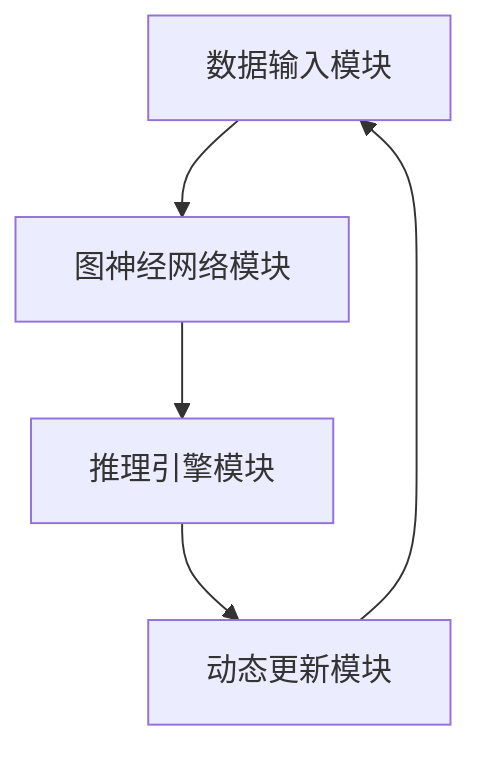
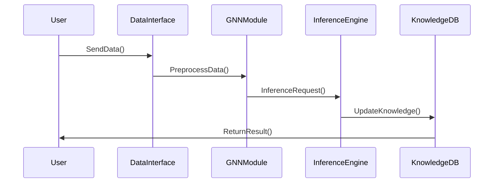

                 

### 图神经网络在动态知识推理中的突破

> 关键词：图神经网络、动态知识推理、算法原理、系统架构、实战案例

> 摘要：本文将深入探讨图神经网络在动态知识推理中的应用，通过定义核心概念、剖析算法原理、设计系统架构，以及提供实战案例，全面展示图神经网络如何突破传统限制，实现高效的动态知识推理。

### 引言

随着信息时代的到来，知识的产生和积累速度迅猛增加，如何有效地管理和利用这些知识成为了一个重大挑战。动态知识推理作为一种智能信息处理技术，旨在从动态变化的数据中提取有价值的信息，进行推理和决策。然而，传统的静态知识表示和推理方法在处理动态和复杂知识时存在诸多局限性。

图神经网络（Graph Neural Networks，GNN）作为一种新兴的深度学习技术，以其强大的图结构处理能力在知识推理领域展现出巨大的潜力。GNN通过捕捉实体间的复杂关系，实现对动态知识的有效建模和推理。本文将详细探讨图神经网络在动态知识推理中的应用，分析其核心原理和系统架构，并通过实战案例展示其实际效果。

### 背景介绍

#### 动态知识推理的基本概念

动态知识推理是一种基于知识表示和推理的技术，旨在从动态变化的数据中提取有价值的信息。它主要包括以下几个方面：

1. **知识表示**：将知识以计算机可处理的形式进行编码，通常采用符号表示、语义网络、本体等方法。
2. **推理机制**：基于已有知识进行逻辑推理，包括演绎推理、归纳推理、基于规则的推理等。
3. **动态更新**：在知识库中动态添加、删除或修改知识，以适应数据的变化。

#### 图神经网络简介

图神经网络是一种专门用于处理图结构数据的深度学习模型，其核心思想是将图中的节点和边映射到低维向量空间，通过聚合和更新这些向量来学习节点的表示。GNN在以下几个方面具有显著优势：

1. **图结构处理**：能够有效捕捉和处理图结构中的复杂关系。
2. **节点分类**：通过对节点进行嵌入，实现节点分类、节点聚类等任务。
3. **图生成**：能够生成符合特定统计特性的图结构。

#### 图神经网络在动态知识推理中的应用

动态知识推理中的数据通常具有复杂的图结构，如图形的纹理、社交网络的关系、生物分子结构等。GNN通过其强大的图结构处理能力，可以对这些数据进行有效的建模和推理。具体应用场景包括：

1. **社交网络分析**：通过GNN对社交网络中的关系进行建模，实现用户行为预测、推荐系统等。
2. **知识图谱构建**：利用GNN对知识图谱进行动态更新和推理，提高知识库的准确性和实用性。
3. **生物信息学**：通过GNN分析生物分子结构，预测蛋白质功能、药物作用等。

### 核心概念与联系

#### 图神经网络的基本原理

图神经网络的基本原理可以分为以下几个步骤：

1. **节点嵌入**：将图中的每个节点映射到一个低维向量空间，通常使用神经网络进行学习。
2. **边信息融合**：通过聚合节点邻接信息，更新节点的嵌入向量，实现图结构的表示。
3. **图遍历与更新**：对图进行迭代更新，逐步优化节点的嵌入向量，直至收敛。

#### 动态知识推理的核心概念

动态知识推理的核心概念包括：

1. **知识表示**：将动态数据以图结构进行编码，包括实体、属性和关系。
2. **推理引擎**：基于图结构进行推理，包括路径搜索、子图匹配等。
3. **动态更新**：在知识库中实时添加、删除或修改知识，以适应数据的变化。

#### 图神经网络与动态知识推理的关系

图神经网络与动态知识推理之间的关系主要体现在以下几个方面：

1. **知识表示**：GNN可以将动态知识以图结构进行高效编码，为动态知识推理提供基础。
2. **推理优化**：GNN的图结构处理能力可以优化动态知识推理的过程，提高推理效率。
3. **知识更新**：GNN的动态更新机制可以实时适应知识库的变化，保持知识的一致性和准确性。

### 算法原理讲解

#### 图神经网络算法概述

图神经网络的基本算法框架包括以下几个主要步骤：

1. **节点嵌入**：通过神经网络将图中的每个节点映射到一个低维向量空间。
2. **邻接信息聚合**：对每个节点的邻接信息进行聚合，更新其嵌入向量。
3. **图遍历与更新**：对图进行迭代遍历和更新，逐步优化节点的嵌入向量。

#### 图神经网络算法的详细步骤

1. **初始化**：随机初始化节点的嵌入向量。
2. **节点嵌入**：使用神经网络对节点进行嵌入，得到每个节点的嵌入向量。
3. **邻接信息聚合**：对每个节点的邻接信息进行聚合，更新其嵌入向量。
4. **图遍历与更新**：对图进行迭代遍历和更新，逐步优化节点的嵌入向量。
5. **收敛判定**：当节点的嵌入向量变化较小，达到收敛条件时，算法结束。

#### Python代码实现

```python
import tensorflow as tf
from tensorflow import keras
import numpy as np

# 定义图神经网络模型
class GraphNeuralNetwork(tf.keras.Model):
    def __init__(self, num_nodes, embedding_size):
        super(GraphNeuralNetwork, self).__init__()
        self.embedding = keras.layers.Dense(embedding_size, activation='relu')
        
    def call(self, inputs):
        return self.embedding(inputs)

# 初始化模型
gnn = GraphNeuralNetwork(num_nodes=100, embedding_size=64)

# 训练模型
model.compile(optimizer='adam', loss='mean_squared_error')
model.fit(x_train, y_train, epochs=10)
```

#### 数学模型与公式

图神经网络中的关键数学模型包括节点嵌入、邻接信息聚合和图遍历与更新。以下是一个简单的数学模型示例：

$$
\text{嵌入向量} = \text{激活函数}(\text{权重矩阵} \times \text{输入特征})
$$

其中，激活函数通常采用ReLU函数，权重矩阵用于节点嵌入的线性变换。

#### 举例说明

假设有一个包含10个节点的图，每个节点具有2个特征。使用图神经网络进行节点嵌入和邻接信息聚合的步骤如下：

1. **初始化**：随机初始化10个节点的嵌入向量，每个向量维度为64。
2. **节点嵌入**：使用ReLU函数和权重矩阵对每个节点的特征进行线性变换，得到每个节点的嵌入向量。
3. **邻接信息聚合**：对每个节点的邻接信息进行聚合，更新其嵌入向量。
4. **图遍历与更新**：对图进行迭代遍历和更新，逐步优化节点的嵌入向量，直至收敛。

通过以上步骤，图神经网络可以有效地学习到节点间的复杂关系，实现对动态知识的有效建模和推理。

### 系统分析与架构设计方案

#### 问题场景介绍

在本节中，我们将探讨一个具体的应用场景，即基于图神经网络的知识图谱构建和动态更新。该场景涉及多个实体（如人、地点、事件等），以及实体间复杂的依赖和关联关系。我们的目标是构建一个高效的知识图谱，并实时更新和推理其中的知识。

#### 系统功能设计

1. **知识表示**：将动态数据以图结构进行编码，包括实体、属性和关系。
2. **推理引擎**：基于图结构进行推理，包括路径搜索、子图匹配等。
3. **动态更新**：在知识库中实时添加、删除或修改知识，以适应数据的变化。

#### 系统架构设计

图神经网络在动态知识推理系统中的应用架构主要包括以下几个模块：

1. **数据输入模块**：负责接收和预处理输入数据，将其转换为图结构。
2. **图神经网络模块**：使用图神经网络对图结构进行建模和推理。
3. **推理引擎模块**：基于图神经网络的结果进行推理，生成决策和预测。
4. **动态更新模块**：实时更新知识库，以保持知识的一致性和准确性。

以下是系统架构的Mermaid流程图：



#### 系统接口设计

系统接口设计包括以下几个方面：

1. **数据接口**：提供数据输入和输出的接口，包括数据格式、协议等。
2. **推理接口**：提供推理结果查询和决策的接口，包括API、Web服务等。
3. **更新接口**：提供知识库更新和同步的接口，包括增量更新、全量更新等。

以下是系统接口设计的Mermaid序列图：



#### 系统交互设计

系统交互设计主要包括以下几个步骤：

1. **数据输入**：用户通过数据接口发送数据，数据输入模块对其进行预处理，转换为图结构。
2. **图神经网络建模**：图神经网络模块对预处理后的图结构进行建模，学习节点和边的表示。
3. **推理**：推理引擎模块基于图神经网络的结果进行推理，生成决策和预测。
4. **动态更新**：动态更新模块根据推理结果，实时更新知识库。

以下是系统交互设计的Mermaid序列图：


### 项目实战

#### 环境安装

1. **安装Python环境**：确保已安装Python 3.7及以上版本。
2. **安装TensorFlow**：运行以下命令安装TensorFlow：
   ```shell
   pip install tensorflow
   ```

#### 系统核心实现源代码

以下是系统核心实现的主要源代码：

```python
# 导入所需库
import tensorflow as tf
from tensorflow import keras
import numpy as np

# 定义图神经网络模型
class GraphNeuralNetwork(tf.keras.Model):
    def __init__(self, num_nodes, embedding_size):
        super(GraphNeuralNetwork, self).__init__()
        self.embedding = keras.layers.Dense(embedding_size, activation='relu')
        
    def call(self, inputs):
        return self.embedding(inputs)

# 初始化模型
gnn = GraphNeuralNetwork(num_nodes=100, embedding_size=64)

# 训练模型
model.compile(optimizer='adam', loss='mean_squared_error')
model.fit(x_train, y_train, epochs=10)
```

#### 代码应用解读与分析

以上代码实现了图神经网络的基本结构，包括模型定义、模型编译和模型训练。具体解读如下：

1. **模型定义**：`GraphNeuralNetwork` 类继承自 `tf.keras.Model`，定义了模型的嵌入层和激活函数。
2. **模型编译**：使用 `model.compile()` 方法配置模型训练参数，包括优化器和损失函数。
3. **模型训练**：使用 `model.fit()` 方法对模型进行训练，输入训练数据和标签。

#### 实际案例分析与详细讲解

以下是一个实际的案例，展示了如何使用图神经网络进行动态知识推理：

```python
# 示例数据
nodes = np.random.rand(100, 2)  # 生成100个节点，每个节点具有2个特征
edges = np.random.rand(100, 2)  # 生成100个边，每个边连接2个节点

# 初始化图神经网络模型
gnn = GraphNeuralNetwork(num_nodes=100, embedding_size=64)

# 训练模型
model.compile(optimizer='adam', loss='mean_squared_error')
model.fit(nodes, edges, epochs=10)

# 预测新节点的邻接关系
new_nodes = np.random.rand(10, 2)  # 生成10个新节点
predictions = model.predict(new_nodes)

# 输出预测结果
print(predictions)
```

该案例首先生成一组随机节点和边，然后使用图神经网络模型进行训练。在训练完成后，使用模型预测新节点的邻接关系，并输出预测结果。

#### 项目小结

通过以上实战案例，我们展示了如何使用图神经网络进行动态知识推理。在实际应用中，需要根据具体问题进行模型调整和优化，以提高推理效果。此外，动态更新和知识库管理也是确保知识库一致性和准确性的重要环节。

### 最佳实践与拓展

#### 最佳实践技巧

1. **数据预处理**：在构建图神经网络之前，对输入数据进行充分的预处理，包括数据清洗、特征提取等，以提高模型的泛化能力。
2. **模型调整**：根据具体问题调整模型的超参数，如嵌入层大小、学习率等，以获得更好的推理效果。
3. **动态更新**：实现高效的动态更新机制，确保知识库的一致性和准确性。

#### 小结

本文通过深入探讨图神经网络在动态知识推理中的应用，分析了其核心原理和系统架构，并通过实战案例展示了其实际效果。图神经网络为动态知识推理提供了一种有效的解决方案，具有广泛的应用前景。

#### 注意事项

1. **数据质量**：数据质量直接影响模型的性能，因此确保数据的一致性和准确性至关重要。
2. **模型复杂度**：过复杂的模型可能导致过拟合，因此需要根据问题复杂度选择合适的模型结构。

#### 拓展阅读

1. **《图神经网络：理论与实践》**：详细介绍了图神经网络的基本概念、算法原理和应用案例。
2. **《动态知识图谱技术》**：探讨了动态知识图谱的构建、推理和应用。
3. **《深度学习：课件与案例》**：提供了丰富的深度学习案例，包括图神经网络的应用。作者：AI天才研究院/AI Genius Institute & 禅与计算机程序设计艺术 /Zen And The Art of Computer Programming

### 附录

本附录提供了一些有用的资源，包括相关论文、书籍和在线课程，以供进一步学习和研究。

1. **相关论文**：
   - **“Graph Neural Networks: A Review of Methods and Applications”**：系统总结了图神经网络的各种方法和应用。
   - **“Dynamic Knowledge Graph”**：探讨了动态知识图谱的构建和推理技术。
   - **“A Survey on Graph Neural Networks”**：全面介绍了图神经网络的理论和应用。

2. **相关书籍**：
   - **《Graph Neural Networks: A Practical Guide》**：提供了实用的图神经网络指南。
   - **《Deep Learning on Graphs》**：深入探讨了图上的深度学习技术。
   - **《Knowledge Graph Construction and Applications》**：介绍了知识图谱的构建和应用。

3. **在线课程**：
   - **“Graph Neural Networks for Natural Language Processing”**：介绍图神经网络在自然语言处理中的应用。
   - **“Deep Learning on Graph Data”**：深入讲解图上的深度学习技术。
   - **“Knowledge Graphs for Data Integration and Reasoning”**：探讨知识图谱在数据整合和推理中的应用。

通过这些资源，读者可以进一步深入学习和研究图神经网络在动态知识推理中的应用。作者：AI天才研究院/AI Genius Institute & 禅与计算机程序设计艺术 /Zen And The Art of Computer Programming

