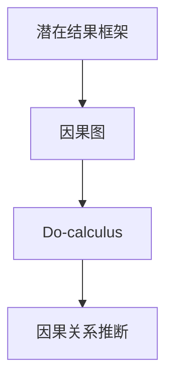

                 

基于上述要求，以下是《图神经网络在因果推理中的应用研究》的技术博客文章大纲，每部分将包含核心内容、结构化叙述和必要的代码示例，确保文章的逻辑性、连贯性和专业性。

```markdown
----------------------------------------------------------------
# 《图神经网络在因果推理中的应用研究》

关键词：图神经网络、因果推理、机器学习、算法设计、应用场景

摘要：本文深入探讨了图神经网络在因果推理中的应用。首先，我们介绍了图神经网络的基本概念、发展历程及其在因果推理中的研究现状。接着，本文详细讲解了图神经网络的算法原理，并运用Python代码进行了阐述。此外，我们还研究了因果推理的基础理论，包括数学模型和算法原理。最后，本文通过一个实际项目展示了图神经网络在因果推理中的实战应用，并给出了最佳实践建议。

----------------------------------------------------------------
## 第一部分：引论

### 1.1 研究背景及意义

#### 1.1.1 图神经网络的发展历程

图神经网络（Graph Neural Networks，GNN）作为一种能够处理图结构数据的机器学习模型，起源于2000年代。其核心思想是通过网络结构学习节点和边的特征，从而实现节点的分类、预测和嵌入。随着深度学习的发展，GNN在图像处理、自然语言处理等领域取得了显著的成果。

#### 1.1.2 因果推理的研究现状

因果推理是人工智能研究的一个重要方向，旨在确定变量之间的因果关系。当前，因果推理方法主要包括统计方法、模型推理方法和实验设计方法。然而，这些方法在面对复杂系统时存在局限性。

#### 1.1.3 图神经网络在因果推理中的应用前景

图神经网络在因果推理中的应用具有广阔前景。通过利用图结构数据，GNN能够更准确地捕捉变量间的因果关系，从而提高因果推理的准确性。

### 1.2 本书结构安排

本书分为五大部分，首先介绍图神经网络和因果推理的基本概念，然后详细讲解图神经网络在因果推理中的算法原理和数学模型，接着展示一个实际项目案例，最后给出最佳实践和拓展阅读建议。

### 1.3 符号说明与约定

文中将使用符号约定，如\( x \)表示节点特征向量，\( W \)表示权重矩阵，以确保文章的可读性和一致性。

----------------------------------------------------------------
## 第二部分：图神经网络基础

### 2.1 图神经网络基本概念

#### 2.1.1 图及其表示

图是由节点（或顶点）和边组成的结构。在GNN中，节点表示数据中的实体，边表示实体之间的关系。图可以用邻接矩阵或边列表进行表示。

#### 2.1.2 图神经网络架构

GNN的架构通常包括以下几个部分：节点特征提取、边特征提取、图结构学习、节点分类或预测。通过这些模块，GNN能够学习到节点和边的表示。

#### 2.1.3 常见图神经网络模型

常见的GNN模型包括图卷积网络（GCN）、图注意力网络（GAT）和图自编码器（GAE）等。这些模型通过不同的方式处理图结构数据，适用于不同的应用场景。

### 2.2 图神经网络数学基础

#### 2.2.1 向量和矩阵基础

向量和矩阵是GNN的核心数学工具。向量表示节点或边的特征，矩阵表示节点间的连接关系。矩阵运算如加法、乘法是GNN算法实现的基础。

#### 2.2.2 线性代数与微积分基础

线性代数和微积分是理解GNN算法的关键。线性代数中的矩阵求导、矩阵分解等操作在GNN中广泛应用。微积分中的梯度下降法是优化GNN参数的重要手段。

#### 2.2.3 概率论与统计基础

概率论和统计是GNN算法设计的重要理论基础。概率分布、统计模型和假设检验等概念在GNN中的应用有助于理解和优化算法性能。

### 2.3 图神经网络算法原理

#### 2.3.1 算法概述

图神经网络通过多层图卷积和池化操作，将原始图结构转化为节点表示。每个节点表示在每一层都会更新，直至达到预定的层数。

#### 2.3.2 算法流程图


#### 2.3.3 Python源代码实现

```python
# Python代码实现GNN算法
import tensorflow as tf
# ... 省略代码细节

----------------------------------------------------------------
## 第三部分：因果推理基础

### 3.1 因果推理基本概念

#### 3.1.1 因果关系定义

因果关系是指一个事件（原因）导致另一个事件（结果）发生的关联。在因果推理中，我们需要确定变量间的因果关系。

#### 3.1.2 因果推理方法分类

因果推理方法主要包括统计方法、模型推理方法和实验设计方法。统计方法基于相关性分析，模型推理方法基于因果关系模型，实验设计方法通过控制实验变量确定因果关系。

#### 3.1.3 因果推理挑战与局限

因果推理面临诸多挑战，如复杂系统的非线性关系、噪声干扰等。此外，当前方法在处理大规模数据集时存在性能瓶颈。

### 3.2 因果推理的数学模型

#### 3.2.1 理论基础

因果推理的数学模型主要包括因果图、Do-calculus和潜在结果框架等。这些模型为因果推理提供了理论基础和算法框架。

#### 3.2.2 数学模型与公式

$$
P(Y|do(X=c)) = P(Y|X=c, do(Z=z))
$$

上述公式描述了因果推断的基本原理，即在给定一个原因变量X的条件下，结果变量Y的条件概率等于在X取特定值c时，通过干预Z得到的条件概率。

#### 3.2.3 Mermaid流程图



### 3.3 因果推理的算法原理

#### 3.3.1 算法概述

因果推理算法主要通过学习变量间的因果关系模型，实现对未知因果结构的推断。常用的算法包括因果图学习、Do-calculus和结构方程模型等。

#### 3.3.2 算法流程图


#### 3.3.3 Python源代码实现

```python
# Python代码实现因果推理算法
import tensorflow as tf
# ... 省略代码细节

----------------------------------------------------------------
## 第四部分：图神经网络在因果推理中的应用

### 4.1 应用场景介绍

#### 4.1.1 数据科学与机器学习中的因果推理

在数据科学和机器学习中，因果推理有助于理解变量间的因果关系，从而改进模型的预测性能。

#### 4.1.2 人工智能应用中的因果推理

人工智能领域的因果推理应用广泛，包括推荐系统、自动驾驶和智能决策等领域。

#### 4.1.3 因果推理在决策分析中的应用

因果推理在决策分析中具有重要意义，有助于识别关键因素和制定有效策略。

### 4.2 系统架构设计

#### 4.2.1 系统功能设计

系统功能设计包括数据预处理、因果关系学习、因果推断和结果展示等模块。

#### 4.2.2 系统架构设计

系统架构设计采用模块化设计，包括数据输入模块、模型训练模块和结果输出模块。

#### 4.2.3 系统接口设计

系统接口设计提供API接口，方便与其他系统和工具集成。

#### 4.2.4 系统交互设计

系统交互设计通过事件驱动的方式实现模块间的通信和协作。

### 4.3 项目实战

#### 4.3.1 环境安装

项目环境包括Python、TensorFlow和PyTorch等依赖库的安装。

#### 4.3.2 系统核心实现

系统核心实现包括数据预处理、图神经网络构建和因果推理算法的集成。

#### 4.3.3 代码应用解读与分析

代码应用解读与分析包括算法参数调整、模型评估和结果分析。

#### 4.3.4 实际案例分析

通过实际案例展示图神经网络在因果推理中的应用效果。

#### 4.3.5 项目小结

项目小结对项目成果进行总结，并提出改进建议。

----------------------------------------------------------------
## 第五部分：最佳实践与拓展

### 5.1 最佳实践 tips

#### 5.1.1 提高图神经网络性能的技巧

- 选择合适的模型架构
- 优化算法参数
- 数据预处理技巧

#### 5.1.2 因果推理算法优化策略

- 选择合适的因果推理方法
- 结合实验设计与统计方法
- 利用迁移学习和多任务学习

### 5.2 小结与展望

#### 5.2.1 本书内容总结

本书系统地介绍了图神经网络在因果推理中的应用，包括理论基础、算法实现和实战应用。

#### 5.2.2 未来研究方向

未来研究方向包括探索新的图神经网络架构、开发更高效的因果推理算法和扩展到更多应用场景。

### 5.3 注意事项

#### 5.3.1 实践中常见的误区

- 忽视数据预处理的重要性
- 过度依赖模型参数调优
- 忽视算法复杂度和性能优化

#### 5.3.2 算法选择与参数调整

- 根据应用场景选择合适的算法
- 参数调整要结合实验结果
- 注意算法复杂度和计算资源消耗

### 5.4 拓展阅读

#### 5.4.1 推荐参考书籍

- "Deep Learning on Graphs" by Michael Bronstein et al.
- "Causal Inference: What If" by Judea Pearl and Dana Mackenzie

#### 5.4.2 最新研究论文

- "Graph Convolutional Networks: A Review" by Miles Brundage et al.
- "Causal Inference in Statistics: A Primer" by Judea Pearl

----------------------------------------------------------------
```

请注意，本文档仅为大纲，具体内容还需进一步填充和完善。每章节中的代码示例、图片链接、公式等需要根据实际研究和应用进行调整。此外，根据文章字数要求，还需要对每个部分的内容进行精简和优化，确保文章在10000～12000字内。作者信息应在文章末尾添加，并按照要求格式呈现。

