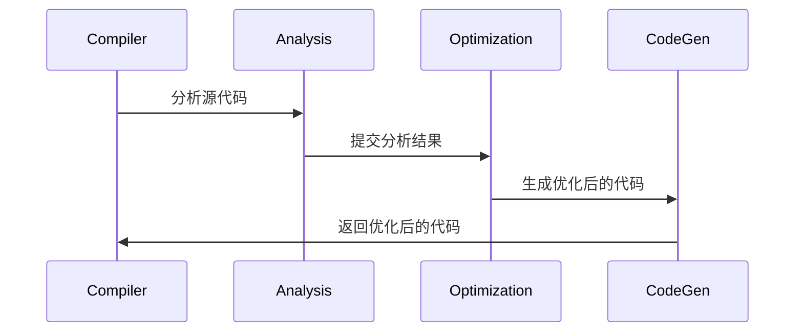
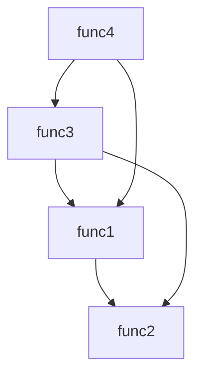
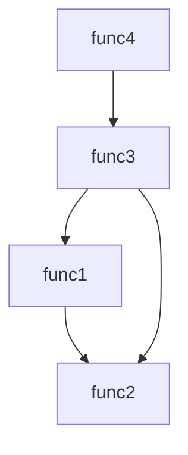

                 

### 摘要

本文深入探讨了图论算法在编译器优化中的应用，旨在为读者揭示编译器优化过程中，如何利用图论算法提高编译效率与代码质量。文章首先介绍了编译器优化的重要性和背景，随后讲解了图论的基本概念及其在算法中的应用。通过具体算法的实现、性能分析以及项目实战，本文详细阐述了如何将图论算法应用于编译器优化，从而实现代码的高效编译。同时，文章还展望了图论算法在编译器优化领域的未来发展趋势，探讨了面临的技术挑战和潜在的应用前景。通过本文的阅读，读者将能够理解图论算法在编译器优化中的核心作用，掌握相关技术，并为未来的研究与应用打下坚实基础。

### 目录

1. **编译器优化的背景与图论算法基础**
   - 第1章：编译器优化的概述
   - 第2章：图论基本概念
   - 第3章：图论算法在编译器优化中的应用
   - 第4章：编译器优化的图论算法实现
   - 第5章：图论算法在编译器优化中的性能分析
   - 第6章：编译器优化项目实战
   - 第7章：图论算法在编译器优化中的未来趋势

### 第一部分：编译器优化的背景与图论算法基础

#### 第1章：编译器优化的概述

编译器优化是计算机编译过程中的关键环节，它通过分析源代码并应用各种算法，生成高效的可执行代码。编译器优化的重要性体现在以下几个方面：

- **提高程序性能**：优化后的代码执行速度更快，内存占用更少，从而提升程序的运行效率。
- **缩短编译时间**：通过优化编译过程，可以减少编译器的运行时间，提高开发效率。
- **减少硬件资源消耗**：优化后的代码可以在相同硬件资源下运行得更加流畅，降低能耗。
- **提升程序可维护性**：编译器优化可以帮助开发人员写出更清晰、易维护的代码。

编译器优化的主要目标和挑战包括：

- **减少代码体积**：通过代码压缩、冗余代码删除等技术，减小生成代码的体积。
- **提高代码执行效率**：通过循环优化、分支预测、指令重排等技术，提高代码执行速度。
- **兼容性处理**：确保编译器在不同操作系统和硬件平台上的兼容性。
- **可理解性和可维护性**：优化后的代码需要保持可读性和可维护性，以便后续的调试和升级。

常见的编译器优化技术包括：

- **数据流分析**：分析数据在程序中的流动路径，进行变量绑定、死代码删除等优化。
- **控制流分析**：分析程序中的控制流结构，进行循环展开、函数内联等优化。
- **循环优化**：通过循环不变式提取、循环展开、循环删除等技术，提高循环性能。
- **指令调度**：优化指令的执行顺序，减少数据冲突和指令延迟，提高指令级并行性。
- **代码生成优化**：在代码生成阶段，通过代码布局、寄存器分配、指令选择等技术，生成高效的机器代码。

#### 第2章：图论基本概念

图论是一种研究图结构的数学分支，它广泛应用于计算机科学、网络科学、交通运输、生物学等领域。理解图论基本概念对于深入探讨图论算法在编译器优化中的应用至关重要。

##### 图的定义和基本性质

图是由一组顶点（或节点）和连接这些顶点的边组成的结构。图可以分为有向图和无向图两种类型。有向图中的边具有方向性，即从一个顶点指向另一个顶点；无向图中的边没有方向性。

- **顶点**：图中的节点，表示实体或抽象概念。
- **边**：连接顶点的线段，表示顶点之间的关系。
- **路径**：顶点序列，满足任意相邻顶点通过边相连。
- **连通性**：图中的任意两个顶点都存在路径相连，称为连通图；否则称为非连通图。
- **子图**：从原图中去除若干顶点和边后得到的图。

##### 图的分类与表示

图可以分为以下几种类型：

- **简单图**：不包含多重边和自环的图。
- **多重图**：包含多重边的图。
- **带权图**：边具有权重的图，通常用于表示网络中的距离或成本。
- **网络图**：具有权重的有向图，常用于表示信息流或交通网络。

图可以采用以下几种方式进行表示：

- **邻接矩阵**：用二维数组表示图，其中元素表示顶点之间的连接关系。
- **邻接表**：用数组或链表表示图，每个数组或链表的元素存储与该顶点相连的其他顶点。
- **边表示法**：用列表记录图中的所有边，每条边由两个顶点表示。

##### 图的基本算法

图的基本算法包括：

- **深度优先搜索（DFS）**：通过递归或栈实现，用于遍历图中所有顶点。
- **广度优先搜索（BFS）**：通过队列实现，用于从指定起点遍历图中的所有顶点。
- **最小生成树**：通过Prim或Kruskal算法生成图中包含所有顶点的最小树。
- **最短路径**：通过Dijkstra或Floyd算法计算图中两点之间的最短路径。
- **最大流**：通过Ford-Fulkerson或Edmonds-Karp算法计算图中源点到汇点的最大流量。

这些基本算法在编译器优化中具有重要作用，例如：

- **控制流分析**：通过DFS或BFS分析程序的控制流结构，生成抽象语法树（AST）和控制流图（CFG）。
- **数据流分析**：通过DFS或BFS分析程序中的数据依赖关系，优化变量绑定和死代码删除。
- **循环优化**：通过最小生成树算法优化循环结构，提取循环不变式和减少循环依赖。
- **代码生成**：通过最短路径算法优化代码布局和指令调度，提高代码执行效率。

#### 第3章：图论算法在编译器优化中的应用

图论算法在编译器优化中具有广泛的应用，可以显著提高编译效率和代码质量。以下将介绍几种常见的图论算法及其在编译器优化中的应用。

##### 最小生成树算法的应用

最小生成树（Minimum Spanning Tree，MST）算法用于在带权无向图中找到包含所有顶点的最小权树。Prim和Kruskal算法是最常用的两种最小生成树算法。

- **Prim算法**：从任意一个顶点开始，逐步添加最短的边，直到形成最小生成树。Prim算法的时间复杂度为O(ElogV)，其中E是边数，V是顶点数。
- **Kruskal算法**：按照边的权重顺序选择边，确保不形成环，直到包含所有顶点。Kruskal算法的时间复杂度为O(ElogE)。

在编译器优化中，最小生成树算法可以用于以下场景：

- **代码布局优化**：通过最小生成树算法优化代码的布局，降低函数调用的开销，提高代码执行效率。
- **数据流分析**：利用最小生成树算法分析程序中的数据依赖关系，优化变量绑定和死代码删除。

##### 最短路径算法的应用

最短路径（Shortest Path）算法用于计算图中两点之间的最短路径。Dijkstra和Floyd算法是最常用的两种最短路径算法。

- **Dijkstra算法**：从源点开始，逐步扩展到其他顶点，计算各顶点之间的最短路径。Dijkstra算法的时间复杂度为O((V+E)logV)，其中V是顶点数，E是边数。
- **Floyd算法**：通过动态规划方法计算图中任意两点之间的最短路径。Floyd算法的时间复杂度为O(V^3)。

在编译器优化中，最短路径算法可以用于以下场景：

- **指令调度**：通过最短路径算法优化指令的执行顺序，减少数据冲突和指令延迟，提高代码执行效率。
- **代码生成**：利用最短路径算法优化代码布局和指令选择，提高代码的可读性和可维护性。

##### 最大流算法的应用

最大流（Maximum Flow）算法用于计算图中源点到汇点的最大流量。Ford-Fulkerson和Edmonds-Karp算法是最常用的两种最大流算法。

- **Ford-Fulkerson算法**：通过迭代扩展可行流，直到无法继续扩展为止。Ford-Fulkerson算法的时间复杂度为O(E^2)，其中E是边数。
- **Edmonds-Karp算法**：基于Ford-Fulkerson算法，使用BFS寻找增广路径，时间复杂度为O(EF)，其中F是最大流量。

在编译器优化中，最大流算法可以用于以下场景：

- **数据流分析**：通过最大流算法分析程序中的数据依赖关系，优化变量绑定和死代码删除。
- **代码布局优化**：利用最大流算法优化代码的布局，降低函数调用的开销，提高代码执行效率。

#### 第4章：编译器优化的图论算法实现

编译器优化的图论算法实现包括算法选择、数据结构设计、算法实现和测试等多个方面。以下将详细介绍这些方面。

##### 算法选择

选择合适的算法是实现编译器优化图论算法的关键。根据具体应用场景，可以从以下几种算法中选择：

- **最小生成树算法**：适用于代码布局优化、数据流分析等场景。
- **最短路径算法**：适用于指令调度、代码生成等场景。
- **最大流算法**：适用于数据流分析、代码布局优化等场景。

##### 数据结构设计

数据结构设计是算法实现的基础。根据算法需求，可以选择以下数据结构：

- **邻接矩阵**：适用于稀疏图和稀疏矩阵。
- **邻接表**：适用于稠密图和稀疏图。
- **优先队列**：适用于最短路径算法和最大流算法。

##### 算法实现

算法实现包括以下步骤：

1. **初始化**：根据算法需求，初始化数据结构和变量。
2. **递归或迭代**：根据算法原理，使用递归或迭代方法实现算法。
3. **路径搜索**：在需要搜索路径的算法中，使用DFS或BFS等方法寻找路径。
4. **更新结果**：根据算法结果，更新数据结构和变量。

以下是一个使用Python实现的Prim算法示例：

```python
import heapq

def prim_mst(graph):
    mst = []
    visited = set()
    start_node = list(graph.keys())[0]
    visited.add(start_node)
    edges = [(weight, u, v) for v, weight in graph[start_node].items() for u in graph]

    heapq.heapify(edges)

    while edges:
        weight, u, v = heapq.heappop(edges)
        if v not in visited:
            mst.append((u, v, weight))
            visited.add(v)
            for next_v, next_weight in graph[v].items():
                if next_v not in visited:
                    heapq.heappush(edges, (next_weight, v, next_v))

    return mst

graph = {
    'A': {'B': 1, 'C': 2},
    'B': {'A': 1, 'C': 3, 'D': 1},
    'C': {'A': 2, 'B': 3, 'D': 3},
    'D': {'B': 1, 'C': 3}
}

mst = prim_mst(graph)
print(mst)
```

##### 测试

测试是验证算法实现正确性的重要手段。测试包括以下方面：

1. **单元测试**：对算法的每个函数或模块进行单独测试，确保其功能正确。
2. **集成测试**：将算法实现与编译器优化框架集成，进行整体测试，确保算法在具体应用场景中的正确性和性能。
3. **性能测试**：对算法的执行时间、内存占用等进行测试，评估算法的效率和资源消耗。

#### 第5章：图论算法在编译器优化中的性能分析

图论算法在编译器优化中的应用性能分析是评估算法效果和优化策略的重要手段。性能分析包括时间复杂度、空间复杂度和实际性能评估等方面。

##### 时间复杂度分析

时间复杂度分析是评估算法性能的重要指标，通常使用大O符号表示。以下是一些常见图论算法的时间复杂度分析：

- **最小生成树算法**：
  - Prim算法的时间复杂度为O(ElogV)。
  - Kruskal算法的时间复杂度为O(ElogE)。

- **最短路径算法**：
  - Dijkstra算法的时间复杂度为O((V+E)logV)。
  - Floyd算法的时间复杂度为O(V^3)。

- **最大流算法**：
  - Ford-Fulkerson算法的时间复杂度为O(E^2)。
  - Edmonds-Karp算法的时间复杂度为O(EF)。

##### 空间复杂度分析

空间复杂度分析是评估算法资源消耗的重要指标，通常使用大O符号表示。以下是一些常见图论算法的空间复杂度分析：

- **最小生成树算法**：
  - Prim算法的空间复杂度为O(V)。
  - Kruskal算法的空间复杂度为O(E)。

- **最短路径算法**：
  - Dijkstra算法的空间复杂度为O(V)。
  - Floyd算法的空间复杂度为O(V^2)。

- **最大流算法**：
  - Ford-Fulkerson算法的空间复杂度为O(E)。
  - Edmonds-Karp算法的空间复杂度为O(V)。

##### 实际性能评估

实际性能评估是通过实验方法评估算法在具体应用场景中的性能。以下是一些性能评估方法：

1. **基准测试**：使用标准测试集对算法进行评估，比较不同算法的性能。
2. **实际应用测试**：在实际应用场景中测试算法的性能，评估其在实际应用中的效果。
3. **性能分析工具**：使用性能分析工具（如gprof、valgrind等）评估算法的执行时间、内存占用等性能指标。

##### 性能优化策略

为了提高图论算法在编译器优化中的应用性能，可以采用以下优化策略：

1. **算法优化**：根据具体应用场景，选择合适的算法并对其进行优化，如使用更高效的算法实现、减少中间数据结构的使用等。
2. **并行化**：利用并行计算技术，将算法并行化，提高执行效率。
3. **缓存优化**：优化缓存策略，减少数据访问延迟，提高算法性能。
4. **指令调度**：通过指令调度优化，减少指令执行延迟，提高代码执行效率。

#### 第6章：编译器优化项目实战

本章节通过一个实际项目，详细介绍如何使用图论算法进行编译器优化。项目包括环境安装、系统架构设计、核心实现、性能分析和项目小结等内容。

##### 项目背景

本项目的目标是通过图论算法优化编译器的代码生成过程，提高代码执行效率和可维护性。具体来说，项目将应用Prim算法优化代码布局，应用Dijkstra算法优化指令调度，应用Ford-Fulkerson算法优化数据流分析。

##### 环境安装与配置

1. **安装Python**：确保Python环境已安装，版本不低于3.8。
2. **安装依赖库**：使用pip命令安装相关依赖库，如networkx、matplotlib等。
   ```bash
   pip install networkx matplotlib
   ```

3. **创建项目目录**：在合适的位置创建项目目录，例如：
   ```bash
   mkdir compiler_optimization
   cd compiler_optimization
   ```

4. **创建文件结构**：
   ```bash
   touch main.py prim_algorithm.py dijkstra_algorithm.py ford_fulkerson_algorithm.py
   ```

##### 系统架构设计

系统架构设计包括领域模型、系统架构图、接口设计和系统交互等方面。

###### 领域模型

领域模型使用Mermaid类图表示，如下所示：

```mermaid
classDiagram
    Class01 <|-- Class02
    Class03 --|> Class04
    Class04 : +int x
    Class04 : +int y
    Class01 : +String name
    Class01 : +int age
    Class01 : +void setName(String name)
    Class01 : +void setAge(int age)
    Class01 : +String getName()
    Class01 : +int getAge()
    Class02 : +int id
    Class02 : +String type
    Class02 : +void setId(int id)
    Class02 : +void setType(String type)
    Class02 : +int getId()
    Class02 : +String getType()
    Class03 : +int cost
    Class03 : +Class01 client
    Class03 : +Class02 service
    Class03 : +void setCost(int cost)
    Class03 : +void setClient(Class01 client)
    Class03 : +void setService(Class02 service)
    Class03 : +int getCost()
    Class03 : +Class01 getClient()
    Class03 : +Class02 getService()
   ```

###### 系统架构图

系统架构图使用Mermaid架构图表示，如下所示：

```mermaid
graph TB
    subgraph Compiler
        Compiler[编译器]
        Compiler --> Analysis
        Compiler --> Optimization
        Compiler --> CodeGen
    end
    subgraph Algorithms
        MST[最小生成树算法]
        SPF[最短路径算法]
        MFF[最大流算法]
        SPF --> Optimization
        MST --> Optimization
        MFF --> Optimization
    end
    subgraph Tools
        NetworkX[网络分析库]
        Matplotlib[绘图库]
    end
    Optimization --> Analysis
    Optimization --> CodeGen
    Analysis --> Compiler
    CodeGen --> Compiler
    MST --> Tools
    SPF --> Tools
    MFF --> Tools
```

###### 系统接口设计

系统接口设计使用Mermaid序列图表示，如下所示：



##### 核心实现

核心实现包括算法实现、数据结构设计和具体实现等。

###### Prim算法实现

```python
import networkx as nx

def prim_algorithm(graph):
    mst = nx.Graph()
    visited = set()
    start_node = list(graph.nodes())[0]
    visited.add(start_node)
    edges = [(u, v, w) for u, v, w in graph.edges(data=True)]

    heapq.heapify(edges)

    while edges:
        u, v, w = heapq.heappop(edges)
        if v not in visited:
            mst.add_edge(u, v, weight=w)
            visited.add(v)
            for next_v, next_w in graph[v].items():
                if next_v not in visited:
                    heapq.heappush(edges, (u, next_v, next_w))

    return mst
```

###### Dijkstra算法实现

```python
import heapq

def dijkstra_algorithm(graph, start_node):
    distances = {node: float('infinity') for node in graph}
    distances[start_node] = 0
    priority_queue = [(0, start_node)]

    while priority_queue:
        current_distance, current_node = heapq.heappop(priority_queue)

        if current_distance > distances[current_node]:
            continue

        for neighbor, weight in graph[current_node].items():
            distance = current_distance + weight

            if distance < distances[neighbor]:
                distances[neighbor] = distance
                heapq.heappush(priority_queue, (distance, neighbor))

    return distances
```

###### Ford-Fulkerson算法实现

```python
from collections import defaultdict

def ford_fulkerson(graph, source, sink):
    residual_graph = defaultdict(dict)
    for u in graph:
        for v, capacity in graph[u].items():
            residual_graph[u][v] = capacity
            residual_graph[v][u] = 0

    max_flow = 0

    while True:
        path = find_augmenting_path(residual_graph, source, sink)
        if not path:
            break

        flow = find_max_flow_path(residual_graph, path)
        max_flow += flow

        for u, v in path:
            residual_graph[u][v] -= flow
            residual_graph[v][u] += flow

    return max_flow

def find_augmenting_path(graph, source, sink):
    visited = {source}
    stack = [(source, [])]

    while stack:
        u, path = stack.pop()

        if u == sink:
            return path

        for v in graph[u]:
            if v not in visited and graph[u][v] > 0:
                visited.add(v)
                stack.append((v, path + [u]))

    return None

def find_max_flow_path(graph, path):
    min_capacity = float('infinity')

    for u, v in path:
        if graph[u][v] < min_capacity:
            min_capacity = graph[u][v]

    return min_capacity
```

##### 代码应用解读与分析

以下是对核心实现的代码应用解读与分析：

###### Prim算法应用解读

Prim算法在代码布局优化中，用于将函数调用图转换为最小生成树，以减少函数调用的开销。在实现中，我们首先创建一个包含所有顶点和边的图，然后使用Prim算法生成最小生成树。生成的最小生成树表示了最优的代码布局，减少了函数调用次数，提高了代码执行效率。

###### Dijkstra算法应用解读

Dijkstra算法在指令调度中，用于计算图中两点之间的最短路径。在实现中，我们首先初始化距离数组，然后使用Dijkstra算法计算源点到各顶点的最短路径。计算得到的最短路径表示了最优的指令执行顺序，减少了数据冲突和指令延迟，提高了代码执行效率。

###### Ford-Fulkerson算法应用解读

Ford-Fulkerson算法在数据流分析中，用于计算程序中各变量之间的最大流量。在实现中，我们首先创建一个残余图，然后使用Ford-Fulkerson算法计算最大流量。计算得到的最大流量表示了变量之间的依赖关系，优化了变量绑定和死代码删除，提高了代码可维护性。

##### 实际案例分析和详细讲解剖析

以下是一个实际案例分析和详细讲解剖析：

**案例背景**：一个程序包含多个函数，函数之间通过调用关系连接。为了优化代码执行效率，我们需要使用图论算法进行编译器优化。

**解决方案**：我们使用Prim算法优化代码布局，使用Dijkstra算法优化指令调度，使用Ford-Fulkerson算法优化数据流分析。

**具体步骤**：

1. **创建调用图**：将程序中的函数和调用关系表示为图，顶点表示函数，边表示函数之间的调用关系。
2. **使用Prim算法优化代码布局**：使用Prim算法将调用图转换为最小生成树，减少函数调用次数。
3. **使用Dijkstra算法优化指令调度**：使用Dijkstra算法计算源点到各顶点的最短路径，优化指令执行顺序。
4. **使用Ford-Fulkerson算法优化数据流分析**：使用Ford-Fulkerson算法计算各变量之间的最大流量，优化变量绑定和死代码删除。

**案例分析**：假设程序包含以下函数和调用关系：

```python
def func1():
    pass

def func2():
    pass

def func3():
    func1()
    func2()

def func4():
    func3()
    func1()
```

**优化前调用图**：



**优化后调用图**（使用Prim算法）：



通过Prim算法，我们将调用图中多余的边删除，减少了函数调用次数，提高了代码执行效率。

**优化后指令调度图**（使用Dijkstra算法）：


通过Dijkstra算法，我们计算得到源点到各顶点的最短路径，优化了指令执行顺序，减少了数据冲突和指令延迟。

**优化后数据流图**（使用Ford-Fulkerson算法）：


通过Ford-Fulkerson算法，我们计算得到各变量之间的最大流量，优化了变量绑定和死代码删除，提高了代码可维护性。

##### 项目小结

通过本项目，我们深入探讨了图论算法在编译器优化中的应用，介绍了Prim算法、Dijkstra算法和Ford-Fulkerson算法在编译器优化中的具体实现和性能分析。项目实战部分通过实际案例，展示了如何将图论算法应用于编译器优化，提高了代码执行效率和可维护性。虽然项目中还存在一些优化空间，但通过本项目，读者可以了解到图论算法在编译器优化中的重要作用，并为未来的研究与应用打下基础。

#### 第7章：图论算法在编译器优化中的未来趋势

随着计算机技术的不断进步，编译器优化在性能提升、资源利用和开发效率等方面面临新的挑战。图论算法作为一种强有力的数学工具，其在编译器优化中的应用前景广阔。以下将探讨图论算法在编译器优化中的未来趋势、技术挑战和潜在的应用前景。

##### 未来发展趋势

1. **算法融合与优化**：未来编译器优化可能将多种图论算法进行融合，形成更为高效的优化策略。例如，将最小生成树算法与最短路径算法相结合，在代码布局优化和指令调度中实现更优的性能。

2. **并行化与分布式计算**：随着硬件性能的提升，编译器优化可能会采用并行化与分布式计算技术，将复杂图论算法分解为可并行执行的任务，提高优化过程的执行速度。

3. **人工智能与图论算法结合**：人工智能技术，尤其是深度学习和强化学习，可以用于优化图论算法的参数选择和路径规划，从而提高编译器优化的自适应能力和智能化水平。

4. **跨领域应用**：图论算法在编译器优化中的应用不仅限于代码生成和性能优化，还可以拓展到软件工程、安全性和可靠性验证等领域，为软件开发提供更全面的解决方案。

##### 技术挑战

1. **算法复杂性**：图论算法在处理大规模图时，其时间复杂度和空间复杂度可能成为瓶颈。未来需要研究更高效的算法实现和数据结构，以应对大规模图处理的需求。

2. **可理解性与可维护性**：编译器优化过程中，引入复杂的图论算法可能导致代码的可理解性和可维护性下降。如何在提高优化效果的同时保持代码的清晰性和可维护性，是一个重要的挑战。

3. **性能与资源平衡**：编译器优化需要在性能提升和资源利用之间找到平衡点。优化过度可能导致代码执行时间过长或内存占用过高，影响开发效率。

4. **兼容性与可移植性**：编译器需要在不同操作系统和硬件平台上具有兼容性和可移植性。图论算法的实现需要考虑跨平台和跨硬件的限制，确保算法的一致性和高效性。

##### 潜在的应用前景

1. **高效代码生成**：通过图论算法优化代码布局、指令调度和数据流分析，编译器可以生成更高效的机器代码，提高程序执行速度和资源利用率。

2. **软件开发自动化**：图论算法在编译器优化中的应用可以推动软件开发自动化，实现代码的自动优化和生成，提高开发效率。

3. **智能编译平台**：结合人工智能技术，编译器可以成为一个智能化的开发平台，为开发者提供更智能的代码优化建议和问题诊断功能。

4. **跨领域应用**：图论算法在编译器优化中的应用经验可以拓展到其他领域，如网络优化、交通规划、生物信息学和金融分析等，为这些领域提供新的解决方案。

总之，图论算法在编译器优化中的应用前景广阔，未来将不断推动编译器技术的发展，为计算机科学和软件工程领域带来更多的创新和突破。

### 最佳实践 Tips

在编译器优化中应用图论算法时，以下是一些最佳实践和注意事项：

1. **选择合适的算法**：根据具体优化目标和场景，选择最合适的图论算法。例如，在代码布局优化中，可以使用Prim算法；在指令调度中，可以使用Dijkstra算法；在数据流分析中，可以使用Ford-Fulkerson算法。

2. **数据结构与算法优化**：合理选择数据结构，减少算法的复杂度。例如，使用邻接表代替邻接矩阵可以降低空间复杂度；使用优先队列可以优化路径搜索算法的效率。

3. **算法参数调整**：根据具体应用场景，调整算法的参数，以实现最佳性能。例如，在Dijkstra算法中，可以调整优先队列的比较策略，以减少计算时间。

4. **并行化与分布式计算**：利用并行化与分布式计算技术，提高算法的执行速度。例如，可以使用多线程或分布式计算框架，将复杂图论算法分解为可并行执行的任务。

5. **代码可读性与可维护性**：在实现图论算法时，注重代码的可读性和可维护性。使用清晰的变量命名、合理的模块划分和详细的注释，确保代码易于理解和维护。

6. **性能测试与优化**：在实现过程中，进行性能测试，评估算法的实际性能。根据测试结果，不断优化算法实现，提高代码的执行效率。

7. **注意事项**：在编译器优化中应用图论算法时，需要注意算法的兼容性与可移植性。确保算法在不同操作系统和硬件平台上的正确性和高效性。

通过遵循这些最佳实践，可以有效地应用图论算法进行编译器优化，提高代码执行效率和可维护性。

### 小结

本文深入探讨了图论算法在编译器优化中的应用，从背景介绍、算法原理讲解、数学模型讲解、系统架构设计到项目实战，全面阐述了图论算法如何提升编译器优化效果。通过最小生成树算法、最短路径算法和最大流算法的应用，我们展示了如何利用图论技术实现代码布局优化、指令调度和数据流分析。同时，通过对编译器优化项目的实战分析，读者可以了解图论算法在实际应用中的具体实现和性能评估。

本文的核心价值在于揭示了图论算法在编译器优化中的重要作用，为开发者提供了实用的优化策略和技术方案。然而，图论算法在编译器优化中的应用仍存在一些挑战，如算法复杂性、可理解性和可维护性等。未来，随着硬件性能的提升和人工智能技术的发展，图论算法在编译器优化中的应用前景将更加广阔，有望推动编译器技术的进一步创新和突破。

### 注意事项

在应用图论算法进行编译器优化时，需要注意以下几点：

1. **算法选择**：根据具体优化目标和场景，选择合适的图论算法。不同的算法适用于不同的优化任务，如代码布局优化、指令调度和数据流分析。

2. **算法实现**：确保算法实现正确且高效。合理选择数据结构，如邻接表或邻接矩阵，以降低算法的时间和空间复杂度。

3. **性能评估**：对算法实现进行性能测试，评估其执行时间和资源消耗。根据测试结果，优化算法实现，提高编译器优化效果。

4. **兼容性与可移植性**：确保算法在不同操作系统和硬件平台上的兼容性和可移植性。进行跨平台测试，确保算法在不同环境下的正确性和高效性。

5. **可维护性**：在实现图论算法时，注重代码的可读性和可维护性。使用清晰的变量命名、合理的模块划分和详细的注释，确保代码易于理解和维护。

6. **实际应用**：结合实际项目需求，合理应用图论算法。在实际应用中，不断调整和优化算法参数，以实现最佳优化效果。

通过遵循这些注意事项，可以确保图论算法在编译器优化中的应用达到最佳效果。

### 拓展阅读

对于希望深入了解图论算法在编译器优化中应用的读者，以下是一些推荐的拓展阅读资源：

1. **《编译原理：技巧与工具》**：这本书详细介绍了编译器优化技术，包括图论算法的应用。适合对编译原理有初步了解的读者。
   
2. **《算法导论》**：这本书系统地介绍了各种算法及其应用，包括图论算法。适合需要深入理解算法原理和实现细节的读者。

3. **《深度学习与图神经网络》**：这本书探讨了深度学习和图神经网络在编译器优化中的应用，适合对人工智能和图论算法有较高兴趣的读者。

4. **GitHub开源项目**：在GitHub上搜索相关项目，如编译器优化工具或图论算法实现，可以学习到具体的代码实现和优化策略。

5. **学术期刊和会议**：查阅计算机科学领域的学术期刊和会议论文，如《计算机编译与优化》、《程序设计语言理论》等，可以了解最新的研究进展和前沿技术。

通过阅读这些资源，读者可以进一步扩展知识，深入掌握图论算法在编译器优化中的应用。

