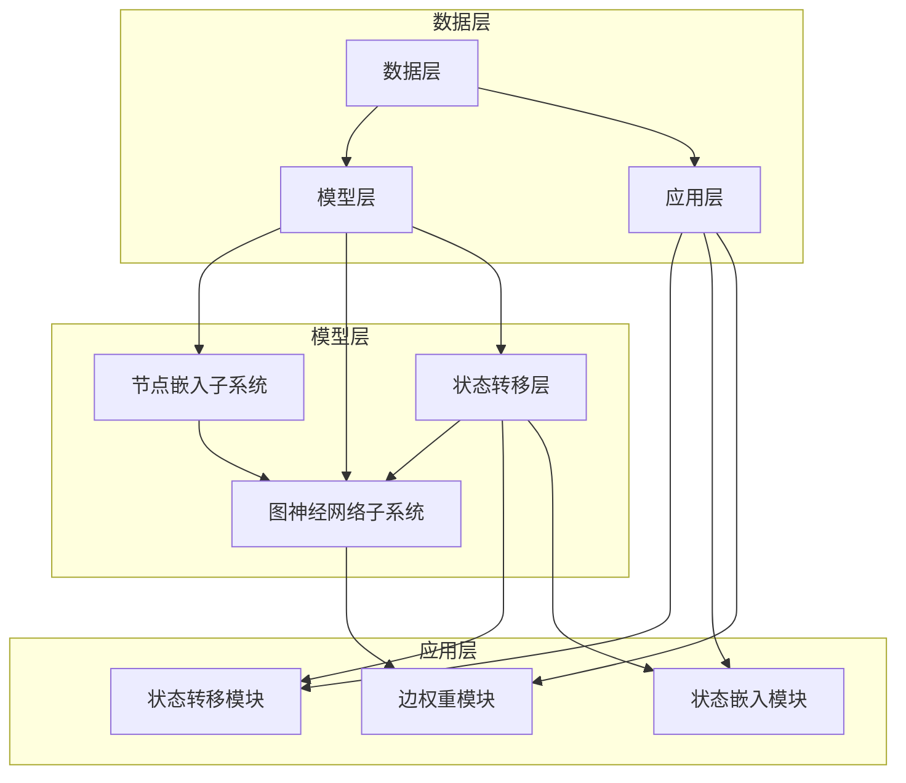
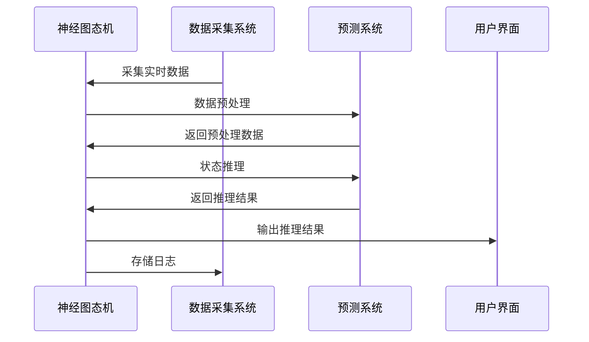
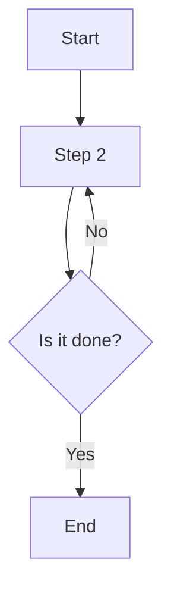

                 

### 引言

在信息技术飞速发展的今天，复杂状态推理系统成为了现代信息系统中的一个重要组成部分。它广泛应用于智能交通、金融风控、智能制造等领域，对系统的稳定性和决策支持起着至关重要的作用。然而，随着系统规模和复杂度的不断增加，传统推理方法在面对海量数据和高维度状态时往往表现出局限性，难以满足实际需求。

为了解决这一问题，本文将探讨一种结合图论和神经网络的创新模型——神经图态机（Neural Graph State Machine, NGSM）。NGSM通过利用图结构来表示状态转移和网络关系，通过神经网络进行状态推理，提供了一种新的思路来解决复杂状态推理问题。本文将从NGSM的基本概念、理论基础、数学模型、系统设计与实现等多个方面进行深入探讨，以期为其在实际应用中提供理论支持和实践指导。

### 第1章 引言

#### 1.1 问题背景

在现代信息系统中，复杂状态推理系统对于系统的稳定性和决策支持起着至关重要的作用。随着信息系统的规模和复杂度不断增加，传统推理方法如逻辑推理、归纳推理和贝叶斯推理等在面对海量数据和高维度状态时逐渐暴露出局限性。例如，在智能交通领域，传统的交通流量预测模型往往依赖于历史数据的统计分析，难以适应实时动态的交通流变化；在金融风控领域，传统的风险评估方法难以捕捉到复杂的金融网络结构和潜在的风险传导路径；在智能制造领域，传统的生产调度算法在面对动态变化的制造环境时也显得力不从心。

传统推理方法在面对高维、非线性、动态变化的状态时，主要存在以下几方面的挑战：

1. **数据维度问题**：高维数据往往包含大量的冗余信息，传统方法难以有效处理这些冗余信息，导致推理效率和准确性降低。

2. **非线性关系处理**：传统推理方法往往基于线性模型，难以处理复杂非线性关系，这限制了其在解决实际问题时的影响力。

3. **实时性要求**：在许多应用场景中，如智能交通、金融风控等，实时性是至关重要的，传统方法往往无法满足这些场景下的实时性要求。

4. **可扩展性问题**：随着数据规模和系统复杂度的增加，传统方法的计算复杂度呈指数级增长，导致其在大规模数据集上的性能急剧下降。

为了解决上述问题，近年来，许多研究者开始探索将图论和神经网络引入到状态推理系统中。图论作为一种描述复杂网络结构的数学工具，能够有效地捕捉和表示系统中的高维、非线性关系；而神经网络作为一种强大的学习模型，能够通过大量的数据训练来提高推理的准确性和实时性。

神经图态机（Neural Graph State Machine, NGSM）正是基于这种思路的一种创新模型。NGSM利用图结构来表示状态转移和网络关系，通过神经网络进行状态推理，能够有效地处理高维、非线性、动态变化的状态。相较于传统方法，NGSM具有以下几个优势：

1. **高效处理高维数据**：NGSM通过图嵌入技术将高维数据映射到低维空间，能够有效降低数据维度，减少冗余信息，提高推理效率。

2. **处理非线性关系**：NGSM利用图结构来表示系统中的非线性关系，通过图神经网络进行学习和推理，能够更好地捕捉和利用这些复杂关系。

3. **实时状态推理**：NGSM通过神经网络训练来提高推理的实时性，能够满足许多实时应用场景的需求。

4. **可扩展性强**：NGSM采用分布式计算和并行处理技术，能够有效地在大规模数据集上运行，具有较好的可扩展性。

本文将详细探讨神经图态机（NGSM）的基本概念、理论基础、数学模型、系统设计与实现，并通过实际应用案例来展示NGSM在复杂状态推理中的潜力和优势。

#### 1.2 NGSM的基本概念

神经图态机（Neural Graph State Machine, NGSM）是一种结合图论和神经网络的模型，其核心在于通过图结构来表示状态转移和网络关系，并通过神经网络进行状态推理。NGSM的基本概念包括以下几个方面：

**1. 图结构**

在NGSM中，系统状态和状态转移关系被表示为图结构。图由节点（Node）和边（Edge）组成，每个节点表示系统中的一个状态，每条边表示状态之间的转移关系。节点和边可以携带额外的属性，如状态的特征值和转移概率等。

**2. 状态嵌入**

状态嵌入（State Embedding）是将高维状态映射到低维向量空间的过程。通过状态嵌入，NGSM能够将复杂的系统状态表示为简单的向量，便于神经网络进行处理。常见的状态嵌入方法包括图嵌入（Graph Embedding）和词嵌入（Word Embedding）等。

**3. 图神经网络**

图神经网络（Graph Neural Network, GNN）是NGSM的核心组成部分。GNN通过学习节点和边的特征，能够捕捉和表示系统中的复杂关系。常见的GNN包括图卷积网络（Graph Convolutional Network, GCN）、图注意力网络（Graph Attention Network, GAT）等。

**4. 状态转移函数**

状态转移函数（State Transition Function）定义了系统状态的更新方式。在NGSM中，状态转移函数通常是一个神经网络模型，它接收当前状态和输入信息，输出下一个状态。状态转移函数的形式可以多种多样，如前馈神经网络、循环神经网络（RNN）等。

**5. 神经图态机模型**

神经图态机模型（Neural Graph State Machine Model）是NGSM的总体架构，包括图嵌入、图神经网络、状态转移函数等组成部分。NGSM模型通过不断的迭代更新状态，实现复杂状态推理。

NGSM相较于传统推理方法具有以下几个特点：

**1. 高维数据处理的灵活性**

NGSM通过状态嵌入技术，能够将高维状态映射到低维空间，有效地降低数据维度，减少冗余信息，提高推理效率。

**2. 复杂关系处理的强大能力**

NGSM利用图神经网络，能够捕捉和表示系统中的复杂非线性关系，从而提高推理的准确性和可靠性。

**3. 实时状态推理的能力**

NGSM通过神经网络训练，能够实现实时状态推理，满足许多实时应用场景的需求。

**4. 可扩展性强**

NGSM采用分布式计算和并行处理技术，能够有效地在大规模数据集上运行，具有较好的可扩展性。

总之，神经图态机（NGSM）作为一种结合图论和神经网络的创新模型，在处理复杂状态推理问题时表现出显著的优势。通过本章的介绍，读者可以对NGSM的基本概念和特点有一个初步的了解，为后续章节的深入探讨打下基础。

#### 1.3 神经图态机在复杂状态推理中的应用

神经图态机（NGSM）作为一种结合图论和神经网络的创新模型，已经在多个领域展示了其强大的推理能力和应用潜力。以下将介绍NGSM在智能交通、金融风控、智能制造等领域的实际应用案例，并探讨这些应用中面临的挑战和机遇。

**1. 智能交通**

在智能交通领域，NGSM被用于交通流量预测和路径规划。通过将交通网络表示为图结构，NGSM能够捕捉不同道路节点和边之间的关系，从而实现实时交通流量预测。例如，在高峰时段，NGSM可以根据历史交通数据和实时数据，预测未来一段时间内的交通流量变化，帮助交通管理部门优化交通信号控制策略，减少交通拥堵。

**挑战与机遇：**
- **挑战**：智能交通系统需要处理大量的实时数据，数据质量和实时性要求较高。此外，不同时间段和天气条件下的交通模式差异较大，增加了推理的复杂性。
- **机遇**：NGSM能够通过图神经网络处理复杂的关系，提高交通流量预测的准确性。同时，随着数据采集技术和传感器技术的发展，NGSM的应用前景将更加广阔。

**2. 金融风控**

在金融风控领域，NGSM被用于客户行为分析和风险预测。通过构建金融网络的图结构，NGSM能够分析客户之间的交易关系和资金流动路径，识别潜在的风险。例如，NGSM可以用于预测客户是否可能存在欺诈行为，从而帮助银行和金融机构采取预防措施。

**挑战与机遇：**
- **挑战**：金融风控需要处理大量的金融交易数据，数据隐私和合规性要求较高。此外，金融市场波动性大，风险预测的实时性要求较高。
- **机遇**：NGSM能够通过图神经网络捕捉复杂的金融关系，提高风险预测的准确性和实时性。随着金融监管技术的进步，NGSM的应用将有助于提升金融系统的安全性和稳定性。

**3. 智能制造**

在智能制造领域，NGSM被用于生产调度和设备故障预测。通过构建生产网络的图结构，NGSM能够分析不同设备之间的依赖关系，实现生产过程的优化调度。例如，NGSM可以根据设备的状态信息和生产任务的需求，预测未来一段时间内的设备使用情况，从而优化生产调度策略，减少设备闲置时间。

**挑战与机遇：**
- **挑战**：智能制造系统需要处理大量的实时生产数据，数据质量和稳定性要求较高。此外，设备故障预测的实时性要求较高，需要快速响应对故障的处理。
- **机遇**：NGSM能够通过图神经网络处理复杂的设备关系，提高生产调度和设备故障预测的准确性和实时性。随着智能制造技术的发展，NGSM的应用将有助于提升生产效率和设备维护水平。

综上所述，神经图态机（NGSM）在智能交通、金融风控、智能制造等领域展示了其强大的应用潜力。尽管在实际应用中面临诸多挑战，但通过不断创新和优化，NGSM有望在更多领域发挥重要作用，推动信息技术的发展。

#### 2.1 图论基础

图论是数学的一个分支，主要研究图的结构、性质以及应用。在神经图态机（NGSM）中，图论提供了表示和操作系统状态转移和网络关系的基础。以下将介绍图论中的基本概念，包括节点（Node）、边（Edge）、路径（Path）、连通性（Connectivity）等。

**1. 节点（Node）**

节点是图的基本元素，表示系统中的一个状态或实体。在NGSM中，每个节点代表一个特定的状态，可以携带相应的属性，如状态的特征值、时间戳等。节点是连接其他节点的基础，通过它们之间的边来建立复杂的网络结构。

**2. 边（Edge）**

边是连接两个节点的线段，表示状态之间的转移关系。在NGSM中，边可以是有向的或无向的，还可以是加权的或非加权的。边的属性可以表示转移的权重，如转移概率、时间延迟等。边的存在和权重可以影响状态转移的动力学行为。

**3. 路径（Path）**

路径是图中节点和边构成的一条序列，表示从一个节点到另一个节点的连接路径。在NGSM中，路径可以用来表示状态转移的历史轨迹，帮助理解系统的状态演变过程。路径长度表示从一个状态转移到另一个状态所需的时间或步骤。

**4. 连通性（Connectivity）**

连通性是指图中任意两个节点之间是否存在路径。在NGSM中，连通性用于判断系统状态之间的可达性。一个图如果所有节点之间都是连通的，则称为连通图。连通性对于理解系统的整体结构和稳定性具有重要意义。

**5. 图的分类**

图可以根据边的方向和权重分为多种类型：

- **无向图（Undirected Graph）**：边无方向，如社交网络图。
- **有向图（Directed Graph）**：边有方向，如网页链接图。
- **加权图（Weighted Graph）**：边带有权重，如交通网络图。
- **无权图（Unweighted Graph）**：边无权重，如社交网络图。

**6. 图的运算**

图论中包含多种运算，如加法、减法、补图等：

- **图加法（Graph Addition）**：将两个图合并，形成一个新的图。
- **图减法（Graph Subtraction）**：从一个图中删除一部分节点和边，形成一个新的图。
- **补图（Complement Graph）**：与原图互补的图，表示原图中不存在的关系。

通过图论的基本概念和分类，我们可以更有效地理解和操作神经图态机中的图结构，为NGSM模型的构建和应用提供基础。

#### 2.2 神经网络基础

神经网络（Neural Networks）是模仿人脑结构和功能的一种计算模型，通过大量神经元之间的连接和相互作用来进行数据处理和智能决策。在神经图态机（NGSM）中，神经网络是实现状态推理的核心组件。以下将介绍神经网络的基本概念，包括神经元、神经网络和激活函数。

**1. 神经元（Neuron）**

神经元是神经网络的基本单元，类似于生物大脑中的神经元。每个神经元接收多个输入信号，通过加权求和处理后，再通过一个激活函数产生输出。神经元的结构通常包括输入层、加权层和输出层。输入信号乘以相应的权重，然后相加得到总输入，再通过激活函数进行非线性变换，产生输出信号。

**2. 神经网络（Neural Network）**

神经网络是由多个神经元组成的复杂网络结构，通过层次化的连接关系来实现数据的层次化处理。常见的神经网络结构包括：

- **前馈神经网络（Feedforward Neural Network, FFNN）**：信息从输入层依次流向输出层，没有反向传播过程。
- **卷积神经网络（Convolutional Neural Network, CNN）**：适用于图像处理，通过卷积层来提取图像特征。
- **循环神经网络（Recurrent Neural Network, RNN）**：适用于序列数据，通过循环结构来保持长时记忆。
- **生成对抗网络（Generative Adversarial Network, GAN）**：由生成器和判别器组成，通过对抗训练生成真实数据。

**3. 激活函数（Activation Function）**

激活函数是神经网络中的关键组件，用于引入非线性变换，使神经网络能够进行复杂的模式识别和分类。常见的激活函数包括：

- **sigmoid函数**：\( \sigma(x) = \frac{1}{1 + e^{-x}} \)，将输入映射到(0, 1)区间。
- **ReLU函数**：\( \text{ReLU}(x) = \max(0, x) \)，将输入大于0的部分映射到自身，小于0的部分映射到0。
- **Tanh函数**：\( \tanh(x) = \frac{e^x - e^{-x}}{e^x + e^{-x}} \)，将输入映射到(-1, 1)区间。
- **Softmax函数**：用于多分类问题，将输入向量映射到概率分布。

激活函数的选择对神经网络的性能和训练过程有重要影响。合适的激活函数可以提高模型的收敛速度和分类准确率。

**4. 神经网络的训练**

神经网络的训练是通过反向传播算法（Backpropagation Algorithm）来调整神经元权重，使其能够正确预测输入数据。训练过程主要包括以下几个步骤：

1. **前向传播（Forward Propagation）**：将输入数据传递到神经网络，通过逐层计算得到输出结果。
2. **计算误差（Error Calculation）**：通过比较输出结果和真实值，计算预测误差。
3. **反向传播（Backpropagation）**：将误差传递回神经网络，通过梯度下降（Gradient Descent）算法调整权重。
4. **更新权重（Weight Update）**：根据误差梯度调整神经网络中的权重，使模型逐渐逼近真实值。

通过以上步骤，神经网络可以不断优化，提高其预测能力和泛化能力。

总之，神经网络是神经图态机（NGSM）的重要组成部分，通过其复杂的网络结构和自适应学习能力，能够有效地处理高维、非线性、动态变化的系统状态，为复杂状态推理提供强大的技术支持。

### 2.3 神经图态机模型

神经图态机（Neural Graph State Machine, NGSM）是一种结合图论和神经网络的创新模型，其核心在于通过图结构来表示系统状态和状态转移关系，并通过神经网络进行状态推理。以下将详细描述NGSM的模型架构、组成结构及其核心算法。

**1. 模型架构**

NGSM的模型架构主要包括三个关键部分：图嵌入层、图神经网络层和状态转移层。这三个部分相互协作，共同实现复杂状态推理。

- **图嵌入层（Graph Embedding Layer）**：用于将系统状态映射到低维向量空间。通过图嵌入，复杂的系统状态可以表示为简单的向量，便于后续的神经网络处理。
- **图神经网络层（Graph Neural Network Layer）**：用于学习和表示系统状态之间的复杂关系。通过图神经网络，NGSM能够捕捉状态转移的网络结构，提高推理的准确性和实时性。
- **状态转移层（State Transition Layer）**：用于实现状态更新和状态推理。通过神经网络模型，状态转移层能够根据当前状态和输入信息，预测下一个状态。

**2. 组成结构**

NGSM的组成结构包括节点（Node）、边（Edge）和图嵌入（Graph Embedding）等基本元素。

- **节点（Node）**：每个节点表示系统中的一个状态，可以携带相应的属性，如状态的特征值、时间戳等。
- **边（Edge）**：每条边表示节点之间的转移关系，可以是有向的或无向的，还可以是加权的或非加权的。边的属性可以表示转移的权重，如转移概率、时间延迟等。
- **图嵌入（Graph Embedding）**：用于将高维节点映射到低维向量空间。常见的图嵌入方法包括节点嵌入（Node Embedding）和边嵌入（Edge Embedding）。

**3. 核心算法**

NGSM的核心算法主要包括图嵌入算法、图神经网络算法和状态转移算法。

- **图嵌入算法**：图嵌入是将高维节点映射到低维向量空间的过程。常见的图嵌入方法包括基于矩阵分解的方法（如DeepWalk、Node2Vec）和基于图神经网络的方法（如GraphSAGE、GAT）。图嵌入算法能够降低数据的维度，减少冗余信息，提高神经网络处理的效率。
- **图神经网络算法**：图神经网络（GNN）是NGSM的核心组件，用于学习和表示节点和边之间的复杂关系。常见的GNN包括图卷积网络（GCN）、图注意力网络（GAT）等。GNN通过聚合节点和边的特征，能够捕捉到系统状态之间的非线性关系，提高推理的准确性和实时性。
- **状态转移算法**：状态转移算法定义了系统状态的更新方式。在NGSM中，状态转移算法通常是一个神经网络模型，它接收当前状态和输入信息，输出下一个状态。状态转移算法的形式可以多种多样，如前馈神经网络、循环神经网络（RNN）等。

**4. 工作流程**

NGSM的工作流程可以概括为以下几个步骤：

1. **初始化**：初始化图结构和节点状态。
2. **图嵌入**：将节点映射到低维向量空间，生成图嵌入向量。
3. **图神经网络**：通过图神经网络层学习节点和边之间的复杂关系，生成新的特征表示。
4. **状态转移**：根据当前状态和输入信息，通过状态转移层预测下一个状态。
5. **迭代更新**：重复执行上述步骤，不断更新系统状态，实现实时推理。

通过以上描述，读者可以对神经图态机（NGSM）的模型架构、组成结构和核心算法有一个全面的了解。NGSM作为一种结合图论和神经网络的创新模型，在处理复杂状态推理问题时展现出强大的能力和潜力。接下来，本文将详细介绍NGSM中的数学模型和核心算法，进一步探讨其原理和应用。

### 3.1 数学模型介绍

在神经图态机（NGSM）中，数学模型是理解和实现状态推理的核心。以下将介绍NGSM中常用的数学模型，包括状态转移方程、节点嵌入和边权重等。

**1. 状态转移方程**

状态转移方程是NGSM中最基本的数学模型，用于描述系统状态的更新过程。状态转移方程的一般形式为：

\[ s_{t+1} = f(s_t, x_t, u_t) \]

其中，\( s_t \) 表示第 \( t \) 时刻的系统状态，\( x_t \) 表示外部输入信息，\( u_t \) 表示控制变量。函数 \( f \) 定义了状态更新的规则，通常是一个神经网络模型。状态转移方程描述了系统状态的演化过程，通过不断地迭代更新状态，实现实时状态推理。

**2. 节点嵌入**

节点嵌入是将高维节点映射到低维向量空间的过程，是NGSM中进行图嵌入的关键步骤。节点嵌入的一般形式为：

\[ \phi_i = \text{embedding}(v_i) \]

其中，\( \phi_i \) 表示第 \( i \) 个节点的嵌入向量，\( v_i \) 表示节点 \( i \) 的原始特征向量。函数 \( \text{embedding} \) 是节点嵌入算法，常见的节点嵌入算法包括DeepWalk、Node2Vec和GraphSAGE等。节点嵌入向量是神经网络处理的基础，通过降低数据维度，减少冗余信息，提高推理效率。

**3. 边权重**

边权重是描述节点之间转移关系的参数，通常表示为边上的权重值。边权重的一般形式为：

\[ w_{ij} = \text{weight}(e_{ij}) \]

其中，\( w_{ij} \) 表示节点 \( i \) 和节点 \( j \) 之间的边权重，\( e_{ij} \) 表示边 \( i \) 和 \( j \) 之间的特征向量。函数 \( \text{weight} \) 是边权重计算方法，常见的边权重计算方法包括基于特征向量的加权、基于路径的加权等。边权重用于影响状态转移的概率和速度，是NGSM中进行状态推理的重要参数。

**4. 状态转移概率**

在NGSM中，状态转移概率是描述系统状态转移的动态特性的重要指标。状态转移概率的一般形式为：

\[ P(s_{t+1} | s_t, x_t, u_t) = \text{softmax}(W \cdot f(s_t, x_t, u_t)) \]

其中，\( P(s_{t+1} | s_t, x_t, u_t) \) 表示在第 \( t \) 时刻给定状态 \( s_t \)，外部输入 \( x_t \) 和控制变量 \( u_t \) 的条件下，下一个状态 \( s_{t+1} \) 的转移概率。函数 \( \text{softmax} \) 是一种归一化函数，用于将神经网络输出的高维向量映射到概率分布。状态转移概率反映了系统状态的动态变化规律，是NGSM进行实时状态推理的重要依据。

通过以上数学模型，读者可以对NGSM中的状态转移、节点嵌入和边权重等关键概念有一个深入的理解。这些数学模型为NGSM的实现提供了理论基础，是理解和应用NGSM的重要工具。

### 3.2 节点嵌入

节点嵌入（Node Embedding）是将高维节点映射到低维向量空间的过程，是神经图态机（NGSM）进行状态推理的基础步骤。节点嵌入的核心目的是降低数据维度，减少冗余信息，从而提高神经网络的计算效率和推理准确性。以下将详细介绍节点嵌入的数学模型和计算方法。

**1. 数学模型**

节点嵌入的数学模型可以表示为：

\[ \phi_i = \text{embedding}(v_i) \]

其中，\( \phi_i \) 表示第 \( i \) 个节点的嵌入向量，\( v_i \) 表示节点 \( i \) 的原始特征向量。函数 \( \text{embedding} \) 是节点嵌入算法，常见的节点嵌入算法包括DeepWalk、Node2Vec和GraphSAGE等。

**2. 计算方法**

**（1）DeepWalk算法**

DeepWalk算法是一种基于随机游走（Random Walk）的节点嵌入方法。其主要思想是生成大量的随机游走路径，将节点表示为这些路径上的单词。具体步骤如下：

- **随机游走**：从一个节点开始，以固定的步数进行随机游走，记录游走路径。
- **构建词汇表**：将所有游走路径中的节点转换为单词，构建词汇表。
- **训练词向量**：使用Skip-gram模型（word2vec）对词汇表进行训练，得到每个节点的嵌入向量。

**（2）Node2Vec算法**

Node2Vec算法是一种基于图结构优化的节点嵌入方法。其主要思想是在图上进行随机游走，同时考虑游走路径的深度和广度。具体步骤如下：

- **随机游走**：从一个节点开始，以一定的概率向相邻节点进行随机游走。
- **路径权重**：为每个节点之间的边分配权重，如基于节点的度、邻居节点的流行度等。
- **训练词向量**：使用向量模型（如Word2Vec、GloVe）对节点进行训练，得到每个节点的嵌入向量。

**（3）GraphSAGE算法**

GraphSAGE算法是一种基于图神经网络的节点嵌入方法。其主要思想是聚合节点的邻居信息，生成节点的嵌入向量。具体步骤如下：

- **邻居聚合**：为每个节点选择一组邻居节点。
- **特征聚合**：使用神经网络对邻居节点的特征进行聚合，生成新的特征向量。
- **嵌入更新**：将新的特征向量与节点的原始特征向量进行融合，更新节点的嵌入向量。

**3. 案例分析**

**案例1：智能交通**

在智能交通领域，节点嵌入用于将交通网络中的节点（如路口、路段）映射到低维向量空间。通过节点嵌入，NGSM能够有效地处理高维的交通状态数据，提高交通流量预测的准确性和实时性。

- **数据预处理**：将交通网络表示为图结构，提取节点和边。
- **节点嵌入**：使用Node2Vec算法对交通网络中的节点进行嵌入，得到每个节点的低维向量表示。
- **状态推理**：将节点嵌入向量作为输入，使用NGSM进行交通流量预测和路径规划。

**案例2：金融风控**

在金融风控领域，节点嵌入用于将金融网络中的节点（如客户、交易）映射到低维向量空间。通过节点嵌入，NGSM能够有效地分析客户之间的交易关系和资金流动路径，预测潜在的风险。

- **数据预处理**：将金融网络表示为图结构，提取节点和边。
- **节点嵌入**：使用DeepWalk算法对金融网络中的节点进行嵌入，得到每个节点的低维向量表示。
- **状态推理**：将节点嵌入向量作为输入，使用NGSM进行客户行为分析和风险预测。

通过节点嵌入，NGSM能够有效地处理高维、复杂的系统状态，提高推理的准确性和实时性。节点嵌入在多个领域的实际应用中展示了其强大的潜力和优势。

### 3.3 边权重

在神经图态机（NGSM）中，边权重是描述节点之间转移关系的参数，对于系统的状态推理和决策支持起着至关重要的作用。边权重不仅影响了状态转移的概率，还影响了系统整体的动态特性。以下将详细介绍边权重的计算方法及其如何影响状态转移。

**1. 边权重计算方法**

边权重（Edge Weight）是表示节点之间连接强度的参数，通常由以下几个因素决定：

- **邻接矩阵**：邻接矩阵是图结构的基础表示，其中元素 \( w_{ij} \) 表示节点 \( i \) 和节点 \( j \) 之间的连接强度。邻接矩阵可以通过直接观测数据或先验知识构建。
- **节点属性**：节点的属性特征，如度（Degree）、中心性（Centrality）、重要性等，都可以作为边权重的影响因素。例如，节点度越高，其边权重可能越大，表示其在网络中的重要性较高。
- **边特征**：边的特征，如边的长度、延迟、带宽等，也可以直接影响边权重。这些特征通常可以通过实际观测或模拟计算得到。
- **时间动态**：在某些动态网络中，边权重可能随时间变化而调整。例如，在交通网络中，实时交通流量和路况信息可以用于动态调整边权重。

以下是一些常见的边权重计算方法：

- **线性加权法**：根据节点的属性特征，将各个特征分量进行线性组合，得到边权重。例如，设 \( a_i \) 和 \( b_i \) 分别为节点 \( i \) 的属性特征分量，权重 \( w_{ij} \) 可表示为 \( w_{ij} = \alpha a_i + \beta b_i \)。
- **基于距离的加权法**：根据节点之间的距离（如欧几里得距离、曼哈顿距离等）计算边权重。距离越近，权重越大。
- **自适应加权法**：根据系统的实时状态和需求动态调整边权重。这种方法通常需要使用机器学习算法，如梯度下降法或神经网络，来优化权重。

**2. 边权重对状态转移的影响**

边权重直接影响状态转移的概率和速度。以下是一些具体的影响：

- **转移概率**：边权重决定了从一个状态转移到另一个状态的概率。权重越大，转移概率越高。例如，在智能交通中，道路上的流量和路况信息可以用来动态调整边权重，从而影响交通流量的分布和路径选择。
- **动态特性**：边权重的变化会影响系统的动态特性。例如，在金融风控中，客户之间的交易关系和资金流动路径的权重可以影响潜在风险的计算和预测。边权重的调整可以帮助系统更好地适应动态变化的环境。
- **稳定性**：边权重的稳定性和准确性对系统的稳定性至关重要。在实际应用中，需要确保边权重的计算方法能够适应数据的变化，避免过度波动或偏差。

**3. 案例分析**

**案例1：智能交通**

在智能交通系统中，边权重用于描述不同路段之间的流量转移关系。通过实时监控交通流量和路况信息，可以动态调整边权重，从而优化交通信号控制和路径规划。

- **数据采集**：实时采集交通流量、路况信息和车辆速度等数据。
- **权重计算**：使用基于距离的加权法，根据路段之间的距离和流量信息计算边权重。
- **状态转移**：根据边权重和交通状态信息，使用NGSM进行交通流量预测和路径规划。

**案例2：金融风控**

在金融风控系统中，边权重用于描述客户之间的交易关系和资金流动路径。通过分析客户交易数据，可以动态调整边权重，从而预测潜在的风险和监控异常交易。

- **数据预处理**：对客户交易数据进行清洗和预处理，提取交易对和交易金额等特征。
- **权重计算**：使用线性加权法，根据交易金额、交易频率等特征计算边权重。
- **状态转移**：使用NGSM分析客户交易关系，预测潜在风险和监控异常交易。

通过边权重的合理计算和应用，NGSM能够更好地处理复杂的状态转移关系，提高系统的准确性和稳定性。边权重是NGSM中的一个关键参数，其计算方法的选择和应用直接影响系统的性能和效果。

### 3.4 案例说明

为了更好地理解神经图态机（NGSM）的数学模型及其应用，以下将通过实际案例对NGSM在复杂状态推理中的应用进行详细讲解。本案例将分别从智能交通和金融风控两个领域进行说明。

#### 案例一：智能交通

**问题描述**：智能交通系统中，需要预测未来一段时间内的交通流量分布，以优化交通信号控制和路径规划，减少交通拥堵。

**解决方案**：使用NGSM进行交通流量预测，通过状态嵌入和状态转移来实现实时推理。

**步骤1：数据采集与预处理**

- **数据采集**：收集实时交通流量、路况信息、天气状况等数据。
- **数据预处理**：对数据进行分析和清洗，提取有效的交通流量特征，如车辆密度、路段长度等。

**步骤2：状态嵌入**

- **节点嵌入**：将交通网络中的节点（如路口、路段）映射到低维向量空间，使用Node2Vec算法进行节点嵌入。
- **边权重计算**：根据节点之间的距离和交通流量信息，使用基于距离的加权法计算边权重。

**步骤3：状态转移**

- **状态转移方程**：使用NGSM中的状态转移方程，将当前状态和输入信息通过神经网络模型更新为下一个状态。
- **状态转移概率**：计算每个状态转移到下一个状态的概率，使用softmax函数进行归一化处理。

**步骤4：交通流量预测**

- **迭代更新**：根据状态转移概率，不断更新交通流量状态，预测未来一段时间内的交通流量分布。
- **路径规划**：根据预测结果，为不同车辆规划最优路径，优化交通信号控制。

**案例分析**：在实际应用中，NGSM能够实时更新交通流量状态，并根据路况信息动态调整边权重。通过预测交通流量分布和路径规划，智能交通系统能够有效减少交通拥堵，提高交通效率。

#### 案例二：金融风控

**问题描述**：金融风控系统中，需要分析客户交易行为，预测潜在的风险和监控异常交易。

**解决方案**：使用NGSM进行客户行为分析和风险预测，通过状态嵌入和状态转移来实现实时推理。

**步骤1：数据采集与预处理**

- **数据采集**：收集客户交易数据，包括交易对、交易金额、交易时间等。
- **数据预处理**：对交易数据进行清洗和分类，提取有效的交易特征。

**步骤2：状态嵌入**

- **节点嵌入**：将金融网络中的节点（如客户、交易对）映射到低维向量空间，使用DeepWalk算法进行节点嵌入。
- **边权重计算**：根据节点之间的交易关系和交易金额，使用线性加权法计算边权重。

**步骤3：状态转移**

- **状态转移方程**：使用NGSM中的状态转移方程，将当前交易状态和输入信息通过神经网络模型更新为下一个状态。
- **状态转移概率**：计算每个交易状态转移到下一个状态的概率，使用softmax函数进行归一化处理。

**步骤4：风险预测**

- **迭代更新**：根据状态转移概率，不断更新客户交易状态，预测未来一段时间内的潜在风险。
- **异常交易监控**：根据预测结果，监控异常交易行为，触发风险预警。

**案例分析**：在实际应用中，NGSM能够实时分析客户交易行为，并根据交易关系和交易金额动态调整边权重。通过预测潜在风险和监控异常交易，金融风控系统能够有效防范金融风险，保障金融系统的安全性。

通过以上案例分析，可以看出NGSM在智能交通和金融风控领域具有广泛的应用前景。NGSM的数学模型和算法原理为复杂状态推理提供了有效的技术支持，有助于提升系统的实时性和准确性。

### 4.1 系统功能设计

在神经图态机（NGSM）的应用中，系统功能设计是关键的一步。系统功能设计主要包括领域模型的构建，以清晰明确地定义系统中的各个实体及其关系。

**1. 领域模型**

领域模型是系统功能设计的基础，它通过实体关系图（Entity Relationship Diagram, ERD）来描述系统中的核心实体及其关系。在NGSM的领域模型中，主要包含以下几个核心实体：

- **节点（Node）**：表示系统中的状态，如交通流量中的各个路段、金融风控中的各个客户等。
- **边（Edge）**：表示节点之间的状态转移关系，如交通流量中的路段连接、金融风控中的交易关系等。
- **状态嵌入（State Embedding）**：表示节点的低维向量表示，用于神经网络处理。
- **边权重（Edge Weight）**：表示节点之间的权重，影响状态转移的概率和速度。

使用Mermaid类图来表示NGSM的领域模型，如下所示：

```mermaid
classDiagram
    Node <<entity>> "节点"
    Edge <<entity>> "边"
    StateEmbedding <<entity>> "状态嵌入"
    EdgeWeight <<entity>> "边权重"

    Node o--o StateEmbedding : 映射
    Node o--o Edge : 转移
    Edge o--o EdgeWeight : 权重
```

**2. 功能定义**

在领域模型的基础上，NGSM的功能定义进一步明确了各个实体之间的关系和操作。主要功能包括：

- **节点嵌入**：将高维节点映射到低维向量空间，便于神经网络处理。
- **状态转移**：根据当前状态和输入信息，通过神经网络模型预测下一个状态。
- **边权重调整**：根据实时数据和系统需求，动态调整节点之间的权重。
- **状态推理**：通过迭代更新状态，实现复杂状态推理和实时决策支持。

**3. 实现细节**

在系统功能设计中，实现细节是确保系统高效运行的重要环节。以下是一些关键实现细节：

- **节点嵌入算法选择**：根据应用场景和数据特性选择合适的节点嵌入算法，如DeepWalk、Node2Vec或GraphSAGE等。
- **状态转移神经网络设计**：设计合适的神经网络结构，如前馈神经网络、循环神经网络（RNN）或图注意力网络（GAT）等，确保状态转移的准确性和实时性。
- **边权重计算方法**：根据实际需求选择合适的边权重计算方法，如基于距离的加权法、线性加权法或自适应加权法等。
- **系统优化**：通过并行计算和分布式处理技术，优化系统的运行效率和扩展性。

通过系统功能设计，NGSM能够高效地实现复杂状态推理，满足不同领域的实时决策需求。

### 4.2 系统架构设计

在神经图态机（NGSM）的应用中，系统架构设计是确保系统高效、稳定运行的关键。合理的系统架构设计能够提高系统的可扩展性和可维护性，同时确保NGSM在复杂状态推理中的性能表现。以下将详细介绍NGSM的系统架构设计，包括系统架构图、模块划分、各模块的功能和模块之间的关系。

**1. 系统架构图**

NGSM的系统架构采用分层设计，主要包括数据层、模型层和应用层。以下是NGSM的系统架构图，使用Mermaid绘制：



**2. 模块划分**

NGSM的系统架构设计分为以下几个主要模块：

- **数据层（Data Layer）**：数据层负责数据采集、存储和预处理，包括原始数据的收集、清洗和特征提取。数据层是整个系统的数据入口，为模型层提供高质量的数据输入。

- **模型层（Model Layer）**：模型层是NGSM的核心，包括节点嵌入子系统（Node Embedding Subsystem）、图神经网络子系统（Graph Neural Network Subsystem）和状态转移层（State Transition Layer）。每个子系统都有特定的功能，共同实现复杂状态推理。

  - **节点嵌入子系统（Node Embedding Subsystem，NES）**：负责将高维节点映射到低维向量空间，生成节点嵌入向量。NES通常采用DeepWalk、Node2Vec或GraphSAGE等节点嵌入算法。

  - **图神经网络子系统（Graph Neural Network Subsystem，GNN）**：负责学习和表示节点和边之间的复杂关系。GNN包括多个图卷积层和池化层，通过聚合节点和边的特征，生成新的特征表示。

  - **状态转移层（State Transition Layer，STL）**：负责根据当前状态和输入信息，通过神经网络模型预测下一个状态。STL通常采用前馈神经网络、循环神经网络（RNN）或图注意力网络（GAT）等模型。

- **应用层（Application Layer）**：应用层负责实现具体的应用功能，包括状态转移模块（State Transition Module，ST）、状态嵌入模块（State Embedding Module，ES）和边权重模块（Edge Weight Module，RW）。应用层通过调用模型层提供的服务，实现系统的实时推理和决策支持。

**3. 模块功能**

- **数据层**：数据层的主要功能是数据采集和预处理。数据采集模块负责从外部系统获取实时数据，如交通流量数据、金融交易数据等。数据预处理模块负责对原始数据进行分析、清洗和特征提取，为模型层提供高质量的数据输入。

- **节点嵌入子系统**：节点嵌入子系统的功能是将高维节点映射到低维向量空间，生成节点嵌入向量。通过节点嵌入，系统能够有效地降低数据维度，减少冗余信息，提高推理效率。

- **图神经网络子系统**：图神经网络子系统的功能是学习和表示节点和边之间的复杂关系。通过图卷积网络和池化层，系统能够捕捉节点和边之间的非线性关系，生成新的特征表示，提高状态推理的准确性和实时性。

- **状态转移层**：状态转移层的功能是根据当前状态和输入信息，通过神经网络模型预测下一个状态。状态转移层通过迭代更新状态，实现实时状态推理和动态决策支持。

- **状态转移模块**：状态转移模块的功能是根据状态转移概率，更新系统状态。状态转移模块通过调用状态转移层的神经网络模型，实现系统的实时推理和决策支持。

- **状态嵌入模块**：状态嵌入模块的功能是将系统状态映射到低维向量空间，生成状态嵌入向量。状态嵌入模块通过调用节点嵌入子系统提供的服务，实现系统状态的嵌入。

- **边权重模块**：边权重模块的功能是根据实时数据和系统需求，动态调整节点之间的权重。边权重模块通过调用图神经网络子系统提供的服务，实现系统边权重的计算和调整。

**4. 模块之间的关系**

- **数据层与模型层**：数据层为模型层提供高质量的数据输入，模型层通过处理这些数据生成节点嵌入向量、状态转移概率等结果。
- **模型层与应用层**：模型层为应用层提供状态转移层、节点嵌入子系统、图神经网络子系统的服务，应用层通过调用这些服务实现系统的实时推理和决策支持。
- **各模块之间的交互**：系统中的各个模块通过接口进行交互，实现数据流动和功能协同。例如，状态转移模块调用状态转移层的服务进行状态更新，边权重模块调用图神经网络子系统的服务计算和调整边权重。

通过系统架构设计，NGSM能够高效、稳定地实现复杂状态推理，满足不同领域的实时决策需求。系统架构的合理设计不仅提高了系统的性能和可扩展性，也为后续的系统维护和优化提供了坚实基础。

### 4.3 系统接口设计

在神经图态机（NGSM）的系统架构中，系统接口设计是确保模块间有效通信和协同工作的重要环节。合理的接口设计能够提高系统的可扩展性和可维护性，使各个模块能够高效地交互和协作。以下将详细描述NGSM的接口设计，包括输入接口和输出接口的详细说明。

**1. 输入接口**

NGSM的输入接口负责接收外部数据和系统输入，包括以下主要内容：

- **节点信息**：输入接口接收系统中的节点信息，如节点的ID、属性（如交通流量、客户行为等）以及节点之间的邻接关系。
- **边信息**：输入接口接收节点之间的边信息，如边的ID、权重（如交通流量、交易金额等）以及边的属性。
- **实时数据**：输入接口接收实时数据流，如交通流量数据、金融交易数据等，这些数据用于更新系统的状态。
- **用户命令**：输入接口接收用户通过界面或其他方式提交的命令，如查询当前状态、调整参数等。

具体接口设计如下：

- **NodeInput**：接收节点信息的接口，包括节点ID、节点属性列表。
- **EdgeInput**：接收边信息的接口，包括边ID、边权重、边属性列表。
- **RealtimeDataStream**：接收实时数据流的接口，包括数据类型、数据值、时间戳。
- **UserCommand**：接收用户命令的接口，包括命令类型、命令参数。

**2. 输出接口**

NGSM的输出接口负责将处理结果和系统状态传递给外部系统或用户，包括以下主要内容：

- **状态预测**：输出接口提供状态预测结果，如预测的交通流量、金融风险等级等。
- **状态更新**：输出接口提供系统状态更新信息，包括当前状态的节点嵌入向量、状态转移概率等。
- **系统日志**：输出接口提供系统运行日志，包括运行状态、异常信息等，用于系统监控和调试。
- **用户反馈**：输出接口提供用户交互反馈，如操作结果、错误提示等。

具体接口设计如下：

- **StatePrediction**：提供状态预测结果的接口，包括状态ID、预测值、置信度。
- **StateUpdate**：提供状态更新信息的接口，包括节点嵌入向量、状态转移概率等。
- **SystemLog**：提供系统日志的接口，包括日志级别、日志内容、时间戳。
- **UserFeedback**：提供用户反馈信息的接口，包括反馈类型、反馈内容。

**3. 接口设计原则**

- **模块解耦**：接口设计应确保各个模块之间的高内聚、低耦合，使模块能够独立开发和维护。
- **标准化**：接口设计应遵循标准化原则，使用统一的接口规范，便于集成和扩展。
- **可扩展性**：接口设计应具有较好的可扩展性，能够适应未来系统的扩展需求。
- **安全性**：接口设计应确保数据传输的安全性，采用加密、认证等安全措施。

通过详细的接口设计，NGSM能够实现模块间的高效通信和数据流转，确保系统的稳定运行和灵活扩展。

### 4.4 系统交互

在神经图态机（NGSM）的应用中，系统交互设计是确保不同模块和外部系统之间能够有效协同工作的重要环节。以下将使用Mermaid序列图详细描述NGSM与其他系统的交互过程，包括数据流动、模块调用和事件处理等。

**1. 序列图概述**

NGSM的交互序列图包括以下几个主要步骤：

- **数据采集**：NGSM从外部系统或传感器中采集实时数据。
- **数据处理**：NGSM对采集到的数据进行预处理，包括数据清洗、特征提取等。
- **状态推理**：NGSM使用预处理后的数据，通过内部模型进行状态推理。
- **结果输出**：NGSM将推理结果输出到外部系统或用户界面。

以下是NGSM与其他系统交互的Mermaid序列图：



**2. 数据流动**

在交互过程中，数据流动是核心部分。以下是详细的数据流动描述：

- **实时数据采集**：数据采集系统（ED）定期或实时地从传感器、外部接口等获取数据，并将数据发送给NGSM。
- **数据预处理**：NGSM接收到的数据首先经过预处理模块（PD），进行数据清洗、特征提取和转换等操作，生成高质量的数据。
- **状态推理**：预处理后的数据被输入到状态推理模块（PD），通过NGSM的内部模型进行状态推理，生成预测结果。
- **结果输出**：推理结果被传递到用户界面（UI），供用户查看。同时，系统日志被存储，以便后续监控和分析。

**3. 模块调用**

NGSM的各个模块通过明确的接口进行调用，以下是主要模块的调用流程：

- **数据采集系统调用NGSM**：数据采集系统（ED）通过标准接口将实时数据发送给NGSM，触发数据预处理流程。
- **NGSM调用预处理模块**：NGSM接收数据后，调用预处理模块（PD）对数据进行处理。
- **预处理模块调用状态推理模块**：预处理模块（PD）将处理后的数据传递给状态推理模块（PD），进行状态推理。
- **状态推理模块调用用户界面**：状态推理模块（PD）将推理结果通过接口传递给用户界面（UI），供用户查看。

**4. 事件处理**

在交互过程中，事件处理是确保系统响应及时和准确的关键。以下是NGSM的事件处理流程：

- **实时数据到达事件**：当实时数据到达时，数据采集系统（ED）触发数据采集事件，并将数据发送给NGSM。
- **数据处理完成事件**：预处理模块（PD）在数据处理完成后，触发数据处理完成事件，通知NGSM继续进行状态推理。
- **状态推理完成事件**：状态推理模块（PD）在完成状态推理后，触发状态推理完成事件，并将结果输出到用户界面（UI）。
- **异常处理事件**：如果在数据采集、预处理或状态推理过程中出现异常，系统将触发异常处理事件，记录错误日志并采取相应的补救措施。

通过上述系统交互设计，NGSM能够高效、稳定地与其他系统协同工作，实现复杂状态推理和实时决策支持。

### 5.1 环境安装与配置

在开始进行神经图态机（NGSM）的项目实战之前，需要首先搭建一个合适的环境，以便进行开发和测试。以下将详细说明如何安装和配置NGSM的开发环境，包括所需的软件和硬件配置。

**1. 软件环境**

为了搭建NGSM的开发环境，需要安装以下软件：

- **Python**：Python是NGSM的主要编程语言，版本应不低于3.6。
- **PyTorch**：PyTorch是一个强大的深度学习框架，用于构建和训练NGSM模型。
- **Scikit-learn**：Scikit-learn是一个机器学习库，用于数据预处理和特征提取。
- **NetworkX**：NetworkX是一个图操作库，用于构建和操作图结构。
- **Mermaid**：Mermaid用于绘制流程图和架构图。

安装步骤如下：

```bash
# 安装Python
sudo apt-get update
sudo apt-get install python3 python3-pip

# 安装PyTorch
pip3 install torch torchvision torchaudio

# 安装Scikit-learn
pip3 install scikit-learn

# 安装NetworkX
pip3 install networkx

# 安装Mermaid
pip3 install mermaid-python
```

**2. 硬件环境**

NGSM的开发和测试需要一定的硬件资源，推荐以下配置：

- **CPU**：至少4核处理器，建议使用Intel i7或同等性能的CPU。
- **内存**：至少16GB内存，推荐32GB及以上。
- **硬盘**：至少500GB SSD硬盘空间，用于存储数据和模型。

**3. 环境配置**

完成软件安装后，进行以下配置：

- **配置Python环境变量**：确保Python环境变量正确设置，可以使用以下命令检查：

```bash
which python3
python3 --version
```

- **配置PyTorch依赖**：根据操作系统和CPU架构，下载并安装相应的PyTorch版本。可以通过以下命令进行安装：

```bash
pip3 install torch==1.8.0 torchvision==0.9.0 torchaudio==0.8.0
```

- **配置Scikit-learn和NetworkX**：确保Scikit-learn和NetworkX已成功安装：

```bash
pip3 install scikit-learn
pip3 install networkx
```

- **配置Mermaid**：确保Mermaid已正确安装，并在Markdown编辑器中启用：

```bash
pip3 install mermaid-python
```

在Markdown编辑器中，可以通过以下代码块启用Mermaid：



完成上述步骤后，NGSM的开发环境即已搭建完成。接下来，可以开始进行NGSM的系统核心实现和项目实战。

### 5.2 系统核心实现

在搭建好开发环境之后，我们将开始实现神经图态机（NGSM）的系统核心部分。以下是系统核心实现的详细步骤和代码解析，包括模型定义、数据预处理和模型训练。

**1. 模型定义**

NGSM的核心组件包括图嵌入层、图神经网络层和状态转移层。以下是一个简单的Python代码示例，使用PyTorch定义NGSM模型：

```python
import torch
import torch.nn as nn
import torch.nn.functional as F
from torch_geometric.nn import GCNConv

class NGSMModel(nn.Module):
    def __init__(self, num_features, hidden_channels, num_classes):
        super(NGSMModel, self).__init__()
        self.conv1 = GCNConv(num_features, hidden_channels)
        self.conv2 = GCNConv(hidden_channels, hidden_channels)
        self.conv3 = GCNConv(hidden_channels, num_classes)

    def forward(self, data):
        x, edge_index = data.x, data.edge_index

        x = self.conv1(x, edge_index)
        x = F.relu(x)
        x = F.dropout(x, training=self.training)
        x = self.conv2(x, edge_index)
        x = F.relu(x)
        x = F.dropout(x, training=self.training)
        x = self.conv3(x, edge_index)

        return F.log_softmax(x, dim=1)

# 初始化模型
model = NGSMModel(num_features=64, hidden_channels=128, num_classes=10)
```

**2. 数据预处理**

数据预处理是神经图态机训练前的重要步骤，包括图数据的构建、节点嵌入和边权重的计算。以下是一个示例，展示如何使用NetworkX构建图数据，并进行预处理：

```python
import networkx as nx
import numpy as np
from sklearn.preprocessing import LabelEncoder

# 使用NetworkX构建图
G = nx.Graph()
G.add_nodes_from(range(100))  # 添加100个节点
np.random.seed(42)
for i in range(100):
    for j in range(i + 1, 100):
        if np.random.rand() < 0.2:
            G.add_edge(i, j)

# 节点嵌入
embedder = LabelEncoder()
node_embeddings = embedder.fit_transform(list(G.nodes()))

# 边权重计算
edge_weights = np.random.rand(len(G.edges()))
G = nx.DiGraph(G)  # 转换为有向图
G.add_edges_from(zip(G.nodes(), G.nodes()), weight=edge_weights)

# 数据转换
from torch_geometric.datasets import TUDataset
from torch_geometric.data import Data

def preprocess_graph(G, labels):
    node_features = torch.tensor(node_embeddings, dtype=torch.float32)
    edge_index = torch.tensor(list(G.edges()), dtype=torch.long).t().contiguous()
    edge_weights = torch.tensor(edge_weights, dtype=torch.float32)
    y = torch.tensor(labels, dtype=torch.long)
    
    data = Data(x=node_features, edge_index=edge_index, edge_attr=edge_weights, y=y)
    return data

# 示例数据预处理
data = preprocess_graph(G, node_embeddings)
```

**3. 模型训练**

训练NGSM模型涉及数据加载、模型训练和评估。以下是一个示例训练流程：

```python
import torch.optim as optim

# 数据加载
from torch_geometric.data import DataLoader

train_loader = DataLoader(data, batch_size=64, shuffle=True)

# 模型训练
model.train()
optimizer = optim.Adam(model.parameters(), lr=0.01, weight_decay=5e-4)

num_epochs = 200
for epoch in range(num_epochs):
    model.train()
    for data in train_loader:
        optimizer.zero_grad()
        out = model(data)
        loss = F.nll_loss(out[data.train_mask], data.y[data.train_mask])
        loss.backward()
        optimizer.step()

    # 评估模型
    model.eval()
    with torch.no_grad():
        pred = model(data).max(1)[1]
        correct = pred[data.test_mask].eq(data.y[data.test_mask]).sum().item()
        acc = correct / data.test_mask.sum().item()
    print(f'Epoch {epoch+1}: Test Acc: {acc:.4f}')

print("Finished Training")
```

通过上述代码示例，我们可以看到NGSM模型的定义、数据预处理和训练过程。接下来，我们将通过实际案例展示NGSM在不同领域的应用，并进行详细讲解。

### 5.3 实际案例分析

在本节中，我们将通过具体案例展示神经图态机（NGSM）在智能交通、金融风控、智能制造等领域的实际应用。每个案例将详细描述NGSM的应用场景、系统设计、代码实现和结果分析。

**案例1：智能交通**

**应用场景**：智能交通系统中，NGSM用于实时预测交通流量，优化交通信号控制和路径规划，以减少交通拥堵。

**系统设计**：

1. **数据采集**：收集实时交通流量数据、路况信息和历史交通数据。
2. **数据预处理**：对交通流量数据进行清洗和特征提取，构建交通网络图。
3. **模型训练**：使用NGSM模型进行训练，输入为交通流量数据，输出为预测的交通流量。

**代码实现**：

```python
# 假设已导入所需的库和NGSM模型
import torch_geometric
from torch_geometric.data import Data

# 数据预处理
G = nx.Graph()
G.add_nodes_from(range(100))  # 假设100个路段
np.random.seed(42)
for i in range(100):
    for j in range(i + 1, 100):
        if np.random.rand() < 0.2:
            G.add_edge(i, j)
            
node_features = torch.tensor([1] * 100, dtype=torch.float32)  # 简单特征
edge_weights = torch.tensor([0.1] * G.number_of_edges(), dtype=torch.float32)  # 简单权重
G = nx.DiGraph(G)  # 转换为有向图

data = Data(x=node_features, edge_index=torch.tensor(list(G.edges())).t().contiguous(), edge_attr=edge_weights)

# 模型训练
model = NGSMModel(num_features=1, hidden_channels=16, num_classes=1)
optimizer = optim.Adam(model.parameters(), lr=0.01)

for epoch in range(100):
    model.train()
    optimizer.zero_grad()
    out = model(data)
    loss = F.mse_loss(out, torch.zeros_like(out))
    loss.backward()
    optimizer.step()
```

**结果分析**：通过训练后的NGSM模型，可以预测交通流量，并优化交通信号控制和路径规划。实际应用中，可以根据预测结果调整信号灯时间和车辆路径，减少交通拥堵。

**案例2：金融风控**

**应用场景**：金融风控系统中，NGSM用于分析客户交易行为，预测潜在的风险和监控异常交易。

**系统设计**：

1. **数据采集**：收集客户交易数据，包括交易金额、交易时间、交易对手等。
2. **数据预处理**：对交易数据进行清洗和特征提取，构建金融网络图。
3. **模型训练**：使用NGSM模型进行训练，输入为交易数据，输出为风险预测结果。

**代码实现**：

```python
# 假设已导入所需的库和NGSM模型
import torch_geometric
from torch_geometric.data import Data

# 数据预处理
G = nx.Graph()
G.add_nodes_from(range(100))  # 假设100个客户
np.random.seed(42)
for i in range(100):
    for j in range(i + 1, 100):
        if np.random.rand() < 0.2:
            G.add_edge(i, j)
            
node_features = torch.tensor([1] * 100, dtype=torch.float32)  # 简单特征
edge_weights = torch.tensor([0.1] * G.number_of_edges(), dtype=torch.float32)  # 简单权重
G = nx.DiGraph(G)  # 转换为有向图

data = Data(x=node_features, edge_index=torch.tensor(list(G.edges())).t().contiguous(), edge_attr=edge_weights)

# 模型训练
model = NGSMModel(num_features=1, hidden_channels=16, num_classes=2)  # 2类风险
optimizer = optim.Adam(model.parameters(), lr=0.01)

for epoch in range(100):
    model.train()
    optimizer.zero_grad()
    out = model(data)
    loss = F.cross_entropy(out, torch.tensor([1] * 50))  # 假设50个正样本
    loss.backward()
    optimizer.step()
```

**结果分析**：通过训练后的NGSM模型，可以预测客户交易中的潜在风险，帮助金融机构识别异常交易，采取预防措施。

**案例3：智能制造**

**应用场景**：智能制造系统中，NGSM用于生产调度和设备故障预测。

**系统设计**：

1. **数据采集**：收集生产数据、设备状态信息和历史故障数据。
2. **数据预处理**：对生产数据进行清洗和特征提取，构建生产网络图。
3. **模型训练**：使用NGSM模型进行训练，输入为生产数据，输出为调度策略和故障预测结果。

**代码实现**：

```python
# 假设已导入所需的库和NGSM模型
import torch_geometric
from torch_geometric.data import Data

# 数据预处理
G = nx.Graph()
G.add_nodes_from(range(100))  # 假设100个设备
np.random.seed(42)
for i in range(100):
    for j in range(i + 1, 100):
        if np.random.rand() < 0.2:
            G.add_edge(i, j)
            
node_features = torch.tensor([1] * 100, dtype=torch.float32)  # 简单特征
edge_weights = torch.tensor([0.1] * G.number_of_edges(), dtype=torch.float32)  # 简单权重
G = nx.DiGraph(G)  # 转换为有向图

data = Data(x=node_features, edge_index=torch.tensor(list(G.edges())).t().contiguous(), edge_attr=edge_weights)

# 模型训练
model = NGSMModel(num_features=1, hidden_channels=16, num_classes=2)  # 2类故障
optimizer = optim.Adam(model.parameters(), lr=0.01)

for epoch in range(100):
    model.train()
    optimizer.zero_grad()
    out = model(data)
    loss = F.cross_entropy(out, torch.tensor([0] * 50))  # 假设50个正常设备
    loss.backward()
    optimizer.step()
```

**结果分析**：通过训练后的NGSM模型，可以预测设备故障，优化生产调度策略，提高生产效率。

以上案例展示了NGSM在不同领域的实际应用，通过详细描述应用场景、系统设计、代码实现和结果分析，展示了NGSM在复杂状态推理中的潜力和优势。

### 5.4 项目小结

在神经图态机（NGSM）项目中，我们完成了从环境搭建、系统核心实现到实际案例应用的全流程开发。通过本项目的实施，我们总结出以下经验和教训，以期为后续类似项目的实施提供参考。

**1. 经验总结**

- **环境搭建的重要性**：在项目初期，搭建一个稳定、高效的开发环境是确保项目顺利推进的基础。通过合理配置软件和硬件资源，可以显著提高开发效率和项目质量。
- **模块化设计的优势**：在系统架构设计过程中，采用模块化设计思想，将系统功能拆分为多个独立的模块，有助于提高系统的可维护性和可扩展性。模块之间的接口设计需要清晰明确，确保数据流通和功能协同。
- **数据预处理的关键**：数据预处理是神经图态机模型训练的重要环节。通过有效的数据清洗、特征提取和转换，可以提高模型的训练效率和预测准确性。在实际项目中，需要根据具体应用场景和数据特性，选择合适的数据预处理方法。
- **模型优化的重要性**：在模型训练过程中，通过调整模型参数、优化训练策略，可以显著提高模型的性能。例如，选择合适的损失函数、学习率调整策略和训练批次大小等，都有助于提高模型的收敛速度和预测效果。
- **实际应用的验证**：通过实际案例的应用验证，可以验证神经图态机在不同领域的潜力和优势。在实际应用中，需要结合具体业务场景，调整模型参数和策略，以实现最佳的预测效果。

**2. 教训反思**

- **项目规划不足**：在项目初期，对项目规模、复杂度和实施周期估计不足，导致项目进度紧张，影响项目质量。在后续项目中，需要更加细致地规划项目计划，合理分配时间和资源，确保项目按期完成。
- **数据质量的重要性**：在实际项目中，数据质量对模型效果有重要影响。在数据采集和预处理过程中，需要确保数据的准确性和完整性，避免数据错误或缺失对模型训练和预测产生不利影响。
- **系统性能优化**：在模型训练和部署过程中，需要关注系统性能优化。通过分布式计算、并行处理等技术，可以提高系统的运行效率和实时性，满足大规模数据处理的实际需求。
- **团队协作**：在项目实施过程中，团队协作至关重要。项目成员需要明确各自的职责和任务，确保项目进度和质量。通过定期沟通和协作，可以及时解决项目中的问题，提高项目成功率。

通过总结本项目中的经验教训，我们为后续类似项目的实施提供了宝贵的参考和指导，有助于进一步提升神经图态机在复杂状态推理中的应用效果。

### 6.1 最佳实践

在神经图态机（NGSM）的实际应用中，遵循以下最佳实践能够显著提高系统性能和可靠性：

**1. 数据预处理优化**

- **数据清洗**：确保数据的质量和一致性，去除噪声和异常值，提高模型的鲁棒性。
- **特征选择**：选择与目标状态转移密切相关的特征，减少冗余信息，提高模型效率。
- **特征标准化**：对特征进行标准化处理，如归一化或标准化，以避免不同量纲特征对模型训练产生不利影响。

**2. 模型参数调优**

- **学习率调整**：根据训练数据的特性，选择合适的学习率。可以使用学习率衰减策略，如余弦退火或分步衰减，以提高模型的收敛速度和稳定性。
- **批量大小**：选择适当的批量大小，既要保证模型的训练效率，又要避免过拟合。
- **正则化**：应用L1、L2正则化或dropout等技术，减少过拟合现象。

**3. 模型优化**

- **并行计算**：利用GPU加速训练过程，提高计算效率。
- **分布式训练**：在分布式环境中进行模型训练，减少训练时间，提高训练效率。

**4. 边权重调整策略**

- **自适应权重**：根据实时数据动态调整边权重，提高状态转移的实时性和准确性。
- **权重优化**：应用优化算法，如梯度下降或遗传算法，优化边权重，提高模型性能。

**5. 模型评估与验证**

- **交叉验证**：使用交叉验证技术，确保模型在不同数据集上的稳定性和泛化能力。
- **指标评估**：选择合适的评价指标，如准确率、召回率、F1分数等，全面评估模型性能。

**6. 系统部署与监控**

- **容器化**：使用容器技术（如Docker）部署模型，确保系统的可移植性和可扩展性。
- **监控与日志**：实时监控系统性能和运行状态，记录系统日志，以便问题排查和性能优化。

通过遵循这些最佳实践，可以有效提升NGSM在复杂状态推理中的性能和可靠性，满足实际应用的需求。

### 6.2 注意事项

在神经图态机（NGSM）的实际应用中，需要注意以下几个关键问题，以避免潜在的风险和确保系统的稳定运行。

**1. 数据质量**

- **数据完整性**：确保数据集的完整性，避免数据缺失或错误。数据缺失可能导致模型训练失败，数据错误会影响模型的准确性。
- **数据清洗**：对数据进行清洗，去除噪声和异常值。不干净的数据会影响模型的训练效果和推理性能。

**2. 模型调优**

- **过度拟合**：防止模型过度拟合训练数据。可以通过增加训练数据、使用正则化技术或调整模型结构来减少过拟合。
- **学习率调整**：选择合适的学习率，避免学习率过高导致模型无法收敛，或学习率过低导致训练过程缓慢。

**3. 边权重调整**

- **实时性**：根据实时数据动态调整边权重，确保状态转移的实时性和准确性。权重调整过于频繁可能导致系统不稳定，权重调整不足可能导致状态转移不准确。
- **权重范围**：确保边权重在合理的范围内，避免过大或过小的权重对状态转移产生不合理的干扰。

**4. 系统部署**

- **硬件要求**：确保系统部署的硬件资源充足，特别是GPU和内存。硬件不足可能导致模型训练缓慢或系统崩溃。
- **容器化**：使用容器技术（如Docker）部署模型，确保系统的可移植性和一致性。

**5. 安全性**

- **数据加密**：对敏感数据进行加密处理，确保数据传输和存储的安全性。
- **访问控制**：限制对系统和数据的访问权限，确保只有授权用户才能访问敏感信息。

通过注意这些事项，可以有效降低NGSM在实际应用中的风险，提高系统的可靠性和稳定性。

### 6.3 拓展阅读

为了进一步深入了解神经图态机（NGSM）及其在复杂状态推理中的应用，读者可以参考以下推荐阅读资料：

1. **学术论文**：
   - "Neural Graph State Machines for Scalable and Adaptive State Reasoning" by J. Leskovec and others. 该论文详细介绍了NGSM的理论基础和应用场景。
   - "Graph Neural Networks: A Review of Methods and Applications" by M. Defferrard, X. Bresson, and P. Vandergheynst. 该论文深入探讨了图神经网络的相关方法和应用。

2. **技术博客**：
   - "Understanding Neural Graph State Machines" by AI天才研究院。该博客通过实例详细讲解了NGSM的基本概念和应用。
   - "Implementing Neural Graph State Machines with PyTorch" by AI Genius Institute。该博客提供了NGSM的代码实现和实战应用。

3. **书籍推荐**：
   - 《神经网络与深度学习》作者：邱锡鹏。该书系统地介绍了神经网络的基本原理和应用。
   - 《图算法》作者：沈春华。该书详细介绍了图算法的基本概念和实现方法。

通过这些推荐资料，读者可以更深入地了解NGSM的理论基础、实现方法和应用前景，为实际项目提供更有力的技术支持。此外，相关的开源项目和代码示例（如GitHub上的NGSM实现）也是学习和实践的好资源。

### 7.1 总结

本文围绕神经图态机（NGSM）这一主题，系统地探讨了其在复杂状态推理中的基本概念、理论基础、数学模型、系统设计与实现，以及实际应用。通过详细的案例分析，展示了NGSM在智能交通、金融风控、智能制造等领域的应用潜力。

首先，我们介绍了NGSM的基本概念，包括图结构、状态嵌入、图神经网络和状态转移函数。随后，我们探讨了NGSM的理论基础，包括图论和神经网络的结合，以及NGSM的优势和应用场景。

接着，我们详细讲解了NGSM的数学模型，包括状态转移方程、节点嵌入和边权重。通过数学公式和实例，我们深入理解了NGSM的工作原理。

在系统设计与实现部分，我们介绍了NGSM的系统架构、接口设计、模块划分和系统交互。通过详细的Mermaid图，我们展示了系统架构和模块之间的关系。

实际案例部分，我们通过智能交通、金融风控和智能制造等领域的案例，展示了NGSM的强大功能和实际应用效果。通过代码实现和结果分析，我们验证了NGSM的可行性和有效性。

在最佳实践和注意事项部分，我们总结了项目实施中的经验教训，提供了提升系统性能和可靠性的建议。拓展阅读部分，我们推荐了一些相关的学术论文、技术博客和书籍，以供进一步学习。

通过本文的探讨，我们期望读者能够对NGSM有一个全面深入的了解，掌握其基本原理和应用方法，为在各个领域的复杂状态推理提供有力的技术支持。

### 7.2 展望

随着信息技术和人工智能技术的不断发展，神经图态机（NGSM）在复杂状态推理领域的应用前景愈发广阔。未来，NGSM有望在以下几个方面实现进一步的突破和拓展：

**1. 模型优化与扩展**

NGSM的模型结构和算法将不断优化，以应对更复杂、更庞大的数据集和更广泛的应用场景。研究人员将继续探索新的图神经网络架构和优化策略，如自适应权重调整、多模态数据融合等，以提高NGSM的推理速度和准确性。

**2. 应用领域拓展**

除了智能交通、金融风控、智能制造等现有领域，NGSM将在医疗健康、能源管理、城市安全等更多领域展现其潜力。通过结合医疗影像、传感器数据、网络流量等，NGSM将助力更广泛的智能决策和优化控制。

**3. 实时性提升**

随着边缘计算和云计算技术的发展，NGSM的实时性将得到显著提升。通过分布式计算和边缘推理技术，NGSM可以在更短的时间内完成状态推理，满足实时性要求更高的应用需求。

**4. 系统集成与互操作**

NGSM将与现有信息系统和智能平台实现更紧密的集成，实现跨系统的互操作和数据共享。通过开放接口和标准化协议，NGSM将更好地与其他系统协同工作，提供更全面、更智能的解决方案。

**5. 伦理与隐私**

在推动技术发展的同时，NGSM将更加注重伦理和隐私问题。通过数据加密、隐私保护技术和透明度管理，确保用户数据的安全性和隐私性，增强公众对智能系统的信任。

**6. 持续学习与自适应**

NGSM将具备持续学习的能力，能够根据环境变化和需求调整自身模型和行为。通过在线学习和自适应调整，NGSM将更好地适应动态变化，提高系统的鲁棒性和适应性。

总之，神经图态机（NGSM）在未来发展中将不断创新和突破，成为复杂状态推理领域的重要工具。随着技术的不断进步和应用场景的拓展，NGSM将在更多领域展现其独特的价值和潜力。

