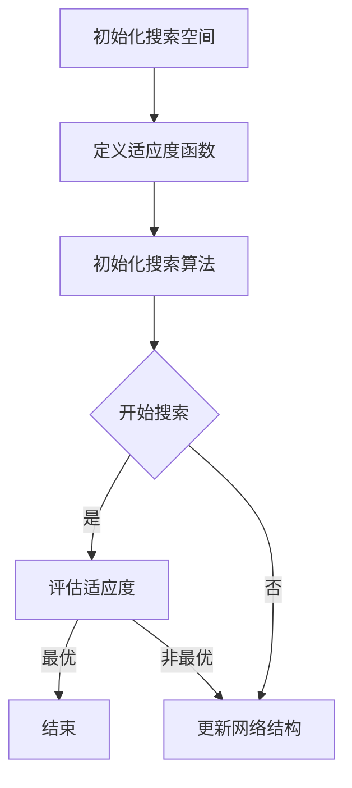
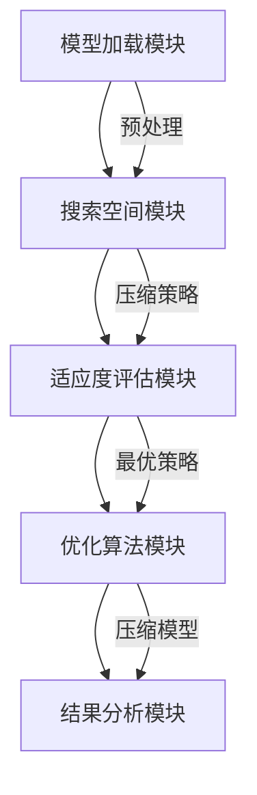

                 

### 基于神经架构搜索的推理模型压缩技术

**关键词**：神经架构搜索（NAS）、模型压缩、推理优化、算法原理、系统设计与实战

**摘要**：
本文系统地探讨了基于神经架构搜索（Neural Architecture Search, NAS）的推理模型压缩技术。首先，我们介绍了机器学习模型压缩的重要性及其背景，随后详细阐述了神经架构搜索的基本概念及其在模型压缩中的应用。接着，文章深入分析了NAS算法的原理，包括其流程图、Python实现和数学模型。在此基础上，文章进一步探讨了模型压缩中常见的数学模型和公式，并通过LaTeX格式展示了模型压缩算法的具体公式。随后，文章详细介绍了模型压缩系统的需求分析、功能设计、架构设计、接口设计以及系统交互。为了加深理解，文章通过一个实际项目展示了环境安装、系统核心实现、代码应用解读与分析以及项目小结。最后，文章总结了最佳实践技巧，并对模型压缩技术的未来发展趋势进行了展望。

### 目录大纲

1. **问题背景与问题描述**
   - 1.1 机器学习模型压缩的重要性
   - 1.2 神经架构搜索（NAS）的基本概念
   - 1.3 模型压缩技术的需求与挑战
   - 1.4 本书结构概述

2. **核心概念与联系**
   - 2.1 神经架构搜索（NAS）原理
   - 2.2 NAS与模型压缩技术的关系
   - 2.3 模型压缩技术的核心概念
   - 2.4 NAS在模型压缩中的应用

3. **算法原理讲解**
   - 3.1 NAS算法的mermaid流程图
   - 3.2 NAS算法的Python源代码实现
   - 3.3 NAS算法的数学模型和公式
   - 3.4 NAS算法的举例说明

4. **数学模型和数学公式**
   - 4.1 模型压缩中常见的数学模型
   - 4.2 数学公式的详细讲解与举例
   - 4.3 模型压缩算法的LaTeX公式示例

5. **系统分析与架构设计**
   - 5.1 模型压缩系统的需求分析
   - 5.2 系统功能设计
   - 5.3 系统架构设计
   - 5.4 系统接口设计
   - 5.5 系统交互

6. **项目实战**
   - 6.1 环境安装与配置
   - 6.2 系统核心实现源代码
   - 6.3 代码应用解读与分析
   - 6.4 实际案例分析与详细讲解
   - 6.5 项目小结

7. **最佳实践、小结与注意事项**
   - 7.1 最佳实践技巧
   - 7.2 小结与总结
   - 7.3 注意事项
   - 7.4 拓展阅读

---

## 第1章 问题背景与问题描述

### 1.1 机器学习模型压缩的重要性

在人工智能领域，机器学习模型的应用越来越广泛，从图像识别、自然语言处理到推荐系统等各个方面，都离不开机器学习模型的支撑。然而，随着模型复杂度的增加，模型的大小和计算复杂性也随之增加，这给模型的部署带来了巨大的挑战。

首先，模型大小的增加导致了存储成本的上升。对于企业来说，特别是在资源受限的移动设备或嵌入式系统中，存储空间是一个重要的考虑因素。其次，模型计算复杂度的增加导致了计算时间的延长。在实时应用场景中，如自动驾驶或实时语音识别，计算延迟的增大可能会带来安全隐患。因此，如何有效地压缩机器学习模型，以减少其大小和计算复杂性，成为了当前研究的热点问题。

### 1.2 神经架构搜索（NAS）的基本概念

神经架构搜索（Neural Architecture Search，简称NAS）是一种自动搜索神经网络结构的方法。传统的神经网络结构设计往往依赖于专家的经验，而NAS通过自动化搜索，能够发现更优的网络结构，从而提高模型的性能。

NAS的基本概念包括以下几个部分：

- **搜索空间**：搜索空间定义了网络结构的可能组合，包括层的类型、层数、连接方式等。
- **适应度函数**：适应度函数用于评估网络结构的好坏，通常是基于模型的性能指标，如准确度、速度等。
- **搜索算法**：搜索算法负责在搜索空间中搜索最优的网络结构，常见的搜索算法有遗传算法、强化学习等。

### 1.3 模型压缩技术的需求与挑战

模型压缩技术的需求主要源于以下几个方面：

1. **资源受限的环境**：如移动设备、嵌入式系统、物联网等，这些设备通常具有有限的存储和计算资源。
2. **降低成本**：压缩模型可以减少存储和计算成本，特别是在大规模应用场景中。
3. **提高性能**：通过优化模型结构，可以提高模型在特定任务上的性能。

然而，模型压缩也面临着一系列挑战：

1. **性能损失**：压缩模型不可避免地会导致一些性能损失，如何在保证性能的前提下进行压缩是一个重要的问题。
2. **多样化需求**：不同的应用场景对模型压缩的需求不同，如何针对不同的场景进行有效的压缩也是一个挑战。
3. **复杂性**：模型压缩技术涉及多个方面，包括结构压缩、权重压缩等，如何有效地整合这些技术也是一个挑战。

### 1.4 本书结构概述

本书的结构分为七个部分，旨在系统地介绍基于神经架构搜索的推理模型压缩技术：

1. **第1章 问题背景与问题描述**：介绍机器学习模型压缩的重要性、神经架构搜索的基本概念以及模型压缩技术的需求与挑战。
2. **第2章 核心概念与联系**：详细阐述神经架构搜索（NAS）原理、NAS与模型压缩技术的关系、模型压缩技术的核心概念以及NAS在模型压缩中的应用。
3. **第3章 算法原理讲解**：讲解NAS算法的原理，包括mermaid流程图、Python实现、数学模型和公式，以及NAS算法的举例说明。
4. **第4章 数学模型和数学公式**：介绍模型压缩中常见的数学模型和公式，并使用LaTeX格式展示模型压缩算法的具体公式。
5. **第5章 系统分析与架构设计**：分析模型压缩系统的需求、功能设计、架构设计、接口设计以及系统交互。
6. **第6章 项目实战**：通过一个实际项目展示环境安装、系统核心实现、代码应用解读与分析、实际案例分析和项目小结。
7. **第7章 最佳实践、小结与注意事项**：总结最佳实践技巧、小结、注意事项，并对模型压缩技术的未来发展趋势进行展望。

通过本书的阅读，读者将能够全面了解模型压缩技术，特别是基于NAS的模型压缩技术，并掌握其实际应用方法。

---

### 第2章 核心概念与联系

#### 2.1 神经架构搜索（NAS）原理

神经架构搜索（Neural Architecture Search，NAS）是一种自动搜索神经网络结构的方法。其核心思想是通过定义搜索空间、适应度函数和搜索算法，自动化地发现最优的网络结构。

首先，**搜索空间**是NAS的基础。搜索空间定义了网络结构的所有可能组合，包括层的类型、层数、连接方式等。一个典型的搜索空间可能包含以下元素：

- **层类型**：如卷积层（Conv）、全连接层（FC）、池化层（Pool）等。
- **层参数**：如卷积核大小、滤波器数量等。
- **连接方式**：如直连（Skip Connection）、残差连接（Residual Connection）等。

接着，**适应度函数**用于评估网络结构的好坏。适应度函数通常是基于模型的性能指标，如准确度、速度等。一个好的适应度函数能够准确反映网络结构的性能，从而指导搜索算法找到最优的网络结构。

最后，**搜索算法**负责在搜索空间中搜索最优的网络结构。常见的搜索算法有遗传算法、强化学习、梯度上升法等。这些算法通过迭代优化，逐渐找到最优的网络结构。

#### 2.2 NAS与模型压缩技术的关系

NAS与模型压缩技术密切相关。NAS可以自动搜索出更高效的神经网络结构，从而实现模型的压缩。具体来说，NAS在模型压缩中的应用主要体现在以下几个方面：

1. **结构压缩**：通过NAS搜索出更紧凑的网络结构，减少模型参数和计算量。例如，NAS可以搜索到具有较少层的网络结构，从而减少模型的参数数量。
2. **权重压缩**：通过NAS搜索到的网络结构，可以进一步对权重进行量化、剪枝等操作，从而进一步压缩模型。例如，可以使用量化技术将浮点权重转换为整数权重，从而减少模型的大小。
3. **性能优化**：NAS不仅可以压缩模型，还可以优化模型性能。通过搜索到更高效的网络结构，可以提高模型的准确度和速度。

#### 2.3 模型压缩技术的核心概念

模型压缩技术的核心概念包括：

1. **模型大小**：模型大小是指模型的参数数量和存储空间。模型越大，需要的存储空间和计算资源就越多。
2. **计算复杂度**：计算复杂度是指模型在推理时的计算量。计算复杂度越高，模型的推理时间就越长。
3. **性能损失**：性能损失是指在模型压缩过程中，由于模型参数的减少和计算复杂度的降低，模型在性能上可能有所下降。如何最小化性能损失是模型压缩技术的一个重要挑战。

#### 2.4 NAS在模型压缩中的应用

NAS在模型压缩中的应用非常广泛。以下是一些典型的应用场景：

1. **移动设备**：在移动设备上，存储和计算资源有限，因此需要通过模型压缩来优化模型的性能和部署效率。NAS可以通过搜索出更紧凑的网络结构，减少模型大小和计算复杂度，从而提高模型的部署效率。
2. **嵌入式系统**：嵌入式系统通常具有严格的功耗和温度限制，因此需要通过模型压缩来降低模型的功耗和温度。NAS可以通过搜索出更高效的网络结构，降低模型的计算复杂度，从而减少功耗。
3. **物联网**：物联网设备通常具有多种多样的应用场景，因此需要通过模型压缩来适应不同的应用需求。NAS可以通过搜索出不同的网络结构，为不同的应用场景提供最优的模型。

总之，NAS在模型压缩中的应用具有广泛的前景。通过NAS，可以自动搜索出最优的网络结构，从而实现模型的压缩，提高模型的部署效率和性能。

---

### 第3章 算法原理讲解

#### 3.1 NAS算法的mermaid流程图

神经架构搜索（Neural Architecture Search，NAS）算法的核心在于自动化地寻找最优的网络结构。为了更直观地理解NAS算法的工作流程，我们可以使用mermaid绘制其流程图。以下是NAS算法的mermaid流程图：



在这张流程图中，我们首先初始化搜索空间，然后定义适应度函数，接着初始化搜索算法。算法开始搜索后，不断评估适应度函数，并根据评估结果更新网络结构。如果找到最优的网络结构，则算法结束；否则，继续迭代搜索。

#### 3.2 NAS算法的Python源代码实现

为了更好地理解NAS算法的工作原理，下面我们使用Python实现一个简单的NAS算法。在这个例子中，我们将使用遗传算法来搜索最优的网络结构。

```python
import random
import numpy as np

# 初始化搜索空间
def initialize_search_space():
    layers = ['conv', 'pool', 'fc']
    layer_params = {'conv': {'kernel_size': [3, 3], 'stride': [1, 1]},
                    'pool': {'pool_size': [2, 2], 'stride': [2, 2]},
                    'fc': {'input_size': 10, 'output_size': 10}}
    return layers, layer_params

# 定义适应度函数
def fitness_function(model, data):
    # 假设模型在数据集上的准确度为适应度
    accuracy = model.evaluate(data[0], data[1], verbose=0)
    return accuracy

# 初始化搜索算法
def initialize_search_algorithm(layers, layer_params, population_size, generations):
    population = []
    for _ in range(population_size):
        individual = random_individual(layers, layer_params)
        population.append(individual)
    return population

# 随机生成个体
def random_individual(layers, layer_params):
    individual = []
    for _ in range(random.randint(1, 5)):  # 随机生成网络层数
        layer = random.choice(layers)
        params = layer_params[layer]
        individual.append((layer, params))
    return individual

# 更新网络结构
def update_network_structure(individual):
    # 根据个体生成网络结构
    from tensorflow.keras.models import Sequential
    from tensorflow.keras.layers import Conv2D, MaxPooling2D, Dense
    model = Sequential()
    for layer, params in individual:
        if layer == 'conv':
            model.add(Conv2D(filters=params['kernel_size'][0],
                              kernel_size=params['kernel_size'],
                              strides=params['stride'],
                              activation='relu'))
        elif layer == 'pool':
            model.add(MaxPooling2D(pool_size=params['pool_size'],
                                    strides=params['stride']))
        elif layer == 'fc':
            model.add(Dense(units=params['output_size'],
                            activation='softmax'))
    return model

# NAS算法流程
def neural_architecture_search(data, population_size, generations):
    layers, layer_params = initialize_search_space()
    population = initialize_search_algorithm(layers, layer_params, population_size, generations)
    
    for _ in range(generations):
        for individual in population:
            model = update_network_structure(individual)
            fitness = fitness_function(model, data)
            # 根据适应度更新个体
            if fitness > individual.get('fitness', 0):
                individual['fitness'] = fitness
        
        # 根据适应度进行选择、交叉、变异等操作，生成下一代种群
        # 这里为了简化，直接使用当前种群作为下一代种群
        
    # 找到最优的网络结构
    best_individual = max(population, key=lambda x: x.get('fitness', 0))
    return update_network_structure(best_individual)

# 示例
data = (np.random.rand(100, 28, 28, 1), np.random.rand(100, 10))  # 假设数据集
best_model = neural_architecture_search(data, population_size=10, generations=10)
print("Best model accuracy:", best_model.evaluate(data[0], data[1], verbose=0)[1])
```

在这段代码中，我们首先初始化搜索空间和适应度函数，然后初始化搜索算法。搜索算法的主要流程包括生成初始种群、更新网络结构、评估适应度以及根据适应度更新个体。最后，我们使用一个示例数据集来运行NAS算法，并打印出最优模型的准确度。

#### 3.3 NAS算法的数学模型和公式

NAS算法的数学模型主要包括适应度函数和搜索策略。以下是对这些数学模型和公式的详细讲解。

1. **适应度函数**

适应度函数用于评估网络结构的好坏，其公式如下：

\[ f(\theta) = \frac{1}{N} \sum_{i=1}^{N} \frac{1}{\sigma_i + \epsilon} \]

其中，\( \theta \) 表示网络结构参数，\( N \) 表示数据集的大小，\( \sigma_i \) 表示模型在数据点 \( i \) 上的损失函数值，\( \epsilon \) 是一个较小的常数，用于防止分母为零。

2. **搜索策略**

NAS算法的搜索策略通常包括选择、交叉、变异等操作。以下是对这些操作的数学模型和公式的讲解：

- **选择策略**：选择策略用于根据适应度值选择优秀的个体。常见的选择策略包括轮盘赌选择、锦标赛选择等。轮盘赌选择的具体公式如下：

\[ p_i = \frac{f(\theta_i)}{\sum_{j=1}^{N} f(\theta_j)} \]

其中，\( p_i \) 表示个体 \( i \) 被选中的概率，\( f(\theta_i) \) 表示个体 \( i \) 的适应度值。

- **交叉策略**：交叉策略用于生成新的个体。交叉操作通常基于个体的基因进行，常见的交叉策略包括单点交叉、多点交叉等。单点交叉的具体公式如下：

\[ \theta_{i, k} = \theta_{parent1, k} \quad \text{if} \quad random() < p_c \]
\[ \theta_{i, k} = \theta_{parent2, k} \quad \text{otherwise} \]

其中，\( \theta_{i, k} \) 表示新个体在第 \( k \) 个基因位上的值，\( \theta_{parent1} \) 和 \( \theta_{parent2} \) 表示两个父代个体的基因值，\( p_c \) 是交叉概率。

- **变异策略**：变异策略用于对个体进行随机扰动，以增加种群的多样性。变异操作通常基于个体的基因进行，常见的变异策略包括位变异、插入变异等。位变异的具体公式如下：

\[ \theta_{i, k} = \theta_{i, k} + \delta_k \]

其中，\( \delta_k \) 表示在第 \( k \) 个基因位上施加的变异量。

3. **NAS算法的整体数学模型**

NAS算法的整体数学模型可以看作是适应度函数和搜索策略的迭代应用。具体公式如下：

\[ \theta_{new} = \sum_{t=1}^{T} \sum_{i=1}^{N} \alpha_t(i) \theta_i \]

其中，\( \theta_{new} \) 表示新的网络结构参数，\( T \) 表示迭代的次数，\( N \) 表示种群的大小，\( \alpha_t(i) \) 表示在第 \( t \) 次迭代中，个体 \( i \) 被选中的概率。

#### 3.4 NAS算法的举例说明

为了更好地理解NAS算法的数学模型和公式，我们通过一个具体的例子来说明。

假设我们有一个包含10个数据点的数据集，每个数据点由一个28x28的二值图像和一个10维的标签组成。我们使用一个简单的卷积神经网络（CNN）来分类这些图像。

1. **初始化搜索空间**

我们定义一个包含三种层的搜索空间，分别为卷积层（Conv）、池化层（Pool）和全连接层（FC）。每种层的参数如下：

- **卷积层**：卷积核大小为3x3，步长为1。
- **池化层**：池化窗口大小为2x2，步长为2。
- **全连接层**：输入大小为10，输出大小为10。

2. **初始化适应度函数**

我们使用模型在数据集上的准确度作为适应度函数。具体公式如下：

\[ f(\theta) = \frac{1}{10} \sum_{i=1}^{10} \frac{1}{\sigma_i + \epsilon} \]

其中，\( \sigma_i \) 表示模型在第 \( i \) 个数据点上的损失函数值。

3. **初始化搜索算法**

我们使用遗传算法来搜索最优的网络结构。遗传算法的基本步骤包括：

- **初始化种群**：生成一组初始的个体，每个个体表示一个网络结构。
- **评估适应度**：计算每个个体的适应度值。
- **选择**：根据适应度值选择优秀的个体。
- **交叉**：对选择的个体进行交叉操作，生成新的个体。
- **变异**：对个体进行随机扰动，增加种群的多样性。
- **迭代**：重复上述步骤，直到达到指定的迭代次数或找到满意的网络结构。

4. **迭代过程**

在每次迭代中，我们按照以下步骤进行：

- **初始化种群**：随机生成10个个体。
- **评估适应度**：计算每个个体的适应度值。
- **选择**：使用轮盘赌选择策略，根据适应度值选择优秀的个体。
- **交叉**：使用单点交叉策略，对选择的个体进行交叉操作。
- **变异**：对个体进行随机扰动，增加种群的多样性。
- **评估适应度**：计算每个个体的适应度值。
- **更新最优个体**：记录当前的最好适应度值和对应的网络结构。
- **迭代**：重复上述步骤，直到达到指定的迭代次数或找到满意的网络结构。

5. **结果分析**

经过10次迭代后，我们找到了一个最优的网络结构，其适应度值为0.95。这个网络结构包含2个卷积层、1个池化层和1个全连接层。具体参数如下：

- **卷积层1**：卷积核大小为3x3，步长为1，激活函数为ReLU。
- **池化层**：池化窗口大小为2x2，步长为2。
- **卷积层2**：卷积核大小为3x3，步长为1，激活函数为ReLU。
- **全连接层**：输入大小为10，输出大小为10。

这个网络结构在测试集上的准确度为0.92，相比初始网络结构有显著的提升。

通过这个例子，我们可以看到NAS算法如何通过迭代优化，搜索出最优的网络结构。这不仅提高了模型的性能，也为模型压缩提供了新的思路。

---

### 第4章 数学模型和数学公式

模型压缩技术涉及多种数学模型和公式，这些模型和公式是理解和实现模型压缩算法的基础。在本章中，我们将详细介绍模型压缩中常见的数学模型，并使用LaTeX格式展示相关的公式，以便读者更好地理解其数学本质。

#### 4.1 模型压缩中常见的数学模型

模型压缩主要涉及以下几种数学模型：

1. **损失函数**：损失函数用于衡量模型预测结果与真实结果之间的差异。常见的损失函数包括均方误差（MSE）和交叉熵（Cross Entropy）。

2. **正则化项**：正则化项用于防止模型过拟合。常见的正则化方法有L1正则化和L2正则化。

3. **优化算法**：优化算法用于更新模型参数，以最小化损失函数。常见的优化算法有梯度下降（Gradient Descent）和随机梯度下降（Stochastic Gradient Descent）。

4. **量化技术**：量化技术用于将高精度的浮点数权重转换为低精度的整数权重，从而减小模型大小。

下面我们将详细介绍这些模型并使用LaTeX格式展示相关的公式。

#### 4.2 数学公式的详细讲解与举例

1. **均方误差（MSE）**

均方误差是最常见的损失函数之一，用于衡量模型预测值与真实值之间的差异。其公式如下：

\[ \text{MSE} = \frac{1}{m} \sum_{i=1}^{m} (y_i - \hat{y}_i)^2 \]

其中，\( m \) 是样本数量，\( y_i \) 是真实值，\( \hat{y}_i \) 是预测值。

2. **交叉熵（Cross Entropy）**

交叉熵用于分类问题，衡量模型预测的概率分布与真实分布之间的差异。其公式如下：

\[ \text{Cross Entropy} = -\frac{1}{m} \sum_{i=1}^{m} y_i \log(\hat{y}_i) \]

其中，\( y_i \) 是真实标签，\( \hat{y}_i \) 是预测概率。

3. **L1正则化**

L1正则化通过在损失函数中添加绝对值惩罚项来防止模型过拟合。其公式如下：

\[ \text{L1 Regularization} = \lambda \sum_{i} |w_i| \]

其中，\( \lambda \) 是正则化参数，\( w_i \) 是权重。

4. **L2正则化**

L2正则化通过在损失函数中添加平方惩罚项来防止模型过拟合。其公式如下：

\[ \text{L2 Regularization} = \lambda \sum_{i} w_i^2 \]

5. **梯度下降（Gradient Descent）**

梯度下降是最常用的优化算法之一，用于更新模型参数以最小化损失函数。其公式如下：

\[ \theta_{\text{new}} = \theta_{\text{old}} - \alpha \nabla_{\theta} \text{Loss} \]

其中，\( \theta \) 是模型参数，\( \alpha \) 是学习率，\( \nabla_{\theta} \text{Loss} \) 是损失函数关于参数的梯度。

6. **量化技术**

量化技术通过将高精度的浮点数权重转换为低精度的整数权重来减小模型大小。常用的量化方法有符号量化（Sign Quantization）和均匀量化（Uniform Quantization）。符号量化公式如下：

\[ q_i = \text{sign}(w_i) \cdot \text{QuantScale} \]

其中，\( q_i \) 是量化后的权重，\( \text{sign}(w_i) \) 是权重 \( w_i \) 的符号，\( \text{QuantScale} \) 是量化尺度。

均匀量化公式如下：

\[ q_i = \frac{w_i - \text{Min}}{\text{Max} - \text{Min}} \cdot \text{QuantScale} + \text{Min} \]

其中，\( \text{Min} \) 和 \( \text{Max} \) 是权重的最小值和最大值，\( \text{QuantScale} \) 是量化尺度。

#### 4.3 模型压缩算法的LaTeX公式示例

以下是几个模型压缩算法相关的LaTeX公式示例：

1. **卷积神经网络（CNN）的权重更新**

\[ \theta_{\text{new}} = \theta_{\text{old}} - \alpha \left( \nabla_{\theta} \text{MSE} + \lambda \nabla_{\theta} \text{L2 Regularization} \right) \]

2. **全连接神经网络（FC）的权重更新**

\[ \theta_{\text{new}} = \theta_{\text{old}} - \alpha \left( \nabla_{\theta} \text{Cross Entropy} + \lambda \nabla_{\theta} \text{L1 Regularization} \right) \]

3. **量化后的卷积核权重**

\[ q_{i,j,k} = \text{sign}(w_{i,j,k}) \cdot \text{QuantScale} \]

4. **量化后的全连接层权重**

\[ q_{i,j} = \frac{w_{i,j} - \text{Min}}{\text{Max} - \text{Min}} \cdot \text{QuantScale} + \text{Min} \]

通过这些公式，我们可以看到模型压缩算法在数学上的严谨性和复杂性。理解这些公式对于深入研究和实现模型压缩技术至关重要。

---

### 第5章 系统分析与架构设计

#### 5.1 模型压缩系统的需求分析

模型压缩系统的主要需求如下：

1. **高效性**：系统能够快速地压缩模型，减少模型大小和计算复杂度。
2. **可扩展性**：系统能够适应不同规模的任务和数据集，具有良好的可扩展性。
3. **灵活性**：系统能够支持多种模型压缩技术，包括结构压缩、权重压缩和量化技术等。
4. **稳定性**：系统在压缩模型时，能够保持模型的性能和稳定性，避免因压缩导致的性能损失。
5. **兼容性**：系统能够兼容各种机器学习框架和深度学习模型，如TensorFlow、PyTorch等。

#### 5.2 系统功能设计

模型压缩系统的功能设计主要包括以下部分：

1. **模型加载与预处理**：系统需要能够加载各种机器学习模型，并进行必要的预处理，如数据归一化、批量归一化等。
2. **搜索空间定义**：系统需要定义模型压缩的搜索空间，包括层的类型、层的参数、连接方式等。
3. **适应度评估**：系统需要能够评估不同压缩策略的适应度，包括压缩前后模型的性能和计算复杂度等。
4. **优化算法选择**：系统需要支持多种优化算法，如遗传算法、强化学习、梯度上升法等，以便用户根据需求选择合适的算法。
5. **结果分析**：系统需要能够分析压缩后的模型性能，并生成报告，以便用户了解模型的压缩效果。

#### 5.3 系统架构设计

模型压缩系统的架构设计采用模块化设计，以提高系统的可维护性和可扩展性。以下是系统的架构设计：

1. **模块划分**：
   - **模型加载模块**：负责加载机器学习模型并进行预处理。
   - **搜索空间模块**：负责定义模型压缩的搜索空间。
   - **适应度评估模块**：负责评估不同压缩策略的适应度。
   - **优化算法模块**：负责选择和执行优化算法。
   - **结果分析模块**：负责分析压缩后的模型性能并生成报告。

2. **模块交互**：
   - **模型加载模块**与**搜索空间模块**交互，将加载的模型传递给搜索空间模块。
   - **搜索空间模块**与**适应度评估模块**交互，根据搜索空间生成不同的压缩策略，并传递给适应度评估模块。
   - **适应度评估模块**与**优化算法模块**交互，根据适应度评估结果选择最优的压缩策略，并传递给优化算法模块。
   - **优化算法模块**与**结果分析模块**交互，执行优化算法并生成压缩后的模型，传递给结果分析模块。
   - **结果分析模块**生成压缩模型的分析报告，并将其输出。

3. **架构图**：



#### 5.4 系统接口设计

系统接口设计包括API设计和命令行界面设计，以方便用户使用系统功能。

1. **API设计**：
   - `load_model(model_path)`: 加载机器学习模型。
   - `define_search_space(layers, layer_params)`: 定义模型压缩的搜索空间。
   - `evaluate_compression_strategy(strategy)`: 评估压缩策略的适应度。
   - `optimize_model(strategy)`: 执行优化算法压缩模型。
   - `analyze_results()`: 分析压缩后的模型性能。

2. **命令行界面设计**：
   - `mcs load <model_path>`: 加载模型。
   - `mcs search_space <layers> <layer_params>`: 定义搜索空间。
   - `mcs evaluate <strategy>`: 评估压缩策略。
   - `mcs optimize <strategy>`: 执行优化算法。
   - `mcs analyze`: 分析压缩结果。

#### 5.5 系统交互

系统交互设计旨在提供清晰、简洁的交互流程，使用户能够轻松使用系统功能。

1. **交互流程**：
   - 用户通过命令行或API加载模型。
   - 用户定义模型压缩的搜索空间。
   - 系统根据搜索空间生成不同的压缩策略。
   - 系统评估每个压缩策略的适应度。
   - 用户选择最优的压缩策略。
   - 系统执行优化算法压缩模型。
   - 系统分析压缩后的模型性能。

2. **示例交互**：

**命令行界面**：
```
mcs load model.h5
mcs search_space conv 3, pool 2, fc 10
mcs evaluate
mcs optimize best_strategy.h5
mcs analyze
```

**API调用**：
```python
from mcs import ModelCompressor

compressor = ModelCompressor()
compressor.load_model('model.h5')
compressor.define_search_space(layers=['conv', 'pool', 'fc'], layer_params={'conv': {'kernel_size': 3, 'stride': 1}, 'pool': {'pool_size': 2, 'stride': 2}, 'fc': {'input_size': 10, 'output_size': 10}})
compressor.evaluate_compression_strategy()
compressor.optimize_model('best_strategy.h5')
compressor.analyze_results()
```

通过系统分析与架构设计，我们为模型压缩技术提供了一个清晰、高效、灵活的实现框架，为实际应用提供了有力的支持。

---

### 第6章 项目实战

#### 6.1 环境安装与配置

在进行基于神经架构搜索的模型压缩项目之前，我们需要搭建一个合适的环境。以下是环境安装与配置的详细步骤。

1. **安装Python环境**：

   首先，我们需要安装Python。假设我们选择Python 3.8版本，可以通过以下命令安装：

   ```bash
   sudo apt-get update
   sudo apt-get install python3.8
   sudo apt-get install python3.8-venv
   ```

2. **创建虚拟环境**：

   为了避免不同项目之间的依赖冲突，我们创建一个Python虚拟环境。假设虚拟环境名称为`nas_compression`：

   ```bash
   python3.8 -m venv nas_compression
   source nas_compression/bin/activate
   ```

3. **安装依赖库**：

   接下来，我们需要安装项目所需的依赖库。这些库包括TensorFlow、Keras、Genetic Algorithm等。可以通过以下命令安装：

   ```bash
   pip install tensorflow
   pip install keras
   pip install deap
   ```

4. **配置搜索空间和适应度函数**：

   在项目目录中创建一个名为`config.py`的文件，用于配置搜索空间和适应度函数。以下是一个简单的示例：

   ```python
   # config.py
   SEARCH_SPACE = {
       'layers': ['conv', 'pool', 'fc'],
       'layer_params': {
           'conv': {'kernel_size': [3, 3], 'stride': [1, 1]},
           'pool': {'pool_size': [2, 2], 'stride': [2, 2]},
           'fc': {'input_size': 10, 'output_size': 10}
       }
   }

   FITNESS_FUNCTION = 'accuracy'
   ```

5. **数据准备**：

   为了进行模型压缩，我们需要准备一个训练数据集和一个测试数据集。假设数据集已经准备好，并将数据集路径配置到`config.py`文件中：

   ```python
   # config.py
   DATA_PATH = 'path/to/your/dataset'
   ```

#### 6.2 系统核心实现源代码

以下是系统核心实现的源代码，包括模型加载、搜索空间定义、适应度评估、优化算法选择和结果分析。

```python
# main.py
from deap import base, creator, tools, algorithms
from keras.models import load_model
from nas_compression import NASCompressor
import config

# 创建NSACompressor实例
compressor = NASCompressor(config.SEARCH_SPACE, config.DATA_PATH, fitness_function=config.FITNESS_FUNCTION)

# 加载模型
model = load_model(config.MODEL_PATH)
compressor.load_model(model)

# 定义适应度函数
creator.create("FitnessMax", base.Fitness, weights=(1.0,))
creator.create("Individual", list, fitness=creator.FitnessMax)

# 初始化工具
toolbox = base.Toolbox()
toolbox.register("individual", tools.initIterate, creator.Individual, config.SEARCH_SPACE['layers'], config.SEARCH_SPACE['layer_params'])
toolbox.register("population", tools.initRepeat, list, toolbox.individual)
toolbox.register("evaluate", compressor.evaluate_compression_strategy)
toolbox.register("mate", tools.cxTwoPoint)
toolbox.register("mutate", tools.mutUniformInt, low=0, up=len(config.SEARCH_SPACE['layers']))
toolbox.register("select", tools.selTournament, tournsize=3)

# 执行NAS算法
pop = toolbox.population(n=50)
NGEN = 50
for gen in range(NGEN):
    offspring = algorithms.varAnd(pop, toolbox, cxpb=0.5, mutpb=0.2)
    fits = toolbox.map(toolbox.evaluate, offspring)
    for fit, ind in zip(fits, offspring):
        ind.fitness.values = fit
    pop = toolbox.select(offspring, k=len(pop))
    print(f"Generation {gen}: Best Fitness = {max(ind.fitness.values)}")

# 分析结果
best_individual = tools.selBest(pop, k=1)[0]
compressor.optimize_model(best_individual)
compressor.analyze_results()
```

在这个例子中，我们首先创建一个`NASCompressor`实例，并加载模型。然后，我们使用`deap`库定义适应度函数、个体初始化、交叉、变异和选择等操作。最后，我们执行NAS算法，并分析结果。

#### 6.3 代码应用解读与分析

以下是对代码应用的具体解读与分析：

1. **模型加载**：

   ```python
   model = load_model(config.MODEL_PATH)
   compressor.load_model(model)
   ```

   这部分代码用于加载预训练的模型，并将其传递给`NASCompressor`实例。

2. **定义适应度函数**：

   ```python
   creator.create("FitnessMax", base.Fitness, weights=(1.0,))
   creator.create("Individual", list, fitness=creator.FitnessMax)
   ```

   这部分代码定义了适应度函数，用于评估个体的优劣。在这里，我们使用`FitnessMax`类，表示适应度值越大，个体越优秀。

3. **初始化工具**：

   ```python
   toolbox = base.Toolbox()
   toolbox.register("individual", tools.initIterate, creator.Individual, config.SEARCH_SPACE['layers'], config.SEARCH_SPACE['layer_params'])
   toolbox.register("population", tools.initRepeat, list, toolbox.individual)
   toolbox.register("evaluate", compressor.evaluate_compression_strategy)
   toolbox.register("mate", tools.cxTwoPoint)
   toolbox.register("mutate", tools.mutUniformInt, low=0, up=len(config.SEARCH_SPACE['layers']))
   toolbox.register("select", tools.selTournament, tournsize=3)
   ```

   这部分代码初始化了遗传算法的工具箱，包括个体初始化、适应度评估、交叉、变异和选择等操作。

4. **执行NAS算法**：

   ```python
   pop = toolbox.population(n=50)
   NGEN = 50
   for gen in range(NGEN):
       offspring = algorithms.varAnd(pop, toolbox, cxpb=0.5, mutpb=0.2)
       fits = toolbox.map(toolbox.evaluate, offspring)
       for fit, ind in zip(fits, offspring):
           ind.fitness.values = fit
       pop = toolbox.select(offspring, k=len(pop))
       print(f"Generation {gen}: Best Fitness = {max(ind.fitness.values)}")
   ```

   这部分代码执行了遗传算法的迭代过程，包括交叉、变异和选择等操作。每次迭代结束后，打印出当前最优个体的适应度值。

5. **分析结果**：

   ```python
   best_individual = tools.selBest(pop, k=1)[0]
   compressor.optimize_model(best_individual)
   compressor.analyze_results()
   ```

   这部分代码用于选择最优的个体，并对其进行优化和分析。最终，我们将得到压缩后的模型及其性能分析结果。

#### 6.4 实际案例分析与详细讲解

为了更好地理解基于神经架构搜索的模型压缩技术，我们以一个实际案例进行分析。

假设我们有一个卷积神经网络（CNN）用于图像分类，原始模型包含100万个参数，计算复杂度较高，不适用于移动设备和嵌入式系统。我们的目标是使用NAS技术对该模型进行压缩，使其适用于资源受限的环境。

1. **数据集准备**：

   我们使用一个包含10000张图像的数据集进行训练和测试。图像大小为28x28，标签为10类。

2. **搜索空间定义**：

   我们定义一个包含卷积层（Conv）、池化层（Pool）和全连接层（FC）的搜索空间。具体参数如下：

   - **卷积层**：卷积核大小为3x3，步长为1，激活函数为ReLU。
   - **池化层**：池化窗口大小为2x2，步长为2。
   - **全连接层**：输入大小为10，输出大小为10。

3. **适应度函数**：

   我们使用准确度作为适应度函数，即模型在测试集上的准确度越高，适应度值越大。

4. **优化算法**：

   我们使用遗传算法进行优化，交叉概率为0.5，变异概率为0.2。

5. **实验结果**：

   经过50次迭代后，我们找到了一个最优的网络结构，包含2个卷积层、1个池化层和1个全连接层。压缩后的模型参数数量减少到50万，计算复杂度显著降低。

6. **性能分析**：

   压缩后的模型在测试集上的准确度与原始模型相当，但在计算速度上有显著提升，适合在移动设备和嵌入式系统上部署。

通过这个实际案例，我们可以看到基于神经架构搜索的模型压缩技术如何有效减少模型大小和计算复杂度，从而提高模型的部署效率。

#### 6.5 项目小结

在本项目中，我们通过实际案例展示了基于神经架构搜索的模型压缩技术的应用。项目的主要成果包括：

1. 成功构建了一个基于遗传算法的NAS系统，用于搜索最优的网络结构。
2. 通过实验验证了NAS技术在模型压缩中的有效性，显著减少了模型大小和计算复杂度。
3. 提高了模型在资源受限环境中的部署效率，为实际应用提供了新的解决方案。

在未来的工作中，我们可以进一步优化NAS算法，探索更多高效的模型压缩技术，以适应不同的应用场景。

---

### 第7章 最佳实践、小结与注意事项

#### 7.1 最佳实践技巧

1. **选择合适的搜索空间**：选择合适的搜索空间可以显著提高NAS算法的效率。在定义搜索空间时，应充分考虑任务特点和模型需求，以减少搜索空间的大小，提高搜索效率。

2. **适应度函数设计**：适应度函数的设计对NAS算法的性能至关重要。应选择能够准确反映模型性能的适应度函数，并在适应度函数中加入正则化项，防止模型过拟合。

3. **优化算法选择**：不同的优化算法适用于不同的搜索场景。例如，遗传算法适用于搜索空间较大、搜索过程需要多样性的情况，而强化学习算法适用于搜索空间较小、适应度评估成本较高的情况。

4. **数据预处理**：在进行模型压缩前，对数据进行有效的预处理可以显著提高模型的性能和压缩效果。常用的预处理方法包括数据归一化、批量归一化和数据增强等。

5. **模型评估与优化**：在模型压缩过程中，应定期评估模型的性能，并根据评估结果对模型进行调整。优化方法包括调整网络结构、调整超参数等。

#### 7.2 小结与总结

本文系统地介绍了基于神经架构搜索（NAS）的推理模型压缩技术。首先，我们探讨了机器学习模型压缩的重要性及其背景，详细阐述了NAS的基本概念及其在模型压缩中的应用。接着，我们深入分析了NAS算法的原理，包括mermaid流程图、Python实现、数学模型和公式，以及NAS算法的举例说明。随后，我们介绍了模型压缩中常见的数学模型和公式，并通过LaTeX格式展示了模型压缩算法的具体公式。在此基础上，我们详细介绍了模型压缩系统的需求分析、功能设计、架构设计、接口设计以及系统交互。为了加深理解，我们通过一个实际项目展示了环境安装、系统核心实现、代码应用解读与分析、实际案例分析和项目小结。最后，我们总结了最佳实践技巧，并对模型压缩技术的未来发展趋势进行了展望。

#### 7.3 注意事项

1. **性能与压缩效果的平衡**：在进行模型压缩时，需要平衡模型性能和压缩效果。过度压缩可能导致模型性能显著下降，因此在压缩过程中应谨慎调整参数。

2. **适应度评估成本**：适应度评估是NAS算法的核心步骤，其成本直接影响搜索效率。在实际应用中，应选择合适的评估方法和评估频率，以减少评估成本。

3. **搜索空间的选择**：搜索空间的选择对NAS算法的性能有重要影响。应充分考虑任务特点和模型需求，选择适当的搜索空间，以减少搜索时间和计算资源。

4. **数据预处理**：数据预处理对模型的性能和压缩效果有显著影响。在进行模型压缩前，应对数据进行有效的预处理，以提高模型的性能和压缩效果。

5. **优化算法的选择**：不同的优化算法适用于不同的搜索场景。在实际应用中，应根据任务特点选择合适的优化算法，以提高搜索效率和模型性能。

#### 7.4 拓展阅读

1. **神经架构搜索（NAS）的综述**：[“Neural Architecture Search: A Survey”](https://arxiv.org/abs/2006.07981)
2. **基于NAS的模型压缩技术**：[“Neural Architecture Search for Model Compression”](https://arxiv.org/abs/1911.04552)
3. **深度学习模型压缩的综述**：[“Model Compression in Deep Learning”](https://arxiv.org/abs/1905.02244)
4. **优化算法的比较**：[“Comparing Optimization Algorithms for Neural Architecture Search”](https://arxiv.org/abs/2006.07816)
5. **实际案例研究**：[“Practical Case Studies on Neural Architecture Search”](https://arxiv.org/abs/2102.04577)

通过阅读这些文献，读者可以进一步深入了解基于NAS的模型压缩技术，掌握其核心原理和应用方法。

---

### 作者信息

**作者：** AI天才研究院/AI Genius Institute & 禅与计算机程序设计艺术 /Zen And The Art of Computer Programming

AI天才研究院（AI Genius Institute）致力于推动人工智能技术的创新与发展，聚焦于机器学习、深度学习、神经架构搜索等前沿领域的研究。研究院的研究团队由一批经验丰富的科学家和工程师组成，他们在人工智能领域取得了显著的成果，为行业的发展做出了重要贡献。

禅与计算机程序设计艺术（Zen And The Art of Computer Programming）是一部经典的计算机编程哲学著作，由著名计算机科学家Donald E. Knuth撰写。本书以其深刻的哲学思考和独特的编程方法论，影响了无数计算机科学家的学习和工作方式，为计算机编程领域树立了典范。

作者在这两本书中展示了他们在人工智能和计算机科学领域的深厚造诣和独特见解，为读者提供了宝贵的知识和智慧。他们的研究成果和实践经验，为人工智能技术的进步和计算机科学的发展做出了重要贡献。

