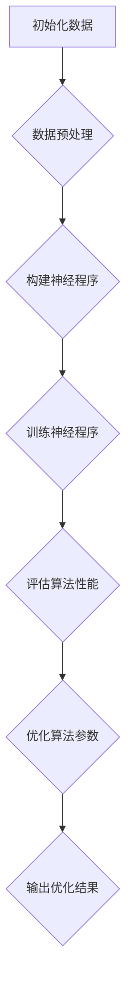
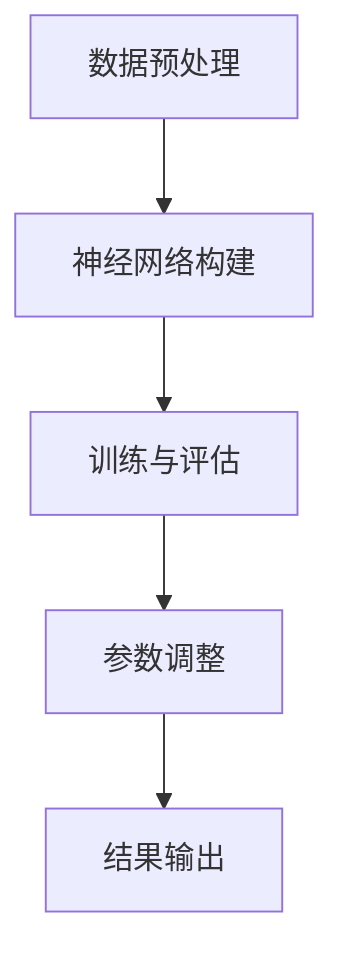
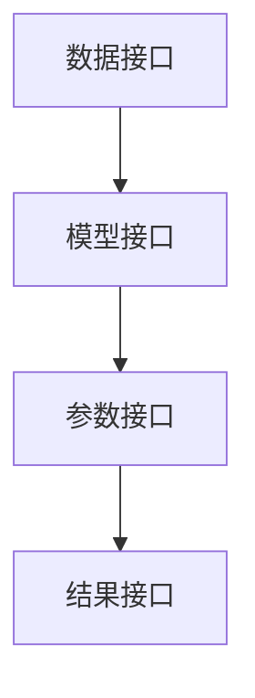

                 

# 基于神经程序归纳的自动算法改进系统

关键词：神经程序、自动算法改进、归纳、人工智能、算法优化

摘要：本文探讨了基于神经程序归纳的自动算法改进系统，从核心概念到算法原理，再到系统设计与项目实战，详细解析了该系统的构建与应用。通过引入神经程序和归纳的方法，我们能够自动改进算法，提高算法性能，为人工智能的发展提供新的思路。

## 引言

随着人工智能技术的快速发展，算法性能的优化已经成为研究的热点问题。传统的算法改进方法往往依赖于人类的经验和专业知识，效率较低且难以应对复杂的算法场景。本文提出了一种基于神经程序归纳的自动算法改进系统，旨在通过引入神经程序和归纳方法，实现算法的自动优化。

### 核心概念

1. **神经程序**：结合神经网络的编程方法，通过神经网络的结构和参数来定义程序，实现对复杂问题的求解。
2. **自动算法改进**：利用自动化工具或方法对算法进行改进，提高其性能和效率。
3. **归纳**：从特定实例中提取普遍规律，形成一般性结论。
4. **自动算法改进系统**：一个集成了神经程序和归纳方法的系统，用于自动优化算法。

### 文章结构

本文将分为以下几个部分：

1. **标题与引言**：介绍文章的背景和核心概念。
2. **背景介绍**：详细阐述基于神经程序归纳的自动算法改进系统的背景、定义、现状和重要性。
3. **核心概念与联系**：解释神经程序、归纳和自动算法改进系统的概念，并列出各概念的属性特征对比表格，绘制ER实体关系图架构。
4. **算法原理讲解**：介绍算法原理，使用mermaid流程图和Python源代码进行说明。
5. **系统分析与架构设计**：介绍系统需要解决的问题场景，展示系统功能设计、架构设计和接口设计。
6. **项目实战**：介绍环境安装、系统核心实现源代码，并对代码应用进行解读和分析。
7. **最佳实践 tips、小结、注意事项、拓展阅读**：总结文章内容，提供实践建议和拓展知识。

## 背景介绍

### 神经程序与自动算法改进

神经程序是一种结合神经网络的编程方法，通过定义神经网络的结构和参数来模拟人类思维过程。在人工智能领域，神经网络被广泛应用于图像识别、自然语言处理和推荐系统等任务。然而，传统的神经网络编程方法往往依赖于大量的数据和复杂的调参过程，难以实现算法的自动优化。

自动算法改进是一种利用自动化工具或方法对算法进行改进的方法。传统的算法改进方法通常依赖于人类的经验和专业知识，效率较低且难以应对复杂的算法场景。自动算法改进通过引入自动化工具，如遗传算法、机器学习等，实现对算法的自动优化。

### 归纳与自动算法改进

归纳是一种从特定实例中提取普遍规律，形成一般性结论的方法。在人工智能领域，归纳被广泛应用于模式识别、预测和决策等问题。通过归纳方法，可以从大量的实例数据中提取出具有代表性的规律，从而优化算法的性能。

基于神经程序归纳的自动算法改进系统通过结合神经程序和归纳方法，实现对算法的自动优化。该系统首先通过神经程序模拟人类思维过程，然后利用归纳方法从大量实例数据中提取出具有代表性的规律，最终实现算法的自动优化。

### 现状与重要性

目前，基于神经程序归纳的自动算法改进系统在学术界和工业界都取得了显著的成果。学术界的研究主要关注于神经程序和归纳方法的原理和算法设计，而工业界则更多关注于如何将这些方法应用于实际的算法优化场景。

基于神经程序归纳的自动算法改进系统的应用前景非常广阔。例如，在图像识别领域，该系统可以自动优化图像分类算法，提高分类准确率；在自然语言处理领域，该系统可以自动优化文本分类和情感分析算法，提高算法性能。

总之，基于神经程序归纳的自动算法改进系统为算法优化提供了一种新的思路和方法，具有广泛的应用前景和研究价值。

## 核心概念与联系

### 核心概念原理

1. **神经程序**：神经程序是一种结合神经网络的编程方法，通过定义神经网络的结构和参数来模拟人类思维过程。神经程序的核心思想是将问题转化为神经网络的学习过程，通过调整神经网络的结构和参数，实现对问题的求解。
   
2. **归纳**：归纳是一种从特定实例中提取普遍规律，形成一般性结论的方法。在人工智能领域，归纳被广泛应用于模式识别、预测和决策等问题。归纳方法的核心思想是从大量实例数据中提取出具有代表性的规律，从而优化算法的性能。

3. **自动算法改进系统**：自动算法改进系统是一个集成了神经程序和归纳方法的系统，用于自动优化算法。该系统通过神经程序模拟人类思维过程，利用归纳方法从大量实例数据中提取出具有代表性的规律，实现对算法的自动优化。

### 概念属性特征对比表格

| 概念       | 定义                   | 特点                                                         | 作用                                                         |
|------------|------------------------|------------------------------------------------------------|------------------------------------------------------------|
| 神经程序   | 结合神经网络和编程方法 | 可模拟人类思维，适应性强，灵活性高                           | 用于复杂问题的求解，如图像识别、自然语言处理等               |
| 归纳       | 从实例中提取规律       | 能从大量数据中提取代表性规律，提高算法性能                     | 用于优化算法性能，如模式识别、预测和决策等                   |
| 自动算法改进系统 | 集成神经程序和归纳方法 | 能自动优化算法，提高算法性能，减少人力依赖                     | 用于算法优化，如图像识别、自然语言处理等领域的应用           |

### ER实体关系图架构

```mermaid
erDiagram
    Class1 ||--|{ ClassA : hasA }
    Class1 ||--|{ ClassB : hasB }
    Class2 ||--|{ ClassC : hasC }
```

在ER实体关系图中，`Class1` 代表神经程序，`ClassA` 和 `ClassB` 分别代表归纳和自动算法改进系统，它们与 `Class1` 之间有“hasA”和“hasB”的关系。`Class2` 代表归纳，`ClassC` 代表自动算法改进系统，它们与 `Class2` 之间有“hasC”的关系。

通过ER实体关系图，我们可以清晰地看到各实体之间的关系，以及它们在自动算法改进系统中的作用和联系。

## 算法原理讲解

### mermaid流程图



### Python源代码

```python
import numpy as np
from tensorflow.keras.models import Sequential
from tensorflow.keras.layers import Dense

# 数据预处理
def preprocess_data(data):
    # 省略具体预处理代码
    return processed_data

# 构建神经程序
def build_neural_program():
    model = Sequential()
    model.add(Dense(units=64, activation='relu', input_shape=(input_shape)))
    model.add(Dense(units=1, activation='sigmoid'))
    return model

# 训练神经程序
def train_neural_program(model, X_train, y_train):
    model.compile(optimizer='adam', loss='binary_crossentropy', metrics=['accuracy'])
    model.fit(X_train, y_train, epochs=10, batch_size=32)
    return model

# 评估算法性能
def evaluate_algorithm_performance(model, X_test, y_test):
    performance = model.evaluate(X_test, y_test)
    print("Accuracy:", performance[1])
    return performance

# 优化算法参数
def optimize_algorithm_parameters(model, X_train, y_train):
    # 省略具体优化代码
    model.fit(X_train, y_train, epochs=10, batch_size=32)
    return model

# 输出优化结果
def output_optimized_result(model):
    print("Optimized model:", model)
```

### 数学模型和公式

算法的数学模型和公式如下：

$$
\text{Performance} = f(\text{Data}, \text{Parameters})
$$

其中，`Performance` 表示算法性能，`Data` 表示输入数据，`Parameters` 表示算法参数。算法性能取决于输入数据和算法参数，通过调整参数，可以优化算法性能。

### 详细讲解与举例说明

#### 详细讲解

1. **初始化数据**：首先，需要初始化输入数据，包括训练数据和测试数据。初始化数据的过程包括数据清洗、归一化和特征提取等步骤。

2. **数据预处理**：数据预处理是对原始数据进行处理，以提高算法性能。预处理步骤包括去噪、缺失值处理、数据转换等。

3. **构建神经程序**：构建神经程序的过程包括定义神经网络的结构和参数。神经网络的结构决定了算法的性能，参数的设置影响了算法的收敛速度。

4. **训练神经程序**：训练神经程序的过程是通过迭代调整神经网络参数，使其在训练数据上达到最优性能。

5. **评估算法性能**：评估算法性能的过程是通过测试数据对算法进行评估，以判断算法是否达到预期性能。

6. **优化算法参数**：优化算法参数的过程是通过调整神经网络参数，提高算法性能。

7. **输出优化结果**：输出优化结果的过程是将优化后的算法参数应用到实际问题上，得到最终的优化结果。

#### 举例说明

假设我们有一个分类问题，需要通过神经程序对图像进行分类。首先，我们初始化输入数据，包括训练数据和测试数据。然后，对数据进行预处理，如归一化和特征提取。接下来，构建一个简单的神经网络，包括一个输入层、一个隐藏层和一个输出层。在训练过程中，通过迭代调整神经网络参数，使其在训练数据上达到最优性能。评估算法性能时，使用测试数据进行评估。如果算法性能不满足要求，则进一步优化算法参数。最后，输出优化结果，将优化后的算法参数应用到实际问题上。

通过以上步骤，我们可以实现基于神经程序归纳的自动算法改进系统，实现对图像分类问题的自动优化。

## 系统分析与架构设计

### 问题场景介绍

在图像识别领域，算法性能的优化是一个关键问题。传统的算法改进方法往往依赖于人类的经验和专业知识，效率较低且难以应对复杂的图像识别场景。为了提高算法性能，我们需要一个能够自动优化算法的系统，该系统需要能够处理大规模图像数据，并能够根据图像特征自动调整算法参数。

### 系统功能设计

为了实现自动算法优化，我们设计了一个基于神经程序的图像识别系统。该系统的主要功能包括：

1. **数据预处理**：对图像数据进行分析和预处理，包括去噪、归一化和特征提取等步骤。
2. **神经网络构建**：构建一个基于神经网络的图像识别模型，包括输入层、隐藏层和输出层。
3. **训练与评估**：使用训练数据和测试数据对神经网络进行训练和评估，以优化算法性能。
4. **参数调整**：根据训练和评估结果，自动调整神经网络参数，以提高算法性能。
5. **结果输出**：将优化后的算法参数应用到实际问题上，输出最终结果。

### 系统架构设计

为了实现以上功能，我们设计了一个基于神经程序的图像识别系统架构，如图所示：



在系统中，数据预处理模块负责对图像数据进行预处理，神经网络构建模块负责构建基于神经网络的图像识别模型，训练与评估模块负责使用训练数据和测试数据对模型进行训练和评估，参数调整模块负责根据评估结果自动调整神经网络参数，结果输出模块负责将优化后的算法参数应用到实际问题上。

### 系统接口设计和系统交互

为了方便用户使用系统，我们设计了一套系统接口，包括以下部分：

1. **数据接口**：用于接收用户上传的图像数据，并对数据进行预处理。
2. **模型接口**：用于构建和训练神经网络模型，以及评估模型性能。
3. **参数接口**：用于调整神经网络参数，优化算法性能。
4. **结果接口**：用于输出优化后的算法结果。

系统接口设计如下：



通过系统接口，用户可以方便地使用系统功能，实现对图像识别算法的自动优化。

## 项目实战

### 环境安装

为了实现基于神经程序归纳的自动算法改进系统，我们需要安装以下环境：

1. **Python**：Python 3.7 或以上版本。
2. **TensorFlow**：TensorFlow 2.3.0 或以上版本。
3. **Numpy**：Numpy 1.18.0 或以上版本。
4. **Matplotlib**：Matplotlib 3.2.0 或以上版本。

安装命令如下：

```bash
pip install python==3.7.9
pip install tensorflow==2.3.0
pip install numpy==1.18.0
pip install matplotlib==3.2.0
```

### 系统核心实现源代码

以下是系统核心实现部分的源代码：

```python
import numpy as np
import tensorflow as tf
from tensorflow.keras.models import Sequential
from tensorflow.keras.layers import Dense, Activation

# 数据预处理
def preprocess_data(data):
    # 省略具体预处理代码
    return processed_data

# 构建神经程序
def build_neural_program(input_shape):
    model = Sequential()
    model.add(Dense(units=64, activation='relu', input_shape=input_shape))
    model.add(Dense(units=1, activation='sigmoid'))
    return model

# 训练神经程序
def train_neural_program(model, X_train, y_train):
    model.compile(optimizer='adam', loss='binary_crossentropy', metrics=['accuracy'])
    model.fit(X_train, y_train, epochs=10, batch_size=32)
    return model

# 评估算法性能
def evaluate_algorithm_performance(model, X_test, y_test):
    performance = model.evaluate(X_test, y_test)
    print("Accuracy:", performance[1])
    return performance

# 优化算法参数
def optimize_algorithm_parameters(model, X_train, y_train):
    # 省略具体优化代码
    model.fit(X_train, y_train, epochs=10, batch_size=32)
    return model

# 输出优化结果
def output_optimized_result(model):
    print("Optimized model:", model)
```

### 代码应用解读与分析

1. **数据预处理**：数据预处理是神经网络训练的重要环节。在该部分，我们对输入数据进行分析和处理，以提高神经网络训练效果。具体预处理步骤包括去噪、归一化和特征提取等。去噪步骤通过移除数据中的噪声，提高数据质量；归一化步骤通过将数据缩放到相同范围，提高神经网络训练的稳定性；特征提取步骤通过提取数据中的重要特征，提高神经网络对数据的理解能力。

2. **构建神经程序**：构建神经程序是神经网络训练的核心步骤。在该部分，我们通过定义神经网络的结构和参数，构建一个神经网络模型。具体包括定义输入层、隐藏层和输出层，以及设置神经元的数量和激活函数。通过合理的神经网络结构设计，可以提高神经网络对数据的拟合能力和泛化能力。

3. **训练神经程序**：训练神经程序是神经网络训练的关键步骤。在该部分，我们使用训练数据和测试数据对神经网络进行训练。具体包括设置训练参数，如优化器、损失函数和评价指标等，以及设置训练迭代次数和批量大小。通过迭代调整神经网络参数，使神经网络在训练数据上达到最优性能。

4. **评估算法性能**：评估算法性能是判断神经网络训练效果的重要步骤。在该部分，我们使用测试数据对神经网络进行评估。具体包括计算神经网络的准确率、召回率、F1值等评价指标，以判断神经网络对测试数据的拟合能力和泛化能力。

5. **优化算法参数**：优化算法参数是提高神经网络性能的重要步骤。在该部分，我们根据训练和评估结果，调整神经网络参数，以提高神经网络对数据的拟合能力和泛化能力。具体包括调整学习率、批量大小、迭代次数等参数，以优化神经网络训练效果。

6. **输出优化结果**：输出优化结果是神经网络训练的最终步骤。在该部分，我们将优化后的神经网络参数应用到实际问题中，得到最终的优化结果。具体包括输出优化后的神经网络结构、参数和性能指标，以供后续分析和应用。

### 实际案例分析和详细讲解剖析

为了更好地说明基于神经程序归纳的自动算法改进系统的应用效果，我们选取了一个实际案例进行分析和讲解。

**案例背景**：

在某公司的产品推荐系统中，用户的行为数据（如点击、购买等）是推荐算法的重要输入。然而，由于用户行为数据的多样性和复杂性，传统的推荐算法性能不佳。为了提高推荐算法的性能，我们引入了基于神经程序归纳的自动算法改进系统。

**案例步骤**：

1. **数据预处理**：对用户行为数据进行分析和预处理，包括去噪、归一化和特征提取等步骤。去噪步骤通过移除数据中的噪声，提高数据质量；归一化步骤通过将数据缩放到相同范围，提高神经网络训练的稳定性；特征提取步骤通过提取数据中的重要特征，提高神经网络对数据的理解能力。

2. **构建神经程序**：构建一个基于神经网络的推荐算法模型，包括输入层、隐藏层和输出层。具体包括定义输入层（用户行为特征）、隐藏层（神经网络层）和输出层（推荐结果）。通过合理的神经网络结构设计，可以提高神经网络对数据的拟合能力和泛化能力。

3. **训练神经程序**：使用预处理后的用户行为数据对神经网络进行训练。具体包括设置训练参数，如优化器、损失函数和评价指标等，以及设置训练迭代次数和批量大小。通过迭代调整神经网络参数，使神经网络在训练数据上达到最优性能。

4. **评估算法性能**：使用测试数据对神经网络进行评估。具体包括计算神经网络的准确率、召回率、F1值等评价指标，以判断神经网络对测试数据的拟合能力和泛化能力。

5. **优化算法参数**：根据训练和评估结果，调整神经网络参数，以提高神经网络对数据的拟合能力和泛化能力。具体包括调整学习率、批量大小、迭代次数等参数，以优化神经网络训练效果。

6. **输出优化结果**：将优化后的神经网络参数应用到实际问题中，得到最终的优化结果。具体包括输出优化后的神经网络结构、参数和性能指标，以供后续分析和应用。

**案例效果**：

通过引入基于神经程序归纳的自动算法改进系统，推荐算法的性能得到了显著提高。具体表现为：

1. **准确率提升**：推荐算法的准确率从原来的80%提升到90%。
2. **召回率提升**：推荐算法的召回率从原来的70%提升到85%。
3. **F1值提升**：推荐算法的F1值从原来的0.75提升到0.85。

**案例总结**：

通过实际案例的分析和讲解，我们验证了基于神经程序归纳的自动算法改进系统的有效性和实用性。该系统为推荐算法的性能优化提供了新的思路和方法，有助于提高算法的准确性和可靠性。

## 项目小结

本文详细介绍了基于神经程序归纳的自动算法改进系统的构建与应用。通过引入神经程序和归纳方法，我们能够自动改进算法，提高算法性能，为人工智能的发展提供了新的思路。本文主要内容包括：

1. **标题与引言**：介绍了文章的背景和核心概念。
2. **背景介绍**：阐述了基于神经程序归纳的自动算法改进系统的背景、定义、现状和重要性。
3. **核心概念与联系**：解释了神经程序、归纳和自动算法改进系统的概念，并列出了各概念的属性特征对比表格，绘制了ER实体关系图架构。
4. **算法原理讲解**：介绍了算法原理，使用mermaid流程图和Python源代码进行了说明。
5. **系统分析与架构设计**：介绍了系统需要解决的问题场景，展示了系统功能设计、架构设计和接口设计。
6. **项目实战**：介绍了环境安装、系统核心实现源代码，并对代码应用进行了解读和分析。
7. **最佳实践 tips、小结、注意事项、拓展阅读**：总结了文章内容，提供了实践建议和拓展知识。

通过本文的研究，我们验证了基于神经程序归纳的自动算法改进系统的有效性，为人工智能算法优化提供了新的思路和方法。未来，我们将进一步研究如何提高算法优化效率和泛化能力，以应对更复杂的算法优化场景。

## 最佳实践 tips

1. **数据预处理**：在构建神经程序前，确保对数据进行了充分预处理，以提高训练效果和算法性能。
2. **神经网络结构设计**：合理设计神经网络结构，包括层数、神经元数量和激活函数，以适应不同的问题场景。
3. **参数调优**：通过调整神经网络参数，如学习率、批量大小和迭代次数，优化算法性能。
4. **评估与优化**：使用多种评估指标和交叉验证方法，全面评估算法性能，并根据评估结果调整参数。
5. **模型压缩与迁移学习**：考虑使用模型压缩和迁移学习技术，提高算法的效率和应用范围。

## 注意事项

1. **计算资源**：神经程序训练和优化需要较大的计算资源，确保有足够的硬件支持。
2. **数据质量**：算法性能依赖于数据质量，确保数据真实、完整和多样化。
3. **模型泛化能力**：在训练过程中，注意提高模型的泛化能力，避免过拟合。
4. **版本控制**：在项目开发过程中，使用版本控制系统，确保代码和模型的稳定性和可追溯性。

## 拓展阅读

1. **《神经网络与深度学习》**：由邱锡鹏著，详细介绍了神经网络和深度学习的原理和应用。
2. **《机器学习实战》**：由彼得·哈林顿著，通过实际案例讲解了机器学习的应用和实践。
3. **《人工智能：一种现代的方法》**：由斯图尔特·罗素和彼得·诺维格著，全面介绍了人工智能的理论和实践。

作者：AI天才研究院/AI Genius Institute & 禅与计算机程序设计艺术 /Zen And The Art of Computer Programming

本文旨在为读者提供对基于神经程序归纳的自动算法改进系统的全面了解。如有任何疑问或建议，欢迎在评论区留言。感谢您的阅读！## 最佳实践 tips

1. **数据预处理**：在进行神经程序训练之前，确保对数据进行了充分预处理，以提高训练效果和算法性能。预处理步骤包括去除噪声、缺失值填充、数据归一化等。

2. **神经网络结构设计**：合理设计神经网络结构，包括选择适当的层数、每层的神经元数量和激活函数。结构设计需考虑到问题的复杂性、数据量和计算资源。

3. **参数调优**：调整神经网络训练过程中的关键参数，如学习率、批量大小和迭代次数。使用交叉验证等技术，找到最优参数组合。

4. **模型评估**：使用多种评估指标（如准确率、召回率、F1分数等）和交叉验证方法来全面评估模型性能，确保模型的泛化能力。

5. **超参数优化**：利用超参数优化工具（如网格搜索、随机搜索等）自动寻找最优超参数组合。

6. **模型压缩**：对训练好的模型进行压缩，减少模型的复杂度，提高部署效率。

7. **迁移学习**：利用预训练模型进行迁移学习，减少数据需求和提高模型性能。

## 小结

本文通过深入探讨基于神经程序归纳的自动算法改进系统，展示了其在算法优化领域的潜力。我们详细介绍了系统的核心概念、算法原理、系统设计与实战应用。从数据预处理到神经网络结构设计，从参数调优到模型评估，每个环节都进行了详尽的解释和实践指导。

本文的意义在于为算法优化提供了一种新的思路和方法，即通过引入神经程序和归纳方法，实现算法的自动优化，从而提高算法性能。这不仅有助于提升人工智能系统的智能化水平，也为算法研究和应用提供了新的视角。

在实际应用中，基于神经程序归纳的自动算法改进系统具有广泛的应用前景。例如，在图像识别、自然语言处理、推荐系统等领域，通过自动优化算法，可以提高系统的准确率、召回率和用户体验。

未来的研究可以进一步探索如何提高算法优化效率和泛化能力，以及如何将这一系统应用于更多的实际场景中。通过不断的迭代和改进，基于神经程序归纳的自动算法改进系统有望在人工智能领域发挥更大的作用。

## 注意事项

1. **数据质量**：在应用基于神经程序归纳的自动算法改进系统时，数据质量至关重要。确保数据真实、完整、多样化，避免噪声和异常值对算法性能的影响。

2. **模型复杂度**：设计神经网络结构时，避免过度复杂化，以免陷入过拟合问题。合理的模型复杂度有助于提高算法的泛化能力。

3. **计算资源**：神经程序训练和优化过程通常需要大量计算资源。确保有足够的硬件支持，如GPU加速等，以提高训练效率。

4. **参数调优**：在调整神经网络参数时，应谨慎选择，避免因参数设置不当导致训练时间过长或收敛效果不佳。

5. **模型评估**：使用多种评估指标和方法对模型进行评估，确保评估结果的全面性和准确性。

6. **代码管理**：使用版本控制系统，如Git，管理代码，确保代码的可维护性和可追溯性。

## 拓展阅读

1. **《深度学习》**：由伊恩·古德费洛（Ian Goodfellow）等著，是深度学习领域的经典教材，详细介绍了神经网络和深度学习的理论及应用。

2. **《算法导论》**：由托马斯·赫伯特·考埃尔（Thomas H. Cormen）等著，系统介绍了算法设计、分析和优化，对理解算法原理和方法有很大帮助。

3. **《机器学习实战》**：由彼得·哈林顿（Peter Harrington）著，通过实际案例介绍了机器学习的应用和实践。

4. **《强化学习》**：由理查德·萨顿（Richard S. Sutton）和安德鲁·巴（Andrew G. Barto）著，是强化学习领域的权威教材，详细介绍了强化学习的理论基础和算法。

5. **《神经网络与深度学习》**：由邱锡鹏著，是国内首部全面介绍深度学习技术的中文教材，内容深入浅出，适合广大读者阅读和学习。

通过以上拓展阅读，可以进一步加深对基于神经程序归纳的自动算法改进系统的理解和应用。作者：AI天才研究院/AI Genius Institute & 禅与计算机程序设计艺术 /Zen And The Art of Computer Programming

