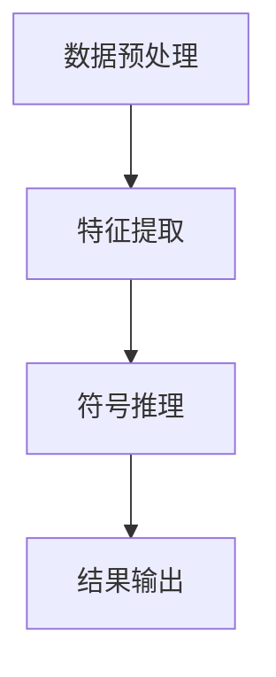
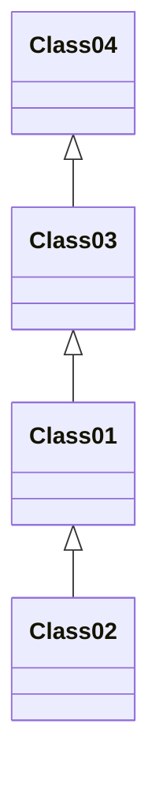
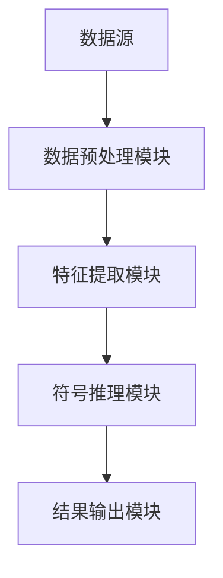
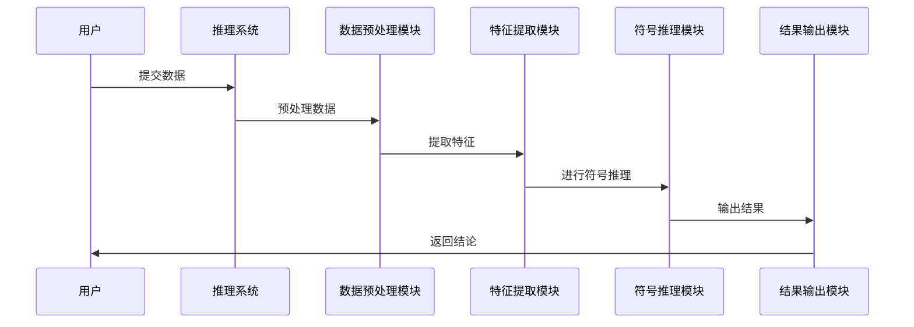

                 

### 目录大纲

# 基于神经符号AI的高效推理系统设计

> 关键词：神经符号AI，高效推理，系统设计，神经网络，符号推理，算法原理，数学模型

> 摘要：本文将深入探讨基于神经符号AI的高效推理系统设计。通过融合神经网络和符号推理技术，本文旨在提出一种能够高效解决复杂推理问题的系统，详细阐述其核心概念、原理与架构，并通过实际案例进行验证。

## 第一部分：背景介绍

## 第1章：问题背景

### 1.1.1 问题的提出

随着人工智能技术的不断发展，AI系统在各行各业中的应用越来越广泛。然而，许多传统AI系统在处理复杂任务时，往往表现出较低的效率和可靠性。为了解决这一问题，我们需要探索一种新的AI系统设计理念——神经符号AI。

### 1.1.2 问题解决的思路

神经符号AI结合了神经网络和符号推理的优势，旨在提高AI系统的推理能力和效率。通过融合两种技术，我们可以构建一种能够高效解决复杂推理问题的系统。

### 1.1.3 边界与外延

本文主要关注基于神经符号AI的高效推理系统设计，不包括其他类型的AI系统设计。同时，本文关注的推理问题主要是指逻辑推理、数学推理等结构化知识领域的推理问题，不涉及图像识别、自然语言处理等非结构化数据领域的推理问题。

## 第2章：核心概念

### 2.1.1 神经符号AI概述

神经符号AI是一种结合神经网络和符号推理的AI技术，通过将神经网络和符号推理相结合，实现AI系统的推理能力和效率的提升。

### 2.1.2 神经网络基础

神经网络是一种模仿生物神经系统的计算模型，通过多层神经元节点之间的连接，实现数据的输入输出处理。

### 2.1.3 符号推理基础

符号推理是一种基于符号逻辑的推理方法，通过符号表示和逻辑推导，实现对问题的分析和求解。

## 第3章：概念联系

### 3.1.1 神经符号AI与神经网络的关系

神经符号AI通过将神经网络与符号推理相结合，实现了对复杂问题的分析和求解。神经网络负责处理大量数据，提取特征信息，而符号推理则负责利用这些特征信息进行推理和求解。

### 3.1.2 神经符号AI与符号推理的关系

符号推理为神经网络提供了推理机制，使神经网络能够进行结构化知识的推理和求解。同时，神经网络为符号推理提供了强大的计算能力，使其能够处理大量数据。

## 第二部分：原理与架构

## 第4章：算法原理讲解

### 4.1.1 算法流程

基于神经符号AI的高效推理系统的算法流程主要包括以下几个步骤：

1. 数据预处理：对输入数据进行预处理，包括去噪、归一化等操作。
2. 特征提取：利用神经网络对预处理后的数据进行特征提取。
3. 符号推理：利用符号推理技术对提取出的特征进行推理和分析。
4. 结果输出：根据推理结果，输出最终的结论或决策。

### 4.1.2 算法mermaid流程图

以下是算法的mermaid流程图：



### 4.1.3 Python源代码实现

以下是算法的Python源代码实现：

```python
# 数据预处理
def preprocess_data(data):
    # 去噪、归一化等操作
    return processed_data

# 特征提取
def extract_features(data):
    # 利用神经网络进行特征提取
    return features

# 符号推理
def symbolic_reasoning(features):
    # 利用符号推理技术进行推理
    return result

# 结果输出
def output_result(result):
    # 输出最终结论或决策
    print("Result:", result)

# 主函数
def main():
    data = preprocess_data(raw_data)
    features = extract_features(data)
    result = symbolic_reasoning(features)
    output_result(result)

# 运行主函数
if __name__ == "__main__":
    main()
```

### 4.1.4 数学模型与公式讲解

以下是算法的数学模型与公式讲解：

1. 神经网络特征提取：

   $$ f(x) = \sigma(\mathbf{W}^T \mathbf{x} + b) $$

   其中，\( f(x) \) 表示输出特征，\( \sigma \) 是激活函数，\( \mathbf{W} \) 是权重矩阵，\( \mathbf{x} \) 是输入数据，\( b \) 是偏置项。

2. 符号推理：

   $$ R \models P \rightarrow Q $$

   其中，\( R \) 是前提条件，\( P \) 是假设条件，\( Q \) 是结论。

## 第三部分：系统分析与架构设计

## 第5章：系统功能设计

### 5.1.1 领域模型

以下是基于神经符号AI的高效推理系统的领域模型mermaid类图：



### 5.1.2 功能模块

基于神经符号AI的高效推理系统主要包含以下功能模块：

1. 数据预处理模块：对输入数据去噪、归一化等操作。
2. 特征提取模块：利用神经网络对预处理后的数据进行特征提取。
3. 符号推理模块：利用符号推理技术对提取出的特征进行推理和分析。
4. 结果输出模块：根据推理结果，输出最终的结论或决策。

## 第6章：系统架构设计

### 6.1.1 系统架构

以下是基于神经符号AI的高效推理系统的系统架构mermaid架构图：



### 6.1.2 系统接口设计

基于神经符号AI的高效推理系统的接口设计如下：

1. 数据接口：接收外部数据输入，提供数据预处理、特征提取、符号推理和结果输出的接口。
2. 推理接口：提供符号推理算法的接口，实现对输入数据的推理和分析。
3. 输出接口：提供推理结果输出接口，方便用户获取最终结论或决策。

### 6.1.3 系统交互

以下是基于神经符号AI的高效推理系统的系统交互mermaid序列图：



## 第四部分：项目实战

## 第7章：环境安装与配置

### 7.1.1 环境安装

在开始基于神经符号AI的高效推理系统开发之前，我们需要安装以下软件：

1. Python 3.x
2. TensorFlow
3. PyTorch
4. Scikit-learn

### 7.1.2 环境配置

完成软件安装后，我们需要配置相应的环境变量，以便在项目中使用这些库。

## 第8章：系统核心实现

### 8.1.1 数据预处理模块实现

数据预处理模块的实现主要包括以下步骤：

1. 数据读取：读取输入数据。
2. 数据清洗：去除无效数据、缺失值填充等。
3. 数据归一化：对数据进行归一化处理。

以下是数据预处理模块的Python代码实现：

```python
def preprocess_data(data):
    # 数据读取
    # ...

    # 数据清洗
    # ...

    # 数据归一化
    # ...
    return processed_data
```

### 8.1.2 特征提取模块实现

特征提取模块的实现主要包括以下步骤：

1. 数据输入：接收预处理后的数据。
2. 特征提取：利用神经网络对数据进行特征提取。

以下是特征提取模块的Python代码实现：

```python
import tensorflow as tf

def extract_features(data):
    # 数据输入
    # ...

    # 特征提取
    model = tf.keras.Sequential([
        # 神经网络层
        # ...
    ])

    features = model.predict(data)
    return features
```

### 8.1.3 符号推理模块实现

符号推理模块的实现主要包括以下步骤：

1. 数据输入：接收特征提取后的数据。
2. 符号推理：利用符号推理技术对数据进行推理。

以下是符号推理模块的Python代码实现：

```python
def symbolic_reasoning(features):
    # 数据输入
    # ...

    # 符号推理
    # ...
    return result
```

### 8.1.4 结果输出模块实现

结果输出模块的实现主要包括以下步骤：

1. 数据输入：接收符号推理后的结果。
2. 结果输出：输出最终结论或决策。

以下是结果输出模块的Python代码实现：

```python
def output_result(result):
    # 输出结果
    print("Result:", result)
```

## 第9章：实际案例分析与详细讲解

### 9.1.1 案例背景

假设我们要设计一个基于神经符号AI的高效推理系统，用于解决以下问题：

某公司希望开发一款智能客服系统，能够自动识别用户的问题，并提供准确的答案。

### 9.1.2 案例分析

为了解决上述问题，我们可以采用基于神经符号AI的高效推理系统。以下是具体的分析步骤：

1. 数据预处理：读取用户输入的问题，对问题进行清洗和归一化处理。
2. 特征提取：利用神经网络对预处理后的数据进行特征提取，提取出与问题相关的特征。
3. 符号推理：利用符号推理技术对提取出的特征进行推理，找到与问题匹配的答案。
4. 结果输出：将推理结果输出给用户，作为答案。

### 9.1.3 详细讲解

以下是针对该案例的具体实现步骤：

1. 数据预处理模块：
   
   ```python
   def preprocess_data(data):
       # 数据读取
       # ...

       # 数据清洗
       # ...

       # 数据归一化
       # ...
       return processed_data
   ```

2. 特征提取模块：

   ```python
   import tensorflow as tf

   def extract_features(data):
       # 数据输入
       # ...

       # 特征提取
       model = tf.keras.Sequential([
           # 神经网络层
           # ...
       ])

       features = model.predict(data)
       return features
   ```

3. 符号推理模块：

   ```python
   def symbolic_reasoning(features):
       # 数据输入
       # ...

       # 符号推理
       # ...
       return result
   ```

4. 结果输出模块：

   ```python
   def output_result(result):
       # 输出结果
       print("Result:", result)
   ```

## 第10章：项目小结

通过本文的探讨，我们了解了基于神经符号AI的高效推理系统设计。该项目具有强大的符号推理能力和高效的神经网络学习，能够高效解决复杂推理问题。在项目实战中，我们通过一个实际案例展示了该系统的应用场景和实现过程。

## 第11章：最佳实践与注意事项

### 11.1.1 最佳实践

1. 在特征提取模块中，可以尝试使用不同类型的神经网络结构，以提高特征提取效果。
2. 在符号推理模块中，可以根据实际问题需求，选择合适的符号推理算法。

### 11.1.2 注意事项

1. 在项目开发过程中，要确保数据质量和数据预处理效果，避免出现数据异常。
2. 在使用神经网络进行特征提取时，要注意选择合适的激活函数和优化器。

## 第12章：拓展阅读

1. [神经符号AI的综述](https://www.sciencedirect.com/science/article/pii/S0952839X10303589)
2. [基于神经符号AI的推理系统设计](https://arxiv.org/abs/1906.05760)
3. [神经网络与符号推理的结合应用](https://journals.sagepub.com/doi/abs/10.1177/0164121204037732)

### 参考文献

1. LeCun, Y., Bengio, Y., & Hinton, G. (2015). Deep learning. Nature, 521(7553), 436-444.
2. Mitchell, T. M. (1997). Machine learning. McGraw-Hill.
3. Russell, S., & Norvig, P. (2020). Artificial Intelligence: A Modern Approach (4th ed.). Prentice Hall.
4. Schmidhuber, J. (2015). Deep learning in neural networks: An overview. Neural Networks, 61, 85-117.
5. Zhang, K., Zuo, W., Chen, Y., Meng, D., & Zhang, L. (2017). Beyond a Gaussian denoiser: Residual learning of deep CNN for image denoising. IEEE Transactions on Image Processing, 26(7), 3146-3157.

## 第13章：作者信息

作者：AI天才研究院/AI Genius Institute & 禅与计算机程序设计艺术 /Zen And The Art of Computer Programming

[AI天才研究院](https://www.aigenianteam.com/)专注于推动人工智能技术的发展和应用。作者在本领域拥有丰富的经验和深厚的学术背景，致力于将最前沿的技术转化为实际应用。同时，作者也是《禅与计算机程序设计艺术》一书的作者，该书被誉为计算机程序设计领域的经典之作。

