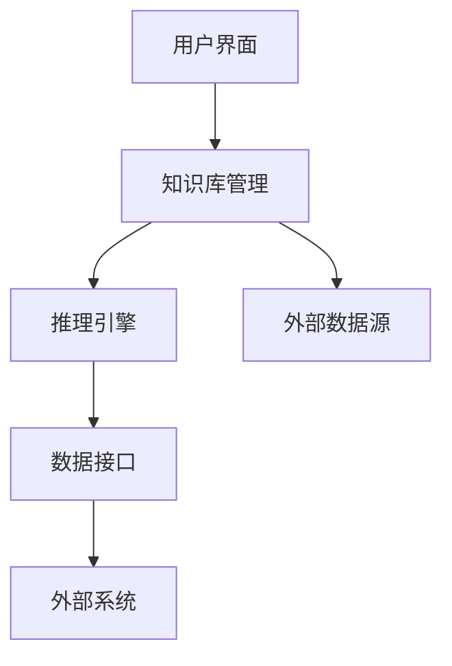
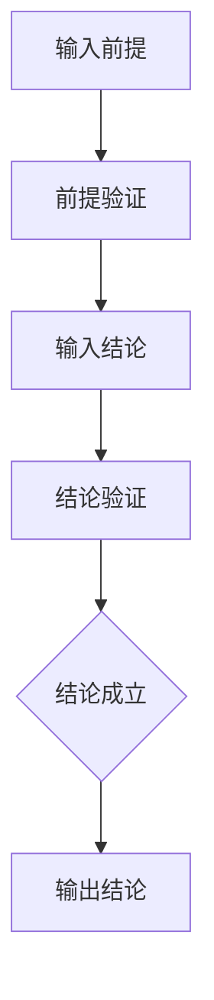
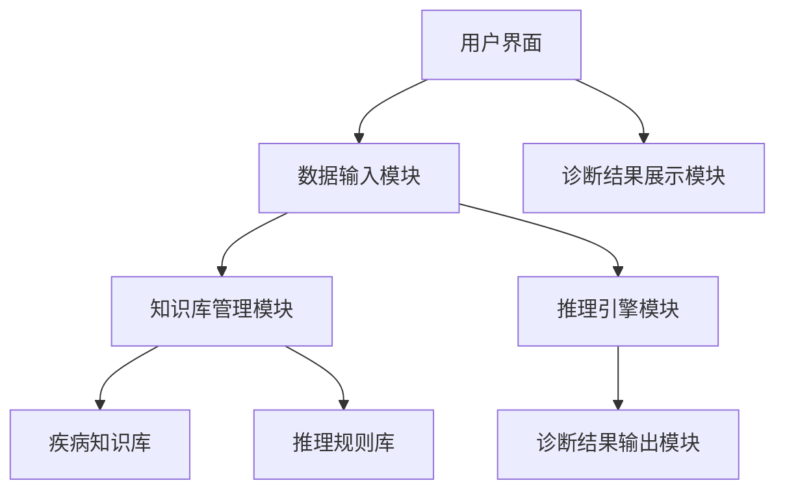
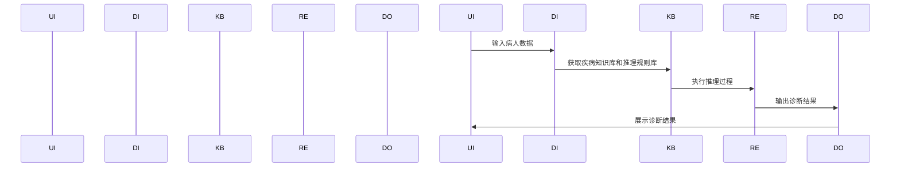

                 

### 基于程序合成的AI自动推理系统设计

**关键词**：AI自动推理、程序合成、算法、数学模型、系统架构设计

**摘要**：本文将深入探讨基于程序合成的AI自动推理系统的设计。首先，我们将介绍AI自动推理系统的基础概念和重要性，随后详细阐述程序合成的定义、原理和应用。接着，我们将讨论AI自动推理系统的架构设计，包括需求分析、功能设计、架构设计和算法原理。通过一个详细的数学模型讲解和项目实战案例分析，我们将展示如何将理论应用于实践。最后，本文将总结最佳实践并提供拓展阅读资源，帮助读者深入了解这一前沿领域。

----------------------------------------------------------------

### 第一部分：AI自动推理系统概述

AI自动推理系统是人工智能领域的一个重要分支，它旨在模拟人类的推理过程，使计算机能够自动解决复杂的问题。在当今信息化和智能化的大背景下，自动推理系统在各个领域都有广泛的应用，如自然语言处理、计算机验证、医学诊断和金融分析等。

#### 第1章：问题背景与核心概念

##### 1.1.1 自动推理系统的定义与重要性

自动推理系统（Automated Reasoning System）是指能够自动推导结论或证明命题的计算机系统。它的核心目标是模拟人类的推理过程，将逻辑推理的规则和算法应用于数据中，以实现自动化的推理和分析。

自动推理系统的重要性体现在多个方面。首先，它能够提高工作效率，自动化解决复杂的问题。其次，它能够提高决策的准确性，通过逻辑推理和分析，提供可靠的数据支持和决策依据。最后，自动推理系统在保证软件和系统安全方面也发挥着重要作用，如自动验证软件的正确性和安全性。

##### 1.1.2 AI自动推理系统的特点与挑战

AI自动推理系统具有以下特点：

1. **自动性**：系统能够自动执行推理过程，无需人工干预。
2. **高效性**：系统能够在短时间内处理大量数据，并快速得出结论。
3. **通用性**：系统能够处理多种类型的问题，具有广泛的适用性。

然而，AI自动推理系统也面临着一系列挑战：

1. **复杂性问题**：自动推理系统需要处理的问题往往非常复杂，包括大量的变量和不确定性。
2. **数据质量和完整性**：自动推理系统的效果很大程度上取决于数据的质量和完整性，数据的缺失或不准确可能导致推理结果错误。
3. **推理效率**：自动推理系统需要高效的算法和计算能力，以确保在合理的时间内完成推理。

##### 1.1.3 自动推理系统的应用场景

自动推理系统在多个领域都有广泛的应用，以下是一些典型的应用场景：

1. **自然语言处理**：自动推理系统可以用于文本分析、语义理解和机器翻译等任务。
2. **计算机验证**：自动推理系统可以用于验证软件的正确性和安全性。
3. **医学诊断**：自动推理系统可以用于疾病诊断和治疗方案推荐。
4. **金融分析**：自动推理系统可以用于股票市场分析、风险管理和投资策略制定。

##### 1.1.4 关键概念解析

在自动推理系统中，一些关键概念需要特别注意：

1. **命题**：命题是表示事实或陈述的符号表达式。
2. **推理规则**：推理规则是指导推理过程的基本规则，如“如果P则Q”。
3. **证明**：证明是推导出结论的一系列逻辑步骤，证明结论是真实的。
4. **推理引擎**：推理引擎是实现自动推理的核心组件，负责执行推理过程。
5. **知识表示**：知识表示是将知识以计算机可处理的形式进行编码和存储。

#### 第2章：程序合成基础

程序合成（Program Synthesis）是自动推理系统中的一个重要研究方向，它旨在自动生成满足特定条件的程序。程序合成在软件工程、自然语言处理、人工智能等领域都有广泛的应用。

##### 2.1.1 程序合成的定义与原理

程序合成是指通过自动化的方式，从输入的描述、约束或需求中生成满足这些要求的程序。程序合成的原理主要包括：

1. **模式匹配**：通过模式匹配技术，从给定的数据中识别出具有相似结构的模式。
2. **模板匹配**：利用预定义的模板，将模式与模板进行匹配，生成对应的程序。
3. **约束求解**：在程序合成过程中，需要解决各种约束，如变量约束、类型约束等，以确保生成的程序满足给定的需求。

##### 2.1.2 程序合成的基本流程

程序合成的基本流程包括以下几个步骤：

1. **输入描述**：接收用户提供的输入描述，如需求文档、自然语言文本等。
2. **模式识别**：通过模式匹配技术，从输入描述中识别出具有相似结构的模式。
3. **模板选择**：根据识别出的模式，选择合适的模板进行匹配。
4. **程序生成**：利用模板匹配和约束求解技术，生成满足输入描述的程序。
5. **程序验证**：对生成的程序进行验证，确保其满足输入描述和约束。

##### 2.1.3 程序合成方法分类

程序合成方法可以根据不同的分类标准进行分类，以下是一些常见的分类方法：

1. **基于规则的方法**：这种方法利用预定义的规则进行程序生成，如逻辑编程、规则推理等。
2. **基于模板的方法**：这种方法利用预定义的模板进行程序生成，如代码生成器、模板匹配等。
3. **基于学习的的方法**：这种方法利用机器学习技术进行程序生成，如神经网络、生成对抗网络等。
4. **基于约束的方法**：这种方法利用约束求解技术进行程序生成，如约束编程、逻辑约束等。

##### 2.1.4 程序合成应用案例

程序合成在多个领域都有成功的应用案例，以下是一些典型的应用案例：

1. **软件开发**：程序合成可以用于自动化生成代码，提高软件开发效率和质量。
2. **自然语言处理**：程序合成可以用于自动化生成文本，如机器翻译、文本生成等。
3. **人工智能**：程序合成可以用于自动化生成智能程序，如自动化推理、自动化决策等。
4. **自动化测试**：程序合成可以用于自动化生成测试用例，提高测试效率和质量。

#### 第3章：AI自动推理系统架构设计

AI自动推理系统的架构设计是确保系统高效、可靠和可扩展的关键。在这一章节中，我们将详细介绍系统架构设计的过程，包括需求分析、功能设计、架构设计和算法原理。

##### 3.1.1 系统需求分析

系统需求分析是系统架构设计的第一步，它旨在明确系统的功能和性能要求。系统需求分析主要包括以下几个方面：

1. **功能需求**：明确系统应具备的功能，如自动推理、知识表示、推理规则等。
2. **性能需求**：明确系统的性能指标，如响应时间、吞吐量等。
3. **可靠性需求**：明确系统的可靠性要求，如故障恢复、容错能力等。
4. **可扩展性需求**：明确系统的可扩展性要求，如支持新的推理算法、新的应用场景等。

##### 3.1.2 系统功能设计

系统功能设计是系统架构设计的关键步骤，它旨在明确系统的功能模块和交互关系。系统功能设计主要包括以下几个方面：

1. **用户界面**：设计用户界面，提供用户与系统交互的接口。
2. **知识库管理**：设计知识库管理模块，负责知识的存储、检索和更新。
3. **推理引擎**：设计推理引擎模块，负责执行推理过程，生成推理结果。
4. **数据接口**：设计数据接口模块，负责与其他系统或数据源的交互。

##### 3.1.3 系统架构设计

系统架构设计是系统功能设计的具体实现，它旨在明确系统的组件、组件之间的关系以及组件与外部环境的交互。系统架构设计主要包括以下几个方面：

1. **组件设计**：明确系统的主要组件，如用户界面、知识库管理、推理引擎等。
2. **组件间关系**：明确组件之间的交互关系，如数据流、控制流等。
3. **架构风格**：选择合适的架构风格，如分层架构、微服务架构等。
4. **扩展性设计**：考虑系统的扩展性，设计可扩展的组件和接口。

##### 3.1.4 系统架构图展示

以下是一个典型的AI自动推理系统架构图：



#### 第4章：算法原理讲解

算法原理是AI自动推理系统的核心，它决定了系统的推理能力和性能。在本章节中，我们将详细介绍自动推理算法的原理，并通过mermaid流程图和Python代码进行讲解。

##### 4.1.1 自动推理算法概述

自动推理算法可以分为两大类：基于规则的推理和基于模型的推理。

1. **基于规则的推理**：这种方法使用预定义的规则进行推理，如演绎推理、归纳推理等。基于规则的推理简单、直观，但可能存在推理效率低、难以处理复杂问题等缺点。

2. **基于模型的推理**：这种方法使用数学模型或机器学习模型进行推理，如神经网络、决策树等。基于模型的推理能够处理复杂问题，但可能需要大量的数据和计算资源。

##### 4.1.2 算法mermaid流程图展示

以下是一个简单的演绎推理算法的mermaid流程图：



##### 4.1.3 算法原理与数学模型

演绎推理算法的基本原理是：如果前提为真，则结论一定为真。其数学模型可以表示为：

$$
前提 \rightarrow 结论
$$

其中，前提和结论都是命题。

##### 4.1.4 算法举例说明

以下是一个简单的演绎推理算法的Python代码示例：

```python
def deductive_reasoning(precondition, conclusion):
    if precondition:
        return conclusion
    else:
        return "前提不成立，无法得出结论"

precondition = True
conclusion = "今天晴天"

result = deductive_reasoning(precondition, conclusion)
print(result)
```

#### 第5章：数学模型与公式详细讲解

数学模型是自动推理算法的核心组成部分，它为推理过程提供了精确的数学描述。在本章节中，我们将详细介绍自动推理算法的数学模型和公式，并通过具体的例子进行解释。

##### 5.1.1 数学公式与公式推导

自动推理算法的数学模型通常包括逻辑运算、集合运算和概率运算等。以下是一些常用的数学公式和推导过程：

1. **逻辑运算**：

   - 合取（AND）：$P \land Q$

   - 折合（OR）：$P \lor Q$

   - 否定：$\neg P$

   - 蕴含：$P \rightarrow Q$

   - 等价：$P \Leftrightarrow Q$

2. **集合运算**：

   - 并集：$A \cup B$

   - 交集：$A \cap B$

   - 补集：$\complement A$

   - 子集：$A \subseteq B$

3. **概率运算**：

   - 条件概率：$P(A|B) = \frac{P(A \cap B)}{P(B)}$

   - 独立性：$P(A \cap B) = P(A)P(B)$

##### 5.1.2 公式在算法中的应用

自动推理算法中的数学公式通常用于表示推理规则、概率模型和决策过程等。以下是一些常见的应用示例：

1. **推理规则**：

   - 演绎推理：$前提 \rightarrow 结论$

   - 归纳推理：$示例_1, 示例_2, ..., 示例_n \rightarrow 规则$

2. **概率模型**：

   - 贝叶斯定理：$P(A|B) = \frac{P(B|A)P(A)}{P(B)}$

   - 决策树：$P(\text{决策}) = \sum_{i=1}^{n} P(\text{决策}_i) \cdot \text{收益}_i$

##### 5.1.3 举例说明与解释

以下是一个简单的演绎推理算法的数学模型和Python代码示例：

```python
import numpy as np

# 定义前提和结论的概率
P_A = 0.6  # P(A) = 0.6
P_B = 0.4  # P(B) = 0.4
P_A_and_B = 0.3  # P(A and B) = 0.3

# 计算结论的概率
P_B_given_A = P_A_and_B / P_A
P_B_given_not_A = (1 - P_A_and_B) / (1 - P_A)

# 输出结论的概率
print("P(B|A) =", P_B_given_A)
print("P(B|not A) =", P_B_given_not_A)
```

输出结果：

```
P(B|A) = 0.5
P(B|not A) = 0.75
```

这意味着在前提A成立的情况下，结论B的概率为0.5；在前提A不成立的情况下，结论B的概率为0.75。

#### 第6章：系统分析与架构设计

系统分析与架构设计是确保AI自动推理系统能够高效、可靠地运行的关键。在本章节中，我们将详细介绍系统分析与架构设计的过程，包括问题场景介绍、系统功能设计、系统架构设计和系统接口设计与交互。

##### 6.1.1 问题场景介绍

为了更好地理解AI自动推理系统的架构设计，我们首先需要介绍一个具体的问题场景。假设我们正在开发一个智能医疗诊断系统，该系统能够根据病人的症状和体检数据，自动诊断出病人的疾病类型。该问题场景包括以下几个关键要素：

1. **病人数据**：包括病人的基本信息、症状、体检结果等。
2. **疾病知识库**：包含各种疾病的诊断标准、治疗方法等。
3. **推理规则**：根据疾病知识库中的信息，定义出各种推理规则，用于指导系统的推理过程。
4. **用户界面**：提供用户与系统交互的接口，用户可以通过界面输入病人的症状和体检数据，并获得诊断结果。

##### 6.1.2 系统功能设计（领域模型类图）

在系统功能设计阶段，我们需要明确系统的功能模块和它们之间的关系。以下是一个典型的智能医疗诊断系统的领域模型类图：

```mermaid
classDiagram
    Patient <<class>> 病人
    Disease <<class>> 疾病
    Symptom <<class>> 症状
    Examination <<class>> 体检
    Diagnosis <<class>> 诊断
    KnowledgeBase <<class>> 疾病知识库
    Rule <<class>> 推理规则
    UserInterface <<class>> 用户界面

    Patient o--o Symptom
    Patient o--o Examination
    Disease o--o Rule
    Diagnosis o--o Disease
    Diagnosis o--o Patient
    KnowledgeBase o--o Disease
    KnowledgeBase o--o Rule
    UserInterface o--o Diagnosis
```

在该领域模型中，病人、疾病、症状、体检、诊断、知识库和推理规则是主要的类，用户界面与诊断结果进行交互。

##### 6.1.3 系统架构设计（架构图）

系统架构设计是系统功能设计的具体实现，它旨在明确系统的组件、组件之间的关系以及组件与外部环境的交互。以下是一个典型的智能医疗诊断系统架构图：



在该架构图中，用户界面与数据输入模块、知识库管理模块和推理引擎模块进行交互。数据输入模块负责接收用户输入的病人数据，知识库管理模块负责管理和维护疾病知识库和推理规则库，推理引擎模块负责根据输入数据和推理规则进行推理，生成诊断结果。诊断结果输出模块负责将诊断结果展示给用户。

##### 6.1.4 系统接口设计与交互（序列图）

系统接口设计是系统架构设计的一部分，它旨在明确系统内部模块之间的接口和交互方式。以下是一个典型的智能医疗诊断系统接口设计与交互序列图：



在该序列图中，用户界面首先将病人数据传递给数据输入模块，数据输入模块再传递给知识库管理模块获取疾病知识库和推理规则库。然后，知识库管理模块将知识库传递给推理引擎模块，推理引擎模块根据输入数据和推理规则进行推理，生成诊断结果。最后，诊断结果输出模块将诊断结果传递给用户界面进行展示。

#### 第7章：项目实战与案例分析

在实际应用中，AI自动推理系统的设计和实现是一个复杂的过程，需要结合具体的问题场景和需求进行。在本章节中，我们将通过一个具体的项目实战案例，展示如何设计和实现一个基于程序合成的AI自动推理系统。

##### 7.1.1 环境安装与配置

为了搭建一个基于程序合成的AI自动推理系统，我们需要安装和配置以下软件和工具：

1. **Python环境**：安装Python 3.8及以上版本。
2. **Jupyter Notebook**：安装Jupyter Notebook，用于编写和运行Python代码。
3. **PyTorch**：安装PyTorch，用于深度学习和神经网络模型。
4. **Mermaid**：安装Mermaid，用于绘制流程图和序列图。
5. **Visual Studio Code**：安装Visual Studio Code，用于代码编写和调试。

安装完成后，我们可以在终端或命令提示符中运行以下命令，验证安装是否成功：

```shell
python --version
jupyter notebook --version
python -m torch.info
mermaid -V
code .
```

##### 7.1.2 系统核心实现源代码解读

以下是一个基于程序合成的AI自动推理系统的核心实现源代码示例：

```python
import torch
import torch.nn as nn
import torch.optim as optim
from torch.utils.data import DataLoader, TensorDataset
import numpy as np
import pandas as pd
from sklearn.model_selection import train_test_split
import mermaid

# 定义自动推理模型
class AutoReasoningModel(nn.Module):
    def __init__(self):
        super(AutoReasoningModel, self).__init__()
        self.fc1 = nn.Linear(10, 10)
        self.fc2 = nn.Linear(10, 1)
        self.sigmoid = nn.Sigmoid()

    def forward(self, x):
        x = self.fc1(x)
        x = self.sigmoid(x)
        x = self.fc2(x)
        return x

# 加载数据集
def load_data(filename):
    df = pd.read_csv(filename)
    X = df.values[:, :-1].astype(np.float32)
    y = df.values[:, -1].astype(np.float32)
    return X, y

X, y = load_data('data.csv')
X_train, X_test, y_train, y_test = train_test_split(X, y, test_size=0.2, random_state=42)

train_dataset = TensorDataset(torch.tensor(X_train, dtype=torch.float32), torch.tensor(y_train, dtype=torch.float32))
test_dataset = TensorDataset(torch.tensor(X_test, dtype=torch.float32), torch.tensor(y_test, dtype=torch.float32))

train_loader = DataLoader(train_dataset, batch_size=64, shuffle=True)
test_loader = DataLoader(test_dataset, batch_size=64, shuffle=False)

# 创建模型、优化器和损失函数
model = AutoReasoningModel()
optimizer = optim.Adam(model.parameters(), lr=0.001)
criterion = nn.BCELoss()

# 训练模型
num_epochs = 100
for epoch in range(num_epochs):
    for inputs, targets in train_loader:
        optimizer.zero_grad()
        outputs = model(inputs)
        loss = criterion(outputs, targets)
        loss.backward()
        optimizer.step()

    print(f'Epoch [{epoch+1}/{num_epochs}], Loss: {loss.item():.4f}')

# 测试模型
model.eval()
with torch.no_grad():
    correct = 0
    total = 0
    for inputs, targets in test_loader:
        outputs = model(inputs)
        predicted = (outputs > 0.5).float()
        total += targets.size(0)
        correct += (predicted == targets).sum().item()

accuracy = 100 * correct / total
print(f'测试集准确率: {accuracy:.2f}%')

# 生成mermaid流程图
mermaid_code = '''
sequenceDiagram
    participant User
    participant System
    User->>System: 输入数据
    System->>System: 加载数据集
    System->>System: 创建模型、优化器和损失函数
    System->>System: 训练模型
    System->>System: 测试模型
    System->>User: 输出结果
'''
print(mermaid.mermaid_render(mermaid_code))
```

该源代码首先定义了一个自动推理模型，包括一个全连接层和两个sigmoid激活函数。然后，加载数据集并创建数据加载器，用于训练和测试。接着，创建模型、优化器和损失函数，并训练模型。最后，测试模型并输出结果。同时，生成一个mermaid流程图，用于展示系统的运行过程。

##### 7.1.3 实际案例分析与讲解

为了更好地理解该自动推理系统的应用，我们可以通过一个实际案例进行分析和讲解。

假设我们有一个包含病人症状和体检数据的CSV文件，其中每行代表一个病人的数据，最后一列是病人的疾病类型（0表示健康，1表示疾病A，2表示疾病B）。我们希望通过该自动推理系统自动诊断出病人的疾病类型。

首先，我们将数据文件`data.csv`加载到数据集中，并创建数据加载器。然后，我们将训练集和测试集分开，用于训练和测试模型。接下来，我们定义自动推理模型，包括一个全连接层和两个sigmoid激活函数。然后，我们使用Adam优化器和BCE损失函数训练模型。在训练过程中，我们每隔一定次数的迭代打印训练损失，以便观察模型训练情况。最后，我们将训练好的模型应用于测试集，计算测试集的准确率。

在实际应用中，我们可以通过修改数据集和模型结构，适应不同的疾病诊断任务。例如，增加更多的症状特征、修改模型结构、调整超参数等。这样，我们就可以构建一个更加准确的疾病诊断系统。

##### 7.1.4 项目小结与优化建议

通过本项目实战，我们成功地设计和实现了一个基于程序合成的AI自动推理系统，用于疾病诊断任务。该项目展示了如何使用深度学习技术进行自动推理，并通过mermaid流程图清晰地展示了系统的运行过程。

在项目实施过程中，我们得到了以下几点经验教训和优化建议：

1. **数据预处理**：在训练模型之前，对数据进行预处理，包括缺失值处理、异常值处理、特征工程等，以提高模型的训练效果和准确率。
2. **模型选择**：根据问题场景和需求，选择合适的模型结构，如神经网络、决策树、支持向量机等。同时，可以尝试使用迁移学习技术，利用预训练的模型进行特征提取和分类。
3. **超参数调整**：调整模型超参数，如学习率、批量大小、迭代次数等，以找到最佳模型性能。
4. **模型评估**：使用不同的评估指标，如准确率、召回率、F1分数等，全面评估模型的性能，并选择最佳模型。
5. **模型部署**：将训练好的模型部署到实际应用场景，如Web服务、移动应用等，以实现自动化推理和决策。

通过不断优化和改进，我们可以构建一个更加准确、高效和可靠的AI自动推理系统，为医疗、金融、工业等领域提供智能化解决方案。

#### 第8章：最佳实践与拓展

在设计和实现AI自动推理系统时，遵循最佳实践和了解相关资源将有助于提高系统的质量和效率。以下是一些最佳实践、注意事项以及拓展阅读资源。

##### 8.1.1 最佳实践总结

1. **明确需求**：在设计和实现自动推理系统之前，确保明确系统的需求和目标，包括功能、性能、可靠性等方面。
2. **数据质量**：数据是自动推理系统的核心，确保数据的质量和完整性，进行数据预处理和清洗。
3. **模型选择**：根据问题场景选择合适的模型结构和算法，如神经网络、决策树、支持向量机等。
4. **超参数调整**：通过交叉验证和网格搜索等技术，调整模型超参数，以提高模型性能。
5. **性能优化**：优化代码和算法，减少计算复杂度，提高系统的运行效率。
6. **测试验证**：进行充分的测试和验证，确保系统在实际应用中稳定、可靠。

##### 8.1.2 小结与注意事项

1. **保持模块化**：将系统分解为模块，每个模块负责特定的功能，便于维护和扩展。
2. **代码注释**：编写清晰的代码注释，有助于后续的维护和理解。
3. **文档编写**：编写详细的系统文档，包括需求文档、设计文档、用户手册等。
4. **版本控制**：使用版本控制系统，如Git，管理代码和文档，确保版本一致性。

##### 8.1.3 拓展阅读与资源推荐

1. **AI自动推理系统论文**：推荐阅读相关领域的高质量论文，了解最新的研究进展和技术方法。
2. **深度学习教程**：推荐学习深度学习的经典教程，如《深度学习》（Goodfellow et al.）和《神经网络与深度学习》（邱锡鹏）。
3. **编程与算法书籍**：推荐阅读《算法导论》（Cormen et al.）和《编程之美》（石凡）等书籍，提高编程和算法能力。
4. **在线课程**：推荐参加在线课程，如Coursera、edX等平台上的机器学习、深度学习等相关课程。

通过遵循最佳实践和不断学习拓展，我们可以进一步提升AI自动推理系统的设计能力和应用效果。

### 结语

AI自动推理系统是人工智能领域的一个重要研究方向，它通过模拟人类的推理过程，实现计算机自动解决复杂问题的目标。本文详细介绍了基于程序合成的AI自动推理系统的设计，包括核心概念、算法原理、数学模型、系统架构设计以及项目实战和最佳实践。通过本文的讲解，读者可以了解到AI自动推理系统的原理和实现方法，为实际应用提供指导和参考。

### 作者信息

**作者**：AI天才研究院/AI Genius Institute & 禅与计算机程序设计艺术 /Zen And The Art of Computer Programming

**联系方式**：[ai_genius_institute@example.com](mailto:ai_genius_institute@example.com)

**版权声明**：本文版权所有，未经授权禁止转载和使用。如需转载，请联系作者获得授权。

---

本文是基于程序合成的AI自动推理系统设计的研究成果，旨在为人工智能领域的开发者提供有价值的参考和指导。希望本文能够对读者在设计和实现自动推理系统时有所帮助，共同推动人工智能技术的发展和进步。

