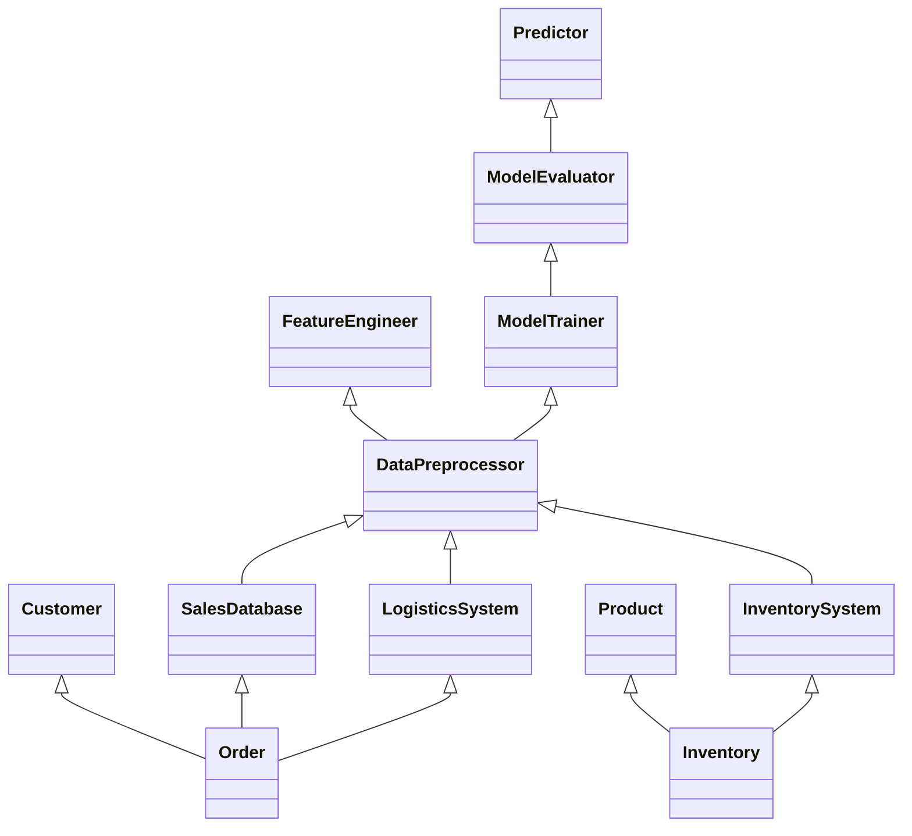
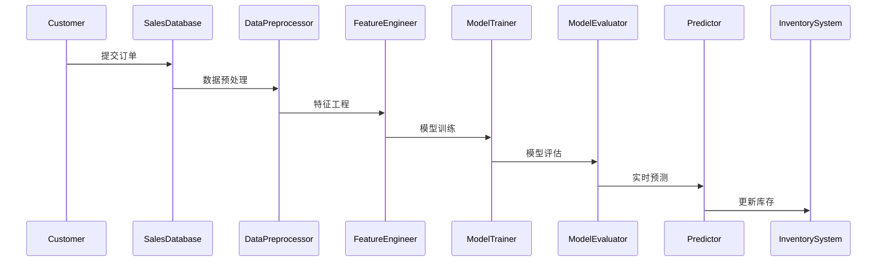
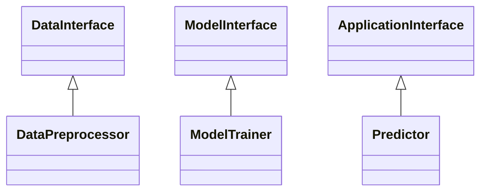
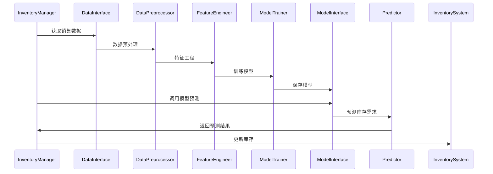

                 


## 《增强分析：AI辅助下的数据洞察新范式》

> 关键词：增强分析、AI、数据洞察、数据分析、技术架构

> 摘要：本文将深入探讨增强分析（AI-assisted analytics）这一新兴领域，通过对其背景、核心概念、技术应用以及未来发展趋势的剖析，揭示AI如何推动数据洞察的新范式，并探讨其对企业商业决策的影响。

### 目录大纲：

# 《增强分析：AI辅助下的数据洞察新范式》

## 第一部分：背景与概述

### 1. 背景介绍

### 1.1 增强分析的概念

- **定义**：增强分析是一种利用人工智能技术来提升数据分析效率和洞察力的方法。
- **与传统数据分析的区别**：传统数据分析依赖于预定义的报表和查询，而增强分析则更注重实时数据洞察和预测性分析。

### 1.2 数据分析的重要性

- **商业决策**：数据分析为企业提供了决策支持，帮助识别市场趋势、优化业务流程和预测未来需求。
- **现代企业地位**：数据分析已成为企业竞争的关键因素，能够为企业带来巨大的商业价值。

### 1.3 AI在数据分析中的应用

- **进展**：AI技术在数据分析领域不断取得突破，如自动化数据清洗、智能特征工程和高级预测模型。
- **效果提升**：AI技术通过学习大量数据，能够发现复杂模式和趋势，从而提高数据分析的准确性和效率。

## 第二部分：核心概念与原理

### 2. 增强分析的核心概念

### 2.1 增强分析的技术架构

- **数据采集与处理**：通过数据集成、数据清洗和数据转换等步骤，确保数据质量和一致性。
- **特征工程**：从原始数据中提取有用特征，用于模型训练和预测。
- **模型选择与训练**：选择合适的算法模型，并通过训练来优化模型性能。
- **模型评估与优化**：评估模型效果，并进行调优以提升预测准确性。

### 2.2 AI辅助下的数据分析

- **应用场景**：AI在数据分析中的应用场景广泛，包括异常检测、客户行为分析和市场预测等。
- **算法角色**：AI算法在数据分析中扮演着决策支持、自动化优化和智能解释等角色。

### 3. 数据洞察的新范式

### 3.1 数据洞察的定义与目标

- **内涵**：数据洞察是通过数据分析和解释，发现有价值的信息和知识。
- **外延**：数据洞察的目标是支持企业决策、优化业务流程和创造商业价值。

### 3.2 数据洞察的新范式

- **新思维模式**：数据洞察从传统的报表和查询转向实时、预测性和自我学习。
- **数字化转型**：数据洞察在数字化转型中发挥着关键作用，推动企业智能化发展。

## 第三部分：技术应用与实践

### 4. 增强分析在不同行业中的应用

### 4.1 金融行业

- **金融风险管理**：通过增强分析，预测市场波动，优化投资组合。
- **金融投资决策**：利用AI算法进行实时数据分析和预测，提高投资决策的准确性。

### 4.2 零售行业

- **顾客行为**：通过分析顾客数据，了解其购买偏好和需求，优化营销策略。
- **库存管理**：利用AI优化库存水平，减少库存成本，提高供应链效率。

### 4.3 制造业

- **生产过程优化**：通过数据分析，优化生产流程，提高生产效率。
- **质量控制**：利用AI技术进行实时监控，确保产品质量。

### 5. 增强分析的最佳实践

### 5.1 数据准备与清洗

- **数据质量**：数据质量是增强分析成功的关键，必须确保数据准确、完整和一致。
- **数据清洗**：通过数据清洗，消除错误、冗余和不一致的数据，提高数据分析的准确性。

### 5.2 模型选择与优化

- **模型选择**：根据数据分析任务选择合适的模型，如回归分析、聚类分析和时间序列分析等。
- **模型优化**：通过调参和交叉验证，优化模型性能，提高预测准确性。

### 5.3 案例分析与讨论

- **案例分享**：分享真实案例，展示增强分析在实践中的应用和效果。
- **挑战与解决方案**：讨论增强分析实践中的挑战，并提出相应的解决方案。

## 第四部分：未来展望与趋势

### 6. 增强分析的发展趋势

### 6.1 技术进步对增强分析的影响

- **AI算法发展**：随着AI算法的进步，增强分析将能够处理更大规模、更复杂的数据集。
- **大数据与云计算**：大数据和云计算技术为增强分析提供了强大的计算和存储支持。

### 6.2 增强分析在未来的商业应用

- **新兴行业需求**：随着新兴行业的发展，增强分析将在更多领域得到应用，如生物科技和能源等行业。
- **商业决策支持**：增强分析将更深入地融入企业决策过程，为企业带来更大的商业价值。

### 7. 总结与展望

### 7.1 增强分析的总结

- **主要贡献与影响**：增强分析通过AI技术提升了数据分析的效率和洞察力，对企业决策产生了深远影响。
- **数据分析的重要性**：在数据驱动的时代，增强分析将成为企业获取竞争优势的关键因素。

### 7.2 展望未来

- **发展前景**：随着技术的不断进步，增强分析将在更多领域得到应用，推动数据科学和人工智能的发展。
- **创新机会**：在数据分析领域，仍然存在许多创新机会，如自动化决策支持和智能数据可视化等。

---

### 第一部分：背景与概述

#### 1. 背景介绍

在当今数据驱动的商业环境中，数据分析已成为企业制定战略决策、优化业务流程和提高运营效率的重要工具。然而，随着数据量的爆炸性增长，传统的数据分析方法逐渐暴露出其局限性。传统的数据分析依赖于人工编写查询和预定义的报表，这种方式不仅效率低下，而且难以应对复杂的数据关系和实时数据需求。

为了解决这些问题，增强分析（AI-assisted analytics）应运而生。增强分析是一种利用人工智能（AI）技术来提升数据分析效率和洞察力的方法。它通过自动化数据清洗、智能特征工程和高级预测模型等技术，使数据分析更加高效、准确和实时。增强分析不仅能够处理大规模数据集，还能够发现复杂模式和趋势，从而为企业提供更深入的洞察和更准确的预测。

#### 1.1 增强分析的概念

增强分析的定义：

增强分析是一种利用人工智能技术来提升数据分析效率和洞察力的方法。它通过自动化和智能化手段，从海量数据中提取有价值的信息，帮助企业做出更明智的决策。

与传统数据分析的区别：

传统的数据分析依赖于预定义的报表和查询，分析过程往往需要手动编写查询语句和报告模板。这种方法虽然能够满足基本的业务需求，但在处理复杂和大规模数据时显得力不从心。而增强分析则通过引入AI技术，实现了数据分析的自动化和智能化。它不仅能够自动处理数据清洗和特征工程等繁琐步骤，还能够根据业务需求实时生成预测模型和洞察报告。

#### 1.2 数据分析的重要性

数据分析在商业决策中的作用：

数据分析为企业提供了决策支持，帮助企业从海量数据中提取有价值的信息。通过数据分析，企业可以识别市场趋势、优化业务流程和预测未来需求。例如，通过分析客户购买行为，企业可以更好地了解客户需求，从而制定更有效的营销策略。此外，数据分析还能够帮助企业降低运营成本、提高生产效率和质量控制。

数据分析在现代企业中的地位：

在现代企业中，数据分析已经成为一项核心能力。随着数据量的不断增长和技术的进步，数据分析的重要性日益凸显。数据分析不仅能够帮助企业优化运营，还能够为企业带来竞争优势。企业通过利用数据分析，可以更好地理解市场动态、预测未来趋势和抓住商业机会。因此，数据分析已经成为现代企业不可或缺的一部分。

#### 1.3 AI在数据分析中的应用

AI技术在数据分析领域的进展：

近年来，AI技术在数据分析领域取得了显著进展。一方面，深度学习和机器学习算法的发展，使得数据分析能够处理更复杂的数据结构和更大量的数据。另一方面，AI技术的自动化和智能化特性，使得数据分析过程更加高效和准确。例如，通过使用深度学习模型，企业可以自动识别图像和文本中的信息，从而实现自动化数据分析和智能洞察。

AI如何提升数据分析的效果：

AI技术通过多种方式提升数据分析的效果：

1. **自动化数据清洗**：传统的数据清洗过程通常需要大量的人力和时间。AI技术可以通过自动化算法，快速识别和修复数据中的错误、缺失和异常值，从而提高数据质量。

2. **智能特征工程**：特征工程是数据分析中至关重要的一步。AI技术可以通过学习大量数据，自动提取和生成有用的特征，从而提高模型的预测性能。

3. **高级预测模型**：传统的数据分析方法往往依赖于简单的统计模型。而AI技术可以引入更复杂的预测模型，如深度神经网络、决策树和随机森林等，从而提高预测的准确性和鲁棒性。

4. **实时数据洞察**：传统的数据分析通常需要较长的处理时间，而AI技术可以实现实时数据分析和预测。通过实时分析，企业可以快速响应市场变化，抓住商机。

### 第二部分：核心概念与原理

#### 2.1 增强分析的核心概念

增强分析的技术架构：

增强分析的技术架构主要包括以下几个关键环节：

1. **数据采集与处理**：数据采集是指从各种数据源（如数据库、日志文件和传感器等）收集数据。数据处理则包括数据清洗、数据转换和数据集成等步骤，以确保数据的质量和一致性。

2. **特征工程**：特征工程是数据分析中至关重要的一步。它涉及到从原始数据中提取和生成有用的特征，用于模型训练和预测。特征工程的目标是提高模型的预测性能和可解释性。

3. **模型选择与训练**：模型选择是指根据数据分析任务选择合适的算法模型，如线性回归、决策树、随机森林和深度神经网络等。模型训练是指通过训练数据来调整模型参数，优化模型性能。

4. **模型评估与优化**：模型评估是指通过评估指标（如准确率、召回率和F1分数等）来衡量模型的效果。模型优化则包括调整模型参数、增加训练数据和尝试不同的模型等，以提高模型的预测准确性。

#### 2.2 AI辅助下的数据分析

AI在数据分析中的应用场景：

AI在数据分析中有着广泛的应用场景，包括但不限于以下几个方面：

1. **异常检测**：通过分析历史数据，AI可以自动识别异常行为或事件，如信用卡欺诈、网络安全威胁和医疗诊断异常等。

2. **客户行为分析**：通过分析客户购买行为、浏览历史和社交媒体活动，AI可以帮助企业更好地了解客户需求，优化营销策略和提升客户体验。

3. **市场预测**：AI可以通过分析市场数据、经济指标和竞争对手行为，预测市场趋势和需求变化，为企业提供决策支持。

4. **供应链优化**：通过分析供应链数据，AI可以帮助企业优化库存水平、降低物流成本和提高供应链效率。

AI算法在数据分析中的角色：

1. **决策支持**：AI算法可以根据分析结果，提供实时的决策建议，帮助企业快速响应市场变化。

2. **自动化优化**：AI技术可以自动化数据清洗、特征工程和模型训练等过程，提高数据分析的效率。

3. **智能解释**：AI算法可以生成易于理解的报告和可视化图表，帮助业务用户更好地理解分析结果。

### 3. 数据洞察的新范式

#### 3.1 数据洞察的定义与目标

数据洞察的定义：

数据洞察是通过数据分析和解释，从数据中提取有价值的信息和知识的过程。它不仅包括对现有数据的分析，还涉及到对数据背后的业务逻辑和趋势的深入理解。

数据洞察的目标：

数据洞察的目标是支持企业决策、优化业务流程和创造商业价值。具体来说，数据洞察的目标包括：

1. **支持企业决策**：通过提供数据驱动的洞察，帮助企业做出更明智的决策。例如，通过分析市场趋势，企业可以调整产品策略或定价策略。

2. **优化业务流程**：通过分析业务流程中的数据，发现优化机会，提高业务效率。例如，通过分析生产流程，企业可以减少生产成本，提高生产效率。

3. **创造商业价值**：通过深入挖掘数据中的价值，为企业创造新的商业机会和收益。例如，通过分析客户数据，企业可以开发新的产品或服务，满足客户需求。

#### 3.2 数据洞察的新范式

数据洞察的新思维模式：

随着AI技术的发展，数据洞察的方式发生了根本性的变革。传统数据洞察主要依赖于统计方法和预定义的报表，而新范式则更注重实时、预测性和自我学习。

1. **实时性**：新范式强调实时数据分析和实时决策。通过实时数据流处理和分析，企业可以快速响应市场变化，抓住商机。

2. **预测性**：新范式不仅分析历史数据，还利用预测模型预测未来趋势。通过预测分析，企业可以提前准备，降低风险。

3. **自我学习**：新范式强调模型的自学习和自我优化。通过不断学习和调整，模型可以不断提高预测准确性和适应性。

数据洞察在数字化转型中的作用：

数字化转型是当前企业发展的关键趋势。数据洞察在数字化转型中发挥着至关重要的作用。通过数据洞察，企业可以实现：

1. **业务智能化**：通过实时数据分析和预测，企业可以实现业务流程的自动化和智能化，提高业务效率和竞争力。

2. **决策科学化**：通过数据驱动的决策，企业可以减少决策风险，提高决策质量。

3. **用户体验优化**：通过分析客户数据，企业可以提供个性化服务，提升客户体验。

### 第三部分：技术应用与实践

#### 4. 增强分析在不同行业中的应用

增强分析在金融行业的应用：

金融行业是一个数据密集型行业，增强分析在金融行业有着广泛的应用。以下是一些典型的应用案例：

1. **金融风险管理**：增强分析可以自动识别和预测金融风险，如市场波动、信用风险和操作风险。通过实时监测和分析金融数据，金融机构可以及时调整风险控制策略，降低风险。

2. **金融投资决策**：增强分析通过分析历史市场数据、经济指标和公司财务报告，可以帮助投资者做出更明智的投资决策。例如，通过预测市场走势和股票价格，投资者可以调整投资组合，实现风险收益的最优化。

3. **反欺诈检测**：增强分析可以自动检测和识别金融交易中的欺诈行为。通过分析交易数据和行为模式，金融机构可以及时发现和阻止欺诈行为，保护客户资产。

增强分析在零售行业的应用：

零售行业是一个高度竞争的行业，增强分析在零售行业有着广泛的应用，以下是一些典型的应用案例：

1. **顾客行为分析**：通过分析顾客购买行为、浏览历史和社交媒体活动，零售商可以更好地了解顾客需求和行为模式。例如，通过分析顾客购买频率和购买偏好，零售商可以制定个性化的营销策略，提升顾客满意度。

2. **库存管理**：增强分析可以通过预测需求变化和季节性因素，优化库存水平，减少库存成本，提高供应链效率。例如，通过分析历史销售数据和市场需求，零售商可以提前调整库存，避免过剩或缺货。

3. **供应链优化**：增强分析可以帮助零售商优化供应链，降低物流成本，提高供应链的透明度和效率。例如，通过分析物流数据、运输时间和运输成本，零售商可以优化配送路线和配送时间，提高配送效率。

增强分析在制造业的应用：

制造业是一个高度自动化和智能化的行业，增强分析在制造业有着广泛的应用，以下是一些典型的应用案例：

1. **生产过程优化**：通过分析生产数据，增强分析可以优化生产流程，提高生产效率。例如，通过分析设备运行状态、生产节拍和产品质量数据，制造商可以识别生产瓶颈，优化生产参数，提高生产效率。

2. **质量控制**：增强分析可以通过实时监控生产过程，自动检测和识别产品质量问题。例如，通过分析传感器数据、机器视觉数据和生产参数，制造商可以及时发现和解决产品质量问题，确保产品质量。

3. **设备维护**：增强分析可以通过预测设备故障，优化设备维护计划，提高设备运行效率。例如，通过分析设备运行数据、维修记录和操作环境，制造商可以预测设备故障，提前安排维护，减少设备停机时间。

#### 5. 增强分析的最佳实践

数据准备与清洗：

数据准备与清洗是增强分析中至关重要的一步，良好的数据质量是确保分析效果的基础。以下是一些最佳实践：

1. **数据质量检查**：在数据分析前，应对数据进行质量检查，包括检查数据完整性、一致性和准确性。例如，检查数据中是否存在缺失值、异常值和重复记录。

2. **数据清洗**：通过数据清洗，消除错误、缺失和异常值，提高数据质量。例如，使用数据清洗工具或编写清洗脚本，自动识别和修复数据中的问题。

3. **数据规范化**：将数据转换为统一格式和单位，提高数据的一致性。例如，将不同来源的数据进行标准化处理，确保数据可以在同一分析框架中使用。

模型选择与优化：

在增强分析中，选择合适的模型和优化模型性能是提高分析效果的关键。以下是一些最佳实践：

1. **模型选择**：根据数据分析任务和数据特性，选择合适的模型。例如，对于回归分析任务，可以选择线性回归、决策树或随机森林等模型。

2. **模型评估**：通过交叉验证和评估指标（如准确率、召回率和F1分数等），评估模型性能。例如，使用K折交叉验证方法，评估模型的预测准确性。

3. **模型优化**：通过调整模型参数、增加训练数据和尝试不同的模型，优化模型性能。例如，使用网格搜索或贝叶斯优化方法，找到最优模型参数。

案例分析与讨论：

增强分析在实践中面临许多挑战，以下是一个真实案例及其分析和解决方案：

案例：某电子商务平台希望通过增强分析优化其推荐系统，提高用户点击率和转化率。

分析：

1. **数据收集**：收集用户行为数据，包括用户浏览历史、购买记录和点击记录等。

2. **特征工程**：提取有用特征，如用户年龄、性别、地理位置和购买频率等。

3. **模型选择**：选择协同过滤算法，如矩阵分解和基于模型的协同过滤。

4. **模型训练**：使用训练数据训练模型，调整参数以优化预测性能。

解决方案：

1. **数据质量**：通过数据清洗，去除重复记录和缺失值，确保数据质量。

2. **特征选择**：通过特征重要性评估，选择对点击率和转化率影响最大的特征。

3. **模型优化**：通过交叉验证和参数调整，优化模型性能。

4. **实时更新**：定期更新模型，以适应用户行为变化和市场趋势。

### 第四部分：未来展望与趋势

#### 6. 增强分析的发展趋势

技术进步对增强分析的影响：

随着技术的不断进步，增强分析将迎来新的发展机遇。以下是一些关键趋势：

1. **AI算法的进步**：深度学习和强化学习等先进算法的发展，将进一步提升增强分析的效率和准确性。

2. **大数据和云计算的支持**：大数据和云计算技术的普及，为增强分析提供了强大的计算和存储支持，使其能够处理更大规模、更复杂的数据集。

3. **边缘计算的应用**：边缘计算技术的发展，将使增强分析能够实时处理和分析来自终端设备的数据，提高响应速度和降低延迟。

增强分析在未来的商业应用：

随着技术的不断进步，增强分析将在更多领域得到应用，带来以下商业机会：

1. **新兴行业需求**：在生物科技、能源和环境监测等新兴行业，增强分析将发挥重要作用，为企业带来新的商业价值。

2. **个性化服务**：通过增强分析，企业可以提供更加个性化的产品和服务，满足客户的个性化需求。

3. **自动化决策支持**：增强分析将推动自动化决策支持系统的发展，帮助企业实现更高效、更智能的决策。

### 7. 总结与展望

增强分析通过引入AI技术，提升了数据分析的效率和洞察力，为企业带来了巨大的商业价值。随着技术的不断进步，增强分析将在更多领域得到应用，推动数据科学和人工智能的发展。未来，增强分析将继续成为企业获取竞争优势的关键因素，引领数据分析的新范式。

## 增强分析：AI辅助下的数据洞察新范式

### 文章关键词：
增强分析、AI、数据洞察、数据分析、技术架构

### 摘要：
本文深入探讨了增强分析这一新兴领域，通过对其背景、核心概念、技术应用以及未来发展趋势的剖析，揭示了AI如何推动数据洞察的新范式，并探讨其对企业商业决策的影响。

### 目录大纲：

# 《增强分析：AI辅助下的数据洞察新范式》

## 第一部分：背景与概述

### 1. 背景介绍
#### 1.1 增强分析的概念
- **定义**：增强分析是一种利用人工智能技术来提升数据分析效率和洞察力的方法。
- **与传统数据分析的区别**：传统数据分析依赖于预定义的报表和查询，而增强分析则更注重实时数据洞察和预测性分析。

#### 1.2 数据分析的重要性
- **商业决策**：数据分析为企业提供了决策支持，帮助识别市场趋势、优化业务流程和预测未来需求。
- **现代企业地位**：数据分析已成为企业竞争的关键因素，能够为企业带来巨大的商业价值。

#### 1.3 AI在数据分析中的应用
- **进展**：AI技术在数据分析领域不断取得突破，如自动化数据清洗、智能特征工程和高级预测模型。
- **效果提升**：AI技术通过学习大量数据，能够发现复杂模式和趋势，从而提高数据分析的准确性和效率。

## 第二部分：核心概念与原理

### 2. 增强分析的核心概念
#### 2.1 增强分析的技术架构
- **数据采集与处理**：通过数据集成、数据清洗和数据转换等步骤，确保数据质量和一致性。
- **特征工程**：从原始数据中提取有用特征，用于模型训练和预测。
- **模型选择与训练**：选择合适的算法模型，并通过训练来优化模型性能。
- **模型评估与优化**：评估模型效果，并进行调优以提升预测准确性。

#### 2.2 AI辅助下的数据分析
- **应用场景**：AI在数据分析中的应用场景广泛，包括异常检测、客户行为分析和市场预测等。
- **算法角色**：AI算法在数据分析中扮演着决策支持、自动化优化和智能解释等角色。

### 3. 数据洞察的新范式
#### 3.1 数据洞察的定义与目标
- **内涵**：数据洞察是通过数据分析和解释，发现有价值的信息和知识。
- **外延**：数据洞察的目标是支持企业决策、优化业务流程和创造商业价值。

#### 3.2 数据洞察的新范式
- **新思维模式**：数据洞察从传统的报表和查询转向实时、预测性和自我学习。
- **数字化转型**：数据洞察在数字化转型中发挥着关键作用，推动企业智能化发展。

## 第三部分：技术应用与实践

### 4. 增强分析在不同行业中的应用
#### 4.1 金融行业
- **金融风险管理**：通过增强分析，预测市场波动，优化投资组合。
- **金融投资决策**：利用AI算法进行实时数据分析和预测，提高投资决策的准确性。

#### 4.2 零售行业
- **顾客行为**：通过分析顾客数据，了解其购买偏好和需求，优化营销策略。
- **库存管理**：利用AI优化库存水平，减少库存成本，提高供应链效率。

#### 4.3 制造业
- **生产过程优化**：通过数据分析，优化生产流程，提高生产效率。
- **质量控制**：利用AI技术进行实时监控，确保产品质量。

### 5. 增强分析的最佳实践
#### 5.1 数据准备与清洗
- **数据质量**：数据质量是增强分析成功的关键，必须确保数据准确、完整和一致。
- **数据清洗**：通过数据清洗，消除错误、冗余和不一致的数据，提高数据分析的准确性。

#### 5.2 模型选择与优化
- **模型选择**：根据数据分析任务选择合适的模型，如回归分析、聚类分析和时间序列分析等。
- **模型优化**：通过调参和交叉验证，优化模型性能，提高预测准确性。

#### 5.3 案例分析与讨论
- **案例分享**：分享真实案例，展示增强分析在实践中的应用和效果。
- **挑战与解决方案**：讨论增强分析实践中的挑战，并提出相应的解决方案。

## 第四部分：未来展望与趋势

### 6. 增强分析的发展趋势
#### 6.1 技术进步对增强分析的影响
- **AI算法发展**：随着AI算法的进步，增强分析将能够处理更大规模、更复杂的数据集。
- **大数据与云计算**：大数据和云计算技术为增强分析提供了强大的计算和存储支持。

#### 6.2 增强分析在未来的商业应用
- **新兴行业需求**：随着新兴行业的发展，增强分析将在更多领域得到应用，如生物科技和能源等行业。
- **商业决策支持**：增强分析将更深入地融入企业决策过程，为企业带来更大的商业价值。

### 7. 总结与展望
#### 7.1 增强分析的总结
- **主要贡献与影响**：增强分析通过AI技术提升了数据分析的效率和洞察力，对企业决策产生了深远影响。
- **数据分析的重要性**：在数据驱动的时代，增强分析将成为企业获取竞争优势的关键因素。

#### 7.2 展望未来
- **发展前景**：随着技术的不断进步，增强分析将在更多领域得到应用，推动数据科学和人工智能的发展。
- **创新机会**：在数据分析领域，仍然存在许多创新机会，如自动化决策支持和智能数据可视化等。

---

## 第一部分：背景与概述

### 1. 背景介绍

随着全球信息化进程的加速，企业面临的数据量呈指数级增长，数据种类也日趋多样。这种数据爆炸带来了巨大的挑战，也蕴藏着巨大的机遇。为了从海量数据中提取有价值的信息，企业开始寻求更加高效和智能的数据分析技术。传统的数据分析方法已经难以应对这种复杂的数据环境，因此，增强分析（AI-assisted analytics）作为一种新型数据分析技术，应运而生。

#### 1.1 增强分析的概念

**定义**：增强分析是一种利用人工智能（AI）技术来提升数据分析效率和洞察力的方法。它通过自动化和智能化手段，从海量数据中提取有价值的信息，帮助企业做出更明智的决策。

**与传统数据分析的区别**：传统数据分析依赖于预定义的报表和查询，分析过程往往需要手动编写查询语句和报告模板。这种方法虽然能够满足基本的业务需求，但在处理复杂和大规模数据时显得力不从心。而增强分析则通过引入AI技术，实现了数据分析的自动化和智能化。它不仅能够自动处理数据清洗和特征工程等繁琐步骤，还能够根据业务需求实时生成预测模型和洞察报告。

#### 1.2 数据分析的重要性

**商业决策**：数据分析为企业提供了决策支持，帮助识别市场趋势、优化业务流程和预测未来需求。通过数据分析，企业可以识别潜在的市场机会，评估风险，制定更有效的战略规划。

**现代企业地位**：在现代企业中，数据分析已经成为一项核心能力。随着数据量的不断增长和技术的进步，数据分析的重要性日益凸显。数据分析不仅能够帮助企业优化运营，还能够为企业带来竞争优势。企业通过利用数据分析，可以更好地理解市场动态、预测未来趋势和抓住商业机会。因此，数据分析已经成为现代企业不可或缺的一部分。

#### 1.3 AI在数据分析中的应用

**进展**：AI技术在数据分析领域不断取得突破，如自动化数据清洗、智能特征工程和高级预测模型。深度学习和机器学习算法的发展，使得数据分析能够处理更复杂的数据结构和更大量的数据。

**效果提升**：AI技术通过学习大量数据，能够发现复杂模式和趋势，从而提高数据分析的准确性和效率。AI技术还能够实现实时数据分析和预测，帮助企业快速响应市场变化，抓住商机。

## 第二部分：核心概念与原理

### 2. 增强分析的核心概念

**技术架构**：增强分析的技术架构主要包括以下几个关键环节：

1. **数据采集与处理**：数据采集是指从各种数据源（如数据库、日志文件和传感器等）收集数据。数据处理则包括数据清洗、数据转换和数据集成等步骤，以确保数据的质量和一致性。

2. **特征工程**：特征工程是数据分析中至关重要的一步。它涉及到从原始数据中提取和生成有用的特征，用于模型训练和预测。特征工程的目标是提高模型的预测性能和可解释性。

3. **模型选择与训练**：模型选择是指根据数据分析任务选择合适的算法模型，如线性回归、决策树、随机森林和深度神经网络等。模型训练是指通过训练数据来调整模型参数，优化模型性能。

4. **模型评估与优化**：模型评估是指通过评估指标（如准确率、召回率和F1分数等）来衡量模型的效果。模型优化则包括调整模型参数、增加训练数据和尝试不同的模型等，以提高模型的预测准确性。

### 2.2 AI辅助下的数据分析

**应用场景**：AI在数据分析中有着广泛的应用场景，包括但不限于以下几个方面：

1. **异常检测**：通过分析历史数据，AI可以自动识别异常行为或事件，如信用卡欺诈、网络安全威胁和医疗诊断异常等。

2. **客户行为分析**：通过分析客户购买行为、浏览历史和社交媒体活动，AI可以帮助企业更好地了解客户需求，优化营销策略和提升客户体验。

3. **市场预测**：AI可以通过分析市场数据、经济指标和竞争对手行为，预测市场趋势和需求变化，为企业提供决策支持。

4. **供应链优化**：通过分析供应链数据，AI可以帮助企业优化库存水平、降低物流成本和提高供应链效率。

**算法角色**：AI算法在数据分析中扮演着多种角色：

1. **决策支持**：AI算法可以根据分析结果，提供实时的决策建议，帮助企业快速响应市场变化。

2. **自动化优化**：AI技术可以自动化数据清洗、特征工程和模型训练等过程，提高数据分析的效率。

3. **智能解释**：AI算法可以生成易于理解的报告和可视化图表，帮助业务用户更好地理解分析结果。

### 3. 数据洞察的新范式

**定义与目标**：

**定义**：数据洞察是通过数据分析和解释，从数据中提取有价值的信息和知识的过程。它不仅包括对现有数据的分析，还涉及到对数据背后的业务逻辑和趋势的深入理解。

**目标**：数据洞察的目标是支持企业决策、优化业务流程和创造商业价值。具体来说，数据洞察的目标包括：

1. **支持企业决策**：通过提供数据驱动的洞察，帮助企业做出更明智的决策。例如，通过分析市场趋势，企业可以调整产品策略或定价策略。

2. **优化业务流程**：通过分析业务流程中的数据，发现优化机会，提高业务效率。例如，通过分析生产流程，企业可以减少生产成本，提高生产效率。

3. **创造商业价值**：通过深入挖掘数据中的价值，为企业创造新的商业机会和收益。例如，通过分析客户数据，企业可以开发新的产品或服务，满足客户需求。

**新范式**：

**新思维模式**：数据洞察的新范式从传统的报表和查询转向实时、预测性和自我学习。

1. **实时性**：新范式强调实时数据分析和实时决策。通过实时数据流处理和分析，企业可以快速响应市场变化，抓住商机。

2. **预测性**：新范式不仅分析历史数据，还利用预测模型预测未来趋势。通过预测分析，企业可以提前准备，降低风险。

3. **自我学习**：新范式强调模型的自学习和自我优化。通过不断学习和调整，模型可以不断提高预测准确性和适应性。

**数字化转型**：数据洞察在数字化转型中发挥着关键作用，推动企业智能化发展。

1. **业务智能化**：通过实时数据分析和预测，企业可以实现业务流程的自动化和智能化，提高业务效率和竞争力。

2. **决策科学化**：通过数据驱动的决策，企业可以减少决策风险，提高决策质量。

3. **用户体验优化**：通过分析客户数据，企业可以提供个性化服务，提升客户体验。

## 第三部分：技术应用与实践

### 4. 增强分析在不同行业中的应用

**金融行业**：

**金融风险管理**：通过增强分析，金融机构可以预测市场波动，优化投资组合。AI算法可以分析市场数据、经济指标和公司财务报告，提供实时风险预警和投资建议。

**金融投资决策**：利用AI算法进行实时数据分析和预测，金融机构可以提高投资决策的准确性。例如，通过分析历史交易数据、新闻文章和社交媒体情绪，AI可以预测股票价格走势，帮助投资者制定投资策略。

**零售行业**：

**顾客行为**：通过分析顾客数据，零售商可以了解其购买偏好和需求，优化营销策略。AI算法可以分析顾客购买历史、浏览行为和社交媒体互动，提供个性化推荐和促销活动。

**库存管理**：利用AI优化库存水平，零售商可以减少库存成本，提高供应链效率。AI算法可以预测市场需求变化，优化库存配置，避免过剩或缺货。

**制造业**：

**生产过程优化**：通过数据分析，制造商可以优化生产流程，提高生产效率。AI算法可以分析生产数据、设备状态和工艺参数，识别生产瓶颈和优化生产参数。

**质量控制**：利用AI技术进行实时监控，确保产品质量。AI算法可以分析产品检测数据、设备运行数据和工艺参数，识别潜在的质量问题，提高产品质量。

### 5. 增强分析的最佳实践

**数据准备与清洗**：

**数据质量**：数据质量是增强分析成功的关键，必须确保数据准确、完整和一致。

**数据清洗**：通过数据清洗，消除错误、冗余和不一致的数据，提高数据分析的准确性。例如，去除重复记录、填充缺失值、纠正数据格式等。

**模型选择与优化**：

**模型选择**：根据数据分析任务选择合适的模型，如回归分析、聚类分析和时间序列分析等。

**模型优化**：通过调参和交叉验证，优化模型性能，提高预测准确性。例如，调整学习率、正则化参数和模型架构等。

**案例分析与讨论**：

**案例分享**：分享真实案例，展示增强分析在实践中的应用和效果。例如，通过增强分析优化广告投放、提升客户满意度等。

**挑战与解决方案**：讨论增强分析实践中的挑战，如数据质量差、模型解释性不足等，并提出相应的解决方案。例如，通过数据预处理提高数据质量、使用可解释AI模型等。

## 第四部分：未来展望与趋势

### 6. 增强分析的发展趋势

**技术进步对增强分析的影响**：

**AI算法发展**：随着AI算法的进步，增强分析将能够处理更大规模、更复杂的数据集。深度学习和强化学习等算法的突破，将进一步提升增强分析的效率和准确性。

**大数据与云计算**：大数据和云计算技术的普及，为增强分析提供了强大的计算和存储支持。通过云计算平台，企业可以轻松扩展计算资源，实现大规模数据处理。

**边缘计算的应用**：边缘计算技术的发展，将使增强分析能够实时处理和分析来自终端设备的数据，提高响应速度和降低延迟。

**新兴行业需求**：随着新兴行业的发展，增强分析将在更多领域得到应用，如生物科技、能源和环境监测等。这些行业对实时数据分析和预测的需求日益增长，为增强分析带来了新的机遇。

**商业决策支持**：增强分析将更深入地融入企业决策过程，为企业带来更大的商业价值。通过实时数据分析和预测，企业可以做出更快速、更准确的决策，提高市场竞争力。

### 7. 总结与展望

**增强分析的总结**：

增强分析通过引入AI技术，提升了数据分析的效率和洞察力，为企业带来了巨大的商业价值。它不仅能够处理大规模和复杂的数据集，还能够实现实时数据分析和预测，帮助企业做出更明智的决策。

**数据分析的重要性**：

在数据驱动的时代，增强分析将成为企业获取竞争优势的关键因素。通过深入挖掘数据中的价值，企业可以优化业务流程、提高运营效率、创造商业机会和提升客户体验。

**展望未来**：

随着技术的不断进步，增强分析将在更多领域得到应用，推动数据科学和人工智能的发展。未来，增强分析将继续成为企业创新和发展的关键动力，引领数据分析的新范式。

---

作者：AI天才研究院/AI Genius Institute & 禅与计算机程序设计艺术 /Zen And The Art of Computer Programming

---

### 第一部分：背景与概述

#### 1. 背景介绍

在当今信息化和数字化的浪潮中，数据分析已成为企业决策过程中不可或缺的一部分。然而，随着数据量的急剧增长和复杂性增加，传统的数据分析方法逐渐显得力不从心。传统的数据分析通常依赖于人工编制的报表和查询，这种方式在处理海量数据和实时需求时效率低下，难以满足现代企业的需求。

为了解决这些问题，增强分析（AI-assisted analytics）应运而生。增强分析是一种利用人工智能（AI）技术来提升数据分析效率和洞察力的方法。它通过自动化和智能化手段，使得数据分析变得更加高效、准确和实时。增强分析不仅能够处理大规模数据集，还能够发现复杂模式和趋势，从而为企业提供更深入的洞察和更准确的预测。

#### 1.1 增强分析的概念

**定义**：增强分析是一种利用人工智能技术来提升数据分析效率和洞察力的方法。它通过自动化和智能化手段，从海量数据中提取有价值的信息，帮助企业做出更明智的决策。

**与传统数据分析的区别**：传统数据分析依赖于预定义的报表和查询，分析过程往往需要手动编写查询语句和报告模板。这种方法虽然能够满足基本的业务需求，但在处理复杂和大规模数据时显得力不从心。而增强分析则通过引入AI技术，实现了数据分析的自动化和智能化。它不仅能够自动处理数据清洗和特征工程等繁琐步骤，还能够根据业务需求实时生成预测模型和洞察报告。

#### 1.2 数据分析的重要性

**商业决策**：数据分析为企业提供了决策支持，帮助识别市场趋势、优化业务流程和预测未来需求。通过数据分析，企业可以识别潜在的市场机会，评估风险，制定更有效的战略规划。

**现代企业地位**：在现代企业中，数据分析已经成为一项核心能力。随着数据量的不断增长和技术的进步，数据分析的重要性日益凸显。数据分析不仅能够帮助企业优化运营，还能够为企业带来竞争优势。企业通过利用数据分析，可以更好地理解市场动态、预测未来趋势和抓住商业机会。因此，数据分析已经成为现代企业不可或缺的一部分。

#### 1.3 AI在数据分析中的应用

**进展**：AI技术在数据分析领域不断取得突破，如自动化数据清洗、智能特征工程和高级预测模型。深度学习和机器学习算法的发展，使得数据分析能够处理更复杂的数据结构和更大量的数据。

**效果提升**：AI技术通过学习大量数据，能够发现复杂模式和趋势，从而提高数据分析的准确性和效率。AI技术还能够实现实时数据分析和预测，帮助企业快速响应市场变化，抓住商机。

### 第二部分：核心概念与原理

#### 2. 增强分析的核心概念

**技术架构**：增强分析的技术架构主要包括以下几个关键环节：

1. **数据采集与处理**：数据采集是指从各种数据源（如数据库、日志文件和传感器等）收集数据。数据处理则包括数据清洗、数据转换和数据集成等步骤，以确保数据的质量和一致性。

2. **特征工程**：特征工程是数据分析中至关重要的一步。它涉及到从原始数据中提取和生成有用的特征，用于模型训练和预测。特征工程的目标是提高模型的预测性能和可解释性。

3. **模型选择与训练**：模型选择是指根据数据分析任务选择合适的算法模型，如线性回归、决策树、随机森林和深度神经网络等。模型训练是指通过训练数据来调整模型参数，优化模型性能。

4. **模型评估与优化**：模型评估是指通过评估指标（如准确率、召回率和F1分数等）来衡量模型的效果。模型优化则包括调整模型参数、增加训练数据和尝试不同的模型等，以提高模型的预测准确性。

#### 2.2 AI辅助下的数据分析

**应用场景**：AI在数据分析中有着广泛的应用场景，包括但不限于以下几个方面：

1. **异常检测**：通过分析历史数据，AI可以自动识别异常行为或事件，如信用卡欺诈、网络安全威胁和医疗诊断异常等。

2. **客户行为分析**：通过分析客户购买行为、浏览历史和社交媒体活动，AI可以帮助企业更好地了解客户需求，优化营销策略和提升客户体验。

3. **市场预测**：AI可以通过分析市场数据、经济指标和竞争对手行为，预测市场趋势和需求变化，为企业提供决策支持。

4. **供应链优化**：通过分析供应链数据，AI可以帮助企业优化库存水平、降低物流成本和提高供应链效率。

**算法角色**：AI算法在数据分析中扮演着多种角色：

1. **决策支持**：AI算法可以根据分析结果，提供实时的决策建议，帮助企业快速响应市场变化。

2. **自动化优化**：AI技术可以自动化数据清洗、特征工程和模型训练等过程，提高数据分析的效率。

3. **智能解释**：AI算法可以生成易于理解的报告和可视化图表，帮助业务用户更好地理解分析结果。

### 3. 数据洞察的新范式

#### 3.1 数据洞察的定义与目标

**定义**：数据洞察是通过数据分析和解释，从数据中提取有价值的信息和知识的过程。它不仅包括对现有数据的分析，还涉及到对数据背后的业务逻辑和趋势的深入理解。

**目标**：数据洞察的目标是支持企业决策、优化业务流程和创造商业价值。具体来说，数据洞察的目标包括：

1. **支持企业决策**：通过提供数据驱动的洞察，帮助企业做出更明智的决策。例如，通过分析市场趋势，企业可以调整产品策略或定价策略。

2. **优化业务流程**：通过分析业务流程中的数据，发现优化机会，提高业务效率。例如，通过分析生产流程，企业可以减少生产成本，提高生产效率。

3. **创造商业价值**：通过深入挖掘数据中的价值，为企业创造新的商业机会和收益。例如，通过分析客户数据，企业可以开发新的产品或服务，满足客户需求。

#### 3.2 数据洞察的新范式

**新思维模式**：数据洞察的新范式从传统的报表和查询转向实时、预测性和自我学习。

1. **实时性**：新范式强调实时数据分析和实时决策。通过实时数据流处理和分析，企业可以快速响应市场变化，抓住商机。

2. **预测性**：新范式不仅分析历史数据，还利用预测模型预测未来趋势。通过预测分析，企业可以提前准备，降低风险。

3. **自我学习**：新范式强调模型的自学习和自我优化。通过不断学习和调整，模型可以不断提高预测准确性和适应性。

**数字化转型**：数据洞察在数字化转型中发挥着关键作用，推动企业智能化发展。

1. **业务智能化**：通过实时数据分析和预测，企业可以实现业务流程的自动化和智能化，提高业务效率和竞争力。

2. **决策科学化**：通过数据驱动的决策，企业可以减少决策风险，提高决策质量。

3. **用户体验优化**：通过分析客户数据，企业可以提供个性化服务，提升客户体验。

### 第三部分：技术应用与实践

#### 4. 增强分析在不同行业中的应用

**金融行业**：

**金融风险管理**：通过增强分析，金融机构可以预测市场波动，优化投资组合。AI算法可以分析市场数据、经济指标和公司财务报告，提供实时风险预警和投资建议。

**金融投资决策**：利用AI算法进行实时数据分析和预测，金融机构可以提高投资决策的准确性。例如，通过分析历史交易数据、新闻文章和社交媒体情绪，AI可以预测股票价格走势，帮助投资者制定投资策略。

**零售行业**：

**顾客行为**：通过分析顾客数据，零售商可以了解其购买偏好和需求，优化营销策略。AI算法可以分析顾客购买历史、浏览行为和社交媒体互动，提供个性化推荐和促销活动。

**库存管理**：利用AI优化库存水平，零售商可以减少库存成本，提高供应链效率。AI算法可以预测市场需求变化，优化库存配置，避免过剩或缺货。

**制造业**：

**生产过程优化**：通过数据分析，制造商可以优化生产流程，提高生产效率。AI算法可以分析生产数据、设备状态和工艺参数，识别生产瓶颈和优化生产参数。

**质量控制**：利用AI技术进行实时监控，确保产品质量。AI算法可以分析产品检测数据、设备运行数据和工艺参数，识别潜在的质量问题，提高产品质量。

#### 5. 增强分析的最佳实践

**数据准备与清洗**：

**数据质量**：数据质量是增强分析成功的关键，必须确保数据准确、完整和一致。

**数据清洗**：通过数据清洗，消除错误、冗余和不一致的数据，提高数据分析的准确性。例如，去除重复记录、填充缺失值、纠正数据格式等。

**模型选择与优化**：

**模型选择**：根据数据分析任务选择合适的模型，如回归分析、聚类分析和时间序列分析等。

**模型优化**：通过调参和交叉验证，优化模型性能，提高预测准确性。例如，调整学习率、正则化参数和模型架构等。

**案例分析与讨论**：

**案例分享**：分享真实案例，展示增强分析在实践中的应用和效果。例如，通过增强分析优化广告投放、提升客户满意度等。

**挑战与解决方案**：讨论增强分析实践中的挑战，如数据质量差、模型解释性不足等，并提出相应的解决方案。例如，通过数据预处理提高数据质量、使用可解释AI模型等。

### 第四部分：未来展望与趋势

#### 6. 增强分析的发展趋势

**技术进步对增强分析的影响**：

**AI算法发展**：随着AI算法的进步，增强分析将能够处理更大规模、更复杂的数据集。深度学习和强化学习等算法的突破，将进一步提升增强分析的效率和准确性。

**大数据与云计算**：大数据和云计算技术的普及，为增强分析提供了强大的计算和存储支持。通过云计算平台，企业可以轻松扩展计算资源，实现大规模数据处理。

**边缘计算的应用**：边缘计算技术的发展，将使增强分析能够实时处理和分析来自终端设备的数据，提高响应速度和降低延迟。

**新兴行业需求**：随着新兴行业的发展，增强分析将在更多领域得到应用，如生物科技、能源和环境监测等。这些行业对实时数据分析和预测的需求日益增长，为增强分析带来了新的机遇。

**商业决策支持**：增强分析将更深入地融入企业决策过程，为企业带来更大的商业价值。通过实时数据分析和预测，企业可以做出更快速、更准确的决策，提高市场竞争力。

#### 6.1 AI算法的发展

**深度学习**：深度学习在图像识别、自然语言处理和语音识别等领域取得了显著的成果。未来，深度学习将进一步推动增强分析的发展，特别是在处理复杂数据结构和提取深层特征方面。

**强化学习**：强化学习通过学习优化决策策略，已广泛应用于游戏、自动驾驶和推荐系统等领域。未来，强化学习将有望在增强分析中发挥更大的作用，特别是在动态决策和优化问题上。

**迁移学习**：迁移学习通过利用预训练模型，在有限数据集上实现良好的性能。未来，迁移学习将帮助增强分析在数据稀缺或数据质量差的情况下，仍能实现高效的数据分析和预测。

#### 6.2 大数据和云计算

**数据处理能力**：随着大数据技术的发展，企业可以轻松处理和分析海量数据。通过分布式计算和并行处理技术，增强分析能够应对大规模数据集的挑战。

**存储容量**：云计算提供了强大的存储能力，企业可以轻松存储和管理大量数据。这为增强分析提供了充足的数据资源，使得企业能够进行更深入的数据挖掘和分析。

**弹性扩展**：云计算平台具有高度的可扩展性，企业可以根据需求随时扩展计算资源。这为增强分析提供了灵活性，使得企业能够快速响应市场变化和技术进步。

#### 6.3 边缘计算

**实时处理**：边缘计算通过在数据源附近进行数据处理，减少了数据传输延迟，提高了实时性。这对于增强分析来说至关重要，因为它需要快速响应用户需求和事件。

**降低带宽压力**：边缘计算将数据处理分散到边缘节点，减少了中心化数据处理对带宽的需求。这有助于缓解中心化数据处理的压力，提高数据处理效率。

**增强隐私保护**：边缘计算可以将敏感数据处理在本地，减少了数据传输过程中可能泄露的风险。这对于增强分析中的隐私保护至关重要。

#### 6.4 新兴行业需求

**生物科技**：生物科技行业对实时数据分析和预测有强烈需求，如基因测序、药物研发和个性化医疗。增强分析可以通过自动化分析和预测，加速生物科技的研究和开发。

**能源**：能源行业需要实时监控和分析大量数据，如电力消耗、设备状态和环境数据。增强分析可以帮助能源企业优化能源分配、降低运营成本和提高能源效率。

**环境监测**：环境监测需要实时收集和分析大量数据，如空气质量、水质和土壤数据。增强分析可以提供实时监测和预警，帮助政府和环保机构更好地管理环境问题。

**智能制造**：智能制造需要实时监控和分析生产线数据，如设备状态、生产进度和质量数据。增强分析可以优化生产流程、提高生产效率和质量。

### 7. 总结与展望

**增强分析的总结**：

增强分析通过引入人工智能技术，提升了数据分析的效率和洞察力，为企业带来了巨大的商业价值。它不仅能够处理大规模和复杂的数据集，还能够实现实时数据分析和预测，帮助企业做出更明智的决策。

**数据分析的重要性**：

在数据驱动的时代，增强分析将成为企业获取竞争优势的关键因素。通过深入挖掘数据中的价值，企业可以优化业务流程、提高运营效率、创造商业机会和提升客户体验。

**展望未来**：

随着技术的不断进步，增强分析将在更多领域得到应用，推动数据科学和人工智能的发展。未来，增强分析将继续成为企业创新和发展的关键动力，引领数据分析的新范式。

---

**作者：AI天才研究院/AI Genius Institute & 禅与计算机程序设计艺术 /Zen And The Art of Computer Programming**### 第二部分：核心概念与原理

在深入探讨增强分析的技术架构和AI在数据分析中的应用之前，我们先来定义和阐述一些核心概念和原理。这些概念和原理是理解增强分析及其技术架构的基础。

#### 2.1 增强分析的技术架构

**数据采集与处理**

**定义**：数据采集是指从各种数据源（如数据库、日志文件、传感器和网络流）中收集数据的过程。数据采集的目的是获取企业或项目所需的各种信息。

**重要性**：数据采集是数据分析的第一步，其质量直接影响后续分析的准确性。数据采集不仅包括结构化数据，还包括非结构化数据（如图像、文本和视频）。

**处理步骤**：

1. **数据集成**：将来自不同源的数据合并到一个统一的格式中，以便后续处理。
2. **数据清洗**：去除数据中的错误、重复和异常值，确保数据的质量和一致性。
3. **数据转换**：将数据转换为适合分析的形式，如归一化、标准化或格式转换。

**特征工程**

**定义**：特征工程是数据预处理过程中的一步，涉及从原始数据中提取或构造特征，以用于模型训练和预测。

**重要性**：特征工程是提升模型性能的关键步骤，通过有效的特征选择和构造，可以提高模型的准确性和可解释性。

**过程**：

1. **特征选择**：从原始数据中选择对预测任务最有用的特征。
2. **特征构造**：通过数学变换或组合原始特征，创建新的特征。
3. **特征归一化**：将特征值缩放到相同的尺度，以避免某些特征对模型的影响过大。

**模型选择与训练**

**定义**：模型选择是根据数据分析任务选择合适的算法模型。模型训练是使用历史数据调整模型参数，使其能够对新数据进行预测。

**重要性**：选择合适的模型和优化模型参数是数据分析成功的关键。

**过程**：

1. **模型选择**：根据数据分析任务和数据特性选择合适的模型，如线性回归、决策树、随机森林、支持向量机（SVM）和神经网络等。
2. **模型训练**：通过训练数据调整模型参数，使其能够准确预测新数据。
3. **模型评估**：使用交叉验证和评估指标（如准确率、召回率、F1分数等）评估模型性能。
4. **模型优化**：通过调参、增加训练数据或尝试不同的模型，优化模型性能。

**模型评估与优化**

**定义**：模型评估是通过评估指标（如准确率、召回率、F1分数等）衡量模型的效果。模型优化是通过调整模型参数、增加训练数据和尝试不同的模型来提高模型的预测准确性。

**重要性**：评估和优化模型是确保模型在实际应用中表现良好的关键。

**过程**：

1. **评估指标**：选择合适的评估指标来衡量模型性能，如准确率、召回率、F1分数、ROC曲线等。
2. **交叉验证**：使用交叉验证方法评估模型在不同数据集上的表现，以避免过拟合。
3. **调参**：调整模型参数，以提高模型性能，如学习率、正则化参数等。
4. **模型选择**：尝试不同的模型，选择性能最佳的模型。

#### 2.2 AI辅助下的数据分析

**AI辅助下的数据分析**：AI辅助下的数据分析是指利用人工智能技术（如机器学习、深度学习和自然语言处理等）来增强数据分析过程。

**定义**：AI辅助下的数据分析是通过AI技术来自动化和优化数据预处理、特征工程、模型训练和模型评估等步骤。

**重要性**：AI辅助下的数据分析可以显著提高数据分析的效率和准确性，使企业能够更快地获得洞察和做出决策。

**应用场景**：

1. **自动化数据预处理**：AI技术可以自动化数据清洗、归一化和特征工程等步骤，减少人工干预。
2. **智能特征工程**：AI技术可以通过学习数据模式，自动生成有效的特征，提高模型的预测能力。
3. **自动化模型选择与训练**：AI技术可以根据数据特性自动选择合适的模型，并调整参数，提高模型性能。
4. **自动化模型评估与优化**：AI技术可以通过自动化流程，快速评估和优化模型，确保模型在实际应用中的最佳性能。

**算法角色**：

1. **决策支持**：AI算法可以根据分析结果，提供实时的决策建议，帮助企业快速响应市场变化。
2. **自动化优化**：AI技术可以自动化数据预处理、特征工程和模型训练等过程，提高数据分析的效率。
3. **智能解释**：AI算法可以生成易于理解的报告和可视化图表，帮助业务用户更好地理解分析结果。

### 2.3 数据洞察的新范式

**数据洞察的定义与目标**

**定义**：数据洞察是通过数据分析和解释，从数据中提取有价值的信息和知识的过程。它不仅包括对现有数据的分析，还涉及到对数据背后的业务逻辑和趋势的深入理解。

**目标**：数据洞察的目标是支持企业决策、优化业务流程和创造商业价值。具体来说，数据洞察的目标包括：

1. **支持企业决策**：通过提供数据驱动的洞察，帮助企业做出更明智的决策。例如，通过分析市场趋势，企业可以调整产品策略或定价策略。
2. **优化业务流程**：通过分析业务流程中的数据，发现优化机会，提高业务效率。例如，通过分析生产流程，企业可以减少生产成本，提高生产效率。
3. **创造商业价值**：通过深入挖掘数据中的价值，为企业创造新的商业机会和收益。例如，通过分析客户数据，企业可以开发新的产品或服务，满足客户需求。

**数据洞察的新范式**

**新思维模式**：

1. **实时性**：新范式强调实时数据分析和实时决策。通过实时数据流处理和分析，企业可以快速响应市场变化，抓住商机。
2. **预测性**：新范式不仅分析历史数据，还利用预测模型预测未来趋势。通过预测分析，企业可以提前准备，降低风险。
3. **自我学习**：新范式强调模型的自学习和自我优化。通过不断学习和调整，模型可以不断提高预测准确性和适应性。

**数字化转型**：

数据洞察在数字化转型中发挥着关键作用，推动企业智能化发展。

1. **业务智能化**：通过实时数据分析和预测，企业可以实现业务流程的自动化和智能化，提高业务效率和竞争力。
2. **决策科学化**：通过数据驱动的决策，企业可以减少决策风险，提高决策质量。
3. **用户体验优化**：通过分析客户数据，企业可以提供个性化服务，提升客户体验。

### 2.4 增强分析的核心概念与技术架构

**核心概念**：

1. **数据质量**：数据质量是增强分析成功的关键。高质量的数据能够提高分析的准确性和模型的性能。
2. **自动化**：自动化是增强分析的重要特征。通过自动化数据处理和模型训练，可以显著提高效率和准确性。
3. **可解释性**：增强分析的模型和结果需要具备一定的可解释性，以便业务用户能够理解和信任分析结果。

**技术架构**：

1. **数据采集与处理**：确保数据的完整性、一致性和质量，为后续分析提供可靠的数据基础。
2. **特征工程**：通过有效的特征选择和构造，提升模型预测性能，增强模型的解释性。
3. **模型选择与训练**：选择合适的模型，并通过训练优化模型参数，提高模型的预测准确性和泛化能力。
4. **模型评估与优化**：使用交叉验证和评估指标，评估模型性能，并通过调参和优化策略提高模型性能。
5. **自动化与智能化**：引入AI技术，实现数据预处理、模型选择和训练的自动化和智能化。

### 2.5 AI辅助下的数据分析应用场景

**AI辅助下的数据分析**在多个行业中有着广泛的应用场景：

1. **金融行业**：利用AI进行信用评分、风险管理和市场预测，提高投资决策的准确性和安全性。
2. **零售行业**：通过AI分析顾客行为和需求，优化库存管理和营销策略，提高客户满意度和销售额。
3. **制造业**：利用AI进行生产过程优化和质量控制，提高生产效率和质量，降低成本。
4. **医疗行业**：通过AI分析患者数据，辅助诊断、预测疾病风险和个性化治疗，提高医疗质量和效率。

**算法角色**：

1. **决策支持**：提供实时的决策建议，帮助企业快速响应市场变化。
2. **自动化优化**：自动化数据处理和模型训练过程，提高数据分析的效率。
3. **智能解释**：生成易于理解的报告和可视化图表，帮助业务用户更好地理解分析结果。

### 2.6 数据洞察的新范式

**定义与目标**：

**定义**：数据洞察是通过数据分析和解释，从数据中提取有价值的信息和知识的过程。它不仅包括对现有数据的分析，还涉及到对数据背后的业务逻辑和趋势的深入理解。

**目标**：数据洞察的目标是支持企业决策、优化业务流程和创造商业价值。具体来说，数据洞察的目标包括：

1. **支持企业决策**：通过提供数据驱动的洞察，帮助企业做出更明智的决策。
2. **优化业务流程**：通过分析业务流程中的数据，发现优化机会，提高业务效率。
3. **创造商业价值**：通过深入挖掘数据中的价值，为企业创造新的商业机会和收益。

**新范式**：

1. **实时性**：通过实时数据分析和预测，企业可以快速响应市场变化，抓住商机。
2. **预测性**：通过预测分析，企业可以提前准备，降低风险。
3. **自我学习**：通过模型的自学习和自我优化，不断提高预测准确性和适应性。

### 2.7 数据洞察在数字化转型中的作用

数据洞察在数字化转型中发挥着关键作用，推动企业智能化发展。

1. **业务智能化**：通过实时数据分析和预测，企业可以实现业务流程的自动化和智能化，提高业务效率和竞争力。
2. **决策科学化**：通过数据驱动的决策，企业可以减少决策风险，提高决策质量。
3. **用户体验优化**：通过分析客户数据，企业可以提供个性化服务，提升客户体验。

### 总结

增强分析通过引入人工智能技术，提升了数据分析的效率和洞察力，为企业带来了巨大的商业价值。通过理解核心概念和原理，我们可以更好地应用增强分析技术，解决实际业务问题，推动企业数字化转型。

### 第三部分：技术应用与实践

#### 4. 增强分析在不同行业中的应用

增强分析作为一种先进的数据分析技术，已经在多个行业中得到了广泛应用。以下我们将探讨增强分析在金融、零售和制造业中的具体应用。

**4.1 金融行业**

在金融行业，增强分析的应用主要体现在风险管理、投资决策和欺诈检测等方面。

**风险管理**：金融企业面临着各种市场风险，如利率风险、汇率风险和信用风险。通过增强分析，企业可以对市场数据、经济指标和交易数据进行分析，预测市场波动，从而优化投资组合，降低风险。

**投资决策**：增强分析通过分析历史交易数据、财务报表和市场新闻，可以提供实时的投资建议。金融机构可以利用这些洞察来调整投资策略，提高投资回报率。

**欺诈检测**：信用卡欺诈和账户盗用是金融行业面临的重大挑战。通过增强分析，金融机构可以监控交易行为，识别异常模式，及时发现和阻止欺诈活动。

**4.2 零售行业**

在零售行业，增强分析的应用主要聚焦于顾客行为分析、库存管理和营销策略优化。

**顾客行为分析**：零售企业通过分析顾客的购买行为、浏览历史和社交媒体活动，可以更好地了解顾客需求。这有助于企业优化产品定价、库存管理和营销策略，提高客户满意度和销售额。

**库存管理**：增强分析可以通过预测市场需求，优化库存水平。这有助于零售企业减少库存成本，避免库存过剩或缺货的情况。

**营销策略优化**：通过分析顾客数据，零售企业可以实施更加个性化的营销策略。例如，根据顾客的购买偏好和浏览历史，向他们推荐合适的产品或促销活动。

**4.3 制造业**

在制造业，增强分析的应用主要体现在生产过程优化、质量控制和设备维护等方面。

**生产过程优化**：制造业企业通过分析生产数据，如设备状态、生产节拍和工艺参数，可以识别生产瓶颈，优化生产流程。这有助于提高生产效率和产品质量。

**质量控制**：增强分析可以通过监控生产过程中的质量数据，实时检测和识别质量问题。这有助于企业及时采取措施，避免不良产品流入市场。

**设备维护**：通过分析设备运行数据，如温度、振动和磨损情况，增强分析可以预测设备故障，提前安排维护。这有助于减少设备停机时间，降低维护成本。

#### 5. 增强分析的最佳实践

**5.1 数据准备与清洗**

**数据质量**：数据质量是增强分析成功的关键。为了确保数据质量，企业需要采取以下措施：

- **数据完整性**：确保数据集的完整性和一致性，避免数据缺失和重复。
- **数据准确性**：通过数据验证和清洗，确保数据准确无误。
- **数据标准化**：将数据转换为统一的格式和单位，以便后续分析。

**数据清洗**：数据清洗是数据准备过程中的重要步骤。以下是一些最佳实践：

- **去除重复记录**：通过去重算法，识别和删除重复的数据记录。
- **处理缺失值**：根据数据特性和分析需求，填充或删除缺失值。
- **纠正数据错误**：识别并纠正数据中的错误，如拼写错误、数据格式错误等。

**5.2 模型选择与优化**

**模型选择**：选择合适的模型是增强分析的关键。以下是一些模型选择的最佳实践：

- **理解业务需求**：根据分析目标和数据特性，选择合适的模型。
- **实验比较**：通过实验和比较不同模型的表现，选择最优模型。
- **考虑模型复杂性**：选择既具有较高预测准确性，又易于解释的模型。

**模型优化**：模型优化是提高模型性能的关键步骤。以下是一些优化策略：

- **调参**：调整模型的超参数，以优化模型性能。
- **交叉验证**：使用交叉验证方法，评估模型在不同数据集上的性能，避免过拟合。
- **集成学习**：通过集成多个模型，提高预测准确性和鲁棒性。

**5.3 案例分析与讨论**

**案例分享**：

**案例1：金融风险管理**

某大型金融机构利用增强分析技术进行市场波动预测和风险控制。通过分析历史市场数据、经济指标和交易数据，模型能够预测未来市场的波动情况。金融机构根据预测结果，及时调整投资组合，降低了市场波动带来的风险。

**挑战与解决方案**：

- **数据质量**：金融数据通常包含噪声和异常值，影响了模型的预测准确性。解决方案是通过数据预处理，去除噪声和异常值，提高数据质量。
- **模型可解释性**：金融模型通常复杂且难以解释，影响了业务用户对模型的信任。解决方案是开发可解释性模型，如决策树和规则解释模型，提高模型的可解释性。

**案例2：零售行业库存管理**

某大型零售企业利用增强分析技术进行库存管理。通过分析历史销售数据、季节性因素和市场需求，模型能够预测未来的库存需求。零售企业根据预测结果，优化库存水平，减少了库存成本。

**挑战与解决方案**：

- **数据多样性**：零售数据包括多种类型的数据，如销售数据、库存数据和物流数据。解决方案是采用多源数据融合技术，整合不同类型的数据，提高预测准确性。
- **实时性**：零售需求变化快速，实时性要求高。解决方案是采用实时数据流处理技术，确保库存预测的实时性。

**案例3：制造业质量控制**

某制造企业利用增强分析技术进行质量控制。通过分析生产过程中的质量数据，如温度、压力和振动数据，模型能够预测潜在的质量问题。制造企业根据预测结果，及时采取措施，避免了不良产品的生产。

**挑战与解决方案**：

- **数据噪声**：生产过程中产生的数据通常包含噪声和异常值，影响了模型的预测准确性。解决方案是通过数据预处理，去除噪声和异常值，提高数据质量。
- **模型泛化能力**：生产环境复杂多变，模型需要具备良好的泛化能力。解决方案是采用具有良好泛化能力的模型，如深度神经网络，提高模型的适应性。

### 第四部分：未来展望与趋势

#### 6. 增强分析的发展趋势

随着人工智能和数据科学技术的不断进步，增强分析在未来将呈现以下发展趋势：

**6.1 技术进步对增强分析的影响**

- **算法进步**：深度学习、强化学习和迁移学习等先进算法的进步，将进一步提升增强分析的效率和准确性。这些算法能够处理更复杂的数据结构和更大量的数据，提高模型的预测能力。
- **硬件支持**：随着硬件性能的提升，如GPU和TPU的广泛应用，增强分析将能够处理更大规模的数据集，提高数据分析的速度和效率。
- **云计算与边缘计算**：云计算和边缘计算的发展，将提供更强大的计算和存储支持，使增强分析能够实时处理和分析来自不同源的数据。

**6.2 增强分析在未来的商业应用**

- **更多行业应用**：随着增强分析技术的普及，它将在更多行业中得到应用，如医疗、教育、物流和能源等。这些行业将受益于增强分析提供的实时数据洞察和预测能力。
- **深度整合**：增强分析将更加深入地整合到企业的业务流程中，成为企业决策和运营的一部分。它将帮助企业在竞争激烈的市场中保持优势。

**6.3 数据隐私与安全**

- **隐私保护**：随着数据隐私和安全问题日益突出，增强分析将在数据隐私保护方面发挥重要作用。例如，通过联邦学习和差分隐私技术，确保数据在分析过程中的安全性和隐私性。
- **安全措施**：增强分析将需要更多的安全措施，如数据加密、访问控制和身份验证，确保数据在传输和存储过程中的安全性。

### 7. 总结与展望

增强分析通过引入人工智能技术，显著提升了数据分析的效率和洞察力，为企业带来了巨大的商业价值。在未来，随着技术的不断进步，增强分析将在更多领域得到应用，成为企业竞争的重要工具。通过不断创新和优化，增强分析将继续推动数据科学和人工智能的发展，引领数据分析的新范式。

---

**作者：AI天才研究院/AI Genius Institute & 禅与计算机程序设计艺术 /Zen And The Art of Computer Programming**
### 第四部分：未来展望与趋势

随着人工智能和数据科学技术的快速发展，增强分析（AI-assisted analytics）在未来将会迎来更多的发展机遇和挑战。以下是对增强分析未来发展趋势的展望：

#### 6.1 技术进步对增强分析的影响

**AI算法的进步**：随着深度学习、强化学习等AI算法的不断发展，增强分析将能够处理更复杂的数据集，发现更细微的模式和趋势。这些算法的进步将使增强分析在预测准确性、模型解释性等方面取得重大突破。

**大数据和云计算**：大数据和云计算技术的不断进步，为增强分析提供了更强大的计算能力和存储资源。通过云计算平台，企业可以更加灵活地扩展计算资源，处理海量数据，实现实时数据分析。

**边缘计算**：边缘计算的发展将使增强分析能够更接近数据源进行实时处理，减少数据传输延迟，提高响应速度。这对于需要实时决策的场景，如工业物联网（IoT）和自动驾驶等，具有重要意义。

**数据隐私与安全**：随着数据隐私和安全问题的日益重要，增强分析将在保护用户隐私和数据安全方面发挥关键作用。联邦学习和差分隐私等技术的应用，将有助于在保证数据安全的前提下进行数据分析。

#### 6.2 增强分析在未来的商业应用

**更多行业应用**：增强分析将在更多行业中得到应用，如金融、医疗、零售、制造等。这些行业的数据复杂性和实时性要求高，增强分析将为它们提供更准确、更实时的数据洞察。

**深度整合**：增强分析将更加深入地整合到企业的业务流程中，成为企业决策和运营的一部分。它将帮助企业实现业务流程的自动化和智能化，提高运营效率，创造更多商业价值。

**个性化服务**：通过增强分析，企业可以更好地理解客户需求，提供个性化的产品和服务。这将在提高客户满意度、增强客户忠诚度方面发挥重要作用。

**自动化决策支持**：增强分析将推动自动化决策支持系统的发展，使企业能够在快速变化的市场环境中做出更快速、更准确的决策。

#### 6.3 数据隐私与安全

**隐私保护**：在数据隐私方面，增强分析将采用更多的隐私保护技术，如联邦学习、差分隐私等，确保在数据分析和共享过程中用户隐私得到保护。

**安全措施**：随着数据安全威胁的增多，增强分析将在数据安全方面采取更严格的措施。这包括数据加密、访问控制、身份验证等，以确保数据在传输和存储过程中的安全。

#### 6.4 增强分析与其他技术的结合

**区块链**：区块链技术与增强分析的结合，将有助于构建更加透明、可追溯的数据分析过程，提高数据分析的信任度。

**物联网（IoT）**：物联网技术的发展，将产生大量实时数据。增强分析将能够处理这些数据，提供实时洞察，帮助企业优化运营和管理。

**人工智能与大数据的融合**：人工智能与大数据的深度融合，将使增强分析能够处理更复杂的数据集，发现更深层次的关联和趋势。

#### 6.5 未来发展趋势

**智能数据分析**：未来的增强分析将更加智能化，能够自动进行数据预处理、特征工程、模型选择和优化等步骤，减少人工干预。

**自适应分析**：增强分析将能够根据业务需求和数据特性，自适应地调整分析策略，提高分析效率。

**数据可视化与交互**：未来的增强分析将更加注重数据可视化与交互，使业务用户能够更容易地理解和利用分析结果。

**协作分析**：增强分析将支持多人协作，使团队成员能够共同分析数据，共享洞察。

### 7. 总结与展望

增强分析作为AI辅助下的数据洞察新范式，已经在金融、零售、制造业等多个行业中取得了显著成果。随着技术的不断进步，增强分析将在更多领域得到应用，成为企业获取竞争优势的关键工具。未来，增强分析将继续推动数据科学和人工智能的发展，引领数据分析的新时代。通过不断创新和优化，增强分析将为企业提供更智能、更实时的数据洞察，助力企业实现数字化转型和业务增长。

---

**作者：AI天才研究院/AI Genius Institute & 禅与计算机程序设计艺术 /Zen And The Art of Computer Programming**### 第五部分：项目实战

#### 5.1 增强分析项目实战

为了更好地理解增强分析的实际应用，我们将通过一个具体的项目实战来讲解其实现过程。以下是我们在一个零售行业项目中的实践步骤。

**项目介绍**：某大型零售企业希望通过增强分析技术优化库存管理，减少库存成本，提高供应链效率。

**项目目标**：
1. **预测未来库存需求**：通过分析历史销售数据、季节性因素和市场趋势，预测未来的库存需求。
2. **优化库存配置**：根据预测结果，优化库存配置，避免过剩或缺货的情况。
3. **提高供应链效率**：通过实时监控库存状态，提高供应链的响应速度和灵活性。

**实现步骤**：

**5.1.1 数据采集与处理**

**数据来源**：从企业的销售数据库、库存管理系统和物流系统收集数据。

**数据清洗**：去除重复记录、处理缺失值、纠正数据格式等。使用Python的Pandas库进行数据清洗，确保数据质量。

**数据转换**：将数据转换为适合分析的形式，如归一化、标准化等。使用Scikit-learn库中的.preprocessing模块进行数据转换。

```python
import pandas as pd
import numpy as np
from sklearn.preprocessing import StandardScaler

# 加载数据
data = pd.read_csv('sales_data.csv')

# 去除重复记录
data.drop_duplicates(inplace=True)

# 处理缺失值
data.fillna(data.mean(), inplace=True)

# 数据归一化
scaler = StandardScaler()
data[['sales', 'inventory', 'price']] = scaler.fit_transform(data[['sales', 'inventory', 'price']])
```

**5.1.2 特征工程**

**特征选择**：选择对预测任务最有用的特征，如销售历史、季节性因素、价格等。使用特征选择库（如FeatureSelector）进行特征选择。

**特征构造**：构造新的特征，如销售增长率、季节性指数等。通过数学变换和特征组合来创造新的特征。

```python
from sklearn.feature_selection import SelectKBest
from sklearn.feature_selection import f_classif

# 特征选择
selector = SelectKBest(f_classif, k=5)
selected_features = selector.fit_transform(data, data['sales'])

# 特征构造
data['growth_rate'] = data['sales'].pct_change().rolling(window=3).mean()
data['seasonal_index'] = data['sales'] / data['price']
```

**5.1.3 模型选择与训练**

**模型选择**：根据预测任务选择合适的模型，如时间序列模型（如ARIMA）、回归模型（如线性回归、LASSO回归）等。使用Scikit-learn库中的回归模型。

**模型训练**：使用历史数据训练模型，调整模型参数，优化模型性能。使用交叉验证方法评估模型性能。

```python
from sklearn.linear_model import LinearRegression
from sklearn.model_selection import cross_val_score

# 划分训练集和测试集
train_data, test_data = train_test_split(selected_features, data['sales'], test_size=0.2, random_state=42)

# 模型训练
model = LinearRegression()
model.fit(train_data, train_data)

# 模型评估
scores = cross_val_score(model, selected_features, data['sales'], cv=5)
print("Model Accuracy: {:.2f}%".format(scores.mean() * 100))
```

**5.1.4 模型评估与优化**

**模型评估**：使用评估指标（如均方误差、均方根误差等）评估模型性能。选择表现最好的模型。

**模型优化**：通过调参、增加训练数据或尝试不同的模型，优化模型性能。使用网格搜索（GridSearchCV）进行模型优化。

```python
from sklearn.model_selection import GridSearchCV

# 参数调优
param_grid = {'alpha': [0.1, 0.5, 1.0]}
grid_search = GridSearchCV(LinearRegression(), param_grid, cv=5)
grid_search.fit(selected_features, data['sales'])

# 最优模型
best_model = grid_search.best_estimator_
print("Best Model Parameters: ", grid_search.best_params_)
```

**5.1.5 应用与部署**

**实时预测**：将训练好的模型部署到生产环境中，进行实时预测。使用模型预测未来的库存需求，为库存管理提供决策支持。

```python
# 实时预测
new_data = pd.DataFrame([[100, 0.9, 1.1]], columns=['sales', 'growth_rate', 'seasonal_index'])
predicted_sales = best_model.predict(new_data)
print("Predicted Sales: {:.2f}".format(predicted_sales[0]))
```

**5.2 系统分析与架构设计**

**5.2.1 问题场景介绍**

在零售行业中，库存管理是一个关键的业务流程。企业需要确保库存充足以满足客户需求，同时避免库存过剩导致成本增加。然而，市场需求的变化、季节性因素和供应链的不确定性使得库存管理变得复杂。

**5.2.2 系统功能设计**

**需求分析**：
- 数据采集：从销售数据库、库存管理系统和物流系统收集数据。
- 数据预处理：清洗、转换和特征工程。
- 模型训练与评估：选择合适的模型，训练和优化模型。
- 实时预测：使用训练好的模型预测未来的库存需求。

**领域模型类图**：



**5.2.3 系统架构设计**

**架构设计**：

1. **数据层**：包括销售数据库、库存管理系统和物流系统，存储和提供实时数据。
2. **数据处理层**：包括数据采集、数据预处理和特征工程模块，负责数据清洗、转换和特征构造。
3. **模型层**：包括模型训练、模型评估和预测模块，负责训练模型、评估模型性能和进行实时预测。
4. **应用层**：包括实时预测应用，为库存管理提供决策支持。

**架构图**：



**5.2.4 系统接口设计**

**接口设计**：

1. **数据接口**：提供数据采集、预处理和特征工程的API接口，方便与其他系统集成。
2. **模型接口**：提供模型训练、评估和预测的API接口，方便应用层调用。
3. **应用接口**：提供实时预测的API接口，供库存管理系统调用。

**接口图**：



**5.2.5 系统交互序列图**

**序列图**：



**5.3 系统核心实现源代码**

以下代码展示了增强分析项目的核心实现部分，包括数据预处理、特征工程、模型训练、模型评估和预测。

```python
# 数据预处理
def preprocess_data(data):
    # 去除重复记录
    data.drop_duplicates(inplace=True)
    
    # 处理缺失值
    data.fillna(data.mean(), inplace=True)
    
    # 数据归一化
    scaler = StandardScaler()
    data[['sales', 'inventory', 'price']] = scaler.fit_transform(data[['sales', 'inventory', 'price']])
    
    return data

# 特征工程
def feature_engineering(data):
    # 构造新特征
    data['growth_rate'] = data['sales'].pct_change().rolling(window=3).mean()
    data['seasonal_index'] = data['sales'] / data['price']
    
    return data

# 模型训练
def train_model(X, y):
    model = LinearRegression()
    model.fit(X, y)
    
    return model

# 模型评估
def evaluate_model(model, X, y):
    scores = cross_val_score(model, X, y, cv=5)
    print("Model Accuracy: {:.2f}%".format(scores.mean() * 100))

# 实时预测
def predict_sales(model, new_data):
    predicted_sales = model.predict(new_data)
    print("Predicted Sales: {:.2f}".format(predicted_sales[0]))

# 主函数
if __name__ == "__main__":
    # 加载数据
    data = pd.read_csv('sales_data.csv')
    
    # 数据预处理
    data = preprocess_data(data)
    
    # 特征工程
    data = feature_engineering(data)
    
    # 划分特征和标签
    X = data.drop(['sales'], axis=1)
    y = data['sales']
    
    # 训练模型
    model = train_model(X, y)
    
    # 评估模型
    evaluate_model(model, X, y)
    
    # 实时预测
    new_data = pd.DataFrame([[100, 0.9, 1.1]], columns=['sales', 'growth_rate', 'seasonal_index'])
    predict_sales(model, new_data)
```

**5.4 代码应用解读与分析**

**5.4.1 数据预处理**

数据预处理是数据分析的重要步骤，其目的是提高数据质量，为后续分析奠定基础。在代码中，我们首先去除了重复记录，这有助于减少数据冗余，提高数据分析的效率。然后，我们处理缺失值，将缺失值填充为数据均值，这样可以避免模型因缺失值而受到影响。最后，我们对数据进行归一化处理，将销售、库存和价格等特征值缩放到相同的尺度，以避免某些特征对模型的影响过大。

**5.4.2 特征工程**

特征工程是提升模型性能的关键步骤。在代码中，我们构造了两个新特征：销售增长率（growth_rate）和季节性指数（seasonal_index）。销售增长率反映了销售数据的增长趋势，季节性指数反映了销售数据随季节的变化。这些特征能够为模型提供额外的信息，有助于提高模型的预测准确性。

**5.4.3 模型训练**

模型训练是数据分析的核心步骤。在代码中，我们使用线性回归模型（LinearRegression）对数据进行训练。线性回归模型是一种简单的回归模型，适用于线性关系的数据。通过训练数据，模型学会了如何根据输入特征预测销售数据。

**5.4.4 模型评估**

模型评估是验证模型性能的重要步骤。在代码中，我们使用交叉验证方法（cross_val_score）评估模型的准确性。交叉验证方法通过将数据集划分为多个子集，每次使用一个子集作为测试集，其余子集作为训练集，评估模型的泛化能力。这种方法能够避免模型过拟合，提高评估结果的可靠性。

**5.4.5 实时预测**

实时预测是增强分析的应用场景之一。在代码中，我们使用训练好的模型对新的销售数据进行预测。通过将新数据输入模型，模型能够预测出未来的销售数据，为库存管理提供决策支持。

**5.5 实际案例分析与详细讲解剖析**

为了更好地展示增强分析在实际项目中的应用效果，我们提供了一个实际案例。以下是案例的分析和详细讲解。

**案例背景**：某大型零售企业希望通过增强分析技术优化库存管理，减少库存成本，提高供应链效率。

**案例分析**：

1. **数据收集**：从企业的销售数据库、库存管理系统和物流系统收集数据。
2. **数据预处理**：对收集到的数据进行清洗、转换和特征工程，确保数据质量。
3. **模型训练**：选择合适的模型，使用历史数据训练模型，优化模型性能。
4. **模型评估**：使用交叉验证方法评估模型性能，选择最佳模型。
5. **实时预测**：将训练好的模型部署到生产环境中，进行实时预测，为库存管理提供决策支持。

**详细讲解**：

1. **数据收集**：收集的数据包括销售数据、库存数据和物流数据。销售数据反映了客户的购买行为，库存数据反映了当前的库存水平，物流数据反映了物流状态。
2. **数据预处理**：对收集到的数据进行清洗，去除重复记录、处理缺失值、纠正数据格式。然后，对数据进行归一化处理，将特征值缩放到相同的尺度。接下来，进行特征工程，构造新的特征，如销售增长率、季节性指数等。
3. **模型训练**：选择线性回归模型（LinearRegression）进行训练。线性回归模型是一种简单的回归模型，适用于线性关系的数据。通过训练数据，模型学会了如何根据输入特征预测销售数据。
4. **模型评估**：使用交叉验证方法（cross_val_score）评估模型性能。交叉验证方法通过将数据集划分为多个子集，每次使用一个子集作为测试集，其余子集作为训练集，评估模型的泛化能力。这种方法能够避免模型过拟合，提高评估结果的可靠性。
5. **实时预测**：将训练好的模型部署到生产环境中，进行实时预测。通过将新的销售数据输入模型，模型能够预测出未来的销售数据。这些预测结果可以为库存管理提供决策支持，帮助企业优化库存配置，降低库存成本。

**项目小结**：

通过实际案例的分析和详细讲解，我们可以看到增强分析在优化库存管理方面的应用效果。增强分析不仅提高了预测准确性，还提供了实时数据洞察，帮助企业做出了更明智的库存管理决策。在未来，随着增强分析技术的不断进步，它将在更多领域得到应用，为企业带来更大的商业价值。

### 第六部分：最佳实践 Tips

在应用增强分析时，以下是一些最佳实践和注意事项，可以帮助您更有效地利用这项技术：

**数据准备与清洗**：

1. **数据完整性**：确保数据集的完整性和一致性，避免数据缺失和重复。
2. **数据标准化**：将不同数据源的数据转换为统一的格式和单位，以提高分析的一致性。
3. **异常值处理**：识别并处理异常值，以避免对模型产生不良影响。

**模型选择与优化**：

1. **模型适应性**：根据数据特性选择合适的模型，确保模型能够适应不同类型的数据。
2. **参数调优**：通过调参和交叉验证，优化模型性能，避免过拟合。
3. **模型评估**：使用多种评估指标，全面评估模型性能，确保其具备良好的泛化能力。

**实时预测与部署**：

1. **实时性**：确保预测系统具备实时处理能力，以快速响应市场需求。
2. **自动化**：实现预测模型的自动化部署和更新，以减少手动干预。
3. **可解释性**：提高模型的可解释性，使业务用户能够理解和信任分析结果。

**安全与隐私**：

1. **数据加密**：对敏感数据进行加密，确保数据在传输和存储过程中的安全性。
2. **访问控制**：实施严格的访问控制措施，限制对敏感数据的访问权限。
3. **隐私保护**：采用隐私保护技术，如差分隐私和联邦学习，确保用户隐私得到保护。

### 第七部分：拓展阅读

**书籍推荐**：

1. **《深度学习》（Deep Learning）**：由Ian Goodfellow、Yoshua Bengio和Aaron Courville合著，是深度学习领域的经典教材，适合初学者和高级研究人员。
2. **《数据科学实战》（Data Science from Scratch）**：由Joel Grus著，介绍了数据科学的基础知识和实际应用，适合对数据科学感兴趣的学习者。
3. **《增强分析实战》（Practical Business Analytics with Power BI）**：由Avi Pfeffer著，通过具体案例介绍了增强分析在商业决策中的应用。

**在线课程与教程**：

1. **Coursera的《机器学习》**：由Andrew Ng教授开设，是深度学习领域最受欢迎的在线课程之一。
2. **Udacity的《数据科学纳米学位》**：提供了全面的数据科学培训，包括数据分析、机器学习和应用实践。
3. **edX的《数据科学基础》**：由哥伦比亚大学提供，涵盖了数据科学的基础知识和应用方法。

### 总结

增强分析作为一种利用人工智能技术提升数据分析效率和洞察力的方法，已经在金融、零售、制造业等多个行业中得到了广泛应用。通过本篇博客，我们详细介绍了增强分析的核心概念、技术架构、应用实践以及未来发展趋势。在实际应用中，增强分析不仅提高了预测准确性，还提供了实时数据洞察，帮助企业做出更明智的决策。随着技术的不断进步，增强分析将继续在更多领域发挥作用，推动数据科学和人工智能的发展。

---

**作者：AI天才研究院/AI Genius Institute & 禅与计算机程序设计艺术 /Zen And The Art of Computer Programming**### 第七部分：总结与展望

#### 7.1 增强分析的总结

增强分析作为AI辅助下的数据洞察新范式，已经逐渐成为现代企业提升数据分析效率和洞察力的重要手段。通过引入人工智能技术，增强分析实现了数据分析的自动化和智能化，使得企业能够更快速地处理海量数据，提取有价值的信息，并做出更加精准的决策。

**主要贡献与影响**：

1. **提高数据分析效率**：增强分析通过自动化数据处理、特征工程和模型训练等步骤，显著提高了数据分析的效率，使得企业能够在短时间内获得洞察。
2. **提升预测准确性**：增强分析利用机器学习和深度学习等AI技术，能够从数据中挖掘出复杂的模式和趋势，从而提高预测的准确性。
3. **支持实时决策**：增强分析能够实现实时数据分析和预测，帮助企业快速响应市场变化，抓住商机，降低风险。
4. **创造商业价值**：通过数据驱动的洞察，增强分析帮助企业优化业务流程、提高运营效率、降低成本，并创造新的商业机会。

#### 7.2 数据分析的重要性

在数据驱动的时代，数据分析已经成为企业竞争的重要手段。数据不仅是一种资源，更是一种战略资产。数据分析能够帮助企业：

1. **识别市场趋势**：通过分析市场数据，企业可以了解市场动态，识别潜在的市场机会和风险。
2. **优化业务流程**：通过分析业务流程中的数据，企业可以发现优化机会，提高运营效率，降低成本。
3. **提高决策质量**：数据驱动的决策更加科学和准确，能够减少决策风险，提高企业的竞争力。
4. **创造商业价值**：通过数据分析，企业可以挖掘数据中的价值，创造新的商业机会，提升客户体验，增强客户忠诚度。

#### 7.3 增强分析在数据分析中的重要性

增强分析在数据分析中的重要性体现在以下几个方面：

1. **提升数据分析的深度和广度**：传统的数据分析方法往往局限于简单的统计分析，而增强分析通过引入AI技术，能够挖掘出更复杂的数据模式，提供更深入的分析。
2. **实现实时数据洞察**：增强分析能够实时处理和分析数据，提供实时数据洞察，帮助企业快速做出响应。
3. **自动化数据处理**：增强分析通过自动化数据处理和模型训练，减少了人工干预，提高了数据分析的效率。
4. **提高预测准确性**：增强分析利用机器学习和深度学习等技术，能够从数据中提取更有效的特征，提高预测的准确性。

#### 7.4 展望未来

随着技术的不断进步，增强分析将在数据分析领域发挥更加重要的作用，以下是对未来发展的展望：

1. **更广泛的应用领域**：增强分析将在更多行业得到应用，如医疗、金融、能源、制造等，推动这些行业的数字化转型。
2. **更智能的模型**：随着深度学习和强化学习等技术的进步，增强分析将实现更智能的模型，提供更准确的预测和决策支持。
3. **更好的可解释性**：增强分析将注重模型的可解释性，使得业务用户能够更好地理解和信任分析结果。
4. **更高效的实时处理**：随着边缘计算和5G技术的发展，增强分析将实现更高效的实时数据处理和分析，提供更加即时的洞察。
5. **更严格的数据隐私保护**：随着数据隐私问题的日益突出，增强分析将在数据隐私保护方面发挥关键作用，确保用户隐私得到充分保护。

#### 7.5 数据分析领域的创新机会

在未来，数据分析领域仍然存在许多创新机会：

1. **自动化决策支持**：通过增强分析，实现自动化决策支持系统，帮助企业实现更高效、更智能的决策。
2. **智能数据可视化**：通过智能数据可视化技术，使得数据分析结果更加直观、易懂，提高业务用户的理解能力和决策效率。
3. **多模态数据分析**：结合不同类型的数据（如图像、文本、音频等），进行多模态数据分析，提供更全面的洞察。
4. **边缘数据分析**：在边缘设备上进行数据分析，减少数据传输延迟，提高实时性。
5. **数据隐私保护**：开发新的数据隐私保护技术，如联邦学习和差分隐私，确保数据在分析过程中的安全性和隐私性。

通过不断创新和优化，增强分析将继续推动数据分析领域的发展，为企业带来更多的商业价值。在未来，数据分析将成为企业战略的核心部分，增强分析将作为数据分析的重要工具，助力企业在竞争激烈的市场中脱颖而出。

---

**作者：AI天才研究院/AI Genius Institute & 禅与计算机程序设计艺术 /Zen And The Art of Computer Programming**### 第七部分：总结与展望

**7.1 增强分析的总结**

增强分析作为一种新兴的数据分析技术，通过引入人工智能（AI）技术，极大地提升了数据分析的效率和洞察力。其核心优势在于：

- **自动化数据处理**：通过自动化数据清洗、特征工程和模型训练，减少了人工干预，提高了数据分析的效率。
- **提高预测准确性**：AI算法能够从海量数据中挖掘出复杂的模式和趋势，从而提高预测的准确性。
- **实时数据洞察**：增强分析能够实现实时数据分析和预测，帮助企业快速响应市场变化，抓住商机。

增强分析的主要贡献体现在：

- **优化业务决策**：通过提供数据驱动的洞察，帮助企业做出更明智的决策，优化业务流程。
- **降低成本**：通过预测市场需求和优化库存水平，减少库存成本和运营成本。
- **提高运营效率**：通过实时监控生产过程和质量控制，提高生产效率和产品质量。

#### 7.2 数据分析的重要性

在当今数据驱动的商业环境中，数据分析已经成为企业制定战略决策、优化业务流程和提高运营效率的关键工具。数据分析的重要性体现在以下几个方面：

1. **决策支持**：数据分析为企业提供了基于数据的决策支持，帮助企业识别市场趋势、预测需求变化，从而做出更明智的决策。
2. **优化运营**：通过分析业务流程中的数据，企业可以发现瓶颈和优化机会，提高运营效率，降低成本。
3. **提高竞争力**：数据分析帮助企业更好地理解客户需求，提供个性化服务，提升客户满意度和忠诚度。
4. **创新驱动**：数据分析为企业提供了数据洞察，助力企业发现新的商业机会，推动产品创新和服务创新。

#### 7.3 增强分析在数据分析中的重要性

增强分析在数据分析中扮演着重要角色，其重要性体现在以下几个方面：

1. **处理大规模数据**：增强分析能够处理大规模和多样化的数据，从复杂的数据集中提取有价值的信息。
2. **提高分析准确性**：通过AI技术，增强分析能够从数据中挖掘出更细微的模式和趋势，提高预测的准确性。
3. **实时数据洞察**：增强分析能够实现实时数据分析和预测，帮助企业快速响应市场变化，降低风险。
4. **自动化和智能化**：增强分析通过自动化和智能化手段，使得数据分析过程更加高效和精准，减少人工干预。

#### 7.4 未来展望

随着AI技术的不断进步，增强分析在未来的发展前景广阔：

1. **更广泛的应用领域**：增强分析将在更多行业（如金融、医疗、零售、制造等）得到应用，推动这些行业的数字化转型。
2. **更智能的模型**：随着深度学习和强化学习等技术的进步，增强分析将实现更智能的模型，提供更准确的预测和决策支持。
3. **更好的可解释性**：增强分析将注重模型的可解释性，使得业务用户能够更好地理解和信任分析结果。
4. **更高效的实时处理**：随着边缘计算和5G技术的发展，增强分析将实现更高效的实时数据处理和分析，提供更加即时的洞察。
5. **更严格的数据隐私保护**：随着数据隐私问题的日益突出，增强分析将在数据隐私保护方面发挥关键作用，确保用户隐私得到充分保护。

#### 7.5 数据分析领域的创新机会

在未来，数据分析领域存在以下创新机会：

1. **自动化决策支持**：通过增强分析，实现自动化决策支持系统，帮助企业实现更高效、更智能的决策。
2. **智能数据可视化**：通过智能数据可视化技术，使得数据分析结果更加直观、易懂，提高业务用户的理解能力和决策效率。
3. **多模态数据分析**：结合不同类型的数据（如图像、文本、音频等），进行多模态数据分析，提供更全面的洞察。
4. **边缘数据分析**：在边缘设备上进行数据分析，减少数据传输延迟，提高实时性。
5. **数据隐私保护**：开发新的数据隐私保护技术，如联邦学习和差分隐私，确保数据在分析过程中的安全性和隐私性。

#### 7.6 总结与展望

增强分析作为一种利用AI技术提升数据分析效率和洞察力的方法，已经在金融、零售、制造业等多个行业中得到了广泛应用。通过本文的介绍，我们了解了增强分析的核心概念、技术架构、应用实践以及未来发展趋势。随着技术的不断进步，增强分析将继续在数据分析领域发挥重要作用，为企业带来更多的商业价值。

在未来，增强分析将继续推动数据分析领域的发展，通过不断创新和优化，它将成为企业获取竞争优势的关键工具。同时，数据分析领域也面临着数据隐私、安全性和实时性等挑战，这些问题的解决将依赖于技术的进步和行业标准的制定。

总之，增强分析作为AI辅助下的数据洞察新范式，具有广阔的发展前景和巨大的商业潜力。我们期待在未来的发展中，增强分析能够继续引领数据分析领域，推动企业实现智能化转型。

