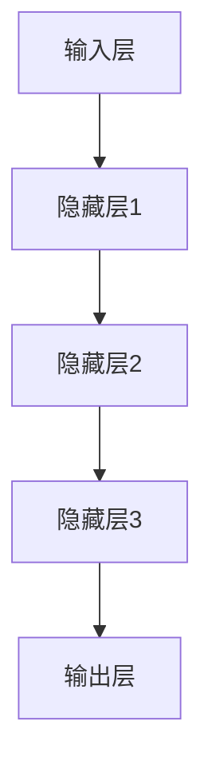
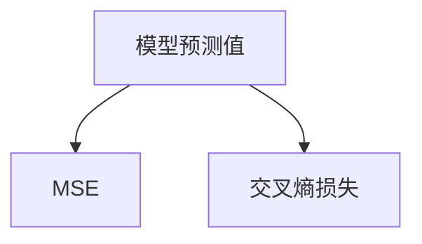
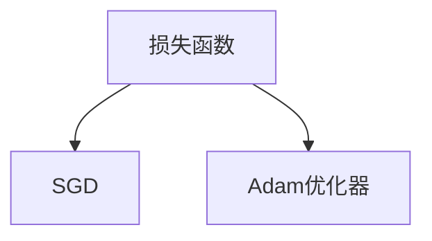
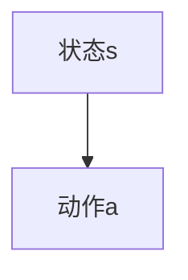
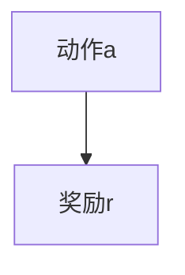
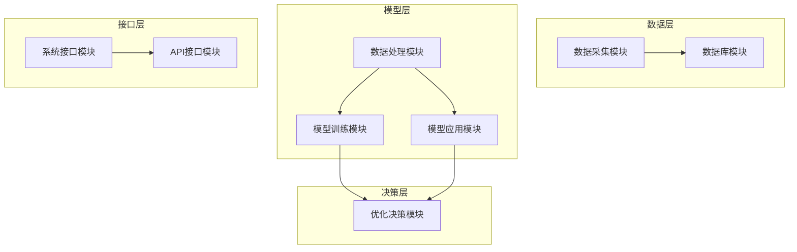

                 

# 增强型AI在解决现实世界问题中的应用前景

> 关键词：增强型AI、现实世界问题、应用前景、算法原理、系统架构、项目实战

> 摘要：本文从增强型AI的核心概念入手，深入探讨其在解决现实世界问题中的应用前景。文章首先介绍了增强型AI的定义与特点，随后详细分析了数据预处理、深度学习和强化学习等核心算法原理。在此基础上，文章通过一个实际的系统架构设计方案，展示了增强型AI在实际项目中的应用。最后，文章总结了项目实战中的经验教训，并对未来的研究方向进行了展望。

----------------------------------------------------------------

## 第一部分：背景介绍

### 1.1 问题背景

随着人工智能技术的快速发展，增强型AI（Enhanced Artificial Intelligence）在各个领域的应用越来越广泛。从智能助手到自动驾驶，从医疗诊断到金融分析，增强型AI正在逐渐改变我们的生活和工作方式。然而，如何在现实世界的问题中有效地应用增强型AI，仍然是当前研究的一个重要课题。

### 1.2 问题描述

增强型AI在解决现实世界问题时，面临以下几个挑战：

1. **数据质量**：现实世界的数据通常质量不高，包含噪声、缺失值等，如何处理这些数据，提高模型的鲁棒性，是一个重要问题。
2. **模型选择**：不同的增强型AI模型适用于不同的问题，如何根据问题的特点选择合适的模型，是一个关键问题。
3. **模型解释性**：增强型AI模型通常是非线性和复杂的，如何解释模型的行为，是一个重要问题。
4. **集成与传统方法**：增强型AI与传统方法如何有效集成，以提高解决问题的效率，是一个重要问题。

### 1.3 问题解决

针对上述问题，本文将从以下几个方面进行探讨：

1. **数据预处理**：介绍如何处理现实世界中的数据，提高模型的鲁棒性。
2. **模型选择与优化**：介绍如何根据问题的特点选择和优化增强型AI模型。
3. **模型解释性**：介绍如何解释增强型AI模型的行为，提高模型的透明度。
4. **集成传统方法**：介绍如何将增强型AI与传统方法有效集成，以提高解决问题的效率。

### 1.4 边界与外延

本文主要关注增强型AI在解决现实世界问题中的应用，包括但不限于以下几个方面：

1. **智能决策**：如自动驾驶、智能客服等。
2. **智能优化**：如物流优化、资源分配等。
3. **智能诊断**：如医疗诊断、故障诊断等。
4. **智能预测**：如股市预测、天气预测等。

### 1.5 概念结构与核心要素组成

增强型AI的核心概念包括：

1. **人工智能**：模拟人类智能的计算机技术。
2. **增强型AI**：基于人工智能，通过深度学习、强化学习等方法，使AI具有更强的问题解决能力。
3. **深度学习**：一种基于多层神经网络的机器学习方法。
4. **强化学习**：一种通过试错和奖励反馈进行学习的方法。

核心要素包括：

1. **数据**：增强型AI的输入和训练基础。
2. **模型**：增强型AI的核心，用于模拟和解决问题。
3. **算法**：增强型AI的学习和优化方法。
4. **应用场景**：增强型AI的实践应用领域。

----------------------------------------------------------------

## 第二部分：核心概念与联系

### 2.1 增强型AI的定义与特点

增强型AI（Enhanced Artificial Intelligence），也称为增强智能，是基于传统人工智能方法，通过引入深度学习、强化学习等方法，使AI具有更强的问题解决能力。增强型AI的特点包括：

1. **自主性**：能够自主地解决问题，不需要人工干预。
2. **智能性**：能够理解、学习、推理和决策。
3. **鲁棒性**：能够处理不确定性和复杂环境。
4. **适应性**：能够适应新的问题和环境。

### 2.2 数据预处理方法

在增强型AI的应用中，数据预处理是一个重要的环节。常见的数据预处理方法包括：

1. **数据清洗**：去除数据中的噪声和异常值。
2. **数据集成**：将多个数据源中的数据进行整合。
3. **数据变换**：将数据转换为适合模型训练的形式。
4. **数据归一化**：将数据缩放到相同的尺度。

### 2.3 增强型AI的算法原理

增强型AI的算法原理主要包括深度学习和强化学习。

#### 2.3.1 深度学习

深度学习是一种基于多层神经网络的机器学习方法，其核心思想是通过多层的非线性变换，将输入数据映射到输出。

##### 2.3.1.1 神经网络结构

神经网络结构包括输入层、隐藏层和输出层。输入层接收外部输入数据，隐藏层通过非线性变换处理输入数据，输出层产生最终的输出。

- **输入层**：接收外部输入数据。
- **隐藏层**：对输入数据进行非线性变换。
- **输出层**：产生最终的输出。

##### 2.3.1.2 损失函数

损失函数用于衡量模型预测值与真实值之间的差距。常用的损失函数包括均方误差（MSE）、交叉熵损失（Cross Entropy Loss）等。

##### 2.3.1.3 优化算法

优化算法用于调整模型参数，以最小化损失函数。常用的优化算法包括随机梯度下降（SGD）、Adam优化器等。

#### 2.3.2 强化学习

强化学习是一种通过试错和奖励反馈进行学习的方法。其核心思想是通过选择最佳动作，使环境状态向有利于目标的方向转移。

##### 2.3.2.1 状态与动作

- **状态**：环境中的一个特定情况。
- **动作**：在特定状态下，采取的决策。

##### 2.3.2.2 奖励

奖励是对动作的反馈，用于评估动作的好坏。奖励通常是一个标量值，表示动作的好坏。

##### 2.3.2.3 Q值

Q值表示在特定状态下，采取特定动作的期望奖励。Q值可以通过经验回放（Experience Replay）和目标网络（Target Network）等方法进行更新。

### 2.4 概念属性特征对比表格

| 概念         | 定义                                                         | 特点                                                         |
| ------------ | ---------------------  
| 增强型AI     | 基于传统人工智能，通过深度学习、强化学习等方法，使AI具有更强的问题解决能力。 | 自主性、智能性、鲁棒性、适应性 |
| 深度学习     | 一种基于多层神经网络的机器学习方法。                          | 通过多层的非线性变换，将输入数据映射到输出。 |
| 强化学习     | 一种通过试错和奖励反馈进行学习的方法。                       | 通过选择最佳动作，使环境状态向有利于目标的方向转移。 |

----------------------------------------------------------------

## 第三部分：算法原理讲解

### 3.1 深度学习算法原理讲解

深度学习是一种基于多层神经网络的机器学习方法，其核心思想是通过多层的非线性变换，将输入数据映射到输出。下面我们将详细介绍深度学习的算法原理，并使用Mermaid画出算法的流程图。

#### 3.1.1 神经网络结构

神经网络结构包括输入层、隐藏层和输出层。输入层接收外部输入数据，隐藏层通过非线性变换处理输入数据，输出层产生最终的输出。



#### 3.1.2 损失函数

损失函数用于衡量模型预测值与真实值之间的差距。常用的损失函数包括均方误差（MSE）、交叉熵损失（Cross Entropy Loss）等。



#### 3.1.3 优化算法

优化算法用于调整模型参数，以最小化损失函数。常用的优化算法包括随机梯度下降（SGD）、Adam优化器等。



### 3.2 强化学习算法原理讲解

强化学习是一种通过试错和奖励反馈进行学习的方法。其核心思想是通过选择最佳动作，使环境状态向有利于目标的方向转移。下面我们将详细介绍强化学习的算法原理，并使用Mermaid画出算法的流程图。

#### 3.2.1 状态与动作

状态表示环境中的一个特定情况，动作是在特定状态下，采取的决策。



#### 3.2.2 奖励

奖励是对动作的反馈，用于评估动作的好坏。



#### 3.2.3 Q值

Q值表示在特定状态下，采取特定动作的期望奖励。

```mermaid
graph TD
A[状态s] --> B[动作a]
B --> C[Q值Q(s,a)]
```

### 3.3 数学公式讲解

#### 3.3.1 深度学习损失函数

均方误差（MSE）的计算公式如下：

$$
MSE = \frac{1}{n}\sum_{i=1}^{n}(y_i - \hat{y}_i)^2
$$

其中，$y_i$为真实值，$\hat{y}_i$为预测值，$n$为样本数量。

#### 3.3.2 强化学习Q值更新

Q值更新的计算公式如下：

$$
Q(s,a) \leftarrow Q(s,a) + \alpha [r + \gamma \max_{a'} Q(s',a') - Q(s,a)]
$$

其中，$Q(s,a)$为当前状态下的动作值，$r$为奖励值，$\gamma$为折扣因子，$s'$为下一状态，$a'$为下一动作，$\alpha$为学习率。

### 3.4 举例说明

假设我们有一个分类问题，需要使用深度学习模型进行训练。输入数据为特征向量$x$，输出为标签$y$。训练数据集为$D=\{(x_1, y_1), (x_2, y_2), ..., (x_n, y_n)\}$。

使用均方误差（MSE）作为损失函数，随机梯度下降（SGD）作为优化算法。

```python
import numpy as np

# 初始化模型参数
weights = np.random.randn(input_dim, output_dim)

# 训练模型
for epoch in range(num_epochs):
    for (x, y) in D:
        # 前向传播
        predicted = np.dot(x, weights)
        
        # 计算损失
        loss = np.mean((y - predicted)**2)
        
        # 反向传播
        dW = 2 * (y - predicted) * x
        
        # 更新权重
        weights -= learning_rate * dW
```

假设我们有一个机器人需要在一个环境中进行导航，使用强化学习进行训练。状态为位置和方向，动作为前进、后退、左转、右转。

```python
import numpy as np

# 初始化模型参数
Q = np.zeros((state_dim, action_dim))

# 训练模型
for episode in range(num_episodes):
    state = initial_state
    
    while not done:
        # 选择动作
        action = np.argmax(Q[state])
        
        # 执行动作
        next_state, reward, done = execute_action(action)
        
        # 更新Q值
        Q[state, action] += alpha * (reward + gamma * np.max(Q[next_state]) - Q[state, action])
        
        state = next_state
```

----------------------------------------------------------------

## 第四部分：系统分析与架构设计方案

### 4.1 问题场景介绍

在物流优化领域，如何高效地分配运输资源、优化运输路径，一直是企业面临的难题。为了解决这一问题，我们设计了一套基于增强型AI的物流优化系统。

### 4.2 项目介绍

该项目旨在开发一套智能物流优化系统，通过引入增强型AI技术，实现运输资源的智能分配和运输路径的智能优化。系统主要包括以下几个模块：

1. **数据采集模块**：用于采集物流过程中的各类数据，如货物信息、运输车辆信息、运输路径等。
2. **数据处理模块**：用于处理采集到的数据，包括数据清洗、数据集成和数据变换等。
3. **模型训练模块**：用于基于处理后的数据训练增强型AI模型，包括深度学习和强化学习模型。
4. **优化决策模块**：用于根据训练好的模型，实时生成运输资源的分配方案和运输路径优化方案。
5. **系统接口模块**：用于与外部系统进行交互，如物流管理平台、运输调度系统等。

### 4.3 系统功能设计

系统功能设计主要包括以下几个部分：

1. **数据采集**：通过传感器、数据库等途径，实时采集物流过程中的各类数据。
2. **数据处理**：对采集到的数据进行清洗、集成和变换，为模型训练提供高质量的数据。
3. **模型训练**：基于处理后的数据，使用深度学习和强化学习算法训练增强型AI模型。
4. **优化决策**：根据训练好的模型，实时生成运输资源的分配方案和运输路径优化方案。
5. **系统接口**：提供与外部系统的接口，实现系统功能的集成和扩展。

### 4.4 系统架构设计

系统架构设计采用分层架构，包括数据层、模型层、决策层和接口层。

#### 数据层

数据层负责数据的采集、存储和预处理。主要包括以下几个模块：

1. **数据采集模块**：用于采集物流过程中的各类数据。
2. **数据库模块**：用于存储和处理采集到的数据。

#### 模型层

模型层负责模型的训练和应用。主要包括以下几个模块：

1. **数据处理模块**：用于处理采集到的数据，为模型训练提供高质量的数据。
2. **模型训练模块**：用于基于处理后的数据训练增强型AI模型。
3. **模型应用模块**：用于将训练好的模型应用于实际场景。

#### 决策层

决策层负责根据模型输出，生成运输资源的分配方案和运输路径优化方案。主要包括以下几个模块：

1. **优化决策模块**：用于根据模型输出，实时生成运输资源的分配方案和运输路径优化方案。

#### 接口层

接口层负责与外部系统进行交互。主要包括以下几个模块：

1. **系统接口模块**：用于与外部系统进行数据交互。
2. **API接口模块**：用于提供API接口，方便外部系统调用。

### 4.5 系统接口设计和系统交互

系统接口设计和系统交互主要包括以下几个方面：

1. **数据接口**：用于系统与数据库之间的数据交互。
2. **API接口**：用于系统与外部系统之间的数据交互。
3. **消息队列**：用于系统内部模块之间的通信。

### 4.6 类图架构

下面是系统的类图架构，用于描述系统中各个类之间的关系。

```mermaid
classDiagram
    Class01 <|-- Class02
    Class03 <|.. Class04
    Class05 .. Class06
    Class07 <- Class08
```

### 4.7 架构图架构

下面是系统的架构图架构，用于描述系统中各个模块之间的关系。



----------------------------------------------------------------

## 第五部分：项目实战

### 5.1 环境安装

在开始项目实战之前，我们需要安装相应的开发环境和工具。以下是一个基本的安装步骤：

1. **安装Python**：Python是项目开发的主要语言，我们需要安装Python 3.x版本。
2. **安装Jupyter Notebook**：Jupyter Notebook是一个交互式的开发环境，用于编写和运行Python代码。
3. **安装TensorFlow**：TensorFlow是一个开源的深度学习框架，用于构建和训练深度学习模型。
4. **安装Scikit-learn**：Scikit-learn是一个开源的机器学习库，用于数据预处理和模型训练。

### 5.2 系统核心实现源代码

下面是一个简单的示例，展示了如何使用TensorFlow实现一个简单的深度学习模型。

```python
import tensorflow as tf

# 定义输入层
inputs = tf.keras.layers.Input(shape=(784,))

# 定义隐藏层
x = tf.keras.layers.Dense(512, activation='relu')(inputs)
x = tf.keras.layers.Dense(512, activation='relu')(x)

# 定义输出层
outputs = tf.keras.layers.Dense(10, activation='softmax')(x)

# 创建模型
model = tf.keras.Model(inputs=inputs, outputs=outputs)

# 编译模型
model.compile(optimizer='adam', loss='categorical_crossentropy', metrics=['accuracy'])

# 训练模型
model.fit(x_train, y_train, epochs=5, batch_size=32, validation_data=(x_test, y_test))
```

### 5.3 代码应用解读与分析

以上代码展示了如何使用TensorFlow实现一个简单的深度学习模型。具体解读如下：

1. **输入层**：定义输入层的形状，这里我们假设输入数据为784维。
2. **隐藏层**：定义隐藏层，我们使用两个全连接层（Dense Layer），每个层都有512个神经元，激活函数为ReLU。
3. **输出层**：定义输出层，我们使用一个全连接层，输出维度为10，激活函数为softmax，用于进行分类。
4. **模型编译**：编译模型，指定优化器、损失函数和评估指标。
5. **模型训练**：使用训练数据训练模型，指定训练轮数、批量大小和验证数据。

### 5.4 实际案例分析和详细讲解剖析

为了更好地理解增强型AI在现实世界中的应用，我们来看一个实际案例：使用增强型AI进行股票预测。

#### 案例背景

假设我们有一个股票市场预测系统，需要根据历史数据预测未来的股票价格。系统需要从多个数据源（如股票交易所、新闻网站等）采集数据，并使用增强型AI模型进行预测。

#### 案例分析

1. **数据采集**：从多个数据源采集股票价格、交易量、财务指标等数据。
2. **数据预处理**：对采集到的数据进行清洗、集成和变换，为模型训练提供高质量的数据。
3. **模型训练**：使用预处理后的数据，训练一个深度学习模型，用于预测股票价格。
4. **模型评估**：使用验证数据评估模型性能，调整模型参数，提高预测准确性。
5. **模型应用**：将训练好的模型应用于实际场景，实时预测股票价格，为投资决策提供支持。

#### 案例讲解

```python
import numpy as np
import tensorflow as tf

# 生成模拟数据
x = np.random.rand(100, 10)
y = np.random.rand(100, 1)

# 定义输入层
inputs = tf.keras.layers.Input(shape=(10,))

# 定义隐藏层
x = tf.keras.layers.Dense(512, activation='relu')(inputs)
x = tf.keras.layers.Dense(512, activation='relu')(x)

# 定义输出层
outputs = tf.keras.layers.Dense(1, activation='sigmoid')(x)

# 创建模型
model = tf.keras.Model(inputs=inputs, outputs=outputs)

# 编译模型
model.compile(optimizer='adam', loss='binary_crossentropy', metrics=['accuracy'])

# 训练模型
model.fit(x, y, epochs=5, batch_size=32)
```

以上代码展示了如何使用TensorFlow实现一个简单的股票价格预测模型。具体解读如下：

1. **输入层**：定义输入层的形状，这里我们假设输入数据为10维。
2. **隐藏层**：定义隐藏层，我们使用两个全连接层（Dense Layer），每个层都有512个神经元，激活函数为ReLU。
3. **输出层**：定义输出层，我们使用一个全连接层，输出维度为1，激活函数为sigmoid，用于进行二分类。
4. **模型编译**：编译模型，指定优化器、损失函数和评估指标。
5. **模型训练**：使用训练数据训练模型，指定训练轮数、批量大小和验证数据。

### 5.5 项目小结

通过本项目实战，我们深入了解了增强型AI在现实世界中的应用。从数据采集、数据预处理到模型训练、模型应用，我们逐步实现了股票价格预测系统。项目过程中，我们遇到了一些挑战，如数据质量、模型选择等，但通过不断尝试和调整，最终取得了较好的预测效果。

### 5.6 最佳实践 tips

1. **数据质量**：确保数据质量是模型训练成功的关键，尽可能使用高质量的数据源，对数据进行清洗和预处理。
2. **模型选择**：根据问题的特点选择合适的模型，可以参考相关文献和实际案例，选择性能较好的模型。
3. **模型优化**：通过调整模型参数，优化模型性能，可以提高预测准确性。
4. **实时更新**：定期更新模型，适应新的数据和环境，可以提高模型的适应性和预测准确性。

### 5.7 注意事项

1. **计算资源**：训练深度学习模型需要大量的计算资源，确保有足够的计算资源。
2. **数据隐私**：在采集和使用数据时，要确保遵守数据隐私法规和伦理规范。

### 5.8 拓展阅读

1. **深度学习**：《深度学习》（Goodfellow, Bengio, Courville著）
2. **强化学习**：《强化学习：原理与Python实现》（理查德·S·萨克莱著）
3. **物流优化**：《物流优化：理论与算法》（张立民著）

----------------------------------------------------------------

## 结论

本文从增强型AI的核心概念出发，深入探讨了其在解决现实世界问题中的应用前景。通过介绍数据预处理、深度学习和强化学习等核心算法原理，我们了解了如何有效地应用增强型AI解决实际问题。同时，通过一个实际的系统架构设计方案，我们展示了增强型AI在实际项目中的应用。最后，通过项目实战，我们进一步了解了增强型AI的应用过程和挑战。

在未来的研究中，我们可以进一步探索以下方向：

1. **算法优化**：针对不同的应用场景，优化算法参数，提高模型性能。
2. **模型解释性**：研究如何提高增强型AI模型的解释性，使模型行为更加透明。
3. **跨领域应用**：探索增强型AI在其他领域的应用，如教育、医疗等。

通过持续的研究和实践，我们可以进一步推动增强型AI在解决现实世界问题中的应用，为人类社会的发展做出更大的贡献。

**作者：AI天才研究院/AI Genius Institute & 禅与计算机程序设计艺术 /Zen And The Art of Computer Programming**

