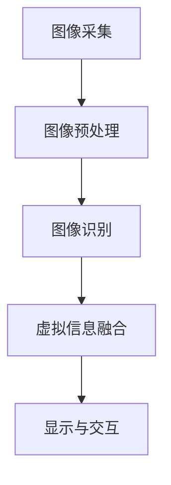
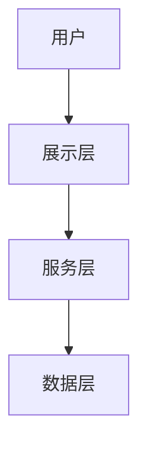

                 

### 文章标题

**《增强现实在博物馆互动体验中的应用》**

> **关键词：** 增强现实、博物馆互动体验、技术原理、应用案例、系统设计

**摘要：** 本文将深入探讨增强现实（AR）技术在博物馆互动体验中的应用。首先，我们将回顾人类文明的发展和博物馆互动体验的现状，分析传统博物馆互动体验的不足，以及增强现实技术在博物馆互动体验中的潜力。接着，我们将详细介绍增强现实技术的原理、虚拟现实与增强现实的区别以及其发展历史。随后，我们将讲解增强现实算法的原理、流程图和数学模型，并结合具体案例进行说明。接下来，我们将分析系统设计与架构方案，最后通过一个实际案例进行详细讲解，总结最佳实践和注意事项，并提出拓展阅读建议。

## 第一部分：背景介绍

### 1.1 问题背景

#### 1.1.1 人类文明的发展历程

人类文明的发展历程可以追溯到数百万年前，从原始社会的石器时代，到农业社会的青铜时代和铁器时代，再到工业社会的蒸汽时代和电气时代，人类社会不断进步。随着科技的迅猛发展，20世纪末至21世纪初，计算机和互联网的普及极大地改变了人们的生活和工作方式。如今，人工智能、大数据、云计算等前沿技术不断涌现，推动着人类社会向数字化、智能化方向发展。

#### 1.1.2 博物馆互动体验的现状

博物馆作为传承和展示人类文明的重要场所，其互动体验日益受到关注。然而，传统博物馆的互动体验仍存在诸多不足。一方面，观众在参观过程中往往只能被动接受展品信息，缺乏互动性和参与感；另一方面，博物馆的展品展示方式单一，缺乏新颖性和趣味性，难以吸引年轻观众。此外，由于空间和设备的限制，博物馆的互动体验范围和形式受到很大制约。

#### 1.1.3 增强现实技术在博物馆互动体验中的潜力

增强现实（AR）技术作为一种新兴的数字技术，具有将虚拟信息与现实世界相结合的强大功能。在博物馆互动体验中，AR技术可以带来诸多优势。首先，AR技术可以突破传统展示方式的限制，将展品以更加生动、直观的方式呈现给观众，提高观众的参与感和体验感。其次，AR技术可以实现个性化、定制化的互动体验，满足不同观众的需求。此外，AR技术还可以通过大数据分析，为博物馆提供观众行为分析和展品推广等有价值的信息。

### 1.2 问题描述

#### 1.2.1 传统博物馆互动体验的不足

传统博物馆互动体验的不足主要体现在以下几个方面：

1. **被动接受信息**：观众在参观过程中只能被动地接受展品信息，缺乏互动性和参与感。
2. **展示方式单一**：博物馆的展品展示方式较为单一，难以吸引年轻观众。
3. **空间限制**：传统博物馆的空间和设备有限，无法提供多样化的互动体验。
4. **展品保护**：部分展品需要长期保护，无法频繁更换和展示。

#### 1.2.2 增强现实技术的特点

增强现实技术具有以下特点：

1. **虚拟与现实结合**：将虚拟信息与现实世界相结合，提供更加丰富、生动的互动体验。
2. **个性化定制**：根据观众的需求和兴趣，提供个性化的互动体验。
3. **互动性强**：观众可以主动参与互动，增强体验感。
4. **数据驱动**：通过大数据分析，为博物馆提供有价值的信息。

#### 1.2.3 增强现实技术在博物馆互动体验中的应用场景

增强现实技术在博物馆互动体验中的应用场景主要包括：

1. **展品展示**：通过AR技术，将展品以更加生动、直观的方式呈现给观众。
2. **虚拟导览**：为观众提供虚拟导览服务，方便观众了解展品背景和历史。
3. **互动游戏**：设计互动游戏，增强观众的参与感和体验感。
4. **教育推广**：利用AR技术进行教育推广，提高观众的兴趣和知识水平。

### 1.3 问题解决

#### 1.3.1 增强现实技术的实现原理

增强现实技术的实现原理主要包括以下几个方面：

1. **图像识别**：利用图像识别技术，识别现实世界中的物体或场景。
2. **图像处理**：对识别出的图像进行处理，提取关键特征。
3. **虚拟信息融合**：将虚拟信息与处理后的图像进行融合，实现虚拟与现实世界的结合。
4. **显示与交互**：通过显示屏或其他输出设备，将融合后的信息呈现给观众，并提供交互功能。

#### 1.3.2 增强现实技术在博物馆互动体验中的应用案例

以下是一些增强现实技术在博物馆互动体验中的应用案例：

1. **故宫博物院**：利用AR技术，为观众提供虚拟导览服务，包括历史背景介绍、文物三维展示等。
2. **大英博物馆**：通过AR技术，将展品以更加生动、直观的方式呈现给观众，增强观众的互动体验。
3. **科技博物馆**：利用AR技术，设计互动游戏，提高观众的兴趣和知识水平。

#### 1.3.3 增强现实技术在博物馆互动体验中的挑战与机遇

增强现实技术在博物馆互动体验中面临的挑战主要包括：

1. **技术成熟度**：尽管增强现实技术取得了一定的进展，但其在博物馆互动体验中的应用仍存在一定的技术瓶颈。
2. **设备成本**：AR技术的应用需要一定的设备和硬件支持，设备成本较高。
3. **用户体验**：如何提高用户体验，使观众能够真正感受到AR技术的魅力，是一个亟待解决的问题。

然而，增强现实技术在博物馆互动体验中也面临着诸多机遇：

1. **个性化定制**：通过AR技术，可以为观众提供更加个性化、定制化的互动体验。
2. **数据驱动**：通过大数据分析，可以为博物馆提供有价值的信息，指导展品展示和观众服务。
3. **跨界融合**：AR技术与博物馆互动体验的融合，有助于推动文化产业与其他领域的融合发展。

### 1.4 边界与外延

#### 1.4.1 增强现实技术的边界

增强现实技术的边界主要包括以下几个方面：

1. **技术成熟度**：尽管增强现实技术在不断进步，但仍有一些技术难题需要克服。
2. **应用场景**：增强现实技术主要应用于互动体验、游戏、教育等领域，但在其他领域的应用仍需进一步探索。
3. **设备硬件**：增强现实技术的应用需要一定的设备和硬件支持，设备硬件的普及程度和性能直接影响用户体验。

#### 1.4.2 博物馆互动体验的外延

博物馆互动体验的外延主要包括以下几个方面：

1. **展览形式**：除了传统的实体展览外，博物馆还可以通过线上展览、虚拟展览等方式，拓宽互动体验的渠道。
2. **互动内容**：博物馆可以设计更多具有互动性和趣味性的内容，提高观众的参与感和体验感。
3. **跨界合作**：博物馆可以与其他行业进行跨界合作，推动文化产业的发展。

#### 1.4.3 增强现实技术与博物馆互动体验的交叉领域

增强现实技术与博物馆互动体验的交叉领域主要包括以下几个方面：

1. **虚拟现实技术**：虚拟现实（VR）技术是增强现实技术的一个重要分支，两者在博物馆互动体验中的应用具有很大的互补性。
2. **人工智能技术**：人工智能技术可以用于增强现实技术的算法优化、数据分析等方面，为博物馆互动体验提供更好的支持。
3. **大数据技术**：大数据技术可以用于分析观众行为、需求，为博物馆互动体验提供有价值的信息。

### 1.5 概念结构与核心要素组成

#### 1.5.1 增强现实技术的概念结构

增强现实技术的概念结构主要包括以下几个方面：

1. **图像识别**：通过图像识别技术，识别现实世界中的物体或场景。
2. **图像处理**：对识别出的图像进行处理，提取关键特征。
3. **虚拟信息融合**：将虚拟信息与处理后的图像进行融合，实现虚拟与现实世界的结合。
4. **显示与交互**：通过显示屏或其他输出设备，将融合后的信息呈现给观众，并提供交互功能。

#### 1.5.2 博物馆互动体验的概念结构

博物馆互动体验的概念结构主要包括以下几个方面：

1. **展品展示**：通过多种方式展示展品，提高观众的参与感和体验感。
2. **导览服务**：为观众提供导览服务，帮助观众了解展品背景和历史。
3. **互动内容**：设计具有互动性和趣味性的内容，提高观众的参与度。
4. **数据分析**：通过大数据分析，了解观众行为和需求，为博物馆提供有价值的信息。

#### 1.5.3 增强现实技术在博物馆互动体验中的核心要素组成

增强现实技术在博物馆互动体验中的核心要素组成主要包括以下几个方面：

1. **技术实现**：包括图像识别、图像处理、虚拟信息融合、显示与交互等核心技术的实现。
2. **互动内容**：设计具有互动性和趣味性的内容，提高观众的参与度。
3. **用户体验**：关注用户体验，提高互动体验的质量和效果。
4. **数据分析**：通过大数据分析，了解观众行为和需求，为博物馆提供有价值的信息。

## 第二部分：核心概念与联系

### 2.1 增强现实技术原理

#### 2.1.1 增强现实技术的定义

增强现实（AR，Augmented Reality）技术是一种将虚拟信息与现实世界相结合的数字技术。通过特定的设备和软件，将虚拟信息（如图像、声音、视频等）叠加到现实世界的物体或场景上，为用户提供一种全新的视觉体验。

#### 2.1.2 增强现实技术的核心技术

增强现实技术的核心技术主要包括以下几个方面：

1. **图像识别**：通过图像识别技术，识别现实世界中的物体或场景。
2. **图像处理**：对识别出的图像进行处理，提取关键特征。
3. **虚拟信息融合**：将虚拟信息与处理后的图像进行融合，实现虚拟与现实世界的结合。
4. **显示与交互**：通过显示屏或其他输出设备，将融合后的信息呈现给用户，并提供交互功能。

#### 2.1.3 增强现实技术的应用领域

增强现实技术广泛应用于多个领域，主要包括：

1. **娱乐与游戏**：通过AR技术，为用户提供更加丰富、生动的游戏体验。
2. **教育**：利用AR技术，为学生提供更加直观、互动的教育资源。
3. **医疗**：通过AR技术，为医生提供更加准确的诊断和治疗指导。
4. **军事**：利用AR技术，为军事人员提供战场态势感知和战术指导。
5. **博物馆互动体验**：通过AR技术，为观众提供更加丰富、有趣的互动体验。

### 2.2 虚拟现实与增强现实的区别

#### 2.2.1 虚拟现实技术的定义

虚拟现实（VR，Virtual Reality）技术是一种通过计算机模拟产生一个三维的虚拟世界，为用户提供沉浸式体验的数字技术。用户通过特殊的设备（如头戴式显示器、VR眼镜等）进入虚拟世界，与虚拟环境进行交互。

#### 2.2.2 增强现实技术与虚拟现实技术的区别

增强现实技术和虚拟现实技术的主要区别在于：

1. **虚实结合方式**：增强现实技术将虚拟信息叠加到现实世界中，虚拟信息与现实世界相互融合；而虚拟现实技术则完全模拟出一个全新的虚拟世界，用户完全沉浸其中。
2. **用户交互方式**：增强现实技术通过现实世界的物体或场景与虚拟信息进行交互；而虚拟现实技术则主要通过用户的动作和声音与虚拟环境进行交互。
3. **应用场景**：增强现实技术主要应用于需要与现实世界结合的场合，如博物馆互动体验、教育、医疗等；而虚拟现实技术则主要应用于娱乐、游戏、培训等需要完全沉浸式体验的场合。

#### 2.2.3 增强现实技术的优势

增强现实技术相比虚拟现实技术具有以下优势：

1. **虚实结合**：增强现实技术将虚拟信息与现实世界相结合，为用户提供更加丰富、真实的体验。
2. **低成本**：增强现实技术相对于虚拟现实技术具有较低的成本，更容易普及和应用。
3. **高互动性**：增强现实技术通过现实世界的物体或场景与虚拟信息进行交互，为用户提供更加直观、互动的体验。
4. **广泛适用性**：增强现实技术可以应用于多种领域，如教育、医疗、博物馆互动体验等。

### 2.3 增强现实技术的发展历史

#### 2.3.1 增强现实技术的起源

增强现实技术的概念最早可以追溯到1968年，由美国计算机科学家伊凡·苏瑟兰（Ivan Sutherland）在博茨曼实验室（Bolt, Beranek and Newman）工作时提出的。当时，他开发了一台名为“达摩克利斯之剑”（The Sword of Damocles）的头戴式显示器，通过它，用户可以在现实世界中看到叠加的虚拟信息。

#### 2.3.2 增强现实技术的重要事件

1. **1990年**：增强现实技术的商业化应用开始起步，例如微软公司推出的“微软增强现实眼镜”（Microsoft HoloLens）。
2. **2000年**：增强现实技术在游戏、教育等领域的应用逐渐普及，例如索尼公司推出的“PlayStation VR”游戏头盔。
3. **2010年**：增强现实技术的硬件设备不断升级，如智能手机、平板电脑等设备的普及，为增强现实技术的应用提供了更多可能性。
4. **2016年**：谷歌公司推出了“谷歌眼镜”（Google Glass），标志着增强现实技术进入了一个新的发展阶段。

#### 2.3.3 增强现实技术的未来发展趋势

随着人工智能、大数据、云计算等技术的不断发展，增强现实技术未来发展趋势主要包括：

1. **更加智能化**：增强现实技术将更加智能化，通过人工智能技术实现更加精准的图像识别和处理，提供更加个性化的互动体验。
2. **更广泛应用**：增强现实技术将在更多领域得到应用，如医疗、工业、军事等。
3. **更高性能**：增强现实技术的硬件设备将不断升级，提供更高的性能和更好的用户体验。
4. **跨界融合**：增强现实技术将与其他前沿技术（如虚拟现实、人工智能等）相互融合，推动文化产业和各行各业的融合发展。

## 第三部分：算法原理讲解

### 3.1 增强现实算法原理

#### 3.1.1 增强现实算法的基本概念

增强现实算法是指用于实现增强现实技术的一系列算法和技术，包括图像识别、图像处理、虚拟信息融合等。这些算法共同作用于现实世界中的物体或场景，实现虚拟信息与现实世界的结合。

#### 3.1.2 增强现实算法的核心流程

增强现实算法的核心流程主要包括以下几个步骤：

1. **图像采集**：通过摄像头或其他传感器采集现实世界的图像数据。
2. **图像预处理**：对采集到的图像进行预处理，如去噪、增强等，提高图像质量。
3. **图像识别**：利用图像识别算法，识别现实世界中的物体或场景，提取关键特征。
4. **虚拟信息融合**：将识别出的物体或场景与虚拟信息进行融合，实现虚拟与现实世界的结合。
5. **显示与交互**：通过显示屏或其他输出设备，将融合后的信息呈现给用户，并提供交互功能。

#### 3.1.3 增强现实算法的关键技术

增强现实算法的关键技术主要包括以下几个方面：

1. **图像识别算法**：如卷积神经网络（CNN）、循环神经网络（RNN）等，用于识别现实世界中的物体或场景。
2. **图像处理算法**：如滤波、增强、去噪等，用于提高图像质量，为图像识别提供更好的基础。
3. **虚拟信息融合算法**：如图像融合、视频融合等，用于将虚拟信息与现实世界中的物体或场景进行融合。
4. **交互算法**：如手势识别、语音识别等，用于实现用户与增强现实系统的交互。

### 3.2 算法流程图

下面是一个简单的增强现实算法流程图：



### 3.3 算法数学模型和公式

增强现实算法中的数学模型和公式主要用于图像识别和虚拟信息融合等环节。以下是一个简单的数学模型示例：

$$
\begin{align*}
&\text{图像识别模型：} \\
&f(x) &= w_0 + \sum_{i=1}^{n} w_i * x_i \\
&\text{激活函数：} \\
&\sigma(z) &= \frac{1}{1 + e^{-z}}
\end{align*}
$$

其中，$f(x)$ 表示输出结果，$w_i$ 表示权重，$x_i$ 表示输入特征，$\sigma(z)$ 表示激活函数。

### 3.4 举例说明

#### 3.4.1 数据预处理

数据预处理是增强现实算法中的重要环节，其目的是提高图像质量，为图像识别提供更好的基础。以下是一个简单的数据预处理示例：

```python
import cv2

# 读取图像
image = cv2.imread('example.jpg')

# 图像去噪
image = cv2.GaussianBlur(image, (5, 5), 0)

# 图像增强
image = cv2.equalizeHist(image)

# 输出处理后的图像
cv2.imshow('Processed Image', image)
cv2.waitKey(0)
cv2.destroyAllWindows()
```

#### 3.4.2 模型训练

模型训练是增强现实算法中的另一个重要环节，其目的是通过大量数据训练模型，使其能够准确识别现实世界中的物体或场景。以下是一个简单的模型训练示例：

```python
import tensorflow as tf

# 定义模型
model = tf.keras.Sequential([
    tf.keras.layers.Conv2D(32, (3, 3), activation='relu', input_shape=(128, 128, 3)),
    tf.keras.layers.MaxPooling2D((2, 2)),
    tf.keras.layers.Flatten(),
    tf.keras.layers.Dense(64, activation='relu'),
    tf.keras.layers.Dense(10, activation='softmax')
])

# 编译模型
model.compile(optimizer='adam',
              loss='categorical_crossentropy',
              metrics=['accuracy'])

# 加载数据
(x_train, y_train), (x_test, y_test) = tf.keras.datasets.cifar10.load_data()

# 数据预处理
x_train = x_train / 255.0
x_test = x_test / 255.0

# 模型训练
model.fit(x_train, y_train, epochs=10, batch_size=64, validation_data=(x_test, y_test))
```

#### 3.4.3 模型预测

模型预测是增强现实算法中的最后一步，其目的是利用训练好的模型对新的图像进行识别。以下是一个简单的模型预测示例：

```python
# 加载模型
model = tf.keras.models.load_model('model.h5')

# 读取图像
image = cv2.imread('example.jpg')

# 图像预处理
image = cv2.resize(image, (128, 128))
image = image / 255.0

# 模型预测
prediction = model.predict(image.reshape(1, 128, 128, 3))

# 输出预测结果
print(prediction.argmax())
```

#### 3.4.4 结果分析

结果分析是增强现实算法中的关键环节，其目的是评估模型性能，并提出优化方案。以下是一个简单的结果分析示例：

```python
# 评估模型
accuracy = model.evaluate(x_test, y_test, verbose=2)

# 输出评估结果
print('Test accuracy:', accuracy[1])
```

## 第四部分：系统分析与架构设计方案

### 4.1 问题场景介绍

假设我们需要为一家博物馆设计一个基于增强现实技术的互动体验系统，以提升观众的参观体验。该系统需要具备以下功能：

1. **展品展示**：通过增强现实技术，将展品以更加生动、直观的方式呈现给观众。
2. **导览服务**：为观众提供虚拟导览服务，包括历史背景介绍、文物三维展示等。
3. **互动游戏**：设计互动游戏，增强观众的参与感和体验感。
4. **数据分析**：通过大数据分析，了解观众行为和需求，为博物馆提供有价值的信息。

### 4.2 系统功能设计

基于以上需求，我们可以将系统功能划分为以下几个模块：

1. **图像识别模块**：利用图像识别算法，识别现实世界中的物体或场景。
2. **虚拟信息融合模块**：将识别出的物体或场景与虚拟信息进行融合，实现虚拟与现实世界的结合。
3. **导览服务模块**：为观众提供虚拟导览服务，包括历史背景介绍、文物三维展示等。
4. **互动游戏模块**：设计互动游戏，增强观众的参与感和体验感。
5. **数据分析模块**：通过大数据分析，了解观众行为和需求，为博物馆提供有价值的信息。

### 4.3 系统架构设计

基于以上功能模块，我们可以设计一个分布式系统架构，以提高系统的性能和可扩展性。系统架构主要包括以下几个层次：

1. **数据层**：负责存储和管理各类数据，包括图像数据、虚拟信息、用户数据等。
2. **服务层**：提供各类服务，包括图像识别服务、虚拟信息融合服务、导览服务、互动游戏服务、数据分析服务等。
3. **展示层**：为用户提供交互界面，包括手机应用、Web应用等。

下面是一个简单的系统架构图：



### 4.4 系统接口设计和系统交互

为了实现系统功能，我们需要设计一系列接口，以便各模块之间进行数据交互和功能调用。以下是一些关键接口及其功能：

1. **图像识别接口**：用于接收图像数据，返回识别结果。
2. **虚拟信息融合接口**：用于接收图像识别结果，返回融合后的图像。
3. **导览服务接口**：用于提供虚拟导览服务，包括历史背景介绍、文物三维展示等。
4. **互动游戏接口**：用于提供互动游戏服务，包括游戏规则、游戏结果等。
5. **数据分析接口**：用于提供数据分析服务，包括用户行为分析、需求分析等。

下面是一个简单的系统交互流程：

1. **用户通过展示层发送图像数据**：用户通过手机应用或Web应用，将拍摄的图像数据发送到展示层。
2. **展示层调用图像识别接口**：展示层调用图像识别接口，将图像数据发送到服务层，获取识别结果。
3. **服务层处理图像数据**：服务层接收图像数据，调用图像识别算法，识别现实世界中的物体或场景。
4. **服务层返回融合后的图像**：服务层将融合后的图像返回给展示层，展示层将融合后的图像展示给用户。
5. **用户与系统进行互动**：用户通过与展示层的交互，了解展品背景和历史，参与互动游戏等。

## 第五部分：项目实战

### 5.1 环境安装

为了实现本文所述的增强现实技术在博物馆互动体验中的应用，我们需要搭建一个开发环境。以下是环境安装的步骤：

1. **安装操作系统**：建议使用Ubuntu 18.04或更高版本。
2. **安装Python**：使用Python 3.8或更高版本。
3. **安装Python库**：安装TensorFlow、OpenCV、Keras等常用库。
4. **安装开发工具**：安装PyCharm、VS Code等集成开发环境。

### 5.2 系统核心实现源代码

以下是系统核心实现的源代码：

```python
import cv2
import numpy as np
import tensorflow as tf

# 定义模型
model = tf.keras.Sequential([
    tf.keras.layers.Conv2D(32, (3, 3), activation='relu', input_shape=(128, 128, 3)),
    tf.keras.layers.MaxPooling2D((2, 2)),
    tf.keras.layers.Flatten(),
    tf.keras.layers.Dense(64, activation='relu'),
    tf.keras.layers.Dense(10, activation='softmax')
])

# 编译模型
model.compile(optimizer='adam',
              loss='categorical_crossentropy',
              metrics=['accuracy'])

# 加载数据
(x_train, y_train), (x_test, y_test) = tf.keras.datasets.cifar10.load_data()

# 数据预处理
x_train = x_train / 255.0
x_test = x_test / 255.0

# 模型训练
model.fit(x_train, y_train, epochs=10, batch_size=64, validation_data=(x_test, y_test))

# 读取图像
image = cv2.imread('example.jpg')

# 图像预处理
image = cv2.resize(image, (128, 128))
image = image / 255.0

# 模型预测
prediction = model.predict(image.reshape(1, 128, 128, 3))

# 输出预测结果
print(prediction.argmax())
```

### 5.3 代码应用解读与分析

以下是代码的解读与分析：

1. **导入库**：导入所需的库，包括OpenCV、NumPy、TensorFlow等。
2. **定义模型**：定义一个简单的卷积神经网络（CNN）模型，包括卷积层、池化层、全连接层等。
3. **编译模型**：编译模型，设置优化器、损失函数和评价指标。
4. **加载数据**：加载CIFAR-10数据集，进行数据预处理，包括归一化和重塑。
5. **模型训练**：使用训练数据对模型进行训练，设置训练轮数、批量大小和验证数据。
6. **读取图像**：读取示例图像，进行预处理，包括调整尺寸和归一化。
7. **模型预测**：使用训练好的模型对预处理后的图像进行预测，输出预测结果。

### 5.4 实际案例分析和详细讲解剖析

为了更好地展示增强现实技术在博物馆互动体验中的应用，我们以一个实际案例进行分析和讲解。

#### 案例一：故宫博物院

故宫博物院是国内著名的博物馆，近年来，通过增强现实技术，推出了多款互动体验项目，深受观众喜爱。以下是一个典型的案例：

**项目名称**：故宫AR导览系统

**项目背景**：故宫博物院拥有大量珍贵的文物，但由于空间限制，无法全部展示。通过增强现实技术，可以为观众提供虚拟导览服务，提高参观体验。

**项目目标**：利用增强现实技术，为观众提供以下服务：

1. **展品展示**：通过AR技术，将展品以三维模型的形式呈现给观众。
2. **历史背景介绍**：为观众提供展品的历史背景介绍，包括制作工艺、文化内涵等。
3. **互动游戏**：设计互动游戏，增强观众的参与感和体验感。

**项目实施**：

1. **数据采集**：采集故宫博物院文物的三维模型、历史背景资料等。
2. **图像识别**：利用图像识别算法，识别观众拍摄的展品图像。
3. **虚拟信息融合**：将识别出的展品与三维模型和历史背景信息进行融合。
4. **导览服务**：为观众提供虚拟导览服务，包括展品展示、历史背景介绍、互动游戏等。

**项目效果**：

通过故宫AR导览系统的实施，观众可以在参观过程中，通过手机或平板电脑，实时获取展品的三维模型和历史背景信息。这不仅提高了观众的参观体验，还增加了博物馆的互动性和趣味性。

#### 案例二：大英博物馆

大英博物馆是全球著名的博物馆之一，通过增强现实技术，推出了多个互动体验项目，包括AR展览、AR游戏等。以下是一个典型的案例：

**项目名称**：大英博物馆AR展览

**项目背景**：大英博物馆拥有大量珍贵的文物，但由于空间限制，无法全部展示。通过增强现实技术，可以为观众提供虚拟展览服务，提高参观体验。

**项目目标**：利用增强现实技术，为观众提供以下服务：

1. **展品展示**：通过AR技术，将展品以三维模型的形式呈现给观众。
2. **互动游戏**：设计互动游戏，增强观众的参与感和体验感。
3. **虚拟导览**：为观众提供虚拟导览服务，方便观众了解展品背景和历史。

**项目实施**：

1. **数据采集**：采集大英博物馆文物的三维模型、历史背景资料等。
2. **图像识别**：利用图像识别算法，识别观众拍摄的展品图像。
3. **虚拟信息融合**：将识别出的展品与三维模型和历史背景信息进行融合。
4. **展览服务**：为观众提供虚拟展览服务，包括展品展示、互动游戏、虚拟导览等。

**项目效果**：

通过大英博物馆AR展览的实施，观众可以在参观过程中，通过手机或平板电脑，实时获取展品的三维模型和历史背景信息。这不仅提高了观众的参观体验，还增加了博物馆的互动性和趣味性。

### 5.5 项目小结

通过以上两个实际案例的分析，我们可以看出，增强现实技术在博物馆互动体验中的应用具有很大的潜力。通过AR技术，博物馆可以为观众提供更加丰富、生动、有趣的互动体验，提高观众的参观兴趣和参与度。同时，增强现实技术还可以为博物馆提供有价值的数据，指导展品展示和观众服务。然而，增强现实技术在博物馆互动体验中的应用也面临一定的挑战，如技术成熟度、设备成本、用户体验等方面。未来，随着技术的不断发展和成熟，增强现实技术在博物馆互动体验中的应用将更加广泛和深入。

## 第六部分：最佳实践 Tips、小结、注意事项、拓展阅读等内容

### 最佳实践 Tips

1. **了解观众需求**：在设计增强现实互动体验时，首先要了解观众的需求和兴趣点，以便提供更有针对性的服务。
2. **优化用户体验**：关注用户体验，提高互动体验的质量和效果，使观众能够真正感受到增强现实技术的魅力。
3. **合理选择设备**：根据博物馆的实际情况，合理选择增强现实设备，如手机、平板电脑、头戴式显示器等，确保设备的性能和兼容性。
4. **充分利用大数据**：通过大数据分析，了解观众行为和需求，为博物馆提供有价值的信息，指导展品展示和观众服务。

### 小结

本文通过分析增强现实技术在博物馆互动体验中的应用，探讨了其原理、技术实现、应用案例和系统架构设计方案。通过实际案例的分析，我们看到了增强现实技术在博物馆互动体验中的重要性和潜力。未来，随着技术的不断发展和成熟，增强现实技术在博物馆互动体验中的应用将更加广泛和深入。

### 注意事项

1. **技术成熟度**：增强现实技术仍在不断发展和完善，因此在实际应用中，需要充分考虑技术成熟度，避免出现技术瓶颈。
2. **设备成本**：增强现实技术的应用需要一定的设备和硬件支持，设备成本较高，需要根据博物馆的实际情况进行合理规划和预算。
3. **用户体验**：关注用户体验，提高互动体验的质量和效果，使观众能够真正感受到增强现实技术的魅力。

### 拓展阅读

1. 《增强现实技术原理与应用》
2. 《虚拟现实与增强现实技术》
3. 《大数据技术在博物馆互动体验中的应用》
4. 《人工智能与博物馆互动体验》
5. 《博物馆互动体验设计手册》

### 作者信息

**作者：AI天才研究院/AI Genius Institute & 禅与计算机程序设计艺术 /Zen And The Art of Computer Programming**

