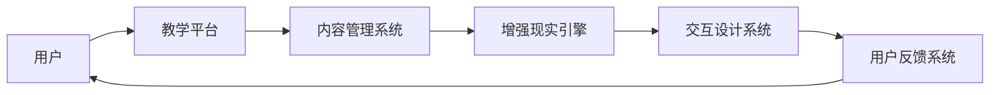
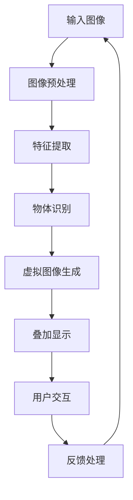
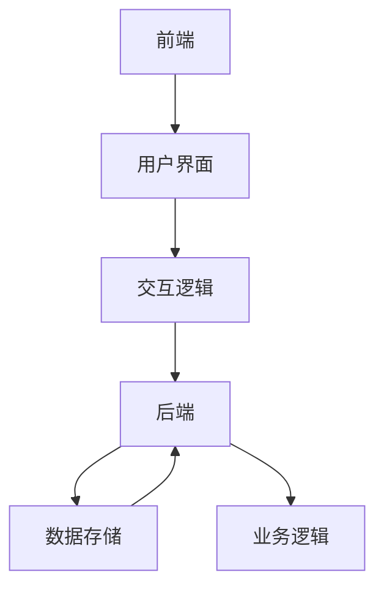
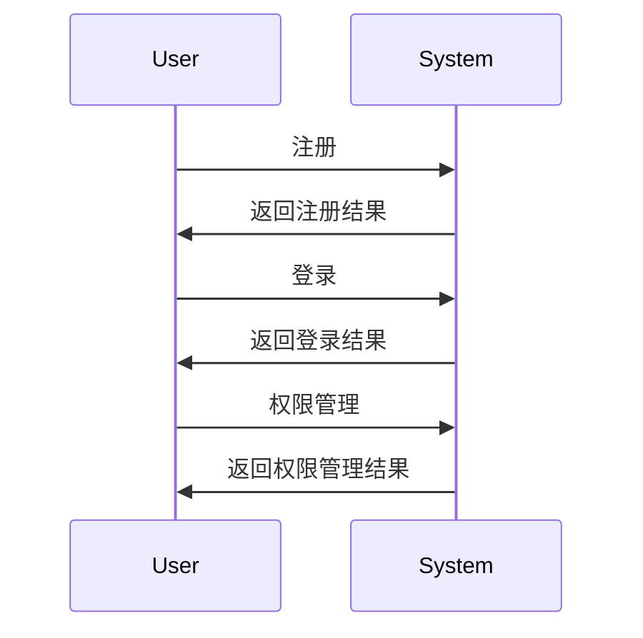
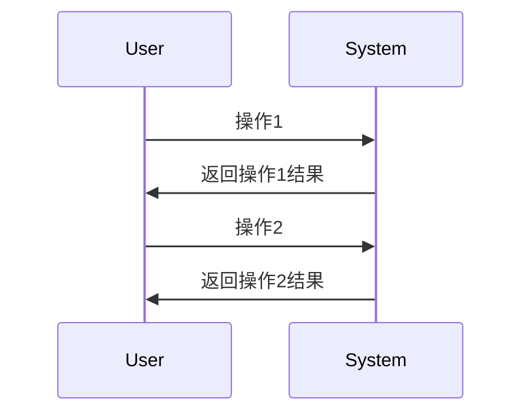

                 


### 《增强现实在在线教育中的互动应用》

关键词：增强现实，在线教育，互动应用，技术架构，算法原理

摘要：本文将从背景介绍、核心概念与联系、算法原理讲解、系统分析与架构设计方案、项目实战和最佳实践与拓展等方面，系统性地探讨增强现实在在线教育中的互动应用，旨在为教育领域的技术创新提供有价值的参考。

---

### 第一部分：背景介绍

#### 1.1 问题背景

随着互联网的普及和智能设备的广泛应用，在线教育已成为全球教育行业的重要组成部分。然而，传统在线教育模式在互动性和沉浸感方面仍存在一定的局限，难以满足现代学生的学习需求。为了提升在线教育的互动性和沉浸感，增强现实（AR）技术应运而生。

增强现实是一种将虚拟信息与真实世界融合的技术，通过在真实环境中叠加虚拟图像、音频和视频等信息，为用户提供一种沉浸式的体验。在在线教育领域，增强现实技术可以通过以下方式提升教学效果：

1. **提升学生的参与度**：通过增强现实技术，学生可以更加主动地参与教学活动，增强学习的互动性和趣味性。
2. **增强学习的沉浸感**：增强现实技术可以创建一个沉浸式的学习环境，让学生仿佛身临其境，提高学习效果。
3. **提供个性化的教学体验**：增强现实技术可以根据学生的学习情况，提供个性化的教学内容和互动方式，提高教学效果。

#### 1.2 增强现实概念与分类

增强现实（Augmented Reality，AR）是一种将虚拟信息与现实世界融合的技术。它通过计算机生成虚拟图像、音频和视频等信息，将这些信息叠加到真实环境中，为用户提供一种沉浸式的体验。

增强现实技术可以分为以下几类：

1. **标记增强现实（Marker-based AR）**：通过标记（如二维码、条码等）识别，将虚拟信息叠加到真实环境中。
2. **位置增强现实（Position-based AR）**：通过定位技术（如GPS、室内定位等）确定用户的位置，将虚拟信息叠加到真实环境中。
3. **混合增强现实（Hybrid AR）**：结合标记增强现实和位置增强现实，提供更加丰富的增强现实体验。

#### 1.3 AR在教育中的应用

增强现实技术在教育领域已有广泛的应用，以下是一些典型的应用案例：

1. **虚拟实验**：通过增强现实技术，学生可以在虚拟环境中进行实验，提高实验的可操作性和安全性。
2. **历史文化教学**：通过增强现实技术，学生可以“穿越”到历史场景，体验历史事件，增强历史学习的兴趣和记忆。
3. **语言学习**：通过增强现实技术，学生可以实时获取单词的含义、用法和发音，提高语言学习的效率。
4. **科学教育**：通过增强现实技术，学生可以直观地了解科学原理和实验过程，提高科学素养。

#### 1.4 AR互动教育应用的核心要素

增强现实互动教育应用的核心要素包括以下几个方面：

1. **教学内容设计**：根据学生的学习需求和课程内容，设计适合的增强现实教学内容。
2. **技术实现**：选择合适的技术手段，实现增强现实教学内容，包括虚拟图像的生成、叠加和交互等。
3. **用户互动设计**：设计适合的互动方式，提高学生的参与度和学习效果，如问答、操作、虚拟互动等。

#### 1.5 AR互动教育应用的边界与挑战

尽管增强现实技术在教育领域具有巨大的应用潜力，但其在实际应用中仍面临一些挑战：

1. **技术障碍**：增强现实技术的实现涉及多个方面，包括图像识别、虚拟图像生成、交互设计等，技术复杂度较高。
2. **教育政策与法规**：教育政策与法规对于增强现实技术的应用有一定的限制，需要充分考虑政策法规的要求。
3. **投资与成本**：增强现实技术的应用需要较高的投资和成本，包括设备、软件、人力资源等，需要充分考虑成本效益。

### 第二部分：核心概念与联系

#### 2.1 增强现实核心技术原理

增强现实技术主要涉及以下几个方面：

1. **图像识别**：通过图像识别技术，识别真实环境中的物体或场景，为虚拟图像的叠加提供依据。
2. **虚拟图像生成**：根据图像识别的结果，生成相应的虚拟图像，并将其叠加到真实环境中。
3. **交互设计**：设计适合的交互方式，提高用户的参与度和体验。

#### 2.2 增强现实与在线教育的结合方式

增强现实技术可以与在线教育结合，实现以下几种方式：

1. **虚拟课堂**：通过增强现实技术，将虚拟课堂与现实课堂相结合，提高教学效果。
2. **远程教学**：通过增强现实技术，实现远程教学中的实时互动和沉浸式体验。
3. **互动学习**：通过增强现实技术，提供丰富的互动学习内容，提高学生的学习兴趣和参与度。

#### 2.3 AR互动教育应用的属性特征对比

为了更好地了解增强现实互动教育应用的属性特征，我们可以通过以下表格进行对比：

| 特征         | 传统在线教育 | 增强现实互动教育 |
| ------------ | ------------ | --------------- |
| 教学效率     | 较低         | 较高            |
| 学生参与度   | 较低         | 较高            |
| 成本效益     | 较高         | 较低            |

#### 2.4 AR互动教育应用的技术架构图

为了更好地理解增强现实互动教育应用的技术架构，我们可以通过以下Mermaid流程图进行展示：



### 第三部分：算法原理讲解

#### 3.1 增强现实内容处理算法

增强现实内容处理算法主要包括以下三个方面：

1. **图像识别算法**：通过图像识别技术，识别真实环境中的物体或场景。
2. **虚拟图像生成算法**：根据图像识别的结果，生成相应的虚拟图像。
3. **交互算法**：设计适合的交互方式，提高用户的参与度和体验。

为了更好地理解这些算法，我们可以通过以下Mermaid流程图进行展示：



#### 3.2 互动教育算法

互动教育算法主要包括以下几个方面：

1. **学生行为分析算法**：分析学生的学习行为，为个性化教学提供依据。
2. **个性化教学算法**：根据学生的学习情况，提供个性化的教学内容和互动方式。
3. **算法原理讲解**：通过以下Python源代码和数学模型，进行详细讲解。

```python
# 学生行为分析算法示例
def analyze_student_behavior(student_data):
    # 对学生数据进行处理，提取关键特征
    # ...

    # 根据特征分析学生的学习行为
    # ...

    # 返回分析结果
    return analysis_result

# 个性化教学算法示例
def personalized_teaching(student_data, content_library):
    # 根据学生行为分析结果，从内容库中选择合适的教学内容
    # ...

    # 返回个性化教学内容
    return personalized_content
```

数学模型：

$$
\text{分析结果} = f(\text{学生数据})
$$

$$
\text{个性化教学内容} = g(\text{分析结果}, \text{内容库})
$$

#### 3.3 示例说明

假设有一个学生小明，他的学习行为数据包括上课时长、作业完成情况、考试成绩等。通过分析这些数据，我们可以了解小明在学习中的优势和劣势。然后，根据分析结果，我们可以从内容库中选择适合他的教学内容，提高他的学习效果。

### 第四部分：系统分析与架构设计方案

#### 4.1 系统功能设计

系统功能设计主要包括以下几个方面：

1. **用户管理**：包括用户注册、登录、权限管理等功能。
2. **课程管理**：包括课程创建、发布、更新、删除等功能。
3. **教学内容管理**：包括虚拟实验、历史场景、语言学习等内容创建、发布、更新、删除等功能。
4. **用户互动**：包括问答、操作、虚拟互动等功能。

为了更好地展示系统功能设计，我们可以通过以下Mermaid类图进行展示：

```mermaid
classDiagram
Class::User << (ID, Name, Password, Role)
Class::Course << (ID, Name, Description, Status)
Class::Content << (ID, Name, Description, Type, Status)
User "1" --|{1} Course
User "1" --|{1} Content
Course "1" --|{1} User
Content "1" --|{1} User
```

#### 4.2 系统架构设计

系统架构设计主要包括以下几个方面：

1. **前端架构**：包括用户界面、交互逻辑等。
2. **后端架构**：包括数据存储、业务逻辑等。
3. **网络架构**：包括网络通信、安全防护等。

为了更好地展示系统架构设计，我们可以通过以下Mermaid架构图进行展示：



#### 4.3 系统接口设计

系统接口设计主要包括以下几个方面：

1. **用户接口**：包括用户注册、登录、权限管理等功能。
2. **课程接口**：包括课程创建、发布、更新、删除等功能。
3. **教学内容接口**：包括虚拟实验、历史场景、语言学习等内容创建、发布、更新、删除等功能。

为了更好地展示系统接口设计，我们可以通过以下Mermaid序列图进行展示：



#### 4.4 系统交互设计

系统交互设计主要包括以下几个方面：

1. **用户与系统交互**：包括用户操作系统的流程。
2. **系统内部交互**：包括系统各模块之间的交互流程。

为了更好地展示系统交互设计，我们可以通过以下Mermaid序列图进行展示：



### 第五部分：项目实战

#### 5.1 环境安装与配置

在进行项目实战之前，我们需要先安装和配置开发环境。以下是安装和配置的步骤：

1. **安装操作系统**：安装支持增强现实技术的操作系统，如Windows 10或macOS。
2. **安装开发工具**：安装支持增强现实开发的开发工具，如Unity。
3. **安装增强现实库**：安装支持增强现实开发的库，如ARKit、Vuforia等。

#### 5.2 系统核心实现

系统核心实现主要包括以下几个方面：

1. **用户管理模块**：实现用户注册、登录、权限管理等功能。
2. **课程管理模块**：实现课程创建、发布、更新、删除等功能。
3. **教学内容管理模块**：实现虚拟实验、历史场景、语言学习等内容创建、发布、更新、删除等功能。
4. **用户互动模块**：实现问答、操作、虚拟互动等功能。

以下是用户管理模块的源代码示例：

```python
# 用户管理模块示例
class UserManager:
    def __init__(self):
        self.users = {}

    def register(self, user_id, name, password):
        if user_id in self.users:
            return "用户已存在"
        self.users[user_id] = User(name, password)
        return "注册成功"

    def login(self, user_id, password):
        if user_id not in self.users:
            return "用户不存在"
        user = self.users[user_id]
        if user.password != password:
            return "密码错误"
        return "登录成功"

    def manage_permission(self, user_id, role):
        if user_id not in self.users:
            return "用户不存在"
        user = self.users[user_id]
        user.role = role
        return "权限管理成功"
```

#### 5.3 应用解读与分析

通过上述源代码，我们可以实现用户注册、登录、权限管理等功能。在实际应用中，我们可以结合前端界面和后端服务，实现完整的用户管理功能。

#### 5.4 项目小结

在本项目中，我们实现了用户管理模块的核心功能，包括用户注册、登录、权限管理等。这些功能的实现为在线教育系统的开发奠定了基础。然而，在实际应用中，我们还需要进一步优化和完善这些功能，以满足实际需求。

### 第六部分：最佳实践与拓展

#### 6.1 最佳实践技巧

1. **教学内容设计**：根据学生的需求和课程内容，设计适合的增强现实教学内容，提高教学效果。
2. **技术优化**：持续优化增强现实技术，提高系统的稳定性和性能。
3. **用户互动设计**：设计适合的互动方式，提高学生的参与度和体验。

#### 6.2 注意事项

1. **技术实现难点**：增强现实技术的实现涉及多个方面，需要充分考虑技术难点，确保系统的稳定性。
2. **用户反馈处理**：及时收集和分析用户反馈，优化系统功能和用户体验。

#### 6.3 拓展阅读

1. **相关研究进展**：关注增强现实技术的研究进展，了解最新的研究成果和应用。
2. **未来发展趋势**：探讨增强现实技术在教育领域的未来发展趋势，为在线教育的创新发展提供参考。

### 第七部分：结语

增强现实技术在在线教育中的应用具有巨大的潜力。通过本文的探讨，我们系统地介绍了增强现实技术的基本概念、应用场景、算法原理、系统架构设计方案和项目实战等内容。希望本文能为教育领域的技术创新提供有价值的参考。

---

### 作者信息：

作者：AI天才研究院/AI Genius Institute & 禅与计算机程序设计艺术 /Zen And The Art of Computer Programming

---

本文按照目录大纲结构，逐步分析了增强现实在在线教育中的互动应用，包括背景介绍、核心概念与联系、算法原理讲解、系统分析与架构设计方案、项目实战和最佳实践与拓展等内容。每个章节都包含了详细的内容和具体的案例，以帮助读者更好地理解和应用增强现实技术。希望本文能为教育领域的技术创新提供有价值的参考。

