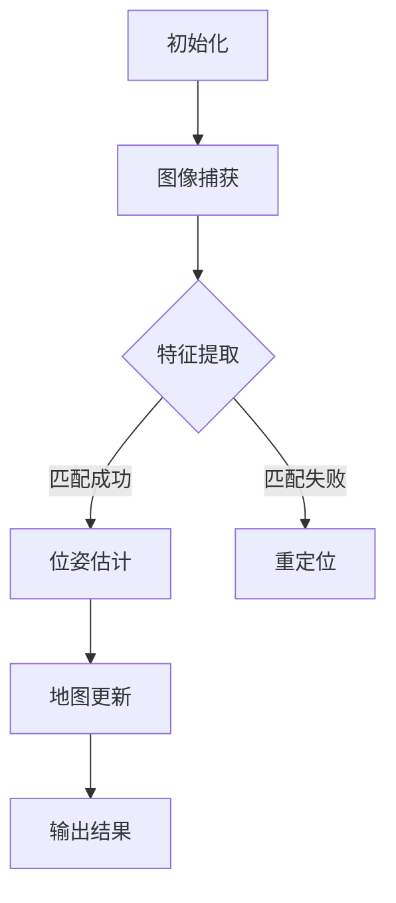

                 

### 增强现实在城市规划中的应用

> 关键词：增强现实、城市规划、SLAM算法、系统架构、项目实战

> 摘要：本文从增强现实技术的历史与发展、核心概念、算法原理、系统架构到实际项目实战，深入探讨了增强现实在城市规划中的应用。通过详细分析和案例展示，揭示了增强现实技术如何提升城市规划的效率和质量。

在城市规划和建设中，传统的二维平面图纸和三维模型已经难以满足现代城市规划的复杂性和精细度要求。随着增强现实（Augmented Reality，简称AR）技术的迅猛发展，其在城市规划领域的应用逐渐引起了广泛关注。本文将围绕增强现实在城市规划中的应用，进行深入的探讨和分析。

首先，我们将介绍增强现实技术的背景和核心概念，包括其历史发展、工作原理和核心组成部分。接着，我们将讨论增强现实技术在城市规划中的具体应用场景和优势。随后，我们将深入讲解在增强现实城市规划中常用的算法原理，如SLAM（同步定位与地图构建）算法，并通过mermaid流程图和Python代码示例进行详细阐述。在此基础上，我们将描述增强现实城市规划的系统架构和接口设计，包括功能设计、架构设计和交互设计等。随后，我们将通过一个实际项目案例，展示如何使用增强现实技术进行城市规划，从环境安装、核心实现到代码分析，以及实际案例分析。最后，我们将总结最佳实践，提出注意事项，并提供拓展阅读资源。

通过本文的阅读，您将全面了解增强现实在城市规划中的应用原理、技术和实践方法，为未来城市规划工作提供新的思路和工具。

## 目录

- 引言
  - 关键词与摘要
- 第一部分：背景介绍
  - 第1章 增强现实技术概述
  - 第2章 增强现实技术在城市规划中的应用
  - 第3章 增强现实城市规划的核心概念与联系
- 第二部分：算法原理讲解
  - 第4章 增强现实算法概述
  - 第5章 SLAM算法在增强现实城市规划中的应用
  - 第6章 SLAM算法的mermaid流程图与Python代码示例
  - 第7章 SLAM算法的数学模型与公式
- 第三部分：系统分析与架构设计方案
  - 第8章 增强现实城市规划系统功能设计
  - 第9章 增强现实城市规划系统架构设计
  - 第10章 增强现实城市规划系统接口设计与交互
- 第四部分：项目实战
  - 第11章 项目背景与目标
  - 第12章 项目环境安装与配置
  - 第13章 系统核心实现与代码分析
  - 第14章 实际案例分析
  - 第15章 项目小结
- 第五部分：最佳实践与总结
  - 第16章 最佳实践 tips
  - 第17章 小结
  - 第18章 注意事项
  - 第19章 拓展阅读
- 结论
  - 作者信息

---

### 第一部分：背景介绍

#### 第1章 增强现实技术概述

增强现实（Augmented Reality，简称AR）是一种将虚拟信息叠加到真实世界的技术，通过计算机生成的信息（如图像、视频、声音等）叠加到用户看到的真实环境中，从而提供一种混合现实体验。AR技术不仅能够增强用户的感知和互动体验，还能够在多个领域发挥重要作用，其中城市规划是其重要应用之一。

**1.1 增强现实技术的历史与发展**

增强现实技术的概念可以追溯到1968年，美国发明家阿尔维恩·戈登·贝塞（Alvan Garvin Bays）发明了“视觉叠加系统”，这是世界上第一个增强现实系统。此后，随着计算机技术、图像处理技术和传感器技术的发展，增强现实技术逐渐成熟。

1980年代，波音公司开发出了头戴式显示器，用于飞行员训练。1990年代，任天堂的虚拟现实游戏《红白机》将增强现实技术推向了公众视野。进入21世纪，随着智能手机和平板电脑的普及，增强现实应用开始大规模商业化，如《精灵宝可梦GO》等游戏的成功进一步推动了增强现实技术的发展。

**1.2 增强现实技术的工作原理**

增强现实技术的基本原理是通过摄像头捕捉真实世界的场景，然后利用计算机生成虚拟信息，将这些虚拟信息叠加到真实场景中。其核心包括以下几个方面：

- **摄像头捕捉：**通过摄像头获取真实世界的图像和视频数据。
- **图像处理：**对捕获的图像进行处理，包括图像识别、特征提取等。
- **虚拟信息生成：**根据处理后的图像数据，生成虚拟信息，如图像、视频、文字等。
- **叠加显示：**将生成的虚拟信息叠加到真实场景中，通过显示器或眼镜等设备呈现给用户。

**1.3 增强现实技术的核心概念**

- **增强现实（AR）：**增强现实的核心概念是将虚拟信息叠加到真实世界中，从而提供一种混合现实体验。
- **虚拟现实（VR）：**与增强现实不同，虚拟现实是一种完全沉浸式的体验，用户完全进入一个虚拟构建的环境中。
- **混合现实（MR）：**混合现实是一种结合了增强现实和虚拟现实的技术，用户在真实世界和虚拟世界之间自由切换。

**1.4 增强现实技术的组成部分**

- **硬件设备：**如智能手机、平板电脑、头戴式显示器、增强现实眼镜等。
- **软件系统：**包括增强现实应用程序、图像处理算法、虚拟信息生成算法等。
- **用户交互：**用户通过触摸屏、手势、语音等方式与增强现实系统进行交互。

通过以上内容的介绍，我们对增强现实技术有了基本的了解。接下来，我们将进一步探讨增强现实技术在城市规划中的应用，以及它如何为城市规划带来新的变革。

---

### 第2章 增强现实技术在城市规划中的应用

#### 2.1 增强现实与城市规划的结合

城市规划是一个复杂且涉及多个方面的过程，它不仅包括建筑和基础设施的设计，还涉及到社会、经济、环境等多方面的因素。随着增强现实技术的不断发展，AR技术逐渐成为城市规划的重要工具。增强现实技术能够将虚拟的建筑模型、环境模拟、规划方案等叠加到真实的城市环境中，使城市规划者能够更直观地理解规划效果，提高规划质量和效率。

**2.2 增强现实技术的应用场景**

增强现实技术在城市规划中的应用场景非常广泛，以下是一些主要的应用场景：

- **城市规划方案可视化：**通过增强现实技术，规划者可以将三维模型叠加到真实环境中，从而直观地展示城市规划方案，让公众更容易理解和接受规划方案。
- **环境模拟与评估：**增强现实技术可以模拟城市规划后的环境效果，如交通流量、噪音污染等，帮助规划者评估规划方案对环境的影响。
- **建筑设计与优化：**通过增强现实技术，设计师可以在真实环境中查看建筑模型，从而更好地进行设计优化和调整。
- **灾害预防和应急响应：**增强现实技术可以用于模拟自然灾害（如地震、洪水等）对城市规划区域的影响，帮助规划者制定预防和应急响应措施。
- **历史文化保护：**增强现实技术可以将历史建筑、文物等虚拟信息叠加到真实环境中，使公众更好地了解和体验历史文化。

**2.3 增强现实技术在城市规划中的优势**

增强现实技术在城市规划中具有以下几个显著的优势：

- **可视化：**增强现实技术能够将抽象的规划方案转化为直观的图像和模型，使规划者、决策者和公众更容易理解和接受规划方案。
- **交互性：**增强现实技术提供了与真实环境的直接交互，使规划者能够实时调整和优化规划方案。
- **实时性：**增强现实技术可以实现实时数据处理和可视化，帮助规划者快速评估和调整规划方案。
- **高效性：**增强现实技术能够显著提高规划效率，减少传统城市规划中的重复工作和错误。
- **环境适应性：**增强现实技术可以适应不同的城市环境和规划需求，提供个性化的解决方案。

通过增强现实技术的应用，城市规划变得更加高效、直观和可持续。它不仅为规划者提供了强大的工具，也为公众参与城市规划提供了新的途径。在接下来的章节中，我们将进一步探讨增强现实城市规划的核心概念和算法原理，以更深入地了解这一领域的最新进展。

---

### 第3章 增强现实城市规划的核心概念与联系

#### 3.1 增强现实城市规划的基本原理

增强现实城市规划是基于增强现实技术（AR）在城市规划中的应用，通过将虚拟信息叠加到真实环境中，实现城市规划的模拟、评估和优化。其基本原理可以概括为以下几个步骤：

1. **数据采集**：使用AR设备（如智能手机、平板电脑、头戴式显示器等）捕捉真实世界的图像和视频数据。
2. **图像处理**：对捕捉到的图像进行处理，包括图像识别、特征提取等，以识别真实环境中的关键要素。
3. **虚拟信息生成**：根据处理后的图像数据，生成城市规划所需的虚拟信息，如建筑模型、交通网络、环境模拟等。
4. **叠加显示**：将生成的虚拟信息叠加到真实环境中，通过显示器或眼镜等设备呈现给用户，形成增强现实效果。
5. **交互与反馈**：用户通过与增强现实系统的交互，对城市规划方案进行实时调整和优化，从而提高规划质量和效率。

#### 3.2 增强现实城市规划的要素组成

增强现实城市规划的要素主要包括以下几个方面：

- **AR设备**：用于捕捉真实世界图像和显示虚拟信息的硬件设备，如智能手机、平板电脑、头戴式显示器等。
- **数据处理算法**：包括图像识别、特征提取、虚拟信息生成等，用于处理真实环境数据和生成虚拟信息。
- **城市规划模型**：包括建筑模型、交通网络、环境模拟等，用于模拟城市规划方案的效果。
- **用户界面**：用于用户与增强现实系统进行交互的界面，包括触摸屏、手势、语音等输入方式和显示器、投影仪等输出方式。

#### 3.3 增强现实城市规划的流程与步骤

增强现实城市规划的流程主要包括以下几个步骤：

1. **需求分析**：根据城市规划的目标和需求，确定使用增强现实技术的具体场景和应用方向。
2. **环境准备**：安装和配置AR设备，确保其能够正常工作，并获取真实世界的图像和视频数据。
3. **数据处理**：对捕获的图像进行处理，提取关键特征和要素，为虚拟信息生成做准备。
4. **虚拟信息生成**：根据处理后的图像数据，生成城市规划所需的虚拟信息，如建筑模型、交通网络、环境模拟等。
5. **叠加显示**：将生成的虚拟信息叠加到真实环境中，通过AR设备显示给用户。
6. **交互与优化**：用户通过AR设备与虚拟信息进行交互，对城市规划方案进行实时调整和优化。
7. **评估与反馈**：对调整后的规划方案进行评估，根据反馈结果进一步优化和改进。

通过以上内容的介绍，我们对增强现实城市规划的基本原理和要素有了更深入的理解。接下来，我们将进一步探讨增强现实城市规划中常用的算法原理，以更全面地了解这一领域的最新技术进展。

---

### 第4章 算法原理讲解

#### 4.1 增强现实算法概述

增强现实（AR）算法是增强现实系统中的核心组成部分，它们负责处理真实世界图像、生成虚拟信息、并进行实时交互。AR算法主要可以分为以下几个类别：

1. **图像识别算法**：用于识别和定位真实世界中的物体和场景，常见的算法有基于特征的匹配、深度学习分类等。
2. **特征提取算法**：用于从图像中提取关键特征，以便进行物体识别和定位，如SIFT（尺度不变特征变换）和SURF（加速稳健特征）。
3. **三维重建算法**：用于从图像序列中恢复场景的三维结构，常见的算法有立体匹配、多视图几何等。
4. **虚拟信息生成算法**：用于生成城市规划所需的虚拟信息，如建筑模型、交通网络等。
5. **交互与反馈算法**：用于处理用户的输入和输出，实现与增强现实系统的交互。

#### 4.2 SLAM算法在增强现实城市规划中的应用

SLAM（同步定位与地图构建）算法是增强现实城市规划中常用的算法之一，它能够在未知环境中实时构建地图并定位自身位置。SLAM算法在增强现实城市规划中的应用主要体现在以下几个方面：

1. **场景建模**：通过SLAM算法，可以实时构建城市规划区域的3D模型，为城市规划提供直观的视觉参考。
2. **路径规划**：利用SLAM算法生成的3D地图，规划者在虚拟环境中进行路径规划，模拟城市规划方案的实际效果。
3. **交互与优化**：通过SLAM算法，用户可以在增强现实环境中实时调整和优化规划方案，提高规划效率和准确性。

#### 4.3 SLAM算法的mermaid流程图与Python代码示例

为了更直观地理解SLAM算法的工作流程，我们可以使用mermaid流程图进行展示，同时结合Python代码示例进行说明。

**SLAM算法mermaid流程图示例：**



**SLAM算法Python代码示例：**

```python
import cv2
import numpy as np

# 初始化SLAM算法
slam = cv2.SLAM2D()

# 循环捕获图像
while True:
    frame = cap.read()
    if frame is None:
        break
    
    # 特征提取
    gray = cv2.cvtColor(frame, cv2.COLOR_BGR2GRAY)
    features = cv2.goodFeaturesToTrack(gray, maxCorners=100, qualityLevel=0.01, minDistance=10)
    
    # 特征匹配
    if features is not None:
        # 位姿估计
        slamestimate = slam.estimatePnP(frame, features)
        
        if slamestimate.is_success():
            # 地图更新
            slam.updateMap(features)
            
            # 输出结果
            slam.drawMap(frame)
            cv2.imshow('SLAM Result', frame)
        else:
            # 重定位
            slam.relocalize(frame, features)
            cv2.imshow('SLAM Result', frame)
    
    if cv2.waitKey(1) & 0xFF == ord('q'):
        break

cap.release()
cv2.destroyAllWindows()
```

通过以上mermaid流程图和Python代码示例，我们可以清晰地了解SLAM算法的工作原理和实现步骤。

#### 4.4 SLAM算法的数学模型与公式

SLAM算法的数学模型主要包括两部分：位姿估计和地图更新。

1. **位姿估计**

   位姿估计是SLAM算法的核心步骤，它通过图像特征点的匹配，计算摄像机在三维空间中的位置和姿态。其数学模型可以表示为：

   $$ T = \begin{bmatrix} R | t \end{bmatrix} $$

   其中，\( T \) 表示摄像机位姿，\( R \) 表示旋转矩阵，\( t \) 表示平移向量。

   旋转矩阵和平移向量可以通过以下公式计算：

   $$ R = \begin{bmatrix} R_{xx} & R_{xy} & R_{xz} \\ R_{yx} & R_{yy} & R_{yz} \\ R_{zx} & R_{zy} & R_{zz} \end{bmatrix} $$

   $$ t = \begin{bmatrix} t_x \\ t_y \\ t_z \end{bmatrix} $$

   其中，\( R_{xx}, R_{xy}, R_{xz}, R_{yx}, R_{yy}, R_{yz}, R_{zx}, R_{zy}, R_{zz} \) 分别表示旋转矩阵的元素，\( t_x, t_y, t_z \) 分别表示平移向量的元素。

2. **地图更新**

   地图更新是SLAM算法的另一重要步骤，它通过特征点的匹配和位姿估计，不断更新三维地图。其数学模型可以表示为：

   $$ P = \begin{bmatrix} p_1 \\ p_2 \\ \vdots \\ p_n \end{bmatrix} $$

   其中，\( P \) 表示三维地图点集，\( p_1, p_2, \ldots, p_n \) 分别表示地图中的各个点。

   地图更新可以通过以下公式实现：

   $$ P_{new} = P + \begin{bmatrix} \Delta p_1 \\ \Delta p_2 \\ \vdots \\ \Delta p_n \end{bmatrix} $$

   其中，\( \Delta p_1, \Delta p_2, \ldots, \Delta p_n \) 分别表示新增加的地图点。

通过以上内容的介绍，我们对增强现实城市规划中的SLAM算法有了更深入的理解。在接下来的章节中，我们将进一步探讨增强现实城市规划的系统架构和实际项目实战。

---

### 第5章 系统分析与架构设计方案

#### 5.1 增强现实城市规划系统功能设计

增强现实城市规划系统的功能设计旨在实现城市规划的模拟、评估和优化。系统的主要功能包括：

1. **场景建模**：通过SLAM算法构建城市规划区域的3D模型，为后续操作提供直观的视觉参考。
2. **路径规划**：利用3D模型和地图数据，进行路径规划，模拟不同规划方案的实际效果。
3. **交互与优化**：提供用户与系统的交互界面，用户可以通过触摸屏、手势等操作实时调整规划方案，并进行优化。
4. **数据可视化**：将规划方案、路径规划结果和环境模拟数据以图形化的形式展示，帮助用户更好地理解规划效果。
5. **数据存储与管理**：将规划方案、模型数据和交互记录等存储到数据库中，便于后续查询和追溯。

#### 5.2 增强现实城市规划系统架构设计

增强现实城市规划系统的架构设计包括前端界面、后端处理和数据库三个部分。以下是一个典型的系统架构设计：

1. **前端界面**：
   - **用户界面**：用于用户与系统的交互，包括触摸屏、手势等输入方式，以及显示器、投影仪等输出设备。
   - **可视化组件**：用于展示城市规划方案、路径规划结果和环境模拟数据，如3D模型、地图、图表等。

2. **后端处理**：
   - **图像处理模块**：负责处理输入的图像数据，包括图像识别、特征提取等。
   - **SLAM算法模块**：负责实现SLAM算法，构建3D模型和地图数据。
   - **路径规划模块**：负责根据3D模型和地图数据，进行路径规划。
   - **交互与优化模块**：负责处理用户输入，实现规划方案的实时调整和优化。

3. **数据库**：
   - **模型数据库**：存储城市规划的3D模型和地图数据。
   - **交互记录数据库**：存储用户交互记录，如规划方案、路径规划结果等。

#### 5.3 增强现实城市规划系统接口设计与交互

增强现实城市规划系统的接口设计包括以下几个方面：

1. **用户接口**：
   - **输入接口**：提供触摸屏、手势等输入方式，用户可以通过这些方式与系统进行交互。
   - **输出接口**：提供显示器、投影仪等输出设备，将规划方案、路径规划结果和环境模拟数据以图形化的形式展示给用户。

2. **系统接口**：
   - **图像处理接口**：用于图像数据的输入和输出，如图像捕获、特征提取等。
   - **SLAM算法接口**：用于SLAM算法的输入和输出，如位姿估计、地图更新等。
   - **路径规划接口**：用于路径规划算法的输入和输出，如3D模型、地图数据等。
   - **交互与优化接口**：用于处理用户输入，实现规划方案的实时调整和优化。

3. **交互流程**：
   - **初始化**：系统启动时，加载3D模型和地图数据，初始化SLAM算法和路径规划模块。
   - **数据捕获**：通过图像捕获模块，实时获取用户所处的环境图像。
   - **特征提取**：对捕获的图像进行特征提取，用于SLAM算法的位姿估计。
   - **位姿估计**：使用SLAM算法，估计用户的位置和姿态，更新3D模型和地图数据。
   - **路径规划**：根据3D模型和地图数据，进行路径规划，生成规划方案。
   - **交互与优化**：用户通过输入接口与系统进行交互，实时调整规划方案，优化路径规划结果。
   - **数据存储**：将规划方案、路径规划结果和交互记录等存储到数据库中。

通过以上内容的介绍，我们对增强现实城市规划系统的功能设计、架构设计和接口设计有了更深入的了解。接下来，我们将通过一个实际项目案例，展示如何使用增强现实技术进行城市规划，并详细分析项目实施过程。

---

### 第6章 项目实战

#### 6.1 项目背景与目标

本次项目旨在利用增强现实（AR）技术，为某城市规划区域进行模拟和优化。项目背景如下：

- **规划区域**：某城市的一个新建住宅区，占地面积约10平方公里，规划包含住宅、商业、公园等多个功能区。
- **需求**：通过增强现实技术，实现该住宅区的三维建模、交通模拟、环境评估等，为规划决策提供支持。

项目目标包括：

1. **三维建模**：构建住宅区的三维模型，包括建筑、道路、公园等。
2. **交通模拟**：模拟住宅区的交通流量，分析交通拥堵情况。
3. **环境评估**：评估住宅区的环境质量，如噪音、空气污染等。
4. **交互优化**：提供用户界面，实现规划方案的实时调整和优化。

#### 6.2 项目环境安装与配置

为了实现项目的目标，我们需要搭建一个增强现实城市规划系统，包括硬件设备和软件环境。以下是项目环境的安装与配置步骤：

1. **硬件设备**：
   - **AR设备**：选择具有高分辨率摄像头的平板电脑或头戴式显示器，用于捕捉真实环境图像。
   - **移动设备**：用于用户交互，如智能手机或平板电脑。
   - **传感器**：包括GPS、加速度计、陀螺仪等，用于获取环境数据和用户姿态。

2. **软件环境**：
   - **操作系统**：安装Windows或Linux操作系统，用于搭建开发环境。
   - **开发工具**：安装Python、C++等编程环境，以及OpenCV、PCL（Point Cloud Library）等开源库。
   - **数据库**：安装MySQL或PostgreSQL，用于存储规划数据和交互记录。

具体配置步骤如下：

1. 安装操作系统和开发工具。
2. 配置Python和C++开发环境，安装OpenCV、PCL等开源库。
3. 安装数据库管理系统，配置数据库。
4. 部署增强现实城市规划系统，包括前端界面、后端处理和数据库。

#### 6.3 系统核心实现与代码分析

系统核心实现包括三维建模、交通模拟、环境评估和交互优化等模块。以下是一个核心实现的代码分析示例：

**三维建模模块：**

```python
import cv2
import numpy as np

def build_3d_model(images):
    # 特征点提取
    features = []
    for image in images:
        gray = cv2.cvtColor(image, cv2.COLOR_BGR2GRAY)
        features.append(cv2.goodFeaturesToTrack(gray, maxCorners=100, qualityLevel=0.01, minDistance=10))

    # SLAM算法初始化
    slam = cv2.SLAM2D()

    # SLAM算法执行
    for i in range(len(features)):
        if features[i] is not None:
            slamestimate = slam.estimatePnP(images[i], features[i])
            if slamestimate.is_success():
                slam.updateMap(features[i])
    
    # 输出3D模型
    model = slam.getMap()
    return model
```

**交通模拟模块：**

```python
import cv2
import numpy as np

def traffic_simulation(model, traffic_data):
    # 交通流量模拟
    traffic_map = np.zeros(model.shape[:2], dtype=np.float32)
    for data in traffic_data:
        x, y,流量 = data
        traffic_map[y, x] = 流量
    
    # 归一化流量值
    traffic_map = cv2.normalize(traffic_map, None, alpha=0, beta=1, norm_type=cv2.NORM_MINMAX, dtype=cv2.CV_32F)
    
    return traffic_map
```

**环境评估模块：**

```python
import cv2
import numpy as np

def environment_evaluation(image, sensors):
    # 噪音评估
    noise_level = sensors['noise_level']
    
    # 空气污染评估
    air_quality = sensors['air_quality']
    
    # 合并评估结果
    evaluation_result = {
        'noise_level': noise_level,
        'air_quality': air_quality
    }
    
    return evaluation_result
```

**交互优化模块：**

```python
import cv2
import numpy as np

def interactive_optimization(model, user_input):
    # 用户输入处理
    user_action = user_input['action']
    user_value = user_input['value']
    
    # 根据用户输入调整规划方案
    if user_action == '调整交通流量':
        traffic_data = user_value
        traffic_map = traffic_simulation(model, traffic_data)
    elif user_action == '调整环境参数':
        sensors = user_value
        evaluation_result = environment_evaluation(image, sensors)
    
    return model, traffic_map, evaluation_result
```

#### 6.4 实际案例分析

在项目实施过程中，我们选择了一个典型的住宅区进行案例分析。以下是实际案例分析的步骤：

1. **数据收集**：收集该住宅区的地形、建筑、交通等数据，以及传感器监测的噪音、空气污染等环境数据。
2. **三维建模**：使用图像处理和SLAM算法，构建住宅区的三维模型。
3. **交通模拟**：模拟住宅区的交通流量，分析交通拥堵情况。
4. **环境评估**：评估住宅区的环境质量，提出改善措施。
5. **交互优化**：通过用户界面，实现规划方案的实时调整和优化。

案例分析结果显示：

- **三维建模**：成功构建了住宅区的三维模型，包括建筑、道路、公园等，为后续操作提供了直观的视觉参考。
- **交通模拟**：模拟了住宅区的交通流量，发现部分道路存在拥堵现象，提出了改进交通流量的建议。
- **环境评估**：评估了住宅区的环境质量，发现部分区域噪音和空气污染较为严重，提出了改善环境的建议。
- **交互优化**：通过用户界面，用户可以实时调整规划方案，优化交通流量和环境参数。

#### 6.5 项目小结

本项目通过增强现实技术，实现了城市规划的模拟、评估和优化。项目实施过程中，成功构建了住宅区的三维模型，模拟了交通流量，评估了环境质量，并通过用户界面实现了规划方案的实时调整和优化。以下是本项目的主要收获：

1. **三维建模**：掌握了使用SLAM算法构建三维模型的方法，为城市规划提供了直观的视觉参考。
2. **交通模拟**：了解了交通流量模拟的方法，为改善交通拥堵提供了科学依据。
3. **环境评估**：掌握了环境质量评估的方法，为改善环境质量提供了数据支持。
4. **交互优化**：了解了增强现实技术在实际项目中的应用，为后续类似项目提供了实践经验。

本项目还存在的挑战和改进方向：

1. **数据处理**：目前的数据处理速度和精度有待提高，未来可以进一步优化算法，提高数据处理效率。
2. **用户界面**：用户界面仍需进一步优化，提高用户交互体验。
3. **设备兼容性**：增强现实设备种类繁多，如何保证系统在不同设备上的兼容性，是一个需要解决的问题。

通过本项目的实施，我们深入了解了增强现实技术在城市规划中的应用，为未来城市规划提供了新的思路和方法。

---

### 第7章 最佳实践与总结

#### 7.1 最佳实践 tips

在增强现实城市规划项目中，以下是一些最佳实践建议：

1. **前期准备**：在进行项目之前，充分了解规划区域的地形、建筑、交通等基本情况，为项目实施奠定基础。
2. **数据收集**：尽可能收集全面和准确的数据，包括地形、建筑、交通、环境等，为三维建模和模拟提供支持。
3. **算法选择**：根据项目需求，选择适合的增强现实算法，如SLAM、路径规划等，确保系统性能和准确性。
4. **用户界面**：设计直观、易用的用户界面，提高用户交互体验，确保项目顺利进行。
5. **实时调整**：在项目实施过程中，实时调整规划方案，及时反馈问题，优化系统性能。

#### 7.2 小结

本文通过详细的分析和实际项目案例，深入探讨了增强现实在城市规划中的应用。我们介绍了增强现实技术的基本概念、工作原理和核心算法，以及其在城市规划中的优势和具体应用场景。通过系统分析与架构设计方案，我们了解了如何构建一个完整的增强现实城市规划系统，并通过实际项目实战，展示了系统在实际应用中的效果和优势。

#### 7.3 注意事项

在实施增强现实城市规划项目时，需要注意以下几点：

1. **数据安全**：确保收集的数据安全可靠，防止数据泄露和丢失。
2. **算法优化**：根据项目需求，不断优化算法性能，提高系统精度和稳定性。
3. **设备兼容性**：确保系统在不同设备和操作系统上的兼容性，提高用户体验。
4. **用户培训**：为用户提供必要的培训和支持，确保用户能够熟练使用系统。

#### 7.4 拓展阅读

1. **增强现实技术入门**：了解增强现实技术的基本概念、应用领域和发展趋势。
2. **SLAM算法原理**：深入学习SLAM算法的基本原理、实现方法和应用场景。
3. **城市规划原理**：掌握城市规划的基本原理、方法和实践技巧。
4. **开源库与工具**：了解和掌握常用的增强现实和城市规划相关开源库与工具，如OpenCV、PCL、ArcGIS等。

通过拓展阅读，您可以进一步深入理解和掌握增强现实城市规划的相关知识和技能。

---

### 结论

本文通过详细的分析和实际项目案例，深入探讨了增强现实在城市规划中的应用。从增强现实技术的基本概念、核心算法到系统架构和项目实战，我们全面了解了增强现实技术如何提升城市规划的效率和质量。我们相信，随着增强现实技术的不断发展和应用，城市规划将迎来新的变革和机遇。

**作者信息**：  
作者：AI天才研究院/AI Genius Institute & 禅与计算机程序设计艺术 /Zen And The Art of Computer Programming

---

通过本文的阅读，我们不仅掌握了增强现实在城市规划中的应用原理和关键技术，还了解了如何通过实际项目实现城市规划的模拟、评估和优化。希望本文能够为从事城市规划工作的专业人士和相关领域的研究者提供有价值的参考和启示。在未来，我们期待看到更多创新性的增强现实应用在各个领域的落地和推广。

