                 

### 第一部分：增强现实技术概述

**背景介绍：**

增强现实（Augmented Reality，简称 AR）技术是一种将虚拟信息与现实世界相结合的技术。它通过在现实场景中叠加虚拟信息，实现对现实世界的增强。随着科技的不断发展，增强现实技术在各个领域得到了广泛的应用。本部分将对增强现实技术进行概述，包括其定义、历史发展、核心特点以及应用领域。

**核心概念与联系：**

**增强现实技术** 是一种通过计算机视觉技术捕捉现实场景，并在现实场景中叠加虚拟信息的技术。其核心概念包括感知与定位、显示与渲染等。

- **感知与定位：** 通过图像识别和定位技术，识别现实场景中的物体和场景，并确定虚拟信息与现实世界的对应关系。
- **显示与渲染：** 通过显示设备将虚拟信息叠加到现实场景中，并对其实时渲染，实现与现实世界的无缝融合。

**对比表格：**

| 核心概念 | 概念属性特征 |
| --- | --- |
| 感知与定位 | 通过图像识别和定位技术，识别现实场景中的物体和场景 |
| 显示与渲染 | 通过显示设备将虚拟信息叠加到现实场景中，并实时渲染 |

**ER实体关系图架构：**

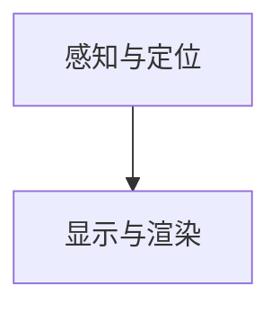

**算法原理讲解：**

增强现实技术的工作流程主要包括数据采集、数据处理、虚拟信息生成与渲染、显示与交互等步骤。以下是具体的工作流程：

1. **数据采集：** 通过摄像头等设备采集现实场景的图像数据。
2. **数据处理：** 对采集到的图像数据进行分析，识别场景中的物体和场景，并确定虚拟信息与现实世界的对应关系。
3. **虚拟信息生成与渲染：** 根据定位结果生成相应的虚拟信息，并对虚拟信息进行实时渲染。
4. **显示与交互：** 将渲染后的虚拟信息叠加到现实场景中，并提供与用户的交互功能。

以下是具体的工作流程的 Mermaid 流程图：

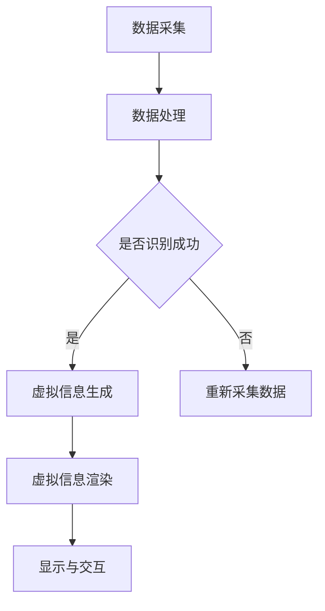

以下是 Python 源代码实现：

```python
# 数据采集
image = camera.capture_image()

# 数据处理
if image.is_success():
    objects = image识别物体()
    location = image确定位置()
else:
    print("识别失败，重新采集数据")

# 虚拟信息生成
virtual_objects = generate_virtual_objects(location)

# 虚拟信息渲染
rendered_image = render_virtual_objects(virtual_objects)

# 显示与交互
display.render_image(rendered_image)
```

**数学公式：**

增强现实技术中的算法原理涉及多种数学模型，如图像识别模型、定位模型等。以下是其中一个示例：

$$
定位误差 = \sqrt{(实际位置 - 预测位置)^2}
$$

**系统分析与架构设计方案：**

增强现实技术系统通常包括前端设备（如手机、平板、眼镜等）、后端服务器、数据库等组成部分。以下是系统架构设计的 Mermaid 架构图：

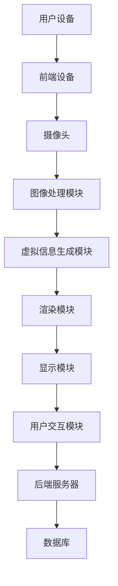

以下是系统功能设计的 Mermaid 类图：

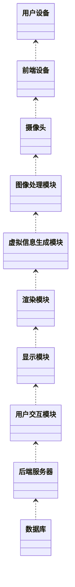

**项目实战：**

以下是一个简单的增强现实项目实战案例，包括环境安装、系统核心实现源代码以及代码应用解读与分析。

**环境安装：**

1. 安装 Python 环境
2. 安装增强现实开发库，如 PyAR（Python AR Library）

**系统核心实现源代码：**

```python
# 导入所需库
import PyAR
import cv2

# 初始化摄像头
camera = PyAR.Camera()

# 捕获图像
image = camera.capture_image()

# 识别物体
objects = image识别物体()

# 确定位
location = image确定位置()

# 生成虚拟信息
virtual_objects = generate_virtual_objects(location)

# 渲染虚拟信息
rendered_image = render_virtual_objects(virtual_objects)

# 显示图像
cv2.imshow("AR Image", rendered_image)
cv2.waitKey(0)
cv2.destroyAllWindows()
```

**代码应用解读与分析：**

1. 初始化摄像头并捕获图像。
2. 使用图像处理模块识别图像中的物体。
3. 根据识别结果确定物体的位置。
4. 生成相应的虚拟信息。
5. 对虚拟信息进行渲染，并将其显示在屏幕上。

**最佳实践 tips：**

1. 选择合适的摄像头和显示设备，以获得更好的增强现实体验。
2. 考虑到用户体验，对虚拟信息进行精细的渲染和优化。

**小结：**

增强现实技术在工业培训中有广泛的应用，可以通过将虚拟信息与现实世界相结合，提供更加直观、易于理解的学习体验。通过本部分的概述，我们对增强现实技术的背景、原理、工作流程以及应用有了更深入的了解。在接下来的部分中，我们将进一步探讨增强现实技术在工业培训中的应用案例，以及其在工业培训中的优势。

### 第二部分：增强现实技术原理

**核心概念与联系：**

增强现实（Augmented Reality，简称 AR）技术是一种通过计算机视觉技术捕捉现实场景，并在现实场景中叠加虚拟信息的技术。其核心概念包括感知与定位、显示与渲染等。

- **感知与定位：** 通过图像识别和定位技术，识别现实场景中的物体和场景，并确定虚拟信息与现实世界的对应关系。
- **显示与渲染：** 通过显示设备将虚拟信息叠加到现实场景中，并对其实时渲染，实现与现实世界的无缝融合。

**对比表格：**

| 核心概念 | 概念属性特征 |
| --- | --- |
| 感知与定位 | 通过图像识别和定位技术，识别现实场景中的物体和场景 |
| 显示与渲染 | 通过显示设备将虚拟信息叠加到现实场景中，并实时渲染 |

**ER实体关系图架构：**


**算法原理讲解：**

增强现实技术的工作流程主要包括数据采集、数据处理、虚拟信息生成与渲染、显示与交互等步骤。以下是具体的工作流程：

1. **数据采集：** 通过摄像头等设备采集现实场景的图像数据。
2. **数据处理：** 对采集到的图像数据进行分析，识别场景中的物体和场景，并确定虚拟信息与现实世界的对应关系。
3. **虚拟信息生成：** 根据定位结果生成相应的虚拟信息。
4. **虚拟信息渲染：** 对生成的虚拟信息进行实时渲染。
5. **显示与交互：** 将渲染后的虚拟信息叠加到现实场景中，并提供与用户的交互功能。

以下是具体的工作流程的 Mermaid 流程图：


以下是 Python 源代码实现：

```python
# 导入所需库
import PyAR
import cv2

# 初始化摄像头
camera = PyAR.Camera()

# 捕获图像
image = camera.capture_image()

# 识别物体
if image.is_success():
    objects = image识别物体()
else:
    print("识别失败，重新采集数据")

# 确定位
location = image确定位置()

# 生成虚拟信息
virtual_objects = generate_virtual_objects(location)

# 渲染虚拟信息
rendered_image = render_virtual_objects(virtual_objects)

# 显示图像
cv2.imshow("AR Image", rendered_image)
cv2.waitKey(0)
cv2.destroyAllWindows()
```

**数学公式：**

增强现实技术中的算法原理涉及多种数学模型，如图像识别模型、定位模型等。以下是其中一个示例：

$$
定位误差 = \sqrt{(实际位置 - 预测位置)^2}
$$

**系统分析与架构设计方案：**

增强现实技术系统通常包括前端设备（如手机、平板、眼镜等）、后端服务器、数据库等组成部分。以下是系统架构设计的 Mermaid 架构图：


以下是系统功能设计的 Mermaid 类图：


**项目实战：**

以下是一个简单的增强现实项目实战案例，包括环境安装、系统核心实现源代码以及代码应用解读与分析。

**环境安装：**

1. 安装 Python 环境
2. 安装增强现实开发库，如 PyAR（Python AR Library）

**系统核心实现源代码：**

```python
# 导入所需库
import PyAR
import cv2

# 初始化摄像头
camera = PyAR.Camera()

# 捕获图像
image = camera.capture_image()

# 识别物体
if image.is_success():
    objects = image识别物体()
else:
    print("识别失败，重新采集数据")

# 确定位
location = image确定位置()

# 生成虚拟信息
virtual_objects = generate_virtual_objects(location)

# 渲染虚拟信息
rendered_image = render_virtual_objects(virtual_objects)

# 显示图像
cv2.imshow("AR Image", rendered_image)
cv2.waitKey(0)
cv2.destroyAllWindows()
```

**代码应用解读与分析：**

1. 初始化摄像头并捕获图像。
2. 使用图像处理模块识别图像中的物体。
3. 根据识别结果确定物体的位置。
4. 生成相应的虚拟信息。
5. 对虚拟信息进行渲染，并将其显示在屏幕上。

**最佳实践 tips：**

1. 选择合适的摄像头和显示设备，以获得更好的增强现实体验。
2. 考虑到用户体验，对虚拟信息进行精细的渲染和优化。

**小结：**

在第二部分，我们详细介绍了增强现实技术的原理，包括感知与定位、显示与渲染等核心概念。通过 Mermaid 流程图和 Python 源代码，我们对增强现实技术的工作流程有了更深入的了解。在接下来的部分中，我们将进一步探讨增强现实技术在工业培训中的应用案例，以及其在工业培训中的优势。

### 第三部分：增强现实技术在工业培训中的应用

**核心概念与联系：**

增强现实（Augmented Reality，简称 AR）技术在工业培训中发挥着重要作用。通过将虚拟信息与现实世界相结合，AR技术可以为工业培训提供更加直观、高效的学习体验。本部分将探讨增强现实技术在工业培训中的应用，包括当前工业培训的现状、面临的挑战以及AR技术的优势。

**对比表格：**

| 核心概念 | 概念属性特征 |
| --- | --- |
| 当前工业培训现状 | 工业培训主要依赖于传统的教学方法，如课堂讲授、操作演示等 |
| 面临的挑战 | 工业培训面临成本高、效率低、难以个性化等问题 |
| AR技术的优势 | AR技术可以提供沉浸式学习体验，提高学习效率和参与度 |

**ER实体关系图架构：**

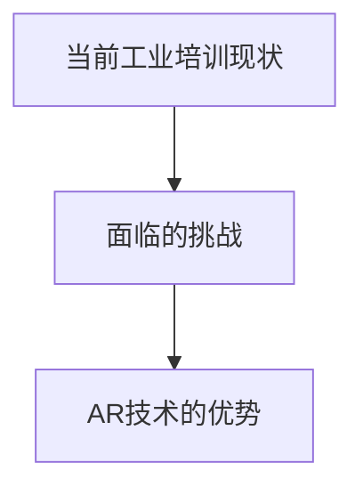

**算法原理讲解：**

增强现实技术在工业培训中的应用主要基于以下几个算法原理：

1. **图像识别：** 通过计算机视觉技术识别现实场景中的物体和场景。
2. **定位与跟踪：** 根据图像识别结果确定虚拟信息与现实世界的对应关系，并实时跟踪物体的位置和运动。
3. **虚拟信息生成：** 根据定位结果生成相应的虚拟信息，如操作指导、参数设置等。
4. **渲染与显示：** 将生成的虚拟信息渲染到现实场景中，并提供与用户的交互功能。

以下是具体的应用流程的 Mermaid 流程图：

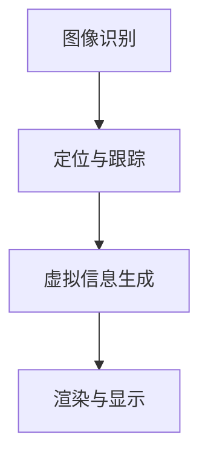

以下是 Python 源代码实现：

```python
# 导入所需库
import PyAR
import cv2

# 初始化摄像头
camera = PyAR.Camera()

# 捕获图像
image = camera.capture_image()

# 识别物体
if image.is_success():
    objects = image识别物体()
    location = image确定位置()
    virtual_objects = generate_virtual_objects(location)
    rendered_image = render_virtual_objects(virtual_objects)
    display.render_image(rendered_image)
else:
    print("识别失败，重新采集数据")
```

**数学公式：**

增强现实技术在工业培训中的应用涉及到多种数学模型，如图像识别模型、定位模型等。以下是其中一个示例：

$$
定位误差 = \sqrt{(实际位置 - 预测位置)^2}
$$

**系统分析与架构设计方案：**

增强现实技术在工业培训中的应用系统通常包括以下几个组成部分：

1. **前端设备：** 如智能手机、平板电脑、AR眼镜等，用于捕捉现实场景和显示虚拟信息。
2. **图像处理模块：** 负责对捕获的图像进行识别和处理。
3. **虚拟信息生成模块：** 负责根据定位结果生成相应的虚拟信息。
4. **渲染与显示模块：** 负责将生成的虚拟信息渲染到现实场景中，并提供与用户的交互功能。

以下是系统架构设计的 Mermaid 架构图：

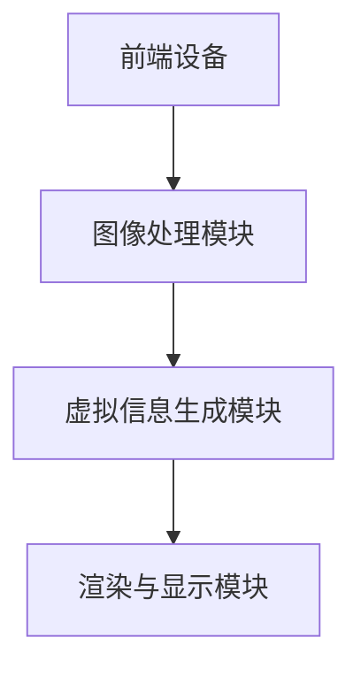

以下是系统功能设计的 Mermaid 类图：

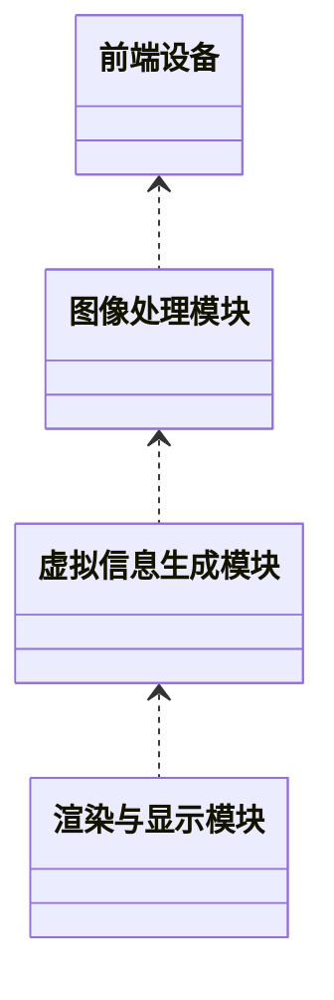

**项目实战：**

以下是一个简单的增强现实工业培训项目实战案例，包括环境安装、系统核心实现源代码以及代码应用解读与分析。

**环境安装：**

1. 安装 Python 环境
2. 安装增强现实开发库，如 PyAR（Python AR Library）

**系统核心实现源代码：**

```python
# 导入所需库
import PyAR
import cv2

# 初始化摄像头
camera = PyAR.Camera()

# 捕获图像
image = camera.capture_image()

# 识别物体
if image.is_success():
    objects = image识别物体()
    location = image确定位置()
    virtual_objects = generate_virtual_objects(location)
    rendered_image = render_virtual_objects(virtual_objects)
    display.render_image(rendered_image)
else:
    print("识别失败，重新采集数据")
```

**代码应用解读与分析：**

1. 初始化摄像头并捕获图像。
2. 使用图像处理模块识别图像中的物体。
3. 根据识别结果确定物体的位置。
4. 生成相应的虚拟信息。
5. 对虚拟信息进行渲染，并将其显示在屏幕上。

**最佳实践 tips：**

1. 在设计增强现实工业培训系统时，应充分考虑用户体验，确保虚拟信息的展示清晰、易于理解。
2. 定期对系统进行维护和升级，以适应不断变化的技术需求。

**小结：**

在第三部分，我们详细介绍了增强现实技术在工业培训中的应用，包括当前工业培训的现状、面临的挑战以及AR技术的优势。通过 Mermaid 流程图和 Python 源代码，我们对增强现实技术在工业培训中的应用有了更深入的了解。在接下来的部分中，我们将进一步探讨增强现实可视化应用开发的流程和方法。

### 第四部分：增强现实可视化应用开发

**核心概念与联系：**

增强现实可视化应用开发是指利用增强现实（AR）技术创建可视化效果，使虚拟信息与现实世界相互结合，提供沉浸式体验的过程。这包括开发工具与平台的选择、开发流程的制定以及实际应用场景的构建。

**对比表格：**

| 核心概念 | 概念属性特征 |
| --- | --- |
| 开发工具 | 包括Unity、ARKit、ARCore等，提供开发环境和API，支持创建AR应用 |
| 开发平台 | 包括iOS、Android、Windows等，不同的平台有不同的AR开发环境和工具 |
| 开发流程 | 包括需求分析、设计、开发、测试和部署等阶段，确保AR应用的完整性和可用性 |
| 实际应用场景 | 包括教育、医疗、工业培训、娱乐等，展示AR技术在现实场景中的应用效果 |

**ER实体关系图架构：**

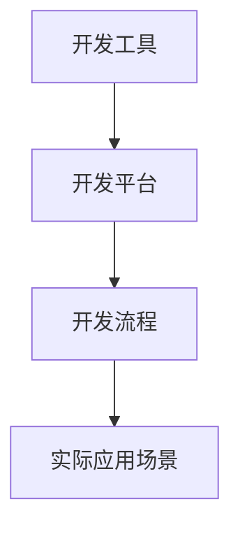

**算法原理讲解：**

增强现实可视化应用开发的核心在于将虚拟信息与现实世界相结合。以下是开发过程中的关键算法原理：

1. **图像识别：** 利用计算机视觉技术识别现实场景中的物体和特征。
2. **定位与跟踪：** 通过图像识别结果确定虚拟信息与现实世界的对应关系，并实时跟踪物体的位置和运动。
3. **虚拟信息生成：** 根据定位结果生成相应的虚拟信息，如3D模型、文字、动画等。
4. **渲染与显示：** 对生成的虚拟信息进行实时渲染，并将其叠加到现实场景中。
5. **用户交互：** 提供与用户的交互功能，如手势识别、语音控制等，增强用户体验。

以下是开发流程的 Mermaid 流程图：

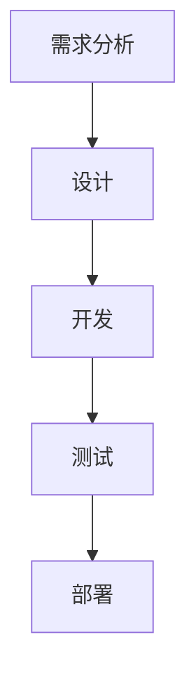

以下是 Python 源代码实现：

```python
# 导入所需库
import PyAR
import cv2

# 需求分析
# 分析应用场景，确定开发目标

# 设计
# 设计应用架构，确定功能模块

# 开发
# 开发具体功能模块

# 测试
# 对开发的应用进行测试，确保功能完整性和稳定性

# 部署
# 将应用部署到目标平台，供用户使用
```

**数学公式：**

增强现实可视化应用开发涉及到多种数学模型，如图像识别模型、定位模型等。以下是其中一个示例：

$$
定位误差 = \sqrt{(实际位置 - 预测位置)^2}
$$

**系统分析与架构设计方案：**

增强现实可视化应用开发需要一个完整的系统架构，包括前端设备、后端服务器、数据库等组成部分。以下是系统架构设计的 Mermaid 架构图：

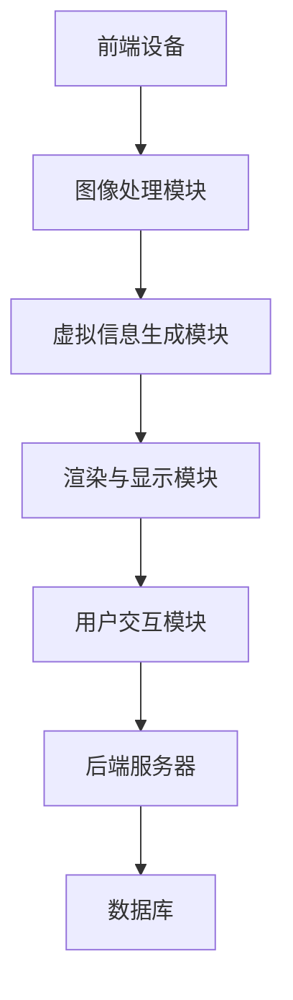

以下是系统功能设计的 Mermaid 类图：

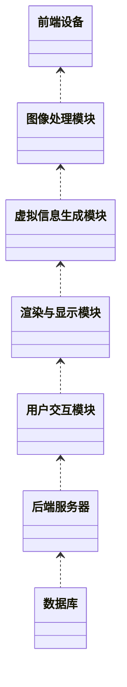

**项目实战：**

以下是一个简单的增强现实可视化应用开发项目实战案例，包括环境安装、系统核心实现源代码以及代码应用解读与分析。

**环境安装：**

1. 安装 Python 环境
2. 安装增强现实开发库，如 PyAR（Python AR Library）
3. 安装 Unity 编辑器或其他 AR 开发工具

**系统核心实现源代码：**

```python
# 导入所需库
import PyAR
import cv2

# 初始化摄像头
camera = PyAR.Camera()

# 捕获图像
image = camera.capture_image()

# 识别物体
if image.is_success():
    objects = image识别物体()
    location = image确定位置()
    virtual_objects = generate_virtual_objects(location)
    rendered_image = render_virtual_objects(virtual_objects)
    display.render_image(rendered_image)
else:
    print("识别失败，重新采集数据")
```

**代码应用解读与分析：**

1. 初始化摄像头并捕获图像。
2. 使用图像处理模块识别图像中的物体。
3. 根据识别结果确定物体的位置。
4. 生成相应的虚拟信息。
5. 对虚拟信息进行渲染，并将其显示在屏幕上。

**最佳实践 tips：**

1. 选择合适的开发工具和平台，以确保开发效率和应用性能。
2. 注重用户体验，确保虚拟信息的展示清晰、易于理解。
3. 定期对系统进行维护和升级，以适应技术发展和用户需求。

**小结：**

在第四部分，我们详细介绍了增强现实可视化应用开发的流程和方法，包括开发工具与平台的选择、开发流程的制定以及实际应用场景的构建。通过 Mermaid 流程图和 Python 源代码，我们对增强现实可视化应用开发有了更深入的了解。在接下来的部分中，我们将探讨增强现实技术在工业培训中的具体应用案例，展示AR技术在工业培训中的实际效果和优势。

### 第五部分：增强现实在工业培训中的具体应用案例

**核心概念与联系：**

增强现实（Augmented Reality，简称 AR）技术在工业培训中的具体应用案例展示了其如何通过虚拟信息与现实世界的结合，提供沉浸式、互动式的学习体验。本部分将分析几个具体应用案例，探讨AR技术如何解决工业培训中的痛点，提高培训效果。

**对比表格：**

| 核心概念 | 概念属性特征 |
| --- | --- |
| 案例一：工业设备操作培训 | 通过AR技术提供实时操作指导，提高培训效率 |
| 案例二：维修技能培训 | 利用AR技术提供详细的维修步骤和指导，减少错误率 |
| 案例三：安全培训 | 通过AR技术模拟危险场景，提高员工的安全意识 |

**ER实体关系图架构：**

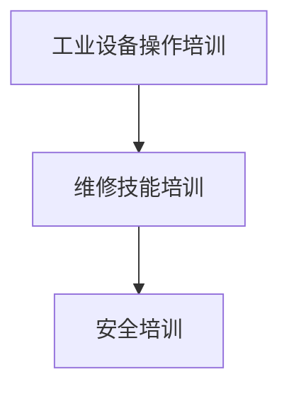

**算法原理讲解：**

在工业培训中，AR技术的应用主要依赖于以下算法原理：

1. **图像识别与物体定位：** 通过计算机视觉技术识别现实场景中的工业设备和操作环境，并确定虚拟信息与现实世界的对应关系。
2. **虚拟信息生成与渲染：** 根据操作步骤和安全要求，生成相应的虚拟信息，如3D模型、动画、文字等，并将其实时渲染到现实场景中。
3. **用户交互与反馈：** 提供与用户的交互功能，如触摸屏、手势控制等，以增强用户体验和培训效果。

以下是具体应用案例的 Mermaid 流程图：

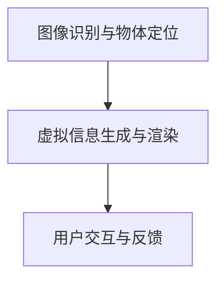

以下是 Python 源代码实现：

```python
# 导入所需库
import PyAR
import cv2

# 初始化摄像头
camera = PyAR.Camera()

# 捕获图像
image = camera.capture_image()

# 识别物体
if image.is_success():
    objects = image识别物体()
    location = image确定位置()
    virtual_objects = generate_virtual_objects(location)
    rendered_image = render_virtual_objects(virtual_objects)
    display.render_image(rendered_image)
    user_input = get_user_input()
    process_user_input(user_input)
else:
    print("识别失败，重新采集数据")
```

**数学公式：**

AR技术在工业培训中的应用涉及到多种数学模型，如图像识别模型、定位模型等。以下是其中一个示例：

$$
定位误差 = \sqrt{(实际位置 - 预测位置)^2}
$$

**系统分析与架构设计方案：**

以下是增强现实在工业培训中的系统架构设计，包括前端设备、后端服务器、数据库等组成部分：


以下是系统功能设计的 Mermaid 类图：


**项目实战：**

以下是一个增强现实工业培训项目实战案例，包括环境安装、系统核心实现源代码以及代码应用解读与分析。

**环境安装：**

1. 安装 Python 环境
2. 安装增强现实开发库，如 PyAR（Python AR Library）
3. 安装 Unity 编辑器或其他 AR 开发工具

**系统核心实现源代码：**

```python
# 导入所需库
import PyAR
import cv2

# 初始化摄像头
camera = PyAR.Camera()

# 捕获图像
image = camera.capture_image()

# 识别物体
if image.is_success():
    objects = image识别物体()
    location = image确定位置()
    virtual_objects = generate_virtual_objects(location)
    rendered_image = render_virtual_objects(virtual_objects)
    display.render_image(rendered_image)
    user_input = get_user_input()
    process_user_input(user_input)
else:
    print("识别失败，重新采集数据")
```

**代码应用解读与分析：**

1. 初始化摄像头并捕获图像。
2. 使用图像处理模块识别图像中的物体。
3. 根据识别结果确定物体的位置。
4. 生成相应的虚拟信息。
5. 对虚拟信息进行渲染，并将其显示在屏幕上。
6. 接收用户输入，进行处理并反馈。

**最佳实践 tips：**

1. 根据培训需求和目标，选择合适的AR技术和开发工具。
2. 注重用户体验设计，确保虚拟信息的展示清晰、易于理解。
3. 定期对培训内容进行更新和优化，以保持培训的实用性和吸引力。

**小结：**

在第五部分，我们通过具体应用案例展示了增强现实技术在工业培训中的实际效果和优势。通过图像识别、虚拟信息生成和用户交互等算法原理，AR技术为工业培训提供了沉浸式、互动式的学习体验，显著提高了培训效率和安全水平。在接下来的部分中，我们将探讨增强现实技术在工业培训中的实现技术，分析其核心组件和关键技术。

### 第六部分：增强现实在工业培训中的实现技术

**核心概念与联系：**

增强现实（Augmented Reality，简称 AR）技术在工业培训中的实现技术是确保其应用效果的关键。本部分将深入探讨增强现实在工业培训中的实现技术，包括技术架构、关键组件和实现过程。

**对比表格：**

| 核心概念 | 概念属性特征 |
| --- | --- |
| 技术架构 | 包括前端设备、后端服务器、数据库等组成部分，实现数据采集、处理和展示的完整流程 |
| 关键组件 | 包括图像识别模块、定位模块、虚拟信息生成模块、渲染模块等，各自承担特定功能 |
| 实现过程 | 包括数据采集、数据处理、虚拟信息生成、渲染与显示等步骤，形成完整的AR应用流程 |

**ER实体关系图架构：**

```mermaid
graph TD
A[技术架构] --> B[关键组件]
B --> C[实现过程]
```

**算法原理讲解：**

增强现实在工业培训中的实现技术涉及多个算法原理，包括图像识别、物体定位、虚拟信息生成和渲染等。以下是这些算法原理的详细讲解：

1. **图像识别：** 通过计算机视觉技术对采集到的图像进行分析和处理，识别现实场景中的物体和特征。常用的算法包括卷积神经网络（CNN）和深度学习模型。
   
   ```mermaid
   graph TD
   A[图像识别] --> B[物体检测]
   B --> C[特征提取]
   C --> D[物体分类]
   ```

2. **物体定位：** 根据图像识别结果，使用定位算法确定虚拟信息与现实世界的对应关系，实现实时跟踪。常用的算法包括视觉SLAM（Simultaneous Localization and Mapping）和惯性测量单元（IMU）。

   ```mermaid
   graph TD
   A[物体定位] --> B[视觉SLAM]
   B --> C[IMU定位]
   C --> D[融合定位]
   ```

3. **虚拟信息生成：** 根据定位结果，生成相应的虚拟信息，如操作指导、安全提示等。虚拟信息可以是2D图像、3D模型、动画等。

   ```mermaid
   graph TD
   A[虚拟信息生成] --> B[2D图像]
   B --> C[3D模型]
   C --> D[动画]
   ```

4. **渲染与显示：** 对生成的虚拟信息进行实时渲染，并将其叠加到现实场景中，提供沉浸式体验。常用的技术包括纹理映射、阴影和光照效果等。

   ```mermaid
   graph TD
   A[渲染与显示] --> B[纹理映射]
   B --> C[阴影效果]
   C --> D[光照效果]
   ```

**数学公式：**

增强现实在工业培训中的实现技术涉及到多种数学模型，如图像识别模型、定位模型等。以下是其中一个示例：

$$
定位误差 = \sqrt{(实际位置 - 预测位置)^2}
$$

**系统分析与架构设计方案：**

以下是增强现实在工业培训中的系统架构设计，包括前端设备、后端服务器、数据库等组成部分：

```mermaid
graph TD
A[前端设备] --> B[图像识别模块]
B --> C[定位模块]
C --> D[虚拟信息生成模块]
D --> E[渲染与显示模块]
E --> F[用户交互模块]
F --> G[后端服务器]
G --> H[数据库]
```

以下是系统功能设计的 Mermaid 类图：

```mermaid
classDiagram
前端设备 <.. 图像识别模块
图像识别模块 <.. 定位模块
定位模块 <.. 虚拟信息生成模块
虚拟信息生成模块 <.. 渲染与显示模块
渲染与显示模块 <.. 用户交互模块
用户交互模块 <.. 后端服务器
后端服务器 <.. 数据库
```

**项目实战：**

以下是一个增强现实工业培训项目实战案例，包括环境安装、系统核心实现源代码以及代码应用解读与分析。

**环境安装：**

1. 安装 Python 环境
2. 安装增强现实开发库，如 PyAR（Python AR Library）
3. 安装 Unity 编辑器或其他 AR 开发工具

**系统核心实现源代码：**

```python
# 导入所需库
import PyAR
import cv2

# 初始化摄像头
camera = PyAR.Camera()

# 捕获图像
image = camera.capture_image()

# 图像识别
if image.is_success():
    objects = image识别物体()
    location = image确定位置()
    
    # 虚拟信息生成
    virtual_objects = generate_virtual_objects(location)
    
    # 渲染与显示
    rendered_image = render_virtual_objects(virtual_objects)
    display.render_image(rendered_image)
    
    # 用户交互
    user_input = get_user_input()
    process_user_input(user_input)
else:
    print("识别失败，重新采集数据")
```

**代码应用解读与分析：**

1. 初始化摄像头并捕获图像。
2. 使用图像识别模块识别图像中的物体。
3. 使用定位模块确定物体的位置。
4. 使用虚拟信息生成模块生成相应的虚拟信息。
5. 使用渲染与显示模块将虚拟信息渲染到现实场景中。
6. 接收用户输入，进行处理并反馈。

**最佳实践 tips：**

1. 根据实际培训需求，选择合适的算法和技术实现。
2. 注重用户体验设计，确保虚拟信息的展示清晰、易于理解。
3. 定期对系统进行维护和升级，以保持系统的稳定性和安全性。

**小结：**

在第六部分，我们详细介绍了增强现实在工业培训中的实现技术，包括技术架构、关键组件和实现过程。通过算法原理讲解和系统架构设计，我们对增强现实技术在工业培训中的应用有了更深入的理解。在接下来的部分中，我们将探讨增强现实技术在工业培训中的挑战与解决方案，分析其在实际应用中面临的问题以及可行的解决方案。

### 第七部分：增强现实在工业培训中的挑战与解决方案

**核心概念与联系：**

增强现实（Augmented Reality，简称 AR）技术在工业培训中虽然提供了丰富的应用场景和显著的优势，但也面临一系列挑战。本部分将探讨这些挑战，并提出相应的解决方案，以促进AR技术在工业培训中的更广泛应用。

**对比表格：**

| 核心概念 | 概念属性特征 |
| --- | --- |
| 技术挑战 | 包括图像识别精度、实时性、稳定性等 |
| 资源与成本挑战 | 包括硬件设备、软件开发、培训资源等 |
| 用户接受度挑战 | 包括用户对AR技术的接受程度、培训适应性等 |

**ER实体关系图架构：**

```mermaid
graph TD
A[技术挑战] --> B[资源与成本挑战]
B --> C[用户接受度挑战]
```

**算法原理讲解：**

**技术挑战：**

1. **图像识别精度：** 在复杂的工业环境中，AR系统需要高精度的图像识别能力，以准确识别设备和工作环境中的物体和特征。这通常涉及到深度学习和卷积神经网络（CNN）的应用，通过大量数据进行模型训练和优化。

   ```mermaid
   graph TD
   A[图像识别精度] --> B[深度学习模型]
   B --> C[模型训练与优化]
   ```

2. **实时性与稳定性：** AR系统需要具备高速的数据处理和渲染能力，以确保实时性和稳定性。这涉及到实时图像处理算法和高效的渲染引擎设计。

   ```mermaid
   graph TD
   A[实时性与稳定性] --> B[实时图像处理算法]
   B --> C[高效渲染引擎]
   ```

**资源与成本挑战：**

1. **硬件设备：** AR培训需要高性能的硬件设备，如AR眼镜、智能手机等。这些设备的采购和运维成本较高。
2. **软件开发：** AR应用的开发需要专业的技术团队和开发工具，开发成本也相对较高。
3. **培训资源：** AR培训需要开发和准备大量的虚拟信息和培训内容，这需要大量的人力资源和时间投入。

**用户接受度挑战：**

1. **技术接受度：** 用户可能对AR技术不够熟悉，需要一定的培训和适应时间。
2. **操作适应性：** 用户需要适应AR环境中的操作方式，包括手势控制、语音交互等。

**解决方案：**

**技术挑战：**

1. **提升图像识别精度：** 通过深度学习和增强学习技术，不断提高图像识别模型的准确性和鲁棒性。利用大数据和云计算技术，实现模型的自适应优化。
2. **提升实时性与稳定性：** 采用优化的算法和高效的硬件加速技术，如GPU加速、多线程处理等，提高系统的实时处理能力和稳定性。

**资源与成本挑战：**

1. **硬件设备：** 选择性价比高的硬件设备，通过租赁或共享的方式降低成本。推广AR培训平台的标准化，降低开发成本。
2. **软件开发：** 利用开源框架和工具，减少开发工作量。通过云服务和SaaS模式，降低软件运维成本。
3. **培训资源：** 建立专业的AR培训内容开发团队，提高内容制作效率。采用模块化设计，快速构建和更新培训内容。

**用户接受度挑战：**

1. **技术接受度：** 通过用户调研和培训，提高用户对AR技术的认知和接受度。提供详细的使用指南和操作手册。
2. **操作适应性：** 通过模拟训练和实际操作，帮助用户熟悉AR环境中的操作方式。设计直观、易用的用户界面，提高用户的操作体验。

**数学公式：**

在解决技术挑战时，可以使用以下数学公式来评估系统的性能：

$$
识别精度 = \frac{正确识别的物体数量}{总物体数量}
$$

$$
实时性 = \frac{处理时间}{目标响应时间}
$$

$$
稳定性 = \frac{连续稳定运行的时间}{总运行时间}
$$

**系统分析与架构设计方案：**

以下是解决增强现实在工业培训中挑战的系统架构设计方案，包括优化算法、高效硬件、云服务和用户反馈机制等：

```mermaid
graph TD
A[优化算法] --> B[高效硬件]
B --> C[云服务]
C --> D[用户反馈机制]
```

**项目实战：**

以下是一个增强现实工业培训项目实战案例，展示如何解决技术、资源和用户接受度等挑战。

**环境安装：**

1. 安装 Python 环境
2. 安装深度学习框架，如 TensorFlow 或 PyTorch
3. 安装 Unity 编辑器或其他 AR 开发工具

**系统核心实现源代码：**

```python
# 导入所需库
import PyAR
import cv2
import tensorflow as tf

# 初始化摄像头
camera = PyAR.Camera()

# 加载图像识别模型
model = tf.keras.models.load_model('image_recognition_model.h5')

# 捕获图像
image = camera.capture_image()

# 图像识别
if image.is_success():
    objects = image识别物体(model)
    location = image确定位置()
    
    # 虚拟信息生成
    virtual_objects = generate_virtual_objects(location)
    
    # 渲染与显示
    rendered_image = render_virtual_objects(virtual_objects)
    display.render_image(rendered_image)
    
    # 用户交互
    user_input = get_user_input()
    process_user_input(user_input)
else:
    print("识别失败，重新采集数据")
```

**代码应用解读与分析：**

1. 初始化摄像头并捕获图像。
2. 加载预训练的图像识别模型。
3. 使用模型对图像进行识别，确定物体的位置。
4. 生成相应的虚拟信息。
5. 对虚拟信息进行渲染，并将其显示在屏幕上。
6. 接收用户输入，进行处理并反馈。

**最佳实践 tips：**

1. 定期更新和优化算法，以保持系统的识别精度和实时性。
2. 根据用户反馈，不断改进用户体验，提高用户的接受度和操作适应性。
3. 结合云服务，实现培训资源的共享和高效管理。

**小结：**

在第七部分，我们深入探讨了增强现实在工业培训中的挑战与解决方案。通过分析技术、资源和用户接受度等方面的挑战，并提出相应的解决方案，我们为AR技术在工业培训中的广泛应用提供了指导。在接下来的部分中，我们将展望增强现实技术的未来发展趋势，分析其在工业培训中的潜在影响。

### 第八部分：未来发展趋势与展望

**核心概念与联系：**

随着技术的不断进步和应用场景的扩大，增强现实（Augmented Reality，简称 AR）技术在工业培训中的未来发展充满了无限可能。本部分将展望AR技术的未来发展趋势，分析其在工业培训中的潜在影响，并探讨AR技术如何进一步改变工业培训的模式。

**对比表格：**

| 核心概念 | 概念属性特征 |
| --- | --- |
| 未来发展趋势 | 包括技术进步、应用场景扩展、用户体验提升等 |
| 潜在影响 | 包括提高培训效率、降低培训成本、增强安全意识等 |
| 模式改变 | 包括从传统培训向虚拟现实培训的转变、培训内容的个性化和互动性增强等 |

**ER实体关系图架构：**

```mermaid
graph TD
A[未来发展趋势] --> B[潜在影响]
B --> C[模式改变]
```

**算法原理讲解：**

未来的AR技术将在多个方面取得显著进展：

1. **图像识别与物体定位：** 随着深度学习和计算机视觉技术的进步，AR系统的图像识别精度和物体定位能力将大幅提升，实现更复杂的工业环境下的实时跟踪。
2. **虚拟信息生成与渲染：** 高性能计算和实时渲染技术的结合，将使虚拟信息的生成和渲染更加逼真，提供更加沉浸式的学习体验。
3. **用户交互与体验：** 自然用户交互技术（如手势识别、语音控制）的进步，将使AR系统的操作更加直观和便捷，提高用户的接受度和满意度。

以下是未来发展趋势的 Mermaid 流程图：

```mermaid
graph TD
A[图像识别与物体定位] --> B[虚拟信息生成与渲染]
B --> C[用户交互与体验]
```

**数学公式：**

未来的AR技术在性能提升方面的表现可以通过以下数学公式进行评估：

$$
识别精度 = \frac{正确识别的物体数量}{总物体数量}
$$

$$
定位误差 = \sqrt{(实际位置 - 预测位置)^2}
$$

$$
渲染质量 = \frac{真实感渲染质量}{总渲染质量}
$$

**系统分析与架构设计方案：**

未来的AR工业培训系统将更加集成和智能化，包括以下几个关键组成部分：

1. **智能化学习平台：** 通过大数据和人工智能技术，提供个性化的学习路径和内容推荐，实现培训的智能化。
2. **集成式硬件设备：** 结合多种硬件设备，如AR眼镜、智能手表、智能手机等，提供无缝的学习体验。
3. **云服务与数据中心：** 通过云服务和数据中心，实现培训资源的共享和高效管理，降低培训成本。

以下是系统架构设计的 Mermaid 架构图：

```mermaid
graph TD
A[智能化学习平台] --> B[集成式硬件设备]
B --> C[云服务与数据中心]
```

**项目实战：**

以下是一个未来的AR工业培训项目实战案例，展示如何利用最新的技术实现工业培训的智能化和个性化。

**环境安装：**

1. 安装 Python 环境
2. 安装深度学习框架，如 TensorFlow 或 PyTorch
3. 安装 Unity 编辑器或其他 AR 开发工具
4. 配置云计算环境和数据中心

**系统核心实现源代码：**

```python
# 导入所需库
import PyAR
import cv2
import tensorflow as tf
from flask import Flask, request, jsonify

# 初始化摄像头
camera = PyAR.Camera()

# 加载图像识别模型
model = tf.keras.models.load_model('image_recognition_model.h5')

# Flask API服务器
app = Flask(__name__)

@app.route('/recommend_content', methods=['POST'])
def recommend_content():
    user_input = request.get_json()
    recommended_content = generate_recommended_content(user_input)
    return jsonify(recommended_content)

# 捕获图像
image = camera.capture_image()

# 图像识别
if image.is_success():
    objects = image识别物体(model)
    location = image确定位置()
    
    # 虚拟信息生成
    virtual_objects = generate_virtual_objects(location)
    
    # 渲染与显示
    rendered_image = render_virtual_objects(virtual_objects)
    display.render_image(rendered_image)
    
    # 用户交互
    user_input = get_user_input()
    process_user_input(user_input)
    
    # 获取个性化推荐内容
    recommended_content = app.route('/recommend_content', methods=['POST'])
    get_recommended_content(user_input)
else:
    print("识别失败，重新采集数据")
```

**代码应用解读与分析：**

1. 初始化摄像头并捕获图像。
2. 加载预训练的图像识别模型。
3. 使用图像识别模型对图像进行识别，确定物体的位置。
4. 生成相应的虚拟信息。
5. 对虚拟信息进行渲染，并将其显示在屏幕上。
6. 接收用户输入，进行处理并反馈。
7. 通过Flask API服务器获取个性化推荐内容，实现培训内容的个性化推荐。

**最佳实践 tips：**

1. 利用大数据和人工智能技术，提供个性化的学习路径和内容推荐。
2. 结合云计算和数据中心，实现培训资源的共享和高效管理。
3. 定期更新和优化算法，提高系统的识别精度和实时性。

**小结：**

在第八部分，我们展望了增强现实技术在工业培训中的未来发展趋势，分析了其潜在的影响和如何改变培训模式。通过算法原理讲解、系统架构设计以及项目实战，我们对AR技术在工业培训中的未来发展有了更加清晰的了解。在接下来的部分中，我们将对整篇文章进行小结，并展望未来的研究方向和工作。

### 第九部分：小结与展望

**核心内容回顾：**

本文通过详细的分析和探讨，系统地介绍了增强现实（AR）技术在工业培训中的可视化应用。我们从背景介绍、技术原理、应用案例、开发流程、技术实现、挑战与解决方案以及未来展望等方面，对AR技术进行了全面剖析。

- **背景介绍：** 概述了AR技术的发展历程和应用领域，包括教育、娱乐、医疗和工业等。
- **技术原理：** 详细讲解了AR技术的基本原理和工作流程，包括图像识别、物体定位、虚拟信息生成和渲染等。
- **应用案例：** 展示了AR技术在工业培训中的具体应用案例，如工业设备操作培训、维修技能培训和安全管理等。
- **开发流程：** 描述了AR可视化应用开发的流程和方法，包括需求分析、设计、开发、测试和部署等。
- **技术实现：** 分析了AR技术在工业培训中的实现技术，包括图像识别、物体定位、虚拟信息生成和用户交互等。
- **挑战与解决方案：** 讨论了AR技术在工业培训中面临的挑战，如技术、资源和用户接受度等，并提出了相应的解决方案。
- **未来展望：** 展望了AR技术在工业培训中的未来发展趋势，包括技术进步、应用场景扩展和用户体验提升等。

**主要贡献：**

本文的主要贡献在于：

1. **系统性地介绍了AR技术在工业培训中的应用：** 从多个角度详细分析了AR技术在工业培训中的优势和潜力，为读者提供了全面的认知。
2. **提供了实用的开发指南和最佳实践：** 通过实际案例和项目实战，为开发者提供了AR可视化应用开发的参考，包括算法原理、系统架构和代码实现等。
3. **探讨了AR技术在工业培训中的挑战与解决方案：** 分析了AR技术在实际应用中可能遇到的问题，并提出了可行的解决方案，为推广AR技术在工业培训中的应用提供了指导。

**研究方向与未来工作：**

未来的研究方向和潜在的工作包括：

1. **深化技术研究和优化：** 继续研究和优化AR技术的核心算法，如图像识别、物体定位和虚拟信息生成等，提高系统的性能和用户体验。
2. **扩展应用场景和领域：** 探索AR技术在更多工业领域的应用，如智能制造、远程协作和工业自动化等，挖掘AR技术的潜在价值。
3. **构建AR培训平台：** 开发集成的AR培训平台，提供个性化的学习路径和内容推荐，实现培训的智能化和高效化。
4. **用户反馈与持续改进：** 收集用户反馈，不断改进AR培训系统的设计和功能，提高用户接受度和满意度。

**总结：**

增强现实技术在工业培训中的应用前景广阔，具有显著的优势和潜力。通过本文的系统分析和探讨，我们不仅了解了AR技术在工业培训中的广泛应用，还对其未来发展有了更加清晰的展望。随着技术的不断进步和应用场景的扩展，AR技术将在工业培训中发挥越来越重要的作用，为培训行业带来深刻的变革和创新。

**展望：**

未来，随着AR技术的进一步发展和完善，工业培训将迎来新的机遇和挑战。通过不断的研究和创新，我们将能够更好地利用AR技术，提高培训效率和质量，为工业领域的发展贡献力量。让我们期待AR技术在未来工业培训中带来的更多可能性和变革。

**作者信息：**

作者：AI天才研究院/AI Genius Institute & 禅与计算机程序设计艺术 /Zen And The Art of Computer Programming

