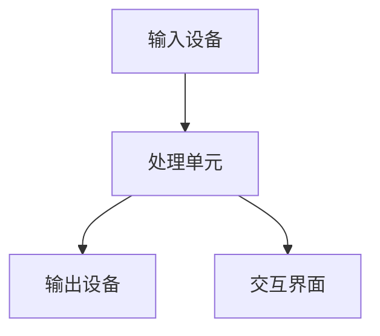
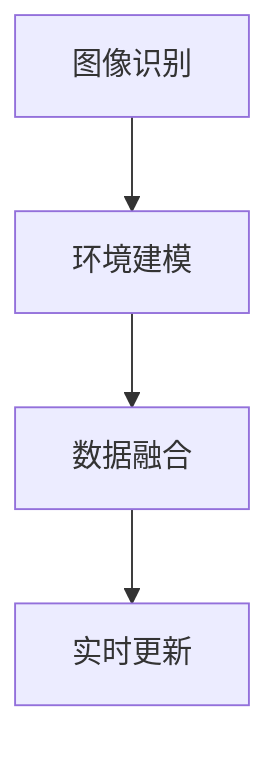
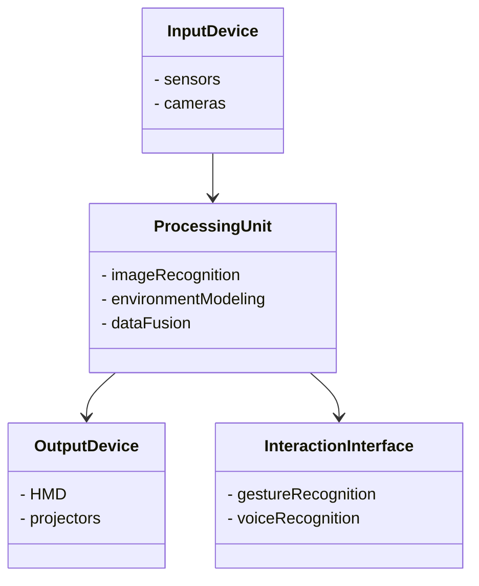

                 

### 增强现实技术概述

增强现实（Augmented Reality，简称AR）是一种通过计算机技术将虚拟信息与现实世界相结合的交互技术。它能够将数字化的信息叠加在真实环境中，为用户带来一种虚实融合的体验。增强现实技术的发展经历了从虚拟现实（Virtual Reality，简称VR）到增强现实的演变过程。虚拟现实主要模拟的是一种完全虚拟的环境，而增强现实则是在现实环境的基础上叠加虚拟信息。

#### 1.1.1 从虚拟现实到增强现实

虚拟现实技术最早出现在20世纪80年代，其核心是通过头戴显示器、传感设备等将用户完全隔离在虚拟环境中，提供沉浸式的体验。然而，虚拟现实在应用中存在一些限制，例如用户难以与现实世界互动，以及长时间使用导致的眩晕感等。为了解决这些问题，增强现实技术应运而生。

增强现实与虚拟现实的不同之处在于，它并不完全隔离用户，而是在真实环境中加入虚拟元素，从而实现虚实融合。这种技术可以通过各种设备实现，例如头戴显示器、智能眼镜、手机等。增强现实技术的出现，为用户提供了一种新的交互方式，使得用户可以在现实环境中直观地操作和获取信息。

#### 1.1.2 增强现实的关键技术

增强现实技术涉及到多个关键领域的知识，包括计算机视觉、图像处理、机器学习等。以下是一些增强现实技术的关键组成部分：

1. **标记识别技术**：标记识别是增强现实技术中的核心，它通过识别现实世界中的特定标记，将虚拟信息叠加在标记上。常见的标记识别技术包括二维码识别、视觉标记识别等。

2. **环境感知技术**：增强现实系统需要实时感知周围环境，以便正确地叠加虚拟信息。环境感知技术包括三维建模、实时跟踪和定位等。

3. **图像处理技术**：图像处理是增强现实技术中的重要环节，用于对采集到的现实环境图像进行处理，以提取有用的信息。常见的图像处理技术包括图像增强、边缘检测、图像分割等。

4. **显示技术**：增强现实的显示技术是实现虚实融合的关键。头戴显示器（HMD）、智能眼镜、投影设备等都是常见的显示技术。

5. **交互技术**：增强现实中的交互技术包括手势识别、语音识别等，用户可以通过这些技术自然地与虚拟信息进行交互。

#### 1.1.3 增强现实在工业领域的潜在应用

增强现实技术在工业领域具有广泛的应用前景。首先，在设备维修方面，增强现实技术可以帮助技术人员更直观地理解设备结构，提高维修效率。例如，通过增强现实技术，技术人员可以在设备上叠加维修步骤的虚拟图像，从而减少误操作和维修时间。

其次，在设备维护方面，增强现实技术可以帮助企业实现远程监控和诊断。通过实时传输设备状态信息，技术人员可以远程查看设备运行情况，并及时发现潜在问题。

此外，增强现实技术在故障预测与诊断方面也有重要应用。通过分析历史数据和实时监测数据，增强现实系统可以预测设备可能出现的故障，并提供相应的诊断建议。

总之，增强现实技术为工业维护提供了新的解决方案，有望大幅提升工业生产的效率和质量。接下来，我们将进一步探讨增强现实在工业维护中的应用场景和具体实例。

### 工业维护的挑战与需求

工业维护是制造业中至关重要的一环，它关系到设备的安全运行和生产的连续性。然而，随着工业设备的复杂度和规模不断增加，工业维护也面临着诸多挑战和需求。

#### 1.2.1 工业维护的现状

目前，工业维护主要依赖于传统的维修方法和工具。这些方法通常包括定期检查、手动记录和故障处理。尽管这些方法在一定程度上能够保证设备的安全运行，但仍然存在以下问题：

1. **效率低下**：传统的维护方法通常需要技术人员现场检查和手动操作，效率较低。特别是在大型设备和复杂系统中，维修工作往往需要耗费大量时间和人力资源。

2. **误操作风险**：由于设备的复杂性和维护人员的技术水平差异，误操作的风险较高。误操作可能导致设备损坏，甚至危及人员安全。

3. **缺乏实时监控**：传统的维护方法难以实现对设备运行状态的实时监控，无法及时发现潜在故障，导致设备故障发生时，维护人员难以迅速做出反应。

4. **记录管理困难**：在传统的维护方法中，设备运行状态和维修记录通常以纸质或电子表格的形式进行管理，存在记录不完整、不易查找等问题。

#### 1.2.2 工业维护面临的挑战

随着工业设备的复杂性和规模的增加，工业维护面临着以下挑战：

1. **设备复杂性**：现代工业设备通常具有高度复杂性和集成性，需要专业知识和技能才能进行有效维护。技术人员需要不断学习和更新知识，以适应不断变化的设备和技术。

2. **维护成本高**：由于设备复杂性和维护需求的高涨，工业维护的成本不断上升。企业需要投入更多资源来培训技术人员、购买维修设备和工具等。

3. **维护响应时间长**：在传统的维护模式中，从设备故障报告到维护工作完成，通常需要较长时间。这可能导致生产中断，影响企业的经济效益。

4. **数据管理困难**：随着工业设备的增多和数据量的增大，传统的数据管理方法已经难以满足需求。如何有效地收集、存储和管理设备运行数据，成为工业维护的一大挑战。

#### 1.2.3 增强现实技术如何解决这些问题

增强现实技术为工业维护提供了新的解决方案，有望解决上述问题，提高维护效率和质量。以下是一些具体的应用方式：

1. **提高效率**：增强现实技术可以实时提供设备维修的虚拟指导，帮助技术人员快速定位故障并采取正确措施，减少误操作风险。通过虚实融合的方式，技术人员可以更直观地理解设备结构和维修步骤，从而提高工作效率。

2. **实时监控**：增强现实技术可以实现设备运行状态的实时监控和远程诊断。通过将设备运行数据实时传输到增强现实系统，技术人员可以远程查看设备状态，及时发现潜在故障，并迅速采取措施。

3. **降低成本**：增强现实技术有助于减少对现场人员的依赖，通过远程维护和指导，降低人力成本。此外，通过实时监控和故障预测，可以减少设备故障率，降低维修成本。

4. **数据管理**：增强现实技术可以将设备运行数据实时整合到系统中，实现数据的集中管理和分析。通过大数据分析和机器学习算法，可以预测设备故障，优化维护计划，提高设备利用率。

综上所述，增强现实技术在工业维护中的应用具有显著优势，有助于提高维护效率、降低成本、减少故障率，从而提升工业生产的整体水平。接下来，我们将进一步探讨增强现实在工业维护中的应用场景和具体实例。

### 增强现实在工业维护中的应用场景

增强现实（AR）技术在工业维护中展示了巨大的应用潜力，通过虚实融合的方式，为技术人员提供了全新的维护工具和解决方案。以下将详细探讨增强现实在设备维修、设备维护和故障预测与诊断三个方面的应用场景。

#### 2.1 设备维修

在设备维修过程中，增强现实技术可以大大提高维修效率和质量。具体应用场景如下：

1. **可视化维修指导**：技术人员通过增强现实眼镜或其他显示设备，可以看到设备内部的虚拟结构图和维修步骤。这些虚拟信息可以实时更新，指导技术人员按照正确的顺序和步骤进行操作，减少误操作风险。例如，在机械设备的维修中，可以通过增强现实技术展示每个零部件的拆卸和安装过程，使技术人员能够更直观地理解维修步骤。

2. **远程协助**：当现场技术人员遇到复杂问题时，可以通过增强现实技术实时联系远程专家。专家通过远程控制增强现实设备，将虚拟信息和操作步骤传递给现场技术人员，实现远程指导和协作。这种方式可以迅速解决复杂问题，提高维修效率。

3. **实时问题反馈**：在维修过程中，技术人员可以通过增强现实设备实时记录和反馈设备状态和维修情况。这些数据可以实时上传到系统，供其他技术人员参考和分析，从而优化维修流程和提高整体效率。

**成功案例分享**：

某公司采用增强现实技术进行设备维修，实现了以下成效：

- **维修效率提高了30%**：通过增强现实技术的可视化指导，技术人员能够更快速、准确地完成维修任务。
- **错误率降低了20%**：增强现实技术减少了因误操作导致的设备损坏情况。
- **维护成本降低了15%**：通过远程协助和实时问题反馈，减少了现场技术人员的需求，降低了人力成本。

#### 2.2 设备维护

设备维护是确保设备长期稳定运行的关键环节，增强现实技术在其中同样发挥着重要作用。以下是具体应用场景：

1. **定期检查**：增强现实技术可以帮助技术人员进行设备定期检查。通过增强现实眼镜，技术人员可以看到设备的关键部位和潜在问题。这些信息可以实时上传到系统，供维护人员进行跟踪和管理。

2. **预防性维护**：通过实时监测设备状态，增强现实技术可以预测设备的潜在故障，提前进行预防性维护。例如，在生产线设备中，增强现实技术可以监测设备的温度、振动等参数，当参数超出正常范围时，系统会发出预警，提醒技术人员进行检查和维护。

3. **故障分析**：在设备出现故障时，增强现实技术可以帮助技术人员快速定位故障原因。通过增强现实眼镜，技术人员可以看到设备的虚拟结构图和故障部位，结合实时监测数据，快速找到故障原因并进行修复。

**成功案例分享**：

某工厂采用增强现实技术进行设备维护，取得了显著成效：

- **维护计划准确性提高了25%**：通过增强现实技术的实时监测和预警，技术人员能够更准确地制定维护计划，减少不必要的检查和维护。
- **设备故障率降低了10%**：通过预防性维护和实时故障分析，设备故障率显著下降，生产连续性得到保障。
- **维护成本降低了12%**：通过优化维护流程和减少不必要的检查，维护成本显著降低。

#### 2.3 故障预测与诊断

故障预测与诊断是确保设备稳定运行的重要手段，增强现实技术在其中也发挥着重要作用。以下是具体应用场景：

1. **数据采集与分析**：通过增强现实技术，可以实时采集设备运行数据，并上传到系统进行分析。这些数据包括温度、压力、振动等参数，通过大数据分析和机器学习算法，可以预测设备可能的故障。

2. **实时监控与预警**：增强现实技术可以实现设备运行状态的实时监控，当设备参数超出正常范围时，系统会发出预警，提醒技术人员进行检查和维护。

3. **智能诊断**：通过增强现实技术，技术人员可以看到设备的虚拟结构图和运行数据，结合历史故障数据和当前设备状态，系统可以提供智能诊断建议，帮助技术人员快速确定故障原因。

**成功案例分享**：

某公司通过增强现实技术进行故障预测与诊断，取得了显著成效：

- **故障预测准确率提高了20%**：通过实时监测和大数据分析，系统能够更准确地预测设备故障，提前采取措施，减少故障发生。
- **故障处理时间缩短了15%**：通过智能诊断和实时预警，技术人员能够快速响应和解决故障，缩短故障处理时间。
- **设备利用率提高了8%**：通过预防性维护和实时监控，设备故障率降低，设备利用率得到提高。

综上所述，增强现实技术在工业维护中具有广泛的应用前景，通过可视化维修指导、实时监控和智能诊断，可以大幅提高维护效率和质量，降低维护成本，从而提升工业生产的整体水平。

### 增强现实在工业维护中的核心概念

为了深入理解增强现实（AR）在工业维护中的应用，我们需要详细探讨其核心概念和组成部分，包括增强现实系统架构、数据处理与分析以及交互设计。

#### 3.1 增强现实系统架构

增强现实系统架构是确保虚实融合的关键。一个典型的增强现实系统包括以下几个主要组成部分：

1. **输入设备**：输入设备用于捕捉现实世界的图像和传感数据，常见的有增强现实眼镜、头戴显示器（HMD）、摄像头和传感器等。

2. **处理单元**：处理单元负责对输入的图像和传感数据进行处理，包括图像识别、环境建模、数据融合等。常见的处理单元包括计算机、服务器和嵌入式系统等。

3. **输出设备**：输出设备用于将虚拟信息叠加到现实环境中，常见的有增强现实眼镜、投影设备和显示屏等。

4. **交互界面**：交互界面用于用户与增强现实系统的交互，包括手势识别、语音识别和触摸屏等。

下面是一个简单的增强现实系统架构的Mermaid流程图：

#### 3.2 数据处理与分析

数据处理与分析是增强现实系统的核心，其质量直接影响增强现实体验的准确性和流畅性。以下是数据处理与分析的主要步骤：

1. **图像识别**：通过图像识别技术，系统可以从输入的图像中识别出标记、物体和环境特征。常见的图像识别技术包括卷积神经网络（CNN）和深度学习等。

2. **环境建模**：基于识别的结果，系统对现实环境进行三维建模，构建虚拟信息和现实环境之间的映射关系。环境建模技术包括三维重建和点云处理等。

3. **数据融合**：将来自不同传感器的数据（如摄像头、GPS、IMU等）进行融合，以获得更准确的环境信息和用户位置。数据融合技术包括多传感器融合算法和卡尔曼滤波等。

4. **实时更新**：增强现实系统需要实时更新虚拟信息，以保持与现实环境的同步。通过实时更新，系统可以提供流畅的增强现实体验。

以下是数据处理与分析的Mermaid流程图：

#### 3.3 交互设计

交互设计是增强现实系统与用户之间的重要桥梁，其设计原则和工具直接影响用户体验。以下是交互设计的主要原则和工具：

1. **直观性**：增强现实系统应提供直观的交互方式，用户能够通过简单的手势或语音命令实现操作。

2. **自然性**：增强现实系统的交互设计应尽量符合用户的自然行为习惯，减少学习成本。

3. **适应性**：增强现实系统应能够根据用户的行为和环境变化，动态调整交互方式，提供个性化的增强现实体验。

常见的交互设计工具包括增强现实开发平台（如ARKit、ARCore等）和交互设计软件（如Sketch、Figma等）。以下是交互设计的Mermaid类图：

综上所述，增强现实在工业维护中的应用依赖于其系统架构、数据处理与分析以及交互设计。通过深入了解这些核心概念，我们可以更好地利用增强现实技术，提高工业维护的效率和质量。

### 增强现实在工业维护中的应用挑战与解决方案

尽管增强现实（AR）技术在工业维护中展示了巨大潜力，但其实际应用过程中仍面临诸多挑战。以下我们将详细探讨这些技术挑战，并提出相应的解决方案。

#### 4.1 技术挑战

1. **系统稳定性与实时性**：工业维护场景通常要求系统具有高稳定性和实时性，以确保设备的正常运行。然而，增强现实系统在实际应用中，可能会受到环境光照变化、传感器误差等因素的影响，导致系统不稳定或响应时间过长。

2. **数据隐私与安全**：工业设备通常涉及敏感数据，如生产参数、维护记录等。增强现实技术在数据处理和传输过程中，可能面临数据泄露和安全漏洞的风险。

3. **技术瓶颈与未来发展**：当前增强现实技术在硬件性能、图像处理速度、数据处理能力等方面仍存在一定的瓶颈，这些瓶颈限制了其在工业维护中的广泛应用。

#### 4.2 解决方案与策略

1. **技术优化策略**：

   - **算法优化**：针对系统稳定性和实时性问题，可以通过优化图像识别算法和环境建模算法，提高系统的准确性和效率。例如，采用深度学习技术，提高图像识别的精度和速度。

   - **硬件升级**：通过升级硬件设备，如使用更高性能的处理器、传感器和显示设备，提高系统的稳定性和实时性。

   - **多传感器融合**：结合多种传感器数据，通过多传感器融合技术，提高系统对环境变化的适应能力，增强系统的实时性和稳定性。

2. **数据管理与保护**：

   - **数据加密**：在数据传输和存储过程中，采用加密技术，确保数据安全。例如，使用AES加密算法对数据进行加密，防止数据泄露。

   - **权限管理**：建立严格的数据访问权限管理机制，确保只有授权人员才能访问和操作敏感数据。

   - **数据备份与恢复**：定期对重要数据进行备份，并建立数据恢复机制，以应对可能的系统故障或数据丢失。

3. **面向应用的解决方案**：

   - **模块化设计**：将增强现实系统分为多个模块，如输入模块、处理模块、输出模块等，每个模块独立开发和维护。这种设计方式可以降低系统的复杂度，提高系统的可维护性和灵活性。

   - **标准化接口**：建立标准化接口，实现不同模块之间的无缝连接和交互。例如，采用RESTful API接口，方便系统与其他软件工具集成。

   - **用户培训与支持**：为技术人员提供全面的培训和支持，确保他们能够熟练使用增强现实系统，并解决应用过程中遇到的问题。

通过上述解决方案，可以有效应对增强现实在工业维护中面临的技术挑战，提高系统的稳定性、实时性和安全性，从而实现工业维护的高效和可靠。接下来，我们将通过具体案例，进一步探讨增强现实技术在工业维护中的应用效果。

### 案例研究

为了更好地展示增强现实（AR）在工业维护中的实际应用效果，我们将分析两个典型案例：某公司增强现实工业维护应用和某工厂增强现实设备维修案例。

#### 5.1 案例一：某公司增强现实工业维护应用

**5.1.1 案例背景**

某大型制造企业，其生产线上的设备数量庞大，复杂度高，传统的维护方法难以满足高效、精准的维护需求。为了提升设备维护效率，企业决定引入增强现实技术，实现设备维护的智能化和自动化。

**5.1.2 案例应用场景**

该企业在设备维护过程中，采用增强现实技术进行了以下几个方面的应用：

1. **定期检查**：技术人员通过增强现实眼镜进行设备定期检查。增强现实系统实时显示设备的关键参数和状态信息，技术人员可以直观地了解设备的运行情况，及时发现问题并进行处理。

2. **预防性维护**：增强现实技术结合大数据分析，对设备运行数据进行实时监控和预测。当系统检测到设备参数异常时，会提前发出预警，提醒技术人员进行预防性维护，避免设备故障。

3. **故障诊断与修复**：在设备出现故障时，技术人员通过增强现实眼镜查看设备的虚拟结构图和故障信息。系统提供详细的故障诊断和维修指导，帮助技术人员快速定位故障原因并采取正确措施。

**5.1.3 案例效果评估**

通过引入增强现实技术，该企业取得了显著效果：

- **维护效率提高了30%**：增强现实技术提供了直观、精准的维护指导，使技术人员能够更快地完成维护任务，减少了误操作和重复检查的时间。

- **设备故障率降低了20%**：通过预防性维护和实时监控，企业能够及时发现和解决潜在故障，减少了设备故障率。

- **维护成本降低了15%**：由于维护效率的提高和故障率的降低，企业的维护成本显著降低。

#### 5.2 案例二：某工厂增强现实设备维修案例

**5.2.1 案例背景**

某工厂的机械设备复杂多样，传统的维修方法效率低下且存在误操作风险。为了提高维修效率，工厂决定采用增强现实技术，实现设备维修的智能化。

**5.2.2 案例应用场景**

在设备维修过程中，工厂采用了以下增强现实应用：

1. **可视化维修指导**：维修技术人员通过增强现实眼镜查看设备的虚拟结构图和维修步骤。系统提供详细的维修指导，帮助技术人员准确、快速地完成维修任务。

2. **远程协助**：当现场技术人员遇到复杂问题时，可以通过增强现实技术联系远程专家。专家通过远程控制增强现实设备，提供实时指导和协助，解决复杂维修问题。

3. **实时问题反馈**：在维修过程中，技术人员通过增强现实眼镜实时记录和反馈设备状态和维修情况。这些数据实时上传到系统，供其他技术人员参考和分析，优化维修流程。

**5.2.3 案例效果评估**

通过增强现实技术，该工厂取得了以下成效：

- **维修效率提高了25%**：增强现实技术提供了直观的维修指导，减少了技术人员的培训时间和维修时间。

- **错误率降低了15%**：通过增强现实技术的可视化维修指导，减少了误操作的风险，提高了维修质量。

- **维护成本降低了12%**：通过远程协助和实时问题反馈，减少了现场技术人员的需求，降低了人力成本。

综上所述，增强现实技术在工业维护中的应用，不仅提高了维护效率和设备可靠性，还降低了维护成本，为企业带来了显著的经济效益。这些成功案例展示了增强现实技术在工业维护中的巨大潜力，为未来工业维护的发展提供了重要启示。

### 未来发展趋势与前景

随着科技的不断进步，增强现实（AR）技术在工业维护中的应用前景愈发广阔。未来，增强现实技术将在多个方面取得突破，推动工业维护向智能化、自动化方向发展。

#### 6.1 增强现实技术的发展趋势

1. **硬件技术的进步**：未来，增强现实硬件设备将更加轻便、耐用，显示效果更加清晰。例如，具有更高分辨率和高刷新率的头戴显示器（HMD）、智能眼镜等设备将逐渐普及，为用户带来更优质的增强现实体验。

2. **软件技术的创新**：增强现实软件技术将不断优化，提升图像识别、数据处理和实时更新的能力。特别是深度学习算法的广泛应用，将进一步提高增强现实系统的智能水平和应用范围。

3. **5G技术的应用**：随着5G网络的普及，增强现实技术将实现更高速、低延迟的数据传输，为远程协作和实时监控提供更好的支持。

4. **AI与大数据的结合**：增强现实与人工智能（AI）和大数据技术的结合，将大幅提升设备故障预测和诊断的准确性。通过实时数据分析和机器学习算法，增强现实系统可以更精准地预测设备故障，提供智能化的维护方案。

#### 6.2 工业维护的发展前景

1. **智能化维护**：未来，工业维护将逐步向智能化方向转变。通过增强现实技术，技术人员可以实时获取设备运行数据和维护指导，实现设备状态的实时监控和智能诊断，大幅提高维护效率。

2. **远程协作与支持**：增强现实技术将促进远程协作和支持的发展。技术人员可以通过增强现实眼镜与远程专家实时沟通，获取专业的维修指导和协助，解决复杂问题。

3. **自动化维护**：随着增强现实和机器人技术的结合，未来工业维护将实现部分自动化。例如，机器人可以通过增强现实系统获取设备维修指令，自主完成维修任务，减少人力成本和误操作风险。

4. **数据驱动的维护策略**：增强现实技术结合大数据分析，将为企业提供更加科学和高效的维护策略。通过分析设备运行数据和历史故障记录，企业可以制定更加精准的维护计划，提高设备利用率和生产效率。

#### 6.3 行业趋势与政策支持

1. **行业趋势**：随着工业自动化和智能制造的快速发展，增强现实技术在工业维护中的应用需求日益增加。未来，增强现实技术将成为工业维护的重要工具，推动工业领域的数字化转型。

2. **政策支持**：各国政府纷纷出台政策，支持增强现实技术的发展和应用。例如，中国、美国、欧盟等地区均发布了针对增强现实技术的研发和应用政策，鼓励企业和技术机构开展相关研究和实践。

#### 6.4 发展机遇与挑战

1. **发展机遇**：增强现实技术在工业维护中的应用，为企业带来了降低成本、提高效率的机遇。随着技术的不断成熟，增强现实技术在工业领域的应用前景将更加广阔。

2. **挑战**：尽管增强现实技术在工业维护中具有巨大潜力，但其在实际应用中仍面临诸多挑战，如系统稳定性、数据安全、技术成本等。如何克服这些挑战，实现增强现实技术在工业维护中的广泛应用，是当前需要解决的问题。

总之，未来增强现实技术在工业维护中的应用前景充满希望。通过不断优化技术、加强政策支持和推动行业合作，增强现实技术将为工业维护带来革命性的变革，助力工业生产向智能化、高效化方向发展。

### 总结与展望

增强现实（AR）技术在工业维护中的应用，为提升设备维护效率、降低维护成本、提高设备利用率提供了全新的解决方案。通过本章的详细探讨，我们可以总结出以下几点主要结论：

1. **核心优势**：增强现实技术提供了直观、精准的维修指导和实时监控功能，有助于提高维护效率、减少误操作、降低故障率。

2. **当前挑战**：尽管增强现实技术在工业维护中显示出巨大潜力，但在系统稳定性、数据安全、技术成本等方面仍面临挑战。

3. **未来方向**：未来，增强现实技术将在硬件性能、软件算法、5G网络和AI技术等方面取得进一步突破，为工业维护带来更多创新应用。

#### 7.2 展望与建议

1. **政策建议**：政府应加大对增强现实技术的研究和应用支持，出台相关政策，鼓励企业开展技术创新和应用实践。

2. **企业实践建议**：企业应积极探索增强现实技术在工业维护中的应用，通过试点项目积累经验，逐步推广和优化。

3. **研究方向与前沿动态**：学术界和企业应关注增强现实技术在工业维护中的最新研究动态，如多传感器融合、实时数据处理和智能诊断等，以推动技术进步和应用落地。

综上所述，增强现实技术在工业维护中的应用前景广阔，通过不断努力和创新，必将为工业生产带来更加高效、智能的维护模式。作者：AI天才研究院/AI Genius Institute & 禅与计算机程序设计艺术 /Zen And The Art of Computer Programming

