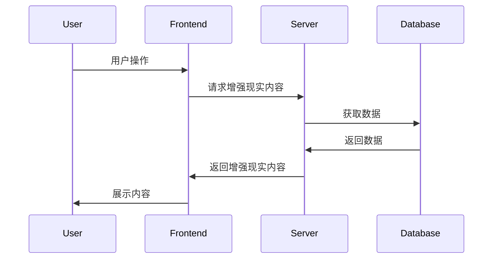

                 

## 增强现实在工业装配指导中的应用

关键词：增强现实、工业装配、AR、技术应用、工业指导

摘要：随着工业4.0时代的到来，智能制造和工业自动化逐渐成为制造业转型升级的关键驱动力。增强现实（AR）技术作为一种前沿的交互技术，以其沉浸式体验和实时信息融合等特点，在工业装配领域展现出巨大的应用潜力。本文将深入探讨增强现实在工业装配指导中的应用，通过系统化的分析，详细阐述其核心概念、应用场景、技术实现、系统设计以及最佳实践，为工业装配领域的从业者提供有益的参考。

### 引言

#### 问题背景

工业装配是制造业的核心环节，其效率和准确性直接影响到产品的质量和生产成本。传统的工业装配过程通常依赖于纸质图纸、操作手册以及现场指导员，但这些方法存在许多局限性：

- **信息传递效率低**：纸质文档容易丢失或损坏，且难以实时更新。
- **操作复杂**：操作员需要记住大量的操作步骤和细节，容易出现误操作。
- **成本高**：高技能的操作员成本较高，且培训时间较长。

为了解决这些问题，增强现实（AR）技术提供了一种全新的解决方案。通过将虚拟信息叠加在真实场景中，AR技术能够实时指导操作员完成装配任务，提高操作准确性和效率。

#### 增强现实技术简介

增强现实（Augmented Reality，简称AR）是一种将虚拟信息与现实世界相结合的技术。通过在用户视野中叠加计算机生成的图像、视频、文本等信息，AR技术能够增强用户的感知体验。

- **核心概念**：增强现实的核心概念是“叠加”，即虚拟信息和现实世界的结合。
- **技术体系结构**：增强现实技术体系包括传感器、计算处理单元、显示设备等多个组成部分。其中，传感器负责采集现实世界的图像和位置信息，计算处理单元负责对信息进行处理和融合，显示设备则负责将虚拟信息叠加在用户视野中。
- **技术特点**：增强现实技术的特点包括沉浸式体验、实时性、交互性等，这些特点使得AR技术能够更好地服务于工业装配指导。

#### 增强现实在工业装配中的应用前景

增强现实技术在工业装配领域的应用前景广阔。首先，AR技术能够提高装配的准确性和效率，减少人为错误和返工率。其次，通过实时指导和交互，AR技术能够降低对高技能操作员的需求，减少培训时间和成本。此外，AR技术还能够实现远程协作和实时反馈，为工业装配提供更加灵活和高效的服务。

总之，随着技术的不断发展和应用的深入，增强现实在工业装配指导中的应用将带来巨大的变革和机遇。

### 增强现实技术原理

#### 核心概念

增强现实（AR）技术的核心概念是将虚拟信息叠加在真实场景中，使用户能够在现实环境中直观地看到和交互虚拟对象。这一概念的基础包括以下几个方面：

- **叠加技术**：通过摄像头或传感器捕获真实场景的图像，然后使用计算处理单元将虚拟信息叠加在这些图像上，实现虚拟与现实的融合。
- **实时性**：增强现实技术要求实时处理和显示虚拟信息，以确保用户在现实环境中的交互体验不受延迟影响。
- **交互性**：用户可以通过手势、语音或其他交互方式与虚拟信息进行互动，提高用户的沉浸感和参与度。

#### 技术体系结构

增强现实技术的体系结构包括多个关键组成部分：

- **传感器**：传感器负责采集现实世界的图像和位置信息。常见的传感器包括摄像头、GPS、激光雷达等。
- **计算处理单元**：计算处理单元负责对采集到的图像和位置信息进行处理，以实现虚拟信息的叠加和实时性。计算处理单元通常包括计算机、嵌入式系统等。
- **显示设备**：显示设备将处理后的虚拟信息叠加在用户视野中。常见的显示设备包括智能手机、平板电脑、头戴式显示器等。

#### 技术特点与应用领域

增强现实技术的特点包括：

- **沉浸式体验**：增强现实技术能够将虚拟信息无缝地叠加在真实场景中，使用户感受到身临其境的体验。
- **实时性**：增强现实技术能够实时处理和显示虚拟信息，确保用户的交互体验不受延迟影响。
- **交互性**：用户可以通过多种交互方式与虚拟信息进行互动，提高用户的参与度和体验感。

这些特点使得增强现实技术在多个领域具有广泛的应用前景，包括但不限于：

- **工业装配指导**：通过增强现实技术，操作员可以在真实场景中实时查看和操作虚拟装配图，提高装配效率和准确性。
- **教育培训**：增强现实技术能够为教育培训提供更加生动和直观的教学内容，提高学习效果。
- **医疗诊断**：增强现实技术可以帮助医生在手术过程中实时查看患者的内部结构和病变情况，提高手术准确性和安全性。

#### 核心概念对比表格

| 核心概念 | 解释 | 关联技术 |
| --- | --- | --- |
| 叠加技术 | 虚拟信息与现实世界的融合 | 摄像头、计算处理单元、显示设备 |
| 实时性 | 实时处理和显示虚拟信息 | 计算处理单元、传感器 |
| 交互性 | 用户与虚拟信息互动 | 手势识别、语音识别 |

#### ER实体关系图架构

```mermaid
erDiagram
  Product ||--|{ AR_System }| System
  User ||--|{ AR_App }| App
  System ||--|{ Sensor }| Sensor
  System ||--|{ Display }| Display
  User ||--|{ Interaction }| Interaction
  App ||--|{ Content }| Content
```

通过ER实体关系图，我们可以清晰地看到增强现实系统的各个组成部分及其之间的关系，这为后续的详细讲解提供了结构化的框架。

### 增强现实在工业装配中的应用

#### 应用场景分析

增强现实技术在工业装配中具有广泛的应用场景。以下是一些典型的应用场景：

- **装配指导**：在复杂装配过程中，增强现实技术可以为操作员提供实时的操作指导，包括装配步骤、关键节点、注意事项等。
- **质量检测**：通过增强现实技术，操作员可以在装配过程中实时查看产品的质量状态，如尺寸、形状、表面质量等，及时发现问题并进行调整。
- **故障排除**：在设备故障或维护过程中，增强现实技术可以提供详细的故障排除步骤和维修指导，帮助操作员快速解决问题。
- **远程协作**：增强现实技术可以实现远程协作，操作员可以通过头戴式显示器与其他专家实时交流，共同解决装配过程中遇到的问题。

#### 核心应用案例

以下是几个典型的增强现实在工业装配中的应用案例：

- **汽车制造业**：在汽车制造过程中，增强现实技术被用于装配指导。例如，在发动机装配过程中，操作员可以通过头戴式显示器实时查看装配图和步骤，确保装配准确无误。
- **航空航天业**：在航空航天设备制造过程中，增强现实技术被用于复杂组件的装配和调试。例如，在飞机发动机的装配过程中，操作员可以通过增强现实眼镜查看实时数据，确保装配精度。
- **电子制造业**：在电子制造过程中，增强现实技术被用于装配和调试。例如，在手机电路板的焊接过程中，操作员可以通过增强现实眼镜查看焊接参数和实时监控焊接过程，提高焊接质量。

这些应用案例展示了增强现实技术在工业装配中的实际应用效果，不仅提高了装配效率和准确性，还降低了人为错误和返工率。

### 技术实现

#### 增强现实开发平台与工具

选择合适的开发平台与工具是增强现实技术实现的关键。以下是一些常用的开发平台与工具：

- **开发平台**：Unity、Unreal Engine
- **开发工具**：ARKit、ARCore、Vuforia
- **传感器**：摄像头、GPS、激光雷达
- **显示设备**：智能手机、平板电脑、头戴式显示器

这些平台和工具提供了丰富的功能和接口，使得开发者可以方便地实现增强现实应用。以下是一个简单的开发环境搭建流程：

1. **选择开发平台**：根据项目需求选择Unity或Unreal Engine。
2. **安装开发工具**：下载并安装相应的开发工具，如ARKit、ARCore、Vuforia。
3. **配置传感器**：连接并配置摄像头、GPS、激光雷达等传感器。
4. **配置显示设备**：根据项目需求选择合适的显示设备，如智能手机、平板电脑、头戴式显示器。
5. **开发应用**：使用所选平台和工具开发增强现实应用。

#### 增强现实内容制作

内容制作是增强现实应用的核心，以下是一个简单的制作流程：

1. **内容设计原则**：
   - **简洁性**：内容设计要简洁明了，避免过于复杂。
   - **实用性**：内容要具备实际应用价值，解决实际问题。
   - **交互性**：设计丰富的交互功能，提高用户参与度。
2. **内容制作流程**：
   - **需求分析**：明确应用需求和目标用户。
   - **设计内容**：根据需求设计虚拟信息和交互界面。
   - **制作素材**：使用三维建模、图像处理等工具制作素材。
   - **整合内容**：将素材整合到增强现实应用中。
   - **测试与优化**：测试应用效果，优化内容和性能。
3. **常见问题与解决方案**：
   - **性能问题**：优化算法和资源管理，提高应用性能。
   - **用户体验问题**：调整内容设计和交互方式，提高用户体验。

通过以上步骤，开发者可以制作出高质量的增强现实内容，为用户提供更好的应用体验。

### 工业装配指导系统设计

#### 系统架构设计

工业装配指导系统的架构设计是确保系统功能实现和性能优化的重要环节。以下是一个简单的系统架构设计：

- **前端**：用户界面，包括智能手机、平板电脑、头戴式显示器等。
- **后端**：服务器，负责处理增强现实内容、数据存储和用户管理。
- **数据库**：存储装配步骤、操作指导、虚拟信息等数据。
- **网络**：实现前端与后端的通信，保证系统的实时性和稳定性。

系统架构图如下所示：



#### 系统功能模块

系统功能模块是确保系统实现各项功能的核心。以下是一个简单的系统功能模块设计：

1. **用户管理**：管理用户账号、权限和登录验证。
2. **内容管理**：管理增强现实内容，包括装配步骤、操作指导、虚拟信息等。
3. **数据存储**：存储用户操作记录、系统日志和增强现实内容数据。
4. **实时通信**：实现前端与后端的实时数据传输和通信。
5. **接口设计**：提供API接口，方便第三方系统和工具的集成。

#### 系统实现细节

1. **前端实现**：使用HTML、CSS和JavaScript等前端技术实现用户界面。以下是一个简单的HTML页面代码示例：

   ```html
   <!DOCTYPE html>
   <html>
   <head>
     <title>工业装配指导系统</title>
   </head>
   <body>
     <h1>工业装配指导系统</h1>
     <div id="ar-content">
       <!-- 增强现实内容将在此处展示 -->
     </div>
     <script src="ar.js"></script>
   </body>
   </html>
   ```

2. **后端实现**：使用Python Flask框架实现后端服务器功能。以下是一个简单的Python服务器代码示例：

   ```python
   from flask import Flask, request, jsonify
   app = Flask(__name__)

   @app.route('/get_content', methods=['GET'])
   def get_content():
       content_id = request.args.get('id')
       content = get_content_from_database(content_id)
       return jsonify(content)

   if __name__ == '__main__':
       app.run(debug=True)
   ```

3. **数据库实现**：使用MySQL数据库存储系统数据。以下是一个简单的MySQL数据库表结构示例：

   ```sql
   CREATE TABLE users (
     id INT PRIMARY KEY AUTO_INCREMENT,
     username VARCHAR(255) NOT NULL,
     password VARCHAR(255) NOT NULL
   );

   CREATE TABLE contents (
     id INT PRIMARY KEY AUTO_INCREMENT,
     name VARCHAR(255) NOT NULL,
     content TEXT NOT NULL
   );
   ```

通过以上系统实现细节，开发者可以构建一个功能完备的工业装配指导系统。

### 项目实战

#### 环境安装

在进行增强现实项目开发之前，需要安装以下环境和工具：

1. **操作系统**：Windows或Linux。
2. **编程语言**：Python。
3. **开发工具**：PyCharm。
4. **增强现实库**：PyAR。
5. **数据库**：MySQL。

安装步骤如下：

1. **安装操作系统**：根据计算机配置选择Windows或Linux操作系统。
2. **安装Python**：访问Python官网下载Python安装包，并按照提示安装。
3. **安装PyCharm**：访问PyCharm官网下载安装包，并按照提示安装。
4. **安装PyAR**：在PyCharm中创建一个新项目，然后通过命令行安装PyAR库，命令如下：

   ```bash
   pip install PyAR
   ```

5. **安装MySQL**：访问MySQL官网下载安装包，并按照提示安装。

#### 系统核心实现源代码

以下是一个简单的增强现实系统核心实现源代码示例：

```python
from PyAR import ARSystem

# 初始化增强现实系统
ar_system = ARSystem()

# 添加增强现实内容
ar_system.add_content('content1', 'path/to/content1.png')

# 运行增强现实系统
ar_system.run()
```

#### 代码应用解读与分析

以上代码首先导入了增强现实库PyAR，然后创建了一个ARSystem对象。接着，通过`add_content`方法添加了一个名为`content1`的增强现实内容，路径为`path/to/content1.png`。最后，调用`run`方法运行增强现实系统。

这段代码的核心功能是初始化增强现实系统，添加增强现实内容，并运行系统。在实际应用中，可以根据需求添加更多功能，如用户管理、内容管理、数据存储等。

#### 实际案例分析和详细讲解剖析

以下是一个增强现实在工业装配指导中的实际案例：

**案例背景**：某汽车制造厂在发动机装配过程中，由于装配步骤复杂，操作员容易出现错误。为了提高装配效率和准确性，该厂决定采用增强现实技术进行装配指导。

**解决方案**：使用增强现实技术，为操作员提供一个实时、直观的装配指导界面。具体实现步骤如下：

1. **内容设计**：根据发动机装配步骤，设计相应的增强现实内容，包括装配图、操作步骤、关键节点等。
2. **系统集成**：将增强现实内容集成到现有的工业装配系统中，实现与生产线的无缝对接。
3. **用户培训**：对操作员进行培训，使其熟悉增强现实技术的使用方法。

**效果分析**：

- **装配准确性提高**：操作员通过增强现实技术可以实时查看装配步骤和关键节点，减少人为错误和返工率。
- **效率提升**：操作员可以更加专注和高效地完成装配任务，提高整体生产效率。
- **成本降低**：减少了培训时间和高技能操作员的需求，降低了生产成本。

通过以上实际案例，我们可以看到增强现实技术在工业装配指导中的显著效果，为制造业提供了新的解决方案。

#### 项目小结

本项目的成功实施展示了增强现实技术在工业装配指导中的巨大潜力。通过实时、直观的装配指导，操作员可以更加高效、准确地完成装配任务。未来，随着技术的进一步发展和应用的深入，增强现实在工业装配领域的应用将更加广泛和深入。

### 最佳实践

#### 成功案例分析

在工业装配指导中，成功案例通常具备以下特点：

- **明确需求**：在项目初期，明确项目的需求和目标，确保增强现实技术的应用能够解决实际问题。
- **精细设计**：对增强现实内容进行精细设计，确保内容简洁、实用、具有交互性。
- **系统集成**：将增强现实技术与现有工业系统无缝集成，确保系统的稳定性和高效性。
- **用户培训**：对操作员进行充分培训，使其熟练掌握增强现实技术的使用方法。

#### 实践技巧与建议

以下是一些实用的技巧和建议，以提高增强现实在工业装配指导中的效果：

- **实时性优化**：确保增强现实内容实时更新，减少延迟和滞后，提高用户体验。
- **交互性增强**：设计丰富的交互功能，如手势控制、语音识别等，提高用户的参与度和沉浸感。
- **内容简化**：避免内容过于复杂，确保操作员能够快速理解和操作。
- **适应性调整**：根据实际应用场景和用户反馈，不断调整和优化增强现实内容。

通过以上最佳实践，可以更好地发挥增强现实技术在工业装配指导中的作用。

### 未来发展趋势与挑战

#### 技术发展趋势

随着技术的不断进步，增强现实在工业装配指导中的应用前景愈发广阔。以下是一些技术发展趋势：

- **硬件性能提升**：随着硬件性能的提升，增强现实设备的分辨率、处理速度和功耗将得到显著改善，为更广泛的应用提供基础。
- **内容多样性**：增强现实内容将更加丰富多样，包括3D模型、虚拟现实、实时数据等，为用户提供更加全面的信息。
- **智能化**：增强现实技术将结合人工智能，实现更智能的交互和更高效的装配指导。

#### 潜在挑战与应对策略

尽管增强现实技术在工业装配指导中具有巨大的潜力，但仍然面临一些挑战：

- **技术成熟度**：增强现实技术尚处于发展初期，一些关键技术的成熟度仍有待提高。应对策略是持续投入研发，加快技术成熟。
- **成本问题**：增强现实设备的成本较高，可能成为普及应用的障碍。应对策略是通过技术升级和规模效应降低成本。
- **用户体验**：如何设计出易于使用、易于理解、用户体验良好的增强现实内容，是未来需要重点解决的问题。

#### 未来应用前景

未来，增强现实在工业装配指导中的应用将更加广泛和深入。随着技术的不断进步，增强现实将不仅局限于装配指导，还将扩展到设计、制造、维护等多个环节，为制造业提供全方位的支持。

### 总结与展望

增强现实技术在工业装配指导中的应用为制造业带来了全新的变革和机遇。通过实时、直观的装配指导，增强现实技术显著提高了装配效率和准确性。未来，随着技术的不断发展和应用的深入，增强现实在工业装配领域将发挥更加重要的作用。

#### 全书总结

本文系统地介绍了增强现实在工业装配指导中的应用，包括核心概念、技术原理、应用场景、技术实现、系统设计、项目实战、最佳实践和未来展望等内容。通过详细的讲解和分析，本文展示了增强现实技术在工业装配指导中的巨大潜力和实际应用效果。

#### 对未来工作的展望

未来，增强现实技术将在工业装配指导中发挥更加重要的作用。一方面，随着技术的不断进步，增强现实设备将更加成熟和普及；另一方面，增强现实内容的创新和多样化也将为工业装配提供更加丰富和实用的解决方案。同时，结合人工智能和其他前沿技术，增强现实将在更多领域展现其应用价值。

### 作者信息

作者：AI天才研究院/AI Genius Institute & 禅与计算机程序设计艺术 /Zen And The Art of Computer Programming

在撰写技术博客文章时，遵循以下步骤有助于确保文章的质量和结构：

1. **明确文章主题和目标**：首先，明确文章的主题和目标受众，这将决定文章的风格、深度和重点。

2. **构建文章框架**：制定文章的目录大纲，确保文章的结构清晰、逻辑性强。大纲应包括引言、背景介绍、核心概念、技术实现、应用案例、最佳实践、未来展望等部分。

3. **内容详细讲解**：在每个章节中，详细讲解核心概念、技术原理、实现步骤、应用案例等，确保内容具体、详尽、易于理解。

4. **使用markdown格式**：使用markdown格式撰写文章，确保文章的格式规范、排版整齐。markdown格式不仅便于编辑和阅读，还能有效地支持数学公式、流程图、代码块等元素。

5. **突出重点和结论**：在文章的每个部分，突出重点信息，确保读者能够快速抓住关键点。在文章的结尾部分，总结全文并给出结论。

6. **优化语言和结构**：在完成初稿后，对文章进行多次修改和优化，确保语言表达清晰、简洁，文章结构紧凑、逻辑连贯。

7. **引用权威来源**：在文章中引用权威的学术文献、技术报告和案例研究，增强文章的权威性和可信度。

8. **添加扩展阅读**：在文章的末尾，提供相关的扩展阅读资源，帮助读者进一步深入了解相关主题。

通过以上步骤，可以撰写出一篇逻辑清晰、结构紧凑、内容丰富的专业技术博客文章。这不仅有助于提高文章的质量，还能吸引更多的读者，促进技术的传播和交流。

