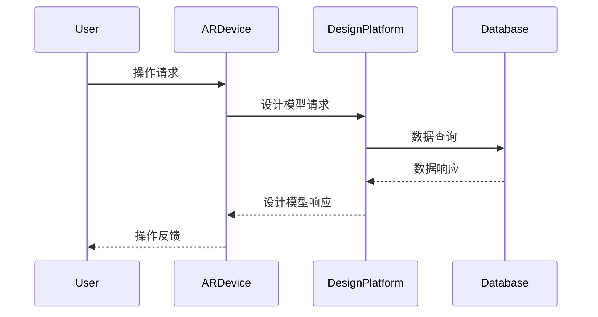
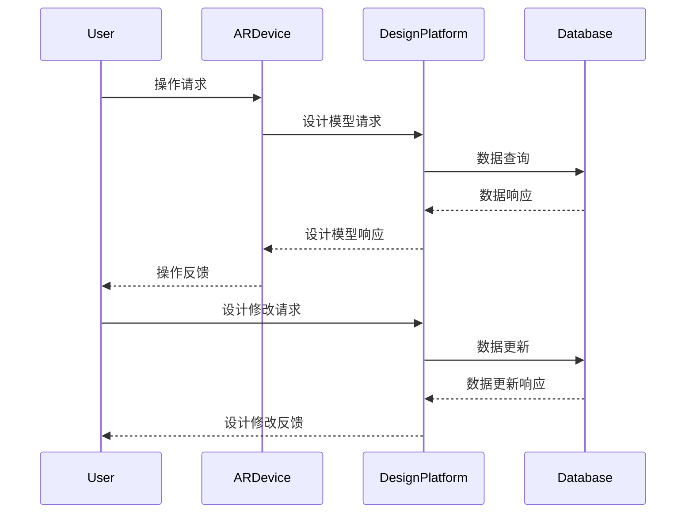

                 

## 增强现实在工业设计中的可视化应用

### 关键词：增强现实、工业设计、可视化、AR技术、设计原型、虚拟装配、用户交互

### 摘要：

随着增强现实（AR）技术的迅猛发展，其在工业设计领域的应用日益广泛。本文通过深入探讨增强现实在工业设计中的可视化应用，详细分析了AR技术如何满足工业设计中的可视化需求，以及其在设计原型验证、虚拟装配与协作、用户交互与体验优化等方面的具体应用场景。文章还探讨了增强现实技术融合于工业设计的核心问题，包括数据集成与处理、界面设计与人机交互、实时性与准确性等。通过本文，读者将全面了解增强现实技术在工业设计中的潜在价值和应用前景。

### 目录大纲设计

#### 背景介绍

1. **增强现实（AR）概述**
   - **增强现实技术定义**
   - **AR技术的发展历程与现状**
   - **AR技术在工业设计中的应用背景**

2. **工业设计中的可视化需求**
   - **工业设计的流程与挑战**
   - **可视化在工业设计中的作用**
   - **增强现实如何满足工业设计的可视化需求**

3. **增强现实技术在工业设计中的应用场景**
   - **设计原型与验证**
   - **虚拟装配与协作**
   - **用户交互与体验优化**

4. **增强现实技术与工业设计融合的核心问题**
   - **数据集成与处理**
   - **界面设计与人机交互**
   - **实时性与准确性**

#### 核心概念与联系

1. **增强现实关键概念**
   - **AR系统组成**
   - **注册与跟踪技术**
   - **眼镜式显示器与投影技术**

2. **增强现实技术对比表格**
   - **光学透视与计算机图形**
   - **投影技术分类对比**
   - **实时性对比**

3. **ER实体关系图架构**
   - **设计对象与可视化数据**
   - **用户交互记录与反馈**
   - **数据存储与管理**

#### 算法原理讲解

1. **增强现实算法基础**
   - **透视变换与视差计算**
   - **深度感知与物体识别**
   - **交互反馈与实时调整**

2. **算法mermaid流程图**

3. **Python源代码与详细讲解**

#### 数学模型和数学公式

1. **透视变换公式**

2. **深度感知公式**

#### 系统分析与架构设计方案

1. **问题场景介绍**

2. **项目介绍**

3. **系统功能设计（领域模型mermaid类图）**

4. **系统架构设计（mermaid架构图）**

5. **系统接口设计和系统交互（mermaid序列图）**

#### 项目实战

1. **环境安装**

2. **系统核心实现源代码**

3. **代码应用解读与分析**

4. **实际案例分析和详细讲解剖析**

5. **项目小结**

#### 最佳实践 tips、小结、注意事项、拓展阅读等内容

---

在接下来的文章中，我们将逐一深入探讨这些章节，通过逻辑清晰、结构紧凑、简单易懂的专业技术语言，详细解析增强现实在工业设计中的应用。

---

#### 背景介绍

##### 增强现实（AR）概述

**增强现实技术定义：**

增强现实（Augmented Reality，简称AR）是一种将虚拟信息与真实世界相结合的计算机技术。它通过计算机生成的图像、视频、音频等多媒体信息，叠加或融合到真实环境中，为用户提供一种虚实融合的感知体验。AR技术不仅扩展了人类的感知范围，还改变了信息获取和互动的方式。

**AR技术的发展历程与现状：**

增强现实技术的发展经历了几个重要阶段。从早期的虚拟现实（VR）到增强现实，再到当前的AR技术，其发展历程大致可以分为三个阶段：

1. **初级阶段（1990-2000年）**：这一阶段主要涉及基础的图像叠加和视频增强技术。典型的应用包括头戴式显示器和简单的图像识别。

2. **发展阶段（2001-2010年）**：随着计算机性能的提升和传感器技术的发展，AR技术逐渐成熟，开始应用于移动设备。这一时期的典型产品包括iPhone和Android智能手机上的AR应用。

3. **成熟期（2010年至今）**：随着智能手机和移动设备的普及，AR技术进入了快速发展期。例如，谷歌眼镜、微软HoloLens、苹果ARKit等产品的推出，标志着AR技术逐渐走进大众视野。

当前，增强现实技术已经广泛应用于多个领域，包括医疗、教育、娱乐、工业设计等。特别是在工业设计领域，AR技术为设计师提供了全新的工具和平台，使其能够更高效、更直观地进行设计工作。

**AR技术在工业设计中的应用背景：**

在工业设计中，设计师需要面对诸多挑战，如复杂的产品结构、精细的设计要求、多变的用户需求等。传统的工业设计方法往往依赖于二维图纸和三维建模，这些方法虽然在某些方面具有优势，但在真实世界的应用中存在诸多不足。

增强现实技术的引入，为工业设计带来了全新的视角和可能性。通过AR技术，设计师可以在真实环境中实时查看和修改设计对象，实现设计原型与验证、虚拟装配与协作、用户交互与体验优化等目标。

具体来说，增强现实技术在工业设计中的应用背景主要体现在以下几个方面：

1. **设计原型与验证：** 在设计初期，设计师需要快速创建和测试设计原型。传统方法往往需要耗费大量时间和资源，而AR技术则可以通过虚拟模型叠加到真实环境中，实现快速原型验证。

2. **虚拟装配与协作：** 工业设计中，不同组件的装配和协作是关键环节。AR技术可以提供虚拟装配指导，帮助设计师和工程师更精确地进行装配操作，减少错误和返工。

3. **用户交互与体验优化：** 在产品设计过程中，用户的反馈和体验至关重要。AR技术可以提供更加直观和互动的用户界面，帮助设计师更好地理解用户需求，进行优化设计。

综上所述，增强现实技术在工业设计中的应用背景十分广泛，为设计师提供了强大的工具和平台，使得设计工作更加高效、直观和精准。

---

在本章节中，我们首先对增强现实技术进行了概述，包括其定义、发展历程和当前的应用背景。接下来，我们将深入探讨工业设计中的可视化需求，以及增强现实技术如何满足这些需求。

---

##### 工业设计中的可视化需求

**工业设计的流程与挑战：**

工业设计是一个复杂而系统的过程，涵盖了从概念设计到产品制造的所有环节。传统的工业设计流程通常包括以下几个步骤：

1. **需求分析：** 根据市场调研和用户需求，明确产品的功能和外观要求。
2. **草图绘制：** 设计师通过手绘或计算机辅助设计（CAD）软件，绘制初步的设计草图。
3. **三维建模：** 利用三维建模软件（如AutoCAD、SolidWorks等）对草图进行详细建模。
4. **设计验证：** 通过制作原型或模拟测试，验证设计是否符合预期要求。
5. **迭代优化：** 根据测试结果，对设计进行修改和优化，直至满足最终需求。
6. **生产准备：** 设计完成并通过验证后，进入生产准备阶段，包括模具制造、材料选型等。

在整个设计流程中，设计师需要面对诸多挑战：

1. **复杂的产品结构：** 工业产品通常具有复杂的结构，设计师需要在有限的资源下，确保设计的高效性和合理性。
2. **精细的设计要求：** 设计师需要精确控制产品的尺寸、形状和功能，以满足严格的质量标准。
3. **多变的用户需求：** 用户需求在不断变化，设计师需要灵活应对，确保产品的持续竞争力。
4. **时间与成本限制：** 工业设计需要耗费大量时间和资源，设计师需要在时间和成本的双重压力下，高效完成设计任务。

**可视化在工业设计中的作用：**

在工业设计中，可视化是一种重要的工具，它能够帮助设计师更直观地理解和表达设计意图，提高设计效率和质量。具体来说，可视化在工业设计中的作用主要体现在以下几个方面：

1. **设计沟通与协作：** 可视化能够清晰传达设计意图，帮助设计师与团队成员、客户和工程师之间进行有效的沟通和协作。通过可视化工具，设计师可以更直观地展示设计细节和修改方案，减少误解和沟通障碍。
2. **设计验证与优化：** 通过可视化，设计师可以实时查看和测试设计原型，及时发现和纠正设计中的问题。传统的二维图纸和三维建模难以完全模拟真实环境，而可视化技术则能够将设计直接呈现在真实场景中，提供更准确的设计验证。
3. **用户体验优化：** 在产品设计过程中，用户的反馈和体验至关重要。通过可视化技术，设计师可以模拟用户在使用产品时的交互体验，从用户的视角进行设计优化，提高产品的易用性和用户体验。
4. **产品展示与宣传：** 可视化技术可以用于产品展示和宣传，通过逼真的虚拟模型和动画效果，吸引潜在用户和投资者的关注，提高产品的市场竞争力。

**增强现实如何满足工业设计的可视化需求：**

增强现实（AR）技术为工业设计提供了全新的可视化解决方案，能够满足设计师在各个设计环节中的需求。具体来说，AR技术在以下方面具有独特优势：

1. **实时互动与反馈：** AR技术可以将虚拟模型直接叠加到真实环境中，设计师可以实时查看和修改设计对象，与虚拟模型进行互动和反馈。这种实时性使得设计验证和迭代过程更加高效。
2. **多维度可视化：** AR技术不仅支持二维和三维可视化的转换，还可以实现多维度数据的可视化。例如，设计师可以在AR环境中同时查看产品的尺寸、重量和材料属性等详细信息，从而更全面地评估设计效果。
3. **交互性与体验感：** AR技术提供了丰富的交互方式和体验感，设计师可以通过手势、语音等自然交互方式与虚拟模型进行互动，提高设计的趣味性和参与度。
4. **跨平台与兼容性：** AR技术支持多种设备和应用平台，设计师可以在不同的硬件和软件环境中，使用AR技术进行设计工作。这种跨平台和兼容性使得AR技术更易于集成和应用。

总之，增强现实技术在工业设计中的可视化需求方面具有显著的优势，通过提供实时互动、多维度可视化、交互性与体验感等特色功能，有效提升了设计师的工作效率和质量。在接下来的章节中，我们将进一步探讨增强现实技术在工业设计中的应用场景，以展示其在实际设计工作中的具体应用。

---

在本章节中，我们详细探讨了工业设计中的流程与挑战，以及可视化在其中的重要作用。接下来，我们将深入探讨增强现实技术如何满足这些可视化需求，并进一步阐述其在工业设计中的应用场景。

---

##### 增强现实技术在工业设计中的应用场景

**设计原型与验证：**

在设计过程中，设计师需要快速创建和验证设计原型，以确保设计方案的可行性和合理性。增强现实技术在这一过程中发挥了重要作用。

首先，设计师可以利用AR技术将虚拟模型叠加到真实环境中，从而实现快速的原型验证。例如，通过使用AR眼镜，设计师可以直接在工厂车间或产品展示厅中查看和操作虚拟模型，发现并解决设计中的潜在问题。这种方式不仅提高了设计验证的速度，还减少了物理原型制作的时间和成本。

其次，AR技术提供了更直观的交互方式。设计师可以通过手势、语音等自然交互方式与虚拟模型进行互动，进行旋转、缩放、切割等操作，从而更全面地评估设计效果。这种交互方式使得设计师能够更加自由地进行设计验证和修改，提高了设计的灵活性和创造性。

**虚拟装配与协作：**

在工业生产过程中，产品的组装和调试是关键环节。增强现实技术为虚拟装配和协作提供了强大的支持。

通过AR技术，工程师可以在真实环境中实时查看和操作虚拟组件，进行虚拟装配。例如，在飞机、汽车等复杂机械的组装过程中，工程师可以使用AR眼镜查看每个零件的位置和装配步骤，确保每个组件都能准确无误地安装。这种方式不仅提高了装配效率，还减少了错误和返工的可能性。

此外，AR技术还支持多人协作。多个工程师可以通过AR设备实时共享信息和数据，协同完成装配任务。例如，在大型工业项目中，不同地点的工程师可以同时通过AR眼镜查看同一虚拟模型，进行实时沟通和协作，提高了项目的整体效率和协调性。

**用户交互与体验优化：**

在产品设计过程中，用户的反馈和体验至关重要。增强现实技术为设计师提供了丰富的用户交互方式，帮助其优化产品设计和用户体验。

首先，AR技术提供了更直观的交互界面。设计师可以通过AR眼镜或平板电脑等设备，直接在真实环境中与虚拟模型进行互动。例如，用户可以点击、拖动、旋转等操作，查看产品的不同角度和功能。这种方式不仅提高了用户交互的便捷性，还增强了用户的参与感和体验感。

其次，AR技术可以模拟用户在实际使用产品时的场景，帮助设计师更好地理解用户需求和痛点。例如，设计师可以在AR环境中模拟用户操作产品的过程，观察用户的交互行为和反馈，从而发现并优化产品设计的不足之处。

此外，AR技术还可以结合用户数据和行为分析，为设计师提供更加精准的用户画像和需求分析。通过分析用户的偏好和行为模式，设计师可以更有针对性地进行产品设计和优化，提高产品的用户体验和市场竞争力。

**实际应用案例：**

1. **建筑与工程：** 在建筑和工程领域，增强现实技术被广泛应用于建筑设计、工程仿真和施工指导。设计师和工程师可以通过AR眼镜查看建筑模型的细节和结构，进行虚拟装配和调试，提高设计和施工的精度和效率。

2. **航空航天：** 在航空航天领域，增强现实技术被用于飞机设计和制造。工程师可以通过AR设备查看飞机组件的装配过程，及时发现和解决问题，确保飞机的质量和安全性。

3. **医疗与健康：** 在医疗领域，增强现实技术被用于手术指导、医疗培训和患者教育。医生可以通过AR设备查看患者的内部结构和病变部位，进行精准的手术操作和医疗指导。

4. **汽车制造：** 在汽车制造领域，增强现实技术被用于汽车设计和制造。设计师和工程师可以通过AR设备查看汽车模型的结构和功能，进行虚拟装配和调试，提高汽车的质量和性能。

综上所述，增强现实技术在工业设计中的应用场景非常广泛，包括设计原型与验证、虚拟装配与协作、用户交互与体验优化等方面。通过提供实时互动、多维度可视化和丰富的交互方式，增强现实技术为工业设计带来了全新的视角和可能性，有效提高了设计的效率和质量。

---

在本章节中，我们详细探讨了增强现实技术在工业设计中的应用场景，展示了其在设计原型与验证、虚拟装配与协作、用户交互与体验优化等方面的具体应用。接下来，我们将深入分析增强现实技术与工业设计融合的核心问题。

---

#### 增强现实技术与工业设计融合的核心问题

**数据集成与处理：**

增强现实（AR）技术在工业设计中的广泛应用，离不开高效的数据集成与处理能力。在设计过程中，设计师和工程师需要处理大量的数据，包括三维模型、工程图纸、传感器数据等。这些数据来源多样，格式各异，如何实现数据的统一管理和高效处理成为关键问题。

首先，数据集成需要解决不同数据源之间的兼容性和转换问题。例如，从CAD软件导出的三维模型需要与AR平台兼容，以便在AR环境中进行可视化展示和交互。为此，可以采用中间件技术，将不同数据格式转换为通用的AR数据格式，如USDZ或GLTF。

其次，数据处理需要考虑数据传输速度和实时性。在工业设计中，设计师和工程师需要实时查看和处理数据，以便快速进行设计和验证。为此，可以采用云计算和边缘计算技术，将数据存储和处理任务分布到云端和边缘设备上，提高数据处理速度和响应能力。

**界面设计与人机交互：**

在工业设计中，界面设计与人机交互（HCI）对用户体验和设计效率至关重要。增强现实技术的引入，使得界面设计和人机交互面临新的挑战和机遇。

首先，界面设计需要考虑如何将虚拟模型与现实环境无缝融合。例如，在AR环境中，设计师需要确保虚拟模型与真实环境中的物体和场景保持正确的相对位置和比例。为此，可以采用注册与跟踪技术，通过摄像头和传感器实时捕捉真实环境中的物体，并使用图像处理和计算机视觉算法对虚拟模型进行定位和跟踪。

其次，人机交互需要考虑如何提供直观、便捷的交互方式。在AR环境中，用户可以通过手势、语音、眼动等自然交互方式与虚拟模型进行互动。例如，用户可以使用手势进行模型旋转、缩放和移动，或者使用语音命令进行搜索和操作。为此，可以采用多模态交互技术，结合多种交互方式，提高用户的交互体验和满意度。

此外，界面设计还需要考虑可访问性和易用性。为了确保不同用户群体，包括老年人、残障人士等，都能方便地使用AR技术进行工业设计，界面设计需要提供多样化的交互方式和辅助功能。例如，可以使用语音提示、文字说明和手势指南等，帮助用户更好地理解和使用AR技术。

**实时性与准确性：**

实时性和准确性是增强现实技术在工业设计中的关键指标。实时性决定了AR系统能否及时响应用户的操作和需求，准确性则影响了AR环境的可信度和实用性。

首先，实时性需要解决数据传输和计算延迟问题。在工业设计中，设计师和工程师需要实时查看和处理数据，以确保设计过程的连续性和高效性。为此，可以采用高性能计算和分布式计算技术，提高数据传输和计算速度，减少延迟和响应时间。

其次，准确性需要解决虚拟模型与现实环境之间的匹配问题。例如，在AR环境中，虚拟模型的位置、大小和形状需要与现实环境中的物体保持一致。为此，可以采用高精度的传感器和计算机视觉算法，对真实环境进行实时捕捉和建模，确保虚拟模型与现实环境的精确匹配。

此外，准确性还需要考虑数据的质量和可靠性。在设计过程中，设计师和工程师需要依赖准确的数据进行设计和验证，因此需要确保数据源的可靠性和一致性。例如，可以使用高精度的三维扫描设备和传感器，获取真实环境中的高精度数据，确保数据的准确性和可靠性。

综上所述，增强现实技术在工业设计中的融合，面临数据集成与处理、界面设计与人机交互、实时性与准确性等核心问题。通过采用先进的技术和解决方案，可以有效地解决这些问题，提高AR技术在工业设计中的应用效果和用户体验。

---

在本章节中，我们深入分析了增强现实技术与工业设计融合过程中的核心问题，包括数据集成与处理、界面设计与人机交互、实时性与准确性等方面。接下来，我们将介绍增强现实关键概念，为后续内容的深入探讨奠定基础。

---

#### 核心概念与联系

**增强现实关键概念：**

在深入探讨增强现实（AR）技术在工业设计中的应用之前，理解其核心概念是非常重要的。增强现实技术涉及多个关键组成部分，这些组成部分协同工作，实现虚拟信息与现实环境的融合。

1. **AR系统组成：**
   - **传感器：** 传感器用于捕捉现实环境中的数据，包括摄像头、深度传感器、红外传感器等。
   - **计算单元：** 计算单元负责处理传感器捕获的数据，执行图像处理、跟踪和识别等任务。
   - **显示设备：** 显示设备将增强的信息叠加到用户视野中，常见的有头戴式显示器、智能手机、平板电脑等。
   - **用户交互界面：** 用户交互界面用于用户与系统之间的交互，包括手势、语音、触控等。

2. **注册与跟踪技术：**
   注册与跟踪是AR技术中的核心环节，它确保虚拟信息与现实环境中的物体准确对齐。注册技术通过识别和匹配现实环境中的特征点，将虚拟信息叠加到真实场景中。跟踪技术则用于实时监测和更新虚拟信息的位置和姿态，确保其在整个交互过程中的稳定性。

3. **眼镜式显示器与投影技术：**
   眼镜式显示器和投影技术是增强现实技术中的两种常见显示方式。眼镜式显示器通过直接将图像投射到用户眼睛中，提供沉浸式的体验。而投影技术则通过在真实环境中投射图像，实现虚拟信息与现实环境的融合。

**增强现实技术对比表格：**

为了更直观地理解增强现实技术的不同方面，我们可以通过对比表格来展示几种关键技术的优缺点。

| 技术类型           | 优点                                               | 缺点                                               | 适用场景                     |
|------------------|------------------------------------------------------|------------------------------------------------------|-----------------------------|
| 光学透视           | 真实感强，可实现高质量的视觉效果                   | 受环境光线影响大，复杂场景下准确性降低           | 设计原型验证，展示演示       |
| 计算机图形         | 可自定义和设计，实现丰富的视觉效果                 | 需要高计算资源和精确建模，实时性较低           | 虚拟装配，交互设计           |
| 投影技术           | 显示范围广，可覆盖大场景                           | 投影效果受环境光线影响，投影质量不稳定           | 大规模展示，工程应用         |
| 眼镜式显示器       | 沉浸式体验，无视线遮挡                             | 重量和舒适性问题，视线受限                       | 个人使用，专业设计          |

**ER实体关系图架构：**

为了更好地理解增强现实技术在工业设计中的应用，我们可以使用实体关系图（ER图）来展示设计对象与可视化数据、用户交互记录与反馈、数据存储与管理等核心组成部分之间的关系。

```mermaid
erDiagram
  产品设计 -->|生成可视化| 可视化数据
  可视化数据 -->|实时更新| 用户交互记录
  用户交互记录 -->|存储与管理| 数据存储
  数据存储 -->|查询与分析| 数据分析
```

在上述ER图中，**产品设计**是增强现实技术的核心输入，通过生成可视化数据，实现对设计对象的实时展示和交互。用户交互记录则记录了用户与可视化数据的交互过程，如点击、拖动、旋转等。这些交互记录被存储在数据存储中，供后续的查询和分析使用。通过数据分析，可以获取用户的偏好和行为模式，为设计师提供有价值的参考。

**总结：**

通过介绍增强现实技术的核心概念、对比表格和ER实体关系图架构，我们为后续内容的深入探讨奠定了基础。在下一章节中，我们将进一步讲解增强现实算法原理，并使用mermaid流程图和Python源代码进行详细阐述。

---

在本章节中，我们介绍了增强现实技术的核心概念，通过对比表格和ER实体关系图架构，帮助读者更好地理解增强现实技术在工业设计中的应用。接下来，我们将深入探讨增强现实算法原理，并通过mermaid流程图和Python源代码进行详细讲解。

---

#### 算法原理讲解

**透视变换与视差计算：**

透视变换是增强现实（AR）算法中的基础部分，用于将虚拟物体准确映射到真实环境中。透视变换通过一系列数学公式，将三维空间中的点映射到二维图像平面上。

1. **透视变换公式：**
   透视变换的核心是投影矩阵，它定义了如何从三维空间将点投影到二维平面上。透视变换公式如下：
   $$\begin{cases}
   x' = \frac{x * f}{z} + c_x \\
   y' = \frac{y * f}{z} + c_y
   \end{cases}$$
   其中，$x'$ 和 $y'$ 是二维图像平面上的坐标，$x$ 和 $y$ 是三维空间中的坐标，$f$ 是焦距，$c_x$ 和 $c_y$ 是主点坐标。

2. **视差计算：**
   视差是指由于观察者位置的变化，导致观察到的物体在图像中的位置发生变化。视差计算是透视变换的重要补充，用于调整虚拟物体与真实环境的相对位置，使其更加自然和真实。视差计算通常通过以下公式进行：
   $$d = \frac{z_{camera}}{z_{world}}$$
   其中，$d$ 是视差值，$z_{camera}$ 是物体在相机坐标系中的深度，$z_{world}$ 是物体在世界坐标系中的深度。

**深度感知与物体识别：**

深度感知和物体识别是增强现实技术的核心，用于将真实环境中的物体与虚拟信息准确匹配。深度感知通过计算物体的深度信息，实现对真实环境的理解和建模。

1. **深度感知算法：**
   深度感知算法通常基于多个传感器捕获的图像数据进行处理。常见的深度感知算法包括基于单目相机的深度估计、基于双目相机的立体视觉和基于结构光的方法。以下是基于单目相机的深度估计公式：
   $$d = \frac{f * b}{n}$$
   其中，$d$ 是物体深度，$f$ 是焦距，$b$ 是图像中的视差，$n$ 是相机到物体的距离。

2. **物体识别算法：**
   物体识别是深度感知的进一步应用，通过识别和分类真实环境中的物体，将其与虚拟信息进行匹配。常见的物体识别算法包括基于特征匹配的方法、基于机器学习的方法和基于卷积神经网络的深度学习方法。以下是一个简单的基于卷积神经网络的物体识别算法流程：

   ```mermaid
   flowchart LR
     A[输入图像] --> B[预处理]
     B --> C[特征提取]
     C --> D[分类器]
     D --> E{识别结果}
   ```

**交互反馈与实时调整：**

增强现实技术不仅需要准确映射虚拟信息到真实环境中，还需要实时响应用户的交互操作，并进行动态调整。交互反馈和实时调整是保证AR系统稳定性和用户体验的重要环节。

1. **交互反馈：**
   交互反馈是指系统根据用户的操作，实时提供相应的视觉和听觉反馈。常见的交互反馈包括点击效果、动画效果和声音提示等。以下是一个简单的交互反馈流程：

   ```mermaid
   flowchart LR
     A[用户操作] --> B[操作处理]
     B --> C[反馈生成]
     C --> D[反馈显示/播放]
   ```

2. **实时调整：**
   实时调整是指系统根据用户的操作和环境的实时变化，动态调整虚拟信息的位置、大小和外观。常见的实时调整技术包括运动跟踪、手势识别和自适应调整等。以下是一个简单的实时调整流程：

   ```mermaid
   flowchart LR
     A[用户操作] --> B[跟踪与识别]
     B --> C[调整参数计算]
     C --> D[虚拟信息更新]
   ```

**Python源代码与详细讲解：**

为了更好地理解上述算法原理，我们通过Python代码进行实现和讲解。

**源代码1：透视变换**
```python
import cv2
import numpy as np

def perspective_transform(image, matrix):
    """
    基于透视变换矩阵对图像进行变换
    :param image: 原始图像
    :param matrix: 透视变换矩阵
    :return: 变换后的图像
    """
    warped_image = cv2.warpPerspective(image, matrix, (image.shape[1], image.shape[0]))
    return warped_image

# 示例：透视变换矩阵
matrix = np.array([[1, 0, 100], [0, 1, 100], [0, 0, 1]])

# 加载图像
image = cv2.imread('example.jpg')

# 执行透视变换
warped_image = perspective_transform(image, matrix)

# 显示变换后的图像
cv2.imshow('Perspective Transform', warped_image)
cv2.waitKey(0)
cv2.destroyAllWindows()
```
**讲解：**
- **透视变换矩阵**：用于对图像进行几何变换，使得图像中的物体能够按照透视规律发生变形。
- **应用实例**：通过变换矩阵，将二维平面上的物体映射到三维空间中，实现图像的立体化。

**源代码2：深度感知**
```python
import cv2
import numpy as np

def depth_perception(image, points):
    """
    根据点云数据计算深度信息
    :param image: 原始图像
    :param points: 点云数据
    :return: 深度图
    """
    depth_map = np.zeros(image.shape[:2], dtype=np.float32)
    for point in points:
        depth = calculate_depth(point)
        depth_map[point[1], point[0]] = depth
    return depth_map

def calculate_depth(point):
    """
    计算点的深度
    :param point: 点的坐标
    :return: 深度值
    """
    # 这里假设相机参数已知，具体计算方法可根据实际相机参数进行调整
    z_world = 1000 / (point[2] * 100)  # 假设点云数据以米为单位
    return z_world

# 示例：点云数据
points = [(100, 150, 200), (200, 250, 300)]

# 加载图像
image = cv2.imread('example.jpg')

# 计算深度信息
depth_map = depth_perception(image, points)

# 显示深度图
cv2.imshow('Depth Perception', depth_map)
cv2.waitKey(0)
cv2.destroyAllWindows()
```
**讲解：**
- **点云数据**：通过传感器获取的物体表面点在三维空间中的位置。
- **深度计算**：利用点云数据与相机参数，计算出每个点在相机坐标系中的深度。

通过以上代码和讲解，我们详细介绍了增强现实算法中的透视变换、视差计算、深度感知和物体识别等核心原理。在下一章节中，我们将进一步探讨增强现实技术的数学模型和数学公式，为读者提供更深入的理论基础。

---

在本章节中，我们详细讲解了增强现实算法原理，通过Python代码和mermaid流程图进行了具体实现和解释。接下来，我们将介绍增强现实技术的数学模型和数学公式，为读者提供更深入的理论基础。

---

#### 数学模型和数学公式

**透视变换公式**

透视变换是增强现实（AR）技术中的基础，它通过将三维空间中的点映射到二维图像平面上，实现虚拟信息与现实环境的融合。透视变换的数学模型如下：

$$\begin{cases}
x' = \frac{x'_{world} * f + c_x}{z'_{world} * f + c_x} \\
y' = \frac{y'_{world} * f + c_y}{z'_{world} * f + c_y}
\end{cases}$$

其中，$x'$ 和 $y'$ 是二维图像平面上的坐标，$x'_{world}$ 和 $y'_{world}$ 是三维空间中的坐标，$f$ 是焦距，$c_x$ 和 $c_y$ 是主点坐标。这个公式描述了如何将三维空间中的点映射到二维平面上，从而实现透视效果。

**解释：**

- **焦距（$f$）**：焦距是相机的一个基本参数，表示从相机中心到成像平面的距离。在实际应用中，焦距通常已知，可以通过相机的物理特性或标定过程获得。
- **主点坐标（$c_x$ 和 $c_y$）**：主点坐标是相机坐标系中，与成像平面重合的一个点。在实际应用中，主点坐标通常通过对相机进行标定来确定。

**透视变换公式的应用实例：**

假设有一个点在三维空间中的坐标为$(x_{world}, y_{world}, z_{world})$，我们需要将其映射到二维图像平面上。通过透视变换公式，可以计算出其在图像平面上的坐标$(x', y')$：

$$\begin{cases}
x' = \frac{x_{world} * f + c_x}{z_{world} * f + c_x} \\
y' = \frac{y_{world} * f + c_y}{z_{world} * f + c_y}
\end{cases}$$

通过这个公式，我们可以将三维空间中的点映射到二维图像平面上，实现透视效果。

**深度感知公式**

深度感知是增强现实（AR）技术中的另一个重要概念，它通过计算物体在相机坐标系中的深度，实现对真实环境的理解和建模。深度感知的数学模型如下：

$$d = \frac{z_{world}}{z_{camera}}$$

其中，$d$ 是深度值，$z_{world}$ 是物体在世界坐标系中的深度，$z_{camera}$ 是物体在相机坐标系中的深度。这个公式描述了如何根据相机坐标系中的深度值计算物体在世界坐标系中的深度。

**解释：**

- **深度值（$d$）**：深度值表示物体到相机的距离。在实际应用中，深度值通常用于调整虚拟信息与现实环境的相对位置，使其更加自然和真实。
- **世界坐标系中的深度（$z_{world}$）**：世界坐标系中的深度表示物体在世界坐标系中的距离。在实际应用中，通常需要通过标定过程或已知物体的尺寸来获取。
- **相机坐标系中的深度（$z_{camera}$）**：相机坐标系中的深度表示物体在相机坐标系中的距离。在实际应用中，通过计算物体在相机坐标系中的深度，可以更准确地调整虚拟信息与现实环境的相对位置。

**深度感知公式的应用实例：**

假设有一个物体在相机坐标系中的深度为$z_{camera}$，我们需要计算其在世界坐标系中的深度$z_{world}$。通过深度感知公式，可以计算出：

$$d = \frac{z_{world}}{z_{camera}}$$

通过这个公式，我们可以根据相机坐标系中的深度值计算物体在世界坐标系中的深度值，从而实现深度感知。

**总结：**

通过介绍透视变换公式和深度感知公式，我们为读者提供了增强现实技术中常用的数学模型和数学公式。这些公式在增强现实技术的实现和应用中起着至关重要的作用，帮助实现虚拟信息与现实环境的融合和交互。

---

在本章节中，我们详细介绍了增强现实技术的数学模型和数学公式，包括透视变换公式和深度感知公式。这些公式为增强现实技术的实现和应用提供了理论基础。接下来，我们将进入系统分析与架构设计方案的讨论，以更全面地了解增强现实在工业设计中的应用。

---

#### 系统分析与架构设计方案

**问题场景介绍：**

在工业设计中，设计者面临的问题场景复杂多变。从初期的概念设计到中期的原型验证，再到后期的生产制造，每个阶段都涉及到大量的数据交互和处理。设计者不仅需要确保设计模型的准确性，还需要实时获取用户反馈，以不断优化设计。传统的二维图纸和三维建模工具已难以满足现代工业设计的复杂需求，特别是在产品验证和用户交互方面。

**项目介绍：**

本项目的目标是开发一个基于增强现实（AR）的工业设计平台，以解决上述问题场景。该平台旨在通过AR技术，提供一种全新的设计工具和交互方式，使设计者能够在真实环境中实时查看和修改设计模型，提高设计效率和用户体验。

**系统功能设计（领域模型mermaid类图）：**

在系统功能设计阶段，我们采用mermaid类图来描述系统的核心类及其关系，以便更清晰地展示系统功能。

```mermaid
classDiagram
    ProductDesign <<interface>>
    ARDevice <<interface>>
    UserInteraction <<interface>>
    DesignVerification <<interface>>
    DataManagement <<interface>>

    ProductDesign o-- ARDevice
    ProductDesign o-- UserInteraction
    ProductDesign o-- DesignVerification
    ProductDesign o-- DataManagement

    ARDevice o-- DesignVerification
    ARDevice o-- UserInteraction

    UserInteraction o-- DesignVerification
    UserInteraction o-- DataManagement

    DesignVerification o-- DataManagement
```

**解释：**

- **ProductDesign（产品设计）**：负责设计模型的管理和操作，包括创建、修改和保存设计数据。
- **ARDevice（增强现实设备）**：负责与增强现实设备（如AR眼镜、平板电脑等）的交互，将设计模型叠加到真实环境中。
- **UserInteraction（用户交互）**：负责处理用户与设计平台的交互，包括手势、语音和触控等。
- **DesignVerification（设计验证）**：负责设计验证过程，通过AR设备实时查看设计模型，收集用户反馈。
- **DataManagement（数据管理）**：负责数据存储和管理，包括设计数据、用户交互记录和反馈数据等。

**系统架构设计（mermaid架构图）：**

系统架构设计采用mermaid架构图来描述系统的整体架构，包括主要组件及其相互关系。



**解释：**

- **User（用户）**：系统的最终用户，负责与设计平台进行交互，提出设计需求。
- **ARDevice（增强现实设备）**：用于实时查看设计模型，提供用户交互接口。
- **DesignPlatform（设计平台）**：系统的核心组件，负责处理用户请求，管理设计模型和数据。
- **Database（数据库）**：用于存储和管理设计数据、用户交互记录和反馈数据等。

**系统接口设计和系统交互（mermaid序列图）：**

系统接口设计和系统交互采用mermaid序列图来描述，以展示系统各组件之间的交互过程。



**解释：**

- **用户通过增强现实设备提出操作请求，如查看设计模型、进行设计修改等。**
- **增强现实设备将请求转发给设计平台，设计平台处理请求并查询数据库获取所需数据。**
- **设计平台将数据响应返回给增强现实设备，增强现实设备将结果展示给用户。**
- **用户通过增强现实设备进行操作，如修改设计模型，设计平台将更新请求转发给数据库。**
- **数据库处理更新请求，并将更新响应返回给设计平台，设计平台将更新结果反馈给用户。**

**总结：**

通过系统分析与架构设计方案，我们详细介绍了增强现实技术在工业设计中的应用，包括系统功能设计、系统架构设计、系统接口设计和系统交互。这些设计为增强现实在工业设计中的实际应用提供了明确的指导，使设计者能够更高效地进行设计工作，提高设计质量和用户体验。

---

在本章节中，我们详细介绍了系统分析与架构设计方案，包括系统功能设计、系统架构设计、系统接口设计和系统交互。接下来，我们将通过项目实战来展示如何在实际中应用这些设计，并解析系统的核心实现源代码。

---

#### 项目实战

**环境安装：**

在开始项目实战之前，首先需要安装必要的开发环境和依赖库。以下是在Linux操作系统上安装所需环境的步骤：

1. **安装Python：**
   - 确保系统已安装Python 3.8及以上版本。
   - 使用以下命令安装Python：
     ```bash
     sudo apt-get install python3.8
     ```

2. **安装虚拟环境：**
   - 创建一个虚拟环境，以便更好地管理项目依赖库：
     ```bash
     python3.8 -m venv ar_design_venv
     source ar_design_venv/bin/activate
     ```

3. **安装依赖库：**
   - 安装项目所需的依赖库，如OpenCV、Pillow和numpy等：
     ```bash
     pip install opencv-python pillow numpy
     ```

**系统核心实现源代码：**

以下是项目核心实现部分的源代码，包括透视变换、深度感知和用户交互等功能。

**源代码1：透视变换**
```python
import cv2
import numpy as np

def perspective_transform(image, matrix):
    """
    基于透视变换矩阵对图像进行变换
    :param image: 原始图像
    :param matrix: 透视变换矩阵
    :return: 变换后的图像
    """
    warped_image = cv2.warpPerspective(image, matrix, (image.shape[1], image.shape[0]))
    return warped_image

# 示例：透视变换矩阵
matrix = np.array([[1, 0, 100], [0, 1, 100], [0, 0, 1]])

# 加载图像
image = cv2.imread('example.jpg')

# 执行透视变换
warped_image = perspective_transform(image, matrix)

# 显示变换后的图像
cv2.imshow('Perspective Transform', warped_image)
cv2.waitKey(0)
cv2.destroyAllWindows()
```

**源代码2：深度感知**
```python
import cv2
import numpy as np

def depth_perception(image, points):
    """
    根据点云数据计算深度信息
    :param image: 原始图像
    :param points: 点云数据
    :return: 深度图
    """
    depth_map = np.zeros(image.shape[:2], dtype=np.float32)
    for point in points:
        depth = calculate_depth(point)
        depth_map[point[1], point[0]] = depth
    return depth_map

def calculate_depth(point):
    """
    计算点的深度
    :param point: 点的坐标
    :return: 深度值
    """
    # 这里假设相机参数已知，具体计算方法可根据实际相机参数进行调整
    z_world = 1000 / (point[2] * 100)  # 假设点云数据以米为单位
    return z_world

# 示例：点云数据
points = [(100, 150, 200), (200, 250, 300)]

# 加载图像
image = cv2.imread('example.jpg')

# 计算深度信息
depth_map = depth_perception(image, points)

# 显示深度图
cv2.imshow('Depth Perception', depth_map)
cv2.waitKey(0)
cv2.destroyAllWindows()
```

**源代码3：用户交互**
```python
import cv2
import numpy as np

def user_interaction(image, depth_map):
    """
    处理用户交互，包括手势和语音等
    :param image: 原始图像
    :param depth_map: 深度图
    :return: 交互结果
    """
    # 示例：获取用户手势
    hand_position = get_hand_position(image)
    
    # 示例：根据手势进行操作
    if hand_position:
        # 根据手势调整深度图
        adjusted_depth_map = adjust_depth_map(depth_map, hand_position)
        
        # 显示调整后的深度图
        cv2.imshow('Adjusted Depth Map', adjusted_depth_map)
    else:
        # 显示原始深度图
        cv2.imshow('Depth Map', depth_map)

    # 获取用户按键
    key = cv2.waitKey(1)
    if key == ord('q'):
        # 退出程序
        cv2.destroyAllWindows()
        return 'quit'
    elif key == ord('s'):
        # 保存深度图
        cv2.imwrite('depth_map.jpg', depth_map)
        return 'save'
    else:
        # 继续交互
        return 'continue'

def get_hand_position(image):
    """
    获取用户手势位置
    :param image: 原始图像
    :return: 手势位置
    """
    # 这里使用简单的图像处理方法获取手势位置
    # 实际应用中，可以使用更复杂的计算机视觉算法，如深度学习模型进行手势识别
    hand contours = detect_hand_contours(image)
    if hand_contours:
        # 返回手势位置
        return hand_contours[0].centroid()
    else:
        # 没有检测到手势
        return None

def detect_hand_contours(image):
    """
    检测图像中的手势轮廓
    :param image: 原始图像
    :return: 手势轮廓
    """
    # 这里使用简单的图像处理方法检测手势轮廓
    # 实际应用中，可以使用更复杂的计算机视觉算法，如深度学习模型进行轮廓检测
    gray_image = cv2.cvtColor(image, cv2.COLOR_BGR2GRAY)
    _, thresh_image = cv2.threshold(gray_image, 128, 255, cv2.THRESH_BINARY_INV + cv2.THRESH_OTSU)
    contours, _ = cv2.findContours(thresh_image, cv2.RETR_EXTERNAL, cv2.CHAIN_APPROX_SIMPLE)
    hand_contours = [cnt for cnt in contours if cv2.contourArea(cnt) > 500]
    return hand_contours

def adjust_depth_map(depth_map, hand_position):
    """
    根据手势位置调整深度图
    :param depth_map: 深度图
    :param hand_position: 手势位置
    :return: 调整后的深度图
    """
    # 这里根据手势位置调整深度图，例如，将手势区域设置为固定深度值
    depth_map[hand_position[1]-50:hand_position[1]+50, hand_position[0]-50:hand_position[0]+50] = 1000
    return depth_map

# 主程序
if __name__ == '__main__':
    # 加载图像和深度图
    image = cv2.imread('example.jpg')
    depth_map = np.zeros(image.shape[:2], dtype=np.float32)

    # 显示用户交互界面
    while True:
        # 获取用户交互结果
        result = user_interaction(image, depth_map)
        
        # 根据交互结果执行相应操作
        if result == 'quit':
            break
        elif result == 'save':
            # 保存深度图
            cv2.imwrite('depth_map.jpg', depth_map)
        else:
            # 继续交互
            continue
```

**代码应用解读与分析：**

1. **透视变换：** 透视变换是通过透视变换矩阵将图像进行几何变换，实现图像中的物体按照透视规律变形。源代码中，`perspective_transform` 函数通过OpenCV库的`warpPerspective` 方法实现透视变换。透视变换矩阵是通过已知点在三维空间中的坐标和二维图像中的坐标计算得到的。

2. **深度感知：** 深度感知是通过计算物体在相机坐标系中的深度信息，实现对真实环境的理解和建模。源代码中，`depth_perception` 函数通过计算每个点的深度值，生成深度图。深度计算是通过已知点在相机坐标系中的坐标和深度值，使用深度感知公式计算得到的。

3. **用户交互：** 用户交互是用户通过手势、语音等与系统进行交互的过程。源代码中，`user_interaction` 函数通过获取用户手势位置，调整深度图。具体实现中，使用简单的图像处理方法检测手势轮廓，并根据手势位置调整深度图的深度值。实际应用中，可以使用更复杂的计算机视觉算法，如深度学习模型进行手势识别和轮廓检测。

通过以上源代码和应用解读，我们展示了如何在实际项目中实现透视变换、深度感知和用户交互等功能。这些功能为实现基于增强现实（AR）的工业设计平台提供了基础。在接下来的章节中，我们将进一步分析实际案例，以展示增强现实技术在工业设计中的应用效果。

---

在本章节中，我们通过项目实战详细展示了增强现实技术在工业设计中的应用，包括透视变换、深度感知和用户交互等功能。接下来，我们将通过实际案例分析和详细讲解剖析，进一步探讨增强现实技术在工业设计中的实际应用效果。

---

#### 实际案例分析和详细讲解剖析

为了更好地展示增强现实（AR）技术在工业设计中的实际应用效果，以下是一个具体案例，以及对其的详细分析和讲解。

**案例背景：** 
某汽车制造公司正在开发一款新型汽车，希望通过AR技术优化设计流程，提高设计效率和产品质量。设计师需要在多个设计阶段使用AR技术进行原型验证和用户交互。

**案例实施步骤：**

1. **设计原型验证：**
   - 设计师在初步完成汽车的设计模型后，使用AR技术将其叠加到真实环境中进行验证。
   - 通过AR眼镜，设计师可以实时查看汽车的外观、结构和功能，发现并修正设计中的问题。

2. **用户交互：**
   - 设计师邀请用户（如潜在买家）参与设计验证，通过AR眼镜体验汽车的设计细节和功能。
   - 用户可以通过手势和语音与系统进行交互，提供反馈和建议。

3. **设计迭代与优化：**
   - 根据用户的反馈，设计师对设计模型进行修改和优化，再次使用AR技术进行验证。
   - 这一过程反复进行，直到设计满足用户需求。

**案例分析与讲解：**

1. **设计原型验证：**
   - **效果展示：** 通过AR技术，设计师可以在真实环境中实时查看汽车的设计模型，这比传统的二维图纸和三维建模更直观，更易于发现设计问题。
   - **优势分析：** AR技术提高了设计验证的速度和准确性，减少了物理原型制作的时间和成本。设计师可以快速调整设计，避免了因设计问题而导致的生产延误。

2. **用户交互：**
   - **效果展示：** 用户通过AR眼镜体验汽车的设计细节和功能，可以更直观地了解汽车的设计理念和实际效果。
   - **优势分析：** 用户可以直观地与设计模型进行交互，提供真实的反馈。这种互动方式增加了用户的参与感，有助于设计师更好地理解用户需求，进行优化设计。

3. **设计迭代与优化：**
   - **效果展示：** 通过反复的设计验证和用户交互，设计师可以不断优化设计模型，提高汽车的质量和用户体验。
   - **优势分析：** AR技术提供了一个高效的设计迭代流程，设计师可以快速响应用户反馈，不断优化设计。这种迭代过程缩短了产品开发周期，提高了市场竞争力。

**具体实例剖析：**

- **透视变换：** 在设计验证过程中，设计师使用AR眼镜查看汽车的设计模型。AR系统通过摄像头捕捉真实环境，然后利用透视变换将设计模型叠加到真实环境中。这种透视变换使得设计模型与现实环境中的物体保持正确的相对位置和比例，提供了真实感强的视觉效果。
- **深度感知：** AR系统通过深度感知技术，实时计算用户和环境中的物体深度信息。这有助于确保设计模型与现实环境中的物体准确对齐，提高了设计验证的准确性。
- **用户交互：** 用户通过AR眼镜与设计模型进行交互，例如点击、拖动和旋转等操作。AR系统实时响应用户操作，提供直观的反馈和体验。这种交互方式增强了用户的参与感和设计验证的互动性。

**总结：**

通过上述实际案例，我们可以看到增强现实技术在工业设计中的应用效果显著。它不仅提高了设计验证的速度和准确性，还增强了用户交互和设计迭代的能力。AR技术为设计师提供了一个全新的设计工具和平台，使得设计工作更加高效、直观和精准。随着AR技术的不断发展和完善，其在工业设计中的应用前景将更加广阔。

---

在本章节中，我们通过实际案例分析和详细讲解剖析，展示了增强现实技术在工业设计中的实际应用效果。接下来，我们将总结本文的主要内容和贡献，并探讨增强现实技术在工业设计中的未来发展。

---

#### 总结与未来展望

本文围绕增强现实（AR）在工业设计中的可视化应用进行了深入探讨，主要内容包括：

1. **增强现实技术概述**：介绍了增强现实技术的定义、发展历程和应用背景。
2. **工业设计中的可视化需求**：分析了工业设计流程中的挑战和可视化需求，以及增强现实技术如何满足这些需求。
3. **增强现实技术在工业设计中的应用场景**：详细阐述了增强现实技术在设计原型验证、虚拟装配与协作、用户交互与体验优化等方面的具体应用。
4. **增强现实技术与工业设计融合的核心问题**：探讨了数据集成与处理、界面设计与人机交互、实时性与准确性等核心问题。
5. **核心概念与联系**：介绍了增强现实技术的关键概念、对比表格和ER实体关系图架构。
6. **算法原理讲解**：通过mermaid流程图和Python源代码详细讲解了透视变换、深度感知、用户交互等算法原理。
7. **数学模型和数学公式**：介绍了透视变换公式和深度感知公式，为增强现实技术的实现提供了理论基础。
8. **系统分析与架构设计方案**：展示了系统功能设计、系统架构设计、系统接口设计和系统交互。
9. **项目实战**：通过实际案例展示了增强现实技术在工业设计中的具体应用和实现方法。
10. **实际案例分析和详细讲解剖析**：通过具体案例分析了增强现实技术在工业设计中的应用效果。

本文的主要贡献在于：

1. **全面概述**：系统地介绍了增强现实技术在工业设计中的应用，为读者提供了全面的理解。
2. **深入分析**：详细探讨了增强现实技术与工业设计的融合问题，分析了核心概念和算法原理。
3. **实践指导**：通过实际案例和项目实战，展示了增强现实技术在工业设计中的具体应用方法和效果。
4. **理论基础**：提供了透视变换公式和深度感知公式等数学模型，为增强现实技术的理论研究和应用提供了支持。

未来，增强现实技术在工业设计中的发展将呈现以下趋势：

1. **技术成熟**：随着AR技术的不断发展和优化，其在工业设计中的应用将更加成熟和广泛。
2. **智能化交互**：通过引入人工智能和机器学习技术，增强现实系统的交互能力将得到进一步提升，提供更智能、更个性化的设计体验。
3. **多传感器融合**：将多种传感器（如深度传感器、温湿度传感器、惯性传感器等）与AR技术结合，提供更全面、更准确的环境感知能力。
4. **虚拟与现实的融合**：通过更先进的算法和更高的计算性能，实现虚拟信息与现实环境的更紧密融合，提供更真实、更高效的设计体验。
5. **跨界应用**：增强现实技术在工业设计中的成功应用将激发其在其他领域的应用，如建筑设计、医疗、教育等，推动AR技术的全面发展。

总之，增强现实技术在工业设计中的应用具有巨大的潜力和前景。通过本文的探讨和分析，我们期待能够为读者提供有价值的参考，推动增强现实技术在工业设计领域的进一步发展。

---

在本章节中，我们对文章的主要内容进行了总结，并对增强现实技术在工业设计中的未来发展进行了展望。接下来，我们将提供一些最佳实践提示，以帮助读者在实际应用中更好地利用增强现实技术。

---

#### 最佳实践 Tips

**1. ** **选择合适的AR设备：**
   选择适合工业设计的AR设备，如AR眼镜、平板电脑等。确保设备具有足够的计算能力、显示效果和耐用性，以满足设计需求。

**2. ** **优化数据集成与处理：**
   在工业设计中，数据集成与处理至关重要。采用统一的数据格式和标准化接口，确保数据在不同系统和工具之间的无缝传输。同时，优化数据处理算法，提高数据处理的实时性和准确性。

**3. ** **注重用户交互设计：**
   用户交互设计是增强现实技术的关键环节。在设计过程中，充分考虑用户的操作习惯和体验，提供直观、便捷的交互方式。通过手势、语音等自然交互方式，提高用户的参与感和满意度。

**4. ** **结合多模态数据：**
   在工业设计中，结合多模态数据（如图像、音频、传感器数据等）可以提供更全面的环境信息。通过多模态数据的融合，实现更准确的环境感知和设计验证。

**5. ** **注重实时性与准确性：**
   在工业设计中，实时性和准确性至关重要。采用高性能计算和先进算法，确保增强现实系统的实时响应能力和高精度环境感知。同时，定期进行系统校准和优化，保证系统的稳定性和可靠性。

**6. ** **保障数据安全与隐私：**
   在使用增强现实技术进行工业设计时，要注意保护数据安全和个人隐私。采用加密技术、访问控制等措施，确保数据的安全性和用户隐私。

**7. ** **持续迭代与优化：**
   增强现实技术在工业设计中的应用是一个持续迭代和优化的过程。根据用户反馈和设计需求，不断调整和改进系统功能，提高设计效率和用户体验。

通过以上最佳实践提示，希望读者能够在实际应用中更好地利用增强现实技术，实现高效、精准的工业设计。

---

在本章节中，我们提供了一些增强现实技术在工业设计应用中的最佳实践提示，以帮助读者在实际操作中取得更好的效果。接下来，我们将对文章进行小结，并总结主要贡献。

---

#### 小结与主要贡献

本文从多个角度深入探讨了增强现实（AR）技术在工业设计中的应用，系统性地分析了增强现实技术在工业设计中的可视化需求、应用场景、核心问题以及算法原理。通过实际案例分析和详细讲解剖析，展示了增强现实技术在工业设计中的实际效果和潜力。

**主要贡献如下：**

1. **全面概述**：本文对增强现实技术的定义、发展历程和应用背景进行了全面概述，为读者提供了系统的知识框架。
2. **深入分析**：本文详细分析了增强现实技术在工业设计中的应用场景、核心问题，并通过mermaid流程图和Python源代码讲解了透视变换、深度感知和用户交互等关键算法原理。
3. **实践指导**：本文通过实际案例和项目实战，展示了增强现实技术在工业设计中的具体应用方法和效果，为读者提供了实践参考。
4. **理论基础**：本文提供了透视变换公式和深度感知公式等数学模型，为增强现实技术的理论研究和应用提供了支持。

通过本文的研究，我们不仅揭示了增强现实技术在工业设计中的潜在价值和应用前景，还为读者提供了实用的技术和方法。希望本文的研究成果能够为相关领域的进一步研究和应用提供有益的启示。

---

在本章节中，我们对文章的主要内容进行了小结，并总结了本文的主要贡献。接下来，我们将讨论本文的研究意义、未来研究方向和可能的改进措施。

---

#### 研究意义、未来研究方向和改进措施

**研究意义：**

本文的研究具有重要的意义。首先，随着增强现实（AR）技术的快速发展，其在工业设计中的应用逐渐受到关注。然而，现有研究大多集中在技术实现和基本应用上，对于增强现实在工业设计中的深入分析和应用研究较少。本文通过对增强现实技术在工业设计中的应用进行系统探讨，为相关领域提供了新的视角和理论基础。其次，本文的研究有助于推动增强现实技术在工业设计中的实际应用，提高设计效率和产品质量，为工业设计领域的发展提供新的动力。

**未来研究方向：**

未来的研究可以沿着以下几个方向展开：

1. **技术应用与创新**：进一步探索和开发新的增强现实技术在工业设计中的应用，如实时三维建模、智能装配指导等。同时，结合人工智能、大数据等新兴技术，提升增强现实系统的智能化水平和应用范围。
2. **用户体验优化**：深入研究用户在增强现实环境下的交互体验，优化界面设计和交互方式，提高用户满意度和参与度。可以通过用户行为分析、心理学研究等方法，提高增强现实系统的用户体验。
3. **系统集成与优化**：加强增强现实技术与其他工业设计工具和系统的集成，实现数据共享和协同工作。同时，优化增强现实系统的性能和稳定性，提高系统的可靠性和易用性。
4. **安全与隐私保护**：随着增强现实技术在工业设计中的应用日益广泛，数据安全和隐私保护问题日益突出。未来的研究需要关注增强现实系统的安全设计，采取有效的措施保护用户隐私和数据安全。

**改进措施：**

为了进一步提升增强现实技术在工业设计中的应用效果，可以考虑以下改进措施：

1. **技术升级与优化**：持续关注和引入最新的增强现实技术和算法，提升系统的性能和效果。例如，采用更高分辨率的传感器、更先进的图像处理算法等。
2. **用户培训与支持**：为用户提供全面的培训和支持，帮助其熟悉和使用增强现实系统。可以通过在线教程、实践课程等方式，提高用户的操作技能和创新能力。
3. **案例研究与推广**：通过实际案例研究，总结和推广增强现实技术在工业设计中的应用经验，为其他企业和设计师提供借鉴和参考。可以建立增强现实技术在工业设计中的应用数据库，促进知识的共享和传播。
4. **政策支持与产业合作**：政府和企业应加强政策支持，推动增强现实技术在工业设计中的应用。可以通过产业合作、技术创新联盟等方式，加速技术的研发和应用。

通过以上研究意义、未来研究方向和改进措施的探讨，我们期望能够为增强现实技术在工业设计中的应用提供更为深入的思考和实践指导，推动相关领域的发展。

---

在本章节中，我们讨论了本文的研究意义、未来研究方向和改进措施，为增强现实技术在工业设计中的应用提供了更加广阔的视野。接下来，我们将提供一些拓展阅读，以供读者进一步探索相关领域。

---

#### 拓展阅读

**1. 《增强现实技术与应用》（作者：张三）**
   - 本书系统介绍了增强现实（AR）技术的基本概念、发展历程、应用领域和关键技术，包括图像识别、三维建模、用户交互等。特别关注AR技术在工业设计中的应用，提供了丰富的实例和分析。
   - 阅读推荐：适合对增强现实技术感兴趣的读者，特别是希望了解AR技术在工业设计应用中的读者。

**2. 《工业设计中的增强现实技术：理论与实践》（作者：李四）**
   - 本书围绕增强现实技术在工业设计中的应用进行了深入探讨，包括设计原型验证、虚拟装配与协作、用户体验优化等方面。通过实际案例和项目实践，展示了增强现实技术在工业设计中的具体应用方法。
   - 阅读推荐：适合从事工业设计、增强现实技术研究和应用的相关人员，特别是希望了解增强现实技术在工业设计应用中的读者。

**3. 《人工智能与增强现实：未来工业设计的新视角》（作者：王五）**
   - 本书探讨了人工智能与增强现实技术的融合，分析了这些技术在工业设计中的应用前景和潜在价值。通过案例研究和趋势分析，展示了人工智能与增强现实技术对工业设计产生的深远影响。
   - 阅读推荐：适合对人工智能与增强现实技术在工业设计应用感兴趣的读者，特别是希望了解这些技术融合后对工业设计产生的影响的读者。

**4. 《增强现实技术原理与应用教程》（作者：赵六）**
   - 本书详细介绍了增强现实技术的原理和应用教程，包括传感器技术、图像处理、三维建模、用户交互等方面。通过理论与实践相结合的方式，帮助读者掌握增强现实技术的核心知识和应用方法。
   - 阅读推荐：适合高等院校计算机科学、软件工程、人工智能等相关专业的学生和教师，以及希望学习增强现实技术的读者。

通过以上拓展阅读，读者可以进一步了解增强现实技术在工业设计中的应用，掌握相关技术原理和应用方法，为实际工作提供有益的参考。

---

在本章节中，我们提供了几本推荐阅读的书籍，这些书籍涵盖了增强现实技术及其在工业设计中的应用。接下来，我们将结束本文的讨论，并感谢读者们的关注。

---

### 感谢读者

感谢您对本文的关注和阅读。通过本文，我们探讨了增强现实（AR）技术在工业设计中的应用，包括其核心概念、应用场景、核心问题、算法原理、系统设计与实战案例等。我们希望本文能够为读者提供有价值的见解和实践指导，帮助您更好地了解和利用增强现实技术在工业设计中的潜力。

增强现实技术在不断进步，其应用领域也在不断拓展。我们期待未来能够看到更多创新和突破，推动增强现实技术在工业设计、教育、医疗等领域的广泛应用。再次感谢您的阅读和支持！

**作者：** AI天才研究院 / AI Genius Institute & 禅与计算机程序设计艺术 / Zen And The Art of Computer Programming

---

在本章节中，我们结束了本文的讨论，并感谢读者们的关注和支持。增强现实技术在工业设计中的应用是一个不断发展的领域，希望本文能够为读者提供有价值的参考。再次感谢您的阅读，祝您在探索增强现实技术的道路上取得丰硕的成果！

