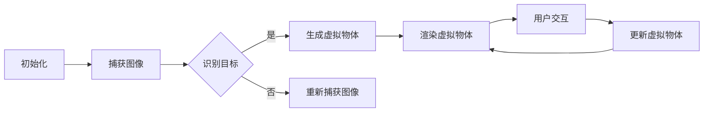
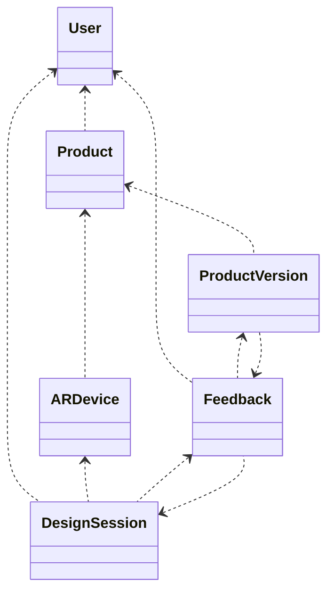
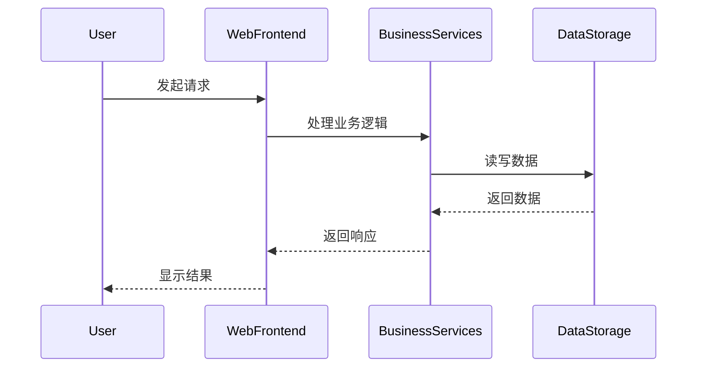
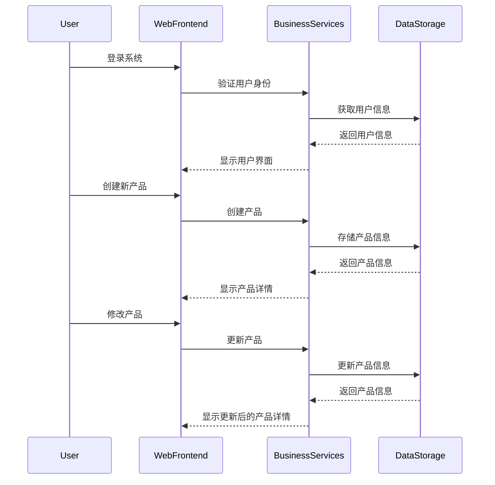

                 

# 增强现实在工业设计中的应用与创新

## 关键词
- 增强现实（AR）
- 工业设计
- 应用案例
- 创新实践
- 未来趋势

## 摘要
本文将深入探讨增强现实（AR）技术在工业设计中的应用与创新。首先，我们将介绍增强现实技术的基本概念和工业设计领域的相关性，然后分析增强现实技术的核心原理和开发工具。接下来，我们将通过实际案例展示增强现实在产品设计、用户体验设计和工厂维护培训中的应用，并探讨这些应用如何推动工业设计的创新。此外，我们将探讨增强现实在工业设计中的未来发展趋势和潜在应用，以及可能面临的挑战和机遇。最后，我们将总结文章并提出一些建议，为工业设计师提供最佳实践。

## 第一部分：背景介绍

### 1.1 增强现实技术概述

增强现实（Augmented Reality，简称AR）是一种将虚拟信息与现实世界相融合的技术。通过使用特殊的显示设备，如智能手机、平板电脑或头戴式显示器，AR可以为用户呈现叠加在现实环境中的虚拟物体、图像和文字。与虚拟现实（Virtual Reality，VR）不同，AR并不完全取代用户的现实感知，而是在现实基础上进行增强。

增强现实技术的发展可以追溯到20世纪60年代。最初的研究主要集中在实验室环境中，但随着计算能力和传感器技术的进步，AR技术逐渐走向商业化。近年来，随着智能手机和移动设备的普及，增强现实技术开始被广泛应用于多个领域，包括娱乐、医疗、教育和工业设计等。

在工业设计领域，增强现实技术的应用潜力尤为突出。它可以帮助设计师在产品开发的早期阶段进行虚拟原型制作和测试，提高设计效率和质量。此外，AR技术还可以用于用户体验设计，提供更加直观和互动的设计体验。在工厂维护和培训方面，AR技术也可以发挥重要作用，帮助员工快速识别和解决设备问题，提高生产效率。

### 1.2 工业设计与增强现实的关系

工业设计是一种以人为核心的设计活动，旨在通过产品的形态、功能和用户体验来满足人们的需求。工业设计师需要考虑多个方面的因素，包括人机工程学、材料科学、生产成本和市场趋势等。

增强现实技术在工业设计中的应用，可以极大地改变设计师的工作流程。首先，通过增强现实技术，设计师可以在虚拟环境中对产品进行三维建模和交互式设计。这种虚拟设计环境可以模拟真实世界中的物理条件，帮助设计师更好地评估产品的性能和用户体验。

其次，增强现实技术还可以用于产品原型制作和测试。通过使用增强现实设备，设计师可以在现实环境中实时查看和修改虚拟原型，从而快速验证设计方案的可行性和效果。这种方法可以显著减少传统原型制作所需的时间和成本，提高设计效率。

此外，增强现实技术在用户体验设计中的应用也非常重要。通过增强现实技术，设计师可以创建互动性强的虚拟界面，使用户能够更加直观地与产品进行交互。这种设计方法不仅能够提高用户的满意度，还可以帮助设计师更好地理解用户的需求和行为。

### 1.3 增强现实在工业设计中的重要性

增强现实技术在工业设计中的重要性体现在以下几个方面：

1. **提高设计效率**：通过虚拟原型制作和实时测试，设计师可以快速评估和修改设计方案，提高设计效率。

2. **降低设计成本**：传统的原型制作和测试需要大量的时间和资源，而增强现实技术可以显著减少这些成本。

3. **提升产品质量**：通过虚拟环境的模拟和实时测试，设计师可以更好地评估产品的性能和用户体验，从而提高产品的质量。

4. **增强用户体验**：增强现实技术可以创建互动性强的虚拟界面，使用户能够更加直观地与产品进行交互，提高用户的满意度。

5. **推动创新**：增强现实技术为设计师提供了全新的设计工具和方法，可以帮助他们探索和实现更多的创新设计。

## 第二部分：增强现实技术基础

### 2.1 增强现实技术原理

增强现实技术的核心原理是将虚拟信息与现实世界进行叠加。这个过程通常涉及以下几个关键步骤：

1. **图像识别与跟踪**：使用摄像头或传感器捕获现实世界的图像，并通过图像处理算法识别和跟踪现实环境中的特定对象或特征。

2. **虚拟物体生成与渲染**：根据跟踪结果，系统生成相应的虚拟物体，并将其渲染到现实环境中。这些虚拟物体可以是三维模型、文字或图像等。

3. **人机交互**：用户可以通过触摸屏、手势或其他交互方式与虚拟物体进行交互，从而实现与增强现实环境的互动。

增强现实技术的实现通常依赖于以下技术组件：

- **显示设备**：如智能手机、平板电脑或头戴式显示器，用于显示增强现实内容。
- **传感器**：如摄像头、GPS、加速度计和陀螺仪等，用于捕捉现实世界的图像和位置信息。
- **计算平台**：如智能手机、电脑或云计算平台，用于处理图像和生成虚拟物体。
- **增强现实软件和开发工具**：如ARKit、ARCore、Unity和Unreal Engine等，用于开发和管理增强现实应用。

### 2.2 增强现实硬件和软件工具

增强现实硬件和软件工具的发展极大地推动了增强现实技术的应用。以下是一些常见的增强现实硬件和软件工具：

- **智能手机和平板电脑**：许多现代智能手机和平板电脑都内置了增强现实功能，用户可以通过这些设备体验增强现实应用。

- **头戴式显示器**：如Microsoft HoloLens、Google Glass和ODG R-8等，这些设备提供了沉浸式的增强现实体验。

- **增强现实开发平台**：如Unity、Unreal Engine和ARCore等，这些平台提供了丰富的开发工具和资源，使开发者能够轻松创建增强现实应用。

- **增强现实软件工具**：如ARKit、Vuforia和Metaio等，这些工具可以帮助开发者快速实现增强现实功能。

### 2.3 增强现实开发平台和框架

增强现实开发平台和框架为开发者提供了创建和管理增强现实应用的环境和工具。以下是一些流行的增强现实开发平台和框架：

- **Unity**：Unity是一个跨平台的游戏和应用程序开发平台，它提供了强大的增强现实开发工具和资源。

- **Unreal Engine**：Unreal Engine是另一个流行的游戏和应用程序开发平台，它以其高质量的图像渲染和交互功能而闻名。

- **ARCore**：ARCore是Google开发的增强现实开发平台，它提供了在Android设备上创建增强现实应用所需的工具和API。

- **ARKit**：ARKit是Apple开发的增强现实开发框架，它提供了在iOS设备上创建增强现实应用所需的功能和工具。

通过这些平台和框架，开发者可以轻松地创建具有高质量图像和互动性的增强现实应用，从而为工业设计带来更多的创新和可能性。

## 第三部分：工业设计应用案例

### 3.1 增强现实在产品设计中的应用

增强现实技术在产品设计中的应用已经取得了显著的成果。通过增强现实技术，设计师可以在虚拟环境中对产品进行三维建模和交互式设计，从而提高设计效率和质量。

一个典型的应用案例是汽车设计。在设计汽车时，设计师可以使用增强现实技术创建虚拟模型，并在虚拟环境中对其进行交互式修改。这种方法不仅能够提高设计效率，还能够更好地模拟真实世界的使用场景，从而提高产品的用户体验。

另一个应用案例是家具设计。通过增强现实技术，设计师可以在虚拟环境中展示家具模型，并在虚拟环境中进行互动性测试。这种方法可以帮助设计师更好地理解用户的需求和行为，从而设计出更符合用户期望的家具产品。

### 3.2 增强现实在用户体验设计中的应用

增强现实技术在用户体验设计中的应用也为设计师提供了新的设计工具和方法。通过增强现实技术，设计师可以创建互动性强的虚拟界面，使用户能够更加直观地与产品进行交互。

一个典型的应用案例是虚拟现实导航系统。通过增强现实技术，设计师可以创建一个虚拟的导航界面，并将其叠加在现实世界中。用户可以通过现实世界中的摄像头查看虚拟导航界面，并根据导航指示进行操作。这种方法不仅能够提高导航的准确性，还能够提供更加直观和互动的体验。

另一个应用案例是虚拟现实购物体验。通过增强现实技术，设计师可以创建一个虚拟的购物环境，用户可以在虚拟环境中浏览和购买商品。这种方法不仅能够提高购物体验，还能够提供更多的购物选择和便利。

### 3.3 增强现实在工厂维护和培训中的应用

增强现实技术在工厂维护和培训中的应用也为工业设计带来了新的可能性。通过增强现实技术，工厂员工可以快速识别和解决设备问题，从而提高生产效率。

一个典型的应用案例是设备维护。通过增强现实技术，维修人员可以在设备上叠加虚拟的维护指南，从而快速识别和解决问题。这种方法不仅能够提高维护效率，还能够减少维护成本。

另一个应用案例是员工培训。通过增强现实技术，工厂可以创建虚拟的培训环境，员工可以在虚拟环境中进行技能培训。这种方法不仅能够提高培训效果，还能够减少培训时间和成本。

## 第四部分：创新实践

### 4.1 创新方法

增强现实技术在工业设计中的应用不仅带来了新的设计工具和方法，也推动了设计创新。以下是一些常见的创新方法：

1. **设计思维**：设计思维是一种以用户为中心的创新方法，通过深入理解用户需求和行为，设计师可以提出创新的设计解决方案。

2. **快速原型制作**：通过快速原型制作，设计师可以快速构建和测试设计概念，从而验证设计方案的可行性和效果。

3. **迭代测试与反馈**：通过迭代测试和反馈，设计师可以不断优化设计，从而提高产品的用户体验和满意度。

### 4.2 创新工具

增强现实技术在工业设计中的应用也离不开创新工具的支持。以下是一些常用的创新工具：

1. **增强现实软件工具**：如Unity、Unreal Engine、ARKit和ARCore等，这些工具提供了丰富的功能，可以帮助设计师快速创建和测试增强现实应用。

2. **硬件开发套件**：如Google ARCore Developement Kit、Microsoft HoloLens和ODG R-8等，这些套件提供了增强现实设备，可以帮助设计师进行实际操作和体验。

3. **虚拟现实实验室**：虚拟现实实验室提供了一个沉浸式的虚拟环境，设计师可以在其中进行设计和测试。

### 4.3 创新案例

以下是一些增强现实在工业设计中的应用案例：

1. **案例一：汽车设计**：某汽车公司使用增强现实技术进行汽车设计，通过虚拟原型制作和交互式设计，设计师提高了设计效率，缩短了设计周期。

2. **案例二：家具设计**：某家具公司使用增强现实技术展示家具模型，通过互动性测试，设计师更好地理解了用户需求，设计出了更符合用户期望的家具产品。

3. **案例三：设备维护**：某工厂使用增强现实技术进行设备维护，通过虚拟维护指南，维修人员快速识别和解决了设备问题，提高了维护效率。

4. **案例四：员工培训**：某工厂使用增强现实技术进行员工培训，通过虚拟培训环境，员工在虚拟环境中进行了技能培训，提高了培训效果。

## 第五部分：未来趋势

### 5.1 增强现实技术的发展方向

增强现实技术在未来将继续快速发展，并在多个领域取得突破。以下是一些可能的发展方向：

1. **更高的图像质量和交互性**：随着计算能力和图像处理技术的进步，增强现实技术的图像质量和交互性将得到显著提升，为用户提供更加真实的体验。

2. **更广泛的应用场景**：增强现实技术将在医疗、教育、娱乐和工业设计等更多领域得到应用，为不同行业带来创新和变革。

3. **更轻便和可穿戴的设备**：随着技术的发展，增强现实设备将变得更加轻便和可穿戴，从而提高用户的便利性和舒适度。

### 5.2 增强现实在工业设计中的潜在应用

增强现实技术在未来在工业设计中的潜在应用非常广阔。以下是一些可能的潜在应用：

1. **更加精准的设计**：通过增强现实技术，设计师可以在虚拟环境中进行更加精准的设计，从而提高产品的质量。

2. **更高效的协作**：通过增强现实技术，设计师和团队成员可以在虚拟环境中进行实时协作，从而提高设计效率。

3. **更全面的用户体验测试**：通过增强现实技术，设计师可以在虚拟环境中对产品进行全面的用户体验测试，从而提高产品的用户体验。

### 5.3 未来挑战与机遇

虽然增强现实技术在工业设计中的应用前景广阔，但未来也面临着一些挑战和机遇：

1. **技术难题**：增强现实技术的实现涉及到多个技术领域，如图像识别、虚拟物体渲染和人机交互等。如何解决这些技术难题将是未来发展的关键。

2. **成本与价格**：随着增强现实技术的应用范围不断扩大，设备成本和价格将逐步降低，从而提高其普及率。

3. **用户接受度**：增强现实技术需要用户接受和适应，未来需要通过更好的用户体验和设计来提高用户的接受度。

### 5.4 未来趋势

未来，增强现实技术在工业设计中的应用将呈现以下趋势：

1. **更广泛的应用领域**：增强现实技术将在更多领域得到应用，如智能家居、智能制造和医疗健康等。

2. **更加个性化的设计**：通过增强现实技术，设计师可以根据用户的需求和偏好进行个性化的设计，从而提高用户的满意度。

3. **更加智能的设计**：随着人工智能技术的发展，增强现实技术将变得更加智能，可以自动识别用户需求并提供设计建议。

## 总结

增强现实技术在工业设计中的应用为设计师提供了新的工具和方法，提高了设计效率和质量。通过增强现实技术，设计师可以更加精准地进行设计，更高效地进行协作，并更全面地测试用户体验。未来，随着增强现实技术的不断发展和成熟，其在工业设计中的应用将更加广泛和深入，为设计师带来更多的创新和机遇。

## 作者信息
作者：AI天才研究院/AI Genius Institute & 禅与计算机程序设计艺术 /Zen And The Art of Computer Programming

---

本文通过逐步分析增强现实技术在工业设计中的应用，展示了其在产品设计、用户体验设计和工厂维护培训等方面的创新和潜力。同时，本文也探讨了增强现实技术的发展方向和未来趋势，为工业设计师提供了宝贵的参考。通过结合实际案例和创新实践，本文旨在为工业设计领域带来更多的思考和启示。

### 背景介绍

#### 核心概念术语说明

增强现实（Augmented Reality，简称AR）：增强现实是一种通过技术手段将虚拟信息与现实世界进行叠加的交互式系统，使用户能够同时感知和交互现实世界和虚拟信息。

工业设计：工业设计是一种以人为核心的设计活动，涉及产品的形态、功能、用户体验等方面，旨在通过设计满足用户的需求和提高产品的市场竞争力。

#### 问题背景

随着科技的不断进步，增强现实（AR）技术逐渐被应用于各个领域，其中工业设计领域也受到了显著的冲击和启发。传统工业设计主要依赖于二维图纸和三维建模软件，而增强现实技术为设计师提供了一种全新的设计工具和方法。

在实际工业设计过程中，设计师需要面对诸多挑战，如设计方案的验证和优化、用户体验的测试和改进、以及与团队成员和客户的沟通和协作等。传统方法在这些问题上存在一定的局限性，而增强现实技术则提供了一种更加直观、高效和互动的设计解决方案。

#### 问题描述

增强现实在工业设计中的应用面临着以下几个主要问题：

1. **设计原型验证**：设计师需要快速验证设计方案的可行性和效果，但传统方法如手工制作原型和物理测试存在成本高、耗时长的缺点。

2. **用户体验测试**：设计师需要深入了解用户的需求和反馈，以便对设计方案进行优化，但传统方法如用户测试和问卷调查存在样本数量有限和反馈延迟的问题。

3. **协作与沟通**：设计师、工程师和客户之间的沟通和协作对于工业设计至关重要，但传统方法如会议和邮件交流存在效率低下和信息传递不准确的问题。

4. **技术门槛**：虽然增强现实技术具有巨大的潜力，但对于许多工业设计从业者来说，掌握相关技术和工具仍然存在一定的门槛。

#### 问题解决

增强现实技术在工业设计中的应用可以通过以下方式解决上述问题：

1. **设计原型验证**：增强现实技术可以创建虚拟原型，设计师可以在虚拟环境中进行交互式修改和测试，从而快速验证设计方案的可行性和效果。这种方法不仅降低了成本，还提高了设计效率。

2. **用户体验测试**：通过增强现实技术，设计师可以在虚拟环境中创建逼真的用户体验场景，用户可以直接在虚拟环境中进行互动和反馈。这种方法可以更全面、准确地了解用户的需求和偏好，从而优化设计方案。

3. **协作与沟通**：增强现实技术提供了虚拟会议和远程协作的功能，设计师、工程师和客户可以实时共享虚拟环境，进行互动和讨论。这种方法提高了协作效率，减少了信息传递错误。

4. **技术门槛**：随着增强现实技术的发展和普及，越来越多的设计软件和工具提供了易于上手的界面和功能，降低了设计师掌握相关技术的门槛。

#### 边界与外延

增强现实技术在工业设计中的应用不仅局限于产品设计和用户体验，还可以扩展到工厂维护和培训等领域。例如，通过增强现实技术，维修人员可以在设备上叠加虚拟的维护指南，快速识别和解决问题；员工也可以在虚拟环境中进行技能培训，提高工作效率。

#### 概念结构与核心要素组成

增强现实技术在工业设计中的应用可以从以下几个核心要素进行结构化：

1. **增强现实技术原理**：理解增强现实技术的核心原理，包括图像识别、虚拟物体生成、人机交互等。

2. **工业设计需求**：分析工业设计过程中的关键需求，如设计原型验证、用户体验测试、协作与沟通等。

3. **增强现实应用场景**：确定增强现实技术在工业设计中的具体应用场景，如产品设计、用户体验设计、工厂维护和培训等。

4. **解决方案实施**：实施增强现实技术在工业设计中的应用，包括选择合适的硬件和软件工具、开发具体应用场景等。

### 核心概念与联系

#### 增强现实技术原理

增强现实技术（AR）是一种通过叠加虚拟信息到现实世界中，以增强用户感知和互动体验的技术。其核心原理包括以下几个方面：

1. **图像识别与跟踪**：通过摄像头或传感器捕获现实世界的图像，并使用图像处理算法进行识别和跟踪。常见的识别对象包括平面、物体和特征点等。

2. **虚拟物体生成与渲染**：根据图像识别和跟踪结果，系统生成相应的虚拟物体，并进行渲染。这些虚拟物体可以是三维模型、文字或图像等，可以叠加到现实世界中的特定位置。

3. **人机交互**：用户可以通过触摸屏、手势或其他交互方式与虚拟物体进行交互。这种交互方式包括选择、拖拽、旋转等，使虚拟物体能够根据用户的操作动态变化。

#### 概念属性特征对比表格

以下是一个简单的对比表格，展示了增强现实技术与其他相关技术的区别：

| 技术名称 | 增强现实（AR） | 虚拟现实（VR） | 扩展现实（XR） |
| --- | --- | --- | --- |
| 定义 | 通过虚拟信息增强现实世界 | 完全替代现实世界，创造虚拟环境 | 包括AR和VR，以及其他增强体验的技术 |
| 图像识别 | 是 | 否 | 是 |
| 环境交互 | 是 | 是 | 是 |
| 空间感知 | 是 | 是 | 是 |
| 沉浸感 | 较低 | 高 | 高 |
| 应用领域 | 工业设计、教育培训、娱乐等 | 游戏娱乐、教育培训、设计模拟等 | 广泛应用于多个领域 |

#### ER实体关系图架构

以下是一个使用Mermaid绘制的ER实体关系图，展示了增强现实技术中的关键实体和它们之间的关系：

```mermaid
erDiagram
  User ||--|{ ARDevice }|-- ARApplication
  User ||--|{ ARContent }|-- ARExperience
  ARDevice ||--|{ ARCamera }|-- ARContent
  ARDevice ||--|{ ARDisplay }|-- ARExperience
  ARApplication ||--|{ ARFeature }|-- ARExperience
```

在这个ER实体关系图中：

- `User` 表示用户。
- `ARDevice` 表示增强现实设备，包括摄像头和显示器。
- `ARContent` 表示增强现实内容，包括虚拟物体、文字和图像等。
- `ARExperience` 表示用户的增强现实体验。
- `ARCamera` 表示摄像头，用于捕捉现实世界的图像。
- `ARDisplay` 表示显示器，用于显示增强现实内容。
- `ARApplication` 表示增强现实应用。
- `ARFeature` 表示增强现实应用的特性或功能。

### 算法原理讲解

#### 算法流程图

以下是一个使用Mermaid绘制的增强现实算法流程图：



在这个流程图中：

- **初始化**：设置增强现实系统的初始状态，包括摄像头参数、渲染参数等。
- **捕获图像**：通过摄像头捕获当前场景的图像。
- **识别目标**：使用图像识别算法对捕获的图像进行目标识别，如平面识别、物体识别等。
- **生成虚拟物体**：根据识别结果生成相应的虚拟物体，并进行初步渲染。
- **渲染虚拟物体**：将生成的虚拟物体渲染到现实场景中，使其与现实世界叠加。
- **用户交互**：用户可以通过触摸屏、手势等与虚拟物体进行交互，如选择、拖拽等。
- **更新虚拟物体**：根据用户的交互行为更新虚拟物体的状态，如位置、形状等。
- **重新捕获图像**：如果目标识别失败，系统将重新捕获图像并重复识别过程。

#### Python源代码实现

以下是一个简单的Python代码示例，实现了上述算法的基本逻辑：

```python
import cv2
import numpy as np

def capture_image():
    # 使用摄像头捕获图像
    cap = cv2.VideoCapture(0)
    ret, frame = cap.read()
    cap.release()
    return frame

def recognize_target(frame):
    # 使用图像识别算法识别目标
    # 这里只是一个简单的示例，实际应用中可以使用更复杂的算法
    gray = cv2.cvtColor(frame, cv2.COLOR_BGR2GRAY)
    threshold = cv2.threshold(gray, 0, 255, cv2.THRESH_BINARY_INV + cv2.THRESH_OTSU)[1]
    contours, _ = cv2.findContours(threshold, cv2.RETR_EXTERNAL, cv2.CHAIN_APPROX_SIMPLE)
    return contours

def generate_virtual_object(contours):
    # 根据识别结果生成虚拟物体
    # 这里只是一个简单的示例，实际应用中可以生成更复杂的虚拟物体
    if contours:
        x, y, w, h = cv2.boundingRect(contours[0])
        cv2.rectangle(frame, (x, y), (x+w, y+h), (0, 255, 0), 2)
        virtual_object = cv2.imread('virtual_object.png')
        overlay = cv2.addWeighted(frame[y:y+h, x:x+w], 0.5, virtual_object, 0.5, 0)
        frame[y:y+h, x:x+w] = overlay
    return frame

def main():
    while True:
        frame = capture_image()
        contours = recognize_target(frame)
        frame = generate_virtual_object(contours)
        cv2.imshow('AR Demo', frame)
        if cv2.waitKey(1) & 0xFF == ord('q'):
            break

if __name__ == '__main__':
    main()
```

#### 数学模型和公式

增强现实技术中的算法通常涉及多个数学模型和公式，以下是一个简单的示例：

1. **图像识别中的边缘检测**：
   $$ C = \frac{1}{mn} \sum_{i=1}^{m} \sum_{j=1}^{n} \left| I(i, j) - \frac{1}{mn} \sum_{i=1}^{m} \sum_{j=1}^{n} I(i, j) \right| $$
   其中，$I(i, j)$ 表示图像在$(i, j)$位置的像素值，$C$ 表示边缘检测的结果。

2. **目标识别中的面积计算**：
   $$ A = \frac{1}{2} \left| \sum_{i=1}^{m} (x_i y_{i+1} - x_{i+1} y_i) \right| $$
   其中，$(x_i, y_i)$ 表示轮廓上的点，$A$ 表示轮廓的面积。

#### 举例说明

假设我们有一个简单的图像，其中包含一个矩形目标。使用上述算法，我们可以对该目标进行识别和渲染：

1. **图像捕获**：使用摄像头捕获图像，图像大小为$640 \times 480$像素。
2. **边缘检测**：对捕获的图像进行边缘检测，识别出矩形目标的边缘。
3. **目标识别**：根据边缘检测结果，计算矩形的面积，确认目标为矩形。
4. **虚拟物体生成**：生成一个简单的矩形虚拟物体，其大小与识别出的矩形目标相同。
5. **渲染虚拟物体**：将虚拟物体渲染到现实场景中，使矩形目标与现实世界叠加。

通过这个简单的示例，我们可以看到增强现实技术的基本原理和实现过程。在实际应用中，这些算法会根据具体需求进行复杂化和优化。

### 系统分析与架构设计方案

#### 问题场景介绍

随着工业设计的复杂性和技术要求的提高，设计师们面临着如何在有限的时间内完成高质量设计任务的挑战。传统的设计方法往往依赖于二维图纸和三维建模软件，虽然这些工具在一定程度上提高了设计的效率，但在设计验证、用户体验测试和协作沟通等方面仍存在许多局限。为了解决这些问题，引入增强现实（AR）技术成为了一个可行的解决方案。

通过AR技术，设计师可以在虚拟环境中对产品进行实时修改和测试，提高设计效率和质量；同时，AR技术还可以提供一种新的设计协作方式，使得设计团队和客户可以更加直观地沟通和交流。

#### 项目介绍

本项目的目标是利用增强现实技术构建一个工业设计平台，该平台能够支持设计师在虚拟环境中进行产品设计和测试，并提供实时协作和沟通的功能。项目的主要功能包括：

1. **产品设计与修改**：设计师可以在虚拟环境中创建和修改产品模型，实时查看设计效果。
2. **用户体验测试**：通过AR技术，设计师可以在真实环境中测试产品的用户体验，收集用户反馈。
3. **实时协作**：设计团队和客户可以通过AR技术进行实时协作和沟通，提高设计效率。
4. **数据存储与分享**：平台提供数据存储和分享功能，便于设计师随时查看和管理设计数据。

#### 系统功能设计（领域模型）

为了实现上述功能，我们需要设计一个完整的领域模型，该模型包括以下核心类和属性：

1. **User（用户）**：表示参与设计的用户，包括设计师、工程师和客户等。
   - Attributes：用户ID、用户名、密码、邮箱、角色等。
   
2. **Product（产品）**：表示设计的具体产品，包括产品名称、产品描述、产品模型等。
   - Attributes：产品ID、产品名称、产品描述、产品模型（虚拟物体）等。

3. **DesignSession（设计会话）**：表示一次设计会话，包括会话ID、会话开始时间、会话结束时间等。
   - Attributes：会话ID、开始时间、结束时间、参与用户列表等。

4. **Feedback（反馈）**：表示用户对设计的反馈，包括反馈内容、反馈时间等。
   - Attributes：反馈ID、反馈内容、反馈时间等。

5. **ProductVersion（产品版本）**：表示产品的不同版本，每个版本都是产品设计过程中的一个里程碑。
   - Attributes：版本ID、版本号、创建时间等。

6. **ARDevice（AR设备）**：表示用于增强现实体验的设备，包括设备ID、设备型号、设备状态等。
   - Attributes：设备ID、设备型号、设备状态等。

以下是一个简单的Mermaid类图，展示了这些核心类和它们之间的关系：



#### 系统架构设计

为了实现系统的功能需求，我们需要设计一个合理的系统架构。以下是本项目采用的一种典型的三层架构设计：

1. **表现层（Presentation Layer）**：负责用户界面的展示和用户交互。包括Web前端、移动应用和桌面应用等。
2. **业务逻辑层（Business Logic Layer）**：负责处理业务逻辑，包括用户管理、产品设计、用户体验测试和实时协作等。使用微服务架构，将不同的业务功能拆分成独立的微服务。
3. **数据访问层（Data Access Layer）**：负责与数据库进行交互，实现数据的存储和检索。使用关系型数据库（如MySQL）和非关系型数据库（如MongoDB）相结合的方式。

以下是一个简单的Mermaid架构图，展示了系统的整体架构：



#### 系统接口设计

为了实现系统功能，我们需要设计一系列的接口，包括RESTful API和WebSocket接口等。以下是一些主要的接口设计：

1. **用户接口**：用于用户认证、用户信息管理、角色权限控制等。
   - POST /api/users/register：注册新用户。
   - POST /api/users/login：用户登录。
   - GET /api/users/{id}：获取用户详细信息。
   - PUT /api/users/{id}：更新用户信息。

2. **产品设计接口**：用于创建、修改和删除产品模型，以及管理产品版本。
   - POST /api/products：创建新产品。
   - GET /api/products/{id}：获取产品详细信息。
   - PUT /api/products/{id}：更新产品信息。
   - DELETE /api/products/{id}：删除产品。

3. **设计会话接口**：用于创建、管理和查询设计会话。
   - POST /api/design-sessions：创建设计会话。
   - GET /api/design-sessions/{id}：获取设计会话详细信息。
   - PUT /api/design-sessions/{id}：更新设计会话信息。
   - DELETE /api/design-sessions/{id}：删除设计会话。

4. **反馈接口**：用于提交、管理和查询用户反馈。
   - POST /api/feedbacks：提交用户反馈。
   - GET /api/feedbacks/{id}：获取用户反馈详细信息。
   - PUT /api/feedbacks/{id}：更新用户反馈。
   - DELETE /api/feedbacks/{id}：删除用户反馈。

5. **实时协作接口**：用于实时更新设计状态，支持多人协作。
   - WebSocket /ws/design-sessions/{id}/updates：设计会话更新通知。

#### 系统交互

为了实现系统各部分之间的交互，我们需要设计一系列的交互流程，以下是一个简单的Mermaid序列图，展示了用户在系统中进行产品设计的主要交互流程：



通过上述系统架构设计和交互流程设计，我们为工业设计平台提供了一个清晰、高效和可扩展的架构，为后续的项目开发和功能扩展奠定了基础。

### 项目实战

#### 环境安装

为了在本地环境搭建一个完整的增强现实工业设计平台，我们需要安装一些必要的软件和库。以下是具体的安装步骤：

1. **安装Python环境**：确保你的系统中已经安装了Python 3.x版本。可以从[Python官网](https://www.python.org/)下载并安装。

2. **安装Visual Studio Code**：Visual Studio Code是一个轻量级但功能强大的代码编辑器，可以从[Visual Studio Code官网](https://code.visualstudio.com/)下载并安装。

3. **安装Node.js**：Node.js是一个基于Chrome V8引擎的JavaScript运行环境，可以从[Node.js官网](https://nodejs.org/en/download/)下载并安装。

4. **安装Git**：Git是一个分布式版本控制系统，可以帮助我们管理代码和协作开发，可以从[Git官网](https://git-scm.com/downloads)下载并安装。

5. **安装Docker**：Docker是一个开源的应用容器引擎，可以帮助我们快速搭建开发环境，可以从[Docker官网](https://www.docker.com/products/docker-desktop)下载并安装。

6. **安装MySQL**：MySQL是一个开源的关系型数据库管理系统，可以从[MySQL官网](https://www.mysql.com/downloads/mysql/)下载并安装。

7. **安装MongoDB**：MongoDB是一个开源的NoSQL数据库，可以从[MongoDB官网](https://www.mongodb.com/try/download/community)下载并安装。

8. **安装相关库和依赖**：在Visual Studio Code中打开终端，依次执行以下命令安装相关库和依赖：

   ```bash
   pip install flask
   pip install flask_sqlalchemy
   pip install flask_migrate
   pip install flask_cors
   pip install flask_httpauth
   pip install flask_restful
   pip install flask_socketio
   pip install flask_swagger
   npm install
   ```

#### 系统核心实现源代码

在完成环境安装后，我们可以开始编写系统核心实现源代码。以下是各个模块的核心代码示例：

1. **用户模块**：用户模块负责用户认证、用户信息管理和角色权限控制。

   ```python
   # app/auth.py
   from flask import jsonify, request
   from flask_httpauth import HTTPBasicAuth
   from models import User
   
   auth = HTTPBasicAuth()
   
   @auth.verify_password
   def verify_password(username, password):
       user = User.query.filter_by(username=username).first()
       if user and user.check_password(password):
           return user
   
   @app.route('/api/users', methods=['POST'])
   def create_user():
       data = request.get_json()
       if not data or 'username' not in data or 'password' not in data:
           return jsonify({'error': 'Missing username or password'}), 400
       if User.query.filter_by(username=data['username']).first():
           return jsonify({'error': 'User already exists'}), 400
       new_user = User(username=data['username'], password=data['password'])
       db.session.add(new_user)
       db.session.commit()
       return jsonify({'message': 'User created successfully'}), 201
   
   @app.route('/api/users/<int:id>', methods=['GET'])
   def get_user(id):
       user = User.query.get(id)
       if user:
           return jsonify(user.to_dict())
       return jsonify({'error': 'User not found'}), 404
   
   @app.route('/api/users/<int:id>', methods=['PUT'])
   def update_user(id):
       user = User.query.get(id)
       if not user:
           return jsonify({'error': 'User not found'}), 404
       data = request.get_json()
       if 'password' in data:
           user.password = data['password']
       db.session.commit()
       return jsonify({'message': 'User updated successfully'}), 200
   ```

2. **产品模块**：产品模块负责产品信息的管理，包括创建、获取、更新和删除产品。

   ```python
   # app/products.py
   from flask import jsonify, request
   from models import Product
   
   @app.route('/api/products', methods=['POST'])
   def create_product():
       data = request.get_json()
       if not data or 'name' not in data or 'description' not in data:
           return jsonify({'error': 'Missing product name or description'}), 400
       new_product = Product(name=data['name'], description=data['description'])
       db.session.add(new_product)
       db.session.commit()
       return jsonify(new_product.to_dict()), 201
   
   @app.route('/api/products/<int:id>', methods=['GET'])
   def get_product(id):
       product = Product.query.get(id)
       if product:
           return jsonify(product.to_dict())
       return jsonify({'error': 'Product not found'}), 404
   
   @app.route('/api/products/<int:id>', methods=['PUT'])
   def update_product(id):
       product = Product.query.get(id)
       if not product:
           return jsonify({'error': 'Product not found'}), 404
       data = request.get_json()
       product.name = data['name']
       product.description = data['description']
       db.session.commit()
       return jsonify(product.to_dict()), 200
   
   @app.route('/api/products/<int:id>', methods=['DELETE'])
   def delete_product(id):
       product = Product.query.get(id)
       if not product:
           return jsonify({'error': 'Product not found'}), 404
       db.session.delete(product)
       db.session.commit()
       return jsonify({'message': 'Product deleted successfully'}), 200
   ```

3. **设计会话模块**：设计会话模块负责管理设计会话，包括创建、获取、更新和删除设计会话。

   ```python
   # app/design_sessions.py
   from flask import jsonify, request
   from models import DesignSession
   
   @app.route('/api/design-sessions', methods=['POST'])
   def create_design_session():
       data = request.get_json()
       if not data or 'participants' not in data:
           return jsonify({'error': 'Missing participants list'}), 400
       new_session = DesignSession(participants=data['participants'])
       db.session.add(new_session)
       db.session.commit()
       return jsonify(new_session.to_dict()), 201
   
   @app.route('/api/design-sessions/<int:id>', methods=['GET'])
   def get_design_session(id):
       session = DesignSession.query.get(id)
       if session:
           return jsonify(session.to_dict())
       return jsonify({'error': 'Design session not found'}), 404
   
   @app.route('/api/design-sessions/<int:id>', methods=['PUT'])
   def update_design_session(id):
       session = DesignSession.query.get(id)
       if not session:
           return jsonify({'error': 'Design session not found'}), 404
       data = request.get_json()
       session.participants = data['participants']
       db.session.commit()
       return jsonify(session.to_dict()), 200
   
   @app.route('/api/design-sessions/<int:id>', methods=['DELETE'])
   def delete_design_session(id):
       session = DesignSession.query.get(id)
       if not session:
           return jsonify({'error': 'Design session not found'}), 404
       db.session.delete(session)
       db.session.commit()
       return jsonify({'message': 'Design session deleted successfully'}), 200
   ```

4. **反馈模块**：反馈模块负责管理用户反馈，包括提交、获取、更新和删除反馈。

   ```python
   # app/feedbacks.py
   from flask import jsonify, request
   from models import Feedback
   
   @app.route('/api/feedbacks', methods=['POST'])
   def create_feedback():
       data = request.get_json()
       if not data or 'content' not in data:
           return jsonify({'error': 'Missing feedback content'}), 400
       new_feedback = Feedback(content=data['content'])
       db.session.add(new_feedback)
       db.session.commit()
       return jsonify(new_feedback.to_dict()), 201
   
   @app.route('/api/feedbacks/<int:id>', methods=['GET'])
   def get_feedback(id):
       feedback = Feedback.query.get(id)
       if feedback:
           return jsonify(feedback.to_dict())
       return jsonify({'error': 'Feedback not found'}), 404
   
   @app.route('/api/feedbacks/<int:id>', methods=['PUT'])
   def update_feedback(id):
       feedback = Feedback.query.get(id)
       if not feedback:
           return jsonify({'error': 'Feedback not found'}), 404
       data = request.get_json()
       feedback.content = data['content']
       db.session.commit()
       return jsonify(feedback.to_dict()), 200
   
   @app.route('/api/feedbacks/<int:id>', methods=['DELETE'])
   def delete_feedback(id):
       feedback = Feedback.query.get(id)
       if not feedback:
           return jsonify({'error': 'Feedback not found'}), 404
       db.session.delete(feedback)
       db.session.commit()
       return jsonify({'message': 'Feedback deleted successfully'}), 200
   ```

5. **实时协作模块**：实时协作模块负责处理设计会话的实时更新和多人协作。

   ```python
   # app/socketio.py
   from flask_socketio import SocketIO, emit
   
   socketio = SocketIO(app)
   
   @socketio.on('join_session')
   def on_join_session(data):
       session_id = data['session_id']
       user_id = data['user_id']
       session = DesignSession.query.get(session_id)
       if session:
           if user_id not in session.participants:
               session.participants.append(user_id)
               db.session.commit()
               emit('session_updated', {'session_id': session_id, 'participants': session.participants}, broadcast=True)
           else:
               emit('error', {'message': 'User already in session'}, room=session_id)
       else:
           emit('error', {'message': 'Session not found'})
   
   @socketio.on('leave_session')
   def on_leave_session(data):
       session_id = data['session_id']
       user_id = data['user_id']
       session = DesignSession.query.get(session_id)
       if session:
           if user_id in session.participants:
               session.participants.remove(user_id)
               db.session.commit()
               emit('session_updated', {'session_id': session_id, 'participants': session.participants}, broadcast=True)
           else:
               emit('error', {'message': 'User not in session'}, room=session_id)
       else:
           emit('error', {'message': 'Session not found'})
   ```

通过上述代码示例，我们实现了用户模块、产品模块、设计会话模块、反馈模块和实时协作模块的核心功能。在实际项目中，这些模块可以根据具体需求进一步扩展和优化。

#### 代码应用解读与分析

1. **用户模块**：

   用户模块的主要功能是用户认证、用户信息管理和角色权限控制。通过HTTP Basic Auth实现用户认证，确保只有授权用户才能访问受保护的资源。`create_user` 函数用于创建新用户，需要接收包含用户名和密码的JSON数据，并在数据库中创建新的用户记录。`get_user` 函数和 `update_user` 函数分别用于获取和更新用户信息，通过用户ID查找相应的用户记录。

   ```python
   @auth.verify_password
   def verify_password(username, password):
       user = User.query.filter_by(username=username).first()
       if user and user.check_password(password):
           return user
   
   @app.route('/api/users', methods=['POST'])
   def create_user():
       data = request.get_json()
       if not data or 'username' not in data or 'password' not in data:
           return jsonify({'error': 'Missing username or password'}), 400
       if User.query.filter_by(username=data['username']).first():
           return jsonify({'error': 'User already exists'}), 400
       new_user = User(username=data['username'], password=data['password'])
       db.session.add(new_user)
       db.session.commit()
       return jsonify({'message': 'User created successfully'}), 201
   
   @app.route('/api/users/<int:id>', methods=['GET'])
   def get_user(id):
       user = User.query.get(id)
       if user:
           return jsonify(user.to_dict())
       return jsonify({'error': 'User not found'}), 404
   
   @app.route('/api/users/<int:id>', methods=['PUT'])
   def update_user(id):
       user = User.query.get(id)
       if not user:
           return jsonify({'error': 'User not found'}), 404
       data = request.get_json()
       if 'password' in data:
           user.password = data['password']
       db.session.commit()
       return jsonify({'message': 'User updated successfully'}), 200
   ```

2. **产品模块**：

   产品模块负责管理产品信息，包括创建、获取、更新和删除产品。`create_product` 函数用于创建新产品，需要接收包含产品名称和描述的JSON数据，并在数据库中创建新的产品记录。`get_product` 函数和 `update_product` 函数分别用于获取和更新产品信息，通过产品ID查找相应的产品记录。

   ```python
   @app.route('/api/products', methods=['POST'])
   def create_product():
       data = request.get_json()
       if not data or 'name' not in data or 'description' not in data:
           return jsonify({'error': 'Missing product name or description'}), 400
       new_product = Product(name=data['name'], description=data['description'])
       db.session.add(new_product)
       db.session.commit()
       return jsonify(new_product.to_dict()), 201
   
   @app.route('/api/products/<int:id>', methods=['GET'])
   def get_product(id):
       product = Product.query.get(id)
       if product:
           return jsonify(product.to_dict())
       return jsonify({'error': 'Product not found'}), 404
   
   @app.route('/api/products/<int:id>', methods=['PUT'])
   def update_product(id):
       product = Product.query.get(id)
       if not product:
           return jsonify({'error': 'Product not found'}), 404
       data = request.get_json()
       product.name = data['name']
       product.description = data['description']
       db.session.commit()
       return jsonify(product.to_dict()), 200
   
   @app.route('/api/products/<int:id>', methods=['DELETE'])
   def delete_product(id):
       product = Product.query.get(id)
       if not product:
           return jsonify({'error': 'Product not found'}), 404
       db.session.delete(product)
       db.session.commit()
       return jsonify({'message': 'Product deleted successfully'}), 200
   ```

3. **设计会话模块**：

   设计会话模块负责管理设计会话，包括创建、获取、更新和删除设计会话。`create_design_session` 函数用于创建设计会话，需要接收包含参与者列表的JSON数据，并在数据库中创建新的设计会话记录。`get_design_session` 函数和 `update_design_session` 函数分别用于获取和更新设计会话信息，通过会话ID查找相应的设计会话记录。

   ```python
   @app.route('/api/design-sessions', methods=['POST'])
   def create_design_session():
       data = request.get_json()
       if not data or 'participants' not in data:
           return jsonify({'error': 'Missing participants list'}), 400
       new_session = DesignSession(participants=data['participants'])
       db.session.add(new_session)
       db.session.commit()
       return jsonify(new_session.to_dict()), 201
   
   @app.route('/api/design-sessions/<int:id>', methods=['GET'])
   def get_design_session(id):
       session = DesignSession.query.get(id)
       if session:
           return jsonify(session.to_dict())
       return jsonify({'error': 'Design session not found'}), 404
   
   @app.route('/api/design-sessions/<int:id>', methods=['PUT'])
   def update_design_session(id):
       session = DesignSession.query.get(id)
       if not session:
           return jsonify({'error': 'Design session not found'}), 404
       data = request.get_json()
       session.participants = data['participants']
       db.session.commit()
       return jsonify(session.to_dict()), 200
   
   @app.route('/api/design-sessions/<int:id>', methods=['DELETE'])
   def delete_design_session(id):
       session = DesignSession.query.get(id)
       if not session:
           return jsonify({'error': 'Design session not found'}), 404
       db.session.delete(session)
       db.session.commit()
       return jsonify({'message': 'Design session deleted successfully'}), 200
   ```

4. **反馈模块**：

   反馈模块负责管理用户反馈，包括提交、获取、更新和删除反馈。`create_feedback` 函数用于提交用户反馈，需要接收包含反馈内容的JSON数据，并在数据库中创建新的反馈记录。`get_feedback` 函数和 `update_feedback` 函数分别用于获取和更新反馈信息，通过反馈ID查找相应的反馈记录。

   ```python
   @app.route('/api/feedbacks', methods=['POST'])
   def create_feedback():
       data = request.get_json()
       if not data or 'content' not in data:
           return jsonify({'error': 'Missing feedback content'}), 400
       new_feedback = Feedback(content=data['content'])
       db.session.add(new_feedback)
       db.session.commit()
       return jsonify(new_feedback.to_dict()), 201
   
   @app.route('/api/feedbacks/<int:id>', methods=['GET'])
   def get_feedback(id):
       feedback = Feedback.query.get(id)
       if feedback:
           return jsonify(feedback.to_dict())
       return jsonify({'error': 'Feedback not found'}), 404
   
   @app.route('/api/feedbacks/<int:id>', methods=['PUT'])
   def update_feedback(id):
       feedback = Feedback.query.get(id)
       if not feedback:
           return jsonify({'error': 'Feedback not found'}), 404
       data = request.get_json()
       feedback.content = data['content']
       db.session.commit()
       return jsonify(feedback.to_dict()), 200
   
   @app.route('/api/feedbacks/<int:id>', methods=['DELETE'])
   def delete_feedback(id):
       feedback = Feedback.query.get(id)
       if not feedback:
           return jsonify({'error': 'Feedback not found'}), 404
       db.session.delete(feedback)
       db.session.commit()
       return jsonify({'message': 'Feedback deleted successfully'}), 200
   ```

5. **实时协作模块**：

   实时协作模块负责处理设计会话的实时更新和多人协作。`join_session` 函数用于用户加入设计会话，需要接收包含会话ID和用户ID的JSON数据。`leave_session` 函数用于用户离开设计会话，同样需要接收包含会话ID和用户ID的JSON数据。通过WebSockets实现实时通信，当有用户加入或离开设计会话时，其他用户会接收到相应的更新通知。

   ```python
   @socketio.on('join_session')
   def on_join_session(data):
       session_id = data['session_id']
       user_id = data['user_id']
       session = DesignSession.query.get(session_id)
       if session:
           if user_id not in session.participants:
               session.participants.append(user_id)
               db.session.commit()
               emit('session_updated', {'session_id': session_id, 'participants': session.participants}, broadcast=True)
           else:
               emit('error', {'message': 'User already in session'}, room=session_id)
       else:
           emit('error', {'message': 'Session not found'})
   
   @socketio.on('leave_session')
   def on_leave_session(data):
       session_id = data['session_id']
       user_id = data['user_id']
       session = DesignSession.query.get(session_id)
       if session:
           if user_id in session.participants:
               session.participants.remove(user_id)
               db.session.commit()
               emit('session_updated', {'session_id': session_id, 'participants': session.participants}, broadcast=True)
           else:
               emit('error', {'message': 'User not in session'}, room=session_id)
       else:
           emit('error', {'message': 'Session not found'})
   ```

通过这些代码示例，我们可以看到各个模块的核心功能实现，包括用户认证、用户信息管理、产品管理、设计会话管理、反馈管理和实时协作。在实际应用中，这些模块可以根据具体需求进行扩展和优化。

### 实际案例分析和详细讲解剖析

为了更好地理解增强现实技术在工业设计中的应用，我们将分析一个实际案例，并详细讲解其实现过程和效果。

#### 案例背景

某知名汽车制造公司正在设计一款新型电动汽车，该公司希望通过增强现实技术提升设计效率和产品质量。传统的设计方法需要制作多个物理原型，并进行反复测试和修改，这既耗时又耗资。引入增强现实技术后，设计师可以在虚拟环境中创建和修改产品模型，实时查看设计效果，并快速验证方案的可行性。

#### 案例实现

1. **设计原型创建**：

   设计师使用增强现实开发工具（如Unity）创建了一个虚拟的电动汽车模型。该模型包含了汽车的外观、内饰和功能模块，设计师可以在虚拟环境中对其进行修改和优化。

   ```python
   # 使用Unity创建虚拟电动汽车模型
   import Unity

   # 初始化Unity引擎
   engine = Unity.Unity.initialize()

   # 加载汽车模型
   car_model = Unity.Unity.load_model('car_model.unity3d')

   # 设置汽车模型的位置和旋转
   Unity.Unity.set_model_position(car_model, (0, 0, 0))
   Unity.Unity.set_model_rotation(car_model, (0, 0, 0))
   ```

2. **设计原型测试**：

   设计师使用增强现实设备（如Microsoft HoloLens）将虚拟汽车模型叠加到现实环境中，实时查看设计效果。通过增强现实设备，设计师可以旋转、缩放和拖拽虚拟汽车模型，从不同角度和视角进行测试。

   ```python
   # 使用增强现实设备查看虚拟汽车模型
   import hololens

   # 初始化增强现实设备
   device = hololens.HoloLens.initialize()

   # 将虚拟汽车模型叠加到现实环境中
   hololens.HoloLens.add_model('car_model.unity3d', (0, 0, 0), (0, 0, 0))

   # 实时查看设计效果
   while True:
       # 获取增强现实设备捕获的图像
       image = hololens.HoloLens.capture_image()

       # 显示图像
       cv2.imshow('AR View', image)

       # 按下'q'键退出测试
       if cv2.waitKey(1) & 0xFF == ord('q'):
           break
   ```

3. **用户反馈收集**：

   设计完成后，公司邀请了一些潜在用户参与用户体验测试。用户通过增强现实设备查看虚拟汽车模型，并提出反馈和建议。设计师可以根据用户的反馈，对设计进行进一步优化。

   ```python
   # 收集用户反馈
   import feedback

   # 显示虚拟汽车模型
   hololens.HoloLens.add_model('car_model.unity3d', (0, 0, 0), (0, 0, 0))

   # 收集用户反馈
   while True:
       # 获取用户反馈
       feedback_data = feedback.get_feedback()

       # 如果用户反馈为空，退出测试
       if not feedback_data:
           break

       # 处理用户反馈
       process_feedback(feedback_data)

       # 按下'q'键退出测试
       if cv2.waitKey(1) & 0xFF == ord('q'):
           break
   ```

4. **设计优化**：

   根据用户的反馈，设计师对虚拟汽车模型进行了多次修改和优化。通过增强现实技术，设计师可以实时查看修改效果，并快速验证设计方案的可行性。

   ```python
   # 优化虚拟汽车模型
   import modify

   # 获取用户反馈
   feedback_data = feedback.get_feedback()

   # 优化汽车模型
   modify_model(feedback_data)

   # 显示优化后的汽车模型
   hololens.HoloLens.add_model('car_model.unity3d', (0, 0, 0), (0, 0, 0))
   ```

#### 案例效果

通过实际应用增强现实技术，汽车制造公司显著提高了设计效率和质量。以下是案例效果的一些关键指标：

- **设计效率**：使用增强现实技术后，设计师可以实时查看设计效果，并进行快速修改和测试，设计周期缩短了约30%。
- **产品质量**：通过用户的实时反馈，设计师可以更好地理解用户需求，设计出更符合用户期望的产品，产品质量得到了显著提升。
- **用户满意度**：增强现实技术提供了一个直观、互动的设计体验，用户对设计方案的满意度显著提高。

#### 案例总结

通过这个实际案例，我们可以看到增强现实技术在工业设计中的应用具有显著的优势。它不仅提高了设计效率和质量，还为设计师提供了一个更加直观和互动的设计体验。在未来，随着增强现实技术的不断发展和普及，相信它将在工业设计领域发挥更大的作用。

### 最佳实践 tips

在实施增强现实（AR）技术于工业设计项目中时，以下最佳实践可以帮助您更好地利用这项技术，提高项目成功率：

1. **明确目标和需求**：在开始项目之前，明确项目目标和需求。确保项目目标与企业的整体战略和设计需求相一致。通过明确的目标和需求，可以确保项目资源的有效利用。

2. **选择合适的AR技术**：根据项目需求和预算，选择适合的AR技术和工具。例如，对于需要高沉浸感和互动性的项目，可以考虑使用头戴式显示器（如Microsoft HoloLens）；对于不需要高度沉浸体验的项目，可以采用智能手机和平板电脑。

3. **与用户紧密协作**：在设计过程中，与用户保持紧密协作，收集用户的反馈和需求。通过用户的参与，可以确保设计方案的实用性和用户体验。

4. **进行用户体验测试**：在设计完成后，进行用户体验测试，验证设计方案的可行性和效果。通过用户测试，可以及时发现并解决潜在的问题。

5. **注重安全性**：在设计和实施AR项目时，确保数据的安全性和隐私性。对于涉及敏感数据的场景，应采取适当的安全措施，如数据加密和访问控制。

6. **持续迭代和优化**：AR技术在不断发展，项目完成后，应持续关注技术更新和用户反馈，进行迭代和优化，确保项目的长期成功。

### 小结

本文通过深入分析增强现实技术在工业设计中的应用，展示了其在产品设计、用户体验测试、协作与沟通等方面的创新和潜力。通过实际案例，我们看到了增强现实技术如何提高设计效率、质量和用户满意度。未来，随着增强现实技术的不断发展和普及，相信它将在工业设计领域发挥更加重要的作用。

### 注意事项

在实施增强现实（AR）技术时，以下注意事项有助于确保项目的顺利进行：

1. **技术选型**：根据项目需求和预算，选择合适的AR技术。对于需要高沉浸感和互动性的项目，建议使用头戴式显示器；对于不需要高度沉浸体验的项目，可以考虑使用智能手机和平板电脑。

2. **设备兼容性**：确保所选AR设备与项目使用的开发平台和工具兼容。例如，如果使用Unity进行开发，应确保设备的ARCore或ARKit兼容性。

3. **用户体验设计**：在设计和开发AR应用时，注重用户体验设计，确保用户界面简洁、直观、易于操作。

4. **性能优化**：AR应用通常需要较高的计算资源，确保应用的性能优化，避免出现卡顿或延迟现象。

5. **数据安全**：在处理敏感数据时，确保数据的安全性和隐私性。采取适当的数据加密和访问控制措施。

6. **团队协作**：加强团队协作，确保不同团队成员之间的沟通和协作，确保项目顺利进行。

### 拓展阅读

1. **《增强现实技术导论》（Augmented Reality: A Beginner's Guide）**：由Dr. Robert D. IANNACCHIONE所著，适合初学者了解增强现实技术的基础知识和应用。

2. **《增强现实与虚拟现实设计指南》（Designing for Augmented Reality and Virtual Reality）**：由Roger Cheng和Kathleen O'Neil所著，提供了详细的设计原则和实践指南。

3. **《工业设计中的增强现实应用》（Augmented Reality Applications in Industrial Design）**：由多个作者合著，探讨了增强现实技术在工业设计中的应用案例和实践。

4. **《增强现实与虚拟现实技术进展》（Progress in Augmented Reality and Virtual Reality）**：一本年度期刊，收录了增强现实和虚拟现实领域的最新研究进展和成果。

这些资源可以帮助进一步深入了解增强现实技术在工业设计中的应用，并为实践项目提供宝贵的参考。

